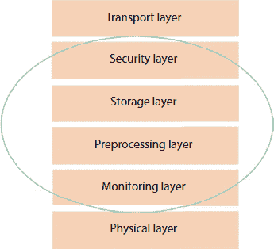
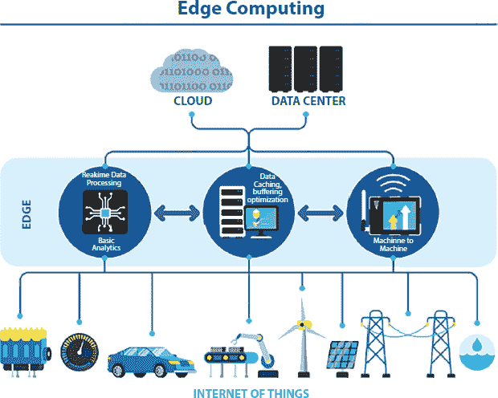

13

物联网与区块链

**普里扬卡·夏尔马**

印度法里达巴德曼 av Rachna 国际研究所和研究学院

**摘要**

物联网（IoT）的概念令人着迷且充满活力，然而物联网最具有挑战性的部分是连接所有物联网工程结构板块的安全环境。区块链是一个保持持续信息记录的数据库。它通常是分散的，这意味着主计算机不负责整个系统。相反，参与节点拥有链式副本。它不断增长——信息记录仅保存在系统中。区块链技术是解决物联网安全问题的失散已久的桥梁。区块链现代化可能是物联网行业的银色护盾。它可以很好地追踪数十亿个连接的设备，这些设备使交易管理和设备间的通信变得容易，从而为物联网机械工程师节省了大量资金。这种挑战性的方法避免了失望，为工作设备构建了更加友好的生态环境。这一部分描述了物联网的历史，当前和未来世界中使用物联网设备的真实研究，各种传感器和执行器，区块链与物联网的结合，边缘计算和区块链分为 6 个部分。

**关键词：**物联网网关，语音控制器，情境分析，奥古斯特智能锁，库里移动机器人

13.1 “物联网”的历史

凯文·阿什顿

（物联网之父）

物联网是一个 16 岁的概念，它承载了一个基本的设备互联理念，这个理念自 20 世纪 70 年代中期以来一直存在。因此，这个概念被命名为“嵌入式互联网”或“集成计算”。第一个“物联网”这个名字是由凯文·阿什顿在 1999 年他在宝洁公司工作时提出的。阿什顿在收购部门工作，他鼓励高级管理层关注另一种令人兴奋的技术，称为射频识别（RFID [46]）。1999 年互联网还很新，而且它是合法的，他把他的演讲叫做“物联网”。

凯文·阿什顿认为射频识别（RFID）是物联网上首先需要的。他推断出所有设备都是“标签”，计算机可以找到、下载和发送。在一定程度上，标记是通过数字识别、代码和二维码等方法完成的。物联网的一个显著优势是库存管理。尽管凯文吸引了一些宝洁公司管理人员的注意，但物联网这个名字在未来十年内并没有引起太多关注。

物联网在 2010 年开始达到顶峰。[23]已经揭示了谷歌街景管理创建 360 张照片，同时从 WiFi 网络中保存大量信息。

在图 13.1 中，y 轴描绘了 2019 年 7 月世界对技术的期望水平以及未来几年的预期，x 轴显示时间，例如深蓝色点显示预计在未来 5 到 10 年内，区块链在客户服务方面的应用[10]。2019 年，推出“繁荣促销技术周期”的市场研究公司 Gartner 发布了一个新特性，“区块链与物联网”列入其列表。

**图 13.1** 2019 年新兴技术炒作周期。

诸如 Forbes、Fast Company 和 Wired 等技术导向杂志已经开始使用物联网作为术语来解释这一现象。简单地说，任何连接到互联网的设备都是物联网。

这包括从移动设备到支持配置到飞行器引擎的一切。医疗设备，如心率监测或在牲畜上安装生物芯片传感器，可以通过网络传输数据。它拥有一个由网络和设备组成的巨大互联网网络。一个戒指，门把手，与你的智能手机相连，为物联网的最新发展提供了一个真实的例子。当门铃响起时，一个响亮的声音传来，它允许你看到某人并与他们交谈。

物联网市场在 2014 年 1 月达到关键时刻，当时谷歌 Nest 宣布收购 232 亿美元。下面的图表显示，“物联网”概念的知名度超过所有其他概念。这幅图显示了未来对物联网设备的兴趣日益增长。## 13.2 物联网设备

物联网设备包括远程传感器、软件、激活器和计算机硬件。它与一个互联网 empowered item 相关联，允许物品之间或人与物品之间无需人工干预即可自动传输信息。它的目的是为来自家庭、工业或商业的人们提供服务。图 13.2 y 轴显示了数十亿个连接设备，x 轴显示了互联网连接设备的逐年统计数据。

图 13.3 展示了与互联网相连的所有事物。就像拥有互联网连接的智能家居，心率等医疗数据，这些数据再次被智能手表捕获，智能手表是一个物联网设备，等等。

1.  谷歌家庭语音控制器

    这是一个智能物联网工具，它使用户能够通过语音了解媒体、灯光、警报、音量控制、室内温度调节和其他许多功能。

    亮点

    1.  a) 谷歌允许用户收听家庭媒体。

    1.  b) 客户控制电视和扬声器。

    1.  c) 可以处理时间和警报。

    1.  d) 它可以远程控制音量和家庭灯光。

    1.  e) 这使客户能够安排他们的一天，并自动完成事情。

1.  亚马逊 Echo Plus 语音控制器

    它是一款著名且值得信赖的物联网设备。它可以播放音乐、打电话、设置闹钟、提问、查看天气、购物记录，以及管理土地和许多其他事物。

    

    **图 13.2** 2025 年物联网市场。

    

    **图 13.3** 未来的物联网设备。

    亮点

    1.  a) 耳机亚马逊 Echo 可以通过连接外部扬声器或耳机播放音乐。

    1.  b) 通过语音命令发送电话和短信的能力。

    1.  c) 亚马逊 Echo 有 6-7 个接收器，具有很好的技术特性，包括噪声消除。即使播放音乐，它也能全方位地听到您的声音。

    1.  d) 它有能力控制定制的智能设备，包括灯光、插座等。

1.  亚马逊 Dash 按钮

    它基本上是一个连接到互联网入口的设备，确保客户不会丢失宝贵的家庭物品，例如苏打水、食物、药品和个人护理、孩子和休闲动物。客户必须是亚马逊 Prime 的成员。

    亮点

    1.  a) 这允许客户快速订购商品，无需记住消息，并且还帮助客户减少寻找所需商品所需的时间。

    1.  b) 亚马逊 Dash 按钮允许客户从知名品牌订购，例如 Bounty、Tide、Cottonley、Glade、Chlorax。

    1.  c) 它在客户允许其他请求之前不会接受新请求，直到预请求完成。

    1.  d) 它是一个强大的物联网产品，旨在使客户的生活更轻松。

1.  奥古斯特门铃摄像头

    这是一个物联网设备，可以让您从任何地方或远离的地方回应您的入口。定期检查您的入口门，甚至完成入口门的变化。

    亮点

    1.  a) 门铃可以与所有奥古斯特智能锁配对，在您不在家的情况下，让访客轻松进入您的家。

    1.  b) 高清提供清晰、全彩的高清视频，即使在晚上也能看清楚。

    1.  c) 它将始终为您打开门并捕捉动态通知前的瞬间。

    1.  d) 免费 24 小时视频录像。

    1.  e) 该过程包括一个快速的安装过程。

1.  奥古斯特智能锁

    这个智能锁已经证明是一种可靠的物联网安全硬件。允许客户从任何位置操作他们的门。这有助于消费者将家中的罪犯远离家人。

    亮点

    1.  a) 进入权限使客户能够了解每个进入和离开您家的人。

    1.  b) 它提供无限数量的数字钥匙，不必担心钥匙被拿走。

    1.  c) 提供关于您的门是否正确关闭的报告。

    1.  d) 它有一个愉悦的开放式自动特性，当客户靠近门口时会自动打开。

    1.  e) 安装简单，与大多数标准室兼容。

1.  Kuri 移动机器人

    它是一个家庭机器人，也是著名的家庭机器人。专门为娱乐而设计，Kuri 与客户交流并拥有每天的清洁会议。

    亮点

    1.  a) Kuri 拥有智能传感器和高清摄像头。

    1.  b) 包括手势怀孕机制和接收器。

    1.  c) 核心是心脏和扬声器的光。

    1.  d) 显示地图包括协调的传感器用于显示和驱动系统。

1.  Belkin WeMo 智能开关

    它使用户能够通过手机或墙上的声音控制家中的灯光。这些协调的开关通过您家的 Wi-Fi 网络提供远程访问灯光——无需参与或中心点。

    亮点

    1.  a) 它配有切割和所需的空白。

    1.  b) 开启/关闭方便，在任何地方按下即可翻转。

    1.  c) 无线标记和夜灯可用。

    1.  d) 支持 WiFi 启动功能。

    1.  e) 安装。非常快速且安装简单。

1.  Footbot 空气质量监测器

    Foot Boat 是一个坚固的 IoT 设备，用于测量环境污染并改善家庭、办公室和室内公共场所的空气质量。这通常会导致理想的结果。

    亮点

    1.  a) 它净化空气污染。

    1.  b) 它保持了适度的湿度和温度。

    1.  c) 一个急需的刷新可以提高更多的注意力和精力。

    1.  d) 提供客户寿命延长支持。

    1.  e) 安装过程快速简单。

1.  Flow 空气污染监测器

    Stream 空气污染是 IoT 市场的一项重大发展。空气质量追踪器和其应用程序在地图上显示所有结果，告诉客户空气质量差且脏。

    亮点

    1.  a) 客户告知客户有关空气质量。

    1.  b) 该产品配备了一个硬化钢制外壳。

    1.  c) 功能性是其身体的一个实用触摸。

    1.  d) R 拥有出色的 RGB LED。

    1.  e) 用户拥有出色的客户管理和简单安装。

1.  Nest 烟雾报警器

    这是一个非常有用的 IoT 工具。它让你的手机思考、交流并警告你家中任何不想要的紧急情况。它自我测试。

    亮点

    1.  a) 客户可以通过电话处理警报，无需额外设备。

    1.  b) 安装简单，可与 iPhone、iPad 或 Android 设备配合使用。

    1.  c) 产品结构看起来很棒。

    1.  d) 它包含绿色、黄色、红色等颜色组合，根据情况与客户沟通。

## 13.3 传感器和执行器

IoT 不仅仅是一个过程，而是各种深入策略的组合。IoT 设备包括处理器、传感器、激活器和手持设备。

传感器必须存储它收集的数据，并谨慎地从中获取有价值的数据。传感器可以是手机，可以测量直到它提供关于其当前状态（内部+气候）的信息。执行器是用于环境变化的设备，例如空气温度控制器。

与物联网框架一起工作

1.  第一部分：传感器和执行器

1.  第二部分：通信

1.  第三部分：人员和流程

1.  第一部分：传感器和执行器**—**它为世界提供了一个先进的传感器系统。地理位置信息包括使用相机和麦克风的 GPS 传感器，以及几乎每个人的眼睛和耳朵，还有从温度变化到脉冲、压力变化的身体部位。图 13.4 给出了使用不同传感器和电脑的示例。

1.  第二部分：通信**—**传感器收集的数据是数字的，并通过网络传输。下面是一个显示连接中使用各种方法的图表？

1.  第三部分：人员和流程**—**物联网设备用于促进人们遵循特定的流程。因此，它们扮演着非常重要的角色。这些网络输入可以整合在双向系统中，结合信息、社区和系统以做出明智的判决。

**图 13.5** 展示了人们可以通过城域网（MAN）、局域网（LAN）或 WiFi 等方式连接到互联网的不同方式。信息收集、展示、通信和信息处理存在许多困难。图 13.6 展示了物联网设备需要个体和程序进行通信，例如通过移动应用程序连接，也可以通过远程监控建立人与人之间的连接。这些物联网设备收集了大量数据，需要弄清楚哪些信息适合他们的情况、流程或存储，以及所需的通信程度。存储、预处理和信息处理可以在远程服务器或边缘系统中进行。图 13.7 展示了一个信息从传感器流向执行器的示例。

**图 13.4** 示例中使用了传感器和执行器（来源：[`s3.amazonaws.com/postscapes/IoT-Harbor-Postscapes-Infographic.pdf`](https://s3.amazonaws.com/postscapes/IoT-Harbor-Postscapes-Infographic.pdf)）。

传感器、执行器、流程服务器和通信系统构成了物联网系统的基础设施。有时，中间件需要一些技术。中间件是连接操作系统或数据库和应用程序的软件，特别是在网络上。中间件可用于连接和管理所有私有的物联网设备。

**图 13.5** 通过网络进行数据共享的连接方式。

**图 13.6** 人员与流程。

**图 13.7** 传感器到执行器的流程。

物联网系统构建

物联网技术没有一个被普遍接受的单一协议。不同的研究者提出了不同的层次。以下图表显示了专家提出的各种层次，有些称之为三步，有些更多，现在一天内被称为五层。

**图 13.8** 物联网系统的架构。

最重要的结构是三维结构[32]。图 13.8 显示，通常物联网有三种架构类型。三层、四层和五层架构。一层包括远程传感器和探测器。下一层包括传感器信息集成框架和简单到复杂的信息交换。在第三层，数据被提供或使用以改进框架[32]。

第一层：意识层

传感器从地球上收集信息并将其转化为有价值的信息。物联网部分正在迅速发展成机械摄像头框架、水位提升、家庭语音控制器、空气质量传感器、儿童观察硬件等等。这些工具收集包括登录时间、速度和使用小时、地理位置洞察等客户信息。由于这些设备产生了大量的信息，快速处理一些信息至关重要，即时间敏感的信息——风险发现、快速事故测量、突然终止等。

第二层：网络

传感器或执行器收集的信息是原始的。这些信息必须被收集并转换为数字无线电供其他用户使用。为此信息处理，使用信息采集系统（DAS 或 DAQ）至关重要。信息收集是信号检测过程，它测量真实状态并将从数字数值复制到计算机模拟的转换。DAS 传感器与系统相连，连接到输出，并进行简单到复杂的转换。网络网关在持续的第三阶段过程中获取集成的数字信息并通过 Wi-Fi、有线 LAN 或互联网进行引导。

第三层：显示

这一层用于向客户提供明确的应用程序服务。当信息被收集、清理和测试时，数据可以添加到服务器中进行分析和在新产品和服务中的使用。

三维蓝图定义了物联网的状态，但研究通常缺乏研究，因为它关注物联网的积极部分。主要可以分为三层，如下所述：

1.  (i) 传输层从有形层传输到触觉层，以及像 RFID、NFC 等系统。

1.  (ii) 中间件层从交通部门存储、调查并形成大量数据。它在下级层中提供了各种应用好处[8]。它使用了诸如信息、分布式计算和大数据模块等许多先进技术。

1.  (iii) 业务层涵盖了整个结构，包括战略、应用和优势，以及消费者安全。上述结构是基础结构的基本结构。智能物联网是基于云计算服务的一种新工程。

## **13.4 云和雾基础工程**

在层的一些特定元素中，信息准备大多数情况下是由云中的计算机完成的。这种云雾状的云计算将云置于中间，应用位于顶部，洞察层位于底部[32]。分布式计算[7]之所以受到保护，是因为它提供了卓越的灵活性和健壮性。工程师可以提供自己的存储工具、软件工具、数据挖掘、人工智能工具和基于云的表示工具。

最近，系统设计有了新的发展，特别是雾计算[27-29]，其中传感器进行信息处理和分析。雾[30]的体系结构提供了一个特定的路径，如图 13.9 所示，包括监控、装载、存储和第一层与最后一层之间的保障。在发展层，可以对传感器数据进行分离、准备和分析。安全层使数据翻译和保证信息完整性和隐私成为可能。在数据发送到云之前，监控和优化发生在系统的边缘。通常在物联网中使用五层设计作为参考。

各种类型的传感器

**图 13.9** 智能物联网网关的雾架构。

图：传感器的广泛类别。

所有物联网系统必须至少有一个传感器来从地球、人那里收集信息。物联网传感器体积小、更便宜，且耗电少。它们可以通过诸如电池容量和运动便捷性等特性来缩小。下面我将解释当前时代使用的不同类型的传感器。

1.  一世。基于移动设备的细胞传感器

    它具有便携式、前瞻性和可变化的传感器。随着手机在人口中的普及，科学家们对利用手机内部传感器开发智能物联网解决方案很感兴趣 [33, 34]。当前手机中还有其他突出的传感器。

    1.  （1）加速度计控制手机的速度和加速度。它总是测量手机运动的三个部分。有几种加速度计 [35]。在机械加速度计中，我们在外壳内有一个地震传感器，通过弹簧与外壳连接。加速度计捕获的信息模型可以用来确定用户的物理活动，例如跑步、行走和骑自行车。

    1.  （2）通过旋转运动获得准确的电话方向。通过地震重量被移除时的变量变化来估计强度。

    1.  （3）相机和接收器是最显著的传感器，因为它们捕捉视觉和声音数据，这些数据可以被分析和处理以获取各种内容数据。

    1.  （4）变焦测距仪识别磁场。它可以用作应用程序的进展，以识别最近的金属。

    1.  （5）GPS（全球定位系统）手机 [31]，对智能应用程序来说是非常重要的数据。这个位置是使用三标准 [36] 获得的。距离是通过至少三个卫星（或便携式 A-GPS 移动塔）和连接来测量的。

    1.  （6）光线传感器获取最大的可用光。它可以用来设置屏幕亮度和其他需要根据光线强度做出特定移动的应用，例如房间内的灯光可以被控制。

    1.  （7）接近传感器使用了红外（IR）LED [25] 来发射辐射。由于时间区分，我们可以计算出距离。例如，我们能够利用它来判断通话时电话是否靠近面部。

    其他手机，如三星 S4，包含温度计、气压计和湿度传感器来测量温度、环境压力和湿度。该应用程序还与快速问答配合使用，以告诉学生他们的感受。这些数据对于评估焦虑感、公共活动、行为和学生的尝试行为非常有帮助。

    McClernan 和 Chaudhry [37] 开发的另一个应用是使用与用户吸烟有关的内容数据，例如用户的吸烟者的存在、位置和相关活动。传感器提供与客户行为、位置、视觉图像和周围声音相关的数据。智能手机传感器用于各种人类活动（参见 Ref. [38]）以及改善人类健康。

1.  二世。治疗传感器

    物联网对于医疗应用非常有帮助。我们可以使用传感器，它们可以测量和监控人体内的不同临床界限 [39]。这些项目可以在医院内外监控理解健康。后来，他们可以持续向医生、家庭成员或患者提供反馈。McGrath 和 Scaniel [40] 详细描述了身体用来监控人类健康的不同概念。 图 13.10 的智能手表和健身追踪器包含传感器，是物联网设备的非常好例子。

    图 13.11 展示了一个可以植入皮肤的未来物联网设备。市场上有很多可用的检测设备。它们配备了可以测量不同界限的临床传感器，例如脉搏、心率、血压、体温、呼吸率和血糖水平 [41]。该套装包括智能手表、围巾、监控扣和智能衣物。

    

    **图 13.10** 智能手表和健身追踪器（来源：[`www.pebble.com/`](https://www.pebble.com/)）。

    

    **图 13.11** 嵌入式皮肤贴片（来源：MC10 电子）。

    另一个壮观的 IoT 设备是监测有希望的皮肤切口。守卫线就像文身。它们很容易拉动和使用，非常经济。这些患者可以佩戴这些点数几天，这样重要的健康界限就可以持续观察 [42]。这些斑点可以像任何文身一样涂抹在皮肤上，如图 图 13.5 所示。

    例如，脉搏取决于具体情境。如果是这样，我们就不能打破不规则的心跳。因此，我们需要合并来自不同传感器的信息以进行适当的合规。 图 13.12 展示了一个名为 Brain sensing headband 的 IoT 设备，内置了神经传感器。

1.  III. 神经传感器

    理解大脑中的信号、提供大脑状态并训练我们更好地关注和集中注意力是可能的。这被称为神经反馈 [43]。

    创新曾经思考过称为 EEG（脑电图）的脑信号。大脑中的神经元通过电子方式传递，并产生可以用电波测量的电子场。大脑效应可以根据频率分为 alpha、beta、gamma、theta 和 delta 波。神经反馈可以持续获得，可以用来训练大脑集中注意力，更好地关注事物，管理压力，并拥有更好的精神生活。

    

    **图 13.12** 带有内置神经传感器的脑感知头带（来源：[`www.choosemuse.com`](http://www.choosemuse.com)）。

1.  IV. 常见和生态传感器

    常见的传感器用于捕捉界面上的界限，例如温度、湿度、压力、水污染和空气污染。温度和压力界限可能可以通过仪器进行预测。空气质量可能通过检测空气中重要成分的存在来衡量（参见 Shekhar *et al.* [44]）。

    物质传感器用于识别化学和有机材料。这些传感器具有定位组件和转换器。E-鼻和 E-舌是分别通过嗅觉和味觉来检测化合物的策略[45]。电子鼻和电子舌中有各种各样的物质传感器，它们与测试识别软件相兼容。鼻子和舌头内部的传感器产生复杂的信息，然后可以通过设计识别来分析原因。

    这些传感器可以用于监测智能城市中的污染水平，[1] 以及智能厨房中食物质量的监测、食品检测和购买过程中的农产品质量监测。

1.  V. 射频识别（RFID）

    这是一种分析方法，其中 RFID 标签（小型无线电线芯片）传达被 RFID 读取的信息。数据的传输是通过标签完成的，它通过无线电波发送数据。同样的原理也适用于标准化标签技术。与传统的标准化标签不同，这不需要标签和被研究对象之间有视觉联系，甚至在做任务时也可以避免。RFID 的覆盖范围随尺寸变化。它可以达到几米高。

    有两种 RFID 标签：动态和分离式。动态标签有一个力量源，而休眠标签没有力量源。分离式标签吸引活力到由读取器传递的电磁波中，因此成本较低且使用寿命更长[47, 48]。

    RFID 技术被广泛应用于多种用途，包括供应链管理、访问控制、验证和产品追踪。RFID 被添加到产品中以跟踪标签，当物品通过读取器时，读取器需要记录其质量。因此，产品生产可以被追踪，RFID 充当智能产品的搜索引擎。

    尺寸较小的芯片放在车辆的前面。当车辆到达被研究对象的桶时，它会读取标记信息并判断它是否是授权的车辆。RFID 卡片发给人们，由 RFID 读取器识别，并相应地给予准入。

执行器类型

1.  Ⅰ. 压力驱动执行器

    液压执行器包括一个室或通道，它利用液压动力进行机械活动。机械发展受限于线性、旋转或摇摆。液压执行器产生大量的能量，因为液体几乎是可压缩的。这种方法的优点是它的速度有限。

1.  II. 气动执行器

    气动执行器允许通过小的压力变化产生更多的能力。一个气动执行器将真空或压缩空气转换为垂直或旋转运动的高压。由于它可以在启动和停止时立即做出反应，所以在储存时不需要储存电源。阀门通常利用这种力量移动气流层以影响阀门流量。

1.  III. 电动执行器

    电路维修人员可以从多个角度给予动力/扭矩以实施行动。电子硬件被用来驱动电机，将电动机转换为发动机扭矩。另一种选择是电动液压执行器，在这种执行器中，电动机始终处于主导地位，但它还给使用液压驱动的萨缪尔提供了光明的前景，该萨缪尔被用来将启动能力传递到柴油机/水力机器。

1.  IV. 扭转和最小化的聚合物或过度缠绕的聚合物执行器

    这种执行器是一种可以转换为电能的聚合物。 [专家] TCP 主宰就像一个弹簧。TCP 激活剂通常由银包尼龙制成。TCP 激活剂也可以由其他电镀材料制成，例如金。TCP 执行器必须装载以保持肌肉灵活。

1.  V. 温热或吸引型执行器

    执行器可以通过在商业应用中使用的固态材料中使用热或磁力来分离。热作用可以通过热量或通过焦耳效应的热量来激发，并且是小型、轻便、节能和高性能的。激活器使用成型记忆，例如形状记忆合金（SMAs）或磁性形状记忆合金（MSMAs）。

1.  VI. 机械执行器

    一个机械机器试图通过将一种特定的运动，例如旋转运动，转换成另一种线条运动来产生运动。这些执行器的效果取决于齿轮和导轨或辅助组件的组合，例如滑轮和链条。

1.  VII. 精密 3D 执行器

    装饰、自由式冻结和掩模光刻。然而，这些过程需要更长的时间来实现手持设备、后处理/组装和握持上的运动。为了避免传统运动形式的普遍和繁琐部分，研究人员已经找到了一种适当的生产策略，用于成功整合柔软激活器。因此，通过快速原型方法，例如 3D 打印，实现集中柔软组织框架，以减少结构与使用之间的差距，使过程更快、更经济、更简单。

    例如，我们可以考虑一个拥有许多传感器和激活器的智能家居系统。激活器用于警报或提醒，同时它们还控制家庭的温度（通过恒温器）。轮询分发的一个例子用于控制/锁定门，开关灯/其他电子设备，并远程控制。

    在覆盖了几乎所有的传感器和激活器之后，将这些传感器和激活器在将物联网与区块链结合时如何使用将非常有趣。

## **13.5 区块链与物联网**

区块链是一个比互联网更大的系统。将区块链与物联网结合，您就在互联网上拥有两个伟大的系统，它们出于某些原因需要彼此。区块链被构建为包括交易和通信的应用程序的基石。这可能包括智能合约（当达到特定规则时，例如根据产品或环境条件，智能客户合同会自动生成）或其他应用。

1.  A. 工程可以分为六个独特的部分：

    1.  1. 无线传感器网络：远程传感器阵列是一种通信组织，它允许与低功耗和轻量级预设的应用进行有限的交互。同样，属于远程传感器阵列的 IoT 设备在协调、内存和/或电源访问能力方面是受限的。该技术的一个要求是所有设备都应该在区块链组织中显著区分。公开密钥生成器可以解决一个难题，该难题产生大量足够随机的数字。通常，使用现有的 IoT 加密技术会自动为所有设备生成一个公开密钥。因此，实施加密将确保有多个标识符。实际上，现有的 IoT 通信标准，例如 CoAP [12] 已经通过 DTLS [13] 支持安全通道。

    1.  2. 管理者：管理员是负责处理许多物联网设备入口控制权限的主体。通常，管理员在我们的体系中被视为轻量级的鼻祖。轻量级设备不会存储区块链数据或保护区块链交易，就像矿工一样。因此，被淘汰的设备可以在不对其硬件禁用的情况下成为我们体系中的管理员。而且，采用这种策略的管理员不需要持续连接到区块链网络，这有助于减少他们的硬件资源。任何组织都可以注册为管理员。然而，注册为物联网设备的设备必须在管理员的控制下注册。此外，系统中注册的所有物联网设备至少必须有一个注册的管理员。此外，没有人能够处理这些设备。一个注册的物联网设备可以同时被多个管理员拥有。在管理员的控制下注册物联网服务后，管理员可以设定某些入口控制权限。

    1.  3. 代理节点：代理是一个专门负责我们体系中智能合约大部分的区块链属性工程师。代理在入口控制系统的生命周期内拥有智能合约。当智能合约在区块链网络上被采纳时，代理节点获得一个地址，表示智能合约在区块链网络内。为了与智能合约互动，区块链网络中的所有节点都需要知道这个智能合约的地址。

    1.  4. 智能合约：入口控制系统由一个智能合约中定义的功能管理。这个智能合约是独一无二的，不能从系统中移除。因此，入口管理系统中允许的所有活动都在智能合约中定义，并通过区块链交易激活。当通过交易启动交易时，矿工会将交易的详细信息在全球范围内保持可用。智能合约及其活动也在全球范围内可用。此外，应注意，只有管理员能够咨询智能合约，在系统中定义新策略。

    1.  5. 区块链网络：区块链系统可以是私有的，也可以是公开的区块链网络。私有区块链是可以被任何人阅读，但只能由私人领域编写。系统中的矿工通过允许交易和存储区块链的副本来帮助保持系统的安全和稳定。节点可以使用区块链接口存储和访问特定设备的全球访问控制策略。这些数据是完全可用的，并且是精心设计的。

    1.  6. 中心管理：由于在 CPU、内存和电池方面存在严重限制，物联网设备不能成为区块链网络的一部分。这种障碍限制了物联网设备成为区块链网络的一部分。成为区块链网络的一部分意味着需要保存你的区块链的一个副本和对系统事件的跟踪。尽管存在不存储所有区块链数据集的轻量级解决方案，并且依赖于其他中心[14]，但这些基本的解决方案仍然超过了大多数物联网设备。因此，在设计中最好使用一个称为管理中心的中心。管理点是一种将嵌入在 CoAP 消息中的物联网设备数据解码为区块链中心理解的 JSON-RPC 消息的方法。管理点直接与区块链中心关联，例如，一个端口。许多传感器系统可以与管理控制中心关联以实现系统管理目标，其他中心管理区域也可以与相同的区块链中心关联。物联网设备将能够通过管理中心请求访问区块中的数据。中心管理区域不能要求设备。这样的设备需要优越的处理能力，才能同时从物联网设备处理多个应用程序。在最简单的情况下，其中验证不是必需的，任何物联网设备都可以直接与任何控制点关联并访问区块链网络。然而，通常需要访问控制。在这种情况下，物联网设备将能够与特定的管理中心关联。在物联网设备安装在系统中后，该设备的区域管理员应该将关于该物品验证的具体信息通知到特定的管理中心。

物联网是一个有吸引力的发展计划，提供了无限的好处，但当前的物联网工程技术有许多缺点。表格展示了区块链与物联网之间的比较。它具有无限的好处，并且采用物联网赋能的方法可以解决许多问题，特别是在安全性方面。表 13.1 展示了基于所提到的各种参数，两种技术区块链和物联网之间的区别。

分割、自由和值得信赖的区块链能力使其成为建立物联网安排的合适选择。物联网安全不仅仅是保护敏感信息。此外，区块链技术被认为是解决物联网中的安全和信任问题的最佳方案。它可以用来追踪数百万台设备，授权设备间进行交易和通信，这对于行业工程师来说考虑了关键的储备资金[18]。

在物联网网络中；区块链可以存储智能设备的一致记录。这个特性允许智能设备在没有集中专家的情况下自动操作[19]。因此，区块链将开启一系列在没有它们的情况下难以实现或困难的物联网环境。区块链的一个激动人心的功能是能够控制一个记录，并对系统上发生的所有交易施加精确、可靠的限制。

**表 13.1** 区块链与物联网之间的区别。

| **基础** | **区块链** | **物联网** |
| --- | --- | --- |
| 组织形式 | 非集中化 | 集中化 |
| 资源 | 资源被充分利用 | 资源受限 |
| 延迟 | 区块挖掘耗时较长 | 需要低延迟 |
| 可扩展性 | 大网络扩展性差。 | 包含大量设备 |
| 带宽 | 高带宽消耗 | 物联网设备具有有限的带宽和资源 |
| 安全性 | 安全性更好 | 安全性是物联网面临的最大挑战之一。 |
| 隐私 | 确保参与节点的隐私 | 缺乏隐私 |

区块链和物联网的优势

1.  开放性：所有成员都可以看到所有的活动和所有的区块，因为每个成员都有自己的内容。该活动的内容由成员的私钥保护[16]，所以尽管所有成员都可以看到它，但他们是被保证的。物联网是一个惊人的框架，其中每个连接的设备可以共享信息并同时保护客户的隐私。

1.  职位分组：大多数成员必须将一个交易所锁定并为其提供补充的流通记录。没有任何单一的权威可以肯定一个交易所或为其设定明确的指导方针。由于系统中的大多数成员都需要对交易所达成一致，因此存在大量的信任通道[21]。

1.  稳定性：每个区域都有记录的副本，包含在系统上进行的所有操作。无论一个中心节点受到限制，其他中心节点也会保持区块链[22]。在物联网的每个点上信息的重复将提高数据共享的预设。

1.  安全性：区块链只能为物联网中涉及不同设备和大量物品的疑问方提供安全的系统[11]。

1.  速度：区块链交易在几分钟内分散到系统中，并在白天任何时间准备就绪[15]。

1.  成本节约：现有的规划越来越昂贵，因为与统一发展相关的巨大基础设施和支持成本、广阔的牧场和传输通信硬件。

1.  不作为：拥有一个可靠记录是区块链现代化的关键优势之一。群体中交付的调整必须由位置频率来验证。因此，切换无法被有效地更改 [12]。物联网信息的可靠记录将提高安全性和保护性，这对于这项技术和任何新技术来说都是最大的挑战。

1.  隐私性：买家和卖家使用私密且独特的位置号码来保持其身份的匿名。这一特性通常受到批评，因为它正在增加数字货币在非法在线市场的使用。尽管如此，当用于不同目的时，例如组件自治基金会 [13, 19]，它可能被视为一种优势。

毫无疑问，整合区块链将带来许多好处。区块链现代化绝对不是一个完美无缺的模型，它有缺陷和问题，这些问题如下所述：

1.  可扩展性：区块链的可扩展性问题可能导致数字货币的最终财富模糊不清。随着系统中节点数量的增加，区块链的规模效应减弱。基本问题是物联网系统依赖于包含大量节点 [21]。

1.  能源：效率和系统包含各种设备，总体的计算能力各不相同，不是所有设备都能以所需的速度使用相同的算法 [14, 20]。

1.  容量：区块链的主要优势是需要中心服务器来存储交易和设备 ID，尽管记录必须存储在节点本身上 [24]。随着时间的推移，分布式记录的大小将随着节点数量的增加而增加。

1.  技能缺乏：区块链技术尚新。很少有人对区块链，特别是银行方面的知识和技能有深入了解。在一些机构中，对区块链功能的理解存在不足 [6]。

1.  合法性与协作：无需法律代码就能与来自各种国家的人员接口，这是设计师和专家合作的主要方面。这一挑战将是企业采用区块链的重要优势之一 [26]。

1.  命名与获取：区块链技术并非专为物联网设计，意味着节点并未设计为在组织内相互可用。该形式是比特币 [9] 应用的任何地方，其中其他“发送者”的 IP 地址被插入比特币客户端内部，并由目的地用来创建网络拓扑。在物联网边缘计算中，这将出现在画面中，如下所述。

## 13.6 边缘计算

物联网的扩展和远程系统的广泛渗透，边缘设备数量和产生的数据迅速增长。根据国际数据公司（IDC）[5]的数据，全球信息将达到 200 泽字节（ZB），到 2025 年，80%的物联网信息将在系统边缘进行处理。数据中心还预测，到 2025 年将有 1500 亿台设备联网。对于这些情况，基于云的信息模式不足以处理边缘生成的数据。通过统一模型将所有信息传输到云服务器农场，并通过系统发送其巨大容量来解决计算机问题和节省开支，从而提供通过云产生的经济效益，然而，传统的分布式计算存在一些缺陷。

1.  延迟：物联网环境中的应用有更大的持续前提条件。在一个分布式表示中，应用程序将信息发送到服务器农场并获取输入，这增加了基础架构。例如，快速车辆需要几秒钟的反应时间。

1.  带宽：将边缘设备生成的大量信息逐渐传输到云端将对信息传输非常有利。例如，波音 787 产生的信息过多；卫星与飞机之间的传输速度不足，无法支持连续配置[2]。

1.  可用性：由于大多数互联网服务都转移到云端，通过组织访问已成为当今的常见活动。例如，移动设备熟悉的语音管理，如果管理不可用，Siri 就会失效。对云服务提供商来说，进行一次大规模测试是保持 24×7 服务承诺的唯一方式。

1.  电源：数据中心消耗大量能源。根据 Sverdlik[1]的报道，美国服务器启动的能源消耗预计到 2020 年将增长 4%。

1.  安全和隐私：大量住宅规划信息与客户生活紧密相关。例如，安装在家中的摄像头将视频信息从房屋发送到云，将增加获取客户个人信息的风险。随着《通用数据保护条例》（GDPR）[4]的实施，信息保护和问题对分布式计算组织来说变得越来越重要。

这些困难已经转移到了顶峰，需要商业领域处理数据。自 2014 年以来，随着降低当前费用和广播能力的快速改进，指向云计算服务器的首要限制，便利性扩大了，数据安全的确认。图 13.13 展示了云计算如何也连接到边缘计算的三层视图[3]，第一层包含云服务和数据中心，第二层包含边缘或处理，第三层包含物联网设备。

**图 13.13** 云计算与物联网的关系（来源：[`innovationatwork.ieee.org/real-life-edge-computing-use-cases/`](https://innovationatwork.ieee.org/real-life-edge-computing-use-cases/)）。

1.  A. 边缘计算基础

    1.  1. 解释：边缘计算机是另一个世界观，其中边缘信息服务在网络上，推动物联网的兴起。注册边缘导致为物联网服务的云管理带来优势的技术创新。

        互联网的边缘是一个好概念。例如自动驾驶和医疗服务具有更大的竞争力。它对于违反、组织和分散从设备中智能传感器数据具有 bandwidth 是有益的。

    1.  2. 功能：边缘计算机有两个通信方式：一个是设备到云（上游），另一个是云到设备（下游）。设备被认为是数据生产者。边缘计算准备让个人电脑处理数据堆积、资金、准备，就像从云到客户端传播征求信息和解释服务。边缘计算的功能是为了恰当地满足安全、固有质量和安全保险等方面的需求。

    1.  3. 三层边缘计算机模型：通过分析计算机结构的具体状态，可以分解为三个层次模型：云、边缘和物联网。最基本的层次是物联网、无人机、传感器和家用设备以及现代互联网。不同的连接协议用于将物联网与下一阶段——边缘连接起来。例如，通过 4G 移动网络的边缘与家庭传感器可以通过 Wi-Fi 辅助全程对话。物联网和边缘通常具有较低的功耗特性和较短的距离，而边缘与云之间的距离则有更高的产出和重要的速度。以太网和 5G 是边缘与云之间首选的连接选项。图 13.14 展示了一个三层边缘计算模型，其中三个层次分别是物联网、边缘和云。

    1.  4. 边缘与云：边缘计算和分布式计算并不是相互补充的关系。随着卓越设备的流行和现代虚拟化及云计算技术的快速发展，计算压力已经转移到边缘，揭示了分布式计算的概念。边缘需要注册权限和不寻常的支持来进行分布式计算，并且需要一个计算机模型来处理大量数据。尽管大量信息准备在组织的边缘，但它并没有存储到云端，这减轻了传输网络的负载和服务器的能耗。信息创作者管理的信息不需要分布式计算场所的响应能力，这使得基础更加稳固，提高了服务的响应能力。最后，计算机存储客户担忧设备的安全数据，而不是下载它们，控制了信息滥用的风险，确保了防御和保护。

        **图 13.14**（#figureanchor13-14）三层边缘计算模型。

## **13.7 上下文分析**

区块链赋予物联网设备力量，以提高安全性并传达清晰的思维。根据 IDC 的数据，到 2020 年，将有 25%的物联网设备采用基于区块链的安排。[17] 区块链为物联网设备及其应用提供了全新的领域。例如，德意志银行和汇丰银行等金融机构正在使用区块链技术。

物联网正在带来许多商机，推动着美好的选择。如今，设备都配备了传感器，将信息传输到云端。将这些创新结合在一起可以使框架运行得更好。**图 13.15**（#figure15）更名为“区块链改进加州食品供应链和物流”，图中显示，通过在运输过程中使用区块链和物联网设备，可以节省大量的时间。

这里有一些区块链企业实际应用的真实案例，说明了将物联网与区块链结合对业务模式产生了巨大影响，具体如下：

**图 13.15**（#figureanchor13-15）加州食品供应链和物流的变革。

1.  供应链和物流——全球供应链包括不同的合作伙伴，如虚拟提供商和交换机等，使得从开始到结束的交付延迟成为终极挑战。

    这些方法使企业能够使物联网设备在发布过程中进行旅行。由于对链的限制，物联网和区块链的结合可以提高可靠性。传感器信息被存储在区块链上。

    全球状态食品（GSF）是一家多学科供应商，以生产食品商品而闻名。帮助 150,000 家餐厅，GSF 专注于制作和交付优质产品。

    全球状态食品（GSF）正在与 IBM 合作，利用区块链和物联网改进业务流程。区块链上的机密信息确保问题在造成严重问题之前自动得到解决和详细说明。它帮助 GSF 建立了一个不同合作伙伴之间改进责任感和透明度的独特、安全和简单的记录。

    商品运输中的一个广泛行业问题是缺乏沟通，影响运输生成。区块链通过其提供共享信息的能力，是解决这一问题的最简单答案。思路是维护发送到智能日志区块链的通讯，使用物联网跟踪它们，并使用伟大的协议完成任务，从而将伟大的需求和联系转移到商业中。图 13.16 显示了智能日志（基于区块链和物联网的平台）和以前的日志系统之间的区别。

来自四个不同国家的六个组织目前正在处理该项目。这里有一个物联网和区块链展示多个组织联合扩展技术的例子。

**图 13.16** Smartlog。

1.  汽车行业

    图 13.17 显示了如何使用基于区块链和物联网的 Netobjex 平台引入智能停车。数字化现在作为一个重要的需求而可用。汽车行业使用配备物联网的传感器来发展车辆。将物联网驱动的车辆与全面的系统连接允许多个客户高效地交换重要数据。汽车行业是区块链和物联网的一个充满活力的例子，其中集成的技术可以颠覆自动车辆的支付和自动交通控制。

    NetObjex 提出了一项利用物联网 (IoT) 和区块链的敏锐安排。这种融合带来了一种寻找停车位和利用加密钱包存储支付的方法。物联网传感器勾勒出支出轮廓，而收费则正确地从加密钱包中发生。

1.  智能家居

    智能物联网 (IoT) 设备在我们的生活中扮演着重要的角色。区块链和物联网开发了远程在手机上管理的房屋防御体系。物联网设备集成的数据交换方式没有安全评估和数据所有权。区块链可以通过解释安全问题并移除已内置的系统来提升智能家居的水平。

    

    **图 13.17** 使用 NetObjex 重塑汽车行业。

    澳大利亚电信公司 TELSTRA 正在努力提高家庭的安全性。Telstra，澳大利亚媒体广播和媒体协会打算实施智能家居措施。已经衡量了区块链和生物识别安全，以确保没有人可以篡改智能设备上捕获的数据。

    面部和语音识别以及生物识别等应用程序存储在区块链上以确保安全。信息放置在区块链上后，无法进行修改，并且只向合适的人显示。 图 13.18 展示了共享经济业务是如何通过 slock-it（一个基于区块链的平台）来完成的。

1.  金融共享

    金融共享已经成为全球范围内普遍接受的理念。通过完美地共享资产，区块链可以带来更多的收益。

    爱彼迎正在利用物联网和区块链技术直接应用该方法。区块链的新颖性用于分享物联网设备的亮点或容量。

    他们打算建立一个通用共享网络（USN），以创建一个安全的在线设备市场。USN 提供的所有东西都是租赁或共享或以无责任的方式出售的。

    

    **图 13.18** 共享经济业务-slock 它的转型。

    明亮的协议确保了信息的保密性和透明度，通过控制对数据的访问权限。

1.  药品零售行业

    药品领域中假药的记录每天都在增加。制药行业负责生产和交付药品，因此跟踪完整的药品业务是困难的。区块链技术可以帮助监控药品从源头到目的地的交付。

    **图 13.19** 展示了 Mediledger 如何通过引入区块链改变药品行业。Mediledger 是利用物联网和区块链的公司之一，旨在跟踪专业批准药品的合理差异。存储在分布式账本上的数据对制造商、批发商和客户都是通用的，这些数据参与了转换流程。

1.  农业

    为不断增长的人口种植各种食物，同时减少对环境的影响，并确保供应链的透明度，这对于提高消费者满意度至关重要。

    物联网与区块链的融合有可能重塑食品链行业。在农场安装的物联网传感器的帮助下，它们直接将信息发送到区块链，从而显著改善自然排序。

    

    **图 13.19** 药品行业游戏规则改变者——Mediledger。

    图 13.20 展示了帕沃如何通过引入区块链改变了农业行业的观点。帕沃利用物联网和区块链带来了无与伦比的真实性。物联网收集信息，培养设备装置被放置在广场上。此外，帕沃允许牧场主通过向前协议来转换作物，这可以防止牧场主在收获后等待付款。

1.  利用物联网区块链进行放射性剂量学

    Clinitraq 是一家医疗保健组织，目前正在使用 Net Objex IoT-Blockchain 平台开发剂量计。他们确定其接受的辐射程度。目前可能需要 40-60 天才能提供结果。对于在卫生或科学领域工作的人来说，这最终消除了辐射的风险。

1.  区块链生物识别

    澳大利亚电信公司 Telstra 利用与物联网结合的区块链使其家庭安全可靠。Telstra 通过转移生物特征或面部识别提供安全的网络。

1.  通过自动化计划提高效率

    范多普是一家财产管理组织（FC），在荷兰确认了 20,000 项资产。该组织负责空气、照明和供暖系统的保护。时间序列利用人工智能和 Mendix 的转换提供项目管理系统计划。

    

    **图 13.20** 农业转型——帕沃。

    物联网设计师目前能够追踪各种系统在其结构中的移动，并通知范多普专家是否存在。时间序列自动改变计划选项，并与范多普一起，使更改效率提高了 30%。

1.  蜜蜂食品在物联网区块链上

    该公司目前正在研究区块链的运用。科斯塔将通过物联网标记船只和鱼类，以便跟踪它们。该协会将利用物联网和区块链开发一个应用程序，以便渔民之间的同步。

1.  区块链和物联网助力棕榈油行业

    艾皮卡尔，印尼最大的棕榈油出口商之一，认为物联网和区块链可以改善与棕榈油行业的树木生产和投资相关的信息保护过程。使用物联网技术的公司可以实现该行业的质量和利润。

1.  区块链和物联网消除水资源浪费

    它所能引入的水量可以达到每年一万亿升。Aquai 制造了水传感器，跟踪您的用水量，并自动保护水井。Aquai 计划适应与泄漏引起的水损害相关的各种服务。

1.  使用区块链和物联网来量化河流污染。水质检测可能是一个昂贵且繁琐的过程，Libelium 和 Airalab 合作提供了一种成本更低的解决方案。"伏尔加河上的自动化"是一种建议，利用物联网和区块链的自动化，现代化收集河流污染水平。这种方法收集了伏尔加河库尔斯堡水库的水研究信息，并将其发送到以太坊区块链。Libelium 水传感器和 Airalab 的结合，赋予了 Robonomics 平台力量。

    许多企业已经开始研究物联网和区块链框架的潜力，以提高效率和自动化。在当前场景下，大量的关注点都集中在物联网的安全性上，来自学术界和商业协会的关注。

## **13.8 区块链和物联网的命运**

物联网将在我们社会的未来扮演一个重要的角色，在军事和非军事领域，如无人机等。物联网系统的本质，如在军事领域，潜在的物联网威胁受到质疑，活动（s）的发展必须是有计划的。

公开可用的物联网信息不足，并且缺乏用于其防御研究的代理数据库。研究如何利用区块链作为社区面向的理由，确保其他物联网和相关系统（例如数字身份框架）。

## 参考文献

1. *美国所有数据中心消耗的能源量*，数据中心知识，美国加利福尼亚州旧金山，2016 年。

2. Shi, W., Pallis, G., Xu, Z., 边缘计算[扫描问题]，在：*IEEE 会议论文集*，2019 年 8 月，第 107 卷，第 8 期，1474-1481 页。

3. Shi, W., Cao, J., Zhang, Q., Li, Y., Xu, L., 边缘计算：愿景和挑战。《边缘事物杂志》，2016 年 10 月，第 3 卷，第 5 期，637-646 页。

4. Voigt, P. 和 von dem Bussche, A., 欧盟通用数据保护条例（GDPR），在：*实用指南*，第 1 版，Springer，瑞士楚格，2017 年。

5. Zwolenski, M. 和 Weatherill, L., 数字宇宙：丰富的数据和物联网价值的增加。*澳大利亚电信与数字经济学杂志*，2014, 2(3), 47。

6. Karafiloski, E., 针对大数据挑战的区块链解决方案：文献综述，在：*2017 年 IEEE EUROCON—第 17 届智能技术国际会议*，2017 年 7 月，第 6-8 页。

7. Stanciu, A., 基于边缘计算的区块链分布式控制系统，在：*第 21 届控制系统和计算机科学区块链国际会议*，2017 年，第 667-671 页。

8. Banafa, A., 物联网与区块链融合：益处与挑战。《IEEE 物联网新闻》，2017 年[在线]。可在：[`iot.ieee.org/newsletter/january-2017/iot-and-blockchain-convergence-benefits-and-challenges.html`](http://iot.ieee.org/newsletter/january-2017/iot-and-blockchain-convergence-benefits-and-challenges.html)查阅，2017 年。

9. Ziegeldorf, J.H., Grossmann, F., Henze, M., Inden, N., Wehrle, K., CoinParty: 安全多方混合比特币，2015 年 8 月*第五届 ACM 数据和应用安全与隐私会议—CODASPY ‘15*，第 75-86 页。

10. Jentzsch, C.，《去中心化自治组织自动化治理》，白皮书，第 1-30 页，2016 年。

11. Dorri, A., Kanhere, S.S., Jurdak, R., 物联网中的区块链：挑战与解决方案，arXiv1608.05187 [cs]，2016 年 8 月。

12. Stallings, W., 物联网：网络和安全架构。《互联网协议杂志》，18, 4, 第 2-24 页，2015 年。

13. Torkaman, A. 和 Seyyedi, M.A., 分析物联网参考架构模型。《国际计算机科学软件工程杂志》，2016 年。

14. 思科公司，《物联网参考模型》，白皮书，第 1-12 页，2014 年。

15. Kshetri, N.，《区块链能加强物联网吗？》，第 68-72 页，IEEE 计算机协会，2017 年 8 月。[`ieeexplore.ieee.org/document/8012302`](https://ieeexplore.ieee.org/document/8012302)

16. Ahram, T., Sargolzaei, A., Sargolzaei, S., Daniels, J., Amaba, B., 区块链技术创新.*2017 IEEE 技术工程管理会议.*，2016 年，第 137-141 页，2017 年。

17. Daza, V., Di Pietro, R., Klimek, I., Signorini, M., CONNECT: 为基于区块链的物联网服务提供上下文名称发现的 CONtextual NamE disCovery。*IEEE 国际通信会议*，2017 年。

18. Atlam, H.F., Alenezi, A., Walters, R.J., Wills, G.B., Daniel, J., 开发物联网的自适应基于风险的访问控制模型，2017 年 IEEE 物联网（iThings）国际会议和 IEEE 绿色计算与通信（GreenCom）会议和 IEEE 网络物理社会计算（CPSCom）会议和 IEEE 智能数据（SmartData）会议，2017 年 6 月，第 655-661 页。

19. Atlam, H.F., Alenezi, A., Alharthi, A., Walters, R., Wills, G., 云计算与物联网的集成：挑战与开放性问题，2017 年 IEEE 物联网（iThings）国际会议和 IEEE 绿色计算与通信（GreenCom）会议和 IEEE 网络物理社会计算（CPSCom）会议和 IEEE 智能数据（SmartData）会议，2017 年 6 月，第 670-675 页。

20. Atlam, H.F., Alenezi, A., Hussein, R.K., Wills, G.B., 物联网自适应基于风险的访问控制模型的验证。《计算机网络信息安全杂志》，10, 1 月，第 26-35 页，2018 年。

21. Samaniego, M. 和 Deters, R., 物联网的区块链即服务（BaaS）。*2016 IEEE 国际物联网会议 IEEE 绿色计算与通信会议 IEEE 网络物理社会计算会议 IEEE 智能数据会议*，2016 年，第 433-436 页。

22. 王, Q., 朱, X., 倪, Y., 顾, L., 朱, H., 区块链在物联网和工业物联网中的应用：综述，10, 100081, 2020 年 6 月。[`www.sciencedirect.com/science/journal/25426605/10/supp/C`](https://www.sciencedirect.com/science/journal/25426605/10/supp/C)

23.

24. Alenezi, A., Zulkipli, N.H.N., Atlam, H.F., Walters, R.J., Wills, G.B., 云取证准备对安全的影响，在：*第七界国际云计算与服务科学会议（CLOSER 2017）*，第 511-517 页，2017 年。

25. Atlam, H.F., Attiya, G., El-Fishawy, N., 在 CBIR 系统中集成颜色和纹理特征.*国际期刊 48 与物联网：利益、挑战和未来方向*.

26. Asatryan, D., 富达投资公司 CEO 提出的区块链采用的四个挑战，2017 年。

27. Bonomi, F., Milito, R., Natarajan, P., Zhu, J., 雾计算：物联网和分析的平台，在：*大数据与物联网：智能环境的道路图*，第 169-186 页，Springer，柏林，德国，2014 年。

28. Bonomi, F., Milito, R., Zhu, J., Addepalli, S., 雾计算及其在物联网中的作用，在：*移动云计算第一次 ACM MCC 研讨会*，第 13-16 页，2012 年。

29. Stojmenovic, I. 和 Wen, S., 雾计算范式：场景和安全问题，在：*联邦会议计算机科学和信息系统（FedCSIS ‘14

30. Aazam, M. and Huh, E.-N., 基于雾计算和智能网关的云计算，在：*第二届 IEEE 未来互联网物联网与云计算会议（FiCloud ‘14）*，巴塞罗那，西班牙，2014 年 8 月，第 464-470 页。

31. Schmidt, A. and Van Laerhoven, K., 如何构建智能家电？* IEEE 个人通信.*，8, 4, 66-71，2001 年。

32. Gubbi, J., Buyya, R., Marusic, S., Palaniswami, M., 物联网（IoT）：一个愿景、架构要素和未来方向.*未来生成计算系统.*，29, 7, 1645-1660，2013 年。

33. Lane, N.D., Miluzzo, E., Lu, H., Peebles, D., Choudhury, T., Campbell, A.T., 移动电话感测器综述.* IEEE 通信杂志.*，48, 9, 140-150，2010 年。

34. Khan, W.Z., Xiang, Y., Aalsalem, M.Y., Arshad, Q., 移动电话感测系统：一项调查.* IEEE 通信 surveys 教程.*，15, 1, 402-427，2013 年。

35. Woodford. *加速度计*（2020 年）[`www.explainthatstuff.com/accelerometers.html`](http://www.explainthatstuff.com/accelerometers.html).

36. 全球定位系统（GPS）是如何工作的？（2005 年）[`www.nasa.gov/audience/foreducators/topnav/materials/listbytype/How_Do_Global_Positioning_Systems.html#.VmxoY5Ph5z0`](https://www.nasa.gov/audience/foreducators/topnav/materials/listbytype/How_Do_Global_Positioning_Systems.html#.VmxoY5Ph5z0).

37. McClernon, F.J. and Choudhury, R.R., 我就是你的智能手机，我知道你即将抽烟：将移动感测和计算方法应用于吸烟研究和治疗.*尼古丁与烟草研究.*，15, 10, 1651-1654，2013 年。

38. Pei, L., Guinness, R., Chen, R. *等.*，使用智能手机传感器进行人类行为认知.*传感器.*，13, 2, 1402-1424，2013 年。

39. 布伊, N. 和佐尔齐, M., 医疗应用：基于物联网的解决方案, 在《2011 年第四界应用科学在生物医学和通信技术国际研讨会(ISABEL ‘11)》中, 2011 年 10 月, ACM, 巴塞罗那, 西班牙。

40. 麦格拉思, M.J. 和斯卡纳利, C.N., 用于健康应用的随身、环境和个人感知, 在《传感器技术》中, 第 181-216 页, 斯普林格, 2013。[`link.springer.com/chapter/10.1007/978-1-4302-6014-1_9`](https://link.springer.com/chapter/10.1007/978-1-4302-6014-1_9)。

41. 帕内洛普斯, A. 和布尔巴 akis, N.G., 关于健康监测和预后基于可穿戴传感器的系统综述。《IEEE 系统人机工程部分 C:应用评论》, 40, 1, 1-12, 2010。

42. 斯旺, M., 传感器狂潮!物联网、可穿戴计算、客观指标和量化自我 2.0。《传感器网络杂志》, 1, 3, 217-253, 2012。

43. 格鲁泽利, J.H., EEG-神经反馈用于优化性能。I：对健康参与者的认知和情感成果回顾。《神经科学生物行为评论》, 44, 124-141, 2014。

44. 塞卡, P.K., 布罗沙, E.L., 穆昆达, R., 加尔松, F.H., 用于环境监测和国土安全的化学传感器。《电化学社会接口》, 19, 4, 35-40, 2010。

45. 巴塔查里亚, N. 和班达帕迪亚, R., 电子鼻和电子舌, 在《食品质量无损检测》中, 第 73-100 页, 斯普林格, 柏林, 德国, 2010。

46. 曼纳, S., 布里亚, S.S., 穆克哈里, N., 使用物联网监测车辆污染, 在《2014 年国际工程最近进展和创新会议(ICRAIE)》中, 印度, 2014。[`ieeexplore.ieee.org/document/6909157`](https://ieeexplore.ieee.org/document/6909157)。

47. 旺特, R., 射频识别技术简介。《IEEE 普适计算》, 5, 1, 25-33, 2006。

48. 朱, X., 穆克哈帕德哈伊, S.K., 库拉塔, H., 关于射频识别技术的回顾及其在不同行业的管理应用。《工程技术管理杂志》, 29, 1, 152-167, 2012。[`doi.org/10.1016/j.jengtecman.2011.09.011`](https://doi.org/10.1016/j.jengtecman.2011.09.011)。

1.  电子邮件: priyanka.fca@mriu.edu.in
