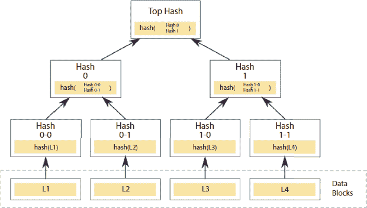

第十四章

区块链应用

**Boby Singh*，Rohit Pahwa^(†)，Hari Om Tanwar^(‡) 和 Nikita Gupta^(§)**

印度法里达巴德，MRIIRS

**摘要**

区块链是一个开放的记录，每个人都可以访问，但没有中央权威机构对其进行控制。对于个人和企业来说，这是一种充满力量的技术，可以让他们在信任和透明度的基础上进行合作。区块链的其他知名用途之一是加密货币，例如比特币和其他；然而，还有许多其他可能的用途。在本章中，我们将详细讨论每个特定应用的具体特性。

**关键词：** 区块链应用，区块链管理，区块链在大数据中的应用，数字验证，区块链医疗，区块链科学，区块链学习，区块链政府

## 14.1 区块链简介

区块链最初被称为区块链，只不过是一系列通过密码学连接在一起的区块，每个区块都包含一个哈希值，其中包含了所有必要的信息，如时间戳和交易本身的信息。它确实需要一种数据结构来设计那种数据的组织方式，所以用来存储数据的结构是一棵树，具体来说是默克尔树。此外，通过树结构很容易将所有区块连接在一起(图 14.1)。

**图 14.1** 区块链结构图。

区块链在行政管理中的应用

政府的重要职能之一是管理关于个人、组织、资产等不同类型的信息。为了管理这些信息，政府招募了各种人员来处理这些记录，包括出生和死亡日期或关于婚姻状况、商业许可、财产转让或犯罪活动的信息。政府管理和使用这些信息可能会很复杂。一些记录以纸质形式存在，如果有人想要更改官方纸上的信息，这个公民必须出现在政府监管机构面前。因为监管机构必须保护数据免受未授权用户的侵害。基于区块链的数字政府可以保护数据不受黑客侵害，同时它还有助于减少欺诈，通过区块链技术，政府、个人、企业可以在分布式账本上共享资源，利用密码学进行加密。基于区块链的政府有潜力解决遗留问题。区块链技术远远超出了比特币。

区块链的易用性、即时可扩展性以及它正被生活中的每一个领域所使用。让我们看看公共管理如何从区块链技术中受益。

区块链为政府提供了一个私有的企业链。这项技术的主要目标是只为授权用户分配不同级别的访问权限，同时确保交易的独立验证和操作，建立完全的安全性。

### 14.1.1 区块链在行政管理中的用途

1.  数据共享：如果政府想在不同国家的组织之间共享数据，他们可以通过去中心化技术轻松实现。在去中心化的情况下，信息存储在各种系统中，所有系统都相互连接，以便政府可以安全地访问信息。这是一种非常快速和高效的技术。另一方面，集中式数据存储在单一服务器或系统上。因此，政府保护信息免受黑客攻击非常困难。这是一种非常昂贵且低效的技术。

1.  验证所有权：区块链确保只有经过授权的经销商才能进行交易。当你处理经常转让的财产权时，这种交易变得更加有价值。这一点可以通过举例来说明：某人想要将水或矿产权出售给投资者。这项技术将决定谁将拥有确切的权利。在这种情况下，拥有官方权利的人可以采取法律决定和裁决。

1.  会计：区块链有助于追踪比特币的每一个 fraction。区块链通过加密货币帮助维护所有者的隐私。如今，区块链与会计系统整合，使得地方当局以及大型组织都能跟踪每个个体的购买和发票。当每个发票通过区块链验证后，就无需发送重复的发票。这种技术用于确定确切的信息。区块链有助于立即清算支付，而不是让收款人等待几天支付才能到账。区块链已贯穿整个会计部门，并支持实时会计支出和收入。

1.  改善信任：无论是护照、驾照还是任何文件都可能被伪造。区块链有助于改善政府生成的文件。将不再需要浪费人力和时间来确定这类数据和文件。区块链技术在几秒钟内验证这类文件。

1.  资产管理的数字化：借助区块链，我们可以将以数字形式实现所有资产。区块链能防止人们为谋私利而出售城市资产，同时也能管理国家所有的资产。除此之外，我们还可以将区块链应用于现实世界的实例中，比如，我们可以追踪所有政府所有的房地产，同时它也有助于确定城市或国家中有多少浪费的建筑和土地。如果区块链在全球范围内得到采用，很快它就能解决失业问题。即便如此，大多数国家已经采纳了这一技术，如澳大利亚、加拿大、美国等。此外，区块链正在逐步开始应用于簿记，以加快会计和支付处理，同时也使资金变得透明。

1.  智能法规：区块链允许各个机构创建和设计法律文件和法规，以便它能监视所有经过验证和授权的用户。

1.  身份管理：区块链技术允许政府监管机构和公民在区块链上注册他们的身份、资产以及所有法律文件，这样政府和普通公民就可以在将来使用这些电子信息。

## 14.2 区块链在大数据分析中的预测任务自动化

假设政府拥有大量数据，并且政府希望分析这些数据以用于安全和验证目的，这个过程被称为数据分析。大量数据提供了检查大型数据并揭示隐藏模式、未知相关性和客户偏好的机会。通常，大数据包含各种形式的信息，如结构化、半结构化和非结构化的混合。基本上，政府是通过调查、电话、个人互动、社交媒体等渠道收集这些信息的。除此之外，这些由组织创建和设计的数据对当局是有益的。如今，互联网是信息的一个良好来源。

任何技术进步都有其自身的挑战和局限性。如果我们谈论数据科学的一些主要挑战，包括难以访问的数据、隐私问题以及大量信息。解决此类问题是一个领域，区块链在其中发挥着至关重要的作用。区块链确保了数据的安全和隐私。区块链的目标集中在验证数据，而数据科学则涉及从大量数据中做出预测。

### 14.2.1 区块链如何帮助大数据？

区块链为数据的管理和操作带来了一种新的方式。在区块链的情况下，所有数据都应该集中在一起，但以去中心化的方式进行，数据可以与每个单独的设备进行分析。区块链与其他先进技术如云计算、人工智能和物联网（IoT）集成。

### 14.2.2 区块链在大数据中的应用案例

1.  a. 数据完整性：记录在区块链上的数据是可信的，因为它们必须经过验证以确保其质量。在区块链网络上发生的活动可以被追踪。区块链技术用于验证带有数字签名的物理文档。

1.  b. 防止恶意活动：区块链有助于防止各种恶意活动，因为它使用各种算法来验证交易，所以单个攻击者攻击整个网络是不可能的。如果攻击者试图攻击数据，可以很容易地被识别并从网络中清除。因为数据是分布式的，它使单个攻击者无法产生足够的计算能力来改变验证标准并允许系统中的不受欢迎的数据。如果有人想改变区块链标准，大多数节点必须聚在一起。多数权力将形成新的共识，所以单个攻击者不可能攻击整个网络。

1.  c. 做出预测：区块链数据，就像其他类型的数据一样，可以进行分析以揭示各种信息，这些信息用于预测各种未来结果。更重要的是，区块链提供了从个人或个别设备收集的结构化数据。在预测分析中，我们使用大量数据来确定社会事件（如客户偏好、客户终身价值、与业务相关的动态价格）的准确结果。大多数时候，投资者使用这项技术来获取正确的数据分析。由于区块链的分布式特性，巨大的计算过程帮助小型组织中的数据科学家预测分析任务。

1.  d. 实时数据分析：区块链在金融和支付系统中扮演着至关重要的角色。开发区块链的目的是实现实时跨境交易。如今，一些银行家和金融科技创新者正在探索区块链，因为它与其他技术相比效率很高，同时它消除了各种地理障碍。另一方面，需要对大规模数据进行实时分析的组织可以利用区块链技术。通过区块链，银行和金融机构可以实时观察数据变化，从而快速做出决策，同时它还有助于追踪异常活动。

1.  e. 管理数据共享：区块链提供了存储不同类型数据的功能。同一个数据工作的项目团队成员不需要重复其他团队成员已经完成的数据分析任务。此外，区块链平台可以帮助科学家监控他们的工作，以便他们能够得出结论。

## 14.3 数字身份验证

在开始数字身份验证（DIV）之前，让我们先试图理解*什么是数字身份？*正如您所知，在这个世界上，每个个体都可以通过许多不同的资产来识别，比如护照号码和政府发行的身份证。

同样，数字身份是关于实体的知识，计算机系统用它来代表一个外部代理，这可以是一个人、机构、应用程序或设备，将身份定义为“实体相关属性的集合”。数字身份中发现的详细信息使得在没有用户参与的情况下确定和验证与基于 web 的业务系统通信的用户成为可能。

传统身份记录管理方法

以前，这些身份记录以统一的形式保存在组织内部，这些策略是公开的，并且始终面临被泄露、欺诈和勒索的风险，当我们谈到安全性时，这不是安全的。

传统身份验证方法面临的主要挑战是：

1.  a. 可用性

1.  b. 隐私

1.  c. 全球化。

### 14.3.1 为什么数字身份重要？

数字身份在加快客户入职流程的同时确保了精确性，并在金融交易中预防了反洗钱（AML）和不正当行为。先进的身份管理计划旨在规范化和简化各国提供的居民管理。因此，一个强大的数字身份平台可以帮助提供许多服务，以不同的方式触及我们的生活。

以下是一些例子：

1.  a. 国家级数字身份（NDI）框架，是新加坡智慧国家活动的一部分，一旦完成，预计将帮助居民更安全地访问电子税务支持的组织。

1.  b. 在印度，如今超过 10 亿的印度人拥有一个 Aadhaar ID，这是一个数字身份，它正在与所有的社会计划相连，并改变了向经济较脆弱的社会区域支付补贴的方式。

1.  c. 早在 2014 年，尼日利亚就发放了智能卡，提高了国家的安全和公共服务。

1.  d. 肯尼亚采用了同样的模式，其先进的身份证额外减少了社会违法行为。

### 14.3.2 区块链（定义及其特点）

区块链技术的引入为将人类与其组织之间的关系转换为可靠设置和维护提供了机会。区块链技术可以通过在网络本身中整合信任来提供安全的解决方案。至于数字身份管理，区块链使身份所有者对其身份和基于个人的身份记录拥有主权，控制对他们的信息访问，并使身份所有者在确保完整性和信任的同时分享最少量的记录。

区块链可以最佳地被解释为一系列带有时戳的不可篡改信息，这些信息由一群计算机管理，并且不归任何单一实体所有。这些记录区块（即区块）通过加密标准（即链）相互安全地连接。

人们对区块链如此兴奋的原因在于其以下三个功能：

1.  a. 去中心化：区块链中的所有数据都不归一个中心实体所有。区块链社区的所有节点都持有这些信息。

1.  b. 不可篡改性：一旦事实被记录在区块链中，就无法对其进行篡改。这是因为加密哈希功能的特性。

1.  c. 透明度：社区的所有节点都可以看到已经输入区块链中的所有信息。

区块链将解决的三个重要问题

区块链能解决数字身份领域面临的三个重要问题是什么？

1.  a. 数字设备不应该容易复制。

1.  b. 虚拟文件应该是不可篡改的。

1.  c. 数字方法应该是不可篡改的。

### 14.3.3 为什么我们需要在数字身份中使用区块链？

区块链可以用来消除数字身份领域目前面临的问题，这些问题包括：

1.  a. 不变性**—**根据一项调查，世界上超过一半的人口没有身份证明，其中大多数是穷人。身份认证的手续相当复杂，无法获取，以及知识的缺乏是数十亿人被排除在这个身份认证系统之外的主要原因。没有适当的证明或验证身份，一个人无法执行任务。

1.  b. 不安全的数据**—**今天，世界上 80%的人口身份信息存储在政府的集中式数据库中，尽管有多种不同的网络安全策略，但仍有许多用户账户吸引了黑客。

1.  c. 身份盗窃**—**在当前社会，由于线上线下身份之间的脆弱性，很容易制造假身份，这助长了诸如“假新闻或病毒式传播”等邪恶势力，这对民主社会是不利的。

### 14.3.4 区块链是如何工作的？

存储信息的设备，这个账本中的“页面”，是区块。每个区块都包含加密记录。哈希是一种在密码学中广泛使用的函数。它是一种数学算法，将一段信息转换成一系列字母数字值的字符串：即“哈希”或“哈希值”。如果同样的数据放在中间，它通常会在输出中产生相同的哈希。如果输入数据有最小的变化，输出哈希可能会截然不同（这称为雪崩效应）。为了避免哈希之间的任何相关性，它是一个“单向特性”，因为使用输出中的哈希值来找到中间是什么信息是非常困难的。

### 14.3.5 为什么区块链是安全的？

让区块链变得宽松的是这样一个事实：每个记录信息的区块，没有社区公众的共识是无法事后修改的。这意味着要修改一条信息，可能需要改变它之后创建的所有区块，并且网络的 51%可能需要同意这种交换。由于区块正在每时每刻被创建，要改变这些区块及其之前的区块以达到我们想要修改的唯一目标，可能需要巨大的计算能力。区块链是为了解决数字货币的双重花费问题而创建的，充当比特币交易的账本、注册表。交易比特币的每个人都充当网络中的一个节点，在比特币区块链上注册交易。这使得它去中心化，因为没有必要的权威，社区中的每个人都可以在账本上写入信息，并允许网络内达成共识，无需中间人。社区中的人越多，大多数人合谋篡改区块链上记录的真相的难度就越大。通过合作和集体利他主义管理的公共、不可篡改的注册表，这些虚拟用户可以轻松确认交易，并确信资金只被转移了一次，而不是无限期地数字复制。

### 14.3.6 什么是区块链身份管理？

身份管理可以包含公司内部用于识别、验证和授权人员以获取访问公司或相关机构的权利的所有流程和技术。当前身份控制结构的麻烦身份有一个问题。如果是基于纸张的，例如躺在市政府地下室里的出生证明，它就是一个丢失、被盗或欺诈的问题。虚拟身份减少了文件工作量，并通过考虑部门之间及其他机构之间的更高互操作性，增加了公司内部流程的速度。然而，如果这个虚拟身份存储在中心服务器上，它就变成了黑客的热点。

区块链被认为是数字化时代的关键进步，在这个时代，一切要么是数字化的，要么有数字化的表示，并且是相互关联的。区块链的创新技术有能力将简洁性和信任带入数字生态系统，通过为一切分配数字身份，实现能力的分散而非集中，以及通过智能合约自动化流程。因此，“去中心化数字身份”的概念是区块链结构的一个重要组成部分，也许是其起始点。

在区块链中，资源所有者通过偏离的加密方式进行识别。基于区块链的身份解决方案使用希特勒偏斜加密的概念，以便将数字身份分配给物品。区块链的一些部分使这项技术适用于并确保身份管理的安全：

1.  a. 区块链记录是永久且简洁的（基于权限），而永久性和简洁性对身份管理至关重要。

1.  b. 区块链对单点故障和拒绝服务攻击具有免疫力。

1.  c. 区块链提供了公开密钥加密和散列的高效执行，这些：

1.  d. 可以扩展为数字身份所有权。

1.  e. 有助于确保用户身份的真实性。

1.  f. 可以用于外部人员对记录的确认。

1.  g. 有助于基于授权的记录传授，以促进明智的协议。

1.  h. 区块链消除了或减少了身份管理中的限制性基础设施，因为它不受中央位置的限制，这也使得身份和记录能够在全球范围内融合。

1.  i. 区块链通过加密货币形式的支持激励措施，可用于特定任务，例如，给予成员信息共享的激励。

从使用复杂密码的基本安全规则到部署现代技术，包括生物识别、设备学习和机器人流程自动化，多种方法正在被评估用于虚拟身份安全。虽然这些方法很有力量，但当在集中式的数字身份控制机器上实施时，这些解决方案被证明是昂贵的，而且有时效果不佳。这种集中式机器的主要缺点是控制数据的实体只有一个。数据篡改和丢失是简单的，身份验证需要时间。估计身份信息泄露需要七个月。而这就是越来越多的探索区块链解决方案的原因，考虑到它们固有的特性，如透明度和用户控制，这些都是数字身份控制的关键要素。

### 14.3.7 优势

作为数字身份控制区块链解决方案的主要支柱的优势是：

1.  a. 信任—在基于区块链的系统中，用于通信的元数据保存在分布式账本中。信息的真实性通过多个节点，通过共识机制来证明。这种去中心化在虚拟身份的背景下很有用，特别是当多个公司使用国家标识符时。

1.  b. 安全性**—**区块链技术被设计成以加密和不可变的方式保存记录，并通过密码学进行保护，从而保护身份信息不被泄露且可追溯。此外，基于区块链的系统消除了与密码安全相关的脆弱性。

1.  c. 完整性**—**这种身份设备的优点在于能跨网络中的所有节点保持每个身份信息。尽管信息在点对点网络中传输，但它的状态会持续得到调和并保持更新。此外，区块链网络没有单点故障，这使得黑客难以破坏数据集的完整性。

1.  d. 简洁性—区块链框架简化了涉及每个利益相关者的过程：

1.  e. 身份发行者—数字身份的自动化发行减少了时间和人工干预。

1.  f. 身份验证者*—*消费者开户和记录验证变得简单且成本效益高。

1.  g. 身份所有者*—*区块链活动远离集中式数据管理，使用户能够控制自己的身份。用户还可以为自己在社交媒体/交易支付创建自己的身份信息。这被称为“自我主权的虚拟身份”。

1.  隐私**—**国际监管机构纷纷要求保护公民的个人和敏感信息。区块链加密与虚拟签名相结合，通过伪匿名确保“通过设计实现的隐私”。通过在用户完成的全部交易中附加虚拟签名，使其防骗功能更上一层楼。

## 14.4 区块链政府

任何一个国家的政府都是非常重要的组成部分，也发挥着重要的作用。在政府领域拥有区块链是对该国公民有益的一步。因为区块链有助于消除政府领域工作中的许多缺点或漏洞。这个领域的区块链系统可以使政府过程变得简单和平滑。

### 14.4.1 去中心化政府服务

去中心化的政府服务意味着没有任何形式的政府提供服务的中心总部。这种系统通过让民众参与过程，赋予他们查看、验证和检查数据的权利，从而增进人民对政府的信任。去中心化也可以称为一种无处不在的分布式网络或分布式账本技术，这意味着区块链中的每个参与者都有自己的数据副本，这使得政府过程透明，并有助于增强人民的信任。区块链的另一个特性是其不可变性，意味着数据无法被更改。例如，在我们注册土地时，这将会非常有利，并且有助于解决或减少许多土地纠纷。区块链的透明性、不可变性等特性有助于在许多政府服务中减少欺诈和腐败。正如我们听到的许多关于政府机构中的许多诈骗新闻。

公共部门中的区块链使得黑客攻击变得非常困难；原因是它使用了加密哈希函数、数据加密及其分布式账本技术。由于这些数据属于政府和公众，因此这使得他们的数据非常安全并增加了责任感。区块链对消除黑市或黑钱进入政府也很有好处，因为在您和服务之间没有中间人，您不需要向中间人支付额外的钱来获取已经属于您的服务。比如说您从银行贷款，您的所有文件都清楚，您可以轻松地获得贷款，但是中间人介入了，并要求从中扣除一部分贷款。但在某些情况下，双方都参与这种做法，这对政府来说基本上是一种损失。

正如对每个人来说都是必要的，这是一种点对点网络，其中没有任何干扰。区块链是一种块的链，每个块都包含其前一个块的数据和地址，这有助于遍历所有先前块或交易。区块链还在身份管理方面发挥重要作用，因为它在这些服务提供中起着关键作用。这意味着个人无需向每个组织单独出示身份证明，个人只需向一个被其他所有组织接受的 organization 出示身份证明。

由于区块链的这些特性，最终降低了政府每项服务的成本，进一步使人们以更低的成本受益于服务。区块链还对政府在提供的服务上节省时间和劳动力产生了重大影响。区块链使政府更容易高效管理其服务，并使使用这些服务的人们更容易、更无需担心被盗、欺诈等问题。

### 14.4.2 流动民主与随机样本选举

区块链在流动民主和随机样本选举中扮演着至关重要的角色。政治在治理人民的过程中负有关键责任，这一过程应当保持干净和透明，而这是区块链能够实现的。众所周知，我国政治形象并不良好，这意味着我们当前制度存在缺陷，必须加以改变。在政治中运用区块链技术有助于提高公众对系统的参与度，这是非常重要的，因为政府属于人民、为了人民、由人民管理。大多数人在选举后都会对自己的选票感到放心，想知道选票是否正确送达，或者是否有人在选举中做了手脚。必须有一种高效的系统，能够完全安全透明地保管选票，让人们确信他们的选票送到了正确的地方。

区块链在我国选举系统中为民众和政府带来了巨大的好处。应用此系统后，就不需要对选票进行重新计数，因为整个过程完全透明、完全安全，结果是政府节省了大量的时间和金钱，因为他们无需重新计票。这导致了人们对政府程序或系统的信任增加，这对他们来说是一个巨大的好处，即他们的民众相信他们的治理。此系统增加了人民选票的价值和他们参与政府制定的程度。此系统有助于为公平选举创造一个独特身份，因为要篡改或破解此系统非常困难，如果有人更改链中的一个区块，就必须更改该链中的所有区块，这是不可能的。

人们可以通过分布式账本技术在此系统中看到政府提供的所有计划。这也有助于减少腐败和黑钱。此系统帮助政府根据人们的收入、工作目的等因素对他们进行分类，通过这些方式，政府为他们提供不同的计划，以提供他们的好处，并帮助他们从不同群体的人那里收集税款。在此系统中，人们还可以记录政府以税收形式从他们那里拿走的钱，钱去了哪里，政府在哪些领域花费了这些钱，这基本上是人民对其资金去向的权利。

此系统增加了公众对政府的控制。政府对其工作对公众负责，如果他们发现有任何金钱的滥用或他们采取的任何行动。此系统帮助政府制定适当的计划、规则、决策等，许多其他因素是政党领袖应为民众做的事情，因为他们选择他作为领袖。此系统基本上是在人民之间分布式信任，这导致了人民有一个更好的未来，有一个公平和高效的治理，所有决策都是由所有人做出的。此系统有助于减轻国家的贫困并改善农业，这是我国的一个重要部分，通过政府提供的适当计划、适当身份和在农业上提供适当支持，为 GDP 提供了 16%。

## 14.5 区块链科学

### 14.5.1 FoldingCoin

因此，已经开始了广泛的研究，以寻找与医疗问题相关的重要关注点，例如某些人体内蛋白质的折叠伪造。所以斯坦福大学确保分析师们获得所有需要进行同一研究的数据。以 FoldingHome（FAH）命名的机构成立，FoldingCoin 的作用就在这里发挥作用。

有趣的是，世界上任何一个人都可以通过简单地捐赠或授予运行斯坦福大学医学研究部门的权限，成为 FoldingHome 机构的一部分，并且你会因此获得一定数量的加密货币 FLDC（FoldingCoin）。

FoldingCoin 的特点

1.  a. 典型硬件：与其它加密货币不同，FoldingCoin 使用了一种常见的打字硬件，这种硬件很容易获得并且简单易用，因此使得挖掘这种硬币变得相当容易。

1.  b. 安全性：FoldingCoin 采用这些先进的协议，使其具有极高的安全性，从而消除了系统遭受攻击的风险。

1.  c. 全球化分布：FoldingCoin 在比特币之后在全球范围内得到了广泛传播。这种广泛传播的原因是 FoldingCoin 的安全性，以及每个人都清楚提供的奖励也很好。

所有这些因素自我促进，帮助发展参与加密货币 FoldingCoin 的社区。FoldingCoin 有自己的钱包，这是一个非常安全的平台，用于收集和存储 FLDC 硬币。任何感兴趣的人都可以在官方网站上找到它。收集和存储 FLDC 硬币的其他方式可以是硬件钱包，或者市场上可找到的、被认为是真实或令人信服的其他钱包。

### 14.5.2 GridCoin (GRC)

GridCoin 是由 Rob Halford 在 2013 年开发和演进的。GridCoin 采用了一种名为 Proof-of-Stake (PoS) 的技术，节点可以获得 1.5% 的年利率。在这种技术中，有一个特殊的算法被设计出来，它能够在加密货币区块链的分布式网络上覆盖大量的人群。在这种技术中，下一个获得区块或节点的个人是通过一些随机选择的方式，基于财富、年龄等因素来确定的。

特点

1.  a. 创新：GridCoin 证明了自己是区块链应用中最创新且非常实用的一个。它在加密货币和区块链领域实现了一个新的目标。GridCoin 被认为是这项技术的一个非常高效的组成部分，因为它通过 BOINC（Berkeley Open Infrastructure for Network Computing）为各种广泛和关键的科学项目探索区块链网络中的巨大计算功能。

1.  b. 效率：GridCoin 高效地采用了 PoS 结构，由于其不对能源储备造成损害且完全安全，因此能够维护区块链的安全。

### 14.5.3 全球公共卫生

区块链技术可以被证明会扩大医疗体系，因为其主要的特征就是以一种极其安全的方式共享数据或敏感信息。不仅在医疗体系中，在任何部门，保护数据都是非常重要的。你绝不能以任何代价妥协你的数据。这就是区块链技术在全球所有部门中被广泛接受的原因。

区块链技术在健康管理领域的主要目的是确保疾病监测、医疗记录、保险理赔等的安全。难怪这项技术已经被应用于许多医院和社会其他健康部门。据说这项技术非常有益，它实际上可以提升和转变健康数据库，并普遍改善对处方数据库、扫描报告、监控系统、图像档案和医疗报告的访问。

这种技术可以在大流行期间防止很多损害发生。当国家出现一些健康问题时，它可以节省很多时间和努力。因此，由于这项技术的存在，数据可以在网络中安全分布，而不是在需要时依赖于它。在这种严重的问题中，时间因素有很大的影响，所以使用这项技术进行医疗报告和数据分析所节省的时间可以得到很好的利用。

结合人工智能（AI），区块链可以用于四象限治疗、个性化药物推荐和提供患者遗传因素、病史以及其他一些外部因素来推荐健康。

以下是一些采用区块链技术在全球卫生安全方面的优缺点：

优势：

1.  a. 它无疑提高了机密数据的安全性，以及可靠地保护敏感数据，如身份、交易详情、交易密码等不被泄露。

1.  b. 它提高了效率

1.  c. 降低了费用

1.  d. 虽然实施这项技术的主要目标是保护敏感信息，但同时也帮助和提高了信息的广泛访问。

1.  e. 这种技术使网络变得健壮，意味着你不再需要依赖任何特定的系统，在使用区块链时，网络是去中心化的，减少了依赖单一计算机或数据库的需要。

缺点：

1.  a. 选择这项技术的缺点是，这项技术还没有完全成熟，所以你可能会遇到新技术问题不断出现。

1.  b. 虽然这项技术的分布式网络机制是一个优点，但它也可能是一个风险因素，可能导致数据或信息泄露。

1.  c. 成本效率还有待证明。

### 14.5.4 比特币基因组学

区块链是一种广泛去中心化的技术，它是一个固定或恒定的数据库。这个数据库可以被网络中的所有成员安全地共享。这种技术最初是在维护著名去中心化加密货币比特币的公共账本中引入的。为了让这项技术在全球不同机构和组织中广泛传播，主要有三个因素是促使这成为可能的原因。首先是去中心化的趋势，没有任何一个系统或实体能够控制整个网络。第二个是稳定性，一旦添加到节点的过去记录或交易详情无法被更改或修改。第三个是数据的安全性；通过使用先进的加密方法对数据进行编码，使数据得到高度保护。上述提到的所有因素都有助于比特币成为极其真实和有说服力地采用，以存储敏感信息。

现在，在所有因素中，网络中数据的去中心化被认为是区块链技术在需要第三方或调解员的场合（如金融协议和联合决议）最有利的因素。此类协议隐含着要求包括第三方以达到结论的需求。因此，中介方偏袒任何一方的担忧始终存在，因此区块链解决了这个难题，因为在你任何形式的协议中都不需要中介或调解员。

本质上，所有区块链应用都类似于两个相互连接的过程，即挖矿和交易。挖矿是形成新的区块或节点，这些节点在树结构中相互连接，而交易是块中的数据，这可以是用户之间交换资产的记录。比特币和区块链技术的特性使其在研究中心、医院、健康管理系统和其他管理机构中存储数据变得有用。

## 14.6 区块链医疗

医疗保健是世界上最大和最重要的行业之一。这是一个非常敏感的行业，因为它每年要处理数万亿美元的钱。而生死攸关的情况使它对我们来说更加重要。任何限制或劣势都可能导致这个部门有时遭受巨大损害，这不是你可以纠正的。这个部门的这一特性使它与其他所有部门都不同。

### 14.6.1 健康币

Health coin 是一种类似于比特币的加密货币。它可以通过在线使用真实货币购买。它可以帮助改变许多事情，比如它还助于在大规模上从一个国家到另一个国家进行交易。Health coin 之所以受欢迎，是因为它使用了区块链的原则。这使得 Health coin 具有革命性，因为它能够解决健康部门在医疗质量、交易安全、交易金额以及所有以前发生的交易记录方面的大问题。Health coin 还为我们提供了一些可以使用它们购买的功能或服务，如保险、来自知名医院的体检以及许多其他健康福利。我们可以说健康币是健康领域的未来，因为它在许多方面都是世界上最大的，它是一个政府自由的 P2P 网络，我们可以直接用健康币支付。

### 14.6.2 区块链上的 EMR

EMR 代表电子病历，它基本上是患者的药物记录和其医疗史。每个患者都有自己的 EMR，因此有数百万患者，我们可以想象这个数据库有多大，因为它是在某个地方的一个数字存储。这增加了数据被黑客攻击的风险，这是医疗保健行业的重大缺点。除了这个缺点，这是一种非常有效的记录患者信息的方法，也便于患者跟踪其医疗记录和用药时间。

在区块链上添加 EMR 后，它只消除了 EMR 的所有缺点，并添加了一些其他高效的功能。区块链的去中心化特性使其从任何系统和多个医院的使用更加高效，以更好地开具各种专业领域的处方。存储在区块链上的 EMR 由于数据的去中心化和使用加密哈希函数来加密此数据，使得黑客攻击变得非常困难，这在当今社会是非常必要的，因为最近有很多关于大量窃取此数据的案例。区块链还通过不再重复创建记录来减少很多工作量，一旦记录创建，它可以多次使用，并且在每个其他医院都可以使用。这使得患者和医生都非常容易通过区块链上的 EMR 检查他们的患者。

病人不必站在长长的队伍中等待轮到他们以便获得医生的处方，有时病人会因为迟来的处方而死亡，这种情况只会发生在我们国家，因为医院里有太多的人。这使得病人难以及时看到医生。如果病人患有一种疾病，比如冠状病毒，在这种情况下，当他们在队伍中等待时，这个人可以把这种疾病传播给医院里的很多人。这种粗心大意的行为会在医院造成非常危险的状况，这也让你知道如何控制这些情况，这对任何人来说都是非常困难的。

通过基于区块链的电子病历(EMR)，病人可以在线预约所需的医生，这可以节省病人和医生大量的时间。病人只需在其在线平台上向医生提供医疗记录，就可以在线预约医生，结果医生可以给出预约或根据需要给出适当的药物治疗。如果医生不知道这些疾病，比如冠状病毒，那么医生将会受到这些疾病的折磨。为了避免这种情况以及之前提到的情况，基于区块链的 EMR 将非常有帮助，因为这将让医生了解世界上新的疾病以及它们的症状和预防措施。基于区块链的 EMR 还可以在疾病的研究中提供进一步的帮助，这对全世界都有帮助。

### 14.6.3 比特币健康公证

公证是指来自特定领域专业机构验证或授权。现在的健康公证非常有帮助，也是必要的，因为我们看到犯罪率日益增加。它也是必要的，因为如果我们没有从正确的权威机构获得授权，那么与健康问题相关的后果将会是坏的。如果我们从当地某个权威机构获得授权，那么我们的病人最终会遭受痛苦，因为他们没有技能或没有经过适当培训来从事这种工作。

比特币健康公证基于区块链的原则，这对每个人都是有益的，无论是病人还是医生。拥有区块链的属性使得它非常可靠。由于拥有像区块链这样的安全性，它被应用在多个领域，许多其他政府卫生组织以及其他部门也是如此。区块链的不变性属性也非常有用，在这个公证处，没有人能改变数据，如果有人改变了那个公证处的数据，那么所有与那个公证处相关的病人都会受到折磨。

## 14.7 区块链学习

### 14.7.1 比特币 MOOCs

大规模开放在线课程（MOOCs）提供了关于加密货币和区块链这一新兴、快速发展概念的一切学习内容。区块链被认为非常适合那些需要高度安全的数据和信息，比如交易详情。因此，这是未来世界所需要的，随着每天数据量的爆炸式增长，区块链技术将会更加凸显。所以，即使你对拥有关于加密货币和区块链这一新兴趋势的知识只有一点点兴趣，在线课程也提供了掌握这项新技术的机会。掌握良好的知识后，你实际上可以为本社区做出贡献或产生影响。值得一提的是，你会发现这项技术非常有趣，并且会更渴望了解更多关于它的内容，因为当你实际运用它解决现实生活中的问题时，它将变得更加有趣。你可以学习关于它的各种加密货币，比如比特币、FoldingCoin、LearnCoin、GridCoin、LiteCoin 等等。你不仅可以全面了解它的知识，还可以在实践方面有所收获，为新的职业生涯提供一个良好的开端。

### 14.7.2 智能合约素养

智能合约与传统合约相似，但它是数字化的、智能化的。所谓的智能化是指它包含了一组规则和协议，有助于识别、验证并强制执行合同的谈判和执行。智能合约使得交易可以在不涉及第三方的情况下顺利完成。

区块链技术的网络分布式特性令人瞩目，因此所有各方都很容易访问它，从而结束了需要中介的愿望。它还有许多其他优点，如节省大量时间、高度安全。智能合约的另一个优点是，它减少了各方之间的竞争或冲突，因为现在所有内容都在所有各方之间公开。

智能合约能以非常快速、高效和透明的方式帮助你进行股票、货币、财产或任何有价值物品的交易。另外，由于没有中间商，所以也省去了中间商服务的费用。

智能合约可以在许多领域中使用，如管理、政府、汽车、房地产和医疗保健。智能合约的一些特点如下：

1.  安全性：合约或文件通过密码学进行加密。因此，文件是安全的，只有拥有密钥的人才能访问文件，否则需要非常熟练的黑客才能访问文件并解密。

1.  准确度：这些合约被证明是极其准确的。

1.  可靠性：你的合约被共享在网络上，但仅限于合约中涉及的人员或各方。网络之外的其他人无法访问合约。

1.  d. 自主：由于明显没有中介或第三方的参与，所以这个合同完全是你的驱动，而不是由别人塑造。所以没有偏向任何一方的合同的可能性，它总是对双方有利，因为它是双方同意的结果。

1.  e. 备份：如果你有一天失去了对文档的访问权限，你总是可以从同一网络中的朋友那里获得相同的记录。

1.  f. 速度：智能合约设计有算法以满足双方的要求，所以它极大地节省了双方的时间。

1.  g. 节省：由于智能合约消除了中间人的需要，它为双方节省了本来要支付给中间人服务的费用。

### 14.7.3 学习币

学习币是加密货币的教育实践。近年来，比特币和 LiteCoin 等繁荣的加密货币引起了人们对这项技术的关注。现在大多数人想要投资和发展加密货币技术。另外，由于这两种加密货币的开源性质，现在更有可能开发你自己的加密货币。只需支付一点小费用，因为之前有写好的源代码，你实际上可以构建你自己的加密货币。但这些服务可能不会提供加密货币已经使用的某些功能或关键特性。所以这些代码不会为你提供主要功能的的关键见解，但源代码很容易获得。

## 参考文献

1. Rosic, A., 智能合约：将取代律师的区块链技术，详情请访问[`blockgeeks.com/guides/smart-contracts/`](https://blockgeeks.com/guides/smart-contracts/)。

2. Singhal, A. *et al.*, 什么是 FoldingCoin（FLDC），详情请访问[`coinswitch.co/info/foldingcoin/what-is-foldingcoin`](https://coinswitch.co/info/foldingcoin/what-is-foldingcoin)。

3. Alkan, C. *et al.*, 基因学中区块链技术的潜力实现，详情请访问[`www.ncbi.nlm.nih.gov/pmc/articles/PMC6120626/`](https://www.ncbi.nlm.nih.gov/pmc/articles/PMC6120626/)，2018 年。

4. Singhal, A. *et al.*, 什么是 GridCoin（GRC），详情请访问[`coinswitch.co/info/gridcoin/what-is-gridcoin.com`](https://coinswitch.co/info/gridcoin/what-is-gridcoin.com)。

5. Berryhill, J., Bourgery, T., Hanson, A. *et al.*, 区块链技术及其在公共部门使用的指南，详情请访问[`www.oecd.org/fr/gov/administration-innovante/oecd-guide-to-blockchain-technology-and-its-use-in-the-public-sector.htm`](https://www.oecd.org/fr/gov/administration-innovante/oecd-guide-to-blockchain-technology-and-its-use-in-the-public-sector.htm)，2018 年。

6. UseBitcoinsInfo, 公共

7. Sarikaya, S., 区块链如何改变数据科学：大数据中的 5 个区块链用例，可在[`towardsdatascience.com/how-blockchain-will-disrupt-data-science-5-blockchain-use-cases-in-big-data-e2e254e3e0ab`](https://towardsdatascience.com/how-blockchain-will-disrupt-data-science-5-blockchain-use-cases-in-big-data-e2e254e3e0ab)，2019 年。

8. Sharma, A., 区块链与大数据如何相互补充，可在[`hackernoon.com/how-blockchain-and-big-data-complement-each-other-92a1b9f8b38d`](https://hackernoon.com/how-blockchain-and-big-data-complement-each-other-92a1b9f8b38d)，2019 年。

9. Lubin, J., 政府与公共部门中的区块链应用，可在[`consensys.net/blockchain-use-cases/government-and-the-public-sector/`](https://consensys.net/blockchain-use-cases/government-and-the-public-sector/)找到。

10. Shashank, A., 区块链技术在医疗保健中的 5 大优势，可在[`hitconsultant.net/blockchain-technology-in-healthcare-benefits/#.XpVMMevivIU`](https://hitconsultant.net/blockchain-technology-in-healthcare-benefits/#.XpVMMevivIU)，2018 年。

11. Anwar, H., 数字身份的区块链应用：去中心化身份验证和自我主权身份（SSI），可在[`101blockchains.com/digital-identity/`](https://101blockchains.com/digital-identity/)，2019 年。

12. Tykn, B.V., 使用区块链进行身份管理：终极指南，可在[`tykn.tech/identity-management-blockchain/`](https://tykn.tech/identity-management-blockchain/)，2020 年。

13. Lubin, J., 数字身份中的区块链应用，可在[`consensys.net/blockchain-use-cases/digital-identity/`](https://consensys.net/blockchain-use-cases/digital-identity/)找到。

14. Reiff, N., 区块链解释，可在[`www.investopedia.com/terms/b/blockchain.asp`](https://www.investopedia.com/terms/b/blockchain.asp)找到，2020 年。

15. Swan, M., 区块链：新经济的蓝图，可在[`books.google.co.in/books?id=RHJmBgAAQBAJ&pg=PA37&lpg=PA37&dq=Digital+art+blockchain+attestation+services&source/#v=onepage&q=Digital%20art%20blockchain%20attestation%20services&f=false`](https://books.google.co.in/books?id=RHJmBgAAQBAJ&pg=PA37&lpg=PA37&dq=Digital+art+blockchain+attestation+services&source/#v=onepage&q=Digital%20art%20blockchain%20attestation%20services&f=false)，2015 年。

1.  * *通讯作者*：bobbysingh147963@gmail.com

1.  † *通讯作者*：rohitpahwa2017@gmail.com

1.  ‡ *通讯作者*：hariom274.hot@gmail.com

1.  ^§ *通讯作者*: nikkiguptahewo16@gmail.com
