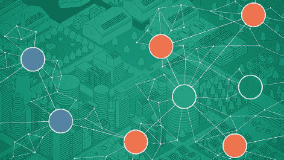
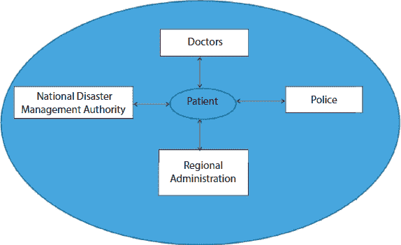

第十五章 15

区块链的前沿概念

**拉吉·库马尔**

**曼纳·拉钦国际研究学院，印度法里达巴德**

**摘要**

区块链技术将在不久的将来彻底改变世界。它将成为未来的家喻户晓的名字。区块链技术可以用于各种服务，例如进行安全的在线交易，创建数字身份，提高供应链效率，还可以用来创建不可篡改的数据备份。医院可以利用区块链技术来维护患者记录。区块链技术为患者数据提供了急需的隐私保护。执法机构可以利用区块链技术追踪武器的所有权。区块链技术的未来应用众多，很难在单章中解释清楚。然而，社区超级计算，区块链地租经济学，区块链学习，社区币，货币和非货币货币，一些杰出的代币，以及滞纳货币等主题已经进行了详细的讨论。

**关键词：** 区块链，比特币，超级计算，基因组学，非货币货币

## 15.1 社区超级计算

社区超级计算是一个新概念，区块链是使其成为可能的底层技术。世界人口超过 78 亿，全球连接的设备超过 22 亿。随着物联网等新技术的出现，这个数字注定会呈指数级增长，所有设备都将被转换为智能和通信设备。社区超级计算希望利用人们用于个人工作的硬件设备。平均居民每天只使用计算资源几小时，而大部分时间计算设备的计算能力要么被低效利用，要么未被利用。在超级计算中，社区成员使用区块链技术共享硬件资源，创建超级计算。在这里，社区资源的使用将基于支付基础。如果个人将其计算资源与其他社区成员共享，计算力用户必须向硬件服务提供商支付费用，反之亦然。这个概念可能成为社区成员的被动收入来源。如图 15.1 所示，x 轴和 y 轴表示任何典型城市的宽度和长度。连接的细线描绘了相互连接的计算机。多色填充圆圈描绘了通过社区连接计算机的硬件实现的基于区块链的超级计算机。

社区超级计算平台可以帮助提高计算速度，同时降低成本。这个平台可以成为图形渲染、科学研究、机器学习等科学研究的巨大推动器。这一成就可以通过使用家用电脑来实现(图 15.2)。

+   比特币用于传染病救济

区块链技术可以帮助我们控制疫情。无论何时，任何人都可能被传染病感染，那个人就会成为传播者，然后其他人会被他感染。一旦确定某人有传染病的症状，追踪那个人的联系人就变得至关重要。一个人在与他人交往的过程中，如办公室、公园、社区等地方，可能会感染其他人。区块链利用分布式账本，可以在健康危机期间更快地做出反应。

对传染病和感染者的监测可能是控制疾病传播的关键。区块链技术的固有特性有助于避免疾病相关数据的黑客攻击。使用区块链可以避免数据的重复。区块链创建的与疾病相关的记录是不可变的、去中心化的、确定性的、保证数据完整性的，并且对攻击具有弹性。参与传染病控制的工作组属于各种独立部门，如医院、病理实验室、警察、市政府、灾害管理等。区块链基础设施可以在提供协调努力方面发挥关键作用，从而最终有助于控制疫情(图 15.3)。

**图 15.1** 社区超级计算（图片由 Getty Images 提供）。

**图 15.2** 传染病与人类。

对未来疫情的准备可能至关重要。考虑到西班牙流感、埃博拉、寨卡和 COVID19 病毒的过去经验；可以利用区块链设计一个健壮的系统，有助于减少各个机构之间的沟通。因此，可以总结出精心使用区块链可以帮助我们：

**图 15.3** 区块链为控制传染性疾病提供了各种利益相关者之间无缝的安全信息交换（来源：自制）。

+   预防疫情爆发

+   疫情的早期检测

+   快速响应

+   有效的监测。

## 15.2 区块链基因组学

基因组学涉及个体的 DNA 信息。关于 DNA 的更准确信息有助于早期更好地识别疾病，并有助于许多疾病的治疗。可以控制一些遗传性疾病。然而，在基因组测序中需要处理大量的数据。几年前，基因组测序的成本相当高。然而，计算技术的进步为这一领域开辟了新的途径。区块链技术在这个领域提供了突破性的解决方案。

基因组测序(图 15.4)非常重要。由于区块链是一个数字公共账本，且处理工作分布在多台计算机上。基因组数据的安全性存在风险。基因组测序是一个计算密集型的过程。传统的数据存储服务器作为数据存储和分发的单一来源。如果服务器发生故障，则数据无法使用。分布式计算提供了数据的去中心化。

**图 15.4** 基因组测序。

使用区块链的基因组测序可以促进大规模的慢性疾病预测、新疫苗开发等应用。许多公司正从事于这一领域的大量研究。由于这项技术仍处于初级阶段，与存储、传输和管理大数据相关的许多问题构成挑战。这项技术进步可以为所有利益相关方带来福音，包括患者、保险公司和医疗机构。

仍有许多挑战需要解决，比如基因组测序数据的权属不明确。因为区块链是一个分布式公共账本，所以计算将使用多台计算机完成。由于所有计算机都在 peer 级别工作，这类问题需要进一步的审议。以前，数据是由授权组织存储的，但如果基因组相关数据存储在任何一个这样的中心仓库中，个体未经许可使用数据的风险就会增加。

但是，可追溯性和可验证性特征可以帮助追踪数据。这种可追溯性可以通过时间戳技术来实现。通过使用识别文件，可追溯性有助于验证物品的历史和位置。

## 15.3 区块链学习

比特币 MOOC 和智能合约素养

在当今时代，基于技术的教学已经得到学生、教师和其他利益相关者（如家长）的广泛接受(图 15.5)。区块链的使用将使学习景观更加透明。不可变的账本技术有助于追踪学生与教师之间发生了哪些交易。这将迫使学生社区更加警觉和活跃。教师也将更加关注教学质量和教学方法。在每一个阶段都会创建记录。教师和学生都不会丢失任何信息。每个教育体系都有第三方评估组织进行质量审计。由于所有记录都是在线的，质量审计也将顺利进行。

学生、教师和大学将就课程成果和项目成果签订数字合同。每一方都将承担履行预期角色的义务。学习者将立即获得好处。大学和教师可以激励学生取得好成绩和遵守所有指示。

**图 15.5** 智能学习（图片由 Manav Rachna 提供）。

利用区块链技术，教育记录可以作为防篡改账本长期维护。交易是可验证的，这是存储教育证书的永久且完美方法。文件经过加密签名，需要遵循数字签名所需的开放标准。开放标准的数字签名有助于全球验证文件。

两个领先的机构，MIT 媒体实验室和 Learning Machine，开发了一种名为 BlockCerts 的软件。BlockCerts 使用区块链作为底层技术，并免费提供创建和分享教育证书，可以在网上验证其真实性。另一个领先的机构，SAP，也推出了基于区块链的 TrueRec 软件。它是一个数字存档，基于以太坊。

## 15.4 社区币

社区币可能为我们提供了一种非常新颖的民主化货币的方法。社区货币在相关的群体内作为点对点、基于信任的货币发挥作用。社区货币限于特定的地理区域。点对点的社区货币不受任何中央机构的直接控制。数字货币的概念将赋予人们拥有自己的货币的能力，并且可以在群体内使用(图 15.6)。

社区币使成员能够在点对点网络之间转移资金。转账金额没有限制，不涉及任何形式的征税。资金转移是即时的，成员在收到货币后可以花费。

**图 15.6** 基于区块链的比特币。

新社区币的引入可以通过权益证明（Proof-of-Stake）方法来完成所有交易。任何人都可以使用社区币，并且交易会被记录在账本上。同一个账本也可以用来验证交易的真实性。社区币涉及在线钱包的使用。进行交易时，钱包必须保持在线状态。你的权益取决于你持有的社区币数量以及你进行的质押操作。社区币具有公共性质，并使用开源代码。社区货币的公共和分布式特性使其具有强大的力量，没有任何权威能超过其他事物。

### 15.4.1 货币与非货币货币

加密货币是一种通过结合密码学和数字签名来执行资产转移的数字资产类型。这种结合可以用于点对点网络和去中心化。在某些场景下，要么使用工作量证明（proof-of-work）要么使用权益证明（proof-of-stake）方案来创建和管理货币。它允许电子货币系统去中心化。比特币是最受欢迎的加密货币形式，一种基于密码学的点对点电子货币系统。可以兑换成现金的资产类别被称为货币货币。如果需要，货币资产可以兑换成现金。任何银行账户中的金额、任何银行的定期存款以及手中的现金都属于货币资产。基于区块链的虚拟货币是一种仅以电子形式存在的未受监管的数字货币。它只能通过指定的软件、移动或电脑应用程序，或通过专用的数字钱包进行存储和交易，交易是通过安全的专用网络在互联网上进行的。虚拟货币被认为是数字货币群体的一个子集，该群体还包括加密货币，它们存在于区块链网络中。

非货币资产包括那些没有固定汇率可以进行交易的资产。非货币资产的例子包括建筑物、工厂和仓库等物理设施。在非货币资产的情况下，出售率将取决于各种外部因素，比如对该资产类别的市场需求、特定地理区域的总体经济状况。在股票市场工具如股票、商品、黄金和银方面的投资也根据市场的轨迹而变化(图 15.7 和 15.8)。政府的建议和法律的变化往往会使情况发生巨大变化。政府可以通过任命监管机构来控制上述资产，以确保大多数人的利益。表 15.1 根据诸如供求影响、现金价值、如何清算资产等参数，展示了货币资产和非货币资产之间的区别。

**图 15.7** 黄金。

**图 15.8** 公司股份。

### 15.4.2 货币资产与非货币资产的区别

**表 15.1** 货币资产和非货币资产比较。

| **序号** | **货币资产** | **非货币资产** |
| --- | --- | --- |
| 1. | 在现金中有具体的价值 | 没有固定价值，且随着时间的推移价值会不断波动 |
| 2. | 可以很容易地清算并转换为现金 | 被视为流动性较差 |
| 3. | 现金价值保持恒定 | 根据货币的时间价值变化，这种变化是相对的 |
| 4. | 现金价值不随供求变化 | 根据供求变化 |
| 5. | 包括银行余额和从债务人那里收到的金额 | 财产和工厂属于非货币资产 |

### 15.4.3 货币多元性

就像在现有的经济体系中，大多数国家都有自己的货币，这种货币在其一定的地理区域内是有效的，比如美元在美国使用，英镑在英国使用，印度卢比在印度使用等。（图 15.9）

基于区块链的加密货币中，货币多元概念广泛流行。当今时代的加密货币被称为比特币、莱特币和狗狗币等各种名称。基于区块链的加密货币可以追踪，并且可以货币化。第一个基于区块链的加密货币于 2009 年推出。然而，随着时间的推移，技术在硬件开发方面取得了巨大飞跃，软件也发生了很大变化。这种进步催生了许多新货币。截至目前，已有超过 6000 种山寨币（即代币或加密货币的各种变体）存在，并且这个数字随着时间的推移而增加。

**图 15.9** 印度货币和美国货币。

### 15.4.4 以下是一些著名代币的列表

1.  a. 以太坊（ETH）

1.  b. 比特币钻石（BCD）

1.  c. Ripple（XRP）

1.  d. 莱特币（LTC）

1.  e. 泰达币（USDT）

1.  f. 比特币现金（BCH）

1.  g. Libra（LIBRA）

1.  h. 比特币私人（BCP）

1.  i. 门罗币（XMR）...

1.  j. EOS（EOS）

1.  k. Factom（FCT）

1.  l. Fusion（FSN）

1.  m. afe Exchange Coin（SAFEX）

1.  n. Nexus（NXS）

1.  o. Nano（XRB）

1.  p. VeChain（VET）

1.  q. Verge（XVG）等。

基于加密货币的山寨币已经从商业角度和货币目的改变了世界。在使其无懈可击并增强用户信心方面，仍有一些问题需要解决。涉及的风险包括：

1.  a. 没有中央当局。货币是基于社区和信任的。这一特性导致了风险的产生。

1.  b. 加密货币的交易在确认后是不可逆的。如果进行了错误的交易，它无法被撤销。

1.  c. 没有第三方进行仲裁。

1.  d. 在世界的某些地区，加密货币尚未合法化，用户在这样的国家将无法向任何当局求助。

所有用户都是通过他们的数字代码来识别的。没有像社会安全号码这样的物理识别。因此，这种匿名性增加了风险因素。

## 15.5 滞纳货币

滞纳金是在拥有或持有货币一段时间内所发生的成本。它也被称为货币的持有成本。对于商品货币，如黄金，滞纳金是存储和保护黄金的成本。对于纸币，涉及印刷成本，它可以形式为对货币持有的定期税收，如印花税。滞纳金有时被引用为经济上有利的，通常是在辅助货币系统的情境下。

然而，基于区块链的货币的流通和使用可以大幅减少滞留。加密货币没有像现金那样的印刷成本。加密货币没有像黄金和银那样的存储和采购成本。因此，可以总结说，实施加密货币将增加货币的印刷、传输和存储成本。它可以被轻松使用，并将以很大的方式造福社会。

## **阅读清单**

1. Walid, A. 和 Nicolas, S., 区块链技术对社会影响: 机遇与挑战. *网络政策杂志*, 2, 3, 第 338-354 页, 2017 年。 可获取: [`www.tandfonline.com/toc/rcyb20/2/3`](https://www.tandfonline.com/toc/rcyb20/2/3)。

2. Supriya, T. 和 Vrushali, K., 区块链及其应用——详尽调查. *国际计算机应用*, 16, 6, 第 20-24 页, 2017 年。 可获取: [`www.ijcaonline.org/archives/volume180/number3/aras-2017-ijca-915994.pdf`](https://www.ijcaonline.org/archives/volume180/number3/aras-2017-ijca-915994.pdf)。

3. Ketki, R. 和 Sheetal, Y., 云计算中区块链技术: 系统回顾. *国际研究期刊工程技术*, 5, 4, 第 1918-1921 页, 2018 年。 可获取: [`www.irjet.net/archives/V5/i4/IRJETV5I4428.pdf`](https://www.irjet.net/archives/V5/i4/IRJETV5I4428.pdf)。

4. Peters, G.W., Panayi, E., Chapelle, A., 加密货币与区块链技术趋势: 货币理论与监管视角, [在线] *SSRN 电子期刊*, 2015, 第 1-25 页, 2015 年。 可获取: [`dx.doi.org/10.2139/ssrn`](http://dx.doi.org/10.2139/ssrn)。

5. Kosba, A., Miller, A., Shi, E., Wen, Z., Papamanthou, C., Hawk: 区块链加密模型与保护隐私的智能合约, 在: *IEEE 安全与隐私研讨会(SP)*, 美国加利福尼亚州圣何塞, 第 839-858 页, 2016 年。

6. Sharples, M. 和 Domingue, J., 区块链与 kudos: 教育记录、声誉和奖励的分布式系统, 在: *第 11 届欧洲技术增强学习会议(EC-TEL 2015)*, 法国里昂, 第 490-496 页, 2015 年。

7. Tschorsch, F. 和 Scheuermann, B., 比特币及其他: 去中心化数字货币的技术调查. *IEEE 通信 surveys 教程*, 18, 3, 第 2084-2123 页, 2016 年。

1.  *电子邮件:* Rajkumar.fca@mriu.edu.in
