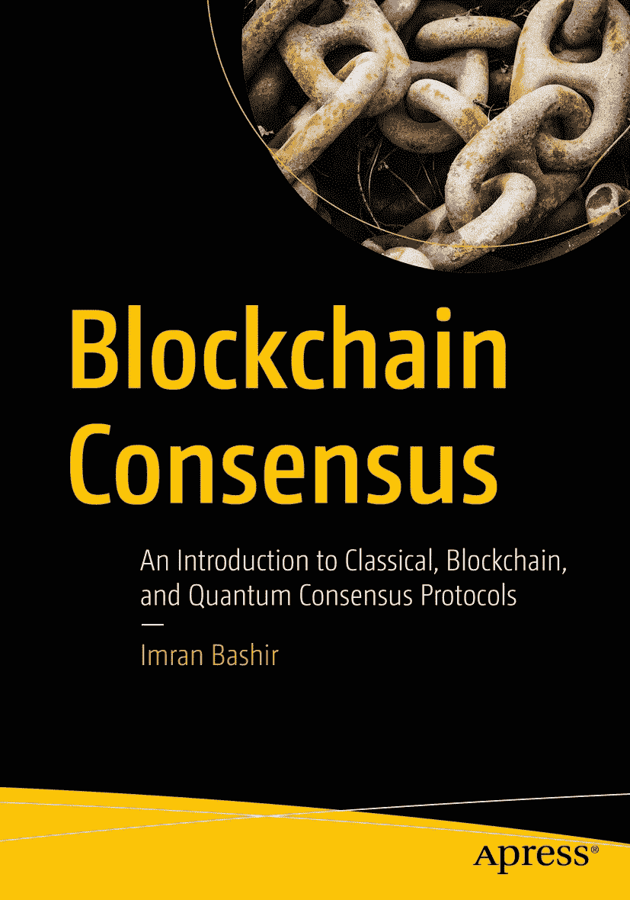

**区块链共识**

**经典简介，**

**区块链和量子**

**共识协议**

**Imran Bashir**

***区块链共识: 经典、区块链和量子介绍***

***共识协议***

Imran Bashir

位于英国伦敦

ISBN-13（平装版）：978-1-4842-8178-9

ISBN-13（电子版）：978-1-4842-8179-6

[`doi.org/10.1007/978-1-4842-8179-6`](https://doi.org/10.1007/978-1-4842-8179-6)

版权所有 © 2022 by Imran Bashir

本作品受版权保护。出版商保留全部权利，无论是整体还是部分材料，特别是翻译、重印、插图重用、吟诵、广播、微缩胶片复制、或者以其他任何物理方式、信息传输和检索、电子适应、计算机软件，或者通过现在已知或今后开发的类似或不同方法进行的一样或不同的方法。

本书中可能会出现注册商标名称、商标或图像。我们使用注册商标名称、商标或图像时，不会在每次出现时使用商标符号，而是仅以编者方式使用这些名称、商标或图像，以造福商标所有者，无意侵犯商标权。

本书中使用的商标名称、商标、服务标记和类似术语，即使未明确标识为这种标志，也不应被视为对它们是否受专有权利的意见表达。

尽管本书中的建议和信息被认为在出版日期真实和准确，但作者、编辑和出版商均不能对可能出现的任何错误或遗漏承担任何法律责任。出版商对此处所含材料不做明示或暗示的保证。  

Apress Media LLC 的董事总经理：Welmoed Spahr

采编编辑：Aditee Mirashi

开发编辑：Laura Berendson

协调编辑：Aditee Mirashi

封面设计：eStudioCalamar

封面图片设计者：Freepik（www.freepik.com）

Springer Science+Business Media New York 全球图书贸易配送地点为美国纽约州纽约市 10004-1562 号新约克广场 4600 号套房。电话 1-800-SPRINGER，传真 (201) 348-4505，邮箱 orders-ny@springer-sbm.com，或访问 www.springeronline.com。Apress Media, LLC 是加利福尼亚州的有限责任公司，唯一成员（所有者）是 Springer Science + Business Media Finance Inc（SSBM Finance Inc）。SSBM Finance Inc 是**特拉华**州的一家公司。

关于翻译的信息，请发送邮件至 booktranslations@springernature.com；关于重印、平装版或音频版权，请发送邮件至 bookpermissions@springernature.com。

Apress 的图书可供学术、企业或推广用途大量购买。大多数图书也有电子书版本和许可证可用。更多信息，请参考我们的印刷和电子书大量销售网页，网址为 http://www.apress.com/bulk-sales。

作者在本书中引用的任何源代码或其他补充材料均可在 GitHub（github.com/apress）上供读者阅读。有关更详细的信息，请访问 http://www.apress.

源码。

使用无酸纸印刷

*本书献给我最慈爱的父亲，*

*我所认识的最无私、最努力的人。*

*如果你在研究问题上遇到困难，请严格阅读*

*所有相关的文献，你将找到答案。*

*—科学家巴希尔·艾哈迈德·汗*

**目录**

关于作者 **xv** 关于技术审阅者 **xvii** 致谢 **xix** 导言 **xxi** 第一章：[介绍](https://doi.org/10.1007/978-1-4842-8179-6_1) **1**

[分布式系统](https://doi.org/10.1007/978-1-4842-8179-6_1#Sec1) **1**

[特征](https://doi.org/10.1007/978-1-4842-8179-6_1#Sec2) **2**

[为什么构建分布式系统](https://doi.org/10.1007/978-1-4842-8179-6_1#Sec3) **4**

[挑战](https://doi.org/10.1007/978-1-4842-8179-6_1#Sec10) **7**

[并行 vs 分布式 vs 并发](https://doi.org/10.1007/978-1-4842-8179-6_1#Sec18) **10**

[集中 vs 分散 vs 分布式](https://doi.org/10.1007/978-1-4842-8179-6_1#Sec19) **10**

[分布式算法](https://doi.org/10.1007/978-1-4842-8179-6_1#Sec20) **12**

[分布式计算的元素/相关术语/概念](https://doi.org/10.1007/978-1-4842-8179-6_1#Sec21) **14**

[分布式系统的类型](https://doi.org/10.1007/978-1-4842-8179-6_1#Sec28) **19**

[软件架构模型](https://doi.org/10.1007/978-1-4842-8179-6_1#Sec29) 19

[分布式系统模型](https://doi.org/10.1007/978-1-4842-8179-6_1#Sec34) 25

[同步和时间](https://doi.org/10.1007/978-1-4842-8179-6_1#Sec57) 31

[时间、时钟和顺序](https://doi.org/10.1007/978-1-4842-8179-6_1#Sec68) 37

[物理时钟](https://doi.org/10.1007/978-1-4842-8179-6_1#Sec69) 39

[事件发生在之前的关系和因果关系](https://doi.org/10.1007/978-1-4842-8179-6_1#Sec86) 50

[CAP 定理](https://doi.org/10.1007/978-1-4842-8179-6_1#Sec105) 61

[一致性](https://doi.org/10.1007/978-1-4842-8179-6_1#Sec106) 61

[可用性](https://doi.org/10.1007/978-1-4842-8179-6_1#Sec107) 61

[分区容错性](https://doi.org/10.1007/978-1-4842-8179-6_1#Sec108) 61

v

目录

[分布式系统中的密码学](https://doi.org/10.1007/978-1-4842-8179-6_1#Sec109) 63

[摘要](https://doi.org/10.1007/978-1-4842-8179-6_1#Sec110) 64

[参考文献](https://doi.org/10.1007/978-1-4842-8179-6_1#Sec111) 65

[第二章：密码学](https://doi.org/10.1007/978-1-4842-8179-6_2) 67

[介绍](https://doi.org/10.1007/978-1-4842-8179-6_2#Sec1) 67

[典型的密码系统](https://doi.org/10.1007/978-1-4842-8179-6_2#Sec2) 68

[密码基元](https://doi.org/10.1007/978-1-4842-8179-6_2#Sec3) 70

[对称加密](https://doi.org/10.1007/978-1-4842-8179-6_2#Sec4) 70

[流密码](https://doi.org/10.1007/978-1-4842-8179-6_2#Sec5) 71

[分组密码](https://doi.org/10.1007/978-1-4842-8179-6_2#Sec6) 73

[高级加密标准](https://doi.org/10.1007/978-1-4842-8179-6_2#Sec13) 77

[一些基本数学](https://doi.org/10.1007/978-1-4842-8179-6_2#Sec14) 79

[素数](https://doi.org/10.1007/978-1-4842-8179-6_2#Sec15) 79

[模运算（模算术）](https://doi.org/10.1007/978-1-4842-8179-6_2#Sec16) 80

[群](https://doi.org/10.1007/978-1-4842-8179-6_2#Sec17) 80

[阿贝尔群](https://doi.org/10.1007/978-1-4842-8179-6_2#Sec18) 80

[域](https://doi.org/10.1007/978-1-4842-8179-6_2#Sec19) 80

[有限域（伽罗瓦域）](https://doi.org/10.1007/978-1-4842-8179-6_2#Sec20) 80

[素域](https://doi.org/10.1007/978-1-4842-8179-6_2#Sec21) 80

[生成器](https://doi.org/10.1007/978-1-4842-8179-6_2#Sec22) 81

[公钥密码学](https://doi.org/10.1007/978-1-4842-8179-6_2#Sec23)

[Diffie-Hellman 密钥交换](https://doi.org/10.1007/978-1-4842-8179-6_2#Sec24)

[数字签名](https://doi.org/10.1007/978-1-4842-8179-6_2#Sec25)

[RSA](https://doi.org/10.1007/978-1-4842-8179-6_2#Sec28)

[椭圆曲线密码学](https://doi.org/10.1007/978-1-4842-8179-6_2#Sec32)

[数字签名](https://doi.org/10.1007/978-1-4842-8179-6_2#Sec37)

[真实性](https://doi.org/10.1007/978-1-4842-8179-6_2#Sec38)

[不可伪造性(不可否认性)](https://doi.org/10.1007/978-1-4842-8179-6_2#Sec39)

[不可复用性](https://doi.org/10.1007/978-1-4842-8179-6_2#Sec40)

[ECDSA 签名](https://doi.org/10.1007/978-1-4842-8179-6_2#Sec41)

vi

目录

[多重签名](https://doi.org/10.1007/978-1-4842-8179-6_2#Sec42)

[阈值签名](https://doi.org/10.1007/978-1-4842-8179-6_2#Sec43)

[聚合签名](https://doi.org/10.1007/978-1-4842-8179-6_2#Sec44)

[环签名](https://doi.org/10.1007/978-1-4842-8179-6_2#Sec45)

[散列函数](https://doi.org/10.1007/978-1-4842-8179-6_2#Sec46)

[前像阻力 101](https://doi.org/10.1007/978-1-4842-8179-6_2#Sec47)

[第二前像阻力 101](https://doi.org/10.1007/978-1-4842-8179-6_2#Sec48)

[碰撞阻力 102](https://doi.org/10.1007/978-1-4842-8179-6_2#Sec49)

[安全哈希算法（SHA）的设计 103](https://doi.org/10.1007/978-1-4842-8179-6_2#Sec50)

[SHA-3（Keccak）的设计 105](https://doi.org/10.1007/978-1-4842-8179-6_2#Sec54)

[消息认证码 107](https://doi.org/10.1007/978-1-4842-8179-6_2#Sec55)

[基于哈希的消息认证码（HMAC） 108](https://doi.org/10.1007/978-1-4842-8179-6_2#Sec56)

[可验证延迟函数 109](https://doi.org/10.1007/978-1-4842-8179-6_2#Sec57)

[可验证随机函数 110](https://doi.org/10.1007/978-1-4842-8179-6_2#Sec58)

[摘要 111](https://doi.org/10.1007/978-1-4842-8179-6_2#Sec59)

[参考书目 111](https://doi.org/10.1007/978-1-4842-8179-6_2#Sec60)

[第三章：分布式一致性 113](https://doi.org/10.1007/978-1-4842-8179-6_3)

[广播原语 113](https://doi.org/10.1007/978-1-4842-8179-6_3#Sec1)

[尽最大努力广播 115](https://doi.org/10.1007/978-1-4842-8179-6_3#Sec2)

[可靠广播 116](https://doi.org/10.1007/978-1-4842-8179-6_3#Sec6)

[一致可靠广播 117](https://doi.org/10.1007/978-1-4842-8179-6_3#Sec10)

[FIFO 可靠广播](https://doi.org/10.1007/978-1-4842-8179-6_3#Sec12)

[因果可靠广播](https://doi.org/10.1007/978-1-4842-8179-6_3#Sec14)

[总序可靠广播或原子可靠广播](https://doi.org/10.1007/978-1-4842-8179-6_3#Sec15)

[FIFO 总序广播](https://doi.org/10.1007/978-1-4842-8179-6_3#Sec20)

[广播与共识之间的关系](https://doi.org/10.1007/978-1-4842-8179-6_3#Sec23)

[协议](https://doi.org/10.1007/978-1-4842-8179-6_3#Sec24)

[可靠广播](https://doi.org/10.1007/978-1-4842-8179-6_3#Sec25)

[总序广播](https://doi.org/10.1007/978-1-4842-8179-6_3#Sec26)

[拜占庭协议问题](https://doi.org/10.1007/978-1-4842-8179-6_3#Sec27)

七

目录

[系统模型](https://doi.org/10.1007/978-1-4842-8179-6_3#Sec31)

[分布式系统](https://doi.org/10.1007/978-1-4842-8179-6_3#Sec32)

[时序模型/同步性](https://doi.org/10.1007/978-1-4842-8179-6_3#Sec33)

[进程故障](https://doi.org/10.1007/978-1-4842-8179-6_3#Sec34)

[信道可靠性](https://doi.org/10.1007/978-1-4842-8179-6_3#Sec35)

[历史](https://doi.org/10.1007/978-1-4842-8179-6_3#Sec36)

[两将军问题](https://doi.org/10.1007/978-1-4842-8179-6_3#Sec37)

[拜占庭将军问题 133](https://doi.org/10.1007/978-1-4842-8179-6_3#Sec38)

[复制 135](https://doi.org/10.1007/978-1-4842-8179-6_3#Sec39)

[主动复制 137](https://doi.org/10.1007/978-1-4842-8179-6_3#Sec40)

[被动复制 137](https://doi.org/10.1007/978-1-4842-8179-6_3#Sec41)

[优点和缺点 137](https://doi.org/10.1007/978-1-4842-8179-6_3#Sec42)

[主要备份复制 138](https://doi.org/10.1007/978-1-4842-8179-6_3#Sec43)

[链式复制 139](https://doi.org/10.1007/978-1-4842-8179-6_3#Sec44)

[基本结果 147](https://doi.org/10.1007/978-1-4842-8179-6_3#Sec55)

[仲裁 160](https://doi.org/10.1007/978-1-4842-8179-6_3#Sec83)

[崩溃容错法定代表人 161](https://doi.org/10.1007/978-1-4842-8179-6_3#Sec84)

[拜占庭仲裁 162](https://doi.org/10.1007/978-1-4842-8179-6_3#Sec85)

[读写仲裁 162](https://doi.org/10.1007/978-1-4842-8179-6_3#Sec86)

[我们现在在哪里 162](https://doi.org/10.1007/978-1-4842-8179-6_3#Sec87)

[经典共识 163](https://doi.org/10.1007/978-1-4842-8179-6_3#Sec88)

[中本聪和后中本聪共识 163](https://doi.org/10.1007/978-1-4842-8179-6_3#Sec89)

[总结 163](https://doi.org/10.1007/978-1-4842-8179-6_3#Sec90)

[参考文献](https://doi.org/10.1007/978-1-4842-8179-6_3#Sec91) 164

[第四章：区块链](https://doi.org/10.1007/978-1-4842-8179-6_4) 167

[区块链是什么](https://doi.org/10.1007/978-1-4842-8179-6_4#Sec1) 167

[通俗的定义](https://doi.org/10.1007/978-1-4842-8179-6_4#Sec2) 167

[技术定义](https://doi.org/10.1007/978-1-4842-8179-6_4#Sec3) 168

[背景](https://doi.org/10.1007/978-1-4842-8179-6_4#Sec4) 168

[数字现金的创建尝试](https://doi.org/10.1007/978-1-4842-8179-6_4#Sec5) 168

[区块链的好处](https://doi.org/10.1007/978-1-4842-8179-6_4#Sec7) 170

viii

目录

[区块链的类型](https://doi.org/10.1007/978-1-4842-8179-6_4#Sec8) 172

[区块链是分布式系统](https://doi.org/10.1007/978-1-4842-8179-6_4#Sec9) 174

[CAP 和无许可的区块链](https://doi.org/10.1007/978-1-4842-8179-6_4#Sec10) 174

[CAP 和许可的区块链](https://doi.org/10.1007/978-1-4842-8179-6_4#Sec11) 174

[区块链分布账本的抽象](https://doi.org/10.1007/978-1-4842-8179-6_4#Sec12) 175

[区块链是如何运作的](https://doi.org/10.1007/978-1-4842-8179-6_4#Sec24) 178

[区块链的解剖](https://doi.org/10.1007/978-1-4842-8179-6_4#Sec25) 179

[区块](https://doi.org/10.1007/978-1-4842-8179-6_4#Sec26) 180

[平台](https://doi.org/10.1007/978-1-4842-8179-6_4#Sec27) 181

[比特币](https://doi.org/10.1007/978-1-4842-8179-6_4#Sec28) 181

[以太坊](https://doi.org/10.1007/978-1-4842-8179-6_4#Sec38) 192

[以太坊网络](https://doi.org/10.1007/978-1-4842-8179-6_4#Sec39) 192

[以太坊中的密码学](https://doi.org/10.1007/978-1-4842-8179-6_4#Sec40) 196

[交易和执行](https://doi.org/10.1007/978-1-4842-8179-6_4#Sec42) 197

[区块和区块链](https://doi.org/10.1007/978-1-4842-8179-6_4#Sec43) 199

[以太坊中的挖矿](https://doi.org/10.1007/978-1-4842-8179-6_4#Sec48) 201

[以太坊虚拟机和智能合约](https://doi.org/10.1007/978-1-4842-8179-6_4#Sec49) 202

[总结](https://doi.org/10.1007/978-1-4842-8179-6_4#Sec50) 203

[参考文献](https://doi.org/10.1007/978-1-4842-8179-6_4#Sec51) 204

[第五章：区块链共识](https://doi.org/10.1007/978-1-4842-8179-6_5) 207

[背景](https://doi.org/10.1007/978-1-4842-8179-6_5#Sec1) 208

[区块链共识](https://doi.org/10.1007/978-1-4842-8179-6_5#Sec2) 210

[传统 BFT](https://doi.org/10.1007/978-1-4842-8179-6_5#Sec3) 210

[中本聪共识](https://doi.org/10.1007/978-1-4842-8179-6_5#Sec11) 211

[System Model 系统模型 213](https://doi.org/10.1007/978-1-4842-8179-6_5#Sec19)

[Public Blockchain System Model (Permissionless) 公共区块链系统模型（无需许可） 213](https://doi.org/10.1007/978-1-4842-8179-6_5#Sec20)

[Consortium Blockchain System Model (Permissioned) 联合块链系统模型（许可的） 214](https://doi.org/10.1007/978-1-4842-8179-6_5#Sec21)

[First Blockchain Consensus 第一次区块链共识 214](https://doi.org/10.1007/978-1-4842-8179-6_5#Sec22)

[How PoW Works 工作量证明的工作原理 216](https://doi.org/10.1007/978-1-4842-8179-6_5#Sec23)

[Pedagogical Explanation of PoW 工作量证明的教学解释 217](https://doi.org/10.1007/978-1-4842-8179-6_5#Sec24)

[PoW Formula 工作量证明公式 221](https://doi.org/10.1007/978-1-4842-8179-6_5#Sec25)

ix

目录

[Similarities Between PoW and Traditional BFT 工作量证明与传统 BFT 的相似之处 237](https://doi.org/10.1007/978-1-4842-8179-6_5#Sec39)

[PoW As State Machine Replication 工作量证明作为状态机复制 238](https://doi.org/10.1007/978-1-4842-8179-6_5#Sec43)

[PoW Concerns 工作量证明的关注 251](https://doi.org/10.1007/978-1-4842-8179-6_5#Sec57)

[Summary 总结 256](https://doi.org/10.1007/978-1-4842-8179-6_5#Sec68)

[Bibliography 参考文献 256](https://doi.org/10.1007/978-1-4842-8179-6_5#Sec69)

[Chapter 6: Early Protocols 第六章：早期协议 259](https://doi.org/10.1007/978-1-4842-8179-6_6)

[Introduction 引言 259](https://doi.org/10.1007/978-1-4842-8179-6_6#Sec1)

[Distributed Transactions 分布式事务 262](https://doi.org/10.1007/978-1-4842-8179-6_6#Sec2)

[Two-Phase Commit 两阶段提交 263](https://doi.org/10.1007/978-1-4842-8179-6_6#Sec3)

三阶段提交在 266 页

口头消息算法在 268 页

拜占庭将军问题中的签名消息解决方案在 272 页

部分同步下的 DLS 协议在 275 页

[Ben-Or 算法](https://doi.org/10.1007/978-1-4842-8179-6_6#Sec8)的 278 页

使用故障探测器的一致性在 284 页

摘要在 287 页

参考文献在 287 页

第七章：经典一致性在 291 页

基于视图的复制在 291 页

协议步骤在 293 页

视图更改在 294 页

Paxos 在 296 页

失败场景在 301 页

安全性和活性在 304 页

在实践中在 305 页

[变体](https://doi.org/10.1007/978-1-4842-8179-6_7#Sec8) 305

[Multi-Paxos](https://doi.org/10.1007/978-1-4842-8179-6_7#Sec9) 306

[RAFT](https://doi.org/10.1007/978-1-4842-8179-6_7#Sec10) 308

[Leader 选举](https://doi.org/10.1007/978-1-4842-8179-6_7#Sec11) 310

[日志复制](https://doi.org/10.1007/978-1-4842-8179-6_7#Sec12) 311

[保证和正确性](https://doi.org/10.1007/978-1-4842-8179-6_7#Sec13) 314

x

目录

[PBFT](https://doi.org/10.1007/978-1-4842-8179-6_7#Sec14) 315

[PBFT 中的证书](https://doi.org/10.1007/978-1-4842-8179-6_7#Sec15) 319

[PBFT 的优势和劣势](https://doi.org/10.1007/978-1-4842-8179-6_7#Sec19) 323

[安全性和存活性](https://doi.org/10.1007/978-1-4842-8179-6_7#Sec22) 324

[区块链和经典共识](https://doi.org/10.1007/978-1-4842-8179-6_7#Sec25) 327

[摘要](https://doi.org/10.1007/978-1-4842-8179-6_7#Sec26) 328

[参考文献](https://doi.org/10.1007/978-1-4842-8179-6_7#Sec27) 328

[第八章：区块链时代协议](https://doi.org/10.1007/978-1-4842-8179-6_8) 331

[介绍](https://doi.org/10.1007/978-1-4842-8179-6_8#Sec1) 331

[权益证明 333](https://doi.org/10.1007/978-1-4842-8179-6_8#Sec2)

[基于链的 PoS 335](https://doi.org/10.1007/978-1-4842-8179-6_8#Sec3)

[基于委员会的 PoS 335](https://doi.org/10.1007/978-1-4842-8179-6_8#Sec4)

[基于 BFT 的 PoS 336](https://doi.org/10.1007/978-1-4842-8179-6_8#Sec5)

[委托 PoS 337](https://doi.org/10.1007/978-1-4842-8179-6_8#Sec6)

[Liquid PoS 337](https://doi.org/10.1007/978-1-4842-8179-6_8#Sec7)

[攻击 338](https://doi.org/10.1007/978-1-4842-8179-6_8#Sec8)

[以太坊的工作证明 339](https://doi.org/10.1007/978-1-4842-8179-6_8#Sec12)

[Solana 342](https://doi.org/10.1007/978-1-4842-8179-6_8#Sec13)

[历史证明 343](https://doi.org/10.1007/978-1-4842-8179-6_8#Sec14)

[Tendermint 347](https://doi.org/10.1007/978-1-4842-8179-6_8#Sec15)

[HotStuff 353](https://doi.org/10.1007/978-1-4842-8179-6_8#Sec16)

[线性视图变换 353](https://doi.org/10.1007/978-1-4842-8179-6_8#Sec17)

[乐观响应 354](https://doi.org/10.1007/978-1-4842-8179-6_8#Sec18)

[链质量 354](https://doi.org/10.1007/978-1-4842-8179-6_8#Sec19)

[隐藏锁 354](https://doi.org/10.1007/978-1-4842-8179-6_8#Sec20)

[传导起搏器 355](https://doi.org/10.1007/978-1-4842-8179-6_8#Sec21)

[更好的参与者组织拓扑结构 355](https://doi.org/10.1007/978-1-4842-8179-6_8#Sec22)

[Polkadot 359](https://doi.org/10.1007/978-1-4842-8179-6_8#Sec29)

[Polkadot 中的共识 361](https://doi.org/10.1007/978-1-4842-8179-6_8#Sec30)

xi

目录

[以太坊 2 368](https://doi.org/10.1007/978-1-4842-8179-6_8#Sec44)

[Casper 370](https://doi.org/10.1007/978-1-4842-8179-6_8#Sec45)

[摘要 374](https://doi.org/10.1007/978-1-4842-8179-6_8#Sec47)

[参考文献 375](https://doi.org/10.1007/978-1-4842-8179-6_8#Sec48)

[第九章: 量子共识 377](https://doi.org/10.1007/978-1-4842-8179-6_9)

[介绍 377](https://doi.org/10.1007/978-1-4842-8179-6_9#Sec1)

[什么是量子计算机? 378](https://doi.org/10.1007/978-1-4842-8179-6_9#Sec2)

[量子位 380](https://doi.org/10.1007/978-1-4842-8179-6_9#Sec3)

[叠加 382](https://doi.org/10.1007/978-1-4842-8179-6_9#Sec4)

[纠缠 382](https://doi.org/10.1007/978-1-4842-8179-6_9#Sec5)

[量子逻辑门 ������� 384](https://doi.org/10.1007/978-1-4842-8179-6_9#Sec8)

[Hadamard ����� 384](https://doi.org/10.1007/978-1-4842-8179-6_9#Sec9)

[T����������������������������� 385](https://doi.org/10.1007/978-1-4842-8179-6_9#Sec10)

[CNOT ��������� 385](https://doi.org/10.1007/978-1-4842-8179-6_9#Sec11)

[Toffoli (CCNOT) ������� 385](https://doi.org/10.1007/978-1-4842-8179-6_9#Sec12)

[Z ������� 385](https://doi.org/10.1007/978-1-4842-8179-6_9#Sec13)

[NOT ���� 385](https://doi.org/10.1007/978-1-4842-8179-6_9#Sec14)

[交换门 ������� 385](https://doi.org/10.1007/978-1-4842-8179-6_9#Sec15)

[测量 ������ 386](https://doi.org/10.1007/978-1-4842-8179-6_9#Sec16)

[量子电路 ������������ 386](https://doi.org/10.1007/978-1-4842-8179-6_9#Sec17)

[传送电路 ������� 387](https://doi.org/10.1007/978-1-4842-8179-6_9#Sec18)

[GHZ 电路 ������� 387](https://doi.org/10.1007/978-1-4842-8179-6_9#Sec19)

[W 状态电路 ���� 388](https://doi.org/10.1007/978-1-4842-8179-6_9#Sec20)

[量子算法 ����������� 388](https://doi.org/10.1007/978-1-4842-8179-6_9#Sec21)

[量子计算复杂性 ������� 389](https://doi.org/10.1007/978-1-4842-8179-6_9#Sec22)

[P – 多项式时间复杂度](https://doi.org/10.1007/978-1-4842-8179-6_9#Sec23) - 391

[NP – 非确定性多项式](https://doi.org/10.1007/978-1-4842-8179-6_9#Sec24) - 391

[BPP – 有界错误概率多项式时间](https://doi.org/10.1007/978-1-4842-8179-6_9#Sec25) - 391

[BQP – 有界错误量子多项式时间](https://doi.org/10.1007/978-1-4842-8179-6_9#Sec26) - 392

[PSPACE – 多项式空间](https://doi.org/10.1007/978-1-4842-8179-6_9#Sec27) - 392

xii

目录

[其他量子系统](https://doi.org/10.1007/978-1-4842-8179-6_9#Sec28) - 393

[量子网络](https://doi.org/10.1007/978-1-4842-8179-6_9#Sec29) - 393

[量子互联网](https://doi.org/10.1007/978-1-4842-8179-6_9#Sec30) - 393

[量子分布式系统 - 分布式量子计算](https://doi.org/10.1007/978-1-4842-8179-6_9#Sec31) - 394

[量子区块链](https://doi.org/10.1007/978-1-4842-8179-6_9#Sec32) - 395

[量子密码学](https://doi.org/10.1007/978-1-4842-8179-6_9#Sec33) - 396

[量子共识](https://doi.org/10.1007/978-1-4842-8179-6_9#Sec34) - 398

[快速量子拜占庭协商](https://doi.org/10.1007/978-1-4842-8179-6_9#Sec35) - 399

[如何反驳 FLP 不可能性定理](https://doi.org/10.1007/978-1-4842-8179-6_9#Sec36) - 401

[增强分布式共识](https://doi.org/10.1007/978-1-4842-8179-6_9#Sec37) - 403

[量子领袖选举与共识](https://doi.org/10.1007/978-1-4842-8179-6_9#Sec38) - 405

[其他算法](https://doi.org/10.1007/978-1-4842-8179-6_9#Sec39) 406

[总结](https://doi.org/10.1007/978-1-4842-8179-6_9#Sec40) 407

[参考文献](https://doi.org/10.1007/978-1-4842-8179-6_9#Sec41) 408

[第十章：结论](https://doi.org/10.1007/978-1-4842-8179-6_10) 411

[简介](https://doi.org/10.1007/978-1-4842-8179-6_10#Sec1) 411

[其他协议](https://doi.org/10.1007/978-1-4842-8179-6_10#Sec2) 411

[PoET](https://doi.org/10.1007/978-1-4842-8179-6_10#Sec3) 412

[权威证明](https://doi.org/10.1007/978-1-4842-8179-6_10#Sec4) 413

[HoneyBadger BFT](https://doi.org/10.1007/978-1-4842-8179-6_10#Sec5) 413

[雪崩协议](https://doi.org/10.1007/978-1-4842-8179-6_10#Sec6) 415

[基于 DAG 的共识协议](https://doi.org/10.1007/978-1-4842-8179-6_10#Sec7) 415

[涨潮协议](https://doi.org/10.1007/978-1-4842-8179-6_10#Sec10) 416

[形式验证](https://doi.org/10.1007/978-1-4842-8179-6_10#Sec11) 417

[不可能结果](https://doi.org/10.1007/978-1-4842-8179-6_10#Sec12) 420

[复杂性和性能](https://doi.org/10.1007/978-1-4842-8179-6_10#Sec13) 422

[消息复杂性](https://doi.org/10.1007/978-1-4842-8179-6_10#Sec14)

[通信复杂性（比特复杂性）](https://doi.org/10.1007/978-1-4842-8179-6_10#Sec15)

[时间复杂性](https://doi.org/10.1007/978-1-4842-8179-6_10#Sec16)

[空间复杂性](https://doi.org/10.1007/978-1-4842-8179-6_10#Sec17)

xiii

目录

[协议比较](https://doi.org/10.1007/978-1-4842-8179-6_10#Sec18)

[网络模型](https://doi.org/10.1007/978-1-4842-8179-6_10#Sec19)

[研究方向](https://doi.org/10.1007/978-1-4842-8179-6_10#Sec25)

[摘要](https://doi.org/10.1007/978-1-4842-8179-6_10#Sec26)

[参考文献](https://doi.org/10.1007/978-1-4842-8179-6_10#Sec27)

索引

xiv

**关于作者**

**Imran Bashir**拥有伦敦大学霍洛威的信息安全硕士学位，

霍洛威大学。他在

软件开发、解决方案架构、基础设施

管理，信息安全和 IT 服务

管理。他目前专注于最新技术

例如区块链和量子计算。他

电子与电气工程师学会(IEEE)的成员。

工程师学会(IEEE)和英国计算机学会(BCS)的成员。

他关于区块链技术的著作，*《掌握区块链》*，

是这个领域中被广泛接受的标准文本。他曾在各个高级

在世界各地的不同组织中担任技术角色。目前，他正在

研究员，居住在英国伦敦。

xv

**关于技术审阅员**

**Prasanth Sahoo**是一位思想领袖，兼职教授，

技术演讲者，并且是区块链的全职从业者，

从事 PDI Software 公司的 DevOps、云和敏捷工作。

他被授予“区块链与云专家

2019 年获得 TCS 全球社区“年度奖”

以及在学术服务中分享知识而受到表彰

社区。他对推动数字

通过处理各种社区驱动数字

通过辅导，指导和培养进行各种社区

技术。

XVII

**鸣谢**

没有许多人的帮助，这本书将不会可能完成。首先，我要

想要感谢 Apress 的 Aditee Mirashi 进行付出的时间，耐心和对这个项目的奉献

项目。

多年来，我阅读了许多书籍，论文，在线资源和

来自这个领域的专家和学者的讲座。我想

感谢所有分享知识的研究人员和工程师。我也想

感谢那些提出了建议并极大改善了这本书的评论者。

我要感谢我的妻子和孩子们的支持并忍受我

我在周末写作，而我应该用它们度过

最后，我要感谢我的父亲，我的明灯。他为

我，在生活的每一步引导着我，并赋予我在生活中取得最好成绩的力量。谢谢

你，爸爸！他鼓励我写这本书，并建议我在 2022 年出版。

还有我的母亲，她对我的无条件爱是无止境的。谢谢你，阿米！

XIX

**介绍**

本书是分布式共识及其在区块链中的应用的介绍。

它涵盖了经典协议，比特币之后出现的区块链时代协议

量子协议。许多热衷者来自不同的背景

区块链世界，可能没有传统的分布式系统经验。

这本书弥补了这一知识空白。它介绍了经典协议和基础

分布式共识的基础，以便建立对

区块链共识的研究。还有许多其他人来自传统

分布式系统背景的倡议者。但是，他们可能缺乏对区块链和相关概念的理解，如比特币和以太坊。这

这本书也将填补这一空白。

此外，由于量子计算将在未来几乎影响所有领域，我已经

还介绍了量子计算如何帮助构建量子共识算法。

可以意识到共识算法的效率和安全性的明显优势

通过量子计算。因此，有一整章专门讨论量子

共识。

这本书适用于希望了解这个迷人世界的每个人

区块链共识和一般分布式共识。基本理解

计算机科学就是这本书全面畅销所必需的。这本书还可以作为区块链和分布式一学期课程的学习资源

共识。

本书首先介绍了分布式共识的基本概念，并涵盖

基本概念，如因果关系，时间和各种分布式系统模型。然后

以建立理解区块链共识安全方面的基础，

提供对密码学的介绍。然后对分布式进行了详细介绍

提出共识。接下来，介绍了区块链，这给出了一个

对区块链是什么以及它如何从根本上是一个分布的

系统。然后我们讨论区块链共识，重点放在第一个加密货币上

区块链、比特币以及它是如何实现其安全和分布式共识目标的。

从第六章开始，介绍了早期协议，涵盖了像拜占庭将军问题以及它的各种解决方案。之后，经典

xxi

引言

如 Paxos、DLS 和 PBFT 等协议。接下来，介绍了区块链协议

诸如 ETHASH、Tendermint、GRANDPA、BABE、HotStuff 和 Casper 等协议。

这些协议是区块链共识机制研究的最新成果。即使

当然，由于主题的广泛性，我们不可能覆盖一切。但是，这一章专门讨论了区块链共识，介绍了所有那些协议，这些协议都是目前

艺术和使用在主流区块链平台上，如 Polkadot、Ethereum、

和 Cosmos。

下一章是另一个令人兴奋的话题，量子共识。随着量子计算的出现

量子计算，人们意识到量子计算可以显着提高

增强经典分布式共识结果。甚至结果如 FLP

不可能可能可以用量子性质（如叠加）来反驳

以及纠缠。

最后，最后一章总结了我们在书中所学的内容，介绍

一些奇特的协议，并提出一些研究方向。

由于本书主要关注区块链和共识的基础，我相信

本书将成为所有希望了解区块链和区块链共识的爱好者的绝佳学习资源。此外，我希望本书将

为技术人员、研究人员、学生、开发人员乃至任何想了解

多年来，对这个迷人的主题有所了解。

xxii

**第一章**

**介绍**

在本章中，我们探讨了分布式计算的基础。首先，我们将

回答有关分布式系统、其基本抽象、系统

模型和相关思想。

**分布式系统**

在文献中，关于分布式系统有许多不同的定义。尽管

从根本上，他们都解决了一个分布式系统是一组

计算机共同解决问题。

一些这个领域中著名学者的定义如下：

*分布式系统是指一个由您没有*

*甚至不知道存在的东西可能会导致您自己的计算机无法使用。*

—Leslie Lamport

[`lamport.azurewebsites.net/pubs/distributed-system.txt`](https://lamport.azurewebsites.net/pubs/distributed-system.txt)

*分布式系统是由自主计算元素组成的集合*

*对用户而言呈现为单一的连贯系统。*

—塔能鲍姆

[www.distributed-systems.net/index.php/books/ds3/](http://www.distributed-systems.net/index.php/books/ds3/)

这里是我的尝试！

1

© Imran Bashir 2022

I. 巴希尔，*区块链共识*，[`doi.org/10.1007/978-1-4842-8179-6_1`](https://doi.org/10.1007/978-1-4842-8179-6_1#DOI)

第一章 介绍

分布式系统是一组自治计算机，相互协作

它们通过消息传递网络相互合作来实现共同的目标。

通常，这个问题无法由单个计算机或分布式系统来解决。

例如社交媒体应用程序等固有地分布式。

一些日常的分布式系统示例包括 Google，Facebook，Twitter，

亚马逊，以及万维网。另一个最近出现并流行的类别是

区块链或分布式分类帐，我们将详细介绍

第[4\.]()章

在本章中，我们奠定基础，总体来看分布式系统，

他们的特征和属性，动机以及有助于推理的系统模型

关于分布式系统的属性。

尽管分布式系统可能非常复杂，并且通常必须解决许多

设计方面，包括进程设计，消息（进程间的交互），

性能，安全性和事件管理，其中一个核心问题是共识。

共识是分布式系统中的一个基本问题，尽管存在一些

系统中的故障，分布式系统内的进程始终同意

系统的状态。我们将在第[3](https://doi.org/10.1007/978-1-4842-8179-6_3)章更详细地讨论这个问题。

在第一章中，我们将奠定分布式系统的基础，并构建一个

关于它们是什么以及如何工作的直觉。之后，我们将涉及加密学，

区块链和共识，这将为我们提供一个坚实的基础，然后继续和

阅读其余章节，覆盖更深入的主题，如共识协议，设计与实施，以及有关量子共识的一些最新研究。

但首先，让我们更近距离地看看分布式系统的基础并讨论

一个分布式系统具有哪些特性。

**特性**

使得一个系统是分布式的？以下是一些基本属性：

1. 没有全球物理时钟

2. 自治处理器/独立处理器/

独立失败

3. 没有全局共享的公共存储器

2

第一章 介绍

4. 异构

5. 连贯

6. 并发/并行操作

没有全球物理时钟意味着系统的本质是分布式的

异步。分布式系统中的计算机或节点是相互独立的，

它们各自拥有自己的存储器、处理器和操作系统。这些系统没有全局的

共享时钟作为整个系统的时间源，使得时间的概念

在分布式系统中是非常棘手的，我们很快将看到如何克服这一限制。

有几个原因我们想要构建一个分布式系统。最

节点）到达并添加到节点的局部知识。

它的状态，并且除非来自其他

分布式系统的并发性与要求有关

自己的操作系统、内存和处理器。没有全局共享内存

通过消耗通过网络发送的消息来相互通信

CPU、磁盘、等等。

可靠性是分布计算中研究和研究的重要领域之一，我们将很快更详细地看一下容错的上下文。

分布系统通常是异构的，具有多种不同类型

单一的一体化系统。这个概念被称为分布透明度。

• 资源共享

任何运行分布式算法以解决分布式系统设计的共同问题（实现共同目标）的设备或"事物"。

由不同架构和处理器的计算机组成。这样的设置可能包括

分布式系统的分散结构，对于最终用户来说，这看起来像是一个

他们之间的关系。

计算机。然后，当它失败时，除非重新启动它或者如果它开发了重大故障，则别无选择。然而，在分布式系统中有多个节点

通道或连接的消息。

如果没有全局共享内存的事实，那么进程之间唯一的方式

图 1-1 显示了分布式系统的通用模型。

3

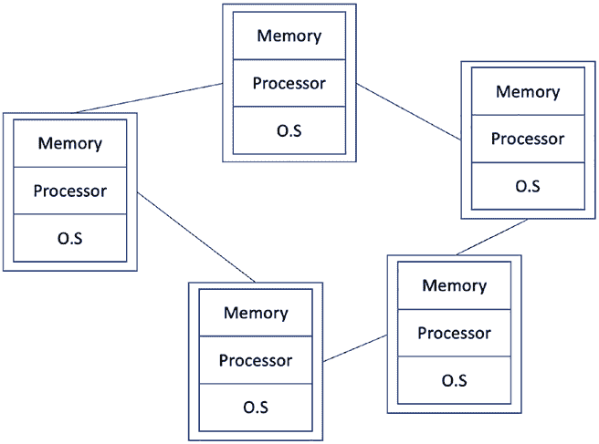

第一章 引言

***图 1-1.* 分布式系统**

在一个分布式系统中，所有进程、计算机或节点都是独立的

让我们分别看看这些原因中的每一个。

分布式系统。

添加更强大的硬件，例如更快的 CPU、更多的 RAM、更大的硬盘，

等等，但在某些情况下，你只能纵向发展到一定程度，到了某个时候，你

必须通过添加更多的计算机并以某种方式分配负载来实现横向扩展

分布式算法应该在所有处理器上同时运行

分布式系统也是连贯的。此功能抽象出所有细节

接下来，我们介绍构建分布式系统背后的一些动机:

**为什么构建分布式系统**

• 性能

• 可靠性

商品计算机、高端服务器、物联网设备、移动设备，以及几乎

用户一天；当用户数量增长时，通常的方法是通过垂直扩展

4

第一章 引言

**可靠性**

可靠性是分布式系统的一个关键优势。想象如果你只有一个单独的

在分布式系统中，这意味着每个处理器都有自己的内存和

在一个允许分布式系统容忍故障的系统中。因此，即使在分布式网络中某些计算机出现故障，分布式系统仍然可以正常运行。

• 本质上是分布式的

可靠性包括可用性、完整性和故障

容错性：

• **可用性** 意味着当客户提出请求时，

分布式系统应始终可用。

• **完整性** 确保分布式系统的状态应

总是保持稳定和一致的状态。

• **容错性** 使分布式系统能够在

有一些故障。

**性能**

在分布式系统中，可以自然地实现更好的性能。例如，在

在一组计算机集群中，可以实现更好的性能

通过并行化计算。此外，在地理上分散的分布式

网络，访问节点的客户（用户）可以从更接近的节点获取数据

他们所在的地理区域，这导致了更快的数据访问。例如，在这种情况下

互联网文件下载时，和你地理区域更近的一个镜像将比其他大陆的镜像提供更好的下载速度。

分布式系统的性能通常包括两个方面，

响应性和吞吐量。

**响应性**

此属性保证系统有合理的响应性，用户可以得到

分布式系统的充分响应。

5

第一章介 CuCTIon

**吞吐量**

分布式系统的吞吐量是另一种衡量其性能的方法

可判断分布式系统的性能。吞吐量基本上捕捉数据的速率

系统中所做的处理；通常以每秒事务数计量。

正如我们将在第 [5，hi](https://doi.org/10.1007/978-1-4842-8179-6_5)gh 章中看到的，每秒事务率在区块链系统（分布式分类帐）中非常理想。很多时候，每秒事务数或

每秒执行的查询被测量为分布式数据库的性能指标

系统的性能。吞吐量受到不同方面的影响

分布式系统，例如处理速度，通信网络质量，

速度和可靠性，以及算法。如果你的硬件不错，但算法

设计不当，那也会影响吞吐量，响应性和

系统的整体性能。

**资源共享**

分布式系统中的资源可以与其他节点/参与者共享

分布式系统。有时，有昂贵的资源，如超级计算机，

一个量子计算机，或一些工业级打印机，可能太昂贵

应在每个站点中可用；在这种情况下，资源可以通过通信共享

远程链接到其他节点。另一个场景可能是数据可以划分为

多个分区（分片）以实现快速访问。

**固有分布**

有一些情景是除了构建分布式系统外别无选择，因为

问题只能通过分布式系统来解决。例如，一个消息传递

系统本质上是分布式的。移动网络的本质是分布式的。

在这些以及类似情况下，只有分布式系统才能解决

问题；因此，系统必须经过设计分布式。

有了所有这些分布式系统的好处，仍然有一些需要解决的挑战

在构建分布式系统时需要解决。分布式系统的属性

诸如无法访问全局时钟，异步和部分故障等问题使得设计

可靠的分布式系统是一项艰巨的任务。在下一节中，我们将看一些在构建分布式系统时应该解决的主要挑战。

6

第一章引言

**挑战**

分布式系统很难构建。需要解决多个挑战

设计分布式系统时需要解决的一些常见挑战

如下所示呈现。

**故障容忍性**

例如，在数据中心有更多的计算机，有时甚至有成千上万台。

云计算的情况下，无法避免地会有某些东西出现故障。换句话说

换句话说，分布式系统的某一部分出现故障的概率，无论是网络

电缆，处理器或其他硬件，随着计算机数量的增加。

分布式系统的这个方面要求，即使分布式

系统失败（通常是某个阈值时），整个分布式系统必须保持

运行。为此，在分布式系统中研究了各种问题

容错共识是其中之一

为了构建一致性算法，使其能够继续运行的努力正在进行

在特定的节点或链路中得以实现，即使有一个故障节点或链路的阈值在系统内

分布式系统。我们将在第[3 章](https://doi.org/10.1007/978-1-4842-8179-6_3)详细了解更多细节。

一个相关的研究领域是**故障检测**，它涉及

尝试检测分布式系统中故障的算法的开发。这是

特别是在异步分布式系统中，这是一个值得关注的问题，因为在那里没有

消息传递时间的上界。这个问题变得更加棘手

当无法区分失败的节点和仅仅是

缓慢和链路上的丢失消息。故障检测算法提供概率

关于进程失败的指示。然后可以使用节点的上下状态来处理该故障。

另一个研究领域是**复制**，它提供了故障容忍性，原则是如果相同的数据在分布式系统中的多个节点上进行了复制，那么

即使一些节点宕机，数据仍然可用，这有助于保持系统

稳定并继续满足其规范（保证），并保持可用性

最终用户。我们将在第[3 章](https://doi.org/10.1007/978-1-4842-8179-6_3)详细了解更多关于复制的内容。

**安全性**

作为一个分布式系统，有多个用户使用它，其中一些可能是

恶意软件的存在使得分布式系统的安全性成为一个主要关注点。这种情况

7

第一章介绍

在地理上分散的分布式系统和开放系统中更加关键，

例如，区块链等技术，比如比特币区块链。对于这一点，基础科学

用于在分布式系统中提供安全性的一种方法是密码学，我们将在

在第[2, and w](https://doi.org/10.1007/978-1-4842-8179-6_2)章，我们将在整本书中都会提到它，特别是关于区块链共识。在这里，我们研究诸如密码学等主题

并解决诸如身份验证、机密性、访问控制等挑战，

否认，和数据完整性。

**异构性**

一个分布式系统不一定是由完全相同的硬件节点组成。它

是可能的，称为同质分布式系统，但通常硬件和

不同的操作系统之间是不同的。在这种情况下，不同的操作系统和硬件可以表现出不同的行为，从而导致同步复杂性。

一些节点可能运行缓慢，使用着有缺陷的不同操作系统，

一些可能由于更好的硬件而运行得更快，而一些可能受到资源约束

如移动设备或物联网设备。有了所有这些不同类型的节点（进程，

计算机）在一个分布式系统中变得很有挑战性，来构建一个分布式

算法在所有这些不同类型的系统上正常工作，并且持续

尽管节点的本地操作环境存在差异，但它

**分布透明性**

分布式系统的一个目标是实现透明性。这意味着

分布式系统，不管它有多少单独的计算机和外围设备

构建的，它应该出现为一个单一的连贯系统对于最终用户来说。例如，

电子商务网站可能有许多数据库服务器、防火墙、Web 服务器、负载

负载均衡器等分布式系统中的许多其他元素，但所有这些都应该

从最终用户那里抽象出来。最终用户未必关心

这些后端的“无关紧要”的细节，而仅仅是当他们发出请求时，系统做出响应。总之，如果分布式系统的行为符合

与最终用户的期望一致，尽管其异构和分散的结构。

例如，想象一下 IPFS，一个分布式文件系统。尽管文件经过分散存储在 IPFS 网络中的多台计算机上，但对最终用户来说，所有这一切

细节是透明的，最终用户几乎像使用本地文件系统一样使用它。关于其他系统，例如在线电子邮件也可以做出类似的观察

平台和云存储服务。

8

第一章介绍

**时间和同步**

同步是分布式系统的一个重要操作，用来确保一个稳定的全局

状态。由于每个进程都有其时间视图，取决于其内部物理时钟

这可能会出现分歧，时间同步成为了一个基本问题

在设计分布式系统时需要解决的问题。我们将在我们关于时间、顺序的部分看到更多细节

有趣的问题，并探讨一些解决方案。

**和时间** 在本章中。

**全局状态**

由于分布式系统中的进程只知道它们的本地状态，所以

变得相当具有挑战性，以确定系统的全局状态。有几个

可用于此目的的算法，如 Chandy-Lamport 算法。我们将

很快就会触及到。

**并发**

并发意味着多个进程同时运行。还有一个

在逻辑上和物理上并发作了区别。逻辑并发指的是

情况，当多个程序以交织方式在一个

单个处理器上同时执行。物理并发是来自同一程序的程序单位

在两个或多个处理器上同时执行。

分布式系统是无处不在的。它们每天都在使用，并且已经成为

作为我们社会日常生活的一部分。无论是因特网，万维网，比特币，

以太坊，谷歌，Facebook 或 Twitter，分布式系统现在已经成为我们日常生活的一部分

的核心，分布式系统的基础是分布式算法，这些算法构成了分布系统执行的基础。每个进程

运行着相同的算法副本，旨在解决分布式系统的问题

分布式系统的发展，因此有了分布式算法这个术语。

进程可以是计算机，物联网设备，或者是数据中心的节点。我们将抽象

这些设备并将这些表示为进程，然而在物理上它可以是任何物理计算机。

现在让我们看看一些相关的技术和术语。

9

第一章 介绍

**并行 vs. 分布式 vs. 并发**

并行系统和分布式系统之间的关键区别是并行系统

系统的主要重点是高性能，而分布式系统是

关注容忍部分故障。此外，并行处理系统可以直接访问共享内存，而在分布式系统中，所有处理器都有它们自己的

本地内存。

在表 1-1\.中显示了一个比较

***表 1-1\.** 并行 vs. 分布式系统*

**资源/**

**并行**

**分布式**

**属性**

内存

共享内存，一个共同的地址

每个处理器都有其自己的

空间

内存

耦合

紧密耦合

松散耦合

同步

通过一个全局共享时钟

通过同步算法

目标

高性能

可扩展性

算法

并发的

分布式

通讯

没有网络，共享内存

消息传递网络

分布式计算中存在一些重叠的概念，有时会出现

对于新手来说有点难以理解。在下一节中，我将尝试澄清一些相关术语和一些不明确之处。

**集中式 vs. 去中心化 vs. 分布式**

集中式系统是典型的分布式系统，客户端连接到中央

服务器或服务提供商。通常有一名管理者控制整个

系统。标准的例子是标准的客户端服务器架构，所有客户端

发送请求到中央服务器并接收响应。这些系统通常更容易开发和维护。然而，在严格意义上它们不具有容错性（更严格的意义上

在客户端-服务器架构中，只有一个中央服务器；如果中央服务器失败，客户端就无法连接和发出请求。

10

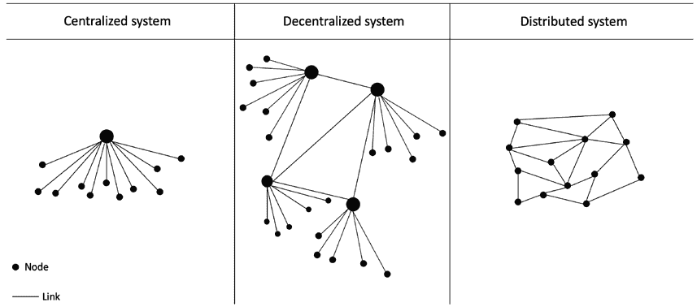

第一章介绍

去中心化系统是没有系统的中央所有者。相反，

可能有多个地点的多个所有者来监视不同部分的

系统，或者像区块链系统那样没有控制器。

与集中式和去中心化系统相比，分布式系统可以

被认为是系统中可能有也可能没有中央控制器的系统;

然而，资源和节点是分布式的。

图 1-2 显示了三种类型系统的描述。

***图 1-2\.** 集中式 vs. 去中心化 vs. 分布式*

图 1-2 展示了传统观点中的集中式、去中心化和分布式系统。然而，近年来出现了一个略有不同的情况

突出了具有中央控制器和没有控制器的系统的概念，以及所有用户都平等参与并且不依赖于可信的

第三方。这些新型分布式系统是区块链，尤其是公共的

区块链，没有中央控制器，比如比特币区块链。我们将

在本书的第[4](https://doi.org/10.1007/978-1-4842-8179-6_4)章和以后，我们将更加深入地涵盖区块链。然而，现在让我们看一下图 1-3，它描述了这种类型的架构，并突出了从控制角度的区别。

11

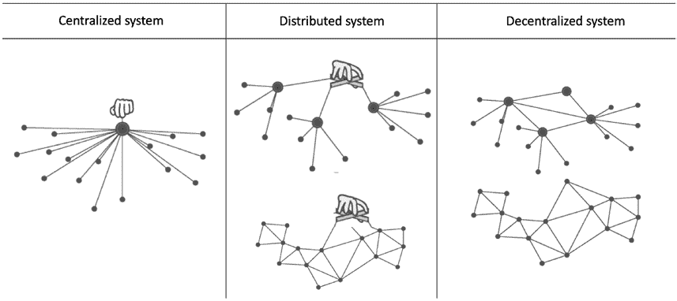

第一章介绍

***图 1-3\.** 集中式 vs. 分布式 vs. 去中心化*

请注意，在图 1-3 中，分布式和去中心化系统的拓扑结构可能是相同的，但是在图中有一个中央控制器，由图上的一个象征性的手表示。然而，在去中心化系统中，注意到没有显示手，这

描述了没有单一的中央控制器或权威。

到目前为止，我们主要关注分布式系统的架构和

一般定义和探索了分布式系统是什么。现在让我们来看看

分布式系统最重要的基本元素，即分布式

使得分布式系统能够做它应该做的事情的算法。它是

在每个节点中运行的算法以完成一个共同的

目标。例如，在加密货币区块链中的一个常见目标是禁止双重-

开销。处理此逻辑的部分是运行在

加密货币区块链的每个节点，并集体协作，

区块链（分布式系统）实现这个任务（目标）以避免双重-

开销。如果现在某些术语听起来不合适，不用担心；它们将变得

第[4] 章中明确（https://doi.org/10.1007/978-1-4842-8179-6_4）。

**分布式算法**

分布算法同时在多台计算机上运行以完成

分布式系统中的某个算法。在分布式系统中，相同的算法在

所有计算机并发地以实现一个共同的目标。

12

第一章 导言

与顺序算法相比，每个操作的执行都是

一个接着一个，并发算法是操作

同时进行。并发算法和并发性在分布式系统中是非常常见的

在计算中，例如，多个线程同时在处理器中运行，

多个应用程序在计算机上运行，计算机中的多核处理器，或者

多个进程在分布式系统中同时运行。

我们可以定义分布式算法为同时在多台计算机上运行的算法

多台机器。

分布式算法有几个优点，包括但不限于

以更好的性能为目标，可以并行化某些计算以实现更高的

相对于顺序算法，性能更好。此外，分布式算法

允许容错性；例如，如果达到一定阈值（我们将解释

Chapt [3] er 中的](https://doi.org/10.1007/978-1-4842-8179-6_3)根据由发送失败决定，分布式算法继续运行。

有消息传递算法，其中进程通过通信

通过发送和接收消息在网络中进行通信。另一种类型是共享内存

分布式算法，其中算法通过从读取和写入来进行通信

共享内存。

集中式算法按顺序执行，而分布式算法执行

同时执行。集中式算法通常不具有失败的特征，而分布式算法具有

分布式算法设计以容忍各种类型的故障。顺序

算法倾向于更直观，因为它们设计用于顺序执行，

而分布式算法可能难以理解。这是其中之一

集中式算法的正确性证明比较容易的原因之一

做，并且在大多数情况下，甚至通过观察也很明显。这在分布式情况下并非如此。

算法，其中正确性可能具有欺骗性。一个看似正确的算法可能不会

在实践中表现正确并可能遭受各种失败和违规

特性。为此，有几种形式化规范和验证技术

用于确定分布式算法的正确性。我们将涵盖一些

这些方法在第[9\.章](https://doi.org/10.1007/978-1-4842-8179-6_9)中讨论。分布式算法相对于顺序算法来说更具挑战性，设计、调试和实施都更具挑战性。此外，

从复杂度测量的角度来看，通常是以消息的数量来衡量的

在顺序集中的算法中指令的复杂性；然而，复杂性

分布式算法的复杂性是以消息的数量来衡量的。

13

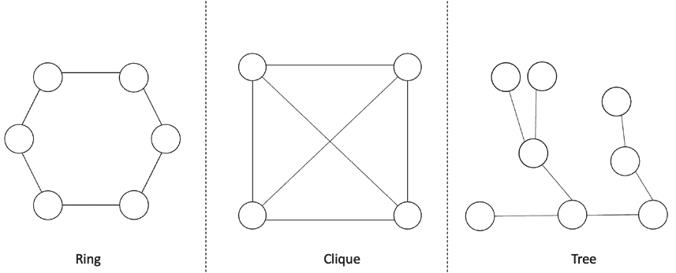

第一章介绍

**分布式计算的基本元素/相关术语/**

**概念**

分布式系统由几个元素组成。我们只对一个感兴趣

抽象的视角系统而非特定的硬件或网络细节。The

抽象的视角允许设计师在某些情况下设计和理论化关于系统的

通过建立系统模型来进行假设。稍后我们将详细说明，但首先让我们看看

分布式系统的基本元素。

分布式系统可以呈现为一个图，其中节点或流程是

由顶点表示，通信链接由边表示。一些常见的

拓扑结构如图 1-4\.所示。

***图 1-4\.** 分布式系统拓扑展示为图形*

分布系统通常被表示为由节点和组成的图

顶点。节点代表网络中的进程，而顶点代表

进程之间的通信链接。这些图还显示了结构化视图

或网络的拓扑，并有助于可视化系统。

分布式系统可以具有不同的拓扑结构（结构）可以被呈现为

如图表所示。常见的拓扑结构有**环**，它描述了每个节点都有两个相邻节点的拓扑结构。**树**结构是无环且连通的。**圈**是一个全连接图，其中所有流程都直接连接到彼此。

其他元素

• 流程

14

第一章介绍

• 事件

• 执行

• 链接

• 状态

• 全局状态

• 切割

现在让我们详细看看。

**流程**

分布式系统中的一个流程是执行分布式算法的计算机。

它也被称为节点。这是一个能独立故障的自主计算机 

可以与分布式网络中的其他节点进行通信，通过发送和接收消息

消息。

**事件**

事件可被定义为在一个进程中发生的某种操作。可以发生三种

在一个过程中发生的不同类型的事件：

**内部事件**在本地发生时

进程。换句话说，由本地计算执行

过程是一个内部事件。

**消息发送**事件发生在一个进程（节点）发送消息的时候。

向其他节点发送消息。message out to other nodes.

**消息收到**事件发生在一个进程（节点）接收到

消息。

在图 1-5 中呈现了这一点。

15

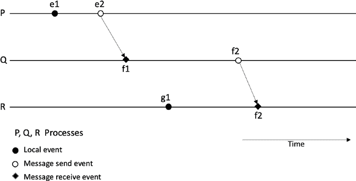

第一章介绍

***图 1-5\.** 三节点分布式系统中的事件和进程*

**状态**

状态的概念在分布式系统中至关重要。您将在这个术语中遇到

在本书和其他关于分布式系统的文本中会遇到，特别是在分布式一致性的背景下。事件构成了节点的局部状态。换句话说，状态由节点中的事件（事件的结果）组成。或者我们可以说

本地内存、存储和程序的事件结果构成了进程的状态。

**全局状态**

在分布式系统中，所有进程和通信链路中的状态集合称为**全局状态**。

这也被称为配置，可以定义如下：

分布式系统的配置由进程和状态组成

在传输中的消息。

**执行**

分布式系统中的执行是通过一个进程运行或计算分布式算法。有两种类型的执行：

• 同步执行

• 异步执行

16

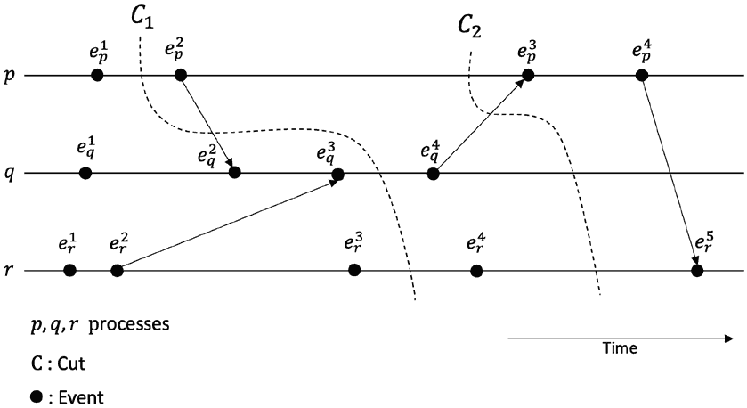

第一章介绍

**切割**

可以定义切割为连接分布式系统中每个进程线上某一点时间的一条线。

时空图上的切割可作为可视化

全局状态（在该切割处）的分布式计算的整体图景。同时，它还用作可视化图，显示了切割之前和之后发生的事件集，即过去或未来。在切割左侧的所有事件被视为**过去**，切割右侧的所有事件被视为**未来**。有一致切割和不一致切割。如果所有接收的消息在切割之前（即过去）发送，那么称为一致切割。换句话说，遵守因果关系规则的切割称为一致切割。一个不一致的切割是指一个消息从未来（切割右侧）越过切割到过去（切割左侧）的情况。

如果一个切割越过一条消息，从过去到未来，它就是一个图形化的切割。

在传输中消息的表示。

图 1-6](#p36)**所示的图表说明了这个概念，其中*C* 1 是一个不一致的切割，*C* 2 是一个一致的切割。

***图 1-6\.** 描绘分布式系统执行中切割的时空图* 诸如 Chandy-Lamport 快照算法之类的算法用于创建

分布式系统的一致切割。

17

第一章介绍

对分布式系统进行快照有助于创建

系统的快照。一个快照或全局快照捕获了包含

系统中每个进程的局部状态和每个通信链路的个体状态的快照。这样的快照对于调试、检查点和监控

目的非常有帮助。一个简单的解决方法是同步所有时钟并在一个

特定时间，但无法进行准确的时钟同步，我们可以使用

因果性以实现这样一种可以给出全局快照的算法。

假设没有故障，单向 FIFO 通道，以及存在一个

系统中任意两个进程之间的通信路径，Chandy-Lamport

算法工作如下：

• 启动快照算法的发起进程执行

以下：

• 记录自己的状态

• 向所有进程发送标记消息（控制消息）

• 开始记录其通道上的所有传入消息

• 接收标记消息的进程执行以下操作：

• 如果这是它第一次看到这条消息，则

• 记录自己的本地状态

• 将通道标记为空

• 向其通道上的所有进程发送一个标记

• 开始记录所有传入通道，除了它已经有的那一个

先前标记为空

• 如果不是第一次

• 停止记录

• 当

每个进程都收到了其所有传入通道上的标记。

• 发起进程现在可以构建完整的快照

包含每个进程和所有消息的保存状态。

18

第一章 引言

注意，任何进程都可以启动快照，算法不会干预

分布式系统的正常运行，并且每个进程记录

传入通道及其自身。

**分布式系统类型**

从通信角度看，有两种类型的分布式系统。

共享内存系统是所有节点都直接访问共享

内存。另一方面，消息传递系统是节点

通过传递消息进行互相通信。换句话说，节点发送和

使用通信链路相互通信。

现在让我们讨论一些分布式系统的软件架构模型。

软件架构模型描述系统的设计和结构。软件

架构回答了哪些元素参与其中以及它们如何运行的问题。

互相交互。分布式系统软件架构的中心焦点是进程，所有其他元素都围绕它们构建。

**软件架构模型**

有四种主要的软件架构类型，包括客户端-服务器模型，

多服务器模式、代理服务器模式和点对点模式。

**客户端-服务器**

这种模型是让两个进程共同工作的常见方式。一个进程假设

一个进程扮演客户端的角色，另一个进程扮演服务器的角色。服务器接收客户端发出的请求并以回复方式响应。客户端可以是多个。

进程但只有一个服务器进程。例如，经典的网络客户端和网络

服务器（浏览器到 web 服务器）设计遵循这种架构。图 1-7

描述这种类型架构的所谓物理视图。

19

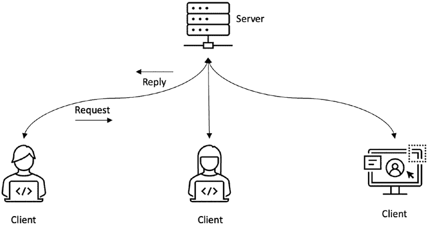

第一章 引言

***图 1-7.** 客户端-服务器架构*

**多服务器**

多服务器架构是多个服务器共同工作的地方。在一种样式的

架构，客户-服务器模型中的服务器本身可以成为另一个服务器的客户端。例如，如果我从我的网络浏览器向网页服务器发出请求

找到不同股票的价格，可能现在网络服务器向后端数据库服务器发出请求，或者通过网络服务，从其他服务器请求这些定价信息。在这种情况下，网页服务器本身已成为客户端。这种类型的架构可以看作是多服务器架构。

另一个相当常见的情况是多个服务器共同提供

为客户端提供服务，例如，多个数据库服务器向网页服务器提供数据。

实现这种协作架构有两种通常的方法。第一种是

**数据分区**，另一种是**数据复制**。与数据分区密切相关的另一个术语是**数据分片**。

数据分区是一种架构，其中数据分布在节点之间

在一个分布式系统中，每个节点负责其数据的分区（部分）。数据的分区有助于实现更好的性能，更简单的管理，负载均衡和更好的可用性。例如，每个部门的数据

公司可以被分成分区并分别存储在不同的本地服务器上。

另一种看待的方法是，如果我们有一张有一百万行的大表，我可能将五十万行放在一个服务器上，另外一半放在另一个服务器上。这个方案是

20

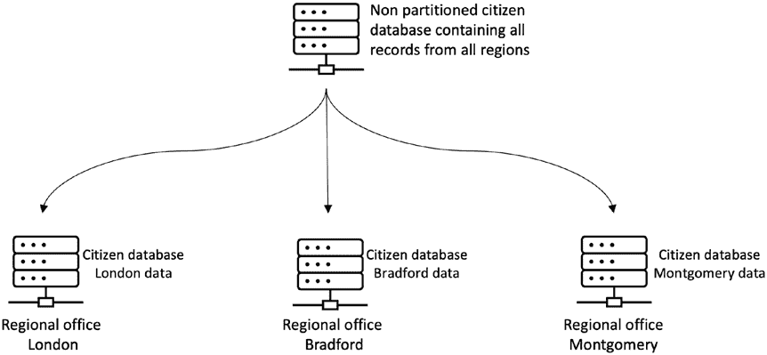

第一章 引言

称为**数据分片**或**水平分区**，或者根据分片的执行方式称为**水平分片**。

我们可以在图 1-8.中看到分区的概念

***图 1-8.** 数据分区*

注意，图 1-8 中显示的数据分区是一个大型中央数据库被分割成相关的小数据集，然后区域服务器

管理分区。然而，在另一种分区中，一个大表可以

分成不同的表，但它仍然在同一台物理服务器上。这被称为逻辑分区。

分片是数据的水平分区，其中每个分片（片段）驻留在一个

分离的服务器。这种方法的一个直接好处是负载均衡以分散

服务器之间的负载。这个概念在图 1-9 中显示。

21

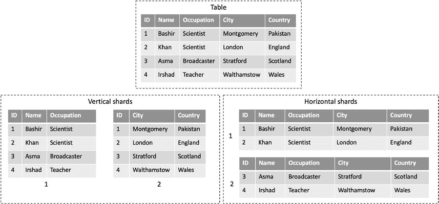

第一章 引言

***图 1-9.** 分片*

数据复制是指分布系统中的每个节点

拥有数据的相同副本。一个典型的简单示例是 RAID 0 系统；虽然它们不是独立的物理服务器，但数据被复制在两个磁盘上，

这使得它成为了一种数据复制（通常称为镜像）的架构。在另一个

的场景，数据库服务器可能运行复制服务以在多个服务器之间复制数据

多个服务器。这种类型的架构允许更好的性能、容错性和更高的可用性。在特定类型的复制和分布式基本概念中，有一种特定类型的복制은복가 없습니다。

分布式系统是使用状态机复制构建容错的分布式

系统。我们将在第[3 章](https://doi.org/10.1007/978-1-4842-8179-6_3)中更多地讨论这个问题。

图 1-10 sho。显示了多服务器架构，其中显示了客户端-服务器模型的变化。服务器可以充当另一个服务器的客户端。这是另一种

一种多个服务器共同紧密合作提供服务的方法。

22

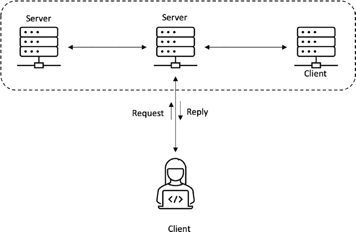

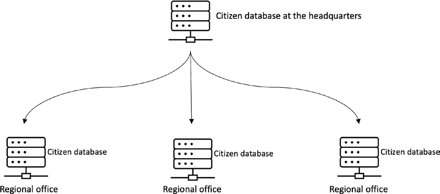

第一章介绍

**图表 1-10.** 多个服务器共同作用（客户端-服务器和多个服务器*共同紧密协作/紧密耦合的服务器)*

图 1-11 sho 中的另一个图表显示了数据复制的概念。

**图表 1-11.** 数据复制

总之，复制是指一种实践，即相同数据的副本被保留在

多个不同的节点，而分区是指将数据分割成较小的子集，然后将这些较小的子集分布到不同的节点中。

23

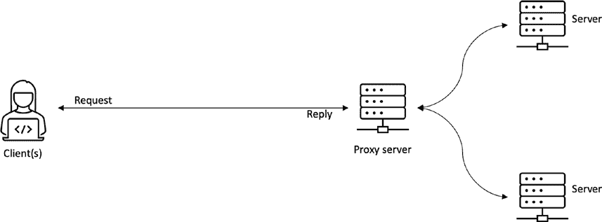

第一章介绍

**代理服务器**

基于代理服务器的架构允许客户端和中间层之间的交互

后端服务器。代理服务器可以接收客户端的请求并转发

将其转发到后端服务器（最常见的是 Web 服务器）。此外，代理服务器

可以解释客户端的请求并在处理后将其转发到服务器。

此处理包括对请求应用一些规则，也许是匿名化

通过删除客户端的 IP 地址来处理请求。从客户端的角度来看，使用

代理服务器可以通过缓存提高性能。这些服务器通常用于

企业环境中，所有的企业政策和安全措施都适用

组织中进出的 Web 流量。例如，如果某些网站需要

被阻止，管理员可以使用代理服务器来实现，所有请求都经过

通过代理服务器，并且对被阻止的站点的任何请求都会被拦截、记录并被忽略。

图表 1-12 中显示了一个代理架构。

**图表 1-12.** 代理架构-服务器和客户端之间的一个代理

**点对点**

在对等架构中，节点没有特定的客户端或服务器角色。

他们有相同的角色。没有单一的客户端或服务器。相反，每个节点都可以根据情况扮演客户端或服务器的角色。所有节点都有相同的角色导致了术语“对等”的出现。

在图表 1-13 处显示了点对点架构。

24

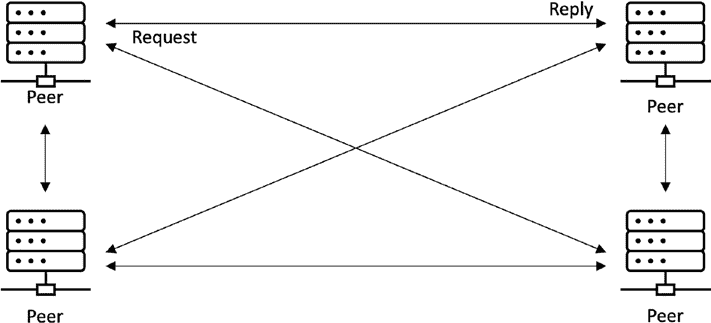

第一章介绍

**图表 1-13.** 点对点架构

在某些场景中，也可能并非所有节点都具有相同的角色；个别节点可能

作为服务器和客户端相互充当。然而，通常，所有节点在对等网络中具有相同的角色。

现在我们已经涵盖了一些分布式系统的架构风格，让我们专注于

关注分布式系统的更理论方面，它专注于抽象视图

分布式系统。首先，我们探讨分布式系统模型。

**分布式系统模型**

系统模型允许我们以抽象的方式看待分布式系统。它捕捉了

关于分布式系统行为的假设。它将使我们能够定义

一些我们期望从我们的分布式系统中获得的属性，然后对其进行推理。所有

这是在抽象层面上，不需要担心任何技术或实现问题

详情。例如，通信链路抽象仅仅捕捉到一个

通道允许消息在进程之间进行通信/交换，而无需

规定它是什么。从实现的角度来看，它可能是光纤

电缆或电线。

我们不关心硬件实现的具体细节

分布式系统模型中的技术。例如，一个进程是执行的节点

一些事件，我们并不关心担心确切的硬件

或计算机类型。

在本书中，我们感兴趣的是系统的抽象视图，而不是

物理基础设施。图 1-14 演示了这个概念。

25

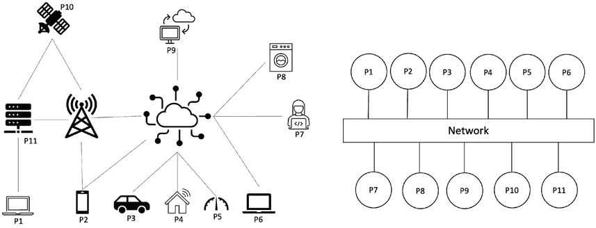

第一章介绍

***图 1-14\.** 物理架构（左）与抽象系统模型（右）*

现在让我们看看分布式系统中的三个基本抽象是什么。

失败特征化所有这些抽象。我们捕捉我们对故障的假设

可能发生在系统中的故障。例如，进程或节点可能崩溃或者行为恶意

在分布式系统中。网络可能丢弃消息，或者消息可能被延迟。

使用时间假设来捕捉消息延迟。

因此，总结一下，当创建分布式系统模型时，我们做出一些

对系统行为做出一些假设。这个过程包括时间假设

关于进程和网络。我们还对

网络和处理器，例如，一个进程如何可能失败以及是否可以

显示任意失败，对对手如何影响处理器或网络的假设，并且进程是否可以崩溃或在崩溃后恢复。网络链路是否可能丢弃消息？在下一节中，我们将详细讨论所有这些场景。

**进程**

进程或节点是分布式系统中的基本元素，它运行

分布式算法来实现分布式系统所拥有的共同目标

已经设计过。

现在想象一下在分布式系统中一个进程可以做什么。首先，让我们考虑一下

正常情况。如果一个进程按照算法的方式行为，并且没有任何故障，那么它被称为正确的进程或诚实的进程。所以，在我们的模型中，我们说一个节点正确运行是节点可能表现的行为之一。还有什么？是的，当然，它可能会失败。如果一个节点失败，我们说它是有故障的；如果没有，那么它是无故障的或者正确的或诚实的。

26

第一章概况

进程中可能会发生不同类型的故障，例如

• 崩溃停止

• 省略

• 崩溃与恢复

• 窃听

• 任意

**崩溃停止故障**

崩溃停止故障是指一个进程崩溃后永远不会恢复。这种故障模型

或节点行为捕获了一个不可修复的硬件故障，例如，在一个

主板导致故障。

**省略故障**

省略故障捕捉了处理器未能发送消息的故障场景

或接收消息。省略故障分为三类：发送

省略，接收省略和一般省略。发送省略是指一个

处理器并没有发送一个它应该发送的消息，根据分布式

算法；接收省略发生在进程不接收期望的

消息。在实际情况下，这些省略是由于物理故障、内存问题、缓冲区溢出、恶意操作和网络拥堵而引起的。

**崩溃与恢复**

表现出崩溃并且具有恢复行为的进程可以在崩溃后恢复。它捕捉

一个进程崩溃，失去了其内存状态，但恢复并继续

稍后恢复其操作。这种情况也可以看作是省略故障，其中现在

节点不会发送或接收任何消息，因为它已经崩溃。实际上，这可以是一个进程的暂时性意外重启或在一些操作系统错误后重新启动。一些例子包括因为重新启动而恢复正常操作

对于 Windows 来说就是蓝屏或者对于 Linux 来说就是内核恐慌。

当一个进程崩溃时，它可能会丢失其内部状态（称为健忘症），导致

恢复棘手。然而，我们可以通过保持稳定的存储（日志）来缓解这个问题，这可以帮助从上次已知的良好状态恢复操作。节点也可以

27

第一章概况

在恢复后失去其所有状态，并且必须重新同步其余的网络。也有可能一个节点长时间宕机，并且与网络

网络的其他节点）并且拥有其旧视图的状态。在这种情况下，节点必须与网络重新同步。这种情况在区块链中尤其常见

诸如比特币或以太坊之类的网络，一个节点可能会离线一段时间

一段时间。当它再次上线时，它会再次与其他节点同步

为了恢复其完全正常的运行。

**窃听**

在这种模型中，一个分布式算法可能泄漏机密信息，并且一个

对手可以窃听并从进程中学到一些信息。这个模型

在不受信任且地理分散的环境（如

区块链。对抗这些攻击的通常手段是加密，以提供

通过加密消息来确保机密性。

**任意（拜占庭）**

拜占庭过程可以展示任意行为。他可以背离

以任何可能的方式修改算法。它可能是恶意的，并且可以积极地试图破坏

分布式算法，有选择地遗漏一些消息，或暗中试图破坏

分布式算法。这种类型的故障是最复杂和具有挑战性的

分布式算法或系统。实际上，这可能是黑客的出现

以新颖的攻击系统的方式，网络上的病毒或蠕虫，或其他一些

前所未有的攻击。对拜占庭故障节点的行为没有限制；它可以做任何事情。

一个相关的概念是对手模型，对手行为会受到影响

建模。我们稍后将在“对手模型”部分介绍此内容。

现在我们看另一个分布式系统模型的方面，网络。

**网络**

在分布式网络中，链路（通信链路）负责传递

消息，即，从节点取出消息并发送到其他节点。通常，假设

是节点之间的双向点对点连接。

网络分区是网络链接变得不可用的一种场景

两组节点之间有一段有限时间。实际上，这可能是由于数据

28

第一章引言

不会对中心进行传递或不正确/无意的甚至是故意/

恶意防火墙规则禁止网络的一部分连接到另一部分。

**链路失效**

链路可能出现崩溃故障，其中一个工作正常的链接可能停止携带

消息。另一种类型的链路失效是遗漏失效，其中链路携带一些

消息，有的成功，有的失败。最后，拜占庭故障或任意故障可能发生在

链路，其中链路可以创建恶意消息并修改消息，以及有选择性地

发送一些消息，有的成功，有的失败。

使用此模型，我们可以将通信链接划分为不同的类型

取决于它们如何失效和传递消息。

链上发生两种类型的事件（通道），**发送事件**，其中消息被

放在链接上和**传递事件**，其中链接分发一条消息，进程*传递*它。

**公平丢失链接**

在该抽象中，我们捕捉了此链接上的消息如何丢失，重复或被

被重新排序。消息可能会丢失，但最终如果发送方和接收方

过程是正确的，发送者一直在重发。更正式地说，三

属性如下。

**公平丢失**

此属性保证具有此属性的链路不会系统地丢失

每条消息都会被交付，这意味着，最终，消息将被送达目的地

节点将成功，即使经过多次重发。

**有限重复**

这一性质确保网络不会执行比

发送者进行。

**无创建**

这一性质确保网络不会损坏消息或创建消息

凭空而来。

29

第一章说明

**顽固链路**

这个抽象捕捉了链路的行为，其中链路传递任何消息

无限次发送的。在这个抽象中对进程的假设是

保证发送者和接收者进程均正确。这种链路会顽固地尝试传递消息，而不考虑性能。链路将持续尝试

直到消息被传递为止。

形式上，顽固链路具有两个性质。

**顽固传递**

这一性质意味着，如果消息 m 从正确的进程 p 发送到正确

过程 q，那么过程 q 将无限次传递，因此称为

"顽固"!

**无创建**

这意味着消息不是凭空而来，如果一个消息被传递

通过某一进程，那么它必须是由一个进程发送的。形式上，如果一个过程 q

发送消息的过程 p，那么消息 m 确实是由

过程 p 到过程 q。

**完美（可靠）链路**

这是最常见的一种链路类型。在这种链路中，如果一个进程发送了一条消息，那么它最终会被传递。

在实践中，TCP 是一个可靠的链路。存在三个性质。

**可靠传递**

如果正确的过程 p 向正确的过程 q 发送了一条消息 m，那么 m 最终会被 q 传递。

**无重复**

正确的过程 p 不会将消息 m 传递超过一次。

30

第一章说明

**无创建**

这一性质确保消息不是凭空而来，如果它们是

如果消息被传递，它们必须是由正确的过程创建并发送过后才能传递。

**记录完美链路**

这种类型的链路将消息传递到接收器的本地消息日志或持久

存储。这在接收器可能崩溃但我们需要的情况中是有用

消息是安全的。在这种情况下，即使接收进程崩溃，消息也不会丢失，因为它在本地存储中持久存在。

**认证完美链路**

这个链接保证了从过程 p 发送到过程 q 的消息 m 确实被发送

从过程 p。

**任意连接**

在这个抽象中，链路可以展示任何行为。在这里，我们考虑一个积极

具备有权控制消息的对手。这个链路描绘了这样的场景

一个攻击者可以进行恶意行为，修改消息，重播消息，伪造消息。

简而言之，这种链路可以进行任何攻击。

在实际中，这描绘了一个典型的互联网连接，黑客可以

窃听、修改、伪造或重播消息。但是，当然，这也可能是由于

对互联网蠕虫、流量分析仪和病毒。

**注意**在这里，我们只谈论点对点链路；我们将介绍

之后在第[3\. 章](https://doi.org/10.1007/978-1-4842-8179-6_3)中进行广播

**同步和时间**

在分布式系统中，延迟和速度假设捕捉了

网络。

在实际情况下，延迟在分布式系统中几乎是不可避免的，首先

由于固有的异步、分散和异构性以及特定原因

31

第一章 介绍

诸如消息丢失、处理器缓慢和网络拥塞等。由于网络

配置更改，还可能会引入意外或新的延迟

在分布式系统中。

分布式系统的同步假设涉及网络延迟和

由于网络链接缓慢或处理器速度慢而产生的处理器延迟。

在实际情况下，处理器可能因内存耗尽而变慢

节点。例如，java 程序在“停止世界”垃圾收集期间可能会完全暂停执行。另一方面，一些高端处理器是

固有的更快。所有这些

差异和情况可能导致分布式系统中的延迟。

以下，我们讨论了捕捉时间的三种同步模型

分布式系统的假设。

**同步**

同步分布式系统对消息发送的时间有一个已知的上限

消息到达节点的时间有一个已知的上限。这种情况很理想。然而，在实际中，消息可能

有时可能会被延迟。即使在完美的网络中，也有几个因素，如

网络链接质量、网络延迟、消息丢失、处理速度或处理器的容量，这些都可能对消息的传递产生不利影响。

在实践中，同步系统存在，例如芯片系统（SoC），

嵌入式系统等。

**异步**

异步分布式系统位于光谱的另一端。在这种模型中，

至于时间的假设，则没有做出时间的假设。换句话说，没有

传递消息所需的时间的上限。可能会有任意长的和

消息传递或节点中的处理的无限的延迟。进程可以以

不同速度。

此外，进程可以任意暂停或延迟执行，或者可以更快地处理

而其他进程可能更快。现在你可能想象得到分布式算法

设计得非常健壮和有韧性。然而，许多问题

无法在异步分布式系统中解决。一整类结果被称为

"不可能的结果"捕捉了分布式系统中无法解决的问题。我们将在本章稍后和第[3\. 章](https://doi.org/10.1007/978-1-4842-8179-6_3)中更详细地讨论不可能的结果。

32

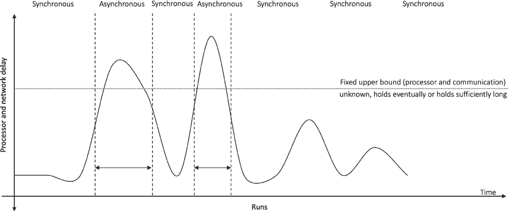

第一章 介绍

由于在异步模型中有几种类型的问题无法解决，并且

同步模型太理想主义，我们必须妥协。这种妥协被称为

部分同步网络。

**部分同步**

A partially synchronous model captures the assumption that the network is primarily

synchronous and well behaved, but it can sometimes behave asynchronously. For

example, processing speeds can differ, or network delays can occur, but the system

ultimately returns to a synchronous state to resume normal operation.

Another way to think about this is that the network usually is synchronous but can

unpredictably, for a bounded amount of time, behave asynchronously, but there are long

enough periods of synchrony where the system behaves correctly.

Another way to think about this is that the real systems are synchronous most of the

time but can behave arbitrarily and unpredictably asynchronous at times. During the

synchronous period, the system is able to make decisions and terminate.

In summary, we can quote Leonardo da Vinci:

*时间足够长，对于任何将使用它的人来说。*

Figure 1-15 shows how a partially synchronous network behaves.

***图 1-15\.** 部分同步网络*

33

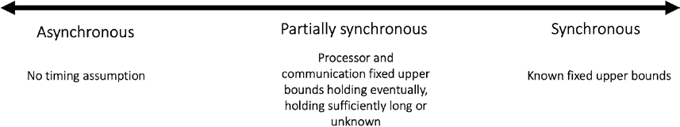

Chapter 1 IntroduCtIon

**最终同步**

In the eventually synchronous version of partial synchrony, the system can be initially

asynchronous, but there is an unknown time called global stabilization time (GST),

unknown to processors, after which the system eventually becomes synchronous. Also,

it does not mean that the system will forever remain synchronous after GST. That is not

possible practically, but the system is synchronous for a long enough period after GST to make a decision and terminate.

We can visualize the spectrum of synchrony models from asynchronous to

synchronous in Figure 1-16\.

***图 1-16\.** 分布式系统中的同步模型*

Both message delivery delay and relative speed of the processes are taken into

consideration in synchrony models.

**正式定义**

Some formal definitions regarding the partial synchrony model are stated as follows:

• Delta *Δ* denotes a fixed upper bound on the time required for a

message to reach from one processor to another.

• Phi *Φ* denotes a fixed upper bound on the relative speed of different

processors.

• GST is the global stabilization time after which the system behaves

synchronously.

With these preceding variables defined, we can define various models of synchrony

as follows:

• Asynchronous systems are those where no fixed upper bounds *Δ* and

*Φ* exist.

34

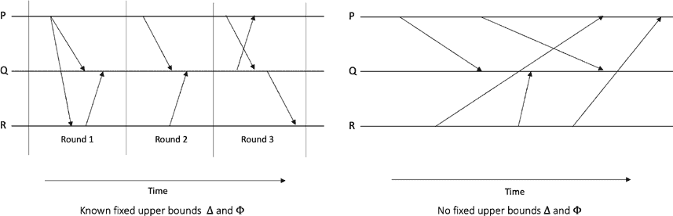

Chapter 1 IntroduCtIon

• Synchronous systems are those where fixed upper bounds *Δ* and *Φ*

are known.

Partially synchronous systems can be defined in several ways:

• Where fixed upper bounds *Δ* and *Φ* exist, but they are not known.

• Where fixed upper bounds *Δ* and *Φ* are known but hold after some

unknown time T. This is the eventually synchronous model. We can

say that eventually synchronous model is where fixed upper bounds

*Δ* and *Φ* are known but only hold after some time, known as GST.

• In another variation after GST *Δ* holds for long enough to allow the

我们将在第[3 章中更正式地使用同步模型](https://doi.org/10.1007/978-1-4842-8179-6_3)来绕过 FLP 和一致性协议。目前，作为基础概念

系统及其对分布式系统的影响以及对其产生不利影响

推车原先是足够的。

图 1-17 shows 使用时空图表展示同步与异步通信。

**阈值对手**

影响它们。

进行假设。

对手可以做的事情。但是，如果假定对手是一个全能的，可以做任何事情并控制

我们将在这里简要讨论这些类型。

35

在这个模型中，假设有一个外部实体已经腐化了

对手模型，允许我们对对手对

除了在分布式系统模型中关于同步性和时间的假设之外，

对对分布式系统产生不利影响。

它可能会对分布式系统产生不利影响。这是一个重要的模型

这允许分布式系统设计人员推理出不同的属性

***图 1-17\.** 同步和异步系统*

协议来终止。

恶意对手。因此，对手模型通常被建模为一个限制

第一章介绍

指定网络中可以破坏的进程数量的限制。

系统永远只有大于一半的节点由一个控制

任何和控制所有节点和通信链路，那么就不能保证

分布式系统。在这个模型中，我们模拟了对手的行为以及

对手模型可以根据分布式系统的不同类型分为不同的类型

面对对手的分布式系统。例如，一个分布式算法

过程，并能够控制和协调有错误的过程的行动。这个实体被称为对手。请注意，与故障模型相比，在这里有一些微小的区别

**对手模型**

现在我们已经讨论了同步模型，现在让我们转向

使用对手模型考虑因素，如**破坏类型**、**破坏时间**以及**破坏程度**（同时有多少个进程）。此外，对手可用的**计算能力**、**可见性**以及**适应性**也被考虑进去。对手模型还允许设计人员

因为在故障模型中，节点可以因各种原因出现故障，但不假定有外部实体接管进程。

阈值对手是分布式系统中标准和广泛使用的模型。在这个模型中，系统中总共有故障进程的数量受到限制。

这里有另一个模型，假设了对手的力量以及如何

对手可以以几种方式影响分布式系统。一个系统设计者

换句话说，在故障进程的数量上有一个固定的上界 f

网络。这个模型也被称为全局对手模型。许多不同的算法

在这些假设下开发出来的。几乎所有的共识协议

在至少假设了阈值对手模型的情况下工作

36

第一章引言

可以控制多达 f 个节点。例如，在 Paxos 协议中

在第[7, c](https://doi.org/10.1007/978-1-4842-8179-6_7)章讨论的经典共识算法在假设对手可以控制不到总节点数的一半的情况下达成共识

网络。

**动态对手**

在这个模型中也被称为自适应对手，对手可以腐化进程

在协议执行期间的任何时候。此外，故障的进程在执行结束之前仍然是有故障的。

**静态对手**

这种类型的对手能够执行其敌对活动，如腐化

协议执行之前只在进程之间。

**被动对手**

这种类型的对手并不积极地试图破坏系统；然而，它可以在运行协议时学到一些关于系统的信息。因此，它可以被称为

半诚实对手。

对手可以在两种模型下引起故障：崩溃故障模型和

拜占庭故障模型。

在崩溃故障模型中，对手可以阻止进程执行

协议在执行期间随时控制。

在拜占庭故障模型中，对手对

腐败的进程拥有完全控制权，并且可以控制它任意地从协议中偏离。协议

在这些假设下工作并容忍这种故障的协议称为崩溃故障

容错协议（CFT）或拜占庭容错协议（BFT）。分别。

**时间，时钟和顺序**

时间在分布式系统中起着至关重要的作用。几乎总是需要

测量时间。例如，在分布式系统的日志文件中需要时间戳

系统以显示特定事件发生的时间。从安全性的角度来看，审计要求

时间戳需要指示何时发生特定操作，例如，

当特定用户登录系统时。在操作系统中，需要时间

37

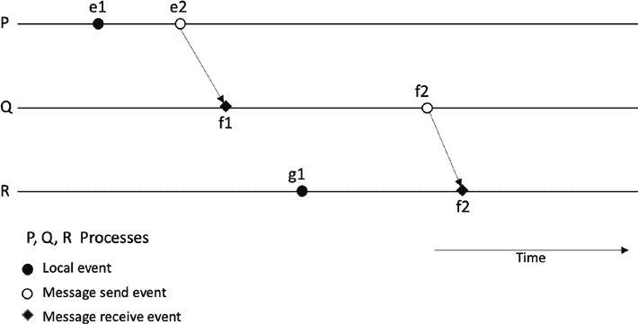

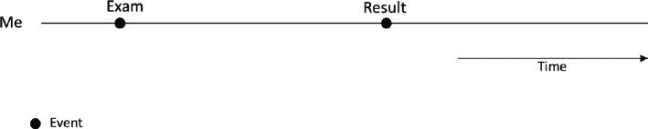

第一章介绍

用于安排内部事件。所有这些用例以及无数其他的计算机和

分布式系统操作需要一定的时间概念。

分布式系统中的时间概念很棘手。图 e 1-18 中显示的事件需要被排序，以使分布式系统变得合理有用。分布系统中事件的排序要求

分布式系统是基本且关键的要求。由于没有

在分布式系统的全局共享时钟中，事件的排序变得具有挑战性

问题。为此，这里的主要关注点是完成正确的顺序

系统中的事件。在日常生活中，我们对时间有这样的概念，我们可以说某事发生在另一件事之前。例如，如果我参加了考试，而结果

基于内部物理时钟和外部时间源的时间同步。

在一个星期后出来，我们可以确定说这个考试一定发生了或者

见图 1-19。

万国码。图 1-20 展示了从左到右的石英晶体的自然形式，组件形式，以及在外壳内部

第一章 引言

温度，和外壳。最常见的频率是 32768 赫兹，这几乎是

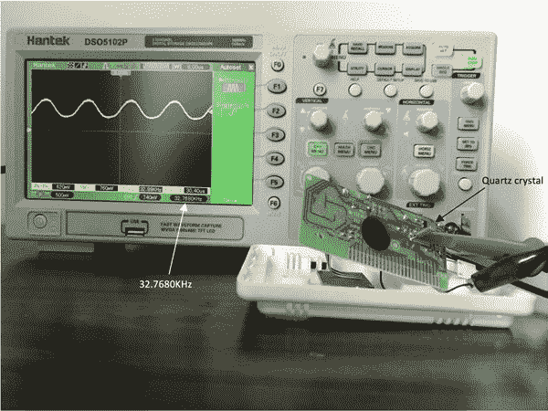

通常，我们熟悉的是物理钟，也就是我们日常的典型物理

电场暴露于高温时，时钟可能比在

***图 1-19\.** 结果出来之前发生的考试 - 一个先于的关系*

下午，或者明天上午 11 点是足球比赛。这种时间的概念是我们

算法用于在分布式系统中同步所有节点的时间。这些

制造差异，外壳和操作环境等多种因素会影响

让我们首先看看物理钟，并了解可以用于的一些算法

熟悉的。而且，物理钟可以用于分布式系统，并且一些

基于石英的时钟通常对于一般用途来说足够精确。但是，

物理钟在日常生活中被广泛使用。如今流行的数字钟是基于石英（quartz）的。

39

（太冷、太热）都会影响石英晶体的运行。通常，电子设备在

振荡器电路。

算法可以通过消息传递同步分布式系统中的时钟。

温度会减慢时钟的运行速度。想象一下，一个电子设备在

晶体，而传统的机械钟基于弹簧机制或者

38

*(中)，以及电路（右）*

正常的优越条件。由于时钟运行得更快或更慢导致的这种差异称为漂移。漂移是以百万分之一（ppm）计量。

***图 1-18\.** 三节点分布式系统中的事件和进程*

理解和时间概念，我可以说像我会在下午 3 点见你

第一章 引言

使用石英晶体。实际上，由石英晶体调节的振荡器电路用于生成精确的频率。当电场施加在石英晶体上时，它弯曲并开始以取决于其大小、切割，

- - - - - - - - - - - - - - - - - - - - - - - - - - - - - - - - - - - - - - - - - - - - - - - - - - - - - - - - - - - - - - - - - - - - - - - - - - - - - - - - - - - - - - - - - - - - - - - - - - -

***图 1-20\.** 石英晶体的自然形式（左），组件形式*

摆动钟。从手表到计算机主板上的时钟，数字时钟都是

**物理时钟**

几乎所有石英钟的频率都是 32,768 千赫，因为它的切割和大小以及它的制造方式。这是一个特定的切割和大小，看起来像一个音叉，因此产生的频率总是 32,768 赫兹。我决定做

一个小实验，用我的示波器和一个随便找到的旧时钟来演示

这个事实。

这就是结果！图 1-21 显(示 #p59)了在普通室温下时钟电路中产生 32,768 赫兹的石英晶体，显示在示波器屏幕上。

***图 1-21\.** 使用示波器测量的石英晶体时钟*

在图 1-21(#p59)中，示波器的探头连接到时钟电路上的石英晶体组件，并且波形显示在示波器屏幕上。

而且频率显示在示波器屏幕的右下角，这

读取 32.7680 千赫。

40

第一章介绍

**钟差与漂移**

由于环境因素，如温度和制造差异，

石英晶体时钟可能会变慢，导致偏移和漂移。立即

两个时钟显示的时间差称为它们的偏移，而两个时钟计时速度不同的速率称为漂移。请注意，异构分布系统节点之间的物理时钟之间的差异甚至可能更大

重要的是异构分布系统，硬件、操作系统和架构

对所有节点来说都是一样的。

一般来说，预期大约 11 天内会产生一秒的漂移，

随着时间的推移，可以导致明显可观的差异。想象两个

服务器在数据中心中运行,没有时钟同步机制，并且

仅仅取决于它们的内部石英钟。一个月内，它们将运行两个

相隔三秒。所有依赖时间的操作都将运行三

相隔几秒，随着时间的推移，这种情况将继续恶化。例如，一个批处理作业

应该在上午 11 点开始在一个月内会在上午 11 点加 3 秒开始。这种情况可能会导致依赖时间的作业出现问题，可能会导致安全问题，并可能影响时间敏感的操作，软件可能会失败或表现出任意行为。一个更

比石英钟更精确的钟是原子钟。

**原子钟**

原子钟基于原子的量子力学性质。像这样的原子

像铯或铷和汞这样的原子被用来，以及共振频率（振荡）

原子被用来记录精确和准确的时间。

我们对时间的概念是基于天文观察，比如季节变化

和地球的旋转。振动越高，频率越高，并且

更精确的时间。这是原子钟工作和产生的原则

高度精确的时间。

在 1967 年，时间单位被定义为“9,192,631,770 秒的持续时间

辐射周期对应于铯-133 原子的基态的两个超精细能级之间的跃迁。”换句话说，在受控环境下铯原子在两个能级之间振荡恰好 9,192,631,770 次

定义了一个真正的秒。原子钟如图 1-22\.

41

第一章 介绍

***图 1-22\.** 基于铯的原子钟：图片来源于 [`nara.`](https://nara.getarchive.net/media/cesium-beam-atomic-clocks-at-the-us-naval-observatory-provide-the-basis-for-29fa0c)*

[*getarchive.net/media/cesium-beam-atomic-clocks-at-the-us-naval-*](https://nara.getarchive.net/media/cesium-beam-atomic-clocks-at-the-us-naval-observatory-provide-the-basis-for-29fa0c)

[*observatory-provide-the-basis-for-29fa0c*](https://nara.getarchive.net/media/cesium-beam-atomic-clocks-at-the-us-naval-observatory-provide-the-basis-for-29fa0c)

现在想象一个场景，我们发现了时钟偏差，并且看到一个时钟

落后于十秒。我们通常可以简单地将它提前十秒钟

使时钟再次准确化。这并不完美，但不像时钟偏差那么糟糕，比如我们可能发现时钟跑慢了十秒钟。在这种情况下我们可以做什么？我们能否

只是把它推回十秒钟？这不是一个很好的主意，因为我们可以让

进入一些看起来我们收到消息之前已经发送消息的情况。

为了解决时钟偏差和偏移，我们可以与受信任和

准确的时间来源。

也许你会想知道为什么需要越来越精确的时钟要求

时钟和时间来源。石英钟对于日常使用已经足够了；然后

我们认为 GPS 是更准确的时间来源，然后我们看到了原子钟，它们

更准确，并且在大约 3 亿年内只能偏移一秒钟！1 B 但我们为什么需要如此精确的时钟？答案是对于日常使用来说，它并不

matter. 如果我手表上的时间与其他时钟相差几秒钟，那

不是问题。如果我在社交媒体上发表的帖子的时间戳差几秒钟

1 [www.nist.gov/si-redefinition/second/second-present](http://www.nist.gov/si-redefinition/second/second-present)

42

第一章 介绍

除了我发布的确切时间，也许这并不是问题。当然，只要

只要序列保持，时间戳在几秒钟内是可以接受的。但是

在许多其他实际场景和分布式系统中，情况会发生变化。对于

例如，高频交易系统需要（根据 MiFID II 法规）要求

机制格式化交易系统中的消息时间戳为微秒

并且在约 100 微秒的范围内保持精确。从时钟同步的角度来看，

只允许与世界协调时间（UTC）偏差 100 微秒。虽然这样的要求是

对于交易系统的正常运行和监管至关重要，它们也

提出技术挑战。在这种情况下，准确时间来源的选择，

同步算法的选择和偏移和漂移的处理成为关键

重要性。

您可以作为参考在这里看到具体的 MiFID 要求：

[`ec.europa.eu/finance/securities/docs/isd/mifid/rts/160607-rts-25-`](https://ec.europa.eu/finance/securities/docs/isd/mifid/rts/160607-rts-25-annex_en.pdf)

[附件英文.pdf](https://ec.europa.eu/finance/securities/docs/isd/mifid/rts/160607-rts-25-annex_en.pdf)

历史地方。

导航等等。

最近，开发出了蓝宝石时钟，它比

甚至是基于铯的原子钟。它是如此精确，以至于在三十亿年内可能会失去或获得一秒。

通常，计算机中有两种以表示时间的方式。一种是纪元

时间，也称为 Unix 时间，它定义为自 1970 年 1 月 1 日以来经过的秒数。

1970 年 1 月 1 日。另一种常见的时间戳格式是 ISO8601，它定义了一个日期

以及时间格式标准。

**物理时钟的同步算法**

有两种方法可以同步时钟：

1. 外部同步

2. 内部同步

在外部时钟同步方法中，有一个外部和权威的

时间来源，分布式系统中的节点与其同步。

在内部同步方法中，节点（进程）中的时钟是

互相同步。

43

第一章 词序

**网络时间协议（NTP）**

网络时间协议（NTP）允许客户端与世界协调时间（UTC）同步。在 NTP 中，服务器

组织成所谓的地层，地层 1 服务器（主时间服务器）位于

直接连接到准确的时间来源，例如 GPS 或原子钟

时钟。第 2 级服务器通过网络与第 1 级服务器同步，而

第 2 级服务器与第 3 级服务器同步。这种架构提供

一个可靠，安全和可扩展的协议。可靠性来自冗余使用

服务器和路径。安全性通过使用恰当的认证来提供

机制，以及 NTP 提供大量数字的能力。

客户端。尽管 NTP 是一种高效和健壮的协议，固有的网络延迟，

在协议设置中的错误配置，可能会阻止网络的

NTP 协议，以及其他若干因素仍可能导致时钟漂移。

**GPS 作为时间来源**

GPS 接收机可用作准确的时间来源。所有 31 个 GPS 卫星都有

其中搭载的原子钟可以产生精准时间。这些卫星广播它们的

位置和时间，在这里 GPS 接收机接收并计算时间和位置

在应用一些校正措施后，以纠正环境因素和时间膨胀。记住，

GPS 卫星上的时间略快于地球表面上的物体，因为由于

相对论。其他与相对论相关的效应包括时间膨胀，引力频率变化和偏心效应。所有这些错误都会被处理，并在准确时间显示在 GPS 接收器上之前进行许多其他的修正。虽然 GPS 作为一个

精确的时间来源是非常准确的，即使 GPS 接收器中存在完全正确和准确的时间，网络中引入的固有延迟随着时间的推移可能导致时钟的漂移和偏斜。有必要引入一些时钟同步

算法来解决这个限制。

Google 的 spanner（Google 的

具有处理时间不确定性的全球分布式数据库）。

但是，请注意，即使付出了所有努力，时钟也不能完美

同步，这对于大多数应用程序来说已经足够了。但是，这些非常准确的

时钟仍不足以捕捉分布式系统中事件之间的因果关系。

分布式系统。事件之间的因果关系和基本

逻辑时钟可以准确捕捉单调性属性。

44

第一章 介绍

在分布式系统中，即使每个进程都有一个本地时钟并且同步

使用一些全局时钟源，仍然存在每个本地处理器可能看到不同时间的可能性。时钟可以随着时间漂移，处理器可能会遇到 bug，或者可能存在固有漂移，例如石英时钟或 GPS 系统，使

在分布式系统中处理时间是具有挑战性的。

想象一个分布式系统，其中一些节点位于轨道上，另一些节点位于其他地方

地理位置，并且他们都同意使用 UTC。物理时钟中

卫星或 ISS 会以不同的速度运行，并且偏差是不可避免的。依赖物理时钟的核心局限性在于，即使试图完美同步它们，

时间戳会稍微有所不同。但是，这些物理时钟不能（不应该）

可用于建立分布式系统中事件顺序的原因是很难准确找到基于不同节点时间戳的全局事件顺序。

物理时钟并不非常适合分布式系统，因为它们可能会

远离。即使有一个统一的源，比如通过 NTP 的原子钟，

他们还可能随着时间偏离和脱步源。即使差异为一个

秒有时可能会造成大问题。此外，软件中可能存在 bug

可能会导致意外后果的实现。例如，让我们看看

一个著名的 bug 是跳秒 bug，这是导致互联网显著中断的原因。

服务。

**UTC 时间**

UTC 时间是全球使用的时间标准。时间有两个来源

用于组成协调世界时（UTC）的原子钟和 GPS：

•国际原子时间（TAI）

•TAI 基于全球约 400 台原子钟。一个

所有这些原子钟的组合和加权输出

产生。这是极其准确的，只有一次偏差

大约在 1 亿年后！

• 天文时间

• 这个时间是基于天文观测，也就是，

地球自转

45

第一章介绍性

尽管国际原子时非常精确，但它不考虑地球的自转，也就是

天文观测的时间决定了一天的真实长度。地球的自转不是恒定的。它偶尔会加快，总体上却在减慢。因此，一天不完全是 24 小时。地球自转的影响是由宇宙体（比如

月亮、潮汐和其他环境因素。因此，协调世界时保持在不断

与天文时间进行比较，并将任何差异添加到 UTC。这

差别是以跳秒的形式加入；在国际原子时和

天文时间达到 0.9 时，会向 UTC 添加一个跳秒。这是一种惯例

自 1972 年以来。

好吧，这似乎是一个合理的解决方案来保持两个时间同步；然而

计算机似乎无法很好地处理这种情况。Unix 系统使用 Unix 时间（纪元），

简单地说，自 1970 年 1 月 1 日以来经过的秒数。当加入一个跳秒时

添加，时钟看起来像这样：在正常情况下，观察到 23:59:59 之后，出现了 00:00:00。然而，加入一个跳秒似乎意味着 23:59:59 之后有

23:59:60 然后是 00:00:00。换句话说，23:59:59 发生两次。当 Unix 时间

处理额外增加的一秒会导致任意行为。过去，当加入一个跳秒时，整个互联网上的服务器都出现了问题，并且服务

此举至关重要，因为航空公司预订系统受到了干扰。

已经开发了一种称为“跳秒涂抹”的技术，可以在一天内逐渐增加几毫秒，以解决这种突然增加和

与此突然增加一个秒的问题。

好吧，到目前为止，我们已经看到 UTC 和天文时间通过增加一个跳秒同步。

秒。通过“跳秒涂抹”技术，我们可以逐渐增加一个跳秒，从而缓解一些突然额外的跳秒

秒。也有呼吁要彻底废除这一传统。然而，到目前为止，我们认为

添加一个跳秒是一个合理的解决方案，似乎运行得还算顺利。我们

当地球自转减慢时仅仅添加一个跳秒，但是如果地球

旋转得更快？在 2020 年，地球确实在疫情期间旋转得更快，原因不明。现在的问题是，我们要从世界协调时间（UTC）中删除一秒吗？换句话说，

介绍负跳秒！这种情况可能会带来一些更多的挑战 -

也许甚至要比加入一个跳秒更棘手。

问题是，怎么办，应该忽略吗？有什么算法可以帮助解决

删除一秒并引入负跳秒？

到目前为止，建议的是简单地跳过 23:59:59，也就是，从 23:59:58 跳到 00:00:00

直接。预计这比添加一个闰年更容易

46

第一章介绍

第二。也许，解决方案是不必要的，因为我们可以忽略地球的自转

全部变快或变慢，彻底废除闰秒调整的做法，或者

负或正。这不是理想的，但为了避免处理闰秒的问题和模棱两可，我们可能会这样做！在

写作，这是一个开放的问题。

还有一些信息在这里找到：[`fanf.dreamwidth.org/133823.html`](https://fanf.dreamwidth.org/133823.html)

（负闰秒）和[www.eecis.udel.edu/~mills/leap.html](https://www.eecis.udel.edu/~mills/leap.html)。

为了避免与物理时钟相关的限制和问题，并

同步，对于分布式系统，我们可以使用逻辑时钟，它没有

与物理时钟相关联，但是可以对分布式系统中的事件进行排序的一种方式。

尽管，正如我们所见，事件的排序和因果关系是一个重要的

在分布式系统中的要求，逻辑钟在确保这一点中起着至关重要的作用

分布式系统。

从分布式系统的角度来看，我们之前学到的全局概念

状态非常重要，这使我们能够观察到分布系统的状态

并且有助于快照或检查点。因此，时间在这里起着重要的作用，因为如果时间

在系统中不均匀（每个处理器以不同的时间运行），而且我们

尝试从系统中的所有不同处理器和链接中读取状态，结果将是不一致的状态。

**物理时钟的类型**

物理时钟分为两类：

1。天时钟

2。单调时钟

天时钟的特点是自固定时间以来的时间表示

时间点进行同步进行调整。例如，Unix 时间是从 1970 年 1 月 1 日计算的

例如，每天的时间表钟的一个例子。时间可以通过与一个

时间来源，并且可以向后或向前移动。然而，将时间向后移动

不是一个好主意。这种情况可能导致，例如，会

看起来一条消息在发送之前收到。这个问题可能是由于

时间戳是否被调整并由于由

同步算法，例如，NTP。

由于时间总是在增加，时间不应该后退；我们需要单调

时钟来处理这样的情况。

47

第一章介绍

使用物理时钟，几乎不可能提供因果关系。即使时间

使用同步服务时，仍然存在一种可能性，即一个

进程不同的足以影响事件顺序的程度。

因此，事件的排序是分布式系统中的一个基本要求。要

完全理解这种排序要求的性质，我们使用一个正式的概念

有一个叫做“发生关系”的东西。

在我们介绍 happens-before 关系和因果关系之前，让我们澄清一下
