首先学习一些基本的数学概念。这将帮助我们不仅理解因果关系，而且

也将有助于以后在本书中解释的概念。

**集合**

集合是元素的集合。用大写字母表示。集合的所有元素都列在括号中。如果一个元素 x 存在于集合中，则写为 *x* ∈ *X*，表示 x 在 X 中或 x 属于 X。类似地，如果元素 x 不在集合 X 中，则写为 *x* ∉ *X*。元素的顺序不重要。两个集合如果具有相同的元素，则它们相等。相等表示为 *X* = *Y*，表示集合 X 等于集合 Y。如果集合 X 和 Y 不相等，则写为 *X* ≠ *Y*。一个不含任何元素的集合称为空集，表示为{}或*ϕ*。集合的一个例子是 *X* = {1 5

, ,2 8

, , }

9

如果集合 Y 的每个元素也是集合 X 的元素，则集合 Y 是集合 X 的子集，例如：

*Y* = {2 }

8

,

集合 Y 是集合 X 的子集。这种关系写作

*Y* ⊆ *X*

两个集合 A 和 B 的并集包含了 A 和 B 中的所有元素，例如：

*A* = {1,2, } 

3

并且

*B* = {3,4, }

5

48

第一章 引论

集合 A 和 B 的并集是

*S* = {1,2 3

, ,4, }

5

两个集合 A 和 B 的笛卡尔积是每个

集合 A 和 B 中的元素之间的关系。它用 *A* × *B* 表示。它是对每个 *a* ∈ *A* 和 *b* ∈ *B* 的有序对（a，b）的集合。

有序对由括号内的两个元素组成，例如(1,

2）或（2, 1）。请注意，这里有序对的元素顺序很重要，并且在有序对的情况下很重要，而在集合中，元素的顺序并不重要。例如，（1, 2）和（2, 1）是不同的，但{1,2}和{2,1}是相同的或相等的集合。 

两个集合*A*和*B*的笛卡尔积*A* × *B*的一个例子是

{(1,3), (1,4), (1,5), (2,3), (2,4), (2,5), (3,3), (3,4), (3,5)}

注意，在有序对中，第一个元素来自集合 A，第二个

集合 B 的元素。

**关系**

两个集合 A 和 B 之间的关系（二元）是笛卡尔积 *A* × *B* 的子集。

两个元素之间的关系是二元的，可以写成一组

有序对。我们可以表示为 a R b（中缀表示法）或（a，b）\in R，表示有序对（a，b）在关系 R 中。

当集合 S 上的二元关系具有自反性、对称性，和

传递性时，它被称为**等价关系**。

当集合 S 上的二元关系具有自反性、反对称性时

以及传递性时，则称为 S 的**偏序关系**。

**偏序**

它是集合 S 的元素之间的二元关系≤（小于或等于 - 用于比较）。 集合 S 上的二元关系，它是自反的，反对称的，以及传递的，被称为 S 的偏序关系。我们现在定义了三个条件。

**自反性**

这意味着每个元素与自身相关。数学上，我们可以这样写：∀ *a* ∈ *S*，*a* ≤ *a*。

49

第一章介绍

**反对称性**

这意味着两个元素不能在两个方向上相关。在数学上，

可以写成 ∀ *a*, *b* ∈ *S*，*如果 a* ≤ *b* ∧ *b* ≤ *a*，*a* = *b*。

**传递性**

传递性质表示了一种比较关系，如果 *a* < *b* 且 *b* < *c*，则意味着 *a* < *c*。在数学上，可以写成 ∀ *a*, *b*, *c* ∈ *S*，*如果 a* ≤ *b* ∧ *b* ≤ *c* 则 a* ≤ *c*。

具有偏序的集合称为偏序集或 poset。在

在发生-之前关系中，集合 *S* 是所有事件的集合。

**非自反性偏序**

非自反性偏序或严格偏序是非自反的、反对称的和

传递。

**非自反性**

这意味着没有元素与自身有关。在数学上，

我们可以这样写：∀ *a* ∈ *S*，*a* ≰ *a*，或者给定集合 S 上的关系 R，如果

∀ *s* ∈ *S*：（*s*, *s*）∉ *R*。

**全序**

全序或线性序是一个偏序，其中每对元素都是

可比较的。

在对一些数学概念做了简要介绍之后，现在让我们看看什么

因果性是什么，以及发生-之前关系是什么。

**发生-之前关系和因果关系**

我们前面看到一个节点可以执行一些事件。它可以执行本地

计算、发送消息或接收消息。所有事件按顺序发生

在单个节点上有一个顺序，很容易看到下一个事件之前发生了什么。对每个节点施加的严格全序。

50

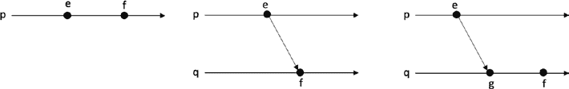

第一章介绍

发生-之前关系是一个非自反性的偏序（严格偏序），具有三个属性：**非自反性**，**反对称性**和**传递性**。

现在想象有两个事件 e 和 f 已经发生。为了确定事件 e

发生在事件 f 之前，我们使用以下规则。

事件 e 发生在事件 f 之前当且仅当（当且仅当）：e → f（箭头表示为一个

发生-之前关系的符号)：

• 如果 e 和 f 发生在同一进程上，并且 e 在 f 之前执行

在这个过程中，我们可以推断出 e 先于 f，也就是说，

顺序顺序。

• 事件 *e* 是某个（唯一）消息 *m* 的发送事件，且

事件 f 是消息 m 的接收。

• 如果存在一个事件 g，使得 e→g 且 g→f，则 e→f。这是

被称为传递关系。

我们可以在图 1-23\. 中可视化所有这些三条规则。

***图 1-23\.** 发生-之前规则*

如果 *e* 和 *f* 部分排序，那么我们说 e 发生在 *f* 之前。如果 *e* 和 *f* 不是部分排序的，则我们说 *e* 和 *f* 是并发的。这并不意味着 *e* 和 *f* 完全独立地在同一时间执行。这只是意味着 *e* 和 *f* 没有因果关系。换句话说，不存在导致

一个事件到另一个事件的。并发写为 *e* ∥ *g*。图 1-24 展示了一个详细的示例场景。

51

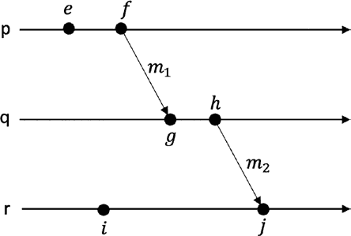

第一章 介绍

***图 1-24***。示例发生-之前的关系*

在图 1-24 中，*e* → *f*，*g* → *h*，*i* → *j*之间的关系是由于进程执行事件的顺序。*f* → *g*，*h* → *j*之间的关系是由于消息*m*1 和*m*2。此外，*e* → *g*，*e* → *h*，*e* → *j*，*f* → *h*，*f* → *j*，*g* → *j*代表传递关系。最后，并发事件为 *e* ∥ *i*，*f* ∥ *i*，*g* ∥ *i*，*h* ∥ *i*。

**逻辑时钟**

逻辑时钟不依赖于物理时钟，可以用于定义事件的顺序

分布式系统中的事件。逻辑时钟只测量事件的顺序，不带有

相对于外部物理时间的任何引用。

**Lamport 时钟**

Lamport 时钟是分布式系统中每个进程维护的逻辑计数器

系统中，每次事件发生时，计数器都会递增，以提供一种

维护和观察在分布式系统中发生的事件之间的发生-之前的关系。

分布式系统。

这里的关键思想是每个事件都被分配一个数字，随着

事件在系统中发生。此数字也称为 Lamport 时钟。Lamport

时钟捕捉因果关系。

Lamport 时钟/逻辑时钟的算法描述如下：

• 每个进程维护一个本地计数器，该计数器被设置为零

初始化。

• 每次事件发生时，计数器都会增加 1。

那个过程。

52

第一章 介绍

• 当发送消息时，进程会包含其当前值

计数器。

• 当接收到消息时，进程将其计数器值设置为

最大值（本地 + 接收） + 1。

在发生-之前的关系中，即*e* → *f*，我们可以说可能是*e*引起了*f*。

这意味着发生-之前的关系捕捉事件的因果关系。

更正式地说，Lamport 算法如列表 1-1 中所示。

***列表 1-1***。Lamport 时钟

在 init 上

t:=0

在事件 localcomputation 上执行

t := t + 1

结束

在事件 send(m)上执行

t := t + 1

send(m, t)

结束

在事件 receive(m', t')上执行

t := max(t, t') + 1

结束

Lamport 时钟与因果关系一致。我们可以这样写

*if e* → *f*⇒*LC*(*e*)< *LC*(*f*)

这意味着如果 e 发生在 f 之前，那么意味着事件 e 的时间戳（Lamport

时钟-LC）小于事件 f 的时间戳。

有一个称为**时钟条件**的正确性准则，用于评估逻辑时钟：

∀*a*, *b*：*a* → *b*⇒*LC*(*a*)< *LC*(*b*) 53

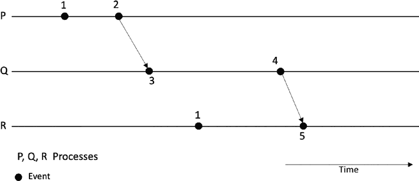

第一章 介绍

读法如下：对于所有 a 和 b，a 发生在 b 之前意味着 Lamport

a 的时钟（时间戳）小于 b 的 Lamport 时钟（时间戳）。

这意味着如果事件 A 发生在事件 B 之前，那么意味着 Lamport

事件 A 的时钟小于事件 B 的 Lamport 时钟。

现在我们可以看到一个画面正在浮现。不使用物理时钟，现在我们可以看到

分布式系统中的事件如何被分配一个可以用于

通过使用 Lamport 时钟对它们进行排序。

现在让我们在由三个组成的简单分布式系统上运行此算法

过程（节点，计算机）– P、Q 和 R。

该算法有两个关键属性：

1\. 如果

*a* → *b*，那么 LC(a) < LC(b)。

2\. 但是

*LC*( *a*) < *LC*( *b*)并不意味着 *a* → *b*。

这意味着两个事件可以具有相同的时间戳。如图 1-25 所示，在进程线 P 和 R 上，注意事件时间戳 1 是相同的。你发现了一个问题吗

在这里？在这种方案中，总顺序不能被保证，因为两个事件可以得到

相同的时间戳。

***图 1-25\.** Lamport 时钟算法的示例运行*

修复这个的一个明显方法是为带有时间戳的进程使用标识符。

这样，可以实现总排序。

图 1-26 以完全有序的逻辑时钟展示了执行。

54

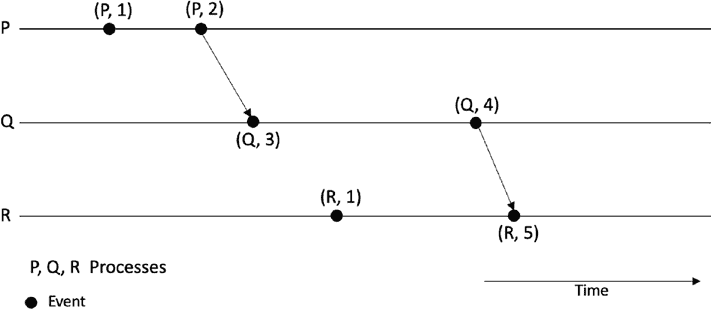

第一章 介绍

***图 1-26\.** 具有总序的 Lamport 逻辑时钟的示例运行*

知道分布式系统中事件的顺序非常有用。事件的顺序

事件使我们能够找到事件之间的因果关系。因果关系的知识

分布式系统有助于解决几个问题。一些示例包括但不限于

在复制数据库中的一致性方面有限，找出

不同事件，测量分布式系统中执行的进度，并

测量并发。

我们可以用它来构建分布式状态机。如果事件被标记了时间戳，我们

还可以看到确切地发生了一个事件以及之前发生了什么

发生在之后，有助于调试和探索分布式系统的故障。这

知识可以在构建调试程序、快照某���特定时间点、

在某个特定时间点之前修剪一些数据，以及许多其他用例。

*LC*( *a*) < *LC*( *b*)的限制并不意味着 *a* → *b*。这意味着 Lamport 时钟不能告诉两个事件是否同时发生。这个问题可以通过

使用向量时钟来解决。

**向量时钟**

这是一种逻辑时钟类型，允许检测并发事件，以及

确定事件的部分顺序和检测因果关系违规。下面是如何

它是如何工作的：

–

在开始时，分布式系统中的所有向量时钟都被设置为零，

即，[0,0,0,0,0]。

–

每当进程发生内部事件时，该进程的逻辑

向量中的时钟值递增一。

55

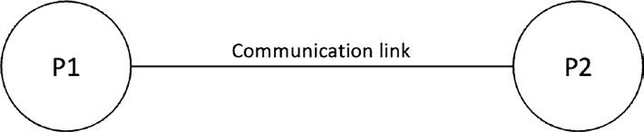

第一章 介绍

–

每当一个进程发送消息时，该进程的逻辑时钟

向量的值递增一。

–

每当一个进程接收消息时，该进程的逻辑时钟

向量中的时钟值递增一。

–

向量中的每个元素都会增加。

**故障和容错**

现在我们逐一定义每一种。  

这是进程可能表现出较慢行为或运行速度比其他进程快的情况。

分布式系统研究的核心。要了解故障，让我们看一个小例子。  

在这种情况下，进程未能发送消息。  

***图 1-27\.** 最简单的分布式系统*

第一章 介绍

遗漏故障是指消息可能丢失。  

**遗漏故障**

在这种情况下，我们捕捉处理器响应不正确的情况。  

• p1 或 p2 处的处理速度过慢\。

多种方式。  

由故障特征化。有很多工作致力于容错，并且是  

分布式系统中的故障是不可避免的。事实上，分布式系统是  

• 通信/链接故障

• 存储故障  

**接收遗漏**

系统文献。这些类型被归类为所谓的故障模型，其中  

在分布式系统中已经形式定义的几种故障。

**拜占庭故障**

在这种情况下，进程可能在任何时间点停止函数。这可能  

在这种模型中，进程可以展示任意行为；然而，存在对接收到的消息进行验证的过程，这可以通过使用身份验证和数字  

**崩溃-停止**

想想可能发生的故障：

发生硬件故障的情况下可能出现的故障。其他节点无法  

第一章 介绍

分布式系统通常可以通过使用故障检测器了解这种故障。

在这个模型中，进程可能通过停止算法的执行来失败。其他节点在这时可能无法  

分布式系统可能发生几种故障：  

• 处理器 p1 或 p2 可能会崩溃。

**定时故障**

**故障停止**

**没有身份验证的拜占庭故障**

• 进程/程序故障

在此情况下，进程无法接收消息。  

**常规遗漏**

在此情况下，进程可能会出现发送遗漏或接收遗漏。

**隐形故障**

该模型捕捉了可能隐藏或未被检测到的故障。  

找出此模型中节点崩溃的情况。  

56

想象一个只有两个节点的最简单的分布式系统，如图 1-27 所示。  

**发送遗漏**

长时间未收到消息可以视为此类型的例子之一。

该模型捕捉了进程可能以任意方式失败的故障。

• 通信链路可以失败。

**具有身份验证的拜占庭故障**

在此模型中，进程可以展示任意行为，但不进行消息验证  

签名。这种不可否认性和验证可以使处理拜占庭故障  

变得更容易一些。  

**计算故障**

最初可能看起来像部分同步行为，但一个未能及时  

可以确定消息的有效性。

• 通信链路上的延迟。

基本上告诉我们可能发生的哪些类型的故障。

执行函数的节点。

• p1 可以假装发送了某个消息；实际上并没有。

故障。这涵盖了预期消息交付与

预期交付时间或超出指定的时间间隔。

可以使用故障检测器来检测故障，其中一个进程可以被怀疑

失效。例如，一条在很长时间内没有收到的消息或超过了超时阈值的消息可以标记为失败进程。

在 Chapt[er 3; 进一步深入](https://doi.org/10.1007/978-1-4842-8179-6_3)nw 让我们来了解什么是故障模型和故障类别。

在 Figure 1-28 中，我们可以将各种故障类别可视化，拜占庭故障包含了各种不同程度的复杂故障，并且可以发生

任意地，而崩溃故障是最简单的故障类型。

58

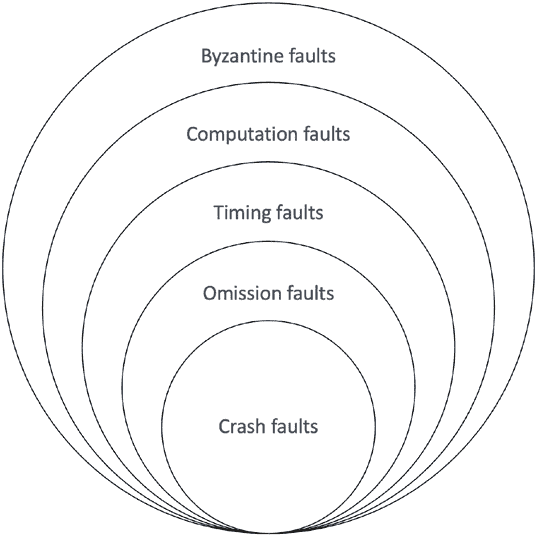

第一章 引言

***图 1-28**.** 故障模型和故障类别示意图*

故障类别让我们看到可能发生的故障，而故障模型则帮助我们

来看一下系统可能出现的故障类型和应该被

在我们的分布式算法中是可以容忍的。

只能容忍崩溃故障的系统或算法被称为崩溃故障

耐拜占庭或简称 CFT。相比之下，系统可以处理拜占庭故障的算法或系统被称为拜占庭容错系统或算法。通常情况下，这适用于一致性

机制被分类和开发的目标是崩溃故障容忍或

拜占庭故障容忍。我们在 Chapt[er 3, wher](https://doi.org/10.1007/978-1-4842-8179-6_3)e 讨论共识算法时会详细讨论更多内容。

**安全性和活性**

记得我们在通信抽象中讨论了广播协议和

点对点链路具有一些属性。例如，公平丢失属性确保在公平丢失链路下发送的消息最终会被传递。这种属性

在系统中最终会发生某事情被看作是一个活性属性。口头上

通常这意味着最终会发生一些好事情。

59

第一章 引言

同样，还记得在公平丢失链路的有限复制属性下，我们说

有有限的消息复制。这种属性就是一个系统可以容忍

测量和观察无限时间的叫做安全性属性。口头上说

这意味着永远不会发生坏事情。当然，如果你什么也不做，那么

永远不会发生任何事情，这从理论上满足了安全性属性；然而，在这种情况下系统没有任何进展。因此，活性属性

进行系统的进展也是必要的。

这些属性用于许多不同的分布式算法来推理

协议的正确性。此外，它们经常用于描述一致性协议的安全性和活性要求和属性。我们将会覆盖

在 Chapt[er 3](https://doi.org/10.1007/978-1-4842-8179-6_3)中详细讨论分布式一致性。

安全性和活跃性是分布式算法的正确性属性。对于

例如，交叉路口交通信号的安全性和活跃性可以描述为

随之而来的是：在这种情况下的安全属性是，任何时刻，只有一个方向必须是绿灯，而且没有信号应该同时亮着所有灯。另一个安全属性可能是系统不应该关闭任何信号。而活跃性

属性是，最终，每个信号灯都必须变成绿灯。

例如，在部分同步系统中，为了证明安全属性，这是

假设系统是异步的，而为了证明系统的活跃性，

部分同步假设被使用。系统的活跃性进展是

在部分同步系统中得到保证，例如，GST 之后，系统

长时间的同步的确足以让算法实现其目标并

终止。

要使分布式系统实际可行，必须保证安全性和活跃性属性

指定和保证。

**容错形式**

一个正确的程序（分布式算法）满足其安全性和活跃性属性。

如果一个程序容忍一类给定的故障并保持活跃和安全，我们称这种容错能力为掩护式。如果一个程序可以保持安全但不能保持活跃，我们称这种容错能力为故障安全。同样，在故障存在的情况下，程序不能保持

安全（不安全）但仍然保持活跃。这种行为称为非掩护。如果程序是

在故障存在的情况下，既不活跃也不安全，这意味着这个程序不具备任何形式的容错能力。

60

第一章 引言

**CAP 定理**

CAP 定理规定分布式系统只能实现三项中的两项所需的

特性，即一致性，可用性和分区容忍。让我们首先定义这些术语，然后我们将更详细地调查定理。

**一致性**

一致性属性意味着数据应该在所有节点之间保持一致

分布式系统，以及同时连接到分布式系统的客户端

应该看到相同一致的数据。这通常是通过复制来实现的。

**可用性**

可用性意味着分布式系统即使在

故障存在的情况下。这是使用容错技术如复制，分区或分片来实现的。

**分区容错**

分区指的是两个或多个之间的通信链路

节点中断。分布式系统应该能够容忍并继续

正确地运行。

我们知道网络中的分区几乎是不可避免的; 迟早会有

将会有一些通信中断。这意味着随着网络分区的出现

不可避免的，选择实际上是在可用性和一致性之间做出选择。

问题是，在分区的情况下，我们愿意牺牲什么，

一致性或可用性。这完全取决于具体情况。例如，在一个金融

应用程序时，最好牺牲可用性而取得一致性优势，但在 web 搜索结果中，我们可以牺牲一定的一致性来换取可用性。应该注意的是，在没有网络分区时，一致性和可用性是

都提供。但再一次，如果出现网络分区，那么我们选择什么，

可用性还是一致性?

1-29  图中所示的 Venn 图可以用来直观展示这个概念。

61

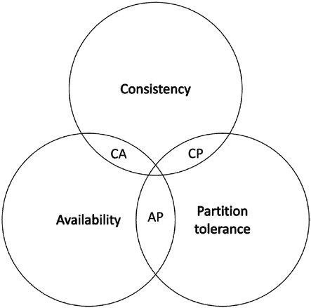

第一章介绍

***图 1-29\.** CAP 定理*

CAP 定理允许我们根据

它们支持的属性。例如，CP 数据库提供了一致性和分区

容错性，但牺牲了可用性。在分区的情况下，非一致性节点被关闭，直到网络分区恢复。AP 数据库牺牲了一致性

但提供可用性和分区容忍性。在网络分区的情况下，存在一种可能性，即由于网络

分区将继续提供旧数据。在某些场景中，这可能是可以接受的，

例如 web 搜索。当分区恢复时，不同步的节点会被同步

与最新的更新。另一方面，CA 数据库没有容错性和

只有在网络健康的情况下才能提供一致性和可用性。正如我们看到的

早先，网络分区是不可避免的；因此，CA 数据库只存在于理想的世界中，即没有网络分区发生的世界。

虽然 CAP 定理是有帮助的，但还有许多其他更精确的不可能

导致分布式计算。

现在让我们讨论一下最终一致性是什么。最终一致性指的是

节点可能存在不一致或不更新他们的本地数据库，但最终

状态是一致的并得到更新。

这样的情景的一个例子可能是当一个电子投票系统捕获

选民的选票并将其写入中央投票注册系统。但是，它可能

由于网络分区，中央投票的通信链路可能发生故障

62

第一章介绍

注册系统丢失，这台投票机现在无法将数据写入后端投票注册系统。现在它能够从用户那里不断地接收选票，并且

将它们记录在本地，并在网络分区恢复时，可以将选票写回

到中央投票注册系统。在中央投票注册系统的网络分区中，选票的数量与投票机所见到的不同。机器可以写回中央投票注册系统

当分区恢复以实现一致性时。后端之间的一致性

服务器存储和本地存储不会立即实现，但随着时间的推移，这种一致性称为最终一致性。

当前已经确立的一个最终一致性系统的例子是比特币。我们将

了解更多信息，请查看第[4](https://doi.org/10.1007/978-1-4842-8179-6_4)章，看看比特币如何实现最终一致性。

域名系统（DNS）是实现

最终一致性。当名称更新时，它会根据配置的方式进行分发

模式，并且最终所有客户端都能看到更新。

通过 CAP 理论的视角看，分布式共识是一个 CP 系统

在牺牲可用性以保证一致性的情况下。因此，分布式

共识被用来提供强一致性的保证。

例如，如果您有一个五节点系统，其中三个节点宕机，那么

整个系统会一直停滞，直到其他三个节点重新上线。这是因为一致性

即使系统一段时间不可用，也可以保持这种保证。

如果我们看比特币，似乎它是一个牺牲一致性一段时间的 AP 系统，但是最终一致性被实现。因此，

比特币还可以被视为是一个保证最终强一致性的 CP 系统。

通常，强一致性（也称为线性一致性）是分布式系统

共识这是专门用于的；然而，在比特币等系统中，最终一致性也是

可接受的。

**分布式系统中的密码学**

分布式系统在暴露于具有挑战性的条件下运行，他们面对着

对手、故障和不受信任的用户。在这种情况下，保护分布式系统免受所有这些威胁变得至关重要。因此，必须采取适当的安全措施来阻止任何破坏系统的企图。

63

第一章 介绍

分布式系统中通常需要的安全服务包括保密性，

完整性、访问控制和认证。为此，加密学在分布式系统中发挥着重要作用。

加密协议通过利用

对统称密码学原语，如对称密码学、非对称密码学

和哈希函数。

我们将在第 [2, wher](https://doi.org/10.1007/978-1-4842-8179-6_2)章学习加密学以及其在分布式系统和区块链中的应用时，介绍这个主题。第 [2](https://doi.org/10.1007/978-1-4842-8179-6_2)章将介绍几种在共识协议和区块链中实现数据一致性的原语。

完整性和相关的安全目的。

**摘要**

我们在这一章中涵盖了几个主题：

• 分布式系统是一组互相连接的计算机

通过消息协调一起达成共同目标。

• 分布式系统面临着几个挑战。最突出的是

（1）没有共同的全局知识，（2）没有全局时间，（3）实现

一致性，以及（4）故障。

• 分布式系统模型使我们能够推理出系统并

抽象出所有不必要的细节。

• 长秒钟错误是导致

互联网服务和已开发出多种技术

解决这个问题。

• 必须确保分布式系统中的安全性和活性属性

系统。

• 故障容错分布式算法仅处理崩溃故障，

而拜占庭容错算法则被设计用于处理

任意故障。

• 逻辑时钟不依赖于物理时钟，可以用来

定义分布式系统中事件的顺序。

64

第一章 介绍

• 在分布式系统中，相同的算法在所有计算机上运行

并发地实现共同目标。

• CAP 定理指出分布式系统只能提供

三个所需特性中的两个，即一致性、可用性和

分区容错。

**参考文献**

1\. 安全性和活性特性首次在一篇论文中形式化

由 Alpern, B.和 Schneider, F.B., 1987\. 识别安全性和

活性。分布式计算, 2(3), 第 117–126 页\.

2\. 事件的时序和排序的概念首次在

1978 年在"Lamport, L., 2019\. 时间、钟表和

分布式系统中的事件。在并发：Leslie 的作品

Lamport（第 179–196 页）。“

3\. Cachin, C., Guerraoui, R.,和 Rodrigues, L., 2011\. 引言到

可靠和安全的分布式编程。Springer Science &

商业媒体。

4\. Brewer, E.A., 2000 年 7 月。走向稳健的分布式系统。在

PODC（第 7 卷, No. 10.1145, 第 343–343502 页）。

5\. Van Steen, M.和 Tanenbaum, A., 2002\. 分布式系统

原则和范例。网络, 2, p. 28\.

6\. Coulouris, G., Dollimore, J., 和 Kindberg, T. 分布式系统：

概念和设计第 3 版。系统，2(11), p. 15\.

7\. Kleppmann, M., 2017\. 设计数据密集型应用程序：The

可靠、可扩展和易维护系统背后的重要理念。

O’Reilly Media, Inc.

8\. Kleppmann, M., 分布式系统。温哥华。

9\. 蓝宝石钟[: https://sciencemeetsbusiness.com.au/](https://sciencemeetsbusiness.com.au/sapphire-clock/)

[蓝宝石钟](https://sciencemeetsbusiness.com.au/sapphire-clock/)

65

第一章 介绍

10\. 蓝宝石钟[: https://spectrum.ieee.org/](https://spectrum.ieee.org/for-precision-the-sapphire-clock-outshines-even-the-best-atomic-clocks?utm_campaign=post-teaser&utm_content=7190c3vu)

[蓝宝石钟超越了最好的原子钟](https://spectrum.ieee.org/for-precision-the-sapphire-clock-outshines-even-the-best-atomic-clocks?utm_campaign=post-teaser&utm_content=7190c3vu)

[时钟？utm_campaign=post-teaser&utm_content=7190c3vu](https://spectrum.ieee.org/for-precision-the-sapphire-clock-outshines-even-the-best-atomic-clocks?utm_campaign=post-teaser&utm_content=7190c3vu)

11\. Bashir, I., 2020\. 掌握区块链：深度挖掘

分布式分类帐、共识协议、智能合约、DApp 等，

加密学货币、以太坊等。 Packt Publishing Ltd.

12\. Baran, Paul. 关于分布式通信：I. 介绍到

分布式通信网络。圣莫尼卡，加利福尼亚：兰德

公司，1964 年。[www.rand.org/pubs/research_memoranda/](http://www.rand.org/pubs/research_memoranda/RM3420.html)

[RM3420.html. 也](http://www.rand.org/pubs/research_memoranda/RM3420.html)可打印形式。

66

**第二章**

**密码学**

本章将涵盖密码学及其两种主要类型，对称密码学

和公钥密码学。在探索了一些基本思想之后，我们将深入研究

更深入地了解对称密钥原语，然后是公钥原语。

另外，我们将审查哈希函数、消息认证码、数字

签名方案和椭圆曲线密码学。最后，我们将为你解释一些信息

一些渐进的想法，提议和技术，特别是那些用于

区块链共识。

**介绍**

密码学是在敌手存在的情况下进行秘密通信的科学。

从历史上讲，这个主题更多的是艺术，但是现在它是一个严格的和正式的科学，有着正式的定义、假设和安全性证明。

有三个密码学的基本原则：保密性，完整性，

和真实性。保密性是确保信息只可用于授权实体。完整性确保只有授权实体能够修改信息。最后，真实性保证消息的有效性或实体的身份。

认证可以是两种类型，实体认证或数据来源认证。

实体认证确保一个声称某种身份的实体（申请者）

可以确切地识别另一个身份（验证者）并且实体是活着并参与的。一些不同的方法，如你拥有的东西（例如，硬件令牌），

你所知道的东西（例如，密码），以及你是什么（例如，指纹）

用于在识别协议中实现实体认证。实体认证

是安全分布式系统中的基本关注点。作为分布式系统

是分散和异质的，具有多个用户，它可以成为一个容易的攻击目标

67

© 伊姆兰·巴希尔 2022

I. 巴希尔，*区块链共识*，[`doi.org/10.1007/978-1-4842-8179-6_2`](https://doi.org/10.1007/978-1-4842-8179-6_2#DOI)

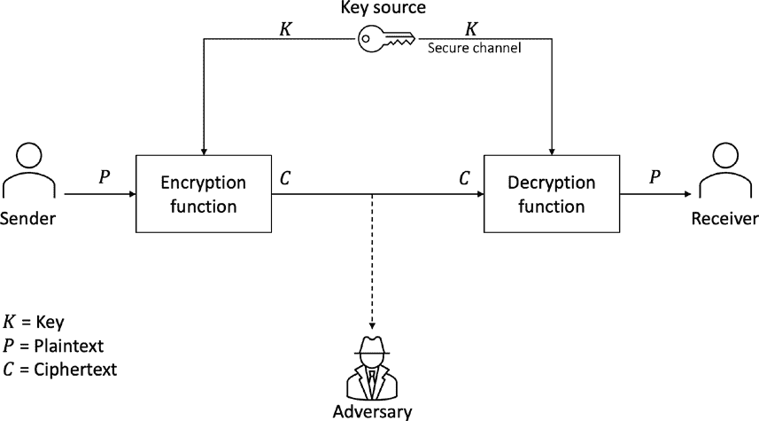

第二章 密码学

对抗攻击。特别是在区块链的情况下，特别是共识

运行于区块链的协议，实体认证对

确保防范对抗攻击。认证协议是使用

对称和公钥密码学。

另一个相关的保证是不可否认，即实体在执行后

行为不能否认其行为。通常，这是通过数字签名实现的。除了双方协议，还有多方不可撤销协议

适用于多方。

数据来源认证或消息认证确保信息

信息是真实和经过验证的。消息认证码（MAC）和数字

签名用于提供数据的原始认证。

**典型的密码系统**

典型的密码系统模型如图 2-1\. 中所示，我们可以将密码系统定义为密码原语的组合体，

协议和算法来实现指定的安全目标。因此，加密系统由几个组件组成。

***图 2-1\.** 密码系统或加密方案的模型*

68

第二章 密码术

在该系统中有三个主要角色：发送方、接收方和对手。发送方

想要通过不安全的通道发送秘密消息给接收方，在对方存在的情况下

恶意的攻击者希望了解有关消息的消息的对手。其他

元素包括明文、密文、密钥、安全通道、加密函数、解密函数和密钥源：

• 发送方是消息的发送方。

• 接收方是消息的预期接收方。

• 加密函数是将加密算法转换为的的算法

通过使用加密密钥和明文将明文转换为密文。

作为输入。

• 解密函数是将解密算法转换为的的算法

通过使用解密密钥和密文将密文转换为明文

作为输入。

• 明文是 Alice 希望发送给 Bob 的原始消息

这样就没有人可以了解原始消息，除了

预期的接收方。它是可读的并且易于 Alice 和任何

授权实体。

• 密文是明文的混淆形式，除非

解密是对读取它的任何人都毫无意义。

• 密钥源是密钥管理系统或一些

生成或获得密钥的密码。

• 密钥是用于加密和/或解密数据的某个值。

• 安全通道是通过该通道可以传递消息的一些通道

未经窥视的情况下对消息进行解密。

• 对手是一些恶意的黑客（或窥视者，观察者）

谁可以读取加密数据并尝试了解一些信息

通过对其进行密码分析或其他手段来获取。

69

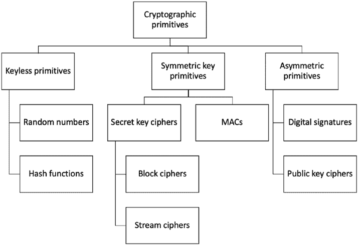

第二章 密码术

**密码原语**

加密原语是提供特定安全性的基础方法。

服务，例如保密性或完整性。这些密码原语

用于构建安全协议，例如认证协议。密码

原语包括对称原语、非对称原语和无密钥原语。

显示了密码原语的高级分类，如图 2-2 所示。

***图 2-2\.** 密码原语*

现在让我们看看对称原语。

**对称加密**

对称加密系统使用相同的密钥进行加密和解密。该密钥

必须保密并在数据传输之前通过安全通道传输

发送方和接收方之间。对于安全的密钥传输，密钥建立协议

通常使用公钥密码学来交换密钥，从而更容易

对称密钥管理比对称密钥管理更具挑战性，因为它可能变得具有挑战性

随着用户数量的增长，管理密钥变得困难。

70

第二章 密码学

对称密码算法的主要目的是提供

保密性，但我们也可以使用它们来提供其他安全服务，如数据源认证。

有两类对称加密系统，流密码和分组密码。

图 2-3 展示了流密码和分组密码的高层操作方式。

***图 2-3\.** 流密码（左）vs. 分组密码（右）*

**流密码**

这些加密系统一个比特一次加密明文。算法以明文的单个位为输入，对其进行处理，生成单个位的密文。处理涉及使用异或操作执行加密和解密。

流密码模型如图 2-4 所示。

71

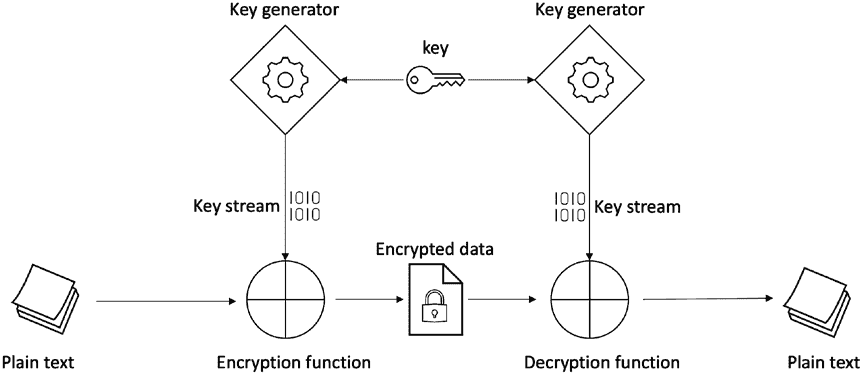

第二章 密码学

***图 2-4\.** 流密码模型*

在这个模型中，明文逐位输入到加密函数中，与

密钥生成器生成的密钥流。密钥生成器生成一个伪随机

通常比明文要小得多。通常，密钥长度是

128 位。密钥流和明文经过异或运算产生密文。

在解密过程中，相同的过程再次应用，明文被检索出来。

伪随机生成意味着生成的位不是随机的，但看起来是

随机，因此称为伪随机。密钥流通常使用

线性反馈移位寄存器（LFSR）。LFSR 的输入位是其先前状态的线性函数，其中线性函数通常是异或操作。

密钥生成器是一个密码安全的伪随机数生成器。

（CSPRNG 或 CPRNG）。“伪”，我们可以计算出数字，而其他任何人

计算它将产生相同的结果，这意味着这些 PRNG 也是

确定性。如果它们确实是随机的而不是确定性的，那么一旦生成，

随机数不能由其他人重新生成，这意味着解密

不可能。因此它们看起来是随机的，但实际上它们不是，而是可计算的。

CPRNG 具有一种特殊的属性，即它们生成的数字是不可预测的。

有两种类型的流密码：同步流密码和

异步流密码。在同步流密码中，密钥流是

仅依赖于密钥。相反，密钥流依赖于固定数量的

在异步流密码中，先前传输的加密位和密钥。

72

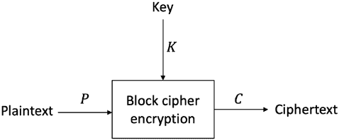

第二章 密码学

流密码通常更适合硬件设备；然而，它们也可以

在软件环境中使用。流密码的许多例子存在，如 A5/1，

用于 GSM 通信以提供机密性。然而，Salsa20 和 ChaCha

在软件环境中最常使用。其他一些流密码包括 Trivium，

Rabbit，RC4 和 SEAL。

**块密码**

块密码通过将明文分成固定长度的块来加密。历史上，块密码，如 DES，是使用费斯特尔机制构建的。现代密码，如

例如 AES，使用替换-置换网络（SPN）。

块密码的简单模型如图所示。2-5\.

***图 2-5** 块密码*

在图中所示的模型。2-5 com 们包括明文、加密和密文。

加密器接受固定长度块的明文和秘钥作为输入

产生密文块。

块密码主要用于加密，但也可以用来构建哈希

函数，创建流密码，并构建伪随机数生成器和

消息认证码。

加密试图实现的两个必要属性是混淆和

扩散。混淆为加密文本和

明文之间的关系添加了隐晦性。

现代加密算法中称为 S 盒，例如 AES。

扩散确保了明文在加密数据上的统计分布。换句话说

换句话说，它确保即使明文中的一个单一位发生改变，密文也发生了如此大的变化，以至于明文和密文之间的关系被隐藏了。

换句话说，它隐藏了明文的统计属性，以防止统计 73

第二章密码学

分析攻击。此外，置换盒在现代加密中提供扩散

算法，如 AES。因此，混淆和扩散结合在一起创建

安全的密码算法。

数据加密标准（DES）是在 1970 年代开发的，并且被使用

广泛用于 1980 年代和 1990 年代。随着时间的推移，由于技术进步，这

DES 的效力开始减弱。主要是因为它的 56 位较小的密钥长度。

在 1990 年代末出现一些成功的穷举攻击，如深拆和

COPACOBANA，显然 DES 不再安全。因此，三重

DES 由三重 DES 替代，后者将加密三次以增加

密钥长度基本上为 112 位。这有助于防止穷举攻击，事实上，三重 DES 直到今天仍然无法破解。然而，NIST 最终用

由于 2001 年性能缓慢和 64 位块大小的担忧，AES 应运而生。

块密码的不同工作模式。这些模式使块

密码不仅提供机密性，而且提供完整性和真实性。一些

模式包括

• 电子密码本模式

• 密码块链接模式

• 计数器模式

• 密码反馈（CFB）模式

• 伽罗瓦/计数器模式（GCM）

• 输出反馈（OFB）模式

我们只会在这里解释三种模式。

**电子码本**

电子码本（ECB）是一种基本的操作模式，其中加密

数据是应用加密算法到每个明文块，

一次一个。

这种模式最为直接，但在实践中我们不应该使用它，因为它是

不安全且可能透露信息。

74

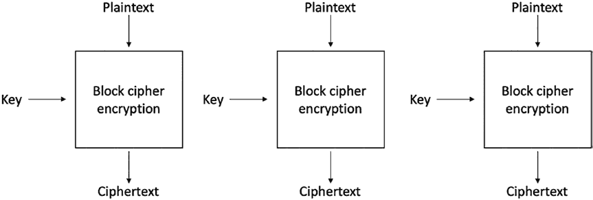

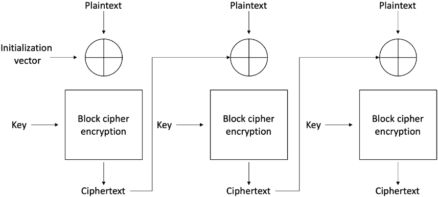

第二章 密码学

***图 2-6\.**- 电子码本模式 用于块密码*

图 2-6 显示，我们将明文 P 作为输入提供给块密码加密函数并使用一个密钥，产生输出密文 C。

**密码块链接**

在密码块链接（CBC）模式中，每个明文块与先前的 XOR

加密块。CBC 模式使用 IV 来加密第一个块。IV 必须是

随机选择。CBC 模式的操作如图 2-7\.所示

***图 2-7\.** 密码块链接模式*

75

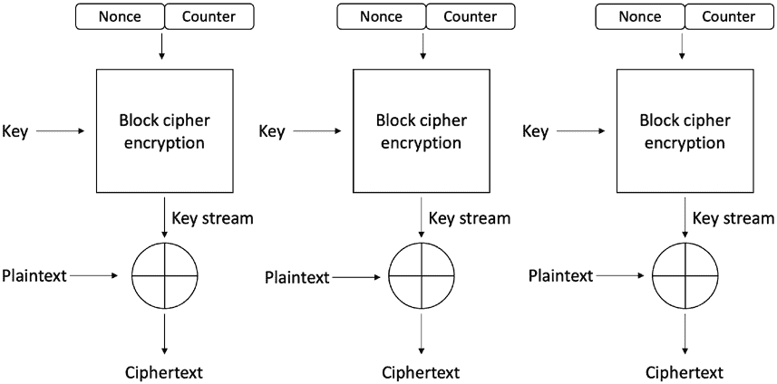

第二章 密码学

**计数器模式**

计数器（CTR）模式使用块密码作为流密码。在这种情况下，一个独特

随机数与计数器值连接在一起以生成密钥流。

正如图 2-8 所示，CTR 模式通过利用一个随机数 N 和一个计数器 C 输入块密码加密函数。块密码

函数将秘钥“KEY”作为输入，并产生一个密钥流（一串

伪随机或随机字符），当与明文（P）进行 XOR 操作时，

生成密文（C）。

***图 2-8\.** 计数器模式*

还有其他我们可以用于不同目的的模式。

我们将在下面的部分讨论其中一些。

**密钥流生成模式**

在密钥流生成模式下，加密函数生成密钥流。流

密码使用这个密钥流，其中它与明文流进行 XOR 操作，产生

密文。

76

第二章 密码学

**消息认证模式**

消息认证码（MAC）是从加密函数中产生的

消息认证模式。MAC 是提供

完整性服务。密码块密码（CBC 模式）中的块密码用于

以生成 MAC。我们可以使用 MAC 来检查非授权实体是否修改了

消息。我们通过使用 MAC 函数使用密钥加密消息来实现这一点。

然后，接收者通过再次加密收到的消息来检查消息的 MAC

与密钥进行比较。如果它们匹配，就意味着没有

未经授权的实体已经修改了消息；因此，提供完整性服务。如果

它们不匹配，那么意味着一些未经授权的实体已经改变了消息

在传输期间。

任何块密码，如 CBC 模式中的 AES 都可以生成 MAC。MAC

消息是 CBC 操作的最后一轮的输出。密文的长度

MAC 输出与用于生成

MAC。尽管 MACs 的工作方式类似于数字签名，但它们无法提供

由于其对称性质，不可辩驳的服务。

**密码哈希模式**

哈希函数主要用于将消息压缩为固定长度的摘要。块

密码哈希模式中的密码也可以用作压缩功能

生成哈希。

现在我们详细描述高级加密标准（AES）。

**高级加密标准**

AES 最初被命名为 Rijndael，以其发明者的名字 Joan Daemen 和 Vincent

Rijmen。它在 2001 年被 NIST 标准化为高级加密标准（AES）

经过公开竞赛后。

在 Rijndael 的原始版本中，允许 128 位、192 位和 256 位不同的密钥和块大小。然而，只允许 128 位块大小和 128 位、192 位密钥大小

位和 256 位在 AES 中是被允许的。

AES 在多轮中处理一个称为状态的 4 x 4 字节数组

取决于密钥大小。例如，如果密钥长度为 128 位，则有 10 轮

需要；对于 192 位，需要 12 轮；对于 256 位，需要 14 轮。

77

第二章 密码学

在使用输入明文进行状态初始化后，AES 按顺序执行

以下四种操作生成密文：

• **AddRoundKey**：首先，状态数组与派生的子密钥进行异或

从主密钥。

• **SubBytes**：这一步执行**字节替换**，其中使用固定查找

表（S-盒）用来替换 4 x 4 状态数组的所有字节。

• **ShiftRows**：这一步将状态数组中的每一行向左移动

循环和增量方式。第一行除外，第二行

行向左移动一个字节，第三行向左移动两个字节，

第四行向左移动三个字节或位置。

• **MixColumns**：最后，所有字节都以线性方式混合（例如，

线性变换），其中该列的四个字节被视为

通过这个函数输入，并产生四个新字节作为输出

取代输入列。

上述四个步骤形成 AES 的一轮。在最后一轮

步骤 4（MixColumns）不执行。而是用 AddRoundKey 代替

步骤以确保前三步不能简单地被反转。该过程在图 2-9 中显示。

78

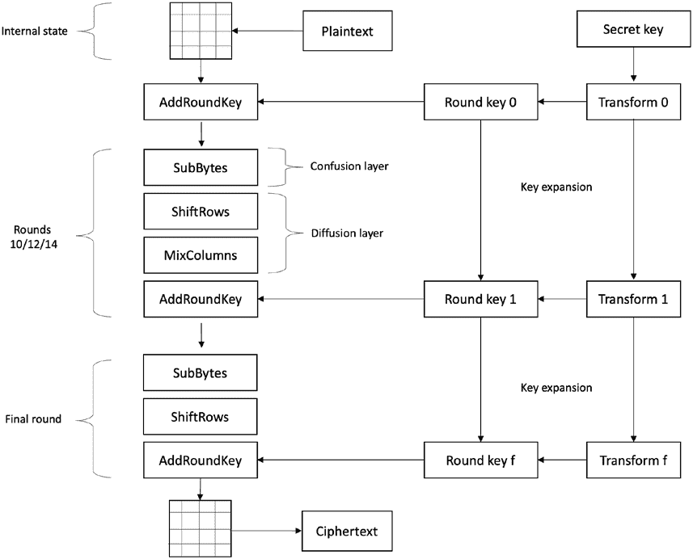

第二章 密码学

***图 2-9\.** AES 块密码*

**一些基本数学**

在我们深入研究密码学之前，了解一些非常基本的东西很重要

数学和相关术语。

**质数**

质数是只能被自身和 1 整除的数字。例如，23 是一个

质数，因为它只能被精确地除尽，不留下任何余数

23 或 1\。

79

第二章 密码学

**模运算**

它是一种在整数上执行算术运算的系统，其中数字会循环

当它们达到某个固定数量时，它们将围绕某个固定数字。这个固定数字称为模数，

并且所有的算术运算都是基于这个模来执行的。

**群**

一个群体 *G* 是一个集合，它的元素可以使用一个运算∘进行组合。它具有以下属性：

**封闭性** 表示所有的群运算都是封闭的。形式上，∀ *a*，

*b* ∈ *G* : *a* ∘ *b* = *c* ∈ *G*.

**结合性** 表示所有的群运算都是结合的。形式上来说，

*a* ∘ ( *b* ∘ *c*) = ( *a* ∘ *b* ) ∘ *c* : ∀ *a*, *b*, *c* ∈ *G*.

存在一个特殊的**单位元** *i*，使得∀ *a* ∈ *G* : *a* ∘ *i* = *i* ∘ *a* = *a*。

在每个元素 *a* ∈ *G* 中，有一个相应的**逆元素** *a*−1，使得 *a* ∘ *a*−1 = *a*−1 ∘ *a* = *i*。

**阿贝尔群**

如果除了上述的

群体的性质，∀ *a*, *b* ∈ *G* : *a* ∘ *b* = *b* ∘ *a* .

**域**

F 是具有 F 上两个称为加法和乘法的操作的集合。

**有限域（伽罗华域）**

有限域是一个具有有限个元素的域。

**素域**

一个素域是包含素数个元素的有限域。

80

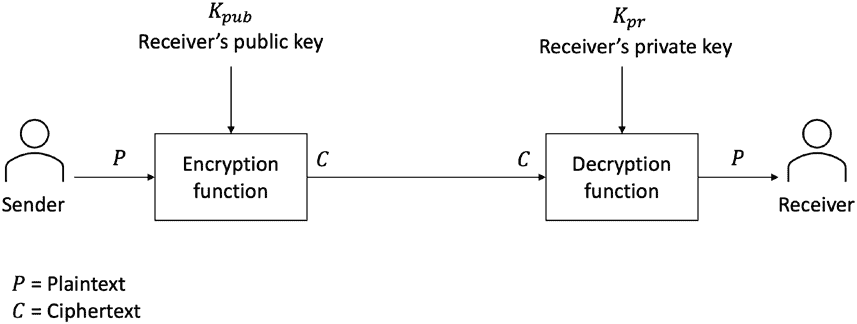

第二章 密码学

**生成器**

一个生成器是椭圆曲线上的一个点。

**公钥密码学**

公钥加密系统使用两个不同的密钥进行加密和解密。

公钥是公开的，私钥必须保密。在这些

系统，发送方使用接收方的公钥来加密数据。接收方

通过使用相应的私钥解密密文。

该模型如图 2-10 所示。(#p100)

***图 2-10\.** 基于公钥密码体系的加密系统*

对称密钥系统中的一个基本问题是它们需要一个秘密密钥才能

共享密钥的数量，这可能是一个具有挑战性的任务。

进行。对称密钥系统的另一个问题是密钥管理。在使用安全信道之前交换

用户的密钥随着用户数量的增加而呈指数增长。一个 n 用户的网络

将需要 n(n-1)/2 个密钥，每个用户将存储 n-1 个密钥。在一个 100 用户的网络中，每个

用户将存储 99 个密钥。公式 100(100-1)/2 表示总共有 4950 个密钥，

这在实际上是相当棘手的。公钥加密解决了这个密钥分发和密钥管理的问题。

公钥密码的一个典型用途是在两个当事方之间建立一个共享的秘密密钥

两个当事方。这个共享的秘密密钥被对称算法使用，比如 AES，来

加密数据。因为他们已经建立了一个秘密密钥，双方可以

81

第二章 密码学

加密和解密，而不必在网络上传输秘密密钥。这样，这个

当事方既获得了公钥加密的高安全性，又获得了对称加密的速度

加密。由于速度慢，非对称加密不常用于大量加密的性能；

然而，这是密钥建立的正常使用。这些系统允许一个

对称密钥用于加密数据，并且一个秘密密钥使用公钥加密

密码学被称为混合加密系统。例如，集成加密

Scheme 是混合加密方案。ECIES 是椭圆曲线 (EC) 版本的

IES 方案。

**Diffie-Hellman 密钥交换**

对于密钥交换，开创性和基础性的方案是 Diffie-Hellman

密钥交换。这是一个在两方之间运行的互动协议。一个基本

直观的 Diffie-Hellman 交换的数学例子如下所示：

1\. Alice 和 Bob 想建立一个共享的秘密密钥。

2\. 两者商定两个数字，一个素数 *P* = 13 和一个

发生器 *P*，*G* = 6\. 但在实践中，*P* 是非常大的。

3\. 两者随机选择一个大的随机整数（即私钥）。

a. Alice 的私钥 = 5，Bob 的私钥 = 4

4\. 两者计算公钥：

a. Alice

65 *mod* 13

7776 *mod* 13 = 2

*公钥* = 2

b. Bob

64 *mod* 13

1296 *mod* 13 = 9

*公钥* = 9

5\. Bob 向 Alice 发送公钥 9，Alice 向 Bob 发送公钥

2 给 Bob。

82

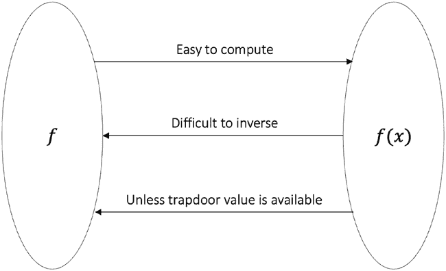

第二章 密码学

6\. 两者使用私钥 5 和 4 计算共享密钥。

a. Alice

95 *mod* 13 = 3

b. Bob

24 *mod* 13 = 3

7\. 建立了一个共享的秘密密钥。

公钥加密系统依赖于单向陷门函数。陷门函数

在一方向上容易计算但是在相反方向上却难以计算，

除非有一个特殊的值，称为陷门，可用。这个概念可以

在图 2-11 中展示。

***图 2-11\.** 陷门函数*

不同的困难计算问题，比如大整数分解

问题和离散对数问题，提供适当的单向陷门函数。

使用整数分解的密码学方案是基于不可行性

分解大整数的难度。依赖这种假设的典型例子是

RSA。整数分解是复合数的分解（由

将两个较小的整数) 分解为较小的整数(因子)。

在密码学中，因子被限制为质数。我们可以演示

使用这样一个简单的示例来说明问题。

83

第二章 密码学

例如，很容易看出 15 是 5 和 3 的乘积，即 5 x 3 = 15\。

那么较大的质数呢，比如 6887？这相对来说就困难一些，但是

我们进行一些计算得到 71 和 97 作为因子。如果这个数字非常大呢，比如 1024

位数，和素数？然后将两个这样的素数相乘很容易，但是极其难以

因子，使其成为我们可以在密码学中使用的单向函数。

一个离散对数问题是许多不同的密码学方案的基础

诸如 Diffie-Hellman 密钥交换和数字签名算法。它是基于

基于一个在模算术中的问题，计算模的结果是容易的

运算，但是找到发生器的指数却很难。这种困难创造了

一个单向函数，从计算上来说，从输入中找到输出是困难的。

输出。

一个简单的例子可以演示这个问题的关键所在：

2

3

10

9

*mod*

=

现在，给定 9，找到 2，生成器 3 的指数是非常难的。

正式地，我们可以说，给定数字*a*和*n*，其中*n*是质数，函数*f b*

*ab*

（）= *mod n*

是一个单向函数，因为计算*f*（*b*）很容易，但是给定*f*（*b*），找到*b*很难。

在 1980 年代中期发展出的另一种方法是椭圆曲线密码学。椭圆

曲线密码学因其在区块链平台（如比特币和以太坊）中的应用而受到特别关注

交换和椭圆曲线数字签名算法在这个领域最为普遍。

ECC 基本上是一个离散对数问题，但是构建在椭圆曲线之上

在有限域上传输。ECC 的一个关键优势是，较小的密钥尺寸提供了相同的

安全级别与 RSA 中较大的密钥尺寸相同。例如，1024 位整数因子分解方案的安全级别，比如 RSA，可以通过只有 160 位的椭圆

基于曲线的方案，如 ECDSA。

公钥密码系统可以用于加密，尽管这种情况非常少见

对于大型数据集来说并不高效。它还用于提供其他安全服务和协议，比如数字签名，实体认证和密钥协商。

84

第二章 密码学

**数字签名**

数字签名是公钥密码学的最普遍应用之一。数字

签名提供不可否认的服务。最常见的例子包括基于 RSA 的

数字签名，数字签名算法，ECDSA 和 Schnorr 签名。

**实体认证**

实体认证或识别是公钥密码系统的另一个服务

可以提供。通常情况下，挑战-响应机制在广泛使用，其中

验证者发送的一个挑战需要由证明者作出正确的回应

（声明身份）来确定申明者的合法性。

**密钥协商**

密钥协商协议用于在加密数据

传输。这类协议的最常见例子是 Diffie-Hellman 密钥

交换协议。

**RSA**

RSA 广泛用于安全密钥传输和构建数字签名。Diffie 和

Hellman 在 1976 年发明了公钥密码学。基于这个想法，在 1978 年，RSA

公钥密码系统是由 Rivest，Shamir 和 Adleman 开发的。

在本节中，我将带您了解 RSA 中生成密钥对的步骤以及

如何加密和解密。

**密钥对生成**

1. 产生一个模数。

a. 选择*p*和*q*，两个大素数。通常是 2¹⁰²⁴ 位或更多。

2. 乘

*p*和*q*生成模数*n*。*n* = *p*。*q*。n 变成 2²⁰⁴⁸\。

85

第二章 密码学

3. 选择一个具有特殊属性的随机数。假设

我们称此数字为 *e*。

a. 这个数字 *e* 应该有一些特殊属性：

i. 它应该大于 1\。

ii. 它应该小于 *ϕ*( *n*) = ( *p* − 1) ( *q* − 1)。

iii.

*gcd*( *e*, ( *p* − 1)( *q* − 1) = 1\。

iv.

*e* ∈ {1, 2, . . . , *ϕ*( *n*) − 1}。

从形式上讲，这个数字 e 应该是互质的（相对

素数）的( *p* − 1) ( *q* − 1)，也就是说，除了 1 以外，没有其他数字可以

完全分为 e 和 ( *p* − 1) ( *q* − 1)。 互质数没有

除了 1 以外的所有公因数，因此最大公约数（GCD）为

互质数是 1\.

4\. 公钥生成

a. 步骤 1 生成的模数 n 和步骤 2 生成的特殊数字 e

在步骤 2 中是一对 (n, e) 即公钥。 这对是公开的，因此可以

与任何人共享；但是，p 和 q 必须保密。

5\. 私钥生成

a. 私钥，让我们称之为 *d*，是从步骤 1 的两个质数 *p* 和 *q* 和步骤 2 的特殊数字 *e* 计算得出的。私钥是

*e*模( *p* − 1)( *q* − 1)，我们可以写成

*ed* =1 *mod* ( *p* − )

1 ( *q* − )

1

*ed* =1 *mod* φ *n*

−1

*d* = *e* = 7

20

*mod*

在实践中，扩展的欧几里德算法用于计算 *d*，它需要 *p*、*q* 和 e 作为输入，并输出 *d*。*d*必须保密。

86

第二章 密码学

**加密和解密**

现在，让我们看看如何使用 RSA 执行加密和解密操作。RSA

使用以下方程式生成密文：

*e*

*C* = *P mod n*

这意味着明文 P 提高到幂 e，然后减少到模 n。

RSA 中的解密由以下方程式提供：

*d*

*P* = *C mod n*

这意味着拥有一对公钥 ( *n*, *e*) 的接收方可以将数据解密，方法是将 *C* 提高到私钥 *d* 的值，然后减少到模 *n*。

**密钥生成、加密和解密示例**

1\. 让明文消息为 *m*。 *m* = 5，从 Alice 发送给 Bob。

2\. 让

*p* = 3 和 *q* = 11\。

3\. *n* = *pq* = 3 *x* 11 = 33\.

4\. *e* = 3，因为(3 − 1) (11 − 1) = 20，大于 1 且小于

大于 20 且 *GCD*(3, 20) = 1\。

5\. 公钥是一对 ( *n*, *e*) = (33, 3)。

6\. 私钥是 *ed* = 1 *mod* ( *p* − 1)( *q* − 1)。

*d* = *e*−1 7

20 (33 7

*mod* ，

, )

7\. 发送公钥 ( *n*, *e*) (33, 3) 给 Alice。

8\. Alice 做 53 = 125 *mod* 33 = 26\。

9\. Alice 将 26 作为加密文本发送给 Bob。

10\. Bob 做 267 = 8031810176 = 8031810176 *mod* 33 = 5 并恢复

明文消息 5\.

87

第二章 密码学

**椭圆曲线加密**

椭圆曲线加密（ECC）基于数学中称为椭圆的概念

曲线。它是一组在平面上的点，其 x，y 坐标满足特定的方程和一些条件。通常，它是威尔斯特拉斯形式 *y* 2 = *x* 3 + *ax* + *b*，其中 *a* 和 *b* 是固定的。

椭圆曲线是群。它们在数学的许多不同领域中使用，

包括数论，复分析和数学物理。 在椭圆曲线

密码学，适当的椭圆曲线上有限域中的点形成一种允许基于离散对数问题构建密码学方案的群结构。

在椭圆曲线密码学中使用素数域。 *在素数域中，所有算术* *操作都在模素数 p*中执行。

椭圆曲线在以下方程中定义：

2

3

*y* = *x* + *ax* + *b mod p*

在此处，a 和 b 属于有限域*Zp*或*Fp*（素有限域），即，（*a*，*b*）∈*Z*，以及一个无穷的虚点。 无穷点∞ 用于提供身份

曲线上点的操作。

此外，下面显示的条件确保曲线是非奇异的，

意味着曲线不自交或者有顶点：

3

2

4

+ 27 ≠ 0

*a*

*b*

*mod p*

为了构造基于椭圆曲线的离散对数问题，需要足够大的

需要循环群。 首先，群元素被确定为满足椭圆曲线方程的点集。 之后，需要在群上定义群操作

这些点。椭圆曲线上的基本群操作是点的加法

与点的加倍。 点的加法是两个不同的点相加的过程，

和点加倍意味着将同一点加到自身。

椭圆曲线可以在实数上可视化，如图 2-12\.所示

88

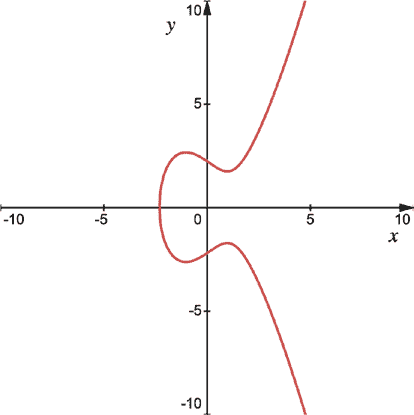

第二章 密码学

***图 2-12\.** 实数上的椭圆曲线 y2 = x3* − *3x + 5*

我们可以可视化曲线和群操作，即，加法和加倍，

几何上在实数范围内，这有助于构建直觉。然而，在实践中，使用素域上的曲线来构建基于 ECC 的方案。然而，当我们试图绘制

它，它似乎相当随机且不直观。

**点的加法**

对于添加两个点，通过点 P 和 Q 画一条直线（在

图 2-13 来获得第三个点。 当反射时，这一点是 P+Q。

在图 2-13 中。

89

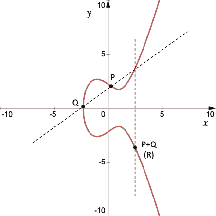

第二章 密码学

***图 2-13\.** 点的加法*

代数上说，在点的加法操作中，两个点 P 和 Q 相加

获取曲线上第三个点 R 的坐标：

*P* + *Q* = *R*

其中 *P* =（*x*1，*y*1）和 *Q* =（*x*2，*y*2）和 *R* =（*x*3，*y*3）。

对于加法，我们计算点之间的斜率：

（*y*2 − *y*1）

*S* =

*mod p*

（*x*

2 − *x*1）

其中 S 表示通过 P 和 Q 的线。

现在获得新点 R：

2

*x* = − − *mod*

3

*s*

*x*1 *x*2

*p*

*y* = （ − ）− *mod*

3

*s x*1 *x*2

*y*1

*p*

90

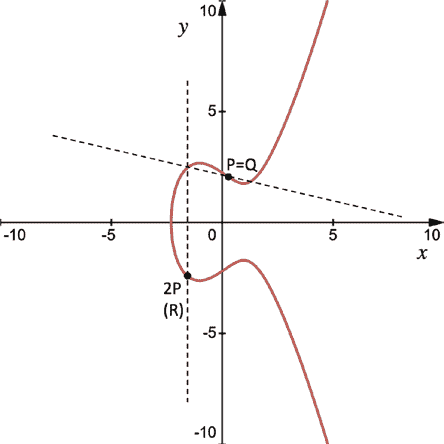

第二章 密码学

**点的加倍**

在点加倍中，P 被加到自身。 换句话说，P 和 Q 是相同的点。 由于点加到自身，我们可以称这个操作为点加倍。

要加倍一个点，必须通过穿过点 P 的切线（在图 [2-14]中，为虚线对角线）来得到第二个点，该切线与曲线相交。

此点被反射以产生结果 R，如图 2-14\. 中的 2P 所示。

***图 2-14\.** 椭圆曲线点双倍*

对于乘以二，我们使用

(3 *x* 21 + *a*)

*S* =

*mod p*

2

*y*

1

假设 *S* 描述了穿过点 P 的切线。

现在要获得点 R:

2

*x* = −− *mod*

3

*s*

*x* 1 *x* 2

*p*

*y* 3 = *s*( *x* 1 − *x* 2) − *y* 1 *mod p*

91

第二章 密码学

**标量点乘**

此运算用于将椭圆曲线上的点乘以给定整数，以用于

例如，一个整数 d 和点 P。我们通过重复加 P，d 次，来得到 dP，如

如下所示:

*P* + *P* +…+ *P* = *dP*

此操作用于在基于 ECC 的密码系统中生成一个公钥。这是

一个非常计算密集的过程，因为点加法和双倍都是

反复执行来计算:

*Q* = *dP*

其中 P 是曲线上的一个点，d 是一个随机选择的整数作为私钥，

并且 Q 是相乘后得到的公钥。

使点乘法更快是一个积极的研究领域。虽然有许多

用于更快地进行标量乘法的算法，我们描述了一个快速示例

在这里使用双倍和加算法。它结合了点加法和双倍

操作以达到性能。

举例来说，如果只进行加法，要得到 9P，我们必须执行 P + P + P + P + P + P + P +

P + P, 如果 Ps 的数量增加，这可能会变得不切实际。我们

可以使用双倍和加的机制来加速这一过程。在这里，我们首先将九

转换成二进制。从最高有效位（MSB）开始，对于每个为一（高）的位，执行双倍和加法操作，对于每个零，只执行双倍操作

操作。我们不对最高有效位执行任何操作。九用二进制表示为 1001

二进制, 因此对于每个位，我们（从左到右开始）得到 P，2P，4P，8P+P。这个方案只需要三次双倍操作和一次加法操作就能得到 9P，而不是

九次加法操作。

**椭圆曲线离散对数问题**

现在考虑 *dP* 导致在曲线上产生另一个点 *Q*。即使我们知道点 *P* 和 *Q*，也计算上不可能重构我们计算数字 d 所需的所有双倍和加法操作的序列。即使

如某人知道 *P* 和 *Q*，他们不可能找到 *d*。这意味着它是一个单向（陷阱函数）函数。这是椭圆曲线离散对数问题（ECDLP）的基础。

92

第二章 密码学

考虑一个椭圆曲线 E，其中有两个元素 P 和 Q。离散对数

问题是找到整数 d，其中 1 < = *d* < = # *E*，使得 *P* + *P* +…+ *P* = *dP* = *Q*

这里，*Q* 是公钥（曲线上生成的一个点，（x，y）），*d* 是私钥（曲线上的另一个点）。公钥是生成器的随机倍数

点 *P*，而私钥是用于生成多个的整数 d。生成点或基点 G 是曲线上的一个点，它生成一个循环子群，这意味着群中的每个点都可以通过重复加法到达

基本点。

#E 代表群的阶（椭圆曲线），也就是群的数量

存在于椭圆曲线的循环子群的点。循环群是

由椭圆曲线上的点组合而成的，以及无穷点。余因子 *h* 是曲线上的点的数目除以子群的阶。

初始起始点 *P* 是一个公共参数，公钥 *Q* 也是公开的，而私钥 d 是保密的。如果 d 未知，仅凭 Q 和 P 的知识是不可行的，从而创建了难以解决的问题

ECDLP 是如何构建的。

密钥对与椭圆曲线特定的域参数相关联。域

参数是实现 ECC 方案所需的公共值。这些

参数表示为元组{*p*, *a*, *b*, *G*, *n*, *h*}：

• *P*: 域（对素数取模）

• *a*, *b*: 固定的椭圆曲线系数

• *G*: 生成循环群的生成器点

• *n*: 群的阶（曲线）

• *h*: 余因子

例如，比特币使用方程为 *y* 2 = *x* 3 + 7 和域参数如下所定义的 SECP256k1 曲线：[`en.bitcoin.it/wiki/Secp256k1\.`](https://en.bitcoin.it/wiki/Secp256k1)

最常用的曲线是 NIST 提出的曲线，比如 P-256。其他曲线包括

Curve25519、Curve1174 等等。当然，建议选择一条安全的曲线。

一个维护着安全和不安全曲线及其解释的优秀资源

在这里在线：[`safecurves.cr.yp.to`](https://safecurves.cr.yp.to)。

93

第二章 密码学

**数字签名**

公钥密码术用于创建数字签名。这是公钥密码术最常见的应用之一。在本节中，我们将发现 RSA、

ECDSA 和 Schnorr 签名是如何工作的。诸如合成签名等概念

多重签名，也常用于区块链，将被介绍。

数字签名提供了一种将消息与实体联系起来的手段

消息的来源。数字签名用于提供数据的来源

验证和不可否认性。

数字签名在共识算法中使用，特别是在区块链中

网络上对区块链上的用户发送的交易和消息进行签名

网络。区块被加密密封，以使用数字签名，以便

接收者可以验证传输块的真实性。同样，所有交易也进行了签名。 在共识算法中，块被封存并

广播到网络，接收者（其他节点）接收，验证签名以确定块的真实性。 块被插入到本地区块链

验证后。

数字签名有三个安全属性：真实性，不可伪造性和

不可复用性。

**真实性**

这意味着数字签名可以被接收方验证。

**不可伪造性（不可否认性）**

此属性保证只有消息发送方才能使用私人

密钥。数字签名还必须防止伪造。 伪造意味着对手

制作一份有效签名给消息而没有合法签名者的访问权限

私钥。 换句话说，不可伪造性意味着没有其他人可以产生

由真正的发送方产生的已签名消息。

94

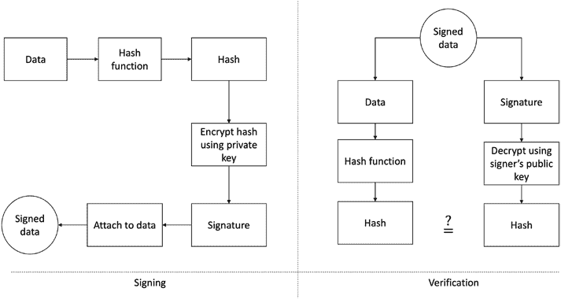

第二章 密码学

**不可复用性**

此属性要求数字签名不能与消息分离

并且再次用于另一个消息。 换句话说，数字签名牢固地与相应的消息绑定在一起，并且不能从其原始消息中分离出来

附加到另一个。

使用数字签名进行签名和验证的过程显示在

图 2-15.

***图 2-15.** 数字签名（左）和验证过程（右）*

首先，我们为想要证明数据来源的数据生成哈希

身份。 然后我们使用证明者的私钥（签名密钥）加密哈希

创建一个“签名”并将其与数据附加。 最后，这个签名的对象被发送给验证者。

验证者使用签署者（发送方）的私钥解密数据的加密哈希

以公钥检索原始哈希。验证者然后取数据并对其进行哈希处理

通过哈希函数再次生成哈希。如果这两个哈希匹配，那么

验证成功，证明签名者确实签署了数据。 它还证明了数据的原始身份认证，以及不可否认性和数据完整性属性。

现在我们描述 ECDSA（椭圆曲线数字签名算法）的工作原理。

95

第二章 密码学

**ECDSA 签名**

ECDSA 是基于椭圆曲线的 DSA。 DSA 是数字签名的标准。

该算法基于模幂和离散对数问题。 它用于

在比特币和以太坊区块链平台上验证消息并提供数据

完整性服务。

现在，我们将描述 ECDSA 的工作原理。

要使用 ECDSA 方案进行签名和验证，首先需要生成密钥对：

1\. 定义椭圆曲线 E 如下：

• 模 *P*

• 系数 *a* 和 *b*

• 一个生成点 *A* 形成一个质数次阶循环群 *q*

2. 随机选择整数 *d*，使得 0 < *d* < *q*。

3\. 计算公钥 *B*，使得 *B* = *dA*。

• 公共参数是六元组，格式如下:

*Kpb* = ( *p*, *a*, *b*, *q*, *A*, *B*)

• 私钥是在步骤 2 中随机选择的整数 d:

*Kpr* = *d*

现在，可以使用私钥和公钥生成签名。

4\. 选择一个临时密钥 *Ke*，其中 0 < *Ke* < *q*。并且确保 *Ke* 是随机的，不会出现两个签名最终相同密钥;

否则，私钥可以被计算。

5\. 使用 *R* = *Ke* *A* 计算值 *R*，即，将 *A*（生成点）和随机临时密钥相乘。

6\. 使用 *R* 的 *x* 坐标值初始化变量 *r*，以确保 *r* = *xR*。

7\. 现在，可以计算签名如下:

*s* = ( *h*( *m*) + *d r*.) *K mod*

−1

*q*

*e*

96

第二章 密码学

这里，*m* 是为其计算签名的消息，*h*( *m*) 是消息 *m* 的哈希。

8\. 签名验证进行如下:

• 计算值 *w*，其中 *w* = *s*−1 *mod q*。

• 值 *u* 1 = *w*. *h*( *m*) *mod q*。

• 计算值 *u* 2 = *w*. *r mod q*。

• 计算点 *P*:

*P* = *u* 1 *A* + *u* 2 *B*

9\. 验证进行如下:

• 如果点 *P* 的 x 坐标,*r*, *s* 被接受为有效签名

步骤 4 中计算得到的值与签名参数相同

*r* mod *q*; 即:

*Xp* = *r mod q* 意味着有效签名。

*Xp* ≠ *r mod q* 意味着无效签名。

这完成了我们对数字签名和特别是 ECDSA 的介绍。ECDSA

在区块链网络中被广泛使用，包括比特币、以太坊和

几个企业链。现在我们描述一些其他数字签名变体。

**多重签名**

在此方案中，由其各自所有者拥有的多个唯一密钥用于签署

单个消息。在区块链实现中，多重签名方案允许多个

用户对交易进行签名，从而增加了安全性。此外，在区块链网络中，这些方案可以用作用户设置至少一个或多个签名以授权交易的条件。

例如，1-of-2 多重签名方案可以表示一个联合账户，其中

联合账户持有者之一需要授权交易，进行签名。在另一种变体中，可以使用 2-of-2 多重签名，其中联合账户

持有方的签名必须授权交易。该概念被概括为 m 个

n 个签名，其中 m 是预期签名的最小数量，n 是总数

签名数量。

97

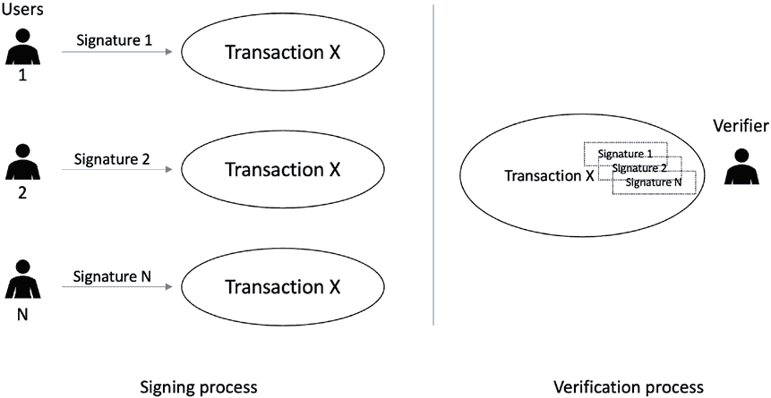

第二章 密码学

此过程如图 2-16 所示。

***图 2-16\.** 多重签名方案*。

图 2-16 显示了左侧的签名过程，其中 m 是不同用户的数量，持有 m 个唯一签名对单个交易进行签名。当

验证者或验证方接收到时，其中的所有签名都需要被逐个验证。

**阈值签名**

这种方案不依赖于用户用其个人密钥签名消息；

相反，只需要一个公钥和一个私钥来生成数字

签名。在多重签名方案中，已签名消息包含数字签名

来自所有签名者。它需要由验证方逐个验证，但在阈值签名中验证者只需要验证一个数字签名。该方案的关键思想是将私钥分割为多个部分，每个签名者保留其私钥的份额。签名过程要求每个用户使用其各自的份额

使用私钥签署消息。一种特殊的通信协议管理

签名者之间的通信。

与多重签名相比，阈值签名导致更小

交易大小并且更快地验证。然而，一个缺点是对于阈值

签名要起作用，所有签名者必须保持在线。在多重签名方案中，签名者

98

第二章 密码学

签名可以异步地传递。换句话说，用户可以提供签名

无论何时都应该提供签名。一个缺点是可能出现用户

恶意地拒绝签署，导致服务拒绝。我们还可以使用

阈值签名用于在区块链网络中提供匿名性，因为个体签名者

在多重签名方案中是不可识别的。

图 2-17 显示了左侧的签名过程，其中有 m 个不同的用户，持有数字签名的不同部分（份额），对单个交易进行签名。当验证者或验证方接收到时，只需要一个签名即可。

验证。

***图 2-17.** 阈值签名*

**聚合签名**

聚合签名减小了数字签名的大小。这种方案是有益的。

在多个数字签名被使用的情景中。其核心思想是聚合

将多个签名聚合成单个签名而不增加单个消息签名的大小。简而言之，它是一种支持聚合的数字签名类型。

小的聚合签名足以向验证者证明所有用户都签署了

他们的原始消息。因此，聚合签名通常用于减少

网络和安全协议中信息的大小。例如，我们可以显著

减小公钥基础设施（PKI）中数字证书链的大小

将所有签名压缩成单个签名。Boneh-Lynn-Shacham

99

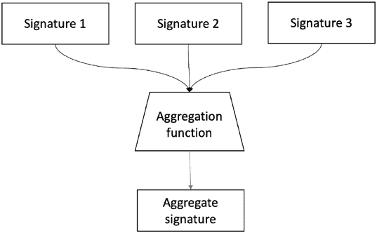

第二章 密码学

（BLS）聚合签名是聚合签名的典型示例。BLS 也已经被各种区块链特别是以太坊 2.0 所使用。

Schnorr 签名是另一种基于椭圆曲线的签名类型

密码学允许密钥和签名聚合。 Schnorr 签名是 64 字节

与 ECDSA 相比，其大小为 71 字节。 ECDSA 的私钥

大小为 32 字节，其公钥为 33 字节，而 Schnorr 方案的私钥

和公钥大小为 32 字节。总的来说，Schnorr 签名更小，更快

而不是 ECDSA。

图 2-18 显示了如何使用聚合签名。

***图 2-18\.** 聚合签名*

计划在比特币中使用 Schnorr 签名，这是比特币改进

提案（BIP）340\.

**环签名**

环签名方案是一种任何签署者群体的机制都可以

代表整个群体签署消息。环组的每个成员都保留

一个公钥和一个私钥。关键点在于实际碰撞的身份

签署消息的签名者必须保持未知（计算上不可

确定）对外部观察者来说。看起来任何来自可信

签名者群体可能已签署了消息，但不可能找出

签署消息的个人用户。因此，我们可以使用环签名提供

匿名服务。

100

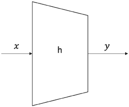

第二章 密码学

**散列函数**

散列函数是无密钥原语，可以创建任意长度输入数据的固定长度摘要。散列函数有三个安全属性。

**预像抗力**

此属性也称为单向属性。可以使用简单的方式来解释

方程:

*h*( *x*) = *y*

其中*h*是散列函数，*x*是输入，*y*是输出散列。第一个安全属性要求*y*不能被逆向计算为*x*。*x*是*y*的预像，因此称为预像抗力。此属性在图 2-19\.中显示。

***图 2-19\.** 预像抗力*

**第二预像抗力**

此属性也称为弱碰撞抗性属性。此属性

确保给定*x*和*h*( *x*)，几乎不可能找到任何其他消息*m*，其中*m* ≠ *x*并且*m*的哈希=*x*的哈希或*h*( *m*)=*h*( *x*)。此属性显示在图 2-20\.

101

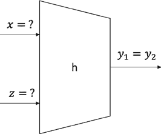

第二章 密码学

***图 2-20\.** 第二预像抗力*

**碰撞抗力**

碰撞抗性属性要求两个不同的输入消息不应该

散列到相同的输出。换句话说，*h*( *x*) ≠ *h*( *z*)。图 2-21 显示了碰撞抗性的描绘。

***图 2-21\.** 强碰撞抗性*

此外，散列函数还有两个功能属性：

•将任意大小数据压缩为固定长度摘要

•易于计算

由于其本质，散列函数总是可能存在碰撞，

两个不同的消息散列到相同的输出，但在良好的散列函数中，

碰撞必须是计算上不可行的。

此外，哈希函数还应具有一个特性，即即使是微小的变化

输入文本中的一个字符更改，也应导致完全不同的哈希

输出。这被称为**雪崩效应**。

102

第二章 密码学

哈希函数通常使用迭代哈希函数方法设计，

其中输入数据分成相等的块大小，然后对它们进行处理

通过压缩函数迭代。

使用迭代方法构建哈希函数的一些杰出方法如下：

列如下：

• Merkle-Damgart 结构

• 海绵结构

最常见的哈希函数方案是 SHA-0、SHA-1、SHA-2、SHA-3、

RIPEMD 和 Whirlpool。

**安全哈希算法（SHA）的设计**

在这一部分，我们将介绍 SHA-256 和 SHA-3 的设计。二者都用于

在比特币和以太坊中有用。然而，以太坊采用了原始的 Keccak

提交给 NIST 的算法，而不是 NIST 标准的 SHA-3。经过一些

修改，比如增加轮数和更简单的消息

填充，将 Keccak 标准化为 SHA-3。

**SHA-256 的设计**

SHA-256 的输入消息大小限制为 2⁶⁴-1 位。块大小为 512 位，字长为 32 位。输出为 256 位摘要。

压缩函数处理 512 位消息块和 256 位

中间哈希值。这个函数有两个主要组成部分：中间哈希值的

压缩函数和消息计划。

该算法工作如下，在九步中。

**预处理**

• 用于调整块长度为 512 的消息填充

位，如果小于要求的 512 位块大小。

• 解析消息为消息块，以确保

消息及其填充被分成相等的 512 位块。

103

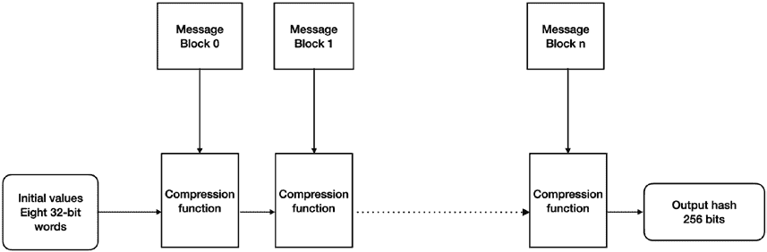

第二章 密码学

• 设置初始哈希值，由八个 32 位组成

通过取小数部分的前 32 位获得的字

第一个八个质数的平方根。这些初始值

是固定的并被选择来初始化该进程。他们提供了一定程度的

确信算法中不存在后门。

**哈希计算**

• 然后每个消息块按顺序处理，需要

64 轮来计算完整的哈希输出。每轮使用稍微

不同的常数以确保没有两轮是相同的。

• 消息计划准备。

• 八个工作变量初始化。

• 压缩函数运行 64 次。

• 计算中间哈希值。

• 最后，在重复步骤 5 到 8 直到所有块（

数据）被处理，输出哈希值是

由中间哈希值连接生成。

从高层次上，SHA-256 可以在图 2-22\. 中可视化。

***图 2-22\.** SHA-256 高层次概述*

如图 2-22 所示，SHA-256 是一种 Merkle-Damgard 构造，将输入消息分成大小相同的 512 位块。初始哈希值，或初始化向量，由八个 32 位字(即 256 位)组成，被馈送 104

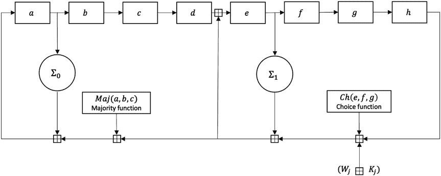

第二章密码学

到压缩函数，第一个消息被输入。随后的块被输入到

压缩函数，直到所有块被处理以产生输出散列。

SHA-256 的压缩函数显示在图 2-23 中。

***图 2-23\.** SHA-256 压缩函数的一个轮*

在图中 2-23，*a*、*b*、*c*、*d*、*e*、*f*、*g*和*h*是八个工作变量的寄存器。Maj 和 Ch 是按位应用的函数。*Σ* 0 和*Σ* 1 执行按位旋转。轮常数是*Wj*和*Kj*，它们在哈希函数的主循环(压缩器函数)中加入，该函数运行 64 次。

**SHA-3(Keccak)的设计**

SHA-3 的结构与 SHA-1 和 SHA-2 非常不同。SHA-3 是基于

在未键控排列上而不是其他典型的哈希函数构造

键控排列。Keccak 也不使用 Merkle-Damgard 转换，

通常用于处理哈希函数中任意长度的输入消息。相反，

一种新的方法，称为海绵和挤压构造，用于 Keccak。这是一种

随机排列模型。

已标准化不同的 SHA-3 变体，如 SHA3-224、SHA3-256、

SHA3-384、SHA3-512、SHAKE128 和 SHAKE256。此外，SHAKE128 和

SHAKE256 是可扩展输出函数(XOFs)，允许输出为

扩展到任意所需长度。

105

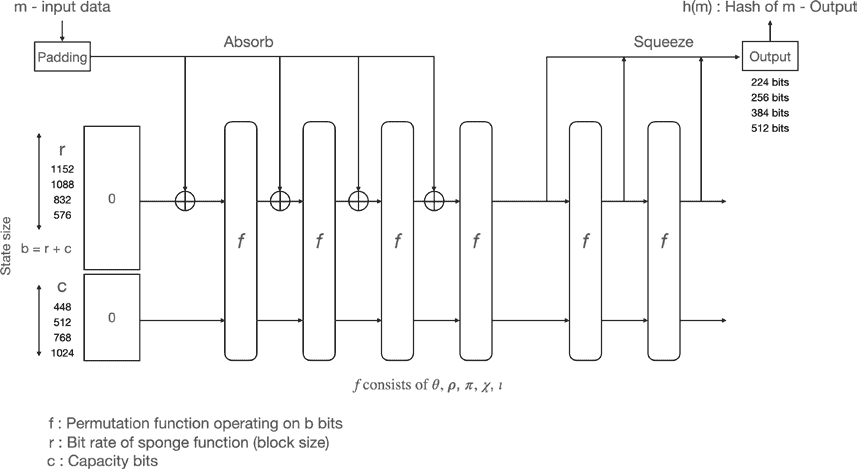

第二章密码学

图 2-24 shows 的海绵和挤压模型是基于 SHA-3 或 Keccak 的。类似于海绵，数据(m 输入数据)首先被“吸收”到海绵中，然后应用填充。然后通过置换状态的子集转换成

异或(异或)，最后，输出从海绵函数中“挤出来”

代表变换后的状态。速率 r 是海绵的输入块大小

函数，而容量 c 决定了安全级别。

***图 2-24\.** SHA-3 吸收和挤压函数*

在图中 2-24，状态大小 b 由添加比特率 r 和容量位 c 计算。如果 r + c 的大小为 25、50、100、200、400、800 或 1600，则 r 和 c 可以是任何值。状态是一个三维位矩阵，最初设置为 0。数据 m 输入到

通过应用填充后，按块通过 XOR ⊕吸收阶段。

表 2-1 显示了为实现所需的输出哈希大小所需的比特率 r(块大小)和容量 c 的值，在 r + c = 1600\的最有效设置下。

106

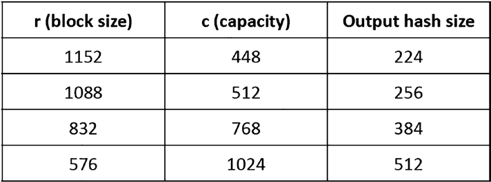

第二章密码学

***表 2-1\.** SHA-3 支持的比特率和容量*

-

函数 f 是一个排列函数。它包含五个转换操作

分别命名为 Theta、Rho、Pi、Chi 和 Iota，分别描述如下：

*θ*− *Theta*：状态中的位异或操作，用于混合

*ρ*− *Rho*：执行位旋转的扩散函数

*π*− *Pi*：扩散函数

*χ*− *Chi*：对每一位进行异或操作，位级组合

*ι*− *Iota*：与轮常数结合

关键思想是应用这些转换以实现雪崩效应

确保即使在输入中的微小变化也会导致输出的大幅变化。

这五个操作合并成一个单轮。在 SHA-3 标准中，轮数为 24，以达到所需的安全级别。

轮数为 24 以达到所需的安全级别。

**消息认证码**

消息认证码（MACs）用于在

加密系统。MACs 有时被称为带密钥的哈希函数，我们可以使用它们

用于提供消息完整性和数据起源认证。MACs 可以构造

使用块密码或散列函数。

图 2-25 显示了一个发送者追加认证标签 T 到消息 M 的 MAC 操作。MACs 是对称加密原语，使用共享的

发送者和接收者之间的密钥。发送方使用该密钥生成

认证标签，而接收方使用相同密钥进行验证。MAC

函数将密钥和消息 M 作为输入，并生成认证标签 T。

107

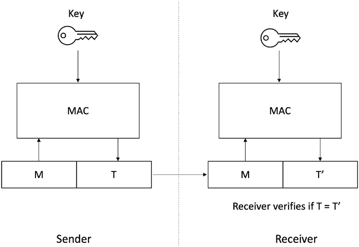

第二章 密码学

***图 2-25\.** MAC 函数的运行*

T 和 M 发送给接收者，接收者运行相同的过程并将 T 与 T’（）比较，

验证者通过应用相同的 MAC 函数生成，并且如果它们匹配，

验证成功。

**基于哈希的 MACs（HMACs）**

像散列函数一样，基于散列的 MACs（HMACs）产生固定长度的输出

将任意长的消息作为输入。在此方案中，发送方使用 MAC 签署消息，接收方使用共享的秘密密钥验证。密钥使用秘密前缀或秘密后缀方法对消息进行哈希处理。使用该方法

秘密前缀方法，密钥与消息连接在一起，也就是密钥位于

首先是密钥，然后是消息，而秘密后缀方法中，密钥

在消息之后，如下所示：

*秘密* *前缀*： *M* = *MAC*() = (

)

*k x*

*h k* || *x*

*秘密* *后缀*： *M* = *MAC*() = (

)

*k x*

*h x* || *k*

108

第二章 密码学

这两种方法各有利弊。一些攻击针对这两种方案

发生。HMAC 构造方案使用*ipad*（内部填充）和*opad*（外部填充）进行填充，假设安全性较高。

在等级认证中有着重要应用，并且用在点对点网络中

和区块链网络中使用，例如 Merkle 树、Patricia tries、Merkle Patricia tries 和分布式哈希表。

接下来讨论一些最新进展，例如可验证延迟函数。

**可验证延迟函数**

可验证延迟函数（VDFs）是需要顺序的密码原语

需要若干步骤（大量时间）来评估，但验证非常迅速和高效。

评估必须是顺序的，即使并行化，评估

必须花费指定的时间。但验证是高效的。VDFs

在分布式网络中有多种应用，例如，它们可以用作

随机性信标发布随机、不可预测和不可操控的值

在固定的时间间隔。随机性信标可用于构建随机领导者选举

算法。VDFs 还在多方计算、无许可

consensus, and timestamping of events.

严格来说，VDFs 可以定义如下。涉及三个过程

在 VDF 中：

*setup*( *λ*, *t*) → *pp* 其中 *λ* 是安全参数，*t* 是时间参数，例如，十分钟的延迟。

*evaluate*( *pp*, *x*) → *y*, *π* 其中 *x* 是输入，*pp* 是公共参数，*y* 是输出，*π* 是证明。根据构造方式，*π* 可能是可选项。

*verify*( *pp*, *x*, *y*. *π*) → { *true*, *false*} 输出真或假表示验证是否成功，检查

输出的正确性。

VDFs 有两个安全属性，唯一性和顺序性。唯一性

确保 VDF 产生的输出 y 对于每个输入 x 是唯一的。顺序性

属性确保延迟参数 t 被执行。

109

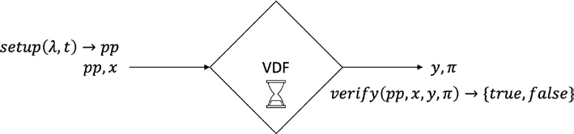

第二章密码学

图 2-26 展示了 VDF 的操作。

***图 2-26。** VDF 的操作*

如何构建 VDF 有很多提案。一些方法包括

在内部存储加密密钥并使用这些密钥

生成 VDF。使用散列函数将输出再次迭代哈希作为输入以形成散列链是构建可验证延迟函数的另一种方法。创建散列

用散列函数迭代生成区块链是一个顺序过程，需要时间；因此，它可以作为 VDF 的评估函数。另一种越来越受欢迎的方法

是代数结构，使用假定

有未知的顺序。

VDFs 在区块链中有许多创新应用，包括构建

共识算法，作为可验证随机性和领导者选举的来源。您将

当我们讨论相关的共识协议时，我们会详细探讨这些应用。

第[8 章](https://doi.org/10.1007/978-1-4842-8179-6_8)。

**可验证随机函数**

可验证随机函数（VRF）是提供

它生成的输出的证明是正确计算的。拥有私钥的所有者生成函数的证明和输出，可以公开验证

通过公钥来确定该值是否确实是正确计算的。VRF 在文献中有许多

共识算法和区块链，例如，卡达诺和

Polkadot 在块生成机制中使用它们。它们还被用于

在链上提供可验证的随机性，例如，链链接的情况。

110

第二章 密码学

**总结**

• 密码学是秘密通信的科学。

• 对称密钥密码学和非对称密码学是

密码学的两个主要类别。

• 椭圆曲线密码学在

区块链和相关共识协议，通常

ECDSA 用于数字签名区块和交易。

• 散列函数创建任意长度的消息摘要——

长度输入。

• MAC 是用于消息的消息认证码

认证。

• 数字签名提供不可否认性、完整性和

认证服务。

• 认证协议用于分布式系统，提供

实体认证。

• 混合加密方案结合了公钥和对称密钥

使用密码学实现性能和安全。

• 可验证延迟函数是需要花费时间来评估的函数

但是验证迅速，且在共识方面有许多应用

协议和区块链。

• VRF 是基于公钥的函数，可生成可验证

正确的输出。

**参考文献**

1\. 帕尔，C.和佩尔兹，J.，2009。《理解密码学：一种

学生和从业者的教科书。施普林格科学与

商业媒体。

111

第二章 密码学

2\. 马丁，K.M.，2012。《日常密码学》。日常

密码学：基本原理和应用。

印刷出版日期：2017 年 印刷 ISBN-13：9780198788003，

发表于牛津奖学金在线：2017 年 7 月，DOI:10.1093/

oso/9780198788003.001.0001。

3\. 多重签名：这种方案是由伊塔库拉于 1983 年引入的

等人在他们的论文中提出了一种适用于数字

多重签名，第 71 卷，Nec 研究与发展（1983 年），

页 474—480。多重签名有时也被称为多方

签名。

4\. 巴希尔，伊，2020。《区块链技术探秘：深入解析》

分布式总账，共识协议，智能合约，DApps，

加密货币、以太坊等。Packt 出版社有限公司。

5\. 丹尼尔·J·伯恩斯坦和坦娅·朗格。SafeCurves：选择安全的

椭圆曲线用于椭圆曲线加密[`safecurves.`](https://safecurves.cr.yp.to)

[cr.yp.to](https://safecurves.cr.yp.to)，于 2021 年 8 月 7 日访问。

6\. VDF 研究：[`vdfresearch.org`](https://vdfresearch.org)

7\. 鲍内，D.，邦尼，J.，邦兹，B.，菲舍，B.，2018 年 8 月。

可验证延迟函数。在*年度国际密码学*

*会议*（页 757—788）。施普林格，钦。

112

**第三章**

**分布式一致性**

一致性是分布式计算中的一个基本问题。本章将 cover

一致性问题的基本原理，并讨论一些历史，涵盖了

拜占庭将军问题，一致性的构建模块，以及我们如何解决这个

分布式系统中的问题。

由于容错是分布式系统中的一个基本要求，所以有几个

原语介绍了容错。容错广播算法允许

开发容错应用。一致性使进程能够达成

尽管存在故障，也能做出共同决策。这两个主题在学术界得到了广泛的研究，并且

行业中的问题。

在我们深入讨论一致性和协议问题的细节之前，让我们

继续从第[1 章]（https://doi.org/10.1007/978-1-4842-8179-6_1）中的链接抽象开始一些构建模块，这些模块与一致性和协议问题密切相关。

**广播原语**

早在第[1 章时]（https://doi.org/10.1007/978-1-4842-8179-6_1），我们就了解到了在点对点或一对一设置中传递消息的链接。这种一对一通信

（也称为单播）在客户端-服务器体系结构中非常常见和使用。对于

例如，一个向后端数据库发出请求的 web 服务器可以被视为一个

这种双向连接。有一个发送方和一个特定的

接收方，即 web 服务器和后端数据库。

然而，在许多涉及多个节点的情况下，客户-服务器类型

方案是不够的。此外，在许多情况下，一对一通信
