合作链），下界是 2F + 1，其中 F 是数量

的故障。

• 在基于工作量证明的区块链中，这是哈希算力的<50%。

**最终性**

• 当交易被认为是不可撤销的时候，最终性发生

并且是永久的。这一事件可以是一定数量的区块、一个

时间间隔，或共识执行中的步骤（阶段）

算法。例如，在比特币中，通常是六个区块之后

发生篡改的情形下，可以认为交易是无法撤回的，在许可的情况下

使用 BFT 协议的区块链，事务发生时

提交的，它被认为是不可撤销的最终状态。

176

第四章 区块链

**不可变性**

• 区块链是不可变的，这意味着一旦记录

添加到账本后，永远不能被移除。

**仅追加**

• 新记录只能添加到区块链中。新记录

不能被插入到先前存在的记录中间。对于

例如，只有在最后一个最终的区块之后才能添加新的区块，而不是

在其他区块之间插入。

• 形式上，如果块 b’在块 b 之后插入，那么新的块 b”

可以在 b’之后插入，并且不能在 b’或 b 之前插入。

**防篡改/证明**

• 在实践中，几乎不可能移除或重新排列已经最终化的区块

区块链。

• 是否区块链是防篡改或防篡改是值得商榷的

证明，但在所有实践目的上，某些发生篡改的概率几乎为零。

对手可以移除或重新排列区块或交易变得

几乎为零。这种保证对于所有实际目的都足够好。

**有效性**

• 只有有效的交易和区块才会被附加到区块链上。

区块链操作的**终止保证：get()，append()，verify()**

• 最终，所有操作将以结果终止。

**顺序**

• 如果块 x 发生在块 y 之前，并且块 y 发生在块 z 之前，

然后块 x 发生在块 z 之前，并形成一个传递关系。

• 实践中，这是一个按时间顺序排序的区块链。

• 这是一个有序的账本。

177

第四章 区块链

**可验证**

• 区块链中的所有交易和区块都是可验证的，并且遵守

针对区块链特定的有效性断言。任何人都可以验证

事务的有效性。

共识特定的属性在第[5](https://doi.org/10.1007/978-1-4842-8179-6_5)章节中有更详细的讨论。

其他一些属性包括可编程性（智能合约支持）、加密

私有性和一致性以允许一致性的机制。

在附加新区块的问题上做出一致的决定。

区块链也可以被视为一种状态机复制协议。区块链

和状态机看起来是一样的；然而，有一个细微的区别。在一个

状态机，日志中仅存储最新状态，而在区块链状态中

包括全部历史记录在内都被存储并在查询时可用。

比特币和区块链已经超越了互联网的增长。成千上万的

用户每天都在使用比特币。平均每天处理约 200,000 笔交易

每天比特币处理交易。在以太坊上，大约处理了 100 万笔交易

每日都有用户参与，而且兴趣正在增长。与某些人持有的合理看法相反，我认为不能说比特币实验失败了。它已经实现了它的目标，点对点数字现金。这就是它的功能，并且如今被用作数字现金平台。比特币也激发了进一步的创新，以及平台

如以太坊和现在最新的区块链，如 Polkadot 和 Cardano 已经出现。

随着这种增长水平，我相信在未来八到十年内，几乎所有金融服务都将在区块链上运行，包括一些央行数字货币。

**区块链的工作原理**

有时，在微观层面，区块链的工作方式存在细微差异；

但是，在高层次上，所有区块链原则上工作方式相同。在接下来，我列出了展示区块链工作方式的七个关键步骤：

1\. 两个或多个用户之间发生交易。

2\. 交易广播到网络。

3\. 交易被验证并添加到交易池中。

178

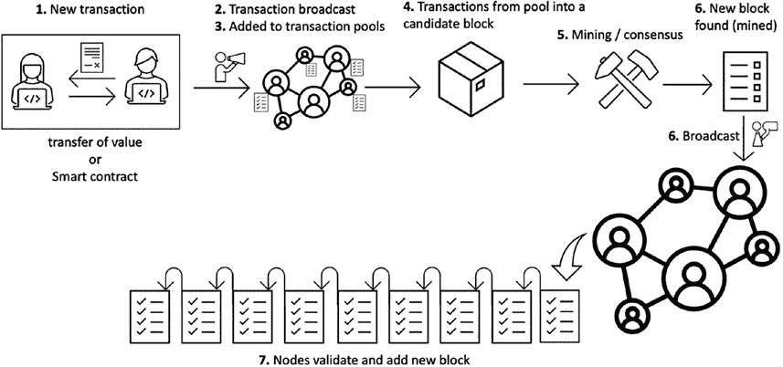

第四章 区块链

4\. 矿工通过向其中添加交易来创建提议块。

5\. 矿工竞赛解决工作证明，赢得将其插入的权限

将区块添加到区块链，或运行共识机制达成一致

关于交易。通常，矿工们运行工作证明类型的

共识机制以赢得添加区块的权限。在联合体中

或私人链，通常是传统拜占庭或

故障容忍算法运行，通过投票实现

就块达成一致，然后将其插入区块链。

6\. 如果矿工赢得权限，它在其本地链中插入区块

将该区块广播到网络。

7\. 如果有效，其他节点接受它，然后过程重新开始。

这个过程可以在图 4-3 中看到

***图 4-3\.** 区块链的工作原理*

**区块链的组成**

区块链由块组成，每个块链接到前一个块

除了第一个创世区块。区块链这个术语在中本聪的《比特币》代码中被用到

第一次使用他的比特币代码。即使现在它被用作一个词，但在他原始的比特币代码中，它是作为两个独立的词写的，“区块链”。它可以被想象为一个块的链条，如图 4-4 所示。

179

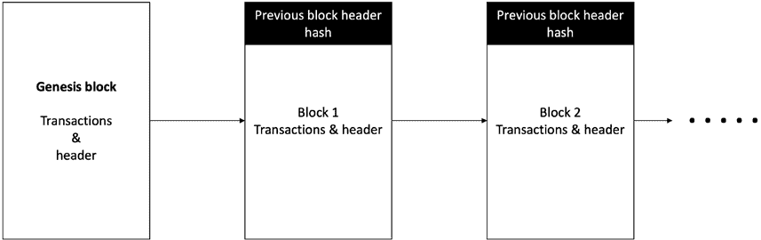

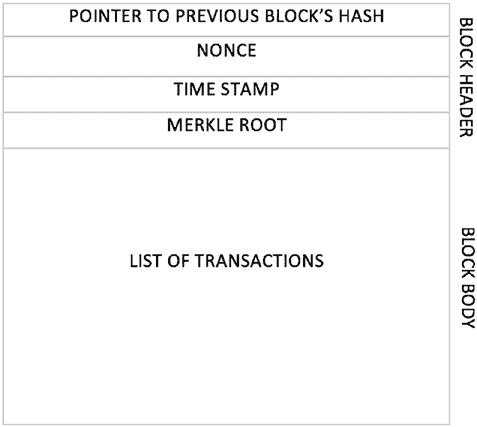

第四章 区块链

***图 4-4\.** 区块链的通用结构*

现在在一些情况下也使用其他结构，如 DAGs、哈希图和默克尔树

分布式账本而不是现代区块链中通常的基于区块的模型。对于

例如，Avalanche 使用 DAGs 进行存储，而不是线性基于块的结构。

当我们讨论特定于这些合意协议的共识协议时，我们将详细介绍它们

区块链（分布式账本）在第[8 章](https://doi.org/10.1007/978-1-4842-8179-6_8)中。

**块**

包括一个块头和交易。一个块头由

几个字段。通用描绘如图 4-5 所示。

***图 4-5** 通用块结构*

180

第四章 区块链

本章后期，在区块链部分，当我介绍比特币时

和其他区块链，我将讨论一个更详细的专门设计的块的设计

区块链。然而，其结构基本上就像一个块头和交易一样，

指向上一个块的前一个块的哈希。

当前块头中的块，从而创建一个可验证的链接列表。

**平台**

在本节中，我们将描述两个主要的区块链平台，比特币和以太坊。

**比特币**

比特币是由中本聪于 2008 年发明的第一个区块链。然而，它是

被认为是一个化名，因为中本聪的身份笼罩在神秘之中。

在引入比特币后，中本聪在一段时间内保持活跃，但随后离开

社区突然中止。从那时起，他再也没有联系。

我们讨论了创造数字货币的前史和尝试

在本章中的时间戳系统。在本节中，我将直接进入

技术细节。

比特币是一个点对点的电子现金系统，解决了双花

而不需要信任的第三方。此外，比特币拥有这个绝妙的

成为“包容性问责制”的性质，这意味着比特币上的任何人

网络可以验证对电子现金所有权的主张，也就是比特币。这

性质使比特币成为一个透明和可验证的电子现金系统。

比特币网络由节点组成。在

比特币网络：矿工节点、全节点和轻节点。矿工节点进行挖矿

并保留整个链的完整副本。比特币是一个松散耦合的网络，由

节点。所有节点都使用点对点的八卦协议进行通信。

**比特币节点和架构**

在实际操作中，分布式系统中的节点运行分布式算法。

同样，在比特币中，一个节点运行名为比特币核心的软件客户端。它可以运行在多种类型的硬件上，包括英特尔和 ARM 处理器。另外，受支持的

操作系统分别是 Mac OS、Linux 和 Windows。

181

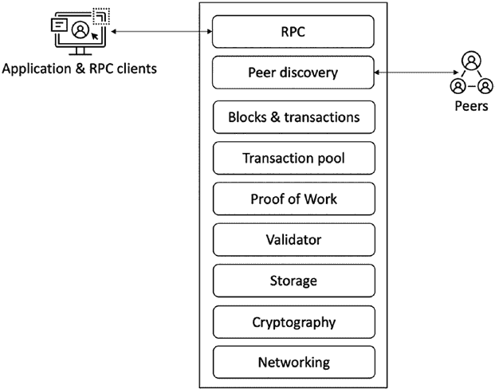

第四章 区块链

比特币网络中主要有三种不同类型的节点。全节点

保持整个区块链的全面历史。矿工节点保持整个历史和

参与挖矿以添加新的区块到区块链。最后，轻节点不

保留整个区块链的副本。相反，他们只下载块头

并使用称为简单支付验证的方法来验证

交易。比特币节点架构如图 4-6 所示。

***图 4-6\.** 比特币节点架构*

当一个节点启动时，它使用一种叫做节点

发现。在此过程中，节点首先连接到受信任的种子节点

核心开发者维护的引导节点。在这种初始连接之后，

进一步的连接。在某一点上，有 x 个与其他的连接保持活跃

同行。比特币协议中还内置了垃圾邮件保护，其中基于积分的

基于它尝试连接的声誉系统对节点进行评分

做。如果一个节点向另一个节点发送过多的消息，其声誉分数会下降

超过 100 分的阈值，并因此被封锁 24 小时。节点发现

节点之间的握手依赖于几个协议消息。列表如下所示

以下是它们的解释。在 4-7 看到的

182

第四章区块链

一些最常用的协议消息及其解释列举如下

如下所示：

• **Version：**这是一个节点发送到网络的第一个消息

宣传其版本和区块计数。远程节点随后回复

包含相同的信息，并且连接随后建立。

• **Verack：**这是对版本消息接受

连接请求。

• **Inv：**节点用这个来宣传他们对区块和

交易。

• **Getdata：**这是对 inv 的响应，请求单个区块或

通过其哈希标识的事务。

• **Getblocks：**这返回一个包含所有区块的 inv 数据包

从最后一个已知的哈希或 500 个区块开始。

• **Getheaders：**这用于在一

指定范围。

• **Tx：**这用于作为对 getdata 的响应发送交易

协议消息的了解。

• **Block：**这是对 getdata 协议的响应发送一个区块

消息的形式。

• **Headers：**这个包作为对 2000 个区块头的回复返回

getheaders 请求。

• **Getaddr：**这作为一个请求发送，以获取关于

已知的同行。

• **Addr：**这提供了有关网络上节点的信息。它

包含地址的数量和地址列表，以一个

IP 地址和端口号。

• **Ping：**这个消息用于确认 TCP/IP 网络

连接是活跃的。

• **Pong：**这个消息是对 ping 消息的响应，证实

网络连接是活跃的。

我们可以在图 4-7\.中看到这些消息的使用

183

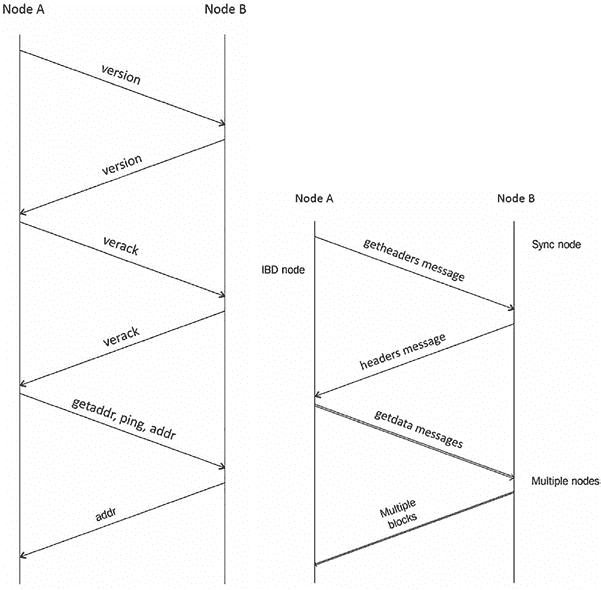

第四章区块链

***图 4-7\.** 节点发现和握手图表 + 标头和区块*

*同步*

**比特币中的密码学**

密码学在比特币区块链中发挥着重要作用。整个安全性

毕竟，比特币区块链确实基于加密。虽然我们讨论过

密码学中的 Chapt[er 2，我现在将](https://doi.org/10.1007/978-1-4842-8179-6_2)描述比特币中使用的加密协议是什么以及如何使用。

**公钥和私钥**

私钥证明比特币的所有权，用户使用它们授权付款

通过用私钥签署交易。

SHA-256 哈希函数用于工作证明算法。 还有一个

比特币客户端中的 Base58 编码器，用于以可读格式编码比特币地址。

184

第四章 区块链

比特币中的钱包用于存储加密密钥。钱包签署交易

使用私钥。私钥是通过随机选择 256 位生成的

钱包提供的数字。比特币客户端包括一个名为标准钱包的标准钱包

非确定性钱包。

**地址和账户**

用户在比特币中以账户形式表示。比特币地址生成过程是

如图 4-8 所示。

***图 4-8.** 比特币地址生成*

1. 在第一步，我们有一个随机生成的 ECDSA 私钥。

2. 公钥从 ECDSA 私钥派生而来。

3. 使用 SHA-256 加密哈希

功能。

4. 用 RIPEMD-160 再次进行哈希生成的哈希

哈希函数。

5. 版本号前缀加到 RIPEMD-160 哈希上

在第 4 步生成。

6. 第 5 步产生的结果使用 SHA-256 进行哈希

加密哈希函数。

185

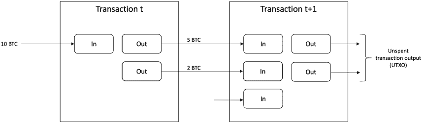

第四章 区块链

7. 再次应用 SHA-256。

8. 从第 7 步产生的结果的前 4 个字节是地址

校验和。

9. 此检验和附加到生成的 RIPEMD-160 哈希上

在第 4 步。

10. 结果字节字符串编码为 Base58 编码字符串

通过应用 Base58 编码函数。

11. 最后，结果是典型的比特币地址。

**交易和 UTXO 模型**

交易是比特币操作的基本单位。每个交易都是

至少由一个输入和输出组成。未消费的交易输出（UTXO）是

比特币交易的基本单位。交易输入指的是前一个交易的 UTXO。交易输出代表未使用数值的所有权转让。

一个账户中比特币的账户余额是该账户拥有的所有未消费的输出的总和。因此，UTXO 始终必须具有相等的输入和输出。

比特币交易消耗输入，并创建具有指定值的输出。

每个输入都是先前交易的输出。此交易模型如图所示

图 4-9.

***图 4-9.**比特币交易 UTXO 模型*

比特币交易生命周期描述如下：

• 用户创建一个交易。

• 交易由所有者使用私钥签名。

186

第四章 区块链

• 交易使用八卦协议广播到网络中。

• 所有节点验证交易并将其放入其交易池中。

• 矿工节点将这些交易捆绑到候选块中。

• 挖矿开始，其中一个解决工作证明的矿工

问题获得宣布其区块并赚取比特币的权利

一个奖励。

• 区块一旦广播到网络，便在网络中传播

整个比特币网络。

• 在六次确认后（六个区块），交易被认为

不可撤销的结束，但是即使如此，也可以接受交易

在第一次确认后。

交易由几个字段组成。表 4-1 显示了所有字段及其描述。

***表 4-1\.** 比特币交易*

**字段**

**描述**

**大小**

版本号

目前 1

4 字节

旗帜

证人数据指示器

可选的两字节数组

并置

输入数量

1-9 字节

输入列表

输入

许多输入

输出计数器

输出的数量

1-9 字节

输出列表

输出列表

许多输出

证人

证人列表

变量

锁定时间

直到交易挂起的区块高度或时间戳

4 字节

交易有两种类型。在链上交易是比特币的本地交易

网络，和离链交易是在区块链网络之外执行的。

在链上交易在区块链网络上发生并在链上验证

由网络参与者，而离链交易使用支付通道或

187

第四章 区块链

侧链执行交易。在链上交易较慢，隐私性较高

问题，并且不可扩展。离链机制旨在解决这些问题。一个主要的

示例是比特币闪电网络，它提供更快的支付。

**比特币脚本和 MiniScript**

比特币脚本是一种非图灵完备的基于堆栈的语言，用于

描述比特币如何转移。脚本按照 LIFO 栈从左到右进行评估。脚本由两个组成部分组成，元素和操作，如

如 图 4-10\. E 所示，元素表示数据，如数字签名，操作是脚本执行的动作。操作被编码为操作码。

操作码包括操作类别，如流程控制，栈操作，位操作

逻辑操作，算术，加密操作和锁定时间。

一些常见的操作码列举如下：

• **OP_CHECKSIG:** 接受签名和公钥并验证

交易的 ECDSA 签名。如果正确，则返回 1，

否则为 0。

• **OP_DUP:** 取栈顶项目并将其复制。

• **OP_HASH160:** 计算 SHA-256，然后 RIPEMD 160 位

输入的哈希。

• **OP_EQUAL:** 检查栈顶的两个项目是否相等。

如果相等，输出 TRUE，否则输出 FALSE。

• **OP_VERIFY:** 检查栈顶的项目是否为假；如果是，则

脚本终止并输出失败。

• **OP_EQUALVERIFY:** 首先运行 OP_EQUAL，然后运行 OP_VERIFY。

• **OP_RETURN:** 终止脚本，输出失败，并标记

交易无效。

• **OP_ADD:** 接受两个输入并执行求和操作。

脚本是由称为 ScriptPubKey 的锁定脚本和一个解锁脚本组成

脚本名为 ScriptSig，如图 4-10\. Outputs 由 ScriptPubKey 锁定，其中包含输出的解锁条件。换句话说，锁定意味着

给某人比特币，解锁意味着消耗获得的比特币。

188

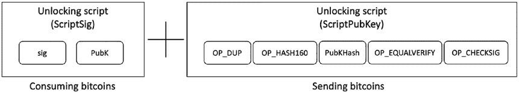

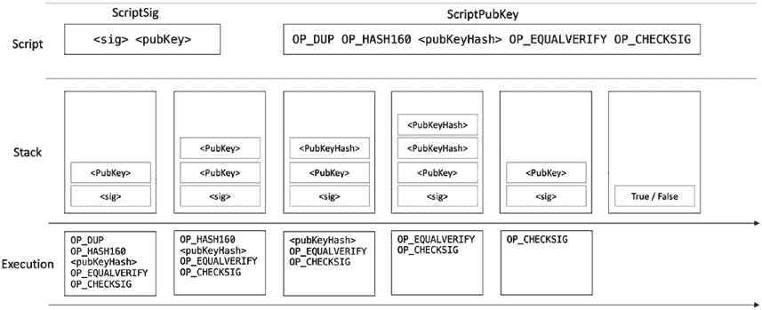

第四章 区块链

***图 4-10.** 比特币脚本（解锁+锁定）图解*

比特币有几种类型的脚本。最常见的是付款给公钥

Hash（P2PKH），用于将交易发送到比特币地址。格式

这个脚本如下所示:

ScriptPubKey: OP_DUP OP_HASH160 <pubKeyHash> OP_EQUALVERIFY OP_CHECKSIG

ScriptSig：<sig> <pubKey>

ScriptPubKey 和 ScriptSig 都被合并并执行，如图所示

图 4-11\.](#p207)

***图 4-11.** 比特币 P2PKH 脚本执行*

虽然比特币脚本是支付的原始方法，并且它有效

很好，它没有太多的灵活性。比特币开发了一种支持

智能合约的发展。这种语言叫做**Ivy**。一个解决方案就是让编写脚本更容易，更有结构化的方式就是比特币的**miniscript**。

189

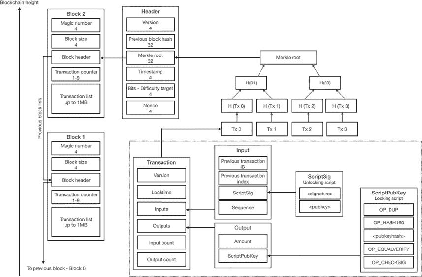

第四章 区块链

**块和区块链**

区块链由块组成。块由块头和

交易。块头由几个字段组成。比特币中的第一个块

区块链称为创世块，它不链接到任何块，成为

第一个块。通常在软件客户端中硬编码。

我们可以看到完整的块、块头、交易和

在图 4-12 中的脚本。

***图 4-12.** 比特币区块链、块、块头可视化*

*交易和脚本*

FLM1 不可能性指出，如果一个*n*，拜占庭共识不可能实现

对手可以控制比节点多。对于 PKI 设置来说，这个下限

3

并不成立。事实证明比特币绕过了 FLM 的不可能性。在工作证明中

环境，拜占庭协议是可能的，不需要 PKI 2setup。

1 作者姓名后面：Fischer、Lynch 和 Merritt – [`groups.csail.mit.edu/tds/`](https://groups.csail.mit.edu/tds/papers/Lynch/FischerLynchMerritt-dc.pdf)

[papers/Lynch/FischerLynchMerritt-dc.pdf](https://groups.csail.mit.edu/tds/papers/Lynch/FischerLynchMerritt-dc.pdf)

2 公钥基础设施。

190

第四章 区块链

**挖矿**

挖矿是将新币添加到比特币区块链的过程。这

过程保护网络并激励用户投入资源保护

网络。关于具体细节，请参阅第[5; ho](https://doi.org/10.1007/978-1-4842-8179-6_5)wever，现在我将谈及挖矿硬件。当 Bitcoin 推出时，挖矿很容易

CPU，迅速增加了难度，导致矿工使用 GPU。很快

成功采用 GPU 后，FPGA 作为一种进一步加速的机制出现

上 SHA-256 哈希。很快，这些被 ASIC 取代，现在 ASIC 是一个

挖掘比特币的普遍机制被认可。然而，个人用户采用的

由于极高的挖矿难度，使用挖矿硬件进行挖矿也不太赚钱。

相反，现在常用的是包括成千上万个 ASIC 的挖矿场。另外，

挖矿池很常见，多个用户共同解决哈希难题

按照他们的贡献来获得奖励。

**比特币作为一个平台**

除了电子现金，比特币作为一个平台可以用于几种用例。对

例如，可以用作时间戳服务或存储一些通用分类账的常见

信息。此外，我们可以使用 OP_RETURN 指令存储

数据，可以存储高达 80 字节的任意数据。其他用例，如智能

资产，智能资产和块作为随机性来源也出现了。

渴望将比特币用于不同的目的也导致了技术的出现

增强比特币，导致着色币、根股、Omni 层和对手方

项目。尽管比特币做了它打算做的事情以及更多的

之前提到的创新，比特币协议中的基本限制意味着

所有灵活的新协议都需要在比特币之上构建。没有

比特币内在的灵活性可以执行所有这些不同的任务。因此，有必要做的不仅仅是区块链上的加密货币。这种雄心激励

以太坊的发明，第一个支持

智能合约。

191

第四章区块链

**以太坊**

以太坊由 Vitalik Buterin 在 2014 年提出的白皮书中提出。以太坊

推出了一个平台，用户可以以智能合约的形式运行任意代码

合约。为了防止由代码中的无限循环引起的拒绝服务攻击，目前

其概念还引入了计量执行。计量执行要求

对链上的每次操作都收取手续费，该费用用

以太坊区块链的本地货币。通过智能合约，以太坊

打开了一个全新的通用平台世界，其中运营不再

不仅仅限于比特币风格的价值转移交易，而且由于以太坊的图灵完全设计，用户可以在链上执行任何类型的多样化业务逻辑。以太坊是

目前智能合约最常用的区块链平台。

今天的互联网是中心化的，由大公司主导。互联网

我们今天使用的互联网模式称为 Web 2\. 以太坊的开发目标是 Web3，其中

任何人都可以在没有任何依赖第三方的情况下参与网络。在 Web

2 模型，大型服务提供商目前提供服务以换取个人数据；

然而，在 Web3 中，任何人都可以参与而不必放弃他们的个人信息

以换取服务。然而，使用分散应用（DApps），任何人都可以

提供任何用户在网络上可以使用的任何服务，没有人可以阻止您

访问服务。

**以太坊网络**

以太坊网络由松散耦合的节点组成，这些节点交换消息

通过一种流言协议。

以太坊网络的高级可视化如图 4-13\.所示

192

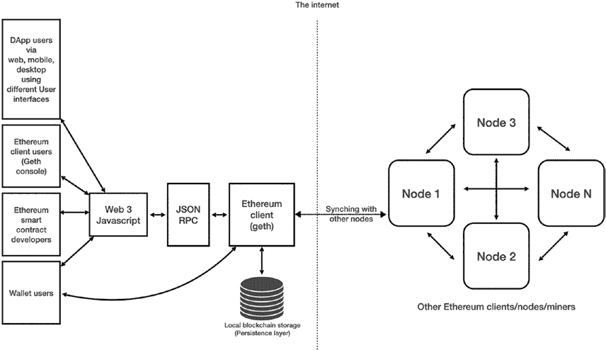

第四章 区块链

***图 4-13\.** 以太坊网络高级概述*

节点运行客户端软件，这是以太坊区块链的实现

在黄皮书中描述的协议使任何用户能够参与网络。

节点由不同组件组成，如图 4-14 所示

193

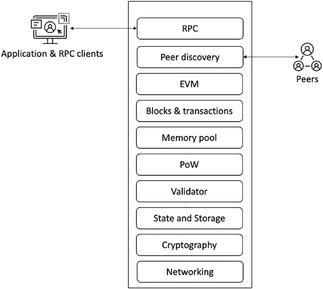

第四章 区块链

***图 4-14\.** 以太坊节点结构*

以太坊网络主要有三种节点类型：

• 完整节点

• 轻节点

• 存档节点

完整节点存储整个链数据并验证块，交易和状态。

轻节点仅存储块头并根据状态根验证数据

在区块头中。轻节点适用于资源受限设备，如

移动设备。存档节点包括完整节点中的所有内容，但还构建

历史状态的存档。矿工节点是完整节点，还执行挖矿

运营并参与工作量证明共识。

194

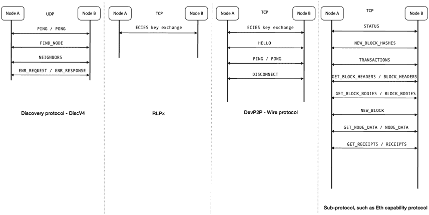

第四章 区块链

加入网络的新以太坊节点使用硬编码的引导节点

作为网络的初始进入点，从那里可以进一步发现其他

节点开始。

RLPx 是基于 TCP 的传输协议。它实现了客户端节点之间的安全通信

以太坊节点使用椭圆曲线集成加密方案（ECIES）进行

握手和密钥交换。

DEVP2P 或线协议在两者之间协商一个应用会话

已经被发现并建立了安全通道的以太坊节点

使用 RLPx。

发现并建立安全传输通道并协商一个后

应用会话，节点使用“能力协议”交换消息，用于

例如，ETH（版本 62、63 和 64）、轻量级以太坊子协议（LES）、Whisper，

和 Swarm。这些能力协议或应用子协议使不同

应用级通信，例如，ETH 用于块同步

节点发现协议和其他相关协议如图 4-15 所示

***图 4-15\.** 节点发现和其他协议*

195

第四章 区块链

**以太坊中的加密**

与其他任何区块链一样，以太坊的安全性依赖于加密。以太坊使用

整个区块链和节点设计中使用的加密技术：

• AES CTR 用于 RLP 握手和后续 P2P 消息。

它还在 keystore 中用作 AES CTR 128 位密码。

• 以太坊客户端中的数字签名使用 SECP256K1 曲线

用于 ECDSA 签名进行交易签名，ECDH 密钥

交易所，以及在 RLP P2P 之前生成共享密钥

握手。

• SCRYPT 和 PBKDF2 用作密钥派生函数

密钥库。

• KECCAK-256 哈希函数用于工作量证明

挖矿算法和 solidity 语言。

•椭圆曲线集成加密方案（ECIES）用于

以太坊。

如果前面提到的术语听起来陌生，请参考第[2](https://doi.org/10.1007/978-1-4842-8179-6_2) 章节，我们在这里详细介绍了密码学。

**账户和地址**

比特币模型基于交易，而以太坊基于账户。

账户是以太坊状态的一部分，并保持内在平衡和交易

计数。 160 位长的地址标识账户。用户与账户交互的方式

区块链。由账户签署的交易会经过验证并广播到

网络，一旦执行即在区块链上进行状态转换。有

两种类型的账户，合同账户（CAs）和外部所有权账户（EOAs）。

EOAs 与人类用户关联，而 CAs 没有内在关联

与用户。

196

第四章区块链

世界状态是地址和账户状态之间的映射。一个账户状态

包括表 4-2 中显示的字段。

***表 4-2\.** 账户状态*

**元素**

**说明**

nonce

来自某一地址的交易数量，或者在智能合同的情况下，

一个账户创建的合同的数量

余额

由这个地址拥有的 Wei 数量

Storageroot Patricia Trie 的根节点的 256 位哈希值，编码了账户存储的内容

codehash

关联 EVM 代码（字节码）的哈希值

**交易和执行**

以太坊中的交易是已签名的指令，一旦执行就会产生

区块链上的消息调用或合同创建（带有关联代码的新账户）。

从根本上讲，有两种类型的交易，**消息调用**和**合同创建**，但随着时间的推移，为了更容易理解，现在通常定义了三种类型：

•价值转移交易

• 合同创建交易

• 合同执行交易

一个交易由几个字段组成。 每个交易都是交易的一部分

Trie，其根存储在区块头中。当执行交易时，会返回一个收据，可以用作交易的验证

执行。

交易，无论是消息调用还是合同创建，都包括常见的

表 4-3 中显示的字段。

197

第四章区块链

***表 4-3\.** 交易结构*

**元素**

**说明**

nonce

发件人发送的交易数量

gasprice

单位燃气的 Wei 数量，用于执行交易

gaslimit

预计用于执行交易的最大燃气量。它是

预付且不可后期增加

对

消息调用的（价值转移，合同执行）接收者的 160 位地址

或用于合同创建交易

价值

要转移到消息调用的接收者的 Wei 数量。在合同创建交易的情况下

创建，这是新创建合同账户的受赠金（Wei 数量）

（智能合同）

V，r，S

用于确定发送者的交易签名对应的值

交易

初始化

（在合同创建交易的情况下）指定一个无限大小的字节数组

合同账户（智能合同）初始化过程的 eVM 代码

数据

（在消息调用交易的情况下）指定一个无限大小的字节数组

消息调用的输入数据

以太坊区块链中交易需要经过几个步骤。一个高级

交易流程描述如下：

1\. 首先，创建一个交易。它可以是合同创建

交易或消息调用。

2\. 交易使用 ECDSA 进行签名、验证并广播到

网络。

3\. 交易通过传播协议传播，并被接收到

由矿工和其他节点创建以填充其交易池。

4\. 矿工通过添加交易来创建候选区块，并

启动挖矿过程。

5\. 解决工作证明的矿工向

网络。

6\. 其他节点接收该区块，验证它，然后将其附加到它们的

区块链。

198

第四章区块链

**区块和区块链**

以太坊中的区块由区块头和交易组成。一个区块链

由包含交易的区块组成。

像任何其他区块链一样，区块是以太坊的主要构建模块。一个

以太坊区块由区块头、交易列表和

叔块头。一个区块头也由几个元素组成。所有这些

区块中的元素显示在表格 4-4 和 4-5 with a description 中。

***表 4-4\.** 区块结构*

**元素**

**描述**

区块头

区块的头部

交易列表

包含在区块中的一系列交易

叔块列表

叔块头或叔块头列表。叔块是父块的子块，但是

头部

没有任何子区块。它们是有效的但过时的区块，不

虽然它不能进入主链，但却能因参与奖励。

区块头结构在 Table 4-5\.

***表 4-5\.** 区块头结构*

**元素**

**种类**

**描述**

父哈希

哈希

区块的父区块的 keccak 256 位哈希

叔块哈希

哈希

交易列表的 keccak 256 位哈希

受益人

地址

160 位挖矿奖励接收地址

状态根

哈希

交易前置节点的 keccak 256 位哈希

交易根哈希

交易前置节点的 keccak 256 位哈希

收据根

哈希

交易收据前置节点的 keccak 256 位哈希，

包含了区块中所有交易的收据

日志布隆

可变

布隆过滤器由记录器地址和日志主题组成

难度

整数

当前块的难度级别

缩写

整数

所有先前块的总数

（*续*)

199

第四章 区块链

***表 4-5\.*** （*续*)

**元素**

**类型**

**描述**

燃气限制

整数

对每个块的燃气消耗设置限制

消耗的燃气

整数

所有包含在块中的交易消耗的总燃气

时间戳

整数

Unix 纪元时间戳

额外的

可变

用于存储额外数据的可选自由字段

Mixhash

整数

计算工作证明

随机数

整数

与 Mixhash 结合以证明计算工作

每单位燃气的基本费用

整数

（eip-1559 后）记录了协议计算出的需要的费用

要包含在块中的交易

以太坊使用一种称为 Merkle Patricia trie 的新数据结构来存储和组织

交易和相关数据。它是带有新属性的 Patricia 和 Merkle 树的组合。

以太坊中有四个尝试用于组织数据，如交易，状态，

收据和合同存储。

**交易尝试**

每个以太坊块包含一个交易尝试的根，该根由

交易。

**世界状态尝试**

状态尝试是一个从用户地址到账户状态的键值映射。也称为

世界状态尝试，这个尝试的根在块中被引用。状态尝试由账户状态组成。

**交易收据尝试**

交易收据存储交易执行的结果，并包括信息

作为状态，日志和事件。每个块包含一个交易收据尝试。交易收据尝试由交易收据组成。

200

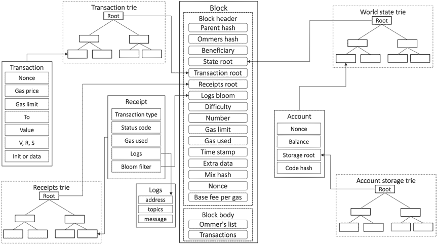

第四章 区块链

**账户存储尝试**

这个尝试以账户状态中的存储根为根。它存储智能合约代码和相关数据。

图 4-16 sho 包括所有尝试，包括区块结构。

***图 4-16\.** 区块和尝试*

块内的交易是使用以太虚拟机执行的，

我们接下来描述。

**以太坊挖矿**

与比特币相比，以太坊中的挖矿是 ASIC（特定应用集成电路

电路）抵抗。

基于 ASIC、专用、高效和极快硬件是为挖掘比特币而

进行比特币挖掘。这些设备只有一个具体的工作，即运行

哈希函数 SHA-256 重复并极快地。

以太坊使用工作证明；然而，共识是内存硬，这

使得由于大内存需求而难以建立 ASIC。这个协议被称为

ETHASH，生成一个大的有向无环图（DAG），供矿工使用。

201

第四章 区块链

DAG 根据网络难度级别而增长和缩小；然而，随着时间的推移，

已经增加到约 4 GB 大小。由于这个 DAG 消耗了大量内存，

建立这样大内存的 ASICs 非常困难，因此使 ETHASH 成为

专用应用集成电路抗性算法。我们将在第[8\.](https://doi.org/10.1007/978-1-4842-8179-6_8)章中详细解释 ETHASH

**以太坊虚拟机和智能合约**

以太坊虚拟机（EVM）是以太坊的核心工作马

区块链。它是一个 256 位的寄存器堆，深度为 1024 项。它被设计用来运行编译成字节码的智能合约代码。智能合约通常是用一种

领域特定语言（DSL）叫做 Solidity；然而，也有其他语言

如 Vyper，开发人员也可以使用它来编写智能合约代码。

我们可以将**智能合约**定义为一个安全不可阻挡的计算机程序

代表自动可执行和可执行协议。智能合同

不一定需要区块链；但是，区块链是最自然的平台

为了运行智能合约。这是因为区块链提供了所有的安全性

保证使智能合同安全，不可阻挡，自动执行，

并可执行。

EVM 被设计为图灵完备；但是，它受到燃气限制的限制

意味着其执行是计量的，并且通过所谓的燃气费用支付

以太。这种机制允许执行任意代码，但具有安全性

当燃气用尽时，执行会停止，防止由于循环或恶意代码而发生无限执行。EVM 执行由成本基础上的 opcode 组成的字节码。约有 150 个操作码分为几个组：

算术操作码，内存操作码，以及程序流程相关操作码。

完整列表可在以太黄皮书中找到。

以太坊中的共识是基于工作的证明，我们将在详细讨论中涵盖

第[8\.](https://doi.org/10.1007/978-1-4842-8179-6_8)章

以太坊 1.0 区块链将按照其路线图继续发展和

最终将成为 Ethereum 2.0 的阶段 1 中的一个分片。

202

第四章 区块链

有了这个，我们完成了对两种最突出的的简要讨论

开创性的区块链平台。更现代的区块链平台，如 Polkadot，

Cardano，Solana，Avalanche 和 Ethereum 2.0 在讨论他们时将被介绍

各自的共识协议在第[8\.](https://doi.org/10.1007/978-1-4842-8179-6_8)章中

**总结**

• 区块链是点对点的，加密安全的，追加的

只有，不可变，并且防篡改的共享分布式分类帐

由时间顺序和公开可验证的交易组成。

• 区块链的起源可以追溯到先前尝试创建

数字货币和文档的数字时间戳。

• 区块链是一个分布式系统。

• 区块链主要分为两种类型，有许可和公共。

• 区块链有许多跨行业的用例，包括但不限于

意味着受到政府，金融，医疗，供应链等限制

技术。

• 区块链提供了多种好处，比如节省成本，

透明性和数据共享。

• 各种技术，如公钥加密、哈希

函数和默克尔树为构建提供了基础

区块链的安全性。

• 从 CAP 理论的角度看，许可区块链是

CP 系统，��公共链是 AP 系统。

• 区块链账本抽象具有多个属性，以及

获取()、追加() 和验证() 操作。

• 比特币是由中本聪发明的第一种区块链。

• 以太坊是第一个由智能合约区块链提出的平台

维塔利克·布特林。

• 比特币和以太坊是最突出的平台。

203

第四章 区块链

• 以太坊将成为以太坊 2.0 的一个分片\。

• 现代区块链平台正在关注异构

多链架构，多个链相互操作和

形成协作和互操作的区块链生态系统

共同提供多种用例。

**参考文献**

1\. 巴希尔（Bashir, I.），2020\. 区块链掌握：深入探究

分布分类帐，共识协议，智能合约，DApps，

加密货币、以太坊等。

2\. 伍德（Wood, G.），2014\. 以太坊：一个安全的去中心化通用

交易分类账。以太坊项目黄皮书，151（2014 年），

页 1–32\.

3\. Raynal, M., 2018\. 容错传递消息分布式

系统（页 459）。施普林格。

4\. 中本聪（Nakamoto, S.），2008\. 比特币：一种点对点电子

现金系统。

5\. Bitg[old:](https://unenumerated.blogspot.com/2005/12/bit-gold.html)

[`unenumerated.blogspot.com/2005/12/bit-`](https://unenumerated.blogspot.com/2005/12/bit-gold.html)

[gold.html](https://unenumerated.blogspot.com/2005/12/bit-gold.html)

6\. 大卫·乔姆的盲签名文件可用

her[e: https://sceweb.sce.uhcl.edu/yang/teaching/](https://sceweb.sce.uhcl.edu/yang/teaching/csci5234WebSecurityFall2011/Chaum-blind-signatures.PDF)

[csci5234WebSecurityFall2011/Chaum- blind- signatures.PDF](https://sceweb.sce.uhcl.edu/yang/teaching/csci5234WebSecurityFall2011/Chaum-blind-signatures.PDF)

7\. 哈伯（Haber, S.）和斯通内特塔（Stornetta, W.S.）, 1990 年 8 月。如何给时间戳

数字文档。在*理论和应用会议上*

*密码学*（页 437–455）。柏林、海德堡，施普林格。

8\. B-money 在此发布：[www.weidai.com/bmoney.txt](http://www.weidai.com/bmoney.txt)

9\. 马克·杜尔克和莱洛娜·纳奥尔的电子邮件垃圾邮件 bek

通过处理或对抗垃圾邮件：[www.iacr.org/cryptodb/](https://www.iacr.org/cryptodb/data/paper.php?pubkey=1268)

[data/paper.php?pubkey=1268](https://www.iacr.org/cryptodb/data/paper.php?pubkey=1268)

204

第四章 区块链

10\. 用于电子邮件垃圾邮件 bek

[org/papers/hashcash.pdf](http://www.hashcash.org/papers/hashcash.pdf)

11\. Hal Finney 发布的可复用工作证明在此发表：[https://](https://cryptome.org/rpow.htm)

[cryptome.org/rpow.htm](https://cryptome.org/rpow.htm)

12\. Gupta, S., Hellings, J., 和 Sadoghi, M., 2021\. 容错

区块链上的分布式事务。*综合讲义*

*数据管理*，*16*(1), 第 1–268 页\.

13\. 完整的比特币操作码列表在这里可用：[https://](https://en.bitcoin.it/wiki/Script)

[en.bitcoin.it/wiki/Script](https://en.bitcoin.it/wiki/Script)

14\. Ivy 的文档在这里可用：[`docs.ivylang.`](https://docs.ivylang.org/bitcoin/)

[org/bitcoin/](https://docs.ivylang.org/bitcoin/)

15\. 关于小脚本的更多细节在这里可得到：[http://](http://bitcoin.sipa.be/miniscript/)

[bitcoin.sipa.be/miniscript/](http://bitcoin.sipa.be/miniscript/)

16\. 这里更多关于 FLM 不可能性的信息: [https://](https://decentralizedthoughts.github.io/2019-08-02-byzantine-agreement-is-impossible-for-$n-slash-leq-3-f$-is-the-adversary-can-easily-simulate/)

[decentralizedthoughts.github.io/2019- 08- 02- byzantine-](https://decentralizedthoughts.github.io/2019-08-02-byzantine-agreement-is-impossible-for-$n-slash-leq-3-f$-is-the-adversary-can-easily-simulate/)

[agreement- is- impossible- for- $n- slash- leq- 3- f$- is- the-](https://decentralizedthoughts.github.io/2019-08-02-byzantine-agreement-is-impossible-for-$n-slash-leq-3-f$-is-the-adversary-can-easily-simulate/)

[adversary- can- easily- simulate/](https://decentralizedthoughts.github.io/2019-08-02-byzantine-agreement-is-impossible-for-$n-slash-leq-3-f$-is-the-adversary-can-easily-simulate/)

17\. Fischer, M.J., Lynch, N.A., 和 Merritt, M., 1986\. 易不可能性

分布式共识问题的证明。*分布式*

*计算*，*1*(1), 第 26–39 页\.

205

**第五章**

**区块链共识**

区块链共识是区块链的核心元素，它确保了完整性

以及区块链数据的一致性。区块链作为一个分布式系统，在

第一种情况下，看起来我们可以应用传统的分布式共识协议

协议，如 Paxos 或 PBFT，以满足协议和全部顺序要求

在区块链中。但这只能在联盟链中工作，参与者

众所周知，并且数量有限。在公共链上，传统的共识协议

由于无需许可的环境，无法运行。然而，就在 2008 年，一个新的类别

共识算法的出现依赖于工作量证明以确保随机的领导者

通过解决数学难题来进行选举。当选的领导者获得了附加的权利

到区块链。这就是所谓的中本聪共识协议。这个算法

非常时期内在无需许可的公共

环境中有许多匿名参与者。

我们已经从传统的角度讨论了分布式共识

在[第三章](https://doi.org/10.1007/978-1-4842-8179-6_3)中。本章将介绍什么是区块链共识，传统协议如何应用于区块链，工作量证明的工作原理，它是如何发展起来的，以及区块链共识的要求，并且我们将分析

区块链共识，例如通过分布式共识的工作方式。

此外，我们将看到共识的要求可能会根据类型而改变

在使用区块链的两类广泛的算法。例如，对于公共区块链，工作量证明可能是更好的选择，而对于许可区块链，BFT 风格的协议可能效果更好。

207

© Imran Bashir 2022

I. Bashir，*区块链共识*，[`doi.org/10.1007/978-1-4842-8179-6_5`](https://doi.org/10.1007/978-1-4842-8179-6_5#DOI)

第五章 区块链共识

**背景**

分布式共识一直是分布式系统中的一个基本问题。

同样，它在区块链中起着确保区块链完整性的重要作用。

由于过去将近 45 年对分布式共识的研究，出现了两类广泛的算法：

1\. 基于领导者的传统分布式共识或许可

共识

2\. Nakamoto 和后 Nakamoto 共识或无许可共识

基于领导者的协议基于投票原则，分布式系统中的节点

系统投票来执行操作。这些协议通常是确定性的，而

自上世纪 70 年代以来一直在研究。一些这样的协议包括 Paxos、PBFT 和

RAFT。2008 年，另一种不同类型的类出现在比特币中，它依赖于工作量证明类型的密码难题。这种协议是概率性的，参与者通过解决工作量证明来获得追加新区块到区块链的权利。

通常，在区块链世界中使用拜占庭容错协议，

尤其是这些区块链预计会在公开或在一个

财团环境，那里恶意攻击是现实。也许并不是很多

在参与者已知的财团链中，但由于其性质

在这些平台上运行的企业应用程序，最好考虑采用拜占庭容错模型。与金融、健康、电子治理等相关的应用程序，以及许多

其他用例运行在财团链上；因此，有必要确保保护免受任意错误，甚至是主动对手。

这两种方法各有利弊。传统 BFT 协议或其

区块链的变体相对于工作量证明，提供了更强的一致性

类型算法，这种算法只能提供最终一致性。然而，工作量证明

相对于传统 BFT 协议，共识更具可伸缩性。参见

在表 5-1 b 中比较 BFT 和 PoW 共识。

208

第五章 区块链共识

***表 5-1\.** 传统 BFT 与 Nakamoto 共识*

**属性**

**传统 BFT**

**中本聪**

协议

确定性的

最终的

终止

确定性

概率的

能源消耗

低

非常高

欺骗抵抗

没有

是

最终性

立即

概率的

一致性

更强

更弱（最终）

通信模式

广播

流行

吞吐量（tps）

更高

低

可扩展性

低（10-100 个节点）

更高（数千个节点）

分叉

无

可能

身份

已知的

匿名的（匿名的）

网络

点对点

点对点

顺序

时间的

时间的

形式严谨（正确性证明等）

是的

大多数不存在

容错性

1/3，<=33%

<=25% 计算能力*

>50% 计算能力

客户端数量

许多

许多

还需注意广播问题和

一个共识问题。共识是一个决策问题，而广播是一个传递

问题。两者的特性相同，但定义略有不同。

这些属性包括协议，有效性，完整性和终止。实质上，

广播和共识是相关的，密切相关的问题

可以从其中一个实现另一个。

我们将更多关注共识问题而不是广播问题。

209

区块链共识

**区块链共识**

区块链共识协议是一种机制，允许参与者

区块链系统能够在存在故障的情况下就一系列交易达成一致意见。

换句话说，共识算法确保所有参与方对来自单一来源的

即使某些参与方有错也要说出真相。

与区块链共识相关的一些属性。这

特性与标准分布式一致性几乎相同，但略有不同

变体。

作为标准，有安全性和活性性。这些安全性和活性性会根据区块链的类型而改变。首先，我们定义安全性和活性性

许可/联合体区块链的属性，然后是公共区块链的属性。

**传统的 BFT**

我们可以为传统的 BFT 共识定义几个属性，这些属性是

在许可的区块链中常用。有各种变体，例如，

Tendermint，用于区块链。我们在第五章详细介绍了传统的 BFT

第三章;然而，在这一部分，我们将重新定义它，让它处于区块链和特别是许可的区块链。大多数属性保持不变

公共无权限共识；然而，关键区别在于确定性

和概率终止和协议。

**协议**

没有两个诚实的进程会就不同的区块做出决定。换句话说，没有两个诚实的

进程在相同的高度提交不同的区块。

**有效性**

如果一个诚实的进程就一个区块*b*做出决定，那么 b 必须满足特定应用的有效性断言*valid()*。而且这个区块 b 必须由某个诚实节点提议。

**终止**

每个诚实的过程都会做出决定。在 GST 之后，每个诚实的过程都会不断地做出决定。

提交区块。

协议和有效性是安全属性，而终止是活跃性属性。

210

第五章 区块链共识

**完整性**

一个过程在共识轮中最多只能决定一次。

其他属性可能包括以下内容。

**链进展（活跃性）**

区块链必须在 GST 之后不断地添加新的区块以保持增长。

**即时不可撤销性**

一旦交易进入区块并且区块被确认，交易

不能被移除。

**共识最终性**

最终性是确定性和即时的。交易一旦进入区块就是最终的，区块一旦被添加到区块链就是最终的。

尽管现在有许多区块链共识算法，中本聪共识

是第一个引入比特币的区块链协议，其中包含一些新颖的。

属性。事实上，这不是具有确定性属性的经典拜占庭算法；相反，它具有概率特性。

**中本聪共识**

中本聪或 PoW 共识可以用几个属性来描述。它是

在公共区块链中通常使用，例如，比特币。

**一致性**

最终，没有两个诚实的过程会对不同的区块进行决定。

**有效性**

如果一个诚实的过程对一个区块 b 做出决定，那么 b 满足特定于应用的有效性谓词 valid()。此外，区块中的交易满足特定于应用的有效性谓词 valid()。换句话说，只有有效和正确的交易才会进入

到区块，只有正确和有效的区块才能进入区块链。只有有效

211

第五章 区块链共识

节点接受交易和区块。此外，挖矿节点（矿工）只会

接受有效的交易。此外，决定的价值必须由某些人提出。

诚实的过程。

**终止**

每个诚实的过程最终都会做出决定。

协议和有效性是安全属性，而终止是活跃性

属性。

**注意**，在公共区块链网络中，通常与经济激励相关联。

与共识属性一样，参与者正在致力于工作的人

确保网络的安全性和活跃性受到经济上的激励。

这样做。

记得我们在第三章[章](https://doi.org/10.1007/978-1-4842-8179-6_3)中讨论过概率算法，其中终止是以概率方式保证的。随机协议用于

规避 FLP 不可能性。通常，终止属性是以概率方式实现的

以达成一致来规避 FLP 不可能性。然而，使用比特币

区块链，协议的一致性属性变成了概率性的，而不是终止。在这里，

安全属性在比特币区块链中有些牺牲，因为

暂时允许出现分叉，并当分叉解决时，某些先前最终的交易将被回滚。这是由于最长链规则。

还有一些其他我们现在描述的属性。

**共识最终性**

有两个正确的进程 p1 和 p2，如果 p1 将块 b 附加到其本地区块链

在另一个块 b’之前，没有其他正确的节点在 b 之前附加 b’。

从工作证明区块链的角度来看，我们可以进一步挖掘一些

特性。

212

第五章 区块链共识

**链的进展（活性）**

区块链必须继续稳定增长，新的区块不断地附加到

每隔 n 个时间间隔即可。N 可以是协议定义的预定义时间间隔。

**一致性/一致性**

区块链必须最终修复分叉链，以达到单一最长链。换句话说，每个人必须看到相同的历史。

**最终不可撤销性**

交易被附加到越多的块上，被回滚的概率就越小

到区块链。这是从最终用户的角度来看的一个关键属性

属性让用户确信他们的交易被加入后

一旦区块被最终接受和接受，新的区块被添加到

区块链进一步确保交易永久且无法撤销地成为区块链的一部分。

表 5-1 显示了传统 BFT 和 Nakamoto 共识之间的一些关键区别。

现在我们把注意力转向系统模型，这是必要描述的

它们捕捉了我们对区块链运行环境的假设

共识协议将运作。

**系统模型**

区块链共识协议假设一个系统模型，在该模型下它们保证

安全性和活性属性。在这里，我描述了两个系统模型，它们通常

分别适用于公共和许可区块链系统。

**公共区块链系统模型（无需许可）**

区块链是一个节点通过消息传递进行通信的分布式系统。

在公共区块链的情况下，广播协议通常是概率性的，在哪里

交易（消息）是通过利用一种类似八卦的协议传播的。

213

第五章 区块链共识

通常，网络模型是异步的，因为处理器上没有边界

延迟或通信延迟，尤其是因为公共区块链系统最

可能是异构的且地理位置分散。节点彼此不了解，

也不知道系统中总共有多少节点。节点可以任意

加入和退出网络。任何人都可以通过简单运行协议软件加入

在网络上。

**联盟区块链系统模型（受许可）**

在该模型中，区块链节点通过消息传递进行通信。一个广播

协议通常是共识协议内的一对一通信。为

例如，在 PBFT 中，领导者将其提案一次性广播给所有副本，而不是

将其发送给少数人，然后其他节点将其发送给其他节点，正如我们所看到的

在八卦传播中。此外，网络模型是部分同步的。

更准确地说，区块链共识协议是基于最终的模型。

在未知的 GST 之后的同步模型，系统保证会做出

进度。

现在让我们把注意力转向第一个区块链共识协议并探索

它是如何工作的：工作证明协议或中本聪共识。

**第一个区块链共识**

工作证明共识算法或中本聪共识首次作为

2008 年，比特币区块链中使用了**领导选举算法**。它是一个基本的领导选举算法。

在领导选举之间强制和随机的等待时间之后。这

也作为一种假冒者攻击机制。传统分布式共识协议的一个弱点是，它需要每个参与者都被认识和识别在

协议。例如，在 PBFT 中，所有参与者都必须被知道和可识别。这

限制（尽管在联合链中很有用）使得 BFT 风格的协议有些

不适合公共链。这是因为攻击者可以创建多个

身份，并且可以使用这些多个节点/身份来投票支持他们。这就是所谓的假冒者攻击。如果我们可以以某种方式创建并且使用那个身份

在区块链上是非常昂贵的一个操作，那么这样的设置可以阻止任何假冒者攻击。

尝试并且阻止攻击者通过创建多个来接管网络

假身份。

214

第五章 区块链共识

术语假冒者攻击是在 1973 年出版的一本名为*Sybil*的书中被创造的，在这本书中，主角西比尔·多塞特有多重人格。

混乱。

第一个工作证明是由 Dwork 和 Naor 在 1992 年引入的[1]。这项工作是

通过打击垃圾邮件来完成，通过关联计算成本，也就是说，定价

函数，发送电子邮件会导致创建一种访问控制机制

这里只能通过计算一种适度困难的方式来获得资源

防止过度使用的功能。工作证明也在亚当提出了。

Back 的 Hashcash 提案[10]。

区块链中工作证明的关键直觉是普遍减慢

对所有参与者的提案进行实施，从而实现两个目标。首先，它允许所有

参与者收敛于一个共同的一致观点，其次，它使假冒者攻击成为可能。

攻击变得非常昂贵，这有助于区块链的完整性。

已经观察到，不可能（无法实现结果）达到一致的共识。

网络中的协议，其中参与者是匿名的，即使只有一个

拜占庭节点[2]。这是由于假冒者攻击，可以制造任意多个

身份以操纵攻击者的系统来投票多次。如果有办法阻止这种攻击，那么只有这样才能保证系统能够正常工作。

如预期那样；否则，攻击者可以创建任意多的身份来攻击系统。这个问题在实际中被工作证明共识或 Nakamoto

共识 [3]。在比特币之前，使用中等难度的难题在匿名网络中分配身份首先是由 Aspnes[4]建议的。然而，解决方案

Aspnes 提出需要经过认证的通道，而在比特币中不需要认证

通信被使用，并且难题是非交互式的并且公开可验证的。

因此即使在经典的不可能结果存在的情况下

文献中，Nakamoto 共识出现，首次展示了共识

在无许可模式中可以实现。

记得我们在[第三章](https://doi.org/10.1007/978-1-4842-8179-6_3)中讨论了随机神谕。在工作证明中，哈希函数被用来实例化随机神谕。由于哈希函数的输出长度

足够长且随机，对手无法预测未来的散列，或者能

造成散列碰撞。这些属性使得 SHA-256 成为将其用作散列的良好选择

在工作机制的证明中发挥了关键作用。

215

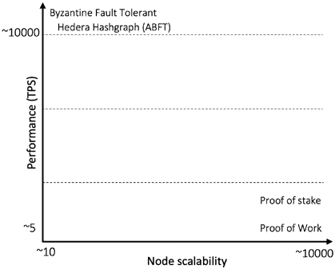

第五章 区块链共识

区块链的关键要求是要对交易进行全面排序。如果所有

参与者被知晓并且规模被限制在几个节点，那么我们可以使用

传统共识像 BFT；然而，有成千上万未知的节点，传统

不能使用 BFT。工作证明共识机制解决了这个问题。

在比较时会出现可伸缩性与性能的权衡 [6]

传统的 BFT 与 PoW，如图 5-1\.所示。

***图 5-1\.** 性能 vs. 可伸缩性*

工作证明或 Nakamoto 共识协议是一种拜占庭容错

协议，因为它能够容忍任意故障。它可以被看作是**最终的拜占庭**协议机制。

**PoW 工作方式**

首先让我们定义一些 PoW 的要求。事实上，工作证明起初

比特币中引入，却没有经过严谨的文档记录或正确性证明。

为了更清晰和更容易理解，我们将列举一些要求（几乎是追溯的）并查看 PoW 是否满足这些要求以及如何满足：

• **一致性**：新块被复制到所有节点。

• **与上一个块链接**：日志以一种方式维护，使

每个新条目与先前条目链接在一起形成链。

• **无许可和开放参与**：节点可以无需任何

访问控制并且可以无需通知离开。

216

第五章 区块链共识

• 分区容错。

• 地理分散。

• 允许成千上万的节点，无论在世界的任何地方

可以下载客户端并通过运行成为网络的一部分

客户端。

• 高度对抗的环境，因此拜占庭容错性至关重要。

首要重要性。

• 不同类型的计算机和其他多样化的设备

硬件设备可以加入。

• 异步的意思是 CPU 或

通信延迟，只是一个最终的保证，消息被

预计以很高的概率到达所有节点。

问题是，如何为这样一个困难设计共识协议

环境？然而，比特币 PoW 经受住了时间的考验，除了一些有限的

和精心策划的攻击和一些无意的错误，主要是比特币

网络在过去的 13 年里一直运行良好。为什么？现在我会解释。

**PoW 的教学解释**

想象一个场景，一个节点提出了一个块，并将其广播到网络中。

收到它的节点可以执行两种操作之一。他们可以接受该块

并将其附加到本地区块链，或者如果块无效则可以拒绝。现在还想象一下块确实有效，那么接收节点可以简单地接受并同意所提出的块。想象整个系统中只有一个提议者节点，

那个节点是诚实和值得信赖的。这意味着没有真正的共识

需要；提议者节点只需提出新的块，节点们同意，导致

在包含交易的块的最终总顺序中。但这是一个有可信第三方的中心化系统，如果它保持诚实，作为领导者，可以驱动整个系统，因为每个人都信任它。如果它变得恶意，那就是一个问题？

或许，我们还可以允许其他节点提出，以剥夺控制权

单个节点，不值得信任。现在想象我们现在有两个提议节点

有效的块并在网络上广播它们。现在有一个问题；其中一些

接收节点会添加一个块，然后添加另一个。有些节点可能不知道哪一个

217

第五章 区块链共识

选择接受哪一个拒绝哪一个。提议同时提出，现在节点

不知道要插入哪个块；也许，他们会插入两者。现在一些节点已经

仅从提议者 1 插入块，其他节点从提议者 2 插入块，另一些从

两者。正如你可以想象的，这里没有共识。

再想象另一个场景，两个节点同时宣布一个块；现在

接收节点将收到两个块，而不是一个链，现在有两个

链。换句话说，有两个日志和事件历史。两个节点提出了一个

同时; 所有节点都添加了两个块。现在不再是单一链，而是一棵树，有两个分支。这被称为分叉。换句话说，如果节点同时了解到指向相同父级的两个不同块，那么区块链就会分叉

分为两条链。

现在为了解决这个问题，我们可以允许节点选择最长的块链

那时他们所知道的时间内将新块添加到该链并忽略其他

分支。如果碰巧存在两个或多个不同的分支

高度（相同长度）时，随机选择其中一条链并添加新区块

添加到其中。通过这种方式，我们可以解决这个分叉情况。现在所有节点，知道了只有最长的链才允许有新的区块，将会继续构建最长的链。在出现两条或更多同样长度的链时，随机向其中的任何一条添加区块。

到目前为止，一切都很好！这个方案似乎有效。一个节点决定将新区块添加到一个

随机选择一条链并向其他节点传播这个决定，其他节点也会添加该

同样的区块添加到它们的链中。随着时间的推移，最长的链占据主导地位，较短的链被忽视，因为没有新的区块添加到其中，因为它不是最长的链。

但现在出现了另一个问题。想象一种情况，一个节点随机地

在分叉后选择一条链，向其添加一个区块，并向其他节点传播这个决定，

其他节点也会添加，而此时由于延迟，有些节点并没有得知此事

这个决定。有些节点将从另一个节点那里听到的区块添加到它们的链中

链，另一个执行相反的操作，然后这个循环重复。现在你可以清楚地看到

出现两条正在获取新区块的链。没有共识。有一

发生一个活锁，节点可以持续向两个链中添加区块。

此刻，让我们思考一下根本原因是什么，为什么这种

活锁正在发生。原因是区块生成速度太快，其他节点从不同节点接收到许多不同的区块，有的很快，有的延迟。这

异步性导致活锁。解决方案？慢一点！给节点时间收敛到一条链上！让我们看看如何做到。

218

第五章 区块链共识

我们可以引入一个随机等待期，这将使矿工们任意休眠

一段时间，然后再进行挖矿。关键的洞察力在于，活锁（持续分叉）

通过在每个节点引入可变速计时器来解决这个问题。当一个节点

向其链中添加一个新区块后，停止其计时器并将其发送给其他节点。其他节点正在等待它们的计时器到期，但是在等待时间内，如果它们从其他节点那里得知了此新区块，它们会简单地停止计时器并添加这个新区块

重置计时器并重新开始等待。这样，链上只会增加一个区块，而不是两个。如果计时器足够长，那么分叉和活锁的几率会显著降低。在这里需要注意的另一件事是，如果系统中有许多节点，那么某个计时器很快就会过期的几率就会更高，而且随着我们持续

添加了越来越多的节点，这种情况发生的概率增加了，因为

计时器是随机的，而且现在有很多节点。为了避免相同的活锁

情况，我们需要增加这些计时器的睡眠时间，以便添加更多节点之后，

以便节点快速增加区块的概率降至一定水平，最终只有一个节点成功地向他们的链中添加一个新区块并将其通知给网络。此外，等待期大概率确保在此等待时间内解决分叉。这足够的时间确保新有效区块的完全传播，以便不会有其他同一高度的区块被提出。

比特币根据 2016 年

区块，大概是两周。由于区块产生应该大致是一个

每十分钟生成一块，如果协议观察到区块生成较慢

在过去两周内变得更快，那么它会增加超时值，导致更慢

区块的生成。如果协议观察到区块生成较慢，那么它就会降低超时值。现在，这种超时机制中的一个问题是

如果单个节点变为恶意节点，总是设法使其计时器

比其他节点提前到期，这个节点将每次创建一个区块。现在

要建立一个抵抗此类欺骗的计时器。一个

这样做的方法是建立一个带有一些密码安全性的可信任机制

保证作为一个安全飞地，其中计时器代码运行。通过

加密保证措施，恶意节点可能无法欺骗时间

总是最先到期。

这种技术是 PoET（已消逝时间的证明）算法中使用的

Hyperledger Intel Sawtooth 区块链。我们将在第八章讨论这个问题。

219

第五章 区块链共识

另一种方式，原始方式，中本聪设计的算法是为了使

计算机执行一个需要时间解决的计算复杂任务——正好

每十分钟几乎都能解决。此外，任务的设置是这样的

节点无法欺骗的方式，除了尝试解决问题。任何与

解决问题的方法将无济于事，因为解决问题的唯一方法

尝试每个可能的答案并将其与预期答案匹配。如果答案

与预期答案匹配，则问题已解决；否则，计算机

将不得不尝试下一个答案并保持这样以蛮力方式一直做下去直到

找到答案。这是中本聪的一项杰出见解，它确保

计算机几乎每十分钟不能欺骗，而计时器只能每十分钟结束一次

分钟，给其中一个节点添加其区块到区块链的权利。这就是所谓的工作量证明，意味着节点已经付出足够的努力证明它

已经花费足够的计算能力来解决数学问题以赢得权利

向区块链插入一个新区块。

工作量证明是基于密码哈希函数的。它要求对于一个区块

为了有效，它的哈希必须小于一个特定的值。这意味着区块的哈希必须以一定数量的零开头。找到这样的哈希的唯一方法是

反复尝试每个可能的哈希值，看它是否符合标准；如果不符合，那就继续尝试，直到有一个节点找到这样的哈希。这意味着为了找到一个有效的哈希，大约需要十分钟的时间，因此引入了足够的延迟，从而导致解决分叉

并收敛于一个链，同时最小化一个节点赢得机会的可能性

右侧每次创建一个新区块。

现在很容易看出，工作证明是一种引入等待时间的机制

区块生成和确保最终只有一个领导者出现之间的差距，这可以

将新区块插入到链中。

因此，可以得出结论，PoW 不是一个精确来说的共识算法；它是一个

共识促进算法，由于减缓区块生成，允许

节点收敛到一个常见的区块链。

现在我们理解了工作证明机制背后的直觉，接下来

将描述比特币中工作证明算法的具体工作方式。

220

第五章 区块链共识

**PoW 公式**

PoW 共识过程可以用一个公式来描述：

*SHAd* 256( *nonce* || *Block heade*

*r*) ≤ *target*

其中 *SHAd* 256 表示 SHA-256 哈希两次。换句话说，双

SHA-256 表示输入的哈希值的哈希值。一个区块头包括版本、

hashPrevBlock, hashMerkleRoot, 时间, Bits（难度目标）和 Nonce。Nonce 是

反复更改并输入工作证明算法的任意数字

看看它是否产生一个小于或等于难度目标的值。

目标值是根据挖矿难度计算得出的，每 2016

个区块，大约相当于两周。如果矿工挖矿速度太快 – 比如说每八分钟，他们能够在十分钟内生成一个区块 – 这意味着

如果哈希功率过高；因此，作为调控机制，难度会增加

如果矿工在之前的 2016 个区块的时间内生成的区块速度过慢，比如每 12 分钟一个区块，那么就慢于预期；因此，难度被调整为更低。让我们来看看一些公式。

首先，比特币的难度公式基于前 2016 个区块的区块生成速率，计算了接下来 2016 个区块的新难度。公式为

( *上一个难度*

× 2016×10 *分钟*)

*新难度* = ( *时间 t* *挖* *最* *新* 2016 *个* *区块的* *时间*) 这个公式基本上调整了区块链的难度，以便每次

十分钟的平均速度。

现在为了计算目标值，首先根据以下公式计算难度

公式：

( *可能的* *目标* )

*难度* = ( *当前目标*

)

最后，使用以下公式计算目标值：

( *可能的* *目标* )

*目标* =

( *难度*)

221

第五章 区块链共识

既然我们已经确定了目标值是如何计算的，现在我们来看看

矿工的行为以及他们如何找到满足前面方程的哈希，即

再次哈希成 sha-256，所得到的值

全为零。这也被称为部分哈希反演问题。这个问题就是

找到双 SHA-256 哈希函数的部分原像，只有在满足条件时才能找到（如果有的话）。

不同的输入，直到其中一个输入起作用。

基本上，比特币挖矿是找到一个随机数，当

拼接一个区块，然后两次使用 sha-256 哈希函数进行哈希，

生成一个值，该值从特定数量的零开始。

那么，矿工到底在干什么呢？

**矿工的任务**

在比特币区块链网络中，当用户执行新交易时

通过点对点的八卦协议广播到网络上的所有节点。这些

交易最终进入节点的交易池。矿工执行几项任务：

• 矿工维护交易池。他们监视传入的

交易并将这些保留在他们的池中。

• 他们还会听取新的区块并追加任何新的有效区块

附加到它们的链。当然，这不仅仅是矿工的任务，其他

非挖矿节点也只是同步区块。

• 通过从

交易池。

• 通过尝试每一个随机数找到一个随机数

区块和前一个哈希的哈希结果小于一个数字

根据之前的公式 3 和目标。

222

第五章 区块链共识

• 将新挖掘的区块广播给网络。

• 通过在矿工所在的地址接收 Coinbase 来获取奖励

想要发送奖励的地址。

看看一个候选区块包含什么以及如何创建。

一个潜在的有效候选区块，最终是一个有效的区块，包含了一些

元素，这些元素在表 5-2 中列出。

***表格 5-2\.** 区块元素*

**大小**

**描述**

**数据类型**

**解释**

4

版本

整数

区块版本

32

上一个区块

字符

前一个区块头的哈希值

32

默克尔根

字符

区块中所有交易的默克尔根哈希

4

时间戳

无符号整数

在 unix 时间格式下的区块创建时间

4

比特

无符号整数

区块的网络难度目标](https://en.bitcoin.it/wiki/Difficulty)

4

随机数

无符号整数

该区块的随机数

1+

交易数

变量整数

总交易数

变量

交易数

交易[ ]

交易

图 5-2 展示了如何从交易池中挑选交易（图的左下方），并创建一个默克尔树，最后区块的候选者中包含了其根。 最后，对区块进行双层 (SHA-256) 计算

与目标值进行比较。

223

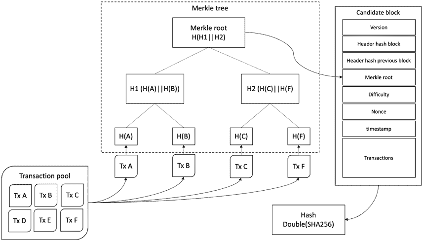

第五章 区块链共识

***图 5-2\.** 交易池交易到 Merkle 树和候选区块* 随机数是 1 到 232 – 1 之间的数字，即 32 位无符号整数，它

包含在区块内。在每次迭代中使用这个随机数来检查是否得到了结果

数字小于目标就叫*挖矿*。如果结果数小于目标，那就叫做挖出的区块，是有效的，然后就会广播到

网络。

区块中的随机数字段是一个无符号整数，只有 232 个随机数

尝试。换句话说，矿工很快就会用完它们。也就是说

大约有 40 亿个随机数要尝试，矿工们可以快速执行，鉴于

强大的采矿硬件。即使对于普通计算机也很容易

快速检查。

这当然可能会出现一个问题，即没有人能够找到所需的随机数

生成所需散列。即使矿工再次尝试，他们仍会尝试相同的事情

以相同的结果再次进行验证。在这个阶段，我们可以使用区块的其他属性，并将它们用作变量，并保持修改区块，直到区块的散列小于

目标是，即 *SHAd* 256（ *区块头* ‖ *随机数*） < *目标*。

224

第五章区块链共识

现在在经历了所有这些迭代之后，如果找不到有效的随机数呢？

在这一点上，矿工们将不得不以某种方式增加搜索空间。为此，他们可以

修改区块所以得到不同的散列。他们可以做一些事情：

*删除交易*，添加新交易，或者选择一个新的集合

交易。此修改将重新计算 Merkle 根，

因此头部，因此散列将会不同。

*修改时间戳* 在两小时范围内微调（否则

它是一个无效的区块）。 只需简单地添加一点

秒，这将导致不同的头部，从而导致

不同的散列。

*通过未使用的* ScriptSig *修改 Coinbase* ，在那里你可以放任何

任意数据。这将改变 Merkle 根，因此也会改变头部

因此也得到散列。

而矿工可以继续用不同的变体进行修改，直到他们达到

*SHAd* 256（ *区块头* ‖ *随机数*） < *目标*，这意味着他们找到了一个解决工作证明的有效随机数。

找到所需随机数的发现基于所谓的*部分散列*概念

*反转*。

工作证明有一些关键属性。正式来说，我们列举如下。

**PoW 的特性**

工作证明有五个属性：完备性，计算上复杂，动态成本

调整、快速验证和免费进展。

**完备性**

这一属性意味着由证明者产生的证据是可验证和可接受的

由验证者。

**计算上复杂—难以计算—缓慢的创建**

工作证明的创建是缓慢的，但并非无法克服。创建证据需要

花费大量的计算资源，并花费大量的时间

时间。

225

第五章 区块链共识

**自动调整成本 – 动态成本**

这就是这个协议的优雅之处。首先，PoW 是计算上困难的。它花费

关键的想法在于生成工作证明应该是计算上复杂的。

在比特币网络中每秒检查的哈希数，这是为了解决工作证明而做的

其次，参数是可以调整的，这意味着即使区块生成得

更快或更慢，无论放入了多少哈希功率或者

从网络中删除了，区块生成速率依然大约是每十分钟一个

为挖出一个区块要付出相当大的努力。大致上，这相当于超过了十的十八次方的区块。在早期，当困难因数是一时，仍然每分钟生成一个区块；而现在在 2022 年，即使困难因数已经达到了大约每秒 25 万亿次哈希，协议仍然会调整自身，并且生成的区块仍然是每十分钟一个。这真是令人惊讶，也证明了协议的健壮设计。所以总而言之，如果

在 2016 个区块的一段时间内的区块生成时间超过了十分钟，

然后在接下来的 2016 个区块周期中，困难因数将被调整到更低。如果区块生成速度更快，每个区块花费的时间少于十分钟，例如，假设网络中引入了一些最前沿的哈希硬件，那么困难因数

将会在接下来的 2016 个区块周期内上升。这样就能在网络中保持一个平衡状态

网络。同时请注意，很多区块都在十分钟以内非常快速地生成；一些

生成一个区块的时间可能会长得多，但平均值是十分钟。这是因为协议的概率性质。

**快速和高效的验证 – 快速验证**

这个性质意味着证明是非常快速和高效的验证。验证这个证明不应该是计算上复杂的。就以比特币为例，只是两次在矿工产生的 nonce 所生成的区块上运行 SHA-256 哈希函数。

如果 *SHAd* 256（*nonce* ‖ *block header*） ≤ *target*，那么该区块就是有效的。这只需要花费生成 SHA-256 哈希和进行比较的时间，这两个过程都是非常高效的计算。

生成一个带有有效 nonce 的区块；然而，其他节点应该很容易地验证其有效性

**进展自由**

这一特性意味着解决工作证明的机会与投入的哈希功率成比例；然而，这仍然只是一个机会，而不是矿工

的哈希功率将始终获胜。换句话说，更多哈希计算能力的矿工将永远获胜

226

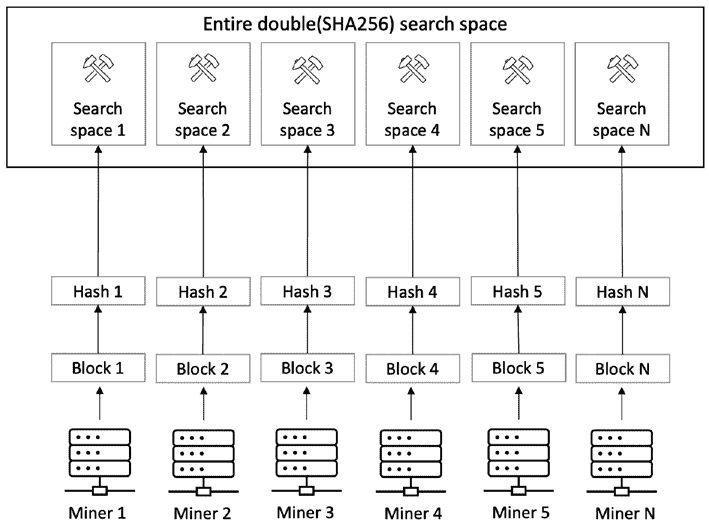

第五章 区块链共识

的哈希功率，而拥有更少哈希功率的矿工则只会得到与其成比例的

补偿内容并有时会比更多哈希功率的矿工更快地找到区块

的哈希功率

实际上，这意味着每个矿工实际上都在工作于一个不同的候选

要解决工作证明的区块。矿工不是在同一个区块上工作；他们也不

尝试为同一个哈希找到有效的随机数。这是由于几个差异，如交易、版本号、Coinbase 差异和其他元数据差异，

当被散列时会产生完全不同的哈希值（SHA-256 两次）。这意味着

每个矿工正在解决不同的问题，并解决双重的不同部分

SHA-256 或方便地写为*SHAd* 256 搜索空间。

进度自由性质可以在图 5-3\. 中可视化。如图 5-3 所示

矿工们都在各自的候选区块上工作，这些区块与之前提到的区别不同。因此，每个矿工与

获取哈希值的区块数据将产生一种没有其他矿工知晓的哈希值。这为哈希能力较小的矿工带来了一些优势，这样便有可能让这个区块

这个小矿工正在尝试为之寻找有效的随机数来解决 PoW 的区块

***图 5-3\.*** 进度自由性质 - 每个矿工在*双（SHA-256）搜索空间*的不同部分工作

227

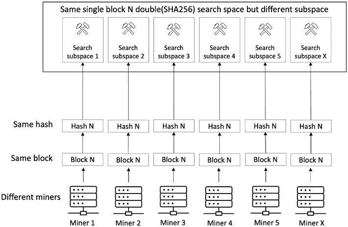

第五章 区块链共识

这是 PoW 的另一个优雅性质，可以确保拥有更多哈希

力量可能有一些优势，但这也意味着一个哈希能力较小的矿工

可能在较大的矿工之前幸运地找到有效的随机数。关键点是

矿工们并不是在同一个区块上工作！如果每次都是同一个区块，那么最

强大的矿工可能会赢。这被称为比特币 PoW 的进度自由性质。

然而，许多矿工合作在同一个区块上也是可能的

（相同的搜索空间），从而在彼此之间分配工作。想象一下

搜索空间是 1 到 100 个区块，可以被分成 10 个不同的部分，然后所有矿工可以共同工作在一个区块上。这样分割了工作，所有矿工都可以

贡献并分享奖励。这被称为**矿池挖矿**。与**单独**挖矿不同，其中只有一个矿工尝试，如果找不到适当的随机数而且为下一个区块再尝试，那么整个努力都将白费，而在矿池挖矿中，个人贡献是

不会被浪费。

这个概念可以在图 5-4\.中可视化

***图 5-4\.** 矿池 - 许多矿工在一个区块上工作（shad256*

*搜索空间)*

在图 5-4,有不同的矿工在同一个区块产生的哈希搜索空间上工作。这样，矿池操作员将工作证明分成

不同的部分，然后将它们分发给矿工池中的矿工。所有矿工工作并投入 228

第五章 区块链共识

这个努力，最终找到了一个矿工发现的区块，正常情况下会广播到

比特币网络。矿池操作员收到区块奖励，这些奖励在

矿工的努力与矿工们投入的努力成比例。

**动态参数的概率方面**

现在让我们揭开与属性（动态

和自动可调参数）相关的概率性方面，我将解释十分钟的平均值

意思以及参数化的意思。

在概率论中，伯努利试验是一种有两种可能结果的行动，

无论成功还是失败。成功或失败的概率在每次尝试之间保持不变。

例如，在抛硬币中，正面或反面的概率是 50%。结果也是

独立的。连续出现三次头并不意味着一定会失败

第四次也是头。同样，在比特币挖矿中，成功或

如下所示，失败的概率保持独立并且几乎像抛硬币一样

大约 50%的概率。我们可以从以下公式中看到这一点。

挖掘中的成功和失败可以写成以下两个公式：

*成功*= *SHAd* 256(*随机数* || *区块头*

*r*）< *目标*

*失败*= *SHAd* 256(*随机数* || *区块* *头*) ≥ *目标* PoW 几乎就像掷骰子一样，例如，如果我已经掷过几次骰子，我

无法知道接下来的六次会在何时发生；可能第一次就得到六次，也可能永远得不到六次，或者在几次掷骰子后得到六次。同样，无论是否尝试了单个随机数来找到有效的随机数，还是尝试了数不清的随机数，矿工找到有效随机数的平均时间仍然是概率的。无论尝试了 1 亿个随机数还是只尝试了一个，找到有效随机数的概率都是相同的。因此，尝试数百万个随机数并不会增加找到

有效的随机数；即使只尝试一次或只尝试几次，也可能找到有效的随机数。

伯努利试验足够迭代以获得连续的结果而不是离散的

称为泊松过程。形式上，我们可以说泊松过程是一系列离散事件，其中事件以已知的恒定平均速率独立发生，但

事件的确切时间是随机的。

229

第五章 区块链共识

例如，股价的波动是一个泊松过程。泊松过程

有一些特性：

• 事件相互独立，即不受任何一个事件的影响

在其他一些结果中。

• 每个时间段的事件速率是恒定的。

• 两个事件不可能同时发生。

两个事件的平均时间是已知的，但它们是随机间隔的

（随机的）。当然，在比特币中，我们知道两个区块生成之间的时间

事件是已知的，即大约十分钟，但这些事件是随机间隔的。

新区块的平均时间是平均十分钟。我们可以使用一个简单的

公式来发现特定矿工找到下一个区块的平均时间。

*下一* *个* *区块* *的平均时* *间*（*具体*

*分钟*

）=

10

*散列 p 的* *分数*

*由矿工控制的* *能量*

**攻击者赶上的概率**

In this section, we answer the question of what the probability is of an attacker to mine enough blocks to take over the chain. Suppose an attacker has some mining power, say

q. 卖方在接受支付前等待 z 次确认（z 个区块），且如果没有找到一个 nonce，那么该算法将尝试下一个区块。

honest chain hash rate is denoted by p.

The probability of an attacker catching up *qz* can be calculated as shown follows: *z*



 



*q* =



1

≤ _

*z*

*if p q*

*q*

  *if p q* 

 *p* 





where

*q* = *attacker’s hash r* *ate*

*p* = *honest hash rate*

*z* = *blocks to catc*

*h up*

230

第五章 区块链共识

This means that if the honest hash rate is less than the attacker’s hash rate, then the

probability of an attacker catching up is one, and if the honest hash rate is more than the *q z*

 

attacker’s hash rate, then the probability of catching up is   .

 *p* 

In the next section, we formally write the proof of work algorithm.

**工作证明算法**

正式地，我们可以将工作证明算法的整个证明写成如下形式：

1: nonce := 0

2: hashTarget := nBits

3: hash := null

4: while (true) {

5: SHA256(SHA256(blockheader || nonce))

6: if (hash ≤ hashTarget) {

7: append to blockchain

8: else

9: nonce := nonce + 1

10: }

11: }

In the preceding algorithm, the nonce is initialized as zero. The hash target which

is the difficulty target of the network is taken from the *nBits* field of the candidate block header. The hash is initialized to null. After that, an infinite loop runs, which first concatenates the block header and the nonce and runs SHA-256 twice on it to produce

the hash. Next, if the produced hash is less than the target hash, then it is accepted and appended to the blockchain; otherwise, the nonce is incremented and the process starts

again. If no nonce is found, then the algorithm tries the next block.

This process can be visualized in Figure 5-5\.

231

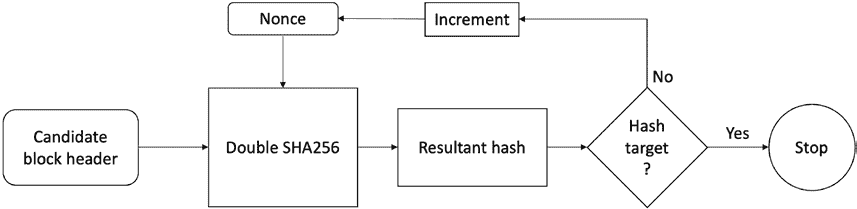

第五章 区块链共识

***图 5-5\.* 工作证明*

In Figure 5-5, the previous block hash, transactions, and nonce are fed into a hash function to produce a hash which is checked against the target value. If it is less than

the target value, then it’s a valid hash and the process stops; otherwise, the nonce is

incremented, and the entire process repeats until the resultant hash is less than the

target, where the process stops.

**博弈论与工作证明**

Game theory is the study of behaviors in strategic interactive situations where an

individual’s best course of action depends on the choice of others. Game theory models

represent real-life situations in an abstract manner. Game theory is useful in many

different fields, such as economics, biology, social science, finance, politics, computer science, and many more. For example, in economics, product launch decisions made

by businesses are influenced by their competitor’s choice of product and marketing

strategy. In computer networks, networked computers may compete for resources such

作为带宽。纳什均衡被用来研究政治竞争。在政治中，

政客的政策受他们所作出的宣布和承诺的影响

对手。

游戏可以定义为玩家可能采取的所有战略行动的描述

但并没有描述可能的结果。

游戏中有一些实体列举如下：

• **玩家**：游戏中的战略理性决策者

• **动作**：玩家可用的行动集

• **支付**：对玩家进行的特定结果的支付

232

第五章 区块链共识

游戏代表了不同的战略情况。有一些经典的游戏

例如巴赫或斯特拉文斯基，囚徒困境，鹰-鸽，和抛硬币。在游戏中，

当做出自己的决定时，玩家不知道其他玩家的行动；

这样的游戏被称为**同步移动游戏**。

游戏可以通过创建一个表格来进行分析，在表格中列出所有玩家的可能行动，

报酬被列出。这个表格被称为游戏的**战略形式**或**支付矩阵**。

**纳什均衡**是博弈论中的一个基本而强大的概念。在一个

纳什均衡，每个理性的玩家选择对其他玩家行动的最佳应对。

对其他玩家所做选择的结果。每个玩家都知道其他玩家的均衡

策略，没有玩家可以通过只改变自己的策略而获得任何收益。在

简而言之，战略的偏离不会为偏离者带来任何收益。

**囚徒困境**

在这个同步移动游戏中，两名犯罪嫌疑人被分别关押在不同的牢房中。

没有任何沟通的方式。如果他们都坦白了，那么他们两个都将被监禁

三年。如果其中一人坦白并作为对对方的证人，然后

那么对他的指控将会被撤销；然而，另一名嫌疑人将被判四年的

在监狱里。如果他们两个都不坦白，那么他们两个都将被判一年监禁

监狱。现在你可以看到，如果两名嫌疑人合作不坦白，那么这对双方都是最好的结果。然而，对于两人都没有合作和作为对对方的证人这一行为，是一个很大的诱因。如果他们合作而不坦白，那么他们将获得收益，只会被判一年的监禁。让我们命名

这些角色爱丽丝和鲍勃以方便起见了，看看在

这个游戏。

这个游戏有四种可能的结果：

1\. 爱丽丝不坦白，鲍勃不坦白。

2\. 爱丽丝坦白了，鲍勃没有坦白。

3\. 爱丽丝不坦白，鲍勃坦白。

4\. 爱丽丝坦白，鲍勃坦白。

如果爱丽丝和鲍勃能够以某种方式进行沟通，那么他们可以共同决定不支付报酬。

坦白，这将导致每个人只会被判一年的监禁。然而这个主导

这里的策略是坦白而不是不坦白。

233

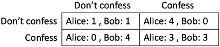

第五章 区块链共识

**主导策略**是一种策略，无论其他玩家的行为如何，都会产生最大的回报。

我们可以将此表示为如图 5-6\.所示的收益矩阵形式

***图 5-6\.**囚犯困境的收益矩阵*

爱丽丝和鲍勃都知道这个矩阵，他们知道他们都有这个矩阵

可供选择。爱丽丝和鲍勃是玩家，“坦白”和“不坦白”是行动，而回报是监禁。

无论爱丽丝做什么，鲍勃做什么，另一个玩家都会坦白。爱丽丝的

策略是，如果鲍勃坦白，她也应该坦白，因为一年监禁

的监禁比三年好。即使鲍勃不坦白，她也应该坦白，因为

她将获得自由。鲍勃也采用了相同的策略。这里的主导策略是

坦白，无论其他玩家做什么。

双方都坦白，各自监禁三年。这是因为即使

鲍勃总算设法告诉爱丽丝他的不坦白策略，爱丽丝就会

依然坦白并成为证人以完全避免监禁。对爱丽丝来说情况也是如此。因此，对于双方来说最好的结果是在

纳什均衡。这可表示为{*坦白*，*坦白*}。

在囚徒困境中，对于两个玩家来说，合作有好处，但是

潜在的激励，每个玩家都被囚禁。当所有玩家

一个游戏是理性的，最佳选择就是在纳什均衡状态。

博弈论模型非常抽象；因此，它们可以在许多方面使用

不同情况，一旦针对特定情况开发。例如，

囚徒困境模型可以用在许多其他领域。在网络通信中

在无线网络设备竞争带宽、能源供应等方面，存在

需要调节节点行为，使网络上的所有设备都能工作

和谐。想象一下一个网络，两个运行在相同频率上的基站

在附近会影响对方的性能。对抗这个问题的一个方法

是以尽可能低的能量运行两个塔，以便它们互不干扰，但是 234

第五章区块链共识

将降低两个塔的带宽。如果一个塔增加其能量，而

另一个不坦白，则不坦白的那个输了，将以较低的带宽运行。因此，

在这里，最优策略是以最大功率运行塔，无论其他

另一个塔这样做，以便他们获得最大可能的收益。这个结果就像囚徒困境，坦白是最佳策略。在这里，最大功率是

最佳策略。

现在，在前述的概念的光芒下，我们可以分析比特币

协议的博弈论视角。

**PoW 和博弈论**

我们可以把比特币看作是一个有自私玩家的分布式系统；节点可能是

尝试获得激励而不作贡献或试图获得比公平份额更多的激励。

比特币协议是**纳什均衡**，因为没有任何偏离协议均衡策略的行为可以使偏离者获益。该协议被设计成任何偏离协议的行为都会受到惩罚，而正常（良好）行为是经济激励的。

在比特币中的主导策略是根据经济激励进行挖矿。
