协议规则，因为没有其他策略会导致更好的结果。每个

参与者最好只需遵守网络规则。

如果其他矿工不改变策略，攻击者就没有动机改变

他们自己的策略。如果另一个玩家不改变策略，那么任何一方都无法通过转换策略来增加自己的报酬。这意味着在比特币网络中，如果所有其他的挖矿者都是诚实的，那么对手就没有动机改变策略，尝试进行恶意挖矿。

比特币中的区块奖励和交易费等激励机制

阻止恶意行为。这些激励措施鼓励参与者的行为

根据协议行事，这不仅导致了新比特币的产生，即保证了网络的进步，还维护了网络的安全性。

自 2009 年以来，比特币网络以投资形式吸引了大量资金

沉默挖矿和比特币企业、交易所和服务，这些网络参与者

通过保护网络而不是摧毁它来获益。他们通过

保护网络。即使攻击者也无法获得太多。想象一下，如果某些对手

设法找到一种方法将中本聪拥有的所有币转移到另一个

帐户。可能没有动机让攻击者这么做，因为在那一刻

235

第五章区块链共识

发生，比特币几乎肯定会变得毫无价值，因为这种情况会

暗示着保护网络的密码学已经被攻破（假设

真正的中本聪已经过世或者已经无法找回他的私钥）。

我有一种感觉，中本聪不会转移他的硬币，因为这可能导致比特币

价值急剧下降。

同样，即使对手以某种方式获得了 51%的网络算力，

接管整个网络可能不再有益了。为什么？因为最好的

在这种情况下，对手的最佳行动是悄悄地挖矿，拥有一定的算力来获得经济激励（赚取比特币），就像其他人一样

网络，而不是利用整体 51%的算力来公布攻击

世界。这会几乎完全削弱比特币价值，而任何谋取利益的

攻击者将是毫无意义的。因此，攻击者没有动机接管

比特币网络，也许除了由于人为错误导致的一些意外事件。

以及被盗的密钥。这就是比特币的优雅之处，即使是攻击者也不能

不通过攻击网络来获取利益。所有参与者只需遵守规则，就能够获利。矿工的主导策略就是诚实。

在分布式计算中，首次创建了一个网络，该网络不

不依赖于任何受信任的第三方，是无需许可的，但却不允许任何攻击者接管网络。在这里，我记得一些事情，虽然与比特币不直接相关，

但有助于感受许多分布式计算专家可能对比特币的感受

当他们第一次意识到它有多么优雅时。

*它可能不是真的，但它是真的。*

—Mikhael Gromov

[www.ams.org/notices/201003/201003FullIssue.pdf](http://www.ams.org/notices/201003/201003FullIssue.pdf)

随着比特币的出现和密码学、分布式

计算和经济学，出现了一门新的研究领域，称为 Cryptoeconomics

或 Cryptonomics。这在图 图 5-7\. 中有所描述

236

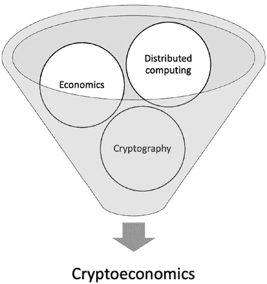

第五章 区块链共识

***图 5-7\.** 分布式计算、经济学的融合*

*密码学-比特币*

我们还可以将分叉解决机制视为**谢林点**解决方案。这是博弈论概念，谢林点或称为谢林点是一种默认情况下人们选择的解决方案，当没有通信时。同样，在工作证明分叉解决机制中，由于最长（最强）链规则，节点倾向于选择最长链作为添加收到的区块的规范链，而不需

任何来自其他节点的通信或指令。在没有合作的概念的情况下，

通信是由托马斯·谢林在他的书 *Conflict* 中提出的。

**PoW 和传统 BFT 之间的相似之处**

从根本上说，所有共识算法都致力于实现安全性和活力性

属性。无论确定性还是概率性，基本上所有共识算法都具有三个主要属性：协议、有效性和终止。我们已经介绍了这些

术语。在 Nakamoto 共识中，问题出现了，我们是否能重新定义

这些属性以一种更接近区块链世界的方式被首次引入。答案是肯定的；

协议的协议、有效性和活力性属性可以映射到 Nakamoto 共识-

具体属性的共同前缀、链质量和链增长，分别。

这些术语首次在 https://eprint.iacr.org/2014/765.pdf 中被引入。[7]。

237

第五章 区块链共识

**共同前缀**

此属性意味着所有诚实的节点将共享相同的大型共同前缀。

**链质量**

此属性意味着区块链包含一定水平的正确性

由诚实的矿工创建。如果链的质量受损，那么有效性

无法保证协议的特性。

**链增长**

此属性意味着新的正确区块不断被添加到区块链

定期。

这些属性可以看作是传统共识属性的等价物

在 Nakamoto 的世界中。在这里，共同前缀是一种协议属性，链

质量是有效性属性，链增长可以看作是活力属性。

**PoW 作为状态机复制**

可以将工作证明区块链视为状态机复制机制，在这里

首先选举出一名领导者，他提出了一系列被批量处理的交易组成的区块。

其次，最终化(挖矿)的区块通过消息传播协议广播给其他节点

被其他节点接受并追加到其本地区块链中，从而实现了日志复制。

我们可以将其理解为领导者提出一个顺序，并且所有节点都根据这个顺序的交易集合来更新它们的日志(本地区块链)。

让我们首先详细了解领导者选举算法和复制算法。

**领导者选举算法**

解决工作量证明难题的节点被选中最终化并通过消息传递协议广播其

候选区块。工作量证明中的领导者是根据计算来选举的。

挖矿节点的算力。与传统 BFT 协议不同，其他节点不需要投票

与其他传统 BFT 协议不同，领导者每个区块都会被轮换。这种方法已经在后来的区块链 BFT 协议中使用

以及领导者每个区块都被轮换为了破坏任何对挖掘尝试

(妥协)领导者。而且，与传统的 BFT 协议不同，通常是主节点或

238

第五章 区块链共识

只有在主节点失败时，领导者才会更换，但在 PoW 中，领导者每个区块都会选举一次。

PoW 中的领导者选举是基于计算能力的；然而，一些技术

已经使用在其他许可的区块链上，从简单的随机选择到

一个领导者或简单的轮换公式转向了复杂的手段，比如可验证的随机

函数。我们将在第[8 章详细介绍](https://doi.org/10.1007/978-1-4842-8179-6_8)

领导者选举公式其实就是我们已经讲过的 PoW 公式

在“PoW 工作原理”一节中有详细介绍。一旦任何矿工解决了工作证明

立即被选举为领导者，并获得广播其新挖掘的区块的权利。

此时，矿工也会获得 6.25 个比特币的奖励。这个奖励每四年减半一次。

在领导者选举阶段，矿工节点已经成功解决了工作量证明难题，

现在日志复制可以开始了。

**日志复制**

通过日志复制或区块复制来实现节点之间的一致性

通过通过消息传播协议向其他节点广播新挖掘的区块

协议。普通日志和区块链日志之间的主要区别如下：

• 它是只追加不可更改的。

• 每一批新的交易(区块)都有前一个区块的散列

区块，从而将其连接成所谓的工作证明链或哈希链

或者区块链。

• 这些区块(日志中的内容)可以从之前的区块验证

• 每个区块包含交易和区块头。这个结构

在第[4 章](https://doi.org/10.1007/978-1-4842-8179-6_4)中有详细讨论

当新的区块被广播时，每个诚实节点都会验证和验证它

在将网络连接到区块链之前，领导者选举后的日志复制可以分为三个步骤。

**新区块传播**

一个区块使用流言协议进行广播。我们可以看到区块的传播

机制如图 5-8\. Notice that node 1 has sent a message 所示

在网络中其他节点也能看到这种类型的传播。

239

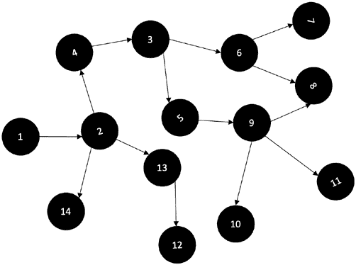

第五章 区块链共识

***图 5-8\.** 比特币中的流言协议*

这种传播方式确保最终所有节点都收到消息。

，此模式不会让单个节点不堪重负

广播消息到所有节点的要求。

**区块验证**

区块验证可以看作是状态转换函数（STF）。此**区块验证** **函数**具有以下高级规则：

• 区块在语法上是正确的。

• 区块头哈希值小于网络难度目标。

• 区块时间戳不晚于未来两小时。

• 区块大小是正确的。

• 所有交易在区块内都是有效的。

• 它指的是前一个哈希值。

该协议规定了非常精确的规则，详细信息可以在[这里找到](https://en.bitcoin.it/wiki/Protocol_rules)

[en.bitcoin.it/wiki/Protocol_rules](https://en.bitcoin.it/wiki/Protocol_rules)；然而，上述列表是节点执行的区块验证检查的高级列表。

240

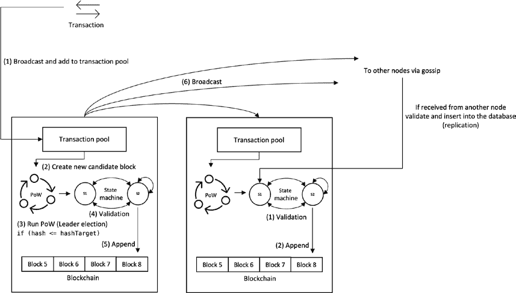

第五章 区块链共识

**追加到区块链**

节点最终将区块插入区块链。附加到

区块链，可能会发生这些节点收到两个有效区块的情况。在这种情况下

情况下会发生分叉，节点将不得不决定将区块追加到哪个链上。

我们可以在图 5-9\.中看到这个概念

***图 5-9\.** 工作量证明作为状态机复制*

如图 5-9 所示，工作量证明作为状态机复制由两个主要操作组成：通过工作量证明进行领导者选举，然后通过流言协议进行复制

协议和接收节点的区块验证和插入机制。经过工作

，如果工作量证明有效，则将该区块视为来自其他节点并最终插入本地区块链的区块

验证后插入到数据库中。

在发生冲突时选择哪个链是决定性的组件被称为

代表叉分辨规则的叉分辨程序

241

第五章 区块链共识

**叉分辨**

在比特币中，叉分辨可以看作是一种容错机制。叉分辨

规则确保只有拥有最多工作的链是

当一个有效的区块被插入并最终发生分叉时

到达相同高度时，叉分辨机制允许节点以高概率

忽略较短的链，只将区块添加到最长的链。还要注意，最长的链并不总是具有最多的工作量；这种情况可能发生

较短的链可能具有最多的计算散列能力，即

累积工作证明， 在这种情况下，将选择该链。

我们可以通过首先计算

特定区块 B，那么我们可以使用以下公式。一个区块的难度可以定义为找到一个有效的工作证明计数器多难。

这个特定的区块 B 相对于创世区块的难度。

*创世区块*

( 216)×2562)

*区块的难度* *目标* =

*B 的难度目标*

*B 的难度目标*

我们可以说，链的累积工作证明是困难的总和

链中所有区块的总工作量。拥有最多工作量的链将被选中附加新的区块。

最初最长链的规则只是简单地拥有最高数目的链

区块。然而，这个简单规则后来被修改，“最长”的链

成为创建它工作量最多的链，也就是最强的链。

在实践中，在区块中存在一个*链工作*值，有助于确定具有最多工作量的链，也就是正确的“最长”或“最强”的链。

例如，我们使用

bitcoin-cli getblockheader

0000000000000000000811608a01b388b167d9c94c0c0870377657d524ff0003

对于区块 687731，我们得到

242

第五章 区块链共识

{

"result": {

"hash":

"0000000000000000000811608a01b388b167d9c94c0c0870377657d524ff0003"，

"confirmations": 1,

"height": 687731，

"version": 547356676，

"versionHex": "20a00004",

"merkleroot":

"73f4a59b854ed2d6597b56e6bc499a7e0b8651376e63e0825dbcca3b9dde61ae"，

"time": 1623786185,

"mediantime": 1623781371,

"nonce": 2840970250,

"bits": "170e1ef9",

"difficulty": 19932791027262.74,

**"chainwork": "00000000000000000000000000000000000000001eb7091803** 

**0b922df7533fd4",**

"nTx": 2722,

"previousblockhash":

"00000000000000000000f341e0046c6d82979fdfa09ab324a0e8ffbabd22815d"

},

"error": null,

"id": null

}

注意将链工作值转换为十进制后，结果是一个极端的大数，6663869462529529036756\. 而且可以看出，这个数是链头部的工作量背后的数量

大的数字，6663869462529529036756\. 这是这个头的工作量背后的数量

链。

比特币区块链中可能发生几种类型的分叉：

• 常规分叉

• 硬分叉

• 软分叉

• 拜占庭式分叉

243

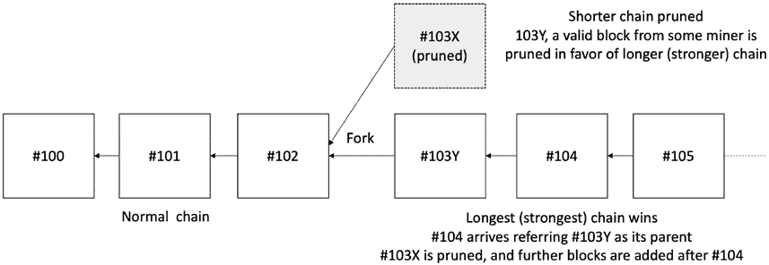

第五章 区块链共识

**常规分叉**

当两个竞争的矿工在同一时间内解决了作为解决证明工作巧合地几乎同时解决了它。因此，两个矿工矿工在同一时间内解决了作为解决证明工作巧合地几乎同时解决了它。因此，两个矿工可能会出现在比特币区块链中自然分叉

解决证明工作巧合地几乎同时解决了它。因此，两个

新的区块被添加到区块链。矿工将继续在最长的链上工作

他们所知道的，很快，较短的链和所谓的孤立区块将

忽略。

图 5-10 中的图表显示了分叉对共识最终性的影响。

***图 5-10\.** 叉分对共识最终性的影响*

由于可能出现分叉，共识是概率性的。当分叉解决时，

先前接受的交易将被回滚，最长（最强）的链

占优势。

这些常规分叉的概率非常低。一个区块的分裂可能会发生。

几乎每两周一次，并且在下一个区块到达时迅速解决，并提及

到先前的一个作为父级。两个区块分裂的概率是

指数级降低，几乎是 90 年一次。四个区块的临时分叉发生的概率几乎是每 7 亿年一次。

**硬分叉**

硬分叉是由于协议的更改而发生的，这些更改与

现有规则。这实际上创建了两条链，一条在旧规则上运行，另一条在新规则上运行。

我们可以在图 5-11\.中看到硬分叉的行为。

244

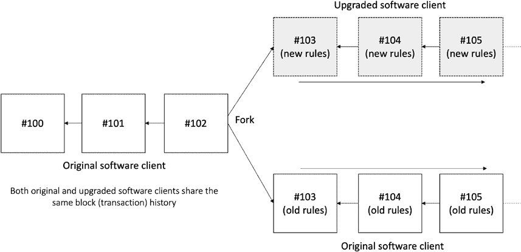

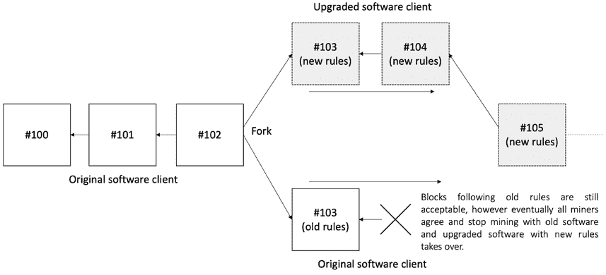

第五章 区块链共识

***图 5-11\.** 硬分叉*

**软分叉**

当协议的更改是向后兼容时会发生软分叉。这意味着

不需要更新所有客户端；即使不是所有客户端都升级，链仍然是一个。但是，任何不升级的客户端将无法使用新规则运行。换句话说，旧客户端仍然能够接受新的区块。

这个概念可以在图 5-12\.的图表中看到。

***图 5-12\.** 软分叉*

245

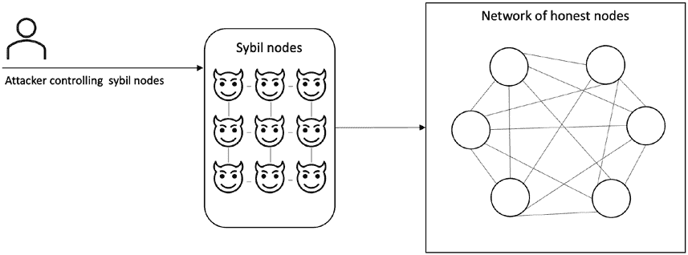

第五章 区块链共识

**拜占庭分叉**

在敌对者可能尝试的情景中，拜占庭分叉或恶意分叉可能会发生。

创建一个新的链条，并成功地强加自己的链条版本。

通过这个，我们完成了对分叉的讨论。

工作证明共识的核心特性是 Sybil 抵抗机制

其中确保创建许多新身份并使用它们成本高昂

计算上复杂。让我们更详细地探讨这个概念。

**Sybil 抵抗**

当攻击者创建多个身份并通过使用所有这些身份来投票来破坏依赖投票的网络时，Sybil 攻击就会发生

他们的利益。想象一下，如果攻击者创建的节点比整个网络的节点还多，那么

攻击者可以倾斜网络以使之有利。

Sybil 攻击可以在图 5-13 中看到，攻击者控制的 Sybil 节点比网络更多。

***图 5-13\.** Sybil 攻击*

工作证明使攻击者使用多个节点变得代价高昂

由他们控制，以便参与网络，因为每个节点都必须进行

为了成为网络的一部分，需要复杂的计算工作。因此，攻击者

控制大量节点的攻击者将无法影响网络。

246

第五章 区块链共识

**区块时间戳的重要性**

比特币网络及其异分布式的地理分布节点在

在互联网上表现为异步网络。这似乎就是情况

因为处理器速度没有上限，通信延迟也没有上限。

消息延迟。通常，在传统的 BFT 共识协议中，不依赖于

全球物理时钟，网络假设通常是部分同步的

网络。然而，在比特币中所有区块都有一个时间戳字段，由

挖掘出区块的本地节点。这是区块验证流程的一部分，在这个过程中

一个区块只有其时间戳小于或等于最近 11 个区块的中值时才会被接受

区块。此外，时间戳对于维护区块频率、难度重新定位和网络难度计算至关重要。从这一观点出发，我们可以将比特币网络看作是松散同步的，其中松散的时钟同步对于网络

以实现进展并确保活跃性。

请注意，比特币网络不是部分同步的，因为我们定义

部分同步及其变体，而比特币网络似乎不符合这些定义。它在区块的时间戳是从产生该区块的本地节点上生成的意义上是同步的；然而，从一个角度来看

处理器延迟的角度来看，它几乎是异步的。此外，在区块验证

机制，其中规则之一要求区块在近期内生成；

两小时（前 11 个区块的中值），使 Bitcoin 成为“几乎同步”

系统。这是因为时间戳对于系统

Bitcoin 系统；但由于大通信和处理器延迟容忍度，它

可以被看作是一个松散同步的系统。

另一方面，由于时间戳仅用于适当功能的

系统的有限部分，即难度计算和区块验证并不是实现共识的必要条件（即选择一个领导者来解决

工作证明 - 挖矿），然后从这个角度来看它是一个异步系统，因为处理器和通信延迟没有定义的上界，除了

消息最终会以概率保证的八卦协议到达节点。

在比特币的区块中，时间戳并非 100%准确，但足够保护证明

工作机制。最初，中本聪设想将系统时钟与

其他服务器时钟的中值，并且 NTP 服务器用于时钟调整。但是，NTP

从未实现，并且其他节点时钟的中值仍然是主要的

时钟调整的来源。

247

第五章 区块链共识

区块时间戳不仅用于为区块哈希提供一些变化

对工作证明有用，但也有助于防止区块链操纵

在这里，对手可能会尝试向链中插入一个无效的块。 当比特币节点连接到另一个节点时，它从中接收了 UTC 格式的时间戳。 接收

节点然后计算接收时间与本地系统时钟的偏移

存储它。 网络调整时间然后被计算为本地 UTC 系统时钟加上所有连接节点的中位偏移。

有关比特币区块的时间戳有两条规则。 有效的时间戳

必须大于前 11 个块的中位时间戳。 它还应该

必须小于基于其他人接收的时间计算的中位时间戳

连接节点（即，网络调整时间）加上两个小时。 但是，这个网络

时间调整永远不能超过本地系统时钟的 70 分钟。

结论是，比特币实际上只在同步网络下是安全的。

模型。 更确切地说，它是一种无步步同步，存在某些已知的

有限的时间边界，但执行不是同步的。

**一个警告**

交易顺序不是由共识驱动的。 每个矿工都会选择一笔交易

客户端内部硬编码顺序，事实上有一些可能会受到攻击

导致交易审查或忽视或重新排序。 事实上，共识是在区块上实现的，也不是通过投票; 一旦矿工解决了 PoW，它就

只是赢得了附加新块的权利。 当然，当他们接收到时，它将被其他节点验证，但是没有真正的协议或投票机制

挖掘成功后广播了挖掘的区块。 没有投票

或共识同意此新块; 被选举为领导者的矿工和

因为他们解决了 PoW 才赢得了添加新块的权利。 其他节点只是接受

如果它通过了*有效()*断言。

因此，这里的警告是，当候选块被捡起创建时

从交易池挑选的交易，它们按照一定的顺序

矿工可以影响。 例如，一些矿工可能选择不包括交易。

无需费用，只包括支付费用的交易。 矿工公平

或许，但对用户和整个比特币系统不公平！ 但是，最终所有交易都将被

交易将被添加，甚至没有费用的交易，但它们可能只被考虑

自它们包括在交易池中以来已经过了相当长的时间。

如果它们太老了，那么它们最终将被包括。 此外，在假设下

248

第五章区块链共识

通常有大多数诚实的矿工总是在网络中，预计交易将在与协议相一致的合理时间内被接受

规范。

现在让我们看看那个顺序。

交易是基于其优先级从交易池中挑选的，这

使用以下公式计算[8]：

*sum*（*基础输入值*

*单位*

× *输入年龄*)

*优先级* =

*大小由*

*ttes*

Σ（* v * × ）

*i*

*a*

*p*

*i*

=

*s*

关于交易排序不公平，导致抢先和其他相关攻击，这是一个值得关注的问题。我们将在第[10](https://doi.org/10.1007/978-1-4842-8179-6_10)章讨论公平排序。

**工作证明作为拜占庭将军问题的解决方案**

这已经被中本聪本人在一篇文章[5]中描述过。我将描述

简洁地表达这里的逻辑。

在拜占庭将军问题中要记住，问题是要达成一致的攻击时间

在拜占庭将军的存在和被捕信使的可能性下推迟

在工作证明的情况下，我们可以将矿工视为将军，而他们的理解是

将军之间的是，任何将军都可以宣布攻击时间和攻击时间

首先被接受为权威的攻击时间。然而，问题在于

如果两位将军几乎同时提议不同的时间，这可能是由于

传递延迟，有些将军首先收到其中一个攻击时间，另一些

其它收到另一个攻击时间，导致不一致。为了解决这个问题，每个收到攻击时间的将军开始解决一个复杂的数学难题。

当一个将军解决了这个数学难题（工作证明），他就会将其广播给网络。

当其他将军收到它时，他们切换到这个新时间。

所有将军都可以提议一个时间，但只有一个提议的时间会

最终被所有将军接受为有效。

对于提议的时间要有效，条件是每个将军必须解决一个

数学难题并将其附加到提议的时间消息上；如果其他将军

接收此消息并查看数学难题的解决方案是有效的时候，他们接受

249

第五章区块链共识

那个时间。这个数学难题有两个目的；首先，它证明了

将军是诚实的，因为他们解决了数学难题，并且第二，在短时间内不允许将军提议过多次数，这将导致不一致

和将军之间的混淆。我们可以看到这种机制可以被视为

作为对拜占庭将军问题的解决方案；然而，通过妥协，那

暂时的不一致是可以接受的。

比特币 PoW 是一种概率共识算法。现在产生一个重要问题

在节点数

未知的，存在拜占庭节点。

现在让我们重新审视在

根据我们到目前为止对工作证明算法的学习，在这一章的开头。

我们现在可以清楚地看到，PoW 不是一个传统的确定性拜占庭共识

算法。这是一个具有概率性质的协议。

现在让我们重新讨论这些属性。

**协议**

一致性属性是概率性的。这是因为可能出现两个

不同的矿工几乎同时生成一个有效的区块，一些节点添加一个

从一个矿工和另一些节点中阻止区块。然而，最终

最长（最强）链规则将确保具有较少工作量证明的链

它被修剪，最长的链胜出。这将导致先前被接受的

可以回滚交易; 因此，协议是有概率的。

**有效性 - 谓词为基础**

这是一种确定性属性协议，诚实的节点只接受那些区块

它们是有效的。严格来说，我们可以说，如果一个正确的进程 p 最终决定了 b，则 v 必须满足应用特定的 valid()谓词。我们之前在本章详细讨论了有效性谓词，即区块验证标准。

250

第五章 区块链共识

**终止**

终止是一个有概率的属性。由于天然叉，它最终得以实现但没有保障。这是因为在叉的情况下，必须解决叉才能最终终止区块上的共识过程。由于有可能先前接受的区块被回滚，以获得最重/最长的链，终止只能以概率方式保证。通常，为了高概率保障

在实践中传统上需要六次确认才能保证交易已完成。

这意味着该区块至少在链条中深入了六个区块，这意味着回滚的可能性如此之低，几乎不可能发生或发生在千年一次。

有了这一点，我们就完成了对工作量证明的讨论。

**PoW 问题**

关于 PoW 存在几个问题，包括攻击和极端的能源

消耗。

在接下来的部分，我们将讨论一些可以针对

工作量证明共识，这对比特币网络产生不利影响。

**51%攻击**

在比特币上的 51%攻击可能发生在超过 50%的挖矿哈希功率

被对手控制。

表格 5-3 显示了对手在接管网络的 50%以上哈希功率后可能尝试采取的行动列表。

***表格 5-3\.** 对手的行动列表*

**攻击**

**可能性**

**解释**

阻止交易

是的

可以忽略交易

窃取硬币

否

由私钥控制

双重支付

是的

可以创建一个私有的离线分支并排除该区块

包含先前已花费的交易

更改协议

否

一个协议无法更改，因为有效节点将简单地

忽略无效区块

251

第五章 区块链共识

请注意，某些攻击仍然是不可能的，而对系统最有害的

是可能的，比如双重花费。

**自私挖矿**

当一个找到一个区块的矿工保密，而不是公开宣布时，就会发生这种类型的攻击

宣布并私下继续构建。想象一下攻击者有

设法创建另一个区块。现在攻击者在他们自己的私人里有两个区块

分叉链。在这一点上，攻击者等待其他人找到一个区块。当

攻击者看到这个新区块，他们释放他们的双块链。因为其他

矿工是诚实的，并遵守最长链规则，他们将接受这个新链

成为最长的。现在，其他人挖掘的区块将变为孤块，尽管

在它上花费资源，但这些工作都是浪费的。攻击者也可以等待一个

创建更长的链条，尽管主要是靠运气，但如果攻击者设法创建

这样一个比诚实链更长的私有分支，那么攻击者可以释放

只要其他区块一旦宣布。现在当节点看到这个新的

最长的链，根据规则，他们将开始在这个新的更长上进行挖掘

链条并雏形其他链条，这可能只比

攻击者的链。所有为创建诚实链所做的工作现在都被浪费掉，并且攻击者获得奖励，而不是其他矿工为此工作的奖励

诚实链。

**竞赛攻击**

这种攻击可能发生在对手能够向其中一方进行支付时

受益人，然后是支付给自己或其他人的第二个。现在，如果第一

接受者在零确认后接受付款，接下来可能发生的是

第二笔交易被挖掘并在下一个区块中得到接受，而第一笔交易可能保持未被挖掘。因此，第一收款人可能永远得不到他们的付款。

**芬尼攻击**

芬尼攻击会发生在一个支付的接受者接受支付的情况下

零确认。这是一种双花攻击类型，攻击者创建两个

交易。其中的第一笔交易是支付给收款人（受害者），并

将第一笔交易广播给自己。然而，攻击者并不广播第一笔交易；相反，他们将第二笔交易包含在一个区块中并挖掘它。现在在这一点上，

252

区块链共识第五章

攻击者释放第一笔交易并支付货物。商家在这里不等待确认，接受支付。现在攻击者广播

预挖的区块，带有第二笔交易支付给他们自己。这使

第一笔交易作为第二笔交易优先于第一笔交易。

**Vector76 攻击**

这种攻击是芬尼和竞赛攻击的结合体。这种攻击足以撤销一笔交易，即使它只有一次确认。

**日食攻击**

此攻击试图模糊节点对网络的正确观点，这可能导致

服务中断，双花攻击和资源浪费。有几种

解决此问题的解决方案已经在比特币中实施。更多细节可

在此处找到：[`cs-people.bu.edu/heilman/eclipse/。`](https://cs-people.bu.edu/heilman/eclipse/)

**ESG 影响**

ESG 指标代表环境、社会和治理的整体情况

关注点。这些指标被用来评估公司对 ESG 风险的暴露

环境、社会和治理风险。投资者用于做出

投资决策。投资者可能不会投资风险更高的 ESG，也可能

更偏好 ESG 风险较低的公司。

工作证明已被批评为能源消耗过大。的确

目前在撰写本文时，比特币区块链的总能源消耗量超过巴基斯坦的整个国家 [9]。

环境、社会和治理问题（ESG 问题）引起了关注。

已经成为聪明的主流投资者低迷的原因。尽管如此，比特币

尽管其 ESG 问题，但基本上被视为成功。

比特币不仅因其高能耗而受到批评，而且经常

被视为犯罪活动的工具，比特币已被接受为支付方式

支付非法药品和其他犯罪活动。

集中化问题也是一个担忧，一些强大的矿工拥有矿业

农场占据了比特币网络的大部分哈希率。用于

建造这些矿场的挖掘机仅由少数制造商生产，这意味着

这也是一个高度集中的空间。此外，对比特币挖矿的严厉打击

253

第五章 区块链共识

可能导致更多的集中化，只有最强大的矿工可能

能够承受这种严厉打击并生存下来，导致只有少数幸存者和

最后，强大的矿工。

然而，有利于比特币的观点。比特币可以用作跨境

移民家庭的汇款机制。它也可以用作支付方式

摆脱困难的经济。可以为估计为 17 亿的无银行人口提供服务

以十亿计算。比特币是金融包容的工具。

我们可以想象比特币挖矿农场产生的热量可能

用来加热水，最终加热家庭。甚至可以通过生成电力

并通过使用热电发电机将热量馈回电网

热电效应。当然，经济学和工程学需要进行细化；

然而，这个想法是可行的。

*热电发电机，一类固体状态器件*

*可以直接将热量转化为电能，或者转化电能*

*成热能或冷却。这些设备基于热*

*moelectric 效应涉及热量流动和之间的相互作用*

*通过固态体产生电。[11]*

— *大英百科全书*，2007 年 3 月 1 日，[www.britannica.com/](http://www.britannica.com/technology/thermoelectric-power-generator)

[technology/thermoelectric-power-generator](http://www.britannica.com/technology/thermoelectric-power-generator)

付款系统和实际上任何系统都需要电力运行。比特币受到批评

消耗过多的能源；然而，这是为了保持

系统。现在网络的难度已经非常之高，以至于许多攻击者即使合谋

结合在一起的矿工无法生成足够的哈希算力来发动 51% 攻击。所以是的，

消耗了电力，但换来的是好处。除了比特币的安全性外，还有其他好处，如

• 比特币可以在被压制的政权中使用。

• 无国界支付。

• 银行无银行。

• 流畅的跨境汇款。

• 没有任何中介的替代支付系统。

• 无中间人的支付。

254

第五章 区块链共识

总之，比特币，尽管其能源消耗并没有达到其最初的预期

一个 CPU=一个选票的哲学思想，仍然被视为一个成功的项目，拥有许多

好处。

**PoW 的变体**

根据它所依赖的硬件，有两种工作证明算法

旨在运行的。

• CPU 绑定 PoW

• 内存绑定 PoW

**CPU 绑定 PoW**

这些难题以处理器的速度运行。CPU 绑定 PoW 是指一种 PoW 的类型

在寻找加密哈希难题的解决方案所需的处理是

与 CPU 或 ASIC 等硬件的计算速度成正比。

因为 ASIC 已主导比特币工作证明并带来了某种不公平的优势

对于那些能够负担得起使用 ASIC 的矿工来说，这种 CPU 绑定的 PoW 被视为转移

朝着中心化的方向前进。此外，拥有非同寻常哈希算力的矿池可以转移

权力的平衡向他们倾斜。因此，内存绑定的 PoW 算法有

被引入，这些算法抗 ASIC，并基于内存导向设计

而不是 CPU。

**内存绑定 PoW**

内存绑定 PoW 算法依赖系统 RAM 来提供 PoW。在这里， 

性能被内存访问速度或内存大小所限制。

这种对内存的依赖也使得这些 PoW 算法抗 ASIC。Equihash 是

最突出的内存绑定 PoW 算法之一。

还有其他工作证明的改进和变体，我们将

在第 [8](https://doi.org/10.1007/978-1-4842-8179-6_8) 章中介绍。

255

第五章 区块链共识

**摘要**

在本章中，我们涵盖了区块链共识：

• 工作证明是首个引入的区块链共识，有

比特币，也是拜占庭将军问题的解决方案。

• 区块链共识可以分为两类，即

中本共识和传统的 BFT。

• 传统的 BFT 是确定性的，而中本共识是

有概率性的。

• 比特币中的工作证明是一种 Sybil 抵抗机制，双重-

防止机制，并解决了拜占庭

将军问题的主导策略。

• 工作证明可以被看作是博弈论的光明面，其中

协议是一种纳什均衡，并对所有

玩家是诚实的。

• 工作证明实际上是拜占庭容错协议。

• 工作证明是一种状态机复制协议，其中有一个挖掘

块通过八卦通告向其他节点复制。

协议。

• 工作证明消耗能源，存在 ESG 担忧；

然而，也存在一些好处。

**参考文献**

1\. 工作证明最初是在：Cynthia Dwork 和 Moni

Naor。定价通过处理或打击垃圾邮件。在欧内斯特

F. Brickell，编辑，密码学的进展 - CRYPTO'92，第 12

年度国际密码学会议，圣塔巴巴拉，

美国加利福尼亚州，1992 年 8 月 16 日至 20 日，会议录，卷

计算机科学讲义，第 740 页，139–147 页。

斯普林格，1992 年。

256

第五章 区块链共识

2\. Okun，Michael。在不相识的人之间进行分布式计算

在拜占庭失败的情况下，处理器。希伯来

耶路撒冷希伯来大学，2005 年。

3\. [`bitcoin.org/bitcoin.pdf`](https://bitcoin.org/bitcoin.pdf)

4\. [www.cs.yale.edu/publications/techreports/tr1332.pdf](http://www.cs.yale.edu/publications/techreports/tr1332.pdf)

5\. [`satoshi.nakamotoinstitute.org/emails/`](https://satoshi.nakamotoinstitute.org/emails/cryptography/11/)

[cryptography/11/](https://satoshi.nakamotoinstitute.org/emails/cryptography/11/)

6\. [`hal.inria.fr/hal-01445797/document`](https://hal.inria.fr/hal-01445797/document)

7\. 这些术语首次出现在[`eprint.iacr.`](https://eprint.iacr.org/2014/765.pdf)

[org/2014/765.pdf](https://eprint.iacr.org/2014/765.pdf)

8\. [`en.bitcoin.it/wiki/Miner_fees#Priority_`](https://en.bitcoin.it/wiki/Miner_fees#Priority_transactions)

[transactions](https://en.bitcoin.it/wiki/Miner_fees#Priority_transactions)

9\. Digiconomist[:](https://digiconomist.net/bitcoin-energy-consumption/)

[`digiconomist.net/bitcoin-energy-`](https://digiconomist.net/bitcoin-energy-consumption/)

[consumption/](https://digiconomist.net/bitcoin-energy-consumption/)

10\. [www.hashcash.org](http://www.hashcash.org)

11\. Strohl, G. Ralph 和 Harpster, Joseph W. "热电

发电机。英国百科全书，2007 年 3 月 1 日

[www.britannica.com/technology/thermoelectric-power-](http://www.britannica.com/technology/thermoelectric-power-generator)

[generator](http://www.britannica.com/technology/thermoelectric-power-generator)。2021 年 6 月 25 日访问。

12\. [`globalfindex.worldbank.org/sites/globalfindex/`](https://globalfindex.worldbank.org/sites/globalfindex/files/chapters/2017 Findex full report_chapter2.pdf)

[files/chapters/2017%20Findex%20full%20report_](https://globalfindex.worldbank.org/sites/globalfindex/files/chapters/2017 Findex full report_chapter2.pdf)

[chapter2.pdf](https://globalfindex.worldbank.org/sites/globalfindex/files/chapters/2017 Findex full report_chapter2.pdf)

13\. [www.coindesk.com/bitcoin-slips-37k-china-](http://www.coindesk.com/bitcoin-slips-37k-china-vicecrackdown-mining)

[vicecrackdown-mining](http://www.coindesk.com/bitcoin-slips-37k-china-vicecrackdown-mining)

14．由 Chris 介绍分布式系统频道

Coloh[an: www.distributedsystemscourse.com](http://www.distributedsystemscourse.com)

15．比特币区块链共识[: https://youtu.be/f1ZJPEKeTEY](https://youtu.be/f1ZJPEKeTEY)

257

**第六章**

**早期协议**

在这一章中，我引入了早期的协议。首先，我们从分布式的背景开始

分布式事务和相关协议，比如两阶段提交。

之后，我们将继续我们的旅程，看看协议的达成，然后总结

这一章的一些基本结果。这一章

介绍了早期的共识算法，比如 Lamport 的作品中提出的那些

et al., Ben-Or 等人，Toueg 等人。在我们继续向更复杂和现代的协议迈进之前，理解这些基本思想是有帮助的。

**介绍**

在我看来，20 世纪 80 年代是分布式计算创新和发现的黄金时代

计算。许多基本问题、算法和结果，比如拜占庭

将军问题，FLP 不可能结果，部分同步，和技术

在 20 世纪 70 年代末和 80 年代发现了绕过 FLP 不可能性的早期协议。开始

从 Lamport 的杰出论文“时间、时钟和事件排序在一个

分布式系统”到拜占庭将军问题，然后是 Schneider 的状态

复制机器论文，一个接一个，都有最重要的贡献

对共识问题以及分布式计算中的一般贡献的作出了。

共识可以被定义为实现一致性的协议。一个高层次的列表

主要贡献描述如下。

在他 1978 年的里程碑论文中，“分布式

系统”，Lamport 描述了如何使用同步时钟对事件进行排序

在不存在故障的情况下，可以达成一致。然后在 1980 年，论文“在存在

故障”提出了一个问题：在一个不可靠的分布式中是否能达成一致

系统。已经证明，如果在一个

分布系统的节点数小于总节点数的三分之一，即 n>=3f+1，其中 n 是总节点数，f 是故障处理器数量。在

论文“拜占庭将军问题”中，Lamport 等人表明了一致性

259

© Imran Bashir 2022

I. Bashir, *区块链共识*, [`doi.org/10.1007/978-1-4842-8179-6_6`](https://doi.org/10.1007/978-1-4842-8179-6_6#DOI)

第六章早期协议

如果超过三分之二的将军忠诚，就可以用口头消息解决。1982 年，Danny Dolev 的论文“The Byzantine generals strike again”表明一致性

如果总处理器数量的三分之一以下是有故障的，而网络连接的一半以上是可用的，一致性

一致性是一个要求，即如果所有进程的初始值都相同，

说 v，那么所有的进程都会决定采用那个值 v。这是强的一致性。然而，

较弱的一致性称为弱一致性，只需要在所有情况下才需要满足这个条件

进程是正确的；换句话说，没有进程是有故障的。

论文还提供了第一个证明，即分布式系统必须具有 3 *f* + 1

节点容忍*f*故障。然而，稍后出现的备受赞誉的 FLP 结果证明了即使是一个

进程是崩溃故障。FLP 的不可能性意味着在异步网络中无法保证一致性协议的安全性和活性。

Lamport 的算法是针对同步环境的，假设最终所有

消息将被传递。而且，它并不是容错的，因为一个故障将会停止算法。

FLP 不可能结果出现后，人们开始尝试规避它

解决一致性问题。绕过 FLP 的直觉是

放松一些关于时间和决定性的更严格的要求。

Ben-Or 提出了最早的算法来牺牲某种程度的确定性

角度绕过 FLP。因为 FLP 的不可能性意味着在异步情况下，总会

可以存在一种不终止的执行，避免的一种方法是尝试让

终止是概率的。所以，与确定性终止相比，概率性终止

终止被使用。这些算法的直觉是使用“公共硬币”

方法，在这种方法中，如果一个进程没有收到消息，它会随机选择它的值

其他节点。换句话说，如果一个进程被允许选择一个值进行投票，那么该值就可以

如果它没有从其他进程收到大多数投票的值。这

意味着最终多于一半的节点将最终投票给相同的值。

但是，这种算法的通信复杂度随着指数增长

节点数。稍后，另一种方法在固定数量内实现了共识

提出了由 Rabin 提出的轮数更多的提议。与今天普遍知晓的下界 3 *f* + 1 相比，这些提议分别需要 5 *f* + 1 和 10 *f* + 1 轮。

260

第六章早期协议

一致性协议，放松时间（同步）要求的目的是提供安全性

在所有情况下保障，并且只能在网络同步时保障活性。一个重要

Dwork，Lynch 和 Stockmeyer 的工作是一个重大突破，这是第一次

引入了更加真实的部分同步的概念。这个模型更加实际，因为它捕捉到了真实分布式系统的行为。更准确地说，分布式系统可能在任意时间段是异步的，但最终会长时间地返回到同步状态，从而可以在所有情况下保证安全性，并且只有在网络同步时才能保证活性。

做出决定然后终止。该论文介绍了处理器和网络同步和异步的各种组合，并且证明了这些情景的下界。

**注意**我们在第三章详细讨论了部分同步。

表 6-1 显示了 DLS88 论文结果摘要，显示了存在容错共识协议的最小处理器数量。

***表 6-1.** 最小处理器数量，适用于容错共识*。

*存在协议*

**故障类型**

**同步异步部分同步通信和处理器**

失效停止

f

Na

2f + 1

遗漏

f

Na

2f + 1

认证的拜占庭 f

Na

3f + 1

拜占庭

3f + 1

Na

3f + 1

本文介绍了解决部分共识的 DLS 算法，

同步。

一些重要的结果如下，从 1980 年代开始：

• Lamport 在 LPS82 中表明，在同步设置下，n > 2f

需要进行身份验证，并且口头消息中至少需要 n > 3f。

• 1982 年的 FLP 结果表明，即使出现单个坠机故障，

在异步性条件下，共识是不可能的，至少需要 n > 3f。

安全性所需。

• 1983 年 Ben-Or 在异步条件下提出了一个随机解决方案。

现在让我们来了解一下分布式事务，这是分布式中的一个重要概念

系统。

261

第六章早期协议

**分布式事务**

分布式事务是分布在多个进程中的事件序列。一个

事务要么以提交要么中止。如果提交，所有事件都会被执行，输出会生成，如果中止，事务将停止而没有完全

执行。如果事务完全执行和提交，则事务是原子的；否则，它会滚回，没有任何影响。换句话说，原子事务要么完全执行，要么不执行。

有四个事务必须满足的属性，通常称为

ACID 一致性模型：

• **原子性**：事务事件要么完全执行，要么不执行。

• **一致性**：如果一个事务提交，那么它会产生一个有效的

（一致）系统的状态。它符合某些不变量。

• **隔离性**：除非事务提交，否则不会有影响可见。

• **持久性**：一旦提交的事务会产生永久的影响。

这里需要注意的是，一致性在单体结构中更容易得到保证

架构。相反，在分布式架构中一致性不是立即的，分布式架构依赖所谓的最终一致性。最终一致性

表示系统中所有节点最终（在未来某个时间点）同步并达成一致的状态。即使存在协议，ACID 属性也必须保持。

节点（进程）失败。

原子性，隔离性和持久性在单体结构中更容易实现，

但在分布式环境中实现这些属性会变得更具挑战性。

一个两阶段提交协议用于在多个进程之间实现原子性。

副本应该彼此保持一致。原子提交协议实际上是

一种共识机制，因为在事务提交协议中，节点必须

达成一致意见，要么在一切正常时提交，要么在出现问题时回滚

错误。想象一下，如果一个事务预期在分布式系统（一个网络）的所有节点上提交，那么它必须在所有节点上提交或不提交来维护副本

一致性。我们不能出现某些节点上的事务成功

而不在其他节点上，导致不一致的分布式系统。这就是原子的地方

提交事件。可以从根本上看出这是一种共识算法，因为

该协议要求网络中所有节点达成一致意见。但是，需要注意的是

262

第六章早期协议

原子提交和共识之间存在根本区别。在共识中，

一个或多个节点提出一个值，节点使用

共识算法。这通常通过大多数共识来实现。相比之下，在

原子提交协议，所有节点都必须投票，无论他们是否提交或

中止事务。在共识算法中，可能会提出多个值

其中一个可以达成一致，而在原子提交中，协议必须

如果所有节点投票以提交，则提交；否则，即使一个节点不同意，那么

事务必须由所有节点中止。原子提交之间的一个重要区别

共识是共识算法中，故障（崩溃节点）由于

遵守法定数量规则，而在原子提交中，即使一个节点失败，该

事务必须在所有节点上中止。为处理崩溃的节点，需要完全和强烈

使用超时机制实现的准确故障检测器。

除了 ACID 一致性模型外，另一个常见的一致性模型

基本可用（BA），软

状态（S），最终一致（E）。使用 BASE 一致性的数据库

模型通过在系统中的节点之间复制数据来确保可用性。由于该模型

不提供即时一致性，数据值随时间变化，

结果最终一致。在 BASE 模型中，一致性只能实现

最终。但是，它提供高可用性，在许多需要立即和强烈一致性要求较低的在线服务中非常有用，比如社交

网络和在线视频平台。从 CAP 定理的角度来看，BASE 模型

牺牲一致性，偏向高可用性。

现在我们讨论著名的二阶段提交协议，

实现原子性。

**二阶段提交**

两阶段提交（2PC）是一种原子提交协议，用于实现原子性。它

第一次发表在 1979 年 Lampson 和 Sturgis 的一篇论文中。两阶段提交使

在单个事务中更新多个数据库并原子地提交/中止。

正如其名，它分为两个阶段。第一阶段是投票收集

阶段，在该阶段，协调者从参与的每个节点收集投票

事务。每个参与节点要么投赞成 要么反对，不论是提交事务还是中止

事务或中止事务。当收集到所有的投票后，协调者

263

章节 6 早期协议

（事务管理器）启动第二阶段，称为决策阶段。在决策阶段，如果协调者从其他节点收到了所有的 yes 票，它会提交事务；否则，它会中止事务。任何投票赞成提交的节点

事务等待直到它从协调者节点那里收到最终的决定。如果从协调者那里得到的是 no，就会中止事务；否则，就会提交事务。投票 no 的节点立即终止事务而不需要

等待来自协调者的决定。当一个事务被中止时，所有

所做的更改将被回滚。在提交后才会使更改永久

在协调者收到提交决定时，投票 yes 的任何节点。任何

事务所做的任何更改都不是永久的，任何锁在

执行写操作。所有参与者发送确认收据

就接收到协调者的决定后将其发送给协调者。作为一种失败

处理机制，两阶段提交中使用了一种日志方案。在该方案中，

所有消息都会在发送到网络中的接收方之前被写入本地稳定存储。当协调者失败（崩溃）时，它会将其决定写入日志中的本地磁盘，当它恢复时，它会将其决定发送给其他节点。如果崩溃前没有做出决定，那么就干脆中止事务。当一个节点崩溃

（除了协调者节点之外），协调者会等待直到超时，然后做出中止所有事务的决定。

图 6-1 显示了两阶段提交协议的行动。这里，客户端（应用程序）开始传统的事务并执行传统的读/写操作

对数据库节点进行正常

每个参与者节点上的事务执行，当客户准备提交

事务，协调者开始第一阶段，即准备阶段。它向所有节点发送准备请求，并询问它们是否可以提交或不。如果

参与者回复 yes，表示他们愿意并准备好承诺

事务，然后协调者启动称为提交阶段的第二阶段。这

当协调者发送提交决定的时候，事务最终得到

已提交，并且实际上真的提交了。如果任何参与节点回复

发送一个 no 的准备请求，那么协调者在第一阶段中发送终止请求

两者，并且所有节点都相应中止。请注意，在第一阶段之后，有一个决策点，协调者决定是提交还是中止。在

决策阶段要么是提交要么是中止，取决于从参与者那里收到的是肯定还是否定

参与者。

264

第六章 早期协议

***图 6-1\.** 两阶段提交算法 - 一个成功的场景*

两阶段提交是一种阻塞算法，因为如果协调者发生故障

在“准备”阶段之后但在发送决定之前崩溃，其他节点将

没有办法弄清楚协调者做出了什么决定。现在他们陷入了困境

处于不确定状态，他们早先同意通过在准备阶段回复肯定/ok 来提交

准备阶段，但现在他们正在等待协调者的最终决定。节点们

在参与准备阶段之后，他们也无法自行提交或中止

因为这将违反原子性属性。在这种情况下，协议会一直阻塞，直到协调者恢复。这意味着两阶段提交算法不具备容错

如果协调者或参与者失败，2PC 不具备分区容忍性。换句话说，2PC 不是分区容错的

容忍。

更确切地说，如果协调者在发送准备阶段之后立即崩溃

决定，其他节点就无法知道协调者做出了什么决定。

在这个阶段，参与者无法提交或中止，协议被阻塞，直到协调者重新上线并参与者收到决定。协调者是

在这个协议中存在单点故障。可以通过使用一致性机制或总排序广播协议来克服这个问题。提交协议可以使用

一致性来选举一个新的协调者。

还要注意，如果我们移除第二阶段，因此没有回滚，它就变成了

一个一阶段提交，即主/备份复制。听起来耳熟吗？我们

在第[3\.](https://doi.org/10.1007/978-1-4842-8179-6_3)章中讨论过。

265

第六章 早期协议

**三阶段提交**

正如我们在两阶段提交中看到的那样，它不具备容错性，并且会一直阻塞直到故障

协调者恢复。如果协调者或参与者在提交阶段失败，那么

协议无法可靠地恢复。即使协调者被替换或恢复，它

无法从故障发生的地方可靠地处理事务。该

三阶段提交通过引入一个新的预提交中间过程来解决这个问题

阶段。在收到所有参与者的肯定答复后，协调者转向这个

中间阶段。不同于 2PC，这里，协调者不会立即广播

提交；相反，它首先发送一个预提交，表示打算提交

事务。当参与者收到预提交消息时，他们用相同的

确认消息。当协调者从所有参与者那里收到这个确认消息时，它发送

commit 消息并像两阶段提交那样继续。如果参与者在

返回消息，协调者仍然可以决定提交交易。如果协调者崩溃，参与者仍然可以同意中止或提交交易。

这是因为尚未发生任何实际的提交或中止。参与者现在

另一次决定，通过检查他们是否看到了协调者的预提交

协调者，他们相应地提交交易。否则，参与者会中止

交易，因为协调者没有发送提交消息。

这个过程在图 6-2\.中可以可视化

266

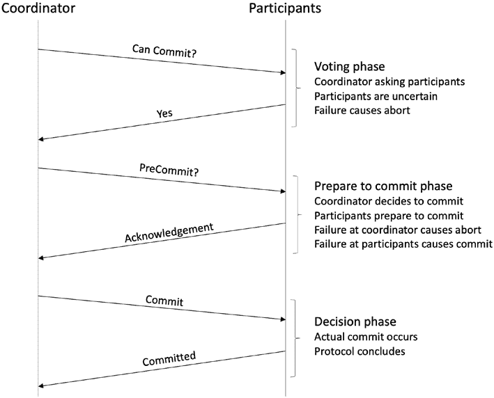

第六章 早期协议

***图 6-2\.** 三阶段提交协议*

大致而言，提交协议可以被看作是协议的协议，因为

参与者需要决定是否接受协调者提出的值

或者。当然，这是一个简单的协议，没有容错能力，但它确实实现了各方之间的一致；因此，它可以被看作一种共识机制。而且，

我们可以说，有效性得到了实现，因为参与者提出了一个最终达成一致的值

值得注意的是，这个协议是简单的，没有容错能力，但却可以在各方之间达成一致，因此可以看作是一种共识机制。此外，

提交协议不是共识协议。

现在，在介绍了最直接的共识协议或

分布式提交协议（取决于你如何看待它们），让我们专注于

一些早期的容错共识协议，为我们所见到的提供了基础

如今在各种分布式系统和区块链中被称为共识协议。

267

第六章 早期协议

**口头消息算法**

这是为解决拜占庭将军问题提出的口头消息（OM）算法

引入了“拜占庭将军问题”的 1982 年 Lamport 等人的论文

递归算法在同步网络模型下运行。它假设有一个集合

具有不同连接的 N 个将军中的一个完整图形。一位将军

“指挥官”负责启动该协议。其他将军（N-1）被称为

“中尉”口头传递他们接收到的消息。指挥官知道

最多 f 个将军将会出错（叛徒），并使用递归算法运行共识算法

已知 f 的默认值。还有一个默认值，要么是“撤退”，要么是“进攻”。这个算法背后的直觉是，你告诉别人你收到了什么消息

每条消息。参与者接受多数决定，这确保了安全性

算法的属性。

有两个*交互一致性*要求需要满足，称为 IC1

和 IC2：

1\. **IC1**：所有忠诚的中尉都遵守同样的命令。

2\. **IC2**：如果指挥官忠诚，那么每个忠诚的

中尉遵从他的命令。

关于系统模型的一些假设是

1\. 可以检测到消息的缺失。这是因为

同步通信。

2\. 每个发送的消息都被正确传递。

3\. 消息的接收者知道是谁发送的。

口头消息是其内容完全受控的消息

发送者。发送者可以发送任何可能的消息。

除非超过三分之二，否则拜占庭将军问题没有解决办法。

将军是忠诚的。例如，如果有三位将军，其中一位是叛徒，那么如果使用口头消息，拜占庭协议是不可能达成的。具体而言

• **引理 1**: 对于拜占庭将军问题没有解决办法

3m + 1 个将军中有 > m 个叛徒。

换句话说，如果 n <= 3m，则不可能达成拜占庭协议。算法

是递归的。

268

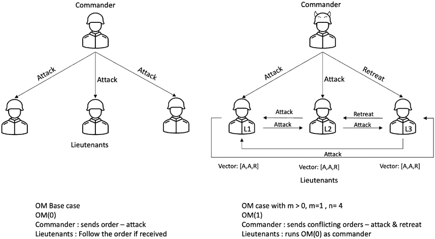

CHapTer 6 早期协议

**算法**

**基本情况: OM(0)**

1\. 指挥官向每个中尉广播建议的值。

2\. 每个中尉接受接收到的值。如果没有收到值，

那么使用默认值，可以是撤退或进攻，在

算法的开始。

**有叛徒的情况: OM(m)，其中 m > 0**

1\. 指挥官将建议的值发送给每个中尉。

2\. 每个中尉现在运行 OM(m-1)，并起到指挥官的作用

将在步骤 1 中接收的值发送给所有其他中尉。

3\. 每个中尉都维护一个向量，其中使用大多数值

接收到的值中选择大多数。如果没有接收到任何值，

基本情况和 OM(1) 情况如图 6-3 所示。

***Figure 6-3\.** OM 基本情况与 OM(1) 情况，指挥官为叛徒*

我们也可以看到中尉是叛徒的情况，如图 6-4\. 所示。

269

CHapTer 6 早期协议

***Figure 6-4\.** M=1 的情况下 OM，其中一个中尉是叛徒*

我们可以正式描述算法，如下所示：

**基本情况**

OM(0)- 基本情况

DEFAULT := 默认值

指挥官 C 向所有中尉广播其建议的值

对于 i = 1 : N – 1 do

Li 将从 C 中的值存储为 Vi 的数组

Vi = 如果没有收到值，则为默认值

Li 接受 Vi

结束

**f > 0 的情况，OM(m)**

指挥官 C 广播其值给所有中尉

对于 I = 1 : n-1 do

Li 将指挥官的值存储为 vi

Vi = 默认值，如果没有从指挥官那里收到值

Li 现在以指挥官的身份运行 OM(m-1)，向其他 N – 2 人发送值 vi

中尉

结束

270

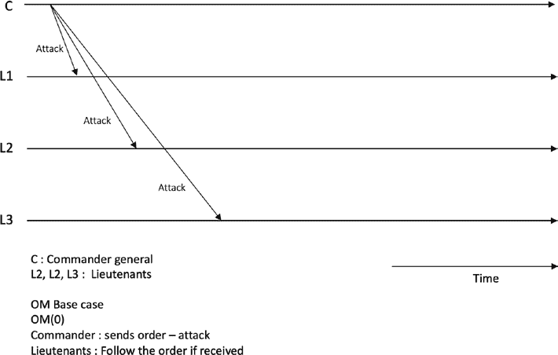

CHapTer 6 早期协议

对于 I = 1 : N – 1 do

对于 j = 1 : N – 1 并且 j ≠ i do

Li 将从 Lj 接收的值存储为 vj

Vj = 默认值，如果没有接收到值

结束

Li 从 {v1, v2, v3, , , , vn-1} 中选择大多数

结束

正如你可能已经注意到的，这个算法虽然有效，但由于

对于要传递的消息数量而言， 这个算法效率不是很高。

从通信复杂性的角度来看，这个算法是指数级的，消息数量

叛徒。如果没有叛徒，如基本情况，那么它是常数，*O*（1），否则是*O*（*mn*），这意味着它随着叛徒数量呈指数增长，这使得对于大量*n*来说是不切实际的。

使用时空图，我们可以将基本情况可视化，如图 6-5 所示。

***图 6-5\.** 口头信息协议-基本情况-没有叛徒*

我们还可以将 m > 0 的情况可视化，其中指挥官是叛徒，发送

在图 e 6-6\. 中向中尉发送了冲突的消息

271

第六章早期协议

***图 6-6\.** 口头信息协议情况下 m =1，指挥官是叛徒*

在数字世界中，指挥官和中尉代表进程，以及

通信是通过点对点链接和

物理通道。

到目前为止，我们已经讨论了不使用密码口头信息的情况;

然而，另一种带有签名消息的解决方案也是可能的，数字签名

用于保证陈述完整性。换句话说，口头使用

信息不允许接收者确定消息是否已经被篡改

或不。但是，数字签名提供了一项数据认证服务，使

接收进程检查消息是否真实（有效）。

根据是否使用口头信息，或者使用数字签名，

表 6-1，本章早期总结了各种系统模型下不可能性的结果。

**拜占庭将军问题的签名消息解决方案**

口头消息算法的主要问题是，需要 3 *t* + 1（也表示为 3 *f* + 1）个节点来容忍 *t*（也表示为 *f*）的失败，这在计算资源方面是昂贵的。这也很困难，因为叛徒可以说出其他节点所说的话。该算法的时间复杂度为*O*（*nm*）。

272

第六章早期协议

拜占庭将军问题中存在一种签名解决方案，该解决方案是由同一篇拜占庭将军问题论文中提出的

Lamport，Shostak 和 Pease。 它使用数字签名对消息进行签名。在此模型下的其他假设如下：

1. 忠诚将军的签名不能被伪造，任何

将军的消息的修改是可以检测的。

2. 任何人都可以验证将军的签名的真实性。

在这个模型下，每个中尉都维护着接收到的签名订单的向量。

然后，将军向中尉发送签名的消息。

通常，该算法的工作方式是这样的：

一名中尉收到指令，可以来自指挥官或其他中尉

将其保存在接收的已签名订单的向量中。如果订单上没有超过 m 个签名，则中尉会向订单添加一个签名

（消息）并将此消息传递给其他尚未看到的中尉。当一个

中尉没有收到任何更新的消息，他就从已经看过的向量中选择数值

决策共识值。

中尉可以通过使用签名来检测出指挥官是否是叛徒

因此我们可以通过验证指挥官的签名在两个不同的消息上来检测出叛徒。我们的

在这个模型下的假设是签名不可伪造的，并且任何人都可以验证

签名的真实性。这意味着指挥官是叛徒，因为只有他可以在两个不同的消息上签名。

形式上，该算法描述如下。

算法：对于 n 个将军和 m 个叛徒将军，其中 *n* > 0。在这个算法中，每个中尉 *i* 都会保持一个到目前为止接收到的正确签署消息的集合 *Vi*。当指挥官是诚实的时候，那么集合 *Vi* 只包含一个单一元素。

**算法 SM(m)**

初始化：

*Vi* = { }，也就是，空集

1\. 指挥官

*C* 向每一个

中尉。

2\. 对于每个 *i*

a. 如果中尉 *i* 收到形如 *v* : 0 的消息，而该消息

指挥官并且还没有收到任何命令（消息）时

即指挥官 *Vi* 为空的话，那么

273

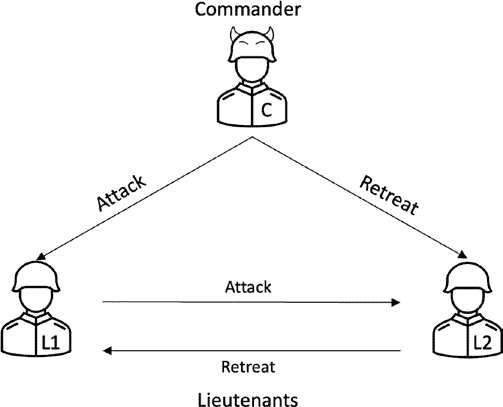

第六章 早期协议

i. 设置 *Vi* = { *v*}。

ii. 将消息 *v* : 0 : *i* 发送给每一个其他中尉。

b. 如果中尉 *i* 收到像 *v* : 0 : *j* 1\. … *jk* 这样的消息，并且 *v* 不在集合 *Vi* 中，那么

i. *Vi* = *Vi* + { *v*}，也就是，将 *v* 添加到 *Vi* 中。

ii. 如果 *k* < *m*，那么将消息 *v* : 0 : *j* 1… *jk* : *i* 发送给除了 *j* 1… *jk* 之外的所有中尉。

3\. 对于每个 *i*

a. 当中尉 *i* 不再接收到更多消息时，那么它遵守

通过函数 *choice* ( *Vi*) 获取命令（消息）。

从一组命令中进行选择。如果集合 *V* 为空或包含多于一个元素，则 *Choice*( *V*) = *retreat*。如果只有一个

集合 *V* 中的单一元素 *v*，那么 *choice*( *V*) = *v*。

这里，*v* : *i* 是由将军 *i* 签署的值 *v*，而 *v* : *i* : *j* 是由将军 *j* 签署的消息 *v* : *i*。每个将军 *i* 维护一个包含所有接收到的命令的集合 *Vi*。

图 6-7 的图示了叛徒指挥官的场景。

***图 6-7\.** 具有 SM(1) – 叛徒的签名消息协议示例*

*指挥官*

274

第六章 早期协议

使用签名消息，很容易就能检测出指挥官是否是叛徒，因为他

签名会出现在两个不同的指令上，根据签名不可伪造的假设

签名，我们知道只有指挥官才能在消息上签名。

形式上，对于任意的 *m*，算法 *SM*( *m*) 在最多 *m* 个叛徒的情况下解决了拜占庭将军问题。中尉维护了一个值的向量，并运行一个选择功能来检索命令 *choice* { *attack*, *retreat*}。超时用于确定是否不会再有更多的消息到达。此外，在步骤 2 中，中尉 *i* 忽略任何已经在集合 *Vi* 中的消息 *v*。

该算法的消息复杂度为 *O*( *nm* + 1)，并且需要 *m* + 1 轮。该协议对于 *N* ≥ *m* + 2\ 有效。

与口头消息协议相比，签名消息协议更加

抵御故障；在这里，如果三名将军中至少有两名忠诚，该问题是可解的。在口头消息中，即使三名将军中有一个叛徒，问题也是不可解的。

**部分同步下的 DLS 协议**

FLP 不可能性结果之后，研究人员介绍的一种方式

回避 FLP 不可能性的一种方式是使用部分同步网络模型。那里

该论文中提出了一些重要的概念，例如轮换协调员

共识、部分同步终止和基于回合的实现

机制。我们在第[3\.]章中讨论了各种模型，包括部分同步。

该论文描述了四种算法，用于该论文中的崩溃停止、遗漏、拜占庭

在部分同步状态下认证的拜占庭故障。这些中的关键思想

算法总是满足协议和有效性，而当系统稳定时保证终止，也就是，具有良好的同步事件。

引入了一个基本的回合模型，其中协议执行被分为回合

的消息交换和本地计算。每个回合包括一个发送步骤、一个

接收步骤和计算步骤。此外，基本回合模型假设一个

全局稳定化回合，其中或者正确进程之后

收到所有来自正确进程发送的消息。

在这一节中，介绍了算法 2，一个拜占庭共识算法

具有认证的拜占庭故障。它假设有部分同步的网络模型

可以是拜占庭的通信和处理器。这个模型也适用于

大多数，如果不是全部，区块链网络。

275

第六章早期协议

该算法实现了在任意值集 V 下的强一致性

具有认证的拜占庭故障。

算法分为阶段进行。每个阶段 * k * 包括四个连续的

回合，从 4 * k * – 3 到 4 * k *。每个阶段都有一个独特的协调员 c 来主导该阶段。

一个简单公式 * k * = * i *（* mod n *）用于从所有进程中选择协调员，其中 * k * 是阶段，* i * 是进程号， * n * 是进程总数。

每个进程都维护一些变量：

• 本地变量 PROPER，其中包含进程 p

进程知道是合适的。

• 本地变量 ACCEPTABLE，其中包含过程 p

p 已经被发现是可以接受的。请注意，值 v 对

进程 p 如果 p 对除了可能 v 之外的任何值都没有锁定

同样，值 v 是合适的。

• 本地变量 LOCK，保存锁定的值。一个进程可以

在一个阶段中的锁定一个进程认为一些进程可能决定

这个值。最初，没有值被锁定。一个相位号被关联

每把锁。此外，已锁定值的可接受性证明

该值也与每一个锁绑定。接受性的证明在

由*n*–*t*个进程发送的一组签名消息的形式，指示

锁定的值是可接受且正确的，也就是说，它在他们的

PROPER 在给定阶段开始时设定。

**算法** *N* ≥ 3*t* + 1 – **带认证的拜占庭错误**

**尝试第 k 阶段**

**轮次：**

**第 1 轮：第 4k – 3 轮**

包括当前协调员在内的每个进程都发送其所有验证过的列表

将可接受的值发送给当前的协调员。进程使用消息格式*E*( *list*, *k*)，其中*E*是认证函数，*k*是阶段，*list*是所有可接受的值。

**第 2 轮：第 4k – 2 轮**

当前的协调员选择要提议的一个值。如果要提议一个值

由协调员，协调员必须从进程中至少收到*n*−*t*个响应，表明这个值在第*k*阶段是可接受且正确的。如果协调员可能提议超过一个可能的值，则会选择一个

任意的。

276

第六章早期协议

协调员广播的消息形式为*E*( *lock*, *v*, *k*, *proof*)，其中*proof*由*n*−*t*个发现*v*可接受且正确的过程发送的签名消息*E*( *list*, *k*)组成。

**第 3 轮：第 4k – 1 轮**

如果任何进程收到一条*E*( *lock*, *v*, *k*, *proof*)消息，它会验证证明以确保对*v*在阶段*k*可接受和正确的*n*−*t*个处理器。如果证明有效，它会锁定*v*，将阶段号*k*和消息*E*( *lock*, *v*, *k*, *proof*)与锁定关联，并向当前的协调员发送确认。在这个

在这种情况下，进程会释放对*v*的任何早期的锁定。如果协调员收到至少 2*t* + 1 个处理器的确认，则决定值*v*。

**第 4 轮：第 4k 轮**

这是释放锁的地方。进程以以下形式广播消息

*E*( *lock v*, *h*, *proof*)，表示它们对值*v*以及相应阶段*h*的锁定和相关证明，并且一个协调员在阶段*h*发送了消息，导致放置了锁。如果任何进程对某个值*v*有关联阶段*h*的锁定，并接收到一个正确签名的消息*E*( *lock*, *w*, *h*’, *proof*′)，其中*w* ≠ *v*且*h*’ ≥ *h*，那么该进程会释放对*v*的锁定。这意味着，如果某个进程收到了最近的正确签名消息，表示对一些不同的值的锁定。

其本地锁定值以及阶段编号要么高于要么等于当前编号。

阶段号，然后会释放本地锁定值的锁。

**注**

假设进程是正确的，那么两个不同的值不能被锁定在

相同的阶段，因为正确的协调员永远不会发送冲突的消息

可能暗示着对两个不同值的锁。

此算法实现了一致性，强一致性和终止

部分同步，带有拜占庭故障和认证，其中*n* ≥ 3*t* + 1。

认证拜占庭意味着故障是任意的，但消息可以签名

使用不可伪造的数字签名。

一致性意味着没有两个不同的进程做出不同的决定。终止意味着

每个进程最终都会做出决定。一致性有两种口味，强一致性和弱一致性。

一致性。强一致性要求如果所有进程都有相同的初始值

v 并且如果任何正确的进程做出决定，则只会做出 v 的决定。弱一致性意味着

如果所有进程都有相同的初始值 v，并且所有进程都是正确的，那么如果任何进程做出决策，则将在 v 上做出决策。换句话说，强一致性意味着如果所有初始值都相同，例如 v，那么 v 是唯一的共同决定。在弱

一致，只有当所有进程都正确时，才预计会满足此条件。

277

第六章早期协议

**Ben-Or 算法**

Ben-Or 协议于 1983 年提出。这是以其作者 Michael Ben-

或。这是第一个使用概率解决共识问题的协议

在拥有强对手的模型下终止。Ben-Or 算法提出

如何规避 FLP 结果并在异步情况下达成共识。有

在论文中提出的两个算法。第一个算法容忍*t* < *n*/2 次崩溃故障，第二个算法容忍*t* < *n*/5 的拜占庭故障。换句话说，当*N* > 2*t*时，它容忍崩溃故障并达成一致，并且当*N* > 5*t*时，协议容忍拜占庭故障并达成一致。该协议实现了共识

在前述条件下，但是协议的预期运行时间

是指数。换句话说，它需要指数运行时间才能在其中终止

最坏情况下，因为可能需要多轮才能终止。但是它可以终止。

常数时间内如果*t*的值非常小，即*O*(√*n*)。

此协议在异步轮中运行。一轮模拟时间，因为所有

消息带有轮数标记，因此，即使它们以异步方式到达，进程也可以弄清楚

哪些消息属于哪个轮次，即使它们是异步到达。一个进程

忽略以前轮的任何消息，并将未来轮的消息保存在一个

缓冲区。每轮有两个阶段或子轮。第一个是提案（建议）

阶段，在此过程 p 将其值 v 传输并等待，直到从其他进程接收到

*n* − *t* 过程。在第二阶段，即决策（批准）阶段中，协议检查是否观察到多数并采取该值；否则，它会抛硬币。如果一定数量的过程看到相同的多数值，那么决定就会最终确定。

就会检测到其他值为多数，则处理器会切换到该

值。最终，该协议成功终止，因为在某个时刻所有进程

将正确翻转硬币并达到大多数值。您可能已经注意到，此协议仅考虑二进制决策值，即 0 或 1。另一个需要注意的重要方面是协议不能无限期地等待所有进程响应，因为它们可能不可用（脱机）。

该算法仅适用于二进制共识。有两个需要的变量

在算法中要管理一个值，要么是 0，要么是 1，以及相位（p）

代表算法当前所处的阶段。算法分为

轮次，并且每个轮次有两个子回合或阶段。

278

第六章早期协议

请注意，每个进程都有自己的硬币。这种类别的算法利用这样的

使用本地硬币算法实现局部硬币抛掷。局部硬币抛掷使用一个

输出二进制数字的随机数生成器。每个进程都抛掷自己的

硬币，并以概率½输出 0 或 1。进程抛掷硬币以选取新的本地值，如果没有找到大多数。

**只针对良性故障/崩溃故障的算法-非拜占庭式:**

每个进程 p 执行以下算法：

进程 p：初始值 x = 0 或 1

**0:** 设置 r = 1

**-- 第一个子回合或阶段-提议阶段**

**1:** 广播（1, r, x）给所有包括自身的进程

**2:** 等待直到从 n - t 个进程接收到类型为（1, r, *）的消息。

**2(a):** 如果收到 > n /2 个相同值 v 的消息，则

**- 第二子回合或阶段-决策阶段**

**2(b):** 将消息（2，r，v，D）广播给所有进程

包括自身。

**2(c):** 否则将消息（2, r, ?）广播给所有进程

包括自身。

**3:** 等待从 n - t 个进程接收到类型为（2, r, *）的消息。

**3(a):** 如果有 1 个 D 类型消息（2, r, v, D），则投票 v 即

设置 x = v

**3(b):** 并非 > t 个 D 类型消息，则决定 v。

**3(c):** 否则通过进行同等概率为 1/2 的投票将 x 设置为 0 或 1

coinflip

**4:** 通过设置 r = r + 1 开始下一轮并转到 1\.

这里，r 是回合数；x 是由

进程；1 是主回合的第一个子回合、回合或阶段；2 是第二

子回合、回合或阶段的主回合；* 可以是 0 或 1；？代表没有

观察到大部分；N 是节点（进程）的数量；D 是一个批准的指示

（ratification）- 换句话说，这表明该进程已观察到大部分相同的值- t 是故障节点的数量；v 是值；coinflip() 是一个

生成 0 或 1 的均匀随机数生成器\。

我们可以在图 6-8 中显示的图表中可视化该协议。

279

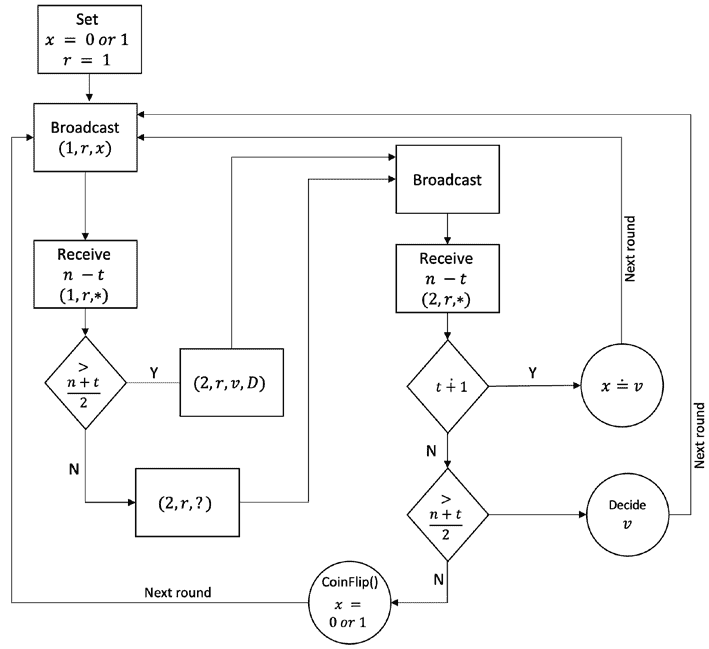

第六章早期协议

***图 6-8\.** Ben-Or 仅崩溃容错一致性协议-（非拜占庭）* 如果*n* > 2 *t*，该协议有 1 的概率保证所有进程最终决定相同的值，并且如果所有进程从值*v*开始，则在一轮内所有进程将决定*v*。此外，如果在某一轮中的进程在收到超过*t*的 D 类型消息之后决定*v*，则在下一轮内所有其他进程将决定*v*。

上述描述的协议适用于崩溃故障；为容忍拜占庭故障，

需要进行微小的修改，我们接下来进行描述。

280

第六章早期协议

**Ben-Or 算法用于拜占庭故障：**

每个进程 p 执行以下算法：

进程 p：初始值 x = 0 或 1

**0:** 设置 r = 1

**- 第一子轮次或阶段 - 提案阶段**

**1:** 向所有进程（包括自身）广播（1，r，x）

**2:** 等待来自 N - t 进程的类型（1，r，*）的消息。

**2(a):** 如果超过（N + t）/2 个消息具有相同的值 v，则

**- 第二个子轮次或阶段 - 决策阶段**

**2(b):** 向所有进程广播消息（2, r, v, D）

包括自身。

**2(c):** 否则，向所有进程广播消息（2，r，?）

包括自身。

**3:** 等待来自 n - t 进程的类型为（2, r, *）的消息到达。

**3(a):** 如果至少有 t + 1 个 D 类型的消息（2, r, v, D），那么

投票 v，即设置 x = v

**3(b):** 如果有超过（n + t）/2 个 D 类型的消息，则决定 v。

**3(c):** 否则通过做的 1/2 的概率将 x 设置为 0 或 1

coinflip

**4:** 通过设置 r = r + 1 开始下一轮，然后转到 1\。

在这里，r 是轮次编号；x 是由发起进程提出的初始偏好或值

进程；1 是主轮次的第一子轮次，轮次或阶段；2 是主轮次的第二

子轮次，轮次或阶段的主轮次；*可能为 0 或 1；？表示没有

观察到的多数；N 是节点（进程）的数量；D 是批准的指示

（认证）- 换句话说，这是表明进程观察到了大多数相同值的指示- t 是有故障的节点数；v 是值；coinflip()是一种均匀随机数生成器，生成 0 或 1。

生成均匀随机数的生成器，生成 0 或 1\。

我们可以在图 6-9 中可视化这个协议。

281

第六章早期协议

***图 6-9\.** Ben-Or 拜占庭一致性协议*

在协议的第一子轮次或阶段中，每个进程都广播其提出的

*n* + *t*

首选值并等待*n* - *t*的消息。如果超过

进程同意，然后

2

实现了大多数，根据情况设置首选值。

在协议的第二个子轮次或阶段中，如果在第一个子轮次中观察到多数

子轮次，然后广播大多数的指示（2，*r*，*v*，*D*）；否则，如果在第一个子轮次中没有观察到大多数（？），则不会广播大多数。然后协议

等待 *n* – *t* 个确认。如果至少 *t* + 1 个确认多数为 0 或 1

被观察到，那么首选的值会相应地设置。这里，只有首选的值 *n* + *t*

被设置，但没有做出决定。如果超过

确认

2

*n* + *t*

当收到*t* + 1 个确认后，才会决定价值。如果既没有 *t* + 1 个确认，也没有

2

确认收到 *t* + 1 条后，就会抛硬币选择一个统一的随机值，

为 0 或 1\。

282

第六章早期协议

请注意，通过等待 *n* – *t* 条消息，处理拜占庭故障的情况被处理了，即拜占庭进程恶意决定不投票。这是因为在存在 t 个故障的情况下，至少有 n 个是诚实的。在第二个子轮中，多数值 *n* + *t* 的 *t* + 1 个确认

意味着至少有一个诚实的进程观察到了多数派。在

，它

2

意味着多数人观察到了某个值。

因此，总的来说，如果 *n* > 5 *t*，这个协议肯定以 1 的概率保证所有进程最终决定相同的值，并且如果所有进程从头开始

值 v，那么在一轮内所有进程都会决定 *v*。此外，如果在某一轮内（ *n* + *t*）

一个诚实的进程在收到超过

D 类型的消息，那么

2

所有其他进程将在下一轮内对 v 做出决策。

*请注意，我使用 t 来表示故障进程，这符合原始论文上的内容。然而，在文献中也有广泛使用 f 来表示故障，无论是拜占庭故障还是崩溃。因此，t + 1 或 f + 1 意思相同，因为 t 和 f 指代的是同一件事情。*

现在的问题是，该协议如何实现一致性、有效性和

终止。让我们试着回答这些问题。

一致性是可能的，因为第一轮中最多只能有一个值属于多数

阶段（子轮）的主轮。如果某个进程观察到 *t* + 1 个 D 类型消息（形式为 (2, r, v, D) 的认证消息），那么每个进程至少观察到形式为 (2, r, v, D) 的认证消息。最后，如果每个进程都看到形式为 (2, r, v, D) 的认证消息，那么每个进程都会为值 v 投票（接受值 v）

在第一轮（阶段）中决定 v 并在第二轮（阶段）中决定 v

除非它已经做出了决定。

有效性是可能的，因为如果所有进程在

一轮，然后所有进程广播 (2, r, v, D) 并在第二个子轮中决定

该轮内为它们共同的值 v 投票（接受），那么一致性是可能的。此外，请注意，只有一个进程的首选值在该轮的第一子轮中被广播。

Ben-Or 终止的原因是因为最终大多数

非故障进程将掷硬币以获得相同的随机值。这个多数

值被诚实的进程观察到，然后传播类型为 D 的信息

消息（认证消息）与大多数值。最终，诚实的进程将收到 D 型消息（认证消息），协议就会终止。

此外，请注意所需两个子轮的原因是由于在第一

阶段中，首选值提案的数量最多减少至一个，然后在

第二个子轮，简单的多数投票就足以做出决定。可以设计一个仅需一轮的共识算法，但这需要一个最小的

283

第六章 早期协议

进程的数量为 3 * f * + 1.在异步情况下，通过两轮，满足了 2 * f * + 1 的下界。

早期描述的 Ben-Or 算法并不使用任何密码原语

并假设强对手。然而，也开展了大量的工作

在异步拜占庭协议可用的情况下

密码原语。当然，根据这个模型，假定对手是

总是计算上有限的。在这种模型下的著名的早期协议

如前所述，如使用带有签名消息协议和 DLS 协议的内容。

签名的拜占庭故障模型。还有其他处理硬币的算法

以合作方式抛掷，或者换句话说，使用全局或共享的抛硬币机制。

一个共享的或全局的硬币是一种产生相同结果的伪随机硬币

所有同一轮的进程。这个属性立即意味着收敛

在共享硬币机制下，速度要快得多。这种技术最早

在 Rabin 算法中使用了[14]，利用减少

预期时间到达常数轮次。

在这种早期共识协议的基本介绍之后，我现在将介绍早期

复制协议，当然基本上是基于共识的，但可以

划分为复制协议而不仅仅是共识算法。在

之前我们已经看到，在第[三章](https://doi.org/10.1007/978-1-4842-8179-6_3)，复制使得多个复本在分布式系统中实现一致性。这是提供高可用性的方法。

分布式系统。包括主备份复制在内的不同模型

和主动复制。你可以参考第[三章](https://doi.org/10.1007/978-1-4842-8179-6_3)来了解更多关于状态机复制和其他技术。

**使用故障检测进行共识**

我们在第[三章](https://doi.org/10.1007/978-1-4842-8179-6_3)中讨论了故障检测器及其不同的类别。在这里，我们介绍了一种称为*Chandra-Toueg 一致性协议*的算法，使用最终强⋄*S*故障检测器来解决共识问题。这是用于解决共识问题的最弱的故障检测器。记得最终强故障检测器

满足强完备性和最终的弱精度属性。



此协议考虑了异步网络模型与*f*

*n*

<  2 ，即，在

 *n* +1

最小的

正确的进程。少于*n*/2 失败进程的假设使进程能够

 2 

等待收到大多数响应，无论故障检测器怀疑的是什么。

284

第六章早期协议

该协议在异步的条件下工作，并且有一个轮转的协调者。这个

协议使用可靠广播来确保所广播的任何消息要么不是

被任何进程接收（交付）或者被所有诚实的进程只接收一次。

算法工作如下。

每个进程都维护一些变量：

• 决定值的估计—提议的值

• 状态

• 进程当前的轮次号

• 过程更新其估计（优先级）的最后一轮。

直到状态被决定，进程会通过多次递增

异步的轮次分成四个阶段或子轮次，并且协调者们是

以轮换的方式选择协调者直到达成决定。协调者

使用公式（*r mod n*） +1，这里*r*是当前轮次号，*n*是总进程数：

1\.所有进程向当前发送其估计（首选）。

使用消息类型（进程 id，当前轮

当发送方更新其广播接受和决定该值时的数字、估计、轮数。

估计）。

 *n* +1

2\.当前协调者等待收集大多数 2 

估计，并选择了最新提议的值

（最大）最后更新的轮次作为其估计值，然后

提议了新的估计值给所有进程。

3\.每个进程都在等待从新提案（估计）。

当前的协调者或者故障检测器怀疑

当前的协调者。如果它收到了新的估计值，它会更新它的

优先级，更新最后一轮的变量为当前轮次，

并向当前的协调者发送 ack 消息。否则，

它发送了*nack*，怀疑当前的协调者已经崩溃。

285

第六章早期协议

 *n* +1

4\. 当前的协调者等待

- 也就是说，大多数

2 

来自进程的回复，要么*ack*要么*nack*。 如果当前的协调者

 *n* +1

收到了大多数的 ack，意味着

已经接受了其

2 

估计，然后估计被锁定，协调者做了个

可靠地广播决定消息（决定的值）。

• 最后，任何未决定的进程通过可靠的方式交付一个值

广播接受并决定该值。

请注意，在本文[10]中还有其他算法，但我已经描述了

这里只有一个使用最终强故障探测器解决共识的。

现在让我们看看一下一致性、有效性和终止条件是如何满足的。

**一致性**得以满足。让我们考虑一个可能的情景，即两个协调者广播，一些进程最终接受了来自第一个

协调者和一些来自其他。这将违反一致性，因为在这里，

两个进程在决定时有不同的选择方式，也就是说，两个不同的值都被选择。

然而，这不可能发生，因为对于第一个协调者发送决定，它必须

已经收到足够多的确认（acks）来自大多数进程。

所有后续找到大多数的协调者将与之重叠

前一个。 估计将是最近的一个。因此，任何两个协调者

广播决定正在发送相同的决定。

**有效性**也得到满足，因为每个估计值都是某个进程的输入值。协议设计不允许生成任何新的估计值。

协议最终**终止**是因为故障检测器，最终

强故障检测器，最终将停止怀疑一些正确的进程，而

最终将成为协调者。有了新的协调者，在某一轮中，所有

正确的进程将等待接收这个新的协调者的估计，并将做出回应

带有足够的 ACK 消息。当协调者收集到大多数 ACK 消息时

它将向所有人发送其决定的估计值，并且所有进程都将终止。请注意，如果

一些进程最终等待来自已经终止的进程的响应，

最终也会通过其他正确的节点和重传得到消息

最终决定和终止。例如，假设一个进程陷入等待

对于来自崩溃协调者的消息。最终，由于强制性的完成

最终强故障检测器的属性，失败的协调者将会

可疑，确保进展。

286

CHapTer 6 早期协议

**摘要**

本章涵盖了早期协议，为大多数提供了坚实的基础

今天的共识研究。随着区块链的出现，许多这些协议

激发了新的区块链时代协议的发展，特别是针对授权的

区块链。例如，Tendermint 基于 DLS 协议，即算法 2

来自 DLS 论文。

我们没有在本章中讨论每个算法，但本章应提供

给读者提供了一个坚实的基础来进一步建立。为了规避 FLP 的不可能性，

可以通过假设随机化的方式将随机性引入系统

模型或本地硬币翻转进程。假设第一个假设随机化

模型（也称为公平调度，随机调度）机制是由 Bracha 提出的

和 Toueg [17]。基于第二种方法的算法，其中提供进程

使用本地硬币翻转操作首先是由 Ben-Or [2]提出的，这是第一个

随机化共识协议。实现预期的常数的第一种方法

通过使用

数字签名和信任的经销商是由 Rabin [14]发布的。利用协议

Chandra 和 Toueg [15]提出了故障检测器的许多优秀调查。一个优秀的调查

异步一致性的随机化协议由 Aspnes [16] 提出。

随机化协议是规避 FLP 结果的一种方法，但我们能反驳

9 的第[9](https://doi.org/10.1007/978-1-4842-8179-6_9) 章中我们将看到反驳 FLP 不可能性结果。听起来不可能，但我们将在第九章中看到。

在接下来的章节中，我们将讨论经典协议，如 PBFT，这被视为

从已有的 VR 协议发展而来，我们也将

在下一章介绍的。虽然 VR 仅处理崩溃故障，PBFT 也处理了拜占庭故障。我们还将讨论其他协议，如 Paxos，这是大多数共识协议的基础。几乎所有共识算法都利用

Paxos 中提出的基本思想以一种或多种方式出现。

**参考文献**

1\. 具有一个故障进程的分布式一致性的不可能性

J. Assoc. Computer. Mach., 32 (No. 2) (1985), pp. 374–382\.

2\. M. Ben-Or: 自由选择的另一个优势：完全

异步一致性协议。

287

第六章 早期协议

3\. L. Lamport, R. Shostak, M. Pease, 拜占庭将军

问题,” ACM 编程语言和

系统, vol. 4 (no. 3) (1982), pp. 382–401, 1982 年 7 月.

4\. Lampson, Butler, 和 Howard E. Sturgis. “崩溃恢复

分布式数据存储系统.” (1979).

5\. Skeen, D., 1981, 四月. 非阻塞提交协议。 在

1981 年 ACM SIGMOD 国际会议论文集

关于数据管理的(p. 133–142).

6\. Dwork, C., Lynch, N., 和 Stockmeyer, L., 1988\. 共识

部分同步的情况下。ACM 杂志（JACM），35(2),

pp. 288–323\.

7\. G. Bracha, “异步的拜占庭协议,” 信息。

Comput., 1987\.

8\. S. Toueg, “随机化的拜占庭协议,” in PODC, 1984\.

9\. G. Bracha 和 S. Toueg, “弹性一致性协议,” in

PODC, 1983\.

10\. Chandra, T.D. 和 Toueg, S., 1996\. 不可靠的故障检测器

可靠的分布式系统。ACM 杂志（JACM）, 43(2),

pp. 225–267\.

11\. Martin Kleppmann 的分布式计算讲座 -

Kleppmann, M., 2018\. 分布式系统[. www.cl.cam.ac.uk/](https://www.cl.cam.ac.uk/teaching/2021/ConcDisSys/dist-sys-notes.pdf)

[teaching/2021/ConcDisSys/dist-sys-notes.pdf](https://www.cl.cam.ac.uk/teaching/2021/ConcDisSys/dist-sys-notes.pdf)

12\. 分布式算法：冗长之旅 - Fourre Sigs 撰写.

13\. Lindsey Kuper – 讲授分布式系统[: https://](https://youtube.com/playlist?list=PLNPUF5QyWU8PydLG2cIJrCvnn5I_exhYx)

[youtube.com/playlist?list=PLNPUF5QyWU8PydLG2cIJrCv](https://youtube.com/playlist?list=PLNPUF5QyWU8PydLG2cIJrCvnn5I_exhYx)

[nn5I_exhYx](https://youtube.com/playlist?list=PLNPUF5QyWU8PydLG2cIJrCvnn5I_exhYx)

14\. Rabin, M.O., 1983, 十一月. 随机化的拜占庭将军。

在计算机科学基础研究年会第 24 届年度

（sfcs 1983) (p. 403–409). IEEE.

288

第六章 早期协议

15. Chandra, T.D. and Toueg, S., 1996. 不可靠的故障检测器

可靠的分布式系统。 ACM 杂志（JACM），43(2)，

pp. 225–267\.

16. Aspnes, J., 2003. 异步随机化协议

一致性。 *分布式计算*，*16*(2), pp. 165–175\.

17. Bracha, G. and Toueg, S., 1985. 异步一致

和广播协议。 *ACM 杂志（JACM）*，*32*(4),

pp. 824–840\.

289

**第七章**

**经典一致性**

出现在 1980 年代的一致性和复制协议产生了深远的影响

一致性协议研究方面的贡献。 早期的复制协议，例如

视图复制提供了深刻的见解，说明容错复制如何能够

设计和实施。 同时，Paxos 也被介绍, 它

提供了一个具有严格的正式规范和分析的实用协议。 1999 年，

第一个实际的拜占庭容错协议被介绍。 本章详细介绍了这些经典协议，它们的设计，工作原理以及它们如何提供

安全性和活性保证。 此外，关于如何以及是否可以在中使用它们的一些想法

区块链也呈现出来。 此外，最近开发的协议，例如

RAFT 也被讨论了，它建立在之前的经典协议基础上构建了一个

易于理解的一致性协议。

**视图复制**

Brian 引入了一种基于视图的复制方法

Oki 和 Barbara Liskov 在 1988 年。 这是最基本的机制之一

实现复制以保证一致性（一致视图）

在出现崩溃故障和网络分区的情况下运行; 但是假设节点最终会从崩溃中恢复，并且网络分区会被修复。 它也是一个

一致性算法, 因为要实现复制数据的一致性，节点必须

同意复制状态。

视图复制有两个主要目的。 一个是提供分布式

系统足够一致，以至于客户端会感觉到自己在与系统通信

同时提供单个服务器。 另一个是提供状态机复制。 状态机复制要求所有副本从相同的初始状态开始，并且操作是确定性的。 在有了这些要求（假设）之后，我们可以很容易地看到，如果所有

复制副本执行相同的操作序列，那么它们最终将处于相同的

291

© Imran Bashir 2022

I. Bashir, *区块链共识*, [`doi.org/10.1007/978-1-4842-8179-6_7`](https://doi.org/10.1007/978-1-4842-8179-6_7#DOI)

第七章 经典一致性

状态一致。 当然，挑战在于确保操作即使在发生故障时也会以相同的顺序在所有副本上执行。 所以，总的来说，该协议提供了容错和一致性。 它基于主备份副本技术。

视图复制（VR）协议中有三个子协议：

• **正常操作协议**：处理客户端请求并实现

正常情况下的复制

• **视图更改协议**：处理主要故障并启动新的视图

或有新的主要

• **副本恢复协议**：处理再加入失败的副本

现在已经恢复了

VR 受到两阶段提交协议的启发，但与两阶段提交协议不同，

它是一个具有故障容忍功能的协议，并且不会在主要（2PC 中的协调者）发生故障时阻塞

术语）或副本失败。该协议是可靠的，并且在不超过 f 个副本故障的情况下保证可用性。它使用 2f + 1 的副本组，并在异步性和 f+1 法定人数下容忍崩溃故障。

每个副本都维护一个包含配置、副本编号、当前视图、当前状态 - 正常或视图更改或恢复、分配的操作

达到最新请求的编号，包含接收到的请求的条目的日志

到目前为止，他们的操作编号，以及客户表，其中包含最新的客户端请求，其状态是否已执行以及该请求的相关结果。

让我们看看 VR 中正常操作是如何工作的。首先，让我们看看变量列表

及其含义：

• **op**：客户端操作

• **c**：客户 ID

• **s**：分配给请求的编号

• **v**：客户端已知的视图号

• **m**：从客户端接收到的消息

• **n**：分配给请求的操作编号

• **i**：非主副本

• **x**：结果

292

第七章 经典共识

**协议步骤**

1\. 客户端发送形式为<REQUEST op, c, s，

v>消息发送到主要副本。

2\. 当主要接收时

a. 它递增操作编号。

b. 它将请求消息添加到日志的末尾。

c. 它向其他副本发送<PREPARE m, v, n>。

3\. 当副本接收到准备消息时，它们会执行以下操作：

a. 只有在前面的所有请求之前的所有请求都已经

准备消息中的操作编号在其日志中具有条目。

b. 否则，它们将等待直到缺少的条目通过状态更新 - 通过状态

转移。

c. 它们将请求附加到它们的日志中。

d. 他们向主副本发送<PREPAREOK v, n, i>消息。

4\. 主要等待其他副本的 f PREPAREOK 消息;

当接收到时，它

a. 认为操作已经提交

b. 执行任何待处理的操作

c. 执行最新的操作

d. 向客户端发送消息<REPLY v, s, x>

5\. 在提交后，主要副本通知其他副本

提交。

6\. 其他副本在将其附加到其日志后执行它，但只有

执行任何待处理操作后。

这个过程在图 7-1 中可视化。(链接至#p309)

293

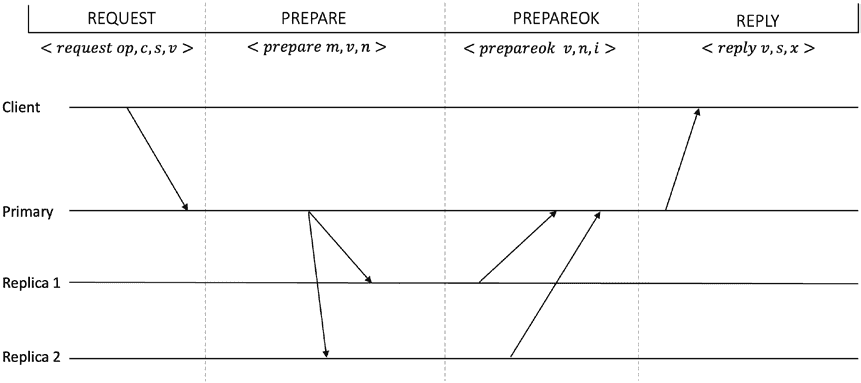

第七章 经典共识

***图 7-1** VR 协议-正常操作*

当主要失败时，视图更改协议启动。故障通过以下方式指示：

复制的超时：

• **v**：视图号

• **l**：副本的日志/新日志

• **k**: 最新已知提交请求的操作数

复制品知道

• **I**: 复制品标识符

**视图更改**

视图更改协议的工作如下：

1\. 当一个复制品怀疑主节点故障时，它

a. 增加视图号

b. 将其状态更改为视图更改

c. 向复制品的主节点发送<DOVIEWCHANGE v, l, k, i>消息

下一个视图

2\. 当新主节点获得 f+1 个 DOVIEWCHANGE

消息时，它

294

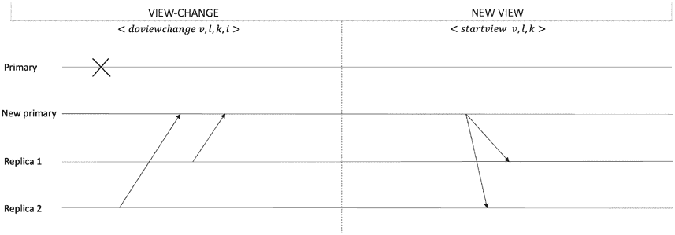

第七章 经典共识

a. 选择消息中最近的日志并将其选为新日志

b. 将操作号设置为新日志中最新条目的编号

c. 将其状态更改为正常

d. 向其他复制品发送<STARTVIEW v, l, k>消息，指示

视图更改过程完成

3\. 现在，新的主节点

a. 顺序执行任何尚未执行的已提交操作

b. 向客户端发送一个回复

c. 开始接受新的客户端请求

4\. 其他复制品收到 startview 消息后

a. 用消息中的日志替换他们自己的日志

b. 将其操作号设置为日志中最新条目的编号

c. 将他们的视图号设置为消息中的值

d. 将他们的状态更改为正常

e. 为未提交消息发送 PREPAREOK

如果连新的主节点都失败，则视图更改协议将重复。

图 7-2 vis](#p310)ualizes this process.

***图 7-2.** 视图更改 in VR*

295

第七章 经典共识

这里的关键安全要求是所有已提交操作都到达下一个

保存他们的顺序的视图。

VR 故意没有深入讨论，因为我们更专注于

主流协议。但是，这应该给您一个关于基本概念的思路

VR 中引入的机制，在几乎所有复制和共识中都起着重要作用

协议，特别是 PBFT，Paxos 和 RAFT。当你阅读以下章节时，

你将看到 PBFT 是 VR 的演进形式以及 VR 和其他相似之处

本章介绍的不同协议。当您阅读关于 RAFT 的部分时，您

会发现 VR 和 RAFT 之间有很大的相似之处。

让我们先来看看 Paxos，毫无疑问是最有影响力和基础性的

一致性协议。

**Paxos**

Leslie Lamport 发现了 Paxos。它首次提出于 1988 年，然后更多

在 1998 年正式提出。这是最基本的分布式共识算法，可以

允许在不可靠的通信环境中就一个值达成共识。换句话说，Paxos

用于构建可靠系统，即使在存在故障的情况下也能正常运行。

Paxos 使得状态机复制更加实用。Paxos 的一个版本

被称为多 Paxos 常用于实现复制状态机。它运行

在异步消息传递模型下。它容忍少于*n*/2 个崩溃故障，也就是说，它满足了 2 *f* + 1 的下限。

较早的共识机制没有单独处理安全性和活性。

Paxos 协议通过不同的方法解决一致性问题

分离安全性和活跃性属性。

运行 Paxos 协议的系统中的节点有三种角色。

承担。单个过程可能扮演所有三种角色：

• **提议者**：提出要决定的值。当选举出的提议者行动时
