作为单一领导者提出一个新的值。提议者处理客户端

请求。

• **接受者**：接受者评估并接受或拒绝提议

根据几个规则和条件由提议者提出。

• **学习者**：学习决策，即达成一致的值。

296

第七章 经典共识

还有一些与 Paxos 节点相关的规则。Paxos 节点必须是

持久的，即它们必须存储自己的操作，并且必须记住他们

被接受。节点还必须知道多少接受者构成了多数。

Paxos 可以被看作类似于两阶段提交协议。两阶段提交

(2PC)是一个标准的原子提交协议，用来确保事务

只有在所有参与者同意提交的情况下，分布式数据库才能提交。即使一个

单个节点不同意提交事务，事务将被完全回滚。

同样，在 Paxos 中，提议者在第一阶段向接受者发送提议。

然后，提议者向接受者广播请求以提交，如果他们

接受提议。一旦接受者提交并回报给提议者，协议

提议被认为是最终的，并且协议结束。与两阶段相比

提交，Paxos 引入了有序性，即顺序化，以实现提案的总排序

提议。此外，它还引入了基于多数法定人数的接受

而不是期望所有节点都同意。此方案允许协议

即使一些节点失败，也能取得进展。这两项改进确保了安全和

Paxos 算法的健壮性。

协议由两个阶段组成，准备阶段和接受阶段。

在准备阶段结束时，多数接受者已经承诺了一个特定的

提议号。在接受阶段结束时，多数接受者已经接受了一个

提议的值，并且达成了一致。

算法工作如下：

**阶段 1 - 准备阶段**

• 提议者收到要通过接受者就某个值达成共识的请求

一个客户端。

• 提议者向大多数或所有接受者发送消息 *prepare*( *n*)

在这个阶段，还没有为决定提出任何值。

在假设的情况下，多数接受者已经足够了

所有接受者中的多数会做出响应。在这里，*n*代表

必须是全局唯一的提议号，并且必须是

比该提议者以往使用的任何提议号更大。

例如，*n*可以是纳秒级的时间戳或其他某个时间

递增值。如果发生超时，那么提议者将重试

使用更高的 *n*。换句话说，如果提议者无法

由于没有来自接受者的响应而无法取得进展，它可以重试

使用更高的提议号。

297

第七章 经典共识

• 当接受者收到这个 *prepare*( *n*) 消息时，它会

“承诺”。它执行以下操作：

• 如果没有通过响应这个

准备消息，那么接受者现在承诺忽略任何

小于提议编号*n*的请求。它记录*n*并回复

带有消息*promise*(*n*)。

• 如果接受者之前承诺过，也就是，已经

响应另一个带有一些提议的准备消息

编号低于*n*，接受者执行以下操作：

• 如果接受者还没有收到任何接受消息

在接受阶段来自提议者，它存储更高的提议

编号*n*，然后向提议者发送承诺消息。

• 如果接受者之前收到过带有一些接受消息

其他更低的提议编号，它必须已经接受过

从某个提议者提议的值。此前完整提议

现在将带着承诺消息发送给提议者，

表示接受者已经接受了一个值。

**第二阶段——接受阶段**

当提议者收到足够的响应时，即承诺

从多数接受者，对于特定的*n*：

• 提议者等待直到获得大多数的响应

接受者对*n*的确定值学习。

• 当收到响应时，提议者评估值*v*该如何

发送到接受消息。它执行以下操作：

• 如果提议者收到一个或多个包含完整承诺消息

提议，它选择提议中拥有最高部价值*v*的值

提议编号。

• 如果提议者收到的承诺消息中没有包括完整的

提议，提议者可以选择任何它想要的值。

• 现在提议者发送接受消息——完整提议的

形式*accept*(*n*, *v*)——发送给接受者，其中*n*是承诺的提议编号，*v*是实际提议的值。

298

第七章 经典共识

• 当接受者收到这个*accept*(*n*, *v*)消息时，它会执行以下操作：

• 如果接受者承诺不接受这个提议编号

以前，它将忽略消息。

• 否则，如果它已经响应了对应的准备

带有相同*n*的请求，也就是*prepare*(*n*)，然后才回复*accepted*(*n*, *v*)表示接受提议。

• 最后，接受者向所有学习者发送*accepted*(*n*, *v*)。

• 如果大多数接受者接受提议中的值*v*，那么*v*

成为协议的决定值，即达成共识。

有时会对接受阶段和第三阶段进行区分

第三阶段称为学习阶段，学习者从

接受者。在前面的算法中，我们没有单独显示这一点，因为学习

被认为是第二阶段的一部分。一旦提议在接受阶段被接受

阶段，接受者向学习者通知。图 7-3 does 显示一个称为学习阶段的第三阶段，但这只是为了以更简单的方式可视化协议；学习实际上是第 2 阶段——接受阶段的一部分。

我们使用“多数”这个术语表示大多数接受者已经

响应或接受的消息。多数来自选民。在多数情况下

*n*

法定人数，每个法定人数都有

+1 节点。此外请注意，为了容忍*f*个故障

2

接受者，至少需要一个由 2 *f* + 1 个接受者组成的集合。我们在 [3](https://doi.org/10.1007/978-1-4842-8179-6_3) 章讨论了法定系统。

该协议如图 7-3 所示。

299

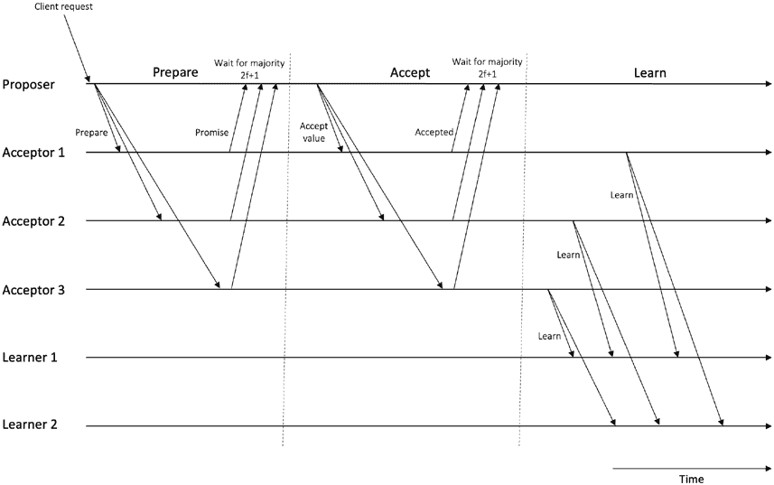

第七章 经典共识

***图 7-3.** Paxos 的正常运行*

请注意，Paxos 算法一旦达成单一共识就不会继续

到达另一个共识。需要再次运行 Paxos 来达成另一个共识。

此外，如果一半或一半以上的节点是错误的，Paxos 无法取得进展

因为在这种情况下无法达到多数，这对于制定是至关重要的

进展。它是安全的，因为一旦达成协议，就不会再改变。虽然 Paxos 被保证是安全的，但是协议的活性没有得到保证。这里的假设是网络的大部分正确（非故障）足够长时间，那么协议就会达成一致；否则，协议可能永远不会终止。

通常，学习者会直接从接受者那里学到决定值；然而，这是

在大型网络中，学习者可能通过中继相互学习值。

他们中的一些（少数人）直接从接受者那里学到了什么。或者，

学习者可以定期轮询接受者，以检查是否已经做出了决定。也可以有一个被选举的学习者节点，由接受者通知，这个被选举的学习者

将决定传播给其他学习者。

现在让我们考虑一些故障场景。

300

第七章 经典共识

**故障场景**

想象一下，如果接受者在第一阶段失败，也就是准备阶段，那它就不会将承诺消息发送回给提出者。但是，如果大多数法定人数可以

回应后，提议者将收到回应，并且协议将制定

进展。如果接受者在第二阶段失败，也就是接受阶段，然后

接受者不会将接受的消息发回给提出者。同样，如果

多数接受者是正确的和可用的，提出者和学习者将收到足够的回应继续进行。

如果在准备阶段或接受阶段中提出者失败了会怎么样？如果一个

提出者在发送任何准备消息之前失败了，没有影响；另一些

提出者将运行，并且协议将继续。如果提议者在第一阶段失败之后

发送准备消息，那么接受者将不会收到任何接受消息，

因为没有承诺消息传递给了提出者。在这种情况下，其他一些

提出者将提出更高的提议编号，协议将继续进行。

旧的准备将变成历史。如果提议者在接受阶段失败后

发送至少一个接受者接收的接受消息，一些其他

提出者将发送一个带有更高提议编号的准备消息，接受者

将会回复给提案者一个承诺消息，说明较早的值已经被接受。

被接受。此时，提案者会转而提议相同的较早值

携带最高已接受提案编号，即，发送一条携带

相同的较早值。

另一种情况可能是如果有两位提案者试图在

想象有两位提案者已经发送了他们的准备消息

给接受者。在这种情况下，任何接受者如果接受了更大的提案编号

之前从 P1 收到的提案将忽略

提案者 P2 较低于接受者以前接受的提案编号。如果有接受者

如果没有看到任何之前的值的 A3，则会接受来自 P2 的提案编号

即使它低于其他接受者接受的提案编号，并

之前从 P1 接受的，因为接受者 A3 不知道其他接受者是什么意思

做到。接受者将正常回复给 P2\. 然而，由于提案者

等待大多数的接受者回复，P2 将不会收到来自承诺消息的回复

多数，因为仅 A3 不构成多数。另一方面，P1 将收到承诺

多数的消息，因为 A1 和 A2（其他提案者）在多数派中

并将回复给 P1\. 当 P2 没有听到多数的回复时，它会超时并可以

使用更高提案编号重试。

301

第七章 经典共识

现在想象一个情景，P1 已经到达了接受者

共识，但是还有另一名提案者 P2 不知道这一点并发送了一个

准备消息用一个比之前更高的提案编号。这时的接受者

收到 P2 的更高提案编号消息后，将检查它们是否在同一时间。

之前是否接受过任何消息；如果是的话，接收者将用承诺消息回复给 P2

包含承诺消息承诺（nfromp2，（nfromp1，vfromp1））的

他们所接受的之前的最高提案编号，以及之前的已接受

值。否则，他们将用承诺消息正常地回应给 P2。当

P2 收到此消息，承诺（nfromp2，（nfromp1，vfromp1）），它将检查

消息，并且如果 nfromp1 是先前提案的最高提案

号。否则，P2 将选择任何它想要的值。总之，如果 P2 已经接收

发出承诺消息指示另一个值已经被选择，它将提议

具有最高提案编号的之前选择值。此阶段，P2 将

以其 n 和 v 已经选择的接受消息。现在接受者是

高兴因为他们看到最高的 n 并会回复已接受的消息

会如常并通知学习者。请注意，之前选择的值仍然是 P2 提议的值，只是现在有了最高提案编号 n。

有可能让协议陷入活锁状态并且无法进展

可以停止。一个场景可能是两个不同的提议者正在竞争

提议。这种情况也被称为“对决提议者”。在这种情况下，Paxos 的活跃性无法得到保证。

想象我们有两个提议者，P1 和 P2。我们有三个接受者，A1，A2 和 A3。

现在，P1 将准备消息发送给大多数接受者，A1 和 A2。A1 和 A2

回答 P1 的承诺消息。现在想象另一个提议者 P2，也提出

并发送一个更高提议号的准备消息给 A2 和 A3。A3 和 A2

发送承诺消息回应 P2，因为按照协议规则，接受者将会在回应 P2

如果准备消息携带的提议号比

接受者看到过的。在第 2 阶段，当 P1 发送接受消息时

A1 将接受并回复接受消息，但 A2 将忽略该消息，因为已经承诺从 P2 获得更高的提议号。在这种情况下，P1 最终会超时

等待从接受者那里得到多数回应，因为现在多数永远不可能

响应。现在，P1 将再次尝试使用更高的提议号发送准备消息

消息发送给 A1 和 A2。假设 A1 和 A2 都回应了承诺消息。

现在假设 P2 发送一个接受消息以使其值被 A2 和 A3 选择。A3 将

回应一个接受消息，但 A2 不会回应 P2，因为它已经

302

第七章 经典共识

承诺另一个更高的提议号从 P1。现在 P2 将超时，等待

从接受者那里得到多数反馈。现在 P2 将尝试使用更高的提议号

号。这个循环可能一次又一次地重复，共识将永远不会达成

因为从未有多数反馈从接受者到任何提议者。

典型的做法是通过选举一个单一的提议者作为领导者来处理这个问题

管理所有客户端的进入请求。这样，就不会有竞争

不同的提议者，这种活锁情况不会发生。然而，选举一个领导者也并不是一件简单的事情。唯一的领导者选举等同于解决共识问题。对于领导者选举，Paxos 的一个实例将必须运行，该领导者选举共识可能也会产生一个活锁，然后我们又面临同样的情况。一个可能的选择是使用一种不同类型的选举机制，例如霸王算法。一些其他领导

选举算法在阿吉莱拉等人的作品中有介绍。我们可以使用其他一些

一种共识机制来选举一个领导者也许能够保证终止

但在某种程度上牺牲了安全性。处理活锁问题的另一种方式是使用

随机指数递增的延迟，导致客户端必须等待一段时间

再次提议。我认为这些延迟可能也出现在提议者身上，

这将导致一个提议者在一定程度上优先于另一个，并且得到

在接受者接收另一个准备好的消息之前，其值就被接受了

更高的提案数量。请注意，经典 Paxos 中没有要求必须有一个

单个选举出的领导者，但在实际实现中，通常会选择一名领导者。现在如果这个单一的领导者成为了单点故障，那么必须选举出另一名领导者。

有一个关键点要记住，即对于*t*个崩溃故障，需要 2 *f* + 1 个接受者。Paxos 也可以容忍遗漏故障。假设一个准备消息丢失了，没有传递给接受者，提议者将等待超时并重新尝试以更高的

提议编号。另外一名提议者也可以提出更高的提案

数量，并且协议仍然可以工作。此外，由于只有大多数接受者的响应

是必需的，只要大多数消息(2 *f* + 1)从接受者传递给提议者，协议就会进展。然而，由于遗漏可能

故障，协议达成共识所需的时间更长，或者在某些情况下可能永远不会终止

情景，但它将始终是安全的。

303

第七章经典共识

**安全性和活性**

Paxos 算法通过实现**安全**和**活性**属性来解决共识问题。我们对每个属性有一些要求。在安全性下，我们主要

具有一致性和有效性。**一致性**意味着没有选择两个不同的值。**有效性**或者有时称为**非平凡性**意味着没有值被决定，除非是由参与协议的某个过程提出的。另一个安全要求

这源自有效性属性，可以称为“**有效学习**”，即如果一个过程**学习**一个值，则该值必须已被一个过程决定。协议确保所有过程都对相同的值做出决定。有效性和有效学习

要求确保过程只决定提议的值，而不是平凡的

选择不决定或者只是选择一些预定义的值。

在**活性**下，有两个要求。首先，协议最终会**决定**，也就是说，提议的值最终会被确定。其次，如果一个值被决定，那么学习者最终会**学习**该值。

现在让我们讨论一下这些安全性和活性要求是如何满足的。

直观地，协议通过确保大多数接受者

只能投票支持一个提案。想象一下两个不同的值 v1 和 v2 以某种方式

选择(已决定)。我们知道只有当大多数接受者接受来自提议者的相同接受消息时，协议才会选择一个值。这个条件意味着

一组多数接受者 A1 必须接受一个带有提议的接收消息

(n1,v1)。另外，另一个接受与提议(n2,v2)的消息必须已被接受

假定另一组多数接受者 A2。假设两个多数集 A1 和 A2 必须

相交，意味着它们至少有一个接受者具有共同的接收者，因为法定份额

相交规则。这个接收者必须接受了两个不同的提案

相同的提议编号。这样的情况是不可能的，因为接受者会忽略

任何准备或接受消息都具有与已经具有的相同的提议编号

接受。

如果 n1 <> n2 并且 n1 < n2 并且 n1 和 n2 是连续的提议轮次，那么这意味着 A1 必须在之前接受了提议编号 n1 的接受消息

A2 接受了带有 n2 的接受消息。这是因为接受者忽略了任何

准备或接受消息，如果它们具有比之前更小的提议编号

承诺的提议编号。此外，提议者的提议值必须是来自

具有较高提议编号的更早提议或提议者自己提出的

如果接受的消息中不包括提议的价值，则返回值。正如我们所知，A1 和 A2

必须与至少一个常见的接受者交集；这个常见的接受者必须有

304

第七章 经典共识

接受了对两个提议（n1，v1）和（n2，v2）的接受消息。这种情况是

也是不可能的，因为接受者会答复（n1，v1）作为回应

准备消息与提议编号 n2，且提议者必须已选择了

等于 v2 而不是 v1。即使有非连续的提议，也有可能有中间提议

还必须选择 v1 作为已选择的值。

通过允许提议者的输入值提出来确保有效性。在

换句话说，决定的值从未预先定义，也不是由 Paxos 运行的群集中的任何其他实体提出的。

由于异步性，Paxos 不能保证存活性。但是，如果一些同步性

假设，即部分同步环境的假设，则可以取得进展

可以做出，并且可以实现终止。我们假设在 GST 之后，至少大多数人

接受者是正确并且可用的。消息在已知的上限内传递，

并且当选的唯一非故障领导提议者是正确的并且可用的。

**实践中**

Paxos 已经在许多实际系统中得到实现。即使是 Paxos

算法在其核心非常简单，但通常被视为难以理解。

因此，许多文章已编写以解释它。尽管如此，它通常被认为

完全理解起来非常复杂和棘手。尽管如此，这个轻微的担忧确实

并不意味着它没有在任何地方得到实现。相反，它已经

已在许多生产系统中实施，例如 Google 的 Spanner 和 Chubby。

Paxos 的第一个部署是在 Petal 分布式存储系统中。还有其他一些

随机选择的例子包括 Apache ZooKeeper、NoSQL Azure Cosmos 数据库、

和 Apache Cassandra。

经证明，两阶段提交是 Paxos 的特例，且

PBFT 是 Paxos 的一种改进。

**变种**

有许多 Paxos 的变种，如多 Paxos，快速 Paxos，拜占庭式

Paxos、动态 Paxos、垂直 Paxos、磁盘 Paxos、平等 Paxos、可停止 Paxos、

和 Cheap Paxos。

305

第七章 经典共识

**多 Paxos**

在经典 Paxos 中，即使在一个全正确的环境中，也需要两次往返来就单个值达成共识。这种方法很慢，而且如果需要对一个

增长值序列（这实际上是这种情况），这个单一值共识

必须反复运行，这是不高效的。然而，优化可以使经典的

Paxos 足够高效以被用于实际系统。记住 Paxos 有两个阶段。

一旦阶段 1 和 2 都完全运行一次，然后，此时，大多数

接受者现在可用于运行这一轮阶段 1 和 2 的提议者\.

这个提议者现在是一个公认的领导者。与其重新运行第一阶段，提议者

（领导者）可以继续运行第二阶段，使用可用的大多数接受者。只要它不崩溃，或者其他提议者不过来并提出一个

更高的提议号码，连续接受消息的这个过程可以继续下去。这

提议者可以继续运行接受/接受的循环（第 2 阶段），甚至是相同的

提案号，而无需运行准备/许诺轮（第 1 阶段）。换句话说，

消息延迟从四个减少到两个。当另一个提议者过来时

或上一个失败，这个新的提议者可以运行另一轮阶段 1 和 2

通过遵循经典 Paxos。当这个新的提议者通过接收

多数来自接受者,基本的经典 Paxos 协议升级为 multi-

Paxos，并且可以仅开始运行第 2 阶段。只要网络中只有一个领导者，没有接受者会通知领导者已经接受了任何其他提议，

这将让领导者选择任何值。这种条件允许在只有一个当选的提议者是领袖时省略第一阶段。

这个协议被称为优化 Paxos 或多 Paxos。多数的运行情况

Paxos 在图 7-4 中显示。

306

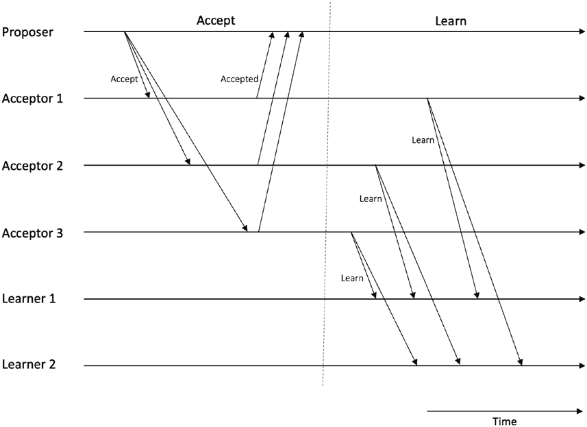

第七章 经典共识

***图 7-4** 多 Paxos - 注意第一阶段，准备阶段，被跳过*

原始 Paxos 是无领导的（也称为对称）协议，而 multi-

Paxos 是领导者驱动的（也称为不对称）。它用于实际系统而不是经典的 Paxos 以实现状态机复制。通常在实现中

提议者，接受者和学习者的角色被收缩为所谓的服务器，它们都可以扮演这三个角色。最终，只有一个客户机-服务器模型出现。有角色

崩溃，稳定领导者和去掉准备阶段，协议变得高效。

和简单的。

Paxos 被视为一个难以理解的协议。这主要是由于

未详细说明。此外，Lamport 描述的原始协议是单一法令

协议，不太实际实现。已经有过几次尝试，这样

与多 Paxos 一样，并且有几篇论文试图解释 Paxos，但总的来说，该协议仍然被认为是有点难以理解和实现的。有鉴于此和其他几个

这些内容，就开发了一种名为 RAFT 的协议。接下来我们介绍 RAFT。

307

第七章 经典共识

**RAFT**

RAFT 设计是为了弥补 Paxos 的缺陷。 RAFT 代表 Replicated And

容错。RAFT 的作者的主要目的是开发一个协议，该协议

容易理解和实现。RAFT 背后的关键思想是实现状态

具有持久日志的机器复制。状态机的状态由此确定

通过持久日志。RAFT 允许集群重新配置，从而实现集群

成员变化而不中断服务。此外，由于日志可能会变得很大

在高吞吐量系统上体积庞大。RAFT 允许日志压缩以缓解这个问题

消耗太多存储空间，并在节点崩溃后重建速度慢。

RAFT 在以下假设的系统模型下运作：

• 无拜占庭故障。

• 不可靠的网络通信。

• 异步通信和处理器。

• 每个节点上都有确定性状态机，从相同的地方开始

每个节点上的初始状态。

• 节点具有不可破坏的持久性存储，具有预写日志

记录，意味着在崩溃之前，任何写入都将完成。

• 客户端必须严格与当前领导者通信。

客户端负责，因为客户端知道所有节点，并且已经

静态配置了这些信息。

RAFT 是一种基于领导人的（不对称的）协议，其中一个节点被选举为领导者。

这个领导者接受客户端的请求并管理日志复制。只能有

在 RAFT 集群中一次只能有一个领导者。如果当前的领导者失败，那么将选举新的领导者。节点（更准确地说是共识模块）担任的三种角色是：

节点）可以在 RAFT 集群中担任的三种角色：领导者、追随者和候选者。

• **领导者**接收客户端请求，管理复制日志，并

管理与追随者的交流。

• **跟随者**节点是被动的，只响应远程

过程调用（RPCs）。它们从不启动任何通信。

• **候选者**是一个节点使用的角色，试图成为

通过请求选票竞选领导者。

308

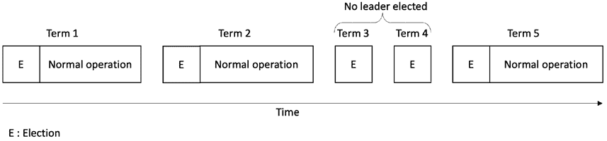

第七章 经典共识

RAFT 中的时间在逻辑上分为任期。一个任期（或时代）基本上是一个

单调递增的值，作为逻辑时钟以实现全局部分

缺乏全局同步时钟的情况下事件的顺序。每个任期都以

选举新领导者开始，其中一个或多个候选人竞争成为

领导者。一旦选举出领导者，它就会一直担任领导者直到任期结束。任期的关键作用是识别陈旧信息，例如陈旧的领导者。每个节点都存储当前的任期号。当节点之间交换当前任期时，将检查

如果一个节点的当前任期号小于另一个节点的任期号；如果是的话，

然后，当前任期号较低的节点更新其当前任期为较大的值。

当候选者或领导者发现自己的当前任期号已过时时，它会将其状态转换为追随者模式。节点收到的任期号过时的任何请求

被拒绝。

任期可以在图 7-5 中可视化。

***图 7-5\.** RAFT 中的任期*

RAFT 协议使用两个 RPC，AppendEntries RPC，由

领导者用于复制日志条目，也用作心跳，并且用于 RequestVote RPC，

由候选者调用以收集选票。

RAFT 由两个阶段组成。第一个是领导者选举，第二个是日志

复制。在第一阶段，选举领导者，第二阶段是

领导者接受客户端的请求，更新日志，并向所有发送心跳

追随者以维持其领导地位。

首先，让我们看看领导者选举是如何工作的。

309

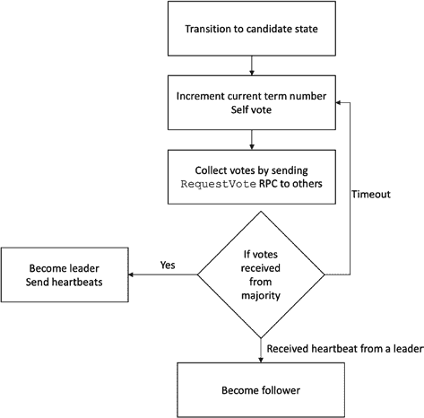

第七章经典共识

**领导者选举**

心跳机制用于触发领导者选举流程。所有节点都启动为追随者。只要追随者不断地接收来自领导者或候选者的有效 RPC，追随者就会继续作为追随者运行。如果追随者在一段时间内未收到领导者的心跳，那么就会发生“选举超时”，这表明领导者已经失败。这

选举超时随机设置为 150ms 至 300ms 之间。

现在追随者节点承担候选者角色，并尝试成为

候选者通过增加当前

任期号，为自己投票，重置选举计时器，通过 RequestVote RPC 从其他节点寻求投票。如果它从大多数节点那里获得了选票，那么它将成为领导者，并开始向其他节点发送心跳，这些节点现在是追随者。如果另一个

候选者赢得并成为有效领导者，那么这个候选者就会开始接收

心跳并会返回到追随者角色。如果没有谁赢得选举和选举

超时发生时，选举过程会以新任期重新启动。

请注意，投票仅在接收者节点响应的情况下被授予

如果候选者的日志至少与接收者的日志同步，则在响应中只有接收者节点会授予投票。

如果收到的任期号低于当前任期，则会回复“false”。

领导者选举的具体流程如图 7-6\. 所示（#p325）

***图 7-6\.** RAFT 领导者选举*

310

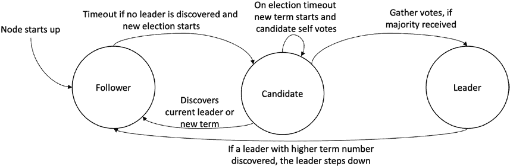

第七章经典共识

一个节点可以处于三种状态；我们可以在状态图中可视化服务器状态

如图 7-7 所示，也展示了领导者选举。

***图 7-7\.** RAFT 中的节点状态*

领导者一旦当选，就准备接收来自客户端的请求。现在日志

复制可以开始。

**日志复制**

RAFT 的日志复制阶段很简单。首先，客户端发送命令/

请求领导者由复制的状态机执行。 领导者

随后为该命令分配任期和索引，以便该命令可以唯一

节点日志中标识。

它将此命令附加到其日志中。 当领导者的日志中有新的条目时，就会

与此同时，它向外发送请求，通过附加条目

RPC 发送到追随者结点。

当领导者能够将命令复制给大多数追随者时

节点，即已确认，该条目在集群上被认为是已提交的。 现在

领袖在其状态机中执行命令，并将结果返回给客户端。 它还通过附加条目的 RPC 通知跟随者条目已经提交，并

跟随者在其状态机中执行提交的命令。 一组来自

图 7-8 所示的五个节点。

311

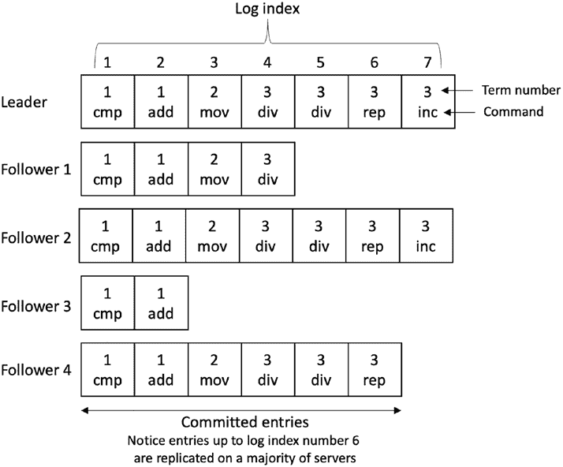

第七章 经典共识

***图 7-8\.** RAFT 节点中的日志*

请注意，直到日志索引号为 6 的条目都在大多数服务器上复制

作为领导者，跟随者 3 和跟随者 4 都拥有这些条目，从而产生了多数 –

五个节点中的三个节点。 这意味着它们已经提交并且可以应用于各自的状态机。 追随者 1 和 3 的日志不是最新的，这可能

可能是由节点或通信链路故障引起的。 如果有崩溃或迟缓的追随者，领导者将通过附加条目的 RPC 一直重试，直到成功为止。

日志复制过程如图 7-9 所示。

312

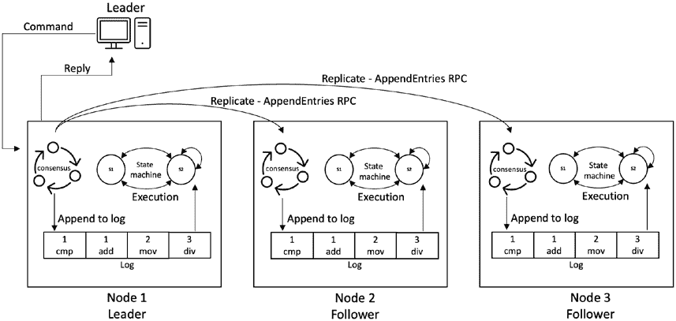

第七章 经典共识

***图 7-9\.** RAFT 日志复制和状态机复制*

当一名追随者接收到附加条目的 RPC 以复制日志条目时，它

检查当前任期是否小于当前任期时，则回复 false。 它仅附加新的

尚未在日志中。 如果现有条目与新条目具有相同的索引，但不同的任期，它将删除现有条目和其后的所有条目。 如果日志没有新条目前立即的日志条目索引位置，则回复 false，但任期匹配。

如果有失败的追随者或候选人，则协议将通过

直到成功。

如果一个命令已经提交，RAFT 集群将不会丢失它。 这是保证

尽管存在诸如网络延迟、数据包丢失、重启或

崩溃故障。 但是，它不能处理拜占庭故障。

每个日志条目包括一个任期号、一个索引和一个状态机命令。

任期号有助于发现日志之间的不一致性。 它给出了一个指示

关于命令的时间。 索引标识日志中条目的位置。 命令是客户端的执行请求。

313

第七章 经典共识

**保证和正确性**

RAFT 提供的保证是

• **选举正确性**

• **选举安全性**：每次最多只能选出一个领袖。

• **选举活跃性**：一些候选人最终必须成为

一个领导者。

• **领导者仅追加**：领导者只能追加日志。没有

允许重写或删除日志中的条目。

• **日志匹配**：如果两个不同服务器上的两个日志具有具有条目

与相同的索引和任期，然后这些日志在所有之前都是相同的

条目，并且它们存储相同的命令。

• **领导者完成性**：在给定的任期内提交的日志条目将

总是出现在将来领导者的日志中，也就是说，领袖

对于更高的序列号术语。此外，具有不完整日志的节点必须

永远不会被选中。

• **状态机安全性**：如果节点在特定的时间应用了日志条目

到其状态机的索引，那么其他节点将永远不会应用不同的

同样的索引的日志条目。

选举正确性需要安全性和活跃性���安全性意味着最多一个

每个任期只允许一个领导者。活跃性要求一些候选人最终必须获胜并成为

最终成为领导者。为了确保安全性，每个节点在本任期中只能投票一次

坚持在存储中。赢得选举需要大多数人；没有两个不同的

候选人将在同一时间得到多数。

在领导者选举期间可以发生分裂投票。如果两个节点同时当选，

那么所谓的“分割投票”就会发生。RAFT 使用随机选举超时来

确保此问题能够快速解决。这很有帮助，因为随机超时允许

只有一个节点在其他节点之前超时并赢得选举。在实践中，

如果随机选择的时间大于网络广播时间，则此功能效果很好。

日志匹配实现了日志之间的高度一致性。我们假设该

领导者不是恶意的。领导者永远不会添加超过一个具有相同索引的条目

和相同的任期。日志一致性检查确保所有先前的条目都是相同的。

领导者跟踪其日志中已提交的最新索引。领导者

314

第七章经典共识

播发此信息在每个 AppendEntries RPC 中。如果跟随者节点没有

与其日志中具有相同索引编号的条目，则不会接受传入的条目。

但是，如果跟随者接受了追加条目的 RPC，则领导者知道

日志在两者上是相同的。日志通常是一致的，除非网络发生故障。在这种情况下，日志一致性检查确保节点最终赶上

并变得一致。如果日志不一致，则领导者将重新传输缺失的条目给之前可能没有收到消息或崩溃并且现在有

恢复。

重配置和日志压缩是 RAFT 的两个有用的特性。我没有

对这些功能进行讨论，因为它们与核心共识协议没有直接相关。你可以参考参考文献中提到的原始 RAFT 论文以获取更多细节。

**PBFT**

记住，我们讨论了口头信息协议和拜占庭将军们

书中问题。虽然它解决了拜占庭协议，但并不是一个

实际的解决方案。口头信息协议只能在同步环境下工作，

和计算复杂性（运行时间）也很高，除非只有一个有故障的

处理器，这是不切实际的。然而，系统在某种程度上表现出了一些通信

和处理器的异步性。非常长的算法运行时间也是

在现实环境中是不可接受的。

1999 年由卡斯特罗和利斯科夫开发了一个实际的解决方案，称为实际的

拜占庭容错（PBFT）。顾名思义，它是一种旨在

在拜占庭错误的情况下提供共识。在 PBFT 之前，拜占庭错误

容错被认为是不切实际的。通过 PBFT，这对证明了切实可行

拜占庭容错首次成为可能。

PBFT 包括三个名为正常运行、视图更改和

检查点。正常操作子协议是指一种在正常运行时执行的机制

当一切运行正常，系统没有错误的时候。视图更改是

当系统中检测到有故障的领导节点时运行的子协议。检查点

用于从系统中丢弃旧数据。

PBFT 协议由三个阶段组成。这些阶段依次运行

完成单个协议运行。这些阶段是预准备、准备和提交，

我们将很快详细介绍。在正常情况下，单个协议运行是

足以实现共识。

315

第七章经典共识

协议以每轮次的形式运行，在每一轮中，一个领导者节点，称为

主节点，处理与客户端的通信。在每一轮中，协议

依次进入前面提到的三个阶段。PBFT 的参与者

协议被称为副本。其中一个副本成为每次领导者的主节点

轮，其他节点充当备份。PBFT 实现了状态机复制，

我们之前讨论过。每个节点维护一个本地日志，并通过共识协议 PBFT 使这些日志保持同步。

到目前为止，我们知道为了容忍拜占庭错误，节点的最小数量

需要的是*n* = 3 *f* + 1（在部分同步环境中），其中*n*是节点数，*f*是故障节点数。只要系统中的节点数保持*n* ≥ 3 *f* + 1\，PBFT 就能确保拜占庭容错。

当客户端向主节点（领导者）发送请求时，会进行一系列操作

之间的副本运行，导致共识并回复给客户。

这个操作序列由三个阶段组成：

• 预准备

• 准备

• 提交

此外，每个副本维护一个包含三个主要元素的本地状态：

• 服务状态

• 消息日志

• 代表该副本当前视图的数字

让我们详细看看每个阶段。

**预准备阶段-阶段 1**

当主节点接收到客户端的请求时，它会为其分配一个序列

请求的序列号。然后，将包含请求的预准备消息发送给所有

备份副本

当备份副本收到预准备消息时，他们检查了几件事情

确保消息的有效性：

• 数字签名是否有效。

• 当前视图编号是否有效，即副本位于

相同视图。

316

第七章 经典共识

• 操作的请求消息的序列号是否有效

有效，例如，如果再次使用相同的序列号，

副本将拒绝序列号相同的后续请求

序列号。

• 如果请求消息的哈希值有效。

• 未收到相同序列号的先前预准备消息

序号和视图，但哈希值不同。

如果所有这些检查都通过，备份副本接受消息，更新其本地

状态，并进入准备阶段。

总而言之，预准备阶段

• 接受来自客户端的请求。

• 为其分配下一个序列号。这个序列号是

请求即将执行的顺序。

• 将此信息作为预准备消息广播给所有备份

副本。

此阶段为客户端请求分配一个唯一的序列号。我们可以将其看作是

将其视为一种应用于客户端请求的排序器。

**准备阶段 – 第 2 阶段**

每个备份副本都向系统中所有其他副本发送准备消息。

每个备份副本等待至少 2 *f* + 1 来自其他副本的准备消息到达。它们检查

• 准备消息是否有一个有效的数字签名。

• 副本与消息中相同的视图中。

• 序列号有效且在预期范围内。

• 消息摘要（哈希）值是否正确。

如果所有这些检查都通过，副本更新其本地状态并转至

提交阶段。

317

第七章 经典共识

总而言之，准备阶段执行以下步骤：

• 仅在副本尚未

接受过相同视图或序列号的任何预准备消息

在之前

• 将准备消息发送给所有副本

该阶段确保网络中的诚实副本就

视图内的请求。

**提交阶段**

每个副本都向网络中的所有其他副本发送一条提交消息

提交阶段。与准备阶段一样，副本等待来自其他副本的 2 *f* + 1 个提交消息到达。副本还检查视图编号、序列号，

数字签名和消息摘要值。如果它们对于来自其他副本的 2 *f* + 1 个提交消息有效，则副本执行该请求，生成结果，并

最后更新其状态以反映提交情况。如果有一些消息排队等待，副本将先执行这些请求，然后再处理最新的序列号。最后，副本会以回复消息的形式将结果发送给客户端。

客户端只有在收到 2 *f* + 1 条包含相同结果的回复消息后才接受结果。

提交子协议的步骤

• 复制节点等待 2 *f* + 1 个相同视图的准备消息，

序列化，并且请求。

• 它发送提交消息给所有副本。

• 它等待 2 *f* + 1 条有效的提交消息到达并被接受。

• 它执行接收到的请求。

• 它发送包含执行结果的回复给客户端。

这一阶段确保了网络中诚实的副本对消息的总排序达成一致

跨视图的客户请求。

实质上，PBFT 协议确保足够的复制节点处理每个请求，所以

以确保处理相同请求的副本顺序相同。

我们可以通过图 7-10 来可视化协议的正常操作模式。

318

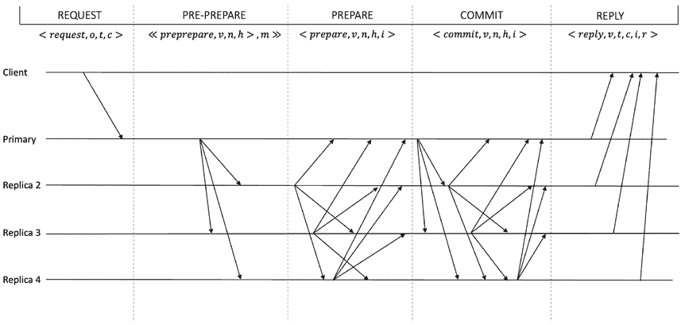

第七章 经典共识

***图 7-10\.** PBFT 正常操作模式*

在协议执行过程中，协议必须维持消息的完整性

消息和操作，传递足够安全和保障水平。数字

签名满足此要求。假设数字签名不可伪造，哈希函数不发生冲突。此外，证书被用来确保参与者（节点）的适当多数。

**PBFT 中的证书**

PBFT 协议中的证书确保了至少有 2 *f* + 1 个复制节点已经存储了所需的信息。换句话说，特定类型的 2 *f* + 1 条消息的集合被视为证书。例如，假设一个节点收集到了 2 *f* + 1

准备消息类型的消息。在这种情况下，结合相应的预准备

具有相同视图、序列和请求的消息代表一份被称为证书的证明，

准备证明。同样地，集合中的 2 *f* + 1 条提交消息被称为提交证书。

319

第七章 经典共识

PBFT 协议要维护的还有几个变量

算法。这些变量及其含义如下所列：

• **v**: 视图编号

• **o**: 客户端请求的操作

• **t**: 时间戳

• **c**: 客户端标识

• **r**: 回复

• **m**: 客户端请求消息

• **n**: 消息的序列号

• **h**: 消息 m 的哈希值

• **i**: 复制节点的标识

• **s**: 稳定的检查点 – 最后

• **C**: 稳定检查点的证书（2f+1 检查点消息）

• **P**: 用于请求的准备证书的集合

• **O**: 待处理的预先准备消息的集合

• **V**: 新视图的证明（2*f + 1 视图改变消息）

现在让我们看一下消息的类型及其格式。这些消息很容易

如果我们参考前面的变量列表就能理解。

**消息的类型**

PBFT 协议工作通过交换多个消息。这些消息的列表是

在表 7-1 和图示中显示。

320

第七章 经典共识

***表 7-1\.** PBFT 协议消息*

**消息**

**来自**

**对**

**格式**

**由…签名**

请求

客户端

主

<请求，o，t，c>

客户端

预准备

主

复制品

<<预准备，v，n，h>，m>>

主

准备

复制品

复制品

<准备，v，n，h，i>

复制品

提交

复制品

复制品

<提交，v，n，h，i>

复制品

回复

复制品

客户端

<回复，r，i>

复制品

视图更改

复制品

复制品

<视图更改，v+1，n，s，C，p，i>

复制品

新视图

主

复制品

<新视图，v+1，V，o>

复制品

检查点

复制品

复制品

<检查点，n，h，i>

复制品

请注意，所有消息都带有数字签名，这使得每个节点可以

辨别生成任何给定消息的复制品或客户端。

**视图更改**

当其他复制品怀疑主复制品有故障时，将发生视图更改

阶段确保协议进展。通过视图更改选择新的主

再次启动正常模式操作。新主是通过轮询选择的

使用公式*p* = *v mod n*来构建这样的*葫芦*，其中 v 是视图号，n 是系统中节点的总数

当备份复制品接收到请求时，它会在验证后尝试执行请求

消息，但是出于任何原因，如果它一段时间内没有执行

在视图更改期间，复制品停止接受与当前

视图并将其状态更新为视图更改。在此状态下它只能接收*检查点*、*视图更改*和*新视图*消息。之后，它向所有复制品广播下一个视图号的视图更改消息。

当此消息到达新主时，主等待至少 2 *f*个视图更改消息，以进行下一个视图。如果获得至少 2 *f* + 1 个视图更改消息，则向所有复制品广播新视图消息，并运行正常操作模式

再次。

321

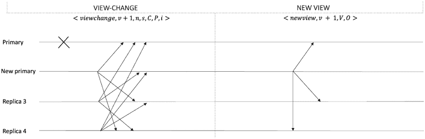

第七章 经典共识

当其他复制品接收到新的视图消息时，它们会更新其本地状态

并开始正常操作模式。

视图更改协议的算法如下：

1\. 停止接受预准备、准备和提交消息

当前视图

2\. 构建到目前为止准备的所有证书的集合。

3\. 向所有复制品广播具有下一个视图号和

所有已准备的证书的集合发送给所有复制品。

图 7-11 说明了视图更改协议。

***图 7-11\.** 视图更改协议*

视图更改子协议是实现活性的一种手段。三个巧妙的技术

在这个子协议中使用，以确保：

1\. 已广播视图更改消息的复制品等待

2f+1 视图更改消息，然后启动其计时器。如果计时器

在节点接收下一个视图消息之前过期

视图，节点将开始为下一个序列启动视图更更

但增加其超时值。如果

在执行新的唯一请求之前，复制品超时

新视图

2、一旦复本收到了 f+1 个视图变更消息

视图编号大于其当前视图的复本将发送

对其知道的最小视图发送视图变更消息

322

第七章 经典共识

设置得足够早，以确保下一次视图变更不会发生得太晚。

即使定时器尚未到期，它仍将发送

最小视图的视图变更。

3、只要至少 *f* + 1 个复本接收到

发送了视图变更消息后，这个机制会保证

有缺陷的主体不能无限制地通过连续

请求视图变更。

在繁忙的环境中特别容易出现存储成为瓶颈的情况。要

解决这个问题，PBFT 协议中使用了检查点。

**检查点子协议**

检查点是一项关键的子协议。它用于丢弃日志中的旧消息

所有复本。通过这个，复本们就能对一个提供全局状态快照的稳定检查点达成一致意见。这是每个复本在执行请求并将其标记为日志中的检查点后进行的周期性过程。

称为“低水位标记”（在 PBFT 术语中）用于记录最后一个稳定

检查点序列号。这个检查点会广播给其他节点。一旦

一个复本至少有 2 *f* + 1 个检查点消息，它会把这些消息保存作为稳定检查点的证明。它会丢弃之前的 pre-prepare、prepare 和 commit 消息

从日志中删除。

**PBFT 的优点和缺点**

PBFT 是一个开创性的协议，引入了一个实用的新研究领域

拜占庭容错协议。原始的 PBFT 具有许多优点，但也有

有一些弱点。我们接下来介绍这些。

**优点**

• PBFT 提供即时和确定的交易最终性。在

在 PoW 协议中，需要多个确认

以很大概率完成交易。

• 与 PoW 相比，PBFT 也是节能的，后者消耗了

大量的电力。

323

第七章 经典共识

**弱点**

• PBFT 不太具有伸缩性。这一限制是它更适合

对财团网络比公共区块链更适用。不过，

比 PoW 协议快得多。

• Sybil 攻击可能在 PBFT 网络上执行，一个

单一实体可以控制许多身份来影响投票，并且

因此，决定。

• 高通信复杂性。

• 不适用于具有匿名参与者的公共区块链。

PBFT 保证安全性和活性。让我们看一下。

**安全性和活性**

活性意味着如果消息

交付延迟并不会比时间本身增加得更快，而是无限期地增加。换句话说，如果延迟比超时阈值慢增长，协议会确保进展。

腐败的主体可能故意引发延迟。然而，这种延迟不能太大

超时值并重新启动其视图更改计时器。这个想法是超时计时器

每当复制品收到请求时。假设在请求被执行之前复制品超时；复制品怀疑主复制品并广播视图更改

一旦*f* + 1 个复制品怀疑主体有故障，所有诚实的复制品都会进入视图更改过程。

只要不超过

将等待时间加倍以等待更长时间，因为消息延迟可能会更长

应该是无限的，因为每个诚实的复制品都有一个视图更改计时器。这个计时器开始

复制品都有缺陷，并且

具体。最终，计时器值会变得大于消息延迟，这意味着

消息延迟不会增长得比时间本身更快。这意味着协议将

使系统停止运行。这是因为只有一名诚实的复制品在满足以下两个条件后才参与视图更改。

第七章经典共识

最终会进展到前面两个条件。这种弱同步性

复制品等待 2 *f* + 1 个视图更改消息并启动一个计时器来开始一个新视图，以避免过早地开始视图更改。同样，如果一个复制品接收到大于当前视图的视图的*f* + 1 个视图更改消息，它会广播一个视图更改。

消息最终会在计时器到期之前到达。这个机制确保

 *n* −1

324

the FLP result。这里的一个聪明的技巧是，如果视图更改计时器在一个复制品收到预期新视图的有效新视图消息之前到期，该复制品会将

下一个复制品将接管为主体，协议将前进。

假设更接近于现实环境并使系统能够回避

此场景将导致一个视图更改，

相同的总排序，即在所有阶段以相同顺序执行相同请求。

收到的至少*f* +1 个视图更改消息执行对应客户端请求。由于至多有*f*个有故障的复制品，只有 f 个复制品在所有诚实复制品存活时无法引起视图更改，而

protocol is making progress。换句话说，至多*f* 个连续的主副本可能存在故障，系统在进行至多*f* + 1 次视图更改后最终取得进展。

最终在所有诚实的复制品上会有一个新视图，协议将取得进展。

这样可以防止下一个视图更改开始得太晚。

安全性要求每个诚实的复制品根据

此外，拜占庭主体无法连续进行频繁的视图更改以减慢系统。

如果节点总数为 3 *f* + 1，则假设 PBFT 是安全的\. 在这种情况下，可以容忍 f 个拜占庭节点。

让我们首先回顾一下什么是关于法定人数交集。如果有两组，比如 S1 和 S2，

每个至少有 2 *f* +1 个节点的节点中获得准备好的证书，那么总是有一个正确的节点在 *S* 1 ∩ *S* 2 中。这是因为如果有两组至少有 2 *f* + 1 个节点，并且总共有 3 *f* +1 个节点，然后鸽巢原理意味着 S1 和 S2 的交集将至少包含 *f* + 1 个节点。由于至多 *f* 个故障节点，所以交集， *S* 1 ∩ *S* 2 必须包含至少 1 个正确的节点。

PBFT 中的每个阶段必须获取 2*f* + 1 证书/选票才能被接受。结果显示，至少有一个诚实的节点必须在相同的序列号上投两次票才能导致

一种安全违规，这是不可能的，因为一个诚实的节点不能恶意投票。

换句话说，如果相同的顺序号被一个

恶意的主体来违反安全性，那么至少有一个诚实的副本会因为有交叉的选区属性而拒绝它。这是因为一个 2 *f* + 1 的选区意味着至少有一个诚实的相交副本。

提交阶段确保甚至在视图间也实现了正确顺序。如果一个

视图更改发生时，新的主要副本从 2*f* +1

副本，这确保新的主体获得至少一个准备好的证书。

每个由正确副本执行的客户端请求。

325

第七章 经典一致性

**视图内的排序**

如果一个副本在一个视图和一个独特的准备好的证书内获得了一个请求

序列号，那么没有副本可以为不同的请求获得准备好的证书

具有相同的视图和序列号。副本只能得到一个准备好的证书

对于相同的请求和相同的视图和序列号。

想象两个副本已经为两个不同的请求收集了准备好的证书

具有相同视图和序列号。我们知道准备好的证书包含

2f+1 条消息，这意味着一个正确的节点必须发送了一个预准备或

由于存在交叉选区，因此无法为具有相同序列和视图的两个不同请求准备两个不同的请求

选区交叉。但是，一个正确的副本只会发送一个预准备

对于每个视图和序列，也就是说，当一个序列号总是增加时。

主要接收到客户端请求并分配给该请求。此外，正确的副本仅在每个视图和序列中发送一个准备消息。它发送一个

仅当它没有接受任何相同视图的预准备消息时，才接收准备消息

或序列号。这意味着准备必须是相同的请求。

这实现了视图内的顺序。

**视图间的排序**

该协议确保，如果一个正确的副本在一个特定序列号的视图中执行了客户端请求，那么没有一个正确的副本会执行任何其他顾客

任何未来视图中或当前视图中具有相同序列号的请求。换句话说

字样，每个由诚实副本执行的请求必须在下一个视图中

具有先前分配给它的相同顺序。

我们知道如果一个诚实的副本收到了 2 *f* + 1 的提交消息，那么请求只会在副本上执行。假设一个诚实的副本已经获得了 2 *f* + 1 的提交消息。这意味着客户端请求必须至少在*f* + 1 个诚实的副本上准备，并且每个副本都有一个准备证书，所有之前的客户端

请求。我们也知道这些 *f* + 1 诚实的副本中至少有一个会参与视图更改协议，并报告这些请求以及它们的证书。这

意味着请求在新视图中始终携带相同的序列号。

这完成了我们对 PBFT 的讨论。但是，这是一个广阔的课题，你可以

进一步探索原始论文和论文以获得更多信息。

326

第七章 经典共识

**区块链和经典共识**

我们可以在区块链中实施经典算法。但挑战在于

修改这些协议，使它们适用于区块链实现。该

核心算法保持不变，但某些方面被改变以使协议

适用于区块链。一个问题是这些传统共识算法是为可知和可识别的所有参与者的许可环境设计的。但

区块链网络是公开和匿名的，例如，比特币和以太坊。

因此，经典算法主要适用于许可链

企业使用情景的网络，所有参与者都是已知的。另外，区块链

网络环境是拜占庭式的，那里可能有恶意行为者试图偏离

协议。而 Paxos 和 RAFT 是不适合拜占庭的 CFT 协议

环境。因此，这些协议需要被修改为 BFT 协议

耐受拜占庭错误，或需要使用不同的 BFT 协议。这些 BFT

协议可以修改现有的经典 CFT 或 BFT 协议，也可以是

专门为区块链从头开始开发。试图修改现有的

适用于区块链的经典协议是 IBFT，我们将在以下介绍

在第[8](https://doi.org/10.1007/978-1-4842-8179-6_8) 章中介绍。我们将在下一章更多地讨论区块链协议。

动态成员资格（重新配置）和使用快照的日志紧缩是

RAFT 支持的两个非常有用的特性。这两个特性尤其

在联盟链中很有用。随着时间的推移，区块链可以显著增长

大，并且快照是处理该存储问题的一种有用方式。另外

成员管理可以是一个有用的功能，其中一个新的财团成员

可以以自动化方式接入。然而，RAFT 只是 CFT，这是

不太适合联盟链。然而，引入拜占庭故障

在 RAFT 中可以容忍拜占庭错误，正如 Tangaroa 所示 - RAFT 的 BFT 扩展。一些

issues 但是在 Tangaroa 中有报道，但完全可以构建一个 BFT 版本

RAFT 的公正。此外，这两个特性可以在 PBFT 变体中实现

用于区块链网络。PBFT 的变体包括 IBFT、HotStuff、LibraBFT 等

其他很多。

327

第七章 经典共识

**摘要**

在本章中，我们涵盖了许多主题，包括视图复制，

实际的拜占庭容错、RAFT 和 Paxos。Paxos 和视图复制

它们非常重要，因为它们提供了历史上非常基础的想法

分布式共识问题。Paxos 尤其提供了正式描述

和协议正确性的证明。VR 与多 Paxos 有相似之处。RAFT 是一种

Paxos 的改进。实际上，PBFT 被视为 Paxos 的拜占庭容错版本，尽管 PBFT 是独立开发的。

这一章作为理解经典协议的基础

区块链年代的协议。许多想法源于这些经典

导致了新的区块链协议的发展。

**参考文献**

1\. Google TechTalk，2018 年 2 月 2 日，Luis Quesada Torres 主讲。

[`youtu.be/d7nAGI_NZPk`](https://youtu.be/d7nAGI_NZPk)

2\. Lindsey Kuper 关于分布式系统的讲座[: https://youtu。](https://youtu.be/fYfX9IGUiVw)

[be/fYfX9IGUiVw](https://youtu.be/fYfX9IGUiVw)

3\. 巴希尔（Bashir，I.），2020 年。 《区块链技术深度探究: 在历史中提供非常基础的重要概念》

分布式分类账、共识协议、智能合约、DApp 等，

加密货币、以太坊等。Packt Publishing Ltd.

4\. Bully 算法[: https://en.wikipedia.org/wiki/Bully_](https://en.wikipedia.org/wiki/Bully_algorithm)

[算法](https://en.wikipedia.org/wiki/Bully_algorithm)

5\. 赵乌，2014 年。建立可靠的分布式系统。约翰

Wiley & Sons。

6\. 独特的领导者选举等同于解决共识- 格雷，

J.和 Lamport，L.，2006 年。《交易提交的一致性》。ACM

数据库系统交易（TODS），31（1），pp. 133–160。

7\. 领导者选举算法- Aguilera，M.K.，Delporte-Gallet，

C.，Fauconnier，H.和 Toueg，S.，2001 年 10 月。稳定领导者

选举。在国际分布式计算研讨会

（pp. 108–122）。Springer，柏林，海德堡。

328

第七章 经典共识

8\. [`en.wikipedia.org/wiki/Paxos_(计算机科学)`](https://en.wikipedia.org/wiki/Paxos_(computer_science))

9\. 阿斯普内斯（Aspnes，J.），2020 年。《分布式系统理论笔记》。arXiv

预印本 arXiv：2001.04235。

10\. Howard，H.，2014 年。ARC：Raft 共识分析（编号 UCAM-

CL-TR-857）。剑桥大学，计算机实验室。

11\. Ongaro，D.和 Ousterhout，J.，2015 年。Raft 共识算法。

12\. Ongaro，D.和 Ousterhout，J.，2014 年。寻找一个

可理解的共识算法。2014 年 USENIX 年度

享技术大会（Usenix ATC 14）（pp. 305–319）。

13\. Tangaroa 问题：Cachin，C.和 Vukolić，M.，2017 年。区块链

野生状态的共识协议。arXiv 预印本 arXiv：1707.01873。

14\. 到拜占庭

容错性。在 *复制* (pp. 121–149). Springer, Berlin,

海德堡。

15\. Wattenhofer, R., 2016\. *区块链的科学*. Inverted

Forest Publishing.

329

**第八章**

**区块链时代协议**

本章涵盖了区块链时代协议。一些新颖的协议和一些变体

古典区块链共识协议在[第七章](https://doi.org/10.1007/978-1-4842-8179-6_7). 我们开始讨论以太坊，并在本章讨论 Solana。在此过程中，我们将

在详细介绍在诸如 Cosmos、以太坊 2.0 和

Polkadot.

在第五章中我们已经详细讨论了工作证明，所以我这里不会重复了；但是，以太坊的 PoW 会在本章讨论。

**介绍**

共识协议是任何区块链的核心。一类新的共识协议随着比特币的出现而出现。因此，我们可以将所有共识协议归类为

随着比特币的出现和之后的区块链，它们被称为“区块链时代共识协议。”

区块链中共识协议的主要目标是实现一致性和进展的协议

对区块链状态的一致。状态通常指的是区块链的值、历史和规则。对区块链的规范历史达成一致很重要，对链的治理规则达成一致也很重要。此外，对添加到链上的值（数据）的一致也很重要。

基本上是至关重要的。

与传统的区块链前协议一样，安全性和活跃性是两个关键属性

由共识协议需满足以确保一致性和进展

区块链。

区块链共识协议可以分为两大类：概率

概率最终性协议和绝对最终性协议-换句话说，

概率终止协议和确定终止协议。

概率协议在加密货币公共区块链中广泛使用

如以太坊和比特币。确定性协议通常来自 BFT 类

331

© Imran Bashir 2022

I. Bashir，*区块链一致性*，[`doi.org/10.1007/978-1-4842-8179-6_8`](https://doi.org/10.1007/978-1-4842-8179-6_8#DOI)

第八章 区块链时代协议

协议，在企业区块链中通常使用；然而，它们也

在一些公共区块链中使用。而 PBFT 变体更常用于

企业区块链，它们在公共链的使用仅局限于一些

共有区块链。例如，Solana 中使用的 TowerBFT 是一个确定性最终性

共识协议。EOSIO 中使用的 BFT-DPOS 就是另一个例子。确定性的最终性

也被称为*前向安全*，一旦交易完成，将提供保证不会被回滚。

从共识算法是如何工作的角度考虑，区块链或

分布式账本基于以下一种或组合类型

共识算法：

• **基于 PoW 的**：比如比特币中的中本聪共识，依赖于

通过 brute force 解决数学难题。

• **基于领导者的**：比如通常的 BFT 协议，其中领导者充当

区块/值的首要提议者。

• **基于投票的**：通常适用于 BFT 协议，其中领导者

从追随者那里收集投票以最终确定决策。也称为

“基于法定人数”的。

• **虚拟投票**：通常，在 BFT 协议中，投票是复杂的

从通信角度看，每个投票者都必须发送

领导者收到领导者的几条信息。虚拟投票是一种技术，可以

在 Hedera 中使用的 Hashgraph 算法，其中对投票进行了评估

通过查看 Hashgraph 的本地副本而不是复杂的

与其他节点通信。这个过程最终会导致

达成拜占庭协议。

• **基于经济的**：比如依赖于股份证明机制的机制

在网络中抵押的利益。

在比特币问世后，许多区块链涌现出来，并出现了替代的 PoW 算法

被引入，例如莱特币。由于 PoW 消耗大量能源，

社区很早就感到需要设计一些不过度消耗能源的替代方案。在引入消耗较少能量的协议之后，

开发人员引入了股权证明。通过 PoS，可持续公共区块链

网络变得可能。但是，也存在一些挑战和注意事项。

研究 PoS 的工作原理之后，我们将讨论这些限制。

332

第八章 区块链时代的协议

**股权证明**

尽管比特币的 PoW 已被证明是一种弹性和健壮的协议，但它有一些局限性：

• 能源消耗过高

• 区块生成速度缓慢

• 由于需要专门设备

硬件和大型矿池，变得集中化

• 不适合大多数应用的概率最终性

• 不是完美的共识算法，存在一些攻击，例如，

高前需要的攻击，51%的攻击

• 入门门槛越来越高，因为特殊硬件

需要挖掘的要求

• 不够可扩展，无法支持常见的高吞吐量应用程序

已经进行了重要研究，以解决上述弱点。

特别是，由于前面提到的限制，高能耗导致了

开发替代方案。股权证明就是这样一种替代方案。

股权证明最早出现在 2012 年的 Peercoin 中。后来，许多区块链采用了

例如 EOS、NxT、Steem、Tezos 和 Cardano 等项目。此外，以太坊，

随着其 Serenity 版本的发布，以后将很快过渡到基于 PoS 的共识机制。

股权证明也被称为虚拟挖矿。这是因为在 PoS 中，不需要矿工分配计算资源来解决谜题，而是需要产生

下一个区块的决定是基于矿工所拥有的价值。这个有价值的

所有权可以是任何有价值的东西（通常是硬币），与利益一致

网络。PoW 的座右铭是一个 CPU = 一票，而我们可以认为 PoS 是一枚硬币

= 一票。

下一个提议者通常是随机选出的。提议者会得到激励

需要是交易手续费或区块奖励。像 PoW 一样，通过拥有网络大部分

通过控制大部分押金来攻击和控制网络形式。

PoS 协议通常选择利益相关者，并基于其授予相应的权利

押在资产上。押金计算是特定于应用程序，但通常基于

总余额、存款价值或验证者之间的投票。一旦确认押金

333

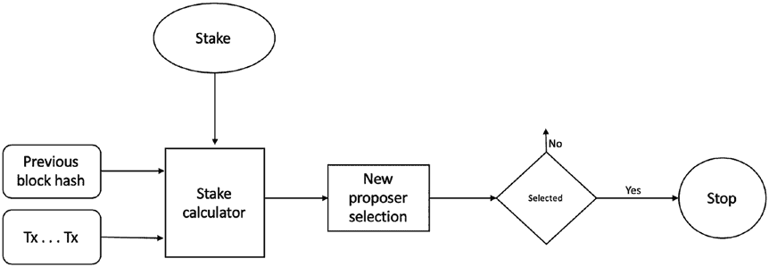

第八章区块链时代协议

计算和选举成为区块提议者，提议者提议的区块会被立即接受。押金越多，下一个提议区块的机会越大。

PoS 方案的一般方案如图 e 8-1\.所示

***图 8-1\.** 权益证明方案*

如图 e 8-1 所示，PoS 使用押金计算器函数来计算押金金额，并且基于此选择新的提议者。

下一个提议者通常是随机选出的。提议者会得到激励

需要交易手续费或区块奖励。通过拥有网络大部分的控制

需要大部分押金来攻击网络。

选择过程中引入了一些随机性元素，以确保

公平性和分散化。选举提议者的另一个因素是代币的年龄，这考虑了押在账户中的代币已经花费了多久; 

票据未花费的时间越长，当选的机会越大。

有几种 PoS：

• 链式 PoS

• 基于 BFT 的 PoS

• 基于委员会的 PoS

• 委托权益证明

• 液体权益证明

334

第八章区块链时代协议

**链式 PoS**

这个方案是首次提出的 PoW 的替代方案。它首次在 2012 年的 Peercoin 中使用.

这个机制类似于 PoW; 但是，区块生成方法被改变了，这

完成两个步骤来定稿区块:

• 从内存池中选择交易并创建

候选区块。

• 建立具有恒定滴答间隔的时钟。在每次时钟滴答时，检查

区块头部与时钟的哈希

时间小于目标值和押金值的乘积。

我们可以将这个简单的公式表示如下:

*Hash*（*B*

) <

×

*h* || *时钟时间*

*e 目标押金*

*e*

押金价值取决于算法的运行方式。在某些链中，它是

与押金数量成比例。在其他情况下，它是基于时间的

参与者所持有的押金。目标是每单位押金价值的挖矿难度。

该机制使用哈希谜题，就像 PoW 一样。但是，与解决竞争不同

通过消耗大量能量和使用专门的硬件，散列

PoS 中的谜题只在定期的时钟间隔内解决。一个哈希谜题变成了

从而更容易地解决如果矿工的股份价值更高。这与需要重复的 PoW 对比

**基于委员会的 PoS**

在这个方案中，一组利益相关者通常是随机选择的，通常使用可验证的

随机功能(VRF)。VRF 基于他们产生一组随机的利益相关者

股份和区块链的当前状态。被选择的利益相关者组成

负责按顺序提出区块。

一般方案的操作方式如下：

第八章区块链时代协议

一般方案描述如下：

•验证者加入网络并存入股份。

•参与委员会选举过程并继续检查

轮流。

•该轮到您时，收集交易，生成区块，附加

链中的新区块，并最终广播该区块。

• 在其他接收节点上，验证区块；如果有效，则附加

将区块添加到区块链并向其他人传播该区块。

委员会选举为验证者产生一个伪随机的轮次序列

生成区块。Ouroboros Praos 和 BABE 是委员会常见的例子-

PoS。

暴力的散列是需要解决数学谜题的工作。

在这个方案中，区块是使用股权机制生成的，其中一个区块

根据股权的提名者被选择出来，提出新的区块。提议者

是基于系统存放的股份选择的。被选中的机会是

正比于系统中存入的股份数量。提议者生成一个

区块并将其附加到 BFT 协议最终确定的临时区块池中

一个区块。

第八章区块链时代协议

•根据 PoS 机制选择提议的区块，与

一种股权。

•提出者：提出一个新的区块，添加到临时的区块池中，并且

广播新的区块。

• 接收者：其他节点接收到这一点时，它们会验证该区块，并且

**基于 BFT 的 PoS**

•在共识纪元期间

•运行 BFT 共识来最终确定一个有效（得到最多投票）的区块。

•将得票最多的有效区块添加到主区块链。

•从临时区块池中删除其他区块。

336

此外，区块会立即完成。

Cosmos 中的 Tendermint 是一个例子，其中验证者是根据

股份，协议的其余部分基于 BFT 原则运作。其他示例包括

堡垒地。

基于 BFT 的 PoS 在至少三分之二的验证者保持诚实的情况下是容错的。

如果有效，将其添加到本地临时区块池中。

**委托 PoS**

DPoS 的工作方式类似于 PoS，但一个关键的区别在于投票和代表

机制，鼓励用户保护网络。DPoS 限制了

所选的共识委员会，这减少了通信复杂性

协议。共识委员会由所谓的代表组成，他们是由选出的

一种委托机制。这个过程是由利益相关者通过投票选出代表

利用他们的赌注。代表（也称为见证人）是可识别的，选民知道

他们是谁，从而降低代表们的不端行为的机会。此外，声誉-

基于机制可以实施，使代表根据

他们提供的服务和他们在网络上的行为。代表可以代表

他们自己为了赢得更多票数。得到最多票数的代表成为成员

共识委员会或组。通常，一个 BFT 风格的协议在

被选择的共识委员会的成员制作和最终确定区块。每个

成员可以轮流提出下一个区块，但这种活动

仍然留在选举的共识委员会中。代表获得激励来产生

区块。同样，在 BFT 假设下，共识委员会内部的协议

可以容忍一个 3f+1 成员组中的 f 个错误。换句话说，它可以容忍三分之一

或有 33%的代表是有故障的。这一协议提供即时的最终性和激励。

与利益相关者的赌注相匹配。由于网络范围内的共识不是

需要并且只有一个更小的代表团队监督做决定，效率

增加显着。委托 PoS 实施在 EOS、Lisk、Tron 等许多其他链中。

**流动 PoS**

LPoS 是 DPoS 的一个变种。代币持有人将他们的验证权委托给验证者

无需转让代币的所有权。存在一种委托

代表竞争成为被选中的验证者的市场。在这里，竞争

337

第八章 区块链时代协议

主要集中在费用、提供的服务、声誉、支付频率及可能的其他因素上

因素。任何像收取高费用的验证者这样的错误行为是可以迅速检测到的

且将受到相应的处罚。代币持有者也可以自由转移到任何其他

验证者。LPoS 支持动态数量的验证者，与 DPoS 的固定数量对比

验证者组。代币持有人也被允许成为自己的验证者，通过自我-

选举。拥有少量代币持有者可以委托给拥有更多代币持有者。此外，一个

多个小代币持有者可以组成一个联盟。这种“流动”协议允许更多

比其他 PoS 协议更具灵活性，并能帮助阻止创建游说团体成为固定的验证者组。LPoS 被用在 Tezos 区块链中。

有一些针对 PoS 的攻击，例如无所作为攻击，远程攻击

攻击和赌注磨攻击。我们将这些攻击解释如下。

**攻击**

PoS 通常存在着一个免费模拟问题，其中对手可以

模拟链的任何历史，而不会带来任何额外成本，与

PoW 其中成本是计算能力。这种无成本的区块生成是

在 PoS 中存在许多攻击。

**无所谓问题**

当出现多次分叉时，就会出现无所谓或双重下注问题。 

攻击者可以在每个分叉的顶部产生一个块，而不需要额外的成本。 为了解决

这个问题，协议中引入经济处罚，以防止攻击者

发动此攻击。 如果有大量的节点这样做，那么即使持有的令牌少于 50% 的攻击者也可以发动双重花费攻击。 

**长距离攻击**

长距离攻击由于弱主观性和无成本模拟而存在。 长距离

由于无成本模拟，攻击也是可能的，其中对手会创建

以试图接管主链的目标开始了新的分支 

链 ，一旦坏链比真正的主链长了。 这可能创造出一个

对网络造成破坏 ，因为它可能导致诚实的验证者浪费资源。 

弱主观性问题影响新节点和长时间离线的节点

长时间并重新加入网络。 由于节点不同步并且有

338

第八章 区块链年代协议 

可用多个分叉 ，这些节点无法区分

哪个节点是正确的，哪个是恶意的; 他们可能接受一个

恶意的分叉也被视为有效。 

**其他攻击**

**生命周期否定** 是 PoS 可以遭受的另一种攻击。 在这种攻击中，一些或所有验证器共同决定停止验证区块，导致区块停滞的结果

生产。 协议对此类活动进行惩罚可以预防这些类型的攻击。 

自私挖矿 或阻止攻击当对手开采他们自己的

自己的链离线。 一旦链长度达到期望的长度，对手将该链发布到网络上，期望坏链将接管主要的好

链 。 它可以在网络上造成中断，因为它可能导致诚实的验证者浪费资源。 

在 PoS 上发生 **磨攻击** ，如果 slot leader 选举过程不是随机的。 如果在这个过程中没有引入随机性，那么 slot leader 可以增加频率

一直自己选举，结果可能导致审查或不成比例 

奖励。解决这个问题的简单方法是使用一些良好的随机选择过程，通常是

基于可验证随机函数（VRFs） 。

接下来，我们讨论以太坊的工作证明—— Ethash 。 

**以太坊的工作证明**

我们在 Chapt[er 5](https://doi.org/10.1007/978-1-4842-8179-6_5) 详细讨论了比特币的 PoW 。 在本节中，我们将看到 ETHASH 的工作原理，以太坊使用的 PoW 。 

Ethash 是 Dagger-Hashimoto 算法的发展形式。 基本想法

采矿是找到一个随机数（任意随机数），一旦连接

与块头部和哈希的当前网络

困难级别。 最初，以太坊刚起步时，困难很低，甚至是 CPU

单个 GPU 挖矿在一定程度上是有利可图的，但现在不再是这样了。

现在只有合并挖矿或大型 GPU 挖矿场用于有利可图的挖矿

目的。

Ethash 是一种内存密集型算法，这使得它难以实现在

专用硬件要求 ASICS 上具有大型和快速内存，

这通常是不切实际的。

339

第八章 块链年龄协议

注意，有相当长的时间，Ethash 的内存硬度防止了

ASIC 的发展，但现在各种 ASIC 挖矿机器可用于以太坊挖矿。

此算法需要一种称为有向无环图的固定资源的子集。

（DAG），取决于 nonce 和区块头。

DAG 是一个大型、伪随机生成的数据集。该图被表示为

DAG 文件中创建的矩阵。 Ethash

算法将 DAG 转换为 32 位无符号整数的二维数组。挖矿

只有当 DAG 首次完全创建时，挖矿节点才会开始。

此 DAG 被 Ethash 算法用作种子。 Ethash 算法需要

DAG 文件的工作。每个时代生成一个 DAG 文件，30,000 个区块。DAG 线性增长

随着链的增长。

协议的工作方式如下：

• 从最新区块的头和一个 32 位随机 nonce

用 Keccak-256 哈希函数组合。

• 这产生一个称为 mix 的 128 位结构，该结构确定了

数据，也就是一张 128 字节的页，从 DAG 中选择。

• 一旦数据从 DAG 获取，它就会与混合一起“混合”以

产生下一个 mix，然后用它从 DAG 获取数据

然后再次混合。这个过程重复 64 次。

• 最终，第 64 个 mix 通过摘要函数运行以产生一个

32 字节序列，称为 mix 摘要。

• 这个序列与难度目标进行比较。如果小于

难度目标，nonce 有效，PoW 已解决。作为

结果是，区块被挖出。如果没有，那么算法将重复执行

新 nonce。

我们可以在图 8-2\. 中可视化这个过程

340

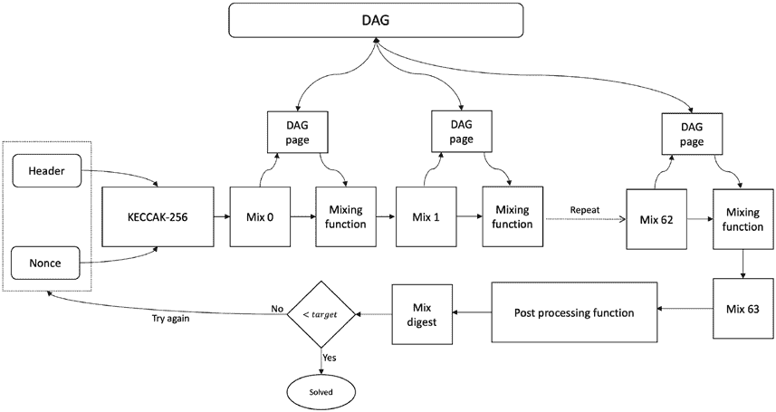

第八章 块链年龄协议

***图 8-2\.** Ethash 过程*

Ethash 有几个目标：

• 该算法几乎消耗了所有可用内存访问

带宽，这是一种 ASIC 抗性措施。

• 使用 GPU 进行 Ethash 挖矿更容易进行。

• 轻客户端可以更有效地验证挖矿轮次，并且应该

能够快速投入运行。

• 由于轻客户端运行速度非常慢，所有该算法在轻客户端上都无法

预期的挖掘。

随着以太坊执行层（曾称为 Eth1）向共识演进

层（以前的以太坊 2），此 PoW 最终将淘汰。当前 EVM

链被纳入信标链，即所谓的“合并”发生，Casper FFG 将在 PoW 之上运行。然而，最终，Casper CBC，纯 PoS 算法，

最终接管。

此外，随着冰河时代的到来，由于

由于“冰河时代”引起的极高的难度，用户将别无选择，只能转向 PoS。

341

第八章区块链时代协议

**Solana**

Solana 是一个在 2018 年推出的具有智能合约支持的第 1 层区块链。

Solana 的开发人员旨在提高速度，安全性，可扩展性和分散性。 在

写作时间，它处于 Beta 阶段，并且快速增长。 尽管这是一个具有生产系统的运行网络，但其中存在一些技术

正在解决的问题。

分类帐是一个可以验证的延迟函数，其中时间是一种数据结构，即数据

是时间。 它可能支持数百万个节点，并利用 GPU 进行加速。 SOL

币是该平台上用于治理和激励的本地代币。 该

主要创新包括以下内容。

历史证明（PoH）使用基于数据结构的事件排序

导致共识的密码时钟，而不是外部时间来源。 由此导致

TowerBFT 是一种从 PBFT 派生的共识协议。 请注意，PoH 不是

共识协议，它只是一种启用使用基于数据的事件排序

结构为基础的时钟。 仍然需要一种共识机制来使节点投票

在分类帐的正确分支上。

涡轮是另一种创新，使得区块以小块传播

名为碎片，这有助于实现速度和效率。 没有内存池

在 Solana 中，交易处理得如此之快，以至于不会形成内存池。 这

机制被命名为 Gulf stream。

Solana 支持智能合约的并行执行，这又导致

效率收益。

交易以所谓的优化方式进行验证

存储在验证器内的事务处理单元。

Cloud break 是一个名称，用于横向扩展的数据库。 最后，

存储在分布式分类帐存储器中的存档或复制程序节点，如在

高吞吐量系统，例如 Solana 数据存储可能成为瓶颈。 为此

目的，使用了受激励存储的存档者。

因为我们的主要重点是共识算法，我将不介绍

区块链在这里，我们接着讨论实际共识和相关

Solana 的机制。

Solana 使用股权证明和 TowerBFT 共识算法。 其中的其中一个

Solana 的创新是历史证明，它不是一种共识算法，但允许

创建自洽的事件记录，证明某个事件发生在之前

并且在某个时间点之后。 这随后导致共识。 它有助于减少

342

第八章区块链时代协议

BFT 协议中的消息复杂性，实际上通信被替换为

本地计算。 这立即导致高吞吐量和亚秒级的最终性

时间。长期以来，分布式系统研究界一直知道，如果

某种程度上，通信可以被本地计算所替代，那么显著

可以实现性能，而且许多时钟同步协议应运而生

结果。然而，通常所有这些都依赖于一个外部时间来源，要么通过原子时钟或 GPS，然后使用 NTP 类型的协议进行同步。PoH 是一个

用于在事件之间以密码方式证明顺序和时间的证明

依赖外部时间源。

**历史证明**

如第[1 章](https://doi.org/10.1007/978-1-4842-8179-6_1)所讨论的，分布式系统中的时间至关重要。如果进程间的时间是同步的，也就是说，在分布式网络中有一个同步的时钟，那么通信就可以减少，这会导致性能提升。一个节点可以

推断过去事件的信息，而不是反复询问另一个节点

一些信息。例如，当所有节点都有全局时钟可用

同步，系统可以建立一个系统范围的事件历史概念。

例如，事件上的时间戳可以告诉一个节点这个事件发生在

引用网络范围内的全局同步时间，而不是询问一个节点

再次，当这个事件发生时，谁产生了这个事件。

同步时钟的另一个应用是，系统中的实体可以推断

如果某些东西已经过期，比如一个带有时间戳的安全令牌可以立即

告诉一个节点它的创建以来经过了多少时间。节点可以推断它是否仍然有效，还是已经是过去发生的事情，使得这个令牌

不再适用且已经过期。

在复制协议中，时钟同步也起着至关重要的作用。如果节点

如果节点没有时钟同步，就会导致不一致，因为每个节点都会

有对事件顺序的不同看法。

如果节点之间的时间不同步，系统就无法建立一个全局的

时间和历史的概念。在实际系统中通常可以使用 NTP

协议。在第[2 章](https://doi.org/10.1007/978-1-4842-8179-6_2)中，我们在分布式系统中的时间和顺序的环境中讨论过这个问题。

343

第八章 区块链时代协议

到目前为止，我们已经确立了同步的时间的确是在

为了提高性能而采用分布式系统。换句话说，如果我们可以以某种方式取代

通过本地计算进行通信，那我们就可以获得巨大的效率。

另外，同步和时间可以轻松解决共识问题。安全性和活性性，

这两个基本要求是通过一个可信的时钟和容易实现的

同步网络。但是，网络是经验性的异步的。我们还介绍了

知道在分布式网络中维护一个可信的同步时钟是困难的。

区块链和分布式系统的特点是没有时钟，这使它们

由于固有的异步性和需要复杂的消息传递来排序

事件和协议的一致性。

另一方面，一个可靠、信任的时钟可以使网络同步得多

更简单，更快速，从而导致非常快速的网络。Solana 的 PoH 是一个解决方案，其中

系统可以在不信任的计算机之间可靠地保持时间。简而言之，PoH 使

区块链中的时钟。

Solana 的 PoH 是建立历史和提供全球概念的一种方法

分布式网络中节点之间同步的关键创新在于此处

是它不使用任何外部时间来源并使用该时间同步节点，

例如，通过 NTP 协议；相反，它使用密码证明来显示

已经过一些时间，其他节点由于

对密码保证。所以，它不依赖于全球时间的来源，这

机制内置于生成具有证明的事件序列的验证者

事件已发生。以下描述了它的工作原理。

在区块链网络中，解密获得添加新块的权利是在解决了之后赢得的

谜题，即 PoW，需要很长时间。尽管这种机制是安全的，并且

阻止了 Sybil 攻击（正如我们在[第五章](https://doi.org/10.1007/978-1-4842-8179-6_5)中看到的那样），它很慢。如果使用 BFT 式共识，提出区块的领先验证者只有在至少两名

顺序阶段，即使在正常环境下也是耗时的。在

在故障情况下，它可能随着新的领导者选择（选举）而变得更加缓慢。

视图更改。如果以某种方式有一种确定性的领导者选举算法

可以快速连续地选择领导者，每个领导者快速提出，然后

算法移向下一位领导者，依此类推？所有这些无需经过复杂

领导者选举，其他节点的确认以及运行多个阶段以及运行多个阶段

达成共识。这里的问题是很快就能创建一个确定性算法

可以选择下一个领导者，但是我如何确保他们提出的是正确的，选择的领导者不是恶意的，不会审查交易或表现出其他恶意行为？

344

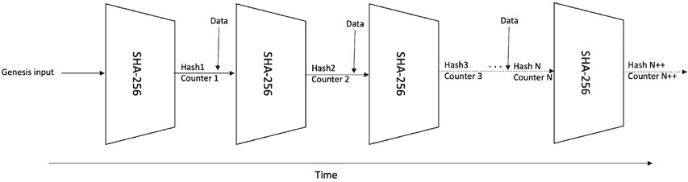

第八章区块链时代的协议

这就是 PoH 的作用。在 Solana 中，一次只有一个领导者处理交易

并更新状态。其他验证者读取状态并向领导者发送投票

来确认它们。这个活动被分成非常短的连续会话，其中一个

一个接一个地执行领导者。可以将分类账分为

小间隔。这些小间隔每次为 400ms。领导轮换时间表

是基于几个因素如股份和

先前交易的行为。但我们如何确保领导者轮换是在正确的时间进行并且不会跳过领导者的轮换？

在 PoH 中，时间的流逝是通过创建这些哈希的序列来证明的，就像

在图 8-3 中所示。

***图 8-3\.** Solana 历史证明序列*

在图 8-3 中，显示了一系列哈希操作。起源输入（在图表左侧显示）首先提供给哈希函数。在下一次迭代中，上一个哈希函数的输出被用作哈希函数的输入，并

这个过程会无限地进行下去。这个序列是使用 SHA-256 生成的

单核心上的函数。这个过程不能并行化，因为输出

之前的哈希函数只有在哈希函数已经处理了

先前的输入。假设这些函数是密码哈希函数

具有预像抵抗能力。因此，这是一个纯粹的顺序函数。但是，

这个序列可以使用多核 GPU 并行验证。因为所有的输入和

输出可用后，只需要验证每个输出，GPUs

可以并行进行。这个特性使得这个序列成为可验证的延迟函数（VDF）

因为所花费的时间（即延迟）在生成哈希序列中可以被验证

使用快速并行验证。然而，密码学之间存在一些争议

研究人员在斯坦福大学引入的 VDF 和 Solana 引入的硬件 VDF

研究人员。参见参考文献。

345

第八章 区块链年代协议

然后我们可以定期取样这个序列，提供时间流逝的概念

时间的流逝。这是因为哈希生成需要一些 CPU 时间（大约 1.75

SHA-256 指令周期），而且这个过程纯粹

顺序；我们可以从这个序列看出来，自第一个哈希以来，

生成，在序列的后续哈希中，一些时间已经过去。如果我们还可以添加

一些数据与哈希函数的输入一起提供给哈希函数，然后我们也可以推断出这样

数据必须在下一个哈希之前和上一个哈希之后存在。这个序列

这样的哈希就成为历史的证明，以密码学方式证明某个事件，

假设事件 e 比事件 f 发生在事件 d 之前和之后。

这是一个顺序过程，使用其连续地重复运行 SHA-256

先前的输出作为其输入。它定期记录每个输出样本的计数器，

例如，每秒钟一次，并且当前状态（哈希输出），作为时钟

ticks。通过定期间隔取样的哈希结构，我们可以推断一定的时间已经过去。它不能并行化，因为先前的输出是

在下一次迭代之间的输入。例如，我们可以说在计数器之间已经经过了一段时间

1 和计数器 N（图 8-3），时间就是 SHA-256 计数器。我们可以从这个计数中近似得到真实时间。我们还可以关联一些数据，可以附加到

哈希函数的输入；一旦经过哈希，我们就可以确定数据必须存在

在生成哈希之前。这种结构只能按顺序生成；然而，

我们可以并行验证它。例如，如果 4000 个样本花费了 40 秒来生产，那么用 4000 个核心 GPU 只需要 1 秒就可以验证整个数据结构。

关键思想是 PoH 事务吞吐量与共识分离，

还有关键的扩展性。请注意，生成的事件顺序并不是全局唯一的。因此，需要共识机制来确定正确的

链，因为任何人都可以生成一个备用历史。

历史证明是密码学上已经证实时间已经流逝的方式。它

可以被视为特定应用的可验证延迟函数。它编码了经过

使用 SHA-256 哈希化事件和交易数据来将时间作为数据化处理。它

生成每个事件的唯一哈希值和数量，这样就能够得到可验证的事件排序

事件作为时间的函数。这意味着时间和事件的顺序可以得到一致

不等待来自其他节点的回复——换句话说，没有弱主观性，其中

节点必须依赖其他节点来确定系统的当前状态。这导致了高吞吐量，因为通常需要提供的信息

其他节点已经在 PoH 机制生成的序列中，而且

经过加密验证，确保完整性。这意味着全局事件的顺序 346

第八章 区块链时代协议

可以在不经过复杂的通信协议就能够执行。

协议或信任时钟同步的外部时间源。总的来说，

而不是依赖时间戳，历史证明允许创建一个历史记录

证明事件 e 发生在时间点 t 之前

并且在事件 d 之后。

使用 PoH，领导权可以在无需与其他节点通信的情况下转换。

节点，这导致增加了区块的产生频率。PoH 导致节点高

与 BFT 风格协议相比，具有可扩展性和低通信复杂性

通信复杂度高，节点容量有限。

它提供全局的读取一致性和经过加密验证的时间

在两个事件之间达成一致。使用 PoH，节点可以信任事件的顺序和时间

在达到共识阶段之前。换句话说，它是一个在共识之前的时钟。

方法。然后共识只需要在不同的分支上进行投票，节点

投票支持他们认为是主链的分支。随着时间的推移，通过继续投票支持

他们首先投票的链，并通过投票任何其他分支，他们赚取奖励并

最终其他分支就会孤立。

TowerBFT 是 PBFT 的一个变种。基本上，它是一个分叉选择和投票算法。它

用于投票 PoH 生成的链以选择真实的规范链。这样做在通信方面更简单，因为 PoH 已经提供了一个顺序，现在

只有在选择规范链时才需要做出决定。PoH 提供一致性启动前的事件时间，然后 TowerBFT 用于对规范链进行投票。

TowerBFT 是 BFT 的一种形式，一经 2/3 的验证者都投票

链（哈希），则无法回滚。验证者对一个 PoH 哈希进行投票

原因：首先，分类账在那个哈希之前是有效的，也就是说，在某个时间点，其次，支持在给定高度出现分叉，因为在给定高度可以存在许多分叉。

此外，Solana 中的 PoS 用于经济和治理来控制

减少、通货膨胀、供应和惩罚。

**Tendermint**

Tendermint 受到我们在第[6](https://doi.org/10.1007/978-1-4842-8179-6_6)章中 cover 的 DLS 协议的启发，并最初在 DLS 论文中引入。它也可以被视为 PBFT 的一种变体，具有

阶段中的相似之处。

347

第八章 区块链 年代 协议

Tendermint 协议按轮次运行。在每个轮次中，选定的领导者提出

下一个块。在 Tendermint 中，视图更改过程是正常操作的一部分。

这与 PBFT 不同的地方在于，只有在出现

可疑的有故障领导者。Tendermint 的工作方式类似于 PBFT，其中有三个阶段

要达成共识所需。Tendermint 中的一个关键创新是设计了一个新的

终止机制。与其他类 PBFT 的协议不同，Tendermint 开发出了一个

更直接的机制，如类 PBFT 的正常操作。而不是

正常模式和视图更改模式（在节点出现故障时进行恢复

领导者），Tendermint 在无需额外通信成本的情况下终止。

Tendermint 在操作环境方面作出了一些假设

我们接下来描述的内容：

**进程：** 进程是网络上的参与者。进程

预期是诚实的，但也可能变得有故障。每个进程

具有投票权，可以作为领导者的确认。

进程可以松散连接或与其直接子集

进程/节点。它们不一定直接相連。

进程具有一个本地定时器，用于测量超时时间。

**网络模型：** 网络是一个消息传递网络

其中一个消息传递协议用于进程之间的通信

进程。标准的 BFT 假设*n*≥3*f*+1 适用于

在这里，这意味着协议只有在

网络中的节点数大于 3F 时，Tendermint 需要保持更多的节点，其中 F 是

有问题节点的数量，N 代表总节点数

网络中的节点。实际上，这意味着网络中必须至少存在

四个节点来容忍拜占庭故障。

**时间假设：** Tendermint 假设部分

同步网络。对于

通信延迟，但仅适用于未知

一个全局稳定时间点。

**安全和密码学：** 在

系统使用的公钥加密是安全的。此外，

冒充或伪造身份都是不可能的。所有消息

在网络上经由数字签名进行认证和验证。

该协议忽略任何带有无效数字签名的消息。

348

第八章 区块链时代协议

**状态机复制:** SMR 用于实现复制

在节点之间。SMR 确保网络上的所有进程

接收并处理相同的请求序列。此外，

协议中的协议确保顺序以及

节点收到的请求在所有节点上是相同的。两者

要求确保系统的总排序。该协议

只接受有效的交易。

Tendermint 通过满足以下列出的属性来解决共识问题：

• **协议：** 没有两个正确的进程可以决定不同的数值。

• **终止：** 所有正确的进程最终会决定一个数值。

• **有效性：** 如果决定的数值满足应用程序

特定预定义的断言表示为 valid( )。

Tendermint 中进程的状态转换取决于接收到的消息，并且

超时。超时机制保证活性并防止无限等待。

在这里，假设最终，在一段异步期之后，会有一个同步通信期，在此期间所有的进程都可以以一种

及时地确保进程最终决定一个数值。

Tendermint 协议有三种类型的消息：提议、预投票和预-

提交。可以将这些消息视为等同于 PBFT 协议的 PRE-

准备、准备和提交消息：

• **提议：** 此消息由当前轮次的领导者使用

提议一个数值或区块。

• **预投票：** 此消息用于对提议的数值进行投票。

• **预提交：** 此消息也用于对提议的数值进行投票。

只有提议消息包含原始数值。另外两种消息，预-

投票和预提交，使用表示最初提议的数值的数值标识符。

协议中有三种超时，对应每种消息类型：

• 超时-提议

• 超时-预投票

• 超时-预提交

349

第八章 区块链时代协议

这些超时防止算法无限等待某些

需要满足条件。它们还确保进程通过回合取得进展。

每一轮结束后增加超时机制可以确保在达到全局稳定状态后，

正确进程之间的通信最终变得可靠，节点可以

达成决定，并且协议终止。

所有进程在协议中维护一些必要的变量：

• **步骤：** 此变量保存 Tendermint 状态的当前状态

当前轮次中的机器。

• **lockedValue：** 此变量存储最近的数值（涉及

发送预提交消息的回合数)。

• **锁定轮次：** 此变量保存了关于上次轮次的信息

如果处理器能做出决定之前计时器到期，处理器

此时，可能已经做出决策的轮次

被锁定。这意味着如果有一个提议消息和相应的

2F + 1 个消息已经收到一个轮次的值，然后，由于

有 2F + 1 个先前-vote（pre-votes）为该决定

值，这是一个可能的决策值。

• **validValue：** validValue 变量的作用是存储最

最近的可能决策值。

• **有效轮次：** 有效轮次变量是上一轮，在这一轮发生了

更新的有效值。

• **高度：** 存储当前共识实例。

• 当前轮次编号

• 一个决策数组

Tendermint 按轮次进行。每一轮包含三个阶段：提出、

pre-vote，pre-commit。该算法的工作方式如下：

• 每一轮都以由提议者提出的提议值开始。

提议人在第一轮开始时提出一个新值

每个高度（each height）。

350

Chapter 8 区块链年代协议（BloCkChain age protoCols）

• 任何后续的轮次只有一个提议者提出一个

如果没有已经存在的有效值，即 null 的话，提议一个新值。

否则，提出有效值，即可能的决策值

在上一轮已经锁定了。提议消息也

包括指示上一次发生的有效轮次的值

更新的有效值。

• 一个正确的进程只有在

• 提议的值是有效的。

• 进程未锁定某个值。

• 或者该进程被锁定

• 正确的进程接受提议并发送一个 pre-vote

消息（message）是否满足前述条件。

• 如果条件不满足，进程将发送一个 pre-vote

带有空值的消息。

• 与提议阶段关联的超时机制触发

超时，如果一个进程在当前

轮次或计时器在提议阶段到期。

• 如果一个正确的进程收到一个带有有效值的提议消息

和 2F + 1 个 pre-vote 消息，它发送 pre-commit 消息。

• 否则，它发送一个空的 pre-commit。

• 与 pre-commit 相关联的超时机制将会初始化

如果关联的计时器到期，或者进程没有发送一个 pre-

在收到提议消息和 2F + 1 的 pre-

提交消息。

• 如果正确的进程收到提议

某一轮和 2F + 1 的预提交消息为 ID

关于提议值的消息。

• 这个步骤还有一个关联的超时机制，确保

处理器不会无限期地等待接收 2F + 1 个消息。

如果计时器在处理器决定之前到期，处理器

开始下一轮。

351

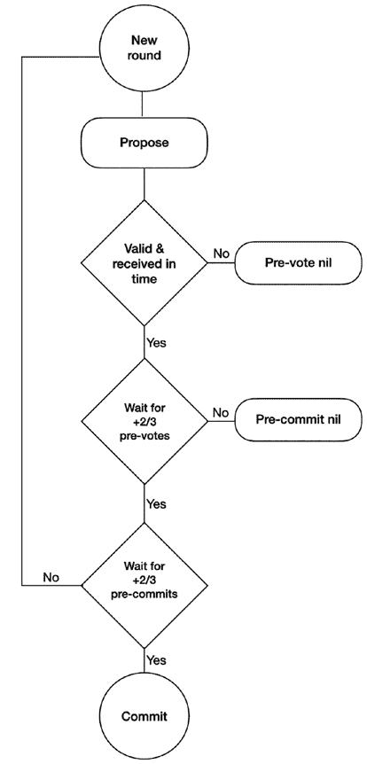

Chapter 8 区块链年代协议（BloCkChain age protoCols）

• 当处理器最终做出决定时，会触发下一个共识

为了下一个块提议的实例，整个周期的

提议、pre-vote 和 pre-commit 再次开始。

该协议可以简单地描述为一个不断重复的提案 ➤ 预投票的序列。

➤ 预提交，每次提交后都将达到新的高度并开始新的轮次，

如图 8-4\.所示

***图 8-4\.** Tendermint 流程 - 单次运行*

352

第八章 区块链时代协议

Tendermint 引入了一种新的终止机制。有两个变量，

即 validValue 和 validRound，由提案消息使用。这两者被更新

当正确的进程在接收到有效提案消息和随后

相应的 2f + 1 预投票消息。

这个终止过程受益于 gossip 协议和同步性

假设正确的进程锁定了某轮的值。

这样所有其他正确的进程将更新它们的有效值和有效轮次变量

到达它们被锁定的那一轮结束时，所有其他正确的进程将更新它们的有效值和有效轮次变量

基本假设是 gossip 协议会把它们传播给其他

在同一个轮次内，一旦正确的处理器锁定了这些值，节点们会进行同步。每个

处理器将知道被锁定的值和轮次，即有效值。现在，当新的提案消息

下一个提案被提出时，同样的被锁定的值将被提议者选取，这样

因为有了有效的提案和对应的 2 *f* + 1 预投票消息，所以已经被锁定。这样就可以确保进程最终决定的值

根据有效条件指定，上述是可以接受的。

这完成了我们对 Tendermint 协议的讨论。接下来，我们将探讨 HotStuff，

这在改善以前的 PBFT 及其变体协议中存在的一些限制方面有所改进。

**HotStuff**

HotStuff 是用于状态机复制的 BFT 协议。几项创新

它比传统的 PBFT 协议更好。但是，与 PBFT 一样，它在部分情况下有效

最小 *n* = 3 *f* + 1，并依赖于基于领衔的主备方法的消息传递网络中的同步性。它利用可靠和经过验证的通信

链接。HotStuff 使用阈值签名，其中所有节点使用同一个公钥，但每个副本使用唯一的私钥。 使用阈值签名可以减少

通信复杂性。

HotStuff 引入了一些创新，我们将在下文中介绍。

**线性视图更改**

HotStuff 协议中的视图更改仅需要 *O*( *n*) 个消息。这是正常运行的一部分，而不是一个单独的子协议。在最坏情况下，即使领导者连续失败，通信成本也会增加到 *O*( *n* 2) ，是二次的。与 PBFT 一样拥有稳定的领导者不同，HotStuff 中的领导者每三轮进行一次轮换，即使

领导者不会失败。

353

第八章 区块链时代协议

简而言之，二次复杂度意味着算法的性能是

与输入大小的平方成正比。

在线性视图更改中，在 GST 之后，任何经过选择的诚实领导者仅发送 *O*( *n*) 的认证者来推动决策，包括领导者失败并且新的

之一当选。因此，即使在领导者一个接一个地失败的最坏情况下，这个

在 GST 之后达成共识的通信成本为 *O*( *n* 2)。

**乐观的响应**

乐观的响应允许在 GST 之后的任何正确的领导者只需第一个 *n* − *f* 的响应就能确保进展，而不是等待每个复本的 *n* − *f* 的消息。这意味着它能以网络速度运作，而不是不必要地等待更多的消息

从其他节点中获得，并进入下一个阶段。

**链质量**

此属性通过允许频繁的领导者来提供系统中的公平性和活力

旋转。

**隐藏锁**

它还解决了隐藏锁问题。当领导者

验证者不需要等待一个轮次的过期时间。最高锁定值可能不存在

只依靠接收 *n* – *f* 消息，就能到达领导者。最高锁定值可能由另一个未等待得到响应的复本持有，

因此导致了领导者不知道最高的锁定值。如果领导者提议了一个更低的锁定值，而其他一些节点已经有了更高的

锁定值，这可能导致活力问题。节点将等待更高的锁定或相同的锁定回复，但领导者不知道最高的锁定值，并将继续发送一个更低的锁定值，导致比赛条件和活力违规。

HotStuff 通过在实现之前增加前锁轮来解决了这个问题

实际锁轮次。这里的见解是，如果有 2 *f* +1 个节点接受前置锁定，领导者将从它们那里获得响应并学习最高锁定的值。因此现在

领导者不必等待 *Δ*（delta –消息传递延迟的上限）时间，就能通过 *n* − *f* 的响应学到最高锁定。

354

第八章 BloCkChain age protoCols

**起搏器**

HotStuff 创新地分离了安全性和活力机制。安全性得到保证

通过投票和网络中的参与者的提交规则。另一方面，

活力性是一个独立模块的责任，称为起搏器，它确保了

新的，正确的，唯一的领导者被选举。此外，起搏器保证进展

在 GST 之后。它的第一个责任是在足够长的时间内将所有诚实的副本和一个唯一的领导者提升到同一高度。为了同步，

复本逐渐增加其超时时间，直到取得进展为止。因为我们假设一个

部分同步模型，这种机制很可能会发挥作用。此外，领导者选举

过程基于一个简单的轮换协调器范式，一个特定的时间表，

通常是轮询，由复本来选择一个新的领导者。起搏器也

确保领导者选择复本将接受的提案。

**更好的参与者组织拓扑**

一个 PBFT 协议将节点组织成一个圈（网状拓扑），导致一个二次的...
