消息复杂度，而 HotStuff 则将节点组织成星型拓扑结构。当发现领导者存在故障时

使领导者能够直接发送或收集来自所有其他节点的消息，

这导致了减少的消息复杂性。简单地说，它使用了“一对所有”

通信模式。

如果一个领导者负责所有这些处理，那么在一个节点上的高负载问题

领导者可能出现，这会减缓网络。

现在想想领导者被损坏或妥协的情景。该

标准的 BFT 容忍性保证地址了这种情况。如果领导者提议了一个

恶意区块并怀疑有故障，它将被其他正确的节点拒绝，并且协议将选择一个新的领导者。这种情况可能会暂时减缓网络

直到新的诚实领导者接管。如果网络大多数是诚实的，一个正确的领导者最终会接管并提议一个有效的区块。此外，为了增加安全性，领导者通常会在几轮之后被频繁地在验证者之间轮换，这可以抵消任何

针对领导者的恶意攻击。这种属性确保了公平性，有助于

实现链质量。

PBFT 由普通模式和视图更改模式组成，其中视图更改触发

当怀疑领导者存在故障时。这种方法提供了活跃性保证，但是

增加了通信复杂性。HotStuff 通过将视图

更改过程与正常模式相结合来处理这一问题。在 PBFT 中，节点要等待 2F+1 条消息才能

355

第八章区块链年代协议

更改发生，但在 HotStuff 中，视图更改可以直接发生，而不会调用

一个单独的子协议。而是检查更改消息的阈值

视图成为正常视图的一部分。

**它是如何工作的**

HotStuff 由四个阶段组成：准备、预提交、提交和决策阶段。

准备证书（QC）是代表一系列

由*n* - *f*节点产生的签名表示已经达到了所需的消息阈值。换句话说，来自*n* - *f*节点的选票集合就是一个 QC。

**准备**

一旦新领导者从 N - F 个节点积累了新的视图消息，协议

由新领导者开始。领导者处理这些消息以确定最新

在哪个准备消息的最高的准备证书分支存在。

**预提交**

一旦领导者积累了 N - F 的准备投票，它就会创建一个准备证书

称为“准备证书”。领导者向其他节点广播这个证书

节点作为预提交消息。当一个节点接收到预提交消息时，

它会对预提交投票进行响应。该论证证书表明了必需的

节点的阈值已确认了请求。

**提交**

当领导者积累了 N - F 的预提交票据时，它创建了一个预提交证书

论据证书并将其作为 COMMIT 消息广播给其他节点。当

节点接收到这个 COMMIT 消息后，它们会回应他们的提交票。在这个阶段，

节点锁定 PRE-COMMIT 四分证书以确保算法的安全性

即使发生视图更改。

**决定**

当领导者收到 N-F 提交投票时，它创建一个 COMMIT 四分证书。

然后，领导者将此 COMMIT 四分证书广播给其他节点

决定消息。当节点收到此 DECIDE 消息时，它们执行该请求

356

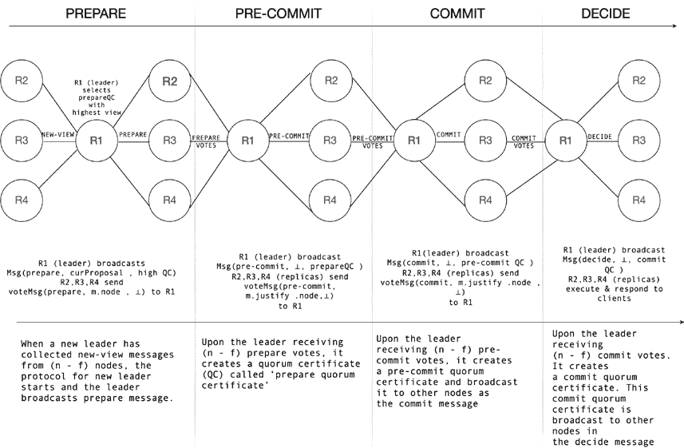

第八章 BloCkChain 年代的协议

因为此消息包含已经提交的证书/值。新视图

一旦由于接受 DECIDE 消息而发生状态转换，就开始

执行。

我们可以在图 8-5 中可视化该协议。

***图 8-5。** HotStuff 协议*

更准确地说，HotStuff 步骤列举如下：

• 新的主节点从 n-f 个节点那里获得新的视图消息

每个验证者收到的最高准备四分证书。

主要查看这些消息，并找到准备 QC

最高视图（轮数）。然后，领导者广播

通过准备消息中的提案。

• 当其他节点从领导者那里收到准备消息时，它们

检查准备提案是否是最高准备 QC 分支的延伸

并且具有比他们拥有的更高视图编号

目前被锁定。

357

第八章 BloCkChain 年代的协议

• 其他节点向领导者回复确认。

• 领导者收集来自*n* − *f*准备投票的确认。

• 当领导者获得 n-f 票时，它将它们结合成一个

准备 QC 并在 pre-commit 消息中广播此 QC。

• 其他复制品向领导者回复预提交票。当

领导者已经收到其他节点的 n-f 个 pre-commit 投票后，领导者

主节点将它们结合成预提交 QC 并将它们广播

在提交消息中。

• 复制品向领导者回复提交票，并在复制品上锁定

预提交 QC。当领导者从中收到 n-f 个提交票时

复制品将它们结合成一个提交 QC 并广播它们

决定消息。

• 当节点收到决策消息时，它们执行

操作/命令并启动下一个视图。

• 此操作重复进行。

其他优化措施，如流水线化，可以进一步

性能改进。由于所有阶段本质上是相同的，这很容易

通过流水线化 HotStuff，提高性能。流水线允许协议

在每个阶段都提交一个客户的请求。在一个视图中，每个阶段的领导者都提出一个新的客户请求。通过这种方式，一个领导者可以同时处理预提交、提交和

通过准备消息传递给最后一位领导者的以前客户请求的决定消息

证书。

**安全性和活性**

HotStuff 通过使用起搏器来保证活性，该起搏器在

在有限时间间隔内通过推进视图实现 GST。该组件封装

视图同步逻辑以确保活性。它在

同样的观点在足够长的时间内保证了进展。这个特性是通过

逐渐增加时间直到取得进展。

每当一个节点在一个视图中超时时，它都会广播一个超时消息并推进

当接收到 2 *f* + 1 个超时消息的法定证书时，就进入以下状态。

这个证书也会发给下一个领导者，他会继续协议。这时 358

第八章 区块链时代协议

超时检测听起来很熟悉吗？听起来很熟悉，因为起搏器的抽象是

基本上是我们在第[3 章](https://doi.org/10.1007/978-1-4842-8179-6_3)中讨论过的故障检测器。此外，选举和相关的提交规则可以确保在 HotStuff 中的安全性。

HotStuff 是一个简单而强大的协议，它结合了几种创新

产生比以往更好的协议。

**Polkadot**

Polkadot 是一个现代的区块链协议，它连接着一个网络，该网络由专门构建的

区块链并允许它们一起运行。这是一个异构多链

具有共享共识和共享状态的生态系统。

Polkadot 有一个名为中继链的中心主链。这个中继链管理

Parachains-连接到中继链的异构分片。中继器

链保存着所有 Parachains 的状态。所有这些 Parachains 都可以相互通信

其他并共享安全性，从而带来更好和更坚固的生态系统。作为

Parachains 是异构链，它们可以提供不同的目的；一个链可以是用于智能合约的特定链，另一个用于游戏，另一个可以提供一些

公共服务等。中继链由提名的证明来保护

的股份。

验证人在中继链上生成区块并与 Parachains 通信

和最终化区块。链上治理决定了理想的验证人数量

应该是。

图 8-6 展示了 Polkadot 链与 Parachains 的描述。

359

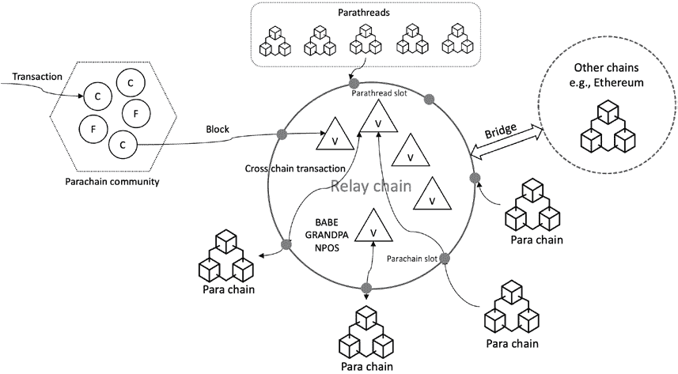

第八章 区块链时代协议

***图 8-6\.** Polkadot 的简单描述*

Polkadot 的目标是能够与其他区块链进行通信。对于它的

用途，使用桥接器连接 Parachains 到外部区块链，比如

比特币和以太坊。

Polkadot 中有几个组件。**中继链**是主链

负责管理 Parachains，跨链互操作性和链间

消息传递、共识和安全。

它由节点和角色组成。节点可以是轻客户端、全节点、归档节点或哨兵节点。轻客户端只包括运行时和状态。全节点在可配置的间隔被修剪。归档节点保留所有区块的完整历史记录，哨兵节点保护验证人并阻挠 DDoS 攻击以为中继链提供安全性。那里

有几种节点可以执行的角色：验证人、提名人、整理者和钓鱼者。

**验证者**是系统中负有最高级别职责的成员。他们是区块生产者，为了成为区块生产者，他们需要提供足够的保证金存款。他们生产

并最终确定区块并与平行链进行通信。**提名者**是利益相关者

并对验证者的安全性保证做出贡献。他们在验证者身上“信赖”

好”的产生区块。**整理者**负责交易执行。他们创建未封闭但有效的区块提交给提出建议的验证者。**渔夫**用于检测恶意行为。渔夫提供违规行为证据将获得奖励

参与者。**平行链**是连接到中继

360

第八章区块链年代协议

链的异构区块链。这些从根本上是 Polkadot 的执行核心。平行链可以具有

他们自己的名为特定应用区块链的运行时。另一个称为

**碎片线程**是在 Polkadot 主机内运行并连接到中继链的区块链。它们可以被视为按需付费的链条。碎片线程可以变成

通过拍卖机制连接到平行链。**桥梁**用于连接平行链

外部区块链网络，例如比特币和以太坊。

**Polkadot 中的共识**

Polkadot 中的共识是通过各种机制的组合实现的。对于

治理和会计，使用了被提名的股权证明。对于区块生产，

使用 BABE。GRANDPA 是终态性工具。在网络中，验证者有他们自己的

时钟，并假设网络部分同步。

最终性通常是概率性的，就像我们在传统的 Nakamoto PoW 共识中看到的。

在大多数许可网络和一些公共网络中，往往是确定性的，

也就是，可证明的终态性，例如，PBFT 和 Tendermint。

在 Polkadot 中，由于其多链异构架构的原因，

在一些链之间存在冲突的情况下，可能会出现一些情况

区块被添加。这些恶意区块将需要在冲突解决后移除；在这种情况下，确定性终态性由于其不可逆性财产不适用。另一方面，PoW 太慢，能耗过高，且是概率性的。针对

这样可以尽快继续生产区块，但可以适时推迟最终性确定。这样，区块生产可以继续进行且是可逆的，但最终性决定可以被分离和在后续阶段被证明。

这种可证明的终态性概念在多链异构网络中非常有用

因为它使我们能够向不涉及共识的其他方证明

区块是最终的。此外，可证明的终态性使得与其他区块链建立桥梁更容易。

这种混合方法的解决方案是允许验证者即使只有

一个验证者在线并且正确，但区块的最终确定被转移到一个称为最终性小玩意的独立组件。在正常情况下，区块最终化

也是相当快的，但是如果出现诸如状态冲突等问题，最终确定可能会推迟到对区块进行更多仔细检查的时候。在严重的情况下

攻击或巨大的网络分区，区块生产将继续；然而，作为

回退机制，Polkadot 将回退到概率最终化机制。

以此方式，即使在极端情况下也可以保证活跃性，只要至少有一个

361

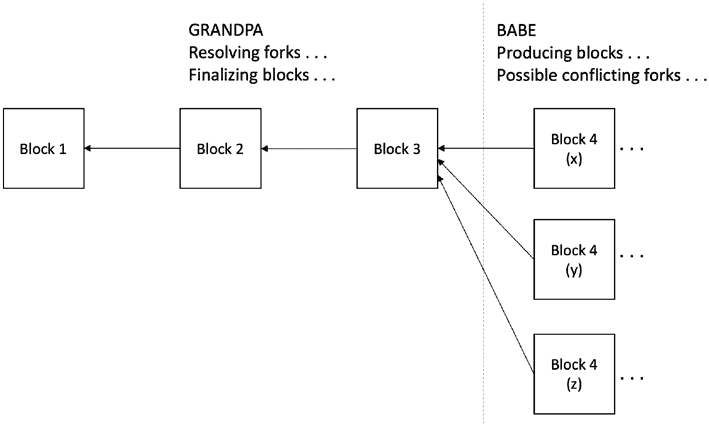

第八章区块链时代协议

验证者是正确的并且活着。区块由 BABE 生成，而它们是

被 GRANDPA 最终确定。GRANDPA 最终确定一系列区块，而不是逐个

提高效率的最终化。由于最终化是一个独立的过程，区块

生产可以以网络允许的任何速度继续，但最终确定

影响区块生产速度，并且稍后进行。

在 GRANDPA 最终确定“最佳”链之前可能会有一些分叉。我们可以

在图 8-7 中将此可视化。

***图 8-7\.** BABE 生成和 GRANDPA 最终确定的*

图中右侧显示的 BABE 在三个分叉中生成的三个区块；

GRANDPA 解决这些分叉并最终确定链。现在让我们看看区块是如何

由 BABE 产生。

**BABE – 区块链扩展的盲分配**

BABE 是用于区块生产的权益证明协议，其中验证者被随机选择

基于抵押金额被选择来产生区块。它不依赖于任何

中央时钟。

时间被分为跨越 n 秒的时间段，称为时隙，在此期间产生一个区块

预期产生。一个 epoch 是一个时隙序列。在每个时隙，验证者运行一个

VRF，基于前几个区块生成的随机性，决定是否

产生一个区块或者不产生。我们可以在图 8-8\.中将此可视化

362

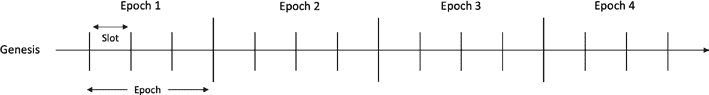

第八章区块链时代协议

***图 8-8\.** 时隙和 epoch*

验证者使用公钥密码学。有两种类型的密钥对。一个私钥

第一个密钥对的密钥用于区块签名。第二对用于

可验证的随机函数（VRF），也称为抽签密钥对。后者中的一个私钥作为输入用于可验证的随机函数。区块签名提供通常的不可否认性、完整性和数据来源授权的保证，验证验证者确实产生了这个区块。在 VRF 中，私钥生成

随机性，但公钥向其他节点证明生成的随机性是

的确可靠的，并且验证者没有作弊。

每个验证者被选中的几乎相等的机会。时隙领导选举

就像 PoW 一样进行，如果 VRF 的结果低于预定的阈值，

然后验证者赢得了生成区块的权利。此外，从 VRF 生成的证明还使其他参与者能够验证验证者是否遵守规则，不会作弊；换句话说，它证明了生成的随机性是可靠的。如果从 VRF 产生的值大于或等于目标值，那么验证者只是

收集来自其他验证者的区块。

这里是 BABE 协议的阶段。

**创世阶段**

在此阶段，将手动创建唯一的创世区块。创世区块包含一个

用于插槽领导者选择的随机数。

**正常阶段**

每个验证者在收到创世区块后将其时间划分为所谓的插槽。

验证者根据相对时间算法确定当前插槽号码

我们马上会解释的。每个验证者在正常操作中都应该

生成一个区块，而其他非验证者节点只需接收生成的区块。

同步。每个验证者都有当前

插槽/纪元，并使用先前插槽中选择的最佳链

选择机制，我们稍后会解释。

363

第八章区块链年龄协议

插槽领导者的选择基于 VRF 的输出。如果 VRF 的输出

低于一定的阈值，验证者就成为插槽领导者。如果没有，则只收集来自领导者的区块。

领导者生成的区块被添加到当前选择的最佳链中

插槽。生成的区块必须至少包含插槽号码，上一个的哈希

区块、VRF 输出、VRF 证明、交易和数字签名。一旦领导者生成的区块被添加到当前选择的最佳链中

链将使用新区块进行更新，区块将被广播。当另一个非领导者

验证者收到区块后，会检查签名是否有效。它还通过使用 VRF 验证机制来验证是否由有效的领导者生成了区块。

算法。它会检查 VRF 的输出是否低于阈值，如果是

验证者还会检查是否存在带有所需头部的有效链，该链中预期将添加接收到的区块，并且区块中的交易是否有效。

如果一切正常，验证者将区块添加到链中。当插槽结束时

验证者最终使用最佳链选择算法选择最佳链。

它消除了不包含由最终性汽车 GRANDPA 决定的最终区块的所有链。

**纪元更新**

每 n 个插槽就开始一个新的纪元。验证者必须获取新的纪元

在开始新纪元之前，为新纪元的随机性和活跃验证者集设置。

新纪元的新验证者集包含在中继链中，以启用区块

产出。新的验证者必须等待两个纪元，然后协议才能选择

它。添加一个验证者两个时代后，确保了新验证者的 VRF 密钥

添加到链上，以便在它们所在的未来时代的随机性之前

已经揭示了什么时候该验证者将活跃。基于

通过将这些时代中所有区块的 VRF 输出连接起来，前两个时代之间的不断化的差异。

图 8-9 说明了这个时隙领导者选举过程。

364

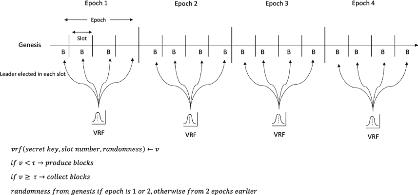

第八章区块链时代协议

***图 8-9\.** 通过 VRF 进行时隙领导者选举和时隙和时代的区块制作* 最佳链选择算法简单地移除不包含

由 GRANDPA 最终确认的区块。如果 GRANDPA 没有最终确认任何区块，协议

退化为概率性最终确认，并且最终确认的区块是选择自最后一个区块之前几个区块的那个。这几乎像链深度

PoW 中的一个规则。

时间在 BABE 中使用**相对时间算法**进行管理。这对于

BABE 的安全性要求所有方都知晓当前时隙号。BABE 不使用由 NTP 管理的时间源，因为显然中心化的时间源是不可信的。

验证者们通过使用区块到达时间作为参考

而不依赖外部时间来源。当验证者接收到创世区块时

区块，它记录了区块的到达时间作为第一个时隙开始的参考点。由于每个节点上每个时隙的开始时间预期是不同的，因此假设

所做的差异是相当有限的。每个验证者通过

计算该时代区块的到达时间的中位数。虽然

机制不同，但基本概念看起来与逻辑

我们在第[1](https://doi.org/10.1007/978-1-4842-8179-6_1)章中讨论了时钟。还有可能对离线并重新加入网络的验证者进行临时的时钟调整，直到下一个时代。

**安全性和活跃性**

BABE 满足四个安全属性：链的增长，存在性链

质量、链密度和公共前缀。

365

第八章区块链时代协议

**链的增长**

该属性保证了各时间段之间的最小增长。换句话说，这是一种活跃性

属性，只要有超过半数的诚实验证者

可用。恶意验证者无法阻止最佳链的进展。

**链的质量**

该属性确保至少有一个诚实的区块贡献到任何最佳链

在每 x 个时隙中由诚实方拥有。该协议保证

即使在最坏的情况下，在一个时代内至少会有一个诚实的区块包括在最佳链中。这确保了随机性不会出现偏差。

**链的密度**

该属性确保了在最佳链中的任何足够长的区块部分

包含由诚实验证者生成的大多数区块。这个属性是

由链的增长和链的质量暗示的。

**公共前缀**

这个属性确保了一个诚实验证者最佳链中最后一个区块之前的任何区块都不会被更改，并且是最终的。再次，这个属性由于

假设超诚实的大多数诚实验证者。对于一个恶意的来说是很罕见的

在一个槽中选举一个验证者，只会选举出大多数诚实的验证者；

因此，恶意验证者底数太小，无法再创建另一个

“最佳”链，不包含最终确定的区块。

**GRANDPA – GHOST-Based Recursive Ancestor Deriving**

**前缀协议**

它是一种小工具，在它们被产生后将区块最终化。

BABE. 它本质上是一个拜占庭协议，同意从许多分叉中选择一条链。这里的区别在于通常在 BFT 协议中，对单个区块做出决定，而 GRANDPA 在多个区块（一个分叉）上做出决定，并决定哪个

最终链是多叉分支解决的最终化机制。

366

第八章区块链原型协议

GRANDPA 假设部分同步网络。其在每一回合中运行

每回合有 3f+1 个符合要求的选民，其中假定有 2f+1 个选民是诚实的。在其他

单词，它需要验证者集合的三分之二是诚实的并且对一个前缀达成一致

的规范链，最终变为最终的。在每个回合，一个主要

是通过伪随机方式选举，这是与参与者达成一致的。此外，所有

参与者同意选民集。主要选择也可以基于轮换

在选民之间。

协议分为两个阶段：预选和预提交。预选允许

验证者们估计可以被最终化的内容，也就是，验证者们在最好的链上进行了预选。

对于预提交，验证者使用三分之二的 GHOST 规则来收集和预选

预提交。最后，预提交被最终确定。

GRANDPA 由两个协议组成。第一个协议在部分情况下运行

同步并能容忍三分之一的拜占庭故障。第二个协议在完全情况下运行

异步环境，并可容忍五分之一的拜占庭故障。

**GRANDPA 协议步骤**

在每个回合中，一个参与者被选为领袖（主要），其他参与者也知道谁是主要：

• 新的回合开始。

• 主键广播它认为可能是最终的最高区块

来自前一个回合。

• 验证者等待一定的网络延迟后，然后每个验证者

广播一个对于它认为的最高区块的“预选”消息

应该是最终的。如果验证者收到主键发来的区块

与更好的最佳链，然后验证者使用那个最佳链。如果

验证者的超级多数是正确的，这个区块预计会

扩展主要广播的链。

• 每个验证者查看预选来确定最高的区块

可以被最终化。如果预投票延伸到上一次最终化的链，

每个验证者都将向该链投出一个预提交。

• 每个验证器等待足够的预提交以组成一个承诺

新最终化链上的消息。

367

第八章 区块链年代协议

协议通过对错误行为进行惩罚，其中一部分股权被扣除

用于恶意行为或者只是不负责任的行为，比如，一个

运行时间长且处于非活跃状态的节点。惩罚的增加与

参与者。

**安全性**

该协议确保所有选票都是某个可能的区块的后代

上一轮最终化。节点根据预投票和预提交来估计一个区块的最终化可能性。在新的一轮开始之前，节点确保通过获取

足够的预提交，以便在这一轮的估计上不能被最终化为

不同的链或者稍后在同一条链上。在下一轮中，它还确保只有预投票和预提交上一轮估计区块的后裔。

**活跃性**

协议通过轮换选择验证器成为主要验证器。主要验证器开始

通过广播其对上一轮区块最终化的估计

验证者为最佳链进行预投票，包括主要验证者提出的区块，如果（1）区块至少是验证者的估计值，（2）验证者在上一轮获得了>2/3 的预投票来支持该区块及其后代。

这里的关键见解是，如果主要验证者提出的区块尚未最终化，那么

已被最终化以取得进展。例如，假设主要验证者提出的区块

尚未最终化，并且所有验证者都同意最佳链与最后

最终化的区块。在这种情况下，通过最终化最新的一致最终链来取得进展。

如果 GRANDPA 无法得出结论，那么 BABE 提供其概率最终性作为备用方案

机制，确保进展。

GRANDPA 和 BABE 是最新的异构多链协议之一。还有

此类协议中也有其他协议，如以太坊共识中使用的 Casper FFG

层（Ethereum 2，信标链）。

**以太坊 2**

以太坊 2，也称为静谧或 Eth2，是以太坊的最终版本。目前

以太坊基于工作证明，并被称为 Eth1。现在被称为执行层

层，以前的术语 Eth1 和 Eth2 已不再适用。Eth2 现在

368

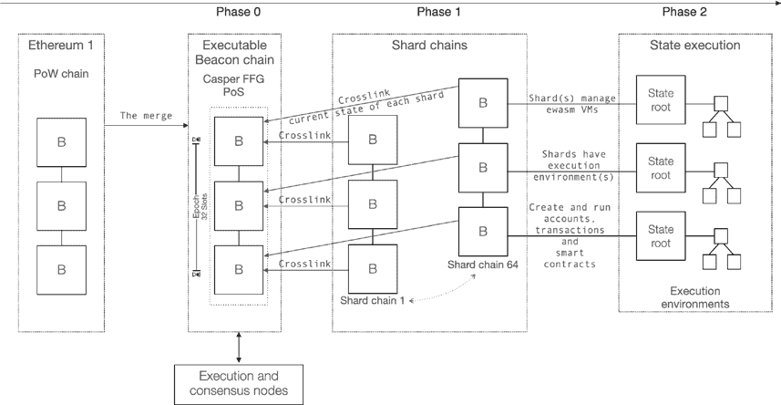

第八章 区块链年代协议

称为共识层。根据最初的计划，现有的 PoW 链将

最终将被弃用，并且用户和应用将迁移到新的 PoS 链 Eth2。

但是，预计这个过程需要数年时间，一个更好的替代方案是

继续改进现有的 PoW 链并将其作为以太坊 2 的分片之一。这

变更将简化过渡到股权证明，并允许使用 Rollups 进行扩展

而不是分片执行。信标链已经可用； “合并”阶段

预计以太坊主网将于 2022 年与信标链合并。在

合并后，信标链将变为带有权益证明和 EVM 的可执行状态

能力。旧的以太坊 1（Eth1）将成为执行层，具有执行

客户端，例如 Eth1 的“geth”。以太坊 2（共识）客户端，如 prysm 和

lighthouse 将继续在信标链上运行。最终，分片链

为了扩展以太坊的容量并支持执行，计划于 2023 年。以太坊

2.0“共识”与以太坊 1“执行”作为分片 0，以及其他升级

根据其路线图，可以在图 8-10\. 中可视化。

***图 8-10\.** 以太坊升级，显示合并和随后的升级*

简而言之，Eth1 现在被称为执行层，负责处理交易和

执行，而 Eth2 现在被称为共识层，管理证明

的权益证明。作为共识层，“以太坊 2”权益证明

提出了一种共识协议，我们将在接下来讨论。

369 

第八章区块链年代协议

**Casper**

Casper 是一种为替代以太坊当前 PoW 算法而构建的权益证明协议。此家族中有两个协议：

• 友好终局装置卡斯珀（FFG）

• Casper the Friendly GHOST

Casper FFG 是一种 PoS BFT–风格的混合协议，它在当前的

PoW，而 Casper the Friendly GHOST 纯粹是一个 PoS 协议。Casper FFG 提供了

在替换为 Casper CBC 之前将经历一个过渡阶段，这是一个纯粹的 PoS 协议。

讨论 Casper FFG 如下。

**Casper FFG**

Casper 可以被视为一种改进的 PBFT，结合了公共区块链的权益证明。

卡斯珀友好终局装置介绍了一些新颖的特点：

• 责任制

• 动态验证人

• 防御

• 模块化叠加

Casper FFG 是一个在块提议机制之上的叠加机制。它的

唯一的目的是共识，而不是区块产生。

责任制允许检测规则违反并识别验证人

违反了规则。 这使得协议可以惩罚违反规则的验证人

作为对恶意行为的防御。

Casper FFG 还引入了一种安全的方式来改变（即添加/删除）参与者的

验证人集。

该协议还引入了一种防御机制来保护免受网络

分区和长程攻击。即使超过三分之一的验证人离线，

该协议提供了一种防御机制来防止这种情况的发生。

Casper FFG 是一种叠加方式，这使得它更容易添加到现有的 PoW

链。由于它是一种叠加方式，预计底层链具有自己的分叉选择规则。在以太坊信标链上，它是在称为 LMD GHOST（最新消息驱动贪婪最重数子树）的分叉选择规则之上的一种覆盖。

370

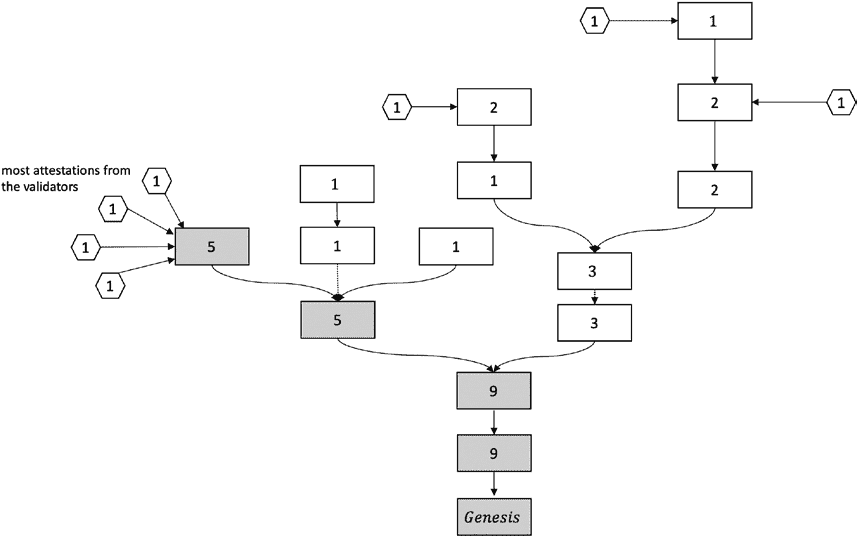

第八章区块链年代协议

LMD GHOST 分叉选择规则基于 GHOST。LMD GHOST 选择规则

从多个分叉中选择正确的链。诚实的链是

大多数验证者和权益（即权重）的证明。分叉发生是由于网络分区、拜占庭行为和其他故障。我们可以看到 LMD GHOST 在

图 8-11

***图 8-11** LMD GHOST 分叉选择规则*

在图 8-11

• 块中的数字代表权重。

• 六边形代表验证者发表的证明

重量 1。

• 规范链是带有阴影块的链（权重 +

证明）。

通常，当工作证明或其他区块链生成机制

产生块时，它们按顺序一个接一个地产生，在一个连续的线性链中

每个父块都正好有一个子块。但是由于网络的原因可能会发生

提议机制产生多个

371

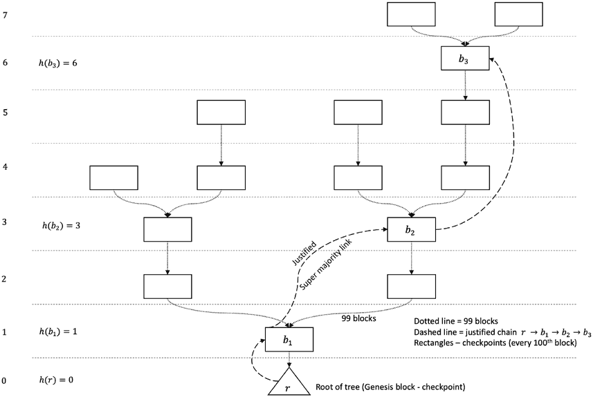

第八章 区块链时代协议

父块的子块。卡斯珀负责从每个父块中选择一个子块，从而从块树中选择一个单一的规范链。

但是，由于效率问题，卡斯珀不处理整个块树；

相反，它考虑形成检查点树的检查点子树。

新块附加到块树结构。树的子树称为

需要做出决定的检查点树的位置。这个结构显示在图 8-12 中。

***图 8-12**。显示高度、投票、检查点和的检查点树*

*规范链*

创世块是一个检查点，而每第 100 个块是一个检查点。该

从一个检查点到另一个的距离被称为纪元。换句话说，验证者

每 100 个块最终确定检查点。加入网络的每个验证者都存款

他们的拥有存款。由于惩罚可能会导致存款增加或减少

和奖励机制。验证者广播投票。投票权重与

验证者的权益。如果验证者违反协议而失去整个存款，那就是实现安全性的目的。

372

第八章 区块链时代协议

投票消息具有一些属性，我们将其描述如下：

• **s**：被证实的源检查点的哈希

• **t**：要证实的目标检查点的哈希

• **h(s)**：源检查点的高度

• **h(t)**：目标检查点的高度

• **S**：发送者对完整投票消息的签名

验证者创建投票消息，对其进行签名，并广播到网络中。

检查点的哈希用于识别相应的检查点。该

检查点。要最终化检查点*cp*，需要进行第二轮确认，这时需要存在一个

被证明的检查点不会被认为是最终的，因为可能存在冲突的被证明的

检查点*cp*→*cp*′有一个超多数链接。

**协议步骤**

可以存在多个在区块树中被证明的链。当两个连续的

• 可能的活动性

• 辨识有效的检查点。

基本上，这个过程分为三步。首先，为一个检查点投票；

• 广播一个检查点对（源，目标）的投票。

• 评估接收到的投票的有效性，检查与削减规则相比较

投票签名者的存款。

• 通证持有者在网络中存入押金。

第八章 区块链年代协议

• 对责任安全性

存款后，检查点被认为是经过验证的。

• 如果检查点对拥有超过总存款的三分之二

• 重复这个过程。

存款。这些被称为最低惩罚条件：

若获得了>2/3 的投票，则检查点处于被证明的状态。最终，链被最终化形成规范链。证明并不意味着最终化；还有其他现存的投票。

检查点高度。

• 将它们添加到检查点树中。

**安全和活动性**

可能的活动性意味着只要存在扩展最终化的子节点

责任制意味着可以识别出有问题的验证者并进行惩罚。

• 验证者不能为相同的目标发布两个不同的投票

如果 s 是检查点树中目标 t 的祖先，且验证者的公钥在验证者集中，则投票有效。当超过三分之二的验证者为源到目标的链投票时，该链或链接成为超多数链接。例如，*cp*′作为源,*cp*作为目标，那么*cp*′→*cp*就是大多数链接。如果它是创世块或者是一个在最后一个检查点处于被证明的超多数链接中的检查点，那么检查点就被证明。精确点说，我们可以说检查点*cp*如果存在一个*cp*′→*cp*的超多数链接*cp*′就被证明。一个检查点如果是被证明的，就会被认为是最终的，且存在一个*cp*→*cp*′的超多数链接*cp*′是检查点*cp*的直接子节点。

373

在共识协议中。安全性只是意味着两个冲突的检查点可以

有两个安全和活动性要求：

检查点获得 2/3 的投票。

• 验证者不得在其

负责制安全性和传统安全性要求有一些不同

• 检查点对被证明和最终化。

除非超过三分之一的验证者违反协议，否则永远不会最终。

违反这些条件的任何验证者都将通过削减他们的

• 在一个共识时代

链，总是可以添加超多数链接产生新的最终检查点。

**总结**

本章讨论了比特币之后出现的区块链时代协议。这里

有几种类型的区块链共识协议； 一些基于投票，一些

是工作量证明，另一类是权益证明协议。所有这些协议都有一些安全性和活力性质，确保协议正确且有效

374

第八章 区块链时代协议

在给定环境中正确地工作。我们在本章中讨论了几点。这些协议的最终比较将在最后一章中呈现，第十章[。](https://doi.org/10.1007/978-1-4842-8179-6_10)

我们还讨论了协议，如 ETHASH，权益证明，其不同类型以及

BFT 变体，包括 HotStuff 和 Tendermint，详细讨论。现代协议

如 Casper FFG，Solana 的历史证明，以及 Polkadot 的 GRANDPA 和 BABE 也在讨论之中

这里介绍。在本章中不可能涵盖所有协议，但至少提供了足够的信息来建立不同类型算法的良好理解

区块链中使用的一些协议。还有一些我们没有涵盖的更多协议，比如 PoET，

HoneyBadger BFT 和 Snow，将在最后一章中简要介绍。

这个领域是一个非常活跃的研究领域，许多学术界和

工业界的研究人员对这个领域非常感兴趣。因此，只有进一步的演进和

这个领域有望得到进一步的发展。

在下一章中，我们将讨论另一个令人兴奋的主题，量子共识，一

最近随着量子计算的出现而出现的一个课题。

**参考文献**

1\. Peer coin 论文：[www.peercoin.net/whitepapers/peercoin-](https://www.peercoin.net/whitepapers/peercoin-paper.pdf)

[paper.pdf](https://www.peercoin.net/whitepapers/peercoin-paper.pdf)

2\. 肖，Y.，张，N.，娄，W.，和侯，Y.T.，2020\. 一项调查

区块链网络的分布式共识协议。IEEE

通信调查与教程，22(2), pp. 1432–1465\.

3\. 巴希尔，I.，2020\. 掌握区块链：深入挖掘

分布式分类帐，共识协议，智能合约，DApps，

加密货币，以太坊等。Packt Publishing Ltd.

4\. “隐藏锁问题[”: http://muratbuffalo.blogspot.](http://muratbuffalo.blogspot.com/2019/12/hotstuff-bft-consensus-in-lens-of.html)

[com/2019/12/hotstuff-bft-consensus-in-lens-of.html](http://muratbuffalo.blogspot.com/2019/12/hotstuff-bft-consensus-in-lens-of.html)

5\. Web3 基金会共识教程 – Bill Laboon：[https://](https://youtu.be/1CuTSluL7v4)

[youtu.be/1CuTSluL7v4](https://youtu.be/1CuTSluL7v4)

6\. [`polkadot.network/blog/polkadot-consensus-`](https://polkadot.network/blog/polkadot-consensus-part-2-grandpa/)

[part-2-grandpa/](https://polkadot.network/blog/polkadot-consensus-part-2-grandpa/)

375

第八章 区块链时代协议

7\. Buterin, V. 和 Griffith, V., 2017\. Casper 友好最终性

小工具。arXiv 预印稿 arXiv:1710.09437\.

8\. “用本地计算替换通信” – Liskov，B.，

1993\. 分布系统中同步时钟的实际用途。

分布式计算, 6(4), pp. 211–219\。

9\. Buterin, V., Hernandez, D., Kamphefner, T., Pham, K., Qiao, Z.,

Ryan, D., Sin, J., Wang, Y., 和 Zhang, Y.X., 2020\. 结合

GHOST 和 casper。arXiv 预印本 arXiv:2003.03052\。

10\. Solana 白皮书: Solana: 一个高性能的新架构

性能区块链 v0.8.13: [`solana.com/solana-`](https://solana.com/solana-whitepaper.pdf)

[whitepaper.pdf](https://solana.com/solana-whitepaper.pdf)

11\. Burdges, J., Cevallos, A., Czaban, P., Habermeier, R., Hosseini, S.,

Lama, F., Alper, H.K., Luo, X., Shirazi, F., Stewart, A., 和 Wood, G.,

2020\. Polkadot 及其设计考虑概览。arXiv

预印本 arXiv:2005.13456\。

12\. Yin, M., Malkhi, D., Reiter, M.K., Gueta, G.G., 和 Abraham, I.,

2018\. HotStuff: 区块链之镜中的 BFT 共识。arXiv

预印本 arXiv:1803.05069\。

13\. Buterin, V., Hernandez, D., Kamphefner, T., Pham, K., Qiao, Z.,

Ryan, D., Sin, J., Wang, Y., 和 Zhang, Y.X., 2020\. 结合

GHOST 和 casper。arXiv 预印本 arXiv:2003.03052\。

14\. Stewart, A. 和 Kokoris-Kogia, E., 2020\. GRANDPA: 一个拜占庭

最终性盒子。arXiv 预印本 arXiv:2007.01560\。

15\. Buchman, E., 2016\. Tendermint: 拜占庭错误容忍在

区块链时代 (圭尔夫大学博士论文)。

376

**第九章**

**量子共识**

本章涵盖了量子共识。在我们解释量子共识之前

是，给出了量子计算及其优势的基本介绍，以建立一个

了解量子计算机的工作原理。此外，诸如量子

网络、量子互联网、量子密码学和量子区块链均是

也包括在内。然后我们讨论量子共识并解释它是什么，量子如何

计算如何影响经典共识在经典和量子网络中，以及

量子计算如何增强现有的分布式共识协议。我们

概述迄今为止在研究社区中所做的工作和一些开放的研究

问题。

**介绍**

将量子力学和信息理论相结合的想法的根源可以

可以追溯到早在 20 世纪 70 年代。1979 年，Paul Benioff 提出了一种理论

量子计算的基础。1982 年，理查德·费曼在一个讲座中提出

他认为经典计算机不可能进行描述计算

量子现象。经典计算机本质上是有限的，为了模拟

量子现象，计算设备还必须基于量子原理，

因此允许进行量子力学模拟和计算，否则

在经典计算世界中是不可能的。这受到了好评，许多

研究者开始致力于此。

1985 年，David Deutsch 提出了一种通用量子计算机，并指出

可能使用量子叠加进行同时操作。他还

建议了“迪欧奇算法”，可以确定量子硬币是否存在偏差

通过一次抛掷。之后，兴趣再次被点燃，但很快就消退了。然而，

当彼得·肖尔在 1994 年描述了一个

可以快速因子分解大数字的量子算法。这一事件引发了

377 页

©伊姆兰·巴希尔 2022

I. 巴希尔，*区块链共识*，[`doi.org/10.1007/978-1-4842-8179-6_9`](https://doi.org/10.1007/978-1-4842-8179-6_9#DOI)

第九章 量子共识

很大程度上是因为互联网安全性基于 RSA，而 RSA 使用素数

因子分解作为其安全性的一个难题。更准确地说，这是计算上的

在经典计算机上无法进行大素数的因子分解，这为 RSA 提供了

安全性。然而，这在量子计算机上却可以高效地完成，从而破解

RSA，因此，互联网的安全性。当然，我们可以想象，这是一个重大消息。

1996 年，格罗弗提出了他的量子搜索算法，进一步更新了

研究者对量子计算的兴趣。近 28 年后，我们正处于这一阶段

一些公司宣称量子霸权的地方。许多来自

学术界和工业界正在研究量子计算，现在看来

量子计算正处于经典计算在 1960 年代的阶段。它将

在未来十年左右的时间内，量子计算将成为大部分大型组织的主流，如果不是所有地方。

也许，量子计算机可能不会很快成为家庭现实。但有一点

很明显，量子计算正在迅速发展，并将开始影响（好或坏）

很快就会影响我们的日常生活。

量子计算机使用了来自各个领域的理念，包括计算机科学，

工程，量子力学，物理，数学和信息理论。

由此产生了几个课题，比如量子信息科学和

技术（QIST），融合了量子力学和信息技术。

量子信息科学（QIS）是计算机交叉的一个学科

科学，信息理论和量子力学。QIS 改变了我们如何

根本性地思考信息处理并以新的方式解决问题

以前无法解决的计算复杂问题。量子计算机存储

并且与经典计算方式截然不同地处理数据，经典计算方式中是 0 和 1

用来编码数据。量子信息是如何处理的不同

计算机为解决复杂问题提供了重大加速的机会。

**量子计算是什么？**

量子计算机是一种利用量子力学性质的设备

进行计算。经典计算机模拟人类可以的计算

执行并擅长解决日常问题。然而，很多问题

在经典计算机上仍然无法解决的一些问题，称为“难以解决的问题”。这些

问题包括对自然现象的建模，比如原子粒子行为和

378 页

第九章 量子共识

模拟气候变化等等。一个复杂问题的简单例子是

当你在餐桌上组织十个人吃饭时可能会产生。事实证明那里

有 3,628,800 1 种方法来解决这个问题。一种蛮力的方法是计算阶乘。

另一个问题是旅行推销员问题，这是一个 NP 难问题。

这个问题的目标是在多个城市之间找到往返的最短路径。

我们可以在经典计算机上解决许多复杂问题，我们有

可以高速解决问题的现代超级计算机，比如日常数学，

代数问题等。然而，这些难以解决的问题甚至都无法在

现代超级计算机。这就是量子计算机发挥作用的地方。特别是在

组合优化问题，在其中甚至超级计算机也失败，量子

计算机提供了解决它们的方式。

优化问题是试图从所有问题中找到最佳解决方案的问题

可行的解决方案。量子计算机擅长解决这类问题

在其中探索了大量状态空间。

高效模拟分子有助于新药的发现。这个问题是

分子模拟很困难，因为原子行为的所有变化

每一个原子之间甚至是原子位置微小改变都对所有

其他原子。预计将出现指数级变化的问题

可以在量子计算机上解决。此外，这些信息无法在经典上保存

计算机，因为我们没有这么多的空间。

举个例子，咖啡因分子由 24 个原子组成，但是表示那个

需要 10⁴⁸ 位，这使得传统计算机无法解决这个问题；

然而，量子计算机可以用 160 个量子位处理这些信息。

交付公司的路线优化是一个令人兴奋的应用，旨在

是为了找到优化路线以最小化燃料使用量，同时仍能够投递更多的包裹。

量子计算机的应用非常广泛，包括但不限于

密码学，机器学习，数据分析，计算生物学，模拟

化学和量子模拟。

化学应用有助于发现新材料和化合物，新的

药品，和改善肥料生产，从而导致更好的农业。在

密码学，更好和安全的密钥生成和分发机制，以及新颖的

1 [www.ibm.com/quantum-computing/what-is-quantum-computing/](http://www.ibm.com/quantum-computing/what-is-quantum-computing/)

379

第九章 量子共识

密码学（加密和解密）可以实现。优化问题

例如高效的路由发现、金融投资风险管理、以及

人们期望量子计算机可以解决更多问题。

量子计算有许多应用程序，因此激动人心并且竞争

实现量子霸权。量子霸权或量子优势是

通过实证展示解决经典计算机无法解决的问题。

合理的时间内。

有几个必要的基本元素是理解量子

计算世界。我们将它们描述如下：

• 量子位

• 叠加态

• 纠缠

• 传输

**量子位**

经典计算机基于两种不同的状态，0 和 1。经典计算机使用晶体管来表示电信号的存在或不存在，分别代表 0 或 1。基本上，在大多数现代超级计算机中都是由晶体管构成。

使用量子位在量子计算机中，这个基本的范式转变，导致

至量子计算机可以操作的非凡速度。量子位是状态

的物理原子粒子，比如电子的自旋。量子位可以处于

0 和 1 两种状态的叠加态。速度提升呈指数级增长

添加更多量子位。在经典计算机中，八个位一起被称为一个字节。在

量子计算世界中，八个量子位一起称为量子字节。

想象一下经典计算机中的 4 位。这些位可以有 16 种可能的状态

只能按顺序输入。然而，在量子计算机中，4 个量子位可以处于

所有 16 种可能状态的叠加态中，从而可以同时输入。而不是

经典版本中，4 位的确有 16 种可能的状态，但只能按顺序输入

顺序。这种现象称为量子并行性，是加速的关键

一些在经典计算机上无法解决的问题。

有许多物理上构建量子位的方法。这些技术包括困住的

离子，光子，中性原子，NMR 和其他几种。

380

第九章 量子共识

使用狄拉克符号来表示量子位。量子位表示为∣0⟩和

∣1⟩，与经典 0 和 1 相比。区别在于量子位可以处于一个线性

状态的组合称为叠加态。量子位可以是叠加态，

例如，具有自旋向上或向下的电子或带有+45 度

极化或-45 度极化和许多其他方式。

使用狄拉克符号来表示量子状态及其叠加态。狄拉克

符号的形式是∣0⟩ + ∣1⟩，其中 0 和 1 是状态。

量子位可以处于量子态∣*ψ*⟩ = *α*∣0⟩ + *β*∣1⟩，其中*α*，*β* ∈ *C*（复数振幅），且|*α*|2 + |*β*|2 = 1。这意味着单个量子位的状态由∣*ψ*⟩ = *α*∣0⟩ + *β*∣1⟩表示，并且概率条件为|*α*|2 + |*β*|2 = 1。这个概率条件意味着*α*，*β*可以取的值是有限的，无论如何，两者都必须加起来为一。*C*代表复数。

除了狄拉克符号，我们也可以使用向量表示。一个单向量

可以表示包含幅度*α*和*β*的状态：

|ψ 〉 = α

[β]

并且

∣0⟩ = [1 0 ] 和 ∣1⟩ = [0 1 ]

量子位可以使用一个 Bloch 球来进行可视化，如图 9-1 所示。

381

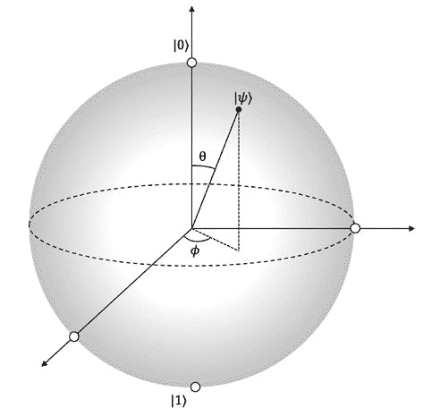

第九章 量子共识

***图 9-1.** 布洛赫球 - 一种方便可视化量子位的方法*

我们可以将单个量子位描述为布洛赫球表面的一个点。该

北极表示状态∣0⟩，南极表示状态∣1⟩。 量子位的角度为*θ*纬度和*ϕ*经度。 当对量子位执行单一门操作时，状态*ψ*（量子位）会旋转到布洛赫球上的另一点。

**叠加**

叠加是量子力学的一个基本原理。叠加意味着

量子状态可以相互叠加以获得另一个有效的量子状态。这是

类似于经典力学，其中波可以相互叠加。量子叠加

状态被称为“叠加”。叠加是非常快速的关键，因为它允许同时探索许多计算路径。

**纠缠**

纠缠是粒子之间存在的一种极强的相关性，使得

允许两个或更多个粒子不可分开地连接在一起。它允许任何两个

使量子粒子存在于一个共享状态。对一个粒子的任何操作立即影响另一个粒子，甚至在非常遥远的距离。纠缠通常通过

382

第九章 量子共识

将两个量子位靠近，执行一次纠缠操作，然后，一旦

纠缠，然后将它们分开。即使其中一个

在地球上，另一个被移动到外太空的地方。 

纠缠有两个特征，使它特别适合

大范围的应用：最大协调性和一夫一妻制。

**最大协调**

当网络中不同节点的两个量子位纠缠时，即处于量子状态

两个粒子变得不可分割地连接在一起，它们提供更强烈的相关性和

协调性质，这在经典网络中是不存在的。这个属性

被称为最大协调。例如，对第一个量子位进行任何测量，

如果对第二个量子位进行相同的测量，则会瞬间得到相同的

答案被显示出来，尽管答案是随机的，不是预先确定的。

更准确地说，它们将始终以随机的方式产生零或一，但两者都会产生

相同输出总是。这个特点使得纠缠适用于需要

协调，例如时钟同步，领导者选举和共识。

想象在没有物理传输的分布式网络中进行时钟同步；它可以

使分布式网络变得非常快速。（记住替换通信

与上一章的本地计算一起。）此外，在状态传输/感知时

共识立即加速共识。这里的基本思想是

当纠缠时，可以通过仅在一个量子位上执行操作（更改参数）来全局改变状态（全状态）。这种特性具有深远的影响

意义；想象能够立即将状态传输到所有节点

网络。这可能导致共识算法的非凡加速。

**一夫一妻制**

量子纠缠是不可分享的。如果两个量子比特被纠缠，那么第三个量子比特

宇宙中的任何地方都不可能与它们中的任何一个纠缠。这个属性是

被称为纠缠的一夫一妻制。这一特性可以实现隐私、

密钥生成和身份识别。

383

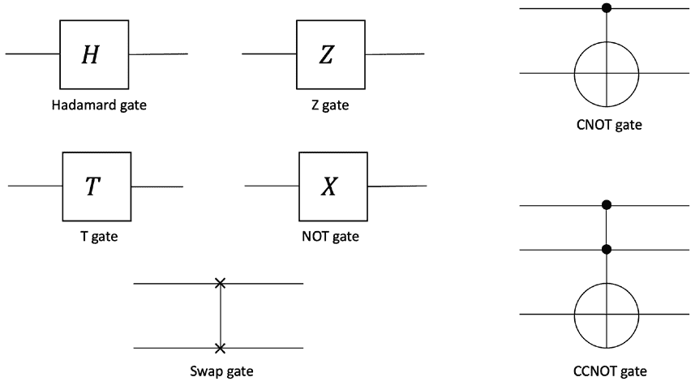

第九章 量子共识

**量子门**

就像在量子世界中的经典计算一样，我们使用门操作来进行数据

处理。我们习惯于在经典世界中使用布尔门，如 NOT，AND，

或、异或、与非和或非。在量子世界中，我们对输入应用一些运算符

变换为输出状态的初始态。这个运算符被称为量子门。

量子门作用于单量子比特或多量子比特。一个规则是每个门的输入必须与输出相同。这就是使门可逆的原因

因此量子计算机是可逆的。有单量子比特门

在 Bloch 球上旋转。然后有将单个

门来创建更复杂的功能，从而建立量子计算机。

有许多量子门；一些常见的门介绍如下。

**哈达玛**

这个门将一个基态变换为两个基态的偶数叠加态。

基本上，它允许我们创建叠加态。它作用于一个量子比特，是

由图中的符号表示

***图 9-2。** 量子门*

384

第九章 量子共识

**T**

T 门在贡献基态之间引入π/4 相位。符号显示在

图 9-2 r 表示 T 门。T 门中相对相位旋转为 45 度。

**受控非门**

这个门称为受控非门。它与经典 XOR 门相同，但是

具有可逆性质。它使用两个量子比特。第一个量子比特作为控制比特，第二个量子比特作为目标比特。它只有在第一个比特处于特定状态时才改变目标比特的状态。这个门可以用来在两个或更多量子比特系统中创建纠缠态。

**Toffoli（CCNOT）**

这是受控非门。它作用于三个量子比特。它切换

三位状态的第三位，其中前两位数是 1，即将∣110⟩转换为∣111⟩

反之亦然。它由图中的符号表示。换句话说，如果前两位数是 1，第三位数将被反转。

**Z**

这是一个相位移门。它将 1 映射为-1，并保持 0 为 0。换句话说，振幅

∣1⟩被否定。基本上，它将相位旋转 180 度。在电路中用箱子中的符号 Z 表示，如图 9-2 所示。

**非**

此门将∣1⟩切换到∣1⟩，反之亦然。这是经典 NOT 门的类比。

**交换门**

交换门交换了两个量子比特。可以在图 9-2 的可视化中看到。当然，有许多量子门，但我们介绍了一些常用的，并且将

帮助我们理解本章后面的算法。

所有这些门可以在图 9-2 中可视化。

385

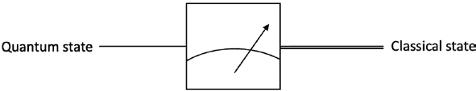

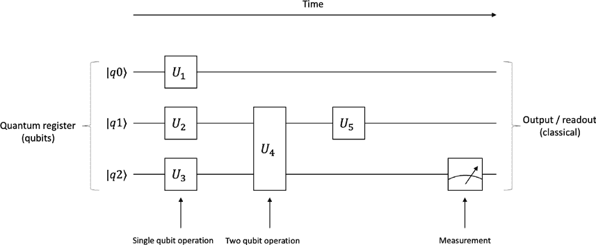

第九章 量子共识

**测量**

除了门之外，另一个重要的元素是测量。测量采取

一个量子态并将其坍缩成基态之一。我们可以在

图 9-3。

***图 9-3。** 测量*

**量子电路**

使用量子门，我们建立量子电路。量子电路基本上是一个

一系列应用于量子比特的量子操作。它由量子门组成

（算子）、包含提供输入的量子比特的量子寄存器、量子线

代表随时间进行的一系列操作，和测量。时间从左向右运行

在量子电路中右边。图 9-4 显示了量子电路的外观。

***图 9-4。** 量子电路*

量子门用方框表示。在左侧，我们有量子

寄存器。量子线代表量子比特，即光子或电子。每个门

引入一个对量子位进行更改的操作，例如电子自旋的变化。

386

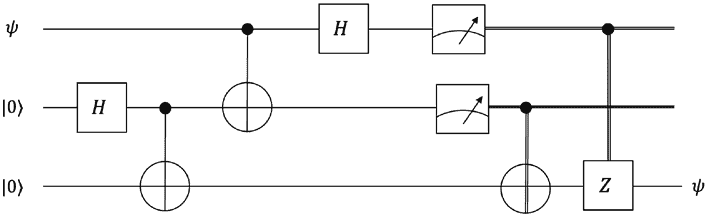

第九章 量子共识

量子电路实现量子算法。换句话说，量子

算法由量子电路描述。有许多标准的量子

电路。我们描述一些常用的如下。

**传输电路**

我们可以将一个量子态从一个量子设备转移到另一个吗？是的，我们可以；因为

为此，使用了传输，该传输利用纠缠移动量子态

从一个量子设备移到另一个的过程。

在图 9-5 中，显示了一个传输电路，可以将量子态从一方传输到另一方。

***图 9-5。** 传输电路*

传输的一些应用是在量子之间传输状态

系统。这在量子分布系统中可能非常有价值，其中状态传输

节点之间的连接可以实现诸如量子状态机复制之类的应用。

**GHZ 电路**

格林伯格-霍恩-齐林格（GHZ）态是三个或更多个的纠缠态

量子比特。如果三个或更多粒子进入纠缠态，这被称为多粒子纠缠。

图 9-6 可视化了这个电路。

387

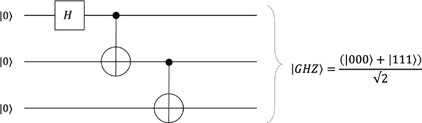

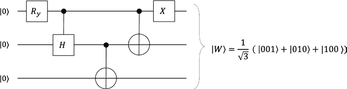

第九章 量子共识

***图 9-6。** GHZ 电路*

GHZ 态已被证明在量子密码学和量子中非常有用

拜占庭协议（共识）算法，我们将在本章后面探讨。

**W 态电路**

W 态电路是另一种实现三个粒子纠缠的方法。这

与 GHZ 的区别在于，在 W 态中如果三个中有一个量子丢失，那么

剩下的两个将保持纠缠。然而 GHZ 没有这个特性。该

电路在图 9-7 中显示。

***图 9-7\.** W 态电路*

W 态电路在领导者选举算法中有应用，我们以后会看到

本章。

**量子算法**

我们知道，算法是一组解决问题的指令。量子算法

在这方面是一样的；但是，它们在量子设备上运行，并且至少包含

一个量子操作，例如，叠加或纠缠操作。在

388

第九章 量子共识

其他词，量子算法与经典算法一样

它是一组解决问题的指令，但它有创建叠加和纠缠的指令。

著名的量子算法包括 Deutsch-Jozsa 黑箱解决方案

算法，Shor 的离散对数问题和分解算法，以及 Grover 的搜索

算法。在量子算法动物园有一个目录维护 -

[`quantumalgorithmzoo.org.`](https://quantumalgorithmzoo.org)

主要有三类量子算法：量子搜索

算法，量子傅立叶变换算法，和量子模拟

算法。

**量子计算复杂度**

在计算机科学中，我们习惯于分析算法以了解资源

运行算法所需的资源。分析从两个角度看算法，时间

算法将需要多少步骤才能运行以及有多少内存或

“工作空间”会消耗。这通常被称为时间和空间复杂度，

分别。

为描述和分类算法的时间和空间复杂度，使用大 *O*

符号被使用。特别是，这种分类是基于研究随着输入大小增长算法运行时间或空间需求的方式。图表是

显然由图 9-8,给出了问题类别从复杂性角度看如何行为的视觉指示。

389

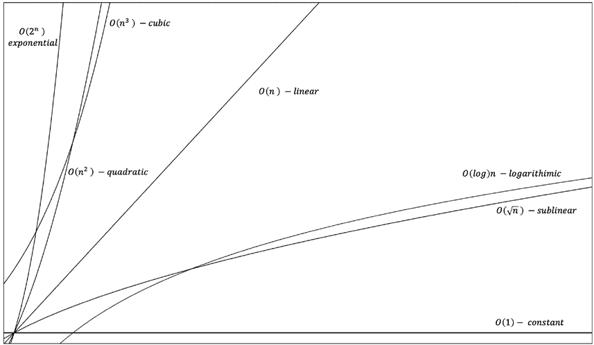

第九章 量子共识

***图 9-8\.** 大 O 复杂度图*

常见的大 O 复杂度顺序在表 9-1 中描述。

***表 9-1\.** 大 O 复杂度顺序*

**名称**

**大 O 符号**

**例子**

恒定时间

*O* (1)

查找一个数是奇数还是偶数

对数

*O* ( *log n*)

二分搜索

亚线性 (平方根)

*O* (√ *n*)

线性

*O*( *n*)

线性搜索

二次的

*O*( *n* 2)

插入排序

立方体

*O*( *n* 3)

简单的*n* × *n*矩阵的乘法

指数

*O*(2 *n*)

递归斐波那契

算法是包含一组特定指令的方法，用于解决

计算性问题。计算复杂度是研究问题分类的研究

不同问题的适当类别。自然地，这里需要正式

390

第九章 量子共识

根据计算资源对算法进行分类

求解问题所需的时间。为此考虑复杂度类。

随着量子计算的发展，出现了新的复杂性类。量子

计算机可以解决 NP 难的问题，而经典计算机不能。

存在许多复杂性类；我们将它们描述如下。

**P – 多项式**

多项式时间类别将问题分为多项式时间可解的问题，

也即是合理的时间。

**NP – 非确定多项式**

NP 类意味着可以更快地检查问题的解决方案，即可在

多项式时间。P 的一个例子是乘法，而因子分解是 NP。对于

例如，两个数字的乘法属于 P 类，而因子分解（找到

如果两个数字的乘积是可以验证的，那么验证解决方案就很快；因此，它属于 NP 类。

NP 完全问题是 NP 中的问题，并且所有 NP 问题都是

“多项式时间”可归约为考虑中的 NP 问题。NP 难问题

如果我们知道任何 NP 问题可归约为可能的 NP 问题

正在考虑的问题，但我们不知道问题是否属于 NP。换句话说，NP-

完全问题如果任何 NP 问题都可归约到这些问题，而 NP 难

意味着它们可归约于 NP，但我们不知道它们是否属于 NP。其中一个著名的例子

一个 NP 完全问题是旅行推销员问题。

**BPP – 有界错误概率多项式时间**

这一类包括 P。这些问题在多项式时间内以一定概率可解。

> ½. BPP 中的问题要么可以在多项式时间内决定性地解决，要么

概率上正确的大于三分之一的时间。

391

第九章 量子共识

**BQP – 有界错误量子多项式时间**

这一新类随着量子计算而出现。如果一个问题可以在 BQP 中解决

在量子计算机上以大于 ½ 的概率以多项式时间内正确解决，即高概率。换句话说，这一类包括经典计算机认为困难，而量子计算机认为容易的问题。

图 9-9 表示复杂性类。

***图 9-9\.** 复杂性类*

**PSPACE – 多项式空间**

这一类关注的是内存利用，而不是时间。PSPACE 中的问题

需要多项式大小的内存。

近年来备受关注的超计算的概念也与

量子计算。超计算的概念是它可以解决问题

例如图灵不完备问题。然而，已经有研究表明。

已经表明量子计算机可能比经典计算机快得多，但它不能

解决每个经典计算机无法解决的问题。即使在量子

计算机，图灵不完备问题无法解决。然而，研究仍在继续

在这方面，研究无限状态叠加和无限状态图灵机

这可能会导致构建超级计算机。

通过这个，我们完成了对复杂性的讨论。

392

第九章 量子共识

**其他量子系统**

随着量子计算的发展，将出现利用量子特性的新系统。

我们将它们讨论如下。

**量子网络**

量子网络与具有相同路由策略和的经典网络类似

拓扑结构。关键区别在于节点可以实施量子计算和

有关量子过程的相关。量子网络中量子设备之间的通道

可以是量子的，也可以是经典的。

**量子互联网**

就像 1969 年只有四个节点的 ARPANET 最终成为了今天的互联网

会有数十亿个 2 实体，预计小规模的实验量子网络将成为明天的量子互联网。

预计将建立量子网络基础设施

连接远程量子设备并实现量子通讯

量子互联网受量子力学法则支配。它传输

量子比特并分发纠缠的量子状态。随着节点数量在网络中的增加

量子互联网随着数量的增加而拥有更多的量子力量。这是因为随着数量的增加

量子比特的数量与网络上的量子设备数量成线性比例增长，量子

互联网可以实现量子指数加速，从而成为“虚拟量子

一个能够解决以前不可能的问题的“量子计算机”。

在经典网络中存在的传统操作，如长期数据存储

数据复制（复制）和直接状态读取在量子网络中不再适用：

• 由于在

量子世界迅速破坏信息，使其非常困难

依靠量子记忆/存储。

2 由于现在几乎所有东西都可以连接到互联网，因此使用了“实体”这个术语，其中包括用户、物品、设备等。

393

第九章 量子共识

• 由于量子世界中不可能进行数据复制

禁止复制未知量子的无克隆定理。

这意味着提高网络韧性的通常机制，例如

网络中，如重传等的应用不再适用。然而

注意，无克隆定理是安全的有价值的属性

通讯。

• 读取量子状态具有挑战性，因为在测量时，任何

量子比特立即坍缩为经典的单一状态 0 或 1\。

由于读取量子状态和与之相关的不确定性

由于无克隆定理，直接传输量子比特仅限于

非常特定的情景与短距离。

然而，量子传输可以用于传输量子比特。量子

通过利用一种称为纠缠的量子特性实现了传输，我们

之前讨论过的。利用纠缠，量子状态瞬时传输

在一个发送方的量子比特编码到接收方存储的量子比特是可能的。令人惊讶的是，这种转移发生在不将量子比特在发送方作物理转移的情况下。

纠缠是量子互联网的核心推动者。

量子互联网提供了几种奇异的应用，如盲目计算，

安全通信和无噪通信。

**量子分布式系统-分布式**

**量子计算**

随着量子互联网的出现，可以想象量子节点也将相互通信以合作和共同

使用分布式计算方法解决某些问题。本发展

必将导致分布式量子系统或分布式的出现

量子计算。

我们可以想到一种分层方法，在最底层有一个网络层

由经典和量子链接组成。然后我们有一层量子计算机

运行在下一层的。接下来是本地和远程操作，包括本地

对量子比特进行量子操作和远程操作。通过结合所有操作和

底层的计算层，可以想象一个虚拟量子计算机，

结合所有量子比特并导致可扩展的虚拟量子计算机。一个控制器

394

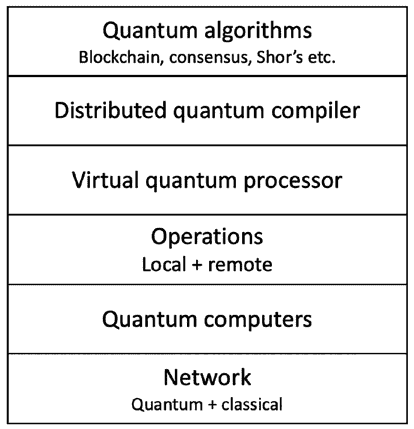

第九章 量子共识

或分布式量子编译器然后需要将量子算法转换为

一系列本地和远程操作。最后，我们在顶层运行一个层

量子算法。这种分层方法可以在图 9-10\.中看到。

***图 9-10\.** 一个抽象的量子区块链生态系统*

**量子区块链**

不可避免地伴随着量子互联网和量子分布式系统，我们可以设想

一个利用量子计算机作为节点和底层的量子区块链

量子互联网作为通信层。

量子世界中区块链有两个方面。第一个是

运行在量子互联网之上的纯量子区块链。一些工作已经完成

在这方面已经取得了一些成果，而 Rajan 和 Visser 提出了一项创新性的提案，即将

将区块链转变为时间性 GHZ 状态。

另一个方面是后量子世界中经典区块链的存在。

量子计算机可以对区块链和共识的安全性产生负面影响

由于能够破解经典加密。关于这一点，稍后在本章的最后一节会详细讨论。

395

第九章 量子共识

一个量子区块链可以包括几个元素。该量子区块链

可以同时具有经典和量子通道和设备。它可以存在为一个量子

算法，等等，在分布式的“分布式量子算法”层中

前一节讨论的量子计算生态系统。

在前一节我们详细阐述了一种分层方法。我们可以设想

运行在顶层的区块链和其他算法。整个层次的方法

代表量子因特网-基于分布式量子计算生态系统。

另一个元素可能是一个负责量子交易协调的协调员

交易排序和分发。另一方面，通过使用盲计算，

量子区块链可以立即实现无与伦比的隐私，这将

实现需要隐私的量子尺度区块链应用，例如，金融，

卫生和政府相关的应用。

**量子密码学**

量子密码术确实是量子计算中最受关注的方面，

特别是从它对现有密码学可能产生的影响的角度来看。

这里有两个维度；一个是量子密码学，另一个是后量子

量子密码学。量子密码学是指密码学原语或

基于量子力学性质的技术。例如，量子

密钥分发、量子抛硬币和量子承诺。使用量子

特性，可以开发一种新型的无条件安全机制，

在经典世界中没有对应物。量子密钥分发（QKD）协议，

例如 BB84，是由贝内特和布拉萨德于 1984 年提出的，允许两方

使用量子位构造私钥的安全性。这种量子方案的好处是

由于叠加效应，任何试图窃听的对手都将不可避免地被探测到。

量子密码学研究的另一个维度是其对

经典密码学的量子计算上的影响。我们知道使用 Shor 算法，

离散对数问题可以被解决，整数分解可以加速，这可能

导致破解常用的公钥密码体制，如 RSA 和

椭圆曲线密码学。在对称密码学上不会产生太大的影响

因为简单地增加密钥长度可以确保在经典世界中进行穷举搜索 *O*(*n*) 和使用 Grover 算法或类似方法在量子世界中的 *O*(*n*) 不再有效。

396

第九章 量子共识

进行了几种后量子密码学的研究，包括

基础密码学，基于代码的密码学，多变量密码学，哈希-

密码术，和同源密码学。

由于区块链共识机制使用密码术，而众所周知

受量子计算的影响，今天产生的区块必不可少

量子抗性，以至于当量子计算机能够这样做时，他们无法重新书写

区块链的整个历史。例如，比特币使用数字签名方案。

ECDSA，量子计算机可以破解。如果量子技术变得能够

即使在十年内破解了 ECDSA，他们仍然可以通过损坏

ECDSA。因此，有必要解决这个问题并应用一些量子

对已经产生和未来的区块产生抵抗。如果量子技术变得

能够在未来破解 ECDSA，否则对手无法重新编写区块历史。

正在付出巨大的努力，使这项技术得到发展并成为主流。

框架的结果在增强经典结果的同时，也可以解决一些。

比特币普遍来说并不安全，已经提出了 Lamport 签名来解决这个问题。

最多的量子位是 IBM 的 127 量子位鹰处理器上的 127 个。

因此，在不久的将来，打破椭圆曲线加密并不会成为现实。

到目前为止，我们已经讨论了量子计算是什么以及它对。

1 小时内破坏 ECC 加密，需要 317 × 106 物理量子比特的，但是当前。

我们将研究量子分布式系统中的一致性/共识以及量子计算对此影响。

此外，在量子网络中，在许多情况下都需要达成一致。

397

量子共识能容忍任意数量的不诚实的当事方，而且没有通常的较低界限。

限制是否适用？区块链是否能从这一进步中受益并改善区块链。

计算问题的影响，尤其是共识问题。我们可以让共识变得更快。

是否适用于比特币的问题？量子。

世界？有没有量子解决方案。

经典计算/网络世界，我们已经在本书中学习过。

世界正在通过量子计算的视角研究，以查看是否有。

**量子共识**

共识和区块链的其他方面，比如加密、安全、效率、量子计算对经典分布式系统，尤其是共识的影响正在被研究。

量子共识将带领配备一些量子比特的量子网络达到对称状态。

所需的量子计算机要破解椭圆曲线加密还需要数十年的时间。

此外，随着量子计算的出现，经典计算中的问题。

第九章 量子共识

以缓解这个问题。请注意，比特币在可预见的未来是安全的，而且。

计算很快就会彻底改变世界，目前已经付出了巨大的努力。

和扩展性?我们将在下一节中回答这些问题。

3 [`doi.org/10.1116/5.0073075`](https://doi.org/10.1116/5.0073075)

可以通过经典世界。

发挥量子力量。其中一个问题是来自于分布式共识。

兴趣。

量子计算有助于分布式系统吗？它能增加其效率吗？。

随着量子计算的革命性进步，一个自然的问题。

我们是否可以以一些新颖的方式规避 FLP，或者 FLP 在量子。

在经典计算上。我们还涵盖了量子计算的一些应用

在各个方面的改进，并且是无法在经典网络中解决的问题。

以及像门和电路这样的相关技术细节。有一点是清楚的: 量子计算。

纯量子共识对量子网络和量子互联网也是一个可以改进的领域。

在量子架构下研究经典分布式共识问题时显示，如果有。

在本节中，我们将更多地关注对经典结果的增强而不是

纯量子共识是指将具有一些量子位的量子网络带入

共识，即在对称态中。经典结果增强更相关于我们在本书中对共识的研究。

量子共识算法是一个非常活跃的研究领域。这里有四个

出现在这个背景下的类别：

• 对称态共识

• 基于纠缠的共识

• 基于测量的共识

• 基于量子密钥分发（QKD）的共识

对称态共识指任意量子状态的收敛

量子网络中的节点达成共识对称态。

基于纠缠的共识更相关于经典共识

问题。这是因为经典共识是通过这种方式进行调查的

量子计算的研究中，量子特性可以增强

经典共识，可以解决在其中被认为是无法解决的问题

经典共识世界。

398

第九章 量子共识

基于测量的共识的前提是，当测量进行时

量子态，它会坍缩为经典态，0 或 1。这样的机制可以

在量子节点而经典通道的量子混合网络中可能会有用。这种

量子态保留在量子计算机中，而经典通道用于

为了使通信达到共识。目的是允许量子的收敛

点到混合量子-经典网络中的一个共同状态。

基于 QKD 的共识已被提出来解决拜占庭协议

多个节点之间的问题。无条件的安全性

量子密钥分发（QKD）的特性对这种共识是基础的。

经典分布系统的参与者，包括有权的区块链，

由于高时间复杂性导致的共识本质上缓慢

使用经典协议如 PBFT，三阶段提交或 Paxos。通常，时间

这些共识算法的复杂性是*O*( *n* 2)，也就是，二次的。通过是否可能显着减少经典分布/区块链共识的时间复杂度

使用量子计算吗？简短的回答是肯定的。本-Or 和 Hassidim 提出了一个

快速量子拜占庭协议，解决共识在*O*(1)时间复杂度。

在下一节中，我们将介绍一些共识和协议算法

已在文献中引入了新的问题，由于量子特性显着

改进经典结果或为共识和相关的创新算法提供

量子世界的问题。

**快速量子拜占庭协议**

Michael Ben-Or 和 Avinatan Hassidim 提出了快速量子拜占庭

达成一致协议，在*O*(1)期望通信

轮。本文提出了两个结果：

• 一个量子协议用于容忍同步共识

t<n/3 故障，并在预期的常数轮次中行动。该

对手是故障停止，自适应的，全部信息的，和计算上

无限制的。

• 用于同步拜占庭协商的量子协议

容忍 t < n/3 故障参与者，并在预期的常数数量的

轮次。对手模型是自适应的，全部信息，和

计算上无限制的对手。

399

第九章量子一致性

系统模型包括 *n* 个节点，每对节点都连接

通过单独的双向量子通道。协议按轮次工作，每个

round 分为两个阶段。第一个阶段，所有处理器发送和接收消息，

和第二阶段是计算阶段，其中节点进行本地计算

进程收到消息并决定要发送什么消息。

协议满足以下条件：

• **协议**：所有非故障处理器决定相同的价值与

概率 1\。

• **有效性**：决定值是所有处理器的输入值。

• **终止**：所有非故障处理器决定具有

概率 1\。

记得我们在第[6](https://doi.org/10.1007/978-1-4842-8179-6_6)章曾经讨论过硬币翻转随机化协议。

特别是，我们讨论了本-奥尔算法，其中使用硬币翻转来实现

一个协议。基本上，协商问题被归结为弱全局硬币

翻转。

在量子世界中的想法是，不通过经典方法，而是通过量子技术获得弱全局硬币，

经典方法，我们使用量子技术获得弱全局硬币。通过这种

通过量子技术，如果 *n* > 3 *t*，可以容忍同步拜占庭故障，*O*(1)个预期轮次。但是如果 *n* < 3 *t*，一致性仍然是不可能的，但实现了*O*(1)轮的改进。

在异步模型中，如果 >3 *t*，则存在量子算法；然而，它是

如果 *n* < 3 *t*，则协商是不可能的。

对于故障停止故障的协议如下描述：

（*C*代表硬币，*L*代表领导者，状态是 GHZ。）

GHZ 状态

1

1

|*GHZ*〉=

|

〉

000 +

|

〉

111

√ 2

√ 2

每个进程 *Pi* 运行：

第 1 轮

1

1

1\. 生成状态 | *C* 〉 =

|，

0，

0 … 〉

0 +

|，

1，

1 … 〉

*i*

1

√

在 *n* 量子比特上。

2

√ 2

a. 将第 *k* 个量子比特发送给第 *k* 个玩家，同时保留一部分给自己。

400

第九章量子一致性

3/

*n* 2

1

2\. 生成状态 | *L* 〉 =

|

3 2 ∑

… 〉

*i*

*a*，*a*，*a*

/

*n*

在 *n* qubits 上，一个相等

*a*=1

1 到 *n* 3/2\的数字的叠加。

a. 在所有进程间分布 *n* 量子比特。

3\. 从所有进程接收量子消息。

第 2 轮

4\. 在第 1 轮中测量所有 *Lj* 量子比特。

5\. 选择具有最高领袖值的进程作为领导者

的轮次。

6\. 在标准基础上测量领导者的硬币。

7\. 获得领导者的硬币的测量结果

作为全局硬币。

使用此算法，可以获得弱全局硬币。任一

1

公共结果至少是 3 *t* < *n*。该协议适用于崩溃故障。

3

另一种拜占庭故障的协议在这篇论文中提出，它可以容忍

到 *t n*

< 在异步环境下的故障节点。

4

**如何反驳 FLP 不可能性**

[Louie Helm] 在另一篇论文中提出了一个有趣的主张，即可以通过

在异步环境中即使存在故障，也可以实现共识。

FLP 不可能。

Helm 提出了使用量子技术解决共识问题的协议。在网络中的一个

高层次上，该协议的工作如下：

• 纠缠量子位分布到所有节点。

• 每个节点测量它的量子位(s)。

• 最后，由于测量，叠加的量子状态将

崩溃，导致共识。

401

第九章 量子共识

这正是因为这里的量子纠缠保证了纠缠量子位

崩溃到相同的状态。这意味着所有节点最终会有相同的状态，

这意味着一致。

GHZ 状态用于实现这个方案。在这里做出的关键假设是

在设置阶段每个节点收到一个量子位，然后稍后测量它，这

导致所有节点产生相同的崩溃状态。

该算法的工作如下：

1\. 通过纠缠一组 n 个量子位准备 GHZ 状态。

2\. 从叠加的量子位集合中分发一个单个量子位到每个

节点。这一步在所有节点之间分发了一个共享状态

所有节点。

3\. 每个节点测量他们的量子位。注意，在这一阶段尚未作出决定

这个阶段。

4\. 如果量子位测量为 ∣0⟩，则选择 0\. 如果量子位

测量为 ∣1⟩。这是量子利益实现的地方。

当在节点上进行测量时，它的量子状态将

崩溃为 ∣0⟩ 或 ∣1⟩，概率相等。此外，具有

在节点上的第一次测量，所有其他节点的状态也将

同时和瞬间地崩溃为完全相同的

值，与首次进行测量的节点的值相同。这是可能的

因为纠缠和因此强相关性

量子位。现在由于所有节点具有完全相同的值，这个方案

达成共识。

一致性。提供了一致性，只是因为测量任何单个完整的纠缠量子位

在 GHZ 状态中导致了相同 GHZ 状态中的所有其他量子位崩溃到相同

基态。因为当在第一个量子节点上进行测量时，确定性实现了

节点，实际上是在提出 ∣0⟩ 或 ∣1⟩。

该协议可以容忍网络延迟，因为即使一个量子位延迟到达

量子节点，其他节点将继续工作而没有任何影响。当延迟发生时

量子位在任何时候到达，它也将已经包含约定的值，同样是由于

纠缠。使用这个算法可以反驳 FLP 不可能的根本原因是

因为它需要单向广播，并且不需要经典响应。即使一个

单个进程不测量它的量子位，它也不会影响整体结果

计算，即使那个单一的测量不可用，其他正确的 402

第九章 量子共识

节点将继续运行即使一个量子比特丢失。如果

原始 GHZ 态的分布完成成功。完成之后，

缺失的测量不会影响从那时起的协议。在情况下

拜占庭错误，该算法也具有弹性。任何恶意方都不能篡改算法最终选择的值。这是因为任何测量都不会

不会影响系统中其他量子比特的相关性。这意味着任何敌手

测量量子比特不会影响最终选择的值。由于量子特性，

量子比特最终总是会变成 0 或 1。这总是意味着最终将会做出决策，无论拜占庭错误如何。这实现了终止。

**增强型分布式共识**

Seet 和 Griffin 提出了量子计算如何加快一项协议的一致性协议

分布式网络。他们提出了一种新颖的量子共识机制。该工作

论文中提到的焦点是分布式共识的可扩展性和速度。

通过消除需要多重回复，共识速度和可扩展性

完成。此外，使用量子属性，确保只有一个

多点分发是必须的。实现共识的关键点是聚合波

收到的量子比特（来自其他节点）和量子节点的本地量子比特的波函数。

该方案的工作方式如下：

–

网络由量子计算机、通信

通道和经典计算机。通道可以是量子的

量子、经典-量子以及经典计算机之间。

–

每个量子计算机与经典计算机连接

存储和数据检索。

–

量子计算机创建每个量子比特的纠缠态。

–

将复制品发送给系统中的其他节点。

–

通过对每个量子比特波函数求和来确定共识。

–

量子比特可以直接从量子中测量

计算机计算每个量子比特的波函数。这个想法

围绕这样一个假设：每个量子比特的波函数

应该是相似的。在这里，期望是

获得的值应该彼此一致。

403

第九章 量子共识

–

借助叠加，这些量子比特的波长是一个标量

多个，即，*nψ*，其中*n*是参与

共识。

–

这里的技术是确定理想之间的差异

和实际系统的状态波函数。

–

如果参与共识的所有量子节点有一个一致的

状态，那么随机选择的结果将与任何一致

其他节点的状态。这可以与实际系统进行比较

状态波函数。

–

如果所有量子节点上存在相同的状态，则每个单独的节点的

波函数是系统状态波函数的标量倍数。

可以通过比较所有量子位的状态在本地完成。这与经典的高复杂性请求-响应式的消息传递方式形成对比，后者增加了时间和

010 |

然后波函数输出零。

如果节点上的状态不同，则该节点的波函数-

因此，系统状态波函数和

100 )

三个量子位是

为使用量子特性来选出领导者，提出了 W 态的使用。在

404

如果所有波函数都相同，则期望结果为零，

量子进程 i

1\. q =来自 W 态纠缠的第 i 个量子位，即来自 a

第九章 量子共识

〉+

由于纠缠的存在，它成为了不可检测的，从而增加了系统的安全性。

–

〉

1

改进了经典模型，例如减少时间

2\. 初始化 b = 0 和 result = wait

–

每个过程*i*的选举算法很简单

在论文中，该算法扩展到了多量子位系统。此外，还有几个

通过利用纠缠来减少状态验证的复杂性一半。尽管这还没有得到证明，但也可能在这里应用类似的阈值。

与经典共识相比，可以达到一半的时间完成共识。这样的

可以轻松解决。

随着节点状态之间的差异和系统状态的差异

Ellie D’Hondt 和 Prakash Panangaden 提出了一个量子解决方案，用于完全

在此，验证者只需接收纠缠的量子位，之后进行验证

和系统状态增长。容忍故障的程度可以被

差异越大，系统的非相干性就越大。

尝试独立操纵原始状态和发送状态立即退化

表明一个相干的系统。否则，系统不相干。

–

解决区块链三难问题。

该论文还提出了几个可扩展性、隐私和性能增强方案

如果差异不跌破一定的阈值，将无法检测。这

经典模型中被认为非常困难。

经典世界。

节点状态波函数不为零，表明有差异。

它减去系统中每个量子位的波函数之和。

同时也依赖于系统中节点的数量

用量子网络进行的正确领导者选举，这在

**量子领导者选举和共识**

将不是整个系统状态函数的标量倍。

| *W* 〉 = 

效率收益可以用于区块链以增加可扩展性。此外，任何

( 〉+

匿名网络中，如果量子节点共享 W 态，则领导者选举问题

通信复杂度。借助量子特性，这种复杂度被减少，而且

001 |

大约有 33%的网络节点可能是故障的。这是

3

这被用作对称破缺的量子资源。量子领导者

记得我们之前讨论过 W 态。例如，一个纠缠的 W 态

共识算法将随机选择的波函数进行

可能是总系统的一部分的百分比，符合经典的 BFT

–

3\. b= q 的测量

4\. 如果 b=1，那么 result=leader，否则 result=follower

405

第九章 量子共识

该协议的时间复杂度为*O*（1），即常数，并且不需要消息传递。这与经典世界完全相反，那里多轮

通常情况下具有更高复杂性的协议非常普遍。这种量子协议适用于

异步网络也是如此。

此外，还介绍了一个简单的一致性算法。领导选举是基于

对称破坏；然而，这种算法依赖于对称性保持。

思想是为了达成完全正确的匿名量子分布式共识

其中每个进程最初有一个 qubit，处理器需要以 GHZ 态纠缠。结果表明这不仅是必要的，而且是一个充分的条件。

协议的核心理念是在所有节点之间共享 GHZ 纠缠态

参与共识。这允许一步创建对称。

三个 qubits 的 GHZ 态如下

(| 〉+

000 |

〉

111 )

| *GHZ* 〉 =

√ 2

每个进程*i* 运行

q = n 个进程中的 GHZ 态的第 i 个 qubit

result=等待

result = measure q

再次，这个协议的时间复杂度为*O*（1），不需要消息传递。

该协议适用于不同的通信拓扑，并且在异步下也适用。

本文的结果表明 GHZ 对共识是必要且充分的。

此外，W 对于领导选举是必要且充分的

**其他算法**

存在着广泛的量子共识算法和相关的提案。这不是

可能在这里详细说明它们所有；不过，这一部分总结了一些

突出的结果。

卢卡·马扎雷拉，阿兰·萨莱特和弗朗切斯科·提科齐在“量子一致性”的文章中提出

网络：从对称到传闻迭代”的扩展经典分布式算法

将计算问题映射到量子系统的网络。他们提出了一个通用的

研究量子世界中的一致性问题的框架。同时，一个量子

以传闻方式的算法在文章中提出。

406

第九章 量子一致

“在量子混合网络中达成一致”由史国栋，

Bo Li, Zibo Miao, Peter M. Dower 和 Matthew R. James。本文所考虑的问题

本文的目的是驱动由持有量子节点的量子混合网络

qubits 到达共同状态，从而达成共识。关键思想是量子节点

测量这些 qubits，并且测量的结果通过经典

通信链路交换。

已经证明，即使是经典的拜占庭将军问题也是不可解的

使用成对量子通道。然而，拜占庭协议的变种

问题称为**可检测拜占庭协议**（DBA），可以通过使用

量子属性。DBA 协议确保所有将军同意一个命令

或全部中止，也就是说，达成协议的属性，如果所有将军都忠诚，他们就会在一个命令上达成一致，也就是说，合法性。

“无纠缠的多方量子拜占庭协议”

由 Xin Sun、Piotr Kulicki 和 Mirek Sopek 撰写。通常，纠缠性质用于

量子共识算法。但这个算法不同，在这里纠缠是

没有使用。相反，该协议依赖于量子密钥分发及其无条件

安全性。该协议依赖于共享的相关数字序列

公正量子密钥分发者。

还有其他提议，其中使用量子区块链的概念

时间 GHZ 被引入。

关于量子共识有一些创新性的结果，而且

研究人员正在提出越来越多的发展。我们介绍了其中的一些

先前的结果。可以增强经典的分布式共识的量子算法

结果特别重要，因为它们可能会影响经典分布系统

不久的将来。其他纯量子结果也很迷人，但只有在未来量子互联网和相关的量子生态系统变得完全有用时才会完全有用

现实性。

**摘要**

由于量子计算是一个广阔而深入的主题，我们并没有涵盖所有内容。然而，

本章应该让我们对量子计算以及它如何

有益于分布式系统和共识。摩尔定律几乎终结了，所以

与量子计算一起，我们可以使它复兴。在计算机科学中，更复杂

407

第九章 量子共识

由于量子计算，新的复杂性课程正在出现。对于物理学家，兴趣在于

更多了解量子理论。

本章使我们有直觉更深入地思考并做好准备

以供进一步研究和探索。需要记住的主要观点是，它在很大程度上

量子共识机制利用了量子叠加和

纠缠。

在下一章中，我们总结了本书中提出的所有思想和一些奇异的

想法和未来研究方向。

**参考文献**

1. Rohde, P.P., 2021. 量子互联网：第二次量子

革命。剑桥大学出版社。

2. Cuomo, D., Caleffi, M., and Cacciapuoti, A.S., 2020. 朝着

一个分布式量子计算生态系统。*IET Quantum*

*通信*，*1*（1），第 3-8 页。

3. LaPierre, R., 2021. 量子门。在*引入量子*

*计算*（第 101-125 页）。Springer，Cham。

4.美国国家科学院、工程院和医学院

2019. *量子计算：进展与展望*。 国家

学术出版社。

5. Marcozzi, M. and Mostarda, L., 2021. 量子共识：一种

概述。*arXiv 预印本 arXiv:2101.04192*。

6. SEET, Jorden and GRIFFIN, Paul. 量子共识。 （2019 年）。

2019 IEEE 亚太计算机科学和数据

工程（CSDE）2019：12 月 9-11 日，澳大利亚墨尔本：

论文集。1-8. 计算机和研究收集学院

信息系统。

7. Ben-Or, M. and Hassidim, A., 2005, May. 快速量子拜占庭

协议。在*第三十七届 ACM 年会论文集*

*计算理论研讨会* (pp. 481–485).

408

第九章 量子共识

8\. 量子算法: [`zh.wikipedia.org/wiki/量子算法`](https://en.wikipedia.org/wiki/Quantum_algorithm)

[算法](https://en.wikipedia.org/wiki/Quantum_algorithm)

9\. Rajan, D. 和 Visser, M., 2019\. 使用量子

量子纠缠。*量子报告*, *1*(1), pp. 3–11\.

10\. Stinson, D.R., & Paterson, M.B. (2018). 密码学: 理论

习题与练习 (第四版). Chapman and Hall/CRC. [`doi.`](https://doi.org/10.1201/9781315282497)

[org/10.1201/9781315282497](https://doi.org/10.1201/9781315282497)

11\. Helm, L.K., 2008, 八月. 量子分布式共识. In

*PODC* (p. 445).

12\. 可伸缩性三难题[: https://vitalik.ca/general/2021/04/07/](https://vitalik.ca/general/2021/04/07/sharding.html)

[sharding.html](https://vitalik.ca/general/2021/04/07/sharding.html)

13\. Lamport, L., 1979\. 从单向数字签名构造数字签名

功能。 (Lamport 签名).

14\. Pinski, Sebastian. (2011). 绝热量子计算

15\. Mohr, A., 2014\. 复杂理论和分布式共识中量子计算

计算理论。*卡本代尔, IL*, *194*.

16\. Sun, X., Kulicki, P., 和 Sopek, M., 2020\. 多方量子

无纠缠的拜占庭协议 *熵*, *22*(10),

p. 1152\.

17\. Fitzi, M., Gisin, N., 和 Maurer, U., 2001\. 量子解决方案

拜占庭协议问题。*物理评论快报*, *87*(21),

p. 217901\.

18\. Webber, M., Elfving, V., Weidt, S., 和 Hensinger, W.K., 2022\.

硬件规格对达到量子效益的影响

在容错范围内具有优势的方法。*AVS 量子科学*, *4*(1),

p. 013801\.

409

**第十章**

**结论**

恭喜你走到这一步！我们走了很长一段路，获得了许多信息

本章概述了一些重要主题。我们还将探讨

了一些最新研究和想法，并涉及更多的共识协议。一个

共识协议研究的一个重要方面是形式化设计和验证

本算法。我们将在本章简要解释这一重要领域。同时，我们会比较

一些最常见的共识协议从不同角度介绍并引入

一些重要的研究方向

**引言**

共识协议是分布式系统的基础，尤其是

区块链。在本书中，我们讨论了几个协议和相关

主题。目前，区块链是实现

共识协议。事实上，它们是区块链的核心。使用区块链，正在引入新的方案，解决各种问题，包括

节点可伸缩性，交易吞吐量，共识效率，容错性，

互操作性，以及各种安全方面

分布式共识几乎被网络设备之间的所有地方使用

不仅是我们所熟悉的传统分布式系统。这包括物联网、多代理系统、分布式实时系统、嵌入式系统，

和轻量级设备。随着区块链的发展，区块链共识

预计在这些系统中的所有这些系统中都会增长。

**其他协议**

在本节中，我们将简要介绍之前没有涉及到的协议。鉴于这是一个广阔的领域，我们只会进行简要介绍。

411

© Imran Bashir 2022

I. Bashir，*区块链共识*，[`doi.org/10.1007/978-1-4842-8179-6_10`](https://doi.org/10.1007/978-1-4842-8179-6_10#DOI)

第十章结论

**PoET**

时间算法是由英特尔于 2016 年引入的。请记住我们

在第五章[讨论](https://doi.org/10.1007/978-1-4842-8179-6_5)中，PoW 的一个关键目的是让网络在收敛到一个规范的链之前经过一段时间。此外，领导者，矿工

其区块被接受，通过解决 PoW 来赢得这个权利。PoET 在本质上

利用可信硬件确保在选择下一个领导者提出区块之前已经过了一定的时间。基本思想

在 PoET 中的一个目标是通过随机等待来提供领导者选举机制，以便被选为领导者

作为提出新区块的领导者。

PoET 实际上模拟了 PoW 挖矿耗费的时间。

核心思想是每个节点在生成区块之前随机等待一段时间。

随机等待过程在可信执行环境（TEE）内运行

确保真实的时间确实已经过去。为此，英特尔 SGX 或 ARM TrustZone

可以使用。由于 TEE 提供了机密性和完整性，网络反过来信任

区块生产者。PoET 容忍高达 50%的故障 TEE 节点。然而，有

可能存在 Sybil 攻击的可能性，其中某个角色可以运行许多 TEE 节点，这可能导致

缩短随机等待时间。这可能会导致创建一个恶意链

如果超过 50%的 TEE 变得恶意。另一个限制是旧芯片问题

Ittay Eyal 指出。这个限制导致了硬件的浪费，导致

在资源浪费。旧芯片问题源于这样的想法，即在经济上

对于恶意行为者来说收集许多旧的 SGX 芯片是有利的，这增加了他们成为下一个区块的生产者的几率。例如，敌对行为者可以收集

许多旧的 SGX 芯片来构建挖矿设备。它只服务一个目的，就是挖矿，

而不是购买具有 SGX 的现代 CPU，这将有助于 PoET 共识，并且

对一般计算可能是有用的。而是可以选择收集尽可能多的旧的 SGX-

启用了芯片，因为他们可以增加赢得挖矿彩票的几率。此外，旧的 SGX 启用的 CPU 价格便宜，可以增加旧的、低效的 CPU 的使用。它是

就像比特币矿工竞相获取尽可能多的快速 ASIC 一样，以增加成为选定矿工的机会。 然而，这导致了硬件的浪费。 还有

黑客攻击芯片硬件的可能性。 如果 SGX 芯片受损，那么恶意

节点可以每次赢得挖矿轮，导致完全系统妥协

和矿工的不当激励。 这个问题被称为破损芯片

问题。

412

第十章 总结

**权威证明**

我们可以将 PoA 看作是一种特定类型的验证者抵押

与他们的身份而不是经济代币。 验证者的身份描述

与验证者关联的权威。 赢得权威的常规过程涉及

身份验证，声誉建立和公开审查的评估过程。

由此产生的群体成为高度受信任的验证者集，参与

共识协议并产生区块。 如果验证者违反了规则

协议或无法证明获得生产块的权利会导致其他验证者和网络用户删除不诚实的验证者。 它用于以太坊 Rinkeby 和 Kovan 测试网络。 PoA 提供了很好的安全性，因为我们有信任的验证者

在网络中，但网络有点集中化。 对抗串通和其他安全威胁的弹性取决于验证者使用的共识算法。 如果

这是建立此协议的方法，通过微调现有的效率来改进

**HoneyBadger BFT**

HoneyBadger BFT (HBBFT)是一种无领导和随机共识协议，该协议

在异步中工作。 它是第一个实用的异步拜占庭共识

协议。 一般来说，在分布式系统理论中，随机化算法被认为

不切实际。 HoneyBadger 协议的作者声称驳斥了这一观点。 该

的方法。

原语并引入新的加密技术。 这些技术导致

消除协议中的瓶颈。

要解决的第一个限制是领导者瓶颈，例如在 PBFT 和

其他变种中有一个标准的可靠广播机制用于传播

领导者向其他节点发送信息。 这大大减少了带宽

消耗，例如*O*(*nB*)的数量级，其中*b*是块数。 要解决这个限制，可以使用纠删码，它允许领导者只发送纠删码

代码发送到节点。 然后，每个节点将接收到的纠删码条发送到其他

节点。 这样，领导者的负载较小。 然后所有节点简单地重建

消息。 这将领导者的带宽降低到*O*(*n*)。 HBBFT 中以批处理方式处理交易，这增加了吞吐量。

413

第十章 总结

它基本上是基于多值拜占庭原子广播协议

协议和共识，HoneyBadger 使用了几种技术

开发先前，包括擦除编码可靠广播和共同硬币-

基于异步拜占庭协议。它还使用了阈值公钥加密

（签名）以为随机的 ABA 协议提供共同硬币。

HBBFT 使用异步公共子集实现总体顺序

（ACS）。ACS 使用另外两个协议来实现，可靠广播（RBC）和

异步二元拜占庭一致性协议（ABA）。

可靠广播是由 Bracha 于 1987 年引入的，通常被称为 Bracha 的

广播。这个协议容忍*f*拜占庭故障节点，其中*n*= 3*f* + 1。它提供了两项保证，当指定节点（领导者、广播者）向

所有节点。如果任何诚实的节点传递了广播者广播的消息 m，那么所有正确的节点都传递 m。其次，如果广播节点是正确的，那么每个诚实的节点都传递了广播节点广播的消息。由于消息正在

从所有节点回响到所有节点，此协议的通信复杂性变为

*O*（*n* 2 *m*），这对于较小规模的网络来说是可以的，但是在拥有数千节点的区块链世界中，这是不切实际的。

关于多方计算（ACS for

MPC）的一个共同子集协议的协议达成了一致性（ACS）是由本-Or 提出的。ACS 被用作多方共识的原语

异步网络下的计算。多方计算（MPC）旨在

创建一种机制来联合计算它们的输入上的函数，同时输入是

保密。ACS 至少在*n* - *f*正确输入的一个共同子集上达成了一致性。ACS 使用 RBC 和 ABA，从而使各方之间能够达成单个比特的一致

由于 RBC 的通信复杂性，HBBFT 实现了一个不同的

带宽有效的广播机制，由 Cachin 等人提出的 AVID，使用

擦除编码和交叉校验和来降低通信复杂性至*O*（*nm*）。

在这里，消息 m 被擦除编码为不同切片，然后每个切片被散列以产生交叉校验和。广播者将一个切片和交叉校验和发送给 a

节点，然后该节点将这些回显到所有其他节点。一旦所有切片到达所有节点，每个节点都从这些切片中重建原始消息。这样，带宽就会少一些

被消耗。

总之，HBBFT 通过使用异步解决了共识在异步下的共识

共同子集协议（ACS）和可靠广播（RBC），其中每个节点提出

其价值，并最终运行异步二元协议（ABA）

决定每个提案。

414

第十章 结论

**雪崩**

这种新的共识协议范式通过随机方式实现了一致性

网络采样。雪崩系列协议允许更放松的形式

一致性与确定性协议相比提供更强的

安全性比 PoW 更好，并享有 Nakamoto 共识的节点可扩展性。我们可以

将其视为传统基于法定人数的协议的概率版本

在投票中没有明确的相交。关键思想是将 Nakamoto 家族的优点与经典家族的优点结合起来。

这些协议的安全性是概率性的，但失败的可能性微乎其微。

就活跃性而言，这些协议以很高的概率终止。对于活跃性，这些协议依赖于同步。该协议通过亚稳态实现了安全性。安全

由协议提供的是概率性的，其中选择了安全性

参数使共识失败的可能性微乎其微。该协议

以高概率保证安全性和活跃性：

• **安全性：** 没有两个正确的节点会接受冲突的交易。

• **活跃性：** 每个正确的节点最终都会接受任何交易

由一个诚实的客户。

这个家族有几个协议，组成了完整的 Avalanche 协议。

该协议逐渐构建，从所谓的糊状协议开始，提供亚稳定性，雪花，BFT 协议，通过添加来确认状态

对决策有信心；最后，Avalanche，它将 DAG 结构添加到

提高效率。

有了这些创新，该协议提供了快速的最终性，低延迟，高

吞吐量和可扩展性。

**基于 DAG 的共识协议**

通常，区块链是一个线性结构；然而，另一类算法已被提出，具有非线性的区块链结构。主要目的是效率，而这些

协议基于一个前提，即不应该依赖于有限且缓慢增长的链，而是应该能够在所有方向上扩展分类帐，就像 DAG 一样，这可能会提高性能，提高可扩展性，并快速确认交易。DAG 需要较少的通信，计算和存储，从而提高性能。

有两种类型的基于 DAG 的分类帐：基于区块的 DAG 和基于交易的 DAG。

415

第十章 结论

**基于区块的 DAG**

blockDAG 的每个顶点都包含一个块。每个块可以是多个的子节点

区块，而不是在线性设计中只有一个父节点，SPECTRE，PHANTOM 和

Meshcash。

**基于交易的 DAG**

交易型 DAG 的每个顶点都包含一个交易。IOTA Tangle，Byteball

Graphchain 和 Avalanche 是基于交易的 DAG 的一些例子。

Hashgraph 是一种具有 BFT 类型共识的许可图形的区块链

协议。

**Ebb-and-Flow 协议**

这项工作是对 Gasper 中发现的活跃性问题的回应。Gasper 是基于 PoS 的

以太坊信标链提出的一种共识机制。它是 Nakamoto 家族的最佳结合

Casper FFG，最终性装置，和 LMD GHOST，分叉选择规则。在这项工作中

提出了可证明安全的“快照和聊天”协议。

Nakamoto 式协议在网络分区和动态情况下提供活跃性

网络参与度，但会牺牲安全性。BFT 协议，另一方面，提供了安全性（最终性），在网络分区和低参与度下提供

另一方面，在网络分区和低参与度下提供安全性（最终性）

（参与者少于<3 *f* +1）但会牺牲联通性。已经证明，协议在动态参与度下实现联通性并且在

网络分区的方式。这项工作回答了一个问题，即是否存在一种共识

可以保证同时具有可用性和安全性。这个关键的想法是精妙的，而且

提议创建两个账本而不是一个。请记住，没有任何协议可以确保安全性

在网络分区和动态分区下提供一个账本的安全性

换句话说，最长链机制更青睐联通性而非安全性，并提供

不同参与水平下的动态可用性；但是，BFT 协议更青睐

安全性而牺牲联通性，并提供最终性。这个问题被称为可用性-最终性困境，因为一个账本无法同时提供这两种属性。因此，建议创建两个账本。第一个是“可用完整账本”，始终是活跃的，但只在没有网络分区时安全，类似于“最长链–式的 PoW 协议”。另一个

账本，“已确定的前缀账本”，在低参与度的情况下始终是安全的，但不是活跃的。这一概念与传统的 BFT 风格协议相同，例如

416

第十章 总结

PBFT 是一种会停滞的共识机制，除非参与者达到一定阀值。由于已确定的前缀账本是可用完整账本的前缀，两个账本最终会汇聚成一个包含多个区块链的链。

单一真实的历史链。换句话说，已确定的前缀账本在网络分区下和少于三分之一的参与者是有故障的时候是安全的。

此外，在动态（低）参与度下，可用完整账本是实时的，但会牺牲联通性。

如果活跃参与者的 <50% 是拜占庭式的。通过这种将 BFT 风格与

中本聪式协议并创造所谓的嵌套账本已被命名为

“涨潮和落潮”属性。所谓的“快照和聊天”协议是为了

实现“涨潮和落潮”属性。已确定的账本始终都是

可用账本，从而创建一个合并的正确单一链。在高层次上，这个

这个机制通过将交易订到一个区块链中来工作，通过一些最长

链式协议，例如 PoW。接下来，从这个区块链中的前缀获取快照

用于部分同步 BFT 风格的协议，例如 PBFT，产生

接下来，任何重复或无效的交易都会被移除，从而创建一个已确定的前缀账本。这个已确定的前缀账本会在类似 PoW 的协议输出之前添加，同时会删除任何重复或无效的交易。

被移除。最终，这个过程创建了一个可用的单一账本。

现有许多共识协议，但我们无法涵盖所有。

然而，我们确实探索了许多不同类型和类别的领域，包括

随机化，确定性，CFT，BFT 和 Nakamoto 风格的协议。

现在让我们转向形式验证，以确保我们

所有这些不同的共识协议的正确性。

**正式验证**

随着区块链共识研究的活跃，我们现在能够欣赏到

是如此活跃的研究领域。已经提出了许多新的协议来解决

创新的方式解决共识问题。例如，一些致力提高效率，一些

关注可扩展性问题，有些试图减少消息复杂性，有些修改

存在的经典协议使其适用于区块链，有些试图加快

协商机制，以及声称有许多其他改进和新奇之处。

在这里，一个问题出现了：我们如何确保这些共识协议是正确的

并以我们期望的方式运行？为此，通常研究人员编写研究文章。

有关协议正确性的证明和论据的论文。此外，

正式方法用于确保协议正确性。

417

第十章 结论

正式方法是用于将系统建模为数学对象的技术。在

换句话说，这些是数学严谨的方法，用于指定、设计和

验证软件或硬件系统。这些技术包括编写规格

在正式逻辑中对其进行验证，采用模型检查和正式证明。正式

方法分为正式规范和正式两个广泛的领域

验证。第一个领域涉及撰写精确而具体的规范，后者则涉及证明规范的正确性。

正式规范是一个明确定义的数学逻辑陈述，

验证是通过逻辑演绎检查规范的过程，这

是机械地完成。换句话说，规范被正式定义，然后

使用模型检查器或定理证明器验证。

正式方法提供价值的原因是它可以象征性地检验

设计的整个状态空间并确保设计的正确性。

一般来说，正式验证包括三个步骤：

• 创建待检查系统的正式模型。

• 编写要满足的属性的正式规范

由我们的模型。

• 机械检查模型以确保模型满足

规范。

通常用于验证的两类技术是状态探索-

基于方法和基于证明的方法。基于状态探索的方法是

自动但效率低且难以扩展。例如，一个常见的问题是状态爆炸，要检查的状态数量增长得如此快速，以至于

模型不适合计算机的内存。这就是模型必须是有限的原因，

以便可以高效地验证。另一方面，基于证明的方法（即，

定理证明）更为精确且占用内存较少，但需要人工

交互和证明相关技术的更深入知识。证明-

基于技术是推理系统属性的最优雅方式

没有限制规模的规范。这与模型检查相反，那里

模型的大小必须受到限制。通过基于证明的技术，可以

推理系统状态并证明系统始终能够

正常工作。例如 Isabelle 等证明助手被用于推理系统，允许自动化定理证明。

418

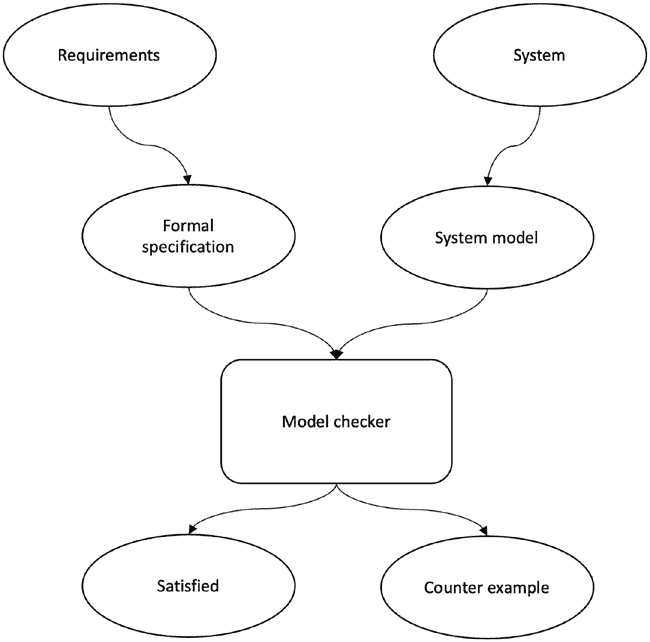

第十章 结论

模型检查机制包括正式规范语言和

模型检查。模型检查使用自动化工具正式验证系统。

这种方法在区块链研究人员中越来越受欢迎，以检查正式

共识协议的规范并确保其正确性。自动化

检查器检查要满足的条件，然后确认条件是否满足；否则，它会产生反例（即异常）

图 10-1 说明了模型检查机制。

***图 10-1**。模型检查*

TLA+（行为时间逻辑）是 Leslie 设计的规范语言

Lamport 用于描述和推理并发系统。TLC 是一种模型检查器

用于 TLA+编写的设计规范。另一个模型检查器是 SPIN，可进行检查

用 Promela 规范语言编写的设计规范。

419

第十章 结论

分布式区块链共识算法通常会根据两个进行评估

正确性属性的类别：安全和活跃性。安全通常意味着“不会发生

恶劣事件”，而活跃性则表示“最终会发生一些好事”。

这些属性都有一些子属性，取决于要求

通常，对于共识机制，我们有协议一致性、完整性和有效性

安全属性下的条件，并且终止是活跃性所要求的

一致性算法大多数在系统模型下使用模型检查来进行验证

系统中有多少节点以及对系统做了什么时间假设。

系统。然后运行模型来探索系统的每个状态，并检查是否有一个执行不会终止。通常是在基于四个节点的模型下进行，基于

根据我们之前看到的 3f+1 的公式。

如果在所有可能的执行中，程序的行为都是正确的，则程序是正确的

按照规范进行。

**不可能结果**

分布式系统中无法解决的问题显示出，某些问题是无法

解决。下界结果表明，如果资源有限，某些问题是无法解决的

是不够的；换句话说，这些下界结果表明，某些问题是无法

仅在可用足够资源的一定阈值条件下才可解决，也就是说，

解决问题所需的最小资源。

表 10-1 总结了与共识问题相关的核心不可能性结果。

420

第十章 结论

***表 10-1\.** 共识问题的不可能性结果*

**崩溃故障**

**拜占庭故障**

同步

如果 *f* < *n* 则可能达成共识

*f* ≥ *n*/3 不可能

至少需要 *f* + 1 轮，其中

>2 *f* 网络连接

*f* < *n*

最低

> *f* 网络连接

*f* < *n*/2 可能

*f* + 1 轮

异步

确定性共识不可能

确定性共识

不可能

部分地

如果 *n* ≤ 2 *f* 则不可能

如果 *n* ≤ 3 *f* 则不可能

同步

>2 *f* 网络连接

*f* + 1 轮

表 10-1 中的结果是标准的共识问题不可能的结果。然而，还有许多其他结果。

随着对区块链的创新研究，一些新的结果已经出现。

Andrew Lewis-Pye 和 Tim Roughgarden 宣布了一个新的令人着迷的不可能性

结果类似于 CAP 定理，我们只能同时选择两个

三种属性。它声明没有区块链协议可以在无约束条件下运行

环境（如 PoW），在同步环境下以显著和

网络资源的急剧动态变化（如参与者数量），并且满足

部分同步环境中的概率确定性终局性。我们可以

只能同时选择前面三种属性中的两种属性。

例如，在像比特币这样的不定大小的环境中，想象一下一个节点停止

接收任何新的区块。现在，节点无法区分其他节点

节点已经耗尽了资源，无法再产生区块，如果区块

消息被延迟。现在，如果节点停止产生区块，其他节点的资源不足

对资源的依赖性和不产生区块，违反了活力属性，因为这个

即使其他节点不工作，也必须继续产生区块。但是，如果它继续产生

区块，但是区块消息只是延迟了，那么就违反了一致性

属性，因为可能存在其他延迟的有冲突的区块。

421

第十章 结论

**复杂性和性能**

一致性算法可以从通信复杂性的角度进行评估

视图。这涉及诸如协议是否在正常模式下运行（没有

失败），那么需要交换多少消息才能达成共识。

此外，在领导者失败时，当发生视图变更时，需要多少消息

交换？这样的度量可以帮助理解算法在实践中的行为，

有助于估计算法的效率。

消息延迟可以定义为算法需要的消息数量

不能在前一个消息接收之前发送的消息。换句话说，这是一个

只有在前一个消息被接收后才能发送的消息。一种算法

需要 n 消息延迟；如果某个执行包含 n 条消息链，每条消息

不能在接收前发送。

为了评估与算法相关的成本，我们可以考虑不同的

复杂性特征。共识算法有三个成本：消息

复杂度、通信复杂度和时间复杂度。

**消息复杂度**

消息复杂性表示所需的总消息数量

由算法交换达成共识的消息数量。比如，想象一种算法

所有进程广播到所有其他节点的位置。这意味着会接收到*n*( *n* − 1)条消息。这意味着该算法具有*O*( *n* 2)的消息复杂性。

**通信复杂度（比特复杂度）**

通信复杂度涉及所需的总位数

算法交换的消息数量。想想我们之前想象的相同算法

消息复杂度的上下文。如果每条消息包含 t 位，算法交换

*tn*( *n* − 1)位，这意味着通信复杂度为*o*( *tn* 2)位，也就是说，全对全。

422

第十章 结论

**时间复杂度**

时间复杂度涉及完成

算法的执行。执行算法所需的时间也取决于

协议传递消息所需的时间。传递消息的时间

相对于消息的局部计算来说，时间会更大

被视为连续消息延迟的数量。与上一章的相同算法

在一个无故障网络上运行的前述例子拥有*O*(1)的时间复杂度。

**空间复杂度**

空间复杂度涉及算法运行所需的总空间量

空间复杂度在共享内存框架中更为相关。

在消息传递的分布式系统中，比如区块链，主要是消息

复杂度是被认为是重要的。比特复杂度并不那么相关；但是，如果大小

消息很大，那么这可以成为另一种要考虑的复杂性度量

考虑。

表 10-2 总结了一些常见 BFT 协议的复杂性结果。

***Table 10-2\.** 消息复杂性排序*

**协议**

**正常模式**

**视图更改**

**消息延迟**

paxos

*O*( *n*)

*O*( *n* 2)

4

pBFt

*O*( *n* 2)

*O*( *n* 3)

5

tendermint

*O*( *n* 2)

*O*( *n* 2)

5

hotstuff

*O*( *n*)

*O*( *n*)

10

Dls

*O*( *n* 2)

*O*( *n* 4)

*O*( *n*)轮

honeyBadger

*O*( *n*)

−

−

poW

*O*( *n*)

−

−

在考虑这些成本的基础上，我们可以考虑区块链中的若干瓶颈

导致性能不佳的共识协议。比如，选择全对全

所有消息将不可避免地导致更多的复杂性。

423

第十章 结论

可以使用多种技术，比如纠删码，来减少消息

复杂度。另一种技术叫做星型拓扑（一对全 – 全对一），而不是

网状拓扑（全互连通信），也可以减少消息复杂度。两者

这些技术分别用于 HoneyBadger 和 HotStuff。

旨在改进性能和可伸缩性的另一类算法

允许多个节点在并行中充当领导者的共识算法之一，即并行领袖。在这种范式下，多个领导者可以同时提出，这

通过将负载均匀分布在 CPU 和带宽成本中，减少成本的结果

所有领导者。在这个类别中有几种算法，如 HoneyBadger，Hashgraph，

和 RedBelly。然而，并行可能导致请求重复

领导者，这在 Mir-BFT 协议中已得到解决。

分片是改进共识性能的另一种技术。它允许

将系统状态和验证者分成更小的部分。每个碎片

负责一个小部分整个状态，并且仅需要全局验证者集的较小子集来在该状态部分达成共识。通过这种方式，在

并行存在许多碎片，并通过允许共识在更小的部分上运行，实现了很大的

实现了效率。为了达到最终状态，一些跨碎片通信和

还需要一种合并机制。

另一种改进吞吐量的技术是从主链中卸载数据

到第 2 层。在这方面发展了一些技术，如支付渠道，

Bitcoin 的闪电网络，承诺链和 Plasma。诸如零之类的技术

知识被用来提供脱链执行的证据。Prism 和 Bitcoin-NG

是一些技术，以改进共识性能。

之前讨论的基于 DAG 的共识旨在通过

引入基于图的结构，允许非相互依赖的命令

并行提交。

命令/智能合约的并行执行也是一种技术

提出以改进性能。并行智能合约（称为 Sealevel）是

在 Solana 区块链中支持。

**各种协议的比较**

我们可以从不同角度比较共识算法。Table 10-3

总结结果。

424

第十章 结论

***表 10-3。** 主要共识算法的比较*

**属性**

**POW**

**POS**

**POA**

**RAFT**

**PBFT**

安全性

概率性

概率性确定性

确定性

确定性

对手

计算

质押

共谋/

共谋/

共谋/

控制权

量

拜占庭

崩溃

拜占庭

方法

数学难题

价值

权威

领导-

主要

解决

存款

追随者

备份

网络

同步

同步同步

部分

部分

模型

同步

同步

激励

是

是的

无

无

无

访问

公开

公开

许可式

许可式的许可式

控制

区块

区块头

质押规则识别检查

封存检查

封存检查

验证

检查/工作量证明有效

确定性

概率性

经济

确定性

立即

立即

大于 50%的验证者

协议

不道德 Cpu/memory

质押

BFt

CFt

BFt

控制

资源

罚款

选举类型抽奖

抽奖

投票

投票

投票

活性

概率

概率确定性

确定性

确定性

上限

a over C

a over C

a over C

p over C

p over C

交易

10s

100s

10s

1000s

1000s

容量

故障

BFt

BFt

BFt

CFt

BFt

容忍

分叉

是

是

否

否

否

特殊的

是

否

否

否

否

硬件

( *继续*)

425

第十章结论

***表 10-3\.*** ( *继续*)

**属性**

**POW**

**POS**

**POA**

**RAFT**

**PBFT**

例子

比特币

tezos

rinkeby

GoQuorum

sawtooth

动态

是

是

否

是

否

成员资格

注意：

• 假设 PoA 基于 BFT。

• 虽然只提供了一个例子，但实际上有很多例子，比如说

以太坊也使用 PoW。

• PBFT 和 RAFT 都是带有

领导者-跟随者架构，也称为主备。通常，

对于 PBFT，文献中使用了主备；然而，对于

RAFT 领导者-跟随者术语被使用。从根本上讲，它们的作用是

同样的目的。

**网络模型**

我们可以用几种方式来模拟区块链网络，如下所示。

从根本上讲，网络要么是同步的、异步的，或者是部分

同步。然而，文献中使用了几个术语，如下所述。

**同步的**

所有消息都在时间δ *内被传递

**最终同步**

在未知的全局稳定时间（GST）之后，所有消息都会在

δ *时间。

**部分同步**

协议并不知道δ是多少。

426

第十章结论

**弱同步**

*δ*随时间变化。实际上，*δ*会逐渐增加，直到保证活性。

然而，延迟不会呈指数级增长。

**异步的**

所有消息最终会被传递，但消息传递没有固定的上限

交付时间。消息传递延迟是有限的，但对此没有任何时间限制。

对手主要是静态对手和适应性对手。

静态对手在协议执行之前进行腐败，而

适应性对手可以在协议执行期间的任何时间都导致腐败。

有两种崩溃模式，崩溃故障模式和拜占庭故障模式。

基于轮的算法有发送步骤、接收步骤和计算步骤，这使得

一个轮次。

我们可以考虑几个一致性协议的方面，我们可以用来研究、

评估或对其进行分类：

• **容错/韧性级别**：BFT 或 CFT。

• **时间复杂度**：协议运行多长时间以及有多少

消息延迟内被交付。

• **消息复杂性**：协议的消息复杂性是多少

就消息交换的数量而言吗？

• **受信任的设置**：协议是否需要类似 PKI 的设置或者不需要

需要经销商？

• 模型中假设的对手强度是多少？它是否受到限制

或者无限的？对手腐败模型是什么？静态的还是

适应性？

• 网络模型是什么？同步的、异步的，还是部分

同步及其变体。

• 该协议是概率的还是确定的？

• 它是否使用任何密码学?

427

第十章 总结

协议，都是基于 PBFT 的。然而，世界正在发展，而

计算安全。

• **成员资格**: 动态的还是固定的，许可的还是公开的。

在分析共识协议时，问这些问题是有用的

只要记住关于共识算法的另外两点:

朝着多链异构未来的方向迈出了一步。

然而，SMR 使用共识算法来决定一个序列

从计算机到轻量级资源受限的设备

2\. 记住，PoW 不是一个共识算法。它是一个瑟贝尔

通过 BFT 风格的算法来做出真相的选择（选择叉）

区块链的需求，并且确实有效，但效率和可扩展性

也是一种瑟贝尔抵抗机制，但对规范的决定

真相（叉的选择）是由 BFT 风格的算法来做出的。我们可以

将其视为一种耦合机制，其中 PoS 是一种瑟贝尔控制

机制，而分叉选择和最终确定完成通过

然而，仍然需要做大量的工作。

事件机制（事件排序器），同时也允许领导者

以信任的方式选择; 但是，对最终决定的决定

链由 BFT 风格的算法投票来选择叉

TowerBFT。

**研究方向**

区块链共识是一个非常成熟的研究领域。尽管取得了巨大的进展

最长链。同样，PoS 不是一个共识算法。它是

已经取得一些进展，仍然有一些开放的研究问题需要解决

• 大多数区块链协议，尤其是许可的区块链

以下列出了一些这些问题，以及可能的研究方向:

第十章 总结

已经尝试通过修改 PBFT 在区块链中使用

仍有待解决的问题。

仍然有一些问题需要解决。区块链的未来是

自 1999 年以来，当 PBFT 被引入以来，很多事情已经发生了

428

1\. 共识算法旨在就单一价值达成共识

多链和异构的。同时，将有各种不同的

物联网系统或移动设备。这样一个异构网络

需要另一种可以抵抗数百万的共识机制

异构设备的操作。跨

链事务和共识是另一方面需要注意的

进一步研究。一些关于异步 BFT 协议的研究已经

导致了 HoneyBadger BFT 和 BEAT，当然，我们还可以做

更多。同样，Casper FFG，Casper CBC，GRANDPA 和 BABE 是

一种 BFT 风格的算法。同样，Solana 中的 PoH 是一种排序

• **计算假设**: 信息论安全或

• 随着区块链技术的发展，对手也会随之而变化。有

可能的新攻击技术，由于可能的

区块链上的经济激励，可能比先前更早地显现出来

以后。这是因为有关方愿意投资与

希望能够应用新的黑客技术来攻击区块链网络

将产生即时收入。

• 使用量子计算增强经典结果的

量子计算机可以运行在

与经典分布式网络或区块链并行。这

量子计算机可以使用 W 态来选举领导者

量子领导者选举算法（讨论见[第九章](https://doi.org/10.1007/978-1-4842-8179-6_9)）然后将结果传递给经典区块链/分布式网络。

这些技术可以提高现有的安全性和效率

经典网络。

• 经典的许可网络相关结果不能直接

应用于无许可设置；因此，需要修改

那些协议以适应区块链世界的需要。一些工作是

已经完成，例如 Casper FFG 受 PBFT 启发。

共识协议的可扩展性和隐私是区块链共识领域的一个极端领域

重要性。 在区块链世界中，隐私有两个方面：

交易价值的保密性和隐藏用户身份

参与网络。可扩展性涉及节点

可扩展性以及交易吞吐量。

429

第十章 结语

• 机制设计是微观经济学的一个分支，并构建在

协议的设计。 

利用激励措施鼓励理性行为者行为正确。

它也被称为逆向博弈论。 它以结果开始

研究系统中的实体如何协作以实现

一个期望的目标。由于区块链是加密经济激励系统，因此

从机制设计领域可以得到很多。我们可以

将机制设计领域的技术和方法应用到

制定新的区块链协议，使其健壮。

**总结**

在本章中，我们总结了整本书中学到的知识。 我们也

已覆盖了我们之前未涉及的算法，尤其是新的共识协议

例如雪崩协议和涌流协议。我们还谈到了一些研究

需要进一步工作的方向。我们已经从拜占庭

将军问题到中本聪共识，现在到多链共识协议。

这是一个需要进一步研究的丰富领域，我们只会看到更多的

未来的创新思路。

在本书中，我们探讨了区块链和分布式的基础

共识。我们学到了量子计算对分布式的影响

共识以及量子网络中如何达成一致意见。 区块链

共识可能是区块链研究中最强大的领域。

谢谢您在这美妙的旅程中陪伴我。你现在有能力

将这本书中的知识应用为一个区块链研究人员，继续你的

区块链共识领域的学习和研究。

**参考文献**

1. 去中心化思想: [`decentralizedthoughts.`](https://decentralizedthoughts.github.io)

[github.io](https://decentralizedthoughts.github.io)

2. 肖, Y., 张, N., 刘, W., 和 侯, Y.T., 2020. 区块链深度学习概览

区块链网络的分布式共识协议. *IEEE*

*通信调查与教程*, *22*(2), 页. 1432-1465.

430

第十章 结论

3. Miller, A., Xia, Y., Croman, K., Shi, E., and Song, D., 2016, 十月.

邦尼蜜蜂式 BFT 协议。在*2016 年会议记录*

*ACM SIGSAC 计算机与通信会议*

*安全* (第 31-42 页).

4. Lewis-Pye, A. 和 Roughgarden, T., 2020. 资源池和

容错定理。 *arXiv preprint arXiv:2006.10698*.

5. Neu, J., Tas, E.N., 和 Tse, D., 2021, 五月. Ebb-and-flow 协议:

可用性-最终性两难的解决办法。 在*2021 年 IEEE*

*安全与隐私会议*(pp. 446-465). IEEE.

6. Tim Roughgarden 讲解区块链基础课程:

[`youtu.be/EfsSV7ni2ZM`](https://youtu.be/EfsSV7ni2ZM)

7. Fokkink, W., 2018. *分布式算法: 直观方法*.

麻省理工出版社.

8. 更多关于机制设计和区块链的信息[这里: https://](https://medium.com/blockchannel/a-crash-course-in-mechanism-design-for-cryptoeconomic-applications-a9f06ab6a976)

[medium.com/blockchannel/a-crash-course-in-mechanism-](https://medium.com/blockchannel/a-crash-course-in-mechanism-design-for-cryptoeconomic-applications-a9f06ab6a976)

[design-for-cryptoeconomic-applications-a9f06ab6a976](https://medium.com/blockchannel/a-crash-course-in-mechanism-design-for-cryptoeconomic-applications-a9f06ab6a976)

431

**索引**

**A**

**B**

帐户状态, 197, 200, 201

Ben-Or 算法, 400

ACID 一致性模型, 262

异步轮, 278

Ack 内爆, 120

良性故障/崩溃故障, 279–283

自适应对手, 37, 427

二元共识, 278

高级加密标准(AES), 77

定义, 278, 284

对手模型

失败探测器,

定义, 36

一致性, 284–286

类型

伯努利实验, 229

动态, 37

二元一致性, 127, 278

被动, 37

比特币

静态, 37

地址和账户, 185, 186

阈值, 36

区块, 190

聚合签名, 94, 99–101

密码学, 169, 184-188

协议

数字现金, 181

拜占庭协议问题, 124

数字时间戳, 181

问题, 123

电子现金系统, 181

可靠广播, 123

哈希函数, 169

总序广播, 124

挖矿, 191

协议属性, 117, 126, 127, 143,

节点, 181–184

250, 407

平台, 191

Apache ZooKeeper, 305

假名, 181

特定应用区块链, 172, 361

公共区块链, 172

特定应用程序的有效性, 210, 211

技术, 169

存档节点, 194, 360

交易, 186, 187

异步二进制协议

UTXO, 186

(ABA), 414

比特币地址生成

异步公共子集

过程, 185, 186

(ACS), 414

比特币加密货币, 170, 172

异步分布式系统, 7, 32

比特币网络, 181, 182, 187, 217, 236,

原子钟, 41-43, 343

247, 253

雪崩，102，415，430

比特币节点架构，181–184

433

© 伊姆兰·巴希尔 2022

I. 巴希尔，*区块链共识*，[`doi.org/10.1007/978-1-4842-8179-6`](https://doi.org/10.1007/978-1-4842-8179-6#DOI)

索引

比特币 P2PKH 脚本执行，189

财团链，207

比特币脚本，189

数据完整性和一致性，207

组件，188

分布式系统，208

非图灵完备，188

PoW，207

操作码，188

属性（*参见* 中本聪共识;

P2PKH，189

传统 BFT 共识)

转账支付，189

公共区块链系统模型，213

解锁+锁定，189

传统视角，207

比特币交易生命周期，186，187

区块链账本抽象，175，203

比特币交易 UTXO 模型，186

区块链属性

比特金，169

仅追加，177

用于区块链的盲分配

一致性，176

扩展（BABE），362

容错，176

盲签名，168

最终性，176

基于块的 DAG，416

不可变性，177

区块链

互联网增长，178

好处，170，171

顺序，177

比特币，170

可编程性，178

定义，167，168

状态机复制

数字时间戳，169

协议，178

分布式账本，173

防篡改/证明，177

基本问题，168

终止保证，177

通用平台，172

有效性，177

起源，168，203

可验证，178

平台（*参见* 比特币； 以太坊）

区块密码

共享数据平台，173

CBC，75

结构，179–181

加密散列模式，77

类型，172，173

计数器模式，76

工作机制，178，179

定义，73

区块链年代协议

DES，74

共识算法，332

ECB，74

共识协议，331

密钥流生成模式，76

传统，331

MAC，77

区块链共识，210，428–430

区块验证，240–241，247，250

算法，207，208

B-money，168，204

BFT 协议，208

Boneh-Lynn-Shacham (BLS)，99

财团区块链系统

桥梁，361

模型，214

广播基元

434

索引

尽力广播，115，116

卡斯珀，341，368，370

广播和共识，关系，

集中算法，13

122，123

中心化系统，10–12，217

通信，115

链复制，139，140

先进先出，118

链工作价值，243

FIFO 总序广播，120–122

查德拉-托泽格共识协议，284

协议，114

Chandy-Lamport 快照算法，17

可靠广播抽象，

检查点，18，315，323

116，117

密码块链链接（CBC），75，77

总序广播/原子

密文，69，71，73，78，87

广播，119

经典计算机，377，378，380，

统一可靠，117，118

392，403

web 服务器和后端数据库，113

经典共识

拜占庭协议问题

区块链，327

BGP，125

传统分布式共识，163

共识问题，125，126，128

视图标记复制

交互一致性问题，125

方法，291

拜占庭容错（BFT），37，59，128，

云断裂，342

131，208，216，291，323

收集器，360

拜占庭分叉，246

可交换性，146，147

拜占庭将军问题（BGP），125，

完整性属性，143

133，134

复杂性和性能

协议，250

通信，422

攻击时间，249

消息复杂度，422

逻辑，249

消息延迟，422

数学难题，249

空间，423，424

终止，251

时间，423

有效性，250

并发性，3，9，10，51，55

并发算法，13

保密性，8，28，67，71，74，178，412

**C**

共识，2，209

能力协议，195

算法，425，426

CAP 定理

定义，113，163，259

可用性，61

分布式系统（*见*分布式

区块链，175

计算)

一致性，61

容错，261

定义，61

形式验证，417，418

分区容错，61-63

历史，131

435

索引

共识（*Cont*.）

可检测的拜占庭协议

不可能的结果，421

（DBA），407

网络模型，426-428

Deutsch 算法，377

协议，261

Diffie-Hellman 密钥交换，82

一致性属性，61，161，421

数字现金创建，168，169

联盟/企业区块链，172

数字时钟，39

联盟区块链系统

数字签名，68，85

模型，214

聚合，99，100

合同账户（CAs），196

定义，94

合同创建，197

EDSA，96，97

计数器（CTR）模式，76

多重签名，97，98

CPU 密集型 PoW，255

不可重用性，95

故障容错（CFT），37，64，127，

环，100

145，161，179

门槛，98，99

加密经济学/密码经济学，236

不可伪造性，94

密码安全伪随机

数字时间戳，169

数生成器（CSPRNG/

有向无环图（DAG），201

CPRNG），72

分布式计算，236

密码学基元，64，68，70，107，

拜占庭故障，148

109，169，284

CFT，148

密码学，169

共识解决，使用故障

基本数学，79，80

探测器，160

比特币区块链安全，184

FLP 不可能结果

定义，67

定义，149

实体认证，67

故障探测器，154-157，159

基元，70

混合模型，153

公钥/私钥，184，185

领导选举故障探测器，159

对称，70

随机预言机，152，153

典型模型，68，69

同步假设，152

值，149

**D**

不可能结果，147

最小进程数，148

基于 DAG 的分类账，415

分布式共识，208，411

Dagger-Hashimoto 算法，339

分布式分类账，173

数据加密标准（DES），74

分布式系统

数据分片，21

算法，12

去中心化应用

集中式*与*去中心化*与*。

（DApps），192

分布式，10，12

436

索引

挑战

主导策略，234

并发性，9

双 SHA-256 哈希

分布透明性，8

功能，222

容错，7

决斗提议者，302

全局状态，9

异构性，8

**E**

安全性，8

时间/同步，9

急迫可靠广播，121

密码学，63

电子密码本（ECB），74

定义，1-3，64

椭圆曲线密码学（ECC）

元素，14-18

定义，88，89

基本属性，2

ECDLP，92

本质上是分布式的，6

点加法，89，90

并行*与*分布*与*

点倍增，91

并发性，10

标量点乘，92

性能，5

椭圆曲线离散对数

物理架构 *vs*. 抽象

问题(ECDLP), 92

系统, 26

椭圆曲线集成加密

进程/计算机/节点, 3

方案 (ECIES), 195

可靠性, 4

纠缠式共识, 398

资源分享, 6

Ethash, 339, 375

软件架构模型

以太坊

客户-服务器, 19, 20

账户和地址, 196, 197

多服务器, 20-23

区块链和区块

点对点, 24

账户存储 Trie, 201

代理服务器, 24

区块头和交易, 199

吞吐量, 6

Merkle Patricia trie, 200

时间/时钟/排序, 37, 38

交易收据 Trie, 200

拓扑结构, 14

交易 Trie, 200

类型, 19

虚拟机, 201

分布式事务

世界状态 Trie, 200

ACID 属性, 262, 263

区块链平台, 192

BASE 模型, 263

密码学, 196

定义, 262

EVM, 202

2PC, 263-265

计量执行, 192

三阶段提交, 266, 267

挖矿, 201, 202

DLS 算法, 261

基于 PoW, 202

域名系统 (DNS), 63

智能合约, 192, 202, 203

437

索引

以太坊 (*续*)

**G**

交易, 197, 198

博弈论

Web 2 模型, 192

比特币网络, 235

以太坊 2

定义, 232

Casper, 370-374

分布式计算, 236

定义, 368

领域, 232

以太坊网络

激励机制, 235

区块链协议, 193

纳什均衡, 235

DEVP2P/传输协议, 195

囚徒困境, 233-235

高级可视化, 192, 193

谢林点, 237

松散耦合节点, 192

策略情境, 233

节点发现协议, 195

加油费, 202

节点类型, 194

全局稳定化时间(GST), 34,

安全传输通道, 195

152, 426

以太坊节点架构, 194

全局状态, 16

以太坊节点加入, 195

八卦协议, 239, 240

以太坊虚拟机 (EVM), 202

最大公约数(GCD), 86

最终一致性模型, 145

Greenberger-Horne-Zeilinger (GHZ)

外部拥有账户(EOA), 196

状态, 387

打磨攻击, 339

**F**

公平调度, 287

**H**

容错广播

先于关系

算法, 113

定义, 51

先进先出(FIFO), 118

示例, 52

FLM 不可能性, 190

故障/容错, 56-59

分叉解析

Lamport 时钟, 52-55

拜占庭, 246

逻辑时钟, 52

链工作价值, 242, 243

属性, 51

计算哈希能力, 242

安全/存活性, 59, 60

容错机制, 242

向量时钟, 55, 56

硬, 244

硬分叉, 244, 245

常规, 244

基于哈希的消息认证码(HMACs), 108

规则, 242

哈希函数

软, 245

碰撞抗力

友好最终性工具(FFG), 370

属性, 102

全节点, 194

定义, 101

438

索引

预图像抗力, 101, 102

轻节点, 194

SHA, 103-107

线性反馈移位寄存器(LFSRs), 72

心跳机制, 310

线性可实现性, 145

异构多链, 173

逻辑时钟, 64

高级交易, 198

日志复制, 239

同质分布式系统, 8

区块链追加, 241

HoneyBadger BFT (HBBFT), 413, 414

区块时间戳的重要性,

水平分区, 21

247, 248

水平分片, 21

区块验证, 240

HotStuff

注意, 248, 249

定义, 353

Fork 解决 ( *参见* Fork 解决)

隐藏锁定, 354

新区块传播, 239, 240

线性视图更改, 354

シビル攻击抗性, 246

乐观响应, 354

远程攻击, 338

起搏器, 355

丢失通道, 131

参与组织

下限结果, 148

拓扑, 355

超导, 356–358

**M**

安全/活性, 358

混合模型方法, 153

基于测量的共识, 399

超级账本英特尔 Sawtooth

内存绑定工作量证明, 255

区块链, 219

Merkle Patricia trie, 200

消息认证码

(MACs), 68, 77

**I, J, K**

定义, 107

激励机制, 235

HMACs, 108

包容性问责制, 181

操作, 108

希薇, 189

消息调用, 197

消息传递算法, 13

**L**

挖矿, 191, 201

镜像, 22

Lamport 时钟, 52

移动网络, 6

Lamport 算法, 260

模型检查机制, 419

基于领导者的协议, 208

现代区块链平台, 203, 204

领导者选举算法, 238, 239

多方计算 (MPC), 414

中尉, 273

多服务器架构, 20

轻量以太坊子协议 (LES), 195

多值共识, 127

439

索引

**N**

BGP, 268–271

定义, 268

中本聪共识

IC1/IC2, 268

协议, 211

协议案例, 270, 272

链进展, 213

签名消息解决方案, BGP, 273–275

一致性, 213

最终不可撤销性, 213

确定性, 212

**P**

协议, 207

平行链, 360

终止, 212

并行线程, 361

有效性, 211

部分同步模型, 33

中本聪式 (PoW) 共识

部分同步网络模型

算法, 163

算法, 275, 276

中本聪式协议, 416

拜占庭故障中

纳什均衡, 232, 233

认证, 276, 277

网络分区

变量, 276

任意链接, 31

Paxos, 328

定义, 28

算法, 工作, 297–299

公平损失链接, 29

定义, 296

链接, 29

失败场景, 301–303

记录的完美链接, 31

多 Paxos, 306

完美 (可靠的) 链接, 30

节点, 297

固执链接, 30

协议, 296

网络时间协议 (NTP), 44

运行, 300

提名者, 360

安全和活性特性, 304

随机数, 221, 224

变体, 305

非确定多项式 (NP), 391

收益矩阵, 233

不可替代代币（NFTs）, 170

付给公钥哈希 (P2PKH), 189

正常日志 *对比* 区块链日志, 239

许可操作区块链, 172, 174

无许可操作区块链, 172, 174

**O**

物理时钟

原子, 41–43

区块链之外的交易, 187

时钟偏差 *对比* 漂移, 41

Omega Ω 失效探测器, 159

定义, 39

区块链上的交易, 187

非自反局部排序, 50

单向属性, 101

振荡电路, 39

操作码, 188, 202

示波器, 40

口头消息 (OM) 算法

局部排序, 49

440

索引

关系, 49

动态成本调整, 226

集合, 48

概率方面, 229

同步算法

进展自由, 226–229

GPS, 44, 45

快速验证, 226

网络时间协议, 44

工作量证明, 状态机复制

协调世界时, 45–47

领导者选举算法, 238, 239

类型, 47

日志 ( *参见* 日志复制)

明文, 69

实用拜占庭容错

Polkadot，173

（PBFT），142

共识

优缺点，323, 324

BABE，362–366

证书，319–322

定义，361

定义，315

GRANDPA，366–368

操作，316

混合方法，361

阶段，315–319

定义，359

安全性/活性性，324–326

中继链，360

主要备份复制，137, 138

验证者，359

囚徒困境模型，233–235

挖矿池，228

私有区块链，172

PoW 关注，221

进程/节点

51%攻击，251, 252

拜占庭进程，28

日食攻击，253

崩溃，恢复，27，28

环保社会治理指标，253–255

崩溃停止故障，27

Finney 攻击，252, 253

定义，26

竞争攻击，252

窃听，28

自私挖掘，252

故障，27

Vector76 攻击，253

遗漏故障，27

PoW 公式

权威证明（PoA），413

攻击者追赶

耗时证明（PoET），412

概率，230, 231

时间的证明（PoH），342

比特币的难度公式，221

股权证明（PoS）

矿工任务，222–225

攻击，338

部分散列反转问题，222

基于 BFT，336

SHA-256 散列，221

比特币的 PoW，333

目标值，221, 222

基于链的，335

PoW 属性

基于委员会，335

完整性，225

DPoS，337

计算上复杂，225

以太坊，339–341

441

索引

股权证明（PoS）（*续*）

应用，380

LPoS，337

建设基块，380

方案，334

定义，378

类型，334

纠缠，382, 383

工作量证明（PoW），174, 201, 231, 232

优化问题，379

BFT 风格协议，214, 216

量子位，380, 382

应对垃圾邮件，215

路线优化，379

CPU 绑定，255

叠加，382

博弈论，232–237

量子共识

散列函数，215

算法，388, 406

主要直觉，215

电路，386–388

内存绑定，255

计算复杂性

中本聪共识，214, 215

大 O，390

教育解释，217–220

BQP，392

需求，216, 217

NP，391

可扩展性 *vs.* 性能

NP 类，391

折衷，216

多项式时间类，391

Sybil 攻击，215

PSPACE，392

传统 BFT，216

空间复杂度，389

链生长，238

定义，398

链质量，238

增强的分布式

共同前缀，238

共识，403, 404

基于代理服务器的架构，24

快速量子拜占庭

公共区块链系统模型，172, 213

一致性，399, 401

公钥密码学

FLP 不可能性，401, 402

定义，81

门，384, 385

Diffie-Hellman 密钥交换，82–84

领导者选举，405

数字签名，85

RSA，378

ECC，88

量子信息科学和

生态系统，81

技术（QIST），378

RSA，85–87

量子信息科学（QIS），378

对称算法，81

量子密钥分发（QKD），396, 398

公钥基础设施（PKI），99

量子系统

区块链，395

**Q**

密码学，396, 397

分布式计算方法，394

基于 QKD 的共识，399

互联网，393, 394

量子计算机，407

网络，393

442

索引

量子隐形传态，394

RAID，135

基于石英的时钟，40

状态机，140–142, 144, 146

石英钟，42

RLPx，195

量子位，380

波尔多

**S**

拜占庭失败，162

CFT，161

蓝宝石时钟���43

定义，160

谢林点，237

协议，162

脚本，188

团体可用性特性，161

ScriptPubKey，188，189

团体证明（QC），356

ScriptSig，188，189

安全哈希算法（SHA），103

自私挖矿/区块保留

**R**

攻击，339

随机算法，212，287

顺序一致性，145

随机预言，152

Serenity 或 Eth2，368

常规分叉，244

SHA-256 哈希函数，184

相对时间算法，365

同时移动游戏，233

中继链，173，359

智能合约，202

可靠性，5

快照-聊天协议，417

可靠广播（RBC），414

软分叉，245

复制和容错（RAFT）

Solana

假设，308

定义，342

定义，308

分类账，342

保证，314，315

PoH，343–347

领导选举，310，311

TowerBFT，342

日志复制，311–313

事务，342

阶段，309

Solidity，202

时间，309

独立挖矿，228

复制

空间复杂性，423

主动，137

状态机复制（SMR），

优势，135

137，142，349

链，139

状态转换函数（STF），240

定义，135

战略形式，233

方法，136

替代-置换

被动，137

网络（SPN），73

主备，138，139

叠加，382

优点和缺点，137

假冒攻击机制，214，246

443

索引

对称密码系统

时间戳服务，169

AES，77–79

全序广播/原子

区块密码，73

广播，119

类，71

全序/线性排序，50

定义，70

TowerBFT，332，342，347

流密码，71–73

传统 BFT 共识

对称密钥密码学，111

协议，210

对称状态一致性，398

链进展，211

同步性和时序性

共识最终性，211

对手，36

瞬时不可逆性，211

异步分布式系统，32

完整性，211

定义，34，35

许可区块链，210

GST，34

协议，208

部分同步模型，33

终止，210

处理器，32

有效性，210

同步和异步

传统 BFT *vs.* Nakamoto

系统，35

共识，209

同步分布式系统，32

传统分布式共识

系统模型

协议，207

通道可靠性，131

基于事务的 DAG，415

分布式系统，128

事务池交易，224

过程故障，130

事务处理单元，342

同步性，129

事务，187

事务结构，198

**T**

事务前缀树，200

陷门函数，83

Tendermint

Turbine，342

算法，350，351

两将军问题/二将军

假设，348，349

问题，132，133

定义，347

两阶段提交（2PC），263

消息，349

协议，348

终止机制，352，353

**U**

超时，350

统一协议属性，117

变量，350

未花费交易

时间复杂性，423

输出（UTXO），186

444

索引

**V**

协议步骤，293，294

子协议，292

可验证延迟函数（VDF），

变量，292

109–111，345

观察掌握变化，294，295

可验证随机函数（VRF），110，

335，339，363

观察复制（VR）

**W, X, Y, Z**

协议，287

世界状态前缀树，200

定义，291

W 状态电路，388

445

# 文档大纲

+   内容表

+   关于作者

+   关于技术评审员

+   致谢

+   简介

+   第一章：介绍

    +   分布式系统

        +   特点

        +   为什么构建分布式系统

            +   可靠性

            +   性能

                +   响应性

                +   吞吐量

            +   资源共享

            +   固有分布式

        +   挑战

            +   容错

            +   安全

            +   异质性

            +   分布透明性

            +   时间和同步

            +   全局状态

            +   并发性

        +   并行 vs. 分布式 vs. 并发

        +   集中式 vs. 去中心化 vs. 分布式

        +   分布式算法

        +   分布计算/相关术语/概念的元素

            +   进程

            +   事件

            +   状态

            +   全局状态

            +   执行

            +   切割

        +   分布式系统类型

        +   软件架构模型

            +   客户端-服务器

            +   多服务器

            +   代理服务器

            +   点对点

        +   分布式系统模型

            +   进程

                +   熄火故障

                +   遗漏故障

                +   崩溃与恢复

                +   监听

                +   任意（拜占庭）

            +   网络

                +   链接故障

                +   公平丢失链接

                    +   公平丢失

                    +   有限重复

                    +   无创建

                +   顽强链接

                    +   顽强交付

                    +   无创建

                +   完美（可靠）链接

                    +   可靠交付

                    +   无重复

                    +   无创建

                +   已记录的完美链接

                +   经过认证的完美链接

                +   任意链接

        +   同步和定时

            +   同步

            +   异步的

            +   部分同步的

            +   最终同步

                +   正式定义

            +   对手模型

                +   阈值对手

                +   动态对手

                +   静态对手

                +   被动对手

        +   时间、时钟和顺序

        +   物理时钟

            +   时钟偏差与漂移

            +   原子时钟

            +   物理时钟的同步算法

                +   NTP

                +   全球定位系统作为时间源

                +   协调世界时（UTC）

            +   物理时钟类型

                +   集合

                +   关系

                +   偏序

                    +   自反性

                    +   反对称性

                    +   传递性

                +   非自反偏序

                    +   非自反的

                +   全序

        +   先于关系和因果关系

            +   逻辑时钟

            +   Lamport 时钟

            +   向量时钟

            +   故障与容错

                +   停止故障

                +   停止失败

                +   遗漏故障

                    +   发送遗漏

                    +   接收遗漏

                    +   一般遗漏

                +   隐蔽故障

                +   计算故障

                +   拜占庭故障

                    +   具有认证的拜占庭故障

                    +   无认证的拜占庭故障

                +   时序故障

            +   安全性和活跃性

            +   容错形式

    +   CAP 定理

        +   一致性

        +   可用性

        +   分区容错

    +   分布系统中的密码学

    +   总结

    +   参考文献

+   第二章：密码学

    +   介绍

    +   典型的加密系统

    +   密码原语

    +   对称加密

        +   流密码

        +   分组密码

            +   电子密码本

            +   密码分组链接

            +   计数模式

            +   密钥流生成模式

            +   消息认证模式

            +   密码哈希模式

        +   高级加密标准

    +   一些基本数学知识

        +   质数

        +   模运算

        +   群

        +   阿贝尔群

        +   字段

        +   有限域（伽罗瓦域）

        +   素域

        +   生成器

    +   公钥加密

        +   Diffie-Hellman 密钥交换

        +   数字签名

            +   实体认证

            +   密钥协商

        +   RSA

            +   密钥对生成

            +   加密和解密

                +   密钥生成、加密和解密示例

        +   椭圆曲线密码

            +   点加法

            +   点加倍

            +   标量点乘

            +   椭圆曲线离散对数问题

    +   数字签名

        +   真实性

        +   不可伪造性（不可否认）

        +   不可重用性

        +   ECDSA 签名

        +   多重签名

        +   门限签名

        +   聚合签名

        +   环签名

    +   哈希函数

        +   原像抗性

        +   第二原像抗性

        +   碰撞抗性

        +   安全哈希算法（SHA）设计

            +   SHA-256 设计

                +   预处理

                +   哈希计算

        +   SHA-3（Keccak）设计

    +   消息认证码

        +   基于哈希的消息验证码（HMAC）

    +   可验证延迟函数

    +   可验证随机函数

    +   摘要

    +   参考文献

+   第三章：分布式共识

    +   广播原语

        +   尽力广播

            +   有效性

            +   无重复

            +   无创建

        +   可靠广播

            +   有效性

            +   协议

            +   备注

        +   统一可靠广播

            +   统一协议

        +   FIFO 可靠广播

            +   FIFO 传递

        +   因果可靠广播

        +   完全顺序可靠广播或原子可靠广播

            +   有效性

            +   协议

            +   完整性

            +   完全顺序

        +   FIFO 完全顺序广播

            +   概率有效性

            +   完整性

        +   广播和共识之间的关系

    +   协议

        +   可靠广播

        +   完全顺序广播

        +   拜占庭一致性问题

            +   基本拜占庭将军问题或 BGP

            +   交互一致性问题

            +   共识问题

    +   系统模型

        +   分布式系统

        +   时间模型/同步

        +   进程故障

        +   通道可靠性

    +   历史

    +   两将军问题

    +   拜占庭将军问题

    +   复制

        +   主动复制

        +   被动复制

        +   利弊

        +   主备复制

        +   链式复制

            +   状态机复制

                +   相同的初始状态

                +   确定性操作

                +   协调

                +   安全性

                +   活跃性

                +   线性化

                +   顺序一致性

                +   最终一致性

                +   使用较弱广播抽象的状态机复制

        +   基本结果

            +   不可能结果

            +   最小进程数

            +   崩溃故障

            +   拜占庭故障

            +   最小连通性

            +   最小轮数

            +   FLP 不可能性

                +   同步假设

                +   随机神谕

                +   混合模型

                +   故障检测器

                    +   强完备性

                    +   弱完备性

                    +   强准确性

                    +   弱准确性

                    +   最终强准确性

                    +   最终弱准确性

                    +   完美故障检测器 P

                    +   强故障检测器 S

                    +   最终完美故障检测器 - Diamond P

                    +   最终强故障检测器 - Diamond S

                    +   弱故障检测器 W

                    +   最终弱故障检测器（Diamond W）

                    +   检测器 Q 或 V

                    +   最终检测器 Q（Diamond Q）或 Diamond V

                +   领导选举故障检测器

            +   使用故障检测解决共识

    +   仲裁者

        +   崩溃容错仲裁者

        +   拜占庭仲裁

        +   读写仲裁者

    +   我们现在在哪里

        +   经典共识

        +   中本聪和后中本聪共识

    +   总结

    +   参考文献

+   第四章：区块链

    +   什么是区块链

        +   通俗的定义

        +   技术定义

    +   背景

        +   数字现金创造尝试

            +   第一个区块链？

    +   区块链的好处

    +   区块链类型

    +   区块链是分布式系统

        +   CAP 和无权限的区块链

        +   CAP 和有权限的区块链

        +   区块链分类账抽象

            +   特性

                +   一致性

                +   容错

                +   最终性

                +   不可变性

                +   仅限追加

                +   防篡改/证明

                +   合法性

                +   区块链操作的终止保证：get()，append()，verify()

                +   顺序

                +   可验证的

    +   区块链运作原理

    +   区块链解剖学

        +   区块

    +   平台

        +   比特币

            +   比特币节点和架构

            +   比特币中的密码学

                +   公钥和私钥

            +   地址和账户

            +   交易和 UTXO 模型

            +   比特币脚本和 Miniscript

                +   区块和区块链

                +   挖矿

                +   比特币作为平台

    +   以太坊

        +   以太坊网络

        +   以太坊中的密码学

            +   账户和地址

        +   交易和执行

        +   区块和区块链

            +   交易 Trie

            +   世界状态 Trie

            +   交易收据 Trie

            +   账户存储 Trie

        +   以太坊中的挖矿

        +   以太坊虚拟机和智能合约

    +   摘要

    +   参考文献

+   第五章：区块链共识

    +   背景

    +   区块链共识

        +   传统 BFT

            +   一致性

            +   有效性

            +   终止

            +   完整性

            +   链的进展（活跃性）

            +   即时不可撤销性

            +   共识终局性

        +   中本聪共识

            +   一致性

            +   有效性

            +   终止

            +   共识终局性

            +   链的进度（活跃性）

            +   一致/一致性

            +   最终不可撤销性

    +   系统模型

        +   公共区块链系统模型（无需许可）

        +   财团区块链系统模型（需许可）

    +   第一个区块链共识

        +   PoW 的工作原理

        +   PoW 的教育解释

        +   PoW 公式

            +   矿工的任务

            +   PoW 的特性

                +   完整性

                +   计算复杂 - 难以计算 - 造币慢

                +   自动可调成本 - 动态成本

                +   快速而高效的验证 - 快速验证

                +   进展自由

                +   动态参数的概率性方面

            +   攻击者追赶的概率

            +   PoW 算法

            +   博弈论与工作证明

                +   囚徒困境

                +   PoW 和博弈论

        +   PoW 与传统 BFT 的相似之处

            +   共同前缀

            +   链的质量

            +   链增长

        +   作为状态机复制的 PoW

            +   领导选举算法

            +   日志复制

                +   新区块传播

                +   区块验证

                +   添加到区块链

                +   分叉解决

                +   西比尔抵抗

                +   区块时间戳的重要性

                +   一个警示

                +   PoW 作为拜占庭将军问题的解决方案

                    +   一致性

                    +   有效性 - 基于谓词的

                    +   终止

        +   PoW 的担忧

            +   51%攻击

            +   私挖

            +   竞争攻击

            +   芬尼攻击

            +   矢量 76 攻击

            +   日食攻击

            +   ESG 影响

            +   PoW 的变种

                +   CPU 绑定 PoW

                +   内存绑定 PoW

    +   摘要

    +   参考文献

+   第六章：早期协议

    +   介绍

    +   分布式事务

        +   两阶段提交

        +   三阶段提交

    +   口头消息算法

        +   拜占庭将军问题的有符号消息解决方案

    +   部分同步状态下 DLS 协议

    +   Ben-Or 算法

        +   使用故障探测器的共识

    +   摘要

    +   参考文献

+   第七章：经典共识

    +   视图化复制

        +   协议步骤

        +   视图转换

    +   Paxos

        +   失败场景

        +   安全性和活性

        +   实践中

        +   变种

        +   Multi-Paxos

    +   RAFT

        +   领导选举

        +   日志复制

        +   保证和正确性

    +   PBFT

        +   PBFT 中的证书

            +   消息类型

            +   视图转换

            +   检查点子协议

        +   PBFT 的优缺点

            +   优势

            +   弱点

        +   安全性和活性

            +   视图内排序

            +   视图之间的排序

    +   区块链与经典共识

    +   摘要

    +   参考文献

+   第八章：区块链时代协议

    +   介绍

    +   权益证明

        +   基于链的权益证明

        +   基于委员会的权益证明

        +   基于 BFT 的权益证明

        +   受托权益证明

        +   流动的权益证明

        +   攻击

            +   无法抵赖的问题

            +   远程攻击

            +   其他攻击

    +   以太坊的工作证明

    +   Solana

        +   历史证明

    +   Tendermint

    +   HotStuff

        +   线性视图更改

        +   乐观响应

        +   链质量

        +   隐藏锁

        +   起搏器

        +   更好的参与者组织拓扑结构

            +   它是如何工作的

                +   准备

                +   预提交

                +   提交

                +   决定

                +   安全性与活跃性

    +   Polkadot

        +   Polkadot 中的共识

            +   BABE-区块链扩展的盲目分配

                +   起源阶段

                +   正常阶段

                +   时代更新

                +   安全性与活跃性

                    +   链增长

                    +   链质量

                    +   链密度

                    +   共同前缀

            +   GRANDPA-GHOST-Based 递归祖先导出前缀协议

                +   GRANDPA 协议步骤

                    +   安全性

                    +   活跃性

    +   以太坊 2

        +   卡斯珀

            +   Casper FFG

    +   摘要

    +   参考文献

+   第九章：量子共识

    +   介绍

    +   量子计算机是什么？

        +   量子位

        +   叠加态

        +   量子纠缠

            +   最大协调

            +   一夫一妻制

    +   量子门

        +   哈达玛

        +   T

        +   CNOT

        +   Toffoli (CCNOT)

        +   Z 门

        +   NOT 门

        +   交换门

        +   测量

    +   量子电路

        +   量子纠缠电路

        +   GHZ 电路

        +   W 态电路

    +   量子算法

    +   量子计算复杂性

        +   P – 多项式

        +   NP – 非确定性多项式

        +   BPP – 有界误差概率多项式时间

        +   BQP – 有界误差量子多项式时间

        +   PSPACE – 多项式空间

    +   其他量子系统

        +   量子网络

        +   量子互联网

        +   量子分布式系统 – 分布式量子计算

        +   量子区块链

        +   量子密码学

    +   量子共识

        +   快速量子拜占庭协议

        +   如何驳斥 FLP 不可能性

        +   增强分布式共识

        +   量子领导选举和共识

        +   其他算法

    +   摘要

    +   参考文献

+   第十章：结论

    +   介绍

    +   其他协议

        +   PoET

        +   权威证明

        +   蜜獾 BFT

        +   雪崩协议

        +   基于 DAG 的共识协议

            +   基于块的 DAG

            +   基于事务的 DAG

        +   涨潮与落潮协议

    +   形式验证

    +   不可能性结果

    +   复杂性和性能

        +   消息复杂度

        +   通信复杂度（比特复杂度）

        +   时间复杂度

        +   空间复杂度

    +   协议比较

        +   网络模型

            +   同步

            +   最终同步

            +   部分同步

            +   弱同步

            +   异步

    +   研究方向

    +   摘要

    +   参考文献

+   索引
