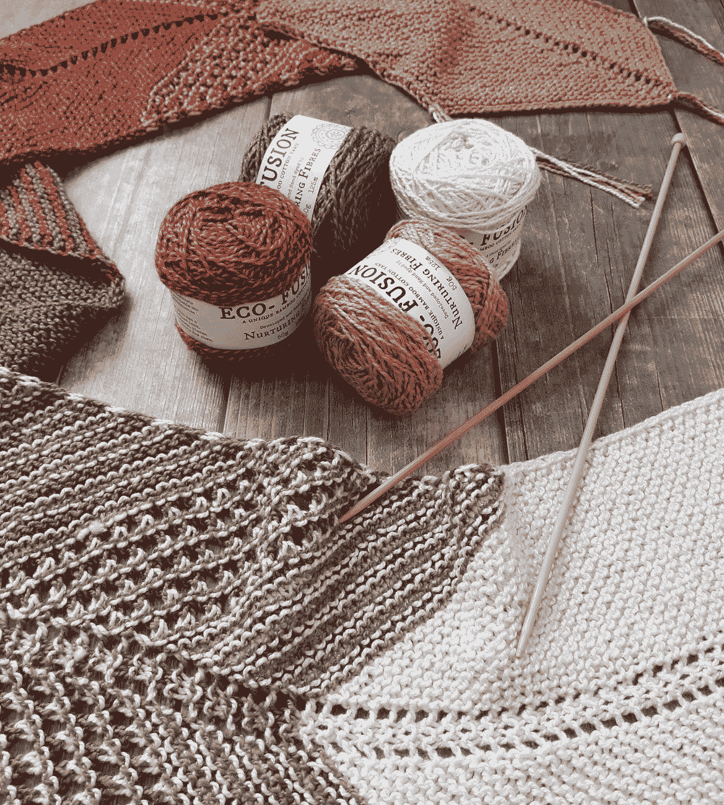

第三章：编织项目和钩针一样，针织是一种将纱线以不同风格缝合在一起的方法。针织包括使用长针来形成各种圈，将这些缝合线保持在针上。如果你觉得你的钩针技能很自信，那么你可能已经准备好开始一项针织项目了。 简单的针织项目以下的针织项目非常适合初学者。和钩针图案一样，大多数的针织图案都使用缩写来帮助理解，避免过多的文字说明。以下是在阅读图案时可能遇到的一些常见的针织缩写：K–起针（Knit）K2tog–两针拼合起针（knit two stitches together）P–平针（purl）P2tog–两针拼合平针（purl two stitches together）YO–提并针（yarn over）折叠针织无檐帽这款无檐帽需要最基本的针织技巧，非常适合初学者。尺寸：直径 20 英寸（但可以伸展）材料：●     8 号（5.0 mm）针织针●     四根 8 号双头针织针●     任何羊毛或羊毛混纺纱线（100 克）●     毛线针步骤 1：使用圆形针织针起 80 针以开始制作帽子的底部。P1，K4 到行末。加入针织圈进行绕圈针织。进行 K4，P1 的交错针织，织 4 英寸。步骤 2：开始进行 K1，P4 的交错针织。按以下顺序进行 5 英寸的织法：- 第 1 行：*K1，P1，P2tog，P1*从第*开始重复直到行末。完成后，你的针上应该有 64 根线。-          第 2-3 行：进行 K1，P3 的交错针织- 第 4 行：*K1，P1，P2tog*从*开始重复直到行末。完成后，你的针上应该有 48 根线。-          第 5-6 行：进行 K1，P2 的交错针织- 第 7 行：*K1，P2tog*从*开始重复直到行末。完成后，你的针上应该有 32 根线。-          第 8-9 行：进行 K1，P1 的交错针织-          第 10 行：进行 K2tog 直到行末。这时应该还剩下 16 根线。-          第 11-12 行：直到行末进行针织-          第 13 行：进行 K2tog 直到行末。这时应该只剩下 8 根线。步骤 3：剪断线头，将长尾穿过剩下的 10 根线。将其拉紧并穿过无檐帽内部的尾部。这样你的无檐帽就做好了！针织无尽围巾无尽围巾从未过时，而且有充分的理由。它们时尚、舒适，还是搭配装饰的好选择。如果你有一些针织技巧，为什么不自己动手制作呢？尺寸：约 10 英寸 x 62 英寸材料：● 任意三种厚纱线（颜色 1、2 和 3）●     11/8 毫米圆形针头●     稍大一点的针头（用于收尾）步骤 1：使用颜色 1，起 30 针并进行 1-8 行的针织。步骤 2：使用颜色 2 进行第 9 和 10 行的针织。步骤 3（第 11 行）：在右面继续使用颜色 2。K1，YO2，*K1，YO2，*在*之间重复到最后两根针时，K1，YO2，K1。步骤 4（第 12 行）：在左面。K1，将 2 个 YO 从针上放掉，*K1，从针上放掉 2 个 YO，*在*之间重复到最后一根针时，K1。步骤 5：进行第 13 和 14 行的针织。步骤 6：使用颜色 1，进行 15-22 行的针织。步骤 7：使用颜色 3，进行 23-26 行的针织。步骤 8（第 27 行）：K1，YO2，*K1，YO2，*在*之间重复到最后两根针时，K1，YO2，K1。步骤 9（第 28 行）：K1，将 2 个 YO 从针上放掉，*K1，从针上放掉 2 个 YO，*在*之间重复到最后一根针时，K1。步骤 10：进行第 29 和 30 行的针织。步骤 11：切换到颜色 1。进行 31-40 行的针织。步骤 12：切换到颜色 2。进行 41-44 行的针织。步骤 13（第 45 行）：K1，YO2，*K1，YO2，*在*之间重复到最后两根针时，K1，YO2，K1，转。步骤 14（第 46 行）：K1，将 2 个 YO 从针上放掉，*K1，从针上放掉 2 个 YO，*在*之间重复到最后一根针时，K1，转。步骤 15：切换到颜色 1。使用针点针均匀进行针点，直到成品长度达到 62 英寸，或者你所需的长度。绑紧并使用缝针结合两端。你的无尽围巾就完工了！
