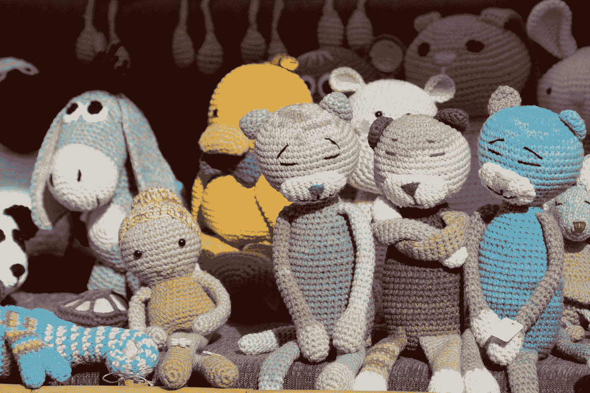

第五章：可爱的钩针项目与本书中许多其他图案不同，本章的图案没有特定的功能或用途——除了当然是可爱外！这个可爱的图案相对简单，可以制作出一个可爱的物品，作为装饰品或送给爱人的礼物。钩针猫头鹰这只甜美而慵懒的猫头鹰看起来非常漂亮，使用了简单的针法，是一个很适合初学者的手工艺品。这个图案需要您运用一些简单的缝纫技巧并加入填充物。尺寸：约 4 英寸高材料：● 1.80 毫米钩● 4 股毛线（6 种颜色）● 涤纶填充物● 毛线针● 剪刀身体步骤 1：在第二根链上做 2 个单圈钩针。不对接。（6 个）步骤 2：在每个钩针上增加针脚。（12 个）步骤 3：在下一个钩针上做单圈钩针，增加针脚，重复*直到末钩*。（18 个）步骤 4：在下两个钩针上做单圈钩针，增加针脚，重复*直到末钩*。（24 个）步骤 5：在下三个钩针上做单圈钩针，增加针脚，重复*直到末钩*。（30 个）步骤 6：在下两个钩针上做单圈钩针，增加针脚，在下四个钩针上做单圈钩针，增加针脚，重复*共五次*，在下两个钩针上做单圈钩针。（36 个）步骤 7：在下五个钩针上做单圈钩针，增加针脚，重复*直到末钩*。（42 个）步骤 8：在下三个钩针上做单圈钩针，增加针脚，在下六个钩针上做单圈钩针，增加针脚，重复*共五次*，在下三个钩针上做单圈钩针。（48 个）步骤 9：在下七个钩针上做单圈钩针，增加针脚，重复*直到末钩*。（54 个）步骤 10：在下四个钩针上做单圈钩针，增加针脚，在下八个钩针上做单圈钩针，增加针脚，重复*共五次*，在下四个钩针上做单圈钩针。（60 个）步骤 11：在每一圈直接做单圈钩针。（11-20 行）步骤 12：在下 12 个钩针上做单圈钩针，增加针脚，重复*直到末钩*。（56 个）步骤 13：在每一钩针上做单圈钩针。（第 22 行）步骤 14：在下六个钩针上做单圈钩针，减少针脚，在下 12 个钩针上做单圈钩针，减少针脚，重复*共三次*，在下六个钩针上做单圈钩针。（52 个）步骤 15：在每一圈直接做单圈钩针。（24 行）步骤 16：在下 11 个钩针上做单圈钩针，减少针脚，重复*直到末钩*。（48 个）步骤 17：在每一圈直接做单圈钩针。（26-27 行）步骤 18：在下五个钩针上做单圈钩针，减少针脚，在下 10 个钩针上做单圈钩针，减少针脚，重复*共三次*，在下五个钩针上做单圈钩针。（44 个）步骤 19：在每一圈直接做单圈钩针。（29-30 行）步骤 20：把作品对折，将前面的钩针与后面的钩针对齐。穿过两层，做 21 个单圈钩针。固定尾端。嘴巴现已完成。*注：在做的同时用涤纶填充物充实身体。*翅膀步骤 1：在第二根链上做 2 个单圈钩针。不对接。（6 个）步骤 2：在每个钩针上增加针脚。（12 个）步骤 3：在下一个钩针上做单圈钩针，增加针脚，重复*直到末钩*。（18 个）步骤 4：在下两个钩针上做单圈钩针，增加针脚，重复*直到末钩*。（24 个）步骤 5：在下三个钩针上做单圈钩针，增加针脚，重复*直到末钩*。（30 个）步骤 6：在下两个钩针上做单圈钩针，增加针脚，在下四个钩针上做单圈钩针，增加针脚，重复*共五次*，在下两个钩针上做单圈钩针，穿上一个钩针，固定缝结。（36 个）步骤 7：结束并留出长的缝结。将作品对折，通过作品的第 19 和 20 圈之间使用三根针脚进行缝合。重复步骤 1-7 来制作第二只翅膀。眼睛步骤 1：在第二根链上做 2 个单圈钩针。不对接。（6 个）步骤 2：在每个钩针上增加针脚。（12 个）步骤 3：在下一个钩针上做单圈钩针，增加针脚，重复*直到末钩*。（18 个）步骤 4：在下两个钩针上做单圈钩针，增加针脚，重复*直到末钩*。（24 个）步骤 5：在下一个钩针上做单圈钩针，增加针脚，在下三个钩针上做单圈钩针，增加针脚，重复*共五次*，在下两个钩针上做单圈钩针，穿上一个钩针，固定缝结。（30 个）步骤 6：结束并留出长的缝结。在作品的第 17 和 25 圈之间缝合，留下一个钩针的宽度。重复步骤 1-6 来制作第二只眼睛。嘴巴步骤 1：在第二根链上做 3 个单圈钩针。（3 个）步骤 2：连针，将作品翻过来，在同一钩针上做单圈钩针，增加针脚，在下一个钩针上做单圈钩针。（4 个）步骤 3：推针，单圈钩针穿过每个钩针。（4 个）步骤 4：结束并留出长的缝结。在作品的第 15 和 18 圈之间缝合。您的猫头鹰已经完成！如果想挑战自己，您可以在猫头鹰的眼睛或前面添加细节。
