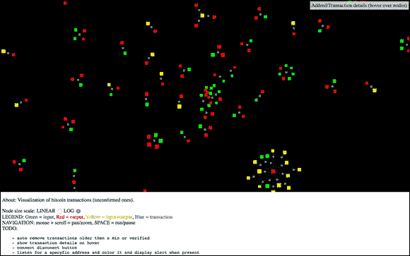
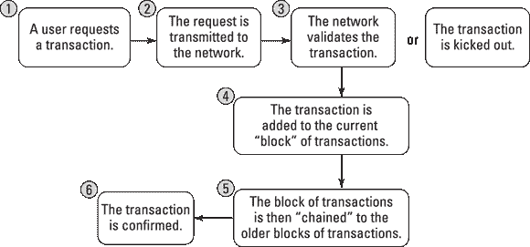
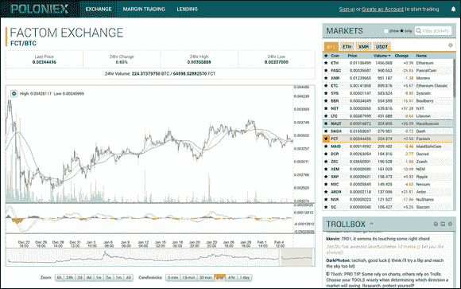

第一章

# 介绍区块链

本章内容

 **探索区块链的新世界**

 **了解为什么重要**

 **识别三种区块链类型**

 **加深对区块链工作原理的了解**

最初，*区块链* 只是计算机科学术语，用于描述数据的结构和共享方式。如今，区块链被誉为计算机的“第五次革命”。

区块链是一种新颖的分布式数据库方法。创新之处在于以新的方式整合旧技术。你可以将区块链视为由一组个体控制的分布式数据库，用于存储和共享信息。

有许多不同类型的区块链和区块链应用。区块链是一种全球性技术，正在整合各种平台和硬件。## 从一开始开始：什么是区块链

区块链是一种数据结构，可以在独立方参与者网络中创建数字分类账并共享。有许多不同类型的区块链。

+   **公有区块链：** 公有区块链，如比特币，是通过本地代币运行的大型分布网络。任何人都可以在任何层面参与，并且具有由社区维护的开源代码。

+   **权限区块链：** 权限区块链，如瑞波（Ripple），控制个人在网络内的角色。它们仍然是大型的分布式系统，使用本地代币。它们的核心代码可能是开源的，也可能不是。

+   **私有区块链：** 私有区块链往往规模较小，不使用代币。其成员资格受到严格控制。这类区块链受到信任成员和交易保密信息的共同体的青睐。

所有三种区块链类型都使用密码学，允许每个网络上的参与者以安全方式管理分类账，而无需中央机构来强制执行规则。将中央机构从数据库结构中移除是区块链最重要和最强大的方面之一。

 区块链创建了交易的永久记录，但实际上没有什么是永久不变的。记录的永久性依赖于网络的持久性。在区块链的背景下，这意味着大部分区块链社区必须同意更改信息，并且受到*不*更改数据的激励。

当数据记录在区块链中时，很难更改或删除它。当有人想要向区块链添加记录时，也称为*交易*或*条目*，网络中具有验证控制的用户验证提议的交易。这就是问题所在，因为每个区块链对于这应该如何运作和谁可以验证交易都有略微不同的看法。

### 区块链的作用

区块链是一个点对点系统，没有中央权威管理数据流。在保持数据完整性的关键方式之一是消除中央控制而拥有一个大型分布式独立用户网络。这意味着构成网络的计算机分布在不止一个位置。这些计算机通常被称为*全节点*。

图 1-1 展示了比特币区块链网络结构的可视化。您可以在[`http://dailyblockchain.github.io`](http://dailyblockchain.github.io)上看到它的运作。

图 1-1：比特币区块链网络的结构。

为防止网络被损坏，区块链不仅是去中心化的，而且通常还利用加密货币。*加密货币*是具有市场价值的数字代币。加密货币就像股票一样在交易所上交易。

对于每个区块链，加密货币的运作方式略有不同。基本上，软件支付硬件进行运行。软件即是区块链协议。著名的区块链协议包括比特币、以太坊、瑞波、超级账本和法塔币。硬件包括保护网络中数据的全节点。### 为什么区块链很重要

区块链现在被认为是计算机的“第五次演进”，是互联网缺失的信任层。这是许多人对这一话题感到兴奋的原因之一。

区块链可以在数字数据中创造信任。当信息被写入区块链数据库时，几乎不可能删除或更改它。这种功能以前从未存在过。

当数字格式的数据是永久和可靠的时，您可以在线进行业务交易，这在过去只能在线下实现。所有保持模拟的东西，包括财产权和身份，现在都可以在线上创建和维护。缓慢的商务和银行流程，如汇款和基金结算，现在几乎可以即时完成。对于全球经济来说，安全数字记录的影响是巨大的。

初始创建的应用程序旨在利用区块链通过交易其原生代币实现的安全数字价值转移。这些包括资金和资产的移动。但是区块链网络的可能性远远超出了价值的交易。## 区块链的结构

区块链由三个核心部分组成：

+   **区块：** 在一定时期内记录到分类帐中的交易列表。对于每个区块链来说，区块的大小、时期和触发事件都是不同的。

    并非所有的区块链都将记录和保护其加密货币的流动作为其主要目标。但是所有的区块链都记录了其加密货币或代币的流动。可以将*交易*简单地理解为数据的记录。为其赋值（如在金融交易中）是用来解释该数据意义的。

+   **链：** 将一个区块数学上“链接”到另一个区块的哈希。这是区块链中最难理解的概念之一。它也是将区块链粘合在一起并允许它们创建数学信任的魔力。

    区块链中的哈希是由前一个区块中的数据创建的。哈希是这些数据的指纹，用于按顺序和时间锁定区块。

     尽管区块链是一个相对较新的创新，但哈希并不是新鲜事物。哈希是 30 多年前发明的。之所以使用这一古老的创新，是因为它创建了一个无法解密的单向函数。哈希函数创建了一个数学算法，将任何大小的数据映射为一个固定大小的位字符串。位字符串通常是 32 个字符长，代表了被哈希的数据。安全哈希算法（SHA）是区块链中使用的一些加密哈希函数之一。SHA-256 是一个常用的算法，生成几乎唯一的，固定大小的 256 位（32 字节）哈希。就实际目的而言，可以将哈希视为用于将数据锁定在区块链中的数字指纹。

+   **网络：** 网络由“全节点”组成。可以将它们看作运行着一个保护网络算法的计算机。每个节点包含了该区块链中曾记录过的全部交易记录。

    节点分布在全球各地，并且可以由任何人操作。运行一个完整节点是困难、昂贵且耗时的，所以人们不会免费进行此类操作。他们受到激励去操作一个节点是因为他们想要获得加密货币的报酬。底层的区块链算法会为他们的服务奖励他们。报酬通常是代币或加密货币，如比特币。

 *比特币*和*区块链*这两个术语经常被互相交换使用，但它们并不相同。比特币拥有一个区块链。比特币区块链是实现比特币安全转账的底层协议。术语*比特币*是指驱动比特币网络的加密货币的名称。区块链是一类软件，而比特币是一种特定的加密货币。## 区块链应用

区块链应用是基于网络是仲裁者的理念构建的。这种系统是一个严格而盲目的环境。计算机代码成为法律，规则按照编写和网络解释的方式执行。计算机没有与人类一样的社会偏见和行为。

该网络无法解释意图（至少现在还不能）。在区块链上仲裁的保险合同已经受到了严格调查，作为围绕这一想法构建的用例。

区块链启用的另一个有趣之处是无可挑剔的记录保存。它们可以用来创建清晰的时间线，记录是谁在什么时候做了什么。许多行业和监管机构花费了大量时间来解决这个问题。基于区块链的记录保存将减轻我们在尝试解释过去时所面临的一些负担。## 区块链生命周期

区块链起源于比特币的创建。它证明了一群从未见面的个体可以在一个对合作网络上的其他成员无动于衷的系统内在线操作。

最初的比特币网络是为了保护比特币加密货币而建立的。它有大约 5000 个全节点，全球分布。它主要用于交易比特币并进行价值交换，但社区也看到了利用该网络进行更多事情的潜力。由于其规模和经过时间测试的安全性，它也被用来保护其他较小的区块链和区块链应用程序。

以太坊网络是区块链概念的第二次演进。它采用了传统的区块链结构，并在其中添加了一种内置的编程语言。与比特币一样，它拥有超过 5000 个全节点，分布全球。以太坊主要用于交易以太币，制定智能合约以及创建去中心化自治组织（DAOs）。它也被用来保护区块链应用程序和较小的区块链。

Factom 网络是区块链技术的第三次演进。它采用了轻量级的共识系统，融入了投票，并存储了更多的信息。它主要用于保护数据和系统。Factom 操作与联合节点和无限数量的审计节点。其网络规模较小，因此它将自身锚定到其他分布式网络中，在不同区块链之间建立桥梁。## 共识：区块链的驱动力

区块链是强大的工具，因为它们创建了不需要第三方强制执行规则的诚实系统。它们通过其共识算法实现规则的执行。

在区块链世界中，*共识*是在一群常常不信任的股东之间达成一致的过程。这些是网络上的全节点。全节点正在验证进入网络以记录在账本中的交易。

图 1-2 显示了区块链如何达成共识的概念。

图 1-2: 区块链是如何工作的。

每个区块链都有自己的算法，用于在其网络内达成对要添加的条目的共识。创建共识的模型有很多种，因为每个区块链都在创建不同类型的条目。一些区块链正在交易价值，另一些正在存储数据，还有一些是用于保护系统和合同。

例如，比特币正在其网络成员之间交易其代币的价值。这些代币有市场价值，因此与性能、可扩展性、一致性、威胁模型和故障模型相关的要求将更高。比特币运行在这样的假设下：恶意攻击者可能想要篡改交易历史以窃取代币。比特币通过使用称为“工作证明”的共识模型来防止这种情况发生，这解决了拜占庭将军问题：“您如何知道您正在查看的信息没有内部或外部改动？”因为更改或操纵数据几乎总是可能的，数据的可靠性是计算机科学的一个大问题。

大多数区块链均以这样的前提运行：它们将受到外部力量或系统用户的攻击。所期望的威胁和网络对操作区块链的节点的信任程度将决定它们用于结算分类帐的共识算法的类型。例如，比特币和以太坊期望受到极高程度的威胁，并使用一种称为*工作证明*的强共识算法。网络中没有信任。

在另一端的情况下，用于记录已知方之间的金融交易的区块链可以使用更轻量和更快的共识。它们对高速交易的需求更为重要。工作证明对它们而言速度太慢、成本太高，因为网络中参与者相对较少，每笔交易都需要即时确定。 ## 使用中的区块链

如今存在着数百个区块链和区块链应用。整个世界都着迷于快速转移资金的想法，将分布式网络中的合并和治理，以及构建安全的应用程序和硬件。

您可以通过访问加密货币交易所来查看其中许多公共区块链。

图 1-3 显示了 Poloniex（[`https://poloniex.com`](https://poloniex.com)）的另一种加密货币交易平台。

图 1-3: 加密货币交易平台。

区块链已经走出了交易价值市场，并被应用到各种行业中。区块链增加了一个新的信任层，使得在线工作变得安全，这是以前不可能的。

### 当前的区块链用途

大多数已经推出的区块链应用都围绕着快速、廉价地移动货币或其他价值形式展开。包括交易公开公司股票、向其他国家的员工支付工资以及进行货币兑换。

区块链现在也被用作软件安全堆栈的一部分。美国国土安全部一直在调查保护物联网（IoT）设备的区块链软件。物联网世界从这一创新中有很多收获，因为它特别容易受到欺骗和其他形式的黑客攻击。物联网设备也变得更加普及，安全性对它们的依赖程度也越来越高。医院系统、自动驾驶汽车和安全系统是主要例子。

DAO（去中心化自治组织）是另一种有趣的区块链创新。这种类型的区块链应用代表了在线组织和公司的新方式。DAO 已被用于通过以太坊网络组织和投资资金。### 未来的区块链应用

现在正在探索的更大规模和长期的区块链项目包括政府支持的土地登记系统、身份和国际旅行安全应用。

区块链注入的未来可能性激发了世界各地商界人士、政府、政治团体和人道主义者的想象力。英国、新加坡和阿拉伯联合酋长国等国家将其视为降低成本、创造新的金融工具和保持清洁记录的方法。它们已经在探索区块链的活跃投资和创举。

区块链奠定了一个基础，其中对信任的需求已经被排除在方程式之外。在过去，要求“信任”是一件大事，但是有了区块链，它变得微不足道。此外，如果信任被破坏，强制执行规则的基础设施可以更轻便。很多社会都是基于信任和规则强制执行建立的。区块链应用的社会和经济影响可能在情感和政治上引起极端分化，因为区块链会改变我们构建基于价值和社会的交易的方式。
