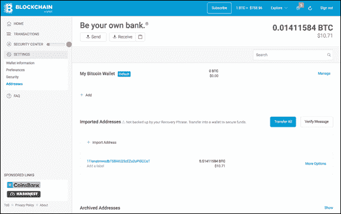
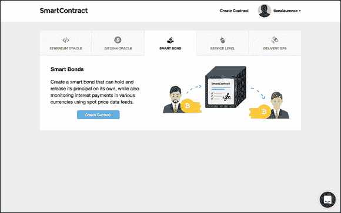
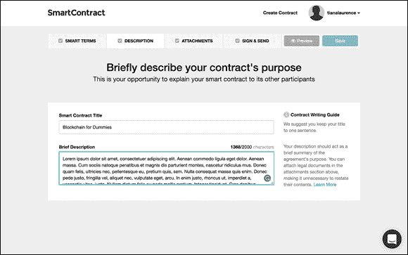
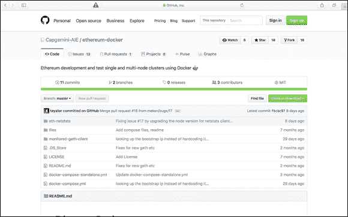
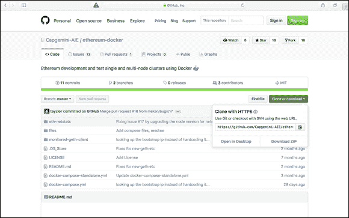

第三章

# 获取区块链

在本章节中

 **创建和使用比特币钱包**

 **创建一个简单的智能合约**

 **部署私人区块链**

区块链是非常强大的工具，它们将改变世界上资金流动、系统安全和数字身份的方式。如果你不是核心开发者，你可能在不久的将来不会进行任何深入的区块链开发。尽管如此，你依然需要了解区块链是如何工作的，以及它们的核心限制是什么，因为它们将被融入到许多日常在线交互中 — 从企业如何支付人员到政府如何知道他们的系统和数据是完整和安全的。

本章将帮助你开始进入区块链世界。你将了解与区块链和加密货币相关的许多最重要的方面，但你将使用让你远离区块链内部复杂工作的工具。本章还将帮助你建立后续章节中所需的基本加密账户。## 深入比特币区块链

比特币区块链是世界上最大、最强大的区块链之一。它的主要目的是发送比特币，这种加密货币。因此，自然地，为了在比特币区块链中创建消息，你必须将一些比特币从一个账户发送到另一个账户。

当你从一个账户向另一个账户发送比特币时，交易历史记录将被记录在比特币区块链中。一旦交易被记录，信息就无法被移除 — 你的信息将一直存在，就像比特币一样。这种永久性的概念非常强大 — 这是任何区块链的最重要特征。

你有几种方式在你的交易中添加额外的小消息，但有时这些方式并不总是产生容易阅读的消息。在本部分，我将解释如何直接将消息构建到比特币交易中。

将数据嵌入比特币地址中可以保证它容易被读取。你可以通过使用比特币虚荣地址来实现这一点。将虚荣地址理解为汽车上的虚荣车牌。六位比特币虚荣地址可以免费获得；更长的地址需要花钱。地址越长，成本就越高。

在这个项目中，你将创建两个比特币钱包，向其中一个添加资金，获取一个虚荣地址，以及在你的账户之间发送一些比特币。

 如果你已经有一个拥有资金的比特币钱包，你可以跳过第一部分并使用该钱包。

### 创建你的第一个比特币钱包

一个比特币钱包地址由 32 个唯一字符组成。它允许你发送和接收比特币。你的私钥是与你的比特币地址相关联的秘密代码，它让你能够证明你拥有与地址关联的比特币。

 任何知道你私钥的人都可以花费你的比特币，所以永远不要分享它。

你的第一个比特币钱包需要关联信用卡或银行帐户。我建议使用以下几种比特币钱包之一：

+   **Coinbase（[`www.coinbase.com`](https://www.coinbase.com)**）**

+   **Xapo（**[`www.circle.com`](https://www.circle.com)**）**

要设置你的第一个钱包，只需访问以下网址之一并创建一个帐户。只需几分钟。当你的帐户打开时，往里面加入一点钱，这样你就可以进行实验 - $5 是一个很好的起点。 ### 创建第二个比特币钱包

要收到你将发送的比特币，你需要创建第二个比特币钱包。对于这个第二个钱包，不要使用 Circle 或 Coinbase 钱包 - 它们没有你需要的功能。

这个项目最容易使用的比特币钱包是 Blockchain.info 钱包。按照以下步骤创建它：

1.  **转到 Blockchain.info 网站 （**[`www.blockchain.info`](http://www.blockchain.info)**).**

1.  **点击钱包。**

1.  **点击创建你的钱包。**

1.  **输入电子邮件地址和密码。** ### 生成比特币纪念地址

一个比特币纪念地址就像为你的车辆拥有一个个性化车牌。它是一个有吸引力的数字或字母字符串的比特币地址。纪念地址是可选的，但是在比特币中看到你的消息的有趣方式。有几种免费方法可以创建比特币钱包纪念地址。我最喜欢的是 BitcoinVanityGen.com。要使用 BitcoinVanityGen.com 创建你的纪念地址，请按照以下步骤进行：

1.  **转到 BitcoinVanityGen.com 网站（**[`www.bitcoinvanitygen.com`](http://www.bitcoinvanitygen.com)**).**

1.  **在“键入字母”字段中输入六个字母。**

    比特币只允许发送小消息，而你的纪念地址将构成你的消息内容，你可以轻松在比特币中阅读。

     选择一些酷的东西，因为一旦创建后，你可以随时重复使用你的地址。

1.  **点击生成。**

1.  **点击电子邮件。**

1.  **输入你的电子邮件地址。**

    BitcoinVanityGen.com 会在找到你的纪念地址时给你发送电子邮件。

1.  **点击来自 BitcoinVanityGen.com 的电子邮件中的链接。**

    你会得到你的新纪念地址和与地址关联的私钥。

1.  **复制你的地址和私钥，并将它们保存在一个安全的地方。**

    你将需要下一部分的地址和私钥。

 永远不要分享您的私钥！将您的私钥和公钥存放在一个安全的地方。使用您的公钥来接收或发送比特币。（您可以随意分享您的公共比特币密钥。）私钥是您比特币真正的所有者。如果您的私钥被盗或丢失，您将永远失去您的硬币。

 加密货币是不可饶恕的。当您学习如何使用这些系统时，请从小额资金开始。 ### 转移您的虚荣地址

在这个部分，你将你的虚荣地址转移到一个钱包。转移它将允许你轻松地管理你的地址，并发送和接收比特币。按照以下步骤开始：

1.  **登录您的 Blockchain.info 钱包（参见本章前面的“****创建第二个比特币钱包****”）。**

    图 3-3 显示了 blockchain.info 的设置页面。

1.  **点击设置，然后点击地址。**

1.  **在导入地址旁边，点击管理地址。**

    屏幕上显示了图 3-1。

1.  **点击导入地址，输入您的私钥，然后点击导入。**

    您现在已经创建了一个允许任何人在您发送或接收比特币时读取您的虚荣地址的地址。

图 3-1： 管理您的地址。 ### 在比特币区块链中做一个记录

现在你有两个比特币钱包，你可以在比特币区块链上做一个记录。你可以通过在两个钱包之间发送比特币来完成这个过程。具体步骤如下（具体细节因钱包而异，但总体思路一致）：

1.  **登录您添加初始资金的比特币钱包（参见本章前面的“****创建您的第一个比特币钱包****”）。**

    它会提示您输入接收者。

1.  **导航到发送资金页面，并将您的虚荣地址（参见“生成比特币钱包虚荣地址”）复制粘贴到地址栏中。**

1.  **输入您想要发送的少量资金，然后点击发送。**

恭喜！你刚刚发送了你的第一条永久消息！你已经永远地将你的消息刻在了比特币的历史中。

如果你喜欢学习如何做到这一点，并想进一步扩展你的知识，你可以在[`www.blockchainpie.com/blockchain-tutorial-bitcoin-message`](http://www.blockchainpie.com/blockchain-tutorial-bitcoin-message)上访问有用的发送比特币消息的在线教程。

 一个比特币交易通常需要十分钟才能确认，但可能需要几个小时。交易的价值越大，您需要等待的时间就越长。未经确认的交易尚未被包括在区块链中，因此仍可撤销。### 阅读比特币的区块链条目

在前一部分中，我向您展示了如何在比特币中创建一个小的永久性消息。比特币区块链上的数据没有经过加密，因为数据需要被节点确认。这意味着很容易找到你在上一个项目中创建的消息。 

 如果你刚刚在两个钱包之间转移了比特币，请在遵循这些步骤之前等待大约 10 或 15 分钟。

1.  **打开 Blockchain.info 网站（**[`www.blockchain.info`](http://www.blockchain.info)**）。**

1.  **在搜索框中输入你的虚荣地址，然后按 Enter 键。**

    交易页面显示出来。

这就是找到你的交易并阅读你在地址中写入的消息所需要做的！## 使用比特币进行智能合约

一份*智能合约*是可以做出金融决策的自治软件。区块链世界对智能合约的兴奋在于，它们在世界经济运作方式方面既是惊人的，也是令人恐惧的。

简单来说，智能合约是一份已经被转换为代码并构建为复杂的 if-then 语句的书面合同。合同可以自我验证是否满足条件以执行合同。它通过从外部来源获取可信数据来实现此目的。智能合约也可以通过释放付款数据或其他类型的数据来自我执行。它们可以围绕许多不同类型的想法构建，并且不需要具有金融性质。智能合约可以在保持对外部控制的防篡改性的同时执行所有这些操作。

区块链技术使得智能合约得以存在，因为智能合约提供了曾经只有纸张、墨水和受信任的权威机构才能提供的永久性和抵抗腐败。智能合约是我们进行商业交易的一场革命。它们确保合同将按照既定方式执行。不需要外部执法。区块链充当中介和执行者。

智能合约很重要，因为一旦机器开始执行合约，就会变得难以撤销或不可能撤销。这还提出了这些工具的一个重要特点，不能忽视，我的第一条智能合约法则：*控制数据的人，控制合约*。所有智能合约都会验证外部数据源，以证明执行情况并向正确方释放支付。

 尽管智能合约是一种革命性的新技术，但它们尚不足以解释合同双方的*意图*。我们社会中的法律合同依赖于人们解释合同双方的意图。计算机（至少到目前为止）只能理解代码，而不能理解当事人的意图。

### 构建你的第一份智能债券

*智能债券*是一种可以独立持有和释放价值对象的智能合同，同时利用现货价格数据源监控各种货币的支付。存在许多不同类型的智能合同，而且每天都在被开发出新的。

按照以下步骤构建你的第一个智能债券：

1.  **前往 SmartContract 网站（**[`www.smartcontract.com`](http://www.smartcontract.com)**）。**

1.  **点击“注册”。**

    出现注册页面。

1.  **输入电子邮件地址和密码，然后点击“创建账户”。**

    SmartContract 给你发送一封带有确认链接的电子邮件。

1.  **点击 SmartContract 发送给你的电子邮件中的链接，以验证你的账户并登录。**

1.  **点击“创建合同”。**

1.  **点击“智能债券”选项卡（参见** **图 3-2****）。**

1.  **点击“创建合同”按钮。**

    你已经准备好构建你的第一个若-则语句。

1.  **点击“智能条款”选项卡。**

    智能合同验证外部数据源，以证明合同的履行情况并触发支付的释放。在这里，你可以选择触发智能合同的条件。

1.  **选择履行监测。**

    履行监测将查看合同之外是否已经采取行动。在你的情况下，这将是从一个账户向另一个账户的资金转移。

1.  **在“若支付给”字段中，输入你的比特币地址之一（本章前面创建的）。**

1.  **在“金额”字段中，输入你想要从一个比特币地址转账到另一个地址的小额金额。**

1.  **在“到期日期”字段中，输入几天后的日期。**

    这将设定合同用于监控外部来源的时间参数。

1.  **点击“描述”选项卡（参见** **图 3-3****）。**

1.  **在“智能合同标题”字段中，输入你的合同名称。**

1.  **在“简要描述”字段中，输入 — 你猜对了！ —合同的简要描述。**

    描述应该作为协议目的的简要总结。在这里，您还可以附上法律文件或其他数据，例如图片。

1.  **点击“附件”部分。**

     智能合同是新技术，可能会出现问题。最好只附上不重要的东西，而且你愿意公开展示。

1.  **点击“附加文件”。**

    你可以附上图片或 PDF。

1.  **点击“签署并发送”选项卡。**

1.  **在“地址”字段中，输入你的电子邮件地址以向自己发送合同。**

1.  **点击“完成合同”按钮。**

    现在你的合同将监视比特币区块链，以监视是否你向之前列出的比特币钱包地址发送资金。

1.  **返回到你的比特币钱包，然后在两个钱包之间发送资金。**

    确保使用地址和比合同中的金额稍微更多。当你创建的合同在比特币区块链上看到交易记录时，你将收到电子邮件通知。

     比特币网络会从交易中扣除一部分，因此请多支付点，以确保满足合同条款。例如，如果您将合同设定为$5,请支付$5.15 以确保安全。

图 3-2: 智能绑定选项卡。

图 3-3: 描述选项卡。  ### 检查合同状态

您可以随时按照以下步骤检查您合同的状态：

1.  **登录到您的 SmartContract 账户，网址为** [`www.smartcontract.com`](http://www.smartcontract.com)**。**

1.  **前往您的合同仪表板。**

    您的交易完成后，合同将显示为完成状态。您的合同状态位于合同仪表板下方。

 在查看您的交易状态之前，请给比特币网络 10 到 15 分钟的处理时间。  ## 使用 Docker 和 Ethereum 构建私有区块链

私有区块链既具有私人数据库的好处，又具有区块链的安全性。这个想法之所以如此吸引人，原因有两个：

+   **对开发人员来说，私有区块链非常适用，因为它们允许他们测试想法，而不必使用加密货币。** 开发人员的想法也可以保持保密，因为数据尚未公开发布。

+   **大型机构可以利用区块链技术的安全性和永久性，而不必像传统的区块链技术那样让他们的交易公开。**

 本书的大多数内容假设您是第一次了解区块链并且几乎没有编程技能，但本节需要一些 GitHub、Docker 和如何使用计算机终端的知识。如果您在深入学习之前需要一个快速回顾编码，我推荐尼克希尔·亚伯拉罕（Wiley）的《编程入门 for Dummies》，这本书对非技术人员编码提供了很好的概述。如果您不打算亲自涉足区块链技术，可能会跳过本章剩余的部分。

在本节中，您将开始构建您的第一个区块链。您需要分两步进行构建。第一步是准备您的计算机以创建您的私有区块链。不用担心 —— 使用来自 Docker 的工具和 GitHub 上才华横溢的开发人员的工作，这将变得更加简单。第二步是在 Docker 终端内构建您的区块链。

### 准备您的计算机

为了尝试这个区块链项目，您需要在计算机上下载一些软件。首先下载 Docker 工具包。请转到[`www.docker.com/toolbox`](http://www.docker.com/toolbox)下载适合您操作系统的正确版本。

接下来，下载 GitHub 桌面版。转到[`http://desktop.github.com`](http://desktop.github.com)。安装了 GitHub 桌面版后，在[`www.github.com`](http://www.github.com)创建 GitHub 账号，点击注册并输入用户名、电子邮件地址和密码，然后点击注册 GitHub 按钮。

现在您需要创建一个用于存储您的区块链数据的位置。在计算机的桌面上创建一个名为`ethereum`的文件夹。您将使用这个文件夹来保存您未来的存储库和其他文件。按照以下步骤完成整个过程：

1.  **打开 GitHub 桌面。**

1.  **使用您的新 GitHub 账号在计算机上的 GitHub 桌面应用程序中登录。**

1.  **返回到您的网络浏览器，转到**[`www.github.com/Capgemini-AIE/ethereum-docker`](https://www.github.com/Capgemini-AIE/ethereum-docker)**。**

    您将看到图表 3-4 中所示的页面。

1.  **点击克隆或下载按钮。**

    您将有两个选择：在桌面上打开或下载 Zip（参见图表 3-5）。

1.  **选择“在桌面上打开”选项。**

    GitHub 桌面应用程序将重新打开。

    **在 GitHub 桌面应用程序中，转到项目文件夹** `ethereum` **并点击克隆。**

图表 3-4: 在 GitHub 上打开此页面。

图表 3-5: 在桌面上打开。

从 GitHub 克隆会复制构建新区块链所需的信息。按照下一节中的步骤开始构建您的私有区块链。### 构建您的区块链

您将使用免费的 Docker Quick Start 终端工具来构建您的区块链。它为您提供了一个虚拟机，缩短了设置和调试系统所需的时间。由于这些功能，它让您为您的区块链创建一个稳定的环境，因此您不必担心计算机的设置，并且可以更快地启动和运行。

按照以下步骤：

1.  **使用 Docker Quick Start 终端在您的计算机上启动 Docker。**

     快速启动终端应该位于您的应用程序中或者桌面上。

    Docker 应用程序会启动一个终端，您将用它来构建您的区块链。

1.  **在终端中更改目录到**`ethereum`**。**

    您创建的新区块链文件将放入您在前一节中创建的桌面文件中。您需要给终端发送一个命令，以便更改目录。如果您使用的是 Mac 或运行 Linux，输入以下命令：

    `cd ~ /Desktop/ethereum/ethereum-docker/`

    如果您使用的是 PC，输入以下命令：

    `cd ~ \Desktop\ethereum\ethereum-docker\`

     如果因某种原因这些命令不起作用，请在网络上搜索解释如何更改系统目录的教程。

    现在您可以利用 Ethereum–Docker 文件。

1.  通过在终端输入以下命令，创建一个独立的以太坊节点：`docker-compose -f docker-compose-standalone.yml up -d`

    这一行代码将创建以下内容：

    +   一个以太坊启动的容器

    +   一个连接到启动容器的以太坊容器

    +   一个 Netstats 容器，具有用于查看集群活动的 Web 界面

1.  通过打开网页浏览器并访问`http://$(docker-machine ip default):3000`，来看看你的新区块链。

恭喜！你已经建立了自己的私人区块链。如果你愿意的话，可以对格雷厄姆·泰勒和安德鲁·董表示感谢，他们花了很多时间来创建以太坊 - Docker 集成。
