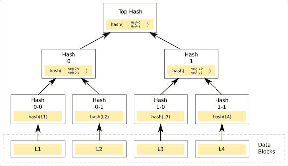
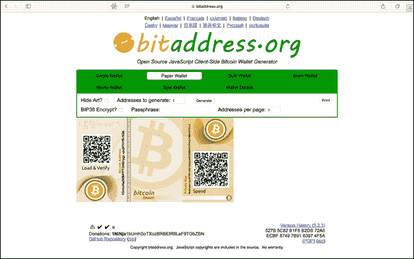

第四章

# 注视比特币区块链

在本章中

 **了解比特币区块链的由来**

 **澄清关于比特币的一些谬论**

 **在使用比特币时保持安全**

 **挖掘比特币**

 **制作一个纸钱包来存储您的比特币**

警告！阅读完本章后，您可能会对这种新兴的酷技术上瘾。请自行决定是否继续阅读。

比特币展示了区块链技术的纯粹方面。这是所有其他区块链进行比较的基准，几乎所有其他区块链都依赖于这个框架。了解比特币区块链的基本运作方式将使您更好地理解在这一生态系统中遇到的所有其他技术。

在这一章中，我将向您介绍比特币区块链的基本原理。我提供了一些安全提示，这些提示将使您的比特币体验更加顺畅和成功。我还向您展示了一些您可以立即开始使用比特币的实用方法。在这些页面中，您将了解如何挖掘比特币代币，让您有一种新的方法可以获得比特币而无需购买。最后，您将发现如何将您的代币转移到纸钱包，以及在线保持您的代币安全的其他实用方法。## 了解比特币区块链的简史

比特币及其区块链概念最早于 2008 年秋季作为一份白皮书首次亮相，随后在 2009 年发布为开源软件。（您可以在[`www.bitcoin.org/bitcoin.pdf`](http://www.bitcoin.org/bitcoin.pdf)阅读比特币白皮书。)

首次在那份 2008 年白皮书中介绍比特币的作者是一位匿名程序员，或者是在中本聪（Satoshi Nakamoto）名下工作的团队。中本聪与许多其他开源开发人员合作开发比特币直到 2010 年。此个人或团队已经停止参与该项目，并将控制权转移给著名的比特币核心开发人员。对中本聪身份的许多主张和理论已被提出，但截至撰写本文时尚未得到证实。

尽管如此，中本聪创造的是一种非凡的点对点支付系统，使用户能够直接发送比特币，即价值转移代币，而无需中介方来保证双方的责任。网络本身充当中介方，通过验证交易并确保没有人试图通过两次花费比特币来欺骗系统。

中本聪的目标是填补数字信任的巨大漏洞，而区块链的概念就是他的答案。它解决了拜占庭将军问题，这是终极的人类问题，特别是在线的时候：当自私、恶意的第三方等可以欺骗你时，你如何相信你所得到的信息和提供信息的人？许多比特币爱好者认为区块链技术是缺失的一环，它将允许社会完全在线运作，因为它通过在一个公共空间中记录相关信息来重新构建信任，这些信息不会被删除，总是可以被参考，使欺骗更加困难。

区块链将社会几千年来一直在使用的许多古老技术以新的方式融合。例如，加密和支付被合并以创建加密货币。*加密*是在第三方的监视下进行安全通信的技术。通过代表价值的代币进行支付也是人类长期以来一直在做的事情，但当它们合并时，就创造了加密货币，并变成了一些全新的东西。加密货币让你将货币概念搬上网，在通过代币安全地进行价值交易。

区块链还融合了*哈希*（将任意大小的数据转换为短的、固定长度的值）。哈希还融合了另一个叫做默克尔树的古老技术，它将许多哈希值压缩成一个哈希值，同时仍然能够证明每个被个别哈希的数据（参见图 4-1）。

图 4-1: 一个默克尔树。

最终，区块链是分类账，社会几千年来一直用来保持财务账目。当所有这些古老模型被合并并在分布式数据库中方便地进行在线操作时，它们就变得革命性。

比特币最初被设计用于发送比特币加密货币。但很快，创造者意识到它有着更大的潜力。考虑到这一点，他们架构了比特币的区块链，使其能够记录除了有关代币流动的数据之外的更多内容。比特币区块链是世界上最古老、规模最大的区块链之一。它包含着数以千计运行比特币协议的节点。该协议正在创建和保护区块链。

用非常简单的话来说，*区块链*是比特币网络中所有交易的公共分类账，*节点*是记录这些条目的计算机。*比特币协议*是管理该系统的规则。

节点通过挖掘比特币加密货币来保护网络。新比特币被作为奖励用于处理交易并将其记录在区块链内。节点还因确认交易而获得小额费用。

任何人都可以运行比特币协议并开采代币。这是一个繁荣的开源项目，随着更多的个人参与网络，它就会茁壮成长。参与的人越少，它就越集中化——而集中化会削弱系统。使比特币成为安全系统的主要因素是全球分布的大量独立节点。

最成功的矿工拥有强大的系统，可以击败速度较慢的矿工。在比特币历史上的早期阶段，您可以在台式电脑上运行比特币协议并赚取比特币。现在，为了有希望收到比特币，您需要购买昂贵的专业设备或使用云服务。

为了在比特币区块链中创建一条消息，您必须从一个账户发送一些比特币到另一个账户。当您在比特币中发送交易时，该消息被广播到整个网络。消息发送后，无法更改，因为消息记录在比特币区块链中。这一特性使您必须明智地选择消息，并永远不要广播敏感信息。

将相同的信息广播到成千上万个节点，然后永远保存在代币的分类账中会很快增加。因此，比特币要求您保持通信非常简短。当前限制只有 40 个字符。

比特币是一个生机勃勃且不断变化的系统。比特币核心开发社区正在积极寻求改进系统的方法，使其更加强大和快速。任何人都可以通过参与其 GitHub 页面 ([`www.github.com/bitcoin`](http://www.github.com/bitcoin)) 来为比特币协议做出贡献。然而，比特币有一小群核心开发者的社区。最多产的贡献者是 Wladimir Van Der Laan、Pieter Wuille 和 Gavin Andresen。  ## 辟谣一些关于比特币的常见误解

人们经常对任何新事物持怀疑态度，尤其是那些不容易理解的新事物。因此，自然而然地，比特币——一种全新的货币，与世界上以往从未见过的任何东西都不同——会让人困惑，导致一些误解。

以下是您可能听说过的一些关于比特币的误解：

+   **比特币被黑客攻击。** 从未有一次对比特币区块链的成功攻击导致比特币被盗。然而，许多使用比特币的中心系统已经遭受了黑客攻击。由于安全措施不足，钱包和比特币交易所经常受到黑客攻击。比特币社区通过开发优雅的解决方案来保护他们的硬币，包括钱包加密、多重签名、离线钱包、纸质钱包和硬件钱包，仅举几例。

+   **比特币被用于勒索。** 由于比特币的半匿名性质，它被用于勒索软件攻击。黑客侵犯网络并将其扣押，直到向他们支付为止。医院和学校曾是这类攻击的受害者。然而，与过去被小偷青睐的现金不同，比特币总是在区块链中留下踪迹，调查人员可以追踪。

+   **比特币是一个金字塔骗局。** 从比特币矿工的角度来看，比特币是金字塔骗局的反义词。比特币协议设计成一场吞噬式的竞赛。每增加一个矿工，协议就会增加挖矿的难度。从社会的角度来看，比特币是一个纯粹的市场。比特币的价格波动取决于市场的供应、需求和感知价值。

+   **比特币在开采了 2100 万枚硬币后将崩溃。** 比特币发行代币数量有限。这个数字在 2100 万枚硬币时被硬编码。据信，比特币发行最后一枚硬币的预计日期是在 2140 年。在那一点，没有人能预测会发生什么，但矿工们总会从交易费中获利。此外，区块链的用户和比特币本身将受到激励，因为如果开采停止，比特币将变得脆弱，区块链中锁定的数据也将变得脆弱。

+   **足够的计算能力可以攻击比特币网络。** 这是真的，但要做到这一点极其困难，而且奖励很少。进入比特币网络的节点越多，这种攻击就越困难。为了实现这一点，攻击者需要相当于爱尔兰全部能源的能源。这种攻击的回报也极其有限。它只允许攻击者撤销自己的交易。他不能拿走别人的比特币或伪造交易或硬币。

+   **比特币是一个不错的投资。** 比特币是人们交换价值的新颖而有趣的进化方式。它没有任何一个政府或组织的支持，它之所以有价值是因为人们愿意用它交换商品和服务。人们利用比特币的意愿和能力波动很大。它是一个不稳定的投资，应该谨慎对待。  ## 比特币：新的西部荒野

比特币世界很像早期的西部荒野。最好谨慎对待，直到你弄清楚好人和坏人是谁，以及哪家酒吧供应最冰的啤酒。如果你成为骗局的受害者，你将没有或很少的保护。

 比特币在美国商品交易法下属于*商品*的定义，并在许多欧洲国家被视为一种货币，但几乎没有监管。

在这一部分，我列举了加密货币世界中普遍存在的三种常见骗局。它们都围绕着窃取你的货币，并且看起来很像你可能已经熟悉的传统欺诈手段。这个列表并不全面，欺诈者变化多端，因此在使用比特币时务必小心。你永远不知道下一个角落会有什么。  

### 伪造网站

看起来像交易所或网络钱包但其实是伪造品的网站困扰了一些顶级的比特币网站。这种类型的诈骗在比特币世界和整个互联网上都很常见。骗子们希望通过窃取用户的登录信息或误导他们发送比特币来赚取钱财。

 始终要仔细检查网址，并且只使用安全网站（以 `https://` 开头的网站）以避免出现问题。如果一个网站或声明看起来可疑，请检查它是否在 Badbitcoin.org（[`www.badbitcoin.org`](http://www.badbitcoin.org)）上被列出。这不是一个全面的列表，但列出了许多不良的参与者。  ### 不要轻易相信！

“把你的比特币发送给我，然后我会给你发货。”听起来可疑，对吧？这种骗局类似于汇款诈骗。在这种诈骗中，个人假装销售物品，但却从未交付。

比特币的半匿名性以及无法进行退款的特性使得要取回你的钱变得困难。此外，政府目前不为比特币交易提供保护，因此你选择了这个著名的投资工具却无法得到有效的保障。

诈骗者会通过发送假身份证或冒充可能认识的其他人来获取你的信任。始终要仔细检查他们发送给你的信息。

 躲避这种骗局的最佳方法是听从你的直觉，永远不要冒更多比特币的风险，超出你愿意失去的范围。如果有一种方法可以线下验证对方的身份，那就采取这种方法。  ### 快速致富计划

疯狂的快速致富计划在加密货币世界中蔓延。好消息是：只要知道该寻找什么，就很容易识别它们。

通常，你将被承诺巨额回报，而且会进行某种形式的招聘和洗脑过程。这个过程可能包括销售培训，要求你招募你的朋友和家人，并承诺这是一种风险免费的投资，并且你永远不会失去你的钱。

简而言之：如果一个计划看起来太美好以至于难以置信，那么很可能就是如此。无论如何，都要深入了解投资是如何创造价值的，而不仅仅是从你的投资中获得的价值。如果没有明显且合理的理由表明有大量价值正在产生，那就是一个骗局。

 所有的投资都需要征求律师和注册会计师的意见。他们可以帮助你了解风险和税务影响。  ## 挖掘比特币

你可以通过多种方式开始赚取比特币。挖矿是通过参与网络来赚取比特币的方式。这通常需要昂贵和专业的专用挖矿硬件来处理。设备还需要比特币挖矿软件来连接到区块链和你的*挖矿池*（许多矿工联合工作并分享他们努力的奖励）。

以下是探索挖矿比特币的三种标准方法：

+   **Bitcoin-QT:** Bitcoin-QT 客户端是由中本聪编写的原始软件。你可以在[`https://bitcoin.org/en/download`](https://bitcoin.org/en/download)下载它。

+   **CGminer:** CGminer 是最流行的挖矿软件之一。它是开源的，适用于 Windows、Linux 和 OS，网址为[`www.github.com/ckolivas/cgminer`](http://www.github.com/ckolivas/cgminer)。

+   **Multiminerapp:** Multiminerapp 是一个易于运行的比特币客户端。你可以在[`www.multiminerapp.com`](http://www.multiminerapp.com)下载它。

 比特币是一个非常竞争激烈的环境，除非你购买专门的挖矿设备，否则你可能永远赚不到任何比特币。我在这本书中不会赞助或推荐任何特定的挖矿设备，因为这个行业不断变化，很快就会过时。每台机器的平均价格在 500 美元到 5,000 美元之间。亚马逊是一个很好的去处。他们提供了许多选择和许多客户评论来帮助指导你。

云挖矿允许你在一个勤奋的下午开始赚取比特币，而不需要下载软件或购买设备。只需按照以下步骤操作：

1.  **前往** [`https://hashflare.io/panel`](https://hashflare.io/panel)**。**

     云挖矿的投资回报率可能为负数。仔细审查你的选择以确保它是一项积极的投资。

1.  **向下滚动主页，然后单击 SHA-256 云挖矿下的立即购买按钮。**

     当我写这本书时，这个选择有最高的投资回报率和最低的启动成本。花时间自己重新评估一下，因为这可能已经发生变化。

1.  **通过注册流程。**

1.  **连接你的比特币地址。**

    如果你还没有建立比特币地址，请参考第三章并按照指示创建比特币钱包。这样做是为了能够索取你的挖矿奖励。

1.  **购买少量的挖矿算力。**

    这将使你能够加入比特币网络。

1.  **加入一个挖矿池。**

    这一步使你能够比独自挖矿获得更快的挖矿奖励。它汇集了几个矿工的资源，然后在矿池之间分享奖励。

恭喜！现在只需坐下来等待你的挖矿奖励开始滚入（或滴入）。## 制作你的第一个纸钱包

*纸钱包*是比特币的公钥和私钥的纸质副本。由于它们完全脱机，纸钱包是正确操作时持有比特币最安全的方式之一。其优势在于，你的私钥没有以数字形式存储，因此不易受黑客攻击。制作纸钱包相当简单。只需按照以下步骤进行：

1.  **前往**[`www.bitaddress.org`](http://www.bitaddress.org)**。**

1.  **将鼠标在屏幕上移动，直到显示出 100%的随机性。**

1.  **点击“纸钱包”按钮。**

    这样可以选择创建一份可打印的纸钱包。

1.  **在“生成地址”字段中输入 1。**

    如果需要，你可以一次制作多个钱包，但最好先制作一个以熟悉操作。

1.  **点击“生成”按钮。**

    图 4-2 展示了一个我创建的纸钱包。

1.  **点击打印按钮。**

     不要让任何人看到你创建纸钱包的过程。这不是你想在公共电脑上做的事情。确保使用的打印机是私人的，且未连接到互联网，这样你的私钥就不会受到黑客攻击的风险。

图 4-2： 一份纸钱包。

 将你的纸钱包覆膜可以增加一些耐用性。
