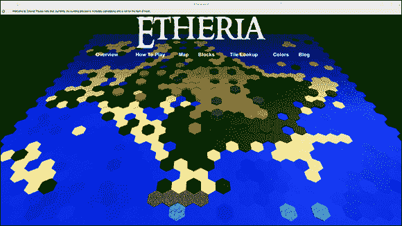
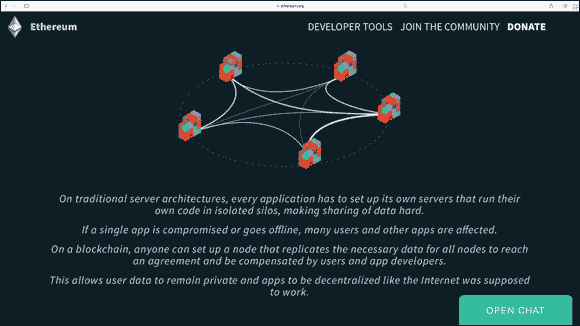
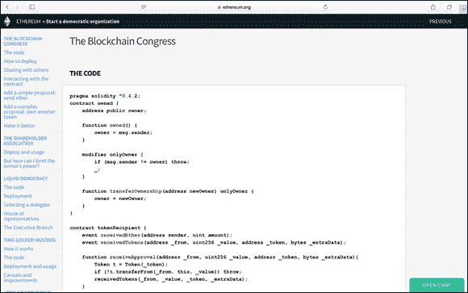

第五章

# 遇到以太坊区块链

在本章中

 **看看以太坊是如何开始和为何开始的**

 **了解以太坊区块链**

 **揭示区块链黑客行为**

 **开始使用以太坊**

 **创建去中心化自治组织**

 **构建智能合约和去中心化公司**

以太坊项目是生态系统中最发达和可访问的区块链之一。它还是区块链创新和使用情况的行业领先者。理解这项技术很重要，因为它引领了智能合约和去中心化组织的发展。

在本章中，我将介绍以太坊的构成，并解释了在以太坊区块链上构建组织和公司的新方法。我还深入探讨了以太坊区块链的安全性和实际业务应用。我会告诉你项目是如何启动的以及未来的计划。

这一章将帮助你建立自己的去中心化组织。我会解释如何在测试网络上挖掘加密货币来为你的项目提供动力。阅读完本章后，你将能够建立自己的以太坊钱包并交易代币。## 探索以太坊的简史

以太坊最初是在 2013 年由 Vitalik Buterin 撰写的白皮书中描述的，他在比特币社区中是一位非常活跃的作家和程序员。Buterin 认为比特币有着比仅仅能够在没有中央机构的情况下移动价值更多的潜力。他一直在比特币中为有色硬币努力，以扩展比特币的实用性，使其能够超越其本机代币的交易。Buterin 相信，还可以通过区块链结构构建需要中央机构控制的其他业务和政府用例。

那时，有关比特币网络被许多来自应用程序的低价值交易“膨胀”的激烈辩论。主要关注的问题是建立在比特币协议上的额外应用程序在交易量上会遇到问题。比特币并未设计用于处理应用程序所需的交易数量。Vitalik 和许多其他人意识到，为了让人们在比特币区块链上构建去中心化应用程序，要么区块链需要进行大规模的代码改进，要么他们需要完全构建一个新的区块链。

那个时候，比特币已经得到了很好的建立。很清楚所需的核心代码升级远远超出了现实可能的范围。比特币的政治将阻碍对网络的任何更改。Vitalik 和他的团队于 2014 年初成立了以太坊基金会，以筹集资金来构建一个内置编程语言的区块链。

最初的发展是通过 2014 年 7 月至 8 月的在线公共众募集活动融资的。基金会最初通过出售其名为以太的加密货币代币筹集了创纪录的 1800 万美元。人们积极地争论是否这种众募销售属于非法，因为它可能构成未经许可的证券。

监管灰色地带并没有阻碍该项目。如果说有什么，项目的前沿性质吸引了更多关注和人才到基金会。来自世界各地不满和被剥夺权利的开发者和企业家已经涌向该项目。分权被看作是对腐败和压制性中央当局的完美解决方案。

在代币销售中筹集的 1800 万美元为基金会提供了资金，以聘请一个庞大的开发团队来构建以太坊。以太坊首次发布的以太重地网络于 2015 年 7 月对公众开放。这是一个只有更技术熟练者才能用来构建自己应用的基本软件发布。

Homestead 是当前以太坊软件发布，它于 2016 年推出。几乎任何人都可以利用其上的应用程序模板。它拥有直观友好的用户界面和一个忠诚的开发社区。

Metropolis 是下一个计划中的以太坊发布。其主要区别将是应用程序将得到充分发展和充分测试。它还将拥有更易于使用的应用程序，将拥有更大的市场吸引力，即使非技术人员也会觉得舒适使用它。

Serenity 是以太坊发展的最后一个计划阶段。这是以太坊将从工作量证明共识（其中矿工竞争创建下一个区块）转移到权益证明模型的过程。在权益证明模型中，节点被假随机选择，并且根据他们在网络中所持的权益增加被选择的可能性。他们的权益由他们拥有的加密货币数量来衡量。该变化的主要好处将是降低与工作量证明相关的能源成本。这可能使网络中的个人更愿意运行节点，这将增加分权并提高安全性。

以太坊可能是有史以来建立的最复杂的区块链之一。它有自己的*turing 完备编程语言*（一个可以让开发者构建任何类型应用的完全功能的程序设计语言）。以太坊协议几乎可以做任何你一般编程语言可以做的事情，除了它是内建在一个区块链中，并且具有与此相关的附加好处和安全性。如果你能想象一个软件项目，它可以在以太坊上构建。

[以太坊生态系统](https://www.ethereum.org/)目前是构建去中心化应用程序的最佳选择。他们拥有出色的文档和用户友好的界面，可以让您快速上手。快速的开发时间、小型应用程序的安全性，以及应用程序之间轻松互动的能力是该系统的关键特点。

图灵完备的编程语言是使以太坊区块链比比特币区块链具有更强大功能的主要特征。以太坊的脚本语言使诸如 Twitter 应用程序等在几行代码中成为可能，而且非常安全。

像你在第三章中创建的智能合约一样，也可以在以太坊上构建。以太坊协议已经开辟了一个全新的应用程序类型。您可以将几乎任何业务、政府或组织的流程构建为以太坊内的数字表示。目前，以太坊平台正在被用来管理*数字资产*（一类在线存在的新资产，可能代表整个数字资产，如比特币代币或玉米商品的数字表示）、金融工具（如抵押支持证券）、资产所有权记录（如土地）、以及去中心化自治组织（DAO），这是一种以全新方式组织业务、非营利组织、政府或其他需要就共同利益达成协议并共同工作的实体。DAO 主要建立在以太坊平台上。

###去中心化应用程序：欢迎来到未来

以太坊最具革命性和争议性的体现是自治和去中心化应用程序（DAPP）。DAPP 可以管理诸如数字资产和 DAO 之类的事物。

DAPP 旨在取代资产和组织的中心化管理。这种结构非常吸引人，因为许多人认为绝对权力必然导致腐败。对于那些害怕失去控制的人来说，这种结构具有巨大的影响。

以太坊的一款类似 Minecraft 的游戏——Etheria（[`www.etheria.world`](http://www.etheria.world)），是该技术运行的有趣示例（见图 5-1）。该游戏无法被审查或关闭，并且只要以太坊存在，它就会存在。在以太坊中创建的东西，即使有充分理由移除某种结构或组织，也几乎不可能做到。

图 5-1： 世界上第一个永恒的数字游戏，以太坊。###去中心化自治组织的力量

DAO 是以太坊应用的一种类型，代表了以太坊内的虚拟实体。创建 DAO 时，可以邀请其他人参与该组织的治理。参与者可以保持匿名且无需见面，这可能触发了了解客户(KYC)规则（企业必须通过的过程，以验证其客户的身份）和反洗钱（AML;旨在阻止通过非法手段产生收入的实践的法律和法规）遵从问题。

DAOs 旨在为投资募集资金，但也可以为公民或非营利目的而设计。以太坊为治理提供了基本框架。组织者决定了治理的内容。以太坊为你创建了 DAO 的模板，帮助你创建 DAO。

图 5-2 显示了以太坊应用的组织结构。

图 5-2：以太坊.org 区块链应用的表示。

DAO 的基本工作原理如下：

1.  一群人编写智能合约来管理组织。

1.  人们向 DAO 添加资金，并获得代表所有权的代币。

    这种结构的工作方式类似于公司的股票，但成员从第一天起就控制着资金。

1.  当资金募集完成后，DAO 开始运作，会有成员提出如何使用这笔资金。

1.  成员对这些提议进行投票。

1.  当预定的时间已过，并积累了一定数量的投票，提案通过或失败。

1.  个人可以作为承包商为 DAO 提供服务。

与大多数传统投资工具不同，DAO 的成员控制着 100%的资产。他们投票决定新的投资和其他决策。这种结构威胁着取代传统的金融经理。

DAO 是以无法随意更改的代码构建的。这种吸引力在于，恶意黑客不能轻易干预资金。黑客仍然可以找到方法以意想不到的方式执行代码并提取资金。一旦 DAO 在以太坊上线，其代码的不可变性使得几乎不可能修复任何错误。##黑客攻击区块链

以太坊从未被黑客攻击过。2016 年 DAO 的硬分叉并不是系统的真正黑客攻击，但令人困惑的是经常被称为黑客攻击。以太坊运行得很好。问题是它太完美了。当大量资金和大多数用户受到威胁时，有必要重新启动系统。

在像以太坊这样的区块链上纠正一个行动的唯一方法是进行*硬分叉*，这允许对协议进行基本更改。硬分叉会使以前有效的区块和交易无效。以太坊之所以这样做是为了保护第一个 DAO 被用户取出的资金。DAO 的黑客事件在概念上是有史以来最大的漏洞赏金之一。

许多欺诈和黑客攻击事件发生在加密货币领域。大多数攻击针对集中式交易所和应用程序。许多黑客想要窃取加密货币。它具有真实价值，并且没有像常规货币一样受到政府的保护。加密货币的匿名性也使其对骗子很有吸引力。然而，抓捕和起诉这些个体是困难的。然而，加密货币社区正在努力抵制，并制定新措施来保护自己。

 在区块链世界中，黑客攻击一个地方要比试图战胜去中心化网络容易得多和便宜得多。当你读到区块链世界中的黑客攻击时，很可能只是一个网站或一个加密货币钱包被黑，而不是整个网络。

### 理解智能合约

以太坊智能合约就像合同协议，只是没有中央方来执行合同。以太坊协议通过施加经济压力来“执行”智能合约。如果它生活在以太坊中，它也可以强制执行某些条件是否得到满足。如果它不在以太坊中，要想强制执行就要难得多。

 以太坊智能合约还没有具备法律强制力，也许永远都不会，因为人们认为不需要外部权威来强制执行协议。法律体系受政府控制。就目前而言，政府是中央权威——一些具有更多或更少的同意和民主原则。在以太坊智能合约中，每个参与者都有不可剥夺的投票权。

以太坊智能合约不包括人工智能。这是在不久的将来的一个很酷的可能性。但现在，以太坊只是在区块链上运行的软件代码。

以太坊智能合约并不安全。The DAO 黑客事件是可能发生的危险类型的一个很好的例子。现在还处于早期阶段，将大量资金投入一个未经证实的系统是不明智的。相反，用少量资金进行实验，直到新合同中的所有漏洞都被排除。### 探索加密货币以太坊

以太币是以太坊区块链的加密货币名称。它得名于一种被认为弥漫所有空间并使宇宙可能的物质。从这个意义上说，以太币是使以太坊可能的物质。以太币通过工作量证明挖矿激励网络来保护自身，就像比特币代币鼓励比特币网络一样。执行以太坊网络中的任何代码都需要以太币。当以太币用于执行以太坊中的合同时，它被称为*gas*。

在智能合约中执行代码也需要一定数量的以太币。这个特性使代币获得了额外的实用性。只要个人想要在应用程序和合同中使用以太坊，以太币将具有超出投机的价值。

以太币价值的大幅增长使其成为流行的投机标的。它在全球范围内被广泛交易。一些新的对冲基金将其视为投资工具。然而，其波动性和市场深度低的特性使以太币成为高风险投资。  ## 在以太坊上启动和运行

在本节中，我将带领你了解如何在以太坊区块链生态系统中入门。在你可以在以太坊上构建任何东西之前，你需要一个以太坊钱包。

 你的钱包将持有称为*以太币*的以太坊代币。以太币是允许你在以太坊内创建智能合同的加密货币。这有时被称为*gas*。

下载以太坊钱包可能需要一些时间，但界面非常直观，整个过程中提供的指令易于跟随。

 在以太坊钱包中，你可以赢得测试以太币来构建你的测试合同和组织。你不需要挖矿以太币来学习它是如何工作的。

### 挖掘以太币

以太坊是由全球范围内的一组计算机网络维持运行，这些计算机正在处理合同并保护网络。这些计算机有时被称为*节点*，它们正在挖掘加密以太币。

为了奖励挖矿所需的时间和成本，大约每 12 秒就会有 5 个以太币的奖励。奖励将发放给成功创建最新区块的以太坊区块链上的节点。

所有新区块都有最新交易的列表。工作量证明共识算法保证奖励通常由计算能力最强的节点获得。性能较弱的计算机也可以获胜，只是时间比较长。如果你想尝试挖掘以太币，你可以使用家用电脑，但会花费很长时间才能成功挖出一个区块并获得以太币。

 挖掘以太币不适合技术新手。您需要熟悉命令行操作。如果您对命令行一头雾水，您可能希望跳过此过程。另外，请确保遵循以太坊 GitHub 上最新的说明（[`http://github.com/ethereum`](http://github.com/ethereum)）。### 设置您的以太坊钱包

要设置您的以太坊钱包，请按照以下步骤操作：

1.  **访问** [`www.ethereum.org`](http://www.ethereum.org)**。**

1.  **点击“下载”按钮。**

    您需要向下滚动页面一点才能找到按钮。

     请确保将以太坊钱包下载保存在您随后可以找到的地方。

1.  **打开以太坊钱包。**

1.  **点击“使用测试网络”。**

    在这里，您可以开始挖掘测试以太。这个过程比真实以太挖掘少了很多时间，但仍需要一些时间。

1.  **创建一个强密码。**

    别忘了将您的密码保存到一个安全的地方。

1.  **按照启动菜单操作。**

    以太坊团队有一些教程很有趣，您可以在等待测试网下载时进行审阅。下载可能需要约十分钟左右。

1.  **选择 Develop ⇒   Start Mining。**

    不要跳过此步骤。您需要以太币用于后续项目。

您刚刚设置好了您的钱包，并且在为您未来的智能合约项目赚取测试以太。## 构建您的第一个分散自治组织

DAO 将改变未来企业经营方式。它们允许全球任何人在线创建一种新类型的公司，该公司受预先约定的规则约束，然后通过区块链网络执行。创建 DAO 比您想象的要简单。在本节中，您将创建您的第一个测试 DAO。我将这个项目分为构建、大会和治理三个部分。

 为了成功完成您的测试 DAO，您需要设置好您的以太坊钱包并在以太坊测试网络上进行一些挖矿（请参阅前面的部分）。

按照以下步骤创建您的第一个测试 DAO：

1.  **访问** [`www.ethereum.org/dao`](http://www.ethereum.org/dao)**。**

1.  **滚动页面到代码框（如** **图 5-3**** 所示），并复制代码。**

1.  **打开之前创建的以太坊钱包。**

    您将在您的以太坊钱包中开发您的 DAO。

图 5-3: 代码框。

### 测试网络与大会

您的 DAO 项目的下一个阶段是为您的 DAO 构建框架。请按照以下步骤操作：

1.  **在您的以太坊钱包中，选择 Develop ⇒   Network ⇒   Test Net。**

1.  **点击“合约”选项卡，然后点击“部署合约”。**

    以太坊团队已经为 DAO 设立了一些测试模板。

1.  **将您在前一节中复制的代码粘贴到 Solidity 代码框中。**

1.  **从合约选择器中选择 Congress。**

1.  **在提示时选择一些变量。**

    这里有您的选择：

    +   提案的*最低法定人数*是提案在执行之前所需要的最少票数。

    +   *辩论时间*指的是需要在执行之前的最短时间，以分钟计。

    +   *多数票边际*。如果有超过 50% 的投票加上边际，提案就会通过。若要简化，设置为 0。  ### 治理与投票

现在你要对你的 DAO 进行命名和设立治理。你需要设立*最低法定人数*以通过提案（新提案需要多少票才能通过）。你还要设立*多数票数的边际*（一个计划需要多少票才能通过）和讨论新计划的时间。

1.  **命名你的新 DAO。**

    这有点像给公司命名。

1.  **对于辩论时间，选择 5 分钟。**

    这是新提案开放讨论的时间。

1.  **将多数票边际留在 0。**

    这设定了你的合同的民主运作方式。

1.  **确认 DAO 的价格。**

    你在测试网络中通过你的钱包挖掘了一些以太币，当你第一次设置它时。如果你跳过了这一步，请回去现在做。你需要一点测试网络以太币来构建你的 DAO。

1.  **点击部署并输入你的密码。**

    DAO 可能需要一些时间来部署。当你到达你的新仪表板时，向下滚动，你将能够看到你的 DAO 正在生成中。

1.  **点击新图标。**

    将生成一个代表你的 DAO 的新独特图标。

恭喜！你创建了你的第一个 DAO。  ## 揭示 DAO 的未来

智能合约和去中心化组织承载着许多承诺。它们纯粹的民主和超理性的本质非常吸引人。然而，目前还有更多的可能性而不是所知的事实，而创建的每个合同都可能是开创性的或者彻底失败的。

如果你把以太坊视为新的前沿，你将会更成功。以太坊网络的好处远多于缺点，只要你小心。但是期望一切运行无缺陷，所有参与者都以诚信行事，将使你承受更大的损失。以太坊有自己的强盗，更不用说那些希望你成功的友好爱好者了。

2016 年的智能合约黑客事件突显了安全性和正确审查合同的重要性。它还说明了有诚信的人在努力解决问题。

阅读本书仅仅是个开始。它将为你搭建对以太坊知识的坚实基础，但正如所有新技术一样，以太坊发展迅速。不断审查最佳实践和安全措施。

在接下来的几个章节中，我将提及一些在构建你的前几个 DAO、构建智能合约和调试你的新区块链系统时需要牢记的事项。

### 投资 DAO

不要把大笔资金交给未经测试和未经充分审查的合约。大型合约更容易受到黑客的攻击。本章前面描述的 DAO 黑客（见侧栏“大权责大责任”）表明，即使深思熟虑的合同也会有意想不到的弱点。

 尽管智能合约和区块链让你能够与世界各地的任何人进行业务往来，但目前仍是早期阶段。你可以通过只与熟悉和信任的合作方合作来减轻风险。

 安全态势将不断发展，出现新的 bug 是必不可少的。审查所有新的最佳实践是至关重要的。管理你要冒的风险金额，逐步和分阶段推出合约。以太坊是一项新技术，成熟的解决方案尚未建立。  ### 构建更智能的智能合约

智能合约编程需要一种不同的心态，与标准的合约编写不同。如果合约以你没有预料或意图的方式执行，没有第三方可以使一切恢复正常。区块链的不可变和分布式特性使得改变不受欢迎的结果变得困难。

 你的合约将有缺陷并可能失败。在你的合约中建立安全阀，这样你就可以在出现 bug 和漏洞时做出响应。智能合约还需要一个让你关闭合约并暂停合约的开关，当事情发生错误时。

 如果你的合约足够大，就提供悬赏金来激励社区发现你的合约中的漏洞和缺陷。

与许多事物一样，你的合约复杂性也会增加错误和攻击向量的可能性。保持你的合约逻辑简单。构建出每个合约部分的小模块。以这种方式创建合约将有助于你对任何问题进行分隔化。  ### 在系统中找到 bug

不要重新发明轮子，比如构建你自己的随机数生成器等工具。相反，利用社区已经完成并经过充分测试的工作。

 你只能控制你自己合约中的事情。小心外部合约调用。它们可以执行恶意代码并夺走你的控制权。

以太坊社区在其 GitHub 页面[`https://github.com/ethereum/wiki/wiki/safety`](https://github.com/ethereum/wiki/wiki/safety)上有一个出色的已知 bug 列表，以及更多关于如何构建安全智能合约的有用提示。
