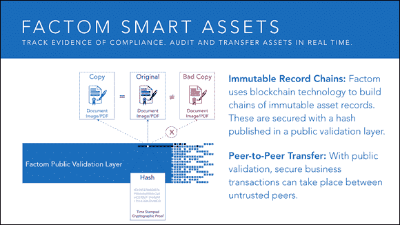
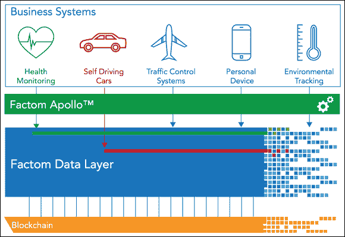
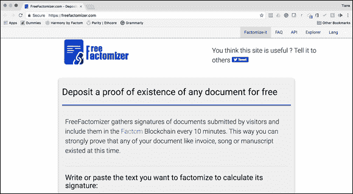
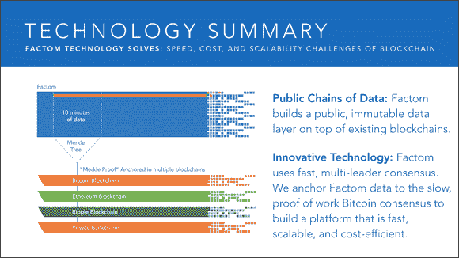

第七章

# 寻找 Factom 区块链

本章内容

 **在 Factom 中录入**

 **深入了解链结构**

 **在区块链上揭示身份**

 **看看 Factom 在使用中的样子**

Factom 区块链是一个强大的工具，将帮助行业扩展区块链技术。它与其他公共区块链不同，并具有独特的特性，使其成为发布数据流和保护系统的理想选择。Factom 区块链也有一个背后的公司——Factom 公司——它主导其开发，并在协议之上构建工具和产品。

Factom 软件正在被嵌入到管理人员和物品身份和安全的系统中。他们还整合和桥接其他区块链和区块链技术。区块链之间的链接提高了 Factom 的安全性，并使其他区块链更具互操作性。

本章将解释 Factom 的工作原理，介绍其独特性，并提供易于遵循的说明，帮助您开始使用它。阅读完本章后，您将理解 Factom 区块链技术的许多核心概念，并知道它将为您的区块链项目增添价值的地方。

这也许是时候提一下，我是 Factom 公司的联合创始人兼首席营销官。尽管我的目标是客观的，但对 Factom 的热情很难隐藏。  ## 信任问题

在其核心，区块链是允许不同实体进行合作和协作而无需信任对方的数据安全或业务流程。历史上，信任的中间商或行业协会使这种情况发生，但这些具有很高的开销成本，并且只是将信任转移给另一方。区块链将信任转移到一个无兴趣的第三方网络，最终依赖数学。

Factom 公司是在开放访问的 Factom 区块链上构建区块链软件的公司。Factom 的记账软件通过在 Factom 区块链上发布加密数据或该数据的加密唯一指纹来工作（显示在图 7-1）。为了安全网络，还会每十分钟在其他公共区块链上发布整个 Factom 区块链的哈希。这个额外的发布功能使 Factom 不同于大多数公共区块链。

图片由 Factom 公司提供。

图 7-1： Factom 区块链的结构。

这份协议的概念于 2014 年以白皮书的形式提出，旨在解决比特币的可扩展性问题。随着去中心化应用程序开始在比特币上保护自己，显然在比特币区块链中输入数据难以扩展，而比特币无法处理大量交易。比喻地说，就像把 10 磅重的数据装进 5 磅重的比特币袋里是不可能的。

Factom 协议旨在解决其他区块链的成本和交易量限制。主要目标是保证数据和系统的安全。由于这个目标，Factom 经常被描述为 *发布引擎*。它允许用户以小额费用向其分类写入数据。这些条目限制在 10 kibibytes，并且与使用工作证明的区块链相比，其固定成本更低，交易容量更大，数量级高出一个数量级。

一个重要的理念是了解 Factom 区块链是以层和链构建的。层与数据结构有关。它们使用 Merkle 树留下在 Factom 内发布任何给定数据的密码学证明。这种密码学证明，称为 *Merkle 根*（32 个随机字符，可表示整个单独数据的树），然后发布到其他公共区块链，如以太坊。这是其他区块链未能提供的冗余安全性。

 Merkle 树是一种数学树，通过对数据进行散列配对，然后对结果进行配对和散列，直到剩下一个单一的散列，即 Merkle 根。这种密码学证明是在 1979 年以 Ralph Merkle 的名字命名的。

将数据组织成链有助于提高可扩展性。链允许应用程序仅从 Factom 区块链中获取感兴趣的数据，而无需下载完整的数据集。它们的工作原理非常简单：你可以将你的数据发布到 Factom 中的现有链中，也可以创建新的链。然后在接下来发布的内容中使用链 ID 作为追溯你关心的数据的方法。

### Factom 区块链的目的：发布任何内容

Factom 是一个发布平台。它的核心，旨在发布和验证任何数据。其余的工具都是围绕这些简单的功能构建的。Factom 可以处理多达 10 kibibytes 的交易；较大的交易需要特殊结构并需要多个输入。或者，也可以发布表示数据的散列值。

因为 Factom 协议是开源的，所以该系统是作为公共公用事业。这是一个任何人都可以在其中发布任何内容并由 Factom 区块链保障的地方。不足为奇的是，一些个人已经发布了淫秽内容，但是数据输入大小的限制意味着他们无法发布太多。并且通过对每次输入收取少量费用来限制系统中的垃圾信息。所以如果你想在区块链上发誓，那么就要付费。

Factoids 是 Factom 网络的加密货币。分散的系统需要奖励机制来激励参与者。拥有这个封闭系统需要合作，并建立长期的网络价值创造。Factoids 可以在加密货币市场上像其他 700 种加密货币一样进行交易和购买。最终，Factoids 被用来购买 Factom 网络的入口积分。

一个条目的成本是固定的，而一个*Factoid*的成本是波动的。随着 Factoid 价值的增加，用户可以购买更多的入口积分。这个系统可以让用户与可交易的代币分离，并在维持消费者固定成本的同时允许 Factoids 的投机自由市场。这个功能是在 Factom 的最初版本中构建的，以允许受严格监管的行业和政府利用区块链技术而不用用可交易的代币弄脏他们的手。

截至 2017 年初，Factom 网络每天约有 40,000 个条目。这些包括像 Russell 3000 指数和每天的另类币价格记录等内容。这些记录被用作历史参考，并可以用作智能合约的输入或用来证明历史。

今天数据的存储和访问在行业中大多是一个解决的问题。计算机备份可以被大规模复制和存档。一个仍然存在的大问题是确定哪个文档是最新的修订版本，特别是在不同的组织之间。通过基于区块链的文档管理系统，组织可以确保他们使用与他们的合作伙伴相同的文档。Federation 的激励### Incentives

许多区块链，比如比特币和以太坊，使用“工作证明”共识。在这种区块链中，共识算法是区块链就新输入的数据达成一致的方式。共识系统检查新数据是否有效。公共区块链需要一个强大的系统，因为任何人都可以向区块链添加数据。他们的共识机制是确定一个区块的有效性以及应该信任哪个链的规则集。

工作证明有许多特点，使其非常具有吸引力。它通常需要投资专门的计算机硬件和电力访问（价格越便宜越好）。这意味着加入系统作为权威的唯一要求就是使用商品硬件消耗电力。这也意味着为了重写历史，必须重新消耗相等数量的能源。这笔费用使得重写历史变得毫无利润，因此不太可能发生。

工作证明在保障区块链安全方面表现优异。另一方面，它消耗大量能源，成本高昂。这是一场食人的竞赛，在这场竞赛中最快的计算机获胜，而每增加一个吉哈希到网络中都会增加挑战。

每个区块中包含的数据越多，验证就越困难。像比特币这样的工作证明系统，还需要下载完整的区块链才能验证系统中的特定数据点。要想证明您在比特币区块链上进行的交易是有效的，他们必须下载所有比特币的区块链。目前，这需要几天的时间。

Factom 回答的问题不是“条目是否有效？”，而是“是否已支付条目费用？”系统的用户是验证条目的人。Factom 还将数据结构化为可单独解析的子链，以证明任何条目的有效性，而无需下载整个区块链。

图 7-2 显示了 Factom 链结构的图表。

Factom, Inc.的插图。

图 7-2： Factom 链结构。

Factom 之所以以商业应用这种方式构建，是因为同一行业的成员不需要下载与不相关行业相关的所有无关数据。例如，验证与抵押贷款相关的所有文件不需要同时下载多年股票交易历史。

Factom 区块链还扩展自身以防止数据损坏。每隔几分钟，它在比特币和以太坊中创建一个小的锚。这有两个关键作用：

+   **首先且最重要的，它防止了构建 Factom 区块链的服务器无法被察觉地重写历史。** 由于服务器无法控制比特币或以太坊，它们记录的所有历史都是永久的。

+   **它防止了 Factom 服务器向不同的人展示区块链的两个不同版本。** 个性化定制网页是亚马逊和 Facebook 例行公事。向不同公司展示冲突的业务交易历史是误会的根源。由于只有一个比特币区块链，这就防止了被篡改的历史版本的创建。  ## 基于 Factom 的构建

Factom 是为了建立在其之上的应用程序而创建的。它专为规模、速度和低成本而建。它是为了将比特币区块链的安全性带到更多空间之外，使其永久性适用于超出其有限空间的内容。

### 使用 API 认证文档和建立身份

Factom 还推出了一组可供开发团队使用的应用程序编程接口（API），用于管理和认证文档，并为人和物建立身份。仍然需要开发人员来帮助您，并且它们被设计用于企业集成，目前对于小项目来说并不理想。

普通公众有两个核心产品：

+   **Apollo：** Apollo 是你的发布和验证选择。它允许用户将大量数据输入到 Factom 中，然后根据需要进行参考，包括历史数据。例如，它是发布网站存档或协议更新的理想地方。

+   **Iris：** Iris 是用于构建身份的平台。它是美国国土安全部 IoT 身份项目背后的基础技术。它是建立在 Apollo 平台上用于记录管理的。

您可以在不需要设置区块链或运行加密货币钱包的情况下使用 API。它简化了这个过程，非常适合那些担心加密货币仍然属于监管灰色地带的人。### 了解 Factoid：不是普通的代币

Factom 有一个独特的价值代币系统，使用了一个叫作 Factoid 的东西。Factoid 是一种可在某些交易所上交易的数字商品。它不像比特币那样是一种货币。Factoid 可以被所有者转换成*入口积分*（用于在 Factom 网络内购买发布能力的不可转让令牌）。这种交易是单向的，无法撤销。Factoids 被实际销毁并从流通中移除。

Factoids 的价格会根据投机和实用性的波动而波动。另一方面，入口积分有一个稳定的价格，维持在每个 0.001 美元。这使得支付发布费用成为可预测的成本。

Factom 团队在众售中发行了一定数量的代币，用于筹集核心 Factom 开发的资金。目前，Factom 网络还没有达到白皮书中概述的 32 个节点的完全联邦制。一旦 Factom 网络达到 32 个节点，网络将开始用新代币奖励联邦节点和审计节点。

*联邦节点*是由网络选举出来维持共识并验证交易的节点。审计节点检查这些节点的诚实性，如果任何联邦节点下线或违反系统规则，审计节点将取代其位置成为联邦节点之一。

向服务器发行新 Factoids 同时用户熄灭 Factoids 代表价值转移。用户实际上是为服务器的运行付费。### 锚定您的应用

区块链技术为新产品和服务敞开了大门。区块链本身成为旧技术可以重新发明或创新可以建立对其的基础层。每个区块链都有其独特的特性，使其成为特定应用的理想选择。

Factom 在保护信息方面特别出色，但它仍然存在一些限制：每个条目的大小以及发布的越多，成本就越高。Factom 非常适合在云解决方案中存储大型文件，然后使用 Factom 中的指针来定位应用程序的这些文件。

Factom 主要被用作管理文件和数据以及构建身份的系统。它与其他区块链集成，并可以用于为智能合约创建 Oracle。  ### 在 Factom 上发布

Factom 由开发人员为开发人员构建。您需要使用终端并下载特殊软件才能使用您的钱包并向网络中添加条目。

Factom 团队一直在努力首先建立一个强大的系统。他们有文档可以引导你完成整个过程，以及一个 GitHub 仓库，其中包含所有开源软件，供你审核甚至贡献。已经在努力使 Factom 更加普通消费用户友好，但这仍然需要一些时间。

 FreeFactomizer 是我最喜欢的一款 Factom 粉丝开发的应用。它非常简单易用，允许您查看 Factom 的基本功能，而无需成为开发人员，打开终端或进行任何编码。它会将您输入文本框或上传文件的数据哈希，然后收集其他访客提交的文档哈希。每十分钟，它将所有这些哈希合并为 Factom 区块链中的一个条目。它提供了简单的存在性证明。

 FreeFactomizer 是一位个人提供的免费服务。为提供此服务需要成本，并且未来可能无法使用。也没有任何形式的保证。

使用 FreeFactomizer，请按照以下步骤进行。

1.  **前往** [`www.freefactomizer.com`](http://www.freefactomizer.com)**。**

    图 7-3 显示了 FreeFactomizer 首页。

1.  **上传要哈希的文档。**

    使用一个不包含敏感信息的不重要文件，因为此服务没有经过保修或安全性保证。

1.  **点击对文件签名进行 Factom 化。**

    你将获得文件被添加到 Factom 需要多长时间的时间估计。

1.  **等待文件被添加到 Factom。**

    你的文件至少需要十分钟才能与其他文件和数据捆绑在一起。当此过程完成时，FreeFactomizer 将为你提供链接返回到 Factom Explore。

1.  **使用 Factom Explore 来检查条目，这是 Factom 数据库的搜索工具，可以让你查找条目。**

    另一个尝试的选择是重新上传文档。它将返回这样的提示：“->签名已注册。” 这意味着他们已经将其添加到了 Factom。

图 7-3： FreeFactomizer 是尝试使用 Factom 区块链的绝佳方式。

恭喜！你刚刚在 Factom 中存储了数据的指纹，并探索了其核心功能。  ### 在抵押行业建立透明度

区块链文档管理服务 Factom Harmony 是该公司的第一个商业产品。它面向抵押权发起人，即向消费者发放房屋贷款的机构。

Factom Harmony（在图 7-4 中显示）通过将银行使用的各种成像系统转化为区块链文档保险库。它在抵押贷款处理过程中实时创建和管理条目。然后，它在 Factom 内安全记录数据，允许元数据在信任方之间透明共享，并指向机密数据。

图片由 Factom，Inc 提供。

图 7-4：Factom Harmony。

简单来说，Factom Harmony 是一个放在成像系统上的文档目录。这是对现有系统的根本改进，因为多年后介入的个人可以确定他们所获得的记录与原始贷款相同。不再需要抵押购买者相信发起方和他们之间许多中介的谨慎性。

Factom 希望捕获通过消除文档组装相关成本而产生的价值。目前，银行和其他原始数据源花费大量时间，确保审计和记录审查仅使用正确的记录和数据进行。当多个利益相关者在不同来源的贷款文件中进行协调时，这经常会出问题。

#### 在区块链上保护数据：数字保险库

Factom Harmony（请参见前一节）提供了将用于决策和合规性的具体数据和文档永久存储到区块链，并与需要该数据的任何方分享的能力。存储在该系统内的数据具有清晰的版本历史。缺失的数据也很明显。它是为审计、诉讼、强制执行、贷款交易、证券化和监管审查等场景而设计的。

核心技术局限性，在导致 2008 年市场崩溃的十年内，主要集中在速度，吞吐量，清单管理以及文档收集上。这些系统并不是设计来收集记录和相关数据，并且永久保留决策和行动的证据。

当今的监管环境要求企业在努力记录和维护与每一项决定相关的记录和数据方面更加谨慎。流程文档记录的任何不足通常被归因于恶意。没有能力完美地保存与其相关的数据和决策的证据。  #### Harmony 如何运用 Factom 技术

Factom 的技术是由美国国家标准与技术研究所（NIST）开发的一系列区块链技术、数字签名和一组密码学函数的组合。一系列数据点与密码学证据一起保存在其他区块链上，允许用户保存数据和文件以供将来使用。这一过程创建了一个可随时被任何授权方访问和验证的文件的电子目录。

使用 SHA-256 密码学函数，Factom 生成了存储在 Factom 区块链中每个文件和数据文件的哈希值。哈希创建了文件从未被修改或更改的密码学证据。

  *哈希* 是一种代表文件内容但不会暴露数据风险的“指纹”类型。

此外，Harmony 还为与记录相关的每个文件和数据文件生成并存储了一组关键元数据点的哈希。在元数据中，文件和数据文件使用相同的密码学工具进行关联和链接。这些元数据以及文件的哈希值被写入了 Factom 区块链中。  #### 使用区块链作为公共见证

Factom 为其所保护的数据创建了多个公共见证。与比特币和以太坊等巨头相比，它的区块链微不足道。他们的系统不把挖矿作为共识机制的一部分。目前，该系统甚至没有产生任何新的代币。一个区块链越大和去中心化，它就越不容易受到成功的攻击。

挖掘加密货币是大多数公共区块链为了保障自身安全所做的事情。这是激励节点加入网络的方法。

Factom 通过巧妙的方法克服了这一障碍，使其具有复合的安全性。它将放置在 Factom 区块链中的数据锚定在比特币和以太坊上。每隔十分钟就通过哈希处理一次。他们将完整的数据集进行哈希处理，直到只剩下一个可以代表整个 Factom 区块链的哈希。  ### 验证物理文件：dLoc 与 Factom

Smartrac 是全球领先的 RFID 传感器、贴片、预制层和半成品智能卡制造商和供应商，与 Factom 合作。通过这一合作，一种新的使用区块链保护物理物体的方法被创造出来。这一产品和服务被称为 dLoc。dLoc 被设计成可以贴在几乎任何物品上的贴纸。它对纸质文件等基础文件有特殊的实用性。

dLoc 是一种全方位安全的文档管理系统，它同时使用硬件和软件。dLoc 的粘性 Smartrac 编码近场通信（NFC）传感器贴纸带有嵌入式芯片，被放置在文件或其他物品上，然后使用 Factom 区块链进行安全保护。

 NFC 通信协议允许两个电子设备在彼此靠近时建立连接。

通过将基于云的软件与 Factom 技术相结合，可以为几乎任何东西随着时间而创建一个不可改变的身份。具有特定许可的人员可以使用 dLoc 移动应用程序访问和验证物理文件。

dLoc 还允许发行机构或实体将他们的离线文件转变为可以轻松连接到现有数字系统并弥合离线和在线世界之间差距的数字实例。这个解决方案可以应用于广泛的文件，如出生证明、土地所有权证书、法院和医疗记录。

dLoc 代表了第一个实际使用 Factom 区块链解决物理世界和数字世界之间数据完整性差距的文件认证系统。这是在纸质文件上使用区块链技术保护数字数据的第一可靠方式。dLoc 的数据和身份认证解决方案在广泛使用纸质文件的公共和私营部门有很大的潜力。

 dLoc 并不能消除欺诈。人们会找到方法来规避、绕过和盗取。这项技术使这变得更加具有挑战性和昂贵。此时，有人可以在几乎任何地方购买新的身份或伪造商品。在某些情况下，这些身份是无法与真实文件和商品区分开来的。

dLoc 被创建为一种扩展区块链技术对物理物体和文件的不可能性。他们还创建了一个可以通知您身份是否被篡改以及可能采取行动的系统。
