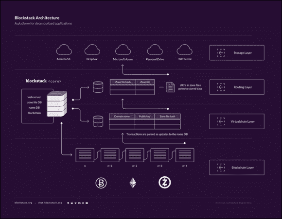
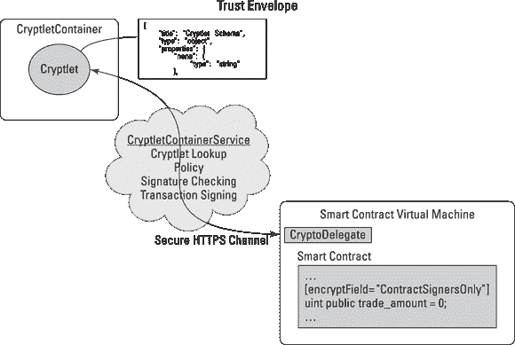

第十章

# 应用微软 Azure

本章

 **构建新应用程序**

 **连接您的系统**

 **认证新系统**

 **部署私有以太坊**

在本章中，您将预览微软 Azure 平台内正在发生的令人兴奋的创新，以及这些变化如何提高您企业的效率，并为产品和服务创造新的机会。

本章帮助您在全球经济中竞争、合作和为客户提供服务。区块链技术正在打开新的市场，改变商业模式。微软正在努力将其作为传统业务可用的技术。

本章还介绍了正在构建的创新区块链桥梁，允许您连接和扩展现有系统。您将了解如何在 Azure 内部部署自己的区块链，以及对于您的业务来说，使安全、无故障地过渡到区块链系统的关键要素。## Bletchley：模块化区块链框架。

Bletchley 项目致力于为企业客户提供 *联合体区块链生态系统*（仅限成员的、授权网络，用于执行合同）。Bletchley 的区块链框架平台由微软的云计算平台 Azure 提供支持。Bletchley 项目涵盖了以下内容：

+   数字身份

+   私钥管理

+   客户隐私

+   数据安全性

+   运营管理

+   系统互操作性

在 Bletchley 项目中，Azure 为区块链提供了云层，作为构建和交付应用的平台。它将在全球 24 个地区提供服务。Azure 正在将其传统产品与各种区块链的混合云能力、广泛的合规认证组合以及企业级安全性相结合。微软希望让现有客户更快地采用区块链技术，尤其是在受控行业，如医疗保健、金融服务和政府。

图 10-1 显示了 Bletchley 项目的 Blockstack 核心 v14，这是一个新的去中心化的无服务器应用网络，用户可以控制他们的数据。

图 10-1： Blockstack 核心 v14。

Azure 将与几种区块链协议配合工作。它们是 Hyperledger 项目和未花费的交易输出（UTXO）的基于协议。这意味着 Azure 平台不使用加密货币，这可能更受企业客户的青睐。它们还将与更复杂的协议集成，包括以太坊，这些协议使用加密货币来保护网络。

### 用于加密和认证的 Cryptlets

Bletchley 项目围绕着两个想法构建：

+   **区块链中间件：**云存储，身份管理，分析和机器学习

+   **Cryptlets：**在微软 Azure，Bletchley 生态系统和您自己的技术之间进行互操作和通信的安全执行

Cryptlet 被构建为链下代码组件，可用任何语言编写，在受信任的容器内执行，并通过安全通道进行通信。在智能合约和 UTXO 系统中可以使用 Cryptlet，在需要额外功能或信息的情况下。

Cryptlet 弥合了程序在链内和链外执行的安全差距，在需要额外安全信息时运行。例如，它们可以让您的客户关系管理（CRM）或交易平台与云存储连接，然后通过以太坊进行安全保护。

Bletchley 的中间件与 Cryptlet 和现有的 Azure 服务（如 Active Directory 和 Key Vault）以及其他区块链生态技术协同工作，以提供完整的解决方案，并确保您的区块链集成的可靠运行。

表 10-1 展示了甲骨文与 Cryptlet 之间的区别。来自 Bletchley 的 Devcon 2 演示。 

表格 10-1 Cryplet 与 Oracle

|  | *****Cryptlet***** | *****Oracle***** |
| --- | --- | --- |
| 验证要求 | 需要与受信任主机（HTTPS）进行验证，使用受信任的 Cryptlet 密钥，以及使用受信任的隔离签名。 | 需要信任但不需要正式验证。 |
| 基础设施 | 标准基础设施。您可以通过全球 Azure 中可用的隔离区实现基于硬件的隔离和证书。Bletchley Cryptlet 软件开发工具包（SDK）框架（Utility 和 Contract）可帮助您快速开始创建和使用 Cryptlet。 | 自定义基础设施。您可以分别编写和托管。建立信任是困难的。Oracle 一直是特定于平台的，并且文档目前非常稀少。 |
| 开发者使用 | 提供许多语言选项，并且与区块链无关。 | 与其自己的区块链绑定，并且语言选项有限。 |
| 市场可用性 | 有一个用于发布和发现的市场。 | 没有供发布和发现的共同市场。 |

Cryptlets 由开发人员构建并在 Bletchley 的市场上销售。他们解决了许多不同的功能集，这些功能集对于构建基于分布式分类账的应用程序至关重要。市场正在不断增长，以满足需要必要功能的客户的需求，例如安全执行，集成，隐私，管理，互操作性和完整的数据服务。  ### 工具和合同 Cryptlet 和 CrytoDelegates

有两种类型的 Cryptlet：

+   **效用：**效用 Cryptlet 提供加密，时间戳，外部数据访问和认证。它们创建更可靠和受信任的交易。

+   **合同:** 合同 Cryplet 是完整的委托引擎。他们可以作为自主代理或机器人运作。它们提供了一切智能合同通常执行的执行逻辑，但在区块链之外。

合同 Cryplet 与智能合同绑定，并在发布智能合同时创建。它们与你的虚拟机并行运行，并且比内置于区块链内的传统智能合同性能更强，因为它们执行时不需要太多加密货币。它们对于非加密货币区块链用户最具吸引力，那里的链代码和智能合同由已知方签署。

图 10-2 显示了 Cryplet 容器的描绘以及到你的智能合同的安全通信路径。

图 10-2： 一个 Cryplet 容器。

CryptoDelegates 可以让效用和合同 Cryplet 发挥作用。它们作为适配器，通过在你的智能合同虚拟机中创建功能钩子来操作。它们从你的智能合同代码中调用 Cryplet，这反过来为交易创建一个安全和真实的信封。

Azure 是一个数字生态系统和云计算平台。它直接将企业与它们的云合作伙伴和 SaaS 连接起来。这反过来使企业能以相互连接的、可靠的和安全的方式传输他们的数据。

微软的 Azure 云平台是第二大基础设施即服务（IaaS）平台。这是一个可靠和安全的云计算和数据存储之地。在 Azure 中，有一个称为 ExpressRoute 的服务，它为消费者提供了直接连接到 Azure 的途径。这反过来可以防止公共互联网中广泛存在的性能和安全问题。

2015 年，微软决定扩大其 Azure 生态系统，使用以太坊和 Hyperledger 区块链系统。Azure 区块链服务的第一个产品是由以太坊提供支持的。以太坊是一个用于构建应用程序的图灵完备的区块链框架。微软计划基于区块链技术和 Hyperledger 构建更多的产品。它还在扩大 Azure 市场，同时过渡到一个用于 Azure 客户的门户网站。

微软的 Azure Stack 计划整合了 Azure 快速启动模板，借助 Azure 资源管理器部署各种 Azure 资源，以帮助你更多地完成工作。Azure 资源管理器允许客户将其业务资源作为一个组进行工作。它使他们可以协调和单一操作地部署、删除或更新解决方案中的所有资源。

Azure 快速启动模板可以适用于各种环境，如生产、暂存和测试。通过 Azure 资源管理器，客户可以获得标记、审计和安全等多个功能。这些功能帮助消费者在部署后管理他们的资源。

微软的 Bletchley 项目是他们与已提供的成熟企业技术相结合的区块链架构。它为 Azure 提供了区块链后端和市场。

Bletchley 的生态系统是微软采取的一种方法，旨在以安全有效的方式向更广泛的受众推广区块链或分布账本网络。他们希望帮助构建真正的解决方案，并解决实际的业务问题。  ## 在 Azure 上开始使用 Chain

Chain 提供区块链技术解决方案，已在 Azure 上发布了 Chain Core Developer Edition。Chain Core Developer Edition 是该公司分布式账本平台的开源免费版本。它使您能够在授权的区块链网络上发行和转移资产。

通过其测试网络，您的开发人员可以加入或启动区块链网络，访问深入的技术教程和文档，并构建金融应用。他们还可以在 Chain 的测试网络上运行自己的原型，或在 Azure 上创建自己的私人网络。

### 安装 Chain 的分布账本

Chain Core Developer Edition 附带代码示例，Java SDK 和入门指南。此外，它还配备了面向 Linux、Mac 和 Windows 的仪表板界面和安装程序。

按照这些步骤安装你的 Chain Core Developer Edition：

1.  **导航至 Chain 的安装页面，在** [`https://chain.com/docs/core/get-started/install`](https://chain.com/docs/core/get-started/install)**。**

1.  **从列表中选择您的操作系统。**

1.  **点击下载。**

1.  **打开 Chain 程序。**

1.  **运行 Chain Core 安装程序。**

Chain 提供了一个 SDK，为您和您的开发人员提供软件开发工具，使其能够创建区块链应用和资产。  ### 创建您自己的私人网络

您可以在 Azure 中创建一个私人以太坊联盟区块链网络。你应该能够自己完成这些步骤，无需开发人员的帮助。只需按照以下步骤：

1.  **注册或登录 Azure 帐户。**

    有免费试用选项和按需付费选项，可以轻松尝试 Azure。

1.  **前往** [`https://goo.gl/Ixu5of`](https://goo.gl/Ixu5of)**。**

1.  **点击部署到 Azure。**

     Azure 资源管理器模板由 Azure 社区成员创建。微软不会对安全性、兼容性或性能进行筛选。

1.  **填写表格。**

1.  **点击购买。**

恭喜！你现在拥有了一个私人以太坊联盟区块链网络。  ### 在 Azure 的 Chain 上使用金融服务

Chain 推出了其开源免费的开发平台。它包括一个由 Microsoft、Chain 和加密货币和合同倡议（3CI）运营的测试网络。3CI 是由 Chain 推出的平台，提供区块链技术解决方案，并且是 Chain Core Developer Edition。

此平台使您能够在经过认证的区块链网络上发行和转移资产。这是领先的金融公司和 Chain 的努力。通过 Chain Core 可以开发各种金融应用。

计划在这个平台上推出许多新的创新产品。范围涵盖了支付、银行业、保险业和资本市场。此外，Visa 已与 Chain 合作，以开发一种安全、快速和简单的方式来全球处理企业对企业（B2B）支付。##在 Azure 上部署区块链工具

Azure 还有其他几个有用的区块链技术实现和工具，您可能会发现这些有用。本节涵盖了 Azure 的四种核心区块链工具和项目，包括其以太坊实现；Cortana，一个分析机器学习工具；Azure 的数据可视化工具 Power BI；以及其 Active Directory (AD)工具。后三者并非专门的区块链工具，但可以与您的 Azure 区块链项目一起使用。

本节内容向您展示了您在 Azure 上可以构建什么以及一些可用工具，以使您的项目取得成功。

### 在 Azure 上探索以太坊

以太坊区块链现在作为微软的 Azure 平台上的服务可用。这一举措是 ConsenSys 和微软合作提供的。Solidity 是他们创建的一个新项目，可以让您开始在以太坊上构建您的去中心化应用程序。在[`https://marketplace.visualstudio.com/items?itemName=ConsenSys.Solidity`](https://marketplace.visualstudio.com/items?itemName=ConsenSys.Solidity)上找到更多信息。

企业开发人员和客户可以使用以太坊区块链作为服务（EBaaS）在云上开发区块链环境，并可以一键启动。

当在 Azure 上部署以太坊区块链时，Azure 最初提供两个工具：

+   **BlockApps：**一个半私有和私有的以太坊区块链环境

+   **Ether.Camp：**内置开发者环境

BlockApps 也可以部署到以太坊的公共环境中。这些工具可以基于智能合约快速开发应用程序。

以太坊是一个灵活且开放的系统，可以根据客户的不同需求进行定制。在第五章中详细了解以太坊。###Cortana：您的分析机器学习工具

Cortana 是一个基于云系统的强大的分析机器学习工具。它是一个完全托管的云服务，可以让用户轻松快速地构建、组织和共享预测性分析解决方案。它为消费者提供了许多好处。

通过审查 Cortana Intelligence 提供的分析，您可以在预测到下一个大事件之前比竞争对手更早地采取行动。这个灵活和快速的软件允许您为您的行业构建快速的解决方案，这些解决方案是针对您的特定需求量身定制的。

此外，Cortana 学习工具是安全和可扩展的。Cortana 提供数据价值，无论数据的复杂性和大小如何。并且，最重要的是，Cortana 允许您与智能代理互动，以便以更自然、实用和有用的方式更接近您的消费者。Cortana 智能套件在各个领域都很有帮助，包括制造业、金融服务、零售业和医疗保健领域。### 使用 Power BI 可视化您的数据

Power BI 是由微软提供的基于云系统的强大服务。它涵盖了微软最新的商业智能服务和工具。这项服务帮助数据科学家从他们组织的数据中构想和分享见解。

由 edX 在线提供的 Power BI 数据可视化课程是微软专业程序数据科学证书的一部分。这项基于云的服务在数据科学专业人员中迅速流行起来。

Power BI 帮助您可视化和连接您的数据。在本课程中，学生学习如何连接、导入、转换和塑造他们的业务智能数据。此外，Power BI 课程教会您如何创建仪表板，并与业务用户在移动设备和网络上共享。### 在 Azure 的活动目录上管理您的访问权限

Azure Active Directory（AD）是一个广泛的访问和身份管理解决方案。它提供了一系列设施，允许您监督对云和本地资源以及应用程序的访问。这包括各种 Microsoft 在线服务，例如 Office 365，以及许多非微软的 SaaS 应用程序。

Azure AD 的主要特点之一是可以处理对其资源的访问。这些资源可以是外部资源，比如作为服务（SaaS）应用程序，本地资源或 SharePoint 站点和 Azure 服务，也可以是内部资源，例如通过目录角色管理对象的权限。
