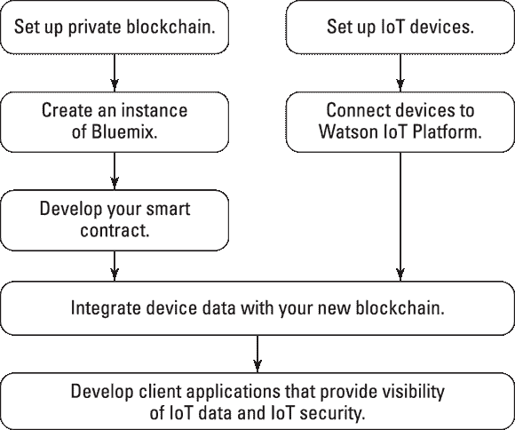
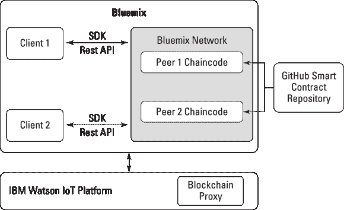
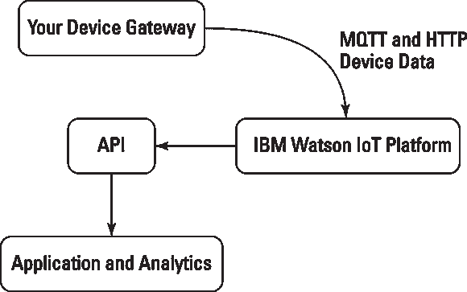

第十一章

# 在 IBM Bluemix 上忙碌起来

在本章中

 **准备人工智能区块链应用**

 **构建您的 IBM Fabric**

 **创建智能合约**

 **部署物联网解决方案**

在本章中，我将向您介绍 IBM 的区块链计划，IBM 将其与其他突破性技术进行合并，例如 Bluemix，用于构建应用程序的全功能平台即服务（PaaS）以及其超级计算机 Watson。

区块链技术创造了接近无摩擦的价值交换。人工智能加速了海量数据的分析。两种能力的结合将是一场影响我们的商业方式和保护我们的联网电子设备的范式转变。

如果您参与物联网（IoT）、医疗保健、仓储、运输或物流行业，您将受益于本章中的信息。此外，如果您是一名企业家，并希望了解人工智能（AI）和区块链在可扩展应用平台上集成带来的新能力，那么本章就是为您准备的。 ## Bluemix 上的商业区块链

IBM 现在提供与其传统产品集成的区块链技术，例如 IBM Bluemix。Bluemix 是基于 Cloud Foundry 的开放标准云平台服务，用于构建和管理应用程序。IBM 已经集成了来自 Hyperledger 的区块链堆栈，该堆栈是 Lynx 基金会的一部分，并正在建立区块链技术的最佳实践。

您需要准备迅速而根本性的变化，IBM 的区块链计划。这项技术非常新颖，并且尚在 IBM 和 Hyperledger 内部孵化中。

Hyperledger 有几个不同的正在开发中的子项目。截至撰写本文时，IBM 正在使用 Fabric，但可能向其他项目开放 Bluemix。Fabric 是开源的，并在 Hyperledger 内积极开发。就撰写本文而言，它还没有准备好用于商业用途——截至撰写本文时，它处于孵化状态。

您可以使用 Hyperledger Fabric v0.6 在 Bluemix 上开始测试 Fabric。然而，IBM 警告不要直接在 Fabric v0.6 或任何早期版本上运行任何有价值的交易。

### 您的独立环境

Bluemix 是 IBM 最新的云服务。这是 IBM 基于 Cloud Foundry 的开放云架构的实现，这是一个开源 PaaS。

Bluemix 使您能够快速轻松地开发应用程序，并部署和管理它们。Bluemix 提供了集成到应用程序中的企业级服务，无需知道如何安装或配置它们。

图 11-1 显示了 IBM 如何将区块链的不同方面与 IBM 系统联系起来。您可以在[`https://goo.gl/12Q6no`](https://goo.gl/12Q6no)上了解更多信息。

图 11-1： IBM Bluemix 和物联网如何与 IBM Watson 融合。

IBM Bluemix 提供了四个核心功能：

+   根据您的应用程序架构需求进行计算基础设施

+   有能力将应用程序部署到 Bluemix 公共或专用云

+   开发工具，例如代码编辑器和管理器

+   在其服务部分可以访问第三方开源工具

Bluemix 为您提供构建应用程序所需的一切。它现在还提供区块链基础设施进行测试。

他们有一个服务，可以将您的应用程序与 Bluemix 区块链集成。截至撰写本文时，有两种定价模型。免费帐户可以获得您测试想法所需的东西。您会得到四个节点和一个证书机构来签署交易，以及一个带有日志、控制和 API 的仪表板。您还会得到一些带有源代码的示例应用程序供您进行实验。

企业方案的价格为每月 $10,000，比免费模型提供更高的安全性和速度。 ### Bluemix 使用案例

两位杰出的创业先驱正在利用 Bluemix 和 Hyperledger Fabric 集成：

+   **万向集团：** 作为中国最大的汽车零部件公司，万向正在与 IBM 合作部署私有区块链。他们正在将产权嵌入电动汽车等物品中。目标是减少消费者租赁设备的成本。万向将利用其区块链技术来跟踪零部件的寿命，并翻新使用过的电池。Bluemix 将处理其他所有事务。

+   **KYCK!:** 金融科技初创公司 KYCK! 利用 IBM 的区块链集成作为解决经纪机构“了解您的客户”（KYC）需求的新颖方法。这对于银行和其他金融服务来说是一项限制性和昂贵的开支。KYC 是为了防止洗钱和非法交易，以及打击恐怖主义。KYCK! 正在构建一个视频会议和加密文件提交平台。它将允许经纪人与公司未曾见过面的客户合作和认证。

IBM 还构建了三个简单的 Chaincode 应用程序，让您可以在 IBM 区块链网络上进行实验：

+   **弹珠：** 弹珠是一个演示应用程序，展示了在两个用户之间传输弹珠。它让您看到如何在区块链上移动资产。

+   **商业票据：** 商业票据是在 IBM 区块链上实施的一个区块链交易网络。您可以创建新的商业票据进行交易，购买和出售现有交易，并审核网络。

+   **汽车租赁：** 车辆租赁与弹珠演示非常相似。它旨在允许您与资产进行交互。您可以创建、更新和转移。还允许第三方查看历史记录。 ## 沃森的智能区块链

IBM 的超级计算机沃森也可以在 Bluemix 平台上使用。沃森是一种认知计算人工智能计算机系统。它可以以令人印象深刻的速度分析结构化和非结构化数据。

 这项技术仍在发展中，客户抱怨其对于理解非结构化书面语言的真正能力。

Watson 可以通过自然语言回答提出的问题，并随着吸收更多信息而学习。结合区块链技术时，这项技术的意义令人震惊。其中一个最早的实现是在 IoT 领域。急需保护从这些设备发出的数据，并使其具有可操作性和智能性。

Watson 的认知计算模拟人类思维过程并使用 MQTT 协议。像人类的思维一样，它随着时间增长。它的自学习系统使用数据挖掘、模式识别和自然语言处理来模仿你的大脑工作方式。Watson 的处理速度为每秒 80 兆浮点运算（一兆浮点运算是一万亿浮点运算）。要把这个放到上下文中，这复制了 — 有时甚至超过 — 高功能人类回答问题的能力。Watson 可以通过访问 90 台服务器，其组合数据存储超过 2 亿页的信息，并对其进行六百万逻辑规则的处理来做到这一点。Watson 的大小相当于十个冰箱，但它变得越来越小和越来越快。

图 11-2 显示了 IBM Watson 如何与区块链和 IBM 系统的不同方面相关联。在 IBM 进行深入了解[`https://goo.gl/12Q6no`](https://goo.gl/12Q6no)。

图 11-2： Bluemix 如何集成客户端、对等方和 IBM Watson。

IBM 正在将这些惊人的能力应用于利用 Chaincode 实现的 IoT 数据源。Chaincode 是 Hyperledger 智能合约系统。以下是 Watson 为 IoT 设备启用的区块链的工作原理：

+   IoT 设备将数据发送到您的私有区块链分类帐，以便在共享交易中被标记为防篡改的记录。

+   合作伙伴和第三方服务提供商也可以访问和提供 IoT 数据，而无需中央控制和管理。

+   所有相关方都可以签署和验证数据，限制争议，并确保每个合作伙伴对其个人表现负责。

这是一个简单的实现，没有充分利用 Watson 的所有功能和能力。Watson 学习和提出建议的能力，以及更新过时的信息，将真正使其成为未来强大的区块链应用。

您可以将 Watson 的 IoT 平台与 Hyperledger 的 Fabric 集成。这种集成允许您通过认知计算预言将 Chaincode 合约执行。Watson 的 IoT 平台具有内置功能，可以使您向自己的私有区块链添加选择的 IoT 数据以创建一个预言。这有助于保护数据不被未经授权的第三方查看。

当您建立了一个 Bluemix 工作空间后，您可以添加选定的服务，包括整合了多种技术的物联网平台。Fabric 是提供分布式对等体的私人区块链基础架构的区块链技术，它复制设备数据并通过安全合同对交易进行验证。

Watson 物联网平台将现有设备数据从一个或多个设备类型转换为智能合约 API 所需的格式。Watson 的物联网平台过滤掉不相关的设备数据，并仅向合同发送所需的数据。 [图 11-3]（＃c11-fig-0003）显示了 IBM Watson 如何与物联网设备和 API 集成。Watson 充当 Chaincode 预言机，并允许您控制合同涉及方所知道的信息。这项功能对于隐私非常重要。

[图 11-3：]（＃rc11-fig-0003）Watson/API/设备流程。## 在大蓝上构建您的起始网络

IBM 的区块链技术和物联网平台提供了新的有前景的工具，并可以利用这些工具来解决许多企业在尝试扩展时面临的问题：

+   **安全性：** 从数百万设备收集的大量数据引发了信息隐私方面的担忧。此外，黑客攻击的物联网设备已被不良组织用于导致分布式拒绝服务攻击瘫痪网站。

+   **成本：** 随着更多设备上线并利用数据，设备生成的大量消息和数据以及分析过程正在增加。

+   **架构：** 集中式云平台仍然是端到端物联网解决方案的瓶颈和攻击的中心集中点。

IBM 的基于开放标准的分布式物联网网络可以解决今天集中式、云基础的物联网解决方案所面临的许多问题。连接的设备直接与分布式账本通信。然后，第三方可以使用来自这些设备的数据执行智能合同，减少对人力监控的需求。

IBM Watson 物联网平台与 Fabric 集成在一个私有区块链网络中复制数据，而不需要集中收集和存储所有物联网数据。分散的区块链网络还提高了物联网设备的安全性。随着时间的推移，为每个设备建立了独特的数字身份。这种新的身份创建和保护方式非常难以欺骗。

这些新的区块链身份允许物联网设备签署交易，从而允许智能合约执行。这的一个实际应用是：来自智能汽车的数据输入的一个保险产品。汽车将发送数据发布到 Fabric；使用 Chaincode 构建的保险产品将识别新数据、您的汽车的身份并更新您的保单。

可能性几乎是无限的，物联网为企业和消费者带来了巨大的机会，特别是在医疗保健、仓储、运输和物流方面。

IBM 云支持的物联网解决方案主要分为三个层次，以满足不同的物联网业务问题需求：

+   **设备网关：** 设备网关用于收集有关物理世界的智能设备或传感器的数据。这可能包括天气传感器，冷藏集装箱的温度监控，或者病人的生命体征数据。这些物联网设备通过互联网发送其数据以进行分析和处理。

+   **IBM Watson 物联网平台：** IBM 将其超级计算机与物联网平台结合，收集物联网设备的数据，然后分析数据并采取后续措施解决问题。Watson 提供机器学习、机器推理、自然语言处理和图像分析，以增强处理从传感器收集的非结构化数据的能力。

+   **IBM Bluemix：** Bluemix 是构建、运行和管理应用程序和服务的基于开放标准的云平台。它通过使物联网应用程序容易包含分析和认知能力来支持物联网应用程序。

创建和配置你的 IBM 区块链织物非常简单。你甚至不需要开发人员的帮助！一旦完成配置你的区块链，你可以集成 Watson 物联网平台。按照以下步骤几分钟内完成设置并运行：

1.  **在 Bluemix 账户仪表板上，单击使用服务或 API。**

1.  **在服务目录的应用程序服务部分，点击区块链。**

1.  **验证你的区块链选择。**

    +   **检查你的空间。** 如果你拥有超出默认开发空间的空间，验证是否在预定的空间部署了服务。

    +   **检查你的应用程序。** 将其保持未绑定状态。

    +   **检查你的服务名称。** 将名称更改为容易记住的内容。

    +   **检查你选择的计划。** 选择免费计划。

1.  **单击创建。**

你的 IBM 区块链将部署到 Bluemix 并最初为你提供两个对等节点。

利用区块链开发节约成本的物联网应用程序潜力巨大。内置智能合同的分布式账本可以提高安全和信任，并自动化流程。IBM Watson IoT 平台可以与基于 Bluemix 的区块链服务结合使用，为基于区块链和开放标准的物联网应用程序提供一个可即投即用的平台。

 这些实现的开发和测试是直接的，但需要开发人员的支持。

按照以下步骤设置你的第一个项目：

1.  **在 Bluemix 上设置你的私有区块链基础设施。**

    你需要开发人员来设置基于 IBM 区块链服务的私有区块链集成功能。

1.  **根据设备数据在基于区块链上开发和部署智能合同。**

    例如，如果货物在交货日期后交付，则可以让合同修改货物装运的付款。

1.  **将你的设备连接到 IBM Watson IoT 平台。**

    您需要让您的开发人员将传感器/网关连接到 Watson IoT 平台。 完成后，IoT 设备将发送数据进行过滤、聚合，并发布到您的区块链。

1.  **将您的 IoT 设备数据与区块链分布式分类帐集成。**

    请让您的开发人员集成 Watson IoT 平台，以便它将数据发送到在 Bluemix 中运行的 IBM 区块链服务。

1.  **安装您的监控 UI。**

    1.  在设置选项卡中启用区块链。

    1.  配置到区块链服务的连接。

    1.  单击“添加”按钮，并在弹出的对话框中填写区块链服务详情。

    1.  确认所有更改。

    1.  选择区块链菜单以映射设备数据。 在这里您可能需要您开发人员的支持。

    1.  按照向导并提供所需的输入以完成将设备数据映射到区块链合同的操作。

1.  **部署链码 ID。**

    当实时数据到达时，智能合同将在数据上执行。 基于结果，交易完成并记录在数字分类帐中，然后与所有节点共享。

1.  **为终端用户开发客户端应用程序。**

    在 IBM 系统和早期 IoT 区块链开发中需要克服一些挑战。许多 IoT 设备的计算能力有限或难以修改。 加密和验证数据需要处理能力，可能会导致电池寿命问题。

现在您可以创建自己的 Chaincode 合同。 您可能需要您的开发人员的帮助，因为它需要使用 GitHub 和 GoLang。 这里是该过程的高级概述，以便您了解此类项目的需求：

1.  **创建 GitHub 项目。**

    这是您将存储智能合同的位置。

1.  **设置本地 Hyperledger 开发和测试环境。**

    您需要在计算机上安装一些东西，包括 Docker、Pip、Git 客户端、Go 和 Xcode（适用于 Mac 用户）。 请查看第三章了解如何设置 Docker 的说明。

1.  **下载 IBM 示例智能合同。**

    此步骤是可选的，但会使第一个合同的构建更加容易。

1.  **创建一个测试智能合同。**

1.  **构建您的合同可执行文件。**

    您的合同必须转换为可执行文件。 示例中包含了合同可执行文件的构建。

1.  **在 Hyperledger 沙箱中测试合同。**

1.  **在 GitHub 部署合同。**

恭喜！ 您已经设立了 IBM 的合同。 以后您可以返回并将合同映射到您 Bluemix 仪表板上的 IoT 设备。
