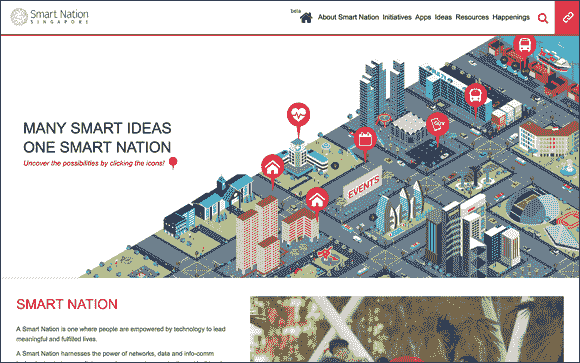

第十五章

# 政府

在本章中

 **阅读区块链文件**

 **建设智慧城市**

 **创建无法被黑客攻击的身份**

在本章中，我将向您介绍正在政府内部和支持它们的公司中正在进行的令人兴奋的创新区块链项目。

日常业务受到欺诈和诈骗的影响，本章解释了政府如何回击网络犯罪和身份盗用。您还将了解智能城市计划，这对经济增长和可持续发展至关重要 —— 许多城市正在利用区块链技术来弥合技术差距。## 亚洲的智慧城市

*智慧城市*正在利用现代技术来增强基础设施功能和安全性，并改善交通和空气质量等事物。成为智慧城市的业务蓬勃发展，几乎每个大城市都已经接受了智慧城市的概念。

当与智能城市使用的物联网（IoT）集成时，区块链尤其有用。目前正在进行商业部署的几个有趣的项目。美国国土安全部正在研究保护海关和边境保护局（CBP）使用的物联网设备。公司如 Slock.it 允许连接的物体使用区块链进入智能合同；它的第一个产品是一款区块链智能锁，可供 Airbnb 客户使用。这些技术的集成使设备能够利用它们的传感器建立智能合同。同样的技术也可以被城市停车计费器使用。

图 15-1 展示了新加坡智慧国家项目的主页。新加坡一直在招揽来自全球的初创公司，在其“监管沙盒”中开发新技术。对于一直在*灰色地带*（没有建立明确监管框架的地方）运营的区块链技术公司来说，这是一个受欢迎的邀请，然而许多国家，如新加坡，正在采取直接行动来定义这个领域，并让公司知道什么是允许和不允许的。

图 15-1: 新加坡的智慧国家项目。

区块链技术还可以用于在智慧城市网络之间安全共享信息。许多城市正在探索如何使用区块链来缓解交通拥堵。新加坡的智慧国家项目希望使用市民的手机来测量他们的公交车乘坐情况，然后分析数据以了解何时需要升级道路。新加坡一直是智慧城市发展的领导者，并已开始在其他国家开发智慧城市。

在本节中，我将介绍亚洲正在进行的许多区块链努力。

### 印度的新加坡卫星城市

印度政府于 2015 年启动了智慧城市计划，旨在建设 100 座新智慧城市。这些发展项目中的许多将位于德里孟买工业走廊，这是德里和孟买之间长达 620 英里（1,000 公里）的走廊。已经计划在 33 个城市投资 110 亿美元的基础设施，而许多发展将通过公私合作模式进行资助。预计该项目将吸引 900 亿美元的外国投资，这将用于创建商业园区、制造区和智慧城市，全部位于指定的铁路货运走廊沿线。

随着印度经济工业化和人口更多地居住在城市，这些智慧城市正在开发。为了防止现有城市过度拥挤和不宜居，中央规划城市形式的国家干预是必要的。由于其庞大且贫穷的人口，印度尤其容易受到气候变化的影响。因此，这些城市的可持续性和智慧性非常重要。它们需要低能源住房材料、智能电网、规划交通、综合信息技术系统、电子治理和创新的水资源收集。

新加坡是智能规划城市的一个典范。尽管人口密度很高，但它拥有卓越的基础设施和高品质的生活。新加坡许多私人组织拥有开发印度智能城市所需的知识和资源。与印度政府合作，私营部门能够提供建设这些大型计划所需的资金、技术和技能。

安得拉邦和新加坡金融管理局宣布了一项金融科技（fintech）创新合作伙伴关系，重点是区块链和数字支付。新加坡旨在开发印度的 fintech 解决方案市场。

新加坡领导层对与印度合作开发智能城市以及安得拉邦新首府表现出了兴趣。它正在成立委员会分析与印度建设 100 座新城市的计划合作的潜力，以及进一步发展横跨 500 个现有城镇和城市的基础设施。

印度城市发展部长一直在与新加坡现任总理和前总理进行对话。他一直在寻求新加坡在智慧城市方面的专业知识，特别关注 intelligent transport systems、增强水资源管理和电子治理。城市发展部长还在研究新加坡的公共住房计划，以及他们的私人住房法规。交通基础设施的资金结构也受到了关注。

印度政府还聘请了一组新加坡专家来协助喜马偕尔邦卫星城的发展。这个占地 49 英亩(20 公顷)的项目旨在帮助减轻席姆拉的拥挤，这个城镇在过去几十年里人口大幅增加。新加坡人将协助发展中的城镇的教育、住宅和商业方面。

新加坡和马来西亚都对在 Jathia Devi 附近投资另一个卫星城表现出兴趣。新加坡政府正在进行一项研究，将评估各种选项。喜马偕尔邦政府正在考虑使用私营-公共资金模式在现有城市附近开发五座卫星城。

新加坡的雅珊达-新加坡大桥推出了在印度的第八个 IT 园区。这个占地 59 英亩(24 公顷)的古尔冈国际科技园有望在年中完成第一栋大楼。这个 4 亿美元的项目旨在提供 800 万平方英尺的商业空间，以帮助满足印度不断增长的 IT 部门的需求。

在中国，区块链技术被广泛讨论，被视为增强大数据可靠性的一种方式。人们正在寻求以解决两个或更多没有对齐激励的民事数据共享中所涉及的信任问题。区块链技术提供了许多新的解决方案，以跟踪所有权、来源和真实性。

Peernova 是一家有前途的美国公司，致力于解决大数据问题。它以前专注于比特币挖矿，但转向区块链领域，并从中国的浙江中南控股集团融资了 400 万美元。Peernova 计划利用区块链技术查询传统数据库并跟踪变化。

应用场景包括验证对大型数据存储的子集的任何更改，并使用更有效和完整的加密审计代替传统审计师，为公司提供参考点。它希望通过使用区块链追踪多年来投资的货币历史，帮助对冲基金计算其投资的税务责任。

中国最大的房地产开发商大连万达也涉足区块链游戏。它已与大数据软件公司 Cloudera 合作，推出了一个名为 Hercules 的区块链项目。它看到了使用区块链技术从大数据中得出预测并使管理者在发生这些情况时变得主动的潜力，将管理者从被动转变为主动，如监控其协议的修改以及监控其系统内用户行为。

大连万达和 Cloudera 致力于继续发展 Hercules，并将他们的技术整合到依赖 IT 和大数据的各行业中。Hercules 项目将作为一个支持企业需求的开源套件。它使组织更容易在大型数据集群上部署和管理区块链应用程序。

你可能会觉得奇怪，看到数字挖掘公司与传统建筑公司合作解决对冲基金的审计问题，或者房地产公司与大数据合作解决系统管理员的问题，但这正是区块链世界的西部荒野。区块链人才短缺和区块链项目和投资的高需求推动了这种环境。## 世界金融之都的争夺战

自 2015 年一系列新闻报道之后，区块链技术已经逐渐崭露头角。从那时起，许多初创公司一直在开发测试版本和预发布版本，2016 年一夜间涌现了将近 2000 家新的区块链初创公司。其中很多将在 2017 年和 2018 年在新加坡、迪拜和伦敦推向市场，这些市场监管机构欢迎创新并竞相成为世界金融中心。对于这些领导者来说，这不仅仅是关于金融科技和智能城市，而是在一个向无国界、财务灵活的全球公民转变的世界中保持相关性的竞赛。

### 伦敦早期的远见

2016 年，英国中央政府发布了一份名为“分布式分类账技术：超越区块链”的报告([`https://goo.gl/asIz6L`](https://goo.gl/asIz6L))，宣称分布式分类账技术（区块链）可以用于减少腐败、错误和欺诈，并使各种流程更加高效。他们还表示，区块链可以通过带来更多透明和可信度改变市民与政府的关系。但伦敦至少从 2014 年开始对这项技术非常友好。许多早期的区块链初创公司在伦敦注册或开展业务，因为那时它是非官方最安全的创业地点。这在当时是件大事，因为许多加密货币企业家在 2014 年和 2015 年被逮捕。

自从这份报告发布以来，区块链已经被批准用于英国政府各个领域的应用，包括白厅部门（非部长级部门，如土地注册局、森林管理局和食品标准局）、地方政府和授权政府。

下面是在英国正在进行的一些有趣的项目和实验：

+   **基于区块链的福利分配：** 工作与养老金部门携手巴克莱银行、RWE、GovCoin 和伦敦大学进行实验，将使用区块链技术通过手机应用程序进行福利分配。该试验旨在查看是否可以使用区块链技术发送和跟踪付款。

+   **政府分布式分类账技术（DLT）：** 区块链平台提供商 Credits 和英国政府正在合作开发一个框架，允许英国政府机构尝试使用区块链技术。（DLT 代表分布式分类账技术。）

+   **基于区块链的国际支付：** 桑坦德银行推出了基于区块链的国际支付试点项目。员工试点项目涉及一个连接到 Apple Pay 的应用。用户可以使用触摸 ID 进行 10 英镑至 10,000 英镑之间的付款。

+   **使用区块链技术进行黄金交易：** 皇家铸币厂与市场运营商 CME Group 合作，希望利用区块链技术建立黄金市场，以使伦敦对黄金销售更具吸引力。这两家机构采用区块链技术，因为他们认为这是一种有效的数字化黄金交易机制。

所有这些都是为了验证区块链技术是否成为新的价值交换平台。这个计划的成功或失败将决定英国和世界其他地方未来的走向。###新加坡的监管沙盒

像英国一样，新加坡已经想方设法让在那里工作尽可能容易、友好和有吸引力。2015 年，政府官员前往旧金山宣布并招募企业家来到他们所谓的“监管沙盒”工作——这个词汇是对“开发沙盒”的一个变体，是开发者可以构建软件的安全环境。新加坡也打算用同样的方式来建立软件公司。

当时，美国和许多其他地方的区块链公司仍处于灰色地带。对于许多企业家，包括我自己在内，有一个安全的运营和投资资金的地方是非常吸引人的。如果你从来没有去过新加坡，你应该去看看！那里美丽、干净、安全。

新加坡正在采取措施探索这项技术，而且正在取得成效。新加坡华侨银行使用了区块链技术进行跨境汇款。它向其子公司，华侨银行马来西亚和新加坡银行汇款。

R3 在新加坡也很活跃。它与新加坡金融管理局一起开设了一个研究和开发数字账本技术的实验室。R3 正在研发一个支持银行间支付的交易所。这些银行将存入现金并获得数字货币。

新加坡的中央银行也与八家外国和本地银行以及证券交易所推出了一个试点项目。这个概念验证项目旨在为其银行间支付使用区块链技术。该试点项目还旨在审查跨境外币交易。

新加坡将进行实验的不仅仅是区块链公司。所有最大的参与者都参与其中——美国银行、美林银行、IBM、瑞士信贷银行、东京三菱日联银行、星展银行、摩根大通银行、香港上海汇丰银行、华侨银行、大华银行和新加坡交易所。

 世界上每家银行都必须知道它的业务对象是谁。“了解您的客户”（KYC）的整个理念有助于打击洗钱和旅游资金。

下一阶段将确定外币交易并建立在新加坡的 KYC 努力基础上。这可能导致该国引领区块链身份认证技术的发展。新加坡已经建立了强大且现代的数字身份验证系统，可以轻松与区块链连接。### 迪拜 2020 计划

迪拜政府有一个雄心勃勃的计划，到 2020 年将所有政府文件和系统转移到区块链上。这一去纸化计划是其成为全球区块链技术领袖并提高各个领域效率的一部分。

内阁事务和未来部长详细介绍了新计划如何使用户能够通过区块链更新和验证其凭据。他们只需要一次登录凭据就可以访问政府和私营实体，如保险公司和银行。他们还期待与其他国家分享他们的技术，以便使边境通行更加简单。旅行者可以使用经过预验证的数字钱包，以及经过预认证的身份证明，而不是护照。

迪拜政府估计其区块链计划有潜力节省 2510 万小时的生产力。这提高了效率也有助于减少碳排放。

迪拜全球区块链理事会（Global Blockchain Council，GBC）宣布了七项新的公私合作项目，结合了初创企业、当地企业和政府部门的技能和资源。他们将把区块链技术应用于以下领域：

+   **医疗保健：** 爱沙尼亚软件公司 Guardtime 将与迪拜最大的电信运营商之一 Du 合作，为数字化医疗记录提供技术专长并将其转移到区块链上。

+   **钻石交易：** 一项试点项目将使用区块链技术进行钻石的认证和转让。迪拜多商品中心将数字化*金伯利证书*（联合国为限制冲突钻石交易而创建的文件）。

+   **头衔转让：** 头衔转让将被数字化并记录在区块链上。 新加坡区块链初创公司 Dxmarkets 已经开发了一个概念验证。

+   **企业注册：** GBC 正在试验使用区块链技术进行企业注册。这与以太坊分散自治组织（DAO）不同，但可以通过 Flexi Desk 计划简化身份验证。目前正处于演示阶段，有几个实体正在进行概念验证。

+   **旅游业：** 迪拜积分是与 Loyyal 合作推出的试点项目，利用区块链技术来帮助旅游业。它旨在通过向访问特定地点的游客发放积分来激励旅行。它将使用智能合约来促进奖励。这些积分可能类似加密代币，并在交易所上可交易。

+   **航运：** IBM 正在与 GBC 合作，利用区块链技术改善航运和物流。 该计划旨在帮助区域参与者合作交换货物的方式。 智能合约将被用作解决合规和结算问题的解决方案。

迪拜，像新加坡一样，投入大量资金和人才确保其迅速主导区块链空间。 这是小政府和中央机构的一种奢侈。 ### Bitlicense 监管框架：纽约市

如果你计划在纽约市经营一个区块链初创公司，请为额外费用做好准备。 2015 年 6 月，纽约州金融服务部（NYDFS）发布了 Bitlicense 的最终版本，这是针对数字货币的监管框架，旨在为该行业提供更多清晰性。 实际上，这推动了许多区块链初创公司离开了纽约市。 执照本身的费用为 5000 美元，可能长达 500 页。 它要求每家公司领导的指纹以及对申请业务的广泛背景调查。 最大的投诉是与申请相关的约 10 万美元的费用。 这个估计包括时间分配，法律和合规费用。 Bitlicense 与伦敦，新加坡和迪拜等其他金融中心所做的努力形成鲜明对比。

最终的 Bitlicense 是将近两年的研究和辩论的结果，关于如何规范这项技术。 在被认为现有的法规不适合数字货币公司之后，才制定出这个规定。

正面的是，纽约市的区块链企业不再需要获得 NYDFS 对新软件更新或进一步的风险投资轮的批准。 该框架规定，数字货币公司只需要获得对“对现有产品，服务或活动提出的更改进行批准，如果此类产品，服务或活动与之前在监管局申请许可证时列出的产品，服务或活动存在实质不同可能。”

第一家获得 Bitlicense 许可的公司是比特币钱包提供商 Circle。 该许可证允许他们在监管框架下在纽约运营。 Circle 是为数不多可以合法这样做的公司之一。 大多数区块链初创公司都在避免在纽约工作，因为执照的成本和努力超过了收益。 只有资金最充足的初创公司才在努力。

Ripple 已被授予第二个许可证。 这个许可证使其可以出售和持有 XRP，这是 Ripple Consensus Ledger（RCL）背后的数字资产。 这将增强 Ripple 处理希望利用其技术进行国际资金转移的商业客户的能力。

其他美国地区也提出了类似的法案来监管数字货币并要求许可。 加利福尼亚法案 AB 1326 本应针对该地区这样做，但在 Electronic Frontier Foundation（EFF）的反对下失败了。（EFF 是总部设在旧金山的一家捍卫消费者权利和新技术的团体。）  ## 保障世界的边界

许多政府正在探索使用区块链来保障边境安全。 英国有一个宏大的目标，就是确保旅行者在通过他们的机场时永远不需要放慢步伐。 这与现在几乎每个机场都存在的长安检队形成了鲜明对比。 英国必须克服的主要障碍，是实现无摩擦旅行体验与**乘客确认**（即使乘客来自另一个国家，也能明确知道任何给定乘客的身份）有关的问题。 乘客确认已经成为各国打击恐怖主义的问题。

美国已经为全球旅行评估系统（GTAS）的乘客确认开放了其技术。 这可以在 GitHub（[`www.github.com/US-CBP/GTAS`](http://www.github.com/US-CBP/GTAS)）进行公开合作。

用于对乘客进行非侵入式筛查和认证的计算机，摄像头和传感器都需要被保护，以确保国家安全。 区块链以其不变属性为底层的特性，是这种用途的有希望的技术，目前正在进行测试。

通过区块链创建的另一个有趣的事物是传记身份——随着时间建立的身份。 任何数据都可以与传记身份进行关联，并且所归因数据的隐私性和可读性可以由发布者进行管理。 随着时间的推移，通过添加额外的属性来建立身份。 这些属性可以是任何事物，从您个人设备上的数据到您的文件在边境检查时的情况。 这些属性由证书颁发机构或经证书颁发机构授权的机构发布到个人的身份链上。

### 国土安全部和物联网的身份

国土安全部科学与技术司正在探索为美国边境保护物联网设备提供安全保障。 它正在与总部位于得克萨斯州奥斯汀的区块链初创公司 Factom, Inc.合作，以推动物联网设备数字身份的安全性。

Factom 创建捕获设备 ID，制造商和可用更新列表，已知安全问题，以及授权权限的身份日志，同时添加了时间维度以增加安全性。 目标是限制意图黑客破坏设备过去记录的能力，使其更难欺骗。  ### 未来的护照

ShoCard ([`www.shocard.com`](http://www.shocard.com)) 是一家与区块链公司 Blockcypher 合作的应用开发公司。它已经建立了允许你在安全的区块链环境中建立你的身份的原型。ShoCard ID 存储在你手机上的一个应用中，可以用来安全地分享各种不同的证书。  ### 新的饲料文档

你可能没有听说过 Smartrac，但很可能每天都会接触到它的技术。Smartrac 是无线射频识别 (RFID) 标签和其他识别芯片的头号供应商，这些标签和芯片被嵌入护照和身份证等物品中。

国家在打击身份欺诈时面临的最大挑战之一是对身份建立所使用的基础文件进行验证。这些像是社会安全卡、出生证明和文凭，目前很容易和便宜就能伪造。

Smartrac 一直在用越来越复杂的技术来与这个问题作斗争。它的最新创新 dLoc 是一个软件认证解决方案，允许饲料文档与区块链记录进行检查。

文档数据与近场通讯标签 (NFC) 的唯一 ID 结合，创建了一个 32 位哈希值，只有发行机构才能使用私钥识别。哈希值存储在 Smart Cosmos 中，并备份在公共区块链中。在这之后，带有 dLoc 贴纸的文档可以使用台式阅读器或 NFC 启用手机上的移动应用进行验证。

这样做的两件了不起的事情是，它实现了两件以前在纸质文件中从未有过的事情：

+   文档的不可更改历史，显示其真实年龄和所有权。

+   允许证书机构对文档的真实性进行加密签名。因此，即使用来创建文档的底层纸张被盗，也无法得到足够的签名，或者如果文档在发行后被拿走，它可以被标记为被盗文档。
