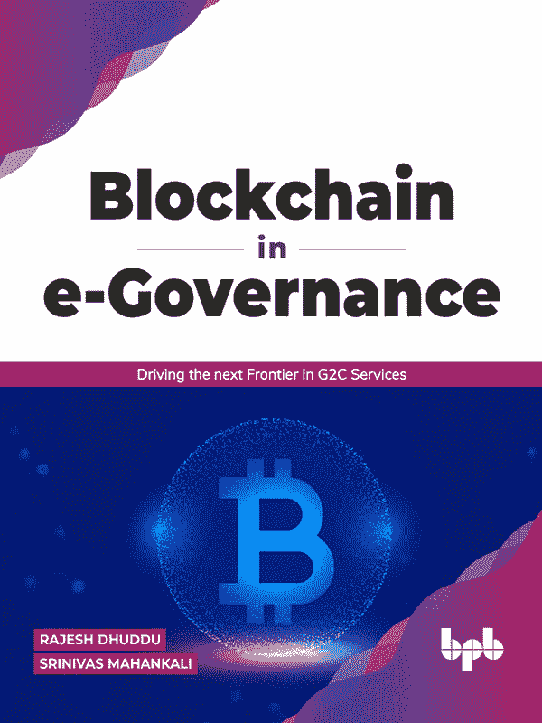

 区块链治理  推动 G2C 服务的下一个前沿  Rajesh Dhuddu Srinivas Mahankali  www.bpbonline.com 第一版 2021 年 版权所有 © BPB 出版社，印度 ISBN: 978-93-90684-46-5 所有权利保留。未经出版者事先书面许可，不得以任何形式或通过任何手段复制、分发或传输本出版物的一部分，或存储在数据库或检索系统中，例外的是程序列表，可以输入、存储并在计算机系统中执行，但它们不能通过出版物、复印、录音或任何电子和机械手段进行复制。 责任限制和免责声明 本书所含信息在作者和出版者知识和正确性的范围内是真实的。作者已尽一切努力确保这些出版物的准确性，但出版者不能对本书中的任何信息损失或损害负责。 所有在书中提及的商标均予以承认，作为其各自所有者的财产，但 BPB 出版社不能保证此信息的准确性。 分销商： BPB 出版社 20, Ansari Road, Darya Ganj 新德里-110002 电话：23254990/23254991 MICRO MEDIA Shop No. 5, Mahendra Chambers, 150 DN Rd. Next to Capital Cinema, V.T. (C.S.T.) Station, MUMBAI-400 001 电话：22078296/22078297 德干代理商 4-3-329, Bank Street, 印度海德拉巴-500195 电话：24756967/24756400 BPB 书店 376 Old Lajpat Rai Market, 德里-110006 电话：23861747 由 Manish Jain 为 BPB 出版社出版，20 Ansari Road, Darya Ganj, New Delhi-110002 并在 Repro India Ltd, Mumbai 印刷 www.bpbonline.com 献给 我们希望将这本书献给世界各地的政府，这些政府正在积极推广新兴技术的应用，以确保向公民提供的服务具有透明度和问责性。 关于作者 Rajesh Dhuddu Rajesh 是哥伦比亚商学院和 Sri Sathya Sai 高等学习学院的校友，拥有 MBA 金融的金牌。受其生活座右铭“永远帮助，永不伤害”的驱使，Rajesh 已经指导了许多企业家、企业高管和 MBA 学生。 Rajesh Dhuddu 领导着 52 亿美元 IT 巨头 Tech Mahindra 的区块链和网络安全实践。他指导着一个由 500 多名杰出的网络安全专业人士组成的团队，为全球客户提供服务，以加强他们的企业级网络安全态势并建立一个高度弹性的安全组织。他与全球 CISO 密切合作，建议他们利用技术和运营中的最佳实践，涵盖云安全、网络安全、高级威胁管理、零信任、进攻性安全、网络风险量化和安全访问边缘（SASE）。 Rajesh 被多家领先分析师和行业机构评为全球区块链领导者，例如世界经济论坛和特伦加纳州政府。他领导了与三家主要电信运营商合作的解决方案实施，以阻止垃圾电话和短信，并与印度电信监管机构合作。 LinkedIn: https://www.linkedin.com/in/rajeshdhuddu/ Srinivas Mahankali Srinivas 是 IIT 马德拉斯和 IIM 班加罗尔的校友，拥有超过 30 年的行业经验，其中 12 年是在印度私营和 BSE 上市公司中领导 IT 解决方案。他积极参与推广区块链技术，是印度政府中首批领导区块链的员工之一。作为印度国家信息系统与服务公司（由 NASSCOM 和印度政府推动）区块链项目的首位员工，他积极推广区块链技术。作为印度首个大学认证的区块链研究生课程的项目总监，Srinivas 指导了来自全球的学生。他撰写了超过 10 本关于区块链和新兴技术的书籍，包括由人工智能机器人从英语翻译成中文的世界第一本书《区块链-未讲述的故事》。他还撰写了《区块链与非 IT 专业人士》、《区块链与智能城市》等书籍。 LinkedIn: https://www.linkedin.com/in/srinivasindia/ 致谢 我们非常感谢我们每天与之互动的新兴技术专业人员
