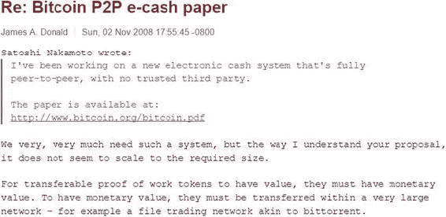

©  2017 年 Vikram Dhillon、David Metcalf 和 Max HooperVikram Dhillon、David Metcalf 和 Max Hooper 区块链启用应用`doi.org/10.1007/978-1-4842-3081-7_1`

# 1. 远见者

Vikram Dhillon^(1 ), David Metcalf¹ 和 Max Hooper¹(1)美国佛罗里达州奥兰多

> 一个人为什么要故意用一种焦虑过日子，然后又换另一种？—Imbolo Mbue

2008 年末，焦虑或许是最能描述投资者和普通大众对金融市场态度的方式。2008 年金融危机被许多经济学家认为是自大萧条以来最严重的金融危机。危机爆发前的几年，出现了大量不负责任的抵押贷款，以及金融监管和监督的系统性巨大失败。其后果之巨大以至于威胁到了大型金融机构的倒闭。各国政府不得不介入，救助主要银行。本章以对 2008 年金融危机的讨论开始，然后我们将讨论其后果，这导致了一个环境，新银行系统和比特币等替代货币得以蓬勃发展。然后，我们深入探讨了支持比特币的技术堆栈。值得注意的是，该堆栈的组成部分并非完全新颖，但它们被巧妙地串联在一起。最后，我们结束了对区块链的讨论，这是一个重大的技术突破，有可能彻底改变几个行业。

## 范式转变

革命常常看起来混乱不堪，但这一次却在暗中酝酿，由一个名叫中本聪的不知名个体领导，他梦想改变金融世界。金融危机可能归咎于许多各不相同的方面，但共同的因素是，用于维持整个系统完整性的基本金融和会计工具变得过于复杂，以至于无法高效使用。信任，所有金融体系的最终粘合剂，开始在 2008 年消失。自那以后，监管已经发生变化，以防止类似情况再次发生，但很明显，需要对交易方之间的信任进行自我调节，并透明地了解它们进入任何类型的销售合同的能力。交易对手本质上是金融交易中的另一方。换句话说，它是与卖方配对的买方。在金融交易中，涉及的许多风险之一被称为交易对手风险，即合同中的每一方可能无法履行其协议的一方。前文提到的系统性失败现在可以通过交易对手风险来理解：交易中的双方都在积累大量的交易对手风险，最终，双方都在合同条款下崩溃。想象一下涉及多方的类似交易场景，现在想象一下，这个场景中的每个玩家都是一家主要银行或保险公司，进一步为数百万客户服务。这就是 2008 年危机发生的情况。我们需要讨论的下一个问题是双花问题。我们将在后面严格讨论比特币的情况，但让我们先从将其应用于金融危机的基本概念开始。双花背后的原则是，承诺给一个领域的资源（例如，一个交易）不能同时承诺给第二个不同的领域。这个概念对数字货币有明显的影响，但它也可以总结出 2008 年危机的一些问题。事情是这样开始的：给信用历史较差的借款人发放贷款（以抵押贷款的形式），他们难以偿还。这些高风险抵押贷款被卖给大银行的金融专家，后者通过将它们大量组合成池，将它们打包成低风险的公共股票。当与每笔贷款（抵押贷款）相关的风险没有相关时，这种汇集工作。大银行的专家假设全国不同城市的房地产价值会独立变化，因此汇集工作不会有风险。这被证明是一个巨大的错误。汇集的抵押贷款包随后用于购买一种称为抵押债务证券（CDO）的股票类型。CDO 被划分为层次，并出售给投资者。这些层次根据金融标准机构的标准和评级进行排名和评级，投资者根据这些评级购买最安全的层次。一旦美国房地产市场转向，它就引发了连锁反应，摧毁了一切。尽管有评级，但 CDO 被证明是一文不值的。汇集的抵押贷款价值暴跌，所有的包都瞬间化为乌有。在这一复杂的交易串中，每一次销售都增加了风险，并在多个层面上导致了双花。最终，系统达到平衡，但发现了巨大的空白，并在重压下崩溃。以下是 2008 年的简要时间线（此时间线是根据 2016 年分布式健康会议上 Micah Winkelspech 的演示制作的）。

+   一月十一日：美国银行收购陷入困境的国家地产公司。

+   三月十六日：美联储强制出售贝尔斯登。

+   九月十五日：雷曼兄弟申请破产第十一章。

+   九月十六日：美联储以 850 亿美元救助美国国际集团（AIG）。

+   九月二十五日：华盛顿互助银行倒闭。

+   九月二十九日：金融市场崩溃；道琼斯工业平均指数下跌了 777.68 点，整个系统濒临崩溃。

+   十月三日：美国政府批准 7000 亿美元用于银行纾困。

这次纾困造成了巨大的经济后果，但更重要的是，它创造了一种环境，使比特币得以蓬勃发展。2008 年 11 月，在加密学和加密政策邮件列表上发布了一篇名为“[比特币：一种点对点的电子现金系统](https://bitcoin.org/bitcoin.pdf)”的论文，作者是一个名叫中本聪的人。这篇论文详细介绍了比特币协议，随之而来的是早期比特币版本的原始代码。在某种程度上，这篇论文是对刚刚发生的经济崩溃的回应，但在这项技术革命获得认可之前还需要一段时间。一些开发者担心这个电子现金系统在能够扎根之前就会失败，他们担心的是可扩展性，正如图 1-1 所指出的那样。图 1-1.比特币协议的初步接受包括对可扩展性和比特币的现实前景的担忧那么中本聪是谁？他的背景是什么？简短而简单的答案是我们不知道。事实上，假设他真的是一个“他”是傲慢的。中本聪这个名字大多被用作化名，他可能是一个她，甚至是他们。一些记者和新闻媒体已经投入了时间和精力进行数字取证，以缩小候选人范围并找出中本聪的真实身份，但到目前为止，所有的努力都是[野鹅追逐](https://www.technologyreview.com/s/527051/the-man-who-really-built-bitcoin/)。在这种情况下，社区开始意识到，也许中本聪是谁并不重要，因为开源的本质几乎使其无关紧要。比特币社区中最受尊敬的开发者之一杰夫·加兹克这样描述：“中本聪发布了一个开源系统，目的是你不必知道他是谁，信任他是谁，或者关心他的知识。”开源的真正精神使得代码本身说话，而不需要创造者或程序员的任何干预。

## 密码朋克社区

中本聪在创建比特币协议时的真正天才之处在于解决了拜占庭将军问题。该解决方案使用了来自密码朋克社区的组件和思想进行了概括。我们简要讨论了其中三个想法以及它们为完整比特币协议提供的组件：Hashcash 用于工作证明，拜占庭容错用于分散网络，以及区块链用于消除对中心化信任或中央机构的需求。让我们深入探讨每一个，从 Hashcash 开始。Hashcash 是由亚当·布莱克在 1990 年代晚期设计的，旨在通过第一种 Proof-of-Work（PoW）算法限制电子邮件垃圾邮件。Hashcash 背后的理念是为发送电子邮件附加一些计算成本。垃圾邮件发送者的商业模式依赖于发送大量的电子邮件，并且与每个消息关联的成本非常低。然而，如果对每封垃圾邮件发送的成本甚至很小，那么这个成本将会在成千上万封邮件上进行累积，使他们的业务不再有利可图。Hashcash 依赖于加密哈希函数的概念：一种哈希函数类型（在比特币的情况下为 SHA1）接受一个输入并将其转换为生成消息摘要的字符串，如图 1-2 所示。哈希函数被设计为具有称为单向函数的属性，这意味着可以通过哈希函数轻松验证潜在输入以匹配摘要，但是从摘要重现输入是不可行的。重新创建输入的唯一可能方法是通过使用暴力方法找到适当的输入字符串。在实践中，这是 Hashcash 以及最终比特币的计算密集型元素。这个原则已经成为推动比特币和大多数加密货币的 PoW 算法的基础。比特币的 PoW 更加复杂，并涉及新组件，我们在后面的章节中会详细讨论。图 1-2.加密哈希函数的机制。它接受一个输入并始终将其转换为输出摘要的字符串。我们需要讨论的下一个想法是拜占庭将军问题。这是一组将军之间的一项协议问题，每个将军都指挥一部分拜占庭军队，准备攻击一座城市。这些将军需要制定一个攻击城市的策略并适当地相互沟通。关键在于每个将军都同意一个共同的决定，因为少数将军的不积极攻击比协调的攻击或协调的撤退更糟糕。问题的关键是有些将军是叛徒。他们可能会投票欺骗其他将军，最终导致次优策略。让我们看一个例子：在奇数个将军的情况下，比如七个，三个支持进攻，三个支持撤退。第七位将军可能会向赞成撤退的将军通信，向其他将军通信进攻的协议，导致整个安排崩溃。进攻部队未能夺取城市，因为没有内在的中央机构能够验证所有七名将军之间的信任。在这种情况下，如果所有忠诚的将军能够有效地沟通以达成对他们的策略的无争议的一致意见，那么就可以实现拜占庭容错。如果是这样，叛徒将军的误导性（错误的）投票将被揭示并且无法干扰整个系统。对于比特币协议，中本聪实现拜占庭容错的关键创新是创建一个点对点网络，该网络具有可以记录和验证大多数赞同的账本，从而揭示任何错误（叛徒）交易。这个账本提供了一种一致的通信方式，并进一步允许从整个系统中删除信任。这个账本也被称为区块链，通过将区块链附加到比特币上，它成为了第一个能够在网络范围内解决双花问题的数字货币。在本章的其余部分，我们将介绍区块链技术的广泛概述以及区块链应用程序的概念。区块链主要是一个记录账本，提供从开始到结束的所有相关方的安全和同步的交易记录。区块链可以非常快速地记录数百个交易，并具有几个内置的加密措施，用于数据安全性，一

## 摘要

在本章中，我们开始讨论比特币的历史以及其诞生时的金融环境。在接下来的章节中，我们将继续讨论区块链和点对点网络的特定特性，如矿工等。本章引用的参考资料可在本书末尾找到。
