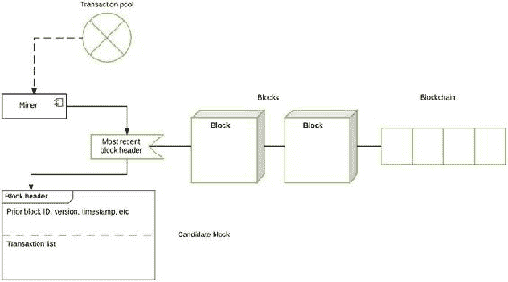

©  Vikram Dhillon、David Metcalf 和 Max Hooper 2017 年 Vikram Dhillon、David Metcalf 和 Max Hooper 区块链启用的应用程序`doi.org/10.1007/978-1-4842-3081-7_2`

# 2. 淘金热：挖掘比特币

Vikram Dhillon^(1 ), David Metcalf¹ 和 Max Hooper¹ (1)美国佛罗里达奥兰多

> 在淘金热期间，大多数准备成为矿工的人都赔钱了，但是那些出售铁锹、铲子、帐篷和牛仔裤（李维·斯特劳斯）的人赚了不少钱。—彼得·林奇

挖矿是理解比特币协议运作方式的基础概念。它指的是在区块链的每个区块上执行的去中心化审查过程，以达成共识，而无需中央机构提供信任。换句话说，挖矿是计算上的对等审查，发生在既不信任对方的去中心化环境中。我们在第一章中解释了哈希函数，并且与挖矿和解决 PoW 函数相关。然后，我们将区块目标值和网络难度的概念与挖矿结合起来，以及挖矿如何随着难度的增加而演变。这将进一步引导我们谈论最近开发的挖矿硬件类型。我们在章节结束时分析了开始出售专用挖矿硬件的初创公司，导致比特币挖矿的竞赛以及它们最终的失败。

## 达成共识

挖矿对比特币协议至关重要，并具有两个主要作用：增加新的比特币货币供应和验证交易。在本章中，我们将看看这两个过程背后的机制。实际上，挖矿是我们之前讨论的双重支付问题的适当解决方案。为了消除对中央机构的需要，将在自己的机器上运行比特币客户端（称为矿工）的个人参与网络，并验证两个方之间发生的交易不是欺诈性的。实际上，挖矿是一项计算密集型的活动，但是谁有动力帮助挖掘新比特币？矿工的主要动机是以比特币形式获得参与奖励。让我们以图 2-1 中简化的挖矿过程为例进行简要说明。图 2-1.挖矿过程的简化概述最近在比特币网络中发生的未打包事务将保留在事务池中，直到矿工选择它们并将其打包到一个区块中为止。矿工从事务池中选择交易来将其打包到一个区块中。在创建区块后，它需要一个头部才能被区块链接受。想象一下这是一次装运包裹：一旦包裹创建完毕，就需要加盖印章，以便能够发货。矿工使用区块链中最新区块的头部来为当前区块构建一个

+   候选区块：由矿工创建的不完整区块，用作临时结构，用于存储事务池中的事务。在头部通过解决 PoW 问题后，它成为完整区块。

+   PoW：发现可以用于候选区块的区块头的新哈希的问题。这是一个计算密集型的过程，涉及对来自最近区块的哈希进行评估，并将一个随机数附加到网络目标值。这个问题只能使用暴力破解来解决；也就是说，需要多次尝试使用哈希（来自最近区块头）和每次调整随机数来解决 PoW 问题。

+   随机数：连接到最新区块头部哈希的 32 位值。此值不断更新和调整，直到发现新的哈希小于目标值。

+   哈希函数：用于计算哈希的函数。在比特币协议中，此函数为 SHA-256。

+   哈希值：哈希函数的结果输出。

+   目标值：所有比特币客户端共享的 265 位数字。它由难度决定，随后将讨论。

+   Coinbase 交易：被打包进区块的第一笔交易。这是矿工挖掘候选区块的 PoW 解决方案的奖励。

+   区块头：区块的头部，其中包含许多特征，如时间戳、PoW 等。我们将在第三章中更详细地描述区块头。

注释在回顾了上述定义的术语后，重新查看图 2-1 和 2-2。一些抽象的概念现在将会更加清晰，信息也将更好地整合。现在我们对挖矿的工作原理有了更清晰的认识，让我们来看看挖矿难度和目标值。这两个概念类似于网络中可以随时间调整的按钮或旋钮，所有比特币客户端都会更新以遵循最新的值。那么什么是挖矿难度呢？本质上，它可以被定义为矿工在解决 PoW 问题时找到低于目标值的哈希的难度。难度增加意味着需要更长的时间来发现哈希并解决 PoW，也被称为挖矿时间。网络设置的理想挖矿时间约为十分钟，这意味着每十分钟在网络上宣布一个新的区块。挖矿时间取决于三个因素：目标值、网络中的矿工数量和挖矿难度。让我们看看这些因素是如何相互关联的。

1.  挖矿难度增加导致目标值减小以补偿挖矿时间的增加。

1.  加入网络的矿工数量增加导致 PoW 解决速度增加，从而减少挖矿时间。为了调整这一情况，挖矿难度增加，区块创建速率恢复正常。

1.  目标值每创建 2,016 个区块就重新计算和调整一次，大约两周时间完成。

如我们所见，比特币网络中存在自我纠正的共同主题，这使得网络非常具有弹性。矿工是比特币网络的核心，他们有两个主要的参与动机：

+   打包在一个区块中的第一笔交易称为 coinbase 交易。这笔交易是获胜矿工在挖矿并在网络上宣布后收到的奖励。

+   第二个奖励以网络用户发送交易而收取的费用的形式出现。这笔费用由矿工获得，以包含交易在一个区块中。这笔费用也可以被视为矿工的收入，因为随着越来越多的比特币被挖出，这笔费用将成为收入的重要组成部分。

现在我们可以将这些概念整合在另一个流程图中，如图 2-3 所示。这将有助于在难度和目标值的背景下巩固挖矿过程。图 2-3. 解决 PoW 问题网络中的矿工竞争解决问题，获胜的矿工宣布区块加入网络，然后被纳入区块链。为了解决 PoW，矿工必须不断生成新的哈希值（通过哈希函数）使用增加的随机数，直到发现一个低于目标值的哈希值。在这种情况下，请注意随机数是唯一可以调整的值。这是一个简化的 PoW 方案，其实现方式有细微差别。注释术语“挖矿”是因为这个过程类似于挖掘稀有金属。这是一个非常资源密集型的过程，并且它以很慢的速度提供新货币，就像比特币协议中的矿工一样获得奖励。我们讨论了比特币网络中的自我纠正特性，以及它们如何使网络适应。接下来，我们将看看一个意想不到的情况，即随着比特币的普及，网络中出现了大量矿工。这导致了一种类似军备竞赛的情况，并产生了深远的影响。但首先，我们需要谈论出现的新型挖矿硬件。

## 挖矿硬件

随着比特币在商家中获得更多的普及和接受，越来越多的矿工加入了网络，希望获得奖励。矿工开始更有创意地探索挖矿的方法，比如使用可以生成更多哈希的专用硬件。在这一部分，我们将讨论比特币开始在全球范围内传播时挖矿硬件的演变。

+   CPU 挖矿：这是比特币客户端最早提供的挖矿形式。在比特币客户端的早期版本中，这成为了挖矿的标准，但在后来的更新中被移除，因为出现了更好的选择。

+   GPU 挖矿：这代表了挖矿技术的下一波进步。事实证明，使用图形处理单元（GPU）进行挖矿要强大得多，因为它可以生成比中央处理单元（CPU）多数倍的哈希。这现在是大多数加密货币的挖矿标准。

+   FPGAs 和 ASICs：现场可编程门阵列（FPGAs）是设计用于特定用途的集成电路。在这种情况下，FPGAs 设计用于挖掘比特币。FPGAs 使用非常特定的硬件语言编写，使它们能够在功耗和输出效率方面非常有效地执行一项任务。在 FPGAs 引入后不久，更优化的、可大规模生产的、商业化设计以特定应用集成电路（ASICs）的形式出现。ASICs 的单位成本较低，因此可以大规模生产。基于 ASICs 的设备也更加紧凑，因此可以在单个设备中集成更多的设备。ASICs 以低价格组合在数组中的能力为加速挖掘率提出了非常有说服力的论据。

+   挖矿池：随着 ASIC 的兴起，挖矿难度增加，矿工们意识到单独挖矿在财务上不明智。挖矿时间太长，而奖励又无法证明投入资源的价值。于是，矿工们组织成称为矿池的团体，将所有成员的计算资源合并起来，作为一个整体进行挖矿。今天，加入矿池几乎已成为在几乎每一种加密货币中开始挖矿的常见做法。

+   挖矿云服务：这些只是拥有专门挖矿设备的承包商。他们按合同将他们的服务租给矿工，以特定时间的给定价格进行挖矿。

显然可以看出，当开发者和硬件爱好者意识到 ASICs 的定制数组可以以相当便宜的价格组装时，ASICs 完全改变了挖矿游戏。这是比特币硬件中一种类似军备竞赛的开始，因为开发者们设计新芯片并购买新的挖矿设备，让他们能够挖掘最多的比特币。这种初步推动，由利润驱动，加速了比特币的普及，并为这种替代货币创造了黄金时代。更多的开发者和爱好者加入进来，购买定制硬件以最大化他们的利润。随着矿工数量的增加，网络通过增加难度做出了回应。在很短的时间内，由于协议中存在的自我校正特性和难度不断上升，泡沫无法为矿工们维持下去。在某些情况下，矿工购买的硬件到达工厂时可能已经无法盈利。需要进行重大的资本投资才能实现任何可观的回报。现在大多数 ASICs 硬件都是历史性的，即使是比特币挖矿池对于普通矿工也不再具有盈利性。商业化 ASICs 和定制硬件的初创公司在短期内取得了可观的利润，然后失败了。我们在下一节中会对其中一些巨大的失败案例进行检讨。

## 创业故事

在本节中，我们重点介绍了比特币黄金热时期（2013 年中至 2014 年末）的一些故事。这里涵盖的初创公司遵循了出售镐头以获利的策略，但有些公司走得更远。我们讨论的第一家初创公司是 Butterfly Labs。这家总部位于密苏里州的公司于 2011 年末成立，承诺销售能够比竞争对手快跃进数倍的挖矿技术。据联邦贸易委员会（FTC）报道，他们的 ASIC 据说能够比特币挖矿快 1000 倍，并在 2012 年初公布后不久就开始接受预购。矿工们蜂拥购买承诺在同年 12 月交付的硬件。Butterfly Labs 据 FTC 报告，收集了约 2000 万至 3000 万美元的预购款项。在 2013 年 4 月左右，开始向少数客户发货，但大多数客户在另一年才收到他们的挖矿设备。当客户收到机器时，它们已经过时，有人指责 Butterfly Labs 在交付之前使用硬件进行挖矿。尽管无法完成最初的订单，Butterfly Labs 开始提供一款新且更强大的矿工，并为该新矿工开放了预购。最终，该公司成为比特币社区中最受憎恶的公司之一，FTC 不得不介入关闭它。我们讨论的第二家公司是 CoinTerra，这是一个更为复杂的案例，因为该初创公司由一个在该领域拥有深厚专业知识的团队创立。首席执行官拉维（Ravi）曾是三星的 CPU 架构师，公司董事会还包括该领域的许多其他领导者。最初，他们得到了风险投资支持和资金充足，在 2013 年，他们宣布了他们的第一款产品 TerraMiner IV，应该在同年 12 月发货。公司未能及时发货，并最终推迟了日期。到 2014 年，矿工仍未到货，最终 CoinTerra 向客户道歉，提供了一些补偿，但也大大延迟，进一步激怒了客户。看起来公司正试图转向云挖矿服务，但大部分客户已经失去了信任。最后一个案例集中在一家名为 HashFast 的初创公司。与前两个例子类似，HashFast 提供了称为 Baby Jet 的矿工，将于 2013 年 12 月交付。HashFast 团队在困难激增时过度承诺功能并未兑现。当时的问题是比特币价格稳步上涨，因此公司没有足够的资金偿还客户。他们面临多起诉讼，并迅速耗尽现金储备。最终，法官允许拍卖公司拥有的所有资产以偿还债权人和投资者。这些公司共享的一个共同主题是，它们经常无法按照承诺的时间表交付挖矿硬件，并严重延迟或拒绝向客户退款。我们可以从这里呈现的案例和其他类似于 Butterfly Labs 失败的 ASIC 初创公司构建一个一般的运营方案：

+   以非常高的价格开放预购，并虚假宣传具有荒谬高的哈希率和巨大投资回报。

+   投入所有预购资金用于开始 ASIC 和定制硬件的研发。

+   一旦从海外制造商那里获得了挖矿硬件，就内部连续挖矿数月。

+   通过社交媒体向客户广播制造过程比预期时间长。

+   仅向威胁要起诉的客户交付硬件，作为早期证明发货已经开始的证据。

+   当 ASIC 硬件已经严重过时时，将其交付给其他客户。

+   客户投诉并提起诉讼，公司最终瓦解并面临巨额罚款。

## 新共识

我们通过讨论相同主题来结束本章：共识。本章的核心思想是，在比特币中，挖矿用于达成共识，以防止用户双重花费并验证所有交易。然而，自比特币问世以来，其他共识算法也得到了发展。我们将原始比特币协议中用于达成共识的 PoW 算法称为中本聪共识。一种最近变得流行的新共识算法被称为权益证明（PoS），其中参与者基本上扮演验证者的角色。在比特币中，有欺诈交易的不良行为者必须经受来自矿工网络的严格批准和验证。在 PoS 中，参与者通过货币形式在网络中拥有利益（因此得名），因此他们希望网络成功，并且信任建立在验证者投资的货币中拥有最大股份的区块上。此外，恶意验证者将因为恶意行为而被削减他们的利益。我们将在本书后面深入探讨 PoS 的技术方面，以及它与 PoW 机制的比较。我们在本章中以共识结束我们的旅程，并在下一章中继续讨论比特币网络和区块链。

## 总结

在本章中，我们讨论了挖矿的概念，并提供了理解矿工如何验证区块所需的技术背景。我们深入探讨了比特币中挖矿的支柱称为 PoW，并在本书的其余部分中介绍了其他共识机制。然后，我们描述了比特币挖矿中的硬件竞赛，导致难度急剧上升，以及由此时期导致的初创公司失败。最后，我们以提及 PoS 结束了本章，我们将在后面的章节中回到这个主题。

## 参考资料

准备本章所用的关键参考资料是迈克尔·尼尔森（Michael Nielsen）的文章（[`www.michaelnielsen.org/ddi/how-the-bitcoin-protocol-actually-works/`](http://www.michaelnielsen.org/ddi/how-the-bitcoin-protocol-actually-works/)）关于比特币挖矿，以及亚历山大·布尔金（Aleksandr Bulkin）的文章（[`keepingstock.net/explaining-blockchain-how-proof-of-work-enables-trustless-consensus-2abed27f0845`](https://keepingstock.net/explaining-blockchain-how-proof-of-work-enables-trustless-consensus-2abed27f0845)）。其余参考资料可在本书末尾找到。
