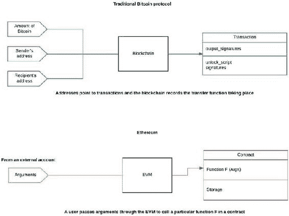
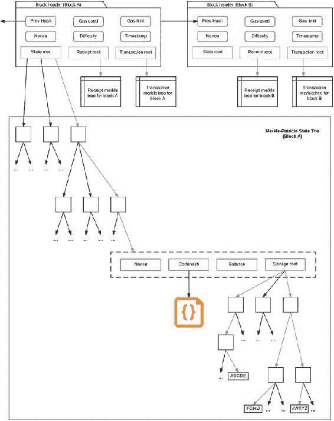
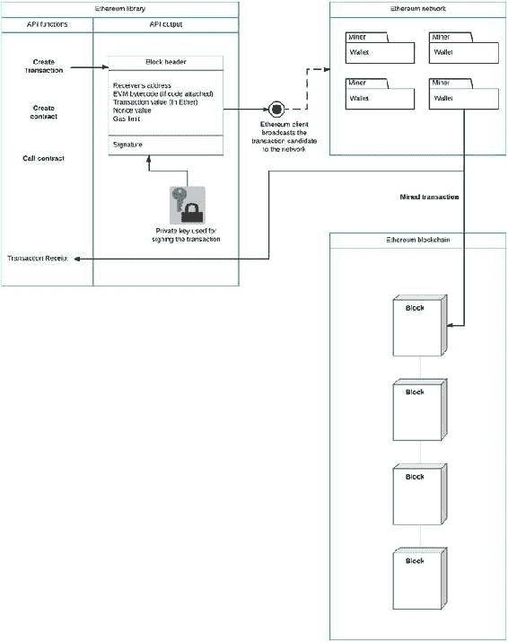
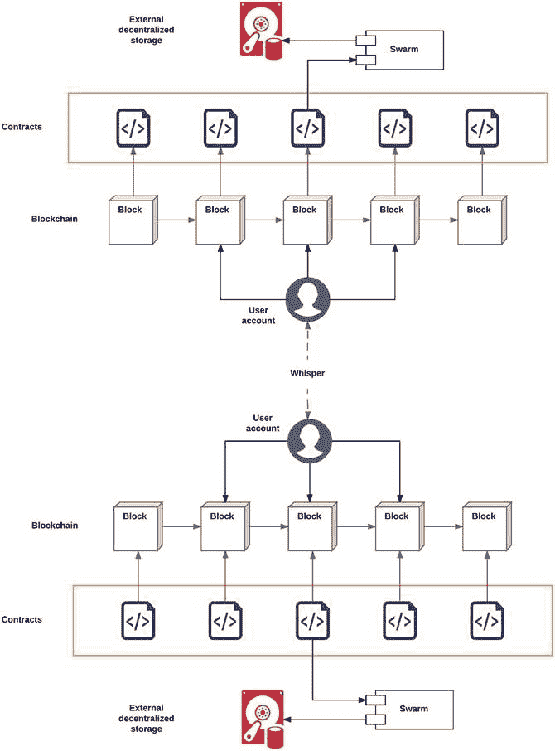
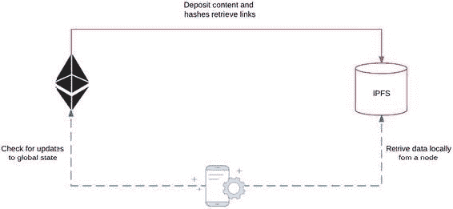

© Vikram Dhillon、David Metcalf 和 Max Hooper 2017Vikram Dhillon、David Metcalf 和 Max Hooper 区块链启用的应用`doi.org/10.1007/978-1-4842-3081-7_4`

# 4. 解读以太坊

Vikram Dhillon^(1 ), David Metcalf¹ 和 Max Hooper¹ (1)美国佛罗里达州奥兰多

> 任何足够先进的技术都是不可区分的魔法。—R.巴克明斯特·富勒

以太坊是一个开源、去中心化的区块链平台，具有计算能力，可以将基本的货币交换重构为通过脚本语言进行价值转移的用户之间的交易。以太坊被广泛认为是比特币协议的继承者，概括了原始的想法，并使更多样化的应用程序能够建立在区块链技术之上。以太坊有两个基本组成部分。第一个是图灵完备的虚拟处理器，可以加载资源和执行脚本，称为以太坊虚拟机（EVM）。第二个组件是一种价值代币，称为以太币，它是网络中用于用户间交易或向网络矿工支付补偿的货币。在本章中，我们将从以太坊的架构概述开始我们的旅程，比较其与比特币的差异，重点关注 EVM 和图灵完备性质。在架构之后，对以太坊的账户模型进行了简要讨论，并使用 Merkle-Patricia 树表示账户。这将引导我们进入以太坊的全局状态、账户存储和 gas，gas 是网络中的一种防止垃圾邮件的机制。然后，我们解构了由 EVM 启用的智能合约的概念，围绕着沙盒化可执行代码的安全问题，以及 EVM 如何将可执行代码（字节码）推送到区块链上。之后，我们介绍了 Solidity，这是一种用于在以太坊编写智能合约的编程语言。我们将探讨 Solidity 的语法，以及用于与之一起工作的常见集成开发环境（IDE）。接下来，我们关注以太坊提出的 World Computer 模型，以及一些相关的分布式技术，如 IPFS 和 Whisper。然后，我们将看看以太坊上可用的应用程序。在企业方面，微软在 Azure 云上部署的区块链即服务（BaaS）尤为引人注目。对于网络，分布式应用程序（Dapps）正在以太坊之上构建，并使用其他 World-Computer 组件（如 Mist）进行发布。

## 以太坊概述

大约在 2013 年中期，当时的大多数比特币社区开始考虑除了简单的货币之外的其他应用程序时，很快，线上论坛上开始涌现出许多新想法。一些常见的例子包括域名注册、资产保险、投票，甚至物联网（IoT）。在热情逐渐消退后，对比特币协议的更深入分析揭示了可以构建在区块链之上的潜在应用程序的严重限制。一个关键的讨论点是是否应该允许区块链内使用完整的脚本语言，还是应该将应用程序的逻辑构建在区块链之外。引发这场辩论的两个关键问题是：

+   比特币协议中的脚本语言和操作码设计得非常有限。

+   协议本身并不够通用，而且出现了专门用于一项特定任务的替代货币，如 Namecoin 等。当时的一个重要问题是：如何使协议通用化，以便与我们一无所知的应用程序未来兼容？

最终，关于脚本编写出现了两种思想流派：传统上，中本聪的论文建议将脚本语言的功能限制得非常有限。这样可以避免在区块链中有可执行代码带来的安全问题。在某种意义上，区块链可执行代码仅限于一小部分更新分布式状态的必要原语。第二种思想流派由维塔利克（Vitalik）发起，他认为区块链不仅仅是一个分类账。他设想区块链是一个可以使用合约和参数执行明确定义函数的计算平台。EVM 的设计允许完全隔离可执行代码，并安全地执行构建在 EVM 之上的应用程序。让我们从以太坊的设计原则和核心理念开始。核心理念与其构建支持特定应用程序的平台不如构建支持使用该语言在平台上实现业务逻辑的本地编程语言。我们稍后会回来讨论这一原则的影响。与此同时，让我们谈谈以太坊的另一个特性，共识。我们在之前的章节中讨论了共识的概念：在基于 PoW 的加密货币中，比特币等网络奖励解决密码难题以验证交易并挖掘新区块的矿工。以太坊使用一种称为 PoS 的不同共识算法。在 PoS 算法中，下一个区块的验证者或创建者是根据账户在网络中的股份而以伪随机方式选择的。因此，如果你在网络中的股份更高，你被选为验证者的机会就越大。验证者然后将锻造下一个区块并从网络中获得奖励。在这里，验证者真正是在锻造一个区块（在铁匠的意义上），因为在 PoS 中，硬件基础的挖矿的概念已被这种虚拟股份取代。在某种程度上，使用 PoS 的理由是由于 PoW 算法的高能耗要求成为了经常的抱怨。Peercoin 是第一个以 PoS 启动的加密货币，但更为突出的近期 PoS 实现可以在 ShadowCash、Nxt 和 Qora 中看到。比特币和以太坊作为协议的主要区别在图 4-1 中突出显示。图 4-1.比特币和以太坊作为计算平台的概览在比特币协议中，地址将交易从发送方映射到接收方。在区块链上运行的唯一程序是转账程序。通过地址和密钥签名，这个程序可以将资金从一个用户转移到另一个用户。以太坊通过在每个节点放置一个 EVM 来概括这个概念，以便可以在区块链上执行可验证的代码。在这里，一般的方案是一个外部账户将参数传递给一个函数，而 EVM 将将该调用定向到适当的合约并执行该函数，只要提供了适当数量的以太币和燃气。因此，在以太坊中的每个交易都可以被视为一个函数调用。以太坊中的函数调用和交易符合 PoS，其分辨率时间比依赖 PoW 的比特币区块链更快。这一过程的安全级别由网络验证。

### 以太坊账户

账户是以太坊中的一个元结构，也是区块链的基本操作单位。账户还作为在网络中存储和跟踪用户信息的模型。网络上有两种类型的账户。

+   用户账户：这些是用户控制的账户，也被称为外部账户。这些账户有以太币余额，由公私钥对控制，可以发送交易，但没有关联的代码。以太坊网络中的所有操作都是由外部账户发起的交易触发的。在比特币协议中，我们简称这些为地址。账户和地址之间的主要区别在于以太坊中能够包含和执行通用代码的能力。

+   合约：这实际上是由自己的代码控制的账户。合约账户是以太坊区块链上的功能编程单元。这个账户有以太币余额，有关联的代码，可以在接收来自其他账户的交易触发时执行代码，并且可以操作自己的持久性存储。（区块链上的每个合约都有自己的存储，只有它才能写入；这被称为合约的状态。）网络上的任何成员都可以创建具有一些任意规则的应用程序，并将其定义为合约。

如果账户起着如此关键的作用，它们如何在区块链上表示？账户成为默克尔树的一个元素，而默克尔树又是每个区块头的一个元素。以太坊使用一种修改过的二进制默克尔树，称为默克尔-帕特里夏树。对默克尔-帕特里夏树的完整解释（见[`www.emsec.rub.de/media/crypto/attachments/files/2011/04/becker_1.pdf`](http://www.emsec.rub.de/media/crypto/attachments/files/2011/04/becker_1.pdf)），将超出本文的范围，但图 4-2 提供了一个图形摘要。注：此处解释的双账户系统可能不会长期存在于以太坊中。最近，开发社区一直在推动使用合约来实现用户账户的一种账户模型。图 4-2.区块头和默克尔-帕特里夏树的概述 A 和 B 块区块头包含了一些标准定义，用于广播网络的状态。此外，以太坊中的每个区块头都有三棵树，用于三种对象类别：交易（函数调用）、收据（函数调用的结果，记录每个交易的影响）和状态对象。我们通过状态根进一步探索默克尔-帕特里夏树，其中包含账户对象。二进制树用于管理交易历史，但状态具有更多组件，需要更频繁地更新。账户的余额和网络的 nonce 通常会发生变化，因此我们需要一个数据结构，在插入、更新、编辑或删除操作后能够快速计算出新的树根，而无需重新计算整个树。这种修改后的默克尔树允许快速查询诸如：这个账户是否存在？这个交易是否已包含在特定块中？我的账户的当前余额是多少？图 4-2 中显示的默克尔-帕特里夏树有两级深度，有许多分支。其中一个分支指向一个虚线框，其中包含构成一个账户的四个组件。余额仅适用于外部账户，类似地，代码散列（保存可执行代码）仅适用于合约。存储根实际上包含用户上传到区块链的数据，或者合约可用的内部存储空间，在执行该合约时可以更新。

### 状态、存储和燃气

我们简要提到合约可以操纵自己的存储并更新状态，那么状态是什么？回想一下，在比特币协议中，用户和交易的数据是在 UTXOs 的上下文中构架和存储的。以太坊采用了一种不同的设计策略，使用状态对象。基本上，状态存储了一个账户列表，其中每个账户都有一个余额，以及区块链特定的数据（代码和数据存储）。如果发送账户有足够的余额支付交易（避免双重支付），则交易被视为有效，因此发送账户被借记，接收账户被贷记相应的价值。如果接收账户与代码相关联，则在接收到交易时将运行该代码。合约的执行或与账户相关联的代码对状态可能产生不同的影响：内部存储也可能被更改，或者代码甚至可能创建额外的交易到其他账户。以太坊在网络中区分状态和历史。状态本质上是关于网络状态和账户在给定时间的当前信息的快照。另一方面，历史是有关区块链上已发生的所有事件（如函数调用（交易）和由此带来的更改（收据））的编译。大多数以太坊网络节点都会记录状态。更正式地说，状态是一个数据结构，其中包含键值映射地址到账户对象。每个账户对象包含四个值：

+   当前 nonce 值

+   账户余额（以太）

+   `Codehash` 包含合约情况下的代码，但对于外部账户保持空白。

+   存储根，即包含在区块链上的代码和数据的 Merkle-Patricia 树的根

接下来，让我们谈谈以太坊中的 gas。 Gas 是以太坊中用于跟踪执行成本的内部单位。换句话说，它是在区块链上执行计算的微交易费用。对于像以太坊这样的计算平台，这在运行代码时变得至关重要，因为存在停机问题：无法判断程序是否会无限运行，还是只是运行时间很长。Gas 对运行时间进行了限制，因为用户必须为执行合约的逐步指令付费。微交易的性质使得逐步执行的成本非常低廉，但是即使是这些交易也会在非常长的运行时间内积累。一旦合约的 gas 耗尽，用户就必须支付更多以继续执行。特殊的 gas 费用也适用于占用存储空间的操作。以太坊网络中的存储、内存和处理等操作都需要 gas。接下来我们来谈谈存储。在以太坊中，外部账户可以使用合约在区块链上存储数据。合约将管理上传和存储过程，但目前可以存储的数据类型非常有限。因此一个自然的问题是：上传内容和信息到以太坊区块链的限制是什么？什么会阻止区块链的膨胀？事实证明，目前有两种机制可以防止数据过载：

+   每个区块的 gas 限制规定了每个区块在存储和计算操作上可以花费多少 gas。

+   用户需要花费的金额来购买存储数据所需的 gas

第二个限制通常是用户直接在区块链上存储的一个威慑因素，因为使用像 STORJ（[`storj.io/`](https://storj.io/)）或 IPFS（[`ipfs.io/`](https://ipfs.io/)）这样的第三方分布式服务，将数据存储在以太坊上并将其哈希定位于合约中变得更加高效和经济。在未来，新的分布式存储应用程序将允许所有类型的数据文件被上传并包含在区块链的合约中。让我们总结一下我们到目前为止所讨论的内容：我们从比特币和以太坊之间的差异开始，使用帐户、对操作收取手续费、直接在区块链上存储数据、允许在区块链上执行可执行代码、状态对象和 Merkle-Patricia 树。下图 4-3 简要概述了以太坊中发生的过程。图 4-3.以太坊网络的简化概览有三个重要的以太坊组件需要讨论：API、网络和区块链。以太坊 JavaScript API（也称为 web3.js）提供了大量的功能集，用于构建交易和合约、引用函数和存储收据等功能。对于以太坊的增强钱包客户端，例如 Mist（[`github.com/ethereum/mist`](https://github.com/ethereum/mist)），可以通过 GUI 接管几个这样的功能。一旦候选块构建完成，它将由以太坊客户端广播到网络上。网络上的验证者确定交易是否有效，以及与交易或合约相关联的任何代码是否有效。验证完成后，验证者执行相关代码并将其应用于当前状态。块被广播到网络上，矿工将锻造该块，然后经过验证的块被添加到区块链中。此步骤还为包含在块中的每个交易创建交易收据。新块还为状态对象提供更新，并提供从当前块到新块的关系链接。注：什么会阻止以太坊网络被小型未使用的合约膨胀？目前，没有机制来控制合约的生命周期，但是，关于临时订阅式合约的提案有一些在讨论中。在未来，可能会有两种不同类型的合约，一种具有永久寿命（创建和计算成本明显更高），另一种在其订阅到期后操作（更便宜和临时；在订阅结束后自动销毁以防止混乱）。

## 以太坊虚拟机

正式来说，以太坊的智能合约运行环境是 EVM。合约是用一种称为 Solidity 的高级语言编写的，然后使用 EVM 中的解释器将其编译为字节码。这个字节码然后通过以太坊客户端上传到区块链。合约以这种可执行字节码形式存在于区块链上。EVM 被设计为与环境和网络的其余部分完全隔离。在 EVM 内部运行的代码无法访问网络或任何其他进程；只有在编译为字节码后，合约才能访问外部世界和其他合约。从操作的角度来看，EVM 表现为一个拥有数百万个对象（账户）的大型分布式计算机，这些对象具有维护内部数据库、执行代码并通过消息传递相互通信的能力。这个模型还不完整，但在以太坊中，这个概念通常被称为世界计算机的概念。让我们回到代码执行的话题，以及它如何与共识密切相关。EVM 允许网络上的任何用户在一个不信任的环境中执行任意代码，其中结果是完全确定的，并且可以保证执行。默认的执行环境和设置导致了停滞：在网络上什么都不发生，一切的状态都保持不变。然而，正如我们之前提到的，任何用户都可以通过从外部账户发送交易来触发动作。这里可能有两种结果：如果接收者是另一个外部账户，那么交易将转移一些以太币，但不会发生其他任何事情。但是，如果接收者是一个合约，那么该合约将被激活并执行其中的代码。在网络中执行代码需要时间，这个过程相对较慢且昂贵。对于指令中的每一步，用户都要为执行支付 gas。当用户通过交易启动执行时，他们为该合约或代码支付的最大货币金额设定了一个上限。提示：以太坊最近已经开始了向即时虚拟机（VM）的迁移过程，这些优化了 gas 使用和性能。EVM 的结果是确定性的是什么意思？对于合约方法的相同输入，每个节点都必须达到相同的最终状态是至关重要的。否则，执行合约代码以验证交易的每个节点都会得到不同的结果，而无法达成共识。这就是 EVM 的确定性特性，它允许每个节点在合同执行和账户的相同最终状态上达成共识。执行合约的节点类似于同步移动的钟内的齿轮，因为它们以和谐的方式工作并达到相同的最终状态。合约还可以引用其他合约，但不能直接访问另一个合约的内部存储。每个合约在一个专用和私有的 EVM 实例中运行，在这里它只能访问一些输入数据、它的内部存储、区块链上的其他合约代码以及各种区块链参数，如最近的区块哈希。网络上的每个全节点都同时执行每个交易的合约代码。当一个节点在验证一个块时，交易是按照块指定的顺序顺序执行的。这是必要的，因为一个块可能包含多个调用同一合约的交易，并且合约的当前状态可能取决于在代码执行期间由先前引用修改的状态。执行合约代码相对昂贵，因此当节点收到一个块时，它们只对交易进行基本检查：发送账户是否有足够的以太币支付 gas？交易是否有有效的签名？然后，挖矿节点执行相对昂贵的任务，包括执行交易、将其包含在一个块中，并收集交易费作为奖励。当

### Solidity 编程语言

Solidity 是用于在以太坊上编写智能合约的高级、面向对象的编程语言。任何用 Solidity 编写的代码都可以在被编译成字节码后在 EVM 上执行，这是一种针对 EVM 的指令集。在执行期间，字节码是如何编码对其他函数和合约的引用的？这是通过应用程序二进制接口（ABI）来实现的。通常，ABI 是两个程序模块之间的接口：机器级指令和可读性较高的人类可读性编程语言。让我们将这个答案分解成三个组成部分：

+   合约：合约只是在形式语言（如 Solidity）中定义的高级代码。

+   编译后的合约：合约被转换为字节码以在 EVM 上执行，遵循编译器规范。请注意，在编译过程中，函数名称和输入参数被哈希和混淆。因此，要让另一个账户调用一个函数，它必须能够访问给定的函数名称和参数，并且我们需要另一层接口，将编码进出字节码。

+   ABI：ABI 是合约的函数定义和参数列表，以 JavaScript 对象表示法（JSON）格式排列。函数定义和输入参数被哈希到 ABI 中。这些信息包含在交易数据中，并由 EVM 在目标账户上解释。ABI 是必需的，这样你就可以指定要调用合约中的哪个函数，同时保证函数返回的数据格式符合你的期望。

Solidity（见 [`solidity.readthedocs.io/en/develop/`](https://solidity.readthedocs.io/en/develop/)）有一个新的 Visual Studio 插件（见 [`marketplace.visualstudio.com/items?itemName=ConsenSys.Solidity`](https://marketplace.visualstudio.com/items?itemName=ConsenSys.Solidity)），可帮助在强大的 IDE 中编写智能合约并将其部署到以太坊网络。我们在这里讨论 Solidity 的内容仅限于涵盖基础知识，比如存储变量和创建简单合约，所以让我们开始吧。/* 定义一个合约 */contract ExampleStorage {    uint storedNumber; //unsigned integer (uint) 用于声明状态变量/* 函数 set 可以修改状态变量的值 */    function set(uint x) {        storedNumber = x;    }/* 函数 get 可以检索状态变量的值 */    function get() constant returns (uint retVal) {        return storedData;    }}这个存储合约允许用户将一个整数作为状态变量 storedNumber 存储，然后使用 get() 和 set() 函数修改或检索其值。Solidity 还提供了几个现代编程语言中可用的高级功能，比如继承（用于合约）、函数重载和类接口。接下来，让我们看一个更复杂的合约示例。这次我们使用 Solidity 创建一个简单的银行合约：// 这个银行合约允许存款、取款和检查余额// 'contract' 是一个关键词，用于声明类，类似于其他面向对象编程语言 contract SimpleBank {// 'mapping' 是一个将地址对象映射到余额的字典// 'private' 意味着其他合约不能直接查询余额    mapping (address => uint) private balances;// 'public' 使得在区块链上可由用户或合约外部读取    address public owner;// 事件触发消息在整个以太坊网络传播    event LogDepositMade(address accountAddress, uint amount);// 构造函数    function SimpleBank() {        // msg 提供了有关发送给合约的消息的详细信息        // msg.sender 是合约创建者的地址        owner = msg.sender;    }    // 向银行存入以太币    // 存款后返回用户余额    function deposit() public returns (uint) {// 将存入的值加到账户余额        balances[msg.sender] += msg.value;// 记录刚刚进行的存款        LogDepositMade(msg.sender, msg.value);// 存款后返回余额        return balances[msg.sender];    }// 从银行取款// withdrawAmount 是您想要取款的金额// 返回用户取款后剩余的余额    function withdraw(uint withdrawAmount) public returns (uint remainingBal) {/* 如果账户余额大于取款请求的金额，则从余额中减去 */        if(balances[msg.sender] >= withdrawAmount) {            balances[msg.sender] -= withdrawAmount;// 如果取款成功，从原始账户中减去金额            if (!msg.sender.send(withdrawAmount)) {                balances[msg.sender] += withdrawAmount;            }        }// 取款后返回剩余余额        return balances[msg.sender];    }// 返回用户的余额// 'constant' 防止函数修改状态变量；    function balance() constant returns (uint) {        return balances[msg.sender];    }}虽然这个合约有很多部分，但它有一个简单明了的构图：我们首先声明状态变量，这里我们使用了一个称为映射的高级数据类型。然后，我们声明了一个在整个合约中使用的地址变量和一个事件记录器。构造函数准备了 owner 对象以便可用，并且我们将 owner 对象附加到从函数的返回类型中接收消息的形式中。在构造函数后面有三个函数，允许银行的基本功能。存款函数将参数金额添加到余额中。取款函数检查请求的金额是否低于账户可用余额。如果是这样，则确认取款，并从余额中减去参数金额。如果余额不足，则将本应取出的金额加回到账户，并将最终余额返回给用户。最后，最后一个函数允许我们根据合约要求在给定时间返回账户的余额。

### 世界计算机

以太坊项目有一个宏伟的愿景，即成为一个由区块链支持的共享世界计算机，拥有数百万个帐户，成为通信的智能日志的后端。合同提供了要执行的分散逻辑，并且 EVM 是执行平台。然而，计算和处理是不够的；计算机还必须能够存储信息，并允许应用程序之间进行通信的机制。这个世界计算机，如图 4-5 所示，将在 Internet 3.0 时代运行，在这个时代，由于信息流的分散性质，不再需要服务器。在这个雄心勃勃的努力中，以太坊只是项目的三分之一，所以让我们介绍另外两个组件：

+   Whisper：一种消息传递协议，允许区块链上的分散式应用程序和帐户之间进行通信。这与传统的消息传递协议不同，传统的应用程序在同一台机器上执行；在这里，分散式应用程序可以在区块链的任何节点上执行。

+   Swarm：一种分布式数据存储和分发资源，可供以太坊区块链使用。Swarm 是一个点对点的数据共享网络，文件通过其内容的哈希值进行寻址。这个资源非常类似于 BitTorrent，数据可以从多个节点（称为对等节点）获取，这些节点托管文件的小片段，并由接收方组装起来。Swarm 最强大的功能是，即使只有一个节点托管了数据的一部分，它也可以从网络中的任何地方访问。目前，Swarm 处于早期开发阶段，并没有指定一个服务（Storj，IPFS）提供分散式存储；然而，Swarm 确实具有处理存储和存储在区块链外的数据的哈希引用的工具。使用 Swarm 可以将数据分布到网络中以分散方式进行冗余复制，而无需托管任何类型的服务器。网络中的多个节点可以被激励来复制和存储数据，就像 RAID 配置一样，消除了在网络中托管服务器的需要。

+   合同：这是我们之前提到的世界计算机的最后一个组件。它们允许对区块链进行程序化访问，并提供了驱动最终将在世界计算机上运行的应用程序的逻辑框架。

图 4-5.以太坊世界计算机模型的分层方法用户帐户（或简称用户）是世界计算机中的基本实体，因此用户是第一层。第二层是区块链，它充当网络中不同组件之间的通信串行总线。第三层是称为智能合约的逻辑框架，驻留在区块链上，并为世界计算机提供计算能力。其中一些合同可能需要外部存储来输出并使用 Swarm 来协调存储，这是第四层。最后，回顾第一层，我们有称为 Whisper 的消息传递协议，以促进用户之间或应用程序之间的通信。世界计算机和 Internet 3.0 的概念不仅仅是一个哲学上的愿景或技术上的蓝图，它对控制和分发 Web 上的内容有着深远的影响。以太坊的泰勒·杰林非常雄辩地谈到了建立这个梦想：

> 随着以太坊生态系统的经济状况趋于成熟，开放的存储合约价格最低，内容托管的自由市场可能会逐渐形成。考虑到 P2P 应用程序的性质和动态，热门内容将很容易地通过群集共享，而不是遭受单体服务器的承载压力。最终的结果是，热门内容的交付速度更快，而不是更慢。这种变革将为开发人员提供一个机会，构建下一代去中心化、私有、安全、抗审查的平台，将控制权还给创作者和下一个最佳创意的消费者。任何有梦想的人都可以自由地在这个新一代去中心化网络服务上构建，而无需拥有信用卡或注册任何帐户。虽然我们没有被要求或期望着这样做，但我们有责任珍惜和改善一些人希望干扰、操纵和控制的共享资源。就像没有一个人完全理解正在崛起的互联网集体智慧一样，我们也不应该期望任何一个实体能够完全理解或保持完全一致的动机。相反，我们应该依靠互联网来解决互联网的问题。

### 区块链即服务

Microsoft 最近宣布与以太坊基金会合作，在其云平台 Azure 上推出基于区块链的服务。这种基础设施即服务的方法可以快速、轻松地实现区块链，使开发人员能够以较低的成本尝试新功能并部署 DApp。Azure 区块链工程团队的 Marley Grey 描述了区块链即服务（BaaS）将如何促进 DApp 生态系统：

> Microsoft 和 ConsenSys 合作，在 Microsoft Azure 上提供以太坊区块链服务（E-BaaS），以便企业客户和开发人员可以一键式云端区块链开发环境。首次推出的产品包含两个工具，可快速开发基于智能合约的应用程序：Ether.Camp，一个集成开发环境，和 BlockApps，一个私有、半私有的以太坊区块链环境，可部署到公共以太坊环境中。由 Microsoft Azure 和 ConsenSys 提供的“以太坊区块链服务”允许金融服务客户和合作伙伴在现成的开发/测试/生产环境中玩耍、学习并快速失败，成本较低。它将允许他们非常快速地创建基于行业领先框架的私有、公共和联盟基础的区块链环境，并使用 Azure 的全球分布式（私有）平台分发其区块链产品。这使得 Azure 成为区块链应用的出色开发/测试/生产环境。像 Cortana Analytics（机器学习）、Power BI、Azure Active Directory、O365 和 CRMOL 等周边功能可以集成到应用程序中，推出新一代的去中心化跨平台应用程序。

在 2015 年底，有关 BaaS 的初步更新首次提供，并且目前整个区块链实验室生态系统正在 Azure DevTest 社区内蓬勃发展。DevTest 实验室允许用户和开发人员探索和测试为特定用例设计的模板。此外，该平台最初以以太坊区块链为基础，但最近更多的初创公司已开始在 Azure 上构建，提供新的服务，例如提供 SSH 服务的 Emercoin 和以健康为导向的区块链 Dokchain 的 PokiDot。随着时间的推移，越来越多的初创公司已开始使用 Azure 作为运行区块链和构建应用程序的标准。通过集成智能服务，如 Cortana，可能会更容易开发可以签署来自外部流（例如，物联网设备）的传入数据并提供一定完整性级别的 Oracle。Microsoft 在 BaaS 领域的最近两项发展在这里值得注意。第一个是引入 Cryptlets，这是一个安全的中间件，用于与外部事件进行接口，用于构建企业智能合约。第二个发展是 Coco 框架。这是一个开源系统，用于在区块链上构建高吞吐量网络，在该网络上，节点和参与者被明确声明和控制。根据设计，Coco 与任何分类帐协议兼容，并且将允许企业构建可投入生产的区块链网络。

## 去中心化应用程序

我们在讨论 Whisper 时提到了 DApps，但我们将在这里更深入地讨论它们。DApp 是在以太坊堆栈上运行的无服务器应用程序，通过 HTML/JavaScript 前端与最终用户进行交互，该前端可以调用后端堆栈。传统上，移动应用程序或 Web 应用程序具有在专用集中式服务器上运行的后端；但是，DApp 的后端代码在分散的对等网络上运行。DApp 的结构如图 4-6 所示。图 4-6.DApp 的结构用户界面通常使用 HTML 或 JavaScript 编写，并且是用户设备上加载的唯一组件。该界面调用区块链执行特定合约，还可以调用后端资源，例如 Swarm 或 Whisper（如果需要外部存储）或应用程序需要与其他应用程序进行通信。如果传统应用程序由前端和在集中式服务器上运行的后端组成，那么在以太坊堆栈上运行的 DApp 将由在区块链上运行的前端和合约组成。DApp 通常在区块链上具有自己的一组关联合约，用于编码业务逻辑并允许持久存储其共识关键状态。请回忆，以太坊堆栈上的所有代码都在 EVM 内运行，EVM 会逐步跟踪操作并向合约的所有者收取 gas 费。这可以防止 DApp 开发人员在区块链上运行太多操作或通过直接在区块链上存储数据来使其膨胀。简要回顾一下，以太坊堆栈由三个组件组成：区块链、Whisper 和 Swarm。前端界面根据用户操作向区块链调用运行 DApp 的特定合约。DApp 的后端如何从以太坊堆栈中获取静态内容，例如 JavaScript，到静态内容并从区块链接收更新的全局状态呢？让我们看一个使用 IPFS 作为存储的示例来了解这些后端调用，如图 4-7 所示。

+   后端代码本质上是在区块链上执行的合约，只要提供适量的资源。

+   一些应用程序需要使用持久数据库来托管应用程序中使用的静态内容。我们可以依赖 IPFS 存储静态文件，在整个网络上的几个节点上托管。

+   来自 IPFS 的哈希传递给 DApp，合同的执行更新全局状态，该状态从以太坊堆栈传递给 DApp。

图 4-7.DApp 发出的简单后端调用的简单示意图区块链可以将内容存储到节点中的类似 IPFS 的系统中，并在必要时使哈希可供应用检索。 应用程序可以请求来自区块链的全局状态的更新，因为它会影响设备上运行的应用程序。 最后，根据需要，应用程序可以从去中心化存储检索和下载完整内容到用户设备。 以这种方式分割角色允许更具创新性的用户界面，因为开发人员可以将其替换掉，而无需更改后端。

### Geth 和 Mist

我们需要简要讨论的另外两个工具在 DApp 开发中发挥作用。 Geth 是以 Go 语言编写的命令行界面，用于在以太坊网络上运行完整节点。 使用 Geth，您可以与以太坊网络进行交互，并执行诸如以下任务：

+   在网络上挖掘以太币

+   在地址之间转移资金

+   创建合同并发送交易

+   使用 DApps API

Geth 带有两个在开发中使用的接口：带有 web3.js 库的 JavaScript 控制台和 JSON-RPC 服务器。 让我们简要地谈谈这两种技术。 Geth 可以启动交互式控制台，为您提供 JavaScript 运行时环境，以与节点进行交互。 此运行时环境包括 web3 库，它可以构造要传播到节点的合同和交易。 JSON-RPC 服务器是一种远程过程调用（RPC）协议，它促进了节点和其客户端之间的数据交换（JSON 是节点用来与客户端通信的数据交换格式）。 更准确地说，RPC 是一组方法和规则，定义了数据（命令和输出）如何在节点和客户端之间传输。 JavaScript API 使用 web3.js 库提供了一个方便的界面，用于使用 RPC 方法。提示对于今天大多数以太坊应用程序来说，Geth 是作为命令行工具安装的先决条件。 通常，在安装过程中，Geth 被提供为附加组件，以便用户无需单独下载和安装它。第二个工具称为 Mist DApp 浏览器。 在早期讨论中，Mist 被构想为一种独立的应用商店类型浏览器，用于 DApps，但该愿景已经发展。 Mist 仍在积极开发中； 但是，发布计划是将 Mist 与以太坊钱包捆绑在一起，以成为一个强大的工具。 在未来的发布中，钱包将仅作为在 Mist 浏览器上运行的单个 DApp。 很快，浏览器将能够打开任何可用的 DApp，而钱包将只是其中之一。最终，使用 Geth 和 Mist 的以太坊网络上最强大的实体将是去中心化自治组织（DAOs），它们本质上是由在以太坊网络上运行的智能合约驱动的自动化公司。 我们在这里结束了探索以太坊的旅程，并在下一章中继续讨论 DAOs。

## 摘要

在本章中，我们介绍了以太坊，这是与比特币竞争最激烈的最大替代货币之一。近年来，它受到了开发者和投资者的极其关注。我们从与比特币相比，广泛概述以太坊的内容开始讨论。我们谈论了账户和函数调用作为以太坊的基础。然后，我们更深入地探讨了账户作为区块链上实体的概念。之后，我们讨论了以太坊中用于智能合约执行的 gas 的使用，以及内部存储如何适应 Merkle-Patricia 树工作的概念，以及账户的内部状态的概念。之后，我们讨论了 EVM 以及智能合约在区块链上的执行方式。然后，我们讨论了使用 Solidity 编写智能合约的模型，并应用 Visual Studio 的插件来快速原型化智能合约。最后，我们谈论了世界计算机模型，以及它如何适用于以太坊组件，如 IPFS 和 Whisper。我们以对世界计算机中所有组件的简要描述结束了讨论。

## 参考文献

编写本章所用的主要参考资料是以太坊家园开发者文档和 Solidity 文档。书末提供了详细的参考文献列表。
