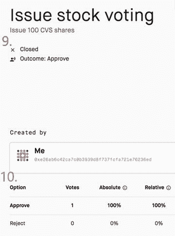
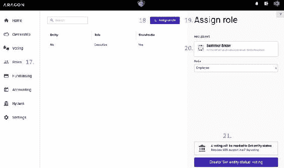
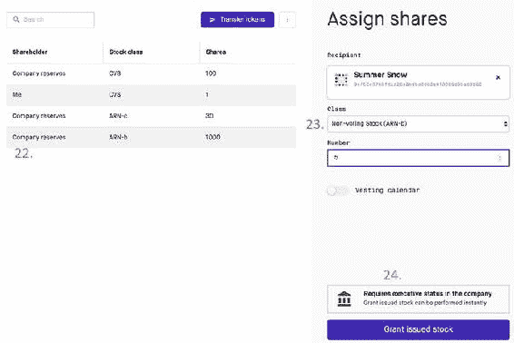
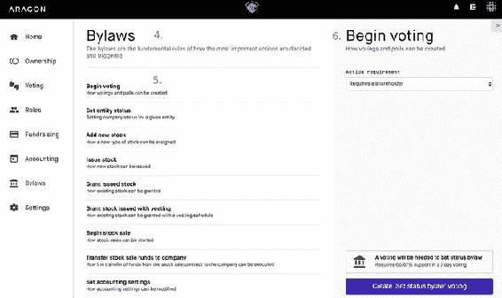

©  Vikram Dhillon, David Metcalf, and Max Hooper 2017Vikram Dhillon, David Metcalf 和 Max Hooper 区块链启用应用程序[A430562_1_En_5_Chapter.xhtml](https://doi.org/10.1007/978-1-4842-3081-7_5)

# 5. 去中心化组织

[Vikram Dhillon](https://doi.org/10.1007/978-1-4842-3081-7_5)^(1 ), David Metcalf¹ 和 Max Hooper¹(1)美国佛罗里达州奥兰多比特币可以被认为是第一个原型化的去中心化自治组织（DAO）。它创建了一个网络生态系统，由参与者共同向一个共同目标贡献计算能力。在比特币中，提供金融服务并奖励矿工的分布式协议成为了一个基本的去中心化组织。在本章中，我们讨论了在 Aragon 中制作的更复杂和完整的 DAO。Aragon ([`aragon.one/`](https://aragon.one/)) 是一个分布式应用程序（DApp），允许任何人在以太坊区块链上创建和管理不同类型的组织（非政府组织 [NGOs]、非营利组织、基金会）。创建 DAO 需要多个步骤，最初在以太坊中实现起来更加困难。然而，Aragon 在一个基本模板中实现了组织的所有基本功能，每当用户实例化一个公司时，就会部署该模板。大多数传统功能，如股本表、投票、筹款和会计，都在 Aragon 中作为运行在区块链上的去中心化对应方提供。此外，Aragon 公司可以根据需要进行非常精细的定制，并使用可以添加到公司现有智能合约的新模块进行扩展。Aragon 允许在区块链上构建不同的组织，一个有趣的用例集成了使用双向验证方案与 Keybase 的身份。我们讨论了 Keybase 到 Aragon 锚定功能如何在去中心化系统的背景下提供身份服务。我们还简要讨论了 Aragon 内核，它本质上是一个任务管理器，具有确保组织内部、成员之间以及底层区块链之间平稳通信的子程序。我们从 Aragon 内核及其主要功能开始讨论。然后，我们采取了两种方法来定义 DAO：一种是根据成员之间的共识来定义，另一种是专注于由 Ralph Merkel 给出的功能的定义。Aragon 核心采用了后者的定义，并将其扩展到“器官”，因此我们将介绍 Aragon 核心提供的所有器官。本章的核心是一系列分为三个主题的视觉教程。第一个主题向用户介绍了 Aragon 公司的基础知识以及如何设置 MetaMask 钱包。本主题以用户设置了默认公司和一个功能性钱包而告终。第二个主题深入了解您新创建的公司的日常运营。这包括在 Aragon 中可用的股票和股票类别、用户权限和代币。这里演示了各种操作，如添加新的股票类别、发行股票、向新员工分配股票、向新员工分配角色以及在公司内转移现有代币。第三个主题关注 Aragon 中的更高级主题。在这里，我们讨论了在 Aragon 上使用以太坊区块链进行筹款以及在 Aragon 中实施的不同类型的轮次。最后，我们通过讨论章程以及如何编辑由 Aragon 部署的默认公司模板来结束教程和本章。

## Aragon 内核

Aragon 中的内核充当一个交换机，将请求和消息传递指向各种子程序（也称为器官）。在生产模式下，内核将同时与数百个 Aragon 组织或区块链上的用户进行交互。在这里，我们的重点仅限于内核与一家公司交互：一个 DAO。什么是 DAO？DAO 是一个建立在成员决策共识基础上的区块链实体。DAO 将区块链固有的共识概念扩展到由 DAO 成员做出的决策和选择（通常以 DAO 代币的形式持有利益）。因此，DAO 以自动化为核心建立，以成员在外围依靠基于多数的共识来为组织做出决策。尽管这个 DAO 的定义是一个通用描述，但它是不完整的。也许定义 DAO 的更好方法是通过它执行的功能。DAO 的概念最初来源于比特币，它可能被视为 DAO 的第一个原型。注意：Aragon 网络上最简单的功能单元是 DAO，因此我们的大部分讨论都集中在一个最小的使用案例上。Aragon 提供了一个基本模板，可用于设置 DAO，并且您可以修改此模板以设置自定义规则。其他类型的组织（例如，非政府组织或非营利组织）是在基本模板上进行了重大修改，以允许新的操作方式。此外，在本章的其余部分中，术语 DAO、公司和组织是可以互换使用的，表示相同的概念。Ralph Merkle 谈到 DAO 是一个拥有内部具有价值的财产的实体，可以更新其内部状态，对成员作出响应，并运行智能合约。这些是任何 DAO 应该能够执行的一些最基本的功能，但目前还没有 DAO 的合规标准（例如 ERC20 用于代币）。内核使用一组器官来执行其大部分日常活动。让我们逐个审查 Aragon 默认提供的器官：

+   Meta 器官：一个自我感知（就内部状态而言）和自我可执行的器官，负责根据成员或外部的行动来内部更新 DAO。此器官还维护内核中运行的器官的全局注册表。

+   Dispatch 器官：一个验证器器官，确定是否可以代表请求者执行请求的操作或事务。这可以通过一个 oracle 或根据特定标准过滤请求的编程逻辑来完成。Dispatch 器官的结果是简单的通过或失败。如果操作失败，则不会执行。但是，如果操作或事务通过，则会被分派到更适合的器官进行处理或执行。Dispatch 器官还维护每个请求的优先级列表，以便进行分类和适当的定向。

+   Vault 器官：Vault 器官作为 DAO 的集体钱包。它以代币形式存储 DAO 拥有的资金，并批准任何支出请求。

+   Token 器官：Token 器官专门处理分配给 DAO 成员的治理代币。此器官还包含添加新类型的代币或替换和删除旧代币的操作逻辑。

+   Applications 器官：这是 DAO 核心中运行的智能合约集合。在此器官中运行的应用程序与组织的其余部分隔离，但大部分业务逻辑驻留在此器官中。Aragon 提供了一套基本的以太坊合约负责默认操作，但此器官是可扩展的。可以向组织添加新的应用程序或模块，以增加功能，以满足特定用例。

## 身份管理

身份概念对于加密技术来说是一个难题，因为它需要网络架构中具有一定程度的信任。大多数将身份整合到基于共识的系统中的通用方法涉及某种形式的加密证明和签名。在 Aragon 中，一个名为 Keybase 的外部服务与注册合约一起被用来建立一个“无信任”的双向验证方案。这个方案背后的逻辑非常简单：建立一个特定地址属于你，并验证你的用户名拥有该地址。这两个陈述在功能设置中如何协调？让我们介绍使双向桥梁成为可能的两个组件。简单地说，Keybase 是一个具有 OAuth 集成的公钥-私钥对管理服务，允许用户进行身份验证和账户验证。Keybase 可以作为一个集中式中心，让用户链接和验证外部账户。例如，在 Keybase 上创建一个账户后，用户的公开资料可以显示所有链接的社交媒体账户，从而确立它们的合法性和联系。第二个组件是一个注册合约，它提供了来自 Aragon 网络内的账户与地址关联机制。双向桥梁是通过使用地址（链接到网络上的一个账户）来对一个文件进行加密签名，然后该文件可以被托管在 Keybase 上（通过各种社交媒体集成链接到用户身份）。注意在 Aragon 中，身份是一个选择性的功能至关重要。为 Aragon 开发的用例范围从提供完全匿名性，如 DAO 的情况，到整合 Keybase 的全用户名，以用于下一代区块链公司。那么用户如何使他们的身份对双向验证方案可用呢？Keybase 注册 2.0 中的工作流程已经简化为一个简单的步骤：将签名证明上传到 Keybase 文件系统（KBFS）。这引入了一些新的组件。

+   Keybase 文件系统：KBFS 是一个具有密码学安全的本地和云存储目录。KBFS 只允许目录所有者添加新文件，这些文件是公开可用的。在 KBFS 中，每个添加到目录的文件都会被自动签名，签名可以通过 Keybase 由任何人验证。

+   签名证明：Aragon 使用用户上传到 KBFS 公共目录的标准身份证明。这个证明有四个组成部分：Keybase 上的用户名，用户拥有的以太坊账户地址，用户的字符串或评论，以及最后的签名公钥。任何希望验证身份的人都可以获得这个证明文件，并使用一个诸如 getUsername(args) 的函数来执行给定证明中账户地址的用户名反向查找。

+   Oraclize：反向查找是通过 Aragon 网络内的注册合约执行的验证过程。对于 Keybase 查找，使用了一个名为 oraclize 的数据载体服务。Oraclize 请求给定 Keybase 用户名的签名，并创建一个将用户名映射到以太坊账户地址的映射。该证明文件上的签名应该与用户在网络上的公钥相匹配。Oraclize 执行一个在链上的检查来验证证明签名并确保映射是合法的。代表另一个用户发起此验证的一方还必须支付包括 oraclize 参考调用在内的步骤的费用。

+   Keybase 解析器：以太坊名称服务（ENS）允许我们将人类可读的链接解析成以太坊地址。最近，Aragon 已经开始测试一个 Keybase 解析器，它将回调映射到用户名，然后将用户名映射到地址，如 john.keybase.eth -> 0x99...cx88。这简化了网络中的反向查找和用户名引用。

## DAO/公司概览

在这一部分，我们将介绍创建一个 DAO 并熟悉在 Aragon 中的主要 DAO 操作的过程。为了简单起见，我们只有两个实体参与这个 DAO，一个是执行者，一个是雇员。这个步骤分为三个主题：

+   设置一个 DAO：我们介绍这个 DAO 的参与者，展示如何创建一个钱包，并熟悉界面。

+   创建股票并分配股份：在我们的 DAO 设置完成后，我们创建新的股票类别，发行新股票，并将股份分配给另一个实体。

+   筹款和修改章程：在股份被分配后，我们看看在 Aragon 中筹款是如何运作的。一个 DAO 可以从特定投资者那里筹集资金以换取股份，或公开发行股票以筹集一轮资金。我们审查筹款过程，更重要的是管理 DAO 的章程。

### 设置一个 DAO

从[`aragon.one/`](https://aragon.one/)下载 Aragon 客户端。该客户端有两个主要组件：Aragon 核心和 MetaMask。在每个客户端中，Aragon 核心作为 DAO 的管理仪表板。该组件的主要目的是指导对参与 DAO 的所有实体的访问控制。根据你的角色以及是否持有任何股份，你可能可以访问高级功能。稍后我们会看到通过修改公司章程可以改变功能访问权限的方式。第二个组件是 MetaMask，一个设计为 Google Chrome 插件的数字钱包，使以太坊对实际日常用户可访问。MetaMask 被选择为 Aragon，以通过为用户带来一个已经熟悉的界面来推动采用。开场画面，如图 5-1 所示，提供了对 Aragon 的简要介绍，以及钱包设置。图 5-1.Aragon 设置画面。此处提供了对 Aragon 的简要介绍，以及创建 MetaMask 钱包的按钮。在屏幕右上角有一个访问钱包的图标。MetaMask 首先要求您为您的钱包创建一个密码，如图 5-2 所示。这将是您的访问密钥。输入密码后，您将获得一个恢复钱包的口令，以防丢失密码。注意：Aragon 仍然连接到一个测试网以说明概念。因此，对于某些步骤，您可能需要多次验证和确认交易，以确保初始公司创建步骤。一些已知的错误正在测试代码中积极开发。图 5-2.为您的 MetaMask 钱包创建密码。在 Aragon 的每个重要步骤之后，都会跟随一系列确认，以交易的形式向网络广播新的更改。创建钱包密码并确认交易后，您应该会看到一个确认屏幕和您当前钱包的状态（请参见图 5-3）。这里简要介绍了 Aragon 的α版本：当前 Aragon 客户端不在 Aragon 网络上运行。它连接到以太坊测试网（在本例中是科文测试网，如图 5-3 所示），这是 Aragon 的一个测试场地。在测试网上，货币没有价值，因此用户可以测试产品并报告任何严重的错误，协助产品开发。用户可以请求将测试 ETH 发送到他们的钱包，并在没有任何后果的情况下尝试 Aragon。这就是为什么当创建钱包时，它已经加载了余额。图 5-3.使用 MetaMask 创建的钱包。请注意下面显示的钱包地址以及其在测试网上的余额。创建钱包后的屏幕将带您进入 Aragon 核心，有两个选项可用：创建新组织和加入现有组织，如图 5-4 所示。从这里开始，教程将重点介绍第一个选项，并从执行者的角度介绍 Aragon。但是，我们简要介绍了用户如何加入 DAO 以及普通员工可获得的访问级别。图 5-4.Aragon 核心欢迎屏幕向用户提供了两个选项，不仅限于 DAO；任何类型的组织都可以在 Aragon 上构建，包括 NGO 和非营利组织。传统公司将对 Aragon 区块链采取新的分散化视角，但最终是公司决定哪些组件可以被分散化。我们将在这里选择创建一个新组织。创建一个新公司需要以太币，用我们在上一步中创建的钱包支付。然后，通过确认它们将交易广播到区块链上。Aragon 使用通用模板在区块链上部署公司，但创始人可以通过修改公司章程来编辑此模板。右上角的循环进度指示器显示了用于公司部署的交易正在验证的过程。公司部署后，下一个屏幕是 Aragon 核心仪表板。这是用户（执行者或员工）处理 DAO 的日常运营的地方，具有参与投票、分配股份等功能。仪表板默认显示欢迎屏幕给用户。为了浏览此仪表板，让我们从“设置”下的您的个人资料开始（参见图 5-5）。图 5-5.Aragon 核心仪表板中的设置每个帐户在网络上都被分配了一个地址和一个用户名。该地址也与通过钱包可用的资金相关联。地址下面是该用户的角色。接下来，设置屏幕显示了有关我们在先前步骤中创建的公司的一些信息。给出了公司的地址，并且创始人会与员工分享这个地址，以便他们加入组织。回想一下图 5-4 中的

### 发行股份

现在我们的通用公司已经运作，是时候开始编辑模板并自定义 DAO 了。我们在这里探讨如何发行股票，添加新类型的股票，并将它们分配给员工。在 Aragon 中，涉及改变公司运营的每一个动作都依赖于成员通过多数投票达成共识。默认设置赋予每个股东投票权，但这可以通过编辑章程进行细化。让我们开始向 DAO 发行股票。注意：Aragon 中公司（或 DAO）的一个有趣用例是用作开源项目或相关技术的去中心化决策机构。股票成为未来项目方向决策的机制，通过投票更广泛地涉及社区参与。代币的使用和筹集资金的能力也为提供资金支持以维持发展提供了机制。我们稍后在本章再次讨论这种情景。参见图 5-6，使用右上角的菜单选择“发行股份”以打开侧边栏上的屏幕。发行新股份将需要我们选择要提供的股份类别和要发行的股份数目。此过程显示在图 5-7 中。图 5-7.发行更多股份首先，我们必须决定要发行的股份类别。目前只有一类股份可用，所以我们将使用默认设置。接下来，我们选择发行 100 股 CVS 类型的新股份。要完成此操作，我们首先必须经过投票过程。请记住，公司的所有重大变更都需要由其他股东审查并获得批准，然后才能执行。在这里，只有在该提案获得至少 50% 股东批准后，才会发行额外的股份。只有在那之后，公司才能获得更多股份，可以重新分配给其他用户。目前 DAO 中只有一个投票用户，因此这将是决定性的投票。投票界面看起来像图 5-8 中显示的投票过程的一般概要。图 5-8.投票界面它遵循一个非常简单的大纲，从将要提交给投票者注意的提案名称开始。接下来是作为响应采取的行动以及投票的初步时间表。Aragon 的默认设置是通过超过 50% 的批准来通过提案。接口接下来显示是谁提出了这个提案进行投票；这里的“我”指的是连接到此 Aragon 客户端的用户，以及用户的地址。接下来显示投票的详细信息。在这里，只需要一票来批准提案。最后，用户将看到两个选择：批准和拒绝。投票完成后，将收集到一次交易。当投票结束时，所有投票将自动计算并显示结果。那么投票结果是什么样的呢？在这里，我们假设选择批准 DAO 的提案。图 5-9 显示了投票结果。图 5-9.投票结果。该提案已被接受，投票已关闭。报告了投票的整体统计数据，以便任何用户都可以看到投票如何分配发行更多股份刚刚改变了我们 DAO 的所有权分配。默认情况下，新发行的股份属于公司，然后执行人员可以投票将这些股份转让给其他用户。图 5-10 显示了发行股份后的新分配情况。与仅创建公司时的情况相比，这是一个改变。请记

+   普通股票（A 类）：人们通常在提及股票时所指的就是这种。普通股票由一家公司发行，通常可以通过纽约证券交易所（NYSE）或纳斯达克等股票交易所进行交易。普通股票的主要优势在于分红和在交易所交易。股息通常是在每个季度结束时从当季利润中支付给公司股东的一笔款项。普通股票也可以在任何时候在认可的交易所进行交易或出售。

+   优先股票（B 类）：优先股票是一种特殊类型的股票，发行给对公司有重大利益的投资者。这种股票在财务上比普通股票有一些优势，使其成为更安全的投资。在股息方面，优先股票在普通股票之前兑现，因此相比普通股票获得了更大比例的公司利润。此外，普通股票的股息支付可以有所不同，而优先股票为股东提供固定的回报。

+   创始人股票（F 类）：F 类股票是发行给公司创始人的一种独特类型的优先股票。这些股票带有更大的表决权；例如，一份创始人股票可能计为十票。相比之下，一份普通股票只能计为一票。创始人股票授予超级表决权，通常用于在涉及大量实体时保留对公司决策过程的控制。

让我们来看看 Aragon 提供的股票类别。 这可以通过我们在图 5-6 中看到的所有权选项卡来完成。 单击添加股票类别以打开图 5-11 中显示的对话框。 图 5-11.添加新股票的界面在 Aragon 中提供了四种股票类别，列在股票模板下。 投票股票是默认的，非投票股票可能会发行给吸引员工的公司，持有股票成为经济乘数，创始人股票提供超级投票权并且通常保持在创始人之间，最后独角兽股票是给予拥有公司重大股份的特别投资者的，因为它提供了高倍增器和投票权。 接下来，我们分配我们新股票类别的参数。 我们将添加一个创始人股票类别，该类别将在所有权中用 ARN-c 符号表示。 默认情况下，创始人股票的投票权高于普通股，但根据需要可以更新。 经济权设置是股东的乘数； 实际上，支付给该股东的股息会乘以他们的经济权。 接下来是发行的股票数量。 在这种情况下，我们想添加一个创始人类别，并向公司发行 30 股新的创始人股。 通常情况下，添加新股票类别需要进行投票（16），然后新股票才能提供。新股票分配是什么样的？ 图 5-12 显示了添加新股票，更改在股票类型饼图中可见。 图 5-12.添加创始人股票。 ARN-c 用作符号，所有现有股票均由公司拥有。 要将股票分配给成员，必须进行投票接下来，我们向我们的 DAO 添加另一个用户。 第二个用户将被添加为员工，然后分配一些股票。 我们还可以展示一个现有股东如何以独占股份的方式奖励另一个用户，以表彰他们的优秀工作或晋升。 要将新成员添加到您的组织中，您必须向用户提供在图 5-5 中显示的公司地址。 他们需要下载 Aragon 并在创建钱包后的第一步中加入您的组织。 新成员加入后，他或她可以通过所有权设置看到公司的当前状态。 图 5-13 显示了在新用户加入组织后为新用户分配角色的过程。注意在本教程中，“组织”、“公司”和“DAO”这些术语是可以互换使用的。 图 5-13.在组织中为新员工分配角色图 5-13 中显示的角色选项卡提供了公司中所有实体的概述。 目前，只有一个用户存在：连接到此 Aragon 客户端的 Me 用户。 要分配新角色，请单击分配角色以打开分配角色对话框。 可以通过其用户名或接收者字段中的帐户地址添加接收者。 根据您公司的政策，如果您要求与您的成员相关联的某种身份级别，则可以通过引用其用户名将这些用户添加到其中。 如果您不使用 Keybase 身份注册表，则必须通过引用地址来添加新用户。 输入地址后，您可以为用户决定角色。 在这里，我们正在添加一个新的员工； 但是，还有其他可用选项，例如添加新的执行者、另一个员工或超级用户。 超级用户角色通常保留给非人实体，这些实体是您组织的一部分，例如 oracle 或可以部署您公司其他组件的工厂实体。 像往常一样，向用户分配新角色需要进行投票才能确认。到目前为止，我们已经讨论了如何发行新股份，分配股票，添加新股票类别以及为公司的新成员分配角色。 这里有一个练习：根据我们 DAO 的当前状态，添加一个经济乘数为 5 的非投票股票类别，并向公司发行 1,000 股。 然后，将其中五股分配给新员工夏季雪。 结果应该看起来像图 5-14。 图 5-14.将股票分配给新用户读者练习应该产生一个名为 ARN-b 的新股票类别，这是一种非投票股票。 应该发行 1,000 股， 默认情况下，所有股份都属于公司。 接下来，我们要分配股票，可以在所有权选项卡上完成。 我们必须通过地址引用夏季雪，然后选择股票类别和要分配的股份数。 要批准此更改，通常需要投票。 但是，在这种情况

### 筹款与章程

在我们的教程中的最后一个话题中，我们处理了 Aragon 中的更高级功能，即区块链上的筹款和章程，这些功能为公司的治理提供了另一层微调的水平。在 Aragon 区块链上进行一轮筹款与传统筹款非常不同。核心思想很简单：一旦你的 DAO 运作起来，你就可以发行股份，然后你可以向投资者提供这些股份的一类，以换取以太币。这些股份可以被提供给个别投资者，或者更广泛地提供给网络中的任何参与者。一轮筹款有一个特定的结束窗口，当公司投票通过后，它开始。我们在这里讨论的第二个功能是章程，它们是一个允许变量根据需要重新分配和更新的配置文件的计算等效物。章程为你的公司的治理架构提供了非常细粒度的访问级别，如果变更被批准，则新规则将立即实施。我们在先前的话题中引用的所有默认设置都来自 Aragon 采用的章程模板，用于建立公司。尽管新的章程尚不能添加到 Aragon 中，但现有规则可以更改以为公司成员创建不同级别的用户权限。让我们看一下在 Aragon 中的筹款，见图 5-16。图 5-16.在 Aragon 中从特定投资者那里筹款在 Aragon Core 中，有一个筹款选项卡，您可以单击“新筹款”以打开相应的对话框。目前在 Aragon 中实施了两种类型的筹款选项。第一种涉及从特定投资者那里筹集一轮资金，以换取你公司的股份。第二个选项是众筹，任何网络的参与者都可以购买你公司的股票。在这种情况下，我们选择了第一种选项并开始了个人筹款。这个系列需要一个标题和要为筹集到的资金提供的股份类别。通常，投资者会想要投票权，所以我们选择了 CVS。之后，您必须手动输入投资者的地址，然后指定您想要提供多少股份。一旦 Aragon 网络有了真正的市场，这些股份就可以用以太币定价，并在区块链上具有切实的价值。与 Aragon 动力 DAO 相关的项目的结果将决定市场上股份的价值。筹款活动有一个时间窗口，在这个窗口结束时，该轮将关闭。这有可能演变成 Kickstarter 使用的全有或全无模式。最后，筹款活动需要得到大多数人的批准，才能成为活跃并在线到网络上。接下来让我们看看章程。图 5-17 显示了当前实施的章程列表，每个参与公司的实体都同意遵守这些章程。最终，Aragon 将允许执行型规则，以提供更多关于治理的定制化。图 5-17.公司的章程章节列出了为公司实施的所有可用法律。我们在这里看一下第一个法律，它规定了如何发起投票。在 Aragon 中，每个重大行动都需要参与者的投票，因此更改谁可以发起投票也意味着可以执行更多需要投票的行动。在“开始投票”对话框中的操作要求提供了几个选项，例如成为股东，被分配公司中的角色，或将投票限制为特定地址（用户）。默认情况下，投票需要股东，但根据需要可以在此处更改。与每个其他重大行动一样，章程的更改需要得到大多数人的批准，以在公司范围内实施。接下来让我们看一个例子，这次是授予给新用户分配角色的权力以及如何使用一个 oracle 自动集成身份。图 5-18 提供了这个例子的描绘。图 5-18.更改您公司中成员的状态这个过程与前一步骤类似，但是我们将在这里编辑第二条法律，即设置实体状态。在“设置实体状态”对话框中，选择最后一个选项：将调用一个 oracle 进行确认。这更改了参数，因为现在你只需要在网络上提供 oracle 的地址。如何使用 oracle 进行身份管理？如果您的公司需要一定级别的身份确认，Aragon 可以与 Keybase 集成，并且 oracle 可以确认来自 Keybase 的身份状态。通过这种方式，新的角色可以被分配，而无需投票，只有晋升或实体状态更新需要网络范围的投票。

## 总结

在本章中，我们讨论了去中心化组织的概念。我们从在区块链上构建的去中心化组织的背景下介绍了 Aragon。我们谈论了 DAO 的定义以及 Aragon 实现的机构。我们深入讨论了 Aragon 和 Keybase 实现的身份管理功能。最后，本章的重点是如何设置、管理和运营 DAO，包括其所有基本功能的演示。本章为创建您自己的 DAO 奠定了基础。

## 参考资料

编写本章的主要参考资料是 Aragon 白皮书和 aragon-core GitHub 文档。
