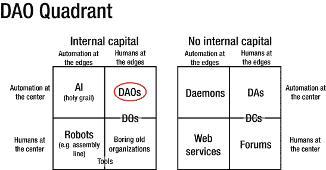
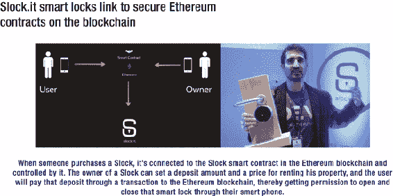
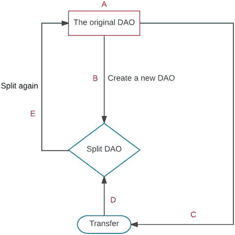

© Vikram Dhillon、David Metcalf 和 Max Hooper 2017

# 6. DAO 被黑客攻击

Vikram Dhillon^(1 )、David Metcalf¹ 和 Max Hooper¹

> 可以毫不夸张地说，“DAO 主义”正朝着成为一种准网络宗教的方向发展。 ——Vitalik Buterin¹

在第五章中，我们讨论了分散式组织的概念以及 DAO 的运作方式。在这里，我们想要强调一个历史性时刻，导致第一个 DAO 的创建以及它如何最终被黑客攻击。我们的讨论始于对分散式组织的全新视角，由 Buterin 开始，并且进入到了 DAO 革命核心公司 Slock.it 的故事。然后，我们呈现了一些使 DAO 失效的代码：与漏洞相关的智能合约片段，允许从 DAO 中进行重复提款的条件以及利用漏洞本身。我们通过讨论这次黑客事件的后果来结束本章：关于硬分叉与软分叉的争论，以及以太坊经典的创建。

## 介绍

在全球区块链社区的论述中，一直以来都以理想主义为特征，回溯到中本聪早期关于比特币作为对中央银行的回应的著作。推理线索是，易受腐败影响的系统，或者无论如何迎合少数人的愿望，如果由代码来管理，则可能更加负责任。如果那个代码存在于区块链上，那么它就不会受到少数派的有偏见的干预。沿着这一传统，在 2013 年 9 月的一篇针对比特币杂志的博客文章中，Vitalik Buterin 探索了 DAO 的概念。文章如下开始：

> 企业，美国总统候选人米特·罗姆尼提醒我们，也是人。无论你是否同意他的支持者从这一说法中得出的结论，这个说法肯定包含大量的真理。毕竟，什么是企业呢，不过是一群人按照一套特定的规则共同工作。当一个企业拥有财产时，实际上意味着存在一份法律合同，规定该财产只能根据目前的董事会的控制使用——这个指定本身可以由特定一组股东进行修改。如果一个企业做了某件事情，那是因为它的董事会同意应该这样做。如果一个企业雇佣员工，这意味着员工同意按照特定的规则向企业的客户提供服务，特别是涉及付款方面的规则。当一个企业拥有有限责任时，这意味着特定的人被授予了额外的特权，可以减少对政府的法律起诉的恐惧——这是一组比普通人拥有更多权利的人，但最终仍然是人。无论如何，一切都只是人和合同。然而，在这里，一个非常有趣的问题出现了：我们真的需要人吗？²

Buterin 的文章首次发表三年后，The DAO 以 Solidity 编写的智能合约形式出现，或许是这种理想主义的最纯粹体现。尽管 The DAO 被奉为经典，但 The DAO 并不是第一个，也不是最后一个去中心化自治组织。事实上，在 2016 年 5 月 Slock.it 的领导启动 The DAO 的创纪录的首次代币发行（ICO）时，DAO 已经作为日益主流的区块链现象的第三波被广泛建立起来。虽然许多人认为比特币是第一个 DAO，但是这两种服务的性质存在巨大的差异。尽管比特币确实由网络中的每个矿工共享的代码管理，但比特币没有内部资产负债表，只有用户可以交换价值的功能。尽管当时的其他 DAO 有资产所有权的概念，但使 The DAO 独特的是其代码的核心是定义 The DAO 如何部署其资源的根本民主进程。这是 Buterin 关于一家公司可以在没有单个雇员，更不用说 CEO 的情况下进行业务的概念的实现。来自 DAO 白皮书：

> 这篇论文阐述了一种方法，首次允许创建这样的组织：（1）参与者直接实时控制所贡献的资金，并且（2）治理规则通过软件形式化、自动化和执行。具体来说，已经编写了标准的智能合约代码，可以用于在以太坊区块链上形成去中心化自治组织（DAO）。

Buterin 在讨论自动化和资本在区分去中心化组织与传统公司之间的平衡时提到了什么。 ConsenSys 的 Paul Kohlhaas 提出了图 6-1 来说明 DAO 在自主组织光谱上的位置。图 6-1. 人类参与的自动化决策实体 DAO 实质上是从以前不包含资本的自动化实体中的范式转变过来的。使用区块链允许我们注入资本，并构建混合商业模式，我们可以针对特定用例调整自动化程度。

## 团队

在区块链世界中，像经常发生的情况一样，人们对无员工的 DAO 与编写和维护 DAO 代码的人类之间的关系的性质感到困惑。在 DAO 的情况下，这些人类是由 Slock.it 的高层领导带领的，这是一家德国公司，旨在通过他们称之为通用共享网络（USN）的技术颠覆共享经济。在成立 Slock.it 之前，该公司的首席执行官克里斯托弗·延茨（Christopher Jentzsch）和首席运营官斯蒂芬·图尔（Stephan Tual）曾在以太坊基金会担任高级职位（分别是首席测试员和首席客户官）。延茨是 DAO 代码的主要开发者，图尔则通过博客文章、会议演讲和论坛贡献成为 DAO 的代表人物。那么，他们目前的公司将如何从在以太坊上构建的无领导风险投资基金中获益？要理解他们的动机，我们必须研究 Slock.it 将区块链连接到实际世界的愿景。通过构建 USN，Slock.it 旨在在物联网技术的主流采用中发挥核心作用。通过提供一种从世界任何地方与网络上的设备进行交互的方式，希望 USN 成为超连接世界的支柱，在这个世界上，您的财产可以出租给其他人，而无需像优步和爱彼迎这样的中央化公司。相反，USN 将提供与以太坊区块链的接口，其中去中心化应用程序可以管理构成共享经济的交易。该公司打算构建一种名为以太坊计算机的专用调制解调器，用于将物联网设备连接到 USN。Slock.it 对 DAO 的愿景是创建一个去中心化的风险投资基金，该基金将投资于建立支持区块链的产品和服务的有前途的提案。撰写本文时（The DAO ICO 后的 18 个月），Slock.it 已筹集到 200 万美元的种子资金，以继续开发 USN 和以太坊计算机。根据图尔在公司网站上的博客文章，Slock.it 现在将以太坊计算机作为免费开源镜像提供给树莓派等流行的系统芯片（SoC）系统。该公司还构建并支持 Share&Charge，一项服务，该服务允许电动汽车充电站的所有者通过基于区块链的移动应用向电动汽车所有者出售电力。来自 Crowd Companies 的杰里米亚·奥扬（Jeremiah Owyang）在图 6-2 中展示的幻灯片中总结了 Slock.it 的主要用例。图 6-2。Slock.it 可以通过将物理设备（智能锁）的购买与智能合约联系起来，充当去中心化的爱彼迎。最终，这个想法被扩展成为一个去中心化的物联网平台，任何设备都可以连接到区块链上。

## **The DAO**

最初的 DAO 的构想并不是最终在其 ICO 发布的民主商业流程的激进实验。延茨在 Slock.it 博客上描述了这个过程：

> 起初，我们创建了一个特定于 slock.it 的智能合约，并赋予代币持有者对我们——slock.it——收到的资金应该做什么的投票权。经过进一步考虑，我们赋予代币持有者更大的权力，通过让他们完全控制资金，只有在对由智能合约支持的详细提案进行成功投票后才能释放资金。这已经超出了 Kickstarter 模型的几个步骤，但我们将是这个狭窄的 slock.it 特定 DAO 中唯一的资金接收者。我们希望更进一步，创建一个“真正”的 DAO，这将是资金的唯一和直接接收者，并且将代表创建类似于公司的组织，可能有成千上万的创始人。⁴

为了实现 Slock.it 和 The DAO 的脱钩，Jentzsch 设计了一个 Solidity 合约，允许任何 DAO 代币持有者提出关于 The DAO 资源如何处理的提案。所有代币持有者都可以对正在进行的提案进行投票，这些提案的最小投票期为 14 天。这意味着一旦 The DAO 的 ICO 完成，Slock.it 就必须像其他人一样向 The DAO 提交提案。其他用户可以使用 Mist 浏览器评估提案。提案的结构如下所示：struct Proposal {    address recipient;    uint amount;    string description;    uint votingDeadline;    bool open;    bool proposalPassed;    bytes32 proposalHash;    uint proposalDeposit;    bool newCurator;    SplitData[] splitData;    uint yea;    uint nay;    mapping (address => bool) votedYes;    mapping (address => bool) votedNo;    address creator;}正如你所看到的，提案——这个快速筹集 1.5 亿美元的自动化代码基础的核心——是对 The DAO 资源（uint amount）的相对简单请求。任何 DAO 代币持有者都可以通过调用 vote 函数对提案进行投票：function vote(    uint _proposalID,    bool _supportsProposal) onlyTokenholders returns (uint _voteID);来自任何地址的投票将按照该地址持有的 DAO 代币数量进行加权。如果代币持有者想要为两个不同的职位投票，他们可以将想要投票的代币数量转移到另一个地址，并再次从那里进行投票。任何投票支持进行中的提案的代币都将被锁定（无法转移），直到投票期结束。uint proposalDeposit 是提案创建者必须在投票期结束之前押注在提案上的存款（以 wei 计）。如果提案从未达到法定人数，存款将留在 The DAO。有两种特殊类型的提案不需要押金，这在 The DAO 的命运中发挥了关键作用。第一种类型是提出拆分 The DAO 的提案，有效地将提案接收者的资金提取到一个新的“子” DAO 中，该 DAO 是原始 DAO 的克隆，但在新的合约地址上。拆分提案的投票期为 7 天，而不是 14 天，任何投票支持拆分提案的人将跟随接收者，将他们的代币从原始 DAO 中提取出来并转移到产生的子 DAO 中。第二种特殊类型的提案是替换 The DAO 的策展人。DAO 策展人是在创建 The DAO 和创建任何子 DAO 时设置的地址，可以为提案接收地址设置白名单，有效地充当门卫。如果大多数人投票反对替换策展人的提案，那么支持该提案的投票可以选择坚持他们的决定，创建一个选择的策展人的新 DAO。

## ICO 亮点

最初 DAO 概念的 ICO 是一夜之间取得的成功：

+   它筹集了 1200 万个 ETH（约合 1.5 亿美元）。

+   Jentzsch 和 Tual 都承认他们从未预料到他们的想法会如此成功。

## 黑客行动

对于 DAO 易受攻击的想法已经在开发者社区中流传。Vlad Zamfir 和 Emin Gün Sirer 首先在一篇博文中提出了这个问题，呼吁暂停 The DAO，直到这些漏洞得到解决。⁷ 在被攻击之前的几天，MakerDAO 警告社区，他们的代码容易受到攻击，并且 Peter Vessenes 演示了这个漏洞也存在于 The DAO 中。⁸ 这些警告引发了一篇臭名昭著的博文，于 2016 年 6 月 12 日由 Tual 在 Slock.it 网站上发布，标题为“在以太坊智能合约中发现的‘递归调用’漏洞不会使 DAO 资金受到威胁。” 几天内，已经提出了修复 The DAO 许多已知漏洞的方案，但为时已晚。6 月 17 日，一个攻击者开始从 The DAO 中提取资金。DAO 攻击者利用了 The DAO 的一个本意良好但实现不佳的特性，该特性旨在防止大多数人对异议 DAO 代币持有者的暴政。根据 The DAO 白皮书：

> DAO（去中心化自治组织）必须解决的一个问题是，大多数人在 DAO 形成后通过改变治理和所有权规则而剥夺少数人的能力。例如，持有 51%代币的攻击者（无论是在加油期间获得的还是之后创建的），可以提出将所有资金发送给自己的提案。由于他们持有大多数代币，他们将始终能够通过他们的提案。为了防止这种情况发生，少数人必须始终有能力检索他们所持有的资金。我们的解决方案是允许 DAO 分裂成两个。如果个人或一组代币持有者不同意提案，并希望在提案执行之前检索他们的以太币部分，他们可以提交并批准一种特殊类型的提案以形成一个新的 DAO。投票支持此提案的代币持有者可以将 DAO 分裂，将他们的以太币部分转移到这个新的 DAO，而其他人只能花费他们自己的以太币。

不幸的是，由于 DAO 中的这个“拆分”功能的实现方式存在严重的重入性 bug，使得 DAO 受到了严重的漏洞威胁。⁹ 换句话说，有人可以从 DAO 递归地拆分，不断提取等于他们原始以太币投资的金额，而在原始 DAO 合约中记录他们提取的记录之前。这里是漏洞所在，如在 Solidity 合约文件 DAO.sol 中发现的：```function splitDAO(  uint _proposalID,  address _newCurator) noEther onlyTokenholders returns (bool _success) {  ...  // [Added for explanation] The first step moves Ether and assigns new tokens  uint fundsToBeMoved =      (balances[msg.sender] * p.splitData[0].splitBalance) /      p.splitData[0].totalSupply;  if (p.splitData[0].newDAO.createTokenProxy.value(fundsToBeMoved)(msg.sender) == false) // [Added for explanation] This is the line that splits the DAO before updating the funds in the account calling for the split  ...  // Burn DAO Tokens  Transfer(msg.sender, 0, balances[msg.sender]);  withdrawRewardFor(msg.sender); // be nice, and get his rewards  // [Added for explanation] The previous line is key in that it is called before totalSupply and balances[msg.sender] are updated to reflect the new balances after the split has been performed  totalSupply -= balances[msg.sender]; // [Added for explanation] This happens after the split  balances[msg.sender] = 0; // [Added for explanation] This also happens after the split  paidOut[msg.sender] = 0;  return true;}```正如所示，DAO 引用了 balances 数组来确定可以移动多少 DAO 代币。p.splitData[0] 的值是提交给 DAO 的提案的属性，而不是 DAO 的任何属性。与 withdrawRewardFor 在更新 balances[] 之前被调用的事实相结合，使得攻击者可以无限次调用 fundsToBeMoved，因为他们的余额仍然返回其原始值。更仔细地查看 withdrawRewardFor()，我们可以看到使这种情况成为可能的条件：```function withdrawRewardFor(address _account) noEther internal returns (bool _success) {  if ((balanceOf(_account) * rewardAccount.accumulatedInput()) / totalSupply < paidOut[_account])    throw;  uint reward =    (balanceOf(_account) * rewardAccount.accumulatedInput()) / totalSupply - paidOut[_account];  if (!rewardAccount.payOut(_account, reward)) // [Added for explanation] this is the statement that is vulnerable to the recursion attack. We must go deeper.    throw;  paidOut[_account] += reward;  return true;}```假设第一个语句的评估结果为 false，则标记为易受攻击的语句将运行。还有一步需要检查，以了解攻击者如何使此情况成为可能。当第一次调用 withdrawRewardFor（当攻击者有合法资金可提取时）时，第一个语句将正确地评估为 false，导致以下代码运行：```function payOut(address _recipient, uint _amount) returns (bool) {  if (msg.sender != owner || msg.value > 0 || (payOwnerOnly && _recipient != owner))      throw;  if (_recipient.call.value(_amount)()) { // [Added for explanation] this is the coup de grace      PayOut(_recipient, _amount);      return true;  } else {      return false;}```如第二个 if 语句中所述，PayOut() 引用了“_recipient”——提出拆分的人。该地址包含一个从 withdrawRewardFor() 中再次调用 splitDAO 的函数，而在该地址的令牌余额更新之前。这创建了一个呈如下调用栈的调用栈：splitDao      withdrawRewardFor         payOut            recipient.call.value()()

1.  1.拆分 DAO。

1.  2.将他们的资金提取到新的 DAO 中。

1.  3.在代码检查是否有资金可用之前，递归调用了拆分 DAO 函数。

这个过程在图 6-3 中得到了视觉上的表示。图 6-3.迭代提取过程在图 6-3 中，我们可以直观地看到迭代过程。原始 DAO 由 A 表示，B 中创建了子 DAO。然后，转移函数在 C 中请求从原始 DAO 中提取一些资金。最后，将资金转移到新创建的 DAO 中。这个过程在每次循环中重复，随着每次循环创建新的 DAO。

## 辩论

结果是，攻击者能够窃取约 360 万 ETH，价值约 5000 万美元。DAO 投资者处于特别困境之中。不仅 DAO 被破坏了，而且如果他们试图将资金提取到自己的子 DAO 中，结果的合同将具有与原始合同相同的漏洞。然而，DAO 投资者并不是唯一对这一事件结果感兴趣的人。围绕 DAO 的炒作已经达到了 2014 年 Buterin 预测的宗教级别。当时流通中的 ETH 近 5% 被投资到了 DAO。这对整个以太坊生态系统有许多影响，并引发了区块链短暂历史上最具争议的辩论之一。辩论的一方是那些希望保护初创以太坊生态系统免受持有流通中非微不足道部分 ETH 的恶意行为者的人。他们并不一定关心 DAO 是否能够生存，但最终希望确保以太坊作为一个声誉良好的区块链平台能够生存，以便将来可以在其上构建其他 DAO。这是 Buterin 和许多以太坊核心开发团队成员的立场。另一方面，致力于去中心化和不可变性理念的人士。在许多这一阵营人士眼中（我们将其称为公正阵营），区块链是一个本质上公正的系统，因为它是确定性的，并且任何选择使用它的人都默认同意了这一事实。从这个意义上说，DAO 攻击者并没有违反任何法律。相反，重入攻击使用了构成 DAO 规约的软件代码，并将其反过来对其进行了利用。去中心化阵营认为，重写区块链以撤销攻击者在子 DAO 中隔离 ETH 的行为将损害区块链的完整性。根据这种思路，区块链应该是不可变的，没有任何中央权威，包括以太坊基金会。他们担心少数人重写区块链的道德风险可能会打开其他干预的大门，比如选择性审查。双方在社交媒体和新闻媒体上激烈地辩论他们的立场。这个过程使软分叉和硬分叉的概念变得著名起来。分叉区块链或任何软件代码并不是对以太坊或 DAO 来说是新鲜事，但它成为了公正阵营和不可变性阵营之间辩论的焦点。与此同时，一群白帽黑客正在全天候工作，试图黑客的黑客。白帽团队由赞成和反对硬分叉的人组成，但他们仍然一起工作，执行了一些在 6 月 17 日之前已经确定的攻击，将窃取的 ETH 转移到新的合同中，希望将其归还给其合法所有者。白帽团队联系了那些在 DAO 中做出重大投资的人，为追踪攻击筹集资金，他们可以跟踪攻击者进入具有比攻击者能够提取的更多资金的新 DAO 中，从而在结果 DAO 中拥有多数投票权。

## 分裂：ETH 和 ETC

7 月 30 日，超过 90％的算力表示支持这次分叉。DAO 基金被归还给投资者，就好像这个组织从未存在过一样。有点像。对硬分叉的反对导致以太坊经典（ETC）的出现，作为社区的一小部分继续挖掘原始以太坊区块链。这些不可变论者致力于认为区块链代表了一种新的、颠覆性的治理模式。该运动最显著的成员是使用化名的俄罗斯开发者 Arvicco。在 2016 年 7 月接受《比特币杂志》采访时，他以这种方式描述了分歧：

> 通过救助 DAO，以太坊基金会试图达到“使投资者完整”和“提升以太坊平台信心”的短视目标。但实际上他们正相反。救助 DAO 动摇了以太坊平台的三个长期价值主张中的两个。[¹¹]

尽管以太坊社区中这个寡言少语的少数派非常顽强，但许多人并不认为区块链的两个版本能长期存活。主要交易所和加密服务开始支持 ETC，但许多人对一个本质上复制了以太坊功能的平台的长期前景持怀疑态度。Shapeshift.io 的创始人兼 CEO Erik Vorhees 对 ETC 保持关注，但他解释说，最终他认为这次分裂对区块链生态系统是有利的。他在 2016 年 11 月告诉 Decentralize Today：

> 尽管这造成了相当大的混乱（仍在进行中），但我很难说它是一个失败。社区内部的分歧现在已经得到解决，由于两个阵营都足够大，我们现在至少有两个以太坊。实际上，这使得社区更加和平，因为两个阵营不再争论谁是对的，他们两者都可以以自己的方式“正确”，市场将决定哪个产品实际上更好。我预计 ETH 将在 ETC 之上获胜，但我必须承认 ETC 的生存时间比我想象的长。

截至撰写本文时，ETC 作为一个平台和一个社区不断壮大。尽管 ETC 的升值速度不及 ETH 快，但 BTCC 和火币最近宣布将在他们的交易所上添加这个代币。ETC 开发者也加速了他们对以太坊平台的离开，发布了 Mantis，这是为 ETC 从头开始构建的第一个客户端（与以太坊的 Mist、Parity 和其他客户端不同）。

## 未来

当一个技术在被大规模炒作之后失败，要恢复该技术所支持的理念的信誉是非常困难的。DAO 的未来会是什么样子？任何投资 DAO 代币的用户都应该谨慎，但 DAO 的结构和治理已经取得了巨大的安全进步。有趣的是，Paul 还提出了 DAO 的新视角，将其视为下一代自动化风险投资公司称为去中心化基金管理者。根据 Paul 的说法，DAO 代表了一种新的金融资产管理工具，其中软件可以管理传统风险投资家通常会委托的基金。通过在核心实施基于软件的管理，DAO 获得的任何利润都直接分配给代币持有者。这个新 DAO 的成员本质上是投资者，他们将获得一种代表他们持有（或股份）和收益的新类别的代币。最终，在 DAO 中，成员可以指导资金的分配方式以及为投资提供的回报。可以合理地推断，管理基金的 DAO 将按照传统的风险投资周期运作：

+   这个过渡的第一个周期涉及使用 ETH 资金进行投资

+   第二个周期涉及将 DAO 管理为下一代自动化风投。治理模型可以为早期投资者（如天使联盟）提供新的决策能力。

我们在书的最后一章讨论了人工智能（AI）引领金融投资的理念。

## 概要

尽管 DAO 遭遇了黑客攻击，以太坊的未来依然光明。随着以太经典的出现和新发展的惊人速度，该平台正在向成熟迈进。需要注意的是，以太坊作为一个平台并不是漏洞的根源。在其萌芽阶段，智能合约代码必然会导致诸如此类的漏洞，这将促使更好的代码检查机制和安全的编码实践，以避免此类问题。未来，由于分叉的结果，我们可能会再次获得一个统一的单一货币平台，就像以前一样。参见 [`blog.ethereum.org/2014/05/06/daos-dacs-das-and-more-an-incomplete-terminology-guide/`](https://blog.ethereum.org/2014/05/06/daos-dacs-das-and-more-an-incomplete-terminology-guide/) [`bitcoinmagazine.com/articles/bootstrapping-a-decentralized-autonomous-corporation-part-i-1379644274/`](https://bitcoinmagazine.com/articles/bootstrapping-a-decentralized-autonomous-corporation-part-i-1379644274/) [`hackingdistributed.com/2016/05/27/dao-call-for-moratorium/`](http://hackingdistributed.com/2016/05/27/dao-call-for-moratorium/) [`vessenes.com/more-ethereum-attacks-race-to-empty-is-the-real-deal/`](http://vessenes.com/more-ethereum-attacks-race-to-empty-is-the-real-deal/) [`www.reddit.com/r/ethereum/comments/4p7mhc/update_on_the_white_hat_attack/`](https://www.reddit.com/r/ethereum/comments/4p7mhc/update_on_the_white_hat_attack/) [`bitcoinmagazine.com/articles/rejecting-today-s-hard-fork-the-ethereum-classic-project-continues-on-the-original-chain-here-s-why-1469038808/`](https://bitcoinmagazine.com/articles/rejecting-today-s-hard-fork-the-ethereum-classic-project-continues-on-the-original-chain-here-s-why-1469038808/)
