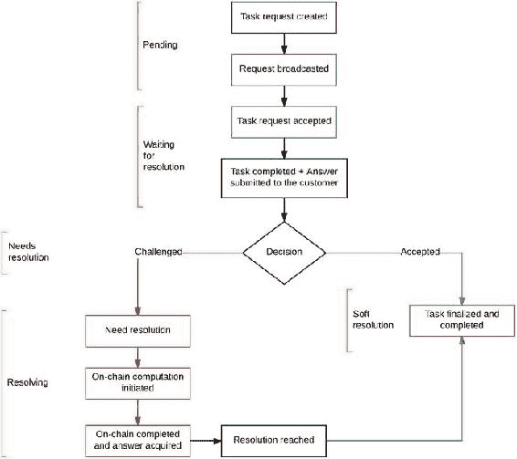
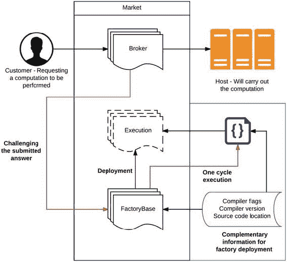
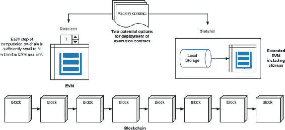
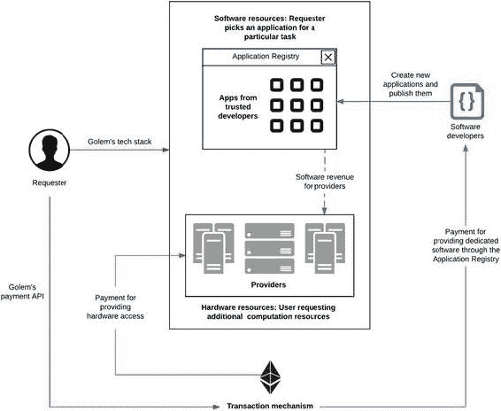
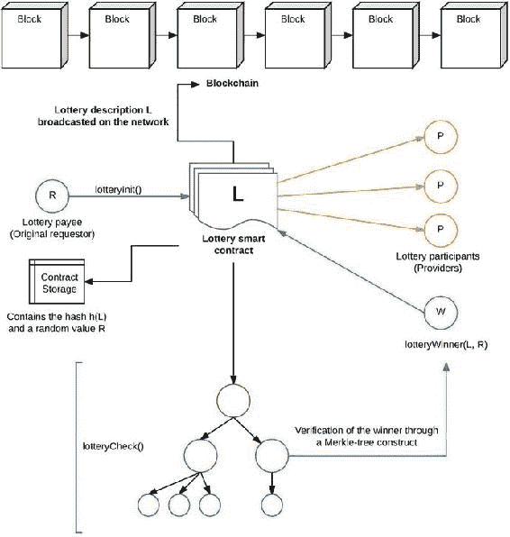
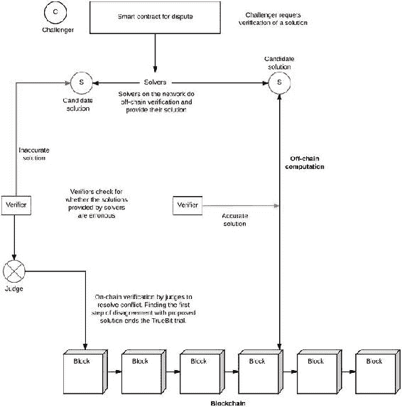
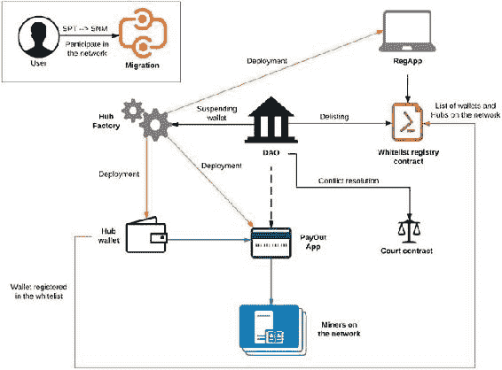

©  Vikram Dhillon, David Metcalf, and Max Hooper 2017Vikram Dhillon, David Metcalf and Max HooperBlockchain Enabled Applications`doi.org/10.1007/978-1-4842-3081-7_7`

# 7. 以太坊令牌：高性能计算

Vikram Dhillon^(1 ), David Metcalf¹ 和 Max Hooper¹(1)美国佛罗里达州奥兰多 在以太坊生态系统中，用户之间的价值转移通常通过代表数字资产的令牌来实现。以太是默认令牌，也是网络上的交易和初始化智能合约的事实标准货币。以太坊还支持创建新类型的令牌，可以将任何常见交易商品表示为数字资产。所有令牌都使用标准协议实现，因此这些令牌与网络上的任何以太坊钱包兼容。令牌通过 ICO 分配给对给定特定用例感兴趣的用户。在本章中，我们将注意力集中在为非常特定的用例创建的令牌上：高性能计算（HPC）。更确切地说，我们将讨论分布式 HPC 的模型，在该模型中，矿工提供计算资源进行任务，并以某种形式的以太令牌获得奖励。我们从网络中的令牌的概述和生命周期开始讨论。然后，我们深入探讨第一个令牌，以太坊计算市场（ECM），这是最广泛的、最全面的分布式处理系统。ECM 将成为我们使用令牌进行 HPC 的标准模型，我们将介绍诸如纠纷解决（严格和软性）和通过链外奖励验证链外处理的概念。我们涵盖的第二个令牌是 Golem，它将自己定位为未使用的 CPU 周期的 Airbnb。第一个版本，称为黄铜 Golem，将允许使用 Blender 进行 3D 对象的分布式渲染。未来的版本将实现更高级的功能，如处理大数据分析。我们在本章讨论的第三个令牌是 SONM（Supercomputing Organized by Network Mining），它将雾计算的概念扩展到创建以太坊动力机器经济和市场。SONM 已发布了一个更技术导向的路线图，重点放在神经网络和人工智能上。最初的用例将是提供去中心化的主机以运行 Quake 服务器。在本章中，我们谈论的最后一个令牌是 iEx.ec，它利用了成熟的桌面网格计算软件，以及一个将允许链外共识和资源货币化的计算证明协议。

## 令牌与价值创造

要理解令牌的概念，我们首先需要了解它们所处的背景，“**fat**”协议。“2017 年共识大会”上，纳瓦尔·拉维坎特谈到了“**fat**”协议的概念以及互联网公司与基于区块链的下一代初创公司之间的根本区别。目前，互联网栈由两个部分组成，一个是为万维网提供动力的“**thin**”协议层，另一个是建立在协议之上的“**fat**”应用层。一些最大的互联网公司，如谷歌和 Facebook，在应用层捕获了价值，但随后不得不发明新的协议和基础设施层以实际扩展规模。当互联网公司达到那个规模时，它们已经验证了其核心商业模式，并且有足够的资源用于创建新的协议。基于区块链的公司在不同的栈上运行，其中应用层是“**thin**”，协议层是“**fat**”。价值集中在协议层，只有一小部分流向应用层。Joel Monégro 和 Balaji S. Srinivasan 提出了对协议层的巨大兴趣和投资的两个可能原因：

+   共享数据层：在区块链堆栈中，底层架构的性质是通过区块链浏览器公开访问关键数据。此外，网络的每个成员都拥有区块链的完整副本，以便就网络达成共识。在实际用途中，这种共享数据层的一个相关例子是用户可以轻松在不同交易所之间切换，如 Poloniex 和 Kraken，反之亦然。所有交易所都可以平等和免费地访问底层数据或区块链交易。

+   访问代币：代币可以类比为提供对服务访问的付费 API 密钥。在区块链堆栈中，协议代币用于访问网络提供的服务，例如在 Storj 中的文件存储。从历史上看，对协议进行货币化的唯一方法是构建实现新协议且优于竞争对手的软件。这对于资金充足的公司的研究部门是可能的，但在学术界，研究的速度在早期较慢，因为创建这些协议的研究人员几乎没有财务上的机会。有了代币，协议的创建者可以通过 ICO 直接货币化，随着代币被广泛采用并有其他人在新协议上构建服务，他们可以获得更多的利益。

由于适当的激励措施、一个方便的数据共享层以及代币的应用超出了货币的实用性，开发者们正在花费大量时间解决底层协议中的困难技术问题。因此，在区块链堆栈上构建的初创公司将不可避免地花费更多的时间在“庞大”的协议层上，并解决技术挑战以捕获价值并使自己与以太坊代币的海洋中区分开来。最近，随着以太坊生态系统中更多的代币涌现，跨兼容性已经成为一个关注点。为了解决这个问题，Fabian Vogelsteller 开发了一个新的规范，叫做 ERC20。ERC20 是以太坊网络上的代币的标准接口。它描述了每个访问代币应实现的六个标准函数，以便与网络上的 DApps 兼容。ERC20 允许与以太坊区块链上的其他智能合约和去中心化应用程序进行无缝交互。只实现少量标准函数的代币被认为是部分 ERC20 兼容的。即使是部分兼容的代币也可以根据缺少的功能与第三方轻松接口。注意：在以太坊区块链上设置新代币需要一个智能合约。将初始参数和功能提供给管理在区块链上执行代币的智能合约。要完全符合 ERC20，开发者需要将一组特定的函数纳入他们的智能合约中，以允许对代币执行以下操作：

+   获取总代币供应量：totalSupply()

+   获取账户余额：balanceOf()

+   转移代币：transfer()，transferFrom()

+   批准代币的支出：approve()，allowance()

当一个新代币被创建时，通常会进行预挖矿，然后在所谓的众筹销售中出售，也被称为 ICO。这里的预挖矿指的是为代币创建者和任何为网络提供服务的方（例如，运行全节点）分配一部分代币。代币有固定的销售价格。它们可以在新协议初始阶段公开发行和销售，以筹集其开发资金，类似于初创企业使用 Kickstarter 筹集产品开发资金的方式。关于代币，我们应该问的下一个问题是：鉴于代币是数字化的，购买代币的人实际上购买了什么？基本上，用户购买的是私钥。这就是我们将其比作付费 API 密钥的类比：您的私钥只是一串字符，授予您访问权限。私钥可以理解为类似于密码。就像您的密码授予您访问存储在像 Gmail 这样的集中式数据库上的电子邮件一样，私钥授予您访问存储在像以太坊这样的分布式区块链堆栈上的数字代币。提示私钥和存储在集中式数据库上的密码之间的关键区别在于，如果您丢失私钥，您将无法恢复它。最近，一些尝试通过恢复服务恢复对帐户的访问的尝试已经出现，该服务使用可以验证用户请求恢复身份的联合签名者。最终，代币是技术的更好融资和变现模型，不仅仅是初创企业。当前，即使基本加密货币（例如以太坊）占据了更大的市场份额，代币最终也将达到市场份额的 100 倍。图 7-1 概述了为传统互联网公司和使用以太坊代币构建的区块链堆栈的公司创建价值的差异。让我们从我们的第一个代币开始，这将成为随后所有代币的模型。Consensys 的 Michael Oved 提出代币将成为每个人都在等待的杀手级应用程序：

> 如果杀手级应用程序证明了更大技术的核心价值，那么以太坊代币无疑证明了区块链的核心价值，这一点由代币为这些新业务模式带来的巨大成功所证明。我们现在正在看到一波通过代币作为区块链技术的首个杀手级应用程序而突破的推出潮。在许多方面，比特币是基于区块链资产的“概念验证”。以太坊平台正在证明这个概念的规模化。

图 7-1. 代币使用的区块链堆栈概述这一模型基于 Joyce J. Shen 对分布式分类账技术的描述。诸如 Google 和 Facebook 之类的传统互联网公司通过收集用户生成的数据在应用程序层中创建和捕获价值。区块链公司在所有权和可用技术方面有不同的动态。区块链本身提供了一种共识机制和公开可访问的共享数据层。以太坊进一步提供了一种图灵完备的编程语言和通过 EVM 实现节点之间的兼容性，EVM 可以运行智能合约中包含的指令。使用智能合约，可以构建一个完整的应用程序来运行在区块链上，一系列应用程序成为像 Storj 这样的完整分散式服务。

## 以太坊计算市场

ECM 是用于链下计算的非常简单和实用的代币，也是我们在本章中考虑的第一个代币。它作为一个通用模型，涵盖了 HPC 代币所需的所有必要特性。ECM 的设计是为了促进在以太坊虚拟机内执行成本过高的计算。本质上，ECM 是亚马逊 EC2 的分散版本。ECM 中的关键技术进步是计算市场，它允许一个用户（客户）向另一个用户（主机）支付执行链下算法并向客户报告结果的费用。此外，为了保护链下执行的计算的完整性，每个算法还具有一个链上实现。此链上组件可用于验证提交的最终结果是否确实正确。此链上实现还在解决争议方面发挥作用。让我们通过图 7-2 来看一下 ECM 请求的生命周期。ECM 使用特定于项目的一些术语来描述请求从最初接收到最终解决的生命周期。我们在图 7-2 中使用了一些此术语，以及一些额外的术语：

+   待处理：指示收到请求的状态。每个请求都从待处理状态开始。

+   等待解决：将计算请求提交到网络，并且主机计算了算法并现在正在报告结果。这是客户的决策点：要么接受答案并且请求移至软解决状态，要么挑战答案，此时请求移至需要解决状态。

+   需要解决：当答案受到挑战时，决策树将采用此路径。请求将更改为需要解决状态，并且算法的链上验证组件是必需的。

+   解决中：这是在请求进行链上计算时的中间期。请求将保持此状态，直到计算完成。

+   硬解决 vs. 软解决：一旦链上计算完成，请求将设置为硬解决状态。如果在提交答案给客户端后的一段时间内没有提出挑战，请求将被设置为软解决状态。

+   已完成：一旦通过软或硬解决方案获得答案，原始请求可以设置为已完成状态。这将解除客户端的付款限制，并允许主机接收用于链下计算的付款。

图 7-2.请求在 ECM 中经历的生命周期注读者应了解，以太坊计算市场在这里被呈现为一个通用模型，以突出高性能计算令牌的所有组件。这就是为什么我们会详细介绍计算请求的技术细节、链上和链下处理、市场动态和其他概念。在后面的章节中，所有通用组件都将被经过深思熟虑的机制和特性所取代。刚才描述的每个请求状态在此处进一步分解为工作流程。一旦任务请求在链下被处理，就会有一个关于最终答案的决定点。如果客户对主机提供的答案提出质疑，则算法的链上组件将执行，并且请求将经历一些需要解决的状态。另一方面，如果没有提出挑战，则请求将移至软解决状态，并且被视为已完成。主机在请求达到已完成状态后收到付款。既然我们已经了解了 ECM 中如何处理请求，那么让我们谈谈市场以及市场内的个别市场。我们所指的算法在链下计算的概念由三个单独的合同组成：一个经纪合同、一个工厂合同和一个执行合同。

+   Broker：一个合同，用于将客户的请求转发给将执行计算的主机。

+   Execution：用于计算验证的合同。在提交的答案受到挑战时，此合同可以执行一次链上执行。

+   Factory：一个合同，在争议解决的情况下负责将执行合同部署到链上。该合同提供相关的元数据，如重新编译字节码和验证所需的编译器版本。

市场本身具有竖直方向（市场内的市场），执行特定类型的合同和算法，利用令牌在以太坊区块链上创建特定用例的 HPC 经济。图 7-3 提供了每个市场组件的三个合同的可视摘要。在 ECM 上发出计算请求需要什么？主要有两个函数来创建请求并提供所有必要的详细信息。这里，requestExecution 函数用于创建计算请求，此函数接受两个参数。首先是函数本身的输入集，第二个是提交答案可以被挑战的时间窗口，直到请求变为软解决状态为止。此时间窗口以区块数量给出，因为以太坊中的区块在确定的时间间隔内创建。最后，此函数还指定了为此计算提供的付款。getRequest 函数返回有关请求的所有元数据。以下是从元数据返回的一些相关参数：

+   请求者地址：请求计算的客户的地址。

+   结果哈希：给定计算结果的 SHA3-哈希值。

+   可执行地址：部署在链上以解决挑战答案的可执行合同的地址。

+   uint status：给定时间点通过生命周期的请求状态。它是一个无符号整数，对应于通过数字 0 到 7 给出的请求状态。  

+   uint payment：此请求将支付的金额（给主机），以完成计算。Wei 是以太的最小单位，可在用户之间转移，类似于比特币中的 Satoshis。

+   uint softResolutionBlocks：在此区块数量的时间窗口内，必须提交对答案的挑战。如果在该间隔内未对答案提交挑战，则请求更改为软解决状态。

+   提交答案时需要提供的金额（以 wei 为单位）：这笔金额需要在提交答案时或者由质疑者质疑提交答案时提供。这笔押金会被锁定，直到请求进入最终状态，然后才会被释放回主机账户。

需要注意的是，在我们的讨论中，一些任务（例如答案验证、冲突解决和质疑）需要提供押金。这些押金用作减少网络中 Sybil 攻击可能性的对策。Sybil 攻击是指单个对手控制网络上的多个节点，并且现在对手可以操纵网络上的 PoW。图 7-3.市场的概述市场中对用户（客户）请求做出响应所必需的三个组件是经纪合同、执行合同和工厂合同。经纪合同促进了客户-主机的交互，另外两个合同在纠纷解决中发挥作用。在对提交答案提出质疑的情况下，经纪将通过其工厂合同（也称为 FactorBase，用红色工作流程显示）启动执行合同的部署，该合同整合信息并准备一周期执行算法。执行所需的 gas 将从质疑者被要求提交的押金中获取。我们接下来讨论提交和质疑过程。接下来，我们谈论将答案提交给客户以及质疑过程。对于在链下进行的计算提交答案，使用 answerRequest 函数执行。此函数以请求被答复的唯一 ID 作为输入。实际提交潜在答案需要以以太币为押金。此押金将被锁定，直到请求达到软解决或硬解决状态。我们很快会讨论涉及各方持有押金的重要性。一旦请求最终化，由提交答案的主机支付的押金将被返还，同时还包括执行计算的奖励。如果提交答案不符合客户提交的请求的预期，参与者可以对答案提出质疑。这将启动链上验证过程，该过程将在 EVM 中执行一周期的计算以验证提交的答案是否正确。如果在链上计算中发现提交的答案不正确，将从主机的押金中扣除该计算的 gas 成本。质疑者将从客户押金中获得大部分奖励，纠纷将得到解决。对于被质疑的提交答案的请求，请求将转移到需要解决状态。通过调用 initializeDispute 函数来实现这一点，该函数充当了质疑提出和链上验证开始之间的过渡。现在，经纪合同将使用工厂来部署一个初始化为此请求的输入的可执行合同。调用此函数和执行一周期计算的 gas 成本将从质疑者的押金中报销。在请求的解决状态中，将调用 executeExecutable 函数，直到链上验证完成。此时，请求将转移到硬解决状态，最终定稿。gas 费用和奖励系统可能看起来很复杂，但它遵循一个简单的原则：正确答案将获得计算的支付，而错误的提交者必须在链上验证期间支付 gas 费用。让我们回顾一下：

+   对于软解决的情况，主机将收回初始押金和客户为执行计算支付的奖励。

+   如果没有正确提交的答案，则验证的燃气费用将平均分配给提交答案的用户。奖励支付将返回最初请求计算的客户。

+   在难度较大的解决方案的情况下，扣除燃气费用后，错误的主机可以收回剩余的押金（用于链上验证）。该主机不会因计算而获得奖励。

+   如果挑战者在难度较大的解决方案中获胜，则他们将收回押金以及奖励支付。燃气费用从错误的主机的押金中扣除。

由于燃气费用，链上验证计算本质上是一项昂贵的任务。ECM 设计为离线计算比在 EVM 中运行任务更便宜。从技术角度来看，有两种类型的链上执行实现：无状态和有状态计算。图 7-4 显示了这两种实现之间的对比。图 7-4.ECM 中工厂执行合同的两种模型如果计算是自给自足的，则可执行合同是无状态的，因为它不需要外部数据源。基本上，上一步的返回值被用作下一步的输入。Piper Merriam（ECM 的创始人）提出，无状态可执行合同比有状态实现更优越，原因有两个：编写算法时的开销更低，并且由于计算周期是自我维持的，所以减少了复杂性。Piper 强调的一个例子是将 Fibonacci 序列写成无状态实现，其中算法返回最新的 Fibonacci 数作为下一个执行周期的输入。以无状态形式编写此内容的开销非常小，并且没有引入本地存储的额外复杂性。提示对于无状态合同，执行合同与作为计算市场请求的算法相同。在这里，链上验证将运行执行合同进行一个周期，并且主机将运行它多少个周期以获得最终答案。如果计算不是自给自足的，则可执行合同是有状态的，因为它需要额外的数据源和上一步的返回值。这种额外的数据源通常以持有本地存储的数据结构形式存在。让我们回到 Fibonacci 序列的例子并使其有状态。为此，算法将每个计算的数字存储在合同存储中，并仅将最新的数字返回给算法以进行下一个执行周期。执行的每个步骤都需要算法搜索上次存储的最后一个数字来计算下一个数字。通过包含存储，现在算法将搜索保存的结果并打印出已计算的任何所需 Fibonacci 序列。这种对本地状态的依赖是使合同的这一实例成为有状态的原因。有状态合同还能够实现新的和复杂的功能，如使用查找表和搜索，但也会增加编写算法的复杂性。在链上验证期间，将执行执行合同的一个周期。但是，在无状态形式下的自包含合同将高效地执行，而不会增加任何额外的复杂性。在无状态合同中，EVM 内执行的每个步骤都是基本的，因此它落在该虚拟机的燃气限制范围内。另一方面，由于执行的复杂性，一些合同需要额外的存储。在这种情况下，将执行有状态合同，其中本地存储与链上验证期间的 EVM 绑定。此存储是临时的，并且仅在链上处理的持续时间内存在。

## Golem 网络

Golem（[`golem.network/`](https://golem.network/)）是一个去中心化的通用超级计算网络。除了作为租用计算资源的市场外，Golem 还旨在支持微服务并允许异步任务执行。作为一个技术栈，Golem 通过去中心化的区块链技术栈为开发者提供基础设施即服务（IaaS）和平台即服务（PaaS）的功能。在 Golem 中，有三个组件作为去中心化市场的支柱：

+   去中心化农场：一种从个人用户（称为请求者）发送、组织和执行计算任务，以及主机（提供计算资源）之间的机制。这为用户提供了在网络访问上进行计算生成的图像（CGI）渲染和机器学习等任务的竞争价格。

+   交易框架：Golem 为开发者提供了一个定制的支付框架，用于将运行在去中心化网络上的服务和软件货币化。这个框架可以定制以采用新的创新方法捕获价值，比如在以太坊区块链上的担保、保险和审计证明。

+   应用注册表：开发者可以创建应用程序（针对特定任务），利用 Golem 作为分发渠道和市场，提供新颖独特的货币化方案。这些应用程序可以发布到应用注册表，它本质上是网络的应用商店。

Golem 在构建市场的基础上的假设是，并非所有成员都会始终请求额外的资源进行大量计算。因此，请求者可以成为提供者，并租用自己的硬件来赚取额外费用。图 7-5 概述了 Golem 中三个组件如何同步工作。目前，Golem 从以太坊继承了部署、执行和验证任务的完整性（拜占庭容错）和共识机制。但是，最终 Golem 将使用完全功能的微支付通道来运行微服务。这将允许用户以完全去中心化的方式运行诸如记事应用、网站托管甚至大规模流媒体应用等服务。在 Golem 达到成熟水平之前还需要进行几项优化工作，目前最紧迫的发展是关于任务执行。在 Golem 可以执行通用任务之前，我们需要确保计算在一个没有特权的隔离环境中进行，类似于 EVM 但具有更多功能。我们还需要白名单和黑名单机制，以及在应用注册表中识别的数字签名，允许提供者建立信任网络，并让用户运行由可信开发者加密签名的应用程序。此外，还需要一个网络范围内的声誉系统来奖励参与计算任务最多的提供者，并且检测到恶意节点并有效地缓解任务。请注意，首次发布的 Brass Golem 将只允许在网络上执行一种类型的任务，即 CGI 渲染。此版本的主要目标是验证任务注册表和基本任务定义方案。开发人员希望将 IPFS 集成为去中心化存储、为参与者提供基本声誉系统，并将 Docker 集成到网络中。  图 7-5.Golem 技术栈 Golem 技术栈的三个主要组件显示在图 7-5 中。 软件开发人员创建自动化常规任务的应用程序，并将其发布到应用程序注册表中。例如，一款限时渲染应用程序可以消除任何复杂的交易或任务跟踪的需求。买家只需进行一次性押金，然后使用应用程序直到时间用完。当买家使用注册表中的应用程序时，生成的收入用于补偿开发者的应用程序。注册表包含两种类型的应用程序：来自可信开发者的经过验证的应用程序和来自未经确认开发者的新应用程序。最终，验证者汇集新上传的应用程序并密切跟踪其是否存在可疑活动。经过几次使用后，新应用程序也获得了经过验证的状态。开发者还从在提供者节点上执行这些应用程序中获得的微小补偿中受益。提供者为应用程序征用硬件，而从运行任务中产生的绝大部分收入将返还给提供者（矿工）。交易机制确保将资金正确地交付给适当的方，并且买家通过相同的机制为任务执行付费。

### 应用注册表

应用注册表为请求者提供了一个庞大的存储库，用于搜索符合其需求的特定工具或应用程序。 注册表是以太坊智能合约，由三个实体组成：作者、验证者和提供者。 为什么要添加这三个实体的设计理念？ 对于通用计算，代码被隔离在沙盒中，然后以最低权限执行。 潜在的软件错误可能会在提供者的沙盒中造成严重破坏，然而，在虚拟机中执行恶意代码的目的是提升权限，甚至接管机器。 这就是为什么单单沙盒化对于 Golem 是不够的。 有人可能会问代码是否可以自动评估其安全性和保密性。 从理论上讲，这是不可能的。 我们无法在执行复杂算法之前确定其结果，这是由于停机问题。请注意，停机问题是指在给定任意计算机程序和输入的情况下，确定程序是否会完成运行或继续永远运行的问题。为了在主机上实现安全可信的代码执行，应用注册表分为三方，负责维护网络的完整性。 作者将去中心化应用程序发布到注册表中，验证者通过创建白名单对 DApps 进行审查和认证，将其标记为安全，而提供者则维护问题 DApps 的黑名单。 验证者还通过将应用程序标记为恶意或垃圾邮件来维护黑名单，提供者经常使用验证者的黑名单。 同样，提供者也可以预先批准某些经过验证者认证的特定 Golem 应用程序在其节点上执行。提供者还可以选择管理自己的白名单或黑名单。 Golem 的默认选项是使用信任应用程序的白名单。 第一批应用程序将由开发人员进行验证，以启动 Golem，然而，在初始分发之后，网络将依赖于验证者。 另一方面，提供者也可以选择仅依赖于黑名单。 这种方法的优点在于最大程度地扩展提供者的影响力（到市场）并提供可以在节点上执行的各种应用程序。 最终，提供者将变得专业化，并调整其节点，以在运行一种任务时变得非常高效。 这使提供者能够更好地控制其节点上运行的内容，并为计算农场提供定制的硬件选项。 最终，此选项可供想要最大化利润并愿意运行具有最新软件的专用机器的开发人员使用。 在像 Golem 这样的去中心化网络中，我们将看到传统和前卫验证者之间的分歧。 传统验证者将维护一组稳定的应用程序，执行非常常规的任务。 例如，对复杂的 3D 渲染的请求可以启动提供者节点上的可抢占式渲染实例。 一旦工作完成，实例将终止以释放内存，并将输出发送给请求者。 另一方面，前卫验证者将包括并批准推动 Golem 可能性边界的软件。 在提供者节点上运行新的和实验性软件将需要更好的沙盒化和虚拟机加固。 但是这些功能可以作为提供者提供的特殊节点上的高级附加功能。 将高级附加功能货币化还将降低欺骗者和恶意实体的积极性。 总的来说，这种设计方法使网络更具包容性，对于欺骗者来说更加昂贵，并且对于开发人员来说更具创新性。

### 交易框架

交易框架可以被视为类似于 Stripe 的东西，Stripe 是一个用于赚取应用程序运行时费用的 API。 在众筹结束后，网络将使用 Golem Network Token (GNT)来进行用户之间的所有交易，以补偿软件开发者和计算资源提供者。 交易框架建立在以太坊之上，因此它继承了底层的支付架构，并扩展到实现高级支付方案，如纳米支付机制和交易批处理。 这里提到的两项创新都是 Golem 独有的，所以让我们谈谈它们为什么对网络是必要的。 为了支持微服务，Golem 将不得不处理大量的小额交易。 单笔支付的价值非常低，这些支付也被称为纳米支付。 但是，在使用纳米支付时有一个注意事项：交易费用不能大于纳米支付本身。 为了解决这个问题，Golem 使用了交易批处理。 这种解决方案聚合了纳米支付，并一次性将它们作为单个以太坊交易发送，以减少应用的交易费用。 例如，Golem 的开发人员指出，使用单笔交易处理的十笔支付的成本约为使用十笔交易处理的十笔支付的一半。 通过批处理多个交易，将大大降低交易费用，这将传递给为微服务的每个单位使用（每个节点或每小时）支付的用户。 对于提供者来说，另一个用于支持微服务的模型是基于信用的按单位主机付费。 在这里，请求者存入了定时锁定的 GNT 押金，一天结束时，提供者会自动扣除使用费用。 剩余的信用额将退还给请求者。 在 Golem 中，纳米支付在请求者向帮助完成计算任务的多个提供者进行一对多的微支付的背景下发挥作用。 用于微服务的支付的规模为$0.01，对于如此小的金额，即使在以太坊上，交易费用也相对较高。 这里的想法是，与其进行$0.01 的单独交易，请求者（付款人）发行了一个价值为$1 的彩票，这个彩票有 1/100 的中奖机会。 这样的票价值对于请求者来说是$0.01，优点是平均而言，只有 100 中才会导致实际交易。 这是一个概率机制，允许纳米交易，但并不保证一个给定的 Golem 节点会在计算任务量较小时得到充分的补偿。 Bylica 等人提供了数学背景，以确保从这种抽奖系统的收入公平分配，当网络扩展并添加更多请求者和提供者时。 本质上，随着请求者任务的增加，节点从概率抽奖奖励中生成的收入将接近于如果以单独交易支付的金额。在 Golem 中要实施的抽奖系统对于提供者来说比完全概率性方案要可预测得多。 提供者可以确保，在用于奖励单个任务的提供者的票据中，没有哈希冲突，并且只有一个票是中奖的。 此外，如果有 100 个提供者参与抽奖支付，那么纳米支付协议保证该任务只需支付一次。 Bylica 和合作者讨论了几种反索赔机制，以防止恶意实体声称是抽奖赢家并兑现。 抽奖过程的简要概述如下。 任务完成后，付款人启动新的抽奖以支付参与提供者。 付款人创建包含唯一抽奖标识符的抽奖描述 L，并计算其哈希 h(L)。 该哈希写入以太坊合约存储。 付款人还向 Golem 网络宣布抽奖描述 L，以便每个参与节点都可以验证付款是否具有正确的价值，并检查 h(L)是否确实写入了以太坊存储。 抽奖支付的获奖者可以通过交叉参考给定描述 L 和一个对所有参与方都未知的随机值 R 来唯一确定。 一段时间后，如果奖励没有被认领，智能合约将计算出获奖提供者的地址（给定 L 和 R），并将奖金从合同的关联存储转移到获奖者。 抽奖的哈希 h(L)也将从合同存储中移除，现在可以开始新的抽奖支付周期。 纳米支付的抽奖支付系统如图 7-6 所示。图 7-6.基于纳米支付的抽奖支付系统在宏观上，Andrzej Regulski 撰写了一篇文章，描述了 GNT 背后的一些经济原理以及由此交易框架带来的代币长期升值。 他的文章中最相关的内容如下引用：

> 与 Golem 网络进行交互将需要 GNT。起初，它的唯一作用是实现请求者向提供者和软件开发者的价值转移。之后，交易框架将使得能够为代币分配额外属性，例如，将其要求用于在 GNT 中存储存款。GNT 的数量（即供应量）将无限期地固定在 Golem 众筹期间创建的水平上。之后不会再创建任何 GNT。代币的升值或贬值对网络的运营是中性的，因为用户可以自由设定 Golem 中计算资源的任何要价/出价，从而适应 GNT 价值的任何波动。固定数量的代币将不得不适应日益增长的交易数量，从而增加对 GNT 的需求。合理假设代币的速度（即在特定周期内每单位代币的交易数量）随时间恒定，可从货币数量论中得出此结论。这反过来意味着 Golem 网络的整体成功和增长意味着 GNT 的长期升值。

此支付框架也可以用作冲突解决的备用机制。如果任务挑战在经过传统的 Golem 机制后仍然保持开放状态，我们需要一种硬解决方法（正如我们在 ECM 部分所看到的）。在这里，我们可以使用 TrueBit 风格的“审判”进行最终解决。TrueBit 是一个基于以太坊的智能合约的争议解决层。它作为一个附加组件集成到了以太坊项目如 Golem 的现有架构之上。TrueBit 的设计原则是依赖于网络中唯一可信赖的资源来解决争议：矿工。使用 TrueBit 进行硬解决依赖于一个涉及被称为法官的有限资源验证者的验证子程序。在 TrueBit 的验证游戏中，有三个主要参与者：求解器、挑战者和法官。求解器提出了一个任务的解决方案，挑战者对提出的答案提出质疑，法官决定挑战者或求解器谁是正确的。使用验证子程序的目的是减少链上计算的复杂性。这是通过游戏进行的，其中每一轮都缩小了计算的范围，直到只剩下一个微不足道的步骤。这最后一步由一个智能合约（法官）在链上执行，法官发出最终的判决，确定哪一方是正确的。请注意，该方案中的法官在计算能力方面受到限制。因此，最终只有非常简单的计算会在链上执行，以供法官作出裁决。在这个游戏结束时，如果求解器实际上作弊了，它将被发现并受到惩罚。如果没有，那么挑战者将为错误警报消耗的资源付费。我们提供了验证游戏的概要如下。验证游戏的视觉指南如图 7-7 所示。注意，验证游戏是迭代进行的，奖励结构有利于勤奋搜索错误的验证者（挑战者）。准确检测和最终验证错误会使挑战者获得大量的奖金。图 7-7.验证游戏要开始试验，挑战者请求验证解决方案。求解器开始工作并提供他们的解决方案。验证者获得报酬来检查求解器是否为离线处理提供准确的解决方案。如果仍然存在争议，法官将进行链上处理，寻找与所提出的解决方案的第一个不一致之处。最后，要么作弊的求解器受到惩罚，要么挑战者将为错误警报消耗的资源付费。TrueBit 与在 ECM 中实现的链上验证相比是一种先进的链上执行机制。它允许以较低的成本验证计算，因为只有一个步骤在链上执行。使用 TrueBit 作为离线计算的争议解决层，智能合约可以使第三方程序以不可信赖的方式执行良好文档化的例程。即使对于需要大量数据的高级机器学习应用程序，如深度学习，只要训练数据的根哈希被编码在智能合约中，它就可以用于验证离线计算的完整性。TrueBit 适用于大数据集的原因仅仅是由于 Merkle 根映射了网络在给定时间 t 的状态，以及挑战者执行二分搜索的能力。对于像 Golem 这样的项目，旨在实现面向各种用例的 HPC，TrueBit 可以使大数据集在链下使用，并在链上保证输出的准确性。

## 由网络挖掘组织的超级计算

SONM 是利用区块链实现的雾计算概念的分散实现。要了解 SONM 如何在雾计算框架内运作，首先需要定义两个网络概念：IoT 和 IoE。欧洲委员会将 IoT 架构定义为具有 IP 地址并可以在网络上传输数据的普遍对象网络。IoT 适用于更广泛的“万物互联”（IoE）概念，它在现实世界和虚拟世界之间提供无缝的通信总线和环境服务。Cisco 将 IoE 定义为：

> 人、流程、数据和事物的网络连接。IoE 的好处源自于连接人、流程、数据和事物，以及这种增加的连接性所创造的“一切”上线的价值。

而   IoT 传统上是指相互连接或连接到云服务的设备，而 IoE 则是一个更加重视人作为与业务逻辑相结合的重要组成部分以生成收入的总称。从工程的角度来看，IoT 是侧重于设备之间通信的消息传递层，而 IoE 则是允许初创企业资本化人与其设备之间交互的货币化层。在 IoT 网络中连接的设备会产生大量数据。将这些数据传输到云进行处理需要庞大的网络带宽，并且在生成数据和处理数据以及接收结果之间存在延迟（从几小时到几天）。IoT 技术的一个主要限制是传输延迟期间。最近，人们越来越关注由于传输和处理阶段而导致可操作数据价值损失的问题：当我们收到这些经过处理的结果时，已经为时过晚了。Cisco 的 Ginny Nichols 提出的一个解决方案称为雾计算。雾计算通过将处理阶段转移到网络的较低层来减少传输延迟。雾计算不是将任务交给集中式云进行处理，而是将高优先级任务推送到实际生成数据的设备最近的节点进行处理。要使设备参与雾计算，它必须能够处理任务、具有本地存储功能，并具有一些网络连接性。雾计算的概念是雾靠近地面的隐喻。因此，雾计算将云延伸到生成 IoT 数据的设备（地面）附近，以实现更快的响应。在雾计算中，数据处理被认为是集中在边缘（靠近生成数据的设备）而不是集中在云中的。这使我们能够将延迟最小化，并实现对时效任务的更快响应或减少采取数据行动的时间。SONM 使雾计算这一层面可用于分布式网络的参与者以处理计算密集型任务。需要更快的数据响应时间（或大型企业收集的业务分析）推动了实时计算处理工具的开发，如 Apache Spark、Storm 和 Hadoop。这些工具允许在数据收集和传输过程中对数据进行预处理。类似地，雾计算似乎是对 IoT 的一种延伸，是对快速响应需求的响应。SONM 是建立在 Yandex.Cocaine（可配置万能自定义应用程序集成网络引擎）之上的雾计算概念的分散实现。SONM 的复杂架构设计成与以太坊的世界计算机模型相似。SONM 团队设计了这个世界计算机，其组件与传统的个人计算机并行，但有一个主要区别：这些组件连接到分散网络。

+   CPU/处理器（负载均衡器）：在 SONM 的架构中，处理器（中心）充当负载均衡器和任务调度程序。整个网络可以被表示为一系列中心节点（或中心），它们分发任务，从计算雾中收集结果，为服务支付矿工，并提供关于网络整体健康状况的状态更新。每个中心节点类似于处理器的核心，并且核心的数量（或中心节点）可以根据需要在网络上扩展或减少。在个人计算机中，核心可由处理器本地访问，但在 SONM 中，核心具有去中心化的性质。中心为整个网络提供支持，协调任务的执行。更具体地说，中心提供在雾计算云上处理和并行化高负载计算的能力。

+   BIOS（区块链）：对于 SONM，BIOS 是以太坊区块链。以太坊为网络共识和支付机制提供了可靠的基础，SONM 可以继承。然而，基本的以太坊实现缺乏负载均衡器，并且高昂的燃气成本已经激发了在区块链上的替代方案，如 SONM。

+   图形处理单元（GPU）：SONM 的 GPU 是雾计算云。更具体地说，这片雾由 SONM 网络中的矿工组成，他们为买家提供计算资源。

+   连接的外围设备：在 SONM 中，买家相当于外围设备。他们连接到网络并支付他们使用的任何资源。请求在区块链上广播，矿工选择要在他们的机器上执行的内容。然后，负载均衡器决定任务的执行。

+   硬盘：SONM 中的存储将使用诸如 IPFS 或 Storj 之类的成熟的去中心化存储解决方案实现。

+   串行总线：这个通信模块用于网络内的消息传递和数据传输，发送者（节点）和工作机器之间的通信。这个串行总线基于以太坊 Whisper，并为网络上的消息提供广播和监听功能。

+   插件电路板：插件电路板可以被视为网络的扩展包。它允许 SONM 通过无缝集成兼容的网络和计算农场来扩展其处理能力。

图 7-8 提供了刚刚讨论的世界计算机组件的视觉表示。图 7-8.SONM 实现的世界计算机通信总线形成该架构的骨干，连接到世界计算机的各个组件。通过 SONM 的请求工作流程始于买方请求计算资源。此请求广播到区块链和串行总线，以便其他组件验证特定请求是否合法。矿工接受任务，负载平衡器将任务分配到雾计算云中执行。如有必要，负载平衡器还可以通过插件板将任务分配到与 SONM 兼容的应用专用网格网络上运行。雾云还具有本地存储，例如 Storj 或 IPFS 形式的去中心化服务，根据需要使用。最后，负载平衡器还有两个更重要的角色，跟踪任务结果和整体网络健康状况。负载平衡器（中心）在任务完成后收集任务结果并将其发送回给买方。健康指示器报告世界计算机中每个组件的状态给负载平衡器和网络，以更好地决策任务分配和执行。SONM 中的智能合约系统是一组用于区块链治理和管理在网络上实现的去中心化应用程序的协议（智能合约）。这套智能合约系统维护网络的完整性，并提供了几项针对恶意实体的对策，我们稍后会讨论。此外，SONM 使用正式定义和严格证明来证明买家和提供者之间的通信的安全性（加密安全消息传递）。网络上各方之间的互动使用称为 pi-calculus 的高级数学框架进行建模。这个框架是用于描述多方系统内安全和并发交互的形式语言，通过明确定义的通道。SONM 中的治理原型包括 DAO、法庭合约、中心的网络注册表和用于将新应用程序部署到 SONM 网络的工厂合约（例如白名单、中心工厂和中心钱包）。这个模型被扩展以包括一些新元素（由工厂部署），用于管理运行在网络上的 DApps 所需。目前，在网络上购买计算资源的流程看起来非常分散。但在未来的发布版本中，买家将完成一个预购计算表单，以指示他们的硬件选择、他们想要使用的 DApps 以及任何特殊的执行参数。让我们更深入地研究当前 SONM 区块链治理中使用的完整智能合约集合。

+   SONM 代币：这是网络的默认货币。代币用于奖励提供计算资源的矿工，并用于网络内用户交易。

+   DAO：这是 SONM 的监管机构，授予用户投票权和管理去中心化应用程序的管理权限。网络上的 DApps 必须向 DAO 支付税款以获得访问权限，并获得法庭的支持。DAO 还具有执行特权，例如列入黑名单的中心、释放和锁定资金以确保矿工的适当支付，以及暂停或禁止中心。

注意：法庭将作为通过 DAO 可访问的争议解决智能合约来实施。它将提供保护，防止市场上的不公平买家或提供者，并在挑战解决方案时提供结果验证。

+   中心工厂：中心在智能合约系统中有两个扩展，一个是工厂，一个是钱包。钱包只能由中心钱包工厂创建。工厂创建一个新的钱包合同，然后将该合同注册到白名单中。

+   中心钱包：中心钱包是一个合同，用于接收买家的付款，并促成将代币支付给矿工以换取服务。该钱包由一个工厂创建，可以存在四种可能的状态之一：已创建（Created）、已注册（Registered）、空闲（Idle）或者可疑/受惩罚（Suspected/Punished）。最初，所有钱包都处于已创建状态，并拥有固定数量的冻结资金。在已创建状态下，合同可以被注册到白名单上。该合同现在切换到已注册状态，并且可以访问高级功能，例如转账和发薪日。现在，该钱包可以开始在指定的时间内支付矿工（但不能支付自己）。在支付期结束后，钱包可以使用发薪日功能将剩余资金转移到所有者的钱包中。如果连接的中心被发现进行恶意行为，DAO 可以将该中心列入黑名单，并没收冻结资金。DAO 还可以根据情况决定将钱包状态更改为可疑或受罚。

+   白名单：白名单是一个注册类型的合同，包含网络中各个中心的详细信息及其状态。工厂创建的所有钱包都注册在这个白名单合同中。最初，这个白名单作为 SONM 开发人员验证为安全可靠的受信任中心的注册表。最终，这个功能将扩展到为新兴中心开放评级。

+   RegApp：这是一个使用 React.js 制作的简单 Web 应用程序，用于中心节点注册。该应用程序将节点添加到白名单合同中。值得注意的是，RegApp 是与语言无关的，只需要一个 Web 接口来注册节点。在这个例子中，使用了 React.js，但其他 Web 编程语言同样有效。

+   PayOut 应用程序：运行在 SONM 网络上的支付应用程序，用于向矿工支付和处理他们服务所得的代币。这个应用程序是工厂合同部署的 DApp 类型的示例。

图 7-9 提供了刚讨论的智能合约系统的视觉辅助。来自 Chain Cloud 的 Anthony Akentiev 审查了 SONM 白皮书，并就使用 SOMN 代币进行众筹以资助未来版本中智能合约架构的开发提供了一些评论：

> 众筹分为 2 个阶段——预售和 ICO。19% 和 20% 的所有资金作为奖励发送给团队。开发和营销将需要相等的资金：预售后开发 34%，营销 32%；ICO 后开发 30%，营销 33%。看起来很好，很公平。结论——45/60 我读过的最好的白皮书之一。大项目。宏伟目标。预售和 ICO 将会很大。

图 7-9.SONM 智能合约系统概述回想一下，SONM 中的智能合约系统是由几个合同共同工作进一步构建的。其中第一个合同是迁移功能，允许购买 SONM 预售代币（SPT，在 Akentiev 提到的预售期间）的用户将他们的代币兑换为 SONM 代币（SNM）并参与网络。接下来是 SONM 中用于部署应用程序的中心工厂合同。在当前的实现中，中心工厂创建用于补偿矿工计算资源的中心钱包。该工厂还部署了一个全网络白名单合同，用作网络上活跃的中心和每个中心创建的钱包的注册表。最后，工厂部署了一个支付应用程序，为提供的服务向矿工释放 SNM 代币。我们在这里考虑的最后一个智能合约是 DAO，它为阻止恶意实体提供了几个管理功能。这些功能包括在欺诈行为中发现中心时将其从白名单合同中删除，通过暂停中心钱包冻结资金，或者在挑战情况下使用法院解决冲突。

### 买家-中心-矿工互动

在 SONM 网络上发布请求计算资源的任务需要买方和执行任务的矿工之间进行相当多的沟通。例如，在处理开始之前，矿工、分配中心和买方之间会进行几次验证交互。一旦买方经过验证，中心将任务分配给矿工的雾计算云，并确保矿工得到他们服务的报酬。这一系列的互动在这里被定义为客户-中心-矿工的通信。这种交流可以通过图 7-10 和 7-11 最好地进行可视化展示。图 7-10 解释了当计算开始时的矿工-中心交互，图 7-11 通过引入客户和矿工报酬提供了全面的图景。图 7-10.矿工-中心验证中心广播有关活跃中心钱包的信息以及中心所有者的 IP 地址到区块链。这些信息由一个监听代理收集，然后发送给一个矿工。在执行任何任务之前，矿工将经过一系列步骤来验证分配中心。这个过程确保中心是可信的，并且有足够的资金支付中心钱包中的计算费用。矿工通过一个全局列表，即中心池列表，请求有关分配中心的更多信息。这个网络范围的列表包含了所有经过验证和未经确认的中心。为了验证自身，中心钱包会在区块链上发送其地址和过去交易的历史作为身份验证的证据。矿工接受这个证据后就可以开始计算了。必须注意的是，这个验证过程的所有组件，包括中心的广播、验证请求、钱包信息和中心池列表都使用相同的基础设施：区块链。请求和广播通过在区块链之上构建的基于 Whisper 的消息总线与网络的其余部分共享。图 7-10 中的虚线蓝线表示在区块链上发生的过程的继续，通知传递到消息总线。除了池列表之外，矿工还可以请求其他矿工独立验证分配中心的凭据。随着时间的推移，矿工在整个网络中为分配任务的中心建立了个人评级列表。这个列表可以用来自动接受任务并跳过对高度信任中心的验证步骤。

### 超全球操作系统网络架构

买方如何知道矿工是否满足编译和运行买方请求的应用程序所需的依赖关系？买方如何知道哪些应用程序与矿工的设置兼容？这些问题由 SONM 的操作系统处理。没有操作系统（OS）来支持，世界计算机是不完整的，而 SONM 的操作系统称为超全球网络体系结构操作系统（SOSNA）。在本章中，我们只讨论了 SONM 在 HPC 服务的买方和提供者的背景下，然而，早期版本的 SONM 的第一个用例侧重于以完全分散的方式运行 Quake 服务器。路线图包括消息传递协议和下一步的支付应用程序。编译器的依赖管理和兼容性问题将通过在主机机器上使用容器来处理。容器只是一个最小的虚拟机，可以加载任何指定的配置，从安装新库到标准工具，如 GNU 编译器工具链。容器在主机系统上的最小隔离环境中运行。这样做是为了防止在容器内运行的恶意程序进行特权攻击。SOSNA 可以分为三个主要组件：由智能合约系统组成的区块链层、网格核心和一层面向消费者的应用程序。我们已经详细讨论了区块链层和 API（由智能合约启用）。让我们将注意力转向网格核心。在 SONM 中，任何与网络兼容的网格 PaaS 堆栈都可以插入以与网络一起工作，如 BOINC（伯克利开放基础设施网络计算）或 Yandex.Cocaine。网格架构的简化实现包括两个单元：多个工作/从属模块和一个主模块。这两个单元形成一个计算云，而雾计算云将这个想法扩展到部署在所有类型的机器上的数百个实例。定义网格网络的是，主机管理分布在不同地理位置的工人。主机基本上像一个中心，因为它管理应用程序在矿工机器上的执行，平衡负载，调度任务和收集结果。更普遍地，我们可以建议主模块的工作方式类似于传统矿工池。容器内执行的任何应用程序都称为服务。从技术上讲，SONM 中的所有服务都是基于 RPC 的，并接受一组特定的消息来执行指令。每个服务都有一个可以在建立连接后通过发送消息到该服务来引用的函数列表。这组函数称为服务协议。一旦服务变为活动状态，就可以从服务中动态获取协议，方法是使用定位器解析服务名称。定位器的使用可以类比于使用 DNS 进行主机名解析。在启动时，节点加载指定在配置文件中的设置，包括在该特定节点上启动的所有服务。服务缺乏通过网络进行通信的代码的能力，因此它们只能在此状态下接收消息。为了允许访问网络和基于 RPC 的通信，节点将启动一个特殊的名为定位器的服务。容器中运行的每个其他服务都将附加到定位器以接收和发送消息。一旦定位器服务被激活，它就会绑定到网络中的一个公共端点，并将连接广播到区块链。买方需要执行哪些步骤才能访问特定服务来执行他们的任务？使用定位器服务，买方需要执行以下五个步骤：

1.  1.连接到公共端口上的定位器端点。

1.  2.向定位器发送一个包含服务名称的解析请求。

1.  3. 从定位器收到一条消息，其中包含有关端点容器、协议描述和函数调用的信息。

1.  4. 接收到确认消息，指示请求信息已完成。

1.  5. 使用与定位器消息匹配的端点信息请求特定矿工，并调用所需的任务执行和处理服务。

SOSNA 组件的可视化伴随着图 7-12。图 7-12.SOSNA 架构概览我们从区块链层开始，该层为网络提供共识框架，同时具有治理的智能合约系统。接下来是消息总线层，它作为世界计算机各个组件与网络中的用户之间的双向通信渠道。该层还存在于两侧，允许区块链与面向消费者的应用程序通信，以及网格核心协调任务执行。在最顶层，我们有一个消费者应用程序层，购买者可以访问网络并发布服务请求。RegApp 是未来购买者将与之交互的消费者应用程序的早期示例。最终，消费者层将分成更多的垂直领域，具有诸如跳过用户网络中具有高声望的用户的验证阶段等功能。在相反的一端，在最底层我们有网格核心。这是 SONM 的核心，雾化云计算发生的地方。该网格本质上是几百个主从模块的并行实现。从模块运行容器，服务执行，这些服务连接到定位器。定位器在公共端口上运行，通过消费者应用层使购买者可以访问。 

## iEx.ec

我们用对 iEx.ec 平台的简短讨论结束这一章节，该平台也是一个使用特定领域区块链的分布式 HPC 代币。iEx.ec 是建立在由法国国家计算机与自动化研究所（INRIA）开发的 XtremWeb 成熟研究技术之上的。那么什么是桌面网格？桌面网格计算的理念是收集连接到网络的空闲计算机的计算资源，以执行密集型并行应用，与传统超级计算机相比，成本非常低（或者在志愿者桌面网格的情况下是免费的）。XtremWeb-HEP 是其前身的一个分散版本，旨在在矿工市场执行需要大量计算资源的任务。这个开源桌面网格堆栈属于 Cycle Stealing 家族，使用连接到网络的机器上的空闲资源来执行数据密集型应用程序。XtremWeb-HEP 实现了我们之前看到的 HPC 代币中大多数必要的功能：容错性、混合公共-私有基础设施、虚拟镜像（容器）的部署、负载均衡和矿工的支付机制。网络上运行的 DApps 将依赖于 iEx.ec 架构，自动搜索运行应用所需的所有计算资源，分配资源，并向适当的各方释放资金。使用一个成熟和经过充分测试的软件堆栈带来三个主要优势：

+   韧性：如果一个计算节点失败，任务可以重新分配给其他工作节点，并在最小的停机时间内继续。

+   效率：尽管工作节点之间的硬件配置发生变化，但网络上应用的基本性能仍然很高。

+   插件式节点：新节点可以添加到网络中，而无需任何特殊配置，并在快速设置后成为集成的节点。

在 iEx.ec 中，发生在外部或链外的任何操作都被称为贡献。例如，提供数据集、传输文件和执行计算都是需要在相关方之间进行代币交易的操作。我们如何知道操作是否确实正确地进行了？如何将特定的交易或一组交易与链外执行的特定操作相关联？需要一个新的协议来验证贡献是否发生以及哪些交易与之对应。iEx.ec 提出了作为链外贡献的新共识机制的贡献证明。这种新机制还在使 iEx.ec 中的企业功能成为可能，被称为服务级别协议（SLA）。使用 SLA 可以跟踪资源利用情况，并允许客户向提供者下达受信任的计算资源订单。iEx.ec 团队预测，在使用 iEx.ec 区块链的 DApps 中，向网络上的各方分发内容将是一个非常重要的功能。购买方将通过智能合约在区块链上获得对复杂数据集的访问，并获得运行其应用程序以及访问数据集的简单支付结构。通过贡献证明，iEx.ec 可以保证内容提供者确实提供了对数据集的访问，并且在处理过程中文件是可访问的。为了支付目的，访问的持续时间也可以记录下来以保护购买方免受过度收费的影响。此外，iEx.ec 还将采取几项针对声称文件传输失败的恶意实体的对策，以减少数据费用。iEx.ec 的最初几个版本将集中 consoli 核心功能和一个需要 HPC 的金融交易用例。这项服务名为 eFast，将使用复杂的计算预测方法，使小型投资者能够做出更好的交易决策。目标是使用不同股票的聚类分析创建多样化的投资组合，但这种分析的计算复杂性非常巨大，只有大型金融机构才能负担得起。像 iEx.ec 这样的去中心化服务可以将处理成本降低到传统计算农场的十分之一。请注意，Golem 和 iEx.ec 在产品开发目标上有类似的目标，但在业务方法上有所不同。Golem 的目标是构建网络的核心基础设施，并吸引 HPC 和云客户。另一方面，iEx.ec 首先专注于构建将在网络上运行的 DApps，以吸引对这些应用程序有需求且以更便宜的价格提供的常规云客户。任务如何分配和执行在 iEx.ec 上？有两种算法来管理这个过程，一个用于执行的匹配算法，另一个用于分配的调度器。让我们简要谈谈这两个算法。匹配算法在分布式系统中用于根据购买方提供的资源描述匹配资源提供者和潜在购买方。回想一下，在 SONM 中，这项任务由负载均衡器接管；然而，在 iEx.ec 中，一个算法执行资源配置。最终，开发人员建议将描述计算资源可用性和运行任务所需资源的智能合约存储在区块链上。这可以包括可用的 RAM、处理器或 CPU、磁盘空间和 GPU 类型等信息。对于主机，任务将部署到虚拟机实例或 hypervisor，并且购买方将指定运行时指令。匹配算法可以实现更复杂的策略，而不仅仅是简单的一对一匹配，iEx.ec 可以从更复杂的匹配中获利。有几种匹配算法的设计选择，但 iEx.ec 将使用一个称为 ClassAd 的语言，这在科学文献中已经经过了良好的测试。第二个算法是调度器，对于任何分布式计算系统来说都至关重要。网络的性能和可扩展性取决于其调度器的有效性。iEx.ec 的设计挑战是创建一个启用多标准决策分析的调度器，它可以为每个任务选择最佳计算资源并适当安排以符合购买方的标准。多标准可能根据成本与性能基准来满足客户需求。一个客户可能希望在计算时间较长时最小化计算价格，而另一个客户可能希望最小化所需时间。这些是 iEx.ec 中调度器将处理的场景类型。一个多功能的调度器和高效的匹配算法允许在 HPC 的核心区块链技术上进行非常有趣的升级。一个显著的例子是能够使用特定领域的区块链（或侧链）。侧链是一个可适应的区块链，设计用于满足特定基础设施要求，以运行在广义环境中表现不佳的应用程序。这种区块链的目标是最大化性能，并最小化执行之间的任何时间延迟。通常，一个应用程序会通过标准的区块链进行；然而，如果提交了大量任务，一些任务可以被卸载到侧链进行跟踪。侧链将跟踪在主机上花费的时间，并将信息报

## 总结

在本章中，我们从 HPC 应用的角度看了以太坊代币。我们首先介绍了在以太坊上将代币作为应用的市场效用和理由。然后，我们讨论了原型 HPC 代币 ECM。该代币执行了在由专门买家运行的集群中客户可以购买计算能力的计算市场中所需的所有基本功能。该代币允许在透明的计算能力市场中进行争议解决和链上验证。然后，我们深入研究了更复杂的计算代币，如 Golem 和 SONM。我们详细描述了这两者，涵盖了主要的技术进步以及这两个代币之间的区别。最后，我们总结了涉及 iEx.ec 的内容，该项目建立在经过多年测试的分布式云计算软件上。iEx.ec 团队实现了 Xtreme-Web HPC 的分散版本，以执行与 Golem 和 SOMN 相同的任务并启用计算市场。

## 参考资料

编写本章的主要参考资料包括 ECM GitHub 文档、Golem 白皮书、SONM 白皮书、iEx.ex 白皮书以及 Fred Wilson 在代币上的博客文章。
