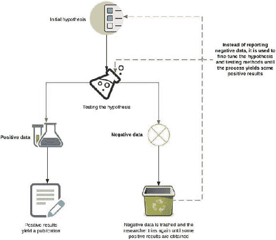
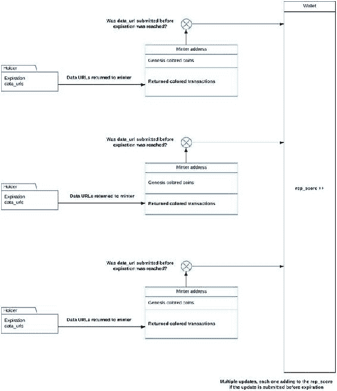
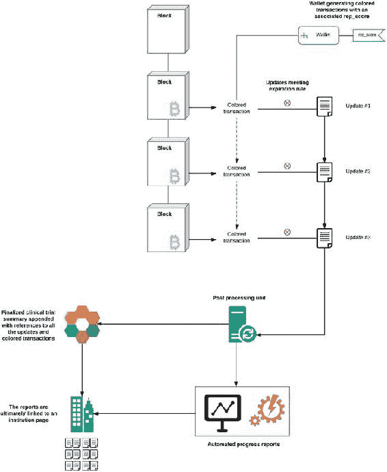

©  Vikram Dhillon, David Metcalf, and Max Hooper 2017Vikram Dhillon, David Metcalf and Max Hooper 区块链启用的应用`doi.org/10.1007/978-1-4842-3081-7_8`

# 8. 科学中的区块链

Vikram Dhillon^(1 ), David Metcalf¹ and Max Hooper¹(1)奥兰多, 佛罗里达州, 美国基于证据的临床科学目前正在经历一场瘫痪性的可复制性危机。从临床心理学到癌症生物学，最近的元研究表明，研究人员无法复制同行发表的研究的情况正在增加。这个问题不仅局限于在实验室进行的台板工作；它也困扰着转化研究，在这里，从实验室到病床的转变发生。治疗方法，检测和技术被转化为政府批准的影响数百人生活的设备和测定。因此，可复制性对将科学突破转化为实用疗法至关重要。区块链技术在开放获取科学新兴领域中的主要角色是增加对流程的透明度。为此，本章介绍了三种用例和应用：第一种涉及在临床试验中存放数据，第二种涉及可以为致力于开放研究的研究人员和机构开发的声誉系统，第三种涉及供应链管理的应用，用于追踪假药。我们首先讨论研究方法的当前范式和负面数据的重要性，我们的重点主要限于临床科学。然后，我们讨论目前实施的用于衡量发表研究影响的传统指标和替代指标系统。这使我们能够过渡到补充传统指标并扩展它们以使开放科学成为基本特征的用例。最后，我们通过审视心理学研究中整合预测市场以验证研究的持续努力，以及如何使用 Augur 创建预测市场来结束我们的讨论。

## -   可复制性危机

让我们从科学论文和研究背景下重新审视可重复性的含义开始我们的讨论。在研究中的一个主要基石是能够遵循研究中的书面协议，使用记录的方法来进行实验，并得出与该研究给出的相同结论。换句话说，可以通过其他研究人员独立验证已发表的研究，并复制以得到相同的结果。最近在临床科学领域的元研究表明，越来越多的已发表作品在实验上不够严谨，不能轻松复制。Freedman 等人估计，超过 50％的临床前研究无法从动物模型转化为人类临床试验，因此仅在美国每年因不可重复性而产生的费用约为 280 亿美元。因此，由于动物模型中的临床前发现很少在临床试验中重复，药物发现已经放缓，并且成本急剧上升。经济成本非常严重；每年因无法复制而浪费近 2000 亿美元。这些问题通常固有于特定研究的设计中，或者是由于在不同细胞系上进行实验时出现的非常真实的复杂性和复杂性。要理解其中原因，我们必须在元研究中寻找答案，这是一种统计评估研究中所提出的主张、结果和实验的分支。在学术界，许多因素正在创造一种“糟糕科学”的恶性文化，正如 Ben Goldacre 博士所说的那样：一个逐渐消失的资金环境，一个“发表或灭亡”的文化，以及获得终身教职的巨大压力推动年轻研究者遵循错误方法以获得发表机会。在某些情况下，草率的研究方法和操纵导致了欺诈，最终导致了对研究人员的严重后果。注意 Retraction Watch（[`retractionwatch.com/`](http://retractionwatch.com/)）是一个最近出现的博客，报告了从期刊编辑到大学个人研究员发生的科学不端行为。该博客还跟踪了因数据欺诈或操纵实验证据而从期刊中撤回的论文。感兴趣的读者可以关注他们的网站，该网站每年发布大约 500 到 600 篇撤回通知。学术期刊也部分地应对了这一混乱局面，尽管有真正改变和改进的迹象。在过去的几年中，发表关于潜在药物靶点或特定药物有效性的正面发现的研究变得更加容易。然而，负面实验结果，例如期望的药物靶点不起作用的情况，却非常难以发表。乍一看，似乎是有道理的：为什么有人想知道实验失败了呢？由于类似的推理，负面数据通常被忽略，从营销的角度来看，期刊声称某些事物不如预期地发挥作用并不是一个可以出售的亮点。让我们更详细地了解正面和负面数据在期刊如何塑造它们的使用和发布的情况。正面数据仅仅是确认最初的假设，研究人员预测了一个发现，而数据证实了这一点。另一方面，负面数据来自于没有观察到预期或期望效果的情况。如果一个实验显示在零假设和备择假设之间没有差异，那么这些数据和结果很可能最终会被埋在实验室小组未发表结果的堆中。图 8-1 提供了一个非常简化的概述，说明了在学术压力下处理正面和负面数据的错误研究方法。在追求需求量很大且具有吸引力的药物靶点时，复制被牺牲了，这些药物靶点最终无法很好地转化为临床试验，并导致更多的经济浪费。图 8-1. 发布研究中正面和负面数据概述图图 8-1 中的流程图是假设检验的简单演示，它导致了“错误研究”被发表，并且在转化研究或扩大临床试验中无法复制。由于在学术期刊中发表的性质，正面数据通常意味着你已经完成了。大多数研究人员会停在这里，并且不会费心跟进所收集或生成的所有数据的任何相当比例。这可能包括有关没有奏效的思路或由于审稿人反馈而被省略的信息。一旦一

+   最低出版标准：印刷期刊对刊载空间有特定要求，每篇研究论文的页数也是有限的。在这种情况下，研究人员更注重提出大胆的主张并展示证据支持他们的猜测。通常情况下，这是以缩短提供其他研究人员复制实验指导的方法部分为代价的。最近，大多数期刊已经转移到了在线平台，空间已经不再是一个问题，尽管补充材料的质量仍然不足，即使它们是可以获得的。BioMed Central 发布了一份必须满足的最低标准检查表。这个检查表的目的是提供一定程度的标准化，使研究人员在编写论文时掌握特定的标准来增强可重复性。如果所有的标准都得到满足，发表的研究很有可能会得到更高程度的复制。

+   数据发现指数：前文提到的一个主要问题是缺乏鼓励研究人员提供补充数据的动机。美国国立卫生研究院（NIH）试图创造一个新的衡量标准，以奖励研究人员上传额外的实验数据，称为数据发现指数（DDI）。这是一个可引用的数据存储库，研究人员可以在其中公开与他们的研究相关的额外数据点。对于学术研究人员，一个巨大的动机是为他们的工作获得额外的引用，这反过来就成为一篇发表研究的影响度的衡量标准。通过使数据库具有可引用性，NIH 为研究人员提供了额外的激励，以投入更多的时间和资源来上传未发表的数据库。

+   可重复性项目：癌症生物学：开放科学中心与科学交流合作，将研究 2010 年至 2012 年间癌症生物学领域的高影响研究，并在科学交流会员的帮助下复制每一项研究。对复制实验、发现药物靶点等的全文报告将会公开，并附有详细的方法。这个项目分为两个阶段。第一阶段以注册报告告终，记录了执行特定实验的标准化方案。第二阶段涉及科学交流会员机构之一使用注册报告进行实验，并记录结果。最终，报告和数据都会在 eLife 期刊的评审者审核后在网上公开。

这三个举措是一个大规模协调的努力的例子，旨在增强可重复性，还有更多的即将到来。到目前为止，我们已经讨论了学术环境中出现的问题，这些问题导致了负面数据和正面数据的不同处理，这是可重复性危机的核心，以及由此引起的困难。接下来，我们开始谈论在药物试验案例中数据操纵造成的更严重后果。临床试验的数据点决定了将影响成千上万人的药物的命运。获取所有相关数据不仅对准确地开药物处方至关重要，而且还要避免过去已经解决的陷阱和途径。注意 Ben Goldacre 博士在一次 TED 演讲中讲述了关于 1980 年代发布的药物洛卡因的故事。它本来是一种抗心律失常药物，可以预防曾经患过心脏病的人出现异常心律。进行了一项小规模临床试验，参与人数少于 100 人，不幸的是，其中有十人死亡。这种药物被认为是一种失败，并且商业开发停止了。从这次失败的临床试验中得到的数据从未发表。在接下来的几年里，其他制药公司提出了类似的抗心律失常药物的想法，并将其投放市场。据估计，有 10 万人死于这些新药物也导致死亡率增加。1993 年，进行了最初的 1980 年研究的研究人员站出来并写了一封致歉信，提到他们认为最初试验中增加的死亡率是由于偶然事件。然而，如果这次失败试验的数据已经发表，他们本可以提供早期警告并防止未来的死亡。这只是出版偏见非常严重后果的一个例子。我们将在下一节中讨论这种情况的一般化版本。

## 临床试验

我们已经描述了由于临床试验中数据报告存在缺陷而产生的一些复杂情况，现在我们开始概述一个潜在的解决方案。在这一部分中，我们重点关注三个具体问题，并提供了每个问题中整合区块链技术的用例。

+   试验注册：当临床试验开始时注册临床试验，提供及时更新，并将相关结果存入公共数据库对于为临床医生提供对无效的标准药物开药的患者提供选择至关重要。即使涉及人类参与者的大规模临床试验应该进行注册，但往往这些试验仍然失踪。未注册试验的数据的唯一迹象是一篇发表的论文，或者可能是一些高度定制以证明所提倡的候选药物有效性的实验和结果的论文。这种出版偏见可能以一种危险的方式误导临床医生；因此，我们需要激励调查人员定期发送来自注册临床试验的有关进展和任何相关临床方案的更新。

+   比较药物疗效：如今，在大多数临床环境中，医生面临越来越多的药物选择，但往往缺乏头对头临床试验的证据，这种试验允许直接比较一个药物与另一个药物的疗效或安全性。计算模型允许对大型数据集进行并行处理，进行一种称为混合治疗比较（MTCs）的分析。这些模型使用贝叶斯统计学来合并药物的可用数据，并生成有关所比较药物的探索性报告。这可以成为自动比较的基础，因为更多的数据从未发表或不可用的信息孤岛中解放出来。

+   后处理：在某些情况下，当一项试验被注册并提供一些与出版物有关的补充数据时，注册表更像是数据转储而不是有组织的数据存储。最近，我们看到了更加精心准备和发布的后分析摘要，但这通常是个例而不是规则。关键在于一旦将临床试验数据与区块链关联起来，它们就可以被纳入自动化工作流程中。现在后分析摘要和数据可以由算法而不是人员生成。用于存储数据的通用后端可以促进前端客户端的发展，它们可以读取区块链并使用适当的公私钥对从外部源下载追加的数据，并在本地进行后处理。之后，摘要报告可以再次追加到区块链中。

注：索恩克·巴特林和海德堡的一些合作者一直在不懈地利用区块链技术进行开放科学创新。最近，他们成立了一个名为 Blockchain for Science 的智库，旨在加速区块链技术在开放科学领域的应用。有兴趣的读者可以在他们的网站 blockchainforscience.com 上找到更多信息。让我们开始讨论利用区块链使临床试验更加透明的可行解决方案。更具体地说，通过实现彩色硬币来使临床试验数据可用于区块链。比特币中的脚本语言允许将小量元数据附加到区块链上。彩色硬币是一种利用区块链基础设施附加静态元数据的概念，这些元数据可以代表具有现实价值的资产。我们将彩色硬币作为度量标准，引入稀缺性，并激励上传额外数据、定期更新等行为。在我们更深入了解彩色硬币之前，让我们看看它们的特殊之处。有三个关键组成部分。

+   着色方案：彩色硬币数据的编码方法是从区块链中编码或解码的。

+   资产元数据：这代表附加到彩色交易的实际元数据，这些数据被存储在区块链中。稍后我们会介绍一个例子。新的彩色硬币协议允许向彩色交易附加潜在无限量的元数据，通过使用提供分散方式分享和存储数据的种子。

+   规则引擎：过去，元数据只包含附加到彩色硬币的静态信息。然而，最近添加了一个新的规则部分，该部分通过我们的规则引擎支持额外的逻辑层，解锁了智能合约对彩色硬币的功能性。目前支持四种类型的规则，稍后将进行讨论。

这是向彩色交易添加的元数据的通用语法：{ metadata: {...Static data goes here...}, rules: {...Rule definitions go here...}}我们将在解决方案中使用规则引擎的两个规则：过期规则和铸币规则。 过期规则用于借出资产，并规定了资产的寿命。 过期后，资产将返回具有有效到期日的最后输出。 铸币规则授予接收者发行更多相同资产的权限。 因此，接收到彩色硬币的铸币者可以进一步向网络中的其他人发行更多的彩色硬币。 这两个规则在引入稀缺性方面发挥着重要作用。 稀缺性扮演了什么角色？ 要理解这一点，我们需要看看这种情况中的两个参与者：持有者和铸币者。 持有者是彩色硬币的另一个规则，指定了哪个地址可以持有资产，我们已经描述了铸币者。图 8-2 描绘了研究员注册临床试验、提供更新，并由铸币者确认接收更新，随后请求继续下一阶段试验的互动。 让我们逐步走过图 8-2。 临床试验始于我们的研究员注册试验，这启动了从铸币者到持有者（我们的研究员）的起源彩色交易。 该交易附带了一个过期规则，这在某种意义上是与给定临床试验相关的几个阶段中的一个的截止日期。 研究员必须将带有更新或新数据的元数据的 URL 发送回铸币者。 当铸币者收到此交易时，将对资产是否已过期进行评估，并导出结果。 我们将在下一节讨论此返回交易的结果。 在此返回交易之后，铸币者为下一阶段向持有者发行更多的彩色硬币，循环重复。 试验的每个阶段都会导致持有者发送的元数据中追加更多的数据 URL，以示持续更新的迹象。提示彩色硬币协议的规则引擎也是元数据的一部分，不直接存储在区块链上，而是使用种子以纯文本 JSON 格式存储。 种子提供了一种分散机制来共享数据，并使规则能够与区块链之外的对象交互。 我们在这里将铸币者抽象为一个 oracle，但实际的实现将涉及自动评估器和智能合约的混合。 图 8-2 中可视化的整个过程可以被认为是构成我们浏览器中对称加密的 SSL 握手的基础的确保服务器-客户端交互的特征。 或许在未来，人们可以推断； 如果这种类型的交互变得普遍，它可能会成为彩色硬币钱包的一个功能。 铸币者地址的评估组件可以成为一个专门的钱包或一个新的客户端，类似于新协议被包含在浏览器中。 这个过程通过强制执行过期规则可以创建人为稀缺性。 持有者（研究员）必须返回带有与更新相对应的数据 URL 的彩色交易。 铸币者对持有者的状态进行评估，然后确认接收更新。 为下一轮更新发行新硬币，整个周期重新开始。 评估器的结果被导出，并将用于构建我们稍后讨论的声誉系统。现在我们已经讨论了彩色硬币的交互，让我们来看看图 8-3 中的整个临床试验系统。过程始于注册以及对临床试验将涉及的内容、所使用的方法以及可以预期的数据或结果的提议摘要。 摘要信息连同批准的协议在试验开始前追加到区块链上。 这完成了注册过程。 使用彩色硬币和规则引擎来管理研究人员的更新。 在经过轻量级隐私保护检查后，这些更新被追加到区块链上。 一旦临床数据在一个共同的后端上，最重要的好处也许是将重点从持有数据库的后端客户端简单地转移到只需开发能够读取区块链的前端客户端。 数据的管理将在区块链内自动进行； 我们所需要的只是一种机制来读取元数据中留下的标签或面包屑，以知道从外部位置拉取什么进行进一步处理。 这种情况的一个示例是图 8-3 中显示的后处理单元。 该单元包含适当的公钥-私钥对和权限，以读取区块链并访问外部位置。 与追加数据更新到区块链的脚本相同，后处理脚本还包含了一个用于后处理的段，告诉后处理单元如何将来自各个第三方位置的数据集

## 声誉系统

让我们重新审视稀缺性的概念。对于我们来说，建立临床试验系统至关重要，然而，引入带有到期规则的有色硬币也使我们能够构建另一个组件，声誉系统。声誉的前提只是跟踪遵守到期规则。回想一下，我们在评估器功能中构建了一个导出功能，而在这里，我们可以将导出用作一种计数机制，以奖励那些在发送定期更新方面积极主动的研究人员（或有色硬币协议中的持有者地址）。在实际应用中，这个导出计数器将在建立了定期更新后由铸造者添加到元数据中。从这里开始，建立声誉是一项直截了当的任务：较高的导出计数器对应于更好的声誉。重要的是要注意，对于我们的临床试验系统，声誉只是作为设计的一个属性而出现，但它对于可再现性有着一些深远的影响。高声誉表明一个机构或一个研究团队对质量控制的承诺。一旦声誉机制在区块链上网络范围内实施，就可以在外部引用它：第三方服务可以请求与特定有色钱包关联的声誉分数。这可以简单地是一个 API 调用，以返回钱包的 rep_score。这有什么用处呢？在我们的讨论中，我们早些时候提到了 DDI，这里我们希望将 DDI 的概念从仅仅是一个数据存储库扩展到一个带有 rep_score 标签的存储库。这可以为 DDI 提供另一层次的细化：与公开可用的临床试验相关的数据集上的声誉分数标签（高或低）。请记住，在这个设计中，所有来自临床试验或更新的数据都驻留在 DDI 存储库中；然而，rep_score 存放在区块链元数据中，通过有色交易。图 8-4 描述了每个定期更新中正在进行的顺序评估以及 rep_score 的逐渐增加。图 8-4.rep_score 随着每个定期更新的综合评估功能检查到期规则，并且如果持有人进行的有色交易包含与元数据中的更新相对应的 URL，则满足这两个条件，则更新持有人的钱包的 rep_score。这种缓慢增加允许声誉随着时间的推移而建立，并且 rep_score 参数可以从外部服务中以与区块链无关的方式引用。API 调用可以成为将最新的 rep_score 附加到 DDI 中存放的数据库的默认方式。现在我们对 rep_score 机制有了更好的了解，让我们看看完整的声誉系统。图 8-5 提供了声誉系统及其对整个成员网络的影响的全面描述。图 8-5.声誉系统它始于区块链记录有色硬币协议中发生的铸造者和持有者角色之间的有色交易。这些有色交易每次持有者提供更新时都会发生，铸造者对其进行评估。在初始更新之后，铸造者将 rep_score 作为返回的有色交易的一部分发送，以继续临床试验的更新过程。声誉现在随着每次交换而修订到元数据中，而 rep_score 每次都会修订。这个分数最终可以成为持有者钱包的一个属性，并且通过这种方式，它可以从区块链外部被引用。在临床试验成熟到足以产生足够的更新并可以编制成一份全面概述之后，后处理单元变得重要起来。这个单元的目的是自动执行质量控制统计计算，并根据在试验开始时添加到区块链的脚本中的指令共享更新。类似地，后处理单元将编制最终摘要，并将其附加到机构的页面上，以及从临床试验中共享的所有更新。注意必须指出，后处理和数据存储都是在区块链之外执行的功能。没有计算或数据操作在区块链上执行。我们希望尽可能地将区块链可执行代码限制在必要的原语上。唯一与区块链上的交易或元数据交互的工具是为了更新变量或参数的分布状态。

## 制药品追踪

本章的最终用例涵盖了通过供应链管理框架跟踪制药品。处方药监控计划是控制药品购物的重要因素。梅奥诊所将药品购物定义为患者在未告知临床医生的情况下从多个医疗保健从业者获取受控物质（通常是麻醉品）。这导致了大规模的药物滥用或销售，梅奥诊所将药品购物归因于以下三个因素。

+   数据的及时性不佳：药房或提供者将处方数据上传到其现有的中心化系统有多频繁？基于区块链的后端将使所有网络成员即时获得与所有交易相关联的药物。

+   可靠性：与中心化数据库相比，区块链天生去中心化，因此不存在单点故障。因此，数据不会存储在单个数据库上，使其更加可靠。

+   数据检索的复杂性：当前的数据检索模型与现有医院系统的兼容性完全破碎。医院通常与药房使用的数据库不同步，并且更新是一项艰巨的任务。区块链通过为外部服务提供一个通用后端来使该过程变得普遍。

在这个系统中，当临床医生开具处方时，提供者可以检查区块链以查找任何当前有效处方的患者记录。这可以帮助临床医生确定患者是否从多个来源获取处方，或者是否另一家庭成员正在获取相同的处方。来自另一提供者的有效处方将自动使新处方的请求失效，这可以在网络中编码为双重支出请求。否则，交易将通过，药房将收到向患者提供药物的请求。请求的提供者和患者可以签署交易，从而实现对特定患者的护理的更好追踪。虽然这个系统看起来很简单，但它满足了大多数药品供应链安全法案（DSCSA）兼容系统的要求，可以在提供者之间实施。一些正在进行的工作旨在通过 IBM 和 Deloitte 区块链实验室等主要区块链参与者控制阿片类药物过度处方流行病。最近，一些专注于使用区块链跟踪制药品的新创企业应运而生。尽管供应链管理最符合区块链基础架构并且开箱即用，但该领域非常新，技术尚不成熟。新技术使得药品追踪和开放式科学的未来看起来更加有希望，这些技术实现了以前从未可能的通信层次。如果不是其他，区块链已经成为开放科学探究和讨论的巨大推动力。

### 预测市场和奥格

在本章中，我们讨论了声誉作为一项关键参数，对研究人员负责任地提供可增强已发表研究可重现性的额外科学数据起着重要作用。实现这一目标的关键挑战是为研究人员提供激励，以便从公开其数据中获益。让我们看看学术界目前的一些努力，这些努力将使区块链与现有基础设施的整合更加可行。在 2015 年，一个大规模的众筹复制工作正在进行，以验证来自 100 项心理学研究的关键发现。在此努力结束之前，一些研究人员为 44 项研究填写了一份调查表，表明他们认为该研究的主要发现会成功复制的可能性。同样的研究人员还参与了一场赌博游戏：他们获得了 100 美元的资金来购买和交易正在进行的复制努力的合约。每个合约如果关键发现成功复制将支付 1 美元。调查和赌博游戏的数据被收集并发表在《美国国家科学院院刊》（PNAS）上。结果发现，调查预测准确率与抛硬币的准确率相当。然而，如果研究人员参与同一问题的赌博市场，数据会给出一个良好的预测（准确率约为 71%），即哪些研究在复制时会持续存在。市场方法可能比调查更准确，原因有两个：首先，有货币激励使人们下最佳注，其次，市场使人们能够从其他玩家那里学习趋势并调整他们的赌注。PNAS 研究的作者建议可以使用预测市场来决定应优先复制哪些研究，因为它们存在不确定性。他们警告说，预测市场不能可靠地预测哪些个别发现是准确的，但可以用来估计当前发现的可信度，并制定一份待复制的研究排序表。建立预测市场需要一个平台，这就是 Augar 的用武之地。Augar 是一个运行在以太坊区块链上的去中心化预测市场平台。Augar 上的价值交换是 REP 代币或声誉。REP 被裁判（也称为报告者）用于报告平台上的事件结果，以太币被其他用户用于在市场上下注。在 Augar 上，预测市场分为两个阶段：预测和报告。最初，用户提供一些资金来创建一个预测市场，以解决一个事件结果或问题，并开始预测期。其他用户在此期间下注，事件成熟。事件发生后，报告期开始。报告者充当网络的神谕，并提交他们的答案或结果。收到足够数量的答案后，就生成了事件的共识。提交了正确结果的报告者将因其服务而获得声誉的奖励，并且下注了正确结果的用户将以以太币支付。在 PNAS 研究中研究人员参与的赌博游戏可以在像 Augar 这样的平台上以更大规模重复。在 Augar 可以用于复制研究的预测之前还有更多工作要做，但是该平台具备了所有所需的功能，以支持大规模的可重现性努力。

## 总结

本章以对复现性问题及其在基于证据的科学中造成的严重经济后果的广泛描述开始。然后，我们进入讨论科学界当前解决方案及其不足之处。之后，我们描述了使用区块链构建声誉系统的想法，并涵盖了三个用例：临床试验、声誉网络，以及最后药物制造的药品追踪。所有的用例都突显了区块链在跟踪和问责方面相对传统方法的优势。
