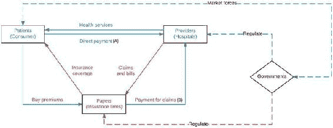
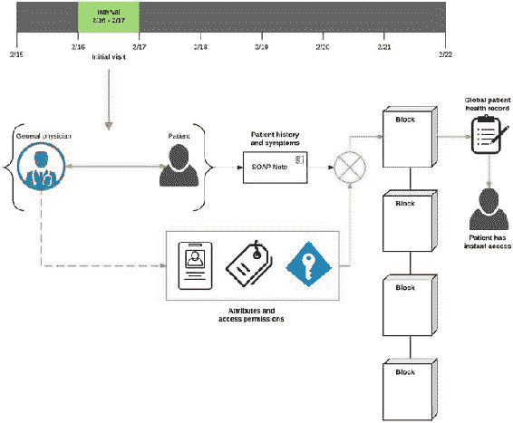
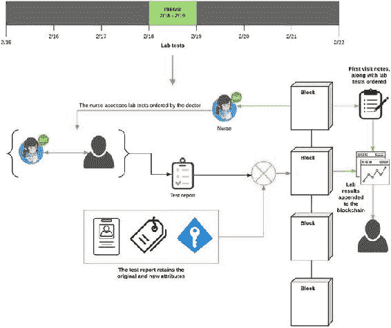
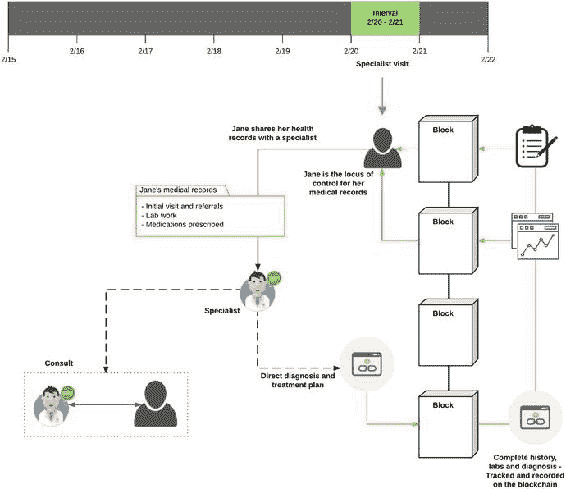
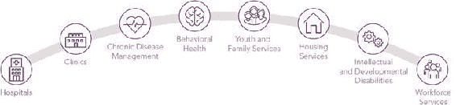
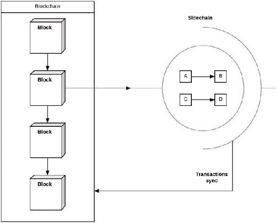

© Vikram Dhillon, David Metcalf, and Max Hooper 2017

# 区块链在医疗保健中

Vikram Dhillon^(1 ), David Metcalf¹ 和 Max Hooper¹(1) 美国佛罗里达州奥兰多

## 支付者-提供者-患者模型

支付者-提供者-患者模型是医疗保健三个主要参与者之间互动的标准模型。图 9-1 直观地展示了这些互动，本节中我们将详细阐述这三个参与者的激励和利益。为了简单起见，让我们假设支付者主要是保险公司，提供者是医院系统或私人诊所，患者是由给定保险公司服务的随机样本。图 9-1.支付者-提供者-患者模型的简化概述现

+   第一种情况是最简单的情况，包括患者直接支付程序和医院访问的费用。这种涉及只有两个参与者的简单系统仍然是许多不同国家医疗保健系统的常态。在美国，提供医疗保健的成本已经大幅增加，因此系统内出现了一个新的参与者。

+   第二种情况是当前美国实施的情况。患者在向保险公司支付保费后获得健康保障。然后，该公司获得更多的谈判权以设定可行的程序价格，并代表患者支付这些费用。现在，提供者将支付请求发送给保险公司，而不是直接发送给患者。这样，保险公司已经发展成为患者的集中门户，以消除系统中的摩擦并获得个性化的医疗保健。

+   第三种情况更多地涉及未来医疗保健的情况，其中整合了专门的实体提供者，通过远程健康护理、远程监测和远程医生来管理护理。

最简单的情况是患者直接向医院支付服务费用。然而，更复杂的医疗程序和实验室测试需要一些由患者向保险公司购买的覆盖范围。现在保险公司代表患者支付任何医疗费用。提供者还直接向保险公司发送付款索赔，而不是患者。这种模式是理解当今医疗体系中巨大复杂性的基础，其中涉及数百个其他参与者。例如，保险公司和医院在患者方面可以操作的领域主要受到政府机构的监管。这些机构又受经济力量和消费者需求的影响。2016 年，Humana 的首席信息官克里斯·凯在 Distributed:Health 上发表了主题演讲，讨论了 Humana 努力采用区块链降低医疗保健处理成本，并更有效地为其会员提供个性化护理的努力。他谈到了前文提到的第二种情况的可能发展路径，在这种情况下，区块链可以无缝地推动提供者和付款人之间的支付流动，并使责任归于结果，而不仅仅是程序。将控制重心转移到患者身上使他们能够获得更好的护理和满意度，而不会增加使用区块链的摩擦或开销。区块链上的索赔处理的理念是利用去中心化的共识、无信任交易和网络验证等特性设计工作流程，以减少开销和时间。我们想解决以下问题：我们是否可以设计基于区块链的患者工作流概念，记录患者从她的家庭医生到实验室工作，最后到专科医生的过渡？让我们看一下涉及使用区块链的患者访问工作流程。

## 工作流程

在这一部分中，我们希望设计一个基于公钥/私钥对传递访问权限的基本电子健康记录（EHR）系统。我们的工作流程始于简（Jane）因食用某些食物后出现胃部不适而前往主治医生（PCP）进行检查。她的医生怀疑是病毒感染，并要求进行进一步的实验室检查。她进一步被转诊至专家，专家进行最终诊断，并与她合作制定治疗方案。这个工作流程的每一步都作为简的医疗记录记录在区块链上，具有适当的访问权限和所有权。此外，简的记录还包括每次签出和签入的历史记录，包括对医疗记录进行的编辑和添加。密切跟踪所有权的变化有助于我们在简接受的不同护理点之间进行过渡，并且随着她的健康状况开始呈现更清晰的图像，她能够立即访问自己的医疗记录。这个工作流程的主要目标是演示区块链如何处理权限和所有权在多个不相关方之间的转移的概念。使用加密密钥的用户签名在创建这个基本医疗记录系统时被利用。我们可以使用版本控制系统的术语更好地理解工作流程中的属性和权限。就像 Git 或 SVN 有提交消息和代码提交一样，每次向医疗记录检入新数据都将包含有关进行了什么更改的提交消息。区块链成为一种远程存储库（类似于 GitHub），Git 可以向其推送新的更改。还有锁定机制来保护数据：一旦将医疗记录中的文档签出给用户（医生或护士），该文档将被锁定，直到原始用户签入其编辑并解锁文档，其他用户将无法检入新的更改到同一文档。图 9-2 到图 9-4 指导我们通过这个工作流程。图 9-2.初诊这个工作流程始于简去普通医生那里进行常规检查。医生进行了一次病史记录，并记录了从身体系统检查中突出的任何症状。他将这些信息添加到了一种称为 SOAP 笔记的非常标准的病历记录方法中。这个笔记将带有一个称为哈希的唯一 ID 添加到区块链上。医生还将添加用于访问医疗记录的权限和用户组角色。最初，只有医生和患者有权访问，但这可以很容易地扩展。最后，医生使用自己的密钥对笔记进行签名，以表示简的医疗记录的初始提交。一旦简的记录被推送到区块链上，她也可以立即访问到它们。图 9-3.实验室检查简的医生要求进行一些实验室检查，两天后，她前往实验室进行检查。这些检查已经输入到了她的医疗记录中，并设置了让实验室护士查看详细信息的权限。医生可以轻松地设置访问权限，并在医疗记录中为护士添加新的上传特权。这个工作流程在简到达之前就已经开始了，当护士检索简的记录并开始为检查做准备时。当简到达时，他们进行了咨询，护士告知她将要经历的检查。检查完毕后，一份报告将被添加到简的区块链记录中。我们可以在右侧看到，简的一般记录现在有了最近进行的实验室检查的新附加内容。所有这些结果都可以在上传时立即提供给简。图 9-4.专家整合在这个工作流程的这一步中，简决定前往专家那里更好地理解实验室检查结果。两天后，她与专家分享了她的医疗记录。在这一点上，专家有两个选择：专家可以查看她的记录，并提供诊断以及治疗计划，而无需甚至进行一次访问。另外，简也可以前往咨询，与专家一起制定治疗方案。第一种选择可能有助于减少简接受的访问和服务的成本，因为最终诊断和治疗计划都将在区块链上提供给她。这完成了从她的初诊到她获得诊断的工作流程。这个工作流程的每一步，从最初的记录到最终的治疗计划都记录在了区块链上。然而，在患有慢性疾

### 热切换

热切换是一种由区块链实现的设计原则，可以在系统仍在运行时以最小的操作延迟交换组件。热切换的目的是重新路由信息流，而这个概念之所以可能，是由于区块链的分散性质，也就是说，没有单一的故障点。为什么我们需要一个新概念，比如热切换？传统的调度程序做得相当好。一个运行中的基于区块链的医疗记录系统将需要同步到区块链的实时和脱离链组件。医院的 IT 基础设施应该非常稳定，几乎没有停机时间，但是热切换可以实现孤立的系统升级而不会造成中断，并逐渐使仍然活跃的传统系统与区块链兼容。目前有两种早期的热切换实现可用：闪电网络（[`lightning.network/`](https://lightning.network/)）和可插拔共识。那么，什么是闪电网络？闪电的 Alpha 版本提供了一种通过新的微支付通道（子通道）发送交易的机制。这种价值转移发生在区块链之外，从而使交易瞬间完成。这些通道最终与区块链同步上游，并保持整个网络的数据完整性。类似地，脱链通道可以复制并临时存储间歇性的访问请求，并根据预先批准的访问控制释放和访问医疗记录。一段时间后，闪电通道可以将中间更改与区块链同步，并变为不活动状态。热切换的第二个应用是可插拔共识，它指的是您可以根据区块链上处理的交易类型来替换共识算法的想法。例如，在公共/私有分区的区块链上进行的私有交易可能需要与通用交易不同的共识机制。因此，在区块链上允许多个共识算法。我们将在后面的章节中更详细地讨论可插拔共识的实现。

## 废物管理：Capital One、Ark Invest 和 Gem

由 Gem、Capital One 和 Ark Invest 主持的网络研讨会概述了困扰医疗保健系统的经济成本和开销问题。这种经济浪费是从支付者（保险公司）的角度来看的索赔处理中突出显示的。然而，这里学到的教训可以广泛应用于其他行业的索赔处理，比如汽车保险。举例来说，Gem 宣布与丰田合作，将其一直在为医疗保险业务开发的应用程序移植到汽车保险中。其愿景是利用区块链自动化大部分保险理赔流程。在这里，我们将总结与会专家提出的关键发现。在下面的讨论中，专家提出的每个问题都以[P]开头，提出的解决方案以[S]开头：

+   [P] 每收取到一美元的医疗服务提供者的费用，有 15 美分用于索赔处理、促进各方支付和手工劳动成本。想象一下，这 15 美分累积成了一个 3 万亿美元的行业……

+   [P] 供应商通过提高补偿率作出回应，而支付者（保险公司）则通过提高保费作出回应。

+   [P] 医院充当银行，向患者提供自费支付的贷款，但缺乏支持和吸收低效支付频率的基础设施。

+   [P] 医院只有 5%的收取率，对患者提供的作为贷款的自费支付。

+   [P] 这些严重的低效率导致医院在基础费率之外额外收取高达 45%的保费。

+   [S] 光明面上，缩短提供者处理理赔所需的时间可以节省 230 亿美元。

+   [S] 减少账单周期中患者自付费用的波动可以节省 70 亿美元。

+   [S] 使用区块链跟踪具有历史记录的交易可以显著减少欺诈率，为保险公司节省约 3000 亿美元。

+   [P] 理赔清算公司必须花费几天，有时甚至几周来处理理赔，增加了显著的开销。

+   [P] 提供者正在使用多个第三方软件工具来管理理赔。而不是技术成为辅助，诊所正在经历更多的碎片化，并且使用手工劳动来集成不同的软件。

+   [S] 区块链可以跟踪整个护理过程和账单周期，以减少涉及方之间的摩擦。

+   [S] 在去中心化账本上，交易和理赔可以被高效地追踪，从而几乎可以立即解决理赔，即使不是在几分钟内。

+   [S] 像比特币区块链这样的公共账本不能被使用，HIPPA 法律限制了患者信息在数字渠道上的传输方式。最终的解决方案将是使用经过验证的节点的许可账本。这将导致通过许可用户对公钥和私钥使用进行跟踪的医疗记录的限制访问。

+   [S] 负责在区块链上协调权限和访问角色的智能合约，用于请求医疗记录的各方。并非每个参与方都可以看到整个记录，权限访问允许仅暴露相关部分。

+   [P] 提供者不是 IT 专业人士，没有足够的时间为新系统提供培训，因此互操作性仍然是一个主要问题。

+   [P] 缺乏互操作性包括：

    +   患者在医疗系统中的注册

    +   手术授权

    +   医疗记录

    +   保险费收取

    +   理赔提交

    +   患者账单

    +   理赔和账单的核算

+   [P] 功能性和分区 - 理赔和医疗记录是否应该在同一区块链上？与会者讨论了在 Aetna 发生的一个场景，每年从提供者处收到约一百万份有关理赔信息的传真。这给管理文书工作增加了巨大的行政开销。理想情况下，理赔和记录应该手牵手。将患者上传到区块链的手术应该触发理赔的处理。最终，通过适当的分区，将两者都放在区块链上会更有效率。

+   [S] 锚定侧链的概念可能对涉及多方的协调护理更加相关，如图 9-5 所示。领域特定的侧链可以更好地促进访问的转移，然后与主区块链同步。侧链的一个非常基本的示意图如图 9-6 所示。图 9-5.护理连续性。这张图片展示了涵盖所有护理提供者和社区服务的全面健康服务阵列。这张图片是由 Eccovia 关于负责任的护理组织所做的演示中取得的，获得了许可。

图 9-6.执行链外交易的简单侧链。这个过程对于快速授予许可访问和特权可能很有用，最终这些交易会与上游同步。区块链可以简化医疗记录在多个参与方之间传递的信息流动，在本节中，我们总结了 Ark Invest 和 Capital One 发现的一些经济浪费的关键发现。尽管侧链仍处于早期开发阶段，但下面提供了一个简单的图形（在图 9-6 中）：

### 可验证的数据审计

谷歌的 DeepMind 正在开发一项类似区块链的有趣服务，作为 DeepMind 健康服务的审计日志，以协助临床诊断。 医院正在将敏感的患者数据转移到 DeepMind 的机器学习和人工智能服务中，以进行临床预测，而这个项目是为了确保数据的使用符合患者的同意。 我们联系了 DeepMind，询问他们的努力，获得了许可后，我们正在复制 DeepMind 博客文章中关于可验证数据审计的概述：数据可以是社会进步的有力力量，帮助我们最重要的机构改善它们为社区服务的方式。 随着城市、医院和交通系统找到了理解人们需求的新方法，他们正在发掘改变今天工作方式的机会，并找到未来的激动人心的想法。只有在社会拥有信任和信心的情况下，数据才能造福社会，我们在这方面都面临挑战。 现在你可以将数据用于更多目的，人们不仅仅询问谁持有信息以及是否安全保存，他们还希望更加确信地知道数据被用于什么。 在这种情况下，可审计性成为一个越来越重要的优点。 任何良好构建的数字工具都将记录它如何使用数据，并能够在受到质疑时展示和证明这些日志。 但是，我们使审计过程越来越强大和安全，就越容易建立对数据实际使用的真正信心。想象一下，一个服务可以对每个个人数据片段发生的事情给予数学保证，而且不可能伪造或遗漏。 想象一下，能够实时检查该系统的内部运作情况，以确保数据仅用于应该用于的目的。 想象一下，支撑这一切的基础设施是作为开源的自由提供的，因此如果他们愿意，世界上的任何组织都可以实现自己的版本。 该项目的工作名称是“可验证数据审计”，我们非常期待分享更多关于我们计划构建的细节！

#### DeepMind 健康的可验证数据审计

今年我们将开始为 DeepMind Health 构建可验证数据审计，这是我们提供健康服务技术的努力，可以帮助临床医生预测、诊断和预防严重疾病 - 这是 DeepMind 部署技术造福社会使命的重要组成部分。考虑到健康数据的敏感性，我们一直认为我们应该在治理方面与技术本身一样具有创新性。我们已经通过任命一组无偿的独立评审员来进一步加强对 DeepMind Health 的监督，他们负责审查我们的医疗保健工作，委托审计，并发布年度报告，报告其中的发现。我们认为，可验证数据审计是这种监督的一个强大补充，为我们的合作医院提供了一个额外的实时和完全验证的机制，以检查我们如何处理数据。我们认为这种方法在健康领域特别有用，因为个人医疗数据的敏感性以及对每次与数据的交互都必须得到适当授权并符合关于患者同意的规定。例如，持有健康数据的组织不能简单地决定开始对用于提供护理的患者记录进行研究，或者重新利用研究数据集进行其他未经批准的用途。换句话说：重要的不仅仅是数据存储的位置，还有对数据的处理。我们希望首次将这些可验证和可审计化，实时化。那么，它将如何运作呢？我们作为数据处理器为我们的医院合作伙伴提供服务，这意味着我们的角色是根据他们的指示提供安全的数据服务，而医院则始终完全控制着。目前，每当我们的系统接收或触及数据时，我们都会创建该交互的日志，以供以后审计需要。有了可验证数据审计，我们将进一步完善这一点。每次与数据进行任何交互时，我们将开始向特殊数字分类帐添加一个条目。该条目将记录已使用特定数据的事实，以及原因 - 例如，血液检测数据已根据 NHS 国家算法进行检查，以检测可能的急性肾损伤。分类帐及其内部条目将共享一些区块链的特性，这是比特币和其他项目的理念。与区块链一样，分类帐将仅追加，因此一旦添加了数据使用记录，就不能以后擦除。并且与区块链一样，分类帐将使第三方能够验证没有人篡改任何条目。但它也将与区块链在一些重要方面有所不同。区块链是分散的，因此对任何分类帐的验证是由广泛参与者之间的共识决定的。为了防止滥用，大多数区块链要求参与者反复进行复杂的计算，伴随巨大的成本（根据一些估计，区块链参与者的总能源使用量可能与塞浦路斯的电力消耗相当）。当涉及到医疗服务时，这是不必要的，因为我们已经有了值得信赖的机构，如医院或国家机构，可以信赖他们来验证分类帐的完整性，避免了一些区块链的浪费。我们还可以通过取代区块链的链部分，使用树形结构来使此过程更加有效（如果您想了解有关默克尔树的更多信息，可以从英国政府数字服务的博客开始）。总体效果大致相同。每次我们向分类帐添加一个条目时，我们都会生成一个称为“加密哈希”的值。这个哈希过程很特殊，因为它不仅总结了最新条目，还包括了分类帐中的所有先前值。这使得某人回去悄悄地更

#### 面临的技术挑战

构建这个项目将是一项重大的工程，但考虑到问题的重要性，我们认为这是值得的。目前，有三个重要的技术挑战突出出来。没有盲点。为了能够被证明是值得信赖的，不能让数据在没有被记录在账本上的情况下进行使用 - 否则，这个概念就会崩溃。除了设计日志来记录与数据的任何交互的时间、性质和目的外，我们还希望能够证明没有其他软件在后台秘密地与数据交互。除了在我们的账本中记录每一次数据交互之外，我们还需要使用形式化方法以及专家对代码和数据中心进行审计，以证明数据中心中的每个软件的每次数据访问都被这些日志捕获。我们还对保证这些系统运行的硬件的可信性感兴趣 - 这是计算机科学研究的一个活跃话题！不同的群体有不同的用途。核心实施将是一个接口，允许我们的合作医院实时地证明我们只将患者数据用于批准的目的。如果这些合作伙伴想要将这种能力扩展到其他人，比如患者或患者团体，那么就需要解决一些复杂的设计问题。一长串的日志条目对许多患者可能没有用处，有些人可能更喜欢阅读一个综合的视图或依靠一个可信赖的中介。同样，患者团体可能没有权力查看标识数据，这意味着允许我们的合作伙伴提供一些形式的系统范围信息 - 例如，是否在特定数据集上运行了机器学习算法 - 而不是无意中泄露患者数据。关于我们如何能够为数据的子集或摘要提供经过验证的访问的技术细节，请参见我们将使用的开源 Trillian 项目以及解释其工作原理的本文。分散的数据和日志，没有间隙。英国没有单一的患者身份信息数据库，因此医疗过程涉及数据在医疗保健提供者、IT 系统甚至患者控制的服务（如可穿戴设备）之间来回传输。目前正在进行大量工作，使这些系统具有互操作性（我们的移动产品 Streams 是按照互操作标准构建的），以便它们可以安全地协同工作。这些标准包括可审计性将是有帮助的，以避免数据在从一个系统传输到另一个系统时变得不可审计。这并不意味着像 DeepMind 这样的数据处理器应该看到来自其他系统的数据或审计日志。日志应该保持分散，就像数据本身一样。审计互操作性只是提供额外的保证，即当数据在系统之间传输时，它不会被篡改。这是一个重大的技术挑战，但我们认为这是可能的。具体来说，有一个新兴的医疗保健互操作性的开放标准，称为 FHIR，可以在有用的方式上扩展以包含可审计性。 

#### 在公开中构建

我们希望能够在今年晚些时候实现这个计划的第一步，并计划在我们逐步进行的过程中发布关于我们的进展和所遇到的挑战的博客。我们认识到这是非常困难的，而且最艰巨的挑战绝不是技术上的。我们希望通过公开分享我们的流程并记录我们的困境，能够与尽可能多的人合作并获得反馈，并增加这种基础设施在某一天在医疗保健领域乃至更广泛地被使用的机会。

## 摘要

本章重点介绍了区块链在支付处理中的新兴作用以及如何将其应用于医疗保健领域。我们从描述中心化的付款方 - 提供者 - 患者模型以及该模型将如何在不久的将来发生变化开始讨论。然后，我们讨论了如何使用区块链构建一个简化的电子健康记录系统。之后，我们介绍了如何在区块链上记录患者工作流程。最后，我们讨论了 Ark Invest 和 Gem 对医疗保健领域经济浪费的观点，以及区块链如何在不久的将来缓解其中一部分压力的方法。

## 参考文献

编写本章所用的主要参考资料是 Gem 关于基于区块链的电子健康记录的博客文章。
