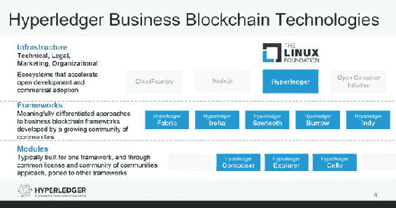
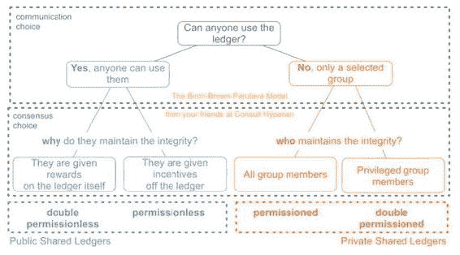
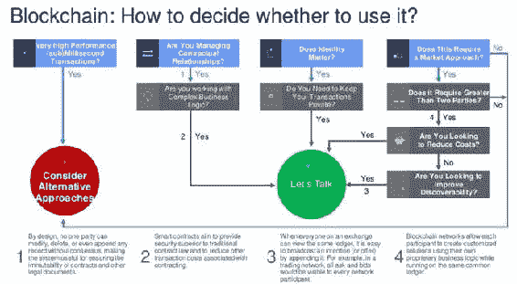
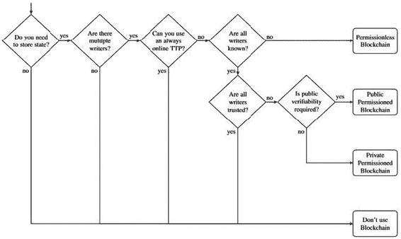
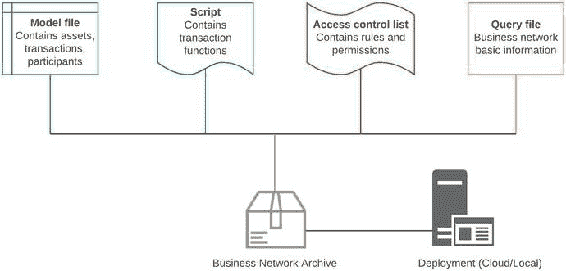

© Vikram Dhillon、David Metcalf 和 Max Hooper 2017 年 Vikram Dhillon、David Metcalf 和 Max Hooper 区块链启用应用程序 `doi.org/10.1007/978-1-4842-3081-7_10`

# 10. Hyperledger 项目

Vikram Dhillon¹，David Metcalf¹ 和 Max Hooper¹(1)美国佛罗里达州奥兰多 Hyperledger 项目是 Linux 基金会的一项倡议，旨在开发区块链开发的开源生态系统。Linux 基金会旨在创建一个环境，在这个环境中，软件开发者和公司的社区可以相遇和协调，共同构建区块链框架。Hyperledger 本身不是另一个加密货币，而是一个开放的企业级区块链项目孵化和成熟的开放中心，通过开发和商业化的所有阶段。在本章中，我们将讨论 Hyperledger 项目的当前状态，重点介绍当前正在孵化的项目，总结正在实施的项目范围，并审查涉及创建开源企业级区块链的全面技术集。

## 当前状态

在 Hyperledger 项目下，目前有八个项目正在孵化：有五个框架在管道中，以及与这些框架配套的三个开发工具。在本节中，我们将首先简要概述所有八个项目，然后重点关注两个特定的区块链平台 - Fabric 和 Sawtooth。让我们开始概述：

+   Sawtooth：这是英特尔努力创建的一个开源区块链。Hyperledger Sawtooth 是一个用于构建、部署和运行分布式分类帐的模块化平台。它包括一种名为 Proof of Elapsed Time（PoET）的新共识算法，该算法以最小的资源消耗针对大规模分布式验证者群体。它允许部署具有权限和无权限的大规模分类账。

+   Iroha：这是一个一致的库和组件集，将分布式分类账技术纳入现有基础设施。重点放在移动库和移动应用程序上。在设备外部完成数据存储和同步，并实现了网络范围内的默认声誉系统以确保经过验证的节点。

+   Fabric：这是一个用于开发企业应用程序的区块链开发框架，具有模块化架构。它旨在成为一个基于组件的系统，重点放在诸如可插拔共识和不同用户角色的独特成员服务等可插拔功能上。

+   Burrow：这个受权限控制的区块链节点以与 EVM 类似的方式执行智能合约。Burrow 被构建为在多链环境中执行具有特定应用程序智能合约。Burrow 节点可以为多个相互兼容但运行在不同域的连接的区块链提供合约执行服务。Burrow 节点有三个主要组件：共识引擎、受权限控制的 EVM 和远程调用网关以执行合约。

+   Indy：这是一个 Hyperledger 软件开发工具包（SDK），允许自我主权身份内置到分布式分类帐中。该 SDK 为许多语言提供了包装器，以添加新功能并构建更好的去中心化身份管理器。

+   Composer：这是一个 Hyperledger 的前端接口，用于构建和部署特定用例的简单区块链网络。Hyperledger Composer 允许我们编写简单的智能合约并将其部署到内部区块链网络中。在大型开发环境中，只有少数核心用户会更新像 Fabric 这样的分类帐的代码。大多数用户将在 Composer 中工作，以访问区块链并执行访问和更新区块链的日常活动。

+   浏览器：类似于任何传统的区块链浏览器，Hyperledger Explorer 允许用户查询区块、搜索交易和相关数据、网络健康和信息、正在执行的智能合约类型以及存储在账本中的交易系列。该项目与使用 Hyperledger 部署的任何区块链兼容，因此新项目无需设计新的浏览器模块。

+   Cello：这是一个用于部署区块链即服务实例的管理工具。Cello 简化了创建区块链实例的过程，并减少了创建、管理和终止区块链所需的工作量。它提供了一个可容器化的区块链服务，可以部署到云端、裸机、虚拟机或特殊的容器平台上。

### 治理

这八个项目都属于 Hyperledger，并由 Linux Foundation 托管。Linux Foundation 作为母组织如何支持 Hyperledger 项目？它通过提供治理，包括技术和法律治理。Linux Foundation 对如何构建开源社区有着深刻的理解，随着孵化项目的成熟，它们需要专门的帮助，包括社区组织、法律工作和营销。这就是 Linux Foundation 的作用，通过建立技术社区和区块链开发生态系统，以及提供法律和品牌工作的辅助支持。图 10-1 显示了 Linux Foundation 的伞形结构以及 Hyperledger 项目如何在其下组织。图 10-1.各种 Hypleredger 项目和技术如何适应 Linux Foundation 的较大伞形结构 Hyperledger 的技术治理由技术指导委员会 (TSC) 提供。TSC 是开放治理的一种实现，即由社区选举产生的开发人员组成的团队做出重要的技术设计决策。Hyperledger 最近通过遵循开放治理的 ABC 原则进行了 2017-2018 年 TSC 选举：积极参与的贡献者有资格参与选举，提名您认为合适的委员会候选人，通过安全渠道投票。在 Hyperledger 的背景下，这种由开发人员领导的委员会制度来做出长期设计决策的机制，接近于在大多数开源项目中遵循的技术精英治理理想。

### Fabric 和 Sawtooth

Hyperledger Fabric 是区块链架构的模块化实现，包括可插入的功能，如共识、私有成员身份和交易功能。在本节中，我们将更详细地了解 Fabric 的三个特点：链码、节点类型和私有通道。Fabric 区块链以名为链码的程序形式运行智能合约，与链码交互的唯一机制是通过交易。网络上的所有交易都必须经过认可，只有经过认可的交易才能提交到区块链并更新全局状态。链码可以被两种类型的交易引用：

+   部署交易：允许创建新的链码，以程序作为参数。当交易经过验证并成功执行时，链码被认为已安装在区块链上。

+   调用交易：允许在区块链上执行链码程序。调用交易调用客户端请求执行的链码中的特定函数。必须注意的是，调用交易只能在先前部署的程序的上下文中成功工作。调用交易的结果是成功执行链码，并最终通过返回的输出修改本地/全局状态。

在 Fabric 中，交易可以被设为私有，并且要启用此设置，矿工/节点必须在网络上得到验证。与比特币不同的是，这里，身份的牺牲是可以接受的，因为网络中涉及的所有参与方都有一个共同的目标。为了启用私有交易，节点必须进行重大更新，增加新功能以与网络上的各个实体交互。在这里，我们描述了三个这样的基本实体：

+   客户端：代表最终用户执行交易（部署或调用交易）或向网络广播交易的实体。客户端必须连接到对等方以与区块链建立通信。它经常与订购服务和背书人进行交互。

+   对等方：向区块链提交交易的节点，维护状态更新并保留账本的完整副本。一些节点具有额外的能力，可以扮演背书对等方的角色。背书对等方的目的是在提交到区块链之前背书创建链码交易的上下文中。链码可以指定进行背书所需的条件（称为背书策略），引用可以验证创建交易的已知对等方集，除了部署交易（由全局或网络范围的链码背书策略处理）。这通常对应于从所有背书人收到签名。

+   订购服务：运行通信服务的节点，实现发布-订阅消息传递例程，执行诸如网络范围的消息广播、故障安全消息传递和私有通道等功能。该订购服务以分布式方式实现通信协议，并保证交易的顺序以及在这些交易内部的消息序列得以保留。通信层对网络上的所有客户端和对等方都可用于广播候选交易（包含消息）以进行验证以及现已完成的交易，这些交易现在可以附加到区块链上。广播是通过共享通道以相当标准的方式完成的，下面是它的工作原理：客户端连接到对等方正在监听的通道，并广播一条消息，最终将该消息传递给适当的对等方。

这里有两个频道功能（由订购服务启用）我们想要讨论的，原子交付和私有通道的分区。原子交付背后的想法是允许基于消息的通信，以保留顺序和交付可靠性。在具有原子交付的频道中，交易按照它们到达的顺序广播和传递给所有连接的对等方。这保持了这些交易中包含的消息的一致性。如果消息序列被保留，一旦消息被应用于区块链状态，区块链状态更新将以确定性方式发生（这是可取的）。第二个功能是分区，它创建了私有频道。订购服务允许创建多个频道，并且客户端可以以发布-订阅的方式连接到任何频道。客户端还可以根据适当的权限向给定频道广播消息。一些节点可能创建需要许可或先前基于密钥的批准才能进入的私有频道。订购服务以这样的方式创建频道，以使客户端不会意识到其他频道的存在，即使它可以连接到多个频道。在下面的图 10-2 中显示了 Fabric 中可用功能的简要摘要。图 10-2.Fabric 提供的主要功能的简要摘要现在我们已经详细讨论了 Fabric，让我们简要讨论英特尔的区块链方法：Sawtooth。英特尔描述他们的努力如下：

> Sawtooth Lake 是一个模块化平台，使用 Python 实现，并带有 C/C++ 加密加速，旨在构建、部署和运行分布式分类账。该平台是模块化和可扩展的，支持一系列即插即用的组件，使组织能够快速原型设计和尝试各种区块链部署形式。

Sawtooth 具有多种用例，如与物联网设备兼容，用于实时数据流，企业级客户负载和基于硬件的安全性。以下是英特尔描述其共识算法选择的原因：

> 一些使用案例可能需要在少数参与者之间高交易速率，而其他一些需要支持许多参与者。这些多样的环境需要不同的方法来确定谁将下一个区块添加到链上。我们在 Sawtooth Lake 中提供了两种不同的共识算法供选择。对于分布式共识，我们实现了一种 Proof-of-Elapsed-Time（PoET）算法，它利用可信执行环境来生成公平高效的领导者选举，以降低计算和能源成本，同时提供公平的分布式共识。

新的共识算法对英特尔有另一个优势，因为 PoET 被设计为在英特尔芯片上运行，并利用软件保护扩展（SGXs）——一组创建区域保护以防止对软件级别的敏感数据访问的指令，并显著提高事务处理速度。这种硬件加速正在消费者端用于提高大吞吐量。Sawtooth 中的硬件安全模块带来了与 PokitDok 在医疗保健领域的非常有趣的合作伙伴关系，宣布了基于 Sawtooth 的 Dokchain。使用 SGX 允许在其上构建的区块链增加隐私和安全性，这两者都是要求符合 HIPPA 的强制性要求。加密和安全功能保护患者隐私，使 SGX 和 Sawtooth 成为医疗保健领域非常强大的平台。此外，Dokchain 还具有裁决功能，一旦参与者被识别出来，机器之间的支付几乎可以立即进行。这将大大缩短提供者的结算周期，并使基于区块链的理赔处理更具吸引力。

## 决策模型：你需要区块链吗？

区块链技术的炒作像野火般在企业界蔓延开来。各种企业和公司已经组建了小型区块链开发团队，以调查他们如何从使用区块链中获益。在炒作之下，区块链世界正在进行非常严肃的技术发展，其中许多在这本书中都有记录。然而，我们仍处于初级阶段：区块链应用程序带来的商业优势实际上是简化业务流程并显著减少摩擦。在本节中，我们提供了三个决策模型，可以帮助您批判性地分析将区块链整合到您的项目或公司是否确实是适当的技术解决方案。

+   IBM 模型：这个区块链模型突出了区块链的关键特性如何适应业务流程和应用。

+   Birch–Brown–Parulava 模型：这个模型帮助你在分布式分类账的权限和无权限实现之间做出选择。这是由 Consult Hyperion 的开发人员设计的。

+   Wüst–Gervais 模型：这个简化模型，由瑞士联邦理工学院的两位研究人员设计，结合了前两个模型的优点。

注意我们为什么选择了这三种模型？在线上有几个全面的决策树可供企业决定哪些应用场景需要区块链。在本节中，我们选择了最简单的模型来说明将区块链集成到现有基础设施中的更重要的设计原则。在我们深入探讨每个模型的具体细节之前，所有三个模型共享哪些一般原则？您可以使用共享设计作为评估您业务需求的标准，并基于一些简单的想法和问题创建适合您业务的模型。

+   数据库：您需要首先了解为什么您的企业在使用数据库。区块链使用一个对所有参与者可见的共享数据库。您是否愿意为您的应用程序使用共享账本？数据库由在网络上发生的交易不断更新。您的应用程序是否能够与不断更新的数据库进行交互？

+   Writers：数据库由多个事务写入更新。区块链设计为具有多个写入者；也就是说，有多个实体生成和验证发布到账本的交易。

+   无信任：验证写入者身份对您的应用程序重要吗？这可能会改变您部署的账本实现。区块链的默认设置是写入账本的各方之间没有信任。这对您的应用程序是否足够？您的网络上的各方是否存在竞争利益或类似动机？如果他们有类似的利益，一些管理信任的区块链构造可以安全地移除。

+   Disintermediation：区块链从网络中移除了中央权威，因此交易被认为是分散的。这些交易由网络上的每个节点独立验证和处理。您是否希望或需要这种去中介化？鉴于您特定的应用用例，是否存在任何重大缺点，需要有一个门卫？倾向于使用基于区块链的数据库的好理由可能包括成本更低、工作流程更快、自动结算或监管影响。

+   交易相互依赖：区块链最适合处理相互依赖的交易，因为它们由写入者发布到区块链上。相互依赖部分指的是交易结算。例如，如果 A 向 B 发送资金，然后 B 向 C 发送资金，第二个交易在第一个通过之前无法结算。区块链确保了由写入者发布的交易的有序和快速处理。换句话说，当记录涉及多个用户的长时间历史的交易日志时，区块链真正发挥作用。

让我们开始研究决策模型。 第一个模型如图 10-3 所示。图 10-3.桦树-布朗-帕鲁拉瓦模型该模型引导用户决定是部署权限账本还是无权限账本。 这可能导致对软件基础的重大变化，例如在以太坊和 Quorum 之间进行选择。接下来的模型是 IBM 的，如图 10-4 所示。图 10-4.IBM 用于何时使用区块链的决策图此流程图中要突出的一个重要特点是某些决策与区块链固有的特性相关联。 例如，合同关系可以通过智能合约在区块链上很好地处理。 此图表可以成为对区块链与您的项目的兼容性以及区块链启用的功能的良好初步检查。我们在这里考虑的最终决策模型如图 10-5 所示，该模型由 Wüst 和 Gervais 在一篇题为“您是否需要区块链”的论文中创建，并且对我们来说，它顺序集成了前两个模型的概念。图 10-5.Wüst-Gervais 模型该模型试图回答有关部署选项以及您是否应该考虑使用区块链的问题。 其概念与前两个模型类似，但流程略有不同，以允许额外的选项。

## 使用 Hyperledger Composer 进行快速原型设计

Hyperledger Composer 是一套高级应用程序抽象，可为您的业务建模。 一旦您决定您的业务可能会受益于使用区块链，您可以使用 Composer 创建基于区块链的应用程序的原型。 以下是制作原型所涉及的过程概述：

+   安装 Hyperledger Composer 工具，或在 Playground 中尝试 Composer 在线版。

+   定义业务网络、资产和交易。

+   实现任何交易处理器。

+   在 Composer-UI 中测试业务网络。

+   将业务网络部署到实时的 Hyperledger Fabric 区块链实例中。

+   在低级抽象之上创建一个示例应用程序。

+   通过 RESTful API 或 Node.js 连接其他应用程序到此部署。

Composer 的功能输出称为业务网络存档（BNA），然后可以将其部署到测试网络或实时的 Fabric 区块链。 业务网络包含通过角色或身份连接的参与者，传播在网络上的资产，描述资产交换的交易，作为支撑交易的规则的合同，最后记录所有交易的账本。 除了业务网络的建模组件外，BNA 还包含交易处理器、访问控制列表和查询定义。 交易处理器（用 JavaScript 编写）在这些模型元素上实现和执行业务逻辑。 访问控制列表描述了允许在满足某些条件后哪些参与者可以访问业务网络中的什么资产的规则。 用于描述这些访问列表的语言非常复杂，可以捕获复杂的所有权声明。 将访问控制与交易处理器逻辑分开允许开发人员快速维护和更新这两个组件，而无需担心兼容性或破坏功能。注意在本节中，我们的重点是介绍 Hyperledger Composer 的基础知识，以便感兴趣的读者可以从参考资料中更快地掌握 Composer 的建模语言。 设计完整的业务网络模型将超出本书的范围。让我们在这里通过建模语言讨论 Composer 的基础知识：

+   资产：这些代表了在网络上用户之间交换的资源。形式上，用于定义资产的描述方案按照关键字-类-标识符-属性-关系的顺序完成。其他可选字段也可以在此处添加，但是整个建模语言通常遵循这个一般方案。资产使用关键字 asset 定义，并具有与其相关的领域类名称。例如，车辆可以通过 VIN 进行标识为 asset Vehicle identified by vin。资产具有一组定义它们的属性。例如，对于车辆，可以将描述存储为 string description。此外，资产还可以与建模语言中的其他资源建立关系，例如拥有车辆的用户，由 --> User owner 表示。所有资产都存储在网络可用的资产注册表中。

+   参与者：这些代表着网络中的用户（或交易对手）。参与者是网络上所有交互的关键，并且与资产描述方式相同。参与者使用 participant 关键字表示，它们还有一个与其领域相关的类名，例如 buyer 或 seller。一个完整的描述可以被给出为参与者 Buyer 由 email 标识，并具有一个 String firstName 属性。所有参与者都存储在一个参与者注册表中，该注册表可能不对网络的用户可用。

+   交易：这些代表了在网络上资产的移动和它们交换时的生命周期。交易的描述方式与参与者或资产相同，参与者的销售要约可以被定义为 transaction Offer，通过 transactionid 进行标识，并具有一个 Double saleprice 属性。

+   概念：概念是不属于资产、参与者或交易的抽象类。概念经常用于为资产或交易添加限定符，并且通常由这三者之一包含。例如，地址的一个概念可以被描述为 Concept Address，其属性为 String street 和 String city_default ="Orlando"。现在，一个资产可以使用此概念来指定地址属性。

+   交易处理器：这些代表着业务逻辑，用于执行由交易广播到网络上时导致的区块链状态变化和全局更新。实质上，这些处理器为交易提供了在模型上操作的实现。它们被写入一个单独的 js 文件中，并使用业务网络模型中的定义。

图 10-6 以图形方式显示了 BNA。图 10-6.BNA 的组件。根据 Hyperledger 项目的许可重现。

## 总结

在本章中，我们介绍了 Hyperledger 项目，特别关注了当前孵化的工具。我们首先讨论了 Hyperledger 下目前的五个重要开源项目，以及这些项目如何在 Linux Foundation 的伞下组织。然后，我们讨论了 Hyperledger 内部的一些最新发展，重点关注 Fabric 和 Hyperledger 一般提供的企业功能。之后，我们提出了一些决策模型，以帮助项目或企业决定区块链是否对他们有利。最后，我们介绍了 Hyperledger Composer，这是一个快速原型工具，可帮助用户使用建模语言轻松地建模其业务网络。我们通过讨论建模语言的组件及其如何创建业务网络来结束了我们的讨论。
