© Vikram Dhillon, David Metcalf, and Max Hooper 2017 Vikram Dhillon, David Metcalf 和 Max Hooper 区块链启用应用 `doi.org/10.1007/978-1-4842-3081-7_11`

# 11. 区块链的最新发展

Vikram Dhillon^(1 ), David Metcalf¹ 和 Max Hooper¹(1) 美国佛罗里达州奥兰多在本章中，我们专注于三项显著推进区块链应用理解并开辟多条新研究途径的新技术。我们从 EOS 开始讨论，这是一个以操作系统启发的架构和平台支持设计理念建造的以太坊竞争者。它采用一种称为委托权益证明（Delegated Proof-of-Stake）的新共识机制，以实现快速交易验证和为支持网络的代表投票的连续周期。EOS 实施的消息传递协议非常先进，允许在消息传递时自动响应处理程序和动作触发器。它们构成了智能合约系统的大部分。此外，支持在网络上并行无锁执行智能合约指令，大大减少了通信延迟和状态更新时间。我们接下来介绍的第二项技术是一种面向合约的编程语言，称为 Chain-core。在 Chain 网络上，所有的价值都集中在用户可以发行和控制的资产中。Chain 为开发者提供了非常强大的 API，用于管理和转移区块链中的资产。与 Aragon 类似，Chain 提供了一个可视化界面，用于管理区块链上的资产。我们将对 Chain 的图形界面进行演示，涵盖所有可用于资产管理的基本功能。最近，Chain 宣布推出了一种新的开发语言 Ivy Playground，旨在简化编写资产合约的工作，我们在此结束对 Ivy 新更新的讨论。我们最后要介绍的技术是 Quorum，这是以太坊企业联盟（EEA）构建的面向企业的以太坊分支，用于处理企业使用区块链的高容量需求。它具有许多升级功能，如在区块链上实现公私分离（以允许完全私密交易）、私密智能合约以及 QuorumChain 共识机制。此外，零知识证明将很快引入 Quorum。我们最后通过 JPMorgan 和 EEA 的概述来结束本节对 Quorum 的讨论。

## EOS 区块链

EOS.IO 是构建区块链的一种新架构方法，类似于操作系统。设计考虑允许核心基础设施可以轻松扩展到去中心化应用。在这里，可伸缩性更广泛地指的是一套原则，使区块链应用程序在与传统非区块链对手竞争时具有竞争力。在本节中，我们专注于 EOS 背后三个主要技术创新所带来的大规模采用潜力：先进的权限系统、一种称为委托权益证明（DPoS）的新共识方法以及 EOS 区块链的并行处理。让我们从 EOS 的一些可伸缩性原则开始讨论。

+   用户基础：一个颠覆性的 EOS 区块链应用应该能够支持数百万用户和用户账户。底层架构需要设计成可以处理账户作为基本单元的分布式分类账账户。支持服务可以提供账户和区块链全局状态的同步修改。

+   免费访问：建立在区块链上的服务或应用程序不应将任何执行成本传递给用户。大型非区块链服务基本上是免费的，最终用户通过其使用产生的数据来实现货币化。为了实现广泛采用，基于区块链的应用程序必须消除用户费用，分摊服务成本，并通过新注册应用的新账户来产生收入。

+   更新与分支：将新组件或功能集成到服务中不应该导致任何停机时间。基于区块链的服务在某种程度上必须处理共识，而分歧可能导致链的分叉。这些分叉会创建具有不同长度的链，并且通常会在下一个区块的创建中非常迅速地解决；然而，更严重的问题出现在软件更新时。网络中的错误应该能够轻松无缝地修复，而无需进行某种类型的硬分叉，使得网络的某些部分不再兼容。区块链服务的去中心化特性创建了一个没有单点故障的网络，并且结合冗余，它可以提供独特的零停机体验。

+   低延迟：比特币区块链目前遭受着高延迟和非常长的验证延迟。一个被成千上万用户使用的实用服务在长时间等待期内是不可持续的，因此，EOS 上的服务必须在适用的情况下提供非常快速的验证和确认方法。有一些有趣的新功能，如并行处理，可以缓解交易确认速度缓慢的痛点。

让我们从 EOS 如何处理账户和用户权限开始。在 EOS 中，所有账户都可以用唯一的人类可读引用创建。此外，EOS 提供了一个明确定义的账户之间消息传递协议，其中包括处理程序和自动化规则。网络上的每个账户都可以向其他账户发送结构化的程序化消息，并在接收到消息时定义规则和脚本来处理传入消息。用于处理消息的脚本也可以对特定的传入操作做出响应性消息。每个账户还有私有存储空间，可以由消息处理程序访问以修改账户状态。消息处理脚本和规则组成了 EOS 部署的智能合约系统。EOS 智能合约背后的设计原则类似于描述操作系统如何与外围设备和其他硬件组件通信的研究充分的消息传递协议。合约将在类似于 EVM 的虚拟机上执行。已经用 Solidity 或其他面向合约的语言编写的智能合约可以移植并适应 EOS 区块链上的容器工作。合约还将继承一些允许与其他 EOS 组件通信的 EOS 特定功能。EOS 中的另一个高级功能是能够在与 Merkle 证明兼容的外部区块链和 EOS 区块链之间通信。这是通过在客户端使用相同的基本加密原理（消息存在证明和消息顺序证明）来验证在区块链之间传输的消息。让我们重新理解用户权限如何工作。在 EOS 中，应用程序结构设计使认证和权限模块与业务逻辑分开。这使得开发人员可以设计专门用于权限管理的工具，并简化应用程序以只包含与应用程序指导的操作相关的代码。EOS 允许用户定义用于签署传出消息的密钥以及用户访问的每个单独服务所使用的不同密钥。例如，用户可以有一个密钥来签署发送给其他用户的消息，另一个密钥用于访问社交媒体账户。还可以向其他账户授予代表用户行事的权限，而不分配任何密钥。这种有限访问类型可以在事先获得许可的情况下为您的社交媒体提供仅发布权限（具有唯一签名的帖子）。这是通过所谓的权限映射概念实现的，我们将在下面讨论。权限映射中的一个关键思想是对单个账户进行多用户控制。这被认为是去中心化应用程序的高级安全措施，在 EOS 中，它被实现为减少密码或货币盗窃的风险。EOS 可以被认为是由 Dan Larimer 创建的基于区块链的社交网络 Steem 的泛化进化。Steem 建立在 Graphene 区块链上，权限映射最初作为一个功能实现，但非常有限。而 Steem 被设计为一个去中心化的社交平台，EOS 是一个应用程序开发平台，具有类似以太坊的图灵完备区块链。要理解权限映射，让我们看一个涉及三个用户角色的例子：账户所有者、活跃用户和社交媒体用户。社交媒体权限仅允许用户执行诸如投票和发布等特定操作。另一方面，活跃用户权限允许执行几乎任何操作，但不包括删除所有者。所有者可以执行所有可用操作，包括提取。在这个例子中，权限映射是指账户所有者定义角色并将相关权限映射到其他账户。EOS 通过允许自定义角色、自定义可映射到不同账户的操作来概括此示例。例如，账户持有者可以将社交媒体应用程序的权限映射到朋友用户组。现在，任何添加到权限组中的账户（由账户持有者添加）都可以立即访问社交媒体应用程序。

### 委托权益证明

EOS 使用了一种称为 DPoS 的新共识机制。它是 PoS（权益证明）算法的一种变体，侧重于效率和公平获取，为较小的钱包或账户提供了一个公正的机会来产生区块并获得奖励。传统 PoS 算法与 DPoS 的区别可以类比为直接民主制与代表制民主制。在传统 PoS 算法中，任何拥有钱包的用户都可以参与验证交易、形成共识并获得一部分挖矿奖励的过程。然而，对于拥有较小钱包或较小权益的用户来说，这可能是不赚钱的。在 DPoS 中，网络中的每个拥有任何数量币的钱包都可以为执行验证和将区块附加到区块链的代表投票。最终，DPoS 网络中有两个主要参与者。

+   利益相关者：这些实体在 EOS 网络中拥

+   区块生产者：也被称为代表，这些实体推动了 DPoS 的共识机制。区块生产者是传统矿工的 DPoS 等价物。他们验证网络上的交易，签署区块，并为将区块添加到区块链中而获得奖励。

在深入了解 DPoS 之前，让我们简要回顾一下共识机制和全局状态更新的需求。回想一下，区块链可以被建模为一个具有一致历史更新的状态机。这个状态机由交易作用，并且共识是网络对交易更新全局状态的顺序达成一致的过程。随着新的交易包含在区块中，更新以特定的增量发生，而频繁的更新频率会过滤掉无效或双重花费的交易。DPoS 的目标是使区块生产在最多的人之间均匀分布，并且有一个民主、公平的过程选举区块生产者。常规 PoS 网络需要全体共识才能验证，而在 DPoS 系统中，有限数量的委派节点（代表）可以验证交易并达成共识。在当前计划中，EOS 允许每三秒由单一区块生产者产生区块。默认情况下，区块以多个系列的形式产生，每个系列包含 21 个区块生产者。DPoS 算法有两个主要的运行角色：选举一组区块生产者和安排区块的生产。网络上的每个账户在一个被称为批准投票的过程中被允许每位委托人（矿工）至少投一票。然而，对网络拥有更多权益的账户遵循每令牌每位代表一个投票的原则，并且可以为多个代表投票。区块生产者（代表）被认为是区块链上的最小信任方，通过实时投票过程选举产生。代表可以轮流（在一个系列中）向区块添加交易并签署区块以添加到区块链中。因此，使用信任方阻止了恶意方向区块链添加无效交易的能力。应当注意，代表无法更改交易或区块的详细信息；他们只能将交易添加或不添加到区块中。这些代表是基于加权公平排队算法的某种变体随机分配的用于区块生产。目标是根据两个标准有效地安排区块生产者：他们收到的票数和代表等待生产区块的时间。拥有更多选票的代表更有可能被安排下一个生产区块。另一方面，行为不端的代表可以迅速被选出，而不会影响任何重要的交易量。让我们总结一下代表的主要角色。

+   区块生产：代表们的最重要功能是按照每三秒一个固定的时间表创建区块。这涉及到在多个系列中验证交易并签署区块。

+   网络支持：每次代表们生成一个区块时，他们都会得到一个奖励来锻造该区块。支付率由利益相关者设置，但一些代表可能会接受较低的支付率以获得更多的网络投票。此外，代表们可能会提供额外的服务，如市场营销和法律工作，而不是接受较低的支付率，以回报利益相关者。

图 11-2 显示了 DPoS 共识算法中使用的代表性区块生产。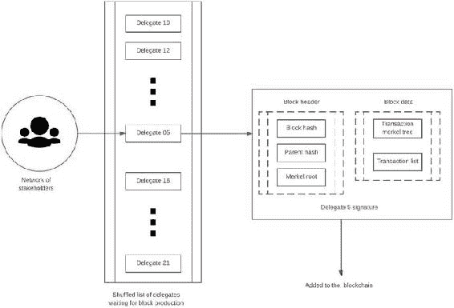图 11-2.DPoS 中的区块生产如前所述，网络上的利益相关者进行投票并选举代表，代表反过来验证交易并生成区块。从投票最高的代表中，选出 21 个代表来参与多个系列并生成区块。代表们被分配到一个用于生成区块的时间表上，这个分配是使用轮询算法完成的。如果区块生成者在计划外伪造区块，则该区块被视为无效。在代表签署了区块后，最终的区块可以追加到区块链上，如图 11-2 右侧所示。如果一个区块生成者未能按时到达，下一个代表的区块将更大，并包括以前的交易。与此同时，一个经常失败的区块生成者将被淘汰出系列。提示有趣的是，DPoS 区块链不具有分叉的倾向。这是因为区块生成者合作生成区块，而不是在 PoW 系统中竞争。在发生分叉的情况下，共识会自动切换到最长的链。

### 并行执行

在以太坊中，指令的执行（例如，来自智能合约的指令）在网络中是确定性和同步的。EOS 提供了一种非常有趣的升级，可以并行执行应用程序，而无需使用任何锁定原语。在这种情况下，必须有一种固有于区块链的机制，确保每个账户只更新自己的数据库。传入的指令更新账户状态；因此，它们必须按顺序应用，即第 n + 1 条指令仅在第 n 条指令后更新账户。在通过-失败二进制指令的情况下，这个一般规则有一个例外。一些账户处理程序可以将二进制指令视为只读，并在不更改其内部状态的情况下回复。从根本上说，EOS 中的并行执行依赖于账户内来自不同来源的消息产生，并通过独立线程传递，因此它们可以并行执行。最终，账户的最终状态仅取决于发送到它的消息。区块生产者组织将消息传递到独立线程。尽管区块生产者正在按计划验证区块，但消息传递是按更快和自定义的时间表进行的，以利用并行性。这些消息的来源通常是在区块链上运行的脚本或自动账户处理程序发送的消息。由于 EOS 的并行性质，当消息生成时，它不会立即传递。相反，存在一段延迟期，称为延迟，在消息生成和传递之间。引入延迟背后的理念是即时传递可能会干扰接收者，因为接收者已经由于先前的消息修改了其内部状态。通过将消息安排在以下周期中传递，实现了无锁消息传递。那么什么是一个周期？在正常情况下，为了避免消息碰撞，一个账户必须等到下一个区块才能发送第二条消息或接收回复。每三秒创建一个区块，因此账户可以期望在发送更多消息之间至少等待三秒。为了消除消息之间的等待时间，EOS 将一个区块分成多个周期，并进一步将这些周期细分如下：

+   每个周期分为线程。

+   每个线程包含一系列交易。

+   每个交易包含一组将要传递的消息。

图 11-3 显示了一个区块中循环的细分和结构。区块生成者不断向一个区块添加新的循环，直到时间限制或没有产生新的交易。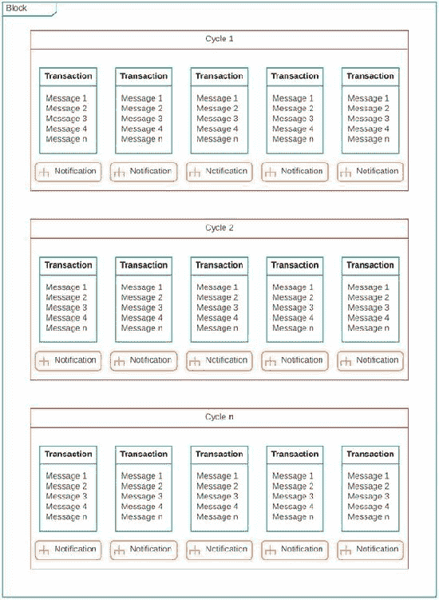图 11-3.EOS 中消息的块结构每个块被划分为一个循环，这形成了单个块内的快速通信的基础。如果一个区块内没有两个交易修改相同的账户，则一个循环中的所有交易可以并行执行。对于用户之间发生的每笔交易，接收方预设的任何自动处理程序都会收到传入指令的通知。在一个循环的时间窗口内产生的交易也可以添加到后续的循环或下一个区块中。一旦一个块被确定，我们就可以提出这样一个问题：在一个块循环中，是否存在两个包含修改同一账户的交易的线程？如果没有，那么任何给定的块可以通过并行执行所有线程来处理。交易所应用程序开发人员运行全节点，目的是向其用户显示交易所状态。这个交易所应用程序不需要与社交媒体应用程序相关的状态。EOS.IO 软件允许任何全节点选择运行任何应用程序的任何子集。发送到其他应用程序的消息会被安全地忽略，因为应用程序的状态完全来自传递给它的消息。从本节需要重申的两个重要观点是：

+   应用程序的内部状态是从专门传递给该应用程序的消息中派生的。

+   任何账户内部状态的更改都是通过在区块链上包含的交易中传递的消息发生的。

Dan Larimer 评论了 EOS 的并行性质作为在区块链上构建应用程序的重大优势：

> 并行处理能力为您的应用程序带来了持续的可扩展性和可靠的高性能基础。现有的单线程能力迫使每个应用程序共享一个单线程区块链的容量和性能，创建了硬性的扩展限制，并最终遭受可能导致平台全面停机的网络拥塞。

请注意 EOS.IO 最近进行了 ICO 以筹集开发资金，CryptoPortfolio 对 ICO 进行了审查，提出了一些值得我们考虑的观点。第一个观点是利润的产生来自 EOS 代币的价值升值。用户和开发者越多，估值就越高。第二个观点是 EOS 没有交易费用，因此账户和 DApps 需要代币来运作。持有一定数量的代币就相当于购买了 EOS 计算能力的百分比。第三个观点是平台将免费使用；您只需在余额中拥有代币即可在此区块链上运作。最后，最后一点是用户要求所使用的服务快速响应，因此 EOS 将尝试在 1.5 秒内进行交易确认。

### 调度

我们在本节想要解决的最后一个话题是最佳努力调度。回顾我们之前对计算市场的讨论，区块链上的虚拟机（EVM）确定了合约中包含的指令的执行成本。请求给定任务的客户用 gas 支付每个指令步骤，如果步骤数超过了 EVM 限制，任务将不会执行。在 EOS 中，代表们接管了全局执行资格的决定角色，而不是虚拟机。区块生产者（代表）对处理一个交易中包含的指令的复杂性（指令步骤数）和所需时间进行主观测量并传递消息。这种对处理成本的主观测量类似于以太坊系统中的 gas。基于代表的指令计数和成本确定机制简化了向区块链添加新功能和优化的过程，而不必担心破坏成本计算。它还允许我们在功能上对网络进行分类：区块链和虚拟机用于执行，而节点或区块生产者用于计算资源分配和管理。每个区块生产者使用其自定义的 EOS 算法计算资源利用率。在整个网络中，每个步骤都有一个执行时间限制，并且无论计算是一毫秒还是完整的时间限制，都会收取固定的带宽使用成本。一个关键的要点是在 EOS 中所有资源使用约束都是主观的，最终由区块生产者执行。作为一个整体，区块生产者已经在 EOS 网络上达成了以下标准：

+   对于一个区块生产者，有两个可选项：包括一个交易（一组指令）或拒绝将其包含在一个区块中。

+   如果一个区块生产者得出结论认为某个账户消耗了不合理数量的计算带宽，他们会在生成自己的区块时简单地拒绝来自该账户的交易。

+   只要一个区块生产者认为某个交易是有效的，并且在资源使用限制内，所有其他区块生产者也将接受它。然而，这个交易在网络上确认的时间会更长。

+   如果一个区块生产者包含的交易远远超出了资源的限制，另一个生产者可能会拒绝该区块，并且第三个生产者将需要作为决胜者。

在决胜方块的传播中会有一定的延迟，给利益相关者和其他代表足够的时间来确定资源违规的来源。随着时间的推移，如果一个恶意的区块生产者不断批准超出限制的区块，那么该生产者将被选票从代表列表中投票出局。在 EOS 中，区块生产者扮演着最佳努力调度器的角色：公平地调度任务以实现最大吞吐量或拒绝在网络上执行任务。注：EOS 的初始版本已经在 EOS GitHub 上发布。这个版本称为 Dawn 1.0，根据发布公告，它包含一个独立的 eosd 节点，用于生成区块并将其添加到区块链中，一个称为 eosc 的命令行客户端，一个客户端钱包以及一个用于创建本地测试网络的实用程序。它还包含一个供智能合约开发人员编写合约的应用程序。

## Chain Core

Chain 是一种面向合约的编程语言，旨在管理区块链上的资产。以下是 Chain 平台团队对其的一个出色摘要：

> 使 Chain 区块链成为共享账本而不仅仅是分布式数据库的关键特征是它被设计为跟踪和控制价值，即一个或多个资产的单位。与数据不同，价值是稀缺的：一旦发行，它就无法复制，只能转移。当金融工具的底层格式变成加密发行的数字资产时，我们获得了新的能力，其中最引人注目的之一是编写控制资产的程序的能力。这些程序被称为合约。Chain 区块链上的所有价值都由这些合约保护。每个合约控制或锁定一些特定的价值，即某种资产的一些单位，并强制执行必须在解锁该价值之前满足的条件。从最简单的托管账户到最复杂的衍生工具，合约定义了 Chain 区块链网络上资产移动的规则。而 Ivy 则让您组合这些规则。在设计 Ivy 时，我们只有一个目标：使其易于编写安全、安全和简单的程序来控制区块链上的价值流动。别无他求。

在 2017 年的一次重要的区块链开发会议 Consensus 2017 上，Chain 宣布了对核心编程语言进行更复杂升级的一系列升级，使得编写管理资产的合约变得更容易。Ivy Playground 就是这一努力的成果，目的是使开发者体验尽可能顺畅。Chain 和 Ivy 在设计合约时采用的一个核心概念是将区块链中的信息量限制为仅包含状态更新逻辑和维护共识的变量。Chain 团队解释了这一设计理念如下：

> 尽可能多的，区块链解决方案的业务逻辑应该在“应用层”执行，即使用传统语言编写的程序，通过其 SDK 与 Chain Core 交互。唯一需要作为“智能合约”层的一部分的逻辑是确保和转移资产的一套规则。一些区块链平台被宣传为工作流自动化工具，作为共享状态的全球数据库，或者作为构建软件即服务应用程序的平台。我们认为，这些目标做出了错误的权衡，实际上将计算和逻辑从传统服务器转移到了区块链上，在传统服务器上，计算廉价且信息私密，而在区块链上，每个计算都必须在网络中的每个节点上冗余执行。

理解 Chain 设计的关键在于，传统服务无法过渡到区块链；而是需要为新架构重新设计。首先，在应用中引入了涉及共识的额外参数。程序化例程需要区分应保留在区块链之外的业务逻辑和需要在区块链上更新的状态变量。因此，需要新的设计决策。此外，传统服务存在一些固有的冗余，在数据中心的服务器中通常不是问题，但在每个计算步骤中都必须以相同顺序更新帐户状态的分散网络中变得放大（复制状态机）。为了说明 Chain 的工作原理，我们将介绍如何使用 Ivy 进行 Chain Core 的演练。这个演练的主要目标是理解如何创建硬件安全模块（HSM）密钥，如何创建帐户以及如何交易资产。布局将非常类似于我们之前介绍的 Aragon。首先从 Chain 网站下载带有 Ivy Playground（[`chain.com/docs/1.2/ivy-playground/install`](https://chain.com/docs/1.2/ivy-playground/install)）的 Chain Core 。安装完成后，按照图 11-4 中所示配置 Chain Core。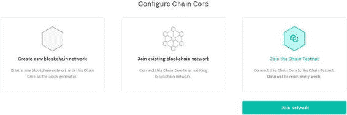图 11-4.配置 Chain Core 对于我们的演练，我们将加入一个行为类似区块链的测试网络，但所有数据每周都会重置。测试网络有助于了解如何正确地与区块链交互以及如何在 Chain 中管理资产。点击加入网络以打开 Chain Core 的仪表板。在这里，你有一个进行教程的选项。我们在这里介绍该教程的基础知识，添加有关 Chain 主要概念的更多信息。仪表板的左侧是一个导航菜单，如图 11-5 所示，我们将在整个演练中经常使用。导航菜单分为三个部分：顶部部分处理与帐户、资产和交易相关的数据。中间部分处理与区块链交互所需的私钥和公钥。底部提供一些开发者服务，我们将在演练后面谈论 Ivy Playground。要开始与测试网络交互，我们首先需要创建密钥。Chain 使用 HSM 支持的密钥管理，该密钥成为你进入网络的门户。要创建密钥，请转到导航菜单并单击服务下的 MockHSM。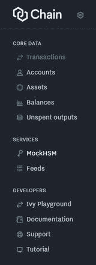图 11-5.Chain 仪表板上的导航菜单导航菜单分为三部分：核心数据，其中包括帐户、资产和交易；服务，我们可以创建 HSM 密钥；最后是开发者，其中包括一些开发者工具。我们将使用 MockHSM 选项卡创建一个密钥对。为什么我们需要 HSM 密钥对？这个密钥对将用于创建新类别的资产、发行新资产和创建新账户。Chain 仪表板的默认视图是交易视图。点击 MockHSM，你会看到一条消息，显示“没有 MockHSM 密钥”，这是合理的，因为我们还没有创建任何密钥。让我们从点击新建 MockHSM 密钥开始。你应该会看到图 11-6 所示的屏幕。为密钥输入一个别名，该名称将在整个 Chain 中使用。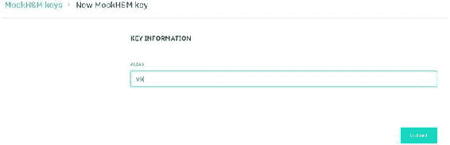图 11-6.创建新 HSM 密钥。在测试网络上，密钥数据将在一周内被擦除点击提交后，你应该会看到刚刚创建的密钥的确认，如图 11-7 所示。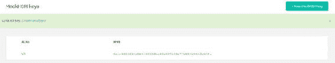图 11-7.使用别名 Vik 创建密钥的确认现在我们有了一个密钥对，可以用它来创建资产。点击核心数据下的资产选项卡，你应该会看到一些默认资产（在撰写时，Chain Core 有两个默认资产），如图 11-8 所示。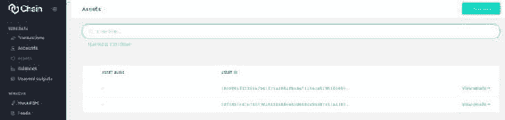图 11-8.Chain 中可用的默认资产我们将通过点击屏幕右上角的新建资产来创建新资产。你应该会看到图 11-9 所示的新资产屏幕。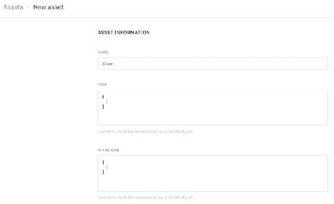图 11-9.资产创建和签名该过程需要两个步骤。首先是输入资产信息，包括在 JSON 格式中分配给资产的任何标识符或定义。第二步是用你的公钥签署资产。在这里，我们将资产命名为 Silver。完成资产信息后，您需要向下滚动，并使用我们刚刚创建的 HSM 密钥签署资产。图 11-10 显示了签署过程。Chain 文档提供了为什么用户可能需要多密钥身份验证的示例（如图

> 在简单情况下，一个资产或一个账户将定义发行或转账所需的单个密钥。但是，可以为不同的使用模式或实现不同级别的安全性定义多个密钥。例如，可以使用两个签名密钥定义一个价值较高的资产，要求两个独立的参与方分别签署每个发行交易。联合账户也可以定义为具有两个签名密钥，只需要任何一方的一个签署每个转账。所需的签名阈值数量称为法定人数。

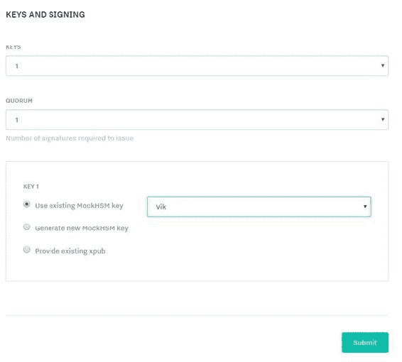图 11-10. 签署资产在这里需要考虑几个参数。默认情况下，可以使用一个密钥创建新资产的签名。批准新资产所需的签名数量称为法定人数，我们在这里使用默认值。最后，我们必须使用我们创建的密钥对资产进行签名。单击“提交”后，您应该看到一个确认屏幕，显示在测试网上创建的银色资产。现在我们有了一项资产，我们需要发行它。在 Chain 中，所有资产都由用户管理和控制；因此，我们发行的资产必须由一个账户控制。我们尚未在网络上拥有任何账户，所以让我们通过单击导航菜单上的“账户”来处理这个问题。这将带我们进入账户视图。在测试网上可能会有一些示例账户，如 Alice 或 Bob，但在账户屏幕的右上角有一个选项来创建一个新账户。单击它将打开一个与创建资产时非常相似的界面。事实上，这里的大多数步骤都是完全相同的，比如填写账户信息，然后提供一个 HSM 密钥来签名它。账户创建视图显示在图 11-11 中。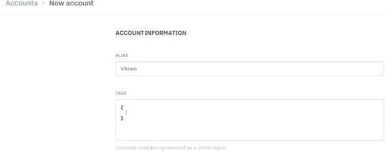图 11-11. 创建新账户创建账户有两个步骤：提供账户信息和密钥签名。第一步显示在图 11-11 中，第二步与签署资产完全相同。提供了账户信息后，使用您的 HSM 密钥对账户进行签名。将打开一个确认屏幕，显示您刚刚创建的账户。现在，为了说明账户之间的交易，我们需要两个账户。使用别名“Team Rocket”创建第二个账户，最终结果应如图 11-12 所示。图 11-12. 账户摘要。我们的测试网上有两个账户，可以展示交易、锁定和解锁。现在我们有了两个账户，我们可以开始在它们之间交易资产。需要注意的是，在 Chain Core 中，资产只能执行四种操作：发行资产、花费资产、转移资产（受控）、移除资产（退休）。通常，这些操作的组合允许用户之间的交易。我们在这里看两种类型的交易；一种是简单地向账户发行新资产，另一种涉及将该资产交易给我们创建的第二个账户。最后，我们通过查看这些操作在 Ivy Playground 中的演变来结束漫游。首先，导航到“交易”选项卡，然后单击“新交易”。这应该会带您到图 11-13 中显示的新交易屏幕。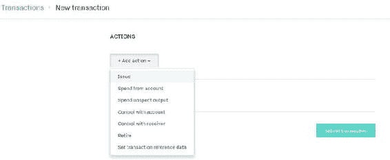图 11-13. 新交易屏幕交易只能根据我们之前提到的四种操作之一进行。每个操作都有一组相关的参数，需要提供以完成交易。在这里，我们想发行一个新资产，所以我们选择“发行”。选择“发行”后，将打开另一个屏幕，询问您要发行的资产的参数，如图 11-14 所示。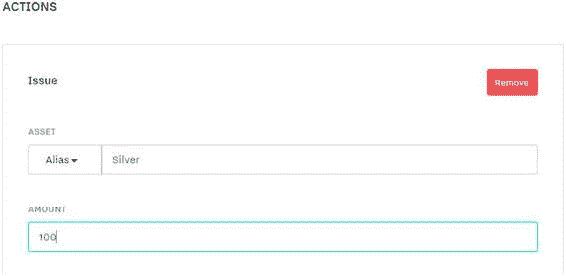图 11-14

> 区块链上的合约是不可变的。合约无法更新，只能被花费——即从区块链中移除，并用一个或多个新的合约替换，这些新合约锁定相同的价值。这种不可变状态模型将我们的方法与（例如）以太坊和面料的方法区分开来。在以太坊中，合约可以互相发送消息和价值，并可以根据这些消息更新自己的状态。大多数当前的智能合约方法提供了在区块链上执行任意逻辑的自由，但几乎不可能提供像 Ivy 设计的那样的安全保证。虽然其他平台的目标是使构建任何东西变得容易，但 Ivy 的目标是使构建任何错误的东西变得困难。

让我们通过查看使用公钥对锁定资产然后解锁它们的简单示例来完成我们的演练。首先，在导航菜单上点击 Ivy Playground。这应该将您带到一个默认合约加载的 Playground，该合约使用密钥锁定资产。这个想法非常简单：您选择要锁定的值；例如，在资产的情况下，我们可以锁定白银的单位，然后指定资产来自的账户。然后，我们提供给合约的参数，在这里，唯一的参数是使用密钥对锁定了资产。这个想法显示在图 11-21 中。锁定资产后，我们会看到该锁定的确认，如图 11-22 所示。注意：在 Ivy 上加载的默认合约也是最简单的合约。您的公钥用于锁定合约，您的签名需要用于解锁资产。它包含一个称为“花费”的条款，用于验证用户的公钥和签名以解锁资产。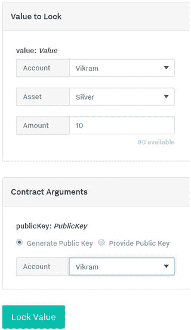图 11-21。选择资产参数和合约参数以在区块链上锁定资产的过程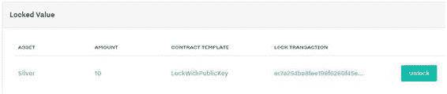图 11-22。在区块链上使用密钥对确认资产锁定我们介绍了 Ivy 中锁定的工作方式，现在让我们看看如何解锁这个资产。回想一下，我们需要一个公钥签名来解锁它，而且密钥必须与锁定它的账户匹配。然后，我们可以提供一个解锁目标，如图 11-23 所示。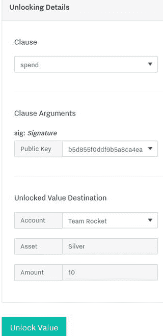图 11-23。使用 Ivy Playground 解锁资产在这里，解锁是与花费条款一起进行的，以转移资产。我们首先必须提供签名作为参数，然后提供解锁值的目标。此目标将控制解锁的资产数量。请注意，这个过程与我们之前执行的交易非常相似。这结束了我们对 Chain Core 和 Ivy 的演练。我们重点介绍了如何创建 HSM 密钥，如何创建新账户以及 Chain 可用的不同交易模式。最后，我们谈到了使用 Ivy 在智能合约中添加条款，以在区块链上更复杂地管理资产。让我们继续我们的旅程，探讨下一个主题，Quorum 区块链。

## 以太坊企业联盟

最近 DAO 黑客事件（在第九章中有所涵盖）之后，像 JPMorgan、微软和安永这样的公司组成了一个名为 EEA 的财团，旨在建立一个能够处理大量交易和商业应用的企业级以太坊区块链。JPMorgan 投入了大量的开发资源，为 EEA 提供了 Quorum，这是以太坊的企业级许可版本。什么是许可分类账？许可分类账限制了可以成为区块生产者或矿工的参与方，最终限制了谁可以对全局状态达成共识。在金融世界中，这种验证可能会成为大规模推广产品的必要条件。Quorum 的 GitHub 开发页面列出了以下功能，这些功能是对以太坊的改进：

+   隐私：使 Quorum 适用于企业工作的关键创新是通过私人交易和私人合约引入隐私。这是通过使用 Constellation，一个点对点的消息传递程序，来将私人信息流向适当的网络参与者来实现的。

+   替代共识：Quorum 不依赖于 PoW/PoS 进行许可分类账；相反，有两种更适合企业级区块链的共识机制：

    +   QuorumChain：一种新的基于智能合约的模型，依靠节点投票来达成共识。

    +   Raft 共识：适用于封闭成员财团环境的共识模型，具有非常快的区块生成时间。

+   节点许可：Quorum 中的一个功能，只允许与持有适当身份验证密钥的节点建立连接，并且已经注册参与了许可网络的节点之间建立连接。

+   更高的性能：Quorum 必须提供比以太坊显著更高的性能，以便用于高交易量环境，例如银行级交易量所需的环境。

让我们深入了解这些功能。我们首先讨论 Quorum 中可用的两种共识机制背后的关键概念。然后，我们介绍了对节点进行了哪些修改，使其能够处理私人交易。最后，我们讨论了 Constellation 以及它如何在许可网络中促进数据传输。在我们的技术讨论之后，JPMorgan 创建的 Quorum 功能和私人交易的摘要将随之而来。让我们从共识机制开始。

+   QuorumChain：这是一个多数投票共识机制，智能合约规定了哪些方（节点）可以投票接受或拒绝一个区块。Quorum 上的参与节点可以是制造节点，实际构建区块的节点，也可以是投票节点，对区块的有效性进行投票。QuorumChain 使用了从以太坊借鉴而来的签名验证方法，如 ecrecover，来验证来自制造节点和投票节点的投票。一旦来自投票节点的投票达到了一个阈值，该区块就会被网络接受。

+   基于 Raft 的共识：Raft-based 系统中的基本工作单位是一个日志条目。日志是事件的有序序列，如果网络的所有成员都就条目及其顺序达成一致意见，则认为它是一致的。在 Raft 中，一个节点可以是领导者或跟随者；所有节点最初都是跟随者。最终，通过对等选举过程，一个节点会成为领导者。将其与以太坊相比，在以太坊中，任何节点都可以挖掘新块，或成为特定轮次的领导者。在 Raft 中，只有领导者才能真正“伪造”一个块，但领导者不需要提出任何 PoW。相反，领导者提出一个块，跟随者对其进行投票。一旦它获得多数票（大多数投票），就被接受为扩展区块链的下一个块。跟随者还向领导者发送确认，现在块已经提交给日志条目。一旦领导者收到确认，它会通知每个节点，这个新条目（块）已经提交给日志。

现在我们已经谈论了共识，让我们看看是什么让节点接受私有交易。在以太坊中，所有交易都是公开的，默认情况下，节点只接受公开广播的交易。为了使 Quorum 工作，必须进行以下更改：

+   PoW 共识算法已被基于投票的 QuorumChain 取代。最终目标是在区块链上运行多个共识算法，这种模型被称为可插拔共识。

+   有一个修改后的连接层，用于识别和注册连接到权限分类账的节点。

+   状态树已分为两棵树：公共状态树和私有状态树。

+   可以使用包含私有交易的新逻辑来验证块。

+   可以创建交易，其中一些数据被替换为加密哈希，以在必要时保护隐私。

什么推动私人交易和合约通过网络传播，以及如何处理私人数据的流动？首先，在 ETM 中有一个新的可选参数称为 privateFor，并且它可以采用多个地址。Quorum 将此参数中的地址视为网络中的私人地址。引入了一种新的交易类型 IsPrivate，用于标记某些交易为私有。然而，使私人交易传播成为可能的主要工具是 Constellation：一种点对点的加密消息交换。以下是 Constellation 在 Quorum 中提供隐私的基本原理：在私有交易传播到 Quorum 网络之前，消息（包含在交易中）和标头被 Constellation 收到的加密有效负载的哈希替换。网络中的一些参与者已经在有效负载中包含了他们的公钥。当这些用户接收到有效负载时，他们可以使用自己的 Constellation 实例对其进行解密。其他每个参与者只会看到一个加密的哈希，并跳过该交易。参与的参与者将解密有效负载并将其发送到 EVM 进行执行，结果更新其内部状态。Constellation 中有两个组件在保持隐私方面起重要作用：交易管理器和飞地。交易管理器存储加密的交易数据，促进参与者之间加密有效负载的交换，并在满足条件的情况下管理私有交易的传播。它还对 Quorum 中的其他模块进行函数调用，特别是飞地进行密码函数。在许多方面，交易管理器的行为类似于控制消息从 Quorum 的一个组件流向另一个组件的中心枢纽。飞地是 Quorum 的密码核心。交易管理器本身不具有对任何敏感信息或密钥的访问权限，并将加密任务（如对称密钥生成和数据加密和解密）委派给飞地。它还保存网络中账户的私钥。交易管理器和飞地都与其他组件隔离以增强安全性。

### 零知识证明（zk-SNARKs）

零知识证明，或零知识简洁非交互式知识论证（zk-SNARKs），是一种新技术，ZCash 本土的其中隐私和匿名性在区块链上进行的交易中保持。最近，EEA 宣布 ZCash 团队将帮助为 Quorum 实现 zk-SNARK 层，以增强区块链上交易的隐私性和安全性。零知识证明技术是如何工作的？zk-SNARK 技术通常用于复杂的支付情况。让我们举一个例子。假设 Alice 从智能合约接收资金，如果发生 X、Y 或 Z 中的任何一种情况。现在，其中任何一种情况（X、Y、Z）可能对 Alice 的健康或可能是她不想向公众透露的商业决定敏感。这就是 zk-SNARK 可以发挥作用的地方：它可以向智能合约创建一个证明，表明三个条件（X、Y、Z）中的一个发生了，但不会透露发生了哪个确切的条件。更正式地说，ConsenSys 的 Christian Lundkvist 将零知识证明描述如下：

> 零知识证明的目标是让验证者能够说服自己，证明者拥有一个称为见证的秘密参数，满足某种关系，而不向验证者或任何其他人透露见证。

在我们之前的示例中，Alice 的三个选择构成了一个证人，她需要证明其中一个发生给智能合约，但不需要透露具体情况。来自 ZCash 的 Paige Peterson 确认了 zk-SNARK 将作为结算层出现在 Quorum 上，为交易提供了增强的隐私和安全性。最终目标（在 Consensus 2017 中描述）是使零知识证明区块链不可知，并实现结算层作为一种服务。与零知识证明集成的未来可以是面向权限账本的企业级交易的范式转变。通过一些经验教训，以及更好的结算层，有一些令人难以置信的机会可以在医疗保健领域应用，以保护患者数据并维护隐私。注意在撰写本文时，zk-SNARKs 领域出现了一项非常有趣的新发展。ZoKrates 是一种高级编程语言，可用于编写编译为以太坊兼容的 ZKPs 并在链上执行的零知识证明（ZKPs）。

### Quorum 回顾

图 11-24 和 11-25 是摘自 JPMorgan（获得许可）的演示文稿，并由 David Voell 提供给 Hyperledger 项目的 Quorum 的高层摘要。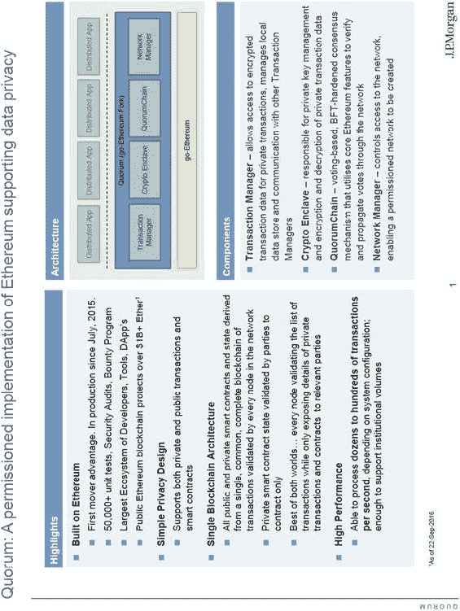图 11-24.Quorum 概述及其关键创新请注意图 11-24 右上角的 Quorum 的架构设计，正如我们之前描述的所有主要组件一样。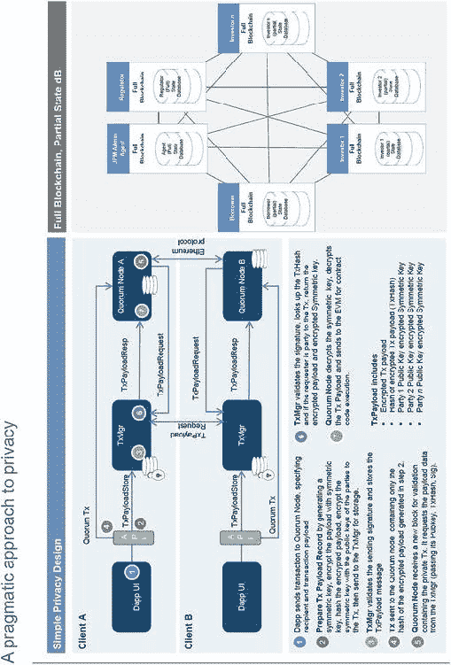图 11-25.Quorum 网络中传播隐私和私有交易的概述从这些幻灯片中最重要的收获点是私有交易在 Quorum 网络中传播的详细工作流程。我们没有机会说明这个工作流程，所以包含这张幻灯片应该会增强您对私有交易和 Quorum 中加密负载工作的理解。

### 以太坊企业路线图

图 11-26 和 11-27 是由 Bob Summerwill 提供的 EEA 的更新摘自。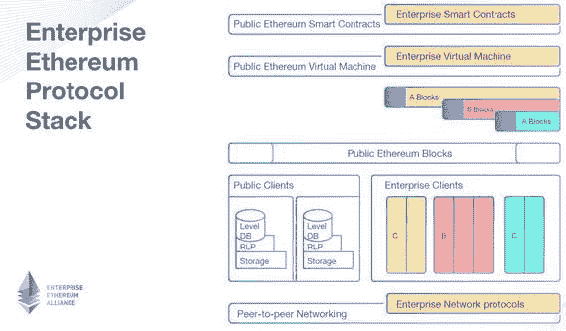图 11-26.用于处理企业级交易的新协议堆栈在这个示例中，隐私是重要的，大多数矿工（节点）是已知且可信任的。请注意企业协议位于具有必要修改以保护隐私的共享公共-私有区块链之上。公共客户端共享相同的存储和虚拟机，而私有或企业客户端将获得隔离的存储和执行加密负载指令的虚拟机。更广泛地说，以太坊企业是一个比仅仅由 EEA 开发的 Quorum 更大的运动。让我们退一步，谈谈为什么需要企业版。ConsenSys 的 Jeremy Miller 提供了三个主要原因：

+   以太坊最初是为公共链部署而开发的，其中无信任交易需求超过了绝对性能。当前的公共链共识算法（特别是 PoW）对于具有受信任的参与者和高吞吐量要求的网络来说是过度的。

+   从定义上看，公共链具有有限（至少最初）的隐私和许可要求。虽然以太坊确实使许可能够在智能合约和网络层实现，但它不太容易与传统企业安全和身份架构或数据隐私要求直接兼容。

+   当然，当前的以太坊改进过程（主要由以太坊改进提案主导）在很大程度上受到公共链事务的支配，在其中之前，企业 IT 要求的澄清和优先级化曾经具有挑战性。

2017 年 EEA 的主要技术目标是什么？图 11-27 提供了三个主要焦点。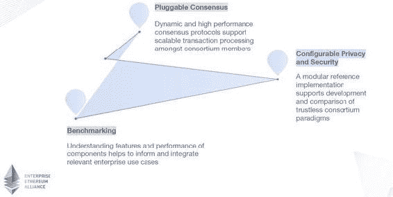图 11-27.2017 年 Quorum 的三个关注重点最大的关注和转变是朝着提供高级别的隐私（由 JPMorgan 确定为当前的主要障碍）的方向进行的，可以为用户执行的交易和智能合约进行配置。混合公共-私有链可以成为财团类型设置的完美模型。下一个关注点是创建可插拔的共识模型，其中交易和复杂情况可以选择适用于用例的最佳共识机制。最后，高容量性能对 Quorum 的成功至关重要，因此开发更好的基准测试工具来衡量和改进将成为广泛采用的关键。

## 总结

区块链世界中研发的迅速增长可以通过深入理解传统互联网公司和区块链公司的价值创造和捕获来解释。**Joel Monegro** 和 **Naval Ravikant** 讨论了“肥协议”的概念，其中大部分区块链空间的创新将发生在核心技术层面。然后，一个代币层可以实现对底层架构的使用进行货币化，并提供对应用层的访问。

## 参考资料

准备本章所使用的主要参考资料是 EOS 开发者指南和文档、Chain 开发者指南和 API 文档、Quorum 文档和 Quorum 向 Hyperledger 的演示，最后是由 Bob Summerwill 提出的以太坊企业联盟路线图。
