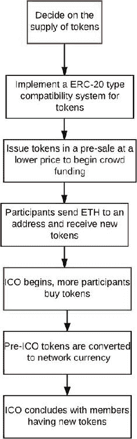

© Vikram Dhillon、David Metcalf 和 Max Hooper 2017 年 Vikram Dhillon、David Metcalf 和 Max Hooper 区块链启用的应用`doi.org/10.1007/978-1-4842-3081-7_12`

# 12. 技术革命与金融资本

Vikram Dhillon^(1 )、David Metcalf¹和 Max Hooper¹（1）美国佛罗里达州奥兰多全球金融市场正在发生剧变，这清楚地表明，如果没有创新，大多数商业和金融模型很快就会过时。最近一次对全球金融体系的概述将当前系统描述为：

> 这个系统每天转移数万亿美元，服务数十亿人，但系统充满问题，通过费用和延迟增加成本，通过冗余和繁琐的文件工作制造摩擦，并为欺诈和犯罪提供机会。据我们所知，45%的金融中介，如支付网络、股票交易所和货币转移服务，每年都会受到经济犯罪的影响；对于整个经济来说，这个数字为

丹·塔普斯科特指出，我们的金融系统由于多种原因而效率低下。其中三个具体现实是：

> 首先，因为它是过时的，是一种工业技术和纸质流程的混合物，打扮成了数字外壳。其次，因为它是中心化的，这使得它抵制变革并容易受到系统故障和攻击的威胁。第三，它是排他性的，剥夺了数十亿人接触基本金融工具的机会。银行家们很大程度上避开了创造性破坏，尽管这种破坏可能会很混乱，但对经济的活力和进步至关重要。²

我们从全球金融市场相关问题开始本章，以及为何区块链可以成为金融市场效率的创新解决方案。然后我们转向风险投资、ICO、加密货币、代币和交易所的话题。我们探讨了 ICO 市场的重大影响、监管状况、证券交易委员会（SEC）的参与、独特技术、商业模式、监管科技等相关问题。在我们审查这些概念和问题时，有几个问题和思考值得记在心中：

+   众筹如何扩展区块链应用？

+   新公司和借贷平台如何创建？

+   监管科技能否满足市场对高效合规的需求？

+   金融科技对银行业和投资银行的市场影响如何？

+   ICO 筹款和 ICO 泡沫的现状是什么？

+   随着技术帮助民主化金融机会，各个财富水平的人如何参与金融市场？

我们在本章中总结了多个大型金融集团的现状以及它们在区块链、金融科技和其他金融技术方面的参与情况。

## 区块链行业现状

区块链行业的现状显示，2017 年第二季度增长迅猛。据 Smith＆Crown 称，这证明了区块链行业的增长期。加密代币市场在几周内的价值翻倍和翻三倍。这一季度的 Smith＆Crown 指数（SCI）反映了牛市，4 月至 6 月间翻了一番以上。加密代币市场资本化的增长伴随着代币销售市场的狂热活动。据所有报道，2017 年第二季度创下了记录。³

### 区块链解决方案

正如我们在之前的章节中所述，区块链是打破金融系统低效性的创新解决方案。卡斯特莱因指出，区块链技术的五个基本原则使得区块链可以改变金融市场交易的创建方式。值得在这里重申一下技术的五个基本原则：

+   分布式数据库：区块链上的每个参与方都可以访问整个数据库及其完整的历史记录。没有单一方控制数据或信息。每个参与方都可以直接验证其交易伙伴的记录，而无需中介。

+   点对点传输：通信直接发生在对等节点之间，而不是通过中心节点。每个节点都存储并将信息转发给所有其他节点。

+   透明度与匿名性：每笔交易及其关联的价值对于任何具有系统访问权限的人都是可见的。区块链上的每个节点或用户都有一个唯一的 30 多个字母数字地址来标识它。用户可以选择保持匿名或向其他人提供身份证明。交易发生在区块链地址之间。

+   记录的不可逆性：一旦交易被输入到数据库中并更新了账户，记录就无法更改，因为它们与之前的每一笔交易记录都有关联（因此称为链）。各种计算算法和方法被部署以确保数据库上的记录是永久的、按时间顺序排序的，并且对网络上的所有其他人可用。

+   计算逻辑：账本的数字特性意味着区块链交易可以与计算逻辑相结合，并且实质上是可编程的。用户因此可以设置算法和规则，自动触发节点之间的交易。

塔普斯科特说道：

> 人类历史上首次，两个或更多的方，无论是企业还是个人，甚至可能彼此不认识，都可以在不依赖于中间人（如银行、评级机构和政府机构，如美国国务院）的情况下达成协议，进行交易，并创建价值，以验证他们的身份、建立信任或执行关键的商业逻辑——合同、结算、清算和记录任务，这些是所有形式的商业的基础。 

区块链应用可以通过点对点交易和合作降低所有经济参与者的交易成本。区块链是一个真正改变游戏规则的金融市场解决方案，

## 风险投资和 ICO

真正的问题是：ICO 是否会取代传统的风险投资作为筹集资金的模式？几乎没有人能想象到，在一年内，风险投资行业会被名为 ICO 的新型创新筹资方法超越并改变。ICO，也被称为代币销售，是区块链技术、众筹、创新的财富理念和加密货币投资发展出的新模式。ICO 既是对风险投资行业的威胁，也是机遇。传统的风险投资家看到 ICO 中加密货币、区块链投资、流动性和更快金融收益的利润机会。传统风险投资家的运作方式和市场地位可能会受到干扰。这是由技术创新驱动的金融市场的一个重大关注和变革时期。美国证券交易委员会最近在一封信中断言，ICO 受到证券法的约束。SEC 将就加密货币问题和 ICO 采取行动的确定性解决了一个重大问题。然而，目前尚不清楚个人、团体和发行如何成为符合 SEC 标准。这个过程需要时间来解决，并建立规则和先例。

## 首次代币发行

ICO 是众筹发布新加密货币的一种方式。通常，在发布新加密货币之前，新加密货币的代币被出售以筹集技术开发资金。与首次公开募股（IPO）不同，获取代币不会授予对开发新加密货币的公司的所有权。与 IPO 不同，ICO 没有（全面的）政府监管。⁶使用分布式分类账方法的 ICO 和新的融资模式开始扰乱公开市场（IPO）和私人投资（风险投资）。Coin Desk 的一篇文章阐明了区块链对风险投资形成的影响。Coin Desk 进一步指出：“来自创业者和投资者受众的需求和兴趣得到了证明，而监管指导有限。 ICO 可能继续作为一种融资机制获得动力。”⁷“首次代币发行（ICO）正在以快速而扩展的方式改变加密货币市场。此外，风险投资行业正试图理解这种新的金融投资。哈佛商业评论作家理查德·卡斯特莱因表示：“比特币社区通过区块链技术、新财富、聪明的企业家和由区块链推动的想法支持的加密投资者的汇聚创造了这种情况。”⁸ICO 在筹集资金方面占据主导地位，资金规模最大的 20 家公司中有一半来自加密社区。高盛、纳斯达克和洲际交易所等公司，美国控股公司，拥有纽约证券交易所，已成为区块链项目中最大的投资者之一。⁹Coin Telegraph 解释了 ICO 如下：

> 一个最近出现的概念是在加密货币和区块链行业中众筹项目。当一家公司发布自己的加密货币以筹集资金时，它会释放一定数量的加密代币，然后将这些代币销售给其目标受众，最常见的是用比特币交换，但也可以是法定货币。因此，公司获得资金用于产品开发，而观众成员获得加密代币份额，并完全拥有这些份额。¹⁰

如何创建 ICO 以及执行步骤的具体示例在 SONM 执行模型中进行了描述。首先，什么是 SONM？“SONM 是一个全球操作系统，也是一个分布式全球雾计算机。它有潜力包含无限的计算能力（IoE，IoT）。使用 SONM 系统组织的全球计算可以用于完成从 CGI 渲染到科学计算等众多任务。”¹¹SONM 的定义特征是其去中心化的开放结构，买家和工人可以在没有中间人的情况下进行交互，同时首先建立对他们有利的市场，与其他云服务（例如，亚马逊，微软，谷歌）不同。与广泛使用的集中式云服务不同，SONM 项目实现了雾计算结构，一种分散的设备池，所有这些设备都连接到互联网（IoT/IoE）。SONM 使用 SOSNA 架构实现了雾计算。SONM ICO 中的具体执行步骤如下：

+   SONM 平台使用同名代币 SONM（票号 SNM）。

+   SNM 的总供应量将限制在众筹期间创建的代币数量。

+   买方将使用 SNM 代币通过基于智能合约的系统支付计算费用。

+   SNM 是在以太坊区块链上发行的代币，使用了包括以太坊钱包在内的标准来实现和存储以及管理代币。

+   SONM 项目的众筹，ICO 和 SNM 创建将使用以太坊智能合约进行。

+   愿意支持 SONM 项目发展的参与者将以指定的 ICO 以太坊地址向其发送 Ether，通过此交易以指定的 SNM/ETH 汇率创建 SNM 代币。

+   ICO 参与者只能在众筹期开始后（以以太坊区块号指定）向 SONM 众筹以太坊地址发送 Ether。

+   众筹将在创建指定的结束区块或达到 ICO 上限时结束。

+   SNM 代币销售 ICO。

+   SONM 预售于 2017 年 4 月 15 日启动，并在不到 12 小时内成功结束，筹集了 10,000 个以太坊。

+   预 ICO 代币将通过特殊的安全迁移功能转移到主代币合约中。

+   代币分配已完成给所有相关方。

+   交易完成。¹²

这个过程在图 12-1 中显示。图 12-1.SONM 代币的 ICO 流程以视觉方式呈现

## 数字货币交易所

数字货币交易所（DCEs）或比特币交易所是允许客户交易数字货币以换取其他资产，如传统法定货币或不同数字货币的企业。他们可以是通常以买卖价差作为交易佣金的市场措施，也可以只是收取费用作为匹配平台。¹³通常，DCEs 在西方国家之外运营，避免监管监督并使起诉复杂化。一家总部位于美国的全球比特币交易所名为 Kracken，位于旧金山。Kracken 网站称 Kracken 是欧元交易量和流动性最大的全球比特币交易所。Poloniex 在其网站上被描述为一家总部位于美国的数字资产交易所，提供最高级的安全性和先进的交易功能。在与 DCEs 合作以及在全球范围内运营的所有方面，很重要的是轻松而准确地建立身份。在去中心化数字世界中，基于区块链的数字身份网络呈现出不同的身份管理未来。利用共享账本、智能合约和治理来标准化管理，同时降低去中心化身份管理的成本、风险、时间和复杂性，数字身份网络在企业间驱动信任。

## ICO 监管状况

此时，Coin Desk 讨论了 ICO 监管状况，重点关注了六个国家的法律地位。最近一份来自 FinTech 和研究公司 Autonomous Next 的报告引述了一些值得关注的观点。该报告认为瑞士和新加坡是为 FinTech 和加密货币创造欢迎环境的两个最先进的国家。在瑞士，法律规定加密货币是资产而不是证券。新加坡也是如此。新加坡金融管理局不监管虚拟货币交易，但确实监控 KYC 和 AML，报告称。报告指出，英国和美国是活动频繁但法律不明确的司法管辖区。美国有许多监管机构和 50 个实施规则的州，使监管过程变得更加复杂。特拉华州最近通过了与区块链相关的立法。在中国，代币被视为非货币数字资产。俄罗斯对加密货币持开放态度。加密代币被归类为类似衍生品的合法金融工具。¹⁴Smith & Crown 指出，关于代币销售法律地位仍存在重大问题。参与代币销售的参与者可能不享受与私募和公募股权销售投资者相同的法律地位或保护。不受限制的代币销售筹集和结构使项目能够筹集大量资本，同时保留其代币经济的主要控制权，这可能会引起监管机构的注意。许多国家正在积极探索代币销售的新监管框架，包括 Smith & Crown 在内的一些团体正在制定最佳实践和自律准则。¹⁵当前的监管状况是美国证券交易委员会发出了一封信，声明 ICO、加密货币和相关事项被视为证券。正如之前所述，这为市场对这个问题有了一些明确的认识。尽管有些人会积极地阅读它，而其他人则会消极地阅读它，但最终 SEC 的声明在美国乃至全球范围内开启了一种全新的监管环境理解。针对区块链代币的证券法框架描述了任何对区块链代币感兴趣的人的多个关键想法和行动。“该框架侧重于美国联邦证券法，因为这些法律对区块链代币的众筹销售构成了最大的风险。在许多司法管辖区，根据代币实际所做的事情，还可能存在反洗钱法和一般消费者保护法等问题，以及特定的法律。” Howey 测试确立了投资合同是否为证券的测试（SEC v。Howey）。¹⁶该框架说明了代币销售的六个最佳实践：

1.  1.发布详细的白皮书。

1.  2.针对预售，承诺一个发展路线图。

1.  3.使用开放、公开的区块链，并发布所有代码。

1.  4.在代币销售中使用清晰、逻辑和公平的定价策略。

1.  5.确定为开发团队设置的代币百分比。

1.  6.避免将代币作为投资进行营销。

### ICO 投资的利弊

最近，“Invest It In: Investment Ideas”中 Jim Reynolds 在一篇文章中阐明了投资 ICO 的利弊。这份利弊清单并非详尽无遗，但确实包含了许多需要考虑的观点。以下是 ICO 的利益。对于 ICO 创始人：企业家

+   高效筹集资金。

+   ICO 比 IPO 便宜得多。

+   ICO 所需的文件比 IPO 少得多。

+   作为替代币获得曝光的品牌和营销机会。

+   社区建设。

+   与早期采用者建立利益关系；这将使他们成为项目营销机制的一部分。

+   企业家与投资者分享努力的风险和收益。

+   创始人/开发者拥有一种可以帮助他们充分利用自己技能的方法来筹资项目。

+   受人尊敬的加密专家们有一个机会利用多年来积累的技能和信誉获得回报。

+   股权证明替代币通过 ICO 解决了公平分配的问题，在 PoS 中，代币立即成熟。

+   风险投资资本对创始人的愿景 360°更具侵入性。ICO 的一种替代方案是借贷，但这对项目的现金流有许多影响，不总是能在替代币/加密项目中管理。

+   一些透明度；例如，可以使用第三方担保验证 ICO 后资金的使用情况。

+   早期投资者在初创公司中拥有更多的流动性。

+   提前访问具有资本增长潜力的代币。

+   未受任何政府组织的监管或注册，并且通常没有除平台内建的投资者保护之外的其他保护措施。

+   投资者可以成为社区的一部分。

+   部署资本的创新方式。

+   使用现有网络如 Stratis、Ardor 和 Ethereum 的 ICO，正在利用现有生态系统的网络资本。

+   从主要加密货币中转移到替代币。

+   投资者通常是替代币的首批用户；因此，与持有从未使用过其产品的公司股票不同，具有讽刺意味的是，替代币比其他投资更具体。

+   投资 ICO 的回报率可高达 1,000%，但也可能完全亏损。

+   多样化投资到其他资产。

+   这是一种高风险、高回报的投资，它在某种程度上与股票市场和经济脱钩。

+   拥有不以法定货币为基础的替代资产。

针对加密货币社区

+   替代币将推动构建 Web 3.0，一个去中心化的网络。互联网协议堆栈变得完全独立于任何中央实体。

+   虽然一些替代币项目技术可能失败，但它们是金融技术的前沿。关于所提出的技术和商业模式的经验教训将使整个社区受益。

+   加密领域中的更多竞争使竞争对手更加精简，这意味着市场的“看不见的手”在更多替代币项目推出时将更快地进行创造性破坏和适者生存。

+   替代币之间的内部竞争是健康的，因为它为真正的竞争——基于加密的去中心化项目与传统公司——做准备。

+   有两种思路：比特币至上主义者认为比特币是唯一真正的加密货币，而替代币则是实验。其他人认为替代币最终将取代比特币，就像视频被 CD、Myspace 被 Facebook 和旧相机被数码相机所取代一样。

以下是投资 ICO 的风险。

+   骗子利用无监管的行业。

+   业余人士可以利用 ICO 来启动注定会失败的项目。

+   长期项目交付时间线增加了竞争产品可能在之前发布的风险。

+   交易所需要接受替代币才能形成替代币市场。

+   ICO 可能被炒作，并“泵动”以掩盖 ICO 的缺点，并使投资者情感投资，只是后来发现这一切都是热气。这是通过依靠比特币、以太坊和 Dash 的成功而背后提供了任何真实回报。

+   监管机构可以改变规则，并在未来使具有某些功能的币种非法化。

+   替代币技术非常新，诸如协议协议上的一致性等基本问题尚未解决。许多替代币将诞生，而其他替代币将消失，直到我们最终看到加密币的谷歌、Facebook 和 YouTube。

+   某些代币可以被复制（分叉）并改进。克隆品最终可能比原版更有价值。当代币不是网络的固有部分时就会发生这种情况。

## 监管技术：RegChain

监管技术（RegTech）是一个新的创新领域，对监管行业有很大的潜力。 RegTech 是由 Investopedia 定义的，“是监管技术的混合词”，旨在通过创新技术解决金融服务领域的监管挑战。 RegTech 包括一组公司，这些公司利用技术帮助企业以高效、低成本地遵守法规。EY 出版物《与监管技术创新》中总结了几个提供监管技术的优势：

+   支持创新。

+   提供分析。

+   降低合规成本。

还有一些短期利益：

+   成本降低。

+   可持续和可扩展的解决方案。

+   先进的数据分析。

+   控制和风险平台实现无缝链接。

长期收益包括以下内容：

+   积极的客户体验。

+   增加市场稳定性。

+   改进治理。

+   增强的监管报告。¹⁹

Deloitte 创建的 RegTech 模型的当前创新体验是 RegChain。

> Deloitte 与爱尔兰基金及其成员合作，推进了“灯塔项目”，以评估区块链技术服务监管报告要求的能力。该项目测试了一个平台能否为基金管理员提供个别节点来存储和分析基金数据，同时将监管报告要求编码到智能合约中进行执行和数据验证。还提供了一个监管者节点，允许公司与监管机构之间的安全交换数据，以及增加整体报告效率和市场透明度。除了技术设计和开发之外，还进行了一项比较商业分析，以审查所提议的区块链解决方案的成本效益分析。RegChain 使用 Deloitte 的快速原型制作流程开发，该流程采用基于实验的敏捷方法论。关键短语包括解决方案愿景定义、设计和测试参数、开发冲刺以及与产业小组委员会的持续审查，该委员会由基金管理员和基金管理界的参与者组成。该项目的一个关键考虑和基石是确保技术人员和来自运营、监管团队和高级管理层的行业代表之间的合作。这被认为是至关重要的，以便拥有全面的 PoC 设计，而且，更重要的是，以帮助定义未来的生产解决方案如何实现。²⁰

由于一些特征和特性，区块链技术被用于提高满足报告要求的整体能力：

+   数据完整性。

+   可靠性。

+   存储和速度。

+   分析。

+   概念验证（PoC）。

PoC 创建了 RegChain，这是一个基于区块链的平台，通过作为大量监管数据的安全存储和审查的中央仓库，简化了传统的监管报告流程。 RegChain 已在市场上成功地应用于多个应用程序，并带来了未来将更广泛采用和享受该模型的好处的希望。

## 新的区块链公司和想法

《哈佛商业评论》一篇文章称：“许多企业尚未从工业时代跨越到信息时代，技术和组织进步之间的差距正在加大。”²¹ 高盛已经在数字创新和区块链应用领域采取了一系列大胆而果断的步骤。高盛参与了一些基于区块链技术的公司，如 Circle 和 Digital Assets Holdings。此外，2016 年 10 月，高盛推出了一个在线平台，为消费者提供无抵押个人贷款。

### Homechain 和 SALT

另一家新公司是 Homechain ，被描述为贷款起源和监管合规性的未来。其业务理念是将房屋贷款起源和监管合规流程从 42 天缩短到 5 天。RegChain 允许合规性向报告机构报告。目前，区块链技术正处于互联网 1992 年的阶段，它正在开启一系列新的可能性，有望为包括金融、健康、教育、音乐、艺术、政府等在内的众多行业增添价值。SALT 借贷平台允许区块链持有者将其持有的资产作为抵押物获得现金贷款。SALT 是第一个基于资产的借贷平台，为区块链资产持有者提供了获得流动性的机会，而不必出售其代币。SALT 通过完全抵押的债务工具为投资者提供了一种创新和安全的机会，以对高增长资产类别进行贷款。SALT 是传统贷款，以非传统抵押物担保。每个 SALT 代币都代表对 SALT 借贷平台的会员资格。该代币是一个 ERC20 智能合约。区块链技术正在许多行业掀起波澜。各个领域的公司正在创新，并利用区块链创建新应用并创办颠覆性公司。Accenture 的一份报告显示了世界上八家最大投资银行的成本数据，并指出到 2025 年，区块链技术可以帮助投资银行将成本降低多达 120 亿美元。投资银行使用区块链技术有多种好处，包括更安全的数据、更安全的数据和成本降低。²³

### Ambrosus、Numerai 和 Swarm

最近成立的另一个新公司的例子是瑞士区块链公司 Ambrosus 。该公司推出的目的是利用智能合约跟踪食品质量。利用区块链技术进行创新已经在各个领域得到了应用。Numerai 是一种由一群数据科学家构建的新型对冲基金。Numerai 是一家面向机器学习专家的众包对冲基金。据 Tech Crunch 报道，在第一年收集的数据科学家有 7500 名在 Numerai 平台上创建了算法。Numerai 宣布了一种名为 Numeraire 的加密货币代币，以激励全球的数据科学家贡献人工智能。据 Numerai 报道，Numerai 智能合约已经部署到以太坊，并向全球 19000 名数据科学家发送了超过 120 万个代币。Swarm 创业公司在市场上推进了几个新概念，并处于两个新兴概念的前沿，即众筹和加密货币，同时在一个具有复杂和不断发展的法规的市场中创建了一家创业公司。其想法是改变企业家筹集资金的方式。Swarm 创建了一个名为加密权益的新概念，这是一个代表您的项目成功的代币。Swarm 建立在以下三个组成部分之上：

+   加密权益。

+   众包尽职调查。

+   所有 Swarm 持有者分发的硬币。Swarm 最好的描述就像是通过硬币提供的加密版 Kickstarter。

KICKCO 是一家新公司，具有独特的模式。他们的网站说明如下：

> KICKCO 处于两个年轻产业的交汇处：区块链和众筹。KICKCO 将众筹从 Kickstarter 等集中平台转移到基于以太坊的智能合约上。这不仅允许我们以分散的方式实施众筹模式——大大降低了开销，还提供了一种机制来保护支持者免受失败项目的影响——用基于区块链的代币 KickCoins 来保证他们的投资。KICKCO 将为用户提供一个功能强大、方便、最新的平台，用于 ICO 和众筹活动。KICKCO 是一个自动化和独立的基于以太坊的 ICO、预 ICO 和众筹活动平台，由加密货币资助。KICKCO 的目的是解决上述问题，创建一个将 ICO 和众筹活动的创作者和支持者汇集在一起形成活跃、最新的社区的单一平台。²⁵

所描述的公司展示了围绕区块链模型展开的一些创新和创造性思维。区块链不断推动金融市场变得更加高效的新颖方式。

## 民主化投资机会

区块链可以帮助世界上最贫困的人们。世界经济论坛的一篇文章描述了交易可以以低成本和透明的方式记录，这样就可以让资金在没有恐惧、欺诈或盗窃的情况下进行交换。区块链智能合约、国际汇款、降低成本、保险服务、帮助小型企业、人道主义援助以及基于区块链的身份系统只是区块链可以帮助许多人的一些方式。对于没有护照、出生证明、手机或电子邮件的人来说，区块链记录可以加快处理速度，为许多人带来更好的生活方式。通过众筹更小的投资金额和许多新的资本形成项目，之前没有机会分享不断增长的金融市场经济的人们可以参与其中。区块链有助于使金融民主化，并以新的方式影响人们的生活。

## 摘要

未来属于创造、创新、变革和全球影响，因为众筹使区块链在全球范围内得以实现。来自安永和创新金融的报告深入探讨了资本市场的格局。克里斯·斯金纳在他的博客《金融科技与投资银行的世界》中指出：“有一大批新技术正在构筑资本市场的格局，数以百计的初创公司正在利用这些新技术来协助和攻击投资银行界的低效率。最大的银行并没有忽视这些变化，而是在投资于这些技术。”²⁶ 高盛、花旗集团、摩根大通、摩根士丹利、富国银行和美国银行等大型银行和投资银行家正在向金融科技、区块链和其他技术创新投资数百万美元。资本市场的颠覆正在以迅猛的速度发展。最近一篇《福布斯》文章指出，现在已经有超过 900 种加密货币存在，每天还在增加。自 2017 年中期以来，ICO 市场筹集的资金超过了风险投资市场。未来将会有许多市场的起起落落，市场上会出台新的监管措施，我们将经历技术革新和金融资本迅速变化的许多变化。对于那些身处市场并看到更好的金融世界未来的创新者、梦想家、个人和团体致以特别的敬意。孵化器、加速器、大学和投资公司为区块链效率和创新而努力的不懈承诺将改变世界对金融资本的看法。创新无处不在。高盛、摩根大通、纳斯达克以及特别的另类投资公司如 Triloma Securities 提供独特的产品、服务、创新和资本。在许多地方市场上正在发生的情况是，一些组织结合在一起，为技术领域的共同目标而合作和对齐。奥兰多和中佛罗里达地区的一个独特团体已经联合起来帮助初创企业，并推进区块链研究和应用。该团体由包括佛罗里达天使网络、Merging Traffic、StartUp Nations Ventures、模拟与培训研究所、混合新兴技术整合实验室（METIL）、医疗旅游协会在内的各种组织组成，所有这些组织都在一个健全的公私合作生态系统中共同推动变革，造福市场中的所有人。区块链将带来金融资本的独特技术革命。脚注 1[`hbr.org/2017/03/how-blockchain-is-changing-finance`](https://hbr.org/2017/03/how-blockchain-is-changing-finance)2[`hrb.org/2017/03/how-blockchain-is-changing-finance`](http://hrb.org/2017/03/how-blockchain-is-changing-finance)3[`www.smithandcrown.com/categories/feature/`](https://www.smithandcrown.com/categories/feature/)4[`hrb.org/2017/03/what-initial-coin-offerings-are-and-why-vc-firms-care`](https://hrb.org/2017/03/what-initial-coin-offerings-are-and-why-vc-firms-care)5[`hrb.org/2017/03/how-blockchain-is-changing-finance`](https://hrb.org/2017/03/how-blockchain-is-changing-finance)6[`en.wikipedia.org/w/index.php?title=Initial_coin_offering&oldid=784220634`](https://en.wikipedia.org/w/index.php?title=Initial_coin_offering&oldid=784220634)[7](#Fn7
