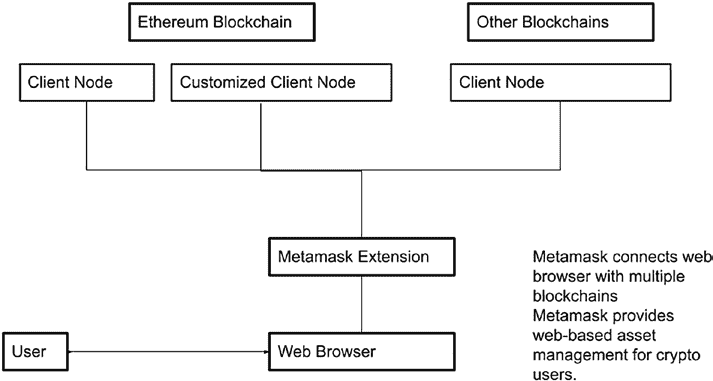
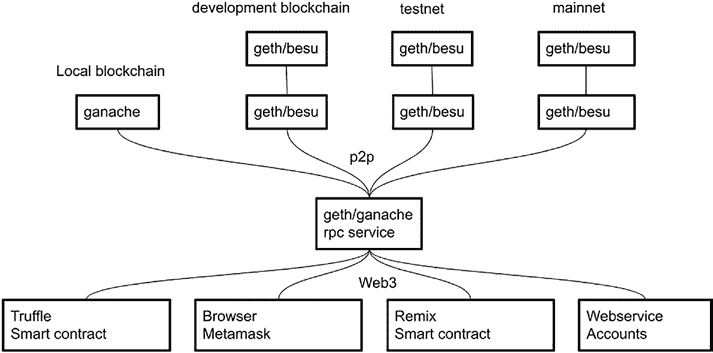
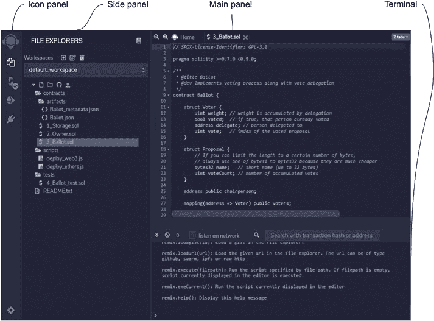
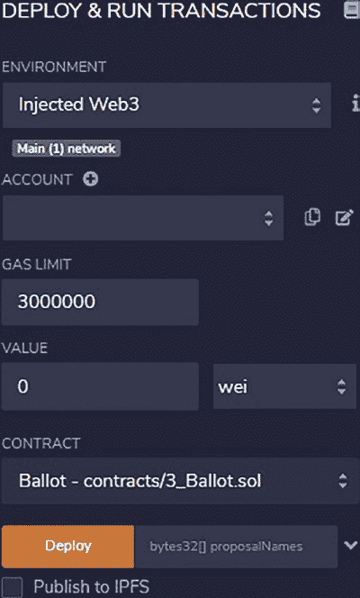

**应用层**

应用层包括软件应用，代币和智能

合约语言。

首先，软件应用程序有三个元素，如下所示：

*一个网页界面*

去中心化应用程序需要一个网页界面

*一个 dApp 连接器*

连接器使用 web3 将网页与

区块链智能合约

在*智能合约上

智能合约为企业提供业务和交易逻辑

区块链*

您的应用程序

应用层中的第二个重要组件是

代币。这是区块链独特的特点，代币经济至关重要

维持区块链和去中心化应用程序。代币设计

217

第六章 ethereum arChiteCture 和 Overview

包括要发行的代币类型，供应的代币数量，以及谁

管理代币供应，以及是否发行新的代币

应该生成新的代币或重用现有的代币。

智能合约语言也是需要考虑的一个重要因素。除了

除了 Solidity，还有其他语言，如 Vyper，Yul，FE 和 Serpent

可以用来编写智能合约。

总之，以太坊区块链架构包括

以下层次：网络层，核心区块链层，企业

区块链层，工具层和应用层。每一层

对以太坊区块链至关重要。我们将描述

更详细地介绍开发人员关于工具层和应用层

后续章节。

**以太坊区块链生态系统**

**和 DeFi 项目**

在智能合约开发之前

了解当前以太坊生态系统至关重要

已经有数千个智能合约和 dApp 部署在

以太坊区块链已经存在。我们将介绍一些这些项目

让你知道有哪些项目已经可用。这是

与其重新发明轮子，不如更好地头脑风暴新想法。

**资产管理钱包**

区块链应用的第一类是用于

管理资产。

在传统金融中，如果你想管理你的资产，你最有可能是

将去银行开设账户，并让银行为您管理资产

你。但是，在以太坊区块链上，资产是存储在分布式

账本，因此，有多种方法可以管理它。

218

第六章 ethereum arChiteCture 和 Overview

**托管服务**

您可以使用 Coinbase 开设账户，并让 Coinbase 托管

管理您的加密资产。当 Coinbase 托管您的资产时，您

不管理资产的私钥；相反，您创建一个登录账户

使用 Coinbase 服务，让 Coinbase 在您的

代表您进行交易。这类服务是集中的。有资产管理

世界各地提供与 Coinbase 类似服务的资产管理系统

对于那些更喜欢在没有中央门户的管理下管理资产的用户，这是他们的选择。但在以太坊区块链上，资产是存储在分布式

通过使用存储在 Coinbase 钱包中的资产，可以完全控制他们的资产

他们的私钥本地。 Coinbase 钱包允许用户创建账户

自己操作并直接与区块链进行资产管理。

无需通过托管商即可进行。

**MetaMask**

MetaMask 是最受欢迎的 Web 浏览器扩展钱包之一，

图 6-3 展示了 MetaMask 如何与区块链交互以管理资产。

***图 6-3。 MetaMask 工作流程*

219

第六章 以太坊架构和概述

MetaMask 可以在 Chrome 或 Firefox 浏览器上安装。对于

在 Chrome 安装后，你只需从 Chrome 网上应用店下载它。

启动时，它会

为用户创建加密账户。而不是直接生成私钥，

MetaMask 使用 BIP39 规范生成助记词，即

种子短语，这是 12 个常见且容易记住的英文单词。

种子短语可用于生成多个私钥和

地址。你需要写下种子短语才能恢复

如果移除扩展程序，MetaMask 账户将消失。

**MyEtherWallet**

MyEtherWallet (MEW) 是一个开源的客户端界面，允许

用户直接与以太坊区块链交互，而无需

加入中心化交易所。图 6-4 展示了从用户操作到区块链的交易流程。

***图 6-4。 MyEtherWallet 工作流程*

220

第六章 以太坊架构和概述

尽管 MyEtherWallet 只在不具有区块链的客户端侧工作，

信息发送回 Web 服务器进行处理和存储，因此

使用硬件或移动钱包仍有可能发生钓鱼攻击。

建议使用 MyEtherWallet。基于 Web 的 MyEtherWallet 不是

建议使用，并且仅应在离线环境中使用。

**Fortmatic**

Fortmatic 是另一种允许用户创建账户的钱包。

使用他们的社交身份。这类似于 PayPal 服务，你

可以使用电子邮件地址创建账户。 Fortmatic 提供 API 以

与各种基于 Web 的去中心化应用程序连接，并且非常

对于不介意使用托管钱包进行加密货币的用户来说，非常方便。

交易和应用程序。

在本节中，我们提到了如 Web-based MyEtherWallet 等资产管理系统。

钱包，Web 扩展钱包，移动钱包和托管钱包。当

在选择或开发钱包时，需要考虑许多因素：

• **私钥** – 谁生成、存储和管理

私钥？

• **去中心化** – 钱包是否由中心

服务或托管服务？

• **安全性** – 是否发生过任何安全漏洞或

在这个钱包中报告的漏洞有哪些？

• **易用性** – 钱包的 GUI 和 UX 是否用户

友好？

• **开源** – 钱包是开源还是专有？

• **集中控制** – 钱包是客户端或服务器端

侧应用程序？

• **恢复** – 是否有可靠的恢复

如果钱包丢失或损坏，账户是否会丢失？

221

第六章 以太坊架构和概览

由于加密钱包需要管理区块链中的资产，所以

花些时间研究和选择最值得信赖的一个。

**智能合约启用银行 dApp**

在传统银行中，客户可以开立账户、存款和

借款。银行必须维护庞大的数据库和 IT 系统

跟踪所有交易并计算储蓄的利息。

账户和贷款。以太坊区块链是一个公共分布式

账本，加密银行功能如借贷可以轻松

用智能合约实现。

这个类别中一个流行的 DeFi 项目是 Compound。Compound 是

去中心化 DeFi 协议（开放 API）以实现借贷和借款。

通过智能合约发行加密货币。放贷者是一个参与者，

支持存款的加密货币，如 ETH、USDT、USDC 以及

将 DAI 存入 Compound 平台以获得利息。当放贷者存入

将加密货币 X 存入 Compound，智能合约将锁定该资产并

向存款人发行相同数量的 cX 代币。放贷者可以使用

将 cX 代币用于交易或稍后赎回 X 代币。智能合约

也将计算出放贷者每笔存款所获得的利息。

期间。借款人可以借用存款人存入的

放贷者存入 Compound 仓库作为抵押。借款人需要存入一笔

为了借用他们想要的加密货币，借款人支付

借款方为他们借入的加密货币支付利息，并且可以偿还所借的

加密货币以取回抵押品。

如果借款人的抵押品价值因子低于

贷款时，借款账户变得资不抵债并触发一个

清算事件。第三方可以支付部分贷款，并获得

将相应的一笔抵押品原封不动地存入这个账户。为了

激励第三方参与清算，一种激励

由 Compound 的治理系统提供。

222

第六章 以太坊架构和概览

在智能合约启用的银行功能中，没有中央

代理机构管理资产；社区需要关注智能

合约并进行安全风险检查。总是存在智能

合约被突破，客户的资金就会丢失。为了最小化

风险，智能合约总是开源的，项目团队

通常在发布之前会进行第三方安全审计。

公有区块链的主网。

**以太坊中的去中心化交易所**

加密交易所用于在两个

不同用户。已经有一些中心化交易所，如

Coinbase 和 Binance。去中心化交易所完全基于智能

合约，无需建立集中管理的数据库。

交易所。流行的去中心化交易所包括 DDEX、Loopring，

Uniswap 等。

自动市场

Maker (AMM)在中心化或传统

交易所。AMM 使用智能合约和算法来调整价格

流动性池中的资产数量，并使交易无需

维护订单簿。例如，Uniswap 是一个流行的 AMM DEX

通过智能合约使用以下机制：

**自动流动性协议** - Uniswap 允许

用户通过存入相等的

交易对的交易价值到一个智能合约。交易员

然后可以用资产与代币进行交易。当代币对（X，Y）中的

流动性池。

223

第六章 以太坊架构和概览

**自动价格调整** - 使用 Uniswap

流动性池，代币对中的代币数量

对（X，Y）需要平衡。如果代币

代币 X 增加，然后代币 Y 的数量

减少，代币 Y 的价格会增加。这种情况

触发负反馈以平衡池。

**仲裁**：仲裁是交易者之间的一个过程，

平衡流动性池中的价格波动。

代币 X 的数量增加时，代币 Y 的数量会减少，

（X，Y）增加，代币 Y 的数量减少，

和代币 Y 的价格会增加。仲裁员

然后发现代币 Y 的价格在其他交易所中更高，

其他交易所出售代币 Y。

交易所将代币 X 增加到 Uniswap，以增加

为了平衡流动性池，代币 Y 会增加。当

流动性池平衡时，代币价格应

与其他交易所的代币价格相似。

使用自动市场制造商机制，Uniswap 能够

在三年的时间里将 TLV（总锁定价值）增长到 50 亿美元，

每天以 5%的速度增长。

**NFT 应用**

NFT 是一种具有唯一标识的代币，不能

可以替换或与其他代币交换。NFT 的规格在

ERC721 和稍后的 ERC1440 版本。ERC721 的一个关键特性是

称为 id 的字段，其中包含每个代币的唯一值。ERC721 是最

经常用于表示创意艺术品。NFT 项目包括

0xcert，OpenSea，Decentraland，CryptoPunk 等。

224

第六章 以太坊架构和概览

0xcert 是一个允许您开发 NFT 的 SDK 工具集。大多数

在以太坊上发行的 ERC20 代币是可替代的，这意味着没有

代币项目之间的差异。可替代代币是基于价值的，就像

美元钞票可以互换。对于 NFT，每个代币都是不同的，它们是不可

不可替代的。例如，证书或文凭可以作为

因为它是唯一由机构发行的。

特定的人。将来，将会有越来越多的 dApps

为非可替代代币而开发。例如，原始艺术品，

法院文件，大学证书都属于这一类。

OpenSea 允许用户提交 NFT 作品进行销售或购买 NFT

支持加密货币的拍卖。他们还支持拍卖，以便用户

最高出价者有权通过智能合约购买 NFT 艺术品。

合约。所有交易都由智能合约自动控制，

无需手动干预或第三方托管。

**Oracle 服务**

Oracle 服务用于提供区块链与

传统的 IT 系统。区块链是自成一体的，没有直接

区块链客户端与 Web 服务器直接对话的方式。这是最

可能出于安全考虑而设计。比特币或以太坊

区块链上都集成了一个链上 Web API，用于调用托管在

传统的 IT 系统。为了让区块链与

传统的 IT 系统，需要使用 Oracle 服务。

Chainlink 是最受欢迎的 Oracle 服务之一，允许与

与以太坊区块链的传统 Web 服务相比。如果你有一个

需要获取外部数据的去中心化应用程序，你需要使用

Oracle 服务。例如，如果你的智能合约需要获取天气

信息，你必须使用 Oracle 服务，因为区块链本身不

没有任何天气信息。为了获取关于 FIAT/CBDC

价值，货币汇率或加密货币价值，你需要

也可以连接银行或第三方服务提供的 Oracle 服务。

225

第六章 以太坊架构概述

还有由 Proveble 和 Band 提供的其他 Oracle 服务

项目。Proveble 项目还提供一些 SDK 和示例代码来

与 dApps 合作使用 Oracle 服务，非常方便。

**DAO 平台**

DAO（去中心化自治组织）是使用智能

合约来管理组织或社区。DAO 平台

提供注册服务并为选民分配身份。每个

社区成员可以提出提案，也可以对

提案。区块链领域已经有许多 DAO 平台。

实际上，像 Compound 和 Uniswap 这样的许多项目都有自己的

DAO 社区和治理代币用于投票提案在链上。

社区。

**去中心化保险平台**

去中心化保险平台允许智能合约管理

保险服务的注册，从

来自各种来源的信息，并管理保险账户的索赔。对于

例如，如果你想要防止比特币价格暴跌造成重大损失，你

实际上可以发送交易到智能合约支付保费，

保险，保险提供商方面也有人会接受

保险请求。所有保险条款都被记录并强制执行

通过智能合约。如果发生意外事件并触发

保险行为，智能合约将执行相应的

功能并赔偿投保人。

226

第六章 以太坊架构概述

**去中心化 KYC 和身份验证**

KYC（了解你的客户）和身份验证是识别

真实人物，收集必要的个人信息以符合规定

工具生成一个本地单节点 Ethereum 区块链，并允许

一些出版物。

在去中心化应用程序中构建 KYC 功能是相当

**设置智能合约的工具**

**稳定币**

加密货币的一个挑战是其波动性。比特币和

以太币的价值波动很大，用它们来表示

产品和服务将导致价格波动。稳定币是一种

当与法定货币挂钩时，价值相对稳定。

这些稳定币通常是 Ethereum 区块链中的 ERC20 代币。

已经在 Ethereum 上的几乎所有主要类别中。有一些

稳定币包括 Gemini Dollar、TrueUSD、USD Coin 等，如报道所述

它们的价值观通过几种方式保持稳定。例如，

稳定币可以与美元以一对一的比例背书。这些

各种资产，并通过自动燃烧和铸币进行控制。有像 Civic、Hydro、Sovrin 和 uPort 等项目

应用程序仍然在涌现。一些小型的智能合约项目

具有挑战性。使用第三方 KYC 服务要容易得多。

发展革命性的去中心化应用程序的无限可能性

代币可以通过一些公共水龙头获得。没有可交易的

总之，几乎所有主要类别中都有许多大型去中心化应用程序

稳定币来保持价值稳定。

智能合约开发是一个迷人的领域。开发者可以找到

钱包、浏览器、节点客户端、智能合约 IDE，以及与

一旦他们学会了如何编程智能合约。

227

作为租赁共享、按需音乐服务和去中心化投票

第六章 Ethereum 架构和概览

还有像 MakerDAO 的 Dai 这样的，是一个聚合

**开发环境**

有多种方式设置环境与

Ethereum 区块链。图 6-5 展示了各种工具和组件的概览。

***图 6-5。** Ethereum 区块链的基本工具*

顶层显示了各种 Ethereum 区块链。Ganache

平台都是可以用智能合约构建的可能项目。

开发和快速测试智能合约和客户端。

开发区块链允许开发人员更改创世文件

并启动一个完全受控的区块链。开发者可以发行以太币代币

在开发区块链中，可以决定一个权限列表

用于区块链节点的最小可行工具集。测试网是公开的 Ethereum 区块链，

由 Ethereum 社区为测试目的而建立。测试网以太币

为去中心化应用程序提供去中心化身份服务。

加密价值用于测试网代币。公开主网是生产

228

第六章 Ethereum 架构和概览

Ethereum 的区块链，以太币有价值，可以在

交易所。在本节中，我们提到了包括

Ethereum 区块链交互的 Web3。

Ethereum 区块链。

**MetaMask:与以太坊区块链互动的最简单方式**

**Ethereum 区块链**

为了实际体验以太坊区块链，其中之一的

最简单的步骤是使用钱包创建一个账户并进行一些简单的

发送和接收加密代币的交易。这可以在

使用 MetaMask 连接以太坊。MetaMask 是一个网络扩展，可以被

安装在网络浏览器上以与以太坊互动创建账户

以下步骤:

步骤 1: 安装 MetaMask 扩展并创建

**加密账户**

访问 [`metamask.io 和 ins`](https://metamask.io)tall MetaMask

到您的网络浏览器，如 Chrome 或 Firefox。

安装后，打开 MetaMask 并写下

写下钱包的助记词。这个

密码短语是 12 个英文单词，用于

代表钱包的私钥。这个密码短语

需要安全地存储，因为它需要用来

如果 MetaMask 被错误地

未安装或计算机系统停止工作

如果 MetaMask 被错误地

使用 MetaMask 创建一个加密账户，会有

对于账户有一个公共地址。这个地址是

也称为账户地址，可以用来

为账户接收加密货币。

229

第六章以太坊架构概述

步骤 2: 充 MetaMask 账户

根据您要连接的以太坊区块链类型

连接的，可能会有不同的方法来

为钱包账户注资。

为创建的开发区块链

通过开发者或通过 ganache_cli，会有

可能有一些默认账户创建和注资。

谁开始开发区块链，就会

在

开发者拥有的账户。开发者

可以将这些注资账户导入到他们的

MetaMask 钱包。

对于如 Rinkeby、Kovan、Ropsten 和

对于 Goerli 这样的测试网，可以通过一个

水龙头。开发者可以访问水龙头 URL，粘贴

在社交媒体消息中附上钱包账户的

公共地址，并将其发送到水龙头网站服务器。

水龙头随后会发送一小笔测试网

将以太币发送到消息中指定的地址。

对于主网以太坊，需要支付以太币

购买。这可以通过打开一个

从 Coinbase 等服务平台创建一个

用法定货币支付以获取以太币。

步骤 3: 发送和接收代币

一旦创建并注资加密账户，

用户可以开始发送和接收代币。

发送代币，只需点击发送并填写 Nonce，

接收金额，然后接收地址，然后

验证信息后点击“发送”。

230

第六章以太坊架构概述

要接收代币，只需将账户地址给

发送者，让发送者发送加密货币

发送到该地址。

**Etherscan:最全面**

**区块链浏览器**

当交易被传输到并在以太坊中执行时，它们

导致以太坊状态变化，如账户余额、区块、交易，

智能合约和事件日志。以太坊区块链只记录

在其存储中以原始数据形式存储。为了浏览区块链并弄懂它，

一些数据将需要在数据库中进行处理和存储

轻松查询和可视化。Etherscan 是一个提供

出色的以太坊区块链浏览体验。要使用 Etherscan，

只需打开任何网络浏览器，并将 URL 指向 http://etherscan.io。

您可以使用 Etherscan 浏览器浏览每个账户、智能

合约、区块和以太坊区块链中的交易。对于开发者

需要使用区块链数据编程的人员，Etherscan 还

提供 API 功能和 API 密钥以集成动态以太坊

将区块链数据集成到您的去中心化应用程序中。Etherscan 还

与其他以太坊区块链浏览器一样，只支持以太坊公共

区块链，如主网、Rinkeby、Kovan、Ropsten 和 Goerli；它

不适用于开发区块链。

**Geth：瑞士军刀式的**

**以太坊区块链**

Geth 代表 Go Ethereum，是一个独立的以太坊客户端，

可以在操作系统上作为挖矿节点赚取以太币，或者作为

RPC 节点为客户端应用程序提供 RPC 服务。我们建议

开发者下载 geth 的一个版本并将其作为沙盒使用

以下步骤与以太坊区块链交互。

231

第六章 以太坊架构和概览

*任务 1：准备一个 geth 独立客户端*

Geth 客户端仓库位于 [`geth.ethereum.org/`](https://geth.ethereum.org/downloads/)

[downloads/.](https://geth.ethereum.org/downloads/)

您还可以从 GitHub 以下位置下载：

[`github.com/ethereum/go-ethereum`](https://github.com/ethereum/go-ethereum)

Geth 客户端支持如 Linux、

Windows，和 MacOS。由于它是开源的，建议

开发者可以在如 Ubuntu 的 Linux 系统中运行它。

要从其源代码编译 geth，需要使用 Go 编程语言

编译器需要安装。开发者可以使用 Golang

编译器用于 geth 编译。

*任务 2：运行 geth 应用程序*

geth 应用程序可以与各种选项运行。完整的指令

位于 https://geth.ethereum.org/docs/。您可以使用--miner 选项运行它进行挖矿，但这不建议，因为

以太坊挖矿难度高，几乎不可能

与大型挖矿池在工作量证明（POW）区块链中竞争。

Geth 可以作为以下功能的沙盒：

• 使用 geth 构建开发区块链。

• 使用 geth 作为完整的区块链客户端下载

整个以太坊测试网或主网区块链。

• 使用 geth 作为 RPC 服务查询区块链

信息和将交易广播到所有

区块链节点。

• 使用 geth 作为 JavaScript 控制台与

区块链。

*任务 3：与 geth RPC 服务交互*

一旦 geth 节点设置了运行 RPC 服务的，用户可以使用

钱包、应用程序或 JavaScript 控制台连接到 RPC

端点。

232

第六章以太坊架构和概述

A. 通过 MetaMask 自定义 RPC 连接

从 MetaMask 连接到 RPC 服务，只需

打开 MetaMask，点击打开网络列表，然后

选择自定义 RPC 以打开新的网络小部件。

指定网络名称，输入 RPC 端点

网络的 chainId。chainId 是一个

唯一标识符，该标识符对所有区块链都是指定的

由以太坊标准 EIP-155 定义。如果你正在从事

建立开发网络，你可以指定一个

在创世文件中设置 chainId。你可以选择性地指定

区块链的货币符号和一个 URL

为区块浏览器。点击保存以附加新的

RPC 节点。

一旦 MetaMask 附加到指定的 RPC 节点

正如前面提到的，它将与附加的

节点连接。你可以使用 MetaMask 发送

通过 RPC 节点为智能合约发送和接收交易

开发区块链。

B. 通过 JavaScript 控制台

Geth 不仅可以作为一个区块链节点运行，还可以

作为客户端连接到 RPC 端点并参与

命令行控制台提供交互式脚本

区块链。

连接到 RPC 节点并打开 JavaScript

在控制台，只需输入

geth attach [rpc_url]

233

第六章以太坊架构和概述

这里，rpc_url 是以太坊的 RPC 端点

带有 RPC 服务的客户端节点。

JavaScript 控制台将允许用户查询区块

信息、余额、交易、区块链

同步状态、事件日志等。对于 JavaScript 控制台

语法，请参考以下文档。

[`geth.ethereum.org/docs/interface/`](https://geth.ethereum.org/docs/interface/)

[javascript-console](https://geth.ethereum.org/docs/interface/javascript-console)，控制台语法

[`web3js.readthedocs.io/en/v1.2.9/,`](https://web3js.readthedocs.io/en/v1.2.9/)

Ethereum JavaScript API

C. 通过像 Truffle 这样的第三方应用程序

或 Remix

第三方应用程序将附加到一个 RPC 端点

与以太坊区块链互动。智能合约

例如 Truffle 和 Remix 的编译工具都有

连接到 RPC 服务器的功能。一旦 RPC

端点连接后，智能合约字节码

编译的文件将发送到附加的

RPC 服务器，然后广播到其余的

区块链网络。

Geth 是最受欢迎的以太坊客户端，被开发者

社区。除了 geth，还有其他客户端，如基于 Java 的 Besu

和可以使用的 quorum 客户端。Geth 节点可以下载完整的

区块链到本地存储，所以需要一个拥有数百吉字节的系统

在全节点模式下运行 geth 需要数百吉字节的存储。

234

第六章以太坊架构和概述

**Truffle:最全面的智能合约**

**开发工具**

Truffle 是一个允许用户编译、

测试、调试和部署 Solidity 代码。尝试 Truffle 非常容易

沙盒以了解如何编译和部署

智能合约。

*任务 1：安装 Truffle 包*

Truffle 包可以通过 node

包管理器（npm）：

npm install -g truffle

这里，g 标志意味着全局安装，以便 Truffle

应用程序可以从任何目录启动。

*任务 2：准备一个项目*

Truffle 有一个 init 命令，允许开发者创建一个

智能合约的沙盒项目。只需转到目标目录并运行

以下命令：

truffle init

一个示例项目将被创建，带有示例智能合约和

配置文件。

你也可以用你自己的智能合约替换示例智能合约

合约，并使用一个新的配置文件。

*任务 3：编译并部署智能合约*

在编译或部署智能合约之前，Truffle

配置文件需要进行配置。Truffle 工具使用

默认的文件名 truffle-config.js 文件来查找配置。这个

配置文件有两个主要配置组件。第一个是

网络组件，您需要指定哪个区块链网络

编译后的智能合约将被部署到。配置

235

第六章以太坊架构和概述

网络将包括网络名称、RPC 的主机地址

端点、RPC 端点的端口号和 network_id。第二个

配置组件是编译器。对于编译器配置，

Solidity 编译器版本需要指定。

模块导出={

网络：{

开发：{

主机："127.0.0.1"，

端口：8545，

网络 _id："*" // 匹配任何网络 id

}

}

编译器：{

solc：{

版本："⁰.8.0"

}

}

};

一旦项目准备好编译，只需运行

truffle 编译

编译结果将存储在 build 目录中。这个

目录将包含字节码和 ABI（应用程序字节码

接口）文件。智能合约的字节码是将要

部署到区块链。ABI 代码用作函数查找

映射，以便外部应用程序调用智能合约。

要从 Truffle 部署编译后的智能合约，只需输入

truffle deploy

236

第六章以太坊架构和概述

此命令将调用使用 truffle-

config.js 文件。它将使用

配置文件中指定的 RPC 客户端服务。

还有一件事需要强调。在部署

部署智能合约，开发者需要有一个钱包来发送

部署交易到区块链。对于开发区块链，

因为这是内部的，而且没有安全问题，用户可以

只需在配置文件中添加一个钱包地址。对于生产

部署，严格的生产安全程序将需要

按照步骤进行，包括使用硬件钱包或签名离线交易。

*任务 4：使用 Truffle 控制台* *与区块链交互*

Truffle 提供了一个控制台命令来与附加的

区块链节点。有两种类型的控制台可供使用。一个是

连接到测试网或主网区块链的控制台。这个控制台

通过以下命令启动：

truffle console

另一个控制台连接到一个开发区块链。这个

控制台通过以下命令启动：

truffle develop

普通控制台和开发控制台之间的主要区别是

普通控制台连接到一个现有的区块链，

而开发控制台创建一个嵌入式区块链，默认

账户，并为开发者使用发行代币。

237

第六章 以太坊架构和概览

一旦 Truffle 控制台启动，开发者可以使用它来查询

区块链信息，发送和接收代币，以及调用智能合约

函数。要调用智能合约函数，按以下步骤进行：

按以下步骤进行：

• 从控制台，实例化一个智能合约对象

从其地址和相应的 ABI。

• 从区块链获取一个账户。

• 使用发送者调用实例智能合约函数

账户和其他参数。

完整的示例可以在以下位置参考：

[www.trufflesuite.com/docs/truffle/getting- started/interacting-](https://www.trufflesuite.com/docs/truffle/getting-started/interacting-with-your-contracts)

[带有-您的-合同](https://www.trufflesuite.com/docs/truffle/getting-started/interacting-with-your-contracts)

Truffle 是一个非常全面和复杂的系统。这一部分只

提到了编译，部署和测试智能合约所需的功能

合同。详细信息请参考 Truffle 官方网站：

[www.trufflesuite.com/docs/truffle/quickstart](http://www.trufflesuite.com/docs/truffle/quickstart)

**Remix：最便捷的基于网页的智能**

**合同开发工具**

Remix 是一个基于网页的智能合约编程套件，非常容易

使用。Remix 可以在浏览器网页上运行，也可以作为桌面应用程序运行。

要在浏览器上使用 Remix，只需打开 Chrome 或 Firefox 浏览器

并指向以下位置：

[`remix.ethereum.org`](https://remix.ethereum.org)

238

第六章 以太坊架构和概览

***图 6-6.* Remix 编译器*

IDE 中有四个部分：左边的图标面板，侧边

中间的面板，右上角的主要面板，以及

如图 6-6 所示](#p250)

**图标面板** – 显示文件浏览器，Remix 插件，

插件管理器和一般设置图标。

**侧边栏** – 显示源代码文件和 GUI for

当选择每个插件时。

**主面板** – 显示源文件内容为

每个智能合约的源文件可以在

此面板。

**终端** – 显示编译结果，

部署和与区块链的交互

也可以在这个面板上运行脚本。

239

第六章 以太坊架构和概览

对于 Remix Web 控制台，您可以轻松地实验

以下任务：

任务 1：设置和安装插件

混音集成开发环境（IDE）使用

添加基本功能和第三方插件的组件模型

系统。默认情况下，图标面板激活并显示三个基本

组件：文件浏览器，Solidity 编译，部署和运行

事务。这三个组件应足以进行快速智能合约

合约开发。对于其他操作，如调试、安全

扫描和可视化，开发者可以点击插件管理图标

选择打算激活的插件。

开发者可以根据需要激活或禁用插件。

图标面板还包含一个设置按钮，可以启动设置

页面以配置 GUI 的主题，源代码编辑器，访问

例如 GitHub 等。一旦插件被激活，开发者可以点击每个插件

图标，侧边栏将显示界面和 GUI 详细信息

相应的插件。

任务 2：浏览，编辑和编译智能合约

混音在 Web 服务器中包含一些示例智能合约。

点击文件浏览器图标以打开智能合约浏览

面板。智能合约的源文件可以创建为一个新文件

或从 Gist，GitHub，Swarm，IPFS 等仓库导入

的 HTTPS URL。需要指出的是，如果智能合约的源文件从

外部仓库，修改后的文件不会被写回

仓库，需要一些手动操作。例如，一个

工作区可以作为 Gist 发布到 GitHub 仓库。对于其他

从 Gist，GitHub，Swarm，IPFS 等仓库导入，或者从外部

需要进行混音。

240

第六章 以太坊架构和概览

要编译智能合约，首先，浏览源文件并点击

你想要编辑的文件。文件内容将在主面板中显示。

开发者可以使用内嵌的源代码编辑器修改源代码

编辑器。一旦文件被编辑，点击 Solidity 编译器按钮。这时

将启动侧边栏的编译器 GUI。在选择 Solidity

编译器版本和 EVM 使用，开发者可以点击编译按钮

开始编译。任何编译错误都会在编译器

面板，并提示修改源代码以修复错误

一旦智能合约成功编译，字节码和 ABI

将生成文件。

需要注意的是，修改后的源代码存储在

浏览器仅限，需要采取其他步骤将其保存到永久

存储。这可以通过将文件下载到本地存储或

将文件发布到 GitHub 存储的新 gist 中。由于 Remix 浏览器

不具有持久存储，未下载的文件将被编辑

如果浏览器数据被清除，存储在浏览器中的智能合约代码

与持久存储一起使用的 Remix 浏览器，Remix 网页需要

需要连接到本地存储。这可以通过在

在后台为 Remix 提供共享持久存储。

*任务 3：部署智能合约并执行函数*

一旦智能合约成功编译，开发者可以使用

部署智能合约和使用

运行交易。点击“部署和运行交易”图标后，将出现一个

部署 GUI 将提示开发者选择网络连接

环境、部署账户、要部署的智能合约、燃料费等，

如图所示图 6-7.

241

第六章以太坊架构和概览

***图 6-7.** Remix 编译器小部件*

部署环境有三种：JavaScript VM、

注入的 Web3，和 Web3 提供者。JavaScript VM 是一个环境

在 Remix 网页中嵌入 EVM，是

模拟用例，其中没有实际连接区块链。这是

部署和测试智能合约的最简单案例。注入的

Web3 环境使用 MetaMask 扩展将 Remix 与

通过 MetaMask 配置连接外部区块链。 instead of using

242

第六章以太坊架构和概览

Remix，MetaMask 用于连接区块链并作为

代理将智能合约部署到目标区块链。 “Web3

提供者”环境将 Remix 与 RPC 端点连接并部署

智能合约到那个 RPC 服务器，然后广播给其余的

网络。

除了选择区块链网络环境外，开发者还

需要指定一个发送部署交易的账户。这个

账户应该有一些以太币来支付部署的燃料费。

这个账户也将成为智能合约的所有者。有一些

其他杂项参数进行配置。“气体限制”指定

交易可以消耗的最大气体量。“值”是

将代币发送到目标地址。对于智能合约部署，

“值”无关，应设置为零。一旦所有参数

正确设置，点击“部署”按钮发出部署

交易。一些智能合约可能具有构造函数，它接受输入

参数。在这种情况下，输入参数需要在

部署按钮旁边的输入字段。

一旦智能合约成功部署，它将返回一个

被调用为智能合约地址。开发者可以浏览

通过点击地址底部的

部署 GUI。部署智能合约后，将显示变量

名称和值、函数以及其他内部存储信息。

开发者可以在函数中输入参数并执行

函数。当调用智能合约函数时，开发者实际上是

发送交易；因此，应该有一个账户来支付交易费用

交易，交易参数也应该指定。

执行结果将在相同的面板中显示，一些输出

终端面板将显示相关信息。

243

[第六章 以太坊架构和概览](https://wiki.example.org/feynmans_learning_method)

**总结**

本章提到了三个主题：以太坊的概览

区块链、生态系统和 dApps，以及智能

合约开发。在下一章中，将介绍 Solidity 编程

以及部署技术将得到详细介绍，以教授如何构建

使用智能合约的开发去中心化应用。

244

**第七章**

**智能合约编程**

**用 Solidity 编写的合约**

**引言：我们学到了什么**

**在上次章节中**

在前一章中，我们讨论了以太坊架构、生态系统，

以及去中心化应用开发所必需的工具。我们还描述了

如 MetaMask、Remix、Truffle 和 Geth。在本章中，我们将

要学习智能合约的精确 Solidity 编程技能，

去中心化应用开发。

**智能合约是什么**

智能合约是一个过度使用的术语。尽管有不同的

对智能合约的不同解释，我们将其定义如下：

“智能合约是一个在

Ethereum Virtual Machine (EVM) 上区块链的编程，以访问和修改

区块链块的状态。”与传统的计算机

通常在单个系统上运行的程序，智能合约在

区块链的每个节点。

© 张伟佳 安德 2022

245

张伟佳，安德，*区块链与以太坊智能合约解决方案开发*，

[`doi.org/10.1007/978-1-4842-8164-2_7`](https://doi.org/10.1007/978-1-4842-8164-2_7#DOI)

[第七章 用 Solidity 编程智能合约](https://wiki.example.org/feynmans_learning_method)

对于以太坊，智能合约被编译为可执行的字节码

并部署到以太坊区块链。智能合约的字节码

通过交易的数据字段发送。一旦交易被

包含在一个块中，生成智能合约地址，并执行字节码

存储在该地址中。要调用智能合约中的一个函数，需要发送一个

发送到智能合约地址，以及函数名和输入数据

数据字段提供了交易所需的信息。当向

向节点发送智能合约调用时，Ethereum Virtual Machine 加载

从智能合约地址获取字节码并执行函数。

对商人来说，智能合约定义了商业属性

和处理逻辑，让多方执行和见证

处理业务逻辑，确保透明度、可靠性和故障

宽容度、不可变性和完整性（当智能

合约发送交易时，如果交易编写得当)。

智能合约与独立的计算机程序不同，因为

它们在所有机器上，所有各方都可以访问智能

利用透明度、可靠性等优势。

区块链。

但这种情况只适用于智能合约写得好的情况。如果一个

如果智能合约写得不好，那么所有这些好处都会消失。

对于技术人员来说，智能合约是一种运行在

可以编写、编译、测试、部署和在一个区块链上执行。

从技术角度来看，“智能合约”可以意味着

几件事。

首先，它可以指智能合约源代码。其次，它可以指

智能合约编译后的字节码。第三，它可以指已部署

位于区块链上的智能合约。

当一个智能合约被编译时，会生成两个文件：一个字节码

文件和 ABI（应用程序字节码接口）。智能合约的字节码是

合约可以部署到以太坊区块链上，并且可以被执行

由 Ethereum 虚拟机执行。ABI 代码是定义和

智能合约的描述，而不是可执行代码。ABI 文件是

246

第七章用 Solidity 编程智能合约

被第三方应用程序用来解析在智能合约中定义了哪些函数

部署的智能合约以及如何与它们互动。

当一个智能合约“部署”到一个区块链上时，一个智能合约

地址是由发送者计算 Keccak-256 散列生成的

地址和交易 nonce，使用递归长度前缀（RLP）编码

序列化。智能合约也可以部署到不同的

例如 testnet 或 mainnet。相同的智能合约地址

可能指的是不同的区块链。

重要的是要知道“智能合约”在不同的

场景和上下文。在下面的章节中，我们将详细介绍智能

合约编程。

**什么是 Solidity 编程语言**

Solidity 是用于以太坊智能合约的最流行的编程语言

合约。Solidity 源代码可以用简单的文本编辑器或

例如 Remix 或微软 Visual Studio 的 IDE。为了让 Solidity

代码以在以太坊节点上运行，需要做几件事。

首先，源代码需要编译成可以在

被以太坊虚拟机（EVM）解释和执行。

其次，你需要将智能合约字节码部署到一个区块链上

或者在执行上的 EVM 模拟器。

字节码是可以在以太坊虚拟机上执行的程序

机器。字节码程序包含操作数、数据和存储

每一步。EVM 引擎为每一步解释指令

执行指令。

如第[6 章 R](https://doi.org/10.1007/978-1-4842-8164-2_6)emix 是一个基于 web 的集成开发环境（IDE），因此开发人员可以在 web 上编写代码

页面由 remix.ethereum.org 的 URL 指定。这非常方便

用于练习智能合约编写、编译和测试。该

介绍 Remix 已在第[6 章](https://doi.org/10.1007/978-1-4842-8164-2_6)中提到 This section will be focused on writing the Solidity programs.

247

第七章 使用 Solidity 编程智能合约

**第 1 模块：Hello World Solidity 示例**

让我们以第一个例子，HelloWorld.sol 为例，如下所示：

`/**`

`* *SPDX-License-Identifier: MIT*`

`* *@title HelloWorld*`

`* *@dev 实现 hello world 程序*`

`*/`

`pragma solidity >=0.7.0 <0.9.0;`

`contract HelloWorld {`

`string helloworld = "Hello World";`

`function justHelloWorld() public view returns(string`

`memory) {`

`return helloworld;`

`}`

`function showHelloWorld(string memory me) public view`

`returns(string memory) {`

`string memory result = string(abi.*

`encodePacked(helloworld, " from ", me));`

`return result;`

`}`

`}`

在这个 helloworld.sol 示例中，它从注释开始

描述智能合约是关于什么，然后是一个 HelloWorld 智能

合约中有两个函数实现。第一个函数，

justHelloWorld()，简单地输出一个字符串“HelloWorld”，以及

第二个函数接收一个名为“me”的输入变量，然后输出

“HelloWorld from [me]”。这个简单的智能合约可以被编译，

部署在，并在区块链上执行。在下面，我们描述

智能合约 Solidity 代码的语法。

248

第七章 使用 Solidity 编程智能合约

**Solidity 注释**

注释在 Solidity 中广泛使用，以确保智能

合约可以被程序员和第三方清楚地理解。

需要使用和信任智能合约的用户。有两种

支持 Solidity 的注释。

首先是双斜杠“//”，用于注释一整行

如下所示。

`//This is to comment a whole line`

返回“Hello World”; // 这是注释一行的一部分

第二种语法是用“/*”和“*/”括起来以注释

注释整个段落。为了提高可读性，被注释的

段落可能以“**”开始。

`/**`

**HelloWorld 程序演示了一个简单的智能合约`

当调用 HelloWorld 函数时，返回一个“Hello World”字符串

被调用。

`* 这个程序是一个开源程序，可以复制或`

未经许可修改。

`*/`

`* Solidity 程序和版本声明`

Solidity 源代码以“pragma”编译指令开始

通过“solidity”和一个版本规格。编译指令是一个

编译器的指令以解析并执行某些操作。The

关键字“pragma solidity”指示编译器对待源代码

将“Solidity”作为编程语言。

249

第七章 使用 Solidity 编程智能合约

`// pragma: 告诉编译器关于编程语言和`

编译器版本

pragma solidity ⁰.5.2;

`// 指定一个确切的 major 版本`

pragma solidity >0.5.2;

`// 指定一个较新的版本`

`pragma solidity >0.5.2, <0.6.2; // 指定一个范围`

Solidity 编程语言版本具有 x.y.z 格式的语法

例如 0.8.10。在这里，x，y，z 是包括 0 的数字。x 是主要

版本号，y 是次要版本号，z 是修补程序号。

由于 Solidity 中的 x 已经很长时间为“0”，因此“y”是

被称为“主要版本”，而“z”被称为次要版本。

Solidity 语言版本部分可以有几种形式，如

如下：

~0.5.0 //这意味着 Solidity 的精确匹配。

⁰.5.0 //这意味着主要版本匹配。这个

版本与任何 0.5.z 兼容，但不与 0.4.z 或 0.6.z 兼容。

>0.5.2; //指定新版本。这个版本

与任何大于 0.5.2 的版本兼容。

>=0.5.2, =<0.6.2; //指定版本范围。任何

等于或大于 0.5.2 但小于或

等于 0.6.2 可以选择。

在 Solidity 中版本非常重要，因为 Solidity 程序运行

在区块链上运行，一旦

它们被部署。

对于开发者来说，有几个可能导致

Solidity 版本。因为智能合约不能升级或更换，

确保源代码以其“最佳”

版本如下所示

确切的最新版本：这是推荐选项。然而，尽管

建议指定确切的版本号，但在某些情况下

需要灵活性以解决与其他库的兼容性问题。

250

第七章用 Solidity 编程智能合约

确切的旧版本：当代码与

最新的编译器，并且移植到最新的编译器需要太多的努力。

主要版本支持：这提供了更多的灵活性，特别是

当代码范围有限且可作为各种

智能合约的版本。

版本范围：当代码本身包含库时使用

各种版本和智能合约不是关键任务。

非常重要，要牢记 Solidity 编程

正在发展，并且随着不同版本的变化而变化。

有时，开发者可能使源代码与版本 0.5 一起工作

但是与版本 0.8 编译失败。因此，支付

注意 Solidity 源代码或库的版本兼容性。

**导入 Solidity 文件**

在 Solidity 和版本声明之后，通常有一个导入

语句中，将外部 Solidity 文件拉入源代码。

Solidity 是一种面向对象的编程语言，并且非常

模块化。开发者将源代码分离到不同文件中

库并将所需文件导入主源代码。

许多 Solidity 智能合约是开源的，开发者可以

从开源仓库直接导入库。其中一个是

最流行的开源智能合约库来自 OpenZeppelin

（[`github.com/OpenZeppelin/openzeppelin-contracts`](https://github.com/OpenZeppelin/openzeppelin-contracts)）。SafeMath、ERC20、ERC721、所有权和预言机等代码可以被重复使用

自 OpenZeppelin。

251

第七章用 Solidity 编程智能合约

要导入另一个源文件，只需使用以下格式：

**导入文件名** – 这将导入从

本地目录。

**导入全文件名与路径** –这将导入

使用绝对路径指定文件。

**导入 github_location** – 这个语法将导入一个

从 GitHub 位置导入文件。

你也可以导入一个文件，并给它一个简单的名字来引用这样的

如下所示：

导入文件名作为 XYZ：在这里，XYZ 可以用来引用具体的

智能合约导入。

**构造函数**

构造函数是一个特殊的函数，在部署

智能合约的。这是为了定义在

部署阶段，或者运行一个算法来自动设置一些

参数基于部署环境。

**函数修改器**

函数修改器类似于定义一次的宏，可以

在多个函数中。例如，以下是一个修改器，

检查交易发送者是否是所有者。如果是，则进行验证

很好，如果不是，将抛出异常。"_"符号是引发

函数代码。

修改器 onlyOwner {

要求(msg.sender == owner);

_;

}

252

第七章用 Solidity 编程智能合约

函数 setMessage(字符串内存 str) onlyOwner {

//Do_Something

}

在前面的代码中，setMessage 函数有一个检查

如果发送者是智能合约的所有者。如果是，将插入并执行“Do_Something”

代码将在“_”位置 require 语句之后执行。

修改器最好的用途是简化

智能合约中的多个函数。一旦定义了一个修改器，它就可以被

在任何地方使用。

**区块链访问范围：纯/视图/可支付**

**函数**

有多个范围和权限来定义一个函数。范围

函数描述了函数关于是否访问

数据可以被修改，以及数据可以访问的部分。

如果函数定义为纯，它是一个自封闭的函数。

函数的变量是局部的，函数不会访问

区块链。它简单地接收一个输入，处理它，并返回一个输出。

“纯”函数没有对区块链状态的依赖。

对于视图函数，函数可能访问区块链并获取

从区块链获取一些只读数据以进行计算。

视图函数不会改变区块链的状态。

对于可支付函数，可以改变区块链状态。对于任何

函数将引发资产转移，应该有一个可支付类型

分配给函数和地址的参数。

关于纯函数、视图函数和可支付函数的常见问题

很明显，可支付函数消耗燃料费用。

总是消耗燃料费用，因为它改变了区块链的状态。对于

视图函数，它只是检索区块链数据，纯函数则

甚至无法访问区块链状态。关于纯

燃料消耗取决于函数是如何被调用的。

253

第七章 使用 Solidity 编程智能合约

如果通过交易调用纯视图函数，会消耗一定的燃料

产生的交易因为运行函数会消耗

处理器时间。如果纯视图函数没有通过交易调用，

那么就没有燃料费。纯视图函数可以直接调用

将客户端连接到以太坊节点并实例化智能合约

在本地节点上作为对象调用函数。调用智能

直接调用合约函数不会生成交易。操作

可以在不产生燃料费的情况下由本地节点完成。因此，该

关于纯函数是否有燃料消耗的问题，答案是

或视图函数决定了是否有交易到函数调用

或否。任何由交易触发的函数调用都会产生燃料费。

燃料费用可以通过 EIP-1559 中的燃料消耗表计算。

**函数访问范围：公共、外部，**

**内部和私有**

函数的访问范围定义了谁可以访问函数。这是

不同于视图/纯/可支付函数类型，它定义了

函数将访问区块链，如果确实需要，是否

对区块链的读取或写入。

在 Solidity 函数中有四个访问范围：公共、外部、

内部和私有范围。公共函数意味着你可以调用这个

从外部区块链客户端调用函数。如果一个函数需要被

通过 Web3 客户端调用，定义为公共。外部函数

可以被另一个智能合约调用。Solidity 支持导入一个

外部智能合约并调用其他智能合约中定义的功能

合约。调用外部智能合约的语法是 contractName.

functionName()。如果同一个智能合约中通过合约调用外部函数，

使用“this.functionName()”来指代在同一个合约中的调用。

内部函数可以被同一合约中的其他函数或

派生智能合约。最后，私有函数只能被

在同一个智能合约中调用函数，这是最严格的。

254

第七章 使用 Solidity 编程智能合约

**模块 2：Solidity 数据类型**

数据类型是一种支持的数据格式和分类，它告诉了

编译器和执行引擎来解释一种编程语言。

与任何现代编程语言类似，Solidity 有一套良好的

支持的数据类型。通常，了解数据类型可以帮助

程序员提高代码的安全性和执行效率。对于

在 Solidity 中，了解并关注

需要

为存储和处理计算步骤支付燃气费。燃气

消耗可能相当昂贵，有时达到每笔 200 美元。

Ethereum 主网交易的交易。其次，智能合约

函数对全世界开放。任何人都可以调用智能合约的

公共函数。如果变量的数据类型不正确地定义，例如

分配过多空间，恶意用户可能会注入垃圾数据

数据并导致一些性能问题甚至智能合约进程的停滞

合约函数调用。第三，Solidity 只支持有限的数据

类型与 Java 编程语言中的类型相比。如

作为 Solidity 编程语言中不支持的双重和浮点类型。

**布尔**

布尔是编程语言中最简单的数据类型。它只使用

用来表示变量的真或假状态的一个位。在 Solidity 中，

变量可以用 bool 关键字声明为布尔类型，如下所示：

以下：

bool new_member;

有几个逻辑运算符可以应用于布尔

数据类型，如下所示：

!（逻辑否定）

&&（逻辑与）

255

第七章 使用 Solidity 编程智能合约

||（逻辑或）

==（等于）

!=（不等式）

使用布尔数据类型，感叹号!可以用作一个

布尔类型的否定。否定操作将真状态转为假状态。

并且布尔类型之间的其他操作可以是&&或

||。两个布尔类型的&&操作将为真，如果两者都为真。一个“||”

两个布尔类型变量的操作将为真，如果任意一个变量为真。

两个布尔变量也可以进行比较。两个布尔变量是

如果它们都是真或都是假，则相等。有时，布尔变量可以

可以在“if”语句中条件性地检查。如果(变量)如果变量为真，则返回 true，如果变量为假，则返回 false。

由于布尔变量只占用一个位的存储空间，所以

可以用于操作布尔变量的多个操作，它

建议开发者使用布尔类型而不是其他数据

类型尽可能存储效率。

**整数类型**

整数数据类型用于表示正整数（无符号）或

任何整数（有符号）。在 Solidity 中，有符号或无符号整数可以是

由分配给整数的位的数量表示的不同大小

变量。例如，uint8 意味着一个 8 位无符号整数。uint8 可以

持有从 0 到 2⁸-1（0–255）的值。uint256 可以持有从 0 到

2²⁵⁶-1。在 uint8 和 uint256 之间，还有各种整数数据

类型以 8 位（1 字节）的递增大小增加。有符号数据类型与

与无符号类型相比，因为它可以表示正整数和负整数。

例如，int8 可以保存从-128 到 127 的值（范围从-2⁷ 到 2⁷-1）。

int256 可以保存从-2²⁵⁵ 到 2²⁵⁵-1 的值。"int"也可以有各种

以 8 位为单位递增步长，如 int8、int16、int24、int32 等。

转换为 int256。

256

第七章用 Solidity 编程智能合约。

如果没有指定整数类型中的位数，则默认为 256。

uint 和 int 分别是 uint256 和 int256 的别名。

Solidity 还内置了整数类型变量的操作符。这是

如下表所示（图 7-1）：（#p268）

***图 7-1。整数数据类型运算符*

257

第七章用 Solidity 编程智能合约。

由于智能合约可以被编写来处理大量资产，

确保数学完全准确很重要。边界

输入的条件和有效性应该被彻底检查。许多

库已编写，让开发者重用数学组件

以防止黑客通过智能合约中的安全漏洞进行攻击。

数学函数。例如，SafeMath 是一个很好的库，用于处理

数学运算。开发者可以下载 SafeMath 库

由 OpenZeppelin 提供，并导入智能合约以使用类和

库中的函数。

**地址类型**

地址是区块链中加密货币账户的唯一标识符。地址

类型是一种在传统编程中没有定义的数据结构

例如 C 或 Java 等语言，但在智能合约编程中是必不可少的。

语言。以太坊区块链使用 20 字节的十六进制值来表示一个

加密货币地址。

当你在以太坊上创建一个账户时，会生成三个项目。

第一个项目是一个私钥。这是访问账户的独特密钥。

应由账户所有者保管，绝不能透露给其他人

人们。第二个项目是公钥，用来表示账户

并可以公布。公钥可以用来加密信息，并且

只有私钥才能解密信息。第三个项目是一个地址。

从公钥派生。实际上，地址是公钥的简化形式

公钥。只需对公钥应用 Keccak-256 散列，然后取

最后 20 个字节；输出是账户的地址。由于每个字节

可以表示两个十六进制数字，实际上是一个 40 位十六进制字符串，如

作为*0x1F2D3A67b8E96039BbAC84EB4BC0913c0c16778c*。

在 Solidity 代码中，地址数据类型是资产

账户。当声明一个地址变量时，开发者需要

指定这个地址是否可以接收外部资金。这可以被

通过使用关键字**payable**完成。

258

第七章用 Solidity 编程智能合约。

如果一个地址被声明为可支付，它可以接收发送到这个

地址。如果没有，智能合约将拒绝向这个

账户。Payable 关键字是确保只有有效

账户可以接收资产转移。

以下展示了如何定义一个非可支付和可支付地址

示例。

*// 地址类型是一个二十字节的十六进制变量*

*address account_spending;*

*account_spending = 0x1F2D3A67b8E96039BbAC84EB4BC0913c0c16778c;*

*address payable account_receiving;*

*account_receiving = 0xDda897285Ce46CG78D786a9e993286AaC68c45bC;*

在前面的示例中，定义了两个地址变量。

第一个，account_spending，是一个非可支付账户。它不能

可用于接收任何资金。然而，它可以从其

自己的账户。第二个称为 account_receiving，具有可支付性

属性和因此可以使账户发送或接收资金。

需要指出的一点是，地址不仅可以是

指向智能合约实例。

智能合约地址是部署智能合约的入口点。

这个地址可以用来表示一个部署的智能合约并调用

智能合约内的函数。

**字节数组**

字节数组（图 7-2）使用数组表示从 1 到 32 的固定字节量。以下定义了各种类型的字节数组和位

可以应用于数组的操作。

259

第七章 使用 Solidity 编程智能合约

***图 7-2。**字节数组数据类型*

注意：

Byte 与 byte1 相同。

要以以下语法定义字节数组：

字节 1 b1;

byte2 b2;

Byte32 b32;

在前面的示例中，b1、b2 和 b32 分别表示一个 1 字节、一个 2 字节

分别表示一个 1 字节、一个 2 字节和一個 32 字节的变量。

要从字节数组变量 x 中检索元素，请使用 x[i]，其中 i 范围

从 0 到字节大小以获取索引 i 的字节。

以下图表显示了字节数组的操作

（图 7-3)

260

第七章 使用 Solidity 编程智能合约

***图 7-3。**字节数组操作*

**固定大小数组**

固定大小数组是任何数据类型的索引数组，如下所示：

*数据类型 数组名[数组大小]*

这里，data_type 是任何数据类型，如整数、地址和字节。

例如以下：

uint balances[30]; // 一个固定大小的无符号整数数组

地址 students[25];

// 包含 25 名学生账户地址的学生地址数组

261

第七章 使用 Solidity 编程智能合约

固定大小数组可以通过在

可以通过分配值来在声明阶段或之后定义数组元素。

*uint balances[5] = [10, 20, 30, 40, 50]; // 这声明了一个*

*平衡的整数类型数组并赋值给*

*每个元素.*

*uint balances[] = [10, 20, 30, 40, 50]; // 这声明了一个*

*平衡的整数类型数组并赋值给*

*每个元素。数组大小被省略，它等于*

*分配给数组的值的数量.*

要以数组元素赋值，请简单使用以下语法：

数组名[索引] = 数据值;

这里，array_name 是数组变量名，index 是为

数组元素，并且 data_value 是要分配给该元素的值。

以下是一个示例：

`balances[3] =300; // 将值 300 分配给索引 3 的数组`

余额数组。

**动态大小数组**

在 Solidity 中，数组具有连续的地址。第一个元素指向

最低地址，最后一个元素指向最高地址。对于

固定大小的数组，数组的大小在编译时设置。

对于动态大小数组，数组大小在运行时设置。为了

声明一个动态大小的数组，使用以下语法：

`data_type[] array_name;`

在此，data_type 是数据类型的名称，如 uint 和 address。

`array_name` 是数组变量名称，如 balances 和 students_

地址。

262

第七章用 Solidity 编程智能合约

`uint[] balances;`

`address[] students_addresses;`

当声明动态数组时，其大小需要在编译时设置一个

代码执行中的长度。

要设置数组长度，请使用以下语法：

`array_name = new data_type;`

在此，array_name 是数组变量的名称。data_type 是数据的

类型名称，大小是一个 uint，代表预期的大小 of the

数组。例如，前面提到的数组变量可以设置为

以下长度：

`balances = new uint; // 将 balances 数组大小设置为 9`

`students_addresses = new address;`

`// 将 students_addresses 数组大小设置为 10`

**映射数据类型**

除了地址数据类型，另一种重要的类型是映射类型。

映射数据类型将两个变量关联起来，就像关联数组一样。

映射类型是一种重要的数据类型，因为它关联了两个或更多

变量。

声明映射类型时，使用以下语法：

映射(key_type => value_type)

键类型可以是任何基本类型，如内置类型如

uint、address、bytes 和 string。

键类型也可以是用户定义或复杂类型，如合约

类型、枚举、映射、结构体以及任何数组类型。

值类型可以是任何类型，包括映射。

263

第七章用 Solidity 编程智能合约

以下定义了一个映射，每个地址的余额映射

数组元素：

`address student_address;`

`uint score;`

`mapping(student_address => score) public scores;`

前面的示例将 student_address 定义为一个地址数据

类型和分数 uint 类型。然后 student_address 被映射到分数。为了

为学生分配分数，使用以下语法作为示例：

student_1_address = `0x1B2E2A67b8E96039BbAC84EB4BC0913c0c16668D;`

`score_1 = 90;`

`scores[student_1_address] = score_1;`

// 这个示例将学生 1 的分数设置为 90。

要检索学生 1 的分数，只需输入学生的地址即可

分数变量：

`scores[student_1_address] // 这将返回 90。`

映射是一种灵活的数据类型，它关联了两个变量而没有

预定义的大小。这在智能合约中经常使用。

**枚举数据类型**

枚举是一种数据类型，它枚举一个变量只能有一些

预定义的值。通过限制枚举变量中的值， the

减少犯错的机会。

定义枚举的语法是

枚举枚举类型名{VALUE_LIST};

在此，枚举是数据类型关键词，枚举类型名是

枚举类型的名称。VALUE_LIST 是一个由值分隔的

用逗号。

264

第七章用 Solidity 编程智能合约

一旦定义了一个枚举类型，它就可以用来声明一个枚举

变量。

枚举类型名变量名;

例如，为了限制去中心化组织的角色，

角色变量可以是枚举数据类型，如

**枚举 DAO_ROLES{SECRETARY, ACCOUNTANT, LEGAL, MEMBER};*

**DAO_ROLES newMember;*

**新成员 = DAO_ROLES.MEMBER;*

在前例中，DAO_ROLES 被声明为一个枚举

可以具有 SECRETARY, ACCOUNTANT, LEGAL,

和 MEMBER。

DAO_ROLES 用于声明新成员变量。这个新

成员被分配 DAO_ROLES.MEMBER 的值。

通过使用枚举，它将变量的值减少到一个有限的列表，

因此错误较少。

以下是一个代码片段，说明如何使用

枚举定义变量：

**pragma solidity ⁰.6.0;*

**合约枚举示例{*

**枚举 DAO_ROLES{ SECRETARY, ACCOUNTANT, LEGAL, MEMBER};*

**// 定义一个枚举类型*

**DAO_ROLES latestMember; // 定义一个枚举变量*

**函数 setRoleSECRETARY()公共{ // 声明一个函数*

**将 latestMember 设置为 SECRETARY 角色*

**最新成员 = DAO_ROLES.SECRETARY;*

**}*

265

第七章用 Solidity 编程智能合约

**函数 getRole()公共视图返回(DAO_ROLES)*

**{ // 查询最新成员的角色*

**返回 latestMember;*

**}*

**}*

**结构数据类型**

结构体的缩写是结构。与其他

编程语言中，Solidity 支持结构数据类型来分组

一起定义的变量数量。变量组可以有不同的

数据类型。一个结构体变量类型是用以下语法定义的：

结构体结构类型{

数据类型 1 变量 1;

数据类型 2 变量 2;

……

**}*

在此，struct_type 是要定义的结构体。datatype_1，datatype_2，

等等，都是 Solidity 原生数据类型或由用户定义的。

定义结构体的示例如下：

**枚举经验{入门, 初级, 高级, 专家};*

**枚举 Skillset{SOLIDITY, PROTOCOL, BOTH};*

**结构体开发者{**

**地址 addr;*

**经验水平;*

**uint hourly_rate;*

**Skillset skill;*

**}*

**开发者 guru1;*

266

第七章用 Solidity 编程智能合约

在前例中，定义了一个包含

四个组件：开发者账户地址，枚举的

经验水平，uint 类型的每小时费率，以及枚举类型的技能。该

变量 guru1 声明为开发者结构体类型变量。

要引用结构体内部的组件，请使用“.”符号。例如，要

在前例中，将 guru1 的值设置为：

guru1.address = *0x1B2E2A67b8E96039BbAC84EB4BC0913c0c16668D;*

*guru1.level = Experience.EXPERT;*

*guru1.hourly_rate = 80;*

*guru1.skil = Skillset.SOLIDITY;*

*除了像以前那样单独设置值之外，结构体变量*

可以通过结构体构造函数像以下这样赋值：

*guru1 = Developer(0x1B2E2A67b8E96039BbAC84EB4BC0913c0c16668D,*

*Experience.EXPERT,*

*80,*

Skillset.SOLIDITY

*)*

如果有多个开发者，如 guru1，guru2 和 guru3，一个

映射与结构体结合可以使用。例如，uint 可以被

映射到一个 Developer struct 以引用开发人员列表：

mapping(uint=>Developer) developers;

在此，developers 是一个映射变量。每个开发者都可以被引用

可以作为 developer[0]，developer[1]，等等。

映射与结构体结合可以提供非常复杂的数据

可以解决 Solidity 编程中大多数数据类型任务的数据类型。

267

Chapter 7 使用 Solidity 编程 Smart ContraCt

总之，Solidity 提供了一种以

structs。以下代码片段展示了一个 Donor struct 的示例

包含一个地址和捐赠金额：

*contract Charity {*

*// 定义一个具有两个字段的结构体.*

*struct Donor {*

*address addr;*

uint donation_amount;

*}*

*// 定义一个映射*

*mapping (uint =>Donors) donors;*

*//...*

*}*

**区块链特定变量**

经常，智能合约需要从区块链本身获取信息

并在函数中使用区块链数据。Solidity 实际上定义了一些

全局变量来引用区块链状态和交易数据。该

常见的有全局变量和以下定义的函数

table (Figure 7-4). T 这里有两个主要变量：msg（消息全局变量）和 block（区块链变量）。

268

Chapter 7 使用 Solidity 编程 Smart ContraCt

***Figure 7-4\.** 特殊的区块链变量和函数*

前表中列出的大多数全局变量都是自

解释性。有一些变量需要进一步澄清。

msg 变量主要定义了交易内部

交易。每次将交易发送到以太坊区块链时，

269

Chapter 7 使用 Solidity 编程 Smart ContraCt

智能合约可以通过 msg 对象提取以下

信息：

**msg.value** – 这是发送的以太币数量

发送给接收者。它的单位是 wei。

**msg.data** – 这是交易中的数据字段。它是

用户输入的数据发送到智能合约以

过程。

**msg.sig** – 这是发送者的签名，

发送交易。

**msg.sender** – 这是发送者的地址。它

检查发送者的地址是重要的以

确保发送者被授权执行

在智能合约功能上执行操作。

**block.blockhash** – 区块的`blockhash`是一个特殊

函数，它接收一个区块号码并输出

其区块哈希。

**block.difficulty** – 输出的难度

blockchain mining.

**block.gaslimit** —— 为

最新的区块。

**block.number** —— 最新的区块号码。

**gasleft()** —— 返回交易剩余的燃料。

**now** —— 当前时间戳。

另一个全局变量是 tx，专用于交易。

**tx.gasprice** —— 显示交易的燃料价格。

**tx.origin** —— 交易的原发送者。这是

在单个函数调用中与 msg.sender 相同。

270

第七章用 Solidity 编程智能合约

**模块 3：事件**

**什么是以太坊事件**

以太坊事件是与如何

消息智能合约状态并与外部程序通信。

事件类型是内置到智能合约中的可继承成员

Solidity 编程语言。Solidity 提供了定义一个

事件格式和发出事件。

**事件存储在哪里**

一旦发出事件，相应的事件数据将被存储在

交易日志。事件数据是传递给 emit

事件函数。交易日志可以通过智能合约

地址被外部程序访问。尽管事件存储在交易

日志，其内容无法被智能合约访问。智能合约可以

发出事件但不能访问发出的事件。

**如何定义事件**

定义事件非常简单；只需使用“event”关键词来定义一个

以事件名称和以下属性的列表：

*事件 eventName(数据类型 _1 [索引] 属性 _1, 数据类型 _2*

*[索引] 属性 _2, ..., 数据类型 _n [索引] 属性 _n);*

在这里，event 是定义事件的关键词。

eventName 是一个事件的名称。

数据类型 _1, 数据类型 _2, 数据类型 _n 是定义在

Solidity。

属性 _1, 属性 _2, 属性 _n 是属性名称列表

由开发者指定。

271

第七章用 Solidity 编程智能合约

索引是保留关键字，允许使用这些事件进行搜索

作为过滤器使用索引参数。

例如，要定义一个代币被铸成的事件，使用

以下事件定义为例：

*事件 Mint(地址索引接收者, uint 金额);*

在上面的示例中，定义了一个带有两个属性的 Mint 事件。

上面的第一个属性是接收铸成代币的地址

发送。地址被索引，这意味着这是一个可搜索的属性。

第二个属性是铸成的代币数量。事件并没有

无需指定代币名称或铸币时间，因为这些可以被推导出

从智能合约地址和交易时间。

总结来说，事件定义基本是定义一个事件名称和一个

参数列表。一旦定义了一个事件，它可以通过参数

来发出事件。

**如何发出事件**

一旦定义了事件类型，它就可以被发出并在

交易日志，由智能合约函数控制。发出事件的语法是

事件在这里显示：

*emit eventName(parameter_1, parameter_2, ..., parameter_n);*

在这里，emit 是触发事件发出的关键字。

事件名称是开发者使用

“event”关键字定义的事件类型。

参数 1、参数 2、参数 n 是事件类型的参数：

定义在事件类型中的属性。参数数据类型应与：

事件属性的数据类型。

272

第七章用 Solidity 编程智能合约

事件类型可以被调用发出所需的事件数量。对于：

例如，上一节定义的 Mint 事件可以发出一个事件：

每次执行铸币操作时。

*emit Mint(0x1F2D3A67b8E96039BbAC84EB4BC0913c0c16778c, 200);*

在上面的例子中，发出一个事件来显示：

200 个代币已经被铸送到指定地址的

0x1F2D3A67b8E96039BbAC84EB4BC0913c0c16778c.

当事件被发出时，其数据实际上被保存在：

交易日志。事件可以通过使用区块浏览器来查看：

写入交易日志部分的交易。日志可以通过：

通过智能合约的地址。日志无法被访问

在智能合约本身内部。智能合约不能在：

一个函数，然后调用另一个函数来处理发出的事件。

事件只能通过如客户端等外部程序访问：

程序。Web3 库有一些事件访问函数调用，可以：

可以用来检索或搜索事件。

**事件示例**

一旦我们知道了事件的定义和发出，编码事件就变得非常：

很直接。下面展示了一个名为 DepositEvent 的合约：

发出存款记录：

*pragma solidity ⁰.8.0;*

*合约 DepositEvent {*

*事件 Deposit(地址索引的存款人 _ 地址，uint*

*索引的存款 _id，uint 存款 _ 金额); //定义了一个*

*带有存款人地址、存款人 _id（或*

*存款 _ 编号)，和存款 _ 金额作为属性*

273

第七章用 Solidity 编程智能合约

*function deposit(uint deposit_id) public payable {*

*emit Deposit(msg.sender, deposit_id, msg.value); //发出*

*存款人事件带有发送者地址、存款人 _id、和*

*存款人 _ 金额等于在*

*交易.*

*}*

*}*

在这个例子中，定义了一个 DepositEvent 类的片段。在：

类中，定义了一个全局的存款事件。有一个名为 deposit 的函数：

输入存款 _id，并发出带有存款人 _ 地址，

存款 _id，和存款 _ 金额。存款人 _ 地址和存款 _

金额直接从特殊变量 msg 获取。

事件是一种消息传递方法，允许智能合约之间进行通信：

与外部程序通信。区块链非常自我封闭，智能合约

不能直接访问外部程序。在这种情况下，事件成为了一种：

外部程序和智能合约之间的消息传递机制。

由于事件是 Ethereum 状态部分的事务日志，

发出事件将导致燃料消耗，应该仔细设计。

**模块 4：安全**

安全性是 Solidity 编程最重要的方面。

在第[8 章](https://doi.org/10.1007/978-1-4842-8164-2_8)中，我们有一整章描述了区块链安全。

在本模块中，我们将讨论与 Solidity 编程相关的安全性。

**函数漏洞**

**函数可见性错误**

这是一个函数可见性未指定或指定的漏洞

当它应该被声明为私有时，却声明为公共。

274

第七章 使用 Solidity 编程智能合约

在 Solidity 编译器的早期版本中，函数的可见性是

默认为公共。

函数应该被适当地指定为外部、公共、内部或

私有。

以下是一个此类漏洞的示例。在

第一个函数有输入检查并调用第二个函数。第一个

函数被声明为公共，需要由客户端

带有用户输入的应用程序。第二个函数存在漏洞

因为它被声明为公共，但发送资金时未检查其有效性

发送者。

pragma solidity ⁰.4.24;

contract HashForEther {

function withdrawWinnings() public {

// 如果最后一个 8 个十六进制字符的

地址是 0\。

require(uint32(msg.sender) == 0);

_sendWinnings();

}

function _sendWinnings() public { // 安全错误。这个

函数应该被声明为私有

msg.sender.transfer(this.balance);

}

}

为了解决这个漏洞，只需将第二个函数声明为

私有。

275

第七章 使用 Solidity 编程智能合约

**漏洞：函数调用返回值未检查**

这是一个返回值未检查的漏洞。当

一个函数被调用并返回一个错误，后续程序仍然

执行。检查返回值和异常并处理

相应地处理返回值。

**漏洞：以太坊提取操作未保护**

这是一个严重的漏洞。它可以在许多情况下发生。一个

提款功能应该有多个因素保护。首先，

函数的可见性应该是正确的。其次，输入地址

需要检查发送者是否有权提款

资金。此外，构造函数代码需要受到保护。

构造函数在运行时字节码中运行，可以被调用

被黑客执行代码。

**漏洞：自毁功能**

这是一个漏洞，用户或黑客可以调用一个函数来

销毁智能合约的功能并使其不可恢复。

这发生在著名的 Parity“我意外地杀死了它”错误中，

一个匿名用户在 Parity 多重签名钱包中调用“kill”函数

组件并被销毁。这个漏洞导致总共

513,774.16 以太坊无法到达资产所有者。为了防止这种情况

从发生，使用 kill 函数，否认所有权函数，

除非绝对必要，否则应将销毁函数保持在最小

所需。自毁函数包括自杀或 selfdestruct

函数。

//这是一个自我销毁函数，将移除

合同并把剩余的资产发送到发送者地址

pragma solidity ⁰.4.22;

276

第七章用 Solidity 编程智能合约

合同 SimpleSuicide {

函数 sudicideAnyone() {

selfdestruct(msg.sender);

}

}

**漏洞：使用 Solidity 弃用函数**

Solidity 早期版本中的一些函数已被弃用。

用如图 7-5 所示的新函数替换旧函数（图 7-5](#p288)）。在编译时，注意警告并替换旧的函数。

**图 7-5.** Solidity 中的弃用函数*

**漏洞：向不可信的目标调用 delegatecall**

Solidity 支持 delegatecall 函数，将调用另一个智能合约。

与调用合同相同的执行上下文。这意味着

msg.sender 和 msg.value 对调用者和被调用者是相同的。如果被调用者

如果地址不可信，它将导致调用合同的安全问题。

277

第七章用 Solidity 编程智能合约

**漏洞：失败的函数调用的 DOS**

外部调用可能会失败，它不应该停止执行其余步骤。

开发者应避免在单个交易中组合多个调用。

合同功能应具有处理失败调用的逻辑。当

向用户发送资金，最好是让用户通过发起一个

交易，而不是使用智能合约将资产推送到一组。

用户之间。

**漏洞：竞态条件与交易**

**顺序依赖**

区块链不会按照提交顺序执行交易。

交易由矿工打包，矿工希望这样做。

高额交易费打包交易。它将给一些

当有函数调用依赖时，应避免使用智能合约函数。

在不同的智能合约之间。例如，ERC20 代币具有

有一个“批准”函数来指定另一个用户使用一定金额的代币。

代币的转账功能，可以转账不超过

超过了批准金额。假设 Alice 批准了对 Bob 的资金，

将金额 m 更改为 n，并在

这时，Bob 发送了两个交易，转移资金的金额分别为 n

和 m， respectively. Since the transactions are not in the exact order, it is

可能的 Bob 首先转移落在了 Alice 批准 1 和批准

2，而 Bob 转移 2 落在批准 2 之后。这将允许 Bob 取回

代币，而不是预期金额的 n 或 m。

修复函数调用中的竞态条件并不容易。确保区块链按照提交顺序执行交易的一种方法是使用**理查德·费曼**，诺贝尔物理学奖获得者的学习方法。

函数依赖关系是使用秘密盐和哈希方法。发送者

将有一个秘密盐并产生盐的哈希。然后发送者

函数将用哈希和地址调用批准的功能。

智能合约会将哈希保存到区块链上。发送

278

第七章 使用 Solidity 编写智能合约

然后将盐发送给接收方。接收方然后调用请求

带有秘密盐的函数。智能合约从

该盐与智能合约保存的盐进行比较。如果它

匹配，请求函数将处理接收方的请求。如果不匹配，

它将被拒绝。这确保了两个连续

函数调用的一对一映射。

**漏洞：断言违规**

Assert()是一个函数调用，用于确保要评估的语句始终

真。这与用于检查的 require()函数不同

语句的条件。Assert()的结果永远不应该是假的。如果 assert()

函数返回一个假结果，这意味着其中存在一个严重错误

代码。

**漏洞：跨合约调用进入循环**
