Solidity 智能合约支持调用另一个智能合约。如果两个

智能合约调用彼此的函数，有可能会导致

调用可能会进入一个循环，并消耗所有资金，如所示

以下示例：

`// security_callee.sol:`

`pragma solidity 0.8.0;`

`contract Bob {`

`function ping(address c) public{`

`//做些什么`

`return;`

`}`

`}`

279

第七章 用 Solidity 编程智能合约

`contract Mallory {`

`fallback() external{`

`Bob(msg.sender).ping(address(this));`

`}`

`}`

`// security_caller.sol`

`contract Bob {`

`bool sent = false;`

`function ping(address c) external {`

`if (!sent) {`

`c.call{value:2}("");`

`sent = true;`

`}}}`

前面的例子显示了一个跨智能合约调用可能会

进入一个循环。

在这个例子中，security_callee.sol 和 security_caller.sol 都是

部署到区块链上。在 security_caller.sol 中的 Bob 合约调用了

一个名为 ping 的函数和一个来自外部程序的输入。ping

然后调用另一个智能合约，与 Mallory 合约一起

address。Mallory 合约有一个回退函数，将接收 ping

来自 Bob 合约的函数调用。在 Mallory 合约中，Bob 合约是

也被称为，因此导致了一个循环，在这个循环中 Bob 调用了回退函数在

Mallory 同时 Mallory 调用 Bob 的 ping 函数。每一步调用都会

导致 2 个 Wei 的值被发送到 Mallory 合约。

**数据类型和数据漏洞**

**漏洞：变量值溢出或下溢**

当算术运算导致一个变量的新的值时

变量超过最大值或降至最小值。

280

第七章 用 Solidity 编程智能合约

uint256 const PRICE_PER_TOKEN = 2;

function

`buy(uint256 numTokens) public payable {`

`require(msg.value == numTokens * PRICE_PER_TOKEN);`

balanceOf[msg.sender] += numTokens;

`}`

为了解决这个漏洞，检查值范围。如果可能的话，使用

在 SafeMath 库中，算术运算的边界被

检查。

**漏洞：遮蔽状态变量**

对于智能合约，有状态变量和特定于函数的

变量。状态变量可以在每个函数中引用。

如果一个变量名被定义为状态变量和函数变量，

然后定义在函数中的那个将优先并遮蔽那个

定义为状态变量。因此，检查上下文

函数中变量的作用域。以下智能合约

展示了状态变量如何在函数中被遮蔽：

`pragma solidity 0.8.0;`

`contract ShadowingVariables {`

`uint n = 2;`

`address public x = 0x1f2D3A67B8E96039bbAc84eB4bC0913C0c16778c;`

`function test_shadow1() public view returns (uint n) {`

`return n; // 将返回 0`

`}`

`function test_shadow2() public view returns (address x) {`

281

第七章 用 Solidity 编程智能合约

`address x = 0x1111111111111111111111111111111111111111;`

`return x; // 将返回`

`0x1111111111111111111111111111111111111111;`

`}`

`function test_shadow3() public view returns`

`(address x) {`

`return x; // 将返回`

`0x0000000000000000000000000000000000000000;`

`}`

`}`

在智能合约中，uint n 和 address x 的状态变量是

声明的同一个变量名。测试 _shadow1 函数将 n 声明为返回变量。它将

返回 0，并且没有赋值，将采用默认的 0。

第二个函数 test_shadow2 重新定义了地址 x 并赋值为

新的地址 0x1111111111111111111111111111111111111111 并将

返回这个地址。

第三个函数 test_shadow3 重新声明了地址 x 但没有

赋值地址值。因此它将返回默认地址值

为 0x0000000000000000000000000000000000000000。

非常重要的是要关注在

不同的上下文，并确保正确地与值相关联

变量。

**漏洞：通过 tx.origin 进行授权**

Solidity 智能合约可以使用 `tx.origin` 作为全局变量来指代

事务的原始发送者。由于一个用户或一个智能合约可以调用

可能恶意的一个智能合约函数，这不是一个好的做法

用 `tx.origin` 进行认证。相反，应该使用 `msg.sender` 进行

认证，因为这是始终是智能合约的真实地址

282

第七章用 Solidity 编程智能合约

调用另一个智能合约。例如，在以下编程中，

`tx.origin` 用于检查发送者是否为智能合约的所有者。

这可能存在漏洞，因为 `tx.origin` 账户可能会调用

恶意智能合约，然后调用这个 sendTo 函数来绕过

进行必要的检查，将资金发送给黑客指定的接收者。

`pragma solidity 0.4.24;`

`contract MyContract {`

`address owner;`

`function MyContract() public {`

`owner = msg.sender;`

`}`

`function sendTo(address receiver, uint amount) public {`

`require(tx.origin == owner); // 这应该被修改`

`to tx.sender`

`receiver.transfer(amount);`

`}`

`}`

**漏洞：使用块值表示时间**

一些智能合约需要处理诸如资产锁定

或发布具有时间依赖性的合约。Solidity 有一些特殊的全局

可以使用诸如块时间戳的变量

来表示或推导出经过的时间。然而，由于区块挖掘是不

不准确并且可以被矿工操纵，因此不推荐

使用块参数作为具有时间

依赖关系。有时，使用来自

一个 Oracle 实现。

283

第七章用 Solidity 编程智能合约

**漏洞：向任意存储位置写入**

Ethereum EVM 为每个账户存储在持久的位置中的数据

或者智能合约地址。保护数据存储非常重要

防止恶意覆盖。尽管 Solidity 不支持

位置指针，仍然有可能将数据写入错误

地址。例如，在动态数组中，如果数组长度不是

设置正确，越界索引将不会被检测到并导致

使任意写入有效。例如，在以下示例中，

一个动态长度数组 bonusRecord 被定义。PopBonus

函数一次弹出一个项目，并递减数组的长度

bonusRecord 数组。然而，由于“require(0 <= bonusRecord.length)”

不阻止长度为 0 的情况，下一行代码“bonusRecord.

length--” 将导致下溢，使得 bonusRecord 长度变为

11579208923731619542357098500868790785326998466564

0564039457584007913129639935\.

由于数组长度如此之大，数组索引可以是任何

数字，并且可以将值写入任意的存储位置：

uint[] 私有 bonusRecord;

地址私有 owner;

函数 PushBonus(uint c) 公开

bonusRecord.push(c);

}

函数 PopBonus() 公开

require(0 <= bonusRecord.length);

// 这是一个错误。一旦长度为零，它应该

不允许 PopBonus 操作

bonusRecord.length--;

}

284

第七章 使用 Solidity 编程智能合约

函数 UpdateBonusRecordAt(uint idx, uint c) 公开

返回 (uint){

require(idx < bonusRecord.length);

bonusRecord[idx] = c;

返回 bonusRecord.length;

}

为了解决前面的任意写入问题，只需将“require(0 <=

bonusRecord.length)”更改为“require(0 < bonusRecord.length)”。

**漏洞：未使用的变量**

开发人员经常声明变量但未使用是相当常见的。

在 Solidity 中，所有计算和存储交易都会消耗燃料。

因此，最佳实践是删除所有未使用的函数和变量

定义但未在部署的智能合约中使用。

**编译器漏洞**

**过时的编译器**

编译器版本兼容性是一个复杂的问题。Solidity 允许一个

智能合约应声明适用于编译器的单个版本，

或一系列编译器。尽管建议使用最新

编译器，挑战在于与旧版本的

库。有时，库是由第三方编写的，或者在

公共领域，将它们重写为最新版本并不容易。开发者

应该检查编译错误和警告，以确保

版本之间是兼容的。

285

第七章 使用 Solidity 编程智能合约

**随机性漏洞**

**漏洞：从**

**区块链属性**

智能合约不直接与外部程序通信，

没有良好的随机数生成器来源。有时，在

诸如游戏或彩票等应用需要使用随机数。

数字。开发者需要知道一些区块链属性是

不像它们看起来那么随机。例如，以太坊矿工

可能会通过控制块地址

生成时间或打包不同交易。

对于需要高随机性的应用，使用外部随机数生成器和 Oracle 为

建议使用外部随机数生成器和 Oracle 为

随机数到智能合约中。

**签名漏洞**

**漏洞：签名篡改**

有时，智能合约实现密码学函数来验证

签名消息并进行相应的转账操作。为确保

安全性，智能合约功能需要确保已签名的

消息是真实的，且消息不能被重复发送。当使用

一个消息，一个私钥和一个消息作为输入，来创建一个

签名。需要注意的是签名不是唯一的。

黑客可以操纵(r,s,v)参数来创建不同但有效的

签名使用相同的私钥和消息。因此，签名或散列

无法作为消息交易的独特标识符。否则，

黑客可以利用这一点，通过创建不同的有效签名来

重复发送以前签名的消息。

例如，下面的 msgid 不是唯一的，不应该使用

作为已签名消息的标识符：

286

第七章用 Solidity 编程智能合约

*bytes32 msgid = keccak256(abi.encodePacked(getTransferHash(_to,*

*_value, _gasPrice, _nonce), _signature));*

*require(!signatureUsed[msgid]);*

在这里，msgid 被支持为使用相同私钥签名的同一消息

一个私钥。然而，由于 _signature 不是唯一的，msgid 可以被制作

不同，相同的签名消息可以被多次重复发送到

触发可能涉及资产转移的其他操作。

为了解决这个问题，在散列函数中简单地移除 _signature 即可

为了使 msgid 唯一，以阻止消息的重复发送。

*bytes32 msgid = keccak256(abi.encodePacked(getTransferHash(_to,*

*_value, _gasPrice, _nonce)));*

*require(!signatureUsed[msgid]);*

**模块概要**

安全是智能合约开发中最基本的组成部分。

为确保安全，应该有一个安全框架来实施，并且

开发者还应该关注代码每一行的细节。将会有

有关安全的更多讨论请参考第[8 章](https://doi.org/10.1007/978-1-4842-8164-2_8)

**模块 5：工具、测试和调试**

在第[1](https://doi.org/10.1007/978-1-4842-8164-2_1)章中，我们讨论了基本工具，如使用 Truffle 和 Remix 设置智能合约开发环境来编译

部署智能合约。在本模块中，我们继续介绍一些有用的

诸如智能合约可视化工具、安全扫描工具等工具

以及燃料估算工具。我们还讨论了如何测试和调试智能

合约程序时。

287

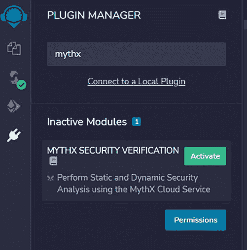

第七章用 Solidity 编程智能合约

**工具**

**MythX：一个安全扫描工具**

MythX 是一个安全扫描工具，作为一项有偿服务发布

mythx.io，或者是一个 CLI 包，或者其他工具的插件。

这里，我们解释了如何将 MythX 作为 Remix 的插件使用。要使用

在 Remix 中，请按照第六章的说明操作[章 6](https://doi.org/10.1007/978-1-4842-8164-2_6)并启动您的应用程序。

要启用 MythX，只需点击插件管理器图标以打开

管理器。在搜索框中输入“mythx”，你可以看到 MYTHX

安全验证插件。点击激活按钮来激活

这个插件（图 7-6)。

***图 7-6.* 在 Remix 中激活 MythX 安全扫描工具*

288

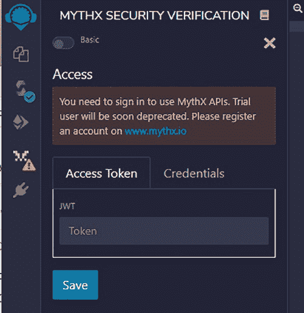

第七章 使用 Solidity 编程智能合约

一旦激活 MYTHX 安全验证，它需要

与 MythX 云服务通信以执行扫描。

开发者需要从 mythx.io 网站申请一个 API 密钥并输入

在插件设置中输入 API 令牌信息（图 7-7）。

***图 7-7.* 使用 MythX API 需要登录*

MythX 安全扫描还为 Truffle 工具提供了一个插件

一个适用于 Visual Studio Code 集成开发环境（IDE）的工具扩展。需要注意的是

MythX 安全验证是一项收费服务。开发者需要支付

为安全扫描服务支付订阅费用。

289

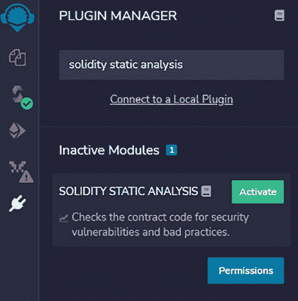

第七章 使用 Solidity 编程智能合约

**Solidity 静态分析：Remix 的安全插件**

与 MythX 不同，后者为安全扫描收取订阅费用，

对于 Remix 的 Solidity 静态分析（SSA）插件是免费的，并提供

基本的静态代码扫描功能。要启用 SSA，只需打开

插件管理器并在搜索框中输入 Solidity 静态分析，然后单击激活

单击按钮激活它（图 7-8)。

***图 7-8.* 在 Remix 中使用 Solidity 静态分析进行安全扫描*

激活插件后，点击插件面板上的其图标并且

它将开始分析 Remix 屏幕上活动的 Solidity 程序。

SSA 不仅扫描源代码中的安全漏洞，还执行

检查燃料消耗、ERC（以太坊请求评论）、

还有一些杂项分析（图 7-9）。开发者可以过滤要分析的类别并显示。

290

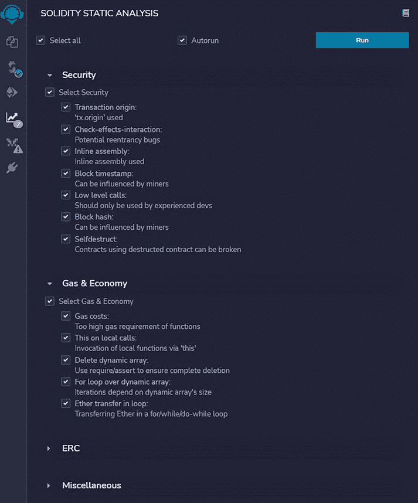

第七章 使用 Solidity 编程智能合约

***图 7-9.* 运行 Solidity 静态分析扫描*

291

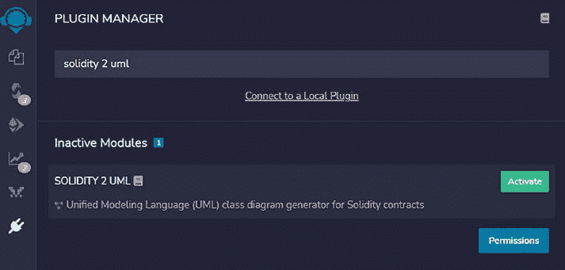

第七章 使用 Solidity 编程智能合约

虽然静态分析工具对于捕捉一些明显的

漏洞，它们不应该取代更复杂的安全审计和

渗透测试，特别是对于处理资产转移的智能合约。

**Solidity to UML：智能合约可视化工具**

Solidity 是一种面向对象的编程语言，易于

理解。有时，当有许多函数和智能

对于一个 dApp 项目，合约变得难以理解

智能合约的工作流程。在这种情况下，转换

将 Solidity 代码转换为统一建模语言（UML）以可视化

智能合约及其函数之间的关系。

**Solidity to UML for Remix**

有几个工具将 Solidity 转换为 UML。Remix 提供了一个插-

为此也提供。只需激活 Solidity UML 并启动插件

以将 Solidity 代码转换为 UML 图（图[7-10]).（#p303）

**图 7-10.** Solidity 到 UML 转换插件*

292

第七章用 Solidity 编程智能合约

一旦启用了 Solidity 2 UML 插件，它就可以用来解析

Solidity 智能合约并生成 UML 图。

**Solidity 到 UML 的独立工具**

除了 Remix 插件，还有 nodejs 包或 CLI 包

可以用来生成 UML 图。*

例如，sol2uml 包是一个生成 UML

从智能合约源代码；它还可以获取智能合约的 UML*

部署到以太坊区块链。

要安装 sol2uml，只需通过使用 node

包管理器（npm）：

npm install sol2uml --only=production

一旦安装了 sol2uml，它可以通过各种参数运行

以下帮助菜单中显示：

$ sol2uml -h*

使用: sol2uml <文件文件夹地址> [选项]*

从 Solidity 源代码生成 UML 图.*

如果第一个*

参数没有文件、文件夹或地址传递，则使用工作文件夹.*

当使用文件夹时，在该*

文件夹和所有子文件夹.*

如果传递了一个带有 0x 前缀的以太坊地址，那么*

来自 Etherscan 的验证源代码将被使用.*

选项：*

-v, --verbose 带有调试语句运行*

-f, --outputFormat <值> 输出文件格式：svg, png,*

dot 或 all（默认："svg"）*

-o, --outputFileName <值> 输出文件名*

293

第七章用 Solidity 编程智能合约

-d, --depthLimit <深度> 子文件夹的数量*

将递归搜索*

为 Solidity 文件。默认*

-1 不限制（默认：-1）*

-n, --network <网络> mainnet, ropsten, kovan,*

rinkeby 或 goerli（默认：*

"mainnet")*

-k, --etherscanApiKey <键> Etherscan API 键*

-c, --clusterFolders 将合同聚集到*

源文件夹中找到所有*.sol 文件*

-h, --help 输出使用信息*

要在本地目录中为智能合约生成 UML 图，请输入

以下命令：*

sol2uml ./contracts

在此，./contracts 是智能合约文件的目录位置。

sol2uml 还可以获取部署到

以太坊区块链。例如，为了获取一个特定地址的 UML

在 Ropsten 区块链中，运行以下命令：

sol2uml smartcontract_address -n ropsten

在此，smartcontract_address 是智能合约的地址，

已部署到以太坊区块链。"-n ropsten"意味着这是

为 Ropsten 区块链中的智能合约。*

为了理解 UML 图，我们使用智能合约的一部分*

USDT ERC20 代币。如图 7-11c 所示，这个 UML 图可以通过在浏览器 URL 中输入以下地址来获取：

[`etherscan.io/viewsvg?t=1&a=0xdAC17F958D2ee52`](https://etherscan.io/viewsvg?t=1&a=0xdAC17F958D2ee523a2206206994597C13D831ec7)

[3a2206206994597C13D831ec7](https://etherscan.io/viewsvg?t=1&a=0xdAC17F958D2ee523a2206206994597C13D831ec7)

部分包含变量名、函数名和参数列表。

继承抽象智能合约的智能合约需要实现这些函数

第七章用 Solidity 编程智能合约

***图 7-11。USDT ERC20 代币的 UML 图*

程序来包装智能合约以执行自动测试。

接口，或一个库。

294

合约名称。然后每个变量和函数的作用域被分组

将它们分别放入内部、公共和外部等相应的部分。每个

要运行 Solidity 单元测试，首先点击插件图标以打开

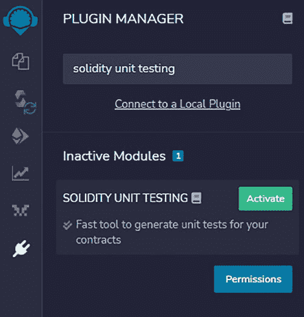

关系。如果智能合约 A 使用智能合约 B，意味着 B

是 A 的父级，那么从 B 到 A 画一条有向线。如果实体 A 是一个

第七章用 Solidity 编程智能合约

画一条线。

在 Solidity 中，抽象类是一个特殊的智能合约，其中

合约。

在这个图中，每个框代表一个智能合约类，一个

从另一个没有参数的函数中定义参数。

函数被定义但没有实现。使用或

295

第七章用 Solidity 编程智能合约

除了接口，智能合约还可以定义和调用库

函数。Solidity 中的库是用“library”关键词定义的

是一个 Remix 插件。

Solidity 中的无状态合约不能有状态变量。

**Solidity 测试**

**Solidity 单元测试：一个 Remix 插件用于测试**

[`remix- ide.readthedocs.io/en/latest/unittesting.html`](https://remix-ide.readthedocs.io/en/latest/unittesting.html)

Solidity 有一套很好的工具来提供单元测试或自动

测试。当源智能合约被编写时，开发者可以编写测试

定义。接口也是特殊的智能合约，其中只定义函数

像 Remix 和 Truffle 这样的工具都有测试套件来帮助编写和

执行测试程序。在下面，我们提到 Solidity 单元测试作为

如果继承了一个抽象智能合约或一个接口，那么用虚线代替实线

要激活 Solidity 单元测试插件，只需点击插件

管理面板并在 Solidity 单元测试中输入搜索。然后点击该

激活按钮以激活如图 7-12 所示的插件：

296

每个框有多个部分。上面一行是智能

***图 7-12。Solidity 单元测试插件*

用箭头的线 drawn between 方框来表示实体

需要注意的是，Solidity 单元测试插件中的测试文件不会

支持带参数的函数。对于带参数的智能合约，

应该有一个包装测试文件，将调用带

在接口中没有声明变量。

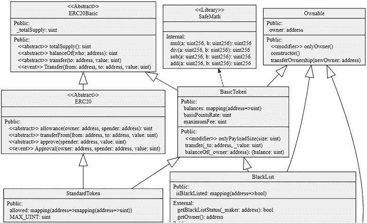

单元测试面板。然后选择一个目录来存储测试套件文件。

在以下屏幕快照中，选择了一个单元测试目录，该目录是测试

文件。然后，开发者需要为源智能

合约（图 7-13）。

297

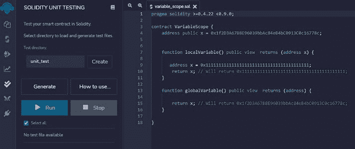

第七章用 Solidity 编程智能合约

***图 7-13。Solidity 单元测试文件生成*

为了为源文件生成一个测试文件，首先打开源智能

合约并使其在文件视图面板中激活。然后选择目录

将存放测试文件的目录。点击“生成”按钮以生成一个测试

文件在指定目录中打开的视图面板生成一个测试文件。

一旦生成了一个测试套件文件，它就会自动在文件

视图面板。这个测试套件将具有测试

源合约。它有测试库导入的代码段，目标源

文件导入，并测试功能占位符。开发者可以初始化一个

目标智能合约并模拟智能合约的函数调用

然后使用内置的逻辑检查功能来断言测试结果。

例如，下面的代码展示了如何编写单元测试代码：

测试全局变量和局部变量是否相同。源

代码非常简单。变量 x 在代码的开头被声明为一个全局变量。然后 x 在

代码中被声明为一个局部变量。

函数 localVariable。

298

第七章用 Solidity 编程智能合约

*pragma solidity >=0.4.22 <0.9.0;*

*contract VariableScope {*

*address public x = 0x1f2D3A67B8E96039bbAc84eB4bC0913C0c16778c;*

*function localVariable() public view returns (address x) {*

*address x = 0x1111111111111111111111111111111111111111;*

*return x; // 将返回*

*0x1111111111111111111111111111111111111111;*

*}*

*function globalVariable() public view returns (address) {*

*return x; // 将返回*

*0x1f2D3A67B8E96039bbAc84eB4bC0913C0c16778c;*

*}*

*}*

单元测试是为了检查全局作用域和局部作用域中的变量 x 是否相同

并在局部作用域中进行测试。为了测试这一点，以下生成了一个测试套件，

修改：

*pragma solidity >=0.4.22 <0.9.0;*

*// This import is automatically injected by Remix*

*import "remix_tests.sol";*

*// 使用自定义事务上下文需要导入*

*// 尽管它可能在 'Solidity*

*Compiler' 插件*

*// 但它在 'Solidity Unit Testing' 插件中会正常工作*

*import "remix_accounts.sol";*

*import "../variable_scope.sol";*

299

第七章用 Solidity 编程智能合约

*// 文件名必须以 '_test.sol' 结尾，此文件可以包含*

*在一个测试套件合约中超过一个*

*contract testSuite {*

*VariableScope vs;*

*/// 'beforeAll' 在其他所有测试之前运行*

*/// 更特殊的函数有：'beforeEach', 'beforeAll',*

*'afterEach' & 'afterAll'*

*function beforeAll() public {*

*// <instantiate contract>*

*vs = new VariableScope();*

*// Assert.equal(uint(1), uint(1), "1 应该为*

*等于 1");*

*}*

*function checkNotEqual() public {*

`Assert` 方法的使用：https://remix-ide.readthedocs.io/

*en/latest/assert_library.html*

*address x1 = vs.x.address;*

*address x2 = vs.localVariable();*

*Assert.notEqual(x1, x2, "variables are supposed to be*

*not equal");*

*}*

*}*

在测试套件代码中，源文件被导入，变量作用域

智能合约 vs 被实例化。然后检查 NotEqual()函数是否

调用以在 vs 中生成一个本地和全局变量 x，然后进行

比较。

测试套件在 Remix 中运行，并显示它通过了单元

测试（图 7-14），我的意思是全局变量和局部变量确实是不同的，尽管它们有相同的名称。

300

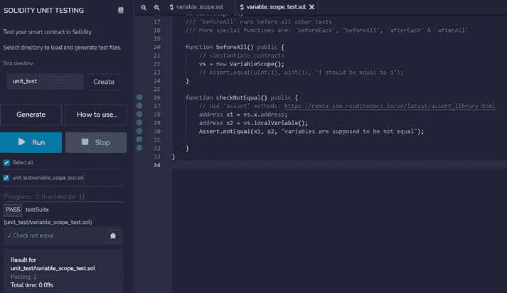

第七章 使用 Solidity 编程智能合约

***图 7-14. 单元测试运行示例***

使用 Remix Solidity 单元测试插件，编写

编写脚本以测试智能合约。

请注意，Solidity 单元测试插件中的测试文件不会

支持带参数的函数。对于带有参数的智能合约，

应该有一个包装测试文件，将用

从另一个没有参数的函数中传递参数。

除了用于单元测试的 Remix 插件外，Truffle 还提供了良好的单元

支持手动和自动测试的测试模块。工作流程

功能与 Remix 插件相似。

**Solidity 调试**

有时，Solidity 智能合约在

执行。最好逐行执行每个源文件

内联代码（如调用堆栈和存储）进行分析。

获取局部变量值。Solidity 确实有一些调试工具可以

提供帮助。在此，我们介绍了 Remix 的调试器插件。

301

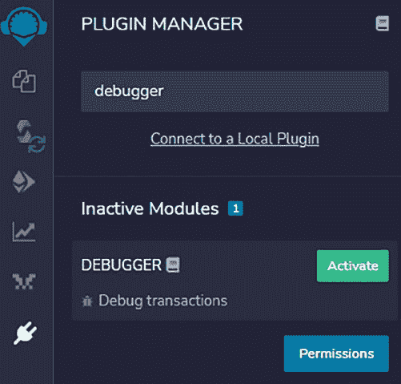

第七章 使用 Solidity 编程智能合约

**启用调试器**

要启用 Remix 调试器，只需打开插件管理器并输入

调试器在搜索框中输入并启用此插件（图 7-15）。

***图 7-15. 在 Remix 中启用调试器插件***

**启动调试器**

启用调试器后，插件栏中会显示一个类似错误的图标

在面板中。要调试 Solidity 程序，开发人员需要编译一个

合约源代码，将智能合约部署到本地 EVM，然后

创建一个事务以获取事务哈希。之后，开发人员可以

将交易 ID 输入到调试器配置面板并开始调试

调试过程（图 7-16):

302

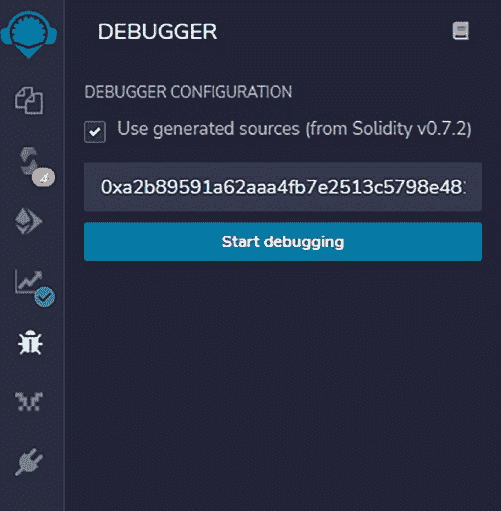

第七章 使用 Solidity 编程智能合约

***图 7-16. 启动 Solidity 调试器***

**调试智能合约**

当调试器启动时，将显示如图所示的调试窗口

以下将弹出，开发人员可以逐行浏览代码以查看

每行代码的执行。调试器支持步骤功能，如

单步进入、单步跳过和单步进入断点。

调试器显示了所有的 EVM 执行上下文、存储和

包括函数堆栈、Solidity 局部变量、Solidity

状态、步骤详细信息、堆栈、内存、存储、调用堆栈、调用数据、全局

变量、返回值和完整的存储变化。其中一些信息

可能无法使用，但调试器通常会提供大量的调试信息。

字节码执行信息（图[7-17)].

303

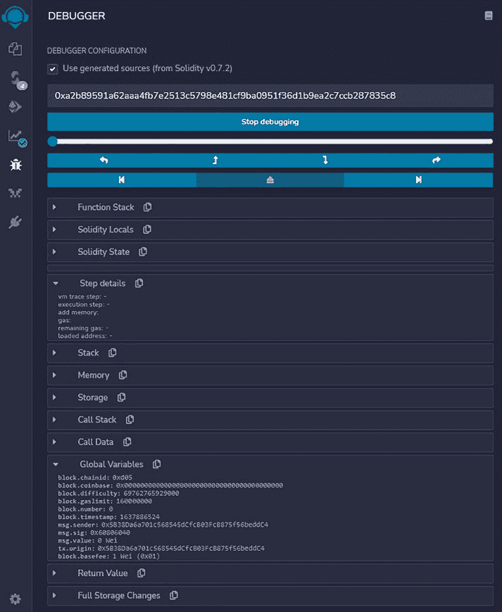

第七章使用 Solidity 编程智能合约

***图 7-17.** 逐步调试程序*

调试器的一个不明显的问题是如何添加

为调试器添加断点。要添加断点，只需打开

在编辑窗口中 source code 并点击行号（不是

304

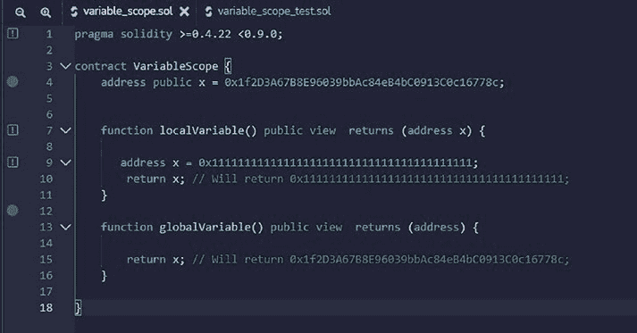

第七章使用 Solidity 编程智能合约

本身）。在行号旁边会出现一个蓝色圆点来

指示在该行插入了一个断点（图[7-18)].

***图 7-18.** 在源代码中添加断点*

尽管调试器是一个伟大的工具来调试 Solidity 程序，我们

发现当调试更复杂的智能合约时，仍然

一些在调试窗口中无法看到的信息。它是

对智能合约进行模块化是一个很好的实践，可以简化单元测试和

进行调试。

**模块 6：客户端考虑因素**

在第[6](https://doi.org/10.1007/978-1-4842-8164-2_6)章和第[7](https://doi.org/10.1007/978-1-4842-8164-2_7)章的先前模块中，我们讨论了如何编程 Solidity 智能合约并将它们部署到区块链上。一旦

智能合约部署到区块链后，它们是公开可访问的。

一旦区块被最终确定，它将永远不会被移除或更改。智能

合约是字节码，不利于用户使用。要与 dApps 互动，

需要开发客户端以促进用户与智能合约的互动。

305

第七章使用 Solidity 编程智能合约

合约。dApp 的客户端可以是网页浏览器、移动应用程序

桌面应用程序或命令行界面（CLI）。在本模块中，我们

我们将讨论这些客户端的优缺点，并给出一些例子。

建立一个 dApp 客户端。

**dApp 客户端类型**

dApp 客户端可以是图形用户界面（GUI）格式或命令

行接口（CLI）格式。GUI 格式可以是基于 web 的应用程序、移动

app，或桌面应用程序，如图所示

以下图表。CLI 格式通常用于自动脚本

执行测试或用于应用程序编程接口。在

以下图表（图[7-19)], 我们描述了不同类型的客户端。

***图 7-19.** 去中心化应用的客户端类型*

306

第七章使用 Solidity 编程智能合约

**浏览器客户端**

浏览器客户端是去中心化应用最基础的用户体验。

应用程序。用户直接被引导到一个网站来使用 dApp。

例如，要访问 CryptoKitty dApp，用户只需将他们的

网页浏览器[到 www.cryptokitty.com](http://www.cryptokitty.com)。如图所示，浏览器需要一个网页扩展/插件来连接到

通过 RPC 协议与以太坊节点交互。最常用的网页扩展

是 MetaMask。MetaMask 作为 Web 应用程序的加密钱包。

为了设计一个具有加密账户交互的 Web 应用程序，

开发者需要开发与 MetaMask 连接的网页。

与其他钱包连接的方法。当用户通过浏览器连接到一个 URL 时，

浏览器脚本将检查 MetaMask 是否已安装并提示用户

如果不找到，就需要安装它。这通常被称为“连接钱包”。

通常，JavaScript 脚本是为了使用 Web3 库来连接

与以太坊节点交互。我们稍后会有一个详细的编程示例。

这个模块。

浏览器基于的 dApp 的一个挑战是钱包的安全性。

由于浏览器容易受到黑客攻击，MetaMask 可能也会受到影响。

在一些浏览器中，存储和私钥可能会被黑客攻击。

建议当存储大量的加密资产时，使用硬件

应该使用钱包。MetaMask 支持与硬件钱包的连接。

钱包需要签名交易以确保钱包的安全。

**移动客户端**

移动应用程序也可以开发与智能合约交互的

与以太坊区块链交互。由于移动应用程序通常没有

大量的存储需求，它们依赖于 API 或 RPC 与区块链

节点。与网页钱包类似，移动钱包没有硬件级别的

安全性，并且不应该用来存储大量的加密资产。

307

第七章 用 Solidity 编程智能合约

**桌面客户端**

网页客户端和移动客户端都需要连接到外部节点以

与以太坊区块链交互。桌面客户端有足够的

存储和计算能力，并且可能能够运行一个以太坊节点

本身。这意味着桌面客户端可能携带自己的 RPC 服务器和

不依赖于第三方 RPC 节点。一个缺点是

桌面应用程序需要安装并且需要有桌面才能运行

应用程序。

**CLI 客户端**

CLI 客户端使用命令行界面运行脚本

与以太坊区块链交互。这通常在单元测试中完成，

为项目进行自动脚本化。CLI 对于喜欢使用文本的

基于打字而不是基于 GUI 的浏览。

每个客户端都有它自己的优点和缺点，我们已经看到了 Web

客户端越来越受欢迎。在下面，我们提供了

一个设计用于部署智能合约的网页的应用案例。

**与智能合约交互的网页客户端示例**

**带有智能合约**

在这个示例中，我们展示了如何编写一个与以太坊区块链交互的网页。

一个部署的智能合约。为了使演示成为一个端到端的体验，

我们做以下事情来将智能合约部署到开发

环境。

**第一步：创建一个以太坊开发区块链**

通过下载 geth 创建以太坊开发区块链。

应用中运行以下命令：

308

第七章用 Solidity 编程智能合约

./geth --datadir test-chain-dir --http --dev --http.corsdomain

"https://remix.ethereum.org,http://remix.ethereum.org"

这个命令创建了一个私有的开发区块链，并允许

Remix 开发工具可以与之交互。数据存储位于

test-chain-dir，默认会生成一个开发账户。

该账户的 keystore 位于 test-chain-dir/

keystore 目录。此地址和 keystore 可用于管理

账户。

更多详情，请参阅 [`geth.ethereum.org/docs/getting-`](http://geth.ethereum.org/docs/getting-started/dev-mode)

[started/dev- mode](http://geth.ethereum.org/docs/getting-started/dev-mode). 使用 geth attach <IPC_LOCATION> 连接到节点并使用 eth.sendTransaction 从 coinbase 发送到目标

账户。

Once the development blockchain is started, the next step is to

在其中部署智能合约。在这里，我们开发了一个带有两个

存储消息和检索。

// SPDX-License-Identifier: GPL-3.0

pragma solidity >=0.7.0 <0.9.0;

/**

* @title MessageStorage

* @dev 在变量中存储和检索值

*/

合同 MessageStorage {

字符串 message;

/**

* @dev 在变量中存储值

* @param messageInput 要存储的值

*/

309

第七章用 Solidity 编程智能合约

函数 storeMessage(string memory messageInput) 公开 {

message = messageInput;

}

/**

* @dev 返回值

* @return 'message'的值

*/

函数 retrieve() 公开查看返回 (string memory){

返回 message;

}

}

**步骤 2：编译并部署智能合约**

**到开发区块链**

一旦智能合约编写完成，使用 Remix 或 Truffle 进行编译。

使用 Remix，只需前往 [`remix.ethereum.org`](http://remix.ethereum.org/) 并创建一个先前智能合约的文件。在成功编译后，一个

应用程序字节码接口（ABI）文件和字节码文件将被生成。

字节码文件将部署到区块链上。ABI 将被用来

用于 dApp 客户端与智能合约交互。ABI 需要

可以通过点击 ABI 按钮复制并保存到客户端代码中。在

例如，以下 ABI 文件描述了函数的格式和

在智能合约中定义的变量的智能合约：

[

{

"inputs": [],

"name": "retrieve",

310

第七章用 Solidity 编程智能合约

"outputs": [

{

"internalType": "string",

"name": "",

"type": "string"

}

],

"stateMutability": "view",

"type": "function"

},

{

"inputs": [

{

"internalType": "string",

"name": "messageInput",

"type": "string"

}

],

"name": "storeMessage",

"outputs": [],

"stateMutability": "nonpayable",

"type": "function"

}

])

**步骤 3：部署智能合约**

一旦智能合约编译完成，前往部署面板并部署到

开发区块链（图 7-20）：

311

！

第七章用 Solidity 编写智能合约

***图 7-20.** Remix 智能合约部署面板*

312

第七章用 Solidity 编写智能合约

在这里，环境应该指定 Web3 提供者并指向

[`127.0.0.1:8545`](http://127.0.0.1:8545/)，这是开发链的端点。

一旦智能合约成功部署，智能合约

地址将如屏幕底部所示返回：

0x16d29C0A07dcDBe6e1097257Ee39DEe18136d672

开发者可以复制这个智能合约地址供网页浏览器使用

用于交互的。

**步骤 4：编写网页客户端以交互**

**与智能合约**

对于一个网页客户端与智能合约交互，有几个参数是

需要的，包括以下内容：

**区块链的 RPC 端点** – 这是

区块链的入口。在这个例子中，它是

是 [`127.0.0.1:8545`](http://127.0.0.1:8545/)。像 MetaMask 这样的 Web 钱包

MetaMask 需要连接到区块链

通过这个 RPC 端点。

**智能合约的 ABI** – 这是在

智能合约编译后。

**智能合约地址** – 这个地址是在

智能合约成功部署后。

下面，我们有一个 HTML/JavaScript 页面来显示与

与智能合约交互。HTML 部分显示按钮布局

。JavaScript 部分显示与

与智能合约交互。

下面显示了 HTML/脚本代码的网页 UI（图 7-21）。

在 GUI 的左侧，有三个按钮允许用户

连接到钱包并获取钱包地址，设置要写入的信息，

313

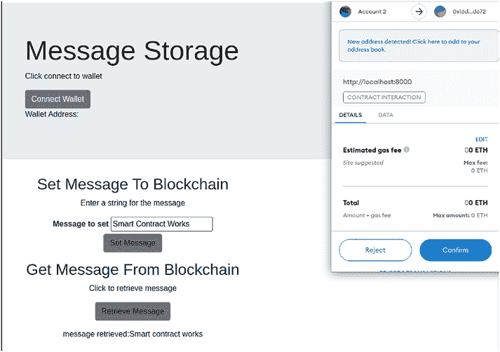

第七章用 Solidity 编写智能合约

区块链，然后是一个按钮来获取信息。右上角是一个

弹出 MetaMask 窗口，允许用户签署交易与

区块链交互的脚本代码。

***图 7-21.** 与智能合约交互的用户界面示例*

*合约*

下面是三个 HTML 按钮的代码片段：

“连接钱包”按钮将触发 enableEthereumButton 和 get

钱包账户地址。

*
*

*<H1 class="display-4">信息存储</H1>*

*
点击连接到钱包
*

*
<BUTTON class=*

314

第七章用 Solidity 编写智能合约

*"btn btn-secondary enableEthereumButton">连接钱包*

*</BUTTON> *

*钱包地址：
*

*
*

“设置信息”按钮将触发智能合约中的 setMessage()函数。

JavaScript。

*
输入信息字符串
*

*
*

*<LABEL for="cluegene"><B>要设置的信息</B></LABEL>*

*<INPUT type="text" class="ignore-form-control" id=*

*"cluegene" placeholder="" value="[My_Message]"*

*size="20"*

*required="">*

*
*

*
<A class="btn btn-secondary" onclick="setMessage()"*

*role="button">设置信息</A>
*

“获取信息”按钮将触发 getMessage()函数：

<H2>从区块链获取消息</H2>

点击检索消息

<A class="btn btn-secondary" onclick="getMessage()"

role="button">检索消息</A>

三个函数用 JavaScript 代码实现。

为了获取钱包地址，发出 eth_requestAccounts 请求

作为以太坊请求发送，以获取由

MetaMask。

315

第七章用 Solidity 编程 Smart ContraCt

**async function getAccount() {**

**const accounts = await ethereum.request({ method:**

**'eth_requestAccounts' });**

**const account = accounts[0];**

**account0 = account;**

**showAccount.innerHTML = account;**

**}**

设置消息的工作流程如下：

• setMessage 函数首先检查是否启用了 MetaMask

安装了 MetaMask。如果已安装，获取与

与 MetaMask 一起。

•JavaScript 代码用

指定的合约地址和 ABI 信息。

ABI 可以单独放在一个文件中以供导入。

包装交易数据。这一步需要将

从输入字段设置消息并包装

嵌入 encodeABI()函数。

•使用 sendTransaction 函数发送交易。

*function setMessage() {*

*if (!ethEnabled()) {*

*alert("Please install an Ethereum-compatible browser or*

*extension like MetaMask to use this dApp!");*

*}*

*web3.eth.getAccounts(function(err, accounts) {*

*var myContract = new web3.eth.Contract(messagestorage_abi,*

*messagestorage_contract.toLowerCase());*

*var gene = $('.cluegene input').val();*

*var auctionData = myContract.methods.storeMessage(gene).*

*encodeABI();*

316

第七章用 Solidity 编程 Smart ContraCt

*var tx_genescience = web3.eth.sendTransaction({*

*from: accounts[0].toLowerCase(),*

*to: messagestorage_contract.toLowerCase(),*

*data: auctionData*

*}, function(err, transactionHash) {*

*document.getElementById("SetMessageValue").innerHTML =*

*"setMessage tx:" + transactionHash;*

*})*

*})*

*}*

与 setMessage 函数类似，getMessage 函数也

创建一个智能合约对象和一个检索函数在智能合约中。

合约。由于 getMessage 是一个不写入区块链的函数，

直接调用一个 call()函数。这个 call()函数不需要

MetaMask 签名交易，不消耗燃料费。

获取消息函数

如果没有启用 eth，则

alert("Please install an Ethereum-compatible browser or

像 MetaMask 这样的扩展程序来使用这个 dApp!");

}

var myContract = new web3.eth.Contract(messagestorage_abi,

messagestorage_contract.toLowerCase());

var tx_getmessage = myContract.methods.retrieve().

call(function(err, result) {

document.getElementById("GetMessageValue").innerHTML =

"检索到的消息：" + result;

})

}

317

第七章用 Solidity 编程 Smart ContraCt

**总结**

在本章中，我们通过示例、语法描述 Solidity 编程。

数据结构、函数、事件、客户端应用程序、安全、测试、调试、

部署。这应该为基本的 Solidity

为去中心化应用编程。

318

**第八章**

**安全**

**注意事项**

**引言**

我们详细介绍了 Solidity 智能合约编程的许多方面

在之前的章节中已经介绍过。我们介绍了 Solidity 编程语法，

使用 Remix 或 Truffle 编译源代码，并部署字节码

到嵌入式 EVM 或开发区块链。我们还提到了

代币经济和代币设计，如选择同质化或

非同质化代币，并使用代币代表资产和元素

适用于商业用例。

在存储和通信方面，我们讨论了

以太坊区块链状态和事件概念的重要性以及

不同的网络，如主网、Rinkeby 测试网和 Ropsten 测试网。

在架构方面，我们讨论了构建端到端

构建区块链节点以连接以太坊

区块链、部署智能合约、开发 Web 客户端或移动

应用，并使用 Web3 将客户端与区块链连接。

在本章中，我们将介绍以太坊区块链和智能

合约安全。安全性是软件最重要的方面之一

开发。它在以太坊区块链中扮演了更大的角色

下面图 8-1 中显示的原因：

©张伟佳，安丹 2022

319

张伟佳，安丹，*区块链与以太坊智能合约解决方案开发*

[`doi.org/10.1007/978-1-4842-8164-2_8`](https://doi.org/10.1007/978-1-4842-8164-2_8#DOI)

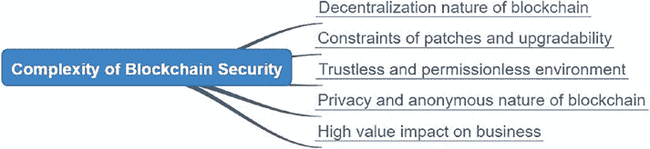

第八章 安全考虑

***图 8-1。** 区块链安全复杂性与*

**传统 IT 安全**

• **区块链的去中心化特性** – 任何代码

编写并部署到区块链的代码将运行

在数千台机器中。任何人都可以访问和运行

区块链代码。

• **修补和可升级性的限制** – 由于

区块链的不变性，智能合约部署

无法修改。这增加了

升级去中心化应用的难度。

当在区块链中检测到安全漏洞时

应用成本，修补应用

很高，有时，区块链的分叉

是必需的。

• **无信任和无需许可的环境** – 对于

公共区块链，客户端节点和

去中心化应用对全球

检查

参与者的资格。没有安全保障

阻止不良玩家参与。

• **区块链的隐私和匿名特性**

– 区块链用户可以保持匿名。智能

合约函数没有检查

用户概况。黑客可以实施区块链

攻击，获取资产，并保持匿名。

320

第八章 安全考虑

• **对业务的高价值影响** – 智能合约

通常规模较小。更大的项目可能会

有超过数千行代码，而其他项目可能

只有几百行。智能合约管理

高价值的加密货币资产，每次攻击都可能带来

对去中心化应用造成灾难性的结果。

一些去中心化应用遭受了巨大的

由于智能合约中的简单错误造成的损失。

过去发现了几起智能合约被黑事件。我们可以

将这些安全问题归类为功能安全漏洞和可攻击的

安全漏洞。功能安全漏洞是明显的代码错误，可以

正常交易和善意用户造成资金损失。设置

智能合约的功能安全漏洞包括以下内容。

**功能安全漏洞**

**在智能合约中**

**资金死锁**

这是一个安全漏洞，智能合约可以接收资金转移

但会将资金在智能合约中无限期地锁定。例如，一个

智能合约可以实现一个接收函数来接收资金，但不

实现发送或转账的功能。在这种情况下，发送到

智能合约将由智能合约拥有，但没有方式

类似于黑洞，这是一个吸收

一无所获。

321

第八章 安全考虑

**资金泄漏**

这是一个可以通过智能合约导致资金流失的功能安全漏洞。

未授权用户。这通常是由于访问权限不足和

特权检查。例如，一个安全漏洞可能由一个

具有资金转移能力的公共声明函数。

验证用户对资金的所有权。在 Solidity 智能合约中，

在编程中，有几个地方可以加强安全措施，

包括将函数的作用域设置为公共或私有，设置

所有者访问权限，并使用 require 和 assert 确保

在继续下一行代码之前，必须满足访问条件。

执行。当铸造或转移代币时，智能合约

需要确保函数的调用者是所有者或管理员，

和函数的授权用户。定义

智能合约中的角色，每个角色都将拥有有限的访问权限。在

以 CryptoKitty 为例，定义了四个角色，包括所有者、

智能合约，项目 CEO，COO 和 CFO。对于铸币功能，

智能合约定义了 COO 的铸币权。你必须是

COO 有权铸造 NFT 代币。还有一个暂停/恢复

通过停止执行来处理紧急情况的功能。

智能合约，这个权利赋予了 CEO。CFO 可以执行其他

与拍卖相关的事情。智能合约的所有者也是这个项目的一个关键

角色。通常，无论谁将智能合约部署到区块链上，

智能合约的所有者默认。这个所有者可以然后将

将所有权转让给另一用户，或智能合约地址，甚至

放弃所有权。因为智能合约的所有者具有

最高访问权限，保护私钥非常重要

合约所有者账户。

322

第八章 安全考虑

`Disabled Smart Contract`

这是另一个功能安全漏洞，其中非特权用户

可以调用一个函数来杀死智能合约。这是另一件

需要关注。在智能合约中，可能有一个函数，

可以执行以清除

状态、存储和设置。如果这个函数被偶然调用，它会

完全破坏智能合约。

`Orphan Smart Contract`

当智能合约部署时，发送部署

交易是所有者，并且它对

智能合约。有时，为了增加去中心化程度，

所有者可能会将所有权转让给另一个所有者账户，一个智能

合约，或放弃所有权。一旦智能合约的所有权被

部署后转让或放弃，原所有者无法

不再有权管理智能合约。因此，非常重要

在设计过程中提出智能合约所有权计划

过程。一旦智能合约部署并转让或

放弃后，当

在去中心化应用中出现紧急情况。

`Attackable Security Holes in Smart`

`Contracts`

这种安全漏洞是由恶意用户引起的。

功能性安全漏洞不那么明显，非常难以被

被发现。黑客通常需要构建人工交易

并执行多步骤攻击。攻击者还保持

匿名且具有转让资金的方法。这类

323

第八章 安全考虑

漏洞也可能包括攻击区块链节点和 Web3 客户端

智能合约之外的操作和环境。其他安全漏洞也包括

与黑客做以下事情有关： （1）调用错误的内部

具有恶意交易的函数；（2）更改外部参数

以及函数调用的条件；（3）更改白名单地址和

名称；以及（4）攻击 Oracle。以下是一些

可攻击的安全漏洞：

示例 1：向任意账户支付账单

以下是一个带有安全漏洞的代码片段：

`pragma solidity ⁰.8.6;`

`contract PayIssue {`

`function payBill ( address payable recipient, uint256 x_amount`

`} public payable {`

`recipient.transfer(x_amount);`

`}`

`}`

在前面的代码中，有一个名为 payBill(address

可支付收款人，uint256 x_amount) public payable。

当调用此 payBill 函数时，它将简单地转让“x_amount”

以太币发送到函数中指定的收款地址。这个函数

这个函数是可支付的，这允许资金转给接收者。可支付是一个

在 Solidity 中的新关键字，用于指定一个函数或地址是否可以

转账或接收资金。

这个智能合约的一个主要功能性安全错误是

它不会检查调用函数的用户的权限。因为这个问题

这个函数是公开的，可以支付，任何人都可以调用这个函数并转账

将资金转到一个他们指定的任意地址。实际上，用户可以调用这个智能

324

第八章 安全考虑

合约，剥夺智能合约所有资金，并发送

将资金转给黑客的地址。函数访问范围的一个简单错误

导致资产损失并摧毁一个有潜力的项目。

示例 2：没有对杀或自毁函数的保护

发生了一起安全事件，其中在

智能合约，但没有权限检查，最终

导致了 3 亿的资金损失。在一个社区 Telegram 聊天组中，

交易哈希被发布。消息发送者声称自己是一个新手

在以太坊中，但刚刚发送了一个交易来调用一个杀函数

智能合约。因为杀函数不会检查用户权限，所以

函数调用被执行，有效地重置了智能合约的存储

合约并销毁智能合约。这个智能合约锁定的资金

合约中有 3 亿，一旦执行了杀

函数执行。

像杀、销毁、自毁或放弃等功能是非常

具有潜在能力使智能合约无效的特权操作

对调用参数进行彻底检查至关重要

确保在执行这些函数时没有安全风险。

**智能合约设计最佳安全实践**

在之前的章节中，我们描述了功能性和可攻击的安全漏洞

以及一些示例。如图 8-2 所示，我们现在将讨论设计智能合约的良好安全实践

编写代码。

325

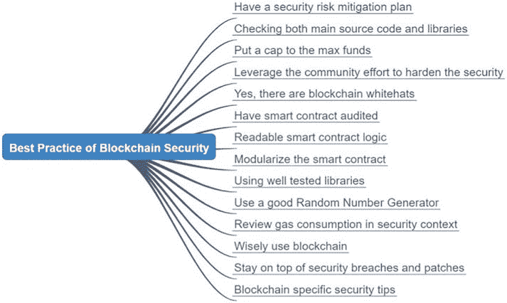

第八章 安全考虑

**图 8-2** 区块链安全最佳实践

**制定安全风险缓解计划**

Ethereum 和任何公共区块链都是开放的，无需授权

系统中，恶意玩家与智能合约的访问权限相同

好的玩家。有一个心态是非常重要的，那就是可能存在漏洞和

智能合约中的安全漏洞，应有一些缓解计划

需要做好准备。例如，在加密猫的智能合约中，有一个

实现了一个暂停功能，只有 CEO 可以暂停或恢复

如果智能合约存在安全漏洞，那么公司 CEO

可以发送一个交易来调用暂停函数，暂停铸币和

加密猫的拍卖

此外，考虑函数

去中心化和可升级性。区块链本应该是

不可变，因此，智能合约默认应该是

不可更改的。另一方面，编写 Solidity 代码的方式

没有 bug 或漏洞。一个更好的做法是将智能合约进行分类

将智能合约分为两类——一类是稳定的且不可更新，而

326

第八章 安全考虑

另一种是动态的，可以通过特权管理员进行升级。

通过 Web3 客户端调用的智能合约可以是代理智能合约。

不可升级且具有固定地址的合约，而另一种

通过代理智能合约调用的合约可以进行升级。

一旦智能合约因修复 bug 而升级，其地址

新部署的智能合约在代理智能合约中进行更新，并且

不需要更改 Web3 客户端。

**检查主源代码和库**

不仅你编写的代码中可能存在安全漏洞，而且

它们可以存在于导入到你的智能合约中的库中。库的

代码也可能在不同版本的 Solidity 中编写，从而

增加了集成和安全风险的复杂性。例如，

一些库是用 Solidity 0.4 版本编写的，而主

你正在工作的智能合约可能是 0.8 版本。Solidity

0.4 版本不支持某些安全特性，因此需要进行修改

需要集成库。这反过来增加了漏洞

整个智能合约的兼容性。因此，拥有兼容性

主代码和库的不同版本，以及安全审查、审计和测试

还应包括库代码。

**设定资金上限**

由于智能合约的复杂性，有时设定一个

智能合约函数能够处理的最大资产价值量。A

智能合约可以有一个全局上限，每个带有资产转移功能的

能力将比较待转移的资产量与

上限。如果超出上限，该功能将不会执行转账。这个

为防止资产损失提供了额外的安全防护。实际上，ERC20

智能合约有一个“批准”函数来设置资产的最大

用户调用转账函数可以转移的资金。

327

第八章 安全考虑

由于智能合约处理的加密货币总价值

以指数级增长，像 Uniswap 和 Compound 这样的项目

有数十亿美元的资产由智能合约管理。如果存在

如果智能合约代码中有安全漏洞，影响巨大。它是

设定一个阈值始终是一个好习惯，以

如果出现安全漏洞，可能受到影响的风险基金。

**让你的智能合约开源**

**利用社区力量加强安全**

**安全**

智能合约用于推动 DeFi 世界，其中没有

中央权威机构和大型 IT 团队为智能合约带来信任和安全。

平台。因此，项目社区发挥重要作用是

在加强智能合约方面发挥关键作用。与传统金融

软件供应商使用他们的工程资源

以及服务以确保安全和质量，智能合约通常是

开源，以便社区和用户可以审查代码

确保业务逻辑准确地封装在

源代码。社区开发者被鼓励审查源

代码，并为能够找到任何

功能性、美容性或安全性缺陷。智能合约也进行了部署

首先在测试网上进行 alpha 和 beta 测试，社区

要求查找缺陷并奖励漏洞赏金。因为 dApps

由智能合约驱动的项目通常是能够发行代币的项目

有时，社区开发者会被奖励项目代币

他们在发现安全问题或缺陷时。健康和发展的项目

管理数十亿美元加密资产的项目总是有热情

社区开发者努力提高智能合约的安全性

合约。

328

第八章 安全考虑

是的，存在区块链安全的白帽子

有时，智能合约会被黑客攻击，结局各不相同。有时

“黑客”没有盗窃资金的意图，但

而是给项目团队一个教训。所以如果发生安全漏洞

如果发生这种情况，关注资金流向很重要。黑客

有意使用被盗资金的通常会转移资金

到“混合器”隐藏身份，消除资金的可追踪性。

白帽黑客会将资金转移到一个安全的位置，告诉

项目团队关于安全漏洞，让项目团队修复问题，然后

所以如果发生安全漏洞，不要恐慌；

结果可能没有看起来那么糟糕。

**智能合约要进行审计**

智能合约审计是加强安全性的良好实践。一项安全

审计是聘请外部专业公司评估和

审查代币经济、智能合约设计、代码实现。

审计师使用自动安全扫描工具和手动渗透

测试以产生对智能合约的彻底报告。该安全

扫描智能合约可以揭示语法中的静态安全错误

编程风格。对智能合约的更深入审查将需要

专家通过 UML 图例逐个审查智能合约并找出

函数之间的关系并检查潜在漏洞。

有时，项目团队和审计团队会举行会议

通过智能合约设计来确定端到端流程是否

安全问题。发现的任何问题都应标明严重等级，并

关键问题需要修复，以便产品发布。

安全审计不仅可以提高智能合约的安全性

发生灾难性故障时，项目团队稍后决定

与其他合作伙伴合作或希望将他们的智能合约许可给

329

第八章 安全考虑

其他公司。安全审计在

区块链行业中，审计请求经常积压。

加快审计通常需要支付更高的费用；因此，安全性

审计时间应该包含在项目发布计划中。

**可读的智能合约逻辑**

我们提到智能合约的 VLC（每行价值）很高

代码)。确保智能合约逻辑是极其重要的

简单直接且易于阅读。如果你阅读良好的智能合约代码

在项目中，你可能会发现通常有更多的人注释

比源代码本身还要重要。注释在那里是为了帮助读者

审查并理解源代码。如果你剥离了代码，

在 Solidity 文件中，你会发现注释实际上是良好设计和

智能合约功能的文档。良好的智能合约是

以技术和管理专家都能理解和接受的方式编写和记录

可以阅读它并获得商业逻辑的良好概述。

**模块化智能合约**

Solidity 是一种面向对象编程（OOP）语言，你可以

可以使用层次结构、继承和多态机制来定义

类和函数与 Java 和 JavaScript 类似。一个好的实践

模块化智能合约的目的是模仿现实世界的场景

构建智能合约作为相应

业务逻辑。

330

第八章 安全考虑

**使用经过充分测试的库**

与模块化相关，使用经过充分测试的库是另一种方法

以提高安全性。由于大多数智能合约是开放的

来源，已经构建了许多方便且安全的库

和可供使用。例如，OpenZeppelin 提供了一套良好的

像 SafeMath、ERC20 和 ERC721 这样的库，而 Oraclable 提供了

Oracle 库使用。

通常，良好的库代码具有更好的边界检查

例如，SafeMath 库

对算术数据类型的范围有检查，并对除法进行检查

分母等于零的情况。使用来自经过充分测试的库的代码

项目降低了主代码的不确定性。

**使用好的随机数生成器**

在游戏应用中，有时，智能合约会使用一个随机

数字生成器（RNG）来生成一个随机数以选择一个获胜者

来自一组用户。RNG 还通过分组来增强安全性

随机分配参与者以防止合谋。通常，不建议

推出自己的 RNG，而没有坚实的数学验证和

对 RNG 的随机性进行彻底测试。例如，

使用区块链块的哈希值似乎是随机的

一些应用程序。然而，如果 dApp 的智能合约正在处理

类似于 Powerball 的大型和高价值游戏，随机性

区块链散列是攻击易发的。区块生产者可以添加或删除

在拟议的区块链区块中处理交易并提供操纵的

散列。此时，链上没有完美的 RNG，完全随机性

需要通过离链计算引入并带入

通过使用 Oracle 来实现区块链。

331

第八章 安全考虑

**在安全环境中审视气体消耗**

气体使用和费用是为了补偿矿工和增加

对以太坊网络的故意攻击成本。在智能合约中

每笔交易，每个函数和存储都会消耗气体，并且气体成本是

由发送交易到智能合约的用户支付。有一些

在处理气体消耗时需要考虑几个安全因素，

智能合约。在 dApp 应用程序中，如果使用代理发送交易

对于用户来说，重要的是要审查函数，以查看气体的

气体消耗是一个固定值，如果函数有可能

进入一个无限或大型循环，剥夺发送者的以太币账户。在

一般来说，智能合约应该以最小化

气体消耗。为了实现这些目标，应特别注意避免

对于长时间操作的 while-loop，大量动态数组用于数据存储，以及

智能合约之间的复杂函数调用。在编写智能合约时，

还有一些气体估算工具可以帮助检查代码中的气体使用情况。

以太坊基金会还发布了一份气体消耗表

作为优化智能合约气体性能的指南。

**明智地使用区块链**

有些人误以为区块链可以解决所有

传统 IT 技术无法解决的问题。对一些人来说

在一定程度上，区块链确实解决了诸如共识等挑战性问题，

去中心化、无需许可和代币经济。然而，今天，

区块链技术仍然存在许多缺点。例如，

当智能合约执行时，它将在数千台机器上运行

同时。实际上，比特币区块链拥有超过 20,000 个采矿

节点，以太坊有数千个节点。所有以太坊节点将

拥有相同部署的智能合约，并将运行智能合约来

处理交易。在区块链中，这种冗余的规模

大大降低了整体性能并增加了风险，

如果实际发生故障，该怎么办。

332

第八章 安全考虑

所以从安全角度来看，在 dApp 架构和设计中，

最好使用区块链来处理需要

去中心化、多方共识、不可变性和透明性。

对于 UI（用户界面）等组件和动态内容存储，

临时数据和繁重的计算，这些可以离链完成。

以 CryptoKitty 为例；铸造、基因生成和

管理猫拍卖是在链上完成的，而 UI 和

猫的渲染是在链下完成的。平衡的链上和

去中心化应用的离线组件增加了可用性，

可升级性，性能和安全性。

**关注安全漏洞和补丁**

区块链离稳定状态还远，而且安全漏洞

经常发生。因此，订阅区块链安全

订阅区块链安全

区块链攻击总是出现在媒体头条。在以太坊

社区，绕过，安全漏洞被讨论和分享

非常及时。如果出现安全漏洞，制定行动计划很重要

影响您在生产网络上部署的智能合约。

最佳实践也是升级智能合约代码到

尽快升级到 Solidity 的最新版本。这是说起来容易，但实际上

实际上做起来非常困难。一旦智能合约被部署，它们无法

由于区块链的不可变性，需要打补丁。升级将需要

放弃旧的智能合约并部署全新的一个。另外

在智能合约中存在各种版本的 Solidity 程序

库和生产代码。在它们之间存在不兼容

不同的 Solidity 编译器版本。在部署智能合约之前，

最好升级主智能合约和

库更新到最新版本。

333

第八章 安全考虑

还有一些好的安全分析和可视化工具

可以帮助开发者编写安全的智能合约。安全性

开发人员可以利用静态安全漏洞的扫描工具

并遵循良好的安全编码实践。可视化工具帮助

开发者和审查员查看智能合约的全貌

从黑客那里分析潜在的攻击点。

**区块链特定安全提示**

对于过去开发独立应用程序或网络

应注意，区块链有一些特殊属性

要避免的陷阱。

当进行跨智能合约函数调用时，调用函数

将传入另一个智能合约的地址并调用该智能合约的字节码

目标函数。有时，该目标函数可能包含恶意

代码并更改调用函数的控制流。非常重要

检查目标智能合约的源代码，确保它没有

安全漏洞。如果目标智能合约的地址被传递

从外部传入，确保只有特权用户可以传入

目标地址。

Ethereum 区块链是公开的，去中心化的，无需许可的。如果

智能合约中声明为公共的任何函数，任何人

世界上任何地方的人都可以调用那个函数并传入任意

参数。因此，确保函数范围和

对所有可能引起安全

漏洞。智能合约中的公共函数是全局公开的，可以被

称为任何顺序和任何数据。因此，确保函数

检查智能合约函数以下属性：

• **函数范围** – 声明它是公共的还是

私有，或查看。

334

第八章 安全考虑

• **访问范围** – 检查谁可以调用函数，

可能只有所有者，或只有预定义的用户角色。

• **参数置换** – 检查参数范围的

数据。检查输入的有效性。

以太坊区块链的固有安全性有一些限制。当

在智能合约中声明一个变量，它可以是一个私有变量。

然而，私有变量实际上并不是私有的，因为以太坊虚拟

机器（EVM）安装在区块链节点上可以揭示它。为了确保

为了在智能合约中保护数据隐私，数据应该在

发送到区块链然后接收后解密。

区块链。由于公共区块链的透明性，链上

数据加密和解密在智能合约中是不安全的。该

执行步骤和内部数据可以通过带有调试器的 EVM

启用。加密和解密应通过

离线计算。

对于需要使用时间序列的去中心化应用程序，

计算，重要的是要知道区块链中的时间戳是

不准确，因为矿工可以通过延迟

加速区块计算和提案。这是一种不好的做法

使用区块链时间戳来检查顺序执行和排序

交易步骤。区块链或交易的时间戳不应该

可以作为多个事件的唯一标识符，因为没有保证

秒内的区块时间戳冲突。

在智能合约的所有生命周期中都需要考虑安全

从概念、要求、代币设计、架构、

实现和运营。一个重要的安全因素是

需要考虑在部署过程中的安全保护私有密钥。加密

资产存储在账户中，每个账户由一个私有

和公钥对。私钥用于签署交易以发送资产

从一个用户到另一个用户。拥有账户私钥的人

该账户的资产。当将智能合约部署到区块链上时，

335

第八章 安全考虑

需要有一个用户向

区块链。为了签署交易，用户需要解锁账户

使用其私钥。如果一个账户在区块链上解锁，它的私

密钥是开放的，可以被欺骗者窃取。这已经发生了很多次

在加密世界中。

有几种安全的方法可以部署智能合约。例如，

用户可以使用硬件钱包或离线钱包进行部署。

在这两种情况下，私钥都保存在单独的设备上，只有

签署的交易复制到在线系统，发送给

区块链。由于私钥永远不会离开专用设备，

网络通信，除非设备被

物理上的 tempering。

量子计算对安全的影响**

量子计算的安全影响一直是

量子计算的统治地位

计算将使区块链优势化为乌有，并给加密货币

值变为零。量子计算是一种革命性技术，

利用量子物理学惊人的原理和现象

如超 position、纠缠和测量不确定性。在

量子计算中，一个量子位用来表示“0”和“1”的状态

量子系统，类似于传统计算中的位。多个

量子位可以构建到寄存器中，成为计算和存储单元

量子计算。量子计算提供了更高的

计算能力，并将对区块链以下领域产生影响。

对于 shab-256 或 shab-3 的哈希算法将不再有效。一个

哈希算法是一种单向函数，输入一个输入字符串并

生成固定长度的输出字符串。对于

哈希的不同输入应该产生不同的输出。此外，

336

第八章 安全考虑

不应该存在一种从其哈希反向计算输入的方法

值。有了量子计算，这些规则将被打破，任何

依赖于哈希的系统，如 SHA256，需要彻底改动。

非对称公钥-私钥签名算法，如

使用椭圆曲线密码学的 ECDSA 或 DSA 将不再有效

安全。量子计算可以从公钥计算私钥或

从私钥签署的消息中 break。

量子计算对密码学的影响反过来

影响区块链安全的领域，如图 8-3 所示。

图 8-3。量子计算对区块链安全的影响*

区块链的基本不可变性将受到影响。区块

区块链中的每个区块都通过其区块哈希唯一标识。如果哈希

不再安全，可以利用量子计算进行操作，

然后区块链可以被修改，内部数据改变但仍然保持其

链上的哈希。

加密货币不再安全，因为私钥可能

控制资产账户可以用量子计算机 hack。

点对点网络层通信将不再安全。

以太坊使用 secp255k1 生成 nodeKey 和 nodeId。随着

secp256k1 将不再安全，客户端节点标识和

通信机制需要改变。

以太坊区块链的智能合约将不再有效，因为

智能合约的所有者也可能被 hack。

所有使用 ECDSA 和 SECP256 私钥签署的交易

不再有效，需要使用新的算法。

337

第八章 安全考虑

即使是工作量证明（POW）共识也会受到影响。POW

基于计算匹配散列来验证提出

一个区块。有了量子计算，计算速度如此之快，那些

具有量子计算能力将建立最长链，因此

突破 51%计算能力角色。

为了缓解量子计算优势，有几个关键

考虑事项。

首先，以太坊 2 正在从 POW 转移到 POS（权益证明）。这个

减轻量子计算对共识的影响。

其次，已经开发出量子抗扰签名方案

已经包括 Lamport、XMSS 和 SPHINCS。

第三，量子计算的安全性不仅仅是

在区块链上，是所有密码学和网络计算。

量子解决方案在通用领域制定，可以移植到

区块链。

第四，缓解量子计算对

区块链安全可能超出区块链技术方面。

可能有一些法律规定禁止使用量子

计算能力来破解信息和区块链系统。类似

到核不扩散政策，可能会有一些限制

量子设备发布到公共领域。

遵循量子计算的发展非常重要

关注缓解计划并在准备做出关键

决策。随着 IBM 即将发布 1000 个量子位设备，谷歌

在量子计算上迈出飞跃，不可避免地

计算将挑战和威胁区块链的安全。这是

强烈建议学习量子计算技术

准备接受对以太坊的量子抗扰技术

区块链。

338

第八章 安全考虑

**摘要**

总之，我们强调安全的重要性

在区块链中。安全漏洞和坏事在

过去，现在正在发生，将来也会发生。所以当你写

确保 Solidity 智能合约的安全程序遵循；

总是超越让社区测试智能合约

在将它们推出到区块链主网之前。

339

**第九章**

**第 2 层和**

**以太坊 2.0**

**以太坊主网问题**

以太坊主网被设计成公共区块链，而不是

企业平台；因此，它缺乏隐私、性能、可扩展性和

许可能力。

关于隐私，以太坊主网将所有数据存储在一个

无需许可的方式，每个人都有访问数据的权限。所有敏感

数据在发送到区块链之前需要加密，

和交易需要通过智能合约进行模糊处理。有些

机构和州不会允许某些类别的数据

发布到公共区块链。因此，公共主网的使用

限于存储数据资源哈希或 URL。原始数据是

存储在私有区块链或节点上，并通过公共链进行验证

和通道。

为了提高性能和可扩展性，以太坊主网已经

遇到了瓶颈。CryptoKitties 的发布导致了

以太坊区块链上的交易费用已经超过了每笔 100 美元

交易，从而限制了可行交易到高价值和

低频应用。为了加快交易，有时，

©张伟佳和安丹德 2022

341

张伟佳和安丹德，*区块链与以太坊智能合约解决方案开发*，

[`doi.org/10.1007/978-1-4842-8164-2_9`](https://doi.org/10.1007/978-1-4842-8164-2_9#DOI)

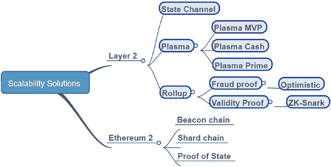

第九章第 2 层与以太坊 2

用户必须设置高气价以增加他们

矿工将其包含在他们提议的区块中。

对于权限管理，公共区块链被设计为无需权限，

但有些用例应用程序确实希望实现访问控制

由于安全和监管考虑。公共性质的

以太坊主网阻止了一些用途，例如证书发行和

人员数据库中。

为了解决以太坊主网的问题，许多以太坊

改进提案和解决方案已经提出，包括

第 2 层和以太坊 2。在本章中，我们讨论了新的可扩展性

以太坊的技术，包括第 2 层和以太坊 2。第

以下插图（图 9-1)显示了以太坊可扩展性解决方案的分类，它们在各自

部分。

***图 9-1.** 以太坊可扩展性解决方案概览*

区块链*

342

第九章第 2 层与以太坊 2

**第 2 层技术**

第 2 层是一套技术，旨在提高性能和

通过将计算和

通过智能合约将交易从链上存储到链下。

链上交易需要在每个节点上运行 EVM，并将交易存储

所有状态存储在以太坊区块链上，从而降低性能和

可扩展性。第 2 层解决方案的机制是将一些

在主链之外进行交易，只记录重要信息在

主网以确保安全和透明度。一个主要的区别

第 2 层与以太坊 2 之间的区别在于，第 2 层使用智能合约来

将离线资源连接到主网，因此不需要

主网区块链进行硬分叉。第 2 层解决方案可以

由第三方项目使用现有以太坊主网实现的

有几种第 2 层机制可供使用，包括状态

通道、质心、和卷起；每个都有其独特的特点。

**以太坊状态通道**

状态通道是允许两个或更多

参与者之间离线发送交易，只

将状态通道周期的开始和最终交易发送到

将主网区块链用作托管，

为两个或多个方之间的受信任通道提供一个审计平台。

例如，状态通道可以构建为权威证明（POA）

或经过授权的拜占庭容错私有区块链

只有参与者。为了简单起见，私有区块链

可以替换为可以与其他钱包连接的智能钱包

记录他们之间的交易。参与者使用私有

作为状态通道进行快速低成本的

交易。

343

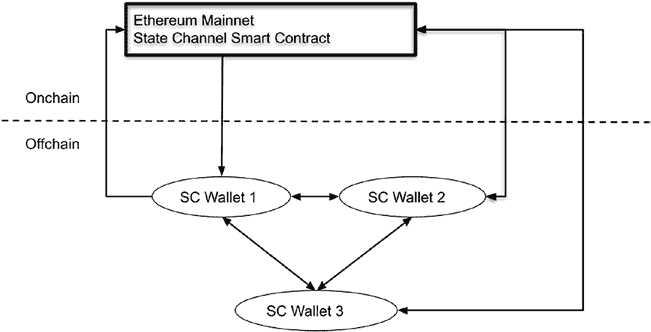

第九章 第 2 层与以太坊 2

为了说明状态通道的一个用例，我们使用一个

一个建筑公司，其中承包商需要记录合同

员工每天赚取收入，每月支付。如果

每天在区块链上记录交易，这将增加

交易费用可能会达到每笔交易的 100 美元。

交易。使用状态通道，公司的所有者可以支付

使用状态通道进行日常交易，并只支付给员工一笔

每月的总和。这将节省大约原始成本的 1/30。

状态通道的拓扑和工作流程如下：

图表（图 9-2）：

图 9-2.*状态通道解决方案的拓扑和工作流程*

前面的图表显示了具有

以下组件：

状态通道智能合约部署到

主网。

这个智能合约是多签的，没有一个用户可以更改或

删除智能合约。

344

第九章 第 2 层与以太坊 2

状态通道智能合约可以为用户提供存款，

为一群用户创建状态通道。存款人需要指定

参与者的账户地址。

状态通道智能合约还有处理

多重签名签名，并将资金分配给参与者和（b）处理

从任何参与者那里接受审计请求，通过接受发送的证据

任何参与者。

每个用户可以有一个状态通道钱包（SC 钱包）。

钱包可以通过发送交易，

请求收据，或者为主链多签名交易。主要链

钱包还具有存储交易历史本地副本的功能

收据。

工作流程如下：

付款人使用加密货币钱包存入以太坊资产

向状态通道智能合约发送，并指定

收款人账户将收到支付。

智能合约创建一个记录并返回一个

存入记录，带有余额和收款人地址。

收款人的地址也由智能合约记录。

处理索赔或审计请求的智能合约。

付款人获得存款收据并开始发送

通过离线签名交易进行支付，

收款人。对于每笔交易，状态通道钱包

将账户余额离线更新，并具有

双方发件人和收件人的签名收据。这些

交易是离链的，因此具有较低的**交易速度**。

交易费用或甚至没有费用。

345

第九章第 2 层和以太坊 2.0。

• 一旦完成状态通道的操作，

离线交易需要转让

主网，每个参与者的余额将

需要更新。每个参与者将检查

他们的交易收据本地副本并签署退出

状态通道交易。一旦退出交易

由各方多签名，发送到主网

状态通道智能合约进行处理。

主网智能合约将验证信息

然后将存款资金分发给各自的

参与者。

• 如果任何参与者没有签署交易，

其他参与者可以发送交易以调用

智能合约的索赔或审计功能，并提供**安全保障**。

所需的本地收据作为证明。如果状态通道

智能合约验证支付者的欺诈行为，所存

支付者的余额可以被削减。

有不同的实现方式用于第 2 层状态通道解决方案。

在前述内容中，我们在

状态通道钱包。这将增加钱包的足迹并

需要定制加密货币钱包。另一种解决方案是实现

通过私有区块链使用状态通道离线计算。

权限共识，如证明权限（POA）或拜占庭

容错（BFT）区块链。私有区块链可以处理

在状态通道参与者之间记录交易。只有条目

和状态通道的退出交易将发送到主网进行

安全和持久记录。钱包可以是普通的钱包，如一个

MetaMask 钱包可以在主网链切换到私有链。

状态通道交易。

346

第九章第 2 层和以太坊 2.0。

虽然状态通道可以提高以太坊的可扩展性

通过将交易离链，对此有一些限制

机制。首先，状态通道参与者需要积极参与

在交易中，参与者的账户需要在州内注册。

通道智能合约。发件人不能向任意

地址不在通道中。其次，所有状态通道参与者将

需要积极参与交易，通过验证交易来确保安全。

和多签名退出交易。第三，由于主网只有

初始状态和最终状态，它需要依赖离线参与者

如果与状态通道存在差异，需要提供证据。

交易。需要参与者参与确保状态通道的安全。

这是一个很大的缺点，使得难以开发出通用的解决方案

对于状态通道。

**Plasma 作为第 2 层技术**

以太坊 Plasma 是另一种第 2 层可扩展性解决方案，使用智能

合同将外部区块链与以太坊主网链接作为安全

以及仲裁平台。这些子区块链被称为 plasma

链，以及它们的区块链交易记录被合并（merkelized），并且

Merkle 树的根节点被发送到主网作为证据存储。

之前的图表（图 9-3）展示了组件和

plasma 区块链作为第二层解决方案的工作流程。

347
