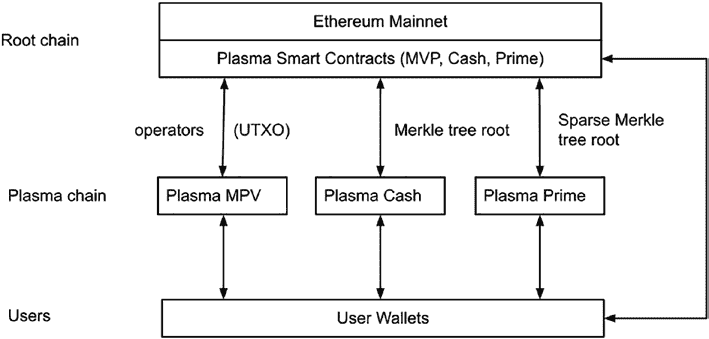

第九章 第 2 层和以太坊 2

***图 9-3.** Plasma 可扩展性的组件和工作流程*

*解决方案*

**以太坊主网上的 Plasma 智能合约**

顶层是第 1 层或根区块链，在此上下文中是

Ethereum 主网。Plasma 智能合约部署到以太坊

主网，并且具有以下功能。

用户向层 1 存入资产以使用的存款功能：此

存款功能将允许用户向 plasma 智能合约发送交易

具有特定资产价值的合约。用户通过

存款函数将被 plasma 智能合约在主网上锁定

合约。智能合约将创建一条记录，并生成一个新代币

与这笔存款相关的将创建。之后，存款函数可以

发出存款事件以通知 plasma 区块链。代币及其价值

将在 plasma 区块链上复制并作为层 1 的资产使用

2 区块链。

层 2plasma 区块链的 SubmitPlasmaTxRecord 函数

将交易 Merkle 树提交到第 1 层根链：该

交易记录在 Merkle 树中

结构，以及 Merkle 树的根发送给父级或根级

区块链。

348

第九章 第 2 层和以太坊 2

StartWithdraw 函数允许用户从

层 2 链到第 1 层区块链：该函数通常被称为

由用户直接或通过同时连接第 1 层和层 2 的运营商进行。

2 个区块链。此函数的调用者应提供 plasma 区块

数字，交易索引 id，交易记录，Merkle 证明，以及

签名。当用户从 plasma 区块链提取资产时，

plasma 链中的资产将被销毁，然后原始的

在第 1 链上存入的资产将分发给目标用户。为了

确保燃烧操作和解锁操作是安全的，因此

将有一个等待期，以便 StartWithdraw 函数分配资金

确保在层 2 燃烧资产之前

相同价值的资产在第 1 层分配。在此等待期间，

任何人都可以通过提供来自 plasma 链的证明来挑战这个提现

区块链。

ChallengeWithdraw 函数允许任何用户或运营商

提供证据来挑战等待提现交易的

已验证：此函数的调用者需要提供一个提现 ID。

受到挑战以及其他输入，例如 Merkle 根和证明，

与 StartWithdraw 函数相似。StartWithdraw 的输入

函数和 ChallengeWithdraw 函数进行比较和验证。

如果挑战成功，那么 StartWithdraw 交易将

将被撤销。

**运营商**

运营商将 plasma 区块链与第 1 层根链连接。它监视

在第 1 层存入事件，然后生成一个新代币 ID 来表示

主网上的相同值，然后在

Plasma 链。一旦在 Plasma 区块链上生成新的代币，

存款者拥有代币，可以将代币发送给以太坊中的任何用户

第二层链。运营商还将提交 Plasma 区块链的默克尔树

用户可以将资产提取到第 1 层区块链的**根记录**。

349

第九章 第二层与以太坊 2.0

通过智能合约功能调用区块链。如果

当在第 2 层请求提现时，运营商也将传递该请求

第一层进行处理。

**第二层的交易或智能合约**

在第二层 Plasma 链中，用户可以在彼此之间发送常规交易。

彼此之间。Plasma 链还可以实现智能合约

用户拥有将资产提取到第 1 层区块链的能力。这些交易

在 Plasma 链中的资产打包成默克尔树并保存为 a

区块链状态。默克尔树的根发送到第 1 层链

记录。

**Plasma 链**

Plasma 链可以以多种方式实现。由于安全

与根链耦合的 Plasma 链和收据的

交易发送给接收者后，Plasma 链不需要具备完整

确保安全。Plasma 链可以以

多种方式。在一个实现中，Plasma 链可以实现

作为一个服务器，接受用户交易输入，并具有一个默克尔树

结构或数据库来存储交易。Plasma 链可以

也可以实现为 POA（权限证明）或 BFT（拜占庭容错）

容错）区块链。在这个 POA 或 BFT Plasma 区块链中，a

几个授权节点创建一个区块链，接受 Plasma 第二层

交易。然后计算交易默克尔树的根

发送到根区块链进行记录和验证。Plasma 链

也可以实现为 POS（权益证明）链，任何人都可以

通过在根链上的智能合约质押资产来运行一个节点。

在 Plasma 链中质押的资产是为了保护 Plasma 链。如果

是 Plasma 链中节点的共谋，这些节点的赌注会

通过在根链上的智能合约被削减。

350

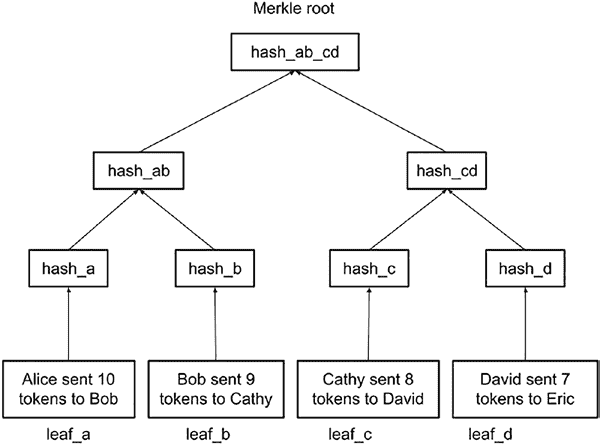

第九章 第二层与以太坊 2.0

**交易默克尔树示例**

以太坊区块链广泛利用默克尔树。默克尔树

是一种数据结构，它安排数据/消息及其相应的哈希

确保数据完整性和处理

效率。有多个默克尔树。标准默克尔树是

记录元素及其哈希的二进制树结构作为

如下所示（图 9-4）：

***图 9-4.* 标准默克尔树示例*

叶节点是数据节点，叶节点之上的节点

存储数据元素的哈希。这里，H(A)表示数据 A 的哈希。

哈希函数可以是 sha256 或 keccak256，这些都是常用

在以太坊中。有了这些默克尔树，每个节点的完整性可以

第九章 第 2 层与以太坊 2.0

`bytes32 public hash_cd;`

353

`hash_ab= sha256(abi.encodePacked(hash_a, hash_b));`

` *//声明父节点和根节点为 32 字节哈希。*

`hash_cd= sha256(abi.encodePacked(hash_c, hash_d));*

片中的 Merkle 树。这个程序的源代码

` * @param _leaf 要检查的叶子。*

`bytes32 public hash_d;`

用于哈希叶子或非叶子节点。abi.encodePacked 函数是用来

节点。一旦生成了 hash_root，它就被保存到根区块链

`// abi.encodePacked 连接两个子哈希`

`bytes32 public hash_ab_cd;`

` *bytes32 public hash_a;*

例如，在前面的图表中，为了证明 A 元素的交易

` *string public leaf_c = "Cathy sent 8 tokens to David";*

`string public leaf_b = "Bob sent 9 tokens to Cathy";`

以下代码片段展示了如何在 Solidity 中实现前图

`string public leaf_d = "David sent 7 tokens to Eric";`

并可以用来根据要求验证 Merkle

通过提供根哈希和“叔叔”节点的哈希来验证。对于

`bytes32 public hash_b;`

`contract MerkleDemo {`

在前面的代码片段中，四个叶子节点 – leaf_a, leaf_b, leaf_c,

`bytes32 public hash_root;`

`hash_root = hash_ab_cd;`

`bytes32 public hash_ab;`

交易。叶子节点的内容被哈希并存储在

```

351

为了检查代表叶子节点的交易是否在 Merkle

树中的节点。

```

ab. Hash_c 和 hash_d 组合成父节点 hash_cd。并且

352

位于 GitHub 上。

和 leaf_d – 定义为记录简化的

```

梅克尔演示智能合约的构造函数构建了一个 Merkle

如下所示的树：

` *}`

` * 构造函数以构建一个 Merkle 树。`

用户或操作员。

```

`// 使用 sha256 哈希函数构建一个 Merkle 树。`

```

cd 是与 hash_root 相当的最高节点。

` *constructor() public {*

如果有效，用户需要提供 hash_b、hash_c 和 hash_d 来计算

`hash_d = sha256(abi.encodePacked(leaf_d));`

`hash_a = sha256(abi.encodePacked(leaf_a));`

` *hash_b = sha256(abi.encodePacked(leaf_b));*

`hash_a` 和 `hash_b` 组合成一个名为 `hash_` 的父哈希

` *hash_c = sha256(abi.encodePacked(leaf_c));*

` *bytes32 public hash_c;*

在构造函数之前的代码中，sha256 Solidity 函数

中。

`//声明叶子节点`

` *@title 4 个叶子节点的 MerkleDemo*

梅克尔树演示程序位于 GitHub 上。

连接两个元素并哈希合并结果以获取父

最后，hash_ab 和 hash_cd 组合成 hash_ab_cd。Hash_ab_

`string public leaf_a = "Alice sent 10 tokens to Bob";`

```

` * 检查叶子是否有效*

`}`

`/**

第九章 第 2 层与以太坊 2.0

第九章 第 2 层与以太坊 2.0

` *@param _rootHash 树的根.*

` *@param _proof 显示叶子在*

`the tree.*

` *@return 如果叶子在树中，则为 True，否则为 False.*

`*/

`function checkMerkleTree(*

`string memory _leaf,*

`uint256 _index,*

`bytes32 _rootHash,*

`bytes memory _proof*

`) public pure returns (bool) {*

`//检查 _proof 是否为一个或多个 bytes32*

`require(_proof.length % 32 == 0, "proof length not*

有效的。")*

`//计算 Merkle 根.*

`bytes32 proofElement;*

`bytes32 parentHash = sha256(abi.encodePacked(_leaf));*

`uint256 index = _index;*

`//遍历证明中的每个 bytes32 元素*

`for (uint256 i = 32; i <= _proof.length; i += 32) {*

`assembly {*

`proofElement = mload(add(_proof, i))*

`}*

`if (index % 2 == 0) { //叶子节点在左边*

`parentHash = sha256(abi.*

`encodePacked(parentHash, proofElement));*

`} else { //叶子节点在右边*

`parentHash = sha256(abi.*

`encodePacked(proofElement, parentHash));*

`}*

354

第九章第 2 层和以太坊 2

`index = index / 2; //前往下一层*

`}*

`//如果 parentHash 等于 _rootHash，则验证成功.*

`return parentHash == _rootHash;*

`}*

`The checkMerkleTree function takes a leaf node contract (i.e., a

`transaction),一个索引显示叶子节点的位置，一个根

`hash，然后是一个证明，用于计算由

`leaf node and proof matches what is recorded. If the computed hash root

以及记录的匹配，叶子和证明被认为是有效的。

否则，被认为是无效的。

`as tempered.

然后我们有一个 testcasedemo 函数来验证叶子节点 c 和 d

`for the untempered and tempered cases as shown in the following:

`//在 Merkle 树中测试一些叶子节点*

`function testCasesdemo() public payable returns(string*

`memory, string memory, string memory, string memory){*

`//有效和无效的交易消息需要验证*

`string memory test_leaf_c = "Cathy sent 8 tokens*

`to David";*

*string memory test_leaf_d = "David sent 7 tokens*

*to Eric";*

*// These two are tempered and should not be validated*

*string memory test_leaf_c_tempered = "Cathy sent 100000*

*tokens to David";*

*string memory test_leaf_d_tempered = "David sent 100000*

*tokens to Eric";*

*// leaf_a, leaf_b, leaf_c, lead_d have index = 0, 1, 2,*

*3 respectively.*

355

第九章 第 2 层与以太坊 2.0

*// Use test_index variable to represent index*

*uint test_index = 2;*

*// construct Merkle proof for leaf_c*

*bytes memory merkle_proof = abi.encodePacked(hash_d,*

*hash_ab);*

*bool result = checkMerkleTree(test_leaf_c, test_index,*

*hash_root, merkle_proof);*

*string memory return_leaf_c = string(abi.*

*encodePacked(test_leaf_c, ": ",result?"true":"false"));*

*//Do the same validation for tempered leaf_c*

*result = checkMerkleTree(test_leaf_c_tempered, test_*

*index, hash_root, merkle_proof);*

*string memory return_leaf_c_tempered =*

*string(abi.encodePacked(test_leaf_c_tempered, ":*

`",result?"true":"false"));`

`// Do the same leaf_d, similar to leaf_c`

`test_index = 3;`

`merkle_proof = abi.encodePacked(hash_c, hash_ab);`

`result = checkMerkleTree(test_leaf_d, test_index, hash_`

`root, merkle_proof);`

`string memory return_leaf_d = string(abi.*

`encodePacked(test_leaf_d, ": ",result?"true":"false"));` *result = checkMerkleTree(test_leaf_d_tempered, test_`

`index, hash_root, merkle_proof);`

`string memory return_leaf_d_tempered =`

`string(abi.encodePacked(test_leaf_d_tempered, ":*

`",result?"true":"false"));`

`//Return and output results`

`return (return_leaf_c, return_leaf_c_tempered, return_`

`leaf_d, return_leaf_d_tempered);`

`}`

356

第九章 第 2 层与以太坊 2.0

这个测试方法构建了 test_leaf_c 和 test_leaf_d 交易

那些是有效的。还将两个交易修改为 test_leaf_c_

温和的 test_leaf_d_tempered 并将转移的代币更改为

一个较大的金额。每个节点的证明也构建了，索引

对于指定的交易。叶节点、索引、根哈希和证明是

发送到 checkMerkleTree 函数进行验证。结果如下：

`//Output of testCasedemo`

`{`

`"0": "string: Cathy sent 8 tokens to David: true",`

`"1": "string: Cathy sent 100000 tokens to David: false",`

`"2": "string: David sent 7 tokens to Eric: true",`

`"3": "string: David sent 100000 tokens to Eric: false"`

`}`

输出显示，未温和的交易被验证为

为真，而温和的验证为假。

**Plasma MVP 事务 Merkle 树**

在最后一个代码示例中，我们展示了一个标准的 Merkle 树，带有简单的

记录了“用户 A 向用户 B 发送了 x 个代币”的交易消息。在这个

叶节点。尽管我们能够显示这些交易消息

可以通过根链中的根哈希和证明

由用户或运营商提交，简单的消息格式是不够的

足够用于 plasma 交易的实际应用。更复杂的

Merkle 树格式已经提出用于可替代和非可替代的

代币。在下面，我们描述了 Plasma MVP 和 Plasma Cash。

357

第九章 第 2 层与以太坊 2.0

Plasma MVP 使用一个标准的 Merkle 树，使用 UTXO 来记录

交易发送根哈希到根链。Vitalik 提出了

使用以下未花费交易输出（UTXO）格式进行

可替代的 Merkle 叶节点：

`[blknum1, txindex1, oindex1, sig1, # Input 1`

`blknum2, txindex2, oindex2, sig2, # Input 2`

`newowner1, denom1, # Output 1`

`newowner2, denom2, # Output 2`

`fee]`

这个叶节点格式使用两个输入和两个输出。这两个

输入允许用户将两个 UTXO 组合发送到一个地址。

两个输出允许用户将部分 UTXO 发送给一个用户和

发送给另一个用户。在这种叶节点格式中，blknum1、txindex1 和

`oindex1 represent blockchain number, transaction index, and output`

为输入 1 的索引。这唯一地标识了交易的叶节点

默克尔树。`sig1` 用于签署交易，以确保发送者

是 UTXO 的所有者。类似地，`blknum2, txindex2, oindex2,` 和

`sig2` 代表区块号码、交易索引、输出索引和

输入 2 的签名。对于输出，`newowner1` 和 `denom1` 代表

要分配给新所有者 1 的代币数量。新所有者 2

`denom2` 代表要分配给新所有者的代币数量。

`owner 2`. 最后，交易中的费用是以代币数量表示的

为 Plasma 交易支付。

使用 UTXO 格式对默克尔树节点进行编码，可以使交易

唯一标识，无需遍历默克尔树来

查询其他交易。为了使查询更加高效，the

`blknum, txindex,` 和 `oindex` 合并成一个 uint256 整数。

358

第九章 第 2 层与以太坊 2.0

这样，一个整数就可以用来唯一标识一个 UTXO 交易

使用以下转换：

`utxo_index = blknum*1000000000+txindex*10000+oindex;`

要从 `utxo_index` 检索 `blknum, txindex,` 和 `oindex` ，使用 the

如下：

`Blknum = utxo_index/1000000000;`

`Txindex = (utxo % 1000000000)/10000;`

`oindex = utxo_index - blknum*1000000000-txindex*10000;`

使用 UTXO 格式，Plasma MVP 可以记录具有

在 Plasma 链上高效地使用 UTXO 格式。用户还可以提现

他们的资产或 UTXO 在根链上。要提交提现请求，

只需发送一个 `utxo_index` 来标识 UTXO 的位置，the

交易本身、默克尔根和签名。智能合约

将执行以下操作，将资金分发给代币的新所有者

根链：

• 检查提现请求的发送者是

与 UTXO 的所有者相同。

• 交易已被发送者签署。

• 输出 1 和输出 2 的数量加上交易

费用等于输入 1 和输入 2 的总和。

• 发送者的 UTXO 尚未花费。这会导致

需要一些时间来确认。

一旦所有的有效性检查都通过了， plasma 智能合约在

根链将把根链上的资产分发给新所有者。

359

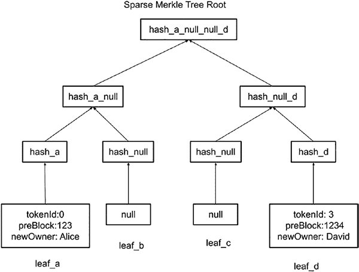

第九章 第 2 层与以太坊 2.0

**Plasma Cash 的交易默克尔树**

前面提到的 Plasma MVP，用户可以通过

将 UTXO 发送给最终用户。然而，Plasma MVP 没有解决

对于非同质化代币的问题。UTXO 有一个用于交易的分母。

但不需要唯一 ID。Plasma Cash 是 UTXO 的扩展

每个代币都分配一个序列号以记录和转让。

尽管现金或货币通常被认为是同质化的，但 Plasma

实际上，Cash 最适合处理类似于 ERC721 的非同质化代币

或唯一可识别的资产。

为了使默克尔树与非同质化代币一起工作，提出了一个稀疏的默克尔

树被提出以确保代币的唯一性。以下图表

（图 9-5) 展示了如何为一个非同质化代币构建一个稀疏的默克尔树 。

***图 9-5\.** 一个稀疏 Merkle 树示例*

360

第九章 第 2 层和以太坊 2

对于 ERC721 NFT 代币，有一个 NFT 标识符来表示

tokenId 表示代币的索引。这个 uint32 tokenId 可以被

转换为较小整数，例如 uint32 和 uint64\。

可以构建一个 Merkle 树来表示 NFT 的 tokenId。在

此 Merkle 树结构，每个代币都由一个叶节点表示。对于一个

tokenId 的大小为 n 的 uint，叶节点的数量将是 2^n。例如，

uint8 的 tokenId 将有一个叶节点数为 2⁸=256\。同样地，the

uint16，uint32 和 uint64 的叶节点数分别为 65536，4294967296 和

18446744073709551616，分别。

叶节点的位置相当于 tokenId。叶

从左到右的索引从 0 到（2^n-1）。内容

叶节点的数据是一个 byte32，是 NFT 交易的散列

代币。Plasma 交易格式是一个元组（槽，previousBlock，

面值，所有者，散列）。在此，槽与 tokenId 相同

表示叶节点的索引，previousBlock 是区块号码

包含此 tokenId 的所有权转移，面值默认为 1

NFT 案例中，所有者是此代币转移的新所有者，而散列是

其他参数的 sha256 或 keccak256 散列。一旦散列

计算，其值将插入到槽位置的叶节点中或

tokenId。

对于 0 到 2^n-1 的 tokenId 范围，需要有 n 级节点

从根节点到叶节点。如果我们把叶节点标记为第 0 层，那么

根节点将在级别 n-1\。对于大小为 uint16 的 tokenId，将

将是 16 层，uint64 将有 64 层。

Merkle 树可以初始化为一个空 Merkle 树，其中

叶节点都是 null 的散列。

对于零级，节点的散列内容将是 hash_null = H(null)

= sha256(null)=e3b0c44298fc1c149afbf4c8996fb92427ae41e4649b934

ca495991b7852b855\.

第一级散列 _null_null = H(H(null)，H(null))

第二级散列是 hash_null_null_null_null = H(H(H(null)，H(null)))

H(H(null)，H(null)))

361

第九章 第 2 层和以太坊 2

直到它到达 Merkle 树的根节点。

在此，H(x)是如 sha256 或 keccak256 的散列函数，它接受一个

字符串作为输入并产生一个 bytes32 散列。H(x，y)是一个函数，将

x 和 y 然后获取其散列。

这些预计算的值可以用于证明计算以

提高效率。

交易时，将计算一个 bytes32 散列

存储在叶节点中。相应地，此叶节点的所有父节点

将更新到 Merkle 树的根节点。如果有 n 个级别

对于 Merkle 树，每个叶节点的更新将触发 n-1 次更新到

父节点。

每个块将有一个 Merkle 树。由于交易数量

对于每个块的交易数量远远少于可能的 tokenIds 数量，the

Merkle 树将变得稀疏。大多数节点将是 null。

从叶节点到根节点的父节点将是

默认值计算在前面的表中，可以由一个

位而不是完整的 32 字节哈希。节点受到影响的事实

交易分布在 Merkle 树中，赋予了存储结构

稀疏 Merkle 树的名字。

与 Plasma MVP 不同，Plasma Cash 的证明使用两个

列表：一个是简化后的位列表，用于预计算的 null 或其

父节点；另一个是字节 32 的哈希列表。之所以这样是因为

使用位列表的目的是节省存储空间和计算努力，因为大多数

节点没有被修改并且有预定义的值。

为 Plasma Cash 提供叶节点的证明

与 Plasma MVP 不同。在 MVP Merkle 树中，证明是一个列表

节点哈希可以用来与叶节点计算

根节点哈希。通常是由兄弟

目标叶节点或其父节点的节点。对于 Plasma Cash，由于它

是一个稀疏的 Merkle 树，大多数兄弟节点将是 null 或预定义的。

这些节点可以用位=0 来表示默认的哈希

值应该被使用。如果位被设置为 1，那么改变后的哈希值

362

第九章 层 2 与以太坊 2

应该被使用。在前面的简单稀疏 Merkle 树中，对于

令牌 ID=0 叶节点 a，证明是 hash_b 和 hash_c_d。由于 hash_b 是

`hash_null`的 hash，这已经是已知的，证明可以有一个位证明显示

01 使用第一个位=0 来表示第一个哈希是 hash_null，这已经是

已知，第二个位是 1，表示修改后的哈希应该

可以使用。这几乎将证明大小减半。如果更多

节点和数据是稀疏的，证明大小可以减小

显著地。

总的来说，有了稀疏的 Markle 树，证明的大小就会减小，

计算工作量也减少了。

在实施 plasma 层 2 中有许多更改

技术。有了 plasma 和状态通道，层 1 不需要

有关层 2 的完整信息。因此，plasma 或状态

通道取决于层 2 提供证明和交易给层 1。

对层 2 的这种依赖限制了状态通道和 plasma 的使用。

第三种类型的层 2 技术被称为汇总。这与

来自 plasma 或状态通道。在层 2 汇总中，交易是

实际上被重新打包然后在层 1 区块链上执行。有了

汇总，层 1 区块链不再需要询问用户或层 2

操作员用于证明和交易数据。在下面，我们描述了如何

汇总工作。

**层 2 汇总**

在前几节中，我们讨论了层 2 的状态通道和 plasma。状态

通道在打开或关闭时只与层 1 交互

关闭状态通道。然而，状态通道将需要参与者

被登记在通道中，不能向任意

地址。第二层 Plasma 通过使用运营商发送

第二层交易 Merkle 树根到第一层存储。然而，Plasma

第二层依赖于第二层来存储和提供证明

和挑战。在本节中，我们介绍了一种第三层 2 技术

363

第九章 第二层与以太坊 2

称为 Rollup。Rollup 是一种将第一层中的交易重新打包的技术

2 并将它们作为批量交易发送到第一层。参数

批量交易被优化以节省燃气费并提高可扩展性。

目前正在开发中的有两种 Rollup 技术。一种

正在使用允许参与者挑战第二层到第一层的

1 交易。典型的欺诈证明解决方案被称为乐观的第二层

解决方案，如 Arbitrum、Polygon 和 Optimism。另一种被称为

使用零知识证明等验证方法的验证证明

在第二层和第一层之间进行交互。第二层解决方案的有效性证明

包括 zk-rollup、zksync 等。

**乐观的第二层**

以下图表概述了乐观 Rollup 的内容

图 9-6。最上面的一层显示了如以太坊主网这样的第一层区块链。一个乐观 Rollup 智能合约被部署到第一层

主网。Rollup 智能合约有几个主要功能。

例如，智能合约有一个接收来自

第二层区块链以 Merkle 树格式，并处理这些交易

在第一层。

在第二层，有一个使用 OVM (乐观

虚拟机)。OVM 支持智能合约，并可以处理

交易。第二层的交易是根据

交易时间。交易的排序由序列器完成。交易

交易排序非常重要，因为可能存在依赖关系

这些交易之间。

当第二层的交易被重新打包并打包到第一层时，

因为第一层没有足够的信息

证明交易有效。在这段等待期间，

乐观 Rollup 智能合约允许第三方提供欺诈

提供证明以取消 rollup 的资格并领取奖励代币。对于

364

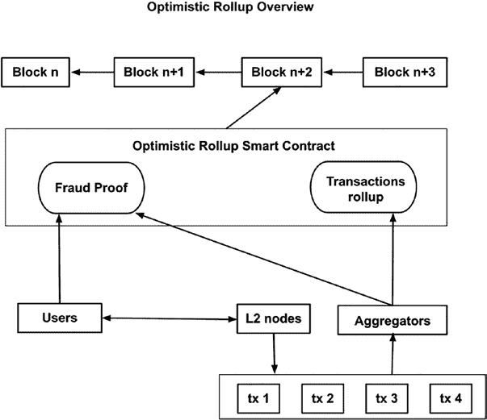

第九章 第二层与以太坊 2

欺诈证明来自 rollup 交易中抵押的

聚合器。如果聚合器提供了有效的错误证明，抵押

存放在聚合器中的资产将被没收。

***图 9-6。** 乐观 Rollup 概述*

由于乐观 Rollup 依赖于欺诈证明来确保

第二层中的交易会被正确传播到第一层，第二层中有一个

几天的开销，Rollup 交易才能最终

在第一层最终确定。这意味着，要在一层中领取资产，用户

需要等待最多一周的时间来解决所有提出的

在合证明上。这对于乐观合来说是一个瓶颈。为了克服

欺诈证明机制的限制，验证证明方法是

提议允许交易使用合证明来证明其有效性。

下面，我们描述了 zk-SNARK（零知识简洁非交互式知识证明）。

非交互式知识证明）进行验证证明合。

365

第九章 第 2 层和以太坊 2.0

**zk-SNARK 第 2 层**

zk-SNARK 是一种使用零知识的第 2 层合扩展性解决方案

证明以确保从第 2 层到第 1 层的合交易始终

在有效状态下。零知识证明是一个技术，让一方证明

在不透露处理了哪些信息的情况下证明一个陈述是真实的。

以及结论是如何得出的。zk-SNARK 代表零知识

简洁非交互式知识证明。zk-SNARK 是一种特殊的

零知识证明的机制具有以下特点：

**简洁** – 证明短小且容易验证。

这对于链上验证来说是最合适的，在那里燃气

Ethereum 和其他网络的成本

昂贵，许多节点需要验证

相同的陈述。

**非交互式** – 证明生成和验证

不需要用户的手动干预。

链下应用可以通过编程方式

生成证明，链上智能合约可以

验证证明。

**知识证明** – 意味着

陈述可以零知识地得到证实或证伪。

知识证明系统。通信

各方在不泄露对方知识的情况下获得对方知识。

披露私有信息的需求和

知识。

零知识证明被视为没有隐私知识泄露的证明。

这意味着一个人可以证明拥有某个知识，而不需要

为了说服另一个人你知道

如果你知道某些东西，你必须透露这个知识。零知识证明是一种

增强隐私的加密计算，可以零知识地证明

对一个陈述产生怀疑而不泄露该陈述。

366

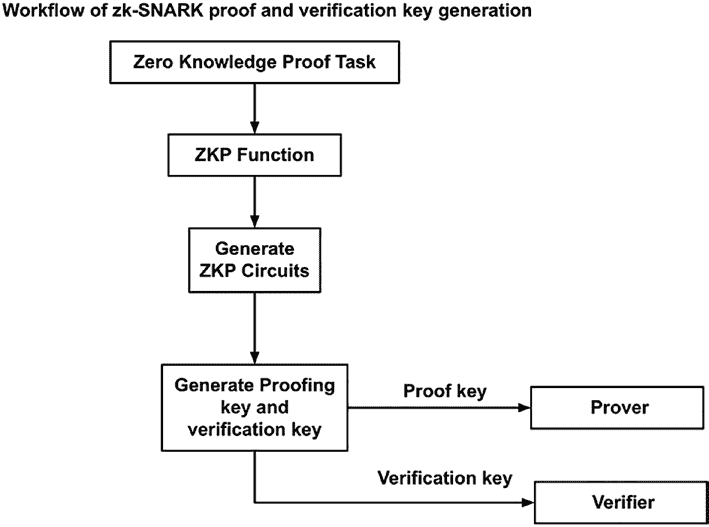

第九章 第 2 层和以太坊 2.0

示例：爱丽丝想向鲍勃展示她知道如何进行平方

假设测试只是提供一个输入和一个输出，比如输入=16

假设输出=4，第三方可以知道这是关于平方根的。如果实际处理的信息与此不同，

输入和输出都被哈希处理，这样第三方就不知道实际处理了什么信息。

使用了平方根法则。

零知识证明可以用于隐私计算和层

2 层合。利用零知识证明如 zk-SNARK，可以实现层合

第 1 层和第 2 层之间的交易可以无需需要

第三方挑战。在下面的图表（图 9-7）中，我们解释了 zk-SNARK 可以用于哪种层合解决方案：

**图 9-7** zk-SNARK 工作流程*

367

第九章 第 2 层和以太坊 2.0

使用零知识证明，首先需要定义任务。这可能

可以是证明一个人超过一定年龄，一个人拥有密码，一个人

交易用私钥签名，Merkle 树中的交易

都是有效的等。然后需要定义变量，并将函数

需要编写以确保证明条件得到满足。例如，

先前任务的函数将如下所示：

//定义一个函数来检查年龄是否超过一定年龄，例如

饮酒年龄

函数证明年龄（私有年龄）{

定义饮酒年龄为 21；

要求（年龄 >= 饮酒年龄）；

}

//定义一个函数，通过

检查密码哈希是否与已知值匹配

函数证明密码（私有字符串密码，公共

bytes32 哈希）{

bytes32 密码哈希计算 = sha256（密码）；

要求（密码哈希 == 密码哈希计算）；

}

一旦知识声明函数被定义，它们将需要

以满足零知识证明格式。

这是因为零知识证明有一些要求，如

不透露任何私有变量并且需要是无状态的。有一些

有很多方法可以做到这一点。其中一种方法是重写函数以满足

R1CS（等级 1 约束系统）格式。这通过编写

使用电路模型编写函数。一旦 R1CS 被定义，一个 QAP（二次

算术程序）用于表示知识陈述。使用

QAP，系统可以生成一个证明密钥和一个验证密钥。证明

密钥交给证明者，验证密钥交给验证者。

368

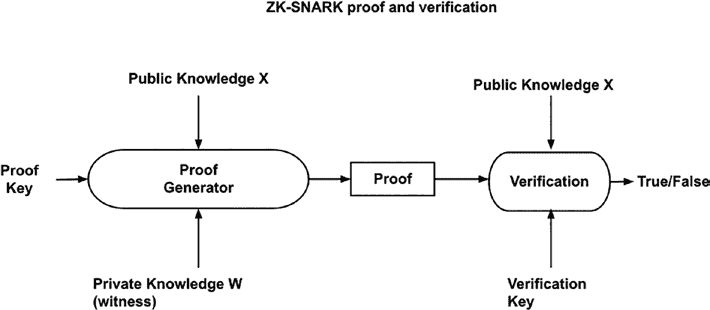

第九章 第 2 层与以太坊 2.0

如图所示（图 9-8），证明者使用证明密钥、公共输入和证人生成证明。然后将证明发送

给验证者。验证者使用公共知识或公共变量数据

以及证明知识陈述是真的还是假的。

***图 9-8。** zk-SNARK 证明与验证*

完全理解零知识证明和 zk-SNARK 需要一个

强大的数学背景。在这里，我们从概念上总结

zk-SNARK 工作原理：

• 零知识证明允许两个方验证一个

声明而不泄露私人信息。

• zk-SNARK 是零知识证明的一个子集，

满足简洁、非交互式和增强的

知识要求。

• 第 2 层 zk-rollup 使用 zk-SNARK，因为这是

在链上计算是可行的。重型

计算是在链下进行的，以生成一个证明。

验证步骤高效且简洁，并能

通过智能合约在链上执行。

369

第九章 第 2 层与以太坊 2.0

• 设计 zk-SNARK 的第一件事是定义一个

证明任务。这个任务是定义一个函数来验证一个

声明。

• 定义的验证函数然后被压平并且

减少为多个算术操作步骤。

有时，这些算术操作被称为零

知识电路。电路可以采取私人和

公共输入并生成相应的输出。

• 一旦定义了算术电路，证明密钥和

可以通过设置生成一个验证密钥

过程。证明密钥交给证明者，然后

验证密钥交给验证者。验证者可以是

智能合约。

• 证明者可以带证明进行离线计算

密钥和生成证明。

• 证明和公共数据随后发送到一个

验证智能合约以验证。

零知识证明（zk-SNARK）仍在开发中，可以预见会有更多

研究将生成更好的零知识证明（zk-SNARK）机制，用于第 2 层滚动

**以太坊 2.0**

**以太坊 2.0 的主要变化**

以太坊 2.0 和第 2 层都是为了解决区块链的可扩展性问题而开发的

以太坊主网并提高能源效率。实际上，有时，

第 2 层解决方案开玩笑地被称为以太坊 1.5。以太坊 2.0 是一个有前景的

网络改进到以太坊 1.0 主网，以下是新组件

和特性。

370

第九章 第 2 层与以太坊 2.0

**从 POW 到 POS 的转移**

与工作量证明（Proof-of-Work，POW）共识相比，权益证明（Proof-of-Stake，POS）具有

能量效率、更高的可扩展性、更好的激励机制和

更短的区块时间。POS 允许一个系统具有额外的计算

进行额外的计算工作，如托管多个质押账户或

运行服务以连接信标链或侧链。

**信标链**

Ethereum 信标链是一个基本的权益证明（Proof-of-Stake，POS）区块链，

连接质押者和分片。质押者来自以太坊 1 主网

将他们的以太币资产发送到质押智能合约的账户

参与信标链区块生成。分片是存储

和计算能力，扩展 EVM 和状态

主网存储。

**分片**

分片是以太坊区块链的新架构，允许一个

分层区块链集合，用于独立处理交易

然后聚合区块哈希到其父分片，并最终存储

在信标链上的哈希。分片允许区块链集群

同时处理交易和执行智能合约，

从而显著提高了以太坊 1.0 主网的可扩展性。

**以太坊 2.0 架构概述**

以太坊 2.0 是对以太坊 1.0 的扩展，增加了信标链和

分片链。以下图表（图 9-9）展示了以太坊 2.0 架构的概述。

371

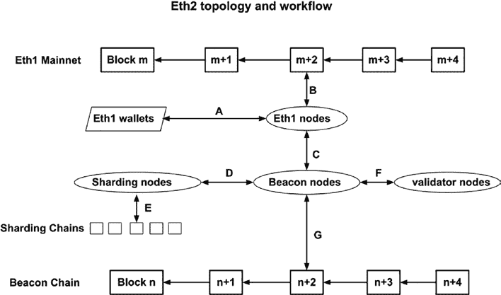

第九章 第 2 层与以太坊 2.0

***图 9-9.* 以太坊 2.0 的拓扑和工作流程*

以太坊 2 中包括遗留的

以太坊主网。以太坊主网为

Ethereum 2 的权益证明机制。信标链是一个权益证明的

基于质押的区块链记录质押信息，生成

随机数，提出验证者，并与分片

区块链记录分片的数据显示和交易 Merkle 树

然后还有多个分片区块链，

用于存储以太坊 2 数据并执行 EVM 计算和

处理交易。

生成和验证三种区块链类型的块

前述提到的以太坊 2，有四种客户端节点类型，

我们想要提及的。第一个是以太坊 1 客户端节点，如

geth 客户端生成以太坊 1 主网块。第二个是以太坊 2

是信标节点为信标链提出块。第三个是以太坊 1

验证节点为信标链。验证节点将生成或

通过信标链节点验证信标链块。然后第四

372

第九章 第 2 层和以太坊 2

一个是以太坊分片节点，负责分片块

区块链。

前述提到的区块链节点连接和通信

通过点对点或 RCP 协议相互通信。几个

图中的交互/边被标记为 A、B、C、D、E、F 和 G。

边 A 是一个账户所有者钱包与以太坊

1 个节点。这种交互允许用户构建并签署一个交易

在钱包中，然后将签署的翻译发送给以太坊 1 客户端

节点。客户端节点然后验证交易并将交易打包给一个

新块。在图中，钱包只连接到一个以太坊 1

节点，因为目前没有以太坊 2 钱包与信标节点交互。

链。

边 B 代表以太坊 1 客户端节点查看以太坊 1

主网块和交易或向区块链写入块。在

在以太坊 2 的上下文中，交互 B 主要是让质押者质押一个

资产转移到以太坊 2 在以太坊 1 上部署的质押智能合约

主网。一旦资产作为质押部署，智能合约功能

将发出一个事件，显示质押地址和金额。

边 C 是以太坊 1 客户端节点与

一个信标节点。以太坊 1 区块链中的质押信息应该

可见于信标节点。信标节点使用 RPC 与一个

客户端节点和获取由质押智能合约发出的所有事件。

当从以太坊主网检索新的质押信息时，

信标节点生成一个块以保持新的质押信息。

边 D 用于信标节点和分片节点之间的交互。

节点之间的边 E 用于分片节点提出分片块。

区块链。分片节点负责执行数据存储和

交易处理。

边 F 用于验证节点之间的交互和通信。

节点和信标节点之间的交互。权益证明（POS）矿工需要运行客户端

节点请求信标链的任务，包装交易，

验证块，并提出块。以太坊 2.0 架构将

373

第九章 第 2 层和以太坊 2

信标节点从验证节点。信标节点执行

管理通信和 epoch、slot、随机

编号生成和验证节点选择。验证节点执行

处理交易和区块。矿工特定信息，如

作为矿工凭证只存储在验证者节点中，而不是在信标

节点。信标节点与矿工节点之间的通信是通过

通过 RPC 协议完成。

信标节点到提议信标块的信标

链。每个信标节点将同步信标链，管理

质押者注册表，将验证者组织成委员会，管理时代和

槽位，生成一个随机数，分配验证者角色，并提议新的

区块到信标链。

从以太坊 2 的架构拓扑和交互来看，很清楚

以太坊 1 主网仍然是以太坊 2 的一个重要组成部分。

权益证明的质押力量来自于所有者指定的资产

参与以太坊 2 的 POS 共识。重要的是

理解以太坊 1 迁移到以太坊 2 的过程。

**从以太坊 1 迁移到以太坊 2：权益证明（POS）**

**存款、质押和削减**

从以太坊 1 迁移到以太坊 2 已经分阶段完成

的方法。以太坊 2 的第一阶段是建立一个信标链

基于权益证明共识。在下面，我们提到了一些

质押以太坊 1 资产到迁移的重要概念和步骤

以太坊 2。

权益证明的资产在以太坊 1 主网上存款

通过存款智能合约。在下面，是一个存款的片段

合约接口如下所示。

374

第九章 第 2 层与以太坊 2

// 基于以下规范的存款合约接口

以太坊 2：

// https://github.com/ethereum/eth2.0-specs

*interface IDepositContract {*

*/// @notice 一个已处理的存款事件*

*event DepositEvent(*

*bytes pubkey,*

*bytes withdrawal_credentials,*

*bytes amount,*

*bytes signature,*

*bytes index*

*);*

*/// @notice 提交一个 Phase 0 DepositData 对象.*

*/// @param pubkey 一个 BLS12-381 公钥.*

*/// @param withdrawal_credentials 对公共*

*key for withdrawals.*

*/// @param signature 一个 BLS12-381 签名.*

*/// @param deposit_data_root SSZ 的 SHA-256 哈希的*

*encoded DepositData 对象.*

*/// 用于防止输入错误*

*function deposit(*

*bytes calldata pubkey,*

*bytes calldata withdrawal_credentials,*

*bytes calldata signature,*

*bytes32 deposit_data_root*

*) external payable;*

*/// @notice 查询当前的存款根哈希.*

*/// @return 存款根哈希.*

*function get_deposit_root() external view returns (bytes32);*

*/// @notice 查询当前的存款数量.*

375

第九章 第 2 层与以太坊 2

*/// @return 以小端格式编码的存款数量*

*64-bit number.*

*function get_deposit_count() external view returns (bytes*

*memory);*

*}*

存款智能合约使用一个稀疏的 Merkle 树来存储质押

存款记录，并使用存款事件通知外部程序等

作为信标节点。此智能合约支持的主要功能包括

存款，get_deposit_root，和 get_deposit_count。存款时

质押，用户需要提供诸如公钥、提现

凭证，所有者签名和存款数据根哈希。存款

数量在 msg.value 中，因此不是函数参数。存款

ID 会自动递增，不需要提供。

向存款智能合约存入资产时，一个关键点

需要记住的是，以太坊 1 的公钥和私钥对曲线有

被更灵活的 BLS12-381 曲线所取代。以太坊

2 密钥对需要通过一个新的工具生成，该工具包含 24 个单词

助记词。与以太坊 1 不同，以太坊 2 既有

为一个账户生成提现公钥和验证器密钥。一套助记词

短语可以生成多个提现公钥，一个提现

密钥可以派生出多个验证器密钥。

**运行以太坊 2 验证节点**

**使用权益证明（POS）质押**

运行验证节点将获得以太坊 2 区块链的奖励。

与比特币或以太坊挖矿不同，以太坊 2 基于权益证明

质押，因此，所有在线的节点都将获得奖励

正确。奖励回报率大约在 3-8%的年化收益率（APR）。

以太币价值。以下主要展示了构建以太坊 2 的步骤

挖矿节点。

376

第九章 第 2 层和以太坊 2

首先，以太坊 2 依赖于以太坊 1。因此，需要一个以太坊

1 个节点仍然需要。这个节点可以用 geth 构建，也可以是一个稳定的

静态 IP 的公网节点。

第二步，用户需要分配质押资金。至少需要 32 个以太币

以运行验证节点。用户还需要考虑，如果他们的

节点宕机，会有一个惩罚，会减少质押余额。

第三步，用户需要准备一个存款账户。有一个存款

工具可以用来生成助记词和派生

提现密钥和验证器密钥。这些密钥非常重要

并应该得到保护。如果助记词和提现密钥

如果丢失了，以太坊 2 的锁定以太币也会丢失。

第四步，下载并运行信标节点和验证节点。

有多个供应商提供运行信标和

验证节点。

最后，使用脚本或第三方工具将资产存入存款

合约。检测到存款事件后，信标节点将触发该事件。

存款将在一定时间内处于挂起状态，然后变为活跃。

一个重要因素是要考虑，与工作量证明

共识，权益证明机制对

验证者。以太坊信标链实现了对

验证者。一个是非活动惩罚，惩罚验证器节点

那些离线或没有提出/证实区块的验证者。另一个是削减

它惩罚构建或证实恶意块的验证者。它是

建议验证者运行一个监控程序，以确保

他们的节点正在积极且正确地工作。

在这方面已经开发了许多工具和解决方案。用户可以

检查以太坊 2 网站以了解推荐解决方案。

377

第九章 第 2 层和以太坊 2

**以太坊 2.0 的不确定性**

尽管以太坊 2.0 被认为是一个有前景的解决方案，但

以太坊主网可扩展性解决方案，仍有一些不确定性

关于这个项目。例如，分片链仍然没有最终确定。

关于分片，关于安全和

质押经济。建议读者保持开放的心态

以太坊 2.0 的路线图、实施和推广。

**总结**

在本章中，我们解释了各种第 2 层可扩展性解决方案，包括

状态通道，plasma，滚动汇总以及以太坊 2 技术。

每项技术都有其优点和缺点。在设计去中心化

应用，了解使用模型很重要

应用并选择最可行的技术以扩展

解决方案。

378

**第十章**

**资助项目：**

**代币和燃料费**

**引言**

在之前的章节中，我们了解了智能合约的技术方面

合同编码、开发和部署以及区块链

安全性和可扩展性。

在本章中，我们将讨论如何从 both the

智能合约的商业和技术方面。

以太坊在项目相关的一些里程碑上取得了几项重要成就

融资，如首次代币发行（ICO），非可替代代币（NFT）

（NFT），去中心化金融（DeFi），以及去中心化自治组织（DAO）。

组织（DAO）。可以预见，安全代币发行（STO）

（STO），中央银行数字货币（CBDC），以及其他去中心化

应用将很快变得流行。所有这些用例都有一个

共同且 essential element: the token. In the following, we describe

代币如何用于表示资产以资助一个项目以及如何使用

在智能合约中编程代币。

© Weijia Zhang and Tej Anand 2022

379

张伟佳，安丹，*区块链与以太坊智能合约解决方案开发*，

[`doi.org/10.1007/978-1-4842-8164-2_10`](https://doi.org/10.1007/978-1-4842-8164-2_10#DOI)

第十章 资助一个项目：代币和燃料费

**用于资助生态系统项目的代币**

**代币在 ICO 和 DeFi 中的应用**

以太坊中的 ICO 是一种筹款机制，曾在大约

2017 年。它是由 ERC20 代币实现的，该代币允许代币

可在以太坊生态系统中进行编程、分布式和交易。

ERC20 代币是可替代的，这意味着它只有价值而无法

彼此区分开来。ERC20 代币遵循

EIP-20 规范，位于以下网址：

[`eips.ethereum.org/EIPS/eip-20`](https://eips.ethereum.org/EIPS/eip-20)

在 ERC20 规范中，定义了几种标准函数以及两个

事件被定义，所有发行 ERC20 代币的智能合约都将

需要相应地实现它们。函数规范如下

如下：

// 返回代币的名称

函数名()公开视图返回（字符串）

//返回代币符号的名称。通常是大写的

大写，可选。

function symbol() public view returns (string)

//返回代币使用的小数位数。

function decimals() public view returns (uint8)

//返回代币的总供应量

function totalSupply() public view returns (uint256)

//返回另一账户的账户余额

地址 _owner。

function balanceOf(address _owner) public view returns (uint256

余额)

380

第十章 资助一个项目：代币和 Gas 费用

//向地址 _to 传输 _value 代币，并且必须

触发 Transfer 事件。

function transfer(address _to, uint256 _value) public returns

返回（bool 成功）

//从地址 _from 向

地址 _to，并且必须触发 Transfer 事件。

function transferFrom(address _from, address _to, uint256 _

价值）公共返回（bool 成功）

//允许 _spender 从您的账户多次提款，

再次调用此函数，它

用 _value 覆盖当前的 allowance。

function approve(address _spender, uint256 _value) public

返回（bool 成功）

返回 _spender 仍然允许取出的金额。

从 _owner 处提取。

function allowance(address _owner, address _spender) public

返回（uint256 剩余）

事件

当代币被转让时，这个事件必须触发，

包括零值传输

事件 Transfer(address indexed _from, address indexed _to,

uint256 _value)

当成功调用以下任何函数时，此事件必须触发：

approve(address _spender, uint256 _value)

事件 Approval(address indexed _owner, address indexed _

spender, uint256 _value)

381

第十章 资助一个项目：代币和 Gas 费用

已经实现了两个智能合约包

对于 EIP-20 标准：OpenZeppelin 包和 ConsenSys

包。开发者可以扩展这些包并创建自己的

通过几行自定义代码创建 ERC20 代币。例如，通过

导入 OpenZeppelin 的 ERC20 包，开发者可以创建一个

ERC20 代币，名为“DEVELOPER_TOKEN”，代号 DEV，总供应量为

在构造函数中输入自定义的总供应量：

*// contracts/DEVToken.sol*

*// SPDX-License-Identifier: MIT*

*pragma solidity ⁰.8.0;*

*import "@openzeppelin/contracts/token/ERC20/ERC20.sol";*

*contract DEVToken is ERC20 {*

*constructor(uint256 initialSupply) ERC20("DEVELOPER_TOKEN",*

*"DEV") {*

*_mint(msg.sender, initialSupply);*

*}*

*}*

当使用 initialSupply 部署上述智能合同时

指定，部署的代币将具有 totalSupply 等于 initialSupply。

一旦创建了 ERC20 代币，还可以编写另一个智能合约

处理代币的铸币和分发。这个智能合约

当用于 ICO 时，有时被称为众筹智能合约。一个

众筹智能合约通常包含以下函数：

**代币与以太坊的比例** – 以太坊与

目标代币。

`Time of the crowdsale` – 开始时间和结束时间

令牌可用于分配的时间。

`KYC/AML` – 众筹可以有一个白名单

可以参加众筹的发送者。

382

第十章 资助一个项目：代币和燃料费

`Refunds` – 智能合约还可以实现

实现退款代币的功能。

除了众筹，ERC20 代币还广泛用于其他

例如 Compound 的借贷，

Uniswap 的交易所，以及 USDC 的稳定币。

在以太坊社区中，关于

是否 ERC20 代币是实用代币还是证券代币。这些都是

特定于国家或州，并应与法律专业人士咨询。

**Token in NFT**

与 ERC20 代币不同，不可替代代币（NFT）是可区分的

并可用于表示所有权。例如，出生证明书，

学位证书和租赁合同都是不可替代的，并且有明确的所有权。

NFT 被指定为 EIP-721 标准，用于表示

• 例如房屋、汽车和艺术品的物理资产

例如数字艺术和

收藏卡

• 例如贷款和债务的“负资产”

EIP-721 的详细规格位于以下 URL：

[`eips.ethereum.org/EIPS/eip- 721`](https://eips.ethereum.org/EIPS/eip-721)

与 ERC20 代币类似，ERC721 NFT 还定义了代币名称，

代币符号，以及总供应量。NFT 有一些主要区别：

每个 NFT 代币都有一个唯一的索引。

• 每个 NFT 代币都有一个所有者。

由于 NFT 可以指向物理或虚拟资产之外的

在区块链上，有一个名为 ERC721Metadata 的接口

定义了一个名为 tokenURL 的函数。

383

第十章 资助一个项目：代币和燃料费

`function tokenURI(uint256 _tokenId) external`

`view returns (string);`

这个 tokenURL 函数需要输入 _tokenId

并返回通用资源标识符（URI）

指向在传统

数字系统。

每个 NFT 代币可以从

另一个具有以下功能的合约：

`function transferFrom(address _from, address`

`_to, uint256 _tokenId) external payable;`

帮助

分配、转让或识别 NFT 代币。

基于 EIP-721/ERC721 标准的 NFT 代币已经

由几个项目实施。例如，0xcert 和 OpenZeppelin

已经实现了 ERC721 代币智能合约包。开发者

可以轻松扩展 ERC721 包并创建自己的 ERC721

不可替代代币。

例如，大学为学生的

学位证书，智能合约可以编写如下

示例代码：

// SPDX-License-Identifier: MIT

pragma solidity ⁰.7.0;

导入"https://github.com/OpenZeppelin/openzeppelin-contracts/

blob/release-v3.4/contracts/token/ERC721/ERC721.sol";

合同 TTCDiploma 是基于 ERC721 {

uint private _tokenIds;

地址 admin；

384

第十章 资助一个项目：代币和燃料费

constructor() ERC721("TexasTechnologyCollegeDiploma",

"TTC") public {

admin = msg.sender;

}

函数 issueDiploma(address student, string memory

tokenURI) public returns (uint256) {

require(msg.sender == admin); // 只有管理员可以发行

毕业证书。

_tokenIds++;

uint256 newDiplomaId = _tokenIds;

_mint(student, newDiplomaId);

_setTokenURI(newDiplomaId, tokenURI);

返回 newDiplomaId;

}

}

在这个程序中，TTCDiploma 智能合约被编写用来发行

为学生发行毕业证书。当智能合约部署时，代币

名称和代币符号已提供。另外，智能合约部署

地址被指定为管理员地址。只有管理员可以执行

例如发行毕业证书的特权行动。在 issueDiploma 函数中

发送者会被检查是否有管理员权限。如果有，管理员

tokenId 递增，生成一个新的毕业证书 ID。这个新的

然后分配一个指向外部源的 tokenURI

用于检索该 ID 的毕业证书。当学生想要取回

毕业证书，他们只需签署一个消息并发送到指定

diplomaId。毕业证书服务器将检查签名

消息以验证请求者是毕业证书的合法所有者

并将毕业证书输出到请求中。

385

第十章 资助一个项目：代币和燃料费

NFT 代币可以在许多领域使用。已经有很多项目

提供 NFT 艺术品和收藏品市场的项目。像

如 OpenSea 和 Decentraland 等 NFT 市场很受欢迎。

**DeFi 中的代币（Compound，Uniswap，**

**和稳定币）**

在第[1](https://doi.org/10.1007/978-1-4842-8164-2_1)章中，提到了几个 DeFi 项目，如去中心化借贷平台、去中心化交易所和稳定币。所有的 DeFi

项目使用一个或多个 ERC20 代币作为资产代币或治理

代币。在下面，我们提到了几个例子。

Compound 是一个去中心化借贷平台的项目，允许

用户无需通过

银行等中介机构。出借人可以将他们的资产代币发送到

Compound 智能合约并获得代表金额

存入借贷池的资产。cTokens 可以赚取利息

也可以交易。借款人可以从

Compound 协议。为了借入一种加密货币，借款人需要到

提供其他加密货币作为抵押品。抵押品计算基于

代币价格 Feed 和发布的公式。如果借入的资产

无法偿还，抵押品价值跌至阈值以下

确保借出的余额安全，抵押品可以根据

智能合约中编写的安全规则。

cTokens 代表在借贷

协议。此外，Compound 还发行了一种名为

COMP。通过在

借贷协议。COMP 代币可用于投票提案。所有

cTokens 和 COMP 代币都是 ERC20 代币。

Uniswap 是一个使用自动化

Market Maker (AMM)机制。不同用户可以交易他们的加密

无需依赖中心化交易所即可发行资产。Uniswap 流动性

386

第十章 资助一个项目：代币和 Gas 费

提供商为流动性池提供加密资产对作为交易对

liquidity pool。交易员然后用 liquidity pool 中的资产进行交易。

有两种代币是为 Uniswap 和其他

类似于去中心化交易平台的第一个代币被称为

liquidity provider (LP)代币，代表供应商的贡献

到流动性池。LP 代币是一种可交易对

具体。每个交易对都将有自己的 LP 代币。另一个 Uniswap

是一个 UNI 代币，也是 ERC20 代币。UNI 代币是

是一个治理代币，可用于在

Uniswap 生态系统。

稳定币，如 DAI、USDT 和 USDC，都是 ERC20 格式代币

可以交易或转让。其他功能，如自动

根据供需进行铸币和销毁，构建在

使其价值稳定。稳定币的价值可以保持

与几种机制稳定，如货币抵押、加密

抵押，或算法机制。

尽管大多数 DeFi 代币都是 ERC20 代币，但它们并非无法

与每个 DeFi 在标准之上构建附加功能相同

ERC20 代币。DeFi 项目都是开源的，它们的代码

代币可以在公共源代码存储库中查看和检查。

**企业代币/标准化代币**

**(泛在)代币**

通过 ERC20 代币实现 ICO，使代币得以

可编程、分布式并在以太坊生态系统中交易。

一个 ERC20 代币是一个不可区分的代币，在

个别代币。一个 NFT 里程碑由 ERC721 赋予，它

使代币唯一、可追溯、可交换和可交易。STO 是

由 ERC1400 赋予，允许所有者拥有实体的一部分

资产。代币与去中心化应用不可分割。

387

第十章 资助一个项目：代币和 Gas 费

公共区块链中的代币是开放的、无需许可的，并旨在

用于大规模分发。对于企业来说，需要一个更加

为可以通过区块链传播的代币提供结构化和正式的框架

不同的私有区块链，且易于设计和定制。

企业代币在许多领域都有潜在用途，包括

如下：

**供应链代币**

在供应链中，资产可以对应于零部件、库存、订单、

货物运输、贷款和提单。所有这些资产都可以被代币化并

记录在区块链上。对这些资产的操作可以建模为

在区块链上进行交易。像 IBM、FedEx、微软、

和 Accenture 都在构建区块链解决方案，以帮助解决供应链

将问题链化以提高效率，增强可追溯性，并最大化

增加透明度。供应链中使用的代币类型更为广泛

比 ERC20 或 ERC721 更常见的 DeFi 用例。在供应链

在供应链系统中，所有可识别的项目都可以被代币化并在

区块链。

**行业特定代币**

代币可以扩展为代表所有可识别的项目，并且可以

用于表示物理、数字或虚拟资产的所有行业。例如，

在可再生能源领域，例如太阳能或风力发电，可以

将碳信用代币化并进行交易。下面我们描述了碳信用代币可以

用于描述和代币化 CO2 排放以及这些信用如何

可以在市场交易中交易（图 10-1）。

388

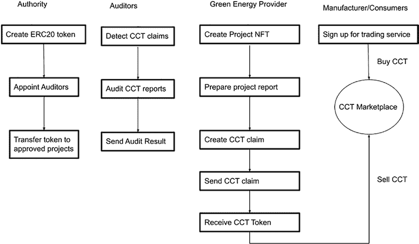

第十章 资助项目：代币和燃料费

***图 10-1.** 碳信用代币（CCT）概览*

为了建立一个碳信用市场，当局首先需要铸币

发行一个 ERC20 代币来表示 CO2 减排。碳信用

当局首先通过使用诸如

作为“联合集团碳信用”，象征“CCT”，总金额

减少 CO2。初始碳信用额由

权限账户。只有权限方才有权转让或授予

碳信用额。

为了管理碳信用，当局将任命审计师

审查和审计绿色能源提供商的要求，以决定

如果索赔被批准，将触发一个事件

发行的碳信用额。

为了索赔碳信用，绿色能源提供商首先创建

一个 NFT 代币来表示项目。这个 NFT 代币是唯一的，

指向项目记录。项目团队然后提交一个索赔，

包含有关 CO2 减排量和碳信用额的信息

389

第十章 资助项目：代币和燃料费

请求的项目的 NFT 也将有一个统一的

资源位置，指向记录了所有

项目相关的文件和报告。一旦这些数据被写入

将索赔信息记录到区块链上，将索赔事件发出以通知审计师进行审计

索赔信息。索赔经审核和批准后，

当局将碳信用转移给绿色能源提供商

账户。提供商可以将 CCT 资产发送到碳信用

交易市场。

在消费端，需要

碳信用额以满足配额，将从

市场。为碳信用支付给绿色能源提供商的加密货币

CCT 资产可用于扩大绿色能源提供商的工作范围

生产更多可再生能源。

有关碳信用项目示例，请参考以下存储库：

[`github.com/masaun/tokenized- carbon-credit- marketplace/`](https://github.com/masaun/tokenized-carbon-credit-marketplace/blob/main/smart-contract/contracts/GreenNFT.sol)

[blob/main/smart- contract/contracts/GreenNFT.sol](https://github.com/masaun/tokenized-carbon-credit-marketplace/blob/main/smart-contract/contracts/GreenNFT.sol)

**代币分类倡议**

碳信用代币、太阳能代币、电力代币、零部件代币、系统

代币，和水代币都可以归类为企业代币，可以

使用更正式的代币定义进行设计。像

例如企业以太坊联盟（EEA）和 InterWork 联盟（IWA）

一直在从事代币分类倡议（TTI）以开发一个代币

框架可以正式制定并用于代币化所有可识别的

在复杂的企业用例中的资产。

代币分类基础设施和框架具有以下

目标和企业关键特性：

• 区块链不可知论，意味着它不依赖于

在 Solidity、Haskell、WASM 或 Java 编程

不同区块链的语言

390

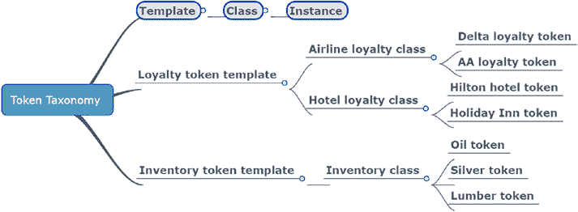

第十章 资助一个项目：代币和燃料费

• 业务和技术双方都能理解

专业人士

• 描述性以及可编程的

• 为企业 address 广泛的用例场景和

公共区块链

• 追求易于使用、改进的可互操作性、

更易于沟通、更快捷、更安全

开发

以下图片（图 10-2）展示了代币

分类。与 ERC20 和 ERC721 不同，其中代币是定义

在规范中编码为智能合约，代币分类

框架（TTF）在三层中定义代币。第一层是

模板层中代币的属性、公式和行为

定义。代币模板可以是通用的，例如忠诚度代币

模板或库存代币模板。第二层是类层

当分配参数创建代币类时模板。对于

例如，忠诚代币模板可以应用于航空公司忠诚度或

酒店忠诚度参数创建航空公司忠诚度代币类或酒店

忠诚代币类。然后可以将代币类实例化

例如，达美航空或美国航空的忠诚代币。

***图 10-2.* 代币分类示例**

391

第十章 资助一个项目：代币和燃料费

当使用此框架进行以太坊智能合同时，

模板层类似于 ERC20 或 ERC721 规范。类

层将 ERC20 智能合约扩展为航空公司忠诚度代币或酒店

代币。实例层使用代币智能

合约构造函数在部署时。

TTF 还定义了几个正式化代币的基本属性

包括以下内容：

**代币单元** – 可以是有分数、整数或库存代币模板的代币单元。

单例。

分数意味着代币可以划分为分数单位。

整体意味着代币不能被分割，但可以有

多份。

单例意味着代币不能被分割，并且有一个

数量为 1。

**值类型** – 如果代币有价值，其价值类型是内在的。如果一个代币

是一个有价值的物理或数字物品的代表，其价值类型

是引用。

**表示类型** – 不具有个体身份的代币

被称作普通或可替代的代币。具有索引或序列号的代币

被称为独特或非可替代的代币。

**模板类型** – 模板描述了

代币。例如 ERC20 或 ERC721 这样的原始代币是单一的代币。更多的

通过扩展基本代币可以创建复杂的代币。混合

代币可以有父代币以及不同类型的子代币。

除了前面提到的基本属性外，代币

在 TTF 中定义的模板也可以具有允许它们的行为属性

可铸造，可转让，且可销毁。

可转让性是转让代币所有权的能力。双方

ERC20 和 ERC721 代币是可转让的。

可铸造性是发行该类新代币的能力。创建新

为毕业生颁发文凭是铸造的一个例子。

392

第十章 资助一个项目：代币和燃料费。

可销毁性是从流通中移除代币的能力。一些

项目可以通过销毁项目代币来减少流通中的代币数量

代币供应。

从框架的角度看，TTI 可能看起来很抽象

观点来看。实际上，构建如

一个可以通过 GUI 创建代币的代币设计师。

支持拖放功能。开发人员或用户不需要编写

代币的智能合约代码。代码将自动生成

当用户通过文本或 GUI 工具定义代币时。TTI 的工作仍然

正在进行中，目前还不是标准。

**代币经济考虑**

**代币分配**

当奖励代币被提出和设计时，它们需要被颁发

那些为项目做出贡献的人。通常，利益相关者如

项目团队、资助者和社区需要考虑。对于

示例，Filecoin 项目是一个基于区块链的去中心化存储项目。

网络。项目团队在

IPFS 协议允许数据用户使用 Filecoin 激励矿工

提供长期数据存储和可用性。Filecoin 代币是

设计为使用百分比图表的可替代代币，如图所示

以下图表（图[10-3）]来分配 Filecoin 代币。

393

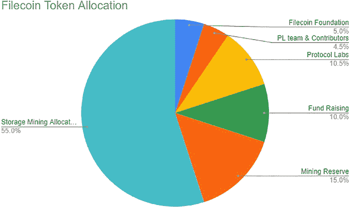

第十章 资助一个项目：代币和燃料费。

**图 10-3.** Filecoin 代币分配*

对于 Filecoin 项目，创建的代币最大数量

将是 200 亿。代币的 5%分配给 Filecoin

基金会以促进 Filecoin 网络的治理，资助关键

发展项目，支持 Filecoin 生态系统的增长，以及

支持 Filecoin 和去中心化网络的倡导者。另一个 4.5%的

代币分配给 Protocol Labs 团队和贡献者，占 10.5%

是给 Protocol Labs 公司的。Filecoin 项目分配了 10%

他们的代币用于筹款。大部分代币分配给

矿工支持存储挖矿奖励、区块奖励和其他

例如水龙头和存储激励。最后 15%的

代币留作未来挖矿服务和奖励。

**代币分配**

一旦代币分配完成，就有不同的方法来分配

向接收者发送代币，如图所示（图 10-4)

394

第十章 资助一个项目：代币和燃气费

***图 10-4。代币分配方法*

**燃气费考虑**

当我们资助一个项目时，有很多因素要考虑。

以太坊区块链已经通过燃气

经济中，每个交易都是由发送者支付给区块链

矿工。如果一个项目正在建立一个新的区块链，那么燃气费

机制应该被彻底考虑，以确保可持续的

网络系统。对于建立去中心化应用程序的项目，成本

的燃气消耗应该被检查，以确保高燃气成本

395

第十章 资助一个项目：代币和燃气费

交易不会成为应用程序的障碍。在

下面，我们将讨论以太坊燃气是如何工作的，以及是否存在降低燃气费的方法

在智能合约开发中降低燃气费。

**什么是以太坊燃气？**

在以太坊区块链中，燃气可以被视为执行

交易或作为动力区块链生态系统的机制。

当交易被发送到区块链时，会有一小部分以太币

需要指定并支付给矿工，以便以太坊

区块链节点接收交易到一个区块。燃气越高

费用，矿工节点包含交易的可能性越高。

除了奖励矿工外，燃气机制还增加了操作的成本

防止恶意用户进行的网络攻击。在公共区块链中，每个人

可以访问网络并向矿工发送交易。没有

适当的燃气费，大量交易可能会发送到

网络，导致拥堵问题甚至使网络停止。 The

燃气费是一个设计良好的机制，以维持可持续的网络

和平衡去中心化应用程序生态系统。

**用燃气站比喻理解以太坊燃气**

以太坊中的燃气是一个复杂的概念。很难理解它的含义

对区块链网络和应用生态的影响。

在本节中，我们将使用燃气站比喻来帮助读者更好地

以太坊中理解燃气使用（图[10-5]）。](#p407)

396

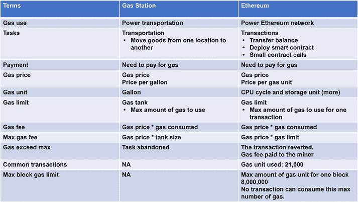

第十章 资助一个项目：代币和燃气费

***图 10-5。燃气站比喻*

运输中的气体用作燃料，以驱动车辆移动

将人员和大件物品从一个地点转移到另一个地点。另一方面，在

以太坊用于推动以太坊网络，使其更加安全

较不拥堵，并激励区块链矿工。以太坊中的气体

用以支付资产转移、部署智能合约或调用

智能合约功能。

在加油站，汽油价格通常以每加仑美元标记，

而在以太坊中，气体价格也用来指代单位价格的

气体。气体价格的概念并不那么简单。气体价格

以太坊中的单位是每气体单位的 Wei，其中 Wei 是以太坊的最小单位。

一个以太币等于 10 的 18 次方 Wei。气体单位指的是

以太坊的挖矿成本。它是在气体成本表中手动定义的

以太坊白皮书。例如，加法操作的气体成本

3, 乘法操作的气体成本为 5\. 总气体费用将等于

气体价格乘以消耗的气体。

397

第十章 资助一个项目：代币和气体费用

在以太坊的气体机制中，也有气体限制的概念。

单个交易可以消耗的最多气体量。

设置气体限制的原因是为了保护发送者账户。有时，

一个智能合约可能会进入计算循环并耗尽整个

如果没有设置气体限制，则发送者账户的余额。对于汽车，油量限制就是油

油箱容量。当设置了气体限制并且气体消耗超过

超出该限制，交易将被标记为失败，状态将回滚

回滚到原始状态。

交易有两种类型，其中一种是简单的资产

转账可将资产从一帐户转移到另一帐户。这些资产转移

将消耗 21,000 GWei 气体。第二种交易类型是智能

合约调用。消耗的气体比普通资产要多得多。

转账。

此外，对于以太坊区块链，还有一个最大

区块气体限制。这是整个区块内所有交易的气体限制。

最后，此处消耗的气体是以太坊的单位 Wei。通常，

实际成本以美元计算，其中消耗的气体乘以

以太币的价格计算法定货币成本。

**在智能合约程序中量化气体费用**

当部署去中心化应用时，对于

用户最大的成本之一是气体费。以太坊主网交易的气体费

已经飙升，有时单个

交易。因此，项目的可行性研究将需要包括

对气体费用进行分析，以判断项目在财务上是否可行。

例如，有些人提议用区块链来构建一个

去中心化音乐服务的可行性。量化分析有助于确定

存储音乐数据（包括音乐比特和元数据）的成本效益分析。

398

第十章 资助一个项目：代币和气体费用

如第七章所解释的[，Solidity 智能合](https://doi.org/10.1007/978-1-4842-8164-2_7)约被编译成字节码，然后部署到区块链上并执行。每个

字节码命令包含操作码和操作数。对于

各种操作码在以太坊黄皮书中显示，其中有些是

EIPs 中的操作码和修改。以下是燃料气的总结。

操作码类别的燃料成本（图 10-6）。

**图 10-6。** 各种操作码的燃料成本*

399

第十章 资助一个项目：代币和燃料费

**图 10-6。**（续）

从燃料成本表中我们可以看出，算术操作码如

另外，还包括加法、减法、乘法、除法和逻辑运算。

例如 AND/OR 仅消耗约 2 到 5 个燃料单位，可以看作

低燃料费操作。获取发送者的环境操作，如

地址、以太币值和区块号也是低燃料成本的操作，

仅消耗 2 个燃料单位。内存操作更

更复杂。对单个 256 位字进行操作的成本仅为

3 用于存储。然而，内存存储还有额外的内存

扩展成本。存储更多数据时，有内存成本。

内存存储操作的成本不是线性的。我们将解释这一点

在下一个表中进一步。

400

第十章 资助一个项目：代币和燃料费

存储到区块链的操作码是最昂贵的。

将数据存储到区块链上，每个词的成本为 20,000 燃料单位。

对于非零值消耗 5000 个燃料单位，对于零值消耗

区块链的燃料单位为每字 200。

有关程序计数器相关的操作，例如 JUMP、JUMPI、

PC、JUMPDEST 在表中定义。它们导致 1 到 10 个燃料单位

单位，分别。

程序停止操作具有非常不同的燃料成本。操作码

STOP 或 RETURN 用于停止函数的执行。RETURN

操作码还将输出数据返回给调用函数。这两个操作码都

不消耗燃料。

REVERT 是一种遇到问题并需要撤销所有

对区块链的更改。分配给区块链的剩余未使用燃料至少为

交易返回给发送者。SELFDESTRUCT 操作停止

执行并注册一个账户供以后使用。此操作码的成本至少为

至少 5000 个燃料单位。

前表显示了操作码和字

有效载荷级别。对于存储操作，成本不一定线性。对于

例如，对于内存存储操作，还有额外的内存。

扩展成本。MSTORE 和 MSTORE8 的总成本定义为

内存扩展和静态存储操作的和中显示在

以下：

gas_cost_operation = (new_mem_size_words ^ 2 // 512) + (3 * new_

mem_size_words)

以下表（图 10-7）显示了针对字、千字节和兆字节数据大小的栈、内存和持久化存储的成本。

401

第十章 资助一个项目：代币和燃料费

**图 10-7.** 不同类别和大小存储的气体成本*

对于栈操作，没有额外的内存扩展

成本。POP、PUSHX、DUPX 和 SWAPX 的每个单词气体成本定义为

分别为 2、3、3 和 3 个单位。在以太坊中，一个单词有 256 位或 32

字节大小。由于一个千字节等于 32 个单词（1024 字节/32 字节），

每个千字节的气体成本是单词气体成本的 32 倍。因此，气体

POP、PUSH、DUP 和 SWAP 的每个 KB 气体成本分别为 64、96、96 和 96。

同样，由于 1MB 是 1KB 的 1024 倍，POP、PUSH、

DUP 和 SWAP 分别为 65,536、98,304、98304 和 98304。

对于内存操作，当扩展到

KB 和 MB。

第一次 MLOAD 没有内存扩展成本。气体成本

对于 1KB，其费用等同于每个单词的气体成本的 32 倍，即 96 个单位，而成本

MB 的气体成本为 1024 倍于 KB 的气体成本，即 98,304。

对于 MSTORE 和 MSTORE8，都有内存扩展成本

使用前面方程式所示的公式。每个 KB 和

MB 的 MSTORE 和 MSTORE8 成本如下：

对于 1KB 的 MSTORE 或 MSTORE8，新内存大小为 32 个单词

单词。以下内存扩展方程式被使用：

402

第十章 资助项目：代币和气体费用

gas_cost_operation = ( new_mem_size_word ^ 2 // 512) + (3 * new_

mem_size_words)

结果是

gas_cost_operation_per_KB = (32²)/512+3*32 = 98

同样，对于 1MB 的 MSTORE 和 MSTORE8，有

32*1024=32,768 个单词。

结果变为

gas_cost_operation_per_MB = (32768²)/512+3*32768 = 2,195,456

因此，计算显示内存存储操作

不是线性的。当存储的数据量增加时，它会急剧增加。

对于使用 SSTORE 和 SLOAD 的持久化存储，气体成本增加

线性增加与数据大小。SLOAD 的每个单词成本为 200。因此，

MLOAD 每 KB 和 MB 的气体成本分别为 6,400 和 6,553,600。

同样，由于 SSTORE 的每个单词成本为 20,000，KB 和 MB 的成本为

是 640,000 和 655,360,000，分别为。

从前面的计算可以看出，定量

气体使用和成本的计算相当复杂。一般来说，存储数据

在区块链中以及运行时使用大量内存

节点也非常昂贵，应尽可能减少。

气体估算应该集成到项目提案中，以寻求适当的

以确保项目可持续资助。

**总结**

在此截图中，我们描述了资助去中心化

应用项目，包括代币设计、代币分配、分发、

以及气体成本。对于以太坊区块链，尽管显著的气体成本仍然

一个大挑战。替代方案包括使用类似区块链

与 EVM 和 Solidity 支持但较低的气体费用。还有一个

可能性建立一个不需要燃料费用的区块链。这些

解决方案技术上都是可行的，可以评估它是否适合

与业务模式相结合。

403

**第十一章**

**构建团队**

**项目**

**问题陈述和头脑风暴**

当以太坊区块链最初建立时，链 Id 是不存在的

区块。chainId 的概念是在 DAO 攻击之后引入的。

2016 年发生了一次，导致 360 万个以太币被盗，使以太坊

区块链分叉成两个区块链，即以太坊主网（ETH）

和以太坊经典。以下图表（图 11-1）展示了分叉是如何发生的。在图表中，区块 m 是 DAO 攻击的区块。

发生了。以太坊基金会进行了投票，社区

决定修补以太坊节点客户端并无效化黑客

账户。这不是回滚，而是客户端节点的全部更新

对以太坊进行强制状态更改。有一些矿工

认为区块链应该是不可变的，不应该更改

由于攻击。这些矿工继续向 DAO 添加区块。

攻击区块并保留以太坊区块链的不可变性。

他们称这个区块链为以太坊经典（ETC）。自那时以来，已有

已经分叉成两个共享相同区块的以太坊区块链

直到区块 1920000\。

© 张伟嘉和 Tej Anand 2022

405

张伟嘉（Weijia Zhang）和安德（Tej Anand）合著了《**区块链与以太坊智能合约解决方案开发**》。

[`doi.org/10.1007/978-1-4842-8164-2_11`](https://doi.org/10.1007/978-1-4842-8164-2_11#DOI)


第十一章 构建团队项目

***图 11-1。ETH 和 ETC 分叉概览***

随着以太坊区块链分叉成 ETH 和 ETC，存在一个

双重花费或重放攻击问题。如果爱丽丝在区块 M 有 50 个以太币，她

实际上在 ETH 链上有 50 个以太币，在 ETC 链上也有 50 个以太币。假设

爱丽丝在 ETH 链上签署一个转移 50 个以太币给鲍勃的交易，

由于 ETC 和 ETH 几乎相同，鲍勃可以采取相同的签名

交易并在 ETC 链上收到 50 个以太币。

链。

为了解决两个区块链上的双重花费/重放攻击，维塔利克

提出了 EIP-155（简单的重放攻击保护）以分配一个整数。

对每个区块链签名交易，并使用 chainId。这样，

爱丽丝为以太坊主网（ETH）签署的交易无法重发。

到以太坊经典（ETC）链上造成双重花费。

在 EIP-155 中，一些 chainIds 如以下所示被预分配。

表（图 11-2）。要获得一个新的 chainId，区块链社区的负责人需要前往 [`github.com/`](https://github.com/ethereum-lists/chains)

[ethereum-lists/chains](https://github.com/ethereum-lists/chains)提交拉取请求以注册新的 chainId。chainId 的分配是先到先得的基础

确保没有 chainIds 的冲突。

406

第十一章 构建团队项目

***图 11-2。在以太坊主网和测试网上定义的 chainids***

尽管 EIP-155 为各种区块链解决了重放攻击问题，

有一些缺点，包括 chainId 是自定义的，并且

不与区块链属性捆绑。恶意用户可能构造

将另一个区块链的 chainId 用于区块链。这可能会导致

发送跨链交易到错误的目标区块链。另一个

分叉的缺点是，当一个区块链分叉成两个区块链时，例如

以太坊（ETH）和以太经典（ETC）的情况，这两个区块链将具有相同的 chainId

引起冲突。

**规格和解决方案**

为了克服简单数字 based chainId 的缺点，一个

32 字节的跨链 ID 可以用来添加更多信息到该跨链 ID 中。*

使跨链 ID 更具通用性。跨链 ID 可以具有一个

创世区块散列和一个校验和，以便第三方应用程序和

用户可以验证该跨链 ID 对特定区块链是否有效。

407

第十一章 构建团队项目

跨链 Id 的规格作为以太坊

改进协议（EIP）3220，如下所示。

**EIP-3220：跨链标识符规格**

**简单概述**

一个自验证的独特区块链标识符，用于解决分叉问题。

**摘要**

跨链 ID 是一个 32 字节的十六进制字符串，从中提取一些字节来自*

区块链散列和一些手动定义的特性来描述一个区块链。*

*我们还提出了一种*注册和查询服务*，可以从跨链 ID 中检索区块链元数据。*

**动机**

随着比特币和以太坊的成功，各种区块链如 EOS、*

开发了如 Ripple、Litecoin、Besu、Wanchain 等，*

*正在快速发展。还有一些其他的私有和联盟链*

*如 Hyperledger Fabric、Hyperledger Besu、Stellar、Corda 的*

仅允许具有许可身份的节点加入的*

*区块链网络时。公有和私有区块链的增长强加了*

*跨链互操作性面临的挑战，特别是当这些链是*

组成的异构和互不兼容。企业以太坊联盟成立*

*跨链互操作性任务组（CITF）* *调查常见的跨链问题和解决方案。CITF 团队注意到有一个缺失*

以描述和表示区块链的唯一标识符。有几个*

*EEA 跨链互操作性任务组的讨论中讨论了这些提案*

*会议和讨论。*

408

第十一章 构建团队项目

[*EIP- 155*](https://eips.ethereum.org/EIPS/eip-155) *为区块链提供唯一标识符，以提供简单的* *中继攻击保护。本规范定义了一个整数作为 chainId*

*在交易数据中签署 chainId，从而*

*防止攻击者将同一笔交易发送到不同的区块链。*

本规范将要求区块链定义 chainId 并注册*

在公共存储库中注册 chainId。*

*使用整数作为 chainId 的挑战在于它不够广泛*

*足以涵盖所有区块链，并且它不能防止不同的区块链*

*使用相同的 chainId。此外，它没有解决两个分叉的*

*具有相同 chainId 的区块链。*

*因此，需要一个更健壮的区块链标识符，以*

*克服这些缺点，特别是对于跨链操作，其中*

*当涉及多个链时。一个区块链标识符（跨链 ID）应该*

*是唯一的，并满足以下要求：*

• *应提供识别、描述和发现的功能*

*的区块链*

• *应提供每个区块链的唯一识别*

*在跨链服务生态系统中*

• *应提供区块链身份的描述，如 chainId、名称、类型、共识机制等*

*例如，chainId、名称、类型、共识机制等*

• *应提供一种支持*

*区块链以及新区块链在*

*生态系统*

• *应提供一种加入区块链的机制*

*注册到生态系统中*

• *应提供一种使区块链能够编辑其*

*属性或从跨链生态系统中注销*

409

CHAPTER 11 构建团队项目

• *应提供获取一些关键信息的方法，如*

*区块链的信息*

• *应提供区分原始*

*区块链和分叉的区块链*

• *应提供一种无需*

*外部注册服务*

**规格**

以下图表（图 11-3）显示了 32 字节跨链 ID 的定义。

410

CHAPTER 11 构建团队项目

***图 11-3。32 字节跨链 ID 的定义*

411

CHAPTER 11 构建团队项目

**理由**

*我们已经考虑了各种备选方案，比如使用一个*

*用随机唯一的十六进制字符串来表示一个区块链。这种方法的缺点是*

*这种方法的问题是随机 ID 不能用来验证一个区块链的*

*内在身份，如创世块的块散列。第二个*

*另一种选择就是简单地使用创世块散列来表示区块链 ID*

*对于跨链操作。这个 ID 的缺点是它没有关于区块链属性的信息，并且在*

*一个区块链被分叉成两个区块链。*

**向后兼容性**

*跨链 ID 可以与 EIP-155 向后兼容。跨链 ID*

*包含一个 4 字节段，记录基于 EIP-155 的 chainId*

**安全考虑**

*跨链 ID 冲突：两个区块链可能包含相同的跨链*

*ID，从而错误地将资产转移到错误的区块链上。*

*这个问题通过比较*

*跨链 ID 与创世块的散列相匹配，如果匹配，则*

*跨链 ID 已验证。如果没有，可以将与分叉块散列比较的* *跨链 ID* *与创世块散列进行比较。如果没有任何块散列与跨链 ID 散列匹配，*

*那么跨链 ID 就不能被验证。*

*防止中继攻击：尽管跨链 ID 本身与*

链 Id 且未签名到区块链交易中，跨链 ID*

*仍然可以用于防止中继攻击。处理*

跨链交易可以通过其块哈希验证跨链 ID*

*并决定交易是否有效。带有*

无法验证的跨链 ID 应该被拒绝*。

412

第十一章 构建团队项目

跨链 ID*无需签名到区块链交易。对于*没有将跨链 ID 加密签名到区块的区块链，*

*跨链 ID 不能与区块本身进行验证，并且有*

与外部智能合约地址和离线工具*进行验证*

基于跨链 ID 规范*实施*。

要使用跨链 ID，需要开发并部署服务

将跨链身份注册到不同区块链的区块链。

此服务应提供以下功能：

• 允许用户将区块链注册到服务

• 允许管理员或管理员组

批准或撤销用户注册的区块链

• 允许用户修改区块链信息

在最终确定之前

• 允许任何用户列出和检索跨链 ID

已注册

• 允许通过旧链 Id 查询跨链 ID

定义在 EIP-155 中

**架构**

跨链身份服务的架构在

以下图表（图[11-4])。T](#p423)底层提供的区块链为服务提供了安全和不可变性。中间层

是具有添加跨链 ID，查询

id，批准或撤销 id，修改 id 等。智能合约可以查询或

通过 EVM 将状态保存到区块链。顶层是 GUI 层

渲染网页，处理用户输入并与

使用 Web3 和 MetaMask 钱包与智能合约交互。Web3 层将需要

连接到一个 RPC 节点，以便访问智能合约。

413

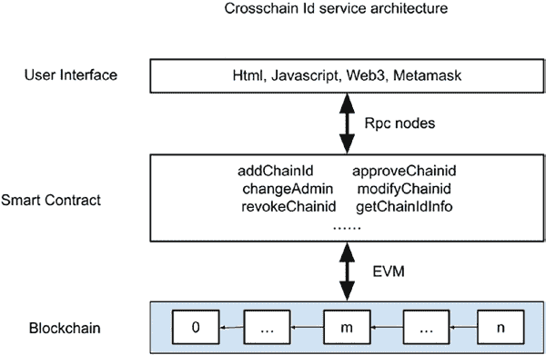

第十一章 构建团队项目

***图 11-4。跨链 id 服务架构*

**设计智能合约**

在设计智能合约时，考虑以下因素：

参与者及其角色，数据结构，事件和功能。

**角色**

为跨链 ID 服务智能合约定义了三个角色。该

所有者是一个角色，部署智能合约。这位所有者拥有智能合约*

合约，并拥有为智能合约指定管理员的权限

合约。管理员（admin）管理跨链 IDs 和

可以批准或撤销跨链 ID。还有普通用户

可以查询跨链 ID，添加新的跨链 ID 或修改其

信息。

414

第十一章 构建团队项目

**事件**

当用户在智能合约上执行操作时，会触发几种不同

事件可以被发出，以便客户端应用程序可以查询发生了什么

发生了。定义了四个事件：

**AddChainId** – 当一个新的

跨链 ID 被添加到服务中。

**VerifyChainId** – 当一个

跨链 ID 已经被管理员

管理员。

**RevokeChainId** – 当

一个跨链 ID 已经被智能合约的

管理员。

**ModifyChainIdInfo** – 当一个

注册商修改跨链 ID 的元数据。

**数据结构**

已经定义了一些数据结构。有一个 chainidInfo 数据

包含管理地址、长名称、短名称、类别、

和区块链的 URL 字符串。有一个状态枚举，带有

到 Pending, Verified 和 Revoked。Pending 是在一个跨链

当 ID 刚刚注册时。Verified 是一个状态，当管理员批准

跨链 ID。Revoked 是在管理员发现问题时

具有跨链 ID 并且拒绝其注册。还有一些

像 idStatus 和 idInfo 这样的映射数据结构，允许智能

合约查询跨链 ID 状态和元数据信息。并且

最后，有一个 legacyIds，将旧 ID 与新跨链 ID 关联。

415

第十一章 构建团队项目

**函数**

以下是为智能合约定义的函数：

**addChainId** – 这个函数添加了一个新的跨链

跨链 ID 到服务。它可以被任何用户调用。

**changeAdmin** – 这个函数改变了

服务管理员。它可以被

所有者。

**apporveChainid** – 这个函数改变了状态

跨链 ID 到 Verified。它只能被

由智能合约服务管理员。

**revokeChainid** – 这个函数改变了状态的

跨链 ID 到 Revoked。它只能被

由智能合约服务管理员。

**modifyChainidInfo** – 这个函数修改了

跨链 ID 的元数据信息。它可以是

由跨链 ID 的管理员调用。

**getChainIdStatus** – 这个函数返回了状态

跨链 ID。

**getChainIdFromLegacyId** – 这个函数返回

与旧 ID 关联的跨链 ID。

**getChainIdInfo** – 这个函数返回了

链 ID 的元数据信息。

**智能合约的 UML**

为了更好地可视化跨链身份服务智能合约，以下

图（图 11-5)被生成：416

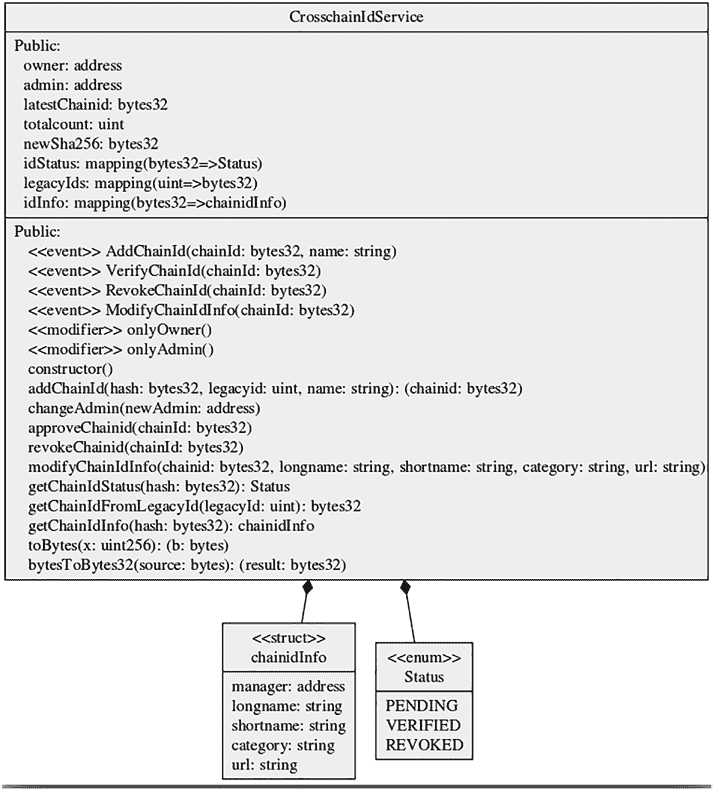

第十一章 构建团队项目

***图 11-5。跨链身份服务智能合约的 UML 图*

417

第十一章 构建团队项目

**智能合约代码**

跨链 ID 智能合约的代码和解释显示

在下面：

`// SPDX-License-Identifier: GPL-3.0`

`pragma solidity >=0.7.0 <0.9.0;`

`/**`

`@title CrosschainId`

`@dev 管理跨链身份服务`

`*/`

`contract CrosschainIdService {`

`// string message;`

地址公共所有者；

地址公共管理员；

`bytes32 public latestChainid;`

`// bytes4 public newlid;`

uint public totalcount;

bytes32 public newSha256;

enum Status{PENDING, VERIFIED, REVOKED}

// mapping(bytes32 => bytes32) chainidlist;

mapping(bytes32 => Status) public idStatus;

// mapping legacy id with chainid for faster lookup

mapping(uint => bytes32) legacyIds;

struct chainidInfo {

address manager;

string longname;

string shortname;

string category;

string url;

}

418

第十一章 构建团队项目

mapping(bytes32 => chainidInfo) idInfo;

event AddChainId(bytes32 indexed chainId, string name);

事件 VerifyChainId(bytes32 indexed chainId);

event RevokeChainId(bytes32 indexed chainId);

event ModifyChainIdInfo(bytes32 indexed chainId);

modifier onlyOwner() {

require(msg.sender == owner);

_;

}

modifier onlyAdmin() {

require(msg.sender == admin);

_;

}

//add common crosschain id such as Etherem mainnet.

constructor() {

owner = msg.sender;

admin = msg.sender;

addChainId(0xd4e56740f876aef8c010b86a40d5f56745a118d090

6a34e69aec8c0db1cb8fa3, 1, 'Ethereum Mainnet');

modifyChainIdInfo(latestChainid, "Ethereum Mainnet",

"eth", "mainnet", "www.etherscan.io");

addChainId(0x6341fd3daf94b748c72ced5a5b26028f2474f5f0

0d824504e4fa37a75767e177, 4, 'Ethereum Rinkeby');

modifyChainIdInfo(latestChainid, "Ethereum Rinkeby",

"rinkeby", "testnet", "rinkeby.etherscan.io");

}

//添加跨链 id

//@hash: 创世区块或第一个区块的哈希

forked block

419

Chapter 11 构建团队项目

//legacyid:基于 EIP-155 的旧链 id

//区块链的名称

function addChainId(bytes32 hash, uint legacyid, string

memory name) public returns (bytes32 chainid) {

require(hash != 0x00);

//要求（检查唯一性，如有需要检查预言机）

//去掉其他 16 字节

hash = (hash >> 128) <<128;

//以 bytes32 格式获取旧链的链 id

bytes32 legacy_chainid = bytesToBytes32(toBytes(l

egacyid));

//为旧链 id 保留 8 字节。与

block hash

hash = hash | (legacy_chainid << 64);

//计算组合哈希的 sha256

newSha256 = sha256(abi.encodePacked(hash));

//将哈希与 sha256 的前两个字节合并作为

checksum

hash = hash | (newSha256 >> 240);

chainid = hash;

//检查链 id 是否已注册。如果 idStatus 是

it has 0x00, revert and exit

if(abi.encodePacked(idStatus[chainid]).length > 1) {

revert();

}

if(legacyIds[legacyid] != bytes32(0)) {

revert();

}

420

Chapter 11 构建团队项目

legacyIds[legacyid] = chainid;

latestChainid = chainid;

//将 idStatus 设置为 PENDING

idStatus[chainid] = Status.PENDING;

//设置链 id 元数据（部分）。其余的设置为

modifyChainIdInfo

idInfo[chainid].manager = msg.sender;

idInfo[chainid].longname = name;

//增加 totalcount

totalcount++;

emit AddChainId(chainid, name);

}

//所有者更改服务的管理员。如果

管理员可以是链外管理的多签地址

function changeAdmin(address newAdmin) onlyOwner public {

admin = newAdmin;

}

//要求发送者是管理员

//批准一个链 id

函数批准链 id(bytes32 链 id)仅管理员公共{

要求(idStatus[chainId] == 状态.PENDING);

idStatus[chainId] = 状态.VERIFIED;

发出验证链 Id(chainId);

}

// 要求发送者是管理员

// 撤销一个链 ID

函数撤销链 id(bytes32 chainId)仅管理员公共{

421

第十一章 构建团队项目

要求(idStatus[chainId] != 状态.REVOKED); // 可以

撤销链 Id 在 PENDING 或 VERIFIED 状态

idStatus[chainId] = 状态.REVOKED;

发出撤销链 Id(chainId);

}

函数修改链 Id 信息(bytes32 chainid，string 内存

longname，string 内存 shortname，string 内存类别，

字符串内存 url)公共{

要求(idStatus[chainid] == 状态.PENDING);

要求(idInfo[chainid].经理 == msg.发送者);

如果(bytes(longname).长度 > 1) {

idInfo[chainid].longname = longname;

}

如果(bytes(shortname).长度 > 1) {

idInfo[chainid].shortname = shortname;

}

如果(bytes(category).长度 > 1) {

idInfo[chainid].类别 = 类别;

}

如果(bytes(url).长度 > 1) {

idInfo[chainid].url = url;

}

发出修改链 Id 信息(chainid);

}

函数获取链 Id 状态(bytes32 hash)公共视图返回

(状态) {

返回 idStatus[hash];

}

函数从 LegacyId 获取链 Id(uint legacyId)公共视图

返回(bytes32) {

422

第十一章 构建团队项目

返回 legacyIds[legacyId];

}

函数获取链 Id 信息(bytes32 hash)公共视图返回

(chainidInfo 内存) {

返回 idInfo[hash];

}

// 将整数转换为字节数组

函数 toBytes(uint256 x)公共纯度返回(字节

内存 b) {

b = new 字节(32);

// b = abi.encodePacked(x);

汇编 { mstore(add(b, 32), x) }

}

// 将字节数组转换为 bytes32 固定数组

函数 bytesToBytes32(bytes 内存 source)公共纯度

返回(bytes32 结果) {

如果(source.长度 == 0) {

返回 0x0;

}

汇编 {

结果 = mload(add(source, 32))

}

}

}

**客户端注意事项**

在上一节中，智能合约部署到一个区块链

允许外部程序通过

交易。这些客户端程序可以是命令行界面

423

第十一章 构建团队项目

或网络应用程序。一个流行的客户端应用程序是通过基于

浏览器以渲染 GUI 并使用 MetaMask 作为钱包发送

交易。在下面，我们将演示如何构建网页以

与智能合约交互。

通常，与智能合约交互的网页包含

以下组件：

• HTML 页面以渲染 GUI

• JavaScript 用于处理用户输入和智能

合约输出

• Web3 用于 JavaScript 和智能合约函数调用

• MetaMask 插件或扩展程序，用于签名

交易

在跨链 Id 服务的情况下，以下 HTML 页面是

设计(图 11-6):

***图 11-6.** 跨链 id 服务用户界面 html 文件*

424

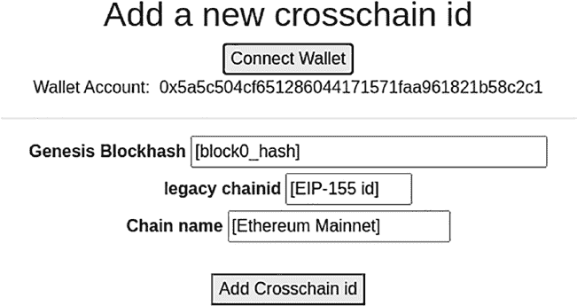

第十一章 构建团队项目

每个 HTML 页面都将有用户在浏览器页面上的输入，并且还

包括处理浏览器事件和用户交互的 JavaScript。

**HTML 页面示例**

必需的属性

图 11-7：添加跨链 id GUI 页面示例

空行

可点击按钮和输入字段。 “连接钱包”按钮允许

标签“Chain name”

点击按钮将触发对 crosschainId 智能合约的调用以添加链 ID 到

脚本资源“/scripts/jquery.min.js”

标签“Genesis Blockhash”

行元素“addcrosschainidrow”

文档类型声明

空行

空行

占位符：“EIP-155 id”

第十一章 构建团队项目

元数据名称“generator”内容为

空行

元数据字符集属性

标题“CrosschainIdService”

第十一章 构建团队项目

脚本资源“/scripts/crosschainid_info.js”

视口属性

为渲染此页面，以下 HTML 代码包含多行

样式表资源“/stylesheets/style.css”

头部标签结束

体标签

容器元素“addCrosschainid”

输入框标签

链名称占位符：“Ethereum Mainnet”

新链 ID 添加标题

类为“enableEthereumButton”的按钮

按钮事件。点击此按钮将触发一个函数调用以获取

空行

空行

钱包账户：“HTML Tidy for HTML5 for Linux version 5.6.0”

空行

空行

钱包按钮

元素“addChainidValue”

输入框大小

标签“blockhash”

该页面用于连接 MetaMask 钱包。“Add Crosschain id”

遗留链 ID 元素

标签“legacy chainid”

输入框标签

JavaScript 代码在下一节中解释。

头部标签

以下示例（图 11-7）是“Add crosschain id” GUI 页面标记示例：

必需的属性

空行

脚本资源“/scripts/addCrosschainid.js”

空行

空行

空行

输入框大小

样式表资源“/stylesheets/bootstrap.min.css”

空行

<br>

中心显示元素“addChainidButton”

按钮样式

按钮标签“Add Crosschain id”

向区块链发送交易以与智能合约交互，

空行

视口属性

列元素

脚本资源“/scripts/jquery-3.3.1.slim.min.js”

链名称元素

脚本资源“/scripts/web3.min.js”

脚本资源“/scripts/enableEthereum.js”

在前面的 addCrosschainid.html 文件中，有几个 JavaScript 文件包含在内。

第十一章 构建团队项目

空行

空行

**JavaScript 示例**

空行

基础 URL

浏览器兼容性文件，可从

网页。启用 Ethereum.js 文件是为了实现“连接钱包”

427

输入框标签

包含 Web3、ABI 和 API 的几个 JavaScript 文件包含在内。

连接到浏览器的钱包地址。在此 enableEthereum.js 脚本中，

以太坊按钮对象对应于“连接钱包”按钮

并注册一个点击事件处理程序以调用 getAccount()函数。

getAccount 函数调用 Web3 的 eth_requestAccounts 功能来检索数据。

从 MetaMask 中获取账户。第一个账户被分配给 account0

可以被其他脚本引用的对象。在此示例中，showAccount 对象是一个

将返回的账户地址填充到 Div 对象中，该对象将从

调用 getAccount()函数。

——enableEthereum.js ——

const ethereumButton = document.querySelector('.

enableEthereumButton');

在 showAccount 中的 const showAccount = document.querySelector('.showAccount');

var account0 = 0;

以太坊按钮.addEventListener('click', () => {

获取账户信息；

]);

异步函数 getAccount() {

const accounts = await ethereum.request({ method: 'eth_

]);

account0 = accounts[0];

显示账户信息。

]);

一旦 enableEthereum.js 检索到账户，用户可以通过网页上的输入字段进入区块 0。

哈希、遗留链 ID 和区块链名称，然后单击“添加跨链

注册新的区块链 ID 的“添加

在 addCrosschainid.js JavaScript 中。在此脚本中，addChainid()函数

当网页上的“添加跨链 id”按钮被点击时调用。此

此函数首先检查 MetaMask 钱包是否已启用并已连接。

如果没有，用户将提示安装 MetaMask 扩展。如果有，

428

——构建团队项目第十一章

一个名为 myContract 的智能合约对象将用一个

跨链 ID 智能合约 ABI 和合约地址。ABI 和

合同地址在单独的 crosschainid_info.js 文件中指定。

我的合同对象支持 addChainId 方法，该方法需要传入参数

区块哈希、遗留链 ID 和链名称。这些参数是从

有多种调用方式。

示例中，智能合约函数调用

数据首先通过以下代码计算得出：

var chainidData = myContract.methods.addChainId(blockhash,

遗留 id，链名称)。encodeABI();

然后 chainidData 通过 web3 发送到智能合约。

eth.sendTransaction 操作。交易收据是

返回并在网页上显示。

}

在 addCrosschain.js 中实现 addChainid 函数调用。

向智能合约添加跨链 id

var web3;

const ethEnabled = () => {

如果 typeof window.ethereum === 'undefined') {

alert("您需要一个 Dapp 浏览器才能开始使用。请

安装 MetaMask");

返回 false；

}

在 window.ethereum 上创建一个新的 Web3 实例。

返回 true；

}

function addChainid() {

如果！ethEnabled() {

429

——addCrosschainid.js ——

alert("请安装一个支持以太坊的浏览器或

像 MetaMask 这样的扩展来使用这个 dApp！");

}

通过 web3.eth.getAccounts(function(err, accounts) {

var myContract = new web3.eth.Contract(crosschainid_abi,

crosschainid_contract.toLowerCase());

var blockhash = $('.blockhash input').val();

var legacyid = $('.legacyid input').val();

var chainname = $('.chainname input').val();

var chainidData = myContract.methods.addChainId(blockhash,

legacyid, chainname).encodeABI();

var tx_chainid = web3.eth.sendTransaction({

from: accounts[0].toLowerCase(),

to: crosschainid_contract.toLowerCase(),

data: chainidData

}, function(err, transactionHash) {

document.getElementById("addChainidValue").innerHTML =

"addChainid tx:" + transactionHash;

})

})

}

$(document).ready(function() {

if (!ethEnabled()) {

请安装一个与以太坊兼容的浏览器或

像 MetaMask 这样的扩展程序来使用这个 dApp!");

}

});

430

第十一章 构建团队项目

上述示例展示了如何构建添加跨链 ID

网页与部署的智能合约进行交互。类似的页面可以

都可以为其他功能构建，例如列出跨链 ID、修改 chainId

信息，批准或撤销跨链 ID 等。

**安全审查**

有很多安全因素需要考虑。安全

章 [8 应该遵循的指南](https://doi.org/10.1007/978-1-4842-8164-2_8) 。智能合约中的每个函数都应该进行权限检查。例如，在修改

对于跨链 ID 信息，应该对请求者进行验证以

确保它是跨链 ID 的原始注册人。第二个

检查是跨链 ID 的状态应该处于“待处理”状态。

如果跨链 ID 处于“已验证”或“已撤销”状态，则其信息

无法修改。

另一个重要事项是确保只有管理员可以

批准或撤销跨链 ID 注册。这个管理员可以是一个

从单一账户或联盟中的多签名账户进行操作。管理员

可以将所有权转让给另一个账户。

除了智能合约的安全性外，网页的安全性也应该

也是最佳实践。对于要部署到生产环境的服务的

实践是进行安全审计和白盒测试，以确保没有

没有重大安全漏洞。

**部署到测试网络**

在编写智能合约和网页 GUI 的代码时，开发者可以

拥有一个开发系统和本地 Web 服务来测试项目。

一旦本地开发完成，它可以部署到公共测试网络

供外部用户测试。对于以太坊测试网络，有几个选择。

对于以太坊区块链，有四个流行的测试网络，包括 Ropsten、Kovan、Rinkeby 和 Goerli 测试网络。所有这些

431

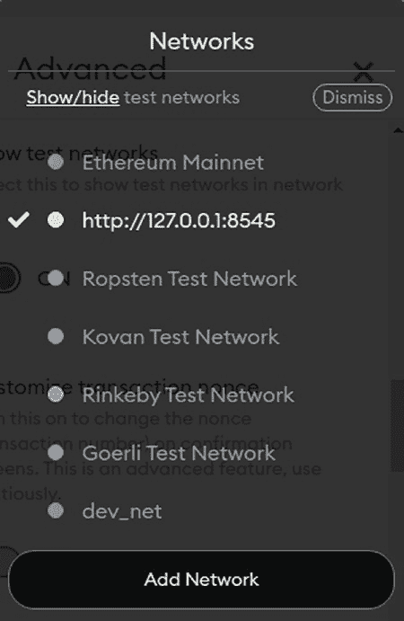

第十一章 构建团队项目

可用，包括 Ropsten、Kovan、Rinkeby 和 Goerli 测试网络。所有这些

这里提到的测试网络使用权威证明（POA）共识，并且

比主网更快。要使用这些测试网络，首先连接

MetaMask 钱包到您想要部署智能合约的测试网络

to（图 11-8[p441]）。已经将测试网络添加到 MetaMask 中。

如果你看不到测试网络列表，只需点击显示/隐藏测试网络即可

打开配置小部件，将“显示测试网络”设置为“开”。

***图 11-8。通过*

*MetaMask*

432

第十一章 构建团队项目

一旦 MetaMask 钱包设置为设计的测试网络，测试员

需要获得一些测试以太币来测试 dApp。这些测试网络都

通过专用

水龙头。水龙头地址和区块浏览器 URL 在

以下（图 11-9)

***图 11-9。以太坊测试网络水龙头地址*

一旦智能合约部署到测试网络，并且网页也已经

设置以访问智能合约，项目团队可以宣布 alpha

或测试计划向用户开放。测试计划是为了涉及

社区成员尝试去中心化应用并报告

在项目中发现的错误。通常，赏金会赠送给那些

在项目中发现的错误。由于区块链的不可变性，

在部署到主网之前，在测试网络上彻底测试 dApps。

部署到主网。

**部署到主网**

一旦在测试网络上彻底测试了 dApp，就可以将其部署到

以太坊主网。部署智能合约的工具和方法

与测试网络相同的生产网络。没有水龙头为

生产网络。部署智能合约所需的以太币将

需要购买。部署需要非托管账户，其中

433

第十一章 构建团队项目

开发者实际上持有私钥。托管在

例如 Coinbase 和 PayPal 这样的公司无法使用。开发者需要

拥有账户的私钥，以便部署智能合约。

此外，部署到

主网。

首先是安全性。智能合约的部署是在

通过向区块链地址 0 发送交易。智能

合约地址仅通过散列发送者地址生成

交易的非官方。交易的数据字段将

可能是智能合约的字节码，并保存到计算出的地址

在区块链上。一旦智能合约部署，合约的所有者

智能合约是发送交易的发送者。这个发送者可能是

被分配权限以修改区块链。这是非常

保护智能合约所有者地址非常重要。有时，一个

智能合约所有者可以调用一个函数来否认所有权或

将所有权转让给另一个 EOA（外部所有者账户）。

其次，智能合约地址需要发布在一个

受信任的媒体。用户通过发送交易与智能合约互动

智能合约地址。如果用户将交易发送到智能

与错误的地址签订合同，虚假的智能合约可能会拦截

发送到虚假智能合约的资金。

第三，与项目智能合约关联的代币需要

需要从用户的钱包中添加。应提供指导

用户。对于大多数加密钱包来说，代币不是自动的

添加到钱包中。用户需要通过添加一个

智能合约，代币符号，小数位数等。这些信息将

来自项目团队，并应发布给用户。

第四，应选择一个稳定的 RPC 节点并连接到

MetaMask 或其他钱包。RPC 节点是 Ethereum 客户端节点，

同步所有区块到一个系统，并打开与 Web3 客户端的连接。该

RPC 节点可以由第三方或项目团队本身拥有。在

434

Chapter 11 构建团队项目

在任何情况下，都应该保护 RPC 节点并防止

攻击。

最后，网页和智能合约应该适当

集成。在网页中，Web3 对象构建交易和

将请求发送到区块链。评估 Web3

确保它们不会被篡改。

一旦智能合约部署到主网，它将对

世界。除了由

项目团队，第三方开发者也可以编写应用程序来

访问智能合约。由于“开放性”，“去中心化”，

和区块链的“不可变性”，去中心化应用的运行是

比常规应用程序更具挑战性，并将需要讨论

进一步。

**运营和升级考虑**

由于去中心化应用不应该有中心化

所有者和管理，需要建立一个社区，可以

管理去中心化应用的运营和升级。许多

项目建立投票机制来决定项目运营和

升级。项目团队发行治理代币并将它们分配给

社区成员的投票权与他们的代币数量成比例。

治理代币。社区成员可以赚取治理代币以

增加他们的投票能力。当提出新功能或升级时，

发送到投票系统，每个社区成员可以投票来

采用或拒绝提案。被接受的提案由

开发者作为开源项目并部署到主网。

一个主要挑战是在如果

发现安全漏洞。由于没有中心权威，

社区将需要投票升级。然而，由于区块链是

不可变的，部署的智能合约无法进行修补或升级。

435

第十一章 构建团队项目

在这种情况下，智能合约需要重新部署。当

重新部署新智能合约，旧智能合约所管理的代币

合约需要移植到新的智能合约。当新的

智能合约部署后，所有网页和 Web3 接口应指向

到新的智能合约地址。这是一个非常繁琐和容易出错的

过程。

有时，写可升级的智能合约会很好。

这是将一个智能合约分成两个或多个智能合约。

第一个智能合约是一个简单的入口智能合约

功能，如接收一个地址和调用一个目标智能合约

合约的地址。目标智能合约是具有

大多数功能已实现。如果目标智能合约具有

安全漏洞，需要升级，一个新的目标智能合约

合约可以部署，新的地址可以发送到入口

智能合约。当入口智能合约收到新的目标

智能合约地址，它将调用新的目标智能合约。通过这种方式

可升级智能合约设计，网页和 CLI 不需要

可以重新配置，因为入口智能合约地址不变。

为了最佳地运行一个去中心化应用，构建

提供一些服务来监控关键参数。例如，总共铸造的

代币应受到监控，确保没有额外的代币被铸币

被黑客攻击。交易吞吐量和高额费用也可以监控

确保 dApp 处于健康运行状态。此外，该

EVM 升级和以太坊 hark 分叉也应该受到监控

确保没有对去中心化应用产生负面影响。

最后，一个充满活力的社区是成功运营的关键

去中心化应用的重要组成部分。构建 dApp 与

建立社区。只有社区积极参与

去中心化应用可以维持、增长和抵御严重攻击。

436

**索引**

**A**

原子价值交换，16

审计师，329

抽象类，295

通过 tx.origin 进行授权，

地址类型，258, 259

282, 283

替代货币，37

自动化市场制造商（AMM）

应用程序字节码接口

机制，224, 386

（ABI），236, 246, 310

应用程序设计决策

共识机制，132, 133

**B**

数据，130–132

向后兼容，412

开发堆栈，135–138

信标链，371

智能合约，128, 129

比特币，12, 13, 164, 209

利益相关者

区块，167, 175

组织，133–135

区块头字段，176

代币，124–127

区块，177

交易，122–124

coinbase 交易，172

应用程序主题

组件，167

数据主权，117

共识机制，184–187

支付，117

设计决策，181

透明度，117

分布式账本软件，169

仲裁，224

经济学，182–184

算术运算，280, 281,

字段，174

370, 400

哈希 Merkle 根

**Assert()** 函数，279

交易，177

断言违反，279

输入和输出结构，170

资产管理工具，221

矿工，166

非对称密钥加密

挖矿节点，166

48, 49, 55

挖矿奖励，197

© Weijia Zhang 和 Tej Anand 2022

437

W. Zhang 和 T. Anand，《区块链与以太坊智能合约解决方案开发》

[`doi.org/10.1007/978-1-4842-8164-2`](https://doi.org/10.1007/978-1-4842-8164-2#DOI)

索引

比特币（*继续*）

区块链应用，139

自然分叉，180

架构层，136

网络软件

开发过程，138

组件，169

成功因素，113, 114

节点，166, 169

基于区块链的解决方案，120, 157

无需许可的公共

基于区块链的系统

智能合约，197

解决方案，119

工作量证明共识

基于以太坊经典的区块链

机制，197

(ETC)，405

脚本，175

区块头，175

智能合约，197

鲍勃的 ping 函数，280

交易数据结构，170

布尔值，255, 256

交易生命周期，165

借用加密货币，386

交易，167, 176

浏览器客户端，307

概念中的值

暴力搜索过程，74

交易，171

可燃烧性，393

钱包软件组件，168

业务问题，116, 119, 121

比特币改进提案

业务流程，115

(BIP)，196

企业对企业交易所，20

区块链，168, 407, 408

业务用例，117

社区，406

字节数组，259, 260

共识，84

字节码，305

分布式账本，84

32 字节跨链 ID，410

实现

拜占庭容错（BFT）

分类，95-99

区块链，61, 72, 102, 214,

限制，102-106

343, 346, 350

工作量证明，213

隐私，87

来源，87

**C**

纯粹主义者的观点，99

CAP 定理，66, 67, 75

智能合约（*参见*智能合约）

CAP 定理相关设计

合约）

权衡，73

特定变量，268-270

碳信用市场，389

技术集成，71-74

碳信用代币，390

438

索引

中央银行数字货币

共识机制，82, 84, 85,

(CBDC)，143, 209, 379

164, 184-187

集中式账本，88, 89

ConsenSys 软件包，382

集中所有权，69

一致性，72

链 link，225

基于联盟的

挑战提款函数，349

网络，134

检查 Merkle 树函数，353,

约束，140

355, 357

构造函数，252

检查不等于()函数，300

合约账户，190

CLI 客户端，308

合约鲍勃，280

客户端计算机，68

核心区块链层，213

客户端节点，212，372

区块链的核心能力，43

编码事件，273

跨链合约，279

Coinbase 交易，172，219，

跨链 ID，407，412，413

223，230

跨链标识符

命令行界面（CLI），

注册和查找

306，308，423

服务，408

以社区为基础的区块链

要求，409

网络，135

跨链身份服务，413

社区 Telegram 聊天

跨链 ID 注册，431

团体，325

跨链 ID 智能合约，418

编译工具，217

跨链互操作性任务

区块链的复杂性

强制执行（CITF），408

安全，319

跨链操作，412

补丁和

密码分析，46

可升级性，320

加密货币，227，390

去中心化特性

密码交易所，223

区块链，320

密码学密钥，90

对

密码学，44，46，164

业务，321

CryptoKitty，322，326，333

隐私和匿名特性

密码学

区块链的，320

非对称/公钥/私钥

无信任和无需许可

密码学，49

环境，320

密码分析，46

439

索引

密码学（续）

去中心化自治组织

密码学，46

组织（DAO），129，

加密-解密

142，209，226，379

过程，45

去中心化交易所（DEX），

高级别加密-

223，224，386

解密过程，45

去中心化保险

数据状态，55，56

平台，226

强非对称密钥

去中心化金融项目

算法，50

（DeFi），141，209，222，

强对称密钥

386，387

算法，48

委托权益证明，185，186

部署，433

存款事件类，274

**D**

设计折衷，104，121

日常交易，344

桌面客户端，308

dApp 客户端

开发区块链，228

浏览器客户端，307

开发栈，135–138

命令行界面（CLI）客户端，308

数字签名，44

CLI 格式，306

防伪保证，51

桌面客户端，308

哈希，51，55

GUI 格式，306

限制，51

移动客户端，307

单向函数，52

数据静止，55

流程，50

数据传输中，55

分布式应用（dApps），

数据使用中，56

2，125，188，191，193，196，

与数据相关的低效，25-27

197，201

数据安全风险，30，31

分布式账本，32，82，84，164

数据共享，5

区块，85

数据存储位置，284

数据库和区块链，94

数据结构，415

实施，94

数据类型，255

对等节点，91-94

去中心化，4

保护隐私的，90，94

去中心化应用，

规则，90

435，436

交易，93

440

索引

分布式系统，44，164

来源，23

CAP 定理，66

交易结算时间，23

定义，56

经济学，比特币，182-184

高可用性，强

发出的事件，272-274

一致性和网络

加密-解密过程，45

分区容错，67

能源消耗，102

问题，目标，和

企业业务，98

方法，65

企业以太坊联盟

现实世界问题

（EEA），139，211，215，

复杂性，57，58

390，408

一致性，61-65

娱乐

故障，58-61

应用，155-157

可扩展性，58

枚举，264，265

视图，57

ERC20 规范，380

域名服务器（DNS），68

ERC20 代币，380，382，383

Drizzle，192

ERC721 NFT 代币，361

动态大小数组，262，263

企业资源计划（ERP）软件，4

以太坊，99，379，380，405

**E**

成就，191

比特币 UTXOs，188

经济交换，15

区块链，196

经济低效

启动节点，212

区块链潜力以

客户端节点，212

地址，31，32

合约账户，190

与数据相关的

dApp 架构和

低效，25-27

开发工具，192

数据安全风险，30，31

分布式应用

向第三方支付费用，24

创建，191

欺诈，29

以太币单位，190

区块链的潜力

外部所有账户，190

能力，33，34

无需许可的公共

隐私权衡，29

区块链，212

法规和规则

风险，189

约束，28，29

SC，343-347

441

索引

以太坊（*继续*）

以太坊区块链平台，210

可扩展性和安全性，199

以太坊区块链，334, 406

Solidity，188

与以太坊兼容

交易，189

区块链，214

交易类型，190

以太坊生态系统项目，387

以太坊 1.5，370

DAO，226

以太坊 2，213, 338

去中心化交易所（DEX），

架构，371–374

223, 224

信标链，371

去中心化保险

从以太坊 1 迁移，

平台，226

374–376

Fortmatic，221

挖矿节点，376

托管服务，219

POW 到 POS，371

KYC 和身份验证，227

运行验证节点，

MetaMask，219, 220

376, 377

MyEtherWallet (MEW)，220, 221

分片，371

NFT 应用，224, 225

不确定性，378

Oracle 服务，225, 226

以太坊区块链，209, 212,

支持智能合约的

228, 246, 269, 335, 395, 396,

银行 dApp，222, 223

398, 403, 405, 406

稳定币，227

优势，209

以太坊 EVM 存储数据，284

和基础设施，209

以太坊燃气费，215

安全（*见* 安全）

以太坊燃气机制，398

智能合约，319

以太坊改进提案

以太坊区块链架构

（EIP），196, 408

应用层，217, 218

Ethereum.js 检索，428

组件架构和

以太坊主网（ETH），341, 342,

概览，211

347, 364, 405

核心区块链层，213–215

EIP-155，406, 407

企业组件层，

和 ETC，406

215, 216

和以太坊经典，405

层，211, 218

浆糊智能合约，348, 349

网络层，212, 213

交易，398

工具层，216, 217

以太坊网络，212

442

索引

以太坊公共区块链，215,

金融服务业

216, 231

区块链解决方案，143

以太坊智能合约

能力，140

发展，210

CBDC，143

以太坊测试网，431

加密货币交易所，143

以太坊工具用于智能合约

DeFi，141

发展

经济低效，140

Etherscan，231

典型的第三方，140

Geth，231–234

重复工作/重做/

MetaMask，229–231

协调工作，141

Remix，238–243

主题，141

工具和组件，228

固定大小数组，261, 262

Truffle，235–238

Fortmatic，221

以太坊虚拟机（EVM），

创始人导向网络，134

191，209，214，215，241，242，

常旅客积分，37

245-247，335，371

函数

Etherscan，231

跨链 ID，416

以太提取操作未

getChainIdFromLegacyId，416

受保护的，276

getChainIdInfo，416

事件

getChainIdStatus，416

定义，271，272

吊销，416

发出，272-274

智能合约，416

可继承成员，271

函数访问范围，254

存储位置，271

功能性安全漏洞，321

货币交易，7

功能性安全漏洞，智能

汇率，8

合同

交易所交易，9，16

禁用智能合约，323

外部所有账户，190

基金死锁，321

基金泄漏，322

**F**

孤儿智能合约，323

函数调用值不是

容错性，59，72

审核，276

容错分布式系统，60

函数修改器，252

Filecoin 项目，394

函数专用变量，281

443

索引

函数可见性错误，274，275

提供者认证，150

代币，127

服务成本，145

利益相关者，147

**G**

第三方

管理员，145-147

Ganache 工具，228

超账本，97

气体成本，402

区块链

气体费用考虑

实施，193

生态系统，396

生态系统，195

气体消耗，395

框架与工具，193，195

定量计算，403

治理模型，193，196

加油站，397

超账本 Fabric，97

Geth，231-234

Geth 客户端，372

getMessage 函数，317

**I**

礼品卡，38

间接成本，31

GitHub 位置，352

信息交换，5

GitHub 存储，241

信息技术（IT），

3，30，147

**H**

应用网络研究所

安全（IANS），30

停止程序操作，401

整数，256-258

哈希数字签名，54

集成开发

哈希算法，51-53

环境（IDE），240，247

hashMerkleRoot 字段，177

接口，296

医疗应用

内部函数，254

倡导组织，147

互联网，4

索赔处理，150

InterWork Alliance (IWA)，125，390

临床试验，152

消费者与临床试验

提供者，145

**J**

经济低效，

JavaScript 控制台，232，234

148，149

JavaScript 文件，427

医疗供应链，151

JavaScript 脚本，307

444

索引

JavaScript 虚拟机，242

叶节点，351

JSON RPC，217

MerkleDemo 智能

合约，353

**K**

Plasma Cash，360–363

Plasma MVP，357–359

了解你的客户（KYC），227

源代码，352

testcasedemo 函数，355，357

**L**

MetaMask 钱包，193，216，217，

219，220，229–231，233，242，

第二层

243，307，316，346，425，433

机制，343

从以太坊 1.0 迁移到

性能和可扩展性，343

以太坊 2.0，374–376

Plasma（*参见* Plasma）

矿工凭证，374

卷积，363–370

矿工节点，178

SC，343–347

矿工软件组件

智能合约，343

接口，169

库，296

可铸造性，392

逻辑运算符，255

Mint 事件，272

移动客户端，307

**M**

货币

比特币，13

Mallory 合约，280

挑战/缺点，10

映射数据结构，415

商品，11

映射数据类型，263，264

合约，7

会员奖励，37

定义，12

内存操作，402

交换交易，8，9

Merkle 树

交换媒介，12

二进制树结构，351

属性，11，12

checkMerkleTree 函数，353，

交易，7，8

355，357

普遍接受的交换媒介

代码片段，352

作为交换媒介，9

数据完整性和处理

msg 变量，269

效率，351

MyEtherWallet（MEW），220，221

示例，351–357

MythX 安全验证，289

445

索引

**N**

Plasma

运算符，349，350

NFT 应用，224，225

Plasma 链，350

NFT 市场，386

智能合约，348，349

NodeKey，212

交易 Merkle 树（*参见*

非同质代币（NFTs），127，

Merkle 树）

319，360，383，392

交易/智能

非原生代币，126

合约，350

Plasma 区块链，349

**O**

Plasma Cash，357，360–363

单向函数，52

Plasma 链，350

OpenSea，225

Plasma MVP，357–359，362

开放系统互联

Polkadot，199

（OSI），211

隐私，82，107

OpenZeppelin 包，382

隐私保护，164

乐观的第二层，364，365

保护隐私的分布式

乐观虚拟机

账本，90，94

（OVM），364

隐私权衡，29

Oracle 服务，225，226

私钥，73

Ouroboros，199

私人许可

过时的编译器，285，286

区块链，95，97

越界索引，284

私人无许可，95

越界写入，284

权威证明（POA），186，213，

343，346，350，432

权益证明（POS），185，350，371，

**P**

372，374–377

P2P 网络层

工作量证明（POW），178，338，

通信，337

371，377

可支付函数，253

公共区块链，96，342

对等网络，32，

公钥，48

44，67–71

公共许可

许可区块链，96

区块链，95，121

无许可

公共无许可区块链，

区块链，97

95，97，99

446

索引

**Q**

**S**

二次算术程序

S&H 绿色邮票，37

（QAP），368

SC 钱包，345

定量分析，398

证券交易委员会

量子

委员会（SEC），127

计算，336–338

安全

Quorum，142

可攻击的安全漏洞

智能合约，323–325

**R**

智能合约最佳实践

合约（参见安全

竞态条件，278

实践（智能合约）

随机数生成器

编译器漏洞，

（RNG），286，331

285，286

秩 1 约束系统（R1CS）

数据类型和数据

格式，368

漏洞

RCP 协议，373

任意存储位置，

减少函数，52

284，285

关系数据库管理

通过 tx.授权

系统，4

起源，282，283

Remix，238–243，247，292

区块值，283

Remix 调试器，302

状态变量遮蔽，

Remix 开发

281，282

工具，309

未使用变量，285

Remix 插件，301

变量值溢出/

远程过程调用

下溢，280，281

（RPCs），193

函数漏洞

RETURN 操作码，401

断言违规，279

Ripple Labs，142

跨链合约，279

卷积，363

委派调用函数，277

乐观层 2，364，365

失败的函数 DOS

zk-SNARK，365

调用，278

根区块链，348

以太提取操作

RPC 端点，313

未保护，276

447

索引

安全（ *续* ）

自我包含函数，253

函数调用值不

自我销毁函数，276

校验，276

setMessage 函数，317

竞争条件和

sha256/keccak256，351, 362

交易顺序

sha256 Solidity 函数，353

依赖，278, 279

分片节点，371, 373

自我销毁函数，276

签名操作，286, 287

solidity 弃用

小型智能合约，227

功能，277

智能合约，382, 414, 415, 423,

可见性错误，274, 275

431, 434

签名漏洞，286, 287

区块链，247

软件开发，319

最多金额的业务人员，246

安全审计，329

字节码，246

安全实践，智能合约

代码和解释，418

区块链特定安全

编译，246

提示，334-336

组件，424

缓解计划，326, 327

跨链 ID，416

量子计算，安全

定义，245

影响，336-338

以太坊，246

可读智能合约

函数调用，246

逻辑，330

Solidity（ *见* Solidity

审查气体消耗，332, 333

编程语言)

RNG，331

技术人员，246

安全漏洞和补丁，

技术角度，246

333, 334

与网页 GUI，431

设置资产

智能合约字节码，236

值，327, 328

智能合约开发工具

智能合约开源，328

Mythx，288, 289

智能合约审计，

solidity 调试

329, 330

调试智能

源代码和库，327

合约，303-305

经过良好测试的库，331

启用调试器，302

白帽，329

启动调试器，302

安全漏洞，334

源代码，301

448

索引

solidity 测试，Remix 插件，

固定大小数组，261, 262

296-298, 300, 301

整数，256-258

solidity 到 UML

映射类型，263, 264

dApp 项目，292

智能合约功能，255

Remix，292, 293

结构，266-268

独立工具，293-296

支持和非

SSA，290, 292

支持，255

智能合约银行

Solidity 弃用功能，277

dApp，222, 223

Solidity 编程语言

智能合约语言，218

字节码，247

智能合约，82，99-101，105，

注释，249

164，435

构造函数，252

可攻击的安全

以太坊智能合约，247

孔洞，323-325

事件，271-274

审计，329，330

函数访问范围，254

安全实践（ *见* 安全

函数修饰符，252，253

实践，智能合约）

Hello World 示例，248

编写代码，325

导入文件，251，252

智能钱包，343

多个作用域，253，254

软件应用程序，217

安全（ *见* 安全）

软件即服务（SaaS），5

源代码，247

sol2uml 包，293

Solidity 智能合约

Solano，199

编程，319，322

Solidity，330

Solidity 静态分析（SSA），

Solidity 数据类型

290，292

地址类型，258，259

Solidity 单元测试插件，296-301

区块链特定

稀疏 Merkle 树，362，376

变量，268-270

特殊全局变量，283

布尔值，255，256

稳定币，227，387

字节数组，259，260

稳定 RPC 节点，434

代码安全和执行

基于栈的编程

效率，255

语言，201

动态大小数组，262，263

利益相关者组织

枚举，264，265

模型，133

449

索引

StartWithdraw 函数，349

CCT，389，390

状态通道（SC），L2，343-347

cTokens，386

状态通道（SC），363

DeFi 项目，386

状态通道（SC），L2

分配，394

组件，344，345

ERC20，380，383

离线计算，346

ERC20 和 ERC721，391

参与者，347

函数，380

拓扑和工作流，344

绿色能源，390

交易，347

行业，388

钱包，345

NFT，383，384，386

工作流，345

在公共区块链中，388

状态变量，281

奖励，393

存储，214

智能合约，382

结构体，266-268

供应链，388

提交 PlasmaTxRecord

分类基础设施和

函数，348

框架，390

供应链，388

模板，392

以供应链为导向

单位，392

交易，24

值，392

供应链应用，153，154

代币，124-127

对称密钥加密，47，55

代币分类框架（TTF），

系统设计师，116

125，391

传统计算机网络

架构，68

**T**

交易，7，82，106，278

目标区块链医疗

基于交易的分析，119

应用，150，158

交易费用，341

testcasedemo 函数，355，357

交易日志，271，274

测试程序，433

旅行支票，38

第三方应用，234

Truffle，235–238

第三方物流（TPL），19

真言，6

第三方 RPC 节点，308

信任，公司，6

代币，434

TTCDiploma 智能合约，385

450

索引

**U**

编译智能合约，310

部署智能合约，311，313

UML 图，294

以太坊开发

Uniswap，386

区块链，308，309

通用资源标识符

写作，313–315，317

(URI)，384

未花费交易输出

(UTXO)格式，

**X, Y**

188，358–360

0xcert，225

**V**

**Z**

验证节点，372，374

价值交换

零知识简洁非

数据角色，18，20

交互式论点

经济，15，22

知识（zk-SNARK）

第三方，17

特性，366

专有数据，22

定义，368

第三方的角色，19

饮酒年龄，368

交易，88

第二层滚动解决方案，367

值类型，17

在隐私计算中，367

查看函数，253

隐私增强加密

计算，366

证明与验证，369

**W**

R1CS 格式，368

钱包软件组件，168

价值，368

Web 客户端

工作，369，370

451

# 文档大纲

+   目录

+   关于作者

+   关于技术审稿人

+   致谢

+   第一章：区块链的商业和经济动机

    +   引言

    +   货币简史

    +   经济作为价值交换

    +   当前经济低效

    +   区块链潜力解决当前经济低效

    +   章节总结/关键要点

    +   侧边栏

    +   测验问题

    +   参考文献

+   第二章：支持区块链的核心技术概述

    +   引言

    +   密码学与数字签名

    +   分布式系统

    +   点对点网络

    +   区块链技术整合

    +   章节总结/主要收获

    +   测验问题

    +   侧边栏 – 分布式系统关键术语与定义

    +   参考文献

+   第三章：区块链组件与架构

    +   引言

    +   区块链组件的概念性概览

    +   分布式账本与区块链技术概览

    +   区块链实施分类

    +   智能合约与区块链组件概要

    +   区块链的局限性

    +   章节总结/主要收获

    +   侧边栏 – 区块链术语

    +   测验问题

    +   参考文献

+   第四章：区块链商业应用

    +   引言

    +   区块链是否必要？

    +   区块链应用设计决策

    +   区块链应用

    +   区块链在金融行业的应用

    +   区块链在医疗行业的应用

    +   区块链在供应链的应用

    +   区块链在娱乐行业的应用

    +   章节总结/主要收获

    +   测验问题

    +   参考文献

+   第五章：区块链实现概览：比特币、以太坊与超级账本

    +   引言

    +   比特币交易、区块与挖矿

    +   比特币经济学

    +   共识协议

    +   以太坊

    +   超级账本

    +   比特币、以太坊与超级账本对比

    +   新兴区块链实现

    +   章节总结/关键要点

    +   侧边栏 – 基于栈的编程语言

    +   测验问题

    +   参考文献

+   无标题

+   第六章：以太坊架构与概览

    +   引言

    +   以太坊架构

        +   网络层

        +   核心区块链层

        +   企业组件层

        +   工具层

        +   应用层

    +   以太坊区块链生态系统与 DeFi 项目

        +   钱包管理资产

            +   托管服务

            +   MetaMask

            +   MyEtherWallet

            +   Fortmatic

        +   支持智能合约的银行 dApp

        +   以太坊中的去中心化交易所

        +   NFT 应用

        +    Oracle 服务

        +   DAO 平台

        +   去中心化保险平台

        +   去中心化 KYC 和身份验证

        +   稳定币

    +   设置智能合约开发环境的工具

        +   MetaMask：与以太坊区块链交互的最简方式

        +   Etherscan：最全面的区块链浏览器

        +   Geth：以太坊区块链的瑞士军刀

        +   Truffle：最全面的智能合约开发工具

        +   Remix：最方便的基于网页的智能合约开发工具

    +   总结

+   第七章：使用 Solidity 编写智能合约

    +   引言：我们在上章学到了什么

    +   什么是智能合约

    +   什么是 Solidity 编程语言

    +   模块 1：Hello World Solidity 示例

        +   Solidity 注释

        +   Solidity 程序和版本声明

        +   导入 Solidity 文件

        +   构造函数

        +   函数修改器

        +   区块链访问范围：纯/视图/可支付函数

        +   函数访问范围：公共、外部、内部和私有

    +   模块 2：Solidity 数据类型

        +   布尔值

        +   整数类型

        +   地址类型

        +   字节数组

        +   固定大小数组

        +   动态大小数组

        +   映射数据类型

        +   枚举数据类型

        +   结构体数据类型

            +   区块链特定变量

    +   模块 3：事件

        +   什么是以太坊事件

        +   事件存储位置

        +   如何定义一个事件

            +   如何发出一个事件

            +   事件示例

    +   模块 4：安全

        +   功能漏洞

            +   函数可见性错误

            +   漏洞：函数调用返回值未检查

            +   漏洞：以太币提现操作未受保护

            +   漏洞：自毁函数

            +   漏洞：使用已弃用的 Solidity 函数

            +   漏洞：向不可信的目标合约的 delegatecall

            +   漏洞：失败的函数调用导致的 DOS

            +   漏洞：竞态条件与事务顺序依赖

            +   漏洞：断言违反

            +   漏洞：跨合约调用进入循环

        +   数据类型与数据漏洞

            +   漏洞：变量值溢出或下溢

            +   漏洞：状态变量遮蔽

            +   漏洞：通过 tx.origin 进行授权

            +   漏洞：使用区块值表示时间

            +   漏洞：向任意存储位置写入

            +   漏洞：未使用的变量

        +   编译器漏洞

            +   过时编译器

        +   随机性漏洞

            +   漏洞：区块链属性产生的弱随机性

        +   签名漏洞

        +   漏洞：签名操纵

        +   模块总结

    +   第五模块：工具、测试和调试

        +   工具

            +   MythX：一款安全扫描工具

            +   Solidity 静态分析：Remix 的安全插件

            +   Solidity 到 UML：智能合约可视化工具

                +   Solidity 到 UML for Remix

                +   Solidity 到 UML 独立工具

        +   Solidity 测试

            +   Solidity 单元测试：Remix 插件用于测试

        +   Solidity 调试

            +   启用调试器

            +   启动调试器

            +   调试智能合约

    +   第六模块：客户端考虑因素

        +   dApp 客户端的类型

            +   浏览器客户端

            +   移动客户端

            +   桌面客户端

            +   CLI 客户端

        +   与智能合约交互的 Web 客户端示例

            +   第一步：创建以太坊开发区块链

            +   第二步：将智能合约编译并部署到开发区块链

            +   第三步：部署智能合约

            +   第四步：编写 Web 客户端以与智能合约交互

    +   总结

+   第八章：安全考虑

    +   简介

    +   智能合约的功能性安全漏洞

        +   资金死锁

        +   资金泄漏

        +   禁用智能合约

        +   孤儿智能合约

    +   智能合约可攻击的安全漏洞

    +   智能合约的最佳安全实践

        +   制定安全风险缓解计划

        +   检查主源代码和库

        +   限制最大资金

        +   让您的智能合约开源，并利用社区力量加强安全

        +   是的，区块链安全领域有白帽子

        +   请让智能合约进行审计

        +   可读的智能合约逻辑

        +   模块化智能合约

        +   使用经过充分测试的库

        +   使用一个好的随机数生成器

        +   在安全环境中审查气体消耗

        +   明智地使用区块链

        +   关注安全漏洞和补丁

        +   区块链特定的安全技巧

    +   量子计算的安全影响

    +   总结

+   第九章：第二层与以太坊 2

    +   以太坊主网的问题

    +   第二层技术

        +   以太坊状态通道

        +   Plasma 作为一种第二层技术

            +   以太坊主网上的 Plasma 智能合约

            +   运营商

            +   第二层的交易或智能合约

            +   Plasma 链

            +   交易 Merkle Tree 示例

            +   Plasma MVP 的交易 Merkle Tree

            +   Plasma Cash 的交易 Merkle Tree

        +   第二层 Rollup

            +   乐观的第二层

            +   zk-SNARK 第二层

    +   以太坊 2.0

        +   以太坊 2.0 的主要变化

            +   从 POW 到 POS 的转移

            +   信标链

            +   分片技术

        +   以太坊 2.0 架构概述

        +   从以太坊 1.0 迁移到以太坊 2.0：POS 存款、质押和惩罚

        +   使用 POS 质押运行以太坊 2.0 验证节点

        +   以太坊 2.0 的不确定性

    +   总结

+   第十章：资助项目：代币和燃料费

    +   简介

    +   用于资助生态系统项目的代币

        +   ICO 和 DeFi 中的代币

        +   NFT 中的代币

        +   DeFi 中的代币（Compound、Uniswap 和稳定币）

        +   企业/标准化代币（普遍代币）

            +   供应链代币

            +   特定行业的代币

    +   代币分类倡议

    +   代币经济考虑

        +   代币分配

        +   代币分配

        +   燃料费考虑

            +   以太坊燃料是什么？

            +   用加油站类比理解以太坊燃料

            +   在智能合约程序中量化燃料费用

    +   总结

+   第十一章：构建团队项目

    +   问题陈述和头脑风暴

    +   规格和解决方案

        +   EIP-3220：跨链标识符规格

        +   简单总结

        +   摘要

        +   动机

        +   规格

        +   理由

        +   向后兼容性

        +   安全考虑

    +   架构

    +   设计智能合约

        +   角色

        +   事件

        +   数据结构

        +   函数

        +   智能合约的 UML

        +   智能合约代码

    +   客户端考虑

        +   HTML 页面示例

        +   JavaScript 示例

    +   安全审查

    +   部署到测试网

    +   部署到主网

    +   运营和升级考虑

+   索引
