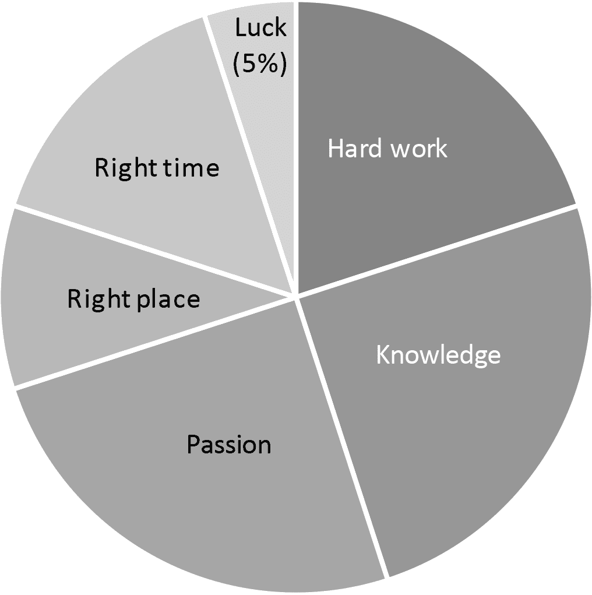

## CHAPTER 1

## 我如何成为了一位点 com 百万富翁

“我给你准备了一个惊喜。”

1995 年，我和我妻子 Jade 站在我工作的科技媒体公司外面。一辆黑色的加长豪华轿车，流线型如同涂了黄油的热带鱼，拐过弯开到我们面前。

我笑着握紧她的手。“这是我过得最好的生日。”

“会更好的，”她保证道。

我的同事 Ned 把头伸出天窗大喊，“哇！三十岁生日快乐！”

豪华轿车门打开，从中涌出一群喧嚣的朋友和同事，他们是年轻的科技专业人士，正处在点 com 泡沫的高峰。

“这真是太棒了，”我在 Jade 和我一起坐进轿车时观察到。我们公司最近在纽约证券交易所上市，每个人都在庆祝：派对帽子，香槟……有一盘牡蛎危险地放在座位上，当我的朋友兼同事 Genevieve 爬进车时，她不小心坐在了它们上面。

“Genevieve 坐在了牡蛎上！”Chris 大喊，大家都爆发出笑声，包括 Genevieve。

“吃些虾吧！”Chris 大喊，向我扔了一只虾。“还有，一杯锅炉工！”他递给我一杯饮料。

“锅炉工是什么？”我问。

“啤酒加一杯威士忌！”Chris 愉快地回应。“锅炉工给所有人！”当轿车启动时，他把头伸出天窗。“锅炉工给波士顿！”他抓起一把虾，向一个无辜的行人扔去。轿车里爆发出笑声。

“来次驱车虾击！”Genevieve 笑着说。

“这将以悲剧收场，”我预测，大口喝酒。它尝起来像喷气燃料和啤酒花。“我们要去哪里？”

“那是最精彩的部分。”Jade 的眼睛闪闪发光。“你知道你一直想看那个喜剧催眠师吗？”

“下车，”我说。“就是那个让你上台并让你以为自己是一头驴的人？”

“就是那一个。”

“你是最体贴的妻子。”我挤压她的腿。

“嘿，我们的股价是多少？”Ned 问。

“刚刚收盘价在 19 美元以上，”Genevieve 回答，用一把纸巾擦她连衣裙上的鸡尾酒酱。

大家 calculating 了几秒钟自己股票期权的价值，假装不 care。我快速心算，这是我人生中最大的震惊之一。

我成了百万富翁。

确实，这只是纸面上的；我并没有现金一百万美元。我有一百万美元的股票期权。这意味着如果我在公司再待一年，股价保持在 19 美元，我就可以卖出股票，在一笔交易中赚一百万美元。

谁在乎？技术上来说，我成了百万富翁。就在我三十岁生日那天！

没有人知道每个人持有多少股票期权，所以我们不得不保守这个秘密。突然间，大坝爆炸，轿车里爆发出欢呼。“哇呼！”Chris 大喊，点燃一根罗马蜡烛，从天窗扔出去。FOOM。

“你在做什么？！“Genevieve 笑着爆炸了。FOOM。

“嘿！”豪华轿车司机猛敲玻璃隔板。“你们必须停下来。”FOOM。

-   我转向 Jade。我知道她已经做了同样的计算，可能还包括税收和折旧。她还设想了几种最佳、最坏和可能的股票价格情景，以便我们在一年后套现。我们接了一个吻。

-   “给你们俩弄辆豪华轿车！”Chris 现在喊道，然后把头伸出窗外。“每个人都有豪华轿车！”

-   可能是这杯混合酒开始发挥作用，但场景突然变得超现实。我曾在俄亥俄州的一个中产阶级社区长大，然后搬到波士顿成为一名喜剧作家。我并非出生于富裕或特权家庭；我的信托基金是一辆本田思域。现在我是一个百万富翁，乘坐豪华轿车？

-   头晕目眩的我试图倒推这一切是如何发生的。

 确实，自从五年前大学毕业以来，我一直像疯了一样工作。但这一切似乎太好了，就像你会在书的第一章看到的东西。我环顾四周，想知道我们是否已经到了喜剧催眠师那里，而我在梦寐以求整个场景。

 互联网发生时，地点和时间都是对的。我找到了一份在一家媒体公司的工作，该公司出版《PC 杂志》和《计算机购物者》等计算机杂志。（对于年轻读者来说，杂志是些在书店里卖的彩色纸堆。）

 我们理解这些。公司是最早开始将其文章在线发布的出版社之一，因此当互联网公司开始接管华尔街时，我们的位置非常好。我们不仅报道.com 公司；我们还在最大的.com 公司之一建立了自己的公司。我们在.com 上双重投资。

 我还在追随我的激情：互联网如此令人 intellectualy 着迷，如此 technologyly 诱人，以至于我无法停止玩弄它。我想分享它。因此，我将我的喜剧写作与我对技术的热爱融合在一起，成为了一名喜剧技术作家，用简单有趣的方式解释互联网。

 最后，运气因素在里面——但并没有你想象的那么多。（见下表。）

### - 如何成为互联网百万富翁

-   这本书里你能学到 95%的东西。

-   “我的朋友们，”我举起喝了一半的混合酒说，“能和你们这些我如此爱的人，在我如此热爱的岗位上，和我如此热爱的妻子——”我看着 Jade，她的眼睛闪闪发光——“和我如此热爱的妻子一起庆祝我的三十岁生日，这是一种荣幸。为健康、财富和幸福干杯。”

-   “干杯！”豪华轿车里的人大声喊道，然后有人放大了麦当娜的《光芒》。

-   “在我所做的所有决定中，”我低声对 Jade 说，“最好的决定是和你结婚。”我喝光了我的混合酒，然后用胳膊搂着我生命中的最爱，靠了回去。极客很酷，互联网很热，新媒体是新黑色。我心想，这肯定是有史以来最伟大的时代。

- - -

那位喜剧催眠师并不怎么有趣，也没有催眠我。他确实把我带上舞台，和其他几个志愿者一起，但随后我试图从他那里夺走麦克风，好让自己来催眠观众。

“你们都变得越来越困了！”我含糊不清地说，同时催眠师试图夺回麦克风控制权。我从他那里抓起麦克风，他追着我跑，我摇摇晃晃地穿过其他志愿者，他们真心认为自己是一只只驴子。“嘿哦，”我跑过他们时，轻轻地拍了一下他们的头。“嘿哦。嘿哦。”

一个保安跳上舞台，把我拉下来，我摔在了 opening band 的鼓架上。一个铙钹砸在我的头上。

“代表焊工，”克里斯小声对埋着头的翠儿说，“我想表示歉意。”

几个月后，整个股市像那个铙钹一样崩溃了。互联网泡沫破裂，带着世界经济一起沉沦。翠儿和我从百万富翁又回到了千富翁。最后，我们失去了所有的钱。

然后，我们又再次拥有了这一切，这次是因为一种新技术——区块链。

这本书讲述的是一段从富有到贫穷再到富有的旅程。我与你分享它，是因为我希望你能在避免贫穷的同时变得富有。财富并非零和游戏。对所有人来说，财富是无限的，地球上每个人都有足够的食物——而区块链将帮助我们分享这份财富。

你不需要任何特殊能力就能理解区块链。你需要的只是对学习的热爱。这就是你正在阅读这个故事的原因！所以要做一个学习海绵，吸收知识，满足你的渴望。

我曾以为互联网时代的日子是最美好的。我从未想过自己有幸再次见证那种激动人心、充满活力的时刻。事实上，区块链甚至更胜一筹。

以下是我如何成为区块链革命前线的故事的经过。
