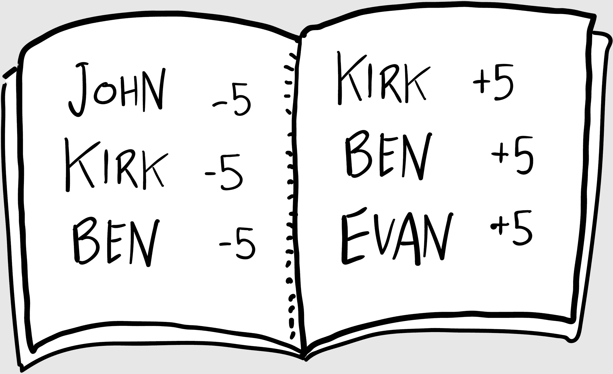

## 第四章

## 会计僧侣

扑克之夜通常在克 irk 的房子举行。我们四个人中，他是单身汉。

我的朋友对 J. R. R. 托尔金有着迷般的爱好，所以他的房子里摆满了《指环王》的周边，比如覆盖了一面墙的精美手绘中土世界地图，以及挂在壁炉上方的闪亮的霍比特人剑。这不是电影道具；这是一把真正的剑。

“你有没有击败过哥布林？”我问他，触摸那锋利的尖端。

“只是一个奥克，”他回答，递给我一罐苏打水。我举杯敬他的啤酒。克 irk 看起来有点像霍比特人：他是我的几个比我矮的朋友之一。他还长得像 CNBC 的吉姆·克莱默——尽管是一个更温和版本。

“我刚刚和我孩子们重新读完了《指环王》，”我说。“那是一次史诗般的旅程。”

“嗯？”克 irk 耳朵不好使，这是他从他母亲那里继承来的特质。我从来不确定他听进去多少，又错过了多少。

“你们加入吗？”本问。他正在克 irk 的圆形维加斯式扑克桌上发扑克牌。如果克 irk 是霍比特人，本就是稳重的精灵，而埃文就是肤色黝黑的希腊矮人。

我坐下，在桌子上扔了一张二十美元的钞票。

“大款，”本评论道。

“先生们，我感觉很慷慨。今晚我是比特币的骄傲主人。”

“哦，是的，”埃文说，洗牌。“我在沃顿读 MBA 时读过关于比特币。这真的很有趣。就像电子现金，但它是点对点的。”

“没有银行，”我确认道。“没有政府。人民拥有金钱。本，这应该会吸引你的自由主义倾向。我敢打赌五美元。”

克 irk 应声了。

“弃牌，”本说，翻转他的牌。。“所以它能用来买什么？”

“嗯，你可能还不能真正买东西。”

“所以这是一种你实际上不能用作现金的电子现金。”本有一种既迷人又令人畏惧的半笑，可能是迷人的，也可能是令人畏惧的，或者两者都是。

“我更愿意把它看作是一种投资，”我回答。“这应该会吸引你的投资者倾向。”

“这听起来更像是投机，而不是投资。”

“我弃牌，”埃文说。“有几张牌？”

“给我两个。”我回答。克 irk 也拿了两张，我仔细观察着他。他看起来不高兴，所以我加注。“五美元继续。”

克 irk 犹豫了。“弃牌。”我收起我的赢的钱。

“那么你实际上有什么？”本问。“当我买股票时，我得到一张股票证书。你得到收据或类似的东西吗？”

我洗牌。“我有公钥和私钥。”

“像物理钥匙？”克 irk 问。

“不，一长串文本和数字。就像电子邮件地址。”我说话时发牌。“我可以把我的公钥分享给任何人，就像电子邮件地址。但我唯一能访问私钥。就像密码。”

“如果你丢失了私钥怎么办？”本问，敲着桌子。

“那你就失去一切了。”我转向克 irk，模仿我最擅长的伊恩·麦克莱恩。“所以保密。保持安全。”

埃文敲门。赌注轮到我，我坐了一会儿，翻动我的拉斯维加斯式扑克筹码。它们发出 satisfying chick-chick-chick 的声音。尽管我只有一张国王，但赌注的胜率很高，我可以带着彩金离开。但也许本也在虚张声势？Chick-chick-chick。

“你能不能别这么做？” Kirk 问。“这会杀死助听器。”

“抱歉，我赌二十。”我推了一堆筹码进去。

“我不玩了。” Kirk 扔掉他的牌。

本用那种半笑看着我。“我跟你赌二十。”他推了一堆厚厚的筹码。

“谢谢你让他保持诚实。”埃文说着把他的牌扔了进去。

“高国王。”我把我的牌放在桌子的中间。

“国王高，”本平静地回应，展示他的手牌并收走他的赌注。“国王归来，”他说着，把我的牌还给我。

“它使用去中心化账本技术，”埃文说。

“教教这位老师，” Kirk 说着切牌。“去中心化账本技术？”

“你听说过会计僧侣吗？”埃文问。

“说说看。”

### 来自上帝的礼物

卢卡·帕乔利是十六世纪的方济各会僧侣，也是一位天才数学家。他与莱昂纳多·达·芬奇交往，开发了一种易于上手的代数教学方法——在业余时间还发明了会计。

会计僧侣也是一个专业人士，擅长简化。会计已经使用了数百年，但帕乔利实际上是编写了手册的人。他宣扬会计的福音，以及另一个也是。

帕乔利发明了双重记账法的概念：一方面是贷方，另一方面是借方。这不仅允许我们计算谁欠谁多少钱，而且引领了一个繁荣的新时代和现代金融体系的诞生。这是一项具有划时代意义的数学成就。

帕乔利也发明了会计账簿的概念。你每次平衡支票簿或查看在线银行账户时都会用到。对帕乔利来说，平衡支票簿是一种“道德责任”，^(2)，而整洁的账簿反映了一个纯洁的灵魂。

如果对金钱的热爱是万恶之源，帕乔利推理道，那么适当的会计就是所有善的根源。价值的适当分配——即它应该属于的地方——是人类所有善行的根源和繁荣（正如他的思想现在在你的心中生根发芽）。

多年来，会计账簿一直保持集中化，这意味着它属于一个人（比如会计）或一个机构（比如银行）。如果你有会计僧侣为你做簿记，这样当然没问题，但并非所有的会计师都是圣人。

集中化：任何由中心机构（公司、政府等）拥有或控制的系统。当今大多数人类机构都是集中化的。

事实上，我们最近经历的大部分金融危机——从 2001 年的安然灾难到 2008 年全球经济的崩溃——都源于欺诈性的会计和财务透明度的缺乏。我们信任会计师和审计师告诉我们真相，但谁在审计审计师？

我不能代表帕奇奥利，但既然他已经去世了，我来代替。会计修士厌倦了这些腐化的公司做假账。他希望升级。

我们称它为“天上的大账本”。

会计账本记录信用和债务，金钱的流入和流出。区块链只是把这些会计账本放到网上，公众可以验证它们是否准确。这就像开源数据。

这段话是理解区块链的关键。

像比特币这样的基于区块链的货币，每个人都可以看到链上每一笔交易——每一枚比特币的买卖——自链开始以来的所有记录。因为所有人都能看到，所以每个人都可以验证账本是否正确。安全、诚实、干净。

分布式账本：就像一个共享的账本，或者一个向世界开放的巨大的电子表格。这个“天上的大账本”是区块链的心脏。

我们描述的是一个分布式账本，意思是，不是一大本会计桌上的纸账本，而是账本分布在世界上的数百万人或数千万人之间。这就像我们共同平衡的一个巨大的支票簿。

“你就像一个人类版的维基百科，”柯克在埃文讲完他的故事后告诉他。

“所以想象这些代币是我的比特币，”埃文继续说，指着他的扑克筹码堆。“我可以发送五个给你，五个给本，五个给约翰。”他把筹码堆推给我们每个人。“这一切都存储在账本上，就像一个巨大的支票簿。但没有人拥有这个账本。它对每个人都是开放的。这是开源的货币。”

“那么账本存放在哪里呢？”柯克问。

“它分布在整个数百万台计算机之间，”我说，试图找一个类比。“还记得我们以前经常举行的局域网聚会吗？”

“当然。局域网。那时候是最棒的。”

“每个人都把自己的电脑连起来一起玩游戏。谁拥有那个网络？没有人拥有。我们只是把电脑连在一起。区块链就像这样。账本跨越所有这些电脑共享，就像一个网络。”

“如果我们意见不一致呢？”柯克问。“埃文说他给了我们五个代币，但我们只收到了四个。”

“这个系统的魅力就在于此，”我回答。“这叫共识。系统的设计是让大多数人说了算。”

“五张牌的德州扑克，”柯克宣布。“看看他们的牌，然后哭泣。”他给我们每个人发了一张牌。

共识：人们就区块链上存储的内容达成一致的方式。达到共识有不同的方法，我们稍后会讨论。

“你的比特币价值多少？”本一边咬着胡萝卜一边问。

“现在价值 135 美元！”我自豪地说。“我以 125 美元买入的。你知道我在这笔投资上已经赚了多少吗？”

“IBM 是一项投资。苹果是一项投资，”本看着他的牌说。“比特币不是一项投资。这也不是。”他推了一堆筹码进去。“这是一场赌博。”

“20 美元？”埃文说。“我退出。”

我仔细观察了本，但他是个谜一般的人物。我手里有一对王炸。

“我看到你的 20 美元，再加注 20 美元，”我冷静地回应。

“你们年轻人玩得开心点，” Kirk 说着，扔掉了自己的牌。

本没有犹豫。“全押。”他推了他所有的筹码进去。

“那我也全押了，”我说。“因为我的全押比你少，我还会加上这张咖啡卡。”

“好了，”Kirk 说。

“这张咖啡卡已经有九个孔了，”埃文指出本。“第十杯咖啡是免费的。”

“嗯，我看到你的咖啡卡，并且通过一张 Fitbit Flex 进行加注，”本说着摘下他的健身手环。“第一款戴在手腕上的健身追踪器。”

“嗯。”我环顾四周。“嗯，我看到你所谓的 Fitbit，我加注——”我跑向 Kirk 的壁炉，从装饰性的支架中拔出剑——“这把霍比特剑！”我笨拙地在头上挥舞着它。

“小心点用 Stimg！”Kirk 大喊。

“你！不能！通过！”我挑衅本，将剑在我面前向下刺。

“看好桌面！” Kirk 大喊。

我把剑戏剧性地扔在扑克桌上。

“快点，让我们开始吧，”埃文说着，吃着玉米片。“你有什么？”

“一对王炸。”我把它们翻过来。

本的半微笑从未离开过他的脸。“太可惜了。”他翻出一张 Ace。

“一对王炸？王炸！哈哈！王者归来！”我伸手去拿我的赢的钱。

然后他翻出了一张第二张 Ace。

“不是投资，”本在收钱的时候重复说。“这是一场赌博。”

Kirk 恶狠狠地看着我。“你欠我一把剑。”
