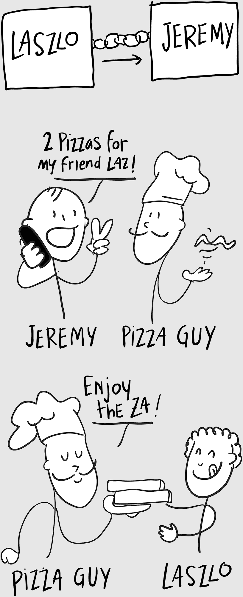
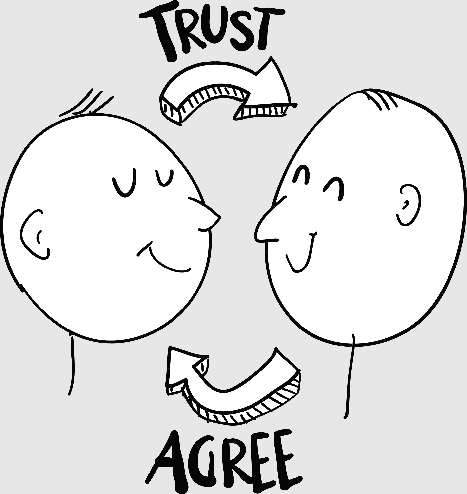

## 第五章

## 钱从天而降

拉斯维加斯会议中心如此庞大，以至于你需要创造新词来形容它，比如“hunormgous”或“gigantitanic”。它如此巨大，以至于实际上可以在建筑物内部下雨。今天它在下雨美元。

可能只有几百美元，但当它们从天花板上飘下来时，这似乎是一大笔钱。我敢肯定这次活动的组织者想象着一群饥饿的参会者在公关狂潮中追逐着钱——真正的钱！

相反，只有六分之一的名参会者，显得有些迷茫。

一个穿着鲜艳红色吉祥物服装的人跳入现场，从地板上捡起钱，然后又把它撒回参会者身上，给他们第二次机会。大多数吉祥物都会微笑；这个很生气。它看起来像是个痔疮。

“嗯。”我看着皮特。“这正式是有史以来最糟糕的贸易展览会。”

多年来我们一直来参加这个营销会议，它曾经占据会议中心整个南厅。现在它只是从前辉煌的一半。

“这显然不是他们承诺的出席人数，”皮特同意道，“但我们只需要成交一笔生意就可以支付展位费。”他是个永远的乐观主义者，这正是你希望销售副总裁所具备的。

一些参会者正勇敢地从地板上捡起一些午餐钱，但员工们正在收拾其余的。

“我们目前表格里有多少个潜在客户？”

“12，”皮特说。

“哎呀。”

皮特透过眼镜看着他的笔记本电脑。Excel 表格被设置为 3000%的缩放级别。屏幕上只有两三个单元格。

“两个或三个高概率，一个中等概率，其余的都是低概率。”

我叹了口气。“至少我们没有为吉祥物付钱。”

皮特笑了。“那个东西看起来像是个粉刺。”

吉祥物显然很沮丧，现在试着真的把人们拉进展位。它沮丧地举起它那双过大的手表示挫败。

现在皮特在咯咯地笑。他摘下眼镜，擦了擦眼睛。“来吧，那个吉祥物值得票价。”

那是因为你不用为此付钱，我心想。

“说到价格，我们今天的比特币在哪里？”

现在我的心情好转了。“伙计，它的价格快达到 1000 美元了。”

“每个比特币 1000 美元！”皮特摇了摇头。“我有没有感谢过你？”

“我刚跟你说过，”我反驳道。“是你做的决定。”

“你要套现吗？”

“诱惑难挡，”我坦白道。“当它达到 1000 美元时，我可能会卖掉一些，然后重新投资苹果公司。”

交易会的过道空无一人，因此我们两个人有足够的时间聊天。“一千美元！”皮特重复道。“你能想象在 100 美元时买入苹果公司的股票，然后在短短几年内它的价值达到 1000 美元吗？你觉得它能涨到多高？”

“那就是那个 10 万美元的问题。”我整天站着都饿了。“你知道那 100 万美元的披萨吗？”然后我开始讲故事。

### 那 100 万美元的披萨

时间是 2010 年。中本聪仍然参与其中，而他那群极客和怪才组成的比特币社区开始凝聚。其中一个早期狂热者——一个名叫拉斯洛·汉耶茨的人——想到，如果比特币要作为数字货币使用，有人需要用它来在现实生活中买东西。

对于一个计算机黑客来说，他买了两份披萨是合适的。

拉斯洛在早期的比特币论坛上发帖，提供购买送至他家的两份披萨。另一位比特币用户杰里米·斯图尔特兰特接受了这个挑战，没有意识到这次实验的历史意义。

由于比特币没有固定的价格，他们商定了一个任意数字：拉斯洛将为这两份披萨支付 10,000 BTC。

拉斯洛（买家）像发送电子邮件一样轻松地将比特币发送给杰里米（卖家）。

BTC：比特币的缩写。每种数字货币都有自己的缩写，就像每种政府货币（USD = 美国美元；JPY = 日元等）一样。

 他输入了杰里米的公钥（像电子邮件地址）；

 用他的私钥（像密码）签署；

 然后点击“发送”。

几个小时后，当地一家披萨店送来两份热气腾腾的披萨，他欣喜若狂。他拍照分享到比特币论坛上，告诉所有人他用比特币买了这些披萨！

几年后，那两份披萨可能价值约 100 万美元。

我知道你在想什么：他至少要点配料吗？

你可能会认为他给披萨付的钱太多了。但他实际上证明了区块链货币可以具有现实世界中的价值。这是一个具有巨大意义的里程碑，因为它启动了 2500 亿美元的数字货币市场。

多年以后，人们仍然会问：“比特币为什么有价值？”答案很简单：它有价值，是因为我们大家都同意它有价值。

当一些经济学家听到这个想法时，他们的头都炸了。人们竟然可以随意发明一种货币——这违反了货币的法则！“货币是一种由联邦政府信誉支持的流通媒介！”他们大声疾呼，推回鼻梁上的圆框眼镜。

但人类不是已经发明货币几千年了吗？

 在所罗门群岛，公元前 1200 年就开始使用贝壳项链作为货币，至今仍在使用。（一条项链大约值 120 美元。）^(3)

 在密克罗尼西亚的雅普岛上，巨大的石头被用作货币：每块石头的价值取决于它的体积、它的美丽，以及搬运它时死去的人数。^(4)

 在第二次世界大战期间，战俘有时会使用香烟作为货币。现代囚犯使用方便面袋，这种方便面保持其价值且可作为食物使用。^(5)

“那不是真正的钱！”经济学家惊呼。“你不能用方便面交税！你不能抽半支烟！你不能用重石头参与资本市场！”与此同时，囚犯和岛民继续使用这些东西作为货币，不受理论经济学的限制。

什么赋予比特币作为货币的价值？什么赋予任何东西作为货币的价值？只有两件事：

 我们同意它有价值。我愿意用黄金收款，因为我知道大多数人认为黄金有价值。同意黄金价值的人越多，我就越有信心。

 我们相信它有价值。我知道黄金在未来会有价值，因为它有着悠久的历史，在人类大脑中有深厚的根基。它的价值可能波动，但不会降到零。

这两个原则——协议和信任——是区块链的核心思想。它们是赋予任何货币价值——包括基于区块链的货币如比特币的相同原则。

这就是为什么汉耶茨和斯特德文特会永远载入史册。他们证明了比特币可以有实际的世界价值。我们每年 5 月 22 日庆祝他们的成就：比特币披萨节。

比特币为什么有价值？因为披萨。

“你好，先生们。”我们的摊位里发生了一次原子弹爆炸。

皮特和我转向那位黑发年轻女子，她穿着一件深 V 字的定制西装，四英寸的高跟鞋，至少那么多的乳沟。

“我是约翰，”我说，避免了握手。“这是皮特。”人多势众有安全感。

“洛丽塔。”她的口音浓重如莫斯科的雾。“我们在那边的摊位上。”她把大拇指指向下一排供应商。“展会怎么样？”

“有没有贸易展在进行？”我开玩笑说。“我看到的只有供应商。”

“卖家的数量超过了买家的数量，”她同意了。“你们做什么的？”

“我们是一家互联网营销代理公司，”皮特插嘴说。“你们呢？”

“我们在销售一种新的物理治疗设备，叫做——电子刺激器。你想试试吗？”

在我们的摊位上进行销售演讲！我们无处可逃。

皮特对她的大胆行为笑了。“营销会议上怎么会有电子刺激器？”

她说：“我们在拉斯维加斯做所有的演出，”她笑着说道。未经允许，她开始在我的衬衫里放两个吸盘。“电子刺激器通过发送微弱的电流来恢复疲惫的肌肉，你可以用智能手机控制它。看？”她把吸盘连接到她的 iPhone 上，向我们展示了这个应用程序。这一切都在十秒钟内发生。“你想试试吗？”

“我知道这些事情，”我说。“他们在我针灸的时候使用它们。”

她解释说：“这是最大设置。”我痛苦地抽搐时，她继续微笑。她把 iPhone 给皮特看，皮特无法相信地笑了。

“让我帮你调低音量。”她把屏幕上的旋钮转到 4，我肩上的大锤声有所减弱。“我们有一个展会特价，你还会得到袜套，非常适合恢复疲劳的脚。还有头皮按摩器，可能会促进大脑活动。”

当 AC/DC 的鼓点在我肩上敲响时，清晰地思考变得很困难。“多少钱？”

“我们通常把这个套餐卖 499 美元，”她轻松地提供，“但在展览会上，我们以 249 美元的价格赠送。”

最糟糕的不是我在自己的展位里接受电击治疗。最糟糕的是我在想，嗯，这确实能恢复疲劳的肌肉。

我从她的电咒中清醒过来。“我们考虑一下，”我对她说，从衬衣下取下吸盘并还给她。

当她走开去电击吉祥物时，我看向皮特。“最糟糕的会议。”

“我无法相信……那可能是不合法的！”

回顾起来，当天的事件让我猛然意识到：互联网营销行业不再是一个行业。每个人都在自己的公司内部做营销。这个行业已经成熟，我们也必须成熟。

“皮特，我们必须找到一个新的方向，”我宣布。“让我们尽可能多地了解比特币和区块链。这是醒悟的信号。”

“一个 220 伏的醒悟电话。”皮特笑了。“呼！”

我抬头望着会议中心宽敞的天花板，皮特的问题在我脑海中回响。你觉得它能走多远？
