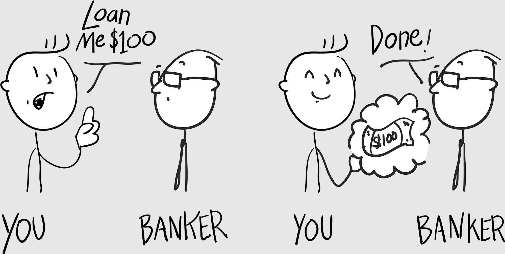
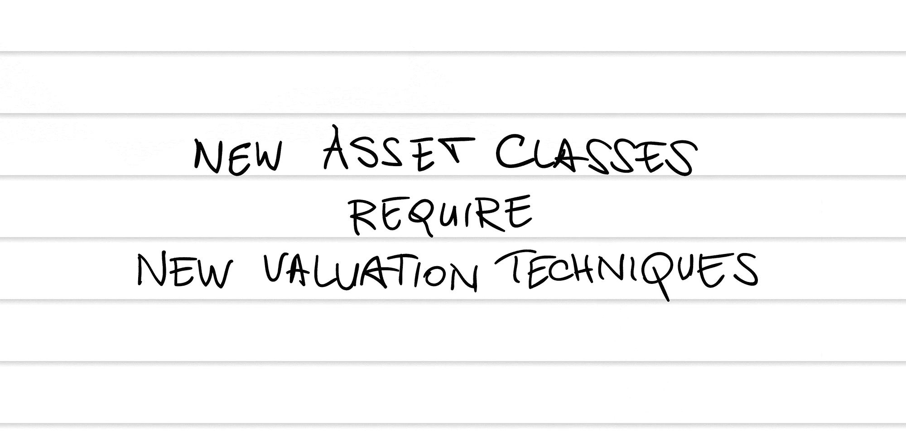
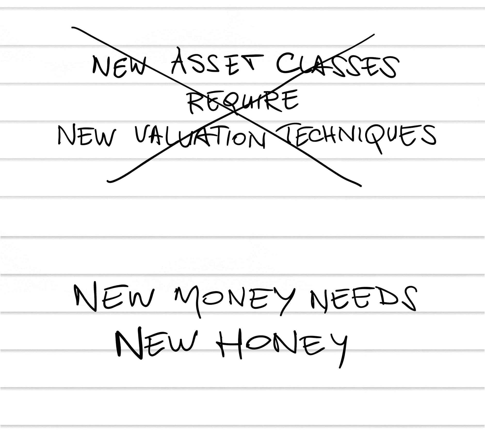
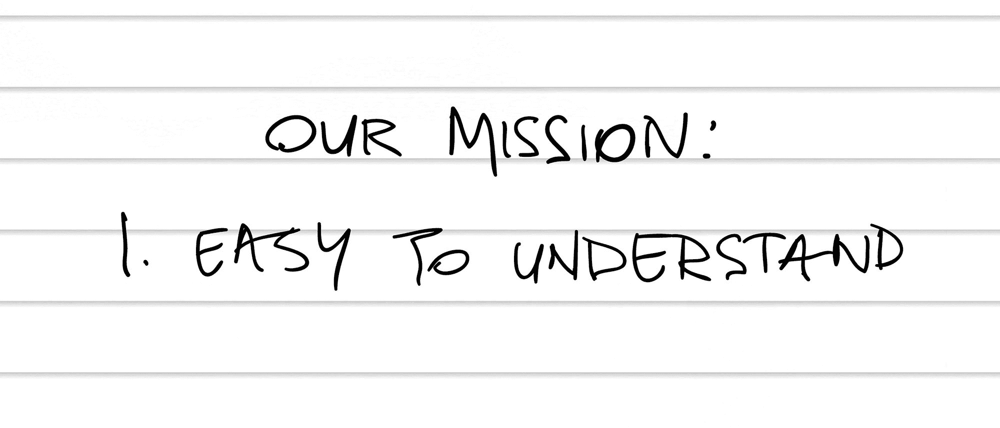
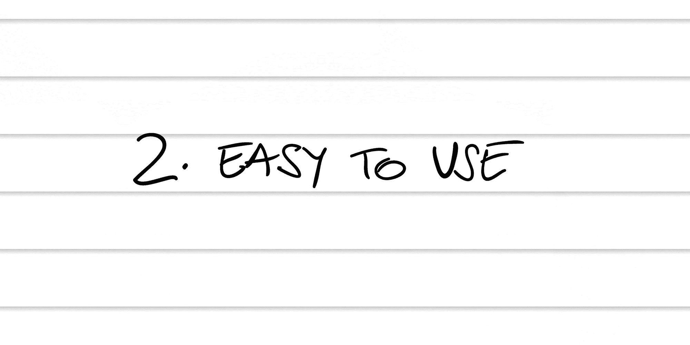
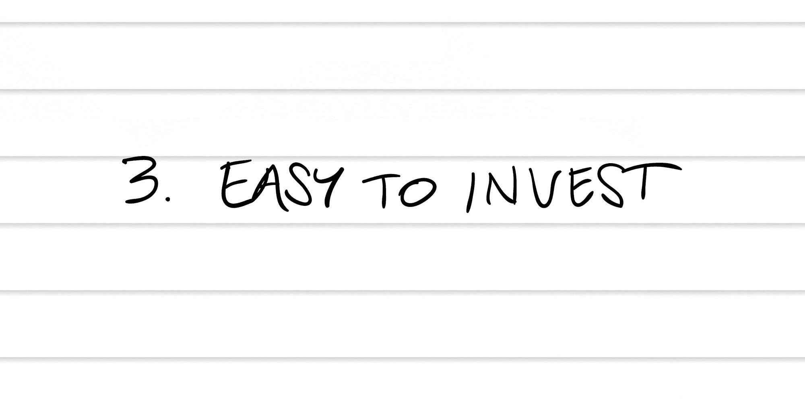

## 第六章

## 表现得好像你属于这里

进入你不应该去的地方的秘密？ALYB。

我在纽约大学斯特恩商学院的一个宽敞的木质镶板教室里。这里有一种法学院教室的感觉：红木讲台，天鹅绒窗帘，最新的投影屏幕。你能闻到钱的味道。

为我辩护，我试图弄到参加 Token Summit 的门票，但区块链会议几个月前就售罄了。我在 eBay 和 StubHub 上寻找门票，但找到的唯一卖家想要 1 个比特币，现在价值约 2500 美元。

所以我提前三个小时到达，然后表现得好像我属于这里。

如果你要 ALYB，穿西装会有帮助。我自信地走进礼堂，然后四处走了几分钟检查音频线。我沿着电线走到讲台，然后大声喊道，“托尼！托尼，确保这些电线都被贴上！”

我在礼堂里找到最不显眼的座位，打开笔记本电脑，自信地假装工作了三个漫长的小时。

内心深处，我的心脏在颤抖，我的肾上腺在超负荷工作。我对每一个声音都敏感。你不应该在这里，你不属于这里，你在占别人的座位。

我回想起耶稣在售罄的礼堂里向他的追随者布道的那段圣经故事，那个渴望被治愈的瘫痪者。他的朋友们撕开了房顶，然后把他降了下来。我们是否曾批评过那些破坏房顶的朋友？耶稣只是大笑，像个老板一样治愈了那个人。

如果你想找到进入的方法，那就找到进入的方法，我对自己的大脑说。

“打扰一下。”一个肌肉发达、满身纹身的家伙站在我旁边，我的心就像按下了特斯拉疯狂模式的按钮。他向侧面歪了歪头。“你能帮我稳住三脚架吗？”

“没问题，”我一边说，一边按下它，而他则拔出了相机装备。

“谢谢。”

终于——终于！——人们开始填满礼堂。我瞥了一眼身边座位上的人的名牌。高盛。摩根大通。瑞士信贷。我蹲下身子，打开西装外套，以免被发现我没有名牌。

两个德意志银行的员工坐在了我旁边，开始谈论期权和信用违约互换。他们看起来很帅，戴着时髦的眼镜，穿着浆硬的衬衫。而且他们都有全部的头发！为什么所有有很多钱的男人仍然都有全部的头发？我立刻讨厌他们。

我开始为他们编织一个精心设计的背景故事：保时捷车主，俯瞰第五大道的 penthouse，辣妻每天都在锻炼。他们一起去瑞士阿尔卑斯山度假。

“因为比特币是开源的，”我右边的那个人向他的同事解释，“任何人都可以免费复制。”

他的同事嘟囔道：“所以任何人都可以创建自己的数字货币。”

“比特币的复制品。比特币的替代品。”

“山寨币。”

山寨币。这个词烙印在我的大脑上。

“这就好比自己在印钱，”同事若有所思地说。我能听到他在思考。

“这就像银行体系早期的时候，”坐在右边的一位德意志银行家回答道。

### 印刷你自己的货币

在美国建立之初，中央银行体系尚未建立，地方银行发行了自己的地方货币。他们字面上印刷了自己的钱。

假设你是一个加利福尼亚殖民者，从圣地亚哥国民银行得到了一张$5 的银行券。由于你的大部分开支都是当地的，你会同意并信任这种货币会保持其价值。

但是如果你去了纽约市呢？他们可能会用轻蔑的眼神看着你的圣地亚哥$5 银行券，就像纽约人看待哈德逊河以西的一切一样。没有协议，没有信任。

银行本应该持有抵押品来支持它们的银行券——所以它们发行的每张$100 的现金代表了金库中$100 的黄金。但是监管不力，所谓的野猫银行纷纷涌现，印刷纸币最终变得一文不值。没有黄金支持，也没有信誉可依赖，你可能会把你那张野猫$5 的银行券扔在地上，却被告知：“你这里的钱不好使。”

与此同时，信誉良好的银行随着国家银行体系的演变而繁荣。^(6)最终银行体系实现了集中，所以这里的政府美元在任何地方都是政府美元。这使得货币可以自由流动，因为现在大家都同意并信任货币会保持其价值。

今天区块链世界正在上演类似的故事。因为比特币是开源的（可以免费复制），所以别人很容易创建他们自己的替代货币，我们称之为山寨币（或加密货币）。每一个都有点不同。

加密货币：对数字货币的一个糟糕的称呼。首先，“加密”意味着“秘密”或“墓穴”。负面影响。而且：太长。由于数字货币是比特币的替代品，让我们称它们为山寨币。

最好的山寨币增加了价值：它们解决了一些真正的技术问题，或者得到了一些真实世界的资产支持。也有一些价值可疑的山寨币：就像野猫银行一样，它们在区块链热潮中赚得盆满钵满。（让我们称它们为野币。）

他们正在大赚一笔。新生的山寨币筹集了数十亿美元：凭空产生的货币。^(7)在你翻白眼之前，请记住大部分货币都是凭空产生的：只有 3%是纸币；97%是通过银行贷款产生的。^(8)

这是反直觉的。当银行给你贷款时，它并不是在“使用”它在金库里随意放置的钱。贷款是凭空产生的货币，因为现在你会产生更多的钱来偿还它（加上利息）——只要你付得起！

大部分时候，并没有纸币交换。撕毁你脑中的货币模型。这都是数字。

我们中的大多数人都在在线账户里进行银行交易：数字。我们的工资单进入我们的在线账户，我们从我们的在线账户支付电话费，我们用借记卡买午餐的玉米卷：数字。

所有这些都只是在以太中飞舞的数字。如果每个人都决定将他们的银行账户提现成纸币，经济就会崩溃，因为这么多纸币并不存在。这是一个我们所有人都选择相信的虚构——因为我们所有人都同意并信任这个系统，所以它有效。

所以，赚钱本身并不那么困难：你甚至不必印刷它！但说服人们同意并信任你的货币确实非常困难。你必须证明这种货币具有价值——在区块链世界中，这意味着你需要建立一个强大的信仰者社区。

以下是一些最有价值的替代币以及它们是如何建立这些信仰者的。

### Bitcoin

* * *

 股票代码：BTC

 市场规模（截至书写）：1250 亿美元

 是什么：货币

 描述：数字资产的黄金标准；区块链的美元。关于比特币的一个不为人知的真相是，它实际上作为数字货币很难用。随着比特币的普及，购买东西变得缓慢且昂贵——而且其价格波动使得它不适合用作现金（参见第 35 页的“$10,000,000 披萨”）。这导致了下面列出的竞争货币的出现。

### Ethereum

* * *

 股票代码：ETH

 市场规模（截至书写）：500 亿美元

 是什么：平台

 描述：编程区块链是困难的，因此开发者需要使它更容易的平台（正如 Windows 这样的平台使我们更容易使用计算机）。以太坊目前是区块链项目的标准，正如英语是世界上许多地区的通用语言。虽然这些术语有时可以互换使用，但以太坊在技术上是一个平台，而以太币是用于在该平台上运行应用程序的“货币”。

### Ripple

* * *

 股票代码：XRP

 市场规模（截至书写）：200 亿美元

 是什么：平台

 描述：如果你曾经国际汇款，你就会知道这是多么耗时和昂贵。Ripple 是一个平台，使银行能更容易、更快地使用区块链技术进行这些支付。像 UBS 和 Santander 这样的主要银行已经在使用它。^(9) 令人困惑的是，Ripple（平台）运行在 Ripple（货币）上。

### Bitcoin Cash

* * *

 股票代码：BCH

 市场规模（撰写本文时）：150 亿美元

 什么是：货币

 描述：随着比特币越来越受欢迎，它一直在解决各种技术问题。因为比特币的团队不是集中的（没有人拥有它），开发人员必须就主要更改达成多数共识，这常常导致公开辩论。比特币现金是一个“分支”项目，旨在使比特币对日常购买更快、更便宜（因此得名）。^(10)

### EOS

* * *

 股票代码：EOS

 市场规模（撰写本文时）：75 亿美元

 什么是：平台

 描述：类似于以太坊的另一个区块链平台，尽管 EOS 有更大的野心，希望更便宜、更快。EOS 投资者定期从其他在 EOS 平台上启动的项目中获得免费的山寨币——使其成为一个强大的推广平台。^(11)

### Stellar

* * *

 股票代码：XLM

 市场规模（撰写本文时）：50 亿美元

 什么是：平台

 描述：另一个通过区块链交换货币的平台，类似于 Ripple。与 Ripple 不同，Stellar 是非盈利和开源的。这使得它在其他非盈利组织和像菲律宾、印度和西非这样的发展市场中很受欢迎。^(12)

### Litecoin

* * *

 股票代码：LTC

 市场规模（撰写本文时）：50 亿美元

 什么是：货币

 描述：早期比特币的克隆，Litecoin 迅速推出原始比特币系统的进一步改进。你可以把它看作是许多提议用于比特币的改进的测试平台。它旨在比比特币更快、更轻，因此得名。^(13)

如果中本聪引入比特币是区块链的大爆炸，那么所有这些山寨币就是在接下来的几秒钟内形成的原始粒子。我们如何决定它们的价值是多少？

在他们交谈的时候，我拿出我的 Moleskine 笔记本，悄悄地画下了这个：

不久，演讲厅就挤满了人，人们肩并肩地坐着。热度和湿度令人窒息，但我还是穿着夹克 . . . 直到 Chris Burniske 走上舞台。

正如那个瘫痪的人去听耶稣讲话，我去听 Chris Burniske 的讲话。这位年轻的斯坦福毕业生是 ARK 投资管理公司的区块链项目负责人。他穿着一套对比鲜明的灰色西装，脸上长满了胡渣，看起来很符合这个角色：一位年轻的华尔街巫师。

他说着作为介绍：“ARK 是唯一一个投资比特币的公共基金管理者。” “我们在 2015 年买入的。很多人认为我们疯了，买入了一个庞氏骗局，并预计比特币会慢慢死去。这种说法已经改变了。”^(14)

他展示了一张幻灯片。“比特币是我们两个基金中的头号仓位——超过了 Facebook、亚马逊、Netflix、谷歌，以显示我们的信心。但是，为了将比特币加入我们的基金，我们必须像研究任何股票那样研究它。”我疯狂地在我的 Moleskine 笔记本上写着：

Burniske 解释说，要给比特币定价，我们必须弄清楚其中有多少是投机，有多少是估值。换句话说，忘记飞速上涨的价格：比特币应该值多少钱？

“我们可以做一个思想实验，”他继续说。“假设比特币将占据汇款市场的 10%。现在，全球汇款市场是 5000 亿美元。如果我们从中拿出 10%，那就是 500 亿美元的市值。”

我迅速在谷歌上搜索了“汇款市场”。是移民家庭向他们海外的亲属发送的钱。国际电汇！我回想起 Sean 这个小精灵的三天银行转账。突然间它 clicked: altcoins 比发送钱的传统方式便宜得多，速度也快得多，它们几乎肯定会取代这种方式。

Burniske 拿了一个我们可以衡量的东西（5000 亿美元的汇款市场），想象比特币能从中分得一部分（10%），并给它一个“现实世界”的价值（500 亿美元）。如果我们把那除以比特币的数量，我们就得到了一个价格。欧几里得！

我明白他提出的 10%是凭空想象出来的：我已经忍受了足够多的商业演讲，知道未来的销售预测通常不过是 educated guesses。重要的是框架。

他从极客的比特币到金钱大佬的圈子——从怪胎到华尔街。Burniske 正在使其合法化。

我听得如此专注，以至于都出汗了。此外，现在房间已经挤满了人，我觉得空调已经停了。人群中的兴奋感几乎无法抑制，处于狂热边缘。

我疯狂地在我的 Moleskine 笔记本上写着：

很明显，即使是 Burniske 也需要一个翻译层。我们必须让这些内容变得简单有趣，易于学习。

Burniske 接着解释说，股票通常有公认的估值方法，比如市盈率（P/E 比率）和每股收益（EPS）。区块链资产需要一个类似的框架。

我发现如果你能提出这些指标，你就可以雇佣分析师来评估这些区块链资产——就像你在 CNBC 上看到的股票分析师一样。

这是一个真正的顿悟时刻：这些都是真实存在的，你可以像真正的投资者一样去思考它们。在接下来的时间里，我听取了那些创造了自己山寨币的创业者和程序员们的演讲，并对他们做了笔记：

 基于隐私的山寨币。由一个有趣的南非人领导。有很多用户社区，但我不太印象深刻。跳过。

 云存储山寨币。刚刚筹集了 3000 万美元。值得关注。

 衍生品交易山寨币。创始人看起来不太圆滑。跳过。

我一半以上的话都没听懂，但后来我发现，其他人也没懂。我们正处在科技与金融的奇怪交汇点。当我环顾那个拥挤、闷热的会议室时，我意识到一半的人穿着西装，另一半的人穿着连帽衫。

观众们都在密切关注这些区块链革命的领导者们的每一个字。他们中的一些人通过推出自己的山寨币并在其中留下一部分丰厚的利润而一夜暴富——就像印钞票并持有金库一样。

区块链亿万富翁——近在咫尺！

最终，我无法忍受这种氛围。在最后一次休息时，我静静地走向门口，头脑中充满了喧嚣和热闹。我推开人群，几乎就要到达出口了……

“打扰一下。”一位穿着西装、拿着记事本男士拦住了我。接下来就是了。

“是的，先生？”

他问：“您能否填写一份满意度调查？关于您对这次会议的享受程度。”然后递给我记事板。

“我非常愿意。”我微笑着说。

这一切看起来多么简单！易于理解，易于使用，易于投资。对于伟大的探险家沃尔特·雷利爵士来说，这一切一定看起来非常简单：“只需航行到南美洲，建立营地，然后找到埃尔多拉多，那个无边无际财富的神话城市！”

这真的会很难吗？
