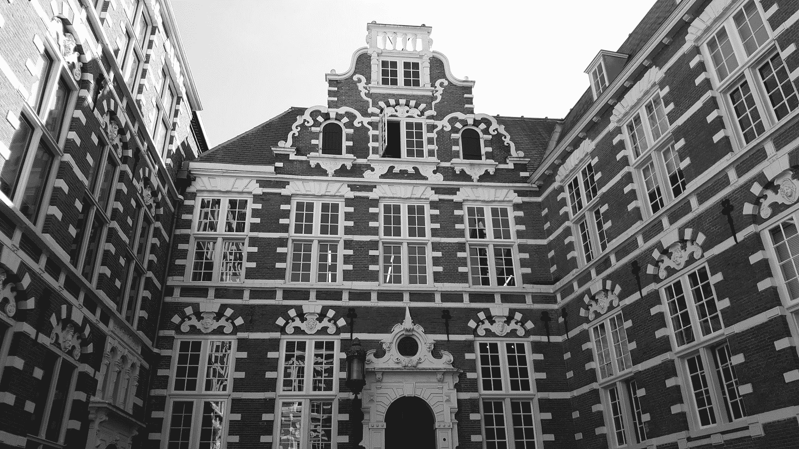
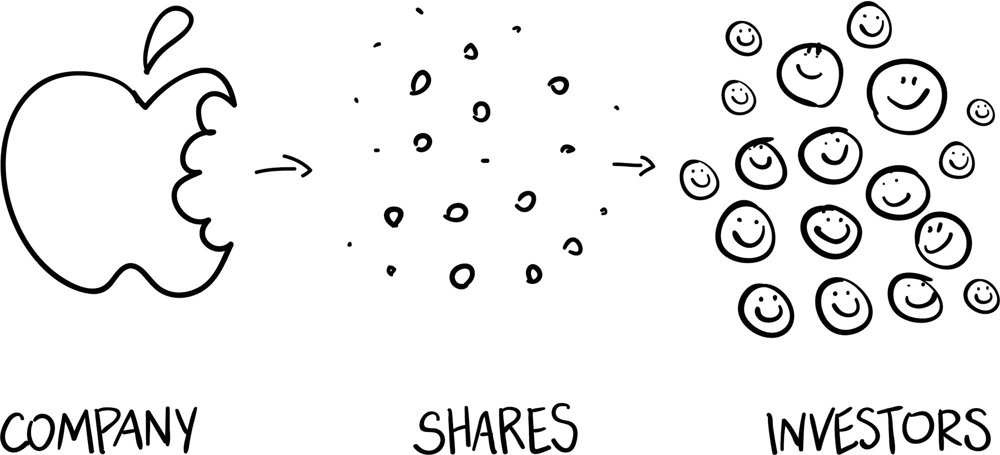
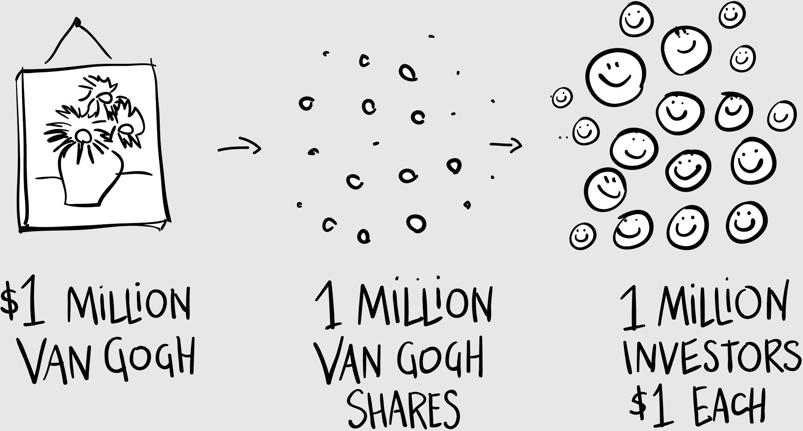
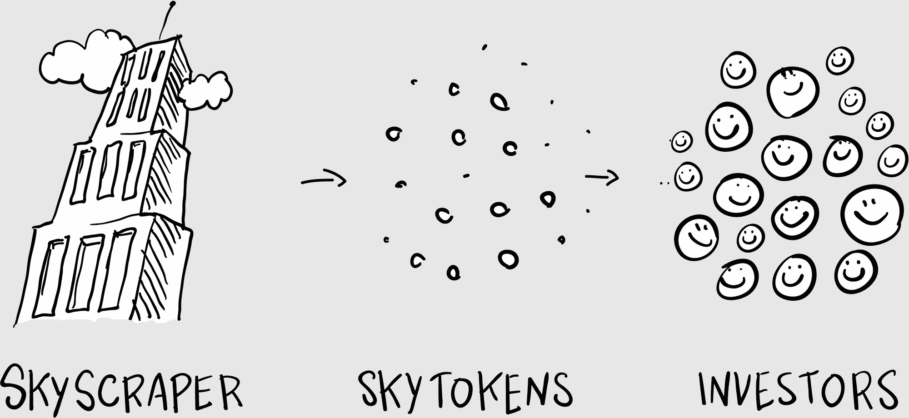

## 第七章

## 新的纽约证券交易所

现在我不再是一名技术作家，我成为了一名记者。

我要求 Media Shower 团队启动一个新网站，Bitcoin Market Journal。我乐观地认为区块链技术将席卷华尔街，我设想 Bitcoin Market Journal 能与华尔街日报一较高下。也许我们甚至会买下他们！

别管我们仍然是一个小团队，在家办公室里工作，或者我们只有两三个（包括我）知道区块链的作者。我们要让这些内容变得容易理解！容易使用！容易投资！

我们很快收到了参加区块链交易会的邀请，这些交易会正在全世界范围内兴起。每个人都想要一个“媒体合作伙伴”，这实际上意味着“你报道我们的交易会，我们会给你一个免费的通行证。”这对他们来说没有任何成本；对我们来说，却要花费数千美元的旅行和住宿费用。

我们通常会接受交易。

这就是我为什么会在阿姆斯特丹参加一个区块链交易会。如果不是通过做作业，我们怎么才能了解这些知识呢？

我提前一天到达，租了一辆自行车，接下来的几个小时里，我在阳光明媚的运河和迷人的古老街巷中骑行。我的目的地是阿姆斯特丹大学里的这栋楼，我放下自行车，敬畏地凝视着。

站在它的石板庭院里，凝视着它辉煌的窗户和铸铁工艺品。闻一下附近咖啡馆飘出的面包香味，让阳光洒在你身上。你正站在历史的中心地带。

这座建筑曾经是荷兰东印度公司的所在地：第一个现代公司，也是第一个公开交易的股票。现代股票市场就是从这里开始的。

在 16 世纪末，公众开始对胡椒、肉豆蔻和丁香等异国香料产生了兴趣。交易商们从遥远的地方以巨大的代价和巨大的危险进口这些香料，不断面临着海盗、疾病和船难的威胁。（15 （“你不必疯了才来这里……但这有帮助！”）

个人投资者可能会把一笔财产投入到一次香料航行中，结果却因为一场风暴而船只沉没。为了降低风险，投资者们联合起来，将钱投入到一个共同的钱箱中，享受共同的利润。它们被称为“股份”，因为你分享了公司的命运。

真正的创新是让公众可以买卖荷兰东印度公司的一小片股份。现在任何人——不仅仅是富人——都可以投资全球香料贸易。

想想这对投资者来说是多么奇怪的事情。“你在买一张纸？”你可以想象 17 世纪的一对夫妇在争吵。“这有什么价值？”你可以肯定，关于区块链投资的许多我们现在听到的质疑在当时这座大楼里就已经上演了。

股市是经济史上的一个转折点。我们大多数人不想买下整个公司；我们想买一份。通过购买不同公司的少量股份，我们分散了风险。这解锁了大量新资金，因为现在市场对所有人开放。

这是首次示例令牌化。

### 令牌浪潮

今天，区块链代币正在接管世界。一切都在被代币化：不仅是有公司，还有房地产、贷款组合、豪华游艇等等。利用区块链技术，我们都能够拥有一份—这正在释放代币的巨浪。

一个例子可以帮助说明。假设你拥有一幅价值 100 万美元的梵高画作。你可以将这幅梵高作为基于区块链的代币出售一百万“股份”。每个“梵高代币”价值 1 美元。

这些代币像股票一样买入和卖出，但记录交易的方式不是在在线经纪公司，而是在区块链上—分布式账本、开放的谷歌表格、天上的伟大支票簿。

代币、加密货币和令牌之间有什么区别？

从技术上讲，它们是不同的。实际上，人们可以互换使用这些术语。

让我们用“代币”来代替“比特币”（即数字货币），而“令牌”则是任何有真实世界资产支持的东西（如房地产、艺术品等）。

梵高代币的投资者—像任何投资者一样—希望代币价值随着时间的推移而增加，这样他们就可以盈利出售。想想这对您，画作的所有者意味着什么：为了提高梵高代币的市场价值，你必须增加梵高作品的價值。

所以你要努力奋斗：你与博物馆合作举办梵高回顾展；你委托拍摄一部关于梵高生活的纪录片；你为 Netflix 开发一部由本尼迪克特·康伯巴奇主演的梵高迷你剧集。

换句话说，您增加了价值。

或者假设你是一个想在曼哈顿拥有房地产的迪拜投资者。也许你没有能力买下一座摩天大楼。那座摩天大楼的所有者可以将大楼令牌化，然后只卖给你一份。

现在，摩天大楼的原始所有者就像一家上市公司的所有者：她有改善和翻新摩天大楼的动机，以吸引更高档次的租户，从而提高您的代币价值。这就像在棋盘游戏《地产大亨》中购买房子，这些房子产生租金，以便您升级到酒店。

我们正在创建新的代币，让您可以购买贵金属、商品，甚至是大型职业体育团队的股份。（拥有波士顿红袜队的一部分将是一场与在芬威公园购买季票完全不同的比赛。）如果它有价值，那么这种价值可以被代币化。

这些代币正在数字交易所交易，全天 24 小时，全球各地，为投资者开辟了丰富的新的机会。我们称之为“新新纽约证券交易所”。

我正在给阿姆斯特丹大学的建筑拍照，这时我的手机响了。

“约翰？”打电话来的是我们的银行客户。我的心猛地跳了一下。

“宋英。嗨。你听得见我吗？你的信号不稳定。”

“我们在这个区块链工作上遇到了大问题，”她回答说。“我需要你周五过来。”

“我正在欧洲，”我告诉她。“出什么事了？我们可以为你的会议解决这个问题。”

“不，我们需要你，”她坚持道。“你们机构写的所有这些关于区块链的东西。我们周五必须展示出来。”

我理解了言外之意：我需要你来向所有人解释这些内容。“为什么不让皮特去展示？”我问。“皮特很棒。”

“不，”她断然说道。“你必须来。你和皮特。”

“我不知道我甚至能不能弄到一张机票——”我开始说。

“没得商量。”她打断了我的话。“一定要做到。周五见。”

我迅速做了计算。两千美元的旅行和住宿费用，还有一千美元的最后一刻回国的机票，我甚至没参加会议。但如果我们想要继续进行区块链研究，我们需要这个客户。

我完全不知道这个需求即将受到考验。
