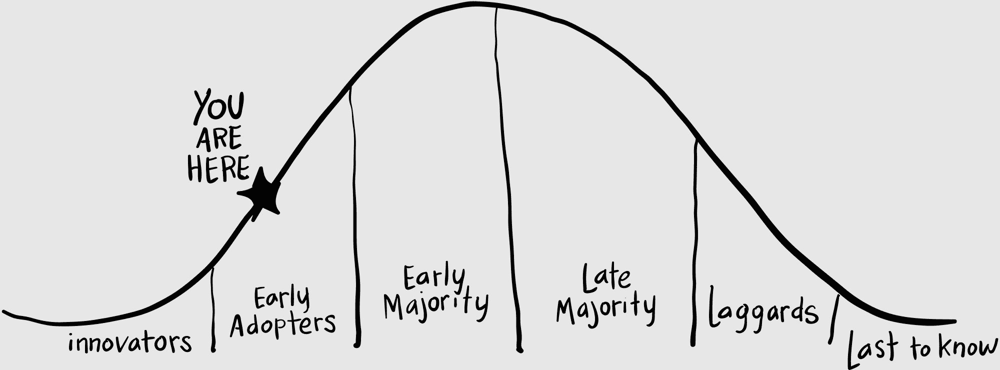

## CHAPTER 8

## 永远不要投资超过你负担得起损失的金额

银行总部看起来像一座未来主义的城堡。

这座钢铁和玻璃摩天大楼的某处有点令人不安。可能是天线，它们让它看起来像一只巨大的金属昆虫，随时准备攻击。快速移动的暴风云在它不透明的窗户上反射出来，我感到一种恐惧感。

我问皮特：“她说这次会议我们需要覆盖什么内容了吗？”我们在安检台登记时。

“没什么。”皮特透过眼镜看着安检台上的屏幕。“那上面写了什么？”

“你得扫描你的驾照。”

皮特不相信地笑了起来：“开个会？”即使时差还没倒过来，他还是保持着幽默感。

“这里可不是开玩笑的。”

我们称他们为“银行客户”，但他们是一家控制着超过 2 万亿美元财富的多国资产管理公司。2 万亿美元很难想象——这是一串延伸到地球到太阳再回来的美元钞票——但当你走进会议室时，你会有一种感觉。

“哇，”皮特低声说。

最深刻的印象是那张巨大的会议桌，足够大，可以容纳法学院校友聚会，上面镶嵌着对比木质的图案：枫木、乌木和榆木。这张会议桌本身就可以是我们的老板。

更令人敬畏的是我们的客户。她穿着阿玛尼商务套装和淡紫色围巾，头发和化妆完美，坐在桌子的尽头，在笔记本电脑上打字。“你好，约翰。你好，彼得。”她没有站起来。

“宋英。”我微笑着沿着桌子走去，经过了无数的皮椅，放下我的包。“嘿，真巧。我昨天在宜家看到了这张完全一样的会议桌。”

宋英问：“真的吗？”但没有抬头。

皮特快死了；我们交换了一下眼神。

皮特说：“很高兴来这里，”一边打开他的笔记本电脑。“日程安排是什么？”

“让我用视频会议把他们叫进来。”皮特和我交换了一下眼神，都想到了同样的事情：我们本可以用视频会议的？

宋英敲了敲键盘，覆盖远处墙面的视频屏幕开始发出柔和的蓝色。很难不被 Sooyoung 胸针上的银行标志形状和手指上的钻石吸引——更不用说那颗钻石，那足以照亮一个迪斯科舞厅。

另一个会议室在屏幕上活跃起来。我们看到三四个正在笔记本电脑上打字的人。摄像机的放置很糟糕，所以我们是从一个小孩子的角度看到他们的。

宋英说：“好的，我这边有伦敦的合规团队。大家好！”她愉快地挥了挥手。

伦敦的每个人都打招呼，但没有抬头。我觉得自己被压倒了。我瞥了一眼二十二楼的窗户，天空正在变黑。如果我要跳下去，我首先得打破安全玻璃。

“这就是媒体淋浴团队，他们现在会讨论区块链文章系列。”

“当然，”我开始说。

“我们有些担忧，”一位穿黄色领带的英国人插嘴说。“有太多的承诺性语言。你不能说，‘你将拥有这些代币’；你可以说，‘你可能拥有这些代币。’你不能说，‘这很可能是笔好投资’；你可以说，‘这可能是一笔好投资。’”

“明白了，”皮特同意。“没问题。”

“‘永远不要投资超过你愿意损失的金额’，”他布道，“应该是‘永远不要投资超过你能承受损失的金额’。他翻阅着自己的文件夹，用铅笔勾画出每一个要点。‘每一篇文章。’”

“你用的词有些太多，”秀英接着说。“比如‘的’。的，的，的！你为什么需要这么多？”

“你以前为金融客户写过文章吗？”我们的英国朋友问。“这些都是很标准的。”

“实际上，我们有自己的金融网站，比特币市场期刊，”我回应道。

“你写关于比特币？”他身体向前倾，靠近摄像头。鱼眼网络摄像头让他看起来像个卡通跟踪狂。

“这是我们的专长之一。”

“不，不，不，”他笑了。“我们绝对不能写任何与比特币有关的的东西。”

“我们不是为你写这个。”我擦了擦眼睛。“那是我们的网站。”

“你为什么有这么多字？”秀英打断道。“网络上的人们不想阅读。他们想要简洁，短小精悍。”

“你雇佣我们来写文章，”我尖刻地说。皮特轻轻地碰了碰我的手臂。

“比特币是毒品交易和庞氏骗局，”英国人继续说。“区块链是技术。我们有一个整个团队在研究区块链。二十五个专利。认真说，伙计们，没有比特币。”

我叹了口气，摇了摇头。“你们错过了 . . 。”我说。

“我们不是在写比特币。”皮特向每个人露出安心的微笑。“我们可以调整语言，秀英。我们会缩短文章，并尽可能多地去掉‘的’。都好吗？”

“好，”秀英说。“谢谢大家！”她合上笔记本电脑，站了起来。

“还有别的吗？”我问。

“没有了，”她回答，抚平了自己的西装。“谢谢你来。很高兴见到你！”

“呃，在我们走之前，”我胆怯地问，“我们有些付款问题。”

“你跟财务部谈谈了吗？”

“我的妻子，翠儿，已经联系过我好几次了，”我证实道。“我们还没有收到报酬。”

“好吧。我会调查的。你知道怎么出去吗？”

“会议室的尽头，然后左转，”我说，微笑着。

“回头见！”她唱着歌。 “再见！”

### 时机至关重要

你可能熟悉技术采用曲线，这是由埃弗雷特·M·罗杰斯在 1995 年的书《创新扩散》中普及的。它解释了技术如何在社会中得到普及。

在最左边，你是那些购买第一代 iPhone 的极客。然后是早期采用者，他们购买第二代。然后是其他人。然后在最右边，是你的祖父母。

任何新技术的关键问题是：我们在采用曲线上处于什么位置？在 1990 年代中期，每个人都预测虚拟现实就在眼前。我花了很多小时把我的第一台电脑黑成自制 VR 装置。现在，几十年后，我仍在等待合适的 VR。

其他技术似乎是自发地进入世界的，肚皮朝下跳入社会。谁会预测到推特或者腾讯呢？

我相信我们正处于区块链的“创新者”或“早期采用者”阶段。我们都同意这项技术还没有达到“大多数人”。但那波机会确实正在到来，当它到来时，你希望自己在哪里？

回到大厅时，皮特和我把我们的徽章交给了保安。“嘿，约翰，”皮特说，突然严肃起来。“永远不要投资超过你能承受损失的金额。”

我摇了摇头。“我觉得我们躲过了一颗子弹。”

“我还以为你要开枪呢！”他笑着说。“叫个优步吧。外面太糟糕了。”他透过眼镜看着他的手机。

我坐在斯堪的纳维亚式休息室的椅子上。在我对面挂着一幅原始的班克斯作品，是喷漆在钢铁上的。 “我们必须进化，皮特。”

“我们可以开始一个比特币交易所，”皮特提议。“那些生意正在赚钱。”

我哼了一声。

“想想吧！”他挥着手。“人们买卖这些币。每天交易数十亿美元。每笔交易，你都能分一杯羹。你什么都不用做！”

但这仍然是一个集中的系统。你必须建立一个交易所。这需要花费数百万美元。

“所以我们就筹钱！”皮特毫不气馁。“我们发行自己的币，人们买了它，我们用那些钱来建立交易所。你看到这些币筹集了多少钱了吗？”

“我认为我们应该做区块链分析报告，”我建议道。“就像晨星公司。那些人给所有的共同基金打分。他们很大。就这样做，但针对替代币。”

“我想我们可以做定制的区块链研究，”皮特即兴发挥。“公司雇佣我们来看区块链市场，比如，医疗保健。就像德勤。”他检查了一下手机。“优步到了。”

当我们冲进雨中时，我的心情奇怪地变得愉快起来。我确信前方有一个充满机会的海洋，只要我们能够驶过公海。

唯一的问题是：我们还没有得到付款。
