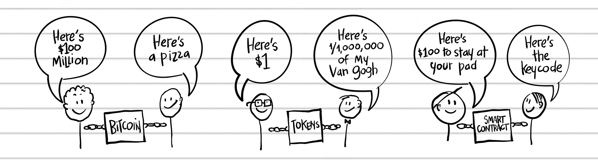

## SUMMARY

让我们总结一下我们迄今为止学到的关于区块链的知识，以便您可以在第二部分准备好迎接投资者兴奋的浪潮。

 价值互联网。区块链可以与互联网相提并论。虽然互联网让我们分享信息，区块链让我们分享价值。

 区块链是一项技术。正如互联网是一项建立在之上网站的技术，区块链是建立在之上的这些资产的技术：

三种类别：数字货币、代币和智能合约。

 天空中的巨大支票簿。区块链的核心是一个分布式账本，一种“全球支票簿”或共享的谷歌电子表格，我们共同保持其平衡。

 比特币催生了区块链。比特币是由神秘的比特币创始人中本聪创造的数字货币，他放弃了这笔财富，成为了传奇故事。

 数字货币紧随其后。比特币的爆炸性成功引发了几百种新的加密货币，或称为“山寨币”（bitcoin 的替代品）。

 接下来是智能合约。区块链还使“智能合约”成为可能，这种合约允许从未见面的人彼此信任。（参见第 73 页的区块链气球玩偶。）

 区块链资产有价值。这在与 1000 万美元披萨（参见第 35 页）一起，证明了 altcoins 的新经济体——目前在数字交易所上交易，这是一个新的纽约证券交易所。（在撰写本文时，顶级交易所包括币安、比特坊、Kraken、Bitstamp 和 Coinbase。）

 任何人都可以投资。区块链的美丽之处在于，任何人都可以购买比特币，或数百种其他的替代币。虽然它们被设计成货币，但它们表现得更像股票。（我们稍后将进一步介绍逐步投资策略。）

 别被吓到。你不需要理解空气动力学就能乘坐飞机；你不需要成为区块链开发者就能进行投资。只需成为一个学习海绵。吸收它！
