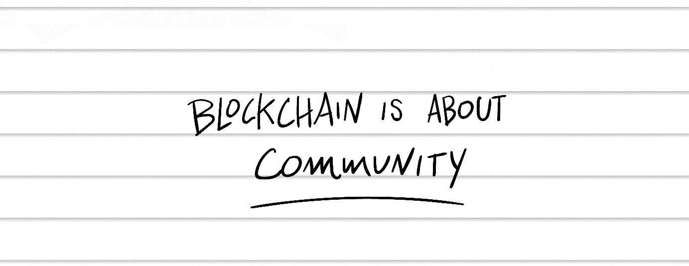
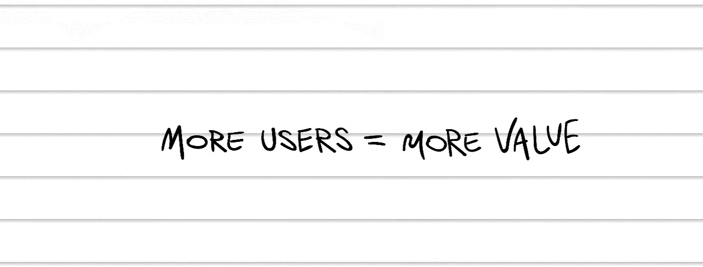
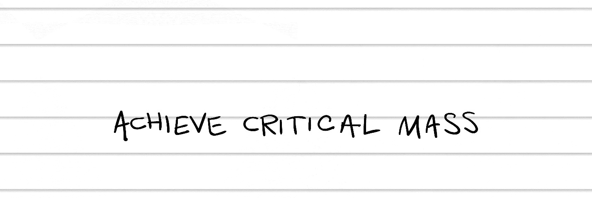

## 第十二章

## 加拿大尤达

几周后，我发现自己在硅谷的区块链博览会。那里的场面就像动物园一样。

他们的时机再好不过了，因为单个比特币的价格前一天刚刚突破 10,000 美元。一夜间，就像一个开关被切换了一样。不仅仅是比特币，整个数字资产市场——所有的山寨币——都在飞速上涨。

皮特和我加入了涌入圣克拉拉会议中心的约十万名参会者，该会议中心位于旧金山以南大约一个小时车程的地方。我扫了一眼胸前的名牌：纳斯达克。美国银行。星巴克。IBM。都是重量级的大人物。

这次皮特和我不再是站在展位前，而是去访问参展商的展位。当门打开时，人群蜂拥而入，我几乎无法移动。

“这太难以置信了，”皮特笑着指着 endless rows of blockchain startups 说。“我们从哪里开始？”

“如果你看到那个带着电刺激器的俄罗斯女人，”我大喊道，“快跑！”

我们正在寻找区块链的杀手级应用，但结果我们找到的都是一些填充应用。也就是说，每个人都有一个推销词，但没有人有真正的产品。每个人都正在推出新的代币，每个人都希望你投资。

“我们正在推出一个区块链预测市场，”一个典型的创业者——一个穿着紫色天鹅绒西装的年轻巴西人——向我们推销。“你可以预测任何事情——比如谁将赢得下一场选举——然后你为你的预测下注代币。这一切都存储在区块链上。”

“所以这是一个赌博平台，”我澄清道。

“预测市场，”他重复道。“现在你可以以五折的价格购买我们的代币。”

“你们有这个预测市场 built 吗？”皮特问。

“不，我们现在正在筹集资金。我们的目标是 5000 万美元。”

五千万！两千万！三千五百万！经过这几次的交谈，我们对这些数字已经麻木了。

“疯狂的是他们实际上正在筹集资金，”我告诉皮特。我们坐在舞台附近的观众席上，等待主要演讲开始。

“所以你有了所有这些购买区块链代币的人，”皮特观察到，“他们的目标是等到价格上涨时就卖掉。”

“这就好比是在一家热门科技公司上市前成为其早期投资者。不过，这里不是首次公开募股，而是首次代币发行。”我喝了一口咖啡。“我认为 ICO 是我们第一个杀手级应用。”

### 《如何不经营业务筹集 200 亿美元》

我们称之为“首次公开募股”，因为最终都是公众在为此埋单。

为了了解华尔街的弊端，只需看看 Snap Inc.的 IPO 就知道了，这家社交媒体公司在 2017 年 3 月向公众推出了其股票\. Snap 最初是 Snapchat，一个人们可以相互发送照片的社交媒体应用，照片在查看后自动删除。

阅后即焚的应用 Snapchat 很快在青少年中流行起来，其中许多人用这个应用互相发送裸照。“色情信息，色情信息，色情信息。这是第一年的主题。”Snap 的早期投资者之一杰里米·刘说。^(16)

刘的参与吸引了其他硅谷风险投资公司，包括 Benchmark 和 General Catalyst。随着 Snap 的用户基础增长，人们开始用这个应用发送不仅仅是裸照，其他投资公司也开始加入。

当 Snap 进行首次公开募股时，普通投资者渴望投资这家热门的年轻公司。在其第一天交易中，股价开盘价为每股 24 美元，使 Snap 的总市值达到约 200 亿美元，与长期存在的万豪和塔吉特等公司相当。^(17)

与此同时，高管和早期投资者迅速出售了约 9.35 亿美元的股份。^(18)明确地说，他们将部分股份卖给公众，公众买了进去。

问题是，Snap 正在大量消耗现金。

公司没有盈利；事实上，它最近一年以 5.15 亿美元的亏损告终。它刚刚涉足硬件，推出了带有内置相机的太阳镜；这款产品最终未能成功。^(19)最终，它重新设计了其消息应用，导致忠诚的用户退出服务。^(20)

人们为什么要投资这个公司？

这绝不是一个孤例；这就是华尔街的运作方式。IPO 可能代表“它可能定价过高”。而且它是有意被高估的，这样早期投资者就可以盈利卖出他们的股票。

美国证券交易委员会负责监管股市，在其网站上甚至写道：“除非确定投资适合你，否则公司不会向你出售 IPO 股份。”^(21)换句话说，公司决定了谁可以投资。

有了区块链，我们有机会民主化投资。

想象一下一个初创公司、一个 Kickstarter 活动和一个传统 IPO 的结合体。像初创公司一样，任何人都可以早期投资一个新的区块链项目。像 Kickstarter 一样，它是众筹的。像 IPO 一样，投资者会收到基于区块链的代币（比如我们的 Van Toghken）作为股票一样使用。

这些早期的初始币发行（ICO）有两个问题。首先，没有人确切知道它们是否合法。如果它们是股票，它们将像股票一样受到监管——但它们不是股票。或者它们是吗？这种不确定性后来造成了很大的麻烦，我们将在第三部分看到。

第二，你真正买的是什么？比特币有价值，因为它有数百万用户。但是你在新公司购买代币，这家公司没有产品，没有用户，而且你甚至不拥有这家公司？

在一个完美的世界里，这些代币将完全像股票一样运作。在传统投资中，如果你购买了特斯拉的股份，你拥有特斯拉的一小部分。如果你购买了特斯拉的大部分，你可以告诉埃隆·马斯克如何管理特斯拉。（祝你好运。）

在一个完美的世界里，如果你正在创立一家区块链公司，你会提供基于区块链的代币，这些代币记录了谁拥有你公司的股份。每当有人购买或出售股份时，这个记录就会保存在分布式账本上，那片天空中伟大的记账本上。

例如，一个天使投资者投入了 10 万美元，作为回报，你同意将公司 10%的股份转让给他。你的公司现在估值为 100 万美元（或者 10 万美元乘以 10）。为了简单起见，让我们说你创建了 100 万股代币，并将 10 万股代币转交给投资者的数字钱包。

投资者拥有传统股东的所有权利。我们在现有的法律框架内工作，使用风险投资家和投资者已经使用了多年的模式。但我们将其向前推进了一步，走到了区块链上。

智能股票：记录在区块链上的股票，让你真正拥有公司的股份。

区块链投资者必须询问代币是否赋予对公司股份的拥有权。如果不是，要求了解是什么赋予代币价值。

将这些代币视为智能股票，可以编程在未来做些酷的事情。因为这是计算机代码——而不是一张纸质的股票证书——这些股票将能够做更多的事情，比如让股东更容易组织并投票。权力属于人民。

一个戴着棒球帽和牛仔裤的男子蹒跚地走上舞台。“我们下一个演讲者，”他含糊地读着手中的纸条，“是区块链新闻的创始人，一位获奖的出版商，以及企业家……”他在这个词上绊了一下。“On-tep……on-tree……on-treepee……manure（企业家）。”

皮特捂着肚子，静静地颤抖着。“那是音响师吗？”他正从眼镜下面擦眼睛。

我意识到他是对的：操作调音台的人也在做介绍。“也许他们的主持人没来。”

“你应该上去做介绍，”他低声说，指了指舞台。我感到一阵肾上腺素激增。他是对的！

音响师慈悲地完成了介绍，“请欢迎，理查德·卡斯特莱因。”

这是我第一次瞥见将成为我们尤达大师的人。他看起来一点也不像尤达：一个穿着黑色 T 恤和黑色裤子的魁梧男子，他的黑色头发向后梳成一个冲浪者的波浪。他的声音一点也不像尤达：加拿大口音浓重得像枫糖浆。

理查德开始说：“我有一些令人兴奋的消息要告诉你们关于今天早上，我们刚刚宣布收购了我们的媒体出版物，区块链新闻。”掌声。

我对皮特说，“那是个好兆头，”我想到了我们自己的媒体出版物，比特币市场期刊。

“但是今天早上，”理查德开始说，“我想谈谈社区。当你考虑什么使一个区块链有价值，什么使这个或那个代币是好的投资时，它真的归结于社区。”

我拿出我的 Moleskine 笔记本写道：

“我差不多跟进这个领域两年了，”他继续说，“我发现最宝贵的代币是大多数人拥有的代币。这很合理！谁想投资只有少数客户的公司？你想要成千上万的客户。”

我写道：

理查德继续说：“现在，今天展览会上有很多新的代币发行。但挑战将在于建立这些社区。所有的大硬币——比特币、以太坊、瑞波币——它们已经存在了好几年，它们有了这个关键的质量。它们已经经历了 PRO-cess。”

“代币需要时间，”我低声说，同时飞快地写着。他的话听起来很有道理：随着更多的人加入你的区块链或者购买你的代币，你自然拥有更大的买家和卖家市场。然后我写道：

“我帮助了很多这些区块链项目起步，”理查德主动提出，“所以如果有人想谈论如何建立这些用户社区，我今天都在。我会在 common area 那边。谢谢。”

“我们必须和这个人谈谈，”我对皮特说，同时鼓起掌来。

“我们走吧，嗯？”皮特说，站了起来。

剩下的时间里，我们在 common area 的桌子旁徘徊，那里理查德·卡斯特莱因正在举行公开办公时间。他坐在那里几个小时，与络绎不绝的区块链企业家和高管交谈。

最后，我再也无法忍受，径直坐在了桌旁，未经邀请。ALYB。“嘿，大家，”我愉快地打断说，“约翰。”我握手时把皮特也叫了过来。“我的同事皮特。”

“嘿，大家，这是……。”理查德向桌子对面的严肃年轻人示意。

“安杰伊，”年轻人回答。我瞥了一眼他的名牌。乌克兰。

理查德告诉我们：“时机正好。我们正要结束。所以，安杰伊，如果你有任何关于那个的问题，就给我发电子邮件。”

“我谢谢你，”安杰伊点头说。我们看着他走开。

“那有很多辅音，”我评论道。

理查德笑了。“区块链无处不在。”

“恭喜你卖出 Blockchain News，”皮特开始说。

“谢谢。它还在 PRO-cess 中，但我对这个售价很满意。”他轻松地告诉我们这个数字，就像他在告诉我们时间。“当然，我为它写了几乎六百篇文章，熬夜到凌晨两点，就我一个人在我的驳船上，但还不错，嗯？”

“你住在一条驳船上？”皮特笑了。

“从技术上讲，它是一艘游艇。”

“一艘游艇，”我重复道。

“是的，我喜欢船。过去是一名旅行作家，环游世界。有一天有人用比特币支付我，由于我总是在各国之间奔波，这很合理。无国界的货币！我被这个病毒咬了，你知道，开始了区块链新闻。”

“理查德，我们的区块链出版物增长得像疯了一样。我们如何将其提升到下一个层次？”

“现在？”他叹了口气。“竞争激烈。每个人都正在推出区块链网站。”

“那自己发行代币呢？”我问。“发行代币需要多少钱？”

“这些代币销售越来越贵，”他透露。“法律、市场营销……我计划至少需要一百万美元。”

“一开始需要一百万美元，”皮特澄清道，“但之后你就可以筹集，比如，5000 万美元，对吧？”

“当然，如果你能脱颖而出。”他指了指我们周围的展位。每个人都在发行新的代币。印钞票。“这越来越昂贵了，”他继续说，“有些人不仅仅是做代币销售。他们先进行预售来筹集做销售的钱。有时还有预预售。”

现在我觉得我们不是太早，而是太晚了。噪音、人群——还有混乱——突然变得让人承受不住。“对这个游戏新手来说，你有什么最好的建议？”我问。

“建立社区，”他重点强调。“建立社区，然后找到增加价值的方法。区块链就像一个广阔开阔的田野。那里就像等着被耕种的肥沃土壤。”他在手心里揉碎虚构的土壤。“而且要有厚脸皮。”

在我的 Moleskine 笔记本上，我用大写字母写下：“建立社区。”但正如我很快发现的，我还应该写上：“增厚脸皮。”
