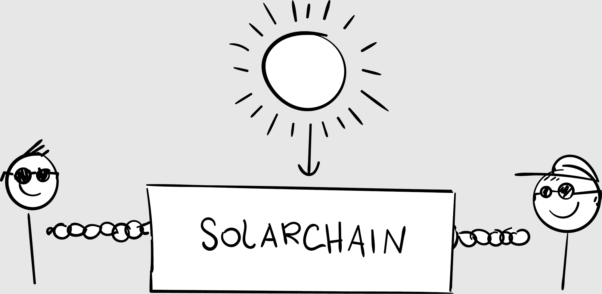

## 第十三章

## 人民至上，人民当家

我对举办我们第一次区块链投资者会议感到兴奋。比特币的价格接近 20,000 美元，我的初始投资翻了 150 多倍。不仅仅是比特币：任何区块链都在涌现金。我们的时机太完美了！

“让我们开始吧！”我宣布，打开 overhead projector。人们开始找座位坐下。

“欢迎！”我开始说。“我是来自比特币市场期刊的约翰·哈格雷夫。首先，非常感谢 TechLab 提供的场地！”社区负责人本尼迪克特会说几句话。

本尼迪克特接过麦克风。“欢迎来到 TechLab，波士顿最好的科技共享办公空间。”他指着咖啡吧、足球桌和写着“你行”的励志海报。“一个月的会员资格让你加入我们自由职业者、远程工作者和科技初创公司的社区。”

“这个领域太棒了，”我四周看了看，兴奋地说。“这就像在谷歌工作，但不需要你多聪明。”一些人笑了。

“如果你想加入，会后找我。”本尼迪克特把麦克风递回来。

“透明度很重要，”我告诉我们的几十个与会者，“所以让我首先告诉你们，我是比特币、以太坊和瑞波币的投资者。有多少人持有比特币？”

大部分人都举手了。

“比特币是入门毒品，”我说，引起一阵笑声。“让我们介绍一下自己以及我们是怎样进入区块链的，”我建议。“我很想了解更多关于‘典型’的比特币投资者。”

我很快发现并没有所谓的平均水平。

有黛安娜，在家工作的妈妈；特拉维斯，持牌房地产经纪人；哈娜恩，科技企业家；卡尔，项目经理；詹妮弗，学生；罗布，医生。还有彼得，前男模，成功转型金融领域。

还有我，喜剧作家转行成为区块链投资者。我吞了吞口水。

“区块链投资者长什么样？”我开始说，打开我的 PowerPoint。“看看周围！区块链投资者遍布各地。字面上！我们年龄各异，来自世界各地，男女老少，形形色色。”几个人笑了。

“但个性上，我们有三点共同之处：

 我们是早期采用者。我们愿意在其他人之前跳进去——这是许多成功投资者赚取财富的方式。我们是创新者和先锋。

 我们是技术友好型。投资区块链需要一定水平的科技熟练度。我们热爱科技。我们拥抱内心的极客。

 我们是终身学习者。我们热爱学习！对学习的上瘾是我可以大力推荐的唯一的瘾。

“这能体现你们的真实情况吗？”我问。点头表示同意。我推进了我的幻灯片。

“我们正处在历史的独特时刻，因为区块链正在改变投资的规则。而规则确实需要改变！

 每个人都应该能够投资他们关心的公司——不仅仅是富人。

 每个人都应该能够投资任何金额——没有最低限额。

 每个人都应该能够同时投资——没有为特权阶层提供的早鸟折扣。

我继续说：“民主的原则是一个人，一票。投资就是用你的钱投票。规则不应该是一样的吗？”

沉默。

“所以，呃……等一下。”我转向皮特小声说：“我们带了援助材料吗？”

“我以为你带来了。”

“那我们……我们打开笔记本电脑，”我犹豫不决，“查看我们第一个区块链项目 Swytch 的网站。现在，谁阅读了他们的材料？”

有几个人举手了。

我小声对皮特说：“看看我的包。”

“Swytch 是一个太阳能代币，”布兰登提出意见，他是一个二十多岁的年轻人，自我介绍为“独立区块链投资者”，这意味着他购买了足够的比特币，可以辞职全职只做投资。“你因为产生太阳能而获得 Swytch 代币。”

“我觉得 Swytch 更像碳信用，”亨利提出意见，他是一位前银行高管。“你的太阳能电池组产生电力，你可以在这个太阳能市场出售它，就像碳信用一样。所有交易都记录在区块链上，所以没有公司或国家拥有这些数据——我们都有。”

皮特摇了摇头。没有援助。

“还有其他想法吗？”沉默。我不敢相信其他人没有阅读材料。来吧，我告诉自己，你曾经做过即兴表演。随机应变。

我开始说：“是的，而且，我对太阳能非常乐观。让我给你讲个故事。”

### 让世界转向太阳能

几年前，我和妻子在我们房子的屋顶上安装了一个巨大的太阳能电池组。我们很幸运，地理位置很完美：南向，有一个宽敞平坦的屋顶，阳光充足。

但是决定投资太阳能并不容易。我们为此犹豫了几年。这很昂贵。这很耗时。而且太阳只会在未来五亿年左右存在。

我们还是投资了，而且从未回头。你无法想象自己产生太阳能感觉有多好。在一个晴朗的夏日早晨醒来，看到太阳正在照耀：这就像天空中的一张又大又温暖的工资支票。

收到“负能量账单”的感觉真的很神奇，这时你正在向电力公司出售电力。那些面板每天都在赚钱。零努力。太阳在做工作！

我们非常喜欢太阳能，以至于我们最近换成了电动汽车。这也是一个重大的决定。每个人首先问的问题是：“但是续航里程是多少？”每个人都担心电量耗尽，就像人们从马车换成汽车时可能也会有同样的担忧。

你不会用完电的。你 90%的驾驶是短途跳跃。如果你需要进行一次横穿国家的公路旅行，那就是你为什么有第二辆车的原因。晚上，你就像给手机充电一样，把你的电动汽车插上。你的车是一个设备。

现在，太阳正在为我们的家、我们的设备和我们的大众汽车提供动力。我们依赖太阳。一旦你进行了转变，你就会意识到太阳能就是常识。当太阳完全免费时，你为什么要用其他方式呢？

我想要一个小盒子，可以附在你的太阳能板上，每次你产生一度电时，就会生成一个区块链代币。我们称之为 SolarCoin。这些代币将有真正的价值，因为其他人——比如你的邻居——可以用 SolarCoin 购买你的电。 （电能长途旅行会损失，所以购买新鲜本地电能更便宜。）

这个想法与碳信用类似，碳信用用于激励公司——或整个国家——减少污染。投资于减少温室气体排放的国家可以向污染更多的国家出售它们的额外碳信用。碳信用是有效的。^(22)

当我看向我们的屋顶时，我思考着有多少太阳能被浪费了。潜在的能源几乎是无限的，却被树木和意大利游客吸收了。为了石油而斗争——付出如此高的血和钱的代价——当你考虑到将意志力投入到太阳能的替代方案时，显得荒谬。让我们把我们的精力投入到能源上。

能源消耗：比特币和其他加密货币需要“挖矿设备”，或者高性能计算机，来运行分布式网络。这些设备消耗大量的电力。

减少这种能源消耗是区块链今天面临的主要挑战之一。（我们正在处理。）

“想想那些数据！”产品经理 Kuppu 说，“把所有那些太阳能数据存储在区块链上可以告诉我们哪些地区用电最多。或者季节变化。或者随着时间的推移的变化。所有这些新兴业务都会涌现出来，为公司和政府分析这些数据。”

“对。”我指着他，“我们将能够构建新的解决方案来服务于——或节约——世界上最需要能源的地方。”

“我们在区块链上最大的问题之一是能源消耗，”工程师 Frank 说，“仅运行比特币所需的能量就能实际为一个小型国家供电。^(23)所以我持怀疑态度。看来这些能源代币只会消耗更多的能源。”

“那么，如果我们生产的多于我们使用的呢？”我问。

“力量产生力量，”说这话的是经济学专业的大学生凯文。“电力驱动经济：你需要电力来制造东西。电力引发战争：当你没有电力时，你为石油而战。电力统治世界：当你掌握电力资源时，你拥有地球。但每个人都有太阳。”

现在我们开始热闹起来了。有些人喜欢这个项目；有些人讨厌它。但只要他们愿意，每个人都可以参与进来。

“有多少人愿意个人投资这个区块链项目？”我问，我们举手统计。“有多少人会拒绝？”皮特迅速在 Excel 中统计数据，并将结果投屏显示。

“有很多问题，”我总结道。“那么为什么不问这个项目的幕后推手呢？女士们、先生们，安德鲁·皮尔逊斯，Swytch 的总经理！”我挥了挥手，指向角落里一直静静地坐着的年轻人。他微笑着挥了挥手。

在我的想象中，这才是重头戏。我想象了一个舞台，一个现场工作室观众，三个聚光灯横扫到安德鲁身上。一个乐队会开始演奏，观众会惊呼。每一集都会有像这样的小惊喜时刻。

然而，我听到的却是几声叹息。有些人真的对这个项目进行了诋毁。

安德鲁很亲切。“区块链有潜力使能源生产更清洁、更便宜、更具弹性。”他微笑着说。“在 Swytch，我们正在建立一个更好的、基于区块链的太阳能市场，这将鼓励更多的人转向太阳能。”

“想象一下，在这个世纪把整个人类都转向太阳能，”我总结道。“有了区块链，这就在我们触手可及的范围之内。感谢大家的到来，各位。”

沉默。

“我们到此为止吧，”我澄清道。

人们开始四处走动，本尼迪克特走了过来。“人挺多的，”他握手时说，本尼迪克特三十多岁，长得几乎不可能这么帅，牙齿完美无瑕，白得发亮，精准排列，就像是在实验室里制造出来的一样。

“嗯，区块链很热门，”我回答，太害羞了以至于无法微笑。

“这就是我想谈谈的原因。我们在市区开设了一家新的 TechLab 办公室，”他告诉我。“我们最大的办公室。八层。”

“这太疯狂了。”

“是的。亚马逊已经占据了一层楼。微软也即将占据另一层。”

“所以这些公司可以简单地通过租用楼层来在波士顿设立办公室。你们处理一切事务。”

“宾果。”他指着我。

一个想法闪过我的脑海。“嘿，为什么不把一整层都用来做区块链呢？”

“正是这样，”他说。“我负责填满这个新办公室。我认为我们可以合作。”

“它就像一个区块链孵化器，”我点头说。

“所有这些区块链初创公司，区块链投资者，区块链公司......这可能就是这个地方。”

“成交，”我说。“毫无悬念。这对波士顿来说是个好事。对区块链也是件好事。”

“我们谈谈吧，”他说，递给我他的名片，并冲我露出汤姆·克鲁斯的微笑。

“让我们大卖吧！”

结果那晚结束时比开始时还要疯狂。离开家庭办公室，进入了区块链世界！我们第一次真正的合作伙伴关系！然后我检查了我的电子邮件。

收件人：约翰·哈格雷夫

主题：您的“投资者”活动

哈格雷夫先生：作为一名认证财务规划师，我被几位客户问到关于比特币的问题，所以我决定亲自了解这一切的炒作是什么。我非常失望，所以提前离开了。

给出财务建议是非常不负责任和危险的。您没有资格证书。没有免责声明。没有警告。很明显比特币正处于泡沫中，您的“投资者”将失去一切。因为他们不是投资者，他们是投机者。

您的[原文如此]正是我们为了成为 CFP 而学习超过 1000 小时的原因。我知道那是您的第一次聚会。我希望那是您的最后一次。

我发现 Jade 正在清理披萨盒。“我们今晚花了多少钱？”我问。

她说：“大约 1000 美元。食物、饮料、租赁、打印……尽管其中一些打印可以摊销。”她计算着。“968 美元左右。我觉得还不错， though。”

“读这个。”我把我的手机给她。

“嗯，他有点道理。”她递回了我的手机，继续打扫。

这封电子邮件真的让我心情变差。即使比特币的价格飙升，它也让我回到了现实，带来了一丝疑惑。这是本在扑克之夜最初提出的问题：这一切是不是一场赌博？
