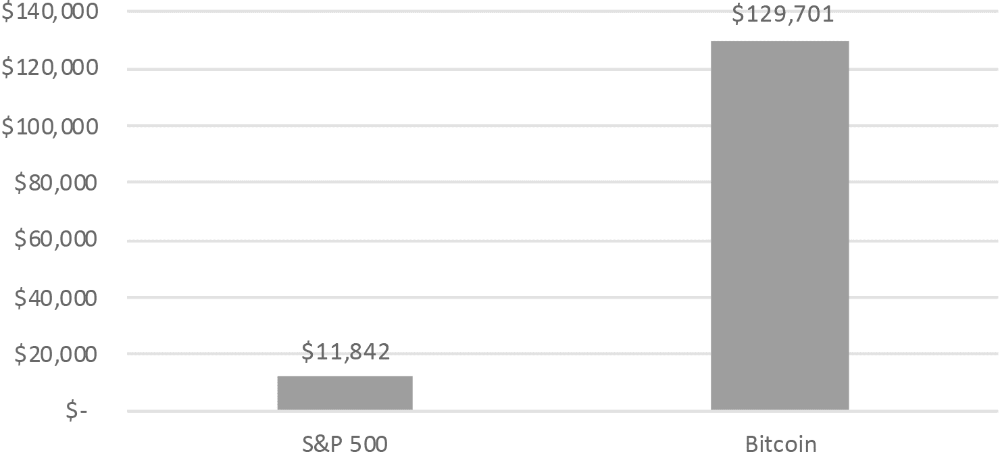

## 第十五章

## 《喜剧经济学家》

“欢迎来到波士顿的区块链区，”我用手势戏剧性地一挥说。“它以前被称为金融区，但我们昨天改了名字。”我允许这群人在十五楼欣赏一下壮丽的景色。“这边走！”

我们带领着一队金融高管和对冲基金经理参观了 TechLab 的新空间。“通过这扇门，我的朋友们，是我们区块链孵化器的跳动心脏。我们称之为区块链孵化器，因为我们正在区块链上培养婴儿。

“这是我们的比特币实时报价显示屏——看起来今天下跌了——和市值前十的加密货币。那边是我们的区块链咨询公司、区块链投资公司和区块链交易公司。这些人在这里设置了二十五个显示器。他们这周结束时会有肿瘤。

“这是我们新的电视演播室，下面是区块链初创企业区。作为一个恶作剧，这些家伙把这个办公室填满了果冻，从地板到天花板。一团糟。这件事其实没有发生，但我多么希望它发生了。还有……我们到了，区块链简报室。”

在过去的一个月里，我一直在给这个团队做导游，我们在开业前卖掉了 TechLab 整个楼层。通常这个导游能引发更多的笑声。

“区块链。”我开始在投影仪上做介绍。“它正在构建新一代的财富和权力，新一代的区块链亿万富翁。我们称他们为‘鲸鱼’，因为他们在数字货币市场上制造波动的能力。此外，他们中的许多人都有很大的喷气孔。”

掌声。在我脑海中，这很受欢迎。在这个房间里，它死了。富达投资的那些人正在看着他们的笔记本电脑。

“让我给你们展示一下 HBO 的约翰·奥利弗关于区块链的入门介绍。”这位脱口秀主持人最近做了一个非常有趣的关于比特币的片段，我在投影屏幕上给他们展示了一个摘录。^(28)声音没有正确播放，视频一直在缓冲。没有笑声。

“区块链正在改变你的工作，因为它正在改变货币。说到改变货币”——我从钱包里拿出一张二十美元的钞票——“谁能帮我换零？”这在一个小时前是很好笑的。“没有？只有百元大钞？”

“我想我明白了，”会议室后排的一个对冲基金管理员数着一些钞票说。

“算了吧。”这感觉像是被湿鳕鱼打了一巴掌。“我们来谈谈货币性质的变化。”我展示了一张扑克筹码的图片。

“这是一个思想实验。想象你生活在一个国家，官方货币是扑克筹码。现在想象一下你的扑克筹码经济经历大规模通货膨胀。上个月一个三明治需要两枚扑克筹码；这个月需要四枚。你原本打算用一千枚筹码买的汽车现在售价为两千枚。

“经过几年的通货膨胀，你挣扎着求生。你负担不起吃饭的费用。所以政府开始铸造新颜色的扑克筹码，每个价值旧筹码的一千倍。这样应该可以解决问题了吧？现在两个筹码的三明治要两千筹码，但所有筹码的价值都翻了一千倍。它仍然是两个筹码！”

“不是这样的，”对冲基金经理低头看着他的手机说。

“没错。熟食店主仍然没有足够的收入来支付他的成本，所以他又提高了价格。现在两千筹码的三明治变成了两百万筹码的三明治。最终三明治变得如此昂贵，熟食店主开始用钱来称重。现在一个三明治价值两磅的百万美元筹码，这使得它成为了一个亿万美元的三明治。同样的三明治，但没有腌黄瓜。”

“我们明白了，”对冲基金经理说。“超级通货膨胀。”

“对了。那么在一个超级通货膨胀的经济体中，你会怎么做？”

“搬到别的地方去！”这引起了当天第一个真正的笑声。对冲基金经理获得了第一个笑声？

“怎么做到的？”我愤怒地问。“当你几乎连一个三明治的钱都买不起时，你怎么生活？”

“你有很多钱；只是没有任何价值。”

“对。”我努力保持冷静。“现在，当你拿到工资时，你把你手中的扑克筹码换成比特币。它们存放在你的比特币账户里，你的数字钱包里，直到你需要买东西。然后你走到你当地的咖啡店，在那里你遇到了筹码兑换者。

“筹码兑换者很容易辨认，因为他坐在角落里抽烟斗，戴着一顶圆顶礼帽。他用今天的市场汇率购买你的比特币——你像发邮件一样把它转给他——然后他给你筹码。这让你能买杂货或支付税费。即使政府取缔了筹码兑换者，公民们也会开始彼此之间交易比特币。公民们会绕过糟糕的政府。政府会发现它无能为力，无法阻止资金从其漏洞百出的金融体系流出。”

“这正是委内瑞拉发生的事情，”后来我了解到已经购买了比特币的富达投资的一位高管插话说。“他们的货币贬值如此严重，以至于他们用天平称重而不是数出来。”

“不是 Zimbabwe 发行了一万亿美元的钞票吗？”她的一位同事问。

“是的，确实如此，”我回应道。“你可以打赌，这些国家的公民将是第一批转向数字货币的人。”我翻到了一张幻灯片：

| 国家 | 韩克年度通胀率% |
| --- | --- |
| 国家 | 通货膨胀率% |
| 国家 | 通货膨胀率% |
| 国家 | 通货膨胀率% |
| 国家 | 通货膨胀率% |
| 国家 | 通货膨胀率% |
| 国家 | 通货膨胀率% |
| 国家 | 通货膨胀率% |
| 国家 | 通货膨胀率% |
| 国家 | 通货膨胀率% |
| 国家 | 通货膨胀率% |
| 国家 | 健康经济的目标通胀率% |

这个列表来自‘问题货币项目’^(30)，这是约翰霍普金斯大学的史蒂夫·汉克教授的首创。他研究那些无法维持稳定国家货币的国家，那里的货币最终就像扑克筹码一样。但是这些国家的可靠汇率很难找到，所以汉克还使用了来自“筹码交换者”的黑市汇率数据。

“一个国家的货币怎么最后变成了毫无价值的扑克筹码？”我问。

“战争，”对冲基金插嘴说。

“腐败，”富达投资的高级官员提出。

“缺乏国家基础设施，”她的同事说。

“归根结底，这都是信任破裂的问题，”我指出。“当公民对他们的政府失去信心时，他们也会对政府的货币失去信心。这就是数字货币需要的立足点，是允许它们扎根并最终繁荣的人行道裂缝。”

“人们对政府正在失去信任，”我继续说。“我们正在失去对我们金融系统的信任。我们面前的任务是建立对这一新类数字货币的信任。比特币是全球货币，不受任何政府管辖，旨在帮助未银行人口。”

未银行人口：出于不信任或无法获得传统金融机构服务的公民。

区块链通过完全绕过银行，使金融服务对未银行人口可用。

“当我们建立这种信任”——我拉出了我的结束幻灯片——“我们可能会自己成为区块链亿万富翁。这是 2017 年初投资于股市 的$10,000，”我解释说，“与同样 的$10,000 投资于比特币相比。”

### 2017 年投资的$10,000

2017 年 1 月 1 日至 12 月 31 日的回报率。来源：雅虎财经，CoinMarketCap。

“听着，”对冲基金终于放下他的手机说，“比特币是个泡沫。这种疯狂的价格上涨是由投机、恐惧和贪婪驱动的。它会崩溃的。你扑克筹码世界的人只是在用一种不稳定的货币交换另一种。”

整个白天第一次，我安静了下来。然后：“好吧。”这是我机智的回应。“还有其他问题吗？”

大多数高管随后迅速离开了，这让人失望。我猜想他们可能去练习高尔夫球挥杆，或者去给他们的新葡萄酒 cellar 库存。

来自 TechLab 的 Benedict 正在前台工作。他向我露出了那一百千瓦的微笑。“怎么样？”

“我们来的人很多，”我回答说，专注于积极的一面。

“你确定是这样的。这就是我想谈谈的原因。”

“你想把这些培训课程移到一个更大的地方吗？”我充满希望地问。

“不，”他说。“实际上，恰恰相反。管理所有来参加这些活动的人越来越难。我们必须在安全检查处给他们登记，确保会议结束后他们离开。有些人就是一整天都不付日票地在那里闲逛。”他亲切地笑了笑。“这里不是咖啡馆。”

“我会以为你会很兴奋的，”我回应道，对当天事情的转变感到恼火。“看看我们为 TechLab 制造的所有宣传。”

“而且我们也很感激。”贝海姆的微笑从未闪烁过。“但记住：你并不拥有这个地方。”

“不，”我回答，“但记住：我们确实把这个地方填满了。”

贝海姆发出了一声笑声来打破紧张的气氛，然后他伸出了手。“我们都没问题，”我们握手时他说道。

这次谈话让我感到担忧，因为对我们活动的要求每天都在增长。我们是不是正走向麻烦？
