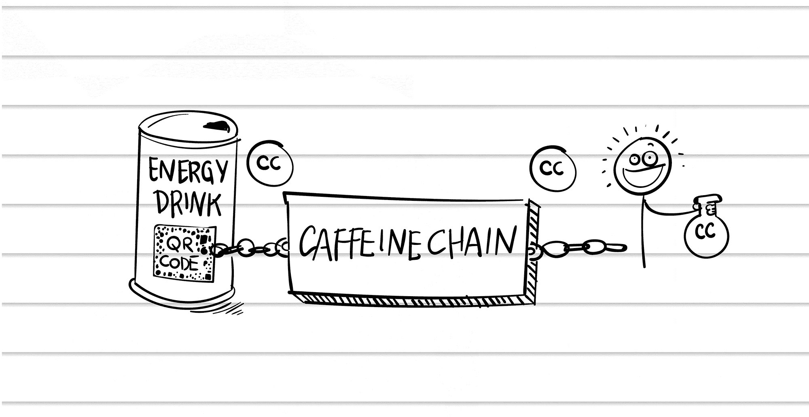

## 第十七章

## 罐子就是货币

“这是一家波兰能量饮料公司，”皮特告诉我。

“一家波兰能量饮料公司，”我愚蠢地重复了一遍。

“像红牛一样。”皮特点头。“但是波兰的。”

“红极。”

我望着我酒店房间的窗户。华沙的冬天，天空是工厂烟雾的颜色。我的身体已经放弃了时区。

“他们真的很想在我们的提案上前进，”皮特在卫星窗边说，“但他们需要先见你。”

“我们谈论的是多少钱？”贾德问，我们的家庭办公室在她的背后可见。

“至少 2.5 万美元。以后还有更多。”

“这是代理工作，皮特，”我叹了口气。

“我们需要这笔生意，”贾德打断说。“宋怡还没有付款。还有……”她停顿了一下。“我们今天又失去了一个客户。”我进一步泄气。

“我们现有的代理客户都在问，‘你们还做代理工作吗？’”皮特说，眼镜上方投去一瞥。“他们去我们的网站，看到的只有区块链，区块链，区块链。”

“就像我们在经营两家公司，”贾德说。“旧代理业务和新的区块链业务。”

“现在是一个奇怪的过渡时期，”我承认。“这就是我今天为什么要与一家波兰能量饮料公司开会的原因。”

皮特大声笑了起来。“我们已经向他们的市场总监做了展示，”他回忆起来。“现在我们只需要向他们的执行团队推销。”

“谁？”

“创始人和 CFO。”大个子和钱袋子。

“你认为他们会先给我能量饮料吗？”我揉了揉眼睛。“我可能需要一罐……或者十二罐。”

* * *

接待员确实给了我一个样品，味道像红牛。这是一个充满活力的时尚白色大堂，里面有装裱起来的年轻人享受高能量活动，如跳舞和做作业的照片。电子音乐从白色的 Bose 音箱中跳动出来。

“这边请。”接待员将我领进了一个单调的会议室，那里有三张阴沉脸色的执行官在等待。这与大堂的鲜明对比让我一时有些不知所措。

“你好！”我热情地问候他们，声音有点太大。能量饮料开始发挥作用。

“约翰。”市场总监点头。“很高兴亲自见到你。这是我的助手，我们的 CFO，巴托斯。”

“很高兴见到你们所有人。”我们握手后，我拿出了我的笔记本电脑。“我进来之前踢了一罐，所以如果我有点紧张，请原谅。”

“是的。”她凝视着我，面无表情。

“说到紧张，”我说，“你这里有没有到屏幕的电缆？”每次会议之前都有这样一个仪式：花十五分钟尝试将笔记本电脑连接到屏幕上。助手跳起来帮忙。

“你们的创始人在哪里？”我礼貌地问。

“他不在，”市场总监说。

“好吧。”沉默。“我们应该等他吗？”

“他在曼谷。”

我眨了眨眼。我……来波兰就是为了这个。

“我们可以自己做决定，”巴托斯僵硬地说。我注意到他没有笔记本电脑，只有一本黄色的法律便签。他朝现在连接到我的笔记本电脑的屏幕点头。“请开始你的演示。”

“区块链！”我正骑着波兰的公牛。“这是我们这个时代最伟大的技术！它正在改变世界。”

我调出一个幻灯片，上面列出了成百上千的区块链项目，按行业分组。“区块链正在颠覆金融、医疗、教育、供应链，甚至政府。区块链是未来。

“我从这次区块链大会飞过来”——我点击到一张会议大厅挤满了衣着得体的瑞士银行家的照片——“而且，男孩，我的手臂一点儿也不累。多亏了你们的饮料。”

沉重的沉默。我正在打一场冷战。

“这是一个机会，”我推销道。“区块链革命的官方能量饮料。想象一下，在全球区块链会议上赠送你们的饮料。也许你们可以开发一种新口味。能翻倍增加咖啡因吗？”我大喊。

“我们可以将咖啡因含量翻倍，是的，”市场营销总监回答。

“嘿，为什么不呢，翻三倍！”我点击到下一张幻灯片。“但还有更好的。想象一下，每罐都附带一枚硬币。”

“在罐上？”Bartosz 问，“人们会噎到的。”

“不是实体硬币，”我解释道，“基于区块链的代币。你自己的数字货币！”

“罐子就是加密货币，”市场营销总监向 Bartosz 解释。

“罐子就是硬币！顾客会买更多的罐子，所以他们会赚更多的硬币。他们可以买卖你的硬币——你的区块链代币——在交易所上。”

“这就像积分奖励，”市场营销总监翻译道。

“就像有实际价值的积分奖励！”我正在发挥势头。“你能想象这会提升销量吗？你们的顾客只会喝别的。我们申请这个专利吧！”

“这怎么运作？”Bartosz 困惑地问。

“想象一下罐上有可扫描的代码，”我开始说。

“一个二维码，”市场营销总监帮我解释。“就像我们为赠品做的。”

“对。”我指着她，“你买一罐，你用手机扫描罐上的代码，它会打开一个应用，奖励你一枚硬币。我们称这个想法为 CaffeineChain。”我抓起我的 Moleskine 笔记本，画出了：

“你正在创造这些硬币——让我们称它们为 CaffeineCoins——凭空产生，”我解释说，“但它们有实际价值，因为人们将能够用它们兑换实际奖品，如旅行和音乐会。”

市场营销总监正在点头。“就像我们去年做的抽奖活动。”

“想想它们就像积分奖励，存储在区块链上。不同的是，人们可以彼此之间买卖这些积分。”

“谁决定积分奖励的价值？”Bartosz 问。

“市场！”我惊呼。

“所以五千 CaffeineCoins 能换一次旅行，”Bartosz 推理道，“而旅行要花我们五千兹罗提。一 CaffeineCoin 等于一兹罗提。现在人们开始以双倍的价格交易 CaffeineCoins。现在一 CaffeineCoin 等于两兹罗提。为什么有人会用它们来兑换旅行？”

“也许他们会开始购买 CaffeineCoins 作为一种投资！”我自信地微笑。

“现在假设它们的价值下跌到一半，或者十分之一。假设你可以买尽可能多的 CaffeineCoins，然后用它们兑换奖品——我们需要用真钱支付这些奖品。”

“但这种情况不会发生，”我反对说，“只要它们可以用真实世界的价值来兑换。市场会倾向于你们奖品的价值。”

“哼。”他敲着笔。“谁来监管这一切？”

“那是最精彩的部分！”我兴高采烈地回答。“它是去中心化的！没人拥有它！”

“所以我们在一个未经监管的证券、一个未经许可的交易所上进行买卖，我们直接负有责任。”他怒视着我。“而且它叫做‘CaffeineCoin’。”

我朝市场营销总监那边看了一眼。那里帮不上忙。

“没必要叫 CaffeineCoin，”我回复道，从咖啡因的高潮中猛然跌落。“看，你们的创始人完全支持这个想法。他懂。”

“我们的创始人现在在曼谷，”巴托什说。我瞥了一眼他那黄色的法律便签，上面只写了一个字，并且被划掉了：

BLOCKCHAIN

****

当我回到酒店房间时，我收到了一位能量饮料创始人的电子邮件。我打开视频会议应用，给他打了个电话。

“约翰？嘿。”他的那边是黑的，我几乎看不清他。“抱歉我今天不能在场。我现在在曼谷。”

“我听说了。”

“怎么样？”

“巴托什是个难搞的家伙。”

他笑了。“这就是他负责资金的原因。”

“你为什么来曼谷？”我问。“是出差吗？”

“没有，我就是在放松。来，让我开个灯。”突然间，他的视频窗口亮了起来，揭示了他没穿衬衫。

“你知道，我是一个连续创业者，”他懒洋洋地说，手里拿着一瓶啤酒。“创办了能量饮料公司，买了一大堆比特币，现在我差不多是个数字游民。现在我正在泰国呆几个月。”我听到了类似电蚊拍的声音。

我反思起自己的生活，这生活充满了不停的工作，而他的生活看起来则像是无尽的休闲。然而他拥有着一家盈利的能量饮料公司，而我们却在努力从我们糟糕的银行客户那里获取付款。

“也许我应该穿些衣服，”他笑着，好像第一次看到我的衬衫和西装外套一样。

“我总是为视频会议打扮得整整齐齐，”我说，“但你们按自己的方式来。”

“等一下。”他离开了摄像头，我反思着正在发生的事情。我来到华沙，通过视频会议与在泰国的他对话。镜头之外，电蚊拍再次响起。远处，一只公鸡在打鸣。

几分钟后，他穿着一件未扣的白色亚麻衬衫回来了。他身体状况非常好，我一度担心这次视频会议可能会走向一个意想不到的方向。“那么，我们要开始吗？”他问。

“巴托什似乎并不是特别热衷，”我坦白说，“尽管我带来了活力。”

“看，最终决定权在我。这是个好主意。区块链革命的官方能量饮料。罐子就是币。我们边走边解决细节问题。这就是企业家要做的事。”

“当然。”

“我们做吧！”他高声喊道。

“我们做吧！”我 echoed。

我兴奋地关上电脑，爬上床。我们要做这件事了！但在我即将入睡之际，一个不受欢迎的想法挤进了我的脑海：我们到底要做什么？
