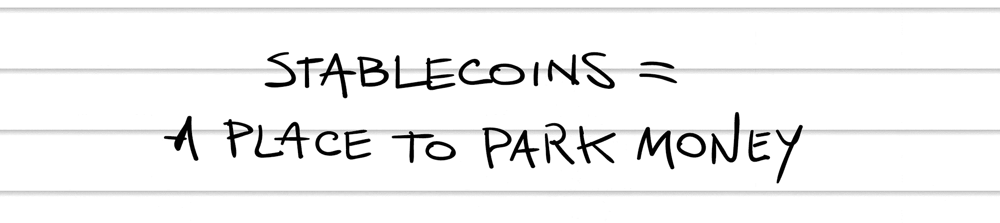

## 第十八章

## 无保留

直到我在联邦储备银行的地下室发现了自己，我才理解了“讽刺”这个词，那时我正在处理一个取代联邦储备的交易。

波士顿的联邦储备银行是一座庞大的 32 层大厦，不像斯坦利·库布里克执导的《2001：太空漫游》中的神秘建筑那样黑，而是白色的。站在这座建筑前，会感到谦卑和敬畏，而我不知怎的被邀请进入了其中。那是一次关于区块链技术的研讨会，美联储的一名高管发表了关于区块链如何改变全球金融市场的强有力的演讲。我发现很难集中精力，因为我一直在想一个念头：我他妈的在美联储里面。

美国联邦储备银行可能是世界上最强大的组织。它通过一系列多样且复杂的权力维持金融系统的稳定：设定利率、管理美国财政部、发行货币、监管私营银行，还充当“最后贷款人”。如果金融系统建立在信任之上，美联储可能是世界上最受信任的机构。

联邦储备银行是一家银行，但也是一个建筑——确切地说是 12 座建筑。而我现在正坐在波士顿分行的地下室，在这头野兽的腹中：食堂。

“我们正在推出一种新的稳定币，”我们的潜在客户通过视频会议解释道。

稳定币：一种与稳定资产挂钩的替代币，比如美元。稳定币为数字货币中“持有价值”提供了一种简单方式，无需不断转换成美元。

“那是什么？”皮特问。

稳定币，潜在客户重复道，这是一个快嘴的前货币交易员，已经全职投入区块链。“像比特币但稳定。与美元挂钩。”

“所以你买这种稳定币，”我澄清道，“它就能保持其价值？”

“对。我们的一种硬币值一美元。它不会像比特币那样波动。你今天看到价格了吗？”

“别提醒我，”我呻吟道。

“你能想象交易这东西是什么样子吗？”他继续说，“晚上你把钱放在哪里？你关闭所有头寸，把它全部转到比特币，这样你就能睡个好觉，第二天早上醒来，砰！价值减半。”

在我的 Moleskine 笔记本上，我写了：

“所以你的稳定币总是值一美元，”皮特澄清道。

“对。由黄金支持。如果你购买我们代币的一美元，我们有价值一美元的黄金作为支撑。”

“黄金在哪里？”我问。

“在一个金库里。”

“金库在哪里？”

他避重就轻地笑了。“藏在一个安全的地方。投资者将能够通过实时摄像头验证金库中的黄金，并通过区块链跟踪编号金条。”

“此刻，”我吹嘘道，“我周围环绕着巨大的保险库，里面存放着数百万美元的美元现金。我简直是置身于金钱之中。”

他反驳道：“但那笔钱没有内在价值，”自 1971 年以来，尼克松使美国脱离了金本位制。”

我回应道：“现在你有一种数字货币，许多人认为它没有内在价值，而这种货币再次由实物黄金支持。”

彼得大声笑了起来。“我简直不敢相信你在美联储的食堂里。”

“不幸的是，一碗汤要价 100 万亿美元，”我说。

“我们必须让公众了解我们的稳定币，”我们的潜在客户继续说道，无视我。“你能帮助我们制定一份营销计划吗？”

我告诉他：“你做的不仅仅是这些。你必须建立信任。投资者为什么应该相信你真的在你的保险库里有黄金呢？”

“因为它们将能够看到一个时间戳的——”

我反对道：“好莱坞魔法，”挥手让他走开。“登月。”

“但那些编号的金条——”

“前面屏幕的投影，”我打断他。

“区块链上的审计线索——”

“我们不是理性的生物。如果我们想要相信某件事，我们会坚持相信它直到生命的最后一刻。如果我们不想相信它，无论多少逻辑都无法说服我们。”

“嗯。”这引起了他的注意。“那么你怎样让人们相信它呢？”

“信任。”

“你怎么建立信任？”

这是一个新问题。事实上，这似乎是中心问题。这个问题是在中央银行提出的！

“信誉有助于，”彼得提议。“你长期做很多好事。信誉和可靠性。”

“我想这就像信任一个人一样，”我补充道。“信任需要时间。”

我们的潜在客户问道：“沃伦·巴菲特说了什么？”他说：“建立信任需要二十年的时间，而摧毁它只需要五分钟。”之类的话。^(36)

“你的二十年的时间现在开始了。”我微笑着说。“我们开始吧？”

他不耐烦地回答：“是的，让我们走吧。”

“我会为你准备好协议的，”彼得说，但他的话被站在我桌子旁的一个高个子保安打断了。

保安说：“你得关掉网络摄像头。”他不是在开玩笑：他没有说“先生”。

我对他们说：“我得走了，伙计们。”然后我挂断了电话。

我收起我的笔记本电脑，穿过安检门，金属探测器，和武装 guards，我在那里最后一次凝视了美联储的巨大金质印章：那只展翅欲飞的雄鹰。现在我仔细一看，它看起来有点像一个穿鸟衣的吉祥物。

我走出了波士顿区块链区的寒冷阳光，思考着尤瓦尔·诺亚·哈拉里关于金钱的观点。“信任是所有类型货币铸造的原料……，”他在《人类简史》中写道。“金钱是迄今为止最普遍、最高效的相互信任系统。”他接着说：“金钱是迄今为止最普遍、最高效的相互信任系统。”^(37)

再次被一种讽刺的想法所打动。每个人都谈论数字货币会取代美元，那我们为什么还要创建“稳定币”，而这些稳定币现在又是与美元挂钩的呢？这就好比宣称你要建立自己的国家，但前提是要得到现有国家的许可。

在宣布独立之前获得许可？在美国，我们并不是这样做的。

这就是我大脑中埋下的定时炸弹，现在我已经把它放在了你们的大脑中。美国的核心价值观有可能会被反用于自身。

从很小的时候起，我就被教导说美国为了摆脱专制的英国统治，进行了一场英勇的独立战争。但如果那种独立精神真的深植于我们的国家 DNA 中，那为什么不能将这种独立精神用来对抗美国本身呢？

我一边走过波士顿茶叶党博物馆，一边大声问自己：“独立真的是美国的价值观吗？”“独立不是人类的价值观吗？而且对独立的渴望不是比政府更高的权威吗？”我停下了脚步。“在我们追求独立的征途中，为什么我们需要寻求许可？”

这种思维方式肯定会带来麻烦。
