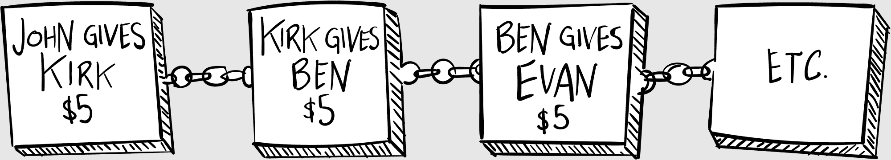
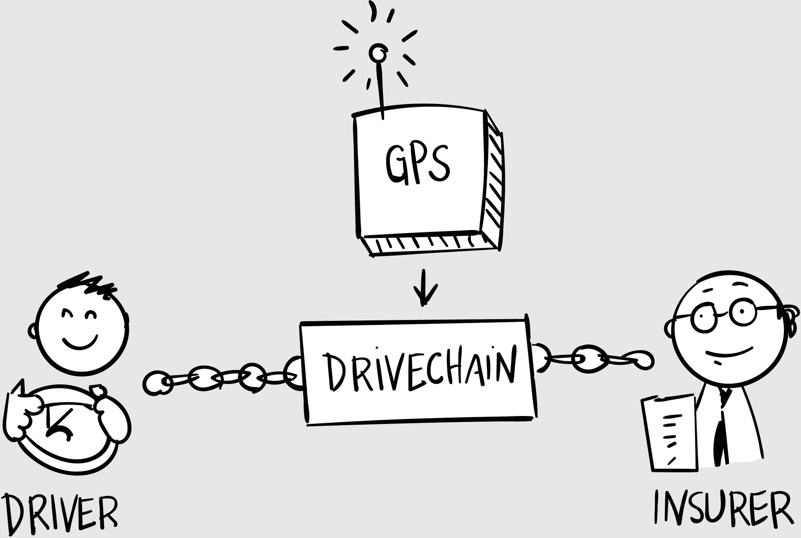
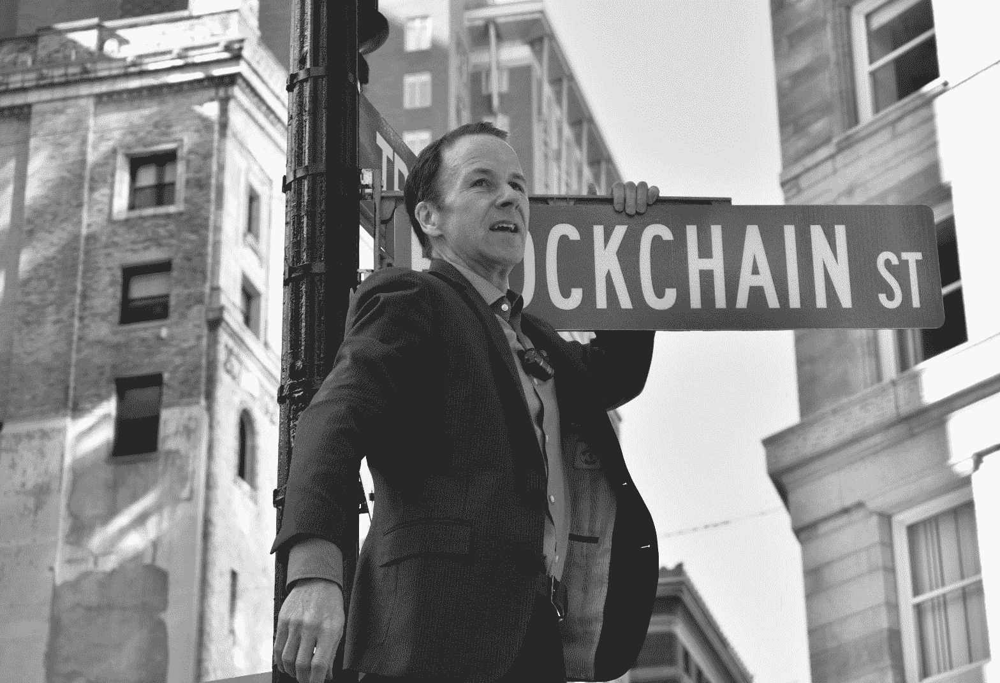

## 第二十章

## 在区块链与狂热之角

“嘿，大家！”我大喊道，“你们能小声点吗？我得接受这次采访！”

“抱歉，”尼克说，他关掉了 Lady Gaga 的《生来如此》。我们在波士顿的交通中穿梭，试图赶到我们的 9:00 a.m.活动，为波士顿区块链周揭开序幕。我们租了一辆巴士，把它变成了六个轮子的派对：区块链巴士。

我打开了无线耳机。“我是约翰。”

“约翰？来自国家公共广播电台的史蒂夫。现在还是个好时间吗？”

“和任何时间一样好。”我环顾四周，看着区块链巴士上的各种怪人和极客。我们移除了座位，挂了一个迪斯科球。早餐丰盛，有些人已经开始提前喝酒了。巴士外面，周一早晨高峰时段。

“太好了，”史蒂夫回答道，“让我先开始录音。”

“慢慢来。”我望着窗外，一个家伙正在疯狂地按喇叭，试图超过我们。巴士夹在车道之间，很快就变成了喇叭的交响乐。区块链巴士变成了堵车巴士。

显然，这些疯狂的事情都没有通过我的耳机传过来。“所以我会问你几个问题，”史蒂夫继续说，“我们编辑一下，让它变成大约十秒，然后在 NPR 的驾车时间播放。首先，告诉我们关于波士顿区块链周的事情。”

“用十秒来说？”我澄清道。

“或者更少。”

“这是一系列由波士顿区块链社区举办的活动。你知道，区块链是去中心化的，波士顿区块链周也是去中心化的。没有人拥有它。大家都贡献力量。”

“明白了。你能简单解释一下区块链是什么吗？”

“用十秒来说？”

他笑了。“或者更少。”

“不，不，我不能。”

“试试看。”

“开源数据。就像开源软件。比特币是开源货币；区块链是开源数据。”

“稍微展开一点。”

“用十秒来说。”

他笑了。“当然。”

“ just 想想区块和链。每次我们两个人交换钱时，我们在一块木头上写下交易。然后我们用链条连接这些木块，这样我们就可以看到交易的顺序。然后我们把它放在一个公共空间里，这样每个人都可以看到它并参与其中。”

“这就是你说的‘开源’。”

“这就是区块链。”

### 区块与链

我的朋友吉姆，一个同样擅长工具的极客，实际上做了这件事。他切了一堆木块，为每个朋友或家庭成员个性化设计了一个，然后用链条把它们串在一起。

他有点开玩笑，取笑围绕区块链的炒作，但不久后，这个项目走红了，数百人给他寄钱，以便在字面区块链上个性化他们的木块，就像人们会在当地公园买一块纪念砖一样。

他把钱捐给了慈善机构。他没有用它来启动自己的区块链木材公司。

为了形象化区块链系统，理解“区块”与“链”这一概念很有帮助。区块链不是一个物理“事物”，但有时你需要将它画得像一个实体。

例如，让我们假设有一个名为“DriveChain”的假设性区块链项目，旨在存储你的所有驾驶数据：你何时离开家，何时到达，开了多少英里，速度如何等等。假设你有一个小 GPS 设备可以自动追踪所有这些数据。

这是一份有价值的信息。一家汽车保险公司可以利用它，例如，为你开发个性化费率。（一个驾驶安全、不经常驾驶的人会比一个鲁莽、经常驾驶的人得到更好的费率。）

保险公司可以把所有这些数据存储在庞大的中央数据库中，这正是他们目前所采用的方式。但他们也可以把数据存储在区块链上，我们可以这样表示：

所谓的“区块”代表着区块链本身（即分布式账本），该账本的用户分布在两端。要记住账本是分布式的，意味着它被复制在成百上千台不同的计算机上。（没有人拥有它。）但是，为了简化，我们将其画成一个区块。

因为区块链通常是一个两边的市场——比如比特币，就有“买方”和“卖方”——我们将双方通过链条连接到区块上。而 GPS 装置，它只是向区块链提供你驾驶行为的数据显示，用箭头标出。

我们用这个简单的图表所做的工作是深远的：现在数据不再躺在某个保险公司的电脑上。现在它在一个共享的区块链上，多家保险公司可以访问，他们都在竞争，根据每个司机的风险档案，给出最好的费率。

盖可保险著名的口号是：“十五分钟可以让你在汽车保险上节省 15%或更多。”通过向保险公司提供更好的信息，区块链可以节省我们更多的钱。

我们上午 9 点前到达了我们的位置，很高兴地发现周一早上就有这么多人聚集。媒体渴望得到关于区块链的任何消息，尤其是像这样的奇怪新闻发布会。

我爬上了一架搭在那里的梯子的顶端——踩上了写着“不要站在这一步”的警告标签——并紧紧抓住街牌，以免掉下去。

“贝肯街！”我开始了，“美国历史的发源地。”站在梯子顶端，一阵风向我袭来，我晃动了一下，紧紧握住贝肯街的标志。

“就在这条街的尽头”——我小心翼翼地用空闲的手挥了挥——“是谷仓公墓，那里安息着伟大的爱国者，如约翰·汉考克、萨缪尔·亚当斯和保罗·雷维尔。往这条路走一小段就是马萨诸塞州议会大厦，那里是我们政府的所在地。这条街孕育了一个国家！”

一辆警车慢慢地驶过，我紧张地看着它。我们并没有得到做这件事的明确许可。

“贝克顿街是美国历史的发源地。非常适合，它也是波士顿区块链场景的诞生地。这就是为什么今天我们重新命名贝克顿街……”

我们媒体淋浴团队的温迪递给我新的街牌。它看起来很棒。

“. . . 到区块链街！”

街牌完美无瑕。我不知道温迪是怎么做到的——那枚压印的绿色金属，那干净的白色字母——当我把它拿去和原来的街牌对比时，它完美地契合。

当我们将新街牌放在旧街牌上方时，人群欢呼。我们用魔术贴做好了准备，以便容易取下。我四处寻找警察。到目前为止，一切顺利。

“为区块链干杯！”我高举拳头大喊。“hip hip, hooray!”我击打空气。 “Hip, hip, hooray!”再一拳。“Hip, hip, hooRAGHH!”我的梯子塌了，我疯狂地抓住街牌，离人行道八英尺高。

在坠落之前。

“你能相信今天的媒体报道吗？”那天晚上皮特 later 嘲笑我。我们再次挤在区块链巴士里，舞池在跳跃——字面上，因为巴士偶尔会碰到坑洞。

“自从互联网泡沫时代以来，我还没有这么开心过！”我大声说道，以便在大迪斯科音乐中被人听到。

“这太棒了，”皮特同意。“每个人都想要曝光！我们桌上有这么多交易。”

“我们实际上正在将这家公司转变为一家区块链媒体公司！”

皮特举起啤酒，向我手中的牛奶酒杯敬酒。我们一饮而尽。

“我们到啦！”我大喊。

“是的，事情进行得很顺利。”

“不，我的意思是，我们到啦！”我指了指窗外。

“本次停车，”DJ 通过音响系统流畅地宣布，“是历史悠久的区块链街牌。你们读过关于它的报道；你们在电视上看到过它。就在今天早上命名，历史悠久的区块链街牌。”我们笑着从巴士里涌出来，欣赏我们的作品。

街牌不见了。

不仅仅是我们的区块链街牌被粘上了：整个街牌都不见了。就像有人偷走了历史。再也没有区块链街了。再也没有贝克顿街了！

“有人偷了吗？”皮特想知道。“作为纪念品？”

我无言以对。这究竟是什么意思？

“好极了！”我说，把所有人都推进巴士。“没什么好看的！字面上，这里真的没什么好看的。”

我们的 DJ 开始播放音乐，巴士司机关上门，我们很快再次出发。皮特和我沉默了一会儿，各自陷入了沉思。

“也许我们应该征得许可，”我承认道。

皮特咯咯地笑。“可能只是些孩子把它拿走了，”他最后说。“再来一杯？”他晃了晃牛奶桶。

我看着牛奶感到厌恶；这个晚上被糟蹋了。

“你的下一个派对，”巴士司机大声喊道，打开车门，“由 Pillar 风险投资公司赞助，打造下一代区块链科技公司！”人群像狂欢者一样涌出，涌入俱乐部。皮特和我跟在后面，但有什么东西阻止了我。

“我一会儿就到，”我对皮特说，示意他进去。我注意到派对外面有一个老朋友正在随意聊天，与另一位投资者交谈。

“马丁？”我小心翼翼地打断他们的谈话，走近他们。

“约翰！”他看起来真的很高兴见到我。他的卷发在微风中轻轻飘动，仿佛在打招呼。

我向他的同伴做了自我介绍，他是波士顿科技圈另一位的天使投资者。“马丁，我下周给你打电话，”他说着从服务员那里拿回了他的钥匙。“很高兴见到你，约翰。”他钻进他的特斯拉，开走了。

“这是你的吗？”马丁扬起眉毛问道。他点头指向印有巨大比特币市场杂志标志的巴士。

“当其他人都在摇摆时，你必须直行。”我微笑着说。

他说：“围绕区块链的炒作，在我看来你是在当其他人都在直行时你却在摇摆。”他的卷发上下摆动，仿佛在表示同意。

“我正在重新发明，马丁。那是你的建议。‘曲棍球棒式增长’，记得吗？”我亮出了空心引号。“‘带你到这里的东西不会带你去那里。’”

他坦白承认。“这听起来确实像我。”

“而且我正在找到它，马丁！”我兴奋地宣称。也许是我喝多了在说话。“我在这方面变得很擅长。”

“‘这个’具体指的是什么？”他用手指强调了“这个”一词。“开巴士？”

“不，不是……。”我努力解释着。“让区块链变得有趣。容易理解。容易使用。容易投资。”

“那里有钱吗？”

“有一股🔥般的水流，”我自信地回答。“我从未见过这样的场面。”

“那比特币今天的价格是多少？”

“大约 8800 美元。”

马丁吹了声口哨。“从 20000 美元降到 8800 美元，大概四个月时间？”

我承认道：“这是一个过山车。高潮很高，低潮也很低。”

“你还不认为这是一个泡沫吗？”

“区块链是未来。我拿我的公司打赌。”

他严肃地看着我。“这就是我担心的。”
