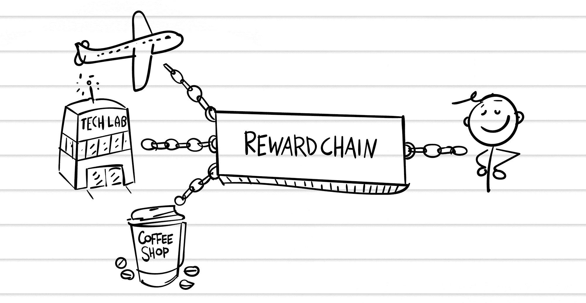

## 第二十五章

## 打破链条

这是一个非常盛大，非常英国的日子。伦敦市市长要来 TechLab！

世界上历史最悠久的办公室之一，伦敦市市长是伦敦市商业和个人代表和促进的当选职位。市长带着一个银行和金融领袖代表团来到我们的孵化器，了解区块链。

我们对这次活动做了充分的准备，安排了一个波士顿最优秀和最聪明的人组成的评审团。我整夜都在准备我的演讲。我正在 TechLab 的公共区域安排最后的细节，那里的工作人员正在摆放食物，这时本尼迪克特走过来找我。

“我能和你谈谈吗？”他问。

我站起来对团队说：“让我们确保今天这个房间是个热闹的地方。”我转向本尼迪克特，他奇怪地没有微笑。“大日子！”我大声说，拍拍他的肩膀。

“我们谈谈吧。”他把我领进一个小会议室，我们拉出椅子。仍然没有微笑。这很糟糕。

“你看起来很累，”他开始说。

“嗯，谢谢。”我微笑着说。“每一天都让我们离死亡更近一点。”

“听着——”

我打断他说：“实际上我很高兴我们能谈谈，因为我有一个想法。”

他犹豫了一下。“好吧。”

“这个区块链孵化器是城里的话题，”我告诉他。“上周我联系了硅谷和伦敦的 TechLab 办公室。他们两个都想在他们所在地建立区块链中心。”

“是的，我听到了。”

“但昨晚我有了一个更大的想法，一个能将 TechLab 市场价值翻倍的想法。”我拿出我的 Moleskine 笔记本。“你知道我们有多 TechLab 积分，对吧？”

“是的。”

“每个月你支付会员费，你就可以得到 TechLab 的积分，你可以用来预订会议室或在全球任何 TechLab 购买食物。这是一种货币。我们已经有自己的货币了！把 TechLab 积分放在区块链上，让它成为一种数字货币。”

我打开我的 Moleskine 笔记本。“这是我在 4:00 a.m.想到的，但我把它做成幻灯片，这样我们就可以向你们 CEO 展示了。”

### 一个有奖励的想法

如果区块链是一种让我们分享价值的技术，那为什么不让我们一起分享那些有价值的奖励积分呢？常旅客里程、咖啡卡、购物积分——这些都是“虚拟货币”，企业创造的小型经济系统，用来鼓励你的忠诚。

你的钱包里可能装满了这些卡片。咖啡积分：买九杯咖啡，第十杯免费。超市积分。汽油积分。零售商积分。信用卡积分。

如果我们解放所有这些积分会怎样？

想象一下，你正在尝试用积分预订假期。你有 40,000 分，但你需要 50,000 分才能买到票。航空公司会以荒谬的价格卖给你 10,000 分，但如果你能在公开市场上买到这些积分呢？

更好的是，如果这些积分可以互换呢？如果你能放弃 10,000 个超市积分，从而得到 10,000 个常旅客积分作为回报呢？

在幕后，一个区块链（我们称之为 RewardChain）将“购买”你手中的 10,000 超市积分，然后将它们转换成一种通用代币（我们称之为 RewardCoin）。然后你使用你的 RewardCoin 购买你需要的 10,000 航班积分。

想象一下，这就像在货币兑换亭将美元兑换成英镑。货币兑换公司实际上是在“购买”美元和“出售”英镑，但这一点是隐形的：你看到的是美元被兑换成英镑，减去服务费。

RewardChain 将需要公司的投资，因为大多数公司不允许客户之间互相转移积分。但 RewardChain 的收益将超过风险：每个参与像 RewardChain 这样的去中心化市场的零售商都会接触到更多的购物者。这就像一个购物中心。

确实，零售商将不得不仔细管理他们忠诚积分的兑换率，以免在免费咖啡和免费航班上赔钱。这不容易，但那些首先解决这个问题的人将会得到丰厚的回报。

本尼迪克特打断了我。“听着，你是个有魅力的演讲者。但今天是你在 TechLab 的最后一天。”

全面打击。我盯着他，惊呆了。

他继续说，“这行不通。我们不适合。”

“我们不适合。”我无声地说。

“所以我们希望您的公司能立即开始清理您的办公室。我们的安保团队会帮助您搬走您的物品。”

“安保，”我重复了一遍。“因为我们如此危险。”

“他们会帮你使用安保电梯，我们可以悄无声息地处理这件事。”

“安保？真的吗？”这真是一个晴天霹雳。我刚刚在巷子里被打晕，然后我的袭击者觉得他应该往我身上倒垃圾。

“作为我们协议提前终止的补偿，我已被授权提供这份补偿。”他推了一份释放表格给我，指了指表格底部的一个数字。

我吞了吞口水。

“我们可以告诉所有人我们决定各自走各自的路，”本尼迪克特继续说，把一支笔放在我面前。

“倒退。”我摇了摇头。“发生了什么事？”

他叹了口气。“看看，这些无休止的访客。街牌。录像工作室。你总是在未经允许的情况下做这做那。你表现得就像你拥有这个地方。”

”嗯，我确实帮你找到了你一半的租户。”

我们感激这一点。但是，这个地方你并不拥有。”

“我知道。我付你钱，记得吗？”

“我们将按比例退还您剩余的月度会员费——”

“等一下。”我浏览了一下法律术语，试图理智地思考。“这里有一个保密条款。所以你是想用钱封我的口？”

他皱起了眉头。“我不会那么说。”

我问，“你认为，回顾过去，这会是你职业生涯中最大的错误吗？”

“只需签署协议”--他把笔推给我--“然后我们就可以各走各的路了。”

我看着他们提供的数字。这很诱人。“如果我不同意呢？”

他犹豫了一下。“你还是要离开。”

“你知道外面正在发生什么吗？”我激动地说。“伦敦市长即将抵达，他们正在寻找建立自己的区块链孵化器的最佳实践。所以如果你想做区块链演讲，那就请便。”

他咬紧激光雕刻般的牙齿，形成完美的牙列。“我想要你在今天结束前离开。”

“还有一件事。”我把合同撕成两半。“我是不会被收买的。”

我走进一个私人办公室，把自己锁在里面。我要告诉每个人什么？我们将何去何从？我们如何重建？这个区块链孵化器，精心设计来培育这些小鸟，已经被速冻。因为本尼迪克特拔掉了电源插头。

我擦去眼泪，为即将到来的两小时区块链研讨会做好了准备，这将是我的职业生涯中最重要的时刻之一。我练习开场白时声音哽咽了。“现在是最伟大的时代。”
