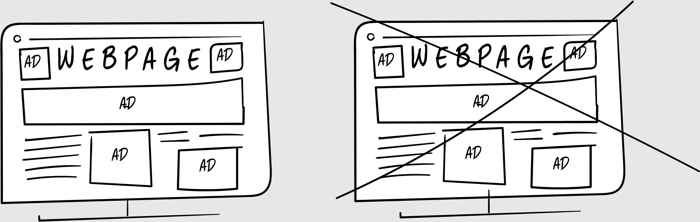

## 第二十六章

## 泡沫破裂

在接下来的几个月里，我们成了办公室大堂的真正鉴赏家。

如今波士顿的每一座金融大楼楼下大堂都有一家咖啡店。位于金融中心的一号星巴克繁忙但拥挤；位于联邦街 100 号的蓝瓶咖啡空气流通但寒冷。今天我们的团队剩下的成员围着我们的笔记本电脑取暖，而冷雨像薄纱一样在外面倾泻而下。

我看着我们这群数字游民，我的公司剩下的全部。没有人愿意接纳我们，因为共享工作空间害怕“加密货币”这个词。我们使用的邮件服务提供商 Mailchimp 已经取消了我们的账户，因为我们使用了“比特币”这个词。他们不必担心：比特币的价格正在暴跌，投资者正在逃离。

“一线希望，”我向皮特提出建议。“一个销售线索。看起来是真的。”

我把笔记本电脑转过来，这样我们两个都可以看到邮件，把字体大小调整为 300%为了皮特。我读道：“我们希望 Media Shower 能帮助我们推广我们新的区块链代币 PowerUpCoin，”我说，“随着更多人加入，它的价值会增加。”

“所以这是一个金字塔计划，”皮特回应。

“这不是一个金字塔计划，”我争辩说，从网站上读取内容。“PowerUpCoin 旨在通过交易燃烧代币来随时间增加价值。交易越快，燃烧的代币就越多，价格涨得越快。”

燃烧：永久销毁区块链代币。例如，燃烧可能用于减少供应，试图刺激更高的价格。把燃烧想象成创建代币或“印钞”的相反行为。（参见《金币人寓言》，第 268 页。）

“投资者被烧得越多，”皮特咕哝着。

“所以他们试图创造更多的稀缺性，让更多人使用代币，直到……什么？”我陷入了沉思。“只剩下一个人？”

“就像一个金字塔计划，”皮特重复了一遍。

“网站看起来是合法的，”我回应，点击着页面。“但代币实际上做什么？”

“这就是难点。”皮特指出。“一切都是那么新。你看这个网站，甚至你也认为它是真的。看看这个：‘我们内置了反欺诈预防措施，确保每个代币的完整性。’这到底是什么意思？”

“看起来代币什么也不做，”我泄气了。

“甚至连标志都看起来像一个金字塔！”皮特指出，笑着。

“不，它像一个向上的箭头。”我眯着眼睛。“你知道，PowerUpCoin。”

“这是一个金字塔！”

“我们管道里有没有真正的东西？”我问道，揉了揉眼睛，颤抖着。

“这就像是一片混乱，”皮特回答。“全是噪音，没有信号。”他把笔记本电脑转过来面对我。“这是我们销售管道。过去一个月有 200 个潜在客户。也许其中有两个是真的。”

“人们想要什么？”我问。

“他们都想要在比特币市场期刊上购买文章。”

“我不会这么做，”我断然表示。

“我知道。但这就是这个行业的运作方式，约翰。所有其他的区块链网站都是付费参与。给他们发送一个比特币，他们就会写一篇关于 PowerUpCoin 的好文章。”

“我们必须建立信任，”我坚持道。“在区块链中，那些建立信任的人将会繁荣。那些不建立信任的人将会消亡。”

“也许该重新考虑广告了，”皮特建议道，这已经是他第 N 次这么说了。

“广告就是一个烟囱。我们吸了一口，我们将永远离不开。”我又开始了我的演讲。

### 停止广告狂潮

纽约时报科技专栏作家法哈德·曼朱在他的最后一篇专栏中写道，“互联网广告业务几乎存在于网上的一切糟糕事物之中。”^(46)

广告会打断你的体验，拖慢你的电脑速度，甚至让你的浏览器崩溃。广告以追踪代码的形式安装间谍软件，这种代码被称为“cookies”（其本身就是一个具有误导性的术语，因为 cookies 是指美味的饼干）。然后公司追踪你的每一个动作，这就是广告如何在互联网上跟随你的原因。

在区块链投资领域，许多网站如果你购买它们的广告，就会写出更好的文章，或者给你更多的报道。我们部分不信任媒体，其中一个原因就是我们不知道什么是编辑内容，什么是广告内容。

所有这些问题都归结于广告。

原本不应该是这样的。万维网的原始建筑师们认为，微支付——不足一美元的支付方式——将是网络实现货币化的方式。

你大概熟悉“404 错误”，即在互联网上找不到某个页面。而“402 错误”是要求支付时出现的错误。402 错误比 404 错误出现的还要早。你有没有见过 402 错误？没有，因为我们没有实现微支付。我们得到了广告。

已经有不少微支付系统尝试过并失败了，原因在于比特币先驱尼克·萨博所称的“心理交易成本”。^(47) 如果继续阅读纽约时报文章需要花费 25 美分，你必须心理上把它与其他文章、其他网站、你可以用 . . . 等等比较。算了吧：我还是去检查 BuzzFeed 吧。

我们越是要考虑为某样东西付钱，我们越是不可能付钱。这就是亚马逊发明一键订购的原因。再没有比这更低阻力的购物方式了——直到杰夫·贝佐斯发明了 1-Thought（1-念购物帽），这种联网帽子会在你想要某样东西时立刻为你购买。

如今，订阅制比微支付更有效，因为它消除了心理阻力。一次付费，畅享所有内容。纽约时报：随便阅读。HBO：随便观看。

但区块链可以使微支付变得不可见。我将简单地用童话故事来解释这一点。

* * *

以马萨诸塞州收费公路为例。这是通往波士顿的主要高速公路，是一条收费公路。在过去，这里有收费亭，这会导致交通堵塞，并让所有人都心生怨恨。你已经在高峰期的交通中通勤了，现在你还得付钱使用这条道路。

收费站的收款员有着世界上最好的工作，每天都要应对脾气暴躁的通勤者，所以他们也很暴躁。在童话故事里，你知道那个守护桥梁的巨魔会说，“三个金币！”吗？他为什么总是脾气暴躁？因为他要应对所有的通勤者！

然后，几年前，他们拆除了收费站。消失了。现在你的车里有一个小装置——一个 transponder——它会自动从你的账户中收费。我说的不是自动收费站。没有亭子。

这就好像他们移除了巨魔，用一个装有雷达的机器人取而代之。你甚至不知道这件事正在发生。你有一个在线账户，你往里面充 50 美元，它就从那个账户中扣除。零摩擦。它是隐形的。它是惊人的。

这是卓越的工程，这就是基于区块链的微支付可能的样子。

区块链可以帮助我们停止广告。

让我们想象一个名为 ContentChain 的项目，你可以购买一种叫做 ContentCoin 的代币。你用 50 美元装满你的 ContentCoin 账户，当你浏览网页时，它会无缝地从你访问最多的网站中提取 ContentCoin，并将其偿还给出版商。^(48)

为了使这些想法奏效，我们需要一个开源的区块链，让出版商容易使用，也让用户容易安装为浏览器扩展。最重要的是，我们必须有精彩的内容。这就是 Netflix、Amazon 和 HBO 不通过广告建立伟大网络的方式：通过制作如此精彩的内容，人们愿意购买。

“对，”皮特说，“但我们现在需要收入。那么广告怎么样？”

“不好意思打断，”贾德帮忙补充说，“但我们刚刚又失去了一个客户。”

又是一锤子的打击。“为什么？”

“他们要把工作内部化了。”贾德皱着眉头读着邮件。“还有，他们看到我们正在用区块链朝另一个方向发展。”

当我看着雨点在外面猛烈地敲打时，我想象着我们的公司飞机正在失去高度。闪电在机鼻锥周围闪烁，它开始擦过树梢，寻找降落的地方。我想象着自己在一群通勤者和乘客之间奔跑，试图在飞机坠毁的同时还服务饮料。

我的鞋子还是湿的，我开始颤抖。

皮特注意到了。“给你拿个热身饮料来，”他说。

“我喝咖啡喝得够多了。”

“我买，”他回答说，笑着。“只要我们在工作，就得继续买东西。”

我们离开了团队，皮特低声说道。“听着。我不知道该怎么开口，所以我就直说了。”

我的心脏猛地一沉，但我保持着镇定。“出了什么事？”

“我得到了另一份工作。”

“哎呀。”我抓住附近的一张椅子以寻求支持。

“我知道新业务比预期进行得更慢……”

“我不知道该怎么开口，”我回答说，“所以我就直说了。我今年还没有领过工资。”

“哎哟。”皮特和我都坐了下来，离其他人远远的，听不到我们的谈话。

“我真的很以为我们要去月球呢，”皮特说，脸上带着微笑。

我想到了月亮，不知道这一切最后会如何收场。现在，我们只是在努力确保这个东西不要在发射台上爆炸。
