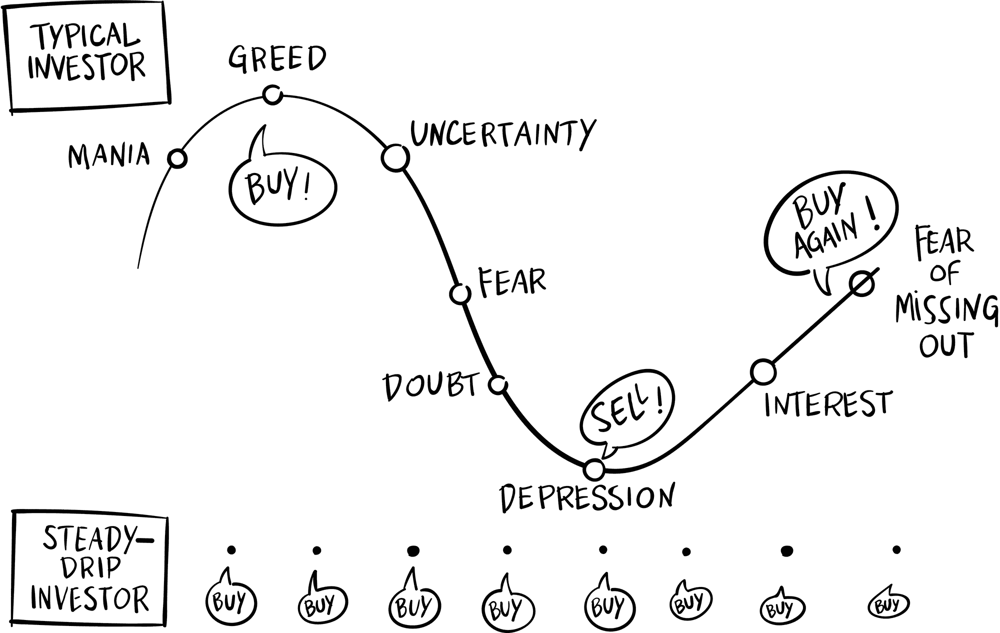

## 第二十七章

## 私人物品

我的生活充满了讽刺。此刻，我正在伦敦的区块链会议上发言，却完全无法将区块链发展成业务。本身建立在去中心化想法上的区块链行业，似乎在没有中心化政府的许可下，无法向前迈进。

而我最信任的顾问是一个加拿大人。

“大概有一年了吧？”理查德·卡斯特莱因穿着他标志性的黑色 T 恤，黑色的头发向后梳成一个斜坡，这样问道。

“感觉像一个十年。”我握着他的手摇了摇。

“那是区块链时间，”我坐下时他注意到了。“这个行业的一年相当于其他地方七年。这就像狗年，对吧？”

“嗯，”我回答。

“所以你一直很忙。我在领英上到处看到你。”

“一方面，事情从未像现在这样好过。这太疯狂了。我拿到了一本书的合约。”

“恭喜你！”

“另一方面，这是一个噩梦。我们在区块链业务上就是无法获得动力。”

“你在做什么？”

“一切。”

“嗯，也许问题就在这里。也许你做得太多了。”

“我确实做得太多了。”我们坐在会议中心的午餐区，我打开沙拉开始吃。“你呢？”

“刚刚开始了一个去中心化影业公司。这就像电影界的 Kickstarter。你可以通过投资我们的代币来资助一部新电影，随着电影的的成功，代币的价值可能会增加。这让大家都能投资于他们关心的创意想法。”

“这是个好主意，”我突然感到非常饿。“也许我们会把我的书改编成电影。”

“是的，还有弗朗西斯·福特·科波拉也参与了。非常令人兴奋。”

我愤怒地把沙拉塞进嘴里。他怎么说服了弗朗西斯·福特·科波拉？

“所有这些都很简单，”他说，“其实关键在于建立社区。”

我在咀嚼沙拉的同时思考着这件事。

“区块链是关于人的，”他再次告诉我。“让他们加入你的区块链，你的代币的价值就会上升。如果你不这么做——没有摩擦，没有交易——价值就会下降。我只是帮助人们建立这些社区。”

“我们正在努力建立一个区块链投资者的社区，”我在咀嚼食物的时候说道，“但当比特币价格下跌时，他们都逃之夭夭。”

“听起来没错，”理查德笑了。“这不是任何市场的样子吗？但总是有机会的。”

“哦，不。”我恐怖地看着我的沙拉。

“什么？”

“那是松子吗？”

“松子是什么？”

“我对松子过敏。”

“你是指花生？”

“不，是松子。来自松树。哦，男孩。谁会在贸易展的沙拉里放松子？”

“嗯，你确实在欧洲。”

“哦，不。”我把头放在桌子上。“我半个小时后就要上台了。”

“你需要我给你叫救护车吗？”

我拿出手机，搜索了“过敏性休克反应时间”。三到三十分钟不等。

“你想去洗手间吗？把手指塞进喉咙里？”

“也许我没有吃松子，”我满怀希望地说，在沙拉里翻找。

“吃它们会发生什么？”他问。

“坏事。”我回想起几十年前的一次急诊室就诊。我勉强及时赶到医院，面部肿胀，肺部关闭。那是八小时的恐怖表演。

“你带 EpiPen 了吗？”

“在我的酒店房间。”我的思绪疯狂地乱转。“那里的床有 20 年了。”

“我认为我们应该送你去医院。”

我坐了一会儿，扫视我的身体，寻找任何反应的迹象。没有瘙痒。没有肿胀。没有呼吸急促。也许我运气好。

“我要去做这场演讲，”我决定道。

“半小时内？那太疯狂了，”理查德笑道。“想象一下你在讲台上突然休克。”

“我大老远来到伦敦，我得上那个舞台，”我发誓道。

理查德看着我挑起眉毛，仿佛在说，那是你的葬礼。

“ ‘我应该买比特币吗？’ ”我半小时后对人群说道。“这是我们经常从初学者区块链投资者那里听到的最多问题。我不是财务顾问，所以不能给你建议，但答案是肯定的。”

人群轻笑起来。如果我看起来没有平时那么生动，那是因为我在监控我的嘴唇和舌头是否有致命过敏反应。口部和面部会是首先受影响的，随后是肺和心脏。我已经找到了最近的医院，并将电话设置为快速拨号。

“简单答案是肯定的，”我补充道。“像[Coinbase.com](http://Coinbase.com)这样的服务买一点比特币——即使只有 100 英镑——这样你就有了一些参与感。购买的过程会很有教育意义。你会开始关注它的价格。很快你会在区块链上阅读所有你能找到的信息，你的朋友会求你闭嘴。”一阵笑声。

我切换到一张展示本杰明·格雷厄姆经典著作《聪明的投资者》的幻灯片。“这是本杰明·格雷厄姆，教沃伦·巴菲特如何投资的人。他发明了‘价值投资’的概念，我们将它带入比特币时代。”

一只手举了起来。“沃伦·巴菲特称比特币为‘老鼠毒药’，”一个魁梧的络腮胡男士说道。

“老鼠毒药平方，”别人帮忙说道。

我的嘴巴发痒。或者说呢？恶作剧还是生病？

“老鼠毒药平方，”我重复道。“那是老鼠毒药乘以老鼠毒药。但如果我们用老鼠毒药除以老鼠毒药，我们得到一。”这毫无意义。“我对巴菲特先生充满敬意，但我恭敬地不同意。我可以继续吗？”

沉默。我能感觉到我的心在跳动。是紧张还是紧张性休克？

稳定滴灌投资：无论市场状况如何，每个月投资相同金额。

也被称为“美元成本平均法”，它使你免受情绪化投资的影响。

“任何区块链投资策略的第一步是每个月投资相同金额，”我继续说道。“决定你能承受的投资金额——不管是 50 英镑还是 5000 英镑——并每个月留出这笔钱，最好是通过自动扣款。

这个过程在美国被称为美元成本平均投资，在英国被称为英镑成本平均投资，但我称它为稳定滴水投资。当市场上涨时，你的月投资购买的较少。当市场下跌时，它购买的较多。但你通过这种缓慢而稳定的滴水，滴水，滴水的方式平均投资。

胖胖的又举手了。“美元成本平均投资是行不通的，”他不屑一顾。“上网搜一下。再也没有人建议那样做了。”

我开始冒汗：一个不好的征兆。垂死挣扎还是倒下死去？ “有很多研究将一次性投资与稳定滴水投资进行比较，”我同意道，“所以如果你今天有 100,000 磅可以投资，那就尽管去吧。你有 100,000 磅吗？”

人群中有些笑声。我并没有打算双关语的含义。

“对我们大多数人来说，我们必须在挣钱的同时进行投资，”我继续说。“IRA 储蓄账户不过是你在退休组合中稳定滴水的投资方式？工资单上的自动提款？稳定滴水投资。”

现在我肯定是在冒汗：稳定滴水在我投资中。 “从学术角度来看，一次性投资是最好的——但我们的生活不是在学术界，而是在现实世界。而且我们大多数人需要投资纪律的帮助。每个月一点，滴水滴水。稳扎稳打赢得比赛。

“更重要的是，”我顽强地说，“每个月投资相同金额可以保护你免受自己的伤害：你不会陷入其他投资者的狂躁抑郁情绪波动，也不会陷入加密货币疯狂的过山车。稳定滴水投资是一种强大的心理优势。

“当人们问你区块链市场做得如何时，你可以用金融专栏作家杰森·兹威格所说的对价值投资者最有力的七句话回答：‘我不知道，而且我也不关心。’”^(49)

我用纸巾擦了擦额头。“我的愿景，”我的视线模糊地说，“是我们将拥有一个用户友好的区块链投资服务。每月从你的银行账户自动提款。自动分配到顶级山寨币。如此简单，连你奶奶都能操作。区块链面向每个人。”

是时候走了。我没有留下来回答问题，只是拿起我的包朝会议中心的门走去，边跑边叫了一辆优步。

* * *

当你面部肿得像番茄一样走进急诊室时，他们不会让你等待。他们确实给了我一份表格，我毫不犹豫地签了字。他们把我匆忙推进一张床，我立刻就有医生在检查我的生命体征。

“你吃了什么？”他问。

“Pide duts.”

“花生？”

“Pide duts，”我吐出。我的舌头又厚又肿。“从 da pide 树上来的。”

“你吃了树上掉下来的坚果？”

“我觉得我要晕过去了，”我告诉他。我有一种站得太快时的头晕感觉，只是我躺在床上。

“你的血压危险地低，”他说，猛地抓住我的皮带，将我的裤子猛地拉到脚踝周围。

就在那一刻，我身边的帘子拉开，露出了两位性感的英国护士。我敢肯定她们并没有试图性感，但在我即将陷入昏迷的状态下，那就是我看到的。我穿着最尴尬的三角内裤，不那么紧，也不那么白。

医生在我的大腿上注射了肾上腺素，我几乎立刻感觉好多了。这太神奇了。“那是一种神奇的药物，”我惊叹道。

“你的身体正在全力以赴地对抗过敏原，”他说。“我们会给你一些苯海拉明。”那些性感的护士们跑开了，身后关上了帘子。

“苯海拉明？”我问。 “只是肾上腺素笔和苯海拉明？”

“你真幸运能来到这里，”他说。“你坐 Uber 来的吗？”

“你说对了，”我继续说道，只是一半意识到自己在说什么，“你不必在传统数据库中存储敏感的医疗数据。你知道区块链吗？”

“吃这些，”他说，递给我几颗药。“别说话。”

### 隐私是一项人权。

在我们看医生的时候，我们希望保持隐私，因为我们的私处实际上是被暴露的——那么为什么我们不对我们的医疗记录提出同样的隐私要求，在那里，其他一切都被暴露出来呢？

我们的医疗记录是我们最私人的信息，它们应该是我们的个人财产。这也适用于我们所有的其他私人信息：我们的身高、体重、婚姻状况、种族、财务历史等。未经我们的允许，任何人都不应该有权访问这些信息。

身份识别是一个痛点。我不相信普遍的识别标识，因为它们可能导致监控和其他问题。但是，有了区块链，你不需要政府发行的身份证：人们可以成为自己的密码。^(50)

—约翰·亨利·克利彭杰博士，麻省理工学院媒体实验室

想象一下，当一个年轻女性去酒吧时，她必须向一个头脑简单的门卫出示她的驾照，上面有她所有的个人信息。门卫只需要核实她的出生日期，但女人的驾照暴露了所有信息——包括她的家庭住址。

现在想象一下门卫把她的家庭住址输入到电子表格中。这样做几周后，他把电子表格卖给其他门卫，帮助他们更好地“处理”。现在每个门卫都知道她住在哪里。

多年来，信用报告公司 Equifax 收集的信息远远超过我们假设的门卫。该公司收集了数百万美国人的个人财务数据——出生日期、社会保障号码、薪水——而这一切都是在未经许可的情况下进行的。

然后，在 2017 年，当黑客攻破了 Equifax 的中央数据库时，它至少泄露了 1.43 亿美国人的私人数据。^(51) 罪行不仅仅是黑客窃取了数据。罪行也是因为 Equifax 被允许最初收集这些数据。

“身份盗窃”是一个每个人都熟悉的流行词汇，因为它发生的频率如此之高。区块链提供了一个解决方案，就是身份代币。让我们设想一个新的区块链应用程序，名叫 IdentityChain，在那里你可以安全地上传你的所有个人详细信息：从你的医疗记录到你的工作经历，一切信息。

身份信息：你的个人信息，比如你的出生日期、家庭住址、国民身份证号码等等。

当提供商需要这些信息时，你可以与他们分享——要么免费（比如你的医生），要么收费（比如信用报告机构），然后他们用身份币支付你。

隐私是一项人权，因为没有人希望自己的私处被暴露。

“你为什么不休息一下，”那位英国医生说，他看起来仿佛沐浴在光芒之中。我感到晕乎乎的，低头看了一眼毯子下面，我的裤子还堆在脚踝处。

“大白痴，”我窃笑。

“那是什么？”

“晚安，晚安。”我很快就睡着了。
